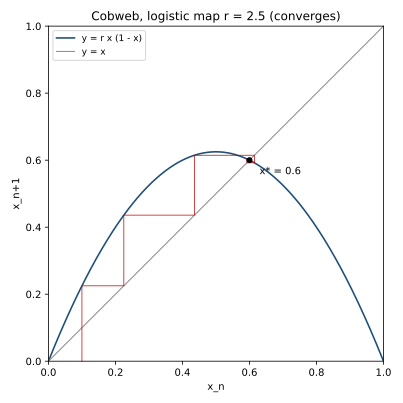

# ch05 — 同一條遞迴式：xₙ₊₁ = r·xₙ·(1 − xₙ)

> **本章解決什麼問題**：前四章都在講概念——決定論、敏感依賴、三條獨立的軸。從這章開始，我們把這些抽象主張全部押在**一行式子**上，反覆審問同一個對象。這章正式介紹全書脊椎：邏輯斯諦映射（logistic map）xₙ₊₁ = r·xₙ·(1 − xₙ)。它只是一條「拿這次的值算下次」的回授迴圈，只有一個旋鈕 r。本章只到「會收斂到一個值」的直覺，教你怎麼讀蛛網圖（cobweb），並預告轉動 r 會看到的全劇情；正式的穩定性分析留給 ch06、分岔留給 ch07。

```text
全書地圖：一條遞迴式，從秩序走到混沌，再走回來

  Part I  鐘錶宇宙的裂縫 ........ 決定論的夢，與第一道裂縫
     ch01 拉普拉斯的惡魔
     ch02 龐加萊的三體問題
     ch03 蝴蝶效應（勞侖次）
     ch04 決定論 不等於 可預測
        |
        v
  Part II  一條遞迴式裡的宇宙 ... 脊椎：xₙ₊₁ = r·xₙ·(1−xₙ)   ◄ 你在這裡
     ch05 同一條遞迴式
     ch06 不動點與穩定
     ch07 倍週期分岔
     ch08 費根堡普適性
     ch09 混沌登場與秩序孤島
        |
        v
  Part III  混沌的肖像 ......... 混沌長什麼樣子
     ch10 相空間
     ch11 奇異吸子
     ch12 碎形與自相似
     ch13 碎維度
        |
        v
  Part IV  為什麼測不準 ........ 不可預測的機制與極限
     ch14 Lyapunov 指數
     ch15 可預測的地平線
     ch16 拉伸與摺疊
        |
        v
  Part V  與混沌共處 .......... 分辨、駕馭、收束
     ch17 混沌 不等於 雜訊
     ch18 駕馭混沌
     ch19 同一條遞迴式，現在你懂它七層
```

接下來五章，你會盯著同一行式子看五次。每一次轉一點旋鈕，它就換一張臉：穩定、振盪、倍週期、混沌、秩序孤島。如果一本講混沌的書只能留給你一件東西，我希望是這條式子，外加「我親手轉過那個旋鈕」的記憶。

## 從你已知的出發

你每天都在寫回授迴圈（feedback loop），只是沒把它寫成數學。

想想 autoscaler。它做的事情可以寫成一句話：**看這一輪的負載，決定下一輪要開幾個副本**。下一輪的負載又取決於這一輪開了幾個副本（副本多 → 每個分到的請求少 → 個別延遲降 → 但也可能因為擴太多而閒置）。於是「副本數」這個量，下一輪的值是這一輪的值算出來的：

```text
    下一輪副本數 = f(這一輪副本數)
```

retry 迴圈也是。這一輪有多少請求失敗、觸發重試，決定了下一輪打進來的總流量；下一輪的總流量又決定下一輪有多少會失敗。佇列長度（queue depth）一樣：這一秒積壓多少、消費者追得上追不上，算出下一秒積壓多少。這些全是「拿系統現在的狀態 xₙ，算出下一個時刻的狀態 xₙ₊₁」——也就是**離散動力系統**（discrete dynamical system）。混沌理論研究的，正是這種式子在你反覆套用它自己時會發生什麼事。

你也早就知道這種迴圈有兩種命運：**穩下來**（負載收斂到一個水位，autoscaler 停在某個副本數不動），或**失控**（retry storm、thundering herd——每一輪都比上一輪更糟，雪崩）。混沌理論要告訴你的是：在「穩下來」和「失控」之間，還藏著第三種、第四種命運，而且它們由**同一條式子的同一個旋鈕**控制。先別急，這章只走到第一種。

我們把這些迴圈抽象成最乾淨的一條，就是脊椎。它原本是個生態模型，但你完全可以用後端的直覺去讀它。

### 一個會自己壓住自己的成長

考慮一個量 x，代表「滿載比例」——把它想成一個資源的使用率，0 是完全空、1 是塞爆。它在離散的時間步（generation、tick、batch）裡演化。最樸素的成長模型是「下一輪等於這一輪乘以成長率 r」：

```text
    xₙ₊₁ = r · xₙ            ← 純指數成長，r > 1 就爆炸
```

這是 Malthus 式的無限制成長：r > 1 時 x 每輪乘 r，指數衝向無窮。但真實系統不會無限成長——資源有上限。當 x 接近滿載（接近 1），成長就該被壓住。最簡單的壓法是乘上一個「還剩多少空間」的因子 (1 − xₙ)：x 越接近 1，這個因子越接近 0，把成長踩剎車。於是：

```text
    xₙ₊₁ = r · xₙ · (1 − xₙ)        （邏輯斯諦映射 logistic map，0 ≤ x ≤ 1）
```

這就是全書脊椎。讀法分三塊：

- **r · xₙ**：成長項。r 是成長率（也叫 Malthusian parameter），是這條式子**唯一的旋鈕**。x 小的時候 (1 − xₙ) ≈ 1，幾乎就是純指數成長 r·xₙ。
- **(1 − xₙ)**：擁擠抑制（crowding）。x 越大、越接近滿載，這個因子越小，成長被壓得越狠。x = 1 時它變 0，成長完全停住、甚至反轉。
- 兩者相乘，造出一條**拋物線**：x 太小沒東西可長，x 太大被擠死，中間 x = 0.5 時成長最猛。

這個 (1 − x) 的剎車，就是你天天在裝的 **backpressure**。佇列快滿時拒收、消費者跟不上時讓生產者慢下來、連線池滿時阻塞新請求——這些都是「成長被擁擠壓住」。沒有 backpressure，系統就是純指數成長那條式子，一路衝到崩。logistic map 把「想長」和「被壓」這兩股力寫進同一行，r 控制前者有多猛、(1 − x) 自動扮演後者。

> **歷史一句話**：這條連續版式子（微分方程那版）由比利時數學家維爾赫斯特（Pierre Verhulst）在 1838 年提出，用來修正 Malthus 的無限成長模型。但讓**離散版** xₙ₊₁ = r·xₙ·(1 − xₙ) 變成混沌理論招牌的，是生態學家梅伊（Robert May）1976 年發在 *Nature* 的綜述〈Simple mathematical models with very complicated dynamics〉。梅伊的重點正是本書的重點：一條這麼簡單、這麼確定的式子，竟能展現「從穩定點、到一層層分裂的穩定週期、到看似隨機的起伏」的全套行為。我們接下來五章做的，就是把梅伊那句話一步步拆開來看。

### 兩條鐵律：x 鎖在 [0,1]，r 鎖在 0 到 4

這條式子能當全書脊椎，靠的是兩條約束，先記住它們：

**x 永遠落在 [0, 1]。** x 是「比例」，本來就該在 0 和 1 之間。但更妙的是這條式子會**自己維持**這個範圍——只要 r 不超過 4。拋物線 r·x·(1 − x) 的最高點在 x = 0.5，值是 r · 0.5 · 0.5 = r/4。要讓輸出不衝出 1，就需要 r/4 ≤ 1，也就是 **r ≤ 4**。

**r 鎖在 [0, 4]。** 這就是上面那條 r ≤ 4 的來歷。r < 0 沒有意義（負成長率），r > 4 會把 x 踢出 [0,1]、跑去負無窮（系統「爆掉」、失去比例的意義），所以我們把旋鈕的範圍訂在 0 到 4。**整本書的全劇情，就發生在這一根從 0 轉到 4 的旋鈕上。** 這件事本身就值得停一下：秩序、振盪、倍週期、混沌、混沌裡的秩序孤島——全部塞在一個區間 4 個單位寬的單一參數裡。

把這兩條鐵律放在一起，你會看到一個非常乾淨的對象：一個狀態 x（一維、有界）、一個旋鈕 r（一維、有界）、一條沒有任何隨機項的確定性更新規則。**沒有比這更小的、能展示全套混沌行為的系統了。** 凡是能用它講清楚的，本書都優先用它講；Lorenz 系統、單擺那些需要連續時間和多維相空間的東西，留給後面的章節（見 ch10、ch11）。

## 怎麼讀蛛網圖（cobweb）

手算迭代會告訴你「值是多少」，但看不出「為什麼會這樣跑」。要看出軌跡的幾何，工具是**蛛網圖**（cobweb plot，也叫蛛網作圖）。它是接下來五章你反覆會用的讀圖法，這章先學會它。

蛛網圖在一張 x–y 平面上畫兩條東西：

- **拋物線** y = f(x) = r·x·(1 − x)：把「輸入 x、輸出 f(x)」這個函數本身畫出來。
- **對角線** y = x：這條 45 度線是「輸出等於輸入」的所有點。

迭代的動作，就是在這兩條線之間彈球。規則只有兩步，交替做：

```text
蛛網圖的彈球規則（從 xₙ 算到 xₙ₊₁）

  ① 從目前位置垂直走到拋物線      ← 這一步在「算 f(xₙ)」：讀出輸出值 xₙ₊₁
  ② 從那裡水平走到對角線          ← 這一步在「把輸出搬回 x 軸當下一個輸入」
  回到 ①，用新的位置再彈一次

  為什麼這樣就對？
   - 垂直撞拋物線：x 不變、爬到高度 f(x)=xₙ₊₁，這就是「下一個值」。
   - 水平撞對角線 y=x：高度不變、橫坐標變成跟高度一樣，
     於是「剛剛算出的 xₙ₊₁」就被放到 x 軸位置，準備當下一輪的輸入。
```

換句話說，垂直線「做計算」，水平線「把結果回授成下一個輸入」——這個水平動作正是 feedback loop 那條反饋線的幾何化。垂直、水平、垂直、水平……一路彈下去，就是這條迴圈在跑。

關鍵的觀察：**拋物線和對角線的交點，就是不動點（fixed point）。** 交點處 f(x) = x，意思是「輸入算完還是它自己」——值卡在那裡不動了。logistic map 有兩個交點：一個在原點 x = 0（滅絕），一個在 x* = 1 − 1/r（後面會算）。蛛網圖最迷人的地方在於：你**一眼就能看出**球會被吸向交點還是被推開。

```text
蛛網圖的兩種命運（直覺；嚴格判據留 ch06）

  收斂（穩定不動點）              發散／振盪（不穩定不動點）
  球一圈圈縮向交點                球一圈圈彈離交點
  像往排水孔旋進去的水             像越盪越高的鞦韆

   交點處拋物線「夠平」            交點處拋物線「夠陡」
   ← 為什麼：平 = 每次回授把        ← 為什麼：陡 = 每次回授把
     偏差縮小，誤差越彈越小          偏差放大，誤差越彈越大
```

「拋物線在交點處夠平還是夠陡」就是 ch06 要量化的 |斜率| < 1 判據——斜率的絕對值小於 1 就收斂、大於 1 就發散。這章你先記住幾何直覺：**平則彈回（收斂），陡則彈開（發散）**。下圖把 r = 2.5 的收斂情形畫出來：



看這張圖時，用手指沿著垂直、水平、垂直、水平走一遍。你會看到球從起點出發，先大步往交點靠，然後在交點附近**繞著它打轉、越繞越緊**——這正是收斂的樣子。注意它不是直直走進去，而是繞圈逼近：這是因為這條拋物線在交點附近的斜率是負的（後面 f′(x*) = 2 − r = −0.5），負斜率讓球在交點兩側來回跳、同時越跳越近。記住這個「繞著縮進去」的畫面，ch07 你會看到旋鈕再轉大一點，球就**繞不進去了**，改成在兩個位置之間穩定地來回——那就是倍週期的起點。

## Worked example：r = 2.5、x₀ = 0.1，手算迭代到 0.6

光看圖不夠，動手算一遍。這是本書「每章至少一個 worked example」的硬規矩，而且手算 logistic map 特別容易算錯，所以我每一步都重算一遍、保留 4 位小數。式子是 xₙ₊₁ = 2.5 · xₙ · (1 − xₙ)，從 x₀ = 0.1 出發。

我先把第一步整個拆給你看，之後就只列結果：

```text
x₁ = 2.5 × x₀ × (1 − x₀)
   = 2.5 × 0.1 × (1 − 0.1)
   = 2.5 × 0.1 × 0.9
   = 2.5 × 0.09
   = 0.225
```

往下迭代（每步都用上一行的值代回去；右側標出「成長項 × 剩餘空間」幫你核對）：

```text
 n │   xₙ      │ 計算：2.5 · xₙ · (1 − xₙ)                    │ 註
───┼───────────┼─────────────────────────────────────────────┼──────────────
 0 │  0.1000   │ （起點）                                     │ 幾乎全空
 1 │  0.2250   │ 2.5 · 0.1000 · 0.9000 = 0.2250              │ 空間大，猛長
 2 │  0.4359   │ 2.5 · 0.2250 · 0.7750 = 0.4359              │ 還在長
 3 │  0.6147   │ 2.5 · 0.4359 · 0.5641 = 0.6147              │ 衝過了 0.6
 4 │  0.5921   │ 2.5 · 0.6147 · 0.3853 = 0.5921              │ 被擠回頭，掉到 0.6 以下
 5 │  0.6038   │ 2.5 · 0.5921 · 0.4079 = 0.6038              │ 又彈回 0.6 以上
 6 │  0.5981   │ 2.5 · 0.6038 · 0.3962 = 0.5981              │ 擺幅變小了
 7 │  0.6010   │ 2.5 · 0.5981 · 0.4019 = 0.6010              │ 越來越貼 0.6
 8 │  0.5995   │ 2.5 · 0.6010 · 0.3990 = 0.5995              │ 幾乎到了

   收斂目標：x* = 1 − 1/r = 1 − 1/2.5 = 1 − 0.4 = 0.6000
```

讀這張表，看三件事：

1. **它真的收斂到 0.6。** 而 0.6 正是不動點公式 x* = 1 − 1/r 在 r = 2.5 時給的值（1 − 1/2.5 = 0.6）。手算和公式對上了——這不是巧合，是因為 r = 2.5 落在 1 < r < 3 的穩定區（ch06 會證）。
2. **它不是單調爬上去，而是繞著 0.6 來回跳、振幅越跳越小。** 看 x₃ = 0.6147 衝過頭，x₄ = 0.5921 又掉回 0.6 以下，x₅ 再上、x₆ 再下……每次的偏差（|xₙ − 0.6|）大約是上一次的一半。這個「過頭—回拉—過頭—回拉、幅度減半」的阻尼振盪，正對應蛛網圖上那個「繞著交點旋進去」的畫面，也對應斜率 f′(x*) = 2 − 2.5 = −0.5（負號 = 來回跳、|−0.5| < 1 = 越跳越小）。
3. **起點不重要。** 你從 x₀ = 0.1 出發，但如果換成 0.3、0.8，最後都會落到同一個 0.6（只要不是正好 0 或 1 這種特例）。這個「不管從哪開始都被吸到同一點」的性質，後面會看到它有個名字叫**吸子**（attractor，見 ch11）；這裡的 0.6 是最簡單的一種——一個點吸子。

> **這裡反直覺在哪、值得你轉述**：你剛才用四則運算手算了八步，看著一個完全確定的式子把任何起點都拉向 0.6。這很「乖」，乖到無聊。但記住這份無聊——**同一條式子、只把 r 從 2.5 轉到 4，它會變得讓你連「下一步大概在哪」都猜不到**，而且中間還會經過「在兩個值間跳、在四個值間跳」的怪異中繼站。整本書的震撼，就是「這條乖式子怎麼會變成那樣」的落差。把這個落差講給另一個工程師聽，你就抓到本書的核心了。

## 預告：轉動 r 會看到的全劇情（但本章只到這裡）

既然旋鈕只有一根，最自然的問題是：**把 r 從 0 慢慢轉到 4，這條式子的長期行為會怎麼變？** 這是接下來四章的劇本。我先把全景貼出來讓你有地圖，但**每一格的「為什麼」都留給對應章節**，這章不展開：

```text
r 旋鈕從 0 轉到 4：長期行為的全劇情（細節見對應章）

  r 區間              長期行為                            講在哪
  ────────────────    ──────────────────────────────     ──────
  0 < r < 1           x → 0（滅絕：成長太弱）            ch06
  1 < r < 3           收斂到單一不動點 x* = 1 − 1/r       ch06  ← 本章只摸到這格
  r = 3               臨界（斜率剛好 = 1）                ch06/07
  3 < r < 3.4495      2-cycle：在兩個值間穩定來回         ch07
  3.4495 < r < 3.5441 4-cycle：四個值輪轉                ch07
  …倍週期級聯…        8、16、32…加倍再加倍               ch07
  r∞ ≈ 3.56995        混沌起點（倍週期累積點）           ch08/09
  r > 3.56995         混沌帶：落點填滿區間、非週期、敏感  ch09
  其中 r ≈ 3.8284     秩序孤島：突然回到 period-3 窗口    ch09

  注意：3.4495 = 1+√6，3.8284 = 1+√8，r∞ ≈ 3.56995 —— 數值核對見各章
```

本章的承諾很克制：**你只需要相信「r 在 1 到 3 之間時，這條式子會收斂到一個值」**，而且你已經親手算過（r = 2.5 → 0.6）。為什麼是 1 到 3、為什麼 r = 3 是臨界、那條「斜率 < 1」的判據怎麼來——是 ch06 的事。為什麼過了 3 會「分裂成兩個值」而不是「滅亡」或「亂跳」——是 ch07 的事。先別偷看結局；先把這條乖乖收斂的式子刻進直覺裡，後面的反差才打得到你。

一句提醒避免誤會：上表第二格寫的是「收斂到**一個**不動點」，第二行起的「2-cycle、4-cycle」是長期在**多個**值間規律輪轉——這些都還是**完全規律、完全可預測**的，不是混沌。真正的混沌要等到 r∞ ≈ 3.56995 之後。別把「在兩個值間跳」當成混沌（這是下一節「直覺的陷阱」要擋的第一個坑）。

## 直覺的陷阱

這一章引入脊椎，最容易在四個地方把直覺帶溝裡。逐一擋住：

| 誤解 | 會在哪一步害到你 | 正確版 |
|---|---|---|
| 「式子這麼簡單，行為一定簡單。」 | 你會預設它頂多收斂或發散兩種命運，然後在 ch07–09 被嚇到、懷疑自己算錯。 | 簡單的式子可以有極複雜的行為——這正是梅伊 1976 那篇 *Nature* 綜述的標題（「very complicated dynamics」）和本書的全部主題。複雜度不來自式子長，來自**反覆套用**它自己。 |
| 「(1 − x) 那個因子是後來硬加的隨機/雜訊項。」 | 你會以為「亂」是被某個隨機來源餵進去的，於是去找它、找不到就以為混沌＝隨機。 | (1 − x) 是**完全確定**的擁擠抑制，沒有半點隨機。整條式子裡找不到任何亂數來源。後面的「亂」全是這條確定式子自己造出來的（這是全書最反直覺的一刀，見 ch04 三條軸、ch09 混沌登場）。 |
| 「r 越大，x 的長期值就越大。」 | 你會把 r 當成單調的「音量旋鈕」，預期轉大就一路變高，結果 ch07 之後完全不是這回事。 | r 和長期行為的關係**不是單調的**。r 從 2.5 轉到 4，長期值不是越來越高，而是先穩、再分裂成多個值、再變成填滿一整段區間的混沌。r 是「劇情選擇旋鈕」，不是音量鈕。 |
| 「在兩個值間來回跳，就是混沌。」 | 你會把規律的 2-cycle、4-cycle 誤判成混沌，於是分不清「規律的振盪」和「真正的不可預測」。 | 2-cycle、4-cycle 是**完全週期、完全可預測**的——你能精準說出第 1000 步的值。混沌的標誌是**非週期 + 對初值敏感**，要等 r 過 r∞ ≈ 3.56995（見 ch09）。振盪 ≠ 混沌。 |

第二個陷阱值得多停一句，因為它是全書的脊髓。請現在就盯著式子確認：xₙ₊₁ = r·xₙ·(1 − xₙ) 裡，**唯一的輸入是 xₙ，唯一的參數是固定的 r，沒有 rand()、沒有時鐘、沒有外部訊號。** 給定 x₀ 和 r，這串數字是被**完全決定**的——你重跑一萬次，每次都一模一樣（這就是 ch04 講的「決定論」的工程版，跟你做 replay determinism、要求 bit-identical 重放是同一回事）。混沌的全部驚奇，就在於「完全決定」和「長期測不準」如何能在這同一條式子上同時成立。記牢：**這條式子裡沒有隨機。** 後面每次你覺得「它怎麼亂得像擲骰子」，回來重讀這句。

## 紙上推演

### 推演題 1 ★ **[10 分鐘]**

不查表、不看上面的 worked example，自己手算 r = 2.5、x₀ = 0.5 的前 4 步（x₁ 到 x₄），保留 4 位小數。然後回答：它在往哪裡收斂？跟從 x₀ = 0.1 出發的結果（最後落到 0.6）相比，誰快誰慢、為什麼？

#### 推演解答

逐步算（式子 xₙ₊₁ = 2.5 · xₙ · (1 − xₙ)）：

```text
 n │  xₙ      │ 2.5 · xₙ · (1 − xₙ)
───┼──────────┼──────────────────────────
 0 │ 0.5000   │ （起點，正好在拋物線最高點）
 1 │ 0.6250   │ 2.5 · 0.5000 · 0.5000 = 0.6250
 2 │ 0.5859   │ 2.5 · 0.6250 · 0.3750 = 0.5859
 3 │ 0.6065   │ 2.5 · 0.5859 · 0.4141 = 0.6065
 4 │ 0.5966   │ 2.5 · 0.6065 · 0.3935 = 0.5966
```

**收斂方向**：一樣往 0.6 收斂（不動點 x* = 1 − 1/2.5 = 0.6，與起點無關）。

**誰快**：從 x₀ = 0.5 出發**更快**靠近 0.6。原因：x₀ = 0.5 已經離 0.6 很近（差 0.1），第一步就跳到 0.625（差 0.025），第二步進到 0.5859……每步偏差大約減半。而 x₀ = 0.1 離 0.6 遠（差 0.5），得先花前三步「爬坡」(0.1 → 0.225 → 0.4359 → 0.6147) 才靠到 0.6 附近，之後才開始繞圈收斂。

**常見錯路**：① 把 (1 − xₙ) 算成 (1 − xₙ₊₁)（用錯了哪個值）——永遠用**當前這一行**的 xₙ。② 看到「不管起點都收斂到 0.6」就以為「起點完全無所謂」——在這個乖區間（1 < r < 3）確實如此，但記住這個結論是**綁在 r 的**；等 r 進混沌帶，起點差千分之一就會讓軌跡完全分家（這正是 SDIC，ch03 已預演、ch14 量化）。

### 推演題 2 ★★ **[15 分鐘]**

用嘴巴（不畫圖）描述 r = 2.5、從 x₀ = 0.1 出發時，蛛網圖上那顆球怎麼跑。要點到：起點在哪、前幾步往哪個方向走、靠近交點後是「直直走進去」還是「繞著轉進去」、為什麼。然後說：如果把 r 調到 3.3（這時候不動點變不穩、出現 2-cycle，見 ch07），同一顆球的長期行為會變成什麼樣？

#### 推演解答

**r = 2.5 的軌跡**：球從 x 軸上的 0.1 出發。第一步**垂直**往上撞拋物線，撞在高度 f(0.1) = 0.225 的點；第二步**水平**走到對角線 y = x，把 0.225 搬成下一輪的橫坐標。重複：垂直撞拋物線（爬到 0.4359）、水平搬到對角線……前三步球大步往右上方走（因為起點遠、拋物線在這段把值越推越大），衝過交點（x₃ = 0.6147 > 0.6）之後，開始**繞著交點 (0.6, 0.6) 旋進去**——不是直直走進去，而是在交點的左上、右下之間來回跳、圈子越繞越小。為什麼繞著轉：交點處拋物線的斜率是**負的**（f′(x*) = 2 − r = −0.5），負斜率讓球每彈一次就跳到交點的另一側，同時因為 |−0.5| < 1，每次離交點更近——於是螺旋收緊。

**r = 3.3 時**：交點還在（x* = 1 − 1/3.3 ≈ 0.6970），但拋物線在交點處**變陡了**（斜率 f′(x*) = 2 − 3.3 = −1.3，絕對值 > 1），球**繞不進去**——它會被交點往外推。但 x 又被鎖在 [0,1] 出不去，於是球最後穩定下來在交點**兩側的兩個值之間規律來回跳**：長期落在約 0.4794 和 0.8236 兩個值上，無限循環。這就是 2-cycle（週期 2）。注意它仍然**完全規律、完全可預測**——不是混沌，只是不動點失去了穩定、把「穩態」讓給了一對交替的值。為什麼是「分裂成兩個」而不是別的，是 ch07 的核心。

**常見錯路**：把「繞著轉進去」說成「直直走進去」——只要交點處斜率是負的，球就一定是來回跳著靠近（或來回跳著彈開），不會直線逼近。判斷直線還是繞圈，看斜率正負；判斷收斂還是發散，看斜率絕對值跟 1 比。

### 推演題 3 ★★ **[15 分鐘]**

挑一個你維護過的回授系統（autoscaler、retry 策略、佇列消費者、限流器都行），把它寫成 xₙ₊₁ = f(xₙ) 的形式：說清楚 xₙ 是什麼量、f 是什麼規則、哪個部分扮演「成長」、哪個部分扮演「擁擠抑制／backpressure」。然後判斷：你那個系統的 f，在交點（穩態）附近是「平」還是「陡」？它平常是穩下來、還是會振盪？

#### 推演解答

這題沒有標準答案，重點是**翻譯**得對。一個範例（autoscaler）：

- **xₙ**：第 n 個調整週期的副本數（或平均 CPU 使用率）。
- **f**：autoscaler 的擴縮規則——「看這輪的使用率，算下輪該開幾個副本」。
- **「成長」項**：使用率高 → 想加副本（對應 r·x，r 越大＝反應越激進，像 scale-up 的 step size 或 gain）。
- **「擁擠抑制」項**：副本加多了 → 每個分到的負載降、使用率掉 → 下輪就不再加（對應 (1 − x) 那個自我踩剎車的因子）。

**平還是陡**：取決於你的 gain（反應有多激進）和冷卻時間（cooldown）。gain 太高、cooldown 太短 ＝ 穩態附近「陡」＝ 容易**振盪**（你見過 autoscaler 在 N 和 2N 副本間來回跳、flapping 那種）。gain 溫和、有適當 cooldown ＝ 「平」＝ 收斂到一個穩定副本數。

**這題的價值**：你會發現自己調過的「gain 太高就震盪、調小就穩」，跟 logistic map 的「r 太大就失穩、小一點就收斂」是**同一件事的兩種說法**。混沌理論不是異星數學，它是你 on-call 時憑直覺在做的事的精確版。

**常見錯路**：把外部流量波動（真實使用者來來去去）也塞進 f——那是**外部輸入/雜訊**，不是回授迴圈自己的動態。脊椎研究的是「系統自己餵自己」造成的行為；外部隨機輸入是另一回事（混沌 vs 雜訊的分辨，見 ch17）。

## 自我檢核

逐題口頭自答，講得清楚才算過：

1. 用一句話說 xₙ₊₁ = r·xₙ·(1 − xₙ) 在做什麼，並指出哪一項是「成長」、哪一項是「擁擠抑制」、它跟你裝的 backpressure 有什麼關係。
2. 為什麼 r 鎖在 [0, 4]、x 鎖在 [0, 1]？這兩條約束是怎麼互相綁住的（提示：拋物線最高點）？
3. 蛛網圖上，「垂直線」和「水平線」各自對應這條迴圈的哪個動作？為什麼拋物線和對角線的交點就是不動點？
4. 不查表，說出 r = 2.5 時不動點是多少、你怎麼從 x* = 1 − 1/r 算出來的。
5. r = 2.5、x₀ = 0.1 的軌跡是「直直走進 0.6」還是「繞著 0.6 旋進去」？哪個線索（看 worked example 的數字或斜率）告訴你答案？
6. 有人說「這條式子裡的混亂是 (1 − x) 這個隨機項造成的」。這句話錯在哪？式子裡到底有沒有隨機？
7. 把 r 從 2.5 一路轉到 4，長期行為依序會經過哪幾種「劇情」？（只需講出順序與名稱，細節是後面的章。）
8. 「在兩個值間來回跳」是不是混沌？為什麼不是？真正的混沌要等什麼條件？

## 延伸閱讀

- **Robert May, "Simple mathematical models with very complicated dynamics", *Nature* 261, 459–467 (1976)** — 讓 logistic map 紅遍科學界的那篇綜述。讀導論和它對「stable points → bifurcating cycles → apparently random fluctuations」的概述，正是本書 Part II 的劇本。https://www.nature.com/articles/261459a0
- **John D. Cook, "Cobweb plots"（2020）** — 蛛網圖的乾淨入門，圖配得好。如果你看完本章還想多練幾個「垂直—水平」的例子，從這裡開始。https://www.johndcook.com/blog/2020/01/19/cobweb-plots/
- **"The Logistic Map: a Simple Model with Rich Dynamics", ThatsMaths（2023）** — 從人口模型講到混沌的科普導覽，把本書 ch05–09 的全劇情用一篇文章串過一遍，適合當「先看全景再讀細節」的暖身。https://thatsmaths.com/2023/11/09/the-logistic-map-a-simple-model-with-rich-dynamics/
- **MacTutor, "Pierre Verhulst (1804–1849)"** — 連續版邏輯斯諦方程的提出者小傳；想知道這條式子在變成混沌招牌之前，本來是拿來幹嘛的（1838 修正 Malthus 無限成長），讀這篇。https://mathshistory.st-andrews.ac.uk/Biographies/Verhulst/
