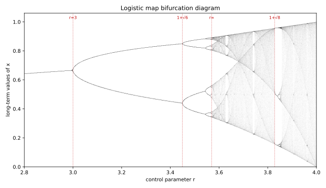

# ch07 — 倍週期分岔：秩序開始分裂

> **本章解決什麼問題**：ch06 證明了旋鈕 r 小於 3 時，那條脊椎遞迴式收斂到單一個穩定值；臨界點正好在 r=3（斜率 |f′(x*)| 撞上 1）。但旋鈕沒有停在 3。本章接著問：過了 3 會怎樣？答案是系統不會「炸掉」、也不會「亂掉」——它先學會在**兩個值之間穩定地來回跳**，再學會在**四個值之間**跳，再八個……這條一路加倍的路叫倍週期分岔（period-doubling bifurcation）。本章把這條路走到週期 8，並讓全書的招牌視覺——分岔圖（bifurcation diagram）——第一次登場。普適常數 δ 的故事留給 ch08，混沌帶與秩序孤島留給 ch09。

## 從你已知的出發

你一定看過一個系統「卡在兩個狀態之間反覆橫跳」。

最經典的是 autoscaler 的震盪（flapping）。流量上來，CPU 過閾值，autoscaler 把副本數從 N 拉到 2N；副本一多，平均 CPU 掉到閾值以下，下一輪縮回 N；縮回去 CPU 又超標，再拉到 2N……如果冷卻時間（cooldown）沒設好、增益（gain）又太猛，系統就永遠在 N 和 2N 兩個值之間來回，誰也停不下來。監控面板上那條副本數曲線，不是收斂成一條平線，而是一個規律的方波——上、下、上、下。

你大概也看過更糟的版本：增益再加大一點，它不再是簡單的兩段橫跳，而是變成「高、中、高、低」這種四拍一循環的怪節奏，要四輪才回到原點。再加大，週期更長、更難看懂。

這些現象，在後端工程裡我們叫它「控制迴圈不穩定」「overshoot」「振盪」，然後動手調 cooldown、加阻尼、降增益把它壓回去。但我想請你先停下來，不要急著修。因為這正是 ch05 那條遞迴式——

```text
        xₙ₊₁ = r · xₙ · (1 − xₙ)        （邏輯斯諦映射 logistic map，0 ≤ x ≤ 1）
```

——在旋鈕 r 過了 3 之後做的**一模一樣的事**。autoscaler 在 N 和 2N 之間跳，就是這條式子的 2-cycle（週期 2 軌）；那個「四拍一循環」的怪節奏，就是它的 4-cycle。而且——這是本章的第一個驚嘆點——這條最簡單的式子告訴你：**這種「在 N 和 2N 間橫跳」的不穩定，不是一個孤立的 bug，它是一條有結構的路上的第一站。**沿著這條路一直走，你會看到週期 2 變 4、4 變 8、8 變 16……加倍、加倍、再加倍，最後走進混沌。

你調 autoscaler 時憑經驗知道「增益太高會震盪」。本章要給你的，是這句經驗背後那台確定性機器的精確樣子：它不只會震盪，它震盪的方式有一張可以畫出來的地圖，而且這張地圖對所有長得像它的系統都成立。

## 先把臨界點接上：r=3 那一刀

ch06 留下的結論值得逐字抄一遍，因為本章整個故事都從它長出來。

脊椎遞迴式的非零不動點是 `x* = 1 − 1/r`。在那一點上，曲線的斜率（導數）是：

```text
  f(x)   = r · x · (1 − x)
  f′(x)  = r · (1 − 2x)            ← 對 x 微分
  f′(x*) = r · (1 − 2·(1 − 1/r))
         = r · (2/r − 1)
         = 2 − r                   ← 不動點上的斜率，只看 r
```

穩定的條件是 |f′(x*)| < 1，也就是 |2 − r| < 1，解出來 1 < r < 3。在 cobweb（蛛網圖）上，這個條件的白話是：**不動點附近的斜率夠緩，每彈一次就更靠近它**，所以軌跡像螺旋一樣收進去。

關鍵在 r 漸漸變大時，f′(x*) = 2 − r 是怎麼變的：

```text
  r = 2.0  →  f′(x*) = 0.0     斜率平，秒收斂
  r = 2.5  →  f′(x*) = −0.5    斜率負且緩，左右交替著收斂
  r = 2.9  →  f′(x*) = −0.9    斜率快撞到 −1，收得很慢、來回擺很多次
  r = 3.0  →  f′(x*) = −1.0    斜率正好 = −1 ← 臨界！
  r = 3.2  →  f′(x*) = −1.2    斜率超過 −1，每彈一次反而更遠 → 不動點失穩
```

注意斜率是**負的**。負斜率代表什麼？代表 cobweb 上的軌跡不是單調爬向不動點，而是**左、右、左、右地交替逼近**——這次偏高、下次偏低、再下次又偏高。當 |斜率| < 1，這個左右擺動的幅度一輪比一輪小，最後收進不動點。當斜率正好 = −1（r=3），擺動幅度**不縮也不放**，卡在臨界。當 |斜率| > 1（r > 3），擺動幅度一輪比一輪大，不動點再也留不住軌跡。

但軌跡被踢出不動點之後，它去哪了？這就是本章的正題。它不會跑掉——別忘了 x 永遠困在 [0,1] 裡。它只是不再停在一個點上，而是**停在一對點上，左右交替**。那個「左右交替」的擺動，原本是收斂過程的暫態，現在變成了系統的永久行為。

## 2-cycle：f 把一個值送到另一個

當 r 過 3，系統穩定下來後的長期行為，是在兩個值之間反覆橫跳：

```text
  …→ a → b → a → b → a → b →…      （週期 2 軌，period-2 orbit）
```

a 跳到 b，b 跳回 a，兩步一循環。這對 {a, b} 叫一個 2-cycle（2 週期軌）。

怎麼用式子描述「兩步一循環」？很直接：如果你**連做兩次** f，會回到原點。也就是 a 滿足

```text
  f(f(a)) = a
```

我們把連做兩次的函數叫 f²（讀作「f 複合 f」，不是 f 平方）。2-cycle 的兩個值 a、b，都是方程式 `f²(x) = x` 的解。

這裡值得你停十分鐘，因為直覺正要騙你。你可能會想：「f²(x) = x 的解？那不就是不動點嗎？x* 滿足 f(x*) = x*，那當然也滿足 f(f(x*)) = x*。」

對，不動點**確實**是 f²(x) = x 的解——但它是**舊**解。f² 這個函數（它是一個四次多項式）最多有四個解：兩個是老面孔（x=0 和 x*=1−1/r 這兩個原本的不動點），**另外兩個是新冒出來的**，正是 a 和 b。

這就是「為什麼是分『岔』」的數學內核。r 一過 3，f²(x) = x 這條方程式**多長出兩個實數解**。它們成對出現、互為對方的像（f 把 a 送到 b、把 b 送回 a），所以週期是 2 而不是 1。我認為這是本章最該被你用自己的話講清楚的一頁：**不動點沒有消失，它還在那裡，只是變得不穩定（排斥）了；同時，f² 的兩個新的、穩定的解誕生，接管了系統的長期行為。** 一條穩定的線，裂成了兩條。

（嚴謹度標示：這裡是工程師的嚴謹——每一步你都能口頭說出理由。「f² 恰好多兩個解、且穩定性如何轉移」的完整證明要動到 f² 的導數與隱函數定理，本書不展開，給結論與直覺；想看嚴格版見本章延伸閱讀。動力系統的術語把「斜率穿過 −1、週期加倍」這件事叫翻轉分岔（flip bifurcation），但你不需要記這個詞，記住「斜率撞 −1 → 一裂為二」就夠了。）

### worked example：r=3.2，手算到穩定 2-cycle

光說不練沒用。我們把旋鈕轉到 r=3.2（穩穩落在 3 和 1+√6≈3.4495 之間，所以應該看到乾淨的 2-cycle），從 x₀ = 0.5 開始，一步步算。每一步都是 `xₙ₊₁ = 3.2 · xₙ · (1 − xₙ)`，我手算複核過、保留 6 位小數：

```text
  n    xₙ           xₙ₊₁ = 3.2·xₙ·(1−xₙ)        ← 觀察
  0    0.500000     3.2·0.5·0.5      = 0.800000
  1    0.800000     3.2·0.8·0.2      = 0.512000   ← 開始上下擺
  2    0.512000     3.2·0.512·0.488  = 0.799539
  3    0.799539     ...              = 0.512884
  4    0.512884     ...              = 0.799469
  5    0.799469     ...              = 0.513019
  6    0.513019     ...              = 0.799458
  7    0.799458     ...              = 0.513040
  8    0.513040     ...              = 0.799456
  9    0.799456     ...              = 0.513044
 10    0.513044     ...              = 0.799456
  …                                              收斂到兩個值來回
 20    （奇數步）   ≈ 0.799455
 21    （偶數步）   ≈ 0.513045
```

看出來了嗎？前幾步還在抖，但很快地，奇數步都停在 **0.7995** 附近、偶數步都停在 **0.5130** 附近。系統沒有收斂到一個點，它收斂到一對點，然後永遠在這對點之間橫跳。這就是 autoscaler 在 N 和 2N 間 flapping 的數學原型。

**驗證 f 把一個值送到另一個**（這是 2-cycle 的定義，必須對得上）：

```text
  f(0.5130) = 3.2 · 0.5130 · (1 − 0.5130)
            = 3.2 · 0.5130 · 0.4870
            = 0.7995          ← 0.5130 跳到 0.7995 ✓

  f(0.7995) = 3.2 · 0.7995 · (1 − 0.7995)
            = 3.2 · 0.7995 · 0.2005
            = 0.5130          ← 0.7995 跳回 0.5130 ✓
```

兩個值互相把對方叫出來，閉合成一個兩步循環。

如果你想偷懶不迭代、直接解 `f²(x) = x`，這對值也有封閉式。把 f²(x) = x 的四次方程除掉兩個老不動點（x=0 與 x=1−1/r）這兩個因式，剩下的二次式給出：

```text
  a, b = [ (r+1) ± √((r+1)(r−3)) ] / (2r)
```

代 r=3.2：(r+1) = 4.2、(r+1)(r−3) = 4.2·0.2 = 0.84、√0.84 ≈ 0.9165，於是

```text
  a = (4.2 + 0.9165) / 6.4 = 5.1165 / 6.4 ≈ 0.7995
  b = (4.2 − 0.9165) / 6.4 = 3.2835 / 6.4 ≈ 0.5130
```

跟手動迭代讀出的兩個值**完全吻合**。注意根號裡有 (r−3)：當 r ≤ 3 時 (r−3) ≤ 0、根號開不出實數，2-cycle 根本不存在；恰恰在 r 過 3 的那一瞬間，這兩個實數解才憑空誕生。式子本身就把「分岔發生在 r=3」寫在臉上了。

## 再裂一次：r 過 1+√6 → 4-cycle

故事到這裡只走了一半。旋鈕繼續轉大，那對 2-cycle 的值 {a, b} 自己也會「失穩」——用跟剛才一模一樣的劇本。

關鍵在於：a 和 b 作為 f² 的不動點，也有自己的穩定條件。f² 在這對點上的斜率（用連鎖律算，就是 f′(a)·f′(b)）一樣要 |斜率| < 1 才穩。我手算複核過，這個 2-cycle 的斜率有個漂亮的封閉式：

```text
  (f²)′ 在 2-cycle 上 = f′(a)·f′(b) = 4 + 2r − r²
```

代 r=3.2：4 + 6.4 − 10.24 = **0.16**，絕對值遠小於 1，所以 r=3.2 的 2-cycle 很穩——這也解釋了為什麼上面才迭代十幾步就收斂得那麼乾淨。

那它什麼時候失穩？當 |4 + 2r − r²| 撞到 1。負方向先到：令 4 + 2r − r² = −1，解出 r² − 2r − 5 = 0，r = 1 + √6 ≈ **3.4495**。

```text
  r = 3.2     →  2-cycle 斜率 = 0.16     很穩
  r = 3.4     →  2-cycle 斜率 ≈ −0.56    還穩，但開始抖
  r = 3.4495  →  2-cycle 斜率 = −1.0     臨界！2-cycle 失穩
  r > 3.4495  →  2-cycle 斜率 < −1       一裂為二 → 4-cycle
```

看到那個 −1 沒有？**和 r=3 那一刀一模一樣的 −1。** 斜率穿過 −1，週期就加倍。在 r=3 是 1 → 2，在 r=1+√6 是 2 → 4。系統現在要在四個值之間輪轉：a → b → c → d → a，四步一循環。原本那對穩定的點，各自又裂成一對。

這就是「為什麼是加倍，不是加一」的答案，而且它每一次都用同一個機制：**一個穩定週期軌，當它的斜率穿過 −1，就一分為二，週期翻倍。** 不是 2 變 3、不是 4 變 5——是 2 變 4、4 變 8。每一級的「人口」都翻倍，因為翻轉分岔生的永遠是「成對」的新解。

繼續轉旋鈕，劇本一字不改地重演：

```text
  分岔   r 值              週期變化     斜率事件
  ───────────────────────────────────────────────
  第 1 次  r₁ = 3            1 → 2        不動點斜率 = −1
  第 2 次  r₂ = 1+√6 ≈3.4495 2 → 4        2-cycle 斜率 = −1
  第 3 次  r₃ ≈ 3.5441       4 → 8        4-cycle 斜率 = −1
  第 4 次  r₄ ≈ 3.5644       8 → 16       8-cycle 斜率 = −1
   …       …                 …            …（無窮多次，越擠越快）
```

這串無窮多次、一次比一次密的加倍，就是倍週期級聯（period-doubling cascade）。週期 2 → 4 → 8 → 16 → 32 →……一路 2 的次方加上去。

而且——這是下一個驚嘆點的伏筆——你大概注意到了，分岔點越來越擠：r₁ 到 r₂ 隔了 0.4495，r₂ 到 r₃ 只隔約 0.0946，r₃ 到 r₄ 只隔約 0.0203。間距一級比一級小，而且小得很規律。我先把這個觀察按住，ch08 會告訴你這個「越擠越快」收縮的比例是一個普適常數 δ≈4.669，它對所有長得像 logistic 的映射都一樣——那是本書最大的驚嘆點之一。本章只要你先看見「間距在規律地收縮」這件事。

```text
  間距速算（自我複核）：
    r₂ − r₁ = 3.4495 − 3.0    = 0.4495
    r₃ − r₂ = 3.5441 − 3.4495 = 0.0946
    r₄ − r₃ = 3.5644 − 3.5441 = 0.0203

    第一個比值 = 0.4495 / 0.0946 ≈ 4.75   ← 已經在往 4.669 靠了（細節見 ch08）
```

## 讀懂招牌圖：分岔圖

把上面整段故事「一次轉動一個旋鈕」的劇情，全部畫在一張圖上，就是分岔圖。它是混沌理論最有名的視覺，也是本書的招牌。

讀法只有兩條軸，記住就夠：

```text
  橫軸（→）：控制參數 r，從小轉到大（這張圖畫 2.8 到 4.0）
  縱軸（↑）：系統的「長期落點」——丟掉前面幾百步的暫態，
             只把穩定下來之後 x 會停在的那些值，全部點上去
```

把這兩條軸接到本章的故事上，整張圖就活了：

- **r < 3**：每個 r 的長期落點只有**一個值**（穩定不動點 x*=1−1/r）。所以圖左邊是**單獨一條線**，隨 r 緩緩上升。
- **r 過 3**：長期落點變成**兩個值**（2-cycle 的 a 和 b）。那條線**一分為二**，岔成上下兩支——這就是「分岔」這個名字的由來，你**看得見**它裂開。
- **r 過 3.4495**：每一支**再各自一分為二**，變成四條線（4-cycle）。
- **r 過 3.5441**：四條再裂成八條……分岔越來越密，因為間距在規律地收縮。
- **r 過 ~3.57**（累積點 r∞≈3.56995，ch09 的主角）：線多到數不清、糊成一片黑——這就是混沌。

下面這張程式預先算好的分岔圖，把這整段「一條線怎麼一路裂成混沌」畫了出來。它是本書最值得你盯著看一分鐘的一張圖：



下面是同一張圖的純文字骨架版，幫你把眼睛先校準到該看的地方（這是示意，不是真實數據，真實比例見上方 SVG）：

```text
  長期
  落點
   ↑
   |                                              ░░▓▓███████  ← 混沌（一片黑）
   |                                        ╱──── ░░▓██████
   |                              ┌──────────              ███  留白直縫
   |                    ┌─────────┘   ┌────                ███ （秩序窗口，ch09）
   |          ┌─────────┘     ┌───────┘    ▓▓▓▓▓▓▓▓▓███████
   |──────────┘  （一條線）   └───────┐    ░░▓▓▓▓▓▓▓███████
   |                    └─────────┐   └────                ███
   |                              └──────────              ███
   |                                        ╲──── ░░▓██████
   |                                              ░░▓▓███████
   └──┬─────────┬─────────┬─────────┬─────────┬─────────┬──→ r
     2.8       3.0       3.2     3.4495    3.5441      3.57…  4.0
              ↑分岔1     2-cycle  ↑分岔2    ↑分岔3      ↑r∞
            (1→2)                (2→4)    (4→8)      混沌起點
```

我認為這張圖了不起的地方，要這樣講才講到位：**它把一個一維的旋鈕（r）轉動一圈的全部後果，攤平在一張二維的紙上。** 你不必跑一千次模擬、不必想像時間流逝，你只要從左掃到右，就「看完」了一個系統從完美秩序（一條線）走進完全混沌（一片黑）的全程，連中間每一次分裂發生在哪都標得清清楚楚。而造出這整張無窮細節圖的，只是一條乘法加減法湊出來的、國中生都看得懂的式子。這就是本書想讓你恍然的東西：複雜不必來自複雜，最簡單的回授迴圈裡就藏著一整個從秩序到混沌的宇宙。

## 直覺的陷阱

倍週期是個容易「看懂表面、誤解內核」的概念。下面四個是我見過最常見的溝。

```text
  誤解                          會在哪一步把你帶溝裡            正確版
  ─────────────────────────────────────────────────────────────────────
  ① 「過了 r=3 系統就亂掉/      把『振盪』當成『混沌』，         過 r=3 只是進入週期 2，
     失控了」                   以為一過臨界就無法預測           完全規律、完全可預測：
                                                                就是在兩個值間乾淨地跳。
                                                                混沌要到 r∞≈3.57 才開始。

  ② 「2-cycle 是因為不動點      不動點沒消失，它還在 x*=1−1/r，   不動點變成『不穩定』
     消失、被兩個新點取代」      只是被你看不到（軌跡被它推開）    （排斥），同時 f² 多生
                                                                兩個穩定解接管長期行為。
                                                                舊解還在，只是失寵。

  ③ 「下一步應該是週期 3、      以為週期是一個一個加上去的       每次都是斜率穿過 −1、
     週期 5……」                                                 週期『翻倍』：1→2→4→8。
                                                                週期 3 是另一回事（見下④）。

  ④ 「r≈3.8284 的週期 3 是      把混沌區裡的 period-3 窗口        ~3.8284 的週期 3 在『混沌
     倍週期的第三步」            誤接到倍週期級聯後面             之後』的混沌帶裡，是另一種
                                （以為 1→2→4→…→3）              機制（切線分岔）冒出來的
                                                                秩序孤島，不在 2→4→8 這條
                                                                線上。倍週期到週期 8 在
                                                                ~3.5441，數字差很遠別搞混
                                                                （ch09 細講）。
```

第④點特別要守住，因為連權威工具都會把你絆倒。Wolfram MathWorld 的 LogisticMap 條目用了一套不同的 r 下標，把 1+2√2≈3.8284 標成「period-3 onset」、把 1+√6≈3.4495 標成「period-4」。那不是錯，是它的下標規則跟倍週期序不同。但對讀者來說很致命：你很容易把「period-3 在 3.8284」誤讀成「倍週期級聯的第三步在 3.8284」。記死一句話就不會錯：**倍週期級聯（1→2→4→8）走到週期 8 是在 r≈3.5441；那個 1+2√2≈3.8284 的週期 3 是混沌帶裡的秩序窗口，是另一條故事線（ch09）。** 兩個數字隔了 0.28，差得很遠，看到就該警覺。

第①點是工程師最容易犯的，因為「過了某個閾值系統就完蛋」太符合我們對 production 的恐懼。但脊椎遞迴式在 3 < r < 3.4495 的行為，恰恰是反例：它過了臨界、不動點失穩了，但系統一點也不亂——它只是換了一種**同樣規律、同樣可預測**的穩態。autoscaler 在 N 和 2N 間 flapping 確實是問題（你不想要它），但它是個**有週期、可預測**的問題，不是混沌。把這兩者分清楚，是 ch04「決定論 ≠ 可預測」那條主線在這一章的具體落地。

## 紙上推演

### 推演題 1 ★ **[10 分鐘]**

不算式子，只用本章的「斜率穿過 −1」機制，回答：為什麼倍週期分岔生出的是週期 2、4、8（加倍），而不是週期 2、3、4（加一）？請用「f² 的新解成對出現」這個說法，講到一個沒讀過本章的工程師也能懂。

#### 推演解答

關鍵是**新解是成對誕生的**。

當不動點的斜率穿過 −1，方程式 f²(x)=x 多長出兩個新的實數解 a 和 b（前面 worked example 用封閉式驗證過，根號裡的 (r−3) 在 r 過 3 才開得出實數，所以是「憑空誕生一對」）。為什麼是兩個而不是一個？因為 f 把 a 送到 b、把 b 送回 a，它們**互為對方在 f 下的像**，缺一不可——你不可能只有 a 沒有 b，否則 a 跳出去就沒地方落。它們是綁在一起出生的雙胞胎。所以週期是 2。

下一級完全同理：當這對 {a, b} 的斜率（f′(a)·f′(b)）穿過 −1，**a 自己裂成一對、b 也自己裂成一對**，2 個變 4 個。每一級每個點都裂成兩個，所以人口永遠是 ×2：1 → 2 → 4 → 8 → 16。

「加一」（週期 3、5）需要的是完全不同的機制（切線分岔，三個新點同時冒出來），那發生在混沌帶裡、不在這條級聯上（ch09）。

對工程師的一句話版本：**倍週期就像每個穩定狀態到了臨界都「有絲分裂」成兩個——細胞分裂從來不會分成三個，這條路上也一樣，永遠對半裂。**

### 推演題 2 ★★ **[20 分鐘]**

把旋鈕轉到 r=3.3（落在 3 和 3.4495 之間，所以該有穩定 2-cycle）。從 x₀=0.5 出發，手動迭代 8 步（保留 4 位小數），判斷它收斂到 2-cycle 還是不動點，並讀出那兩個值。然後用封閉式 a,b = [(r+1) ± √((r+1)(r−3))] / (2r) 複核你讀到的值。最後算一下這個 2-cycle 的斜率 4+2r−r²，確認它穩定。

#### 推演解答

手動迭代（每步 xₙ₊₁ = 3.3·xₙ·(1−xₙ)）：

```text
  n    xₙ        xₙ₊₁
  0    0.5000    3.3·0.5·0.5       = 0.8250
  1    0.8250    3.3·0.825·0.175   = 0.4764
  2    0.4764    3.3·0.4764·0.5236 = 0.8233
  3    0.8233    3.3·0.8233·0.1767 = 0.4801
  4    0.4801    ...               = 0.8237
  5    0.8237    ...               = 0.4793
  6    0.4793    ...               = 0.8236
  7    0.8236    ...               = 0.4794
  8    0.4794    ...               = 0.8236
```

收斂到 2-cycle，不是不動點（如果是不動點，所有步會停在同一個值；這裡明顯在兩個值間橫跳）。兩個值約為 **0.4794** 與 **0.8236**。

封閉式複核：(r+1)=4.3、(r+1)(r−3)=4.3·0.3=1.29、√1.29≈1.1358，

```text
  a = (4.3 + 1.1358) / 6.6 = 5.4358 / 6.6 ≈ 0.8236   ✓
  b = (4.3 − 1.1358) / 6.6 = 3.1642 / 6.6 ≈ 0.4794   ✓
```

吻合。

2-cycle 斜率：4 + 2·3.3 − 3.3² = 4 + 6.6 − 10.89 = **−0.29**，|−0.29| < 1，所以這個 2-cycle 穩定——符合「3 < r < 3.4495 之間 2-cycle 穩定」的結論。順帶一提，r=3.3 的斜率（−0.29）比 r=3.2 的（0.16）更靠近 −1 一點，這正是「旋鈕越往 3.4495 轉，2-cycle 越接近失穩」的數字證據。

常見錯路：迭代時把 (1−xₙ) 算錯（手算 logistic 最常死在這），或前兩步暫態還沒退就急著下結論。穩健做法是多算兩步、看奇偶步是否各自穩定。

### 推演題 3 ★★ **[15 分鐘]**

你的同事看著 autoscaler 監控面板說：「副本數在 N 和 2N 之間反覆橫跳，這系統已經混沌了，沒救了。」用本章的語言，指出他這句話**錯在哪兩個地方**，並給出正確的診斷。

#### 推演解答

兩個錯，都對應「直覺的陷阱」裡的誤解①。

**錯誤一：把週期 2 振盪當成混沌。** 在兩個值之間規律橫跳，是乾淨的 2-cycle，週期是 2，**完全可預測**——你看了兩拍就知道第三拍是什麼。混沌是「落點填滿一整段、永不重複、對初始值敏感」，那要旋鈕轉到 r∞≈3.57 之後才開始（ch09）。把振盪叫混沌，是把「失穩」誤當成「不可預測」。

**錯誤二：把「有結構的問題」當成「沒救」。** 既然這是 2-cycle，它的成因是「增益太高、不動點失穩（斜率穿過 −1）」。對策很明確：降增益（在脊椎語言裡＝把 r 轉回 3 以下）、加阻尼、拉長冷卻時間，讓系統的「斜率」絕對值掉回 1 以下，2-cycle 就會塌回單一穩定值。這跟混沌完全相反——混沌沒辦法靠調一個增益就壓平，但週期 2 振盪可以。

正確診斷一句話：**這不是混沌，是控制迴圈增益過高造成的週期 2 振盪；它有週期、可預測、可以靠降增益修好。** 把它誤判成混沌，會讓你放棄一個其實很好修的問題。

### 推演題 4 ★★★ **[20 分鐘]**

只看分岔圖（不准重新算數值），口頭描述：（a）如何在圖上找到第一次和第二次分岔的位置；（b）為什麼分岔點「越往右越擠」；（c）你能不能從圖上直接「看出」混沌從哪裡開始？怎麼看？

#### 推演解答

**(a) 找前兩次分岔。** 從圖最左邊那條單獨的線往右看，**第一個「一條變兩條」的分岔口**就是第一次分岔（r₁=3）。繼續往右，那兩條線**各自再裂成兩條**（從 2 條變 4 條）的地方，就是第二次分岔（r₂≈3.4495）。關鍵是數線的條數：1 條→2 條→4 條→8 條，每一次條數翻倍的橫座標就是一次分岔點。

**(b) 為什麼越往右越擠。** 因為分岔點的間距在規律地收縮——前面算過 r₂−r₁≈0.45、r₃−r₂≈0.095、r₄−r₃≈0.020，每一段大約是前一段的 1/4.7。間距等比縮小，所以在圖上看起來分岔口一個比一個密、擠成一團。為什麼恰好是這個收縮比例、而且對別的映射也一樣？那是 ch08 的 δ≈4.669 普適常數的故事，本章只要能說出「間距在等比收縮所以越來越擠」就到位。

**(c) 看出混沌起點。** 可以，而且很直觀：當分岔口擠到**密得數不清、線開始糊成連續的一片黑**，那個「從清晰的離散線變成連續黑帶」的轉折處，就是混沌累積點 r∞≈3.57。在它左邊你還能（原則上）數出 2ⁿ 條離散的線（週期軌）；在它右邊落點填滿成片，數不出離散週期了——那就是混沌。（黑帶裡偶爾出現的留白直縫是秩序窗口，ch09 的主角，這裡先別管。）

常見錯路：把某條特別粗的線當成混沌。粗不等於混沌——要看的是「離散的線 vs 糊成連續的帶」這個質變，不是線的粗細。

## 自我檢核

口頭自答，講得清楚才算過關：

1. ch06 證明 r=3 是不動點的臨界點。把「臨界」這件事用 f′(x*)=2−r 講一遍：為什麼 r 一過 3 不動點就留不住軌跡？（提示：斜率穿過 −1）
2. 什麼是 2-cycle？為什麼它的兩個值是方程式 f²(x)=x 的**新**解，而不動點是它的**舊**解？
3. r=3.2 的 2-cycle 兩個值約是 0.5130 與 0.7995。請當場驗證 f(0.5130)≈0.7995、f(0.7995)≈0.5130（手算或口算到 2 位即可）。
4. 為什麼倍週期是 1→2→4→8（加倍），不是 1→2→3→4（加一）？用「新解成對誕生」講。
5. 第二次分岔在 r₂=1+√6≈3.4495，那裡發生的「斜率事件」和 r=3 那裡是同一件事嗎？是什麼事？
6. 分岔圖的橫軸和縱軸分別是什麼？「一條線分成兩條」在圖上對應系統行為的什麼變化？
7. 同事說「autoscaler 在兩個副本數間橫跳，系統混沌了」。這句話錯在哪？週期 2 振盪和混沌差在哪？
8. 為什麼 1+2√2≈3.8284 的週期 3 **不是**倍週期級聯的第三步？倍週期走到週期 8 是在哪個 r？

## 延伸閱讀

- **Robert May, "Simple mathematical models with very complicated dynamics", *Nature* 261:459 (1976)**（https://www.nature.com/articles/261459a0）。讓 logistic map 與倍週期路徑廣為人知的那篇綜述。讀它對「一條簡單式子竟有如此複雜行為」的驚嘆段，正是本章的精神源頭——一位生態學家把它從人口模型推廣成所有人都該知道的範例。
- **Wikipedia, "Period-doubling bifurcation"**（https://en.wikipedia.org/wiki/Period-doubling_bifurcation）。對齊本章的 r₂=1+√6、r₃≈3.54409、r∞≈3.56995 等分岔點數值；想看「斜率穿過 −1（翻轉分岔）」的稍微正式一點的敘述也在這裡。讀「logistic map」那一節。
- **Wolfram MathWorld, "Logistic Map"**（https://mathworld.wolfram.com/LogisticMap.html）。有 2-cycle 的封閉式推導與穩定性分析；**但讀時務必注意它的 r 下標規則和本書（多數教材）的倍週期序不同**（它把 1+2√2≈3.8284 標 period-3、1+√6≈3.4495 標 period-4），對照本章「直覺的陷阱④」一起看，反而能加深你對「倍週期序 vs 窗口」區別的理解。
- **Strogatz, *Nonlinear Dynamics and Chaos*，第 10 章（One-Dimensional Maps）**。想看 2-cycle 穩定性、f² 圖像、倍週期的工程師級嚴謹（每步有理由、不至於陷進測度論）推導，這是公認最好讀的一本。讀 10.2–10.3 節。

（跨章：分岔間距等比收縮的普適常數 δ≈4.669 見 ch08；越過 r∞ 的混沌帶與 1+√8≈3.8284 的 period-3 秩序窗口見 ch09。跨書：不動點穩定性看斜率／多維看 Jacobian 特徵值的線性代數工具，見《矩陣是動詞》。）
