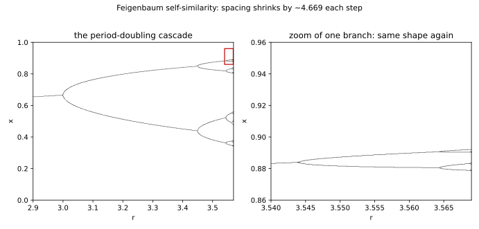

# ch08 — 費根堡普適性：不同的路，同一個數

> **本章解決什麼問題**：ch07 你看著脊椎遞迴式 xₙ₊₁ = r·xₙ·(1−xₙ) 在旋鈕 r 越過 3 之後一分為二、再一分為二，倍週期分岔（period doubling）像階梯一樣往混沌走。但分岔圖只是「看到」了這件事，沒回答兩個問題：這些分岔點 r₁、r₂、r₃…**以什麼速率**越擠越密？換一條完全不同的曲線，這個速率會不一樣嗎？這章給的答案是本書最大的驚嘆點之一——分岔點間距以一個固定比例 δ≈4.6692 收縮，而且**把脊椎換成任何「有單一光滑峰」的映射，還是撞上同一個 4.6692**。這叫普適性（universality）。它不是某條曲線的巧合，是通往混沌這條路的「物理常數」。守住這一章，ch09 越過累積點 r∞≈3.56995 進入混沌，你才會明白那道牆是怎麼算出來的。

## 從你已知的出發

先講一個你天天在用、卻可能沒當回事的現象。

同一個排序演算法——比方說快速排序——你用 C 寫一份、用 Go 寫一份、用 TypeScript 寫一份，跑在 x86、跑在 ARM、跑在某顆你沒聽過的嵌入式晶片上。實作細節天差地遠：暫存器配置不同、編譯器優化不同、cache 行為不同、甚至 pivot 的選法都可能不一樣。但有一件事，三份實作、三顆晶片，**完全一樣**：平均時間複雜度是 O(n log n)。那條 n log n 的曲線，不在乎你用什麼語言、什麼硬體寫的。實作是細節，**漸進行為的「類別」是普適的**。

你心裡早就有這個分類習慣。你不會說「我的 C 版快排和 Go 版快排是兩個不同的演算法」——它們是同一個演算法的兩個實作，因為它們的**行為類別**相同。O(n log n) 這個標籤，把無數種寫法歸進同一個抽屜。實作細節無關，行為類別才是本質。

再舉一個更貼近數字的。你做負載測試，量到延遲隨併發數成長的曲線。同一個服務，部署到不同的雲、不同的機型、不同的核心數，絕對的延遲數字完全不同（有的機器快兩倍）。但「延遲怎麼**隨負載縮放**」——是線性爬升、還是過了某個點突然指數爆掉——這個**縮放律（scaling law）**往往跟機型無關，只跟系統的結構（有沒有共享鎖、佇列怎麼排）有關。你看的是斜率、是形狀、是縮放的方式，不是絕對值。

費根堡普適性，就是把這個「實作無關、行為類別才是本質」的直覺，搬到「一個系統怎麼從秩序走向混沌」這件事上。脊椎遞迴式是一種「實作」——它的曲線是拋物線 r·x·(1−x)。但你完全可以換一條曲線：用 r·sin(πx)，用任何只有「單獨一個光滑山峰」的函數。這些曲線長得完全不一樣，就像 C 和 Go 的快排原始碼完全不一樣。可是當你轉動 r、讓它們一步步倍週期走向混沌，**它們分岔點越擠越密的速率，是同一個數 4.6692**。

這就是本章。一個你以為只屬於拋物線的數字，原來是「通往混沌」這整個行為類別的指紋。

## 先把問題定準：分岔點在「以什麼速率」變密

ch07 給了你分岔圖，也給了你前幾個分岔點的值（這些都在跨章基準表上，已複核過）：

```text
  分岔     轉變          r 的值
  第 1 次   週期 1 → 2    r₁ = 3
  第 2 次   週期 2 → 4    r₂ = 1 + √6 ≈ 3.4495
  第 3 次   週期 4 → 8    r₃ ≈ 3.5441
  第 4 次   週期 8 → 16   r₄ ≈ 3.5644
  …         …            …
  累積點    → 混沌        r∞ ≈ 3.56995
```

光看這串數字，有件事一眼就能注意到：**它們越擠越近**。從 3 到 3.4495 跨了 0.4495；從 3.4495 到 3.5441 只跨了 0.0946；從 3.5441 到 3.5644 更只剩 0.0203。分岔一次比一次來得快，間距一次比一次小，全部擠向一個極限 r∞≈3.56995——這就是「無窮多次分岔，卻在有限的 r 區間裡擠完」的累積點（accumulation point）。

但「越擠越近」是定性的。費根堡問的是定量的：**每一次間距，是上一次間距的幾分之一？** 把相鄰兩個間距相除：

```text
        rₙ − rₙ₋₁
  δₙ = ───────────        ← 「這一段間距」除以「下一段間距」
        rₙ₊₁ − rₙ
```

注意這個比值的方向：分子是**較早、較大**的那段間距，分母是**較晚、較小**的那段。間距在縮小，所以這個比值會大於 1——它就是「縮小的倍率」。如果每段間距都剛好是下一段的 4 倍，δₙ 就恆等於 4，分岔點會像 1/4、1/16、1/64…那樣等比擠進累積點。費根堡的發現是：δₙ 不是恆等於某個整數，但它**收斂**——

```text
        rₙ − rₙ₋₁
  δ = lim ───────────  ≈  4.66920160910299…        ← 費根堡常數（Feigenbaum delta）
       n→∞ rₙ₊₁ − rₙ
```

這個 δ≈4.6692 就是費根堡常數（Feigenbaum constant）。它說的是：**每往混沌走一步，分岔點間距就收縮成原來的約 1/4.669。** 間距以這個固定比例等比收縮，無窮多段間距的總和才會收斂——這就是為什麼無窮多次分岔能擠進 [3, 3.56995] 這段有限區間。

到這裡，4.6692 還只是「拋物線這條曲線的一個性質」。震撼的部分在下一節：它根本不只屬於拋物線。

## 普適性：換一條曲線，撞同一個 4.6692

現在做一件看起來毫無道理的事。把脊椎遞迴式整條換掉。

脊椎是 f(x) = r·x·(1−x)，一條開口向下的拋物線，峰在 x=0.5。我們換成另一條完全不同的曲線：

```text
        xₙ₊₁ = r · sin(π·xₙ)        ← 正弦映射（sine map），峰也在 x=0.5
```

正弦曲線和拋物線是兩種數學物種。一個是二次多項式，一個是超越函數（transcendental function）；泰勒展開不同、每一階導數不同、長相只在「有個峰」這件事上勉強沾邊。如果你把它們疊在同一張圖上，除了「都在 x=0.5 附近鼓起一個包」之外，處處不一樣。

按常理，換了曲線，分岔點該換一套全新的值，間距收縮率也該是另一個數。事實上，**分岔點的值確實全變了**——正弦映射的 r₁、r₂、r₃ 是另一串數字，連累積點 r∞ 都不一樣。這完全符合預期：曲線變了，臨界點當然跟著變。

但費根堡 1975 年在 Los Alamos 用一台 HP-65 可程式計算器逐個算這些分岔點時，發現了一件讓他自己都不敢相信的事：正弦映射那串**全新的**分岔點，間距收縮率算出來——

```text
        正弦映射的 (rₙ − rₙ₋₁)/(rₙ₊₁ − rₙ)  →  4.6692…

        和拋物線一模一樣。
```

**同一個 δ。** 不是相近，是收斂到同一個 4.66920160910299…。據 Wolfram 的記述，費根堡當時手算到 3 位精度時，發現兩條曲線的 δ「完全相同」（2026-06，據 Stephen Wolfram 2019 訃聞長文）。

這就是普適性（universality）。完整的版本是：**任何只有「單獨一個光滑、二次型峰」的單峰映射（unimodal map），透過倍週期走向混沌時，分岔間距都以同一個 δ≈4.6692 收縮。** 拋物線、正弦、任何你隨手畫的、只要它有「爬上去、到一個圓滑的頂、再掉下來」這個形狀的函數，都撞同一個數。

讓我把這件事為什麼了不起，講到你能轉述給另一個工程師聽。

回到開頭那個快排的比喻，但要小心——它只對了一半。快排的 O(n log n) 普適，是因為三份實作**本來就是同一個演算法**，只是換了語言。費根堡普適性比這激進得多：拋物線和正弦映射**不是同一個演算法的兩個實作**，它們是兩個毫不相干的函數，沒有人設計它們要相同，它們唯一的共同點只是「有一個光滑的峰」。然而它們通往混沌的路上，量出了同一個常數。

更精確的比喻在物理那邊。水沸騰和磁鐵失去磁性（鐵磁體加熱到居里溫度），是兩個八竿子打不著的物理現象——一個是液體變氣體，一個是磁矩亂掉。但在各自的臨界點附近，它們的某些行為由**同一組臨界指數（critical exponent）**支配，因為它們屬於同一個「普適類（universality class）」。費根堡常數就是動力系統版的臨界指數：通往混沌的「倍週期路徑」是一個普適類，δ 和 α 是它的指紋，而拋物線、正弦映射、無數其他單峰映射，全都住在這個類裡。

我認為這是整本書最反直覺的一頁。不是「4.6692 這個值很特別」——隨便一個無理數都可以很特別。是**「不同的函數、不同的方程式、走出不同的分岔點，卻被同一個數捏住」**這件事。它告訴你：「怎麼從秩序走向混沌」這件事，有一個和具體方程式無關的深層結構。方程式是實作，δ 是行為類別。你以為混沌是「方程式各自的脾氣」，普適性說：不，通往混沌的方式，是有限的幾種、有指紋的。

## 另一個常數：α≈2.5029

δ 管的是「橫軸 r 方向」的收縮——分岔點在參數軸上越擠越密的倍率。但分岔圖是二維的，還有縱軸（x 的落點）。費根堡發現縱軸也有一個普適的縮放常數：

```text
        α ≈ 2.502907875…        ← 費根堡 alpha，管縱軸（x 方向）的尺度縮放
```

直覺這樣抓：每多分岔一次，叉子（分支）的數量加倍，但每根新叉子張開的「寬度」會縮小——縮小的倍率就是 α≈2.5029。所以從一代分岔走到下一代，橫軸間距縮成 1/δ≈1/4.669，縱軸叉子寬度縮成 1/α≈1/2.503。兩個方向各有各的縮放率，而且**兩個都是普適的**——換成正弦映射，α 還是 2.5029。

把 δ 和 α 擺在一起，下一節的「自相似」就有了完整的座標：橫向用 1/δ、縱向用 1/α，把分岔圖某一塊放大，就會疊回它前一代的樣子。

## 自相似的放大律：分岔圖放大一塊，還是同一張圖

普適性背後有個幾何畫面，費根堡用它解釋「為什麼會有普適常數」。這個畫面叫**重整化（renormalization）**，嚴格理論本書不展開（它要動到泛函空間裡的不動點與線性化，屬於延伸閱讀的層級）。但白話的直覺非常乾淨，而且它直接給了 δ 和 α 的幾何意義。

先講你要看到什麼。把分岔圖里盯著「第一根叉」附近——也就是 r 剛過 3、週期 1 分裂成 2 的那一帶。再盯著「第二根叉」附近——週期 2 分裂成 4 的那一帶。它們長得**像**。再盯第三根叉、第四根叉……每一代的分岔局部，都和上一代的分岔局部，是同一個形狀，只是越來越小。

關鍵在這個「越來越小」是**有固定比例的**：

```text
  把「第 n 代分岔」附近的小區域，
    橫軸（r 方向）放大 δ ≈ 4.669 倍，
    縱軸（x 方向）放大 α ≈ 2.503 倍，
  就會疊回「第 n−1 代分岔」的樣子——幾乎一模一樣。
```

這就是分岔圖的**自相似（self-similarity）**：放大一塊，還是同一張圖。不是「有點像」，是「在極限下趨於完全一樣」。每一代分岔都是上一代分岔的縮小複製，縮小的倍率橫向恰好 δ、縱向恰好 α。

重整化的核心點子，就是把「放大一塊」這個動作本身當成一個運算：

```text
  重整化的白話版（不推導，只給直覺）
  │
  ├─ 「放大一塊分岔」＝ 一個把映射變成「新映射」的運算 R
  │
  │      原映射 f  ──R──▶  R(f)  ──R──▶  R(R(f))  ──R──▶ …
  │      （每作用一次 R，就是「跳到下一代分岔、再放大回來看」）
  │
  ├─ 問：一直放大下去，會收斂到什麼？
  │
  ├─ 答：收斂到一個「放大後還是自己」的特殊映射——
  │      也就是運算 R 的「不動點」g（fixed point of R）。
  │
  └─ 關鍵：這個不動點 g 不認得你原來是拋物線還是正弦——
         無數種單峰映射，放大放大放大，全都流向同一個 g；
         既然終點同一個，描述終點的常數（δ、α）當然一樣 → 普適。
```

你應該對「不動點」這個詞有 déjà vu——ch06 整章在講脊椎遞迴式的不動點（x*=f(x*)，迭代不再變的點）。重整化是同一個點子升了一層：那裡迭代的對象是**數** x，不動點是「迭代不變的數」；這裡迭代的對象是**整條映射** f，不動點 g 是「放大不變的映射」。而 δ≈4.669 正是這個高一層不動點 g 的**穩定性指標**——ch06 你用 f′(x*) 量一維不動點附近的拉伸率，δ 就是重整化運算 R 在 g 附近的「拉伸率」（嚴格說是線性化後最大的那個特徵值）。是不是 ch06 的 |f′(x*)| 換了個舞台又回來了？這就是為什麼 δ>1：它是個排斥方向的拉伸率，正對應「分岔一次比一次快」。

普適性的來源，到這裡就有白話答案了：**不同的單峰映射，是放大運算 R 的不同起點；但它們全都流向同一個不動點 g；既然終點同一個，描述終點的常數（δ、α）就同一個。** 起點各異、終點同一——這就是為什麼實作無關、行為類別相同。

我必須誠實標示嚴謹度：上面這段是**直覺版**。「R 真的有不動點、g 真的存在、收斂真的發生」這些，1975 年費根堡是用數值與物理直覺主張的，嚴格的存在性證明晚了好幾年才由別人補上（重整化的數學在 1980 年代由 Lanford 等人以電腦輔助證明完成）。本書給你「放大還是同一張圖、所以有普適常數」這個對的圖像和對的因果方向，但不假裝這是證明。要看真正的重整化群論證，去延伸閱讀。

## Worked example：用前三個分岔點手算間距比

口說無憑，自己把比值算一遍。用基準表上前四個分岔點的值（這些值我已對 landscape 複核），算相鄰間距比，看它往 4.669 逼近——同時誠實看清楚「只用前幾個還不夠精確」這件事。

先算各段間距（每步保留 4 位小數）：

```text
  分岔點（基準表值）：
    r₁ = 3        （= 3.0000）
    r₂ = 1+√6     （√6 ≈ 2.4495，所以 r₂ ≈ 3.4495）
    r₃ ≈ 3.5441   （常引 3.54409）
    r₄ ≈ 3.5644   （常引 3.564407）

  相鄰間距（後一個減前一個）：
    間距① = r₂ − r₁ = 3.4495 − 3.0000 = 0.4495
    間距② = r₃ − r₂ = 3.5441 − 3.4495 = 0.0946
    間距③ = r₄ − r₃ = 3.5644 − 3.5441 = 0.0203
```

肉眼先驗一下：0.4495 → 0.0946 → 0.0203，每段大約是上一段的五分之一上下。間距確實在等比收縮。現在算精確的比值：

```text
  第一個比值（用 r₁, r₂, r₃）：
        間距①     0.4495
    δ₁ = ───── = ──────── = 4.7515        ← 第一段除以第二段
        間距②     0.0946

  第二個比值（用 r₂, r₃, r₄）：
        間距②     0.0946
    δ₂ = ───── = ──────── = 4.6562        ← 第二段除以第三段
        間距③     0.0203
```

逐步驗一下除法，別跳：
- δ₁ = 0.4495 ÷ 0.0946。0.0946 × 4 = 0.3784，剩 0.0711；0.0946 × 0.7 = 0.0662，剩 0.0049；0.0946 × 0.05 = 0.0047。合起來 ≈ 4.75。對。
- δ₂ = 0.0946 ÷ 0.0203。0.0203 × 4 = 0.0812，剩 0.0134；0.0203 × 0.6 = 0.0122，剩 0.0012；0.0203 × 0.06 = 0.0012。合起來 ≈ 4.66。對。

看這兩個數的走向：

```text
  比值序列：  δ₁ = 4.7515   →   δ₂ = 4.6562   →   …   →   δ = 4.6692
              （偏高一點）      （已經很接近）          （極限值）
```

**這就是收斂的現場。** 第一個比值 4.7515 偏高了快 0.1；到第二個比值 4.6562 就已經逼到 4.669 附近，差不到 0.013。比值正從上方擺盪著收斂到 4.66920…。

但這裡要**誠實標示一件重要的事，別讓 worked example 騙了你**：用前幾個分岔點算出來的比值，**還不夠精確**。δ₁=4.7515 離真值 4.6692 還差了 0.08——這不是你算錯，是收斂本來就慢。費根堡常數是**極限**（n→∞），前幾項只是逼近的起點。要真的把比值壓到 4.6692 的小數後好幾位，得算到第八、第十、第二十代分岔——而那些分岔點本身就難算（間距小到 10⁻⁵、10⁻⁷，得用很高的數值精度才定得出來，這正是當年費根堡那台 HP-65 的真本事）。所以：

> **方法是對的，但別拿前兩三個比值就宣稱「看，等於 4.6692」。** 它們只給你「比值存在、在往一個固定數收斂、而且大約在 4.6~4.8 之間」這個結論。要看到 4.66920 的後幾位，需要很多階分岔的數據。我們手上能手算的前幾項，誠實地說，只夠看出「它在收斂、極限在 4.7 以下一點」——這已經足夠讓你信服 δ 存在且是個確定的數，但精確值要查附錄／文獻，不是靠這張表硬湊出來的。

（如果你好奇為什麼前幾項偏高、後面才壓下來：早期分岔離累積點還遠，重整化的「放大還是同一張圖」這個自相似性還沒「站穩」——越靠近 r∞，自相似越精確，比值才越貼近極限。這跟 ch06 那句「越靠近不動點、一階近似越準」是同一種精神。）

最後放上那張「放大還是同一張圖」的招牌視覺。下面這張是分岔圖某根叉附近的局部放大，把上面講的自相似畫成圖——



## 直覺的陷阱

| 誤解 | 為什麼錯／會在哪一步把你帶溝裡 | 正確版 |
|---|---|---|
| 「δ≈4.6692 是邏輯斯諦映射這條拋物線的常數」 | 把 δ 當成「拋物線的脾氣」，就完全錯過普適性——本章的全部重點。你會以為換條曲線就有另一個數，但其實正弦映射、無數其他單峰映射都撞同一個 δ。把 δ 鎖在拋物線上，等於把「物理常數」當成「某台儀器的讀數」。 | δ 是**通往混沌的倍週期路徑**這個普適類的常數，不屬於任何單一方程式。任何「有單一光滑峰」的單峰映射都收斂到同一個 δ≈4.6692（與 α≈2.5029）。 |
| 「換條曲線，分岔點和 δ 都一樣」 | 過度推廣到另一個極端。分岔點的**值**（r₁、r₂、r∞）會隨曲線變——正弦映射有它自己一套臨界點。普適的是**間距收縮的比例 δ**，不是分岔點本身。混淆這兩件事，你會去比正弦和拋物線的 r₁ 然後困惑為什麼不相等。 | 普適的是「間距比的極限」δ 和「尺度比」α 這兩個**無量綱的比值**；分岔點的絕對位置不普適、會隨映射改變。普適性發生在「比值」這層，不在「值」這層。 |
| 「用前兩三個分岔點算出 4.75，所以 δ≈4.75」 | 拿極限的前幾項當極限值。δ 是 n→∞ 的極限，前幾個比值（4.7515、4.6562…）偏高，還在收斂途中。用 worked example 的表硬湊一個值報出去，會比真值偏離 1~2%。 | 前幾項只能說明「比值在收斂、極限在 4.7 以下」。真值 4.66920… 要靠很多階分岔的數據才壓得出來；精確值查文獻／附錄，不靠手算前幾項。 |
| 「普適性是說所有混沌系統都一樣」 | 太大了。費根堡普適性只管**透過倍週期級聯**通往混沌的這一條路。通往混沌還有別條路（如間歇性 intermittency、準週期破裂），那些是別的普適類、別的常數。混沌本身千姿百態，普適的是「特定一條通路的縮放律」。 | 普適性是**分類**，不是「全部相同」。倍週期路徑是一類（指紋 δ、α），其他通往混沌的路是其他類。本章只宣稱倍週期這一類的普適。 |
| 「δ 收縮的是分岔圖的『空間』，跟碎形自相似是同一回事」 | 把本章的自相似（分岔圖在**參數軸與狀態軸**上、隨「代數」縮放的自相似）和 ch12 的碎形空間自相似（一個幾何形狀在**空間尺度**上的自相似）混為一談。兩者都叫「自相似」「放大還是它自己」，但縮放的對象不同。 | 本章：分岔圖沿 r 與 x 軸、以 δ 和 α 為比例的自相似（重整化的放大律）。ch12：碎形（如 Koch 曲線）在空間尺度上的自相似（碎維度）。同名不同物，分清楚。 |

## 紙上推演

### 推演題 1 ★ **[10 分鐘]**

不查書，用基準表的值 r₁=3、r₂≈3.4495、r₃≈3.5441，自己把第一個間距比 (r₂−r₁)/(r₃−r₂) 算出來（保留 4 位小數）。然後回答：(a) 你算出的值和 4.6692 差多少？(b) 這個差是「你算錯了」還是「本來就該有的差」？(c) 要把比值壓到接近 4.6692，你需要什麼樣的數據？

#### 推演解答

(a) 算間距：r₂−r₁ = 3.4495−3 = 0.4495；r₃−r₂ = 3.5441−3.4495 = 0.0946。比值 = 0.4495 ÷ 0.0946 ≈ **4.7515**。和 4.6692 差約 **0.082**（偏高約 1.8%）。

(b) **本來就該有的差**，不是算錯。δ 是 n→∞ 的**極限**，前幾個比值只是逼近途中的點，會從上方偏高。第一個比值用的是最早、離累積點最遠的三個分岔點，自相似還沒站穩，所以偏離最大。如果你接著用 r₂、r₃、r₄ 算第二個比值，會得到約 4.6562——明顯往 4.669 靠近了。比值是**收斂**到 4.669，不是**等於** 4.669。

(c) 要看到 4.66920 的後幾位，需要**很多階分岔點的數據**（第八、十、二十代），而且每個分岔點都得算得很精確（後面的間距小到 10⁻⁵ 以下）。手算前兩三項只夠驗證「比值存在、在收斂、落在 4.6~4.8」。常見錯路：拿 4.7515 報成「δ≈4.75」——那是把極限的第一項當成極限本身。

### 推演題 2 ★★ **[20 分鐘]**

口頭（寫下要點）回答全章的核心問題：**「普適性為什麼比 4.6692 這個值本身更震撼？」** 不要只說「因為很多函數都有它」，要講清楚——(a) 4.6692 這個「值」本身，為什麼其實沒那麼稀奇？(b) 真正稀奇的是哪件事？(c) 用一個你熟悉的工程類比，把這份震撼轉述給另一個工程師聽。

#### 推演解答

要點：

1. **(a) 值本身不稀奇**：4.66920… 只是一個無理數。隨便一個自然界的比例、隨便一條曲線的某個性質，都可以是某個怪數。如果只有拋物線有「分岔間距比≈4.6692」，那不過是「拋物線的一個數值特徵」，跟「圓周率是 3.14159」一樣，是某個特定對象的屬性，談不上震撼。

2. **(b) 真正稀奇的是「同一個」**：震撼在於**拋物線和正弦映射——兩個毫不相干、沒有人設計它們相同的函數——竟然撞上同一個 4.6692**。它們的分岔點值全不一樣，唯一相同的是間距收縮率。這說明「怎麼從秩序走向混沌」這件事，存在一個**和具體方程式無關的深層結構**。方程式是實作細節，δ 是行為類別的指紋。混沌不是「每條曲線各自的脾氣」，通往混沌的路是有限的幾種、有指紋的、可分類的。一個你以為只屬於拋物線的數，原來刻在整個「單峰映射倍週期通路」的骨子裡。

3. **(c) 工程類比**：最好的類比是「不同實作、同一行為類別」。但要小心用對版本——快排的 O(n log n) 普適，是因為三份程式碼**本來就是同一個演算法**換語言；費根堡普適性更激進，是**兩個不相干的函數**撞上同一個數，比較像物理的普適類（水沸騰和磁鐵退磁這兩個八竿子打不著的現象，在臨界點附近被同一組臨界指數支配）。轉述時可以說：「想像你寫了兩個**完全不同**的演算法——不是同一個換語言，是真的不同——結果它們在某個極限行為上量出一模一樣的常數。這常數不屬於任一個演算法，它屬於『它們碰巧共有的某種結構』。費根堡發現混沌的入口就是這樣：方程式各不相同，通往混沌的縮放律是同一個。」

常見錯路：只強調「很多函數都有 δ」，停在「普適＝普遍」。重點不是「普遍」，是「**不相干的東西被同一個數捏住，揭示了和方程式無關的深層結構**」。

### 推演題 3 ★★ **[15 分鐘]**

用你自己的話，把重整化的「放大還是同一張圖」講清楚，並回答：(a) 自相似的「放大」用的是什麼比例（橫軸、縱軸各是多少）？(b) 為什麼「放大運算有一個不動點」能解釋普適性？(c) 這跟 ch06 講的脊椎遞迴式不動點，是什麼關係？

#### 推演解答

(a) 把分岔圖某一代分岔附近的小區域，**橫軸（r 方向）放大 δ≈4.669 倍、縱軸（x 方向）放大 α≈2.503 倍**，就會疊回前一代分岔的樣子（在極限下趨於完全一樣）。兩個方向各有各的縮放率，這是分岔圖自相似的精確意思——不是「有點像」，是「按 δ 和 α 縮放後幾乎重合」。

(b) 把「放大一塊分岔」當成一個運算 R（每作用一次，就是跳到下一代分岔再放大回來看）。一直放大下去，不同的起始映射（拋物線、正弦…）會**全部流向同一個「放大後還是自己」的特殊映射 g**——也就是 R 的不動點。既然不同曲線最後流向同一個終點 g，描述這個終點的縮放常數（δ、α）當然就一樣——這就是普適性的來源：**起點各異、終點同一**。δ 本身是這個高層不動點 g 的「拉伸率」（線性化後最大的特徵值），它 >1 對應「分岔一次比一次快」。

(c) 是同一個點子升了一層。ch06 迭代的對象是**數** x，不動點 x* 是「迭代不變的數」（x*=f(x*)），穩定性看 |f′(x*)|。重整化迭代的對象是**整條映射** f，不動點 g 是「放大不變的映射」，而 δ 就扮演 ch06 裡 |f′(x*)| 的角色——量不動點附近的拉伸率。一維是「數的迭代」，重整化是「函數的迭代」，骨架完全一樣。常見錯路：把重整化講成某種玄學的「自我相似魔法」——它就是「不動點」這個你已經熟的概念，換了個更抽象的舞台。（誠實提醒：g 存在、收斂成立這些，本章只給直覺，嚴格證明見延伸閱讀。）

### 推演題 4 ★★★ **[20 分鐘]**

有人讀完本章後說：「既然倍週期通往混沌有普適常數，那混沌本身應該也有個普適常數，所有混沌系統都共享它。」這個推論哪裡過頭了？請指出 (a) 它把「普適性」誤解成什麼，(b) 一個反例方向（提示：通往混沌不只一條路），(c) 正確的一句話總結普適性的適用範圍。

#### 推演解答

(a) 它把**普適性誤解成「全部相同」**。費根堡普適性不是說「所有混沌系統一樣」，而是說「**透過倍週期級聯**這一條特定通路走向混沌的系統，共享 δ、α」。普適性是一種**分類**（把單峰映射的倍週期通路歸成一個普適類），不是「萬物歸一」。混沌本身千姿百態（Lorenz 吸子、邏輯斯諦映射、各種高維系統），它們的長期行為、吸子形狀、Lyapunov 指數都各不相同。

(b) **反例方向：通往混沌不只一條路。** 倍週期級聯只是其中一條。還有別的通路——例如間歇性（intermittency，系統大多時候規律、偶爾突然亂一陣又恢復）、準週期破裂（quasi-periodic route，Ruelle–Takens 那條）等等。這些不同的通路是**不同的普適類**，有各自的縮放律和常數，不共享 δ。所以「混沌都共享 δ」立刻被「不是所有系統都走倍週期這條路」推翻。

(c) 正確總結：**費根堡常數 δ≈4.6692 與 α≈2.5029 是「單峰映射透過倍週期級聯通往混沌」這一個普適類的指紋；普適的是這條特定通路的縮放律，不是混沌本身，也不是所有通往混沌的路。** 普適性回答「這一條路長什麼樣」，不回答「所有的混沌都一樣」。常見錯路：把「某條路的普適」放大成「所有混沌的普適」——這跟把「快排是 O(n log n)」放大成「所有演算法都是 O(n log n)」一樣站不住。

## 自我檢核

口頭自答，講得出來才算過關：

1. 費根堡常數 δ≈4.6692 量的是什麼？把間距比 (rₙ−rₙ₋₁)/(rₙ₊₁−rₙ) 的分子分母方向講清楚——為什麼這個比值會大於 1？
2. 「普適性」一句話是什麼意思？為什麼說「換條曲線，分岔點的值變了，但 δ 不變」——變的是什麼、不變的是什麼？
3. 為什麼「普適性比 4.6692 這個值本身更震撼」？你能用「不相干的東西被同一個數捏住」這個角度講給另一個工程師聽嗎？
4. 用前兩三個分岔點手算間距比，得到 4.7515、4.6562……為什麼這些值偏高、不等於 4.6692？這是算錯還是本來就該有的差？
5. 「放大還是同一張圖」是什麼意思？橫軸用什麼比例放大、縱軸用什麼比例放大，才能讓一代分岔疊回前一代？
6. 重整化的「不動點」和 ch06 脊椎遞迴式的不動點，是什麼關係？δ 在重整化裡扮演 ch06 裡哪個量的角色？
7. α≈2.5029 管的是哪個方向的縮放？它和 δ 的分工是什麼？
8. 「所有混沌系統都共享 δ」這句話為什麼是錯的？普適性的適用範圍到底是什麼（提示：通往混沌不只一條路）？

## 延伸閱讀

- **Stephen Wolfram,〈Mitchell Feigenbaum (1944–2019), 4.66920160910299067185320382…〉（2019 訃聞長文）** — 把費根堡 1975 在 Aspen 受啟發、回 Los Alamos 用 HP-65 算分岔點、發現拋物線與正弦映射撞同一個 δ、論文被兩家期刊退稿才在 1978 登上 *J. Stat. Phys.* 的整段故事講得最生動。讀「the discovery」一段，本章的史實都對得上。（https://writings.stephenwolfram.com/2019/07/mitchell-feigenbaum-1944-2019-4-66920160910299067185320382/）
- **Wikipedia「Feigenbaum constants」** — δ≈4.66920160910299 與 α≈2.502907875 的精確值、兩者在分岔圖中各管哪個方向的縮放、普適類的範圍，速查與交叉驗證用。（https://en.wikipedia.org/wiki/Feigenbaum_constants）
- **Feigenbaum,「Quantitative Universality for a Class of Nonlinear Transformations」, *J. Stat. Phys.* 19:25 (1978)** — 普適性的原始正式論文。本書只給直覺；想看普適性與重整化是怎麼被嚴肅論證的，從這篇的引言與結論讀起（中段的泛函分析可略過）。
- **Strogatz,《Nonlinear Dynamics and Chaos》第 10.6–10.7 節（Universality and Experiments；Renormalization）** — 教科書層級把重整化的「放大律→不動點→δ 是線性化特徵值」講到能算的程度，是本章「放大還是同一張圖」那節嚴謹版的最佳銜接。本章誠實標示不展開的部分，這裡補齊。
- **本書 ch09** — 越過累積點 r∞≈3.56995 之後，系統進入混沌；但混沌帶裡藏著「秩序孤島」（period-3 窗口）。本章把分岔級聯收縮到累積點，ch09 接手講越過那道牆之後發生什麼。
- **本書 ch12** — 碎形與空間自相似。本章的「分岔圖自相似」（沿 r、x 軸隨代數縮放）和 ch12 的「碎形空間自相似」是同名不同物，兩章對照讀，「自相似」這個詞的兩種用法就分得清楚了。
