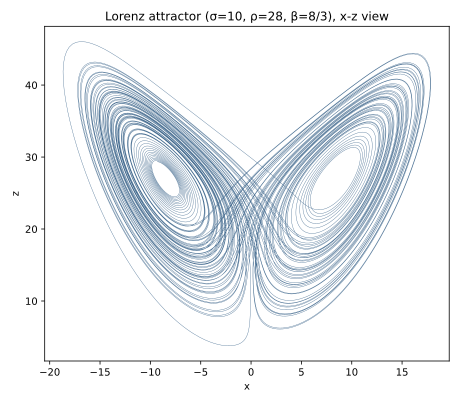

# ch11 — 奇異吸子：被困住又永不重複

> **本章解決什麼問題**：上一章 ch10 給了你看混沌的鏡頭——相空間（phase space），狀態是一個點、演化是一條軌跡（trajectory），而軌跡因為決定論不能自交。我們也認識了三種「乖」的吸子：不動點、極限環、環面。這一章要看第四種、也是混沌的那一種——奇異吸子（strange attractor）。它是本書的視覺高潮：勞侖次（Lorenz）那組三條方程式畫出的「蝴蝶」，一條軌跡被永遠困在一個有限的形狀裡，卻永不重複、永不自交。本章只講它「長什麼樣、為什麼這幾個性質能共存」；把「它有多碎」量化成碎維度留給 ch13，把「翼內發散有多快」量化成 Lyapunov 指數留給 ch14。

## 從你已知的出發

先從一個你天天在做、卻很少這樣命名的觀察開始：**你的線上服務，長期行為通常會被「吸」到一個固定形狀上。**

想一個健康的、跑了很久的後端服務。它的 QPS、p99 延遲、記憶體用量、連線數，這些指標每一刻都在動，從來沒有兩個瞬間數字完全一樣。但如果你把幾週的監控攤開來看，你會發現它的行為**有個形狀**：白天高、深夜低的日週期；記憶體在 GC 之間鋸齒上下、但被框在一個區間裡；p99 大多數時間貼著一條基線、偶爾被尖峰頂上去又掉回來。系統的瞬時狀態一直在變，但這些狀態**長期下來只在某一塊區域裡活動**，不會跑到任意地方去。

把這件事翻譯成 ch10 的語言：系統的長期行為被吸進相空間裡某個**低維的集合**上。那個集合，就是這個系統的吸子（attractor）——**它是「穩態行為的形狀」**。注意這裡的「穩態」不是「不動」：一個健康的服務不會凍結在某個固定數字上（那是不動點吸子），它是在一個有結構的區域裡不停活動。autoscaler 反覆在某幾個副本數之間擺盪、最後落到一個週期性的呼吸節律——那是極限環吸子。這些你都在 ch10 見過了。

現在問一個你大概沒問過的問題：**有沒有一種吸子，系統被它困住、永遠跑不出去（有界），但在裡面卻永遠不重複任何一個狀態（永不穩定、永不週期）?**

聽起來像在硬湊矛盾。「被困在有限區域」聽起來就該「遲早繞回老地方」——就像一個只有有限個狀態的 state machine，跑久了必然進入循環，這幾乎是你判斷一個系統「卡死在迴圈裡」的本能。可是混沌系統偏偏不是這樣：它被關在一個有限的盒子裡，卻能無限長地走下去而從不精確重複任何一步、也從不自己撞到自己走過的路。

這就是奇異吸子。它把「有界」和「永不重複」這兩件你直覺上對立的事，硬塞進同一個形狀裡共存。我認為這是整本書最值得你盯著一張圖發呆十分鐘的一頁——因為你的「有限就會循環」直覺，正要在這裡被一個碎形（fractal）騙過去。

## 勞侖次的三條方程式：一隻被壓扁的雲

奇異吸子最有名的那一個，來自我們在 ch03 已經見過的勞侖次。當時我們講的是他 1961 年那杯咖啡的故事，看 SDIC 第一次砸到人臉上；現在我們要看的是他 1963 年那篇〈Deterministic Nonperiodic Flow〉裡留下的另一份遺產——把十二變數的天氣模型砍到只剩三個變數之後，那三條方程式畫出來的形狀。

那三條常微分方程（ODE）是這樣的，用全書的記號寫（σ、ρ、β 是三個參數，dx/dt 讀作「x 對時間的瞬時變化率」，見《馴服無限》微分方程的章）：

```text
        dx/dt = σ · (y − x)            ← σ（sigma）= 10
        dy/dt = x · (ρ − z) − y        ← ρ（rho）  = 28
        dz/dt = x · y − β · z          ← β（beta） = 8/3 ≈ 2.6667

        經典參數：σ = 10、ρ = 28、β = 8/3
```

**先說好：本書不要求你解這組方程式，也不要求你算任何一步。** 解 ODE 是《馴服無限》的事；這裡我們只要它的幾何意義。但你該知道這三條式子是從哪來的，否則它會像天上掉下來的符號。

它們是一個被狠狠簡化的**對流（convection）模型**——更精確地說，是熱對流（Rayleigh–Bénard convection，瑞利–貝納對流）的最低階近似。想像一層流體（一鍋湯、一層大氣），底下加熱、上面冷卻。底部的熱流體變輕想往上浮，頂部的冷流體變重想往下沉，於是流體裡形成一個個翻滾的**對流捲（convection roll）**——熱的上升、冷的下降，繞成一個迴圈。你煮味噌湯時看到湯面那些慢慢翻動的胞狀花紋，就是這東西。

勞侖次把這個翻滾的物理，抽象成三個數：

```text
   x ← 對流翻滾的強度與方向（捲得多猛、往哪個方向捲）
   y ← 上升流與下降流之間的溫差
   z ← 垂直溫度分布偏離「平滑直線」的程度

   σ ← 流體的黏性 / 導熱比（Prandtl 數，普朗特數）
   ρ ← 加熱有多猛（正規化的 Rayleigh 數，瑞利數；ρ=28 已超過會亂翻的臨界）
   β ← 對流捲的幾何（水平尺度有關的常數）
```

關鍵在那個 **xz 與 xy 的乘積項**——`x·z` 和 `x·y`。這兩個變數相乘，就是**非線性（nonlinear）**的來源。如果三條式子全是線性的（變數只做加減、不互相相乘），系統最多收斂到不動點或繞出乾淨的橢圓，不可能混沌（這背後有 ch10 提過的 Poincaré–Bendixson 那一類結果撐著，本書不展開）。是這個「x 乘以 z」「x 乘以 y」的耦合，讓三個變數互相拉扯、把行為攪成混沌。你在 ch02 的三體問題裡見過同一種味道：兩個東西相加可解，第三個進來相乘就纏死。

把 ρ 轉到 28（加熱夠猛），這個系統就不再安安分分地翻滾，而是開始做一件怪事：它在相空間裡畫出一隻蝴蝶。

## 那隻蝴蝶：一條軌跡，兩個漩渦

把這三個變數 (x, y, z) 當成三維相空間裡的座標，每一個瞬間的系統狀態就是一個點；隨時間演化，這個點拖出一條連續的軌跡。勞侖次讓電腦把這條軌跡畫出來，看到的是這個——



如果你手邊還沒有那張 SVG，先用文字把它的骨架在腦裡搭起來。從 xz 平面（從正面）看，這隻蝴蝶長這樣：

```text
   z
   ↑        左翼                       右翼
   │      ╭─────╮                   ╭─────╮
   │     ╭┴╮   ╭┴╮                 ╭┴╮   ╭┴╮
   │    ╭┴╮╲  ╱┴╮╲               ╱┴╮╲  ╱┴╮╲
   │   （ 漩渦 L ）              （ 漩渦 R ）       ← 兩個「翼」=兩個漩渦
   │    ╲┴╯╱  ╲┴╯╱               ╲┴╯╱  ╲┴╯╱        各自繞著一個中心打轉
   │     ╲╯    ╲╯  ╲           ╱  ╲╯    ╲╯
   │            ╲   ╲─────────╱   ╱               ← 軌跡在兩翼之間「跳」
   │             ╲             ╱                     何時跳、跳幾圈：無規律
   └──────────────╳───────────────────────→ x
                  兩翼相交處：看似交叉
                  其實在三維裡是不同高度,不真的交
```

這條軌跡的行為，用一句工程師聽得懂的話描述：**它在左漩渦繞幾圈，忽然甩到右漩渦繞幾圈，再甩回來——而「這次繞幾圈、什麼時候跳」這件事，毫無規律、無法預測。**

幾件事要你親手在腦裡確認一遍：

**它永遠出不去。** 不管你讓它跑多久，這條軌跡始終貼在這個蝴蝶形狀的「表面」上活動，從不衝到形狀之外的空白處去。系統是**耗散的（dissipative）**——就像加熱的流體會把能量黏滯耗掉——相空間裡的體積會被持續壓縮，把所有軌跡都吸向這個薄薄的集合。所以它叫吸子：四面八方的起點，最後都被吸到這隻蝴蝶上來。**這是「有界（bounded）」。**

**它永遠不重複。** 你可能會想：既然被關在這麼一小塊區域裡，繞久了總該繞回某個走過的點，然後從那點開始一字不差地循環下去吧？——不會。這條軌跡是**非週期（aperiodic）**的，它無限長地走下去，永遠不會精確回到任何一個它到過的狀態。論文標題那個刺眼的詞組——「Deterministic Nonperiodic（決定性的、非週期的）」——講的就是這件事。**這是「永不重複」。**

**它永遠不自交。** 這點 ch10 已經立過規矩：因為系統是決定論的，相空間裡同一個點只能有唯一一個未來（給定狀態，下一刻的去向是唯一確定的）。如果軌跡自己撞上自己走過的某一點，那一點就有了兩個不同的未來——矛盾。所以這條連續軌跡**從不真正穿過自己**。**這是「不自交」。**

把這三件事放在一起，你應該開始覺得哪裡不對勁了。下一節就來面對這個「不對勁」。

## 為什麼這隻蝴蝶該叫「奇異」

「吸子」這個詞你 ch10 已經熟了：軌跡趨近的極限集合。不動點、極限環、環面都是吸子，但它們都很「乖」——形狀是光滑的點、圈、面，維度是乾淨的整數（0 維、1 維、2 維），軌跡落上去之後要嘛停住、要嘛週期性地繞。

勞侖次這隻蝴蝶不乖。它的奇異（strange）體現在兩個層面，**一個是動力上的、一個是幾何上的**：

```text
                乖的吸子（ch10）           奇異吸子（本章）
                ─────────────────         ─────────────────────────
 動力行為        落上去 → 穩定/週期         落上去 → 永不重複、對初值敏感
 幾何形狀        光滑、整數維度            碎形、分數維度（≈2.06,見 ch13）
 兩條鄰近軌跡    保持靠近或同步收斂        在吸子上指數分開（翼內發散）
 整體尺度        有界                      有界（這點和乖的一樣）
```

- **動力上的奇異**：落在這個吸子上的軌跡是混沌的——非週期、而且對初始條件敏感。把兩個幾乎重合的起點放上這隻蝴蝶，它們會一起繞、一起跳，但**在翼內繞圈的過程中悄悄被拉開**，繞著繞著就分道揚鑣，下一次跳翼的時機完全錯開。這正是 ch03 那張發散表在連續時間裡的版本：誤差在翼內被指數放大。本章只說到「翼內發散、整體有界」這個定性畫面就停；那個放大率有多大、怎麼變成一個叫 Lyapunov 指數的數，是 ch14 的事（劇透一下：勞侖次系統的最大 Lyapunov 指數 ≈ 0.9056 > 0，正號就是混沌的數字簽名，以 landscape 為準）。

- **幾何上的奇異**：這隻蝴蝶不是一個光滑的「面」。如果你把它放大、再放大，會發現它由無窮多層薄片疊成，層裡有層、永遠看不到「最底下那一層平滑的紙」——它是個碎形。維度不是乾淨的整數，而是介於 2 和 3 之間的一個分數，約 2.06（碎維度的精確意義與算法留給 ch13；這個值以 landscape 為準）。「比面（2 維）多一點、又遠不到體（3 維）」——這正是「奇異」二字在幾何上的意思。

**「strange attractor（奇異吸子）」這個名字本身有出處，而且不是勞侖次取的。** 它由數學物理學家盧埃勒與塔肯斯（David Ruelle & Floris Takens）在 1971 年的論文〈On the Nature of Turbulence〉（論湍流的本質，刊於 *Communications in Mathematical Physics* 卷 20）裡鑄造出來，原本是用來描述湍流（turbulence）背後那種既被吸引、形狀又怪異的集合（照 landscape）。勞侖次 1963 年畫出了這個東西，但「奇異吸子」這個名字，是八年後盧埃勒和塔肯斯掛上去的。這和 ch03 的教訓一脈相承：混沌史上太多東西的名字，都不是發現它的人取的（蝴蝶是 Merilees 取的，奇異吸子是 Ruelle–Takens 取的）。

## Worked example：口頭推演「有界 ＋ 永不重複 ＋ 不自交」為何只能這樣共存

這是本章的核心推演，也是最值得你慢下來的一段。我們不算任何數字，純用幾何邏輯，把上面那三個性質擺在一起逼問：它們真能同時成立嗎？如果能，是靠什麼？

先把三個約束一條一條列清楚，看它們怎麼互相掐住對方：

```text
 約束 ①  有界      ：軌跡只能在一個有限大小的盒子裡活動，出不去。
 約束 ②  永不重複   ：軌跡永遠不精確回到任何到過的狀態（非週期）。
 約束 ③  不自交      ：軌跡（在三維裡）從不穿過自己走過的路。
```

現在我們做工程師最愛做的事：假設其中一條不成立，看會撞出什麼矛盾。

**先試「軌跡是一條普通的、不會無限細分的線」。** 假設這條軌跡就是一條有正常粗細、佔據正常空間的曲線，被關在有限盒子裡（約束 ①）、不能自交（約束 ③）。一條不能自交的線在有限空間裡能畫多長？——想想你在一張 A4 紙上畫一條不能碰到自己的線。你可以畫得很彎、很繞，但紙的面積有限、線又有寬度，**畫到某個程度就無路可走了**：四周都是自己畫過的線，下一筆無論往哪走都會碰到自己。也就是說，「有界 ＋ 不自交 ＋ 線有正常粗細」這三個一湊，軌跡的長度就**必然有上限**——它撐不了無限久。可是約束 ② 要它永遠走下去、永不重複，需要無限長的軌跡。**矛盾。** 三個約束在「普通的線」這個前提下無法共存。

所以前提錯了。能讓三者共存的，只剩一條出路：**這條軌跡必須以一種「無限不重複地摺進一個無限細分的集合」的方式存在。**

把它拆開來理解這條出路怎麼同時滿足三條：

```text
   想讓「有限的盒子」裝下「無限長、不自交、不重複」的線,
   唯一的辦法是——讓裝它的那個集合本身有「無窮多的層次」:

       一層紙  → 容量有限,線很快無處可去（上面那個矛盾）
       兩層紙  → 線可以從這層滑到那層,容量翻倍
       無窮多層 → 線可以一層一層永遠摺下去,
                  每靠近一次就鑽進更細的夾層,永遠有新的縫可鑽
                  → 永遠不必碰到自己,也永遠不必精確重複
                  → 但所有的層加起來,仍然被關在那個有限盒子裡

   「無窮多層、層裡有層、放大永遠看到更多層」——
    這正是碎形（ch12–13）。奇異吸子=軌跡的這個無限分層集合。
```

換句話說：**為了同時做到「有界」「永不重複」「不自交」，軌跡被逼著把自己摺進一個碎形集合裡。** 有限的盒子裝不下無限長的普通線，但裝得下一條鑽進「無窮細分的夾層」裡的線——因為那個集合在任何尺度上都還留著更細的縫給它鑽。蝴蝶看起來像兩片光滑的翼，但你放大任何一小塊，會發現它是無數薄片疊出來的，軌跡就在這些薄片之間永遠摺、永遠鑽，從不真的貼上前一圈走過的那一條。

那麼，是什麼物理機制在每一圈把軌跡「摺」進更細的夾層、同時又在翼內把鄰近軌跡「拉」開？——**拉伸（製造翼內發散、製造對初值敏感）＋ 摺疊（把拉長的軌跡塞回有限盒子、製造碎形分層）。** 這台「拉伸＋摺疊」的機器，就是混沌的製造工序，是 ch16 的主角。本章你先記住結論：**「有界＋永不重複＋不自交」這個看似自相矛盾的三件套，唯一的共存方式是『無限不重複地摺進一個碎形集合』——而這需要拉伸與摺疊（ch16）來辦到。** 這隻蝴蝶就是這台機器跑了無限久之後留下的指紋。

這一段如果你能用自己的話對另一個工程師重講一遍——「有限空間裝不下無限長的普通線，所以軌跡被逼成碎形」——你就抓住了奇異吸子最反直覺、也最美的那一點。

## 直覺的陷阱

奇異吸子這張圖太有名，於是被誤讀的方式也特別固定。下面三條，每一條都是「你看圖時腦子自動腦補的版本」對上「它真正的樣子」。

```text
誤解 ①:蝴蝶有「兩個翼」,所以它是兩個吸子 / 兩個穩態。

正確版:它是——一個——吸子。兩翼是同一個吸子的兩個瓣(lobe),
        被同一條軌跡反覆纏繞著連在一起,不是兩個分開的東西。
```

這是頭號陷阱。你看到左右兩坨漩渦，很容易腦補成「系統有兩個穩態，在兩者之間切換」——像一個有兩個吸引盆（basin）的雙穩態系統，掉進左邊就待左邊、掉進右邊就待右邊。**錯。** 奇異吸子是**單一**的吸子：同一條軌跡會繞左翼幾圈、跳到右翼繞幾圈、再跳回來，左右兩翼是被這同一條軌跡密密縫在一起的，不是兩個各自獨立、井水不犯河水的穩態。如果真是兩個分開的吸子，軌跡掉進一邊就出不來了；但這條軌跡恰恰是**不停在兩翼之間跳**，而且何時跳、跳幾圈毫無規律——這正是它混沌的標誌。把「兩翼」當成「兩個吸子」，你就會問出「怎麼預測它下一次會待在哪一翼」這種問錯的問題：原則上你問的是一個混沌系統的長期軌跡，答案就是測不準（這是 ch04「決定但不可測」那一象限）。

```text
誤解 ②:「形狀像蝴蝶」就是「蝴蝶效應」那隻蝴蝶。

正確版:兩隻蝴蝶是兩件事的雙關巧合,沒有因果關係。
        「形狀的蝴蝶」=這個吸子在相空間像對翅膀(本章);
        「拍翅的蝴蝶」=Merilees 1972 擬的演講題目隱喻(ch03)。
```

這條 ch03 釘過一次，這裡因為你正盯著那張蝴蝶圖、最容易在這裡犯，所以再釘一次。**不是**「因為吸子長得像蝴蝶，所以叫蝴蝶效應」。順序甚至相反：「蝴蝶效應」這個詞（1972 的演講題目，講的是拍翅膀的隱喻）流行起來的時候，這個吸子還沒有被普遍叫做「蝴蝶吸子」。兩隻蝴蝶剛好同名，純屬語言巧合（照 landscape T2）。下次有人對你說「你看這個吸子長得像蝴蝶，所以叫蝴蝶效應」，你知道他把兩件事縫成了一件。

```text
誤解 ③:那些「交叉點」是軌跡真的撞到自己了。

正確版:那是把三維軌跡——投影——到二維平面才出現的假交叉。
        在真正的三維裡,兩條看似相交的線在不同高度,不真的交。
```

你盯著 xz 平面那張圖，會看到軌跡在兩翼相接的地方似乎交叉了好多次。**那是投影的假象。** 你看到的是一隻三維的蝴蝶被拍扁到二維平面上的影子；影子裡兩條線疊在一起，不代表三維裡它們真的碰到——它們只是在你的視線方向上一前一後、不同深度，就像你從正面看立交橋，上下兩條路在照片上「交叉」，實際在空間裡差著一層樓的高度。為什麼三維裡一定不真交？因為決定論不允許（前面說過、ch10 立過：自交 = 一個點有兩個未來 = 矛盾）。所以**每一個看似的交叉點，在三維裡都是兩條線在不同高度擦身而過**。這也順帶解釋了那個碎形結構是怎麼來的：軌跡為了永遠不真的碰到自己，被逼著在第三個維度上不斷把自己摺進越來越細的夾層裡——正是上一節 worked example 推出來的那回事。

| 你看到的 | 你腦補的（錯） | 它真正的樣子（對） |
|---|---|---|
| 兩個漩渦 | 兩個吸子、兩個穩態 | 一個吸子的兩瓣，同一條軌跡縫在一起 |
| 形狀像蝴蝶 | 所以叫「蝴蝶效應」 | 與拍翅蝴蝶是雙關巧合，無因果 |
| 圖上一堆交叉點 | 軌跡撞到自己了 | 二維投影的假象，三維裡不同高度、不真交 |
| 被關在小盒子裡 | 遲早繞回老地方循環 | 摺進碎形，永不重複也永不自交 |

## 紙上推演

### 推演題 1 ★ **[10 分鐘]**

你的同事看著勞侖次蝴蝶圖說：「這系統有兩個穩態，左邊一個、右邊一個，所以它在兩個狀態之間切換——本質上是個雙穩態（bistable）系統嘛。」請用兩到三句話指出他哪裡錯了，並說清楚「正確的一句話」該怎麼講。

#### 推演解答

他把「兩翼」當成「兩個吸子」了，這是本章頭號陷阱。正確版：這是**單一**的奇異吸子，左右兩翼是它的兩瓣，被**同一條**軌跡反覆纏繞著連在一起——軌跡會繞左翼幾圈、跳到右翼繞幾圈、再跳回來，左右是被同一條連續軌跡縫起來的，不是兩個獨立的穩態。

要點是抓住「雙穩態」和「奇異吸子」的關鍵差別：

- 真正的雙穩態系統有**兩個分開的吸子**，各有自己的吸引盆；軌跡掉進哪一盆就待在哪一盆，**出不來**。
- 奇異吸子只有**一個**；軌跡恰恰**不停在兩翼之間跳**，而且何時跳、跳幾圈毫無規律——這個「跳的不可預測」正是它混沌的標誌，也正是它**不是**雙穩態的證據。

如果它真是雙穩態，「它現在在左翼還是右翼」會是個有穩定答案的問題；正因為它是單一奇異吸子上的混沌軌跡，這個問題的長期答案才是「原則上測不準」（ch04 的「決定但不可測」象限）。

### 推演題 2 ★★ **[15 分鐘]**

請只用幾何邏輯（不准算任何數字）論證：一條被關在有限盒子裡、且永遠不自交的**普通粗細**的線，不可能無限長。再說明奇異吸子是怎麼繞過這個限制的。

#### 推演解答

這是本章 worked example 的自證版，目標是讓你能獨立重建那條論證。

**第一步，論證「有界 ＋ 不自交 ＋ 普通粗細 ⇒ 長度有限」。** 一條有正常粗細（佔據正常空間、不能無限細分）的線，每走一段就「用掉」盒子裡的一塊空間，而且因為不能自交，這塊空間以後不能再被經過。盒子的總容量是有限的（有界）。於是每多走一段就少一塊可用空間，可用空間是有限的、又只減不增——**遲早用完**。用完的那一刻，線的四周都是自己走過的路，無論往哪走下一步都會碰到自己，與「不自交」矛盾。所以這樣的線**必然在有限長度內走投無路**，不可能無限長。

（類比：在一張有限大小的紙上畫一條有筆寬、不能碰到自己的線，你一定畫到某一刻就被自己圍死、畫不下去。）

**第二步，奇異吸子怎麼繞過。** 它讓裝軌跡的那個集合**不是普通粗細**，而是一個**無窮細分的碎形**——層裡有層，在任何尺度上放大都還會冒出更細的夾層。於是軌跡永遠有「更細的縫」可以鑽：它不必碰到自己（不自交照樣成立）、也不必精確回到老地方（永不重複照樣成立），卻又始終被關在那個有限盒子裡（有界照樣成立）。第一步的矛盾之所以解除，關鍵就在「普通粗細」這個前提被換成了「無窮細分」。代價是這個集合的維度不再是乾淨的整數，而是個分數（≈2.06，ch13 量化）。

**常見錯路**：有人會說「那把線畫得無限細不就行了，幹嘛要碎形？」——線畫得無限細只是讓它變成數學上的一維曲線，但一條一維曲線塞進有限三維盒子、又要無限長不自交，仍然需要那個**容納它的集合**有無窮細的結構才裝得下（無限長的一維線要「填」進有限區域而不自交，它趨近的極限集合本身就被逼成大於一維的碎形）。重點不在線本身多細，而在**裝它、它趨近的那個吸子集合**必須無窮分層。

### 推演題 3 ★★★ **[15 分鐘]**

勞侖次系統那三條 ODE 裡，有兩個項是「兩個變數相乘」（x·z 和 x·y）。請用自己的話說明：為什麼這兩個乘積項是這隻蝴蝶能存在的關鍵？如果把它們拿掉、讓三條式子全變成線性的，吸子會變成 ch10 裡哪種「乖」的吸子？

#### 推演解答

**乘積項 = 非線性 = 混沌的必要條件。** `x·z` 和 `x·y` 是兩個變數相乘，這讓系統變成**非線性**的：一個變數的變化率不只取決於它自己和別人線性疊加，而是取決於變數**彼此相乘的耦合**。這種耦合會讓三個變數互相拉扯、互相放大或抑制，產生「翼內把鄰近軌跡拉開、整體又被摺回有限區域」的複雜行為——也就是混沌需要的拉伸與摺疊（ch16）。

**如果拿掉乘積項、全線性化**，系統就只剩變數的線性組合。線性系統的長期行為非常受限：它只能收斂到一個**不動點**（所有東西衰減到一個固定狀態，對應 ch10 的不動點吸子，相圖上是螺旋進一個點），或者繞出**乾淨的橢圓 / 螺旋**、或者指數爆掉跑到無窮遠（那就不是吸子了）。線性系統**畫不出**這種有界又非週期的碎形蝴蝶——它沒有能力把行為攪成混沌。

所以「非線性」是混沌的**必要條件**（不是充分條件——很多非線性系統也很乖）。這隻蝴蝶的「奇異」，根子上來自那兩個不起眼的乘積項。這也呼應 ch02 的三體：兩體（線性可解）規規矩矩，第三體進來、引力項把座標**相乘**耦合起來，整個問題就纏成不可積——同一種「相乘 → 纏死」的味道。

（補一個誠實標示：「少於三維的連續系統不可能混沌」這件事背後是 Poincaré–Bendixson 定理，本書不展開、只用結論；勞侖次砍到剛好三維、又保留非線性乘積項，是混沌能出現的最低配置。）

## 自我檢核

口頭自答，講得出來才算過關：

1. 用一句話說「吸子是什麼」，再說「奇異吸子和不動點 / 極限環這些『乖』吸子，奇異在哪兩個層面」（一個動力、一個幾何）。
2. 為什麼「有界 ＋ 永不重複 ＋ 不自交」這三件事，用一條普通粗細的線辦不到？那條「線在有限盒子裡走投無路」的矛盾，你能自己推一遍嗎？
3. 三者唯一的共存方式是什麼？（提示：摺進一個碎形）這跟 ch16 的「拉伸與摺疊」是什麼關係？
4. 為什麼勞侖次蝴蝶的「兩翼」不是兩個吸子、不是兩個穩態？它和一個真正的雙穩態系統，行為上最關鍵的差別是哪一點？
5. 你在 xz 投影圖上看到的那些「交叉點」，為什麼在三維裡其實不是真的交叉？為什麼決定論「不允許」軌跡真的自交？
6. 「形狀像蝴蝶」和「蝴蝶效應」是同一回事嗎？如果不是，這兩隻蝴蝶各自指的是什麼？（一個是 ch11 的形狀、一個是 ch03 的拍翅隱喻）
7. 勞侖次那三條方程式裡，哪兩個項讓系統變成非線性？如果拿掉它們、全線性化，這隻蝴蝶會塌成哪種乖吸子？
8. 「strange attractor」這個名字是誰取的、哪一年？（提示：不是勞侖次本人——和 ch03 蝴蝶名字不是勞侖次取的，是同一個教訓）

## 延伸閱讀

- **Strogatz，《Nonlinear Dynamics and Chaos》第 9 章（Lorenz Equations）** — 本章勞侖次系統的標準教科書版，把三條 ODE 的物理來歷、不動點、為什麼 ρ=28 會混沌講得最乾淨。讀 9.1–9.3，看完你會發現本章只是它的幾何直覺版。
- **Lorenz, "Deterministic Nonperiodic Flow", *J. Atmos. Sci.* 20 (1963), 130–141** — 奠基論文本尊，畫出這隻蝴蝶的那一篇。讀它的摘要與結尾幾段（"there is an infinite complex of surfaces"——他自己就點出了那個碎形結構，只是當時還沒有「碎形」這個詞）。（https://journals.ametsoc.org，搜 Deterministic Nonperiodic Flow）
- **Ruelle & Takens, "On the Nature of Turbulence", *Comm. Math. Phys.* 20 (1971), 167–192** — 「strange attractor」一詞的出生地，把奇異吸子和湍流連起來的那篇。技術較重，但你至少該知道這個名字從哪來。（https://link.springer.com，搜 On the Nature of Turbulence Ruelle Takens）
- **Sprott, "Lyapunov Exponent and Dimension of the Lorenz Attractor"** — 勞侖次吸子那組 Lyapunov 指數（≈+0.906, 0, −14.572）與碎維度（≈2.062）的數值出處，本書 landscape 的 Lorenz 數值就以它為準。想看那兩個本章只給定性、留給 ch13/ch14 的數字是怎麼算出來的，去這裡。（https://sprott.physics.wisc.edu/chaos/lorenzle.htm）
- **本書 ch12–ch13** — 「碎形」與「碎維度」。本章一直在說這隻蝴蝶是碎形、維度約 2.06，但「碎形到底是什麼、維度怎麼會是分數」留在那兩章從頭講。本章 worked example 推出的「無窮細分集合」，在那裡會變成 Koch 曲線、Cantor 集這些能上手算的具體例子。
- **本書 ch16** — 「拉伸與摺疊」。本章反覆預告的那台「在翼內拉開、把整體摺回有限盒子」的機器，在那裡會被拆開看清楚——它就是讓「有界＋永不重複＋不自交」能共存的物理工序。
