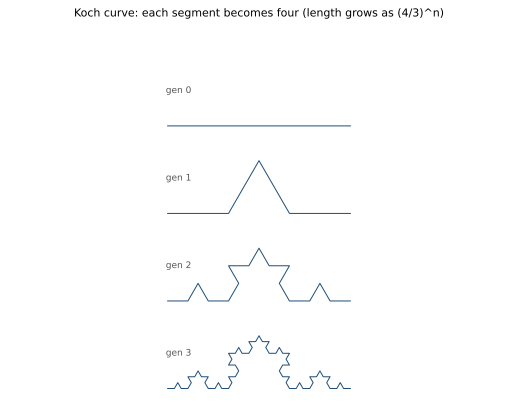
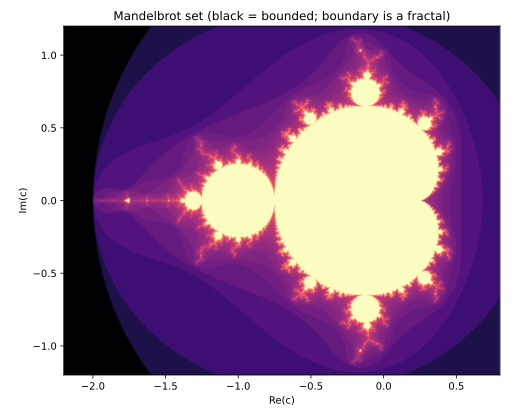

# ch12 — 碎形與自相似：放大還是它自己

> **本章解決什麼問題**：上一章你看到勞侖次吸子被困在有限的盒子裡，卻永遠不重複、永遠不自交。我說那是「幾何上的碎形」，但沒解釋碎形到底是什麼。這章補上：碎形（fractal，中國大陸譯分形）就是**放大局部還是整體縮影**的形狀——自相似（self-similarity）＋細節無窮。我們用 Koch 曲線、Cantor 集這兩個手工可造的玩具把規則講清楚，再看一個惡名昭彰的後果——海岸線量不出長度；最後回到脊椎的老朋友：Mandelbrot 集，一條二次迭代式 zₙ₊₁ = zₙ² + c 的「會不會發散」邊界，竟也是碎形。本章只造形狀、數段數與長度；「碎形到底有幾維」這個數字留給 ch13。

## 從你已知的出發

你寫過的程式裡早就藏著碎形的生成法，只是你叫它別的名字。

先想最熟的那個：**遞迴資料結構**。一棵 DOM 樹、一棵 B-tree、一個檔案系統的目錄樹。樹的定義是什麼？「一個節點，底下掛著若干棵**子樹**——而每棵子樹，又是一個節點底下掛著若干棵子樹。」這個定義是**自我引用**的：要解釋「樹」，你用到了「樹」。於是你隨手畫一棵目錄樹，砍掉根節點、只看其中一棵子樹——它**還是一棵長得一樣的樹**。放大局部，看到的是整體的縮影。這就是自相似，你天天在跟它打交道。

再想**無限滾動**（infinite scroll）那種 UI。你做過後台列表頁，往下捲、再載入一批、再往下捲、再載入一批。每一批的版型跟上一批一模一樣：同樣的卡片、同樣的間距、同樣的「載入更多」哨兵。你把畫面往任一段拉，看到的結構都相同。這是「同一條版型規則，套用在自己滾出來的輸出上，永遠重複」——尺度（捲動位置）變了，結構不變。

最關鍵的工程直覺是這一條：**把同一條規則，反覆套用在它自己上一輪的輸出上**。

```text
    形狀₀  →（套規則 R）→  形狀₁  →（套同一條規則 R）→  形狀₂  →  …
```

這個句型你應該覺得眼熟——它就是脊椎遞迴式 xₙ₊₁ = r·xₙ·(1 − xₙ)（ch05 那條）的家族長相：**拿這一輪的東西，套同一條規則，算出下一輪**。脊椎迭代的是一個數（0 到 1 之間的 x），碎形迭代的是一個**形狀**（一段線、一個點集合）。規則一樣是「套在自己的輸出上」，差別只在被套的對象：一邊是數，一邊是幾何。

這個血緣不是比喻而已。本章最後的 Mandelbrot 集，迭代的式子 zₙ₊₁ = zₙ² + c 跟脊椎簡直是親兄弟——都是二次式（脊椎展開是 −r·x² + r·x，也是二次）、都是把上一輪餵回下一輪。差別只在 z 是複數、x 是實數。所以你看：碎形的生成法（規則套在自己輸出上）＝脊椎的迭代。理解了這個句型，碎形就不再是「美術館裡很炫的圖」，而是一台你早就會操作的迭代機。

本章我們手工轉這台機器幾圈，看它造出什麼。

## 自相似：放大局部還是整體

先把碎形最核心的那句話釘死，因為它常被講歪（見〈直覺的陷阱〉）。

**自相似（self-similarity）：放大形狀的任一小塊，看到的還是整體的縮影。**

對照一個**不**自相似的東西你就懂了。拿一個圓。圓的邊界是一條曲線，但你把圓周的一小段不斷放大，它會越來越**平**——放大到極限，一小段圓弧跟一條直線分不出來。這是「光滑」曲線的本性：放大就變平、細節會耗盡。微積分能算圓周長（2πr），靠的正是這件事——量尺越短，折線逼近越準，長度收斂到一個固定值（見《馴服無限》談弧長）。

碎形反過來。你放大它的一小塊，**細節不但沒耗盡，還冒出和原來一模一樣的新細節**。再放大，又冒出來。永遠冒不完。所以碎形有兩個必須同時成立的性質：

```text
    碎形 = 跨尺度自相似（放大還是它自己）+ 細節無窮（放多大都還有結構）
```

少了哪一個都不算。一張「很複雜、很細碎」但放大到某個尺度就變平的圖，不是碎形（細節會耗盡）。一條放大後自相似、但只有兩三層就停的圖（像有限層的樹），是「近似碎形」——真正的數學碎形是**無窮層**的理想化。自然界沒有真碎形（海岸線放大到分子就不自相似了），但「在很多尺度上自相似」已經足以讓海岸線量不出長度，這是下一節的事。

工程上你最接近真碎形體驗的地方，其實是**hash 與雜湊空間**。一個好的 hash function，你看它輸出的任一段 bit、任一個 bucket、任一個子區間，統計結構都「長得一樣」——沒有哪一段特別密、哪一段特別疏，放大任一塊看都是同樣的均勻亂。那種「每個尺度看都一樣」的自相似質感，就是碎形的味道（雖然 hash 的自相似是統計意義的，不是幾何形狀的精確複製）。

接下來我們造兩個能用手算到底的碎形，把「規則套在自己輸出上」變成具體步驟。

## Koch 曲線：一段變四段，長度漲到無窮

Koch 曲線是最好親手造的碎形，因為規則簡單到一句話：

**規則 R：把每一段線，中間三分之一挖掉，換成一個向外凸的等邊三角形的兩條邊。於是一段變成四段，每段長度是原來的 1／3。**

我們從一條長度為 1 的直線段開始（第 0 代），逐代套 R。畫個示意：

```text
  第 0 代（一條直線段，長度 1）：
      ●━━━━━━━━━━━━━━━━●

  套規則 R：中間 1/3 挖掉，補上等邊三角形的兩邊（一段→四段）
                  ╱╲
                 ╱  ╲
      ●━━━━━━━●    ●━━━━━━━●      ← 第 1 代：4 段，每段長 1/3

  對第 1 代的每一段再套同一條 R（每段又各自長出一個小尖角）：
      第 2 代：4×4 = 16 段，每段長 1/9，到處是更小的尖角
```

關鍵是「對**每一段**都套同一條 R」——這就是「規則套在自己上一輪輸出上」。第 1 代有 4 段，每段都長出一個尖角，變成 4×4＝16 段；第 2 代的 16 段又各自長尖角，變 64 段。我們把段數 N 和總長度逐代記下來（手算複核過）：

```text
  Koch 曲線：每代「段數 ×4、每段長 ×(1/3)」⇒ 總長 ×(4/3)

  代數 n   段數 N = 4ⁿ   每段長 = (1/3)ⁿ   總長度 = (4/3)ⁿ
  ─────   ──────────   ─────────────   ──────────────────
    0          1            1              1            = 1.0000
    1          4            1/3            4/3          ≈ 1.3333
    2         16            1/9            16/9         ≈ 1.7778
    3         64            1/27           64/27        ≈ 2.3704
    4        256            1/81           256/81       ≈ 3.1605
    …          …             …              …
    n         4ⁿ           (1/3)ⁿ          (4/3)ⁿ  ── n→∞ ⟶ ∞
```

每代總長度乘 4／3（因為段數乘 4、每段長乘 1／3，4×(1/3)＝4/3）。4／3 > 1，所以總長度每代都漲，而且是**指數**地漲：(4/3)ⁿ 隨 n 衝向無窮。

停十分鐘看清楚這件事的荒謬：**這條曲線從頭到尾被夾在一個有限的小區域裡**——它就在那條長度 1 的線段附近一點點高的範圍內擺動，你拿一張明信片就蓋得住它。可是它的**長度是無窮**。一條畫得進明信片的曲線，量起來無限長。這就是碎形的招牌震撼，也是下一節海岸線悖論的數學核心：**有限的容身之地，裝得下無窮的長度。**

下面這張圖把前四代並排，你能直接看到「每代多長出一圈更小的尖角、但整體輪廓越來越穩」：



順帶一提，把三條 Koch 曲線拼成一個正三角形的三邊，就是著名的 **Koch 雪花**（Koch snowflake）：周長無窮，但因為整朵雪花被框在外接圓裡，**面積是有限的**（事實上是初始三角形面積的 8／5 倍，這個數不必背）。無窮周長、有限面積，同一個荒謬換個包裝。

## Cantor 集：一段變兩段，長度縮到零

Koch 把長度漲到無窮；現在造一個反方向的碎形，把長度縮到零，但**點一個都沒少光**。這是 Cantor 集（Cantor set），又叫「中三分之一集」（middle-thirds set），規則同樣一句話：

**規則 R′：把每一段線，挖掉中間三分之一，只留下左右兩段。於是一段變成兩段，每段長度是原來的 1／3。**

從長度 1 的線段開始（第 0 代），逐代套 R′：

```text
  第 0 代：  ●━━━━━━━━━━━━━━━━━━●            （一整段，長 1）

  挖掉中間 1/3：
  第 1 代：  ●━━━━━●        ●━━━━━●          （2 段，各長 1/3）

  對留下的每一段再挖掉它的中間 1/3：
  第 2 代：  ●━●   ●━●      ●━●   ●━●        （4 段，各長 1/9）

  第 3 代：  ▪ ▪   ▪ ▪      ▪ ▪   ▪ ▪  …     （8 段，各長 1/27）
```

一樣是「對每一段套同一條規則」。段數逐代乘 2、每段長乘 1／3，所以總長度乘 2／3。記下來（手算複核過）：

```text
  Cantor 集：每代「段數 ×2、每段長 ×(1/3)」⇒ 總長 ×(2/3)

  代數 n   段數 N = 2ⁿ   每段長 = (1/3)ⁿ   留下的總長度 = (2/3)ⁿ
  ─────   ──────────   ─────────────   ──────────────────────
    0          1            1              1            = 1.0000
    1          2            1/3            2/3          ≈ 0.6667
    2          4            1/9            4/9          ≈ 0.4444
    3          8            1/27           8/27         ≈ 0.2963
    4         16            1/81           16/81        ≈ 0.1975
    …          …             …              …
    n         2ⁿ           (1/3)ⁿ          (2/3)ⁿ  ── n→∞ ⟶ 0
```

2／3 < 1，所以每代留下的總長度都縮，(2/3)ⁿ 隨 n 趨近 0。把這過程做到無窮代，**留下來的東西總長度是 0**。

這裡藏著一個比 Koch 還反直覺的東西。你會以為「長度縮到 0，那不就是把線都挖光了、最後什麼都不剩」嗎？**不是。** Cantor 集裡剩下的點多到數不清——精確地說，它和整條 [0,1] 線段**一樣多**（同樣是不可數無窮，cardinality 相同）。為什麼？因為我們每次只挖掉「中間」，兩端的點永遠留著：0 留著、1 留著、1/3 留著、2/3 留著、1/9、2/9、7/9、8/9…每一代的所有端點都活到最後。這些端點多到構成不可數集合。

所以 Cantor 集是：**長度（測度）為 0，但點的數量和整條線段一樣多。** 一個「胖到和整條線一樣、卻又瘦到沒有長度」的鬼東西。它是「塵埃」（dust）——散落在 [0,1] 上、密密麻麻卻處處有縫的點塵。這個「有東西但沒長度」「有點但量不到」的詭異，正是 ch13 要用一個**分數維度**去刻畫的對象：Cantor 集比「一個點」（0 維）多，但比「一條線」（1 維）少，它的維度卡在中間（ln2/ln3 ≈ 0.63，數字留到 ch13 算）。

把 Koch 和 Cantor 擺一起看，碎形造法的兩個方向就清楚了：

```text
  同一個句型「一段 → N 段，每段縮 1/3」，N 不同，命運天差地別：

  Koch：   一段 → 4 段   ⇒ 總長 (4/3)ⁿ → ∞    （往「比線多」長，逼近填滿面）
  Cantor： 一段 → 2 段   ⇒ 總長 (2/3)ⁿ → 0    （往「比線少」縮，逼近一堆塵）
                              ▲
                          臨界線在「一段 → 3 段」：總長 (3/3)ⁿ = 1，
                          就是不挖、原線段，普通的 1 維線
```

這張對照表替 ch13 把舞台搭好了：碎形的「碎」可以朝兩個方向——往「比線多、想填滿面」（Koch，維度 > 1）或往「比線少、退化成塵」（Cantor，維度 < 1）。中間那條「一段變三段」就是不動手、維持 1 維的普通線。一個形狀「有多碎」，本質上就是在問**段數 N 的增速和縮小倍率 1／3 之間的拉鋸**有多激烈——ch13 會把這拉鋸寫成一個公式 D = lnN/ln(1/s)，給每個碎形一個維度數字。本章只負責把 N 和長度算清楚。

## 海岸線悖論：量尺越短，長度越長，永遠不收斂

現在把 Koch 的「有限區域裝無窮長度」搬到地圖上，你就得到混沌史上最有名的一個問句。

1967 年，曼德博（Benoît Mandelbrot）在《Science》發表一篇標題像在開玩笑的論文：〈How Long Is the Coast of Britain?〉（英國海岸線有多長？，《Science》卷 156，1967）。標題像玩笑，內容是嚴肅的：**海岸線根本沒有一個確定的長度。**

問題出在「你拿多長的量尺去量」。曼德博引的是更早的觀察——英國數學家**理查森**（Lewis Fry Richardson）1920 年代研究國界長度時撞到的怪事：百科上量到的西班牙—葡萄牙邊界，葡萄牙說 987 公里，西班牙說 1214 公里，差了快四分之一。差在哪？兩國用了不同長度的量尺。用短量尺的那方，能量進更多小彎、小灣、小凸出，量到的總長就更長。

把這件事做成思想實驗。你要量英國海岸線：

```text
  量尺長度       量到的海岸線長度        為什麼
  ─────────     ─────────────────     ─────────────────────────────
  200 公里       約 2400 公里           大量尺跨過海灣，把彎抹平
   50 公里       約 3400 公里           量進了大海灣
   17 公里       更長                   量進了小海灣
    1 公里       更長                   量進了港口、岩岸的曲折
   10 公尺       更長                   量進了每塊大礁石的輪廓
    1 公尺       更長                   量進了每顆石頭
   …             …                     …
  量尺 → 0       長度 → ∞               永遠有更小的彎可以量進去
```

（上表的數字是示意量級，真實量測隨資料與定義浮動；要點在趨勢，不在精確值。）

注意這跟量圓周完全相反。量圓周時，量尺越短、折線越貼、長度**收斂**到 2πr——有一個確定的答案在那裡等你。量海岸線時，量尺越短、長度越長，**永遠不收斂**，發散到無窮。

這裡是全章最該守住的一刀，請停下來認真讀：

**這不是「量錯了」。沒有人手抖、沒有人儀器不準、沒有人方法錯。** 是海岸線**本身**沒有一個確定的長度可以量。它在每個尺度上都有新的曲折（這正是自相似＋細節無窮，就是 Koch 那條曲線的真實版），所以「長度」這個概念根本不適用於它——就像問「一個 Cantor 塵的長度是多少」一樣，問錯了問題。長度是給光滑曲線（量尺越短會收斂）用的工具，套到碎形身上會發散。

那海岸線到底「有多碎」，難道沒有一個穩定的數字能描述？有——但不是長度，是**維度**。理查森其實量出了一件穩定的事：把「量尺長度」和「量到的總長」取對數畫成圖，會落在一條斜率穩定的直線上，那條斜率就編碼了海岸線的碎形維度（英國海岸線約 1.25，是個經驗估計、隨尺度與資料浮動在 1.25–1.31 之間，2026-06）。長度發散，維度卻穩定——**長度量不出來，但「碎得多厲害」量得出來。** 這就是 ch13 的全部要旨，本章先讓你看到「為什麼非得換一個量不可」。

工程上你撞過同一種「量了反而越量越大」的東西嗎？想想**你怎麼量一個分散式系統的「總延遲」**。你看 P50，覺得很快；換個更細的量尺看 P99，慢了一截；再換 P99.9，又慢一截；P99.99 更慢。每換一個更細的量尺（更高的百分位），你「量到」的壞情況就更糟，而且常常看不到收斂——尾巴一路拖下去。「這系統到底多慢」這個問題，跟「海岸線多長」一樣，答案取決於你拿多細的量尺去看，沒有單一的數能概括。這種「越細看越長／越糟、不收斂」的味道，就是碎形式的縮放。

## Mandelbrot 集：一條二次迭代式的「會不會發散」邊界

最後回到脊椎的血親。Koch 和 Cantor 是「直接對形狀套規則」造出來的碎形；Mandelbrot 集是用**完全不同的方式**冒出來的碎形——它不是誰刻意設計的形狀，而是一條二次迭代式的「會不會炸掉」邊界**自己長**出來的。這正是它震撼的地方。

式子長這樣，跟脊椎是親兄弟：

```text
    脊椎（實數）：  xₙ₊₁ = r · xₙ · (1 − xₙ)      ← 二次、把上一輪餵回
    Mandelbrot：   zₙ₊₁ = zₙ² + c                ← 二次、把上一輪餵回
```

兩條都是「拿上一輪的值平方那一類的二次運算、加個常數、餵回下一輪」。差別只有兩點：Mandelbrot 用的是**複數** z 和 c（複數就是平面上的一個點，有橫軸與縱軸兩個分量，見《馴服無限》談複數），而且固定從 z₀ = 0 出發。

規則是這樣玩的。你**選定一個複數 c**（平面上一個點），然後從 z₀ = 0 開始一直迭代 zₙ₊₁ = zₙ² + c，看這串 z 會怎樣：

- 如果這串 z 越跑越大、衝向無窮（**發散**），那個 c **不屬於** Mandelbrot 集。
- 如果這串 z 永遠待在有限範圍內（**不發散**、有界），那個 c **屬於** Mandelbrot 集。

Mandelbrot 集就是「所有讓迭代不發散的 c」的集合，畫在複數平面上就是你見過的那團黑色甲蟲狀圖案。我們手算幾個 c 看看（複核過，這裡只用實數軸上的 c，方便手算）：

```text
  選 c，從 z₀ = 0 迭代 zₙ₊₁ = zₙ² + c，看發不發散：

  c = 0：    z: 0 → 0 → 0 → …               永遠是 0，有界 ⇒ 0 屬於集合
  c = −1：   z: 0 → −1 → 0 → −1 → 0 → …      在 0 和 −1 之間跳，有界 ⇒ −1 屬於集合
  c = 1：    z: 0 → 1 → 2 → 5 → 26 → 677 …   越跳越大，發散 ⇒ 1 不屬於集合
  c = 0.25： z: 0 → 0.25 → 0.3125 → … 緩緩爬向 0.5，有界（臨界）⇒ 0.25 屬於集合
```

（手算：c=−1 時 z₁=0²+(−1)=−1，z₂=(−1)²−1=0，z₃=−1…兩值循環。c=1 時 z₁=1,z₂=1²+1=2,z₃=2²+1=5,z₄=5²+1=26…炸開。有個方便的事實：一旦某個 |zₙ| 超過 2，後面就一定衝向無窮，所以實作上看到 |z|>2 就可斷定「發散、不在集合裡」。）

於是 Mandelbrot 集是「會收斂與否」這個 yes／no 判斷，在整片複數平面上掃過一遍、把所有「不發散的 c」塗黑得到的圖。它的主體是一個大大的心形（cardioid），心形左邊黏著一串越來越小的圓盤芽苞（bulbs），芽苞上又黏著更小的芽苞……

而真正的碎形震撼在**邊界**。集合的內部（黑色）和外部（發散）之間那條分界線，不是一條光滑的曲線——你放大邊界的任一小段，會無止盡地冒出細絲、漩渦、以及和整個甲蟲**長得幾乎一模一樣的小拷貝**。放大、再放大、放大一兆倍，永遠有新的結構、永遠冒出小 Mandelbrot 自己。這就是自相似＋細節無窮——一條二次迭代式的「收斂與否」邊界，竟是無窮複雜的碎形。



這條邊界碎到什麼程度？這是個漂亮又精確的答案：**Mandelbrot 集邊界的 Hausdorff 維度＝2**（由日本數學家宍倉光廣 Mitsuhiro Shishikura 證明，1991 年公布、1998 年正式發表於《Annals of Mathematics》卷 147）。

這個「2」要小心讀——它是本章〈直覺的陷阱〉的重頭戲，這裡先點到：邊界是一條**曲線**（線狀的東西，直覺上該接近 1 維），它的維度卻是 2，跟一塊**面**一樣。意思是這條邊界碎、皺、纏到一個極致，皺得幾乎像在填滿一塊面積。**注意：說的是「邊界」這條線的維度＝2，不是說 Mandelbrot 集的面積、也不是別的什麼維度。** 維度的精確意義 ch13 講；這裡你只要記住一句能轉述的話：**一條由「平方加常數、再餵回」迭代出來的邊界，皺到維度等於 2——一條線皺成了一塊面。**

為什麼這跟脊椎是同一個故事？因為 Mandelbrot 集在實數軸上那一段（c 是實數的部分），對應的正是另一族邏輯斯諦式映射的分岔行為——你在 ch07 看的分岔圖、ch09 看的混沌帶與週期窗口，和 Mandelbrot 集實軸上的芽苞與細絲，是同一套倍週期、同一套秩序與混沌交織，只是一個畫在「r 軸」上、一個嵌在複數平面裡。**同一個迭代家族（規則套在自己輸出上），在實數線上長出分岔圖、在複數平面上長出 Mandelbrot 碎形。** 脊椎這條式子，到這裡你看到它的第七個面孔之一：它有個複數版的兄弟，而那個兄弟的影子是一幅無窮碎形。

## 直覺的陷阱

碎形是科普重災區，三個誤解我見過最多，每個都會在某一步把你帶溝裡。

```text
  誤解                          會在哪一步出錯                正確版（以 landscape 查證）
  ──────────────────────────  ──────────────────────────  ──────────────────────────────
  「碎形＝很複雜很細碎的圖」      看到一張很炫的細碎圖就喊      碎形 = 跨尺度自相似 + 細節無窮。
                                碎形；但很多細碎圖放大到      關鍵是「放大還是它自己、且永遠
                                某尺度就變平、細節耗盡         冒得出新細節」，不是「看起來複雜」

  「海岸線無限長是測量誤差」      想著「買更精密的儀器、更短      不是誤差。是海岸線本身沒有確定
                                的量尺，就能量到真值」         長度——每個尺度都有新曲折，長度
                                ——於是永遠在追一個            這個量對它根本發散。能量的是維度
                                不存在的數                    （約 1.25），不是長度

  「Mandelbrot 集邊界維度 2＝     把「邊界維度 2」聽成          說的是**邊界這條線**的 Hausdorff
   它面積很大／它是個面」          「它面積是 2」或「它是          維度＝2：一條線皺到像填滿面。
                                二維的面」                    不是面積、不是集合本身的維度
```

第一個誤解最常見也最致命，因為它讓「碎形」這個詞變成形容詞（「好碎形喔」＝「好複雜喔」），徹底失去內容。**自我察覺法**：看到一張你想叫它碎形的圖，問自己兩個問題——(1) 放大它的一小塊，看到的是不是整體的縮影（自相似）？(2) 一直放大，細節會不會耗盡、變平（光滑），還是永遠冒得出新結構（無窮）？兩個都「是自相似、不耗盡」才是碎形。一棵真實的樹只有幾層自相似（樹枝分到細枝就停了），所以是「近似碎形」，不是數學碎形。

第二個誤解（海岸線）是工程師特別容易犯的，因為我們的本能就是「測不準？加精度、換更好的工具」。但海岸線的「無限長」不是你的工具不夠好，是「長度」這個問句本身對碎形無效——就像你不會問「這個 hash 函數的輸出是奇數還是偶數」是它「真正的值」，你問錯了維度。能問的是「碎得多厲害」（維度），那個會收斂。把這個直覺刻進去，你以後看到「越細看越糟、不收斂」的指標（P99.99 一路拖），就不會浪費力氣去找一個其實不存在的「真值」。

第三個誤解（維度 2）我特別點出來，是因為它每次都被講錯。Shishikura 證的是 Mandelbrot 集**邊界**——那條把黑色內部和發散外部分開的線——的 Hausdorff 維度等於 2。直覺上一條線該是 1 維，但這條線皺、纏、繞到極致，皺得在維度的意義上「滿得像一塊面」（維度 2）。它**不是**說集合的面積是 2（面積不是維度），也**不是**說整個集合是二維的（集合本身在平面上當然佔二維面積，那是平凡的）。重點全在「**邊界這條線**」這五個字。維度到底是什麼、為什麼可以是分數或剛好等於 2，是 ch13 的事——本章你只要守住「別把邊界維度聽成面積」。

## 紙上推演

### 推演題 1 ★ **[12 分鐘]**

不准看上面的表，自己從頭把 Koch 曲線造 3 步、Cantor 集造 3 步，各自寫出「段數 N、每段長度、總長度」三欄，並回答：哪一個總長度往無窮跑、哪一個往 0 縮？為什麼是 4／3 和 2／3 這兩個比例在決定命運？

#### 推演解答

逐代套規則，手算（保留分數最清楚）：

```text
  Koch（一段→4 段，每段長 ×1/3）：
    第 0 代：N=1,  每段長 1,    總長 = 1
    第 1 代：N=4,  每段長 1/3,  總長 = 4 × 1/3 = 4/3   ≈ 1.3333
    第 2 代：N=16, 每段長 1/9,  總長 = 16 × 1/9 = 16/9 ≈ 1.7778
    第 3 代：N=64, 每段長 1/27, 總長 = 64 × 1/27 = 64/27 ≈ 2.3704

  Cantor（一段→2 段，每段長 ×1/3）：
    第 0 代：N=1,  每段長 1,    總長 = 1
    第 1 代：N=2,  每段長 1/3,  總長 = 2 × 1/3 = 2/3   ≈ 0.6667
    第 2 代：N=4,  每段長 1/9,  總長 = 4 × 1/9 = 4/9   ≈ 0.4444
    第 3 代：N=8,  每段長 1/27, 總長 = 8 × 1/27 = 8/27 ≈ 0.2963
```

命運差別只在一件事：每代總長度乘的是「段數增速 × 每段縮小倍率」。Koch 是 4 × (1/3) = **4/3 > 1**，所以總長每代漲，(4/3)ⁿ → ∞。Cantor 是 2 × (1/3) = **2/3 < 1**，所以總長每代縮，(2/3)ⁿ → 0。

**常見錯路**：(1) 把 Koch 算成「一段變 3 段」——不對，挖掉中間 1/3 後，剩左 1/3、右 1/3，加上補進去的三角形兩邊（各 1/3），共 4 段；中間那段被「替換」不是「保留」。(2) 把 Cantor 的每段長算成 1/2——不對，挖的是「中間三分之一」，留下的兩段各長 1/3，不是 1/2。記住兩個碎形的縮小倍率都是 1/3，差別只在「留幾段／長幾段」（2 vs 4），這個差別就是它們維度不同（ch13）的全部來源。

### 推演題 2 ★★ **[15 分鐘]**

你的同事說：「海岸線無限長根本是唬人。我量得夠仔細、量尺夠短，總會逼近一個真值——就像我們量圓周，量尺越短越準。電腦算力夠強就能算出英國海岸線的真正長度。」請找出這段論證的破綻，並用「圓 vs Koch 曲線」的對照把破綻講清楚。

#### 推演解答

破綻在「**就像我們量圓周**」這個類比——他偷偷假設海岸線和圓一樣是光滑曲線。但海岸線（在很多尺度上）是碎形，這個類比根本不成立。

關鍵對照：

```text
  量尺越短時，長度怎麼變？

  圓（光滑）：     量尺↓ → 折線越貼 → 長度收斂到 2πr（一個確定值在等你）
                  因為放大一小段圓弧會越來越平、細節耗盡

  Koch / 海岸線：  量尺↓ → 量進更多小彎 → 長度越來越長，發散到 ∞
  （碎形）         因為放大一小段還是同樣的曲折、細節永遠冒不完
```

所以「量尺越短越準、會逼近真值」這句話只對**光滑曲線**成立。它的隱含前提是「細節會耗盡」——放大到夠細，曲線就像直線，折線逼近就收斂。碎形違反這個前提：每個尺度都有同等的曲折，量尺每縮短一級，就有一整級新的小彎被量進來，長度只增不收。

更狠的反駁：你同事追求的「真值」**根本不存在**。不是電腦不夠快、不是儀器不夠精——是「海岸線的長度」這個量對碎形沒有定義（會發散）。算力再強，算出來的也只是「用某個特定量尺量到的長度」，換個更短的量尺就變了。能逼近的確定數字是**碎形維度**（約 1.25），不是長度。

**常見錯路**：同意「海岸線很難量」但歸因於「資料不夠好、定義不清」——這還是把它當成「原則上有真值、只是難測」的光滑曲線。要害是承認「長度這個問題對它無效」，是問錯了問題，不是答得不夠好。這跟 ch04「決定論 ≠ 可預測」、ch15 海岸線式的「再多測一位小數買不到多少預測時間」是同一種誠實：有些東西不是測不夠準，是它本性如此。

### 推演題 3 ★★ **[12 分鐘]**

用自己的話講清楚「Mandelbrot 集和脊椎遞迴式 xₙ₊₁ = r·xₙ·(1−xₙ) 是同一個迭代家族」這件事。具體說：(a) 兩條式子哪裡長得像？(b) Mandelbrot 集裡的「黑色 c」對應脊椎的什麼行為？再手算 c = −1 與 c = 0.5 兩個點，判斷它們在不在集合裡。

#### 推演解答

(a) 兩條式子都是「**二次運算 + 把上一輪餵回下一輪**」：

```text
    脊椎：       xₙ₊₁ = r·xₙ·(1−xₙ) = r·xₙ − r·xₙ²    ← 對 x 是二次
    Mandelbrot： zₙ₊₁ = zₙ² + c                       ← 對 z 是二次
```

差別只有：脊椎用實數 x、旋鈕是 r；Mandelbrot 用複數 z、固定從 z₀=0 出發、參數是 c。兩者都靠「把規則套在自己上一輪輸出上」這個句型運轉——這正是 ch05 那條脊椎的家族標記。

(b) Mandelbrot 集裡的黑色 c ＝「迭代**不發散、有界**的 c」，對應脊椎裡「x 不衝出 [0,1]、留在有限範圍」的那些 r（脊椎之所以鎖 r ≤ 4，正是為了不發散，見 ch05）。集合的邊界對應「發散與不發散的臨界」，而脊椎在實軸上的對應物，就是 ch07–ch09 那張分岔圖的倍週期與混沌——同一套秩序與混沌，一個畫在 r 軸、一個嵌在複數平面。

手算兩個點（從 z₀=0，迭代 zₙ₊₁=zₙ²+c）：

```text
  c = −1：  z₀=0 → z₁=0²+(−1)=−1 → z₂=(−1)²−1=0 → z₃=−1 → 0 → …
            在 0 與 −1 間循環，|z| 永遠 ≤ 1，有界 ⇒ −1 在集合裡 ✓

  c = 0.5： z₀=0 → z₁=0.5 → z₂=0.5²+0.5=0.75 → z₃=0.75²+0.5≈1.0625
            → z₄≈1.0625²+0.5≈1.6289 → z₅≈1.6289²+0.5≈3.153（已 >2）→ 發散
            ⇒ 0.5 不在集合裡 ✓
```

**常見錯路**：(1) 忘了固定從 z₀=0 出發——Mandelbrot 集的定義就是「從 0 開始的軌跡有沒有界」，起點不是隨便挑的。(2) c=0.5 算到 z₃≈1.06 就以為「才一點點大、應該有界」而判它在集合裡——再迭代兩步就破 2 了。可用「|z|>2 必發散」當快篩：一旦超過 2 就可斷定逃逸，不必再算。(3) 把「c 在集合裡」跟「z 在集合裡」搞混——集合畫的是**參數 c** 的平面，不是 z 的軌跡。

## 自我檢核

口頭自答，講得出來才算過關：

1. 用一句話定義碎形，且這句話要能排除「一張很複雜但放大會變平的圖」。（要點：跨尺度自相似 + 細節無窮，兩者缺一不可。）
2. 為什麼 Koch 曲線「畫得進一張明信片，長度卻無窮」不矛盾？這個荒謬的數學核心是什麼？（要點：有限區域裝無窮長度；每代總長 ×4/3 發散。）
3. Cantor 集的長度是 0，但它的點和整條線段一樣多——這兩件事怎麼同時成立？哪些點永遠留著？（要點：只挖中間、端點永遠留；長度 (2/3)ⁿ→0 但點不可數。）
4. 海岸線「無限長」為什麼不是測量誤差？拿一個你會回去糾正別人的版本說清楚。（要點：本身無確定長度、每尺度有新曲折、長度對碎形發散；對照圓周會收斂。）
5. 量海岸線和量圓周，量尺越短時長度的行為剛好相反——分別怎麼變、為什麼？（要點：圓收斂到 2πr（細節耗盡）、海岸線發散（細節無窮）。）
6. Mandelbrot 集是怎麼定義出來的？「黑色的點」代表什麼？它和脊椎遞迴式哪裡是親兄弟？（要點：固定 z₀=0 迭代 zₙ₊₁=zₙ²+c，不發散的 c 塗黑；同為二次、餵回自己。）
7. 「Mandelbrot 集邊界的維度是 2」這句話，最容易被聽成什麼錯的意思？正確意思是什麼？（要點：不是面積、不是集合本身；是**邊界這條線**皺到 Hausdorff 維度＝2。）
8. 為什麼我們說「碎形的生成法就是脊椎的迭代」？這個句型一句話是什麼？（要點：把同一條規則反覆套在它自己上一輪的輸出上。）

## 延伸閱讀

- **Mandelbrot, "How Long Is the Coast of Britain? Statistical Self-Similarity and Fractional Dimension," *Science* 卷 156（1967）**——海岸線悖論的原始論文，混沌／碎形史的奠基文獻之一。讀它如何把理查森的經驗觀察（量尺越短、長度越長）提升成「碎形維度」這個正式概念，正是本章到 ch13 的橋。（2026-06，卷號 156，常被誤植為 165，認準 156。）
- **Mandelbrot, *The Fractal Geometry of Nature*（1982）**——曼德博 1975 年鑄「fractal」一詞後的集大成科普兼專著（前身為 1975 法文版 *Les Objets Fractals*、1977 英文版）。想看碎形在自然界（雲、山、血管、海岸）的全景，讀它的前幾章談自相似與維度的部分。
- **Shishikura, "The Hausdorff dimension of the boundary of the Mandelbrot set and Julia sets," *Annals of Mathematics* 卷 147（1998）**——證明 Mandelbrot 集邊界維度＝2 的原始論文（1991 公布、1998 正式發表）。內容是硬核複動力系統，不必全讀；但看 abstract 確認「是**邊界**的維度＝2」這件事，能讓你守住本章那個最常被講錯的點。
- **維基百科 "Coastline paradox" 與 "Koch snowflake" 條目**——想找更多量測數字、Koch 雪花「無窮周長有限面積」的算法、以及理查森原始的西班牙—葡萄牙邊界軼事（987 vs 1214 公里），這兩條是好的二手整理起點（2026-06，當作導覽、原始數字仍以一級來源為準）。
- **本書 ch13〈碎維度〉**——本章只造形狀、數段數與長度；「Koch 到底是幾維（ln4/ln3 ≈ 1.2619）、Cantor 是 ln2/ln3、為什麼維度可以是分數」全部在下一章用一個公式 D = lnN/ln(1/s) 算給你看。本章的 N 與縮小倍率 1/3 就是下一章的原料。
