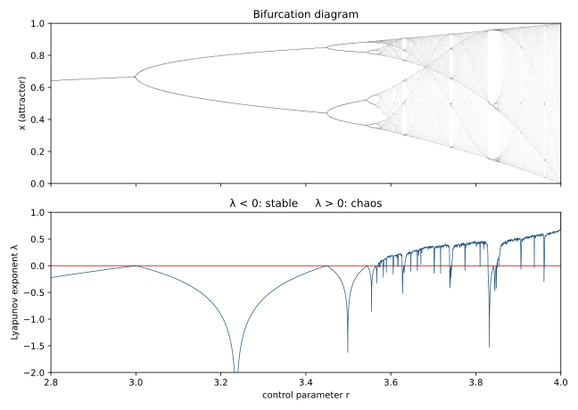

# ch14 — Lyapunov 指數：發散有多快

> **本章解決什麼問題**：前面三個 Part 我們講了「混沌是對初始條件敏感（SDIC）」「混沌有形狀（碎形吸子）」——但「敏感」一直是個形容詞。這一章把它變成一個數。Lyapunov 指數（Lyapunov exponent）λ 量化「相鄰兩條軌跡分離得有多快」：λ>0 就是混沌、λ<0 就是穩定、λ=0 是臨界——這是混沌的數字判據。本章只負責「把敏感量化成結果」；至於「為什麼會指數發散」的機制（拉伸與摺疊）留給 ch16，「這個數字落到天氣上是什麼意思」留給 ch15。脊椎那條遞迴式在 r=4 時 λ=ln2≈0.693，這一章把它算清楚。

```text
全書地圖：一條遞迴式，從秩序走到混沌，再走回來

  Part I  鐘錶宇宙的裂縫 ........ 決定論的夢，與第一道裂縫
     ch01 拉普拉斯的惡魔
     ch02 龐加萊的三體問題
     ch03 蝴蝶效應（勞侖次）
     ch04 決定論 不等於 可預測
        |
        v
  Part II  一條遞迴式裡的宇宙 ... 脊椎：xₙ₊₁ = r·xₙ·(1−xₙ)
     ch05 同一條遞迴式
     ch06 不動點與穩定
     ch07 倍週期分岔
     ch08 費根堡普適性
     ch09 混沌登場與秩序孤島
        |
        v
  Part III  混沌的肖像 ......... 混沌長什麼樣子
     ch10 相空間
     ch11 奇異吸子
     ch12 碎形與自相似
     ch13 碎維度
        |
        v
  Part IV  為什麼測不準 ........ 不可預測的機制與極限   ◄ 你在這裡
     ch14 Lyapunov 指數         ◄ 本章
     ch15 可預測的地平線
     ch16 拉伸與摺疊
        |
        v
  Part V  與混沌共處 .......... 分辨、駕馭、收束
     ch17 混沌 不等於 雜訊
     ch18 駕馭混沌
     ch19 同一條遞迴式，現在你懂它七層
```

## 從你已知的出發

先講一個你身上早就有、而且很可靠的直覺：**每一步乘上一個固定倍數，就是指數成長**。你不需要任何混沌理論就知道這件事的威力，因為你天天在跟它打交道。

一筆請求觸發兩筆重試，兩筆各自又觸發兩筆——retry storm 的恐怖不在於某一層放大了多少，而在於它**每一層都乘 2**。十層之後就是 2¹⁰ ≈ 1024 倍，二十層就是百萬倍。你在容量規劃時心裡也有同一把尺：QPS 如果每個月乘 1.5，你不會線性外推，你知道它會在某個月突然撞穿你以為很寬裕的天花板。你看資料量增長、看級聯故障（cascading failure）一層層放大、看快取雪崩（cache stampede）一瞬間把後端打爆——這些「失控」的共同骨架，都是**「每步乘固定倍數」這個動作重複夠多次**。

Lyapunov 指數就是把這把尺借過來，量「誤差」這個東西。

混沌系統裡，兩條起點只差一點點的軌跡，它們之間的距離不是線性拉開的、是**每走一步就乘一個固定倍數**拉開的。那個倍數比 1 大，誤差就指數放大；比 1 小，誤差就指數收斂回去。Lyapunov 指數 λ 就是這個倍數取對數之後的長期平均——換句話說，它是「誤差每單位時間放大幾個 e 倍」的速率。

這個對應很乾淨，值得你停下來對齊一次：

```text
   你的工程直覺                    混沌的對應
   ──────────────────             ──────────────────
   retry 每層 ×2                   軌跡誤差每步乘 |f′|
   放大倍數 > 1 → 失控              倍數 > 1 → 軌跡發散
   放大倍數 < 1 → 自然衰減          倍數 < 1 → 軌跡收斂回去
   「乘 2 重複 30 次 ≈ 十億倍」      ε·2³⁰ ≈ 10⁹（本章 worked example）
```

差別只有一個，但這個差別正是本章的重點：retry storm 的「每層 ×2」是你工程設計失誤造成的、可以靠 backoff 和 circuit breaker 修掉；而混沌系統裡的「每步乘倍數」是**方程式本身寫死的、改不掉的物理**。你修不掉它，只能去量它有多快——然後接受它畫出的那道牆。這道牆就是 ch15 的「可預測地平線」，而 λ 是量牆距離用的那把尺。

## 把「敏感」變成一個數：連續版的 λ

回到 ch03 講 SDIC 時那張圖（ch03-divergence 那張，兩條只差 0.001 的軌跡前面重疊、後面分道揚鑣）。當時我們只能定性地說「誤差會放大到系統尺度」。現在把它寫成式子。

設兩條軌跡起點相差一個很小的擾動 ε（epsilon，你可以想成 `abs(a − b)` 那個 ε）。在混沌系統裡，經過時間 t 之後，這個差距大致按下面長大：

```text
        分離(t) ≈ ε · eλᵗ            ← e 的 λt 次方，指數成長
```

這條式子就是 Lyapunov 指數的定義來源。把它讀懂：

- **ε** 是起始誤差——你量得多準，這個數就多小。
- **eλᵗ** 是放大因子。t 是時間，λ 是那個決定「長多快」的速率。
- **λ 就是 Lyapunov 指數**：分離隨時間指數成長的速率，單位是「每單位時間幾個 e 倍」。

關鍵全在 λ 的正負號上，這就是混沌的數字判據：

```text
   λ > 0   →   eλᵗ 隨 t 爆炸性變大   →   相鄰軌跡指數發散   →   混沌
   λ < 0   →   eλᵗ 隨 t 衰減到 0     →   相鄰軌跡指數收斂   →   穩定
   λ = 0   →   eλᵗ = 1，不漲不跌     →   臨界（邊界、週期、準週期）
```

我認為這是整本書最值得記在一張便利貼上的一行：**λ 的正負號，把「這個系統到底是穩定還是混沌」這個看起來很哲學的問題，壓縮成一個數的符號。** 不是「看起來很亂」、不是「跑久了感覺測不準」——是一個明確的、原則上可以算出來的數，大於零還是小於零。Laplace 的惡魔（ch01）以為決定論就保證可預測；λ>0 是這把刀真正捅進去的位置——同一條決定論方程式，λ 是正的，長期就是測不準的，而且測不準的速率還是個定值。

這裡誠實標一下嚴謹度：上面這條 `ε·eλᵗ` 是**線性化的、平均意義下的**圖像。真實軌跡上每一刻的局部放大率都在變（吸子上有的地方拉得猛、有的地方拉得慢），λ 是這些局部放大率的**長期平均**。所以「兩條軌跡的距離嚴格按 eλᵗ 走」只在短時間、小擾動下近似成立；長時間後誤差飽和到系統尺度（被吸子的有界性摺回來，那是 ch16 的事），就不再指數長了。本章用的是這個平均速率的直覺版，嚴格定義（Oseledets 定理那一套）本書不展開。

連續時間的 `eλᵗ` 講完了。但脊椎是離散映射（每次迭代是一步、不是連續流動），所以我們得換成離散版——而離散版反而更好算，因為它直接連到你已經會的「斜率」。

## 離散版的 λ：每步乘 |f′|，取對數再平均

脊椎遞迴式 `xₙ₊₁ = r·xₙ·(1−xₙ)`（ch05 那條）是離散的：給這次的 xₙ，算下次的 xₙ₊₁。問「誤差每步放大多少倍」，答案直接就是函數的斜率。

回想 ch06 算穩定性時用的導數。logistic 映射的導數是：

```text
        f(x)  = r · x · (1 − x)
        f′(x) = r · (1 − 2x)        ← 這次站的位置 x 決定本步的放大倍率
```

`f′(x)` 是什麼？是「x 動一點點，f(x) 動幾倍」的那個倍率——也就是瞬時斜率（如果「導數＝瞬時斜率」這件事生鏽了，擦亮即可，見《馴服無限》談導數的章）。把它套到誤差上：如果這一步你站在 x，旁邊有個差 Δx 的鄰居，走一步之後兩人的差會變成大約 `|f′(x)| · Δx`。**這一步的誤差放大倍數，就是 |f′(x)|。**

所以走 n 步，誤差被連乘了 n 個倍數：

```text
   n 步後的誤差 ≈ Δx · |f′(x₀)| · |f′(x₁)| · … · |f′(xₙ₋₁)|
                                  ↑ 每一步站的位置不同，放大倍率也不同
```

連乘很難看出長期速率，但只要取對數，連乘就變成連加（這是 log 把乘法拆成加法的老本事）：

```text
   ln(總放大) = ln|f′(x₀)| + ln|f′(x₁)| + … + ln|f′(xₙ₋₁)|
```

把這個總和除以步數 n，就得到「**平均每步放大幾個 e 倍**」——這就是離散版的 Lyapunov 指數：

```text
        λ = lim   (1/n) · Σ ln|f′(xₖ)|       （k 從 0 到 n−1，n→∞）
            n→∞
```

讀法：**λ ＝沿著軌跡走，把每一步的「斜率對數」ln|f′| 平均起來。** 

- 多數步落在 |f′|>1（斜率陡，這一步把鄰居推開）的地方，ln|f′| 是正的，平均下來 λ>0 → 發散 → 混沌。
- 多數步落在 |f′|<1（斜率緩，這一步把鄰居拉回）的地方，ln|f′| 是負的，λ<0 → 收斂 → 穩定。

注意它跟 ch06 的穩定條件其實是同一件事的兩種尺度。ch06 看的是**不動點那一個點**的斜率 |f′(x*)|<1；λ 看的是**整條軌跡走過所有點**的斜率的平均。一個點 vs 一路上的平均——前者判斷「停在這個點穩不穩」，後者判斷「整個長期行為發不發散」。穩定的不動點，軌跡卡在那個點不動，平均斜率就是那個點的斜率，λ = ln|f′(x*)| < 0，吻合。

## 脊椎在 r=4 的招牌結果：λ = ln2

現在算這一章的招牌數字。脊椎在 r=4 時是**全混沌**（ch09 講過，落點填滿整個 [0,1] 區間）。它的 Lyapunov 指數是個漂亮到不像話的數：

```text
        r = 4 時，λ = ln 2 ≈ 0.6931      （以 e 為底，每步）
```

為什麼剛好是 ln2？我給你兩條路看它，一條直覺、一條稍微嚴格。

**直覺路：r=4 的拋物線是一台「對折」機器。** r=4 的 logistic 映射 `f(x)=4x(1−x)` 跟一個更簡單的東西——**帳篷映射（tent map）**——在拓樸上是同一回事（術語叫共軛 conjugate，共軛函數是 φ(x)=(2/π)·arcsin(√x)，這個本書不要求你會用）。帳篷映射長這樣：把 [0,1] 區間「拉成兩倍長、再對折回 [0,1]」。拉成兩倍長，就是每一步把區間上任兩點的距離**乘 2**；對折只是把超出去的部分摺回來、不改變局部的拉伸倍率。所以每一步局部放大倍數恆等於 2，平均下來 λ = ln2。**ln2 的意思就是：每走一步，誤差約翻一倍。** 這台「拉伸 2 倍再對摺」的機器，正是 ch16 拉伸與摺疊要拆開看的那台揉麵機——這裡先把它的結果（λ=ln2）拿來用。

**稍嚴格路（給直覺、不展開積分）：** 嚴格算 λ 要把 `ln|f′(x)|` 沿著軌跡的長期分布平均。r=4 時這個長期分布有個已知的閉式（不變密度 invariant density，ρ(x)=1/(π√(x(1−x)))，是個兩端翹起來的 U 形——軌跡長期偏愛待在 0 和 1 附近）。把 `ln|f′(x)| = ln|4(1−2x)|` 對這個密度積分，結果正好是 ln2。這個積分本書不算（要算的工具見《馴服無限》），但你該知道「λ=ln2」不是湊出來的巧合，是這個系統的長期統計性質。

對照一下其它 r，感受 λ 怎麼隨旋鈕變號：

```text
   r        系統行為                 λ（每步）        號
   ───────  ────────────────────     ───────────      ──
   2.5      收斂到不動點 0.6          ln|f′(x*)|<0     負  ← 穩定
   3.2      穩定 2-cycle              <0               負  ← 穩定（週期）
   3.569…   混沌起點 r∞              ≈ 0              零  ← 臨界
   3.83     period-3 窗口            <0               負  ← 秩序孤島（ch09）
   4.0      全混沌                    ln2 ≈ 0.6931     正  ← 混沌
```

這張表正好對應 ch07–ch09 的整個劇情，只是換成 λ 的語言講一次：**λ 隨 r 大多時候是負的（穩定/週期），越過 r∞≈3.57 之後大多翻正（混沌），但在 period-3 窗口（r≈3.83，ch09 那個秩序孤島）又俯衝回負**——這就是下面那張圖要畫的東西。



這張圖是本章最值得盯著看的一頁，因為它把 ch07 那張招牌分岔圖（黑白帶的那張）翻譯成了一條曲線：分岔圖裡「線」的地方（穩定、週期），下面這條 λ 曲線就在水平軸下方；分岔圖裡「黑」的地方（混沌帶），λ 曲線就頂到水平軸上方。最妙的是 period-3 窗口——分岔圖裡那道留白的直縫，在 λ 曲線上對應一個**俯衝插到水平軸以下的尖刺**。秩序與混沌的交織，在分岔圖上是黑白，在 λ 曲線上就是正負號。同一件事，兩種畫法。

## Lyapunov 時間：1/λ 是可預測視窗的尺度

λ 是速率，那它的倒數 1/λ 就是時間尺度——這個量叫 **Lyapunov 時間（Lyapunov time）**：

```text
        Lyapunov 時間 = 1/λ
```

它的意思是「誤差放大 e 倍（約 2.718 倍）所需的時間」。為什麼這個量有用？因為它直接給你「**可預測視窗有多大**」的尺度。一個 λ 大的系統（Lyapunov 時間短），誤差很快就吃掉你的精度，可預測視窗短；λ 小的系統，誤差長得慢，可預測視窗長。這就是 ch15 整章的主角——把 1/λ 落到天氣、落到真實世界的「可預測地平線」。

對脊椎 r=4：λ=ln2≈0.6931，Lyapunov 時間 1/λ≈1.443 步。意思是「每約 1.44 步，誤差放大一個 e 倍」——換句話說，每 1 步約放大 2 倍（這兩種講法一致：放大 2 倍要 ln2/ln2 = 1 步，放大 e 倍要 1/ln2 ≈ 1.44 步）。

這裡值得提一句多維的情況，因為勞侖次系統（ch11 那隻蝴蝶）就是多維的。**一維系統只有一個 λ；多維系統有一組 λ，叫 Lyapunov 譜（Lyapunov spectrum），每個自由度方向各一個。** 想成 ch06 提過的：多維的「斜率」升級成 Jacobian 矩陣的特徵值（eigenvalue），特徵值就是「矩陣往某個方向拉伸幾倍」的那個倍率（見《矩陣是動詞》談特徵值的章）。每個方向有自己的拉伸/壓縮速率，取對數平均，就得到那個方向的 Lyapunov 指數。

關鍵是：**判斷混沌只看最大的那一個。** 只要最大的 λ>0，就有至少一個方向在指數發散，系統就是混沌的——哪怕其它方向都在收縮。勞侖次系統的三個 Lyapunov 指數約是 (+0.906, 0, −14.572)（以 e 為底、每單位時間；數值以 landscape 為準，源自 Sprott）。讀這三個數很有意思：

```text
   勞侖次系統 (σ=10, ρ=28, β=8/3) 的三個 Lyapunov 指數（每單位時間）：

        λ₁ ≈ +0.906    ← 一個方向在指數拉開 → 這就是「混沌」的來源
        λ₂ ≈   0       ← 沿著軌跡流動的方向，不漲不縮（臨界）
        λ₃ ≈ −14.572   ← 一個方向在猛烈收縮 → 把軌跡壓回吸子薄片上
```

讀法：**λ₁>0 是「敏感」（翼內把鄰近軌跡指數拉開），λ₃ 巨大的負值是「被吸住」（垂直方向被狠狠壓扁成薄片，這就是 ch11 那隻蝴蝶又有界又是碎形的原因），λ₂=0 是「沿著軌跡走的方向不漲不縮」（任何連續流動系統都有這個零指數，因為沿軌跡推一點點時間，還在同一條軌跡上）。** 三個數一起，把 ch11「翼內發散、整體有界、形狀是碎形」的定性描述全部量化了——蝴蝶的「strange」就寫在這三個數裡：一正、一零、一個大負，加起來是負的（收縮、有吸子）但有一個正的（混沌）。

對應的最大 Lyapunov 時間 1/λ₁ ≈ 1/0.906 ≈ 1.10 個時間單位——這是勞侖次系統「誤差放大一個 e 倍」的特徵時間，ch15 會把它換算成「天氣為什麼只能測兩週」的故事。

## 直覺的陷阱

λ 是個會騙人的數字——它把「指數發散」這件事壓縮成一個常數，於是很容易被讀過頭。下面四個誤解，每個我都看過工程師（包括我自己）踩進去：

| 誤解 | 錯在哪 | 怎麼自我察覺 |
|---|---|---|
| λ>0 代表軌跡會「無限發散、飛出去」 | ε·eλᵗ 只在**誤差還很小**時成立。一旦兩條軌跡分開到系統尺度，摺疊（ch16）就把它們拉回有限區域——發散是**局部**的、整體仍有界。λ>0 講的是「鄰近軌跡分得快」，不是「值會跑到無限大」 | 你若把指數公式外推到「ε 已經放大到 1」之後還繼續用，就是過頭了；正確的圖像是「指數成長一段、撞到天花板就飽和」 |
| Lyapunov 時間是一道「過了就完全測不準」的硬牆 | 1/λ 只是**誤差放大一個 e 倍**的尺度，不是預測的生死線。可預測視窗還取決於你的初始精度——是 (1/λ)·ln(1/ε) 這個**對數**關係（ch15 主角），精度進步只買到固定增量 | 你若說「Lyapunov 時間 1.1 秒，所以 1.1 秒後就沒救」，就把 e 倍尺度誤當成絕對期限了 |
| 量到一個正的 λ 就斷定系統是混沌 | 短資料、暫態（transient）、量測雜訊都能給出**假的正值**；真正的 λ 是無限長時間的平均（lim 那個極限）。一段有限軌跡的「局部拉伸率」可以正得很漂亮卻不代表長期混沌 | 你若只跑幾十步就宣布 λ>0，問自己：換個起點、跑長十倍，這個正值還在嗎？（這條和 ch17「混沌 vs 雜訊」的判別陷阱同源） |
| λ 越大代表「越不可預測 / 越糟」 | λ 量的是**發散速率**，不是「亂的程度」。兩個都混沌的系統，λ 大的只是誤差長得快、可預測視窗短而已；而 λ<0 根本不是混沌、是收斂。把 λ 當成「混沌嚴重度評分」會誤判 | 你若拿 λ 去排序「哪個系統比較危險」，先確認你比的是「可預測視窗」還是「行為複雜度」——它們不是同一件事 |

一句話收：λ 是**速率**，不是**期限**、不是**嚴重度**、也不是**有沒有混沌的鐵證**。它只回答一個問題——「鄰近的兩條軌跡，分開得有多快」。

## 紙上推演

純紙筆、純口頭。下面的迭代與對數值請自己手算複核一次（建議保留 4 位小數）；混沌的數字最容易在「以為記得」的地方算錯。

### 推演題 1

★ **[10 分鐘]** 脊椎在 r=4，λ=ln2，每步誤差約翻倍。你的初始量測精度是 10⁻⁹（差不多是雙精度浮點能可靠分辨的尺度）。問：**大約幾步之後，誤差會放大到 1（也就是塞滿整個 [0,1] 區間、預測完全失效）？** 用兩種算法各算一次（「翻倍」直觀法與「以 e 為底」公式法），確認兩者一致。

#### 推演解答

**算法一（翻倍直觀法）。** 每步乘 2，起始 10⁻⁹，問乘幾次 2 會到 1。也就是問 `2ⁿ ≈ 10⁹` 的 n。你心裡該有 2¹⁰≈10³ 這個錨點（1024≈1000），所以：

```text
        2¹⁰ ≈ 10³
        2²⁰ ≈ 10⁶
        2³⁰ ≈ 10⁹        ← 精確 2³⁰ = 1,073,741,824 ≈ 1.07×10⁹
```

10⁻⁹ 乘 2³⁰ ≈ 1.07，剛好越過 1。所以 **約 30 步**。

**算法二（以 e 為底的公式法）。** 用 `ε·eλⁿ = 1` 解 n：

```text
        eλⁿ = 1/ε = 1/10⁻⁹ = 10⁹
        λn  = ln(10⁹)
        n   = ln(10⁹) / λ = ln(10⁹) / ln2
```

`ln(10⁹) = 9·ln10 ≈ 9 × 2.3026 = 20.723`；除以 `ln2 ≈ 0.6931`：

```text
        n ≈ 20.723 / 0.6931 ≈ 29.9 步
```

兩種算法都給 **約 30 步**，一致（差別只是 2³⁰ vs e^(30·ln2)，本來就是同一個數，因為 2 = e^ln2）。

**這裡的震撼點**：起始誤差小到 10⁻⁹——你已經量到雙精度浮點的極限了——可預測視窗也只有 30 步。混沌不在乎你起點有多準，它只是默默地每步翻倍，30 步就把你 9 位數的精度啃光。這就是 SDIC 的數字版：不是「測不準」，是「再準也只多買到固定一小段」。下一題就量這個「固定一小段」有多小。

### 推演題 2

★★ **[15 分鐘]** 承上題。你不滿意 30 步，決定砸錢升級量測設備，把初始精度從 10⁻⁶ 提升到 10⁻⁹（**準了 1000 倍，整整三個數量級**）。問：**這筆投資多買到幾步可預測視窗？** 然後用這個結果解釋「為什麼多測一位小數幾乎買不到預測時間」。

#### 推演解答

先算兩個精度各自的可預測步數（沿用上題公式 n = ln(1/ε)/ln2）：

```text
   起始精度 10⁻⁶：  n = ln(10⁶)/ln2 = (6 × 2.3026)/0.6931 ≈ 13.816/0.6931 ≈ 19.9 步
   起始精度 10⁻⁹：  n = ln(10⁹)/ln2 = (9 × 2.3026)/0.6931 ≈ 20.723/0.6931 ≈ 29.9 步
```

多買到的步數：

```text
        29.9 − 19.9 ≈ 10 步
```

或者更省事地直接算「準了 1000 倍」買到幾步：1000 = 10³，要乘幾次 2 才到 1000？`2¹⁰ = 1024 ≈ 10³`，所以多撐 **10 步**。也可以用 `ln(10³)/ln2 = (3×2.3026)/0.6931 ≈ 6.908/0.6931 ≈ 9.97 ≈ 10 步`。三種算法都給 10 步。

**這就是對數報酬（logarithmic return）。** 你把精度提升了**1000 倍**（三個數量級，一筆很大的投資），換來的只是 **10 步**——而且這 10 步是**加法**加上去的，不是倍數。再砸 1000 倍（精度到 10⁻¹²），再買 10 步；再砸 1000 倍，又只是 10 步。每買固定一段視窗，要付的精度代價以**指數**膨脹。

「多測一位小數」就是精度乘 10。乘一次 10 買到 `ln10/ln2 ≈ 2.3026/0.6931 ≈ 3.32 步`。多測三位小數（精度乘 1000）才買到 10 步。這個 3.32 步是個寫死在 λ 裡的常數——它**只取決於 λ**（這裡是 ln2），跟你已經多準完全無關。

**這是本章和 ch15 之間最重要的橋，也是整本書最反直覺的一刀之一**：在線性世界裡，「測準十倍 → 預測準十倍」是天經地義的；在混沌世界裡，「測準十倍 → 多預測固定一小段」，而且那一小段小到讓人沮喪。Laplace 惡魔的最後幻想——「只要量得夠準，就能算得夠遠」——死在這條對數曲線上：量得夠準的「代價」是指數的，買到的「視窗」是對數的，兩者永遠追不上。天氣為什麼砸再多衛星也只能測兩週，答案的骨架就在這 10 步裡（ch15 把它換算成天）。

### 推演題 3

★★ **[12 分鐘]** 下面是一個工程師的論證，聽起來很有道理，但有個破綻。請找出破綻、講清楚錯在哪：

> 「我們的監控系統對伺服器的某個內部狀態量測精度很高，誤差只有 10⁻¹²。這個系統雖然混沌，但既然我量得這麼準，我至少能準確預測它幾十步。所以只要我**持續每步重新量測、校正**，把誤差永遠壓在 10⁻¹²，我就能**永遠**準確預測下去——精度夠就行。」

#### 推演解答

這個論證裡其實藏了兩個不同的主張，一個對、一個錯，混在一起就成了陷阱。

**對的那半**：「精度 10⁻¹² → 能預測幾十步」沒問題。10⁻¹² 是 12 個數量級，`ln(10¹²)/ln2 = (12×2.3026)/0.6931 ≈ 27.6/0.6931 ≈ 39.9 步`，約 40 步。比 10⁻⁹ 的 30 步多撐 10 步（又是那個「三個數量級換 10 步」）。這部分算得對。

**錯的那半（破綻）**：「持續每步重新量測校正，就能永遠準確預測」——這句話偷換了「預測」的意思。

注意分辨兩件根本不同的事：

```text
   (A) 預測（prediction）：此刻量一次，然後用方程式往後算 N 步。
                          ← 這是混沌限制的對象，視窗 ≈ ln(1/ε)/λ
   (B) 追蹤（tracking）：每一步都重新量測、把模型拉回真實值。
                          ← 這不是預測，這是「一直看著它」
```

如果你每步都重新量測校正，你做的是 (B) 追蹤——你根本沒在預測，你只是**一直盯著它看、每步把誤差歸零**。那當然能「永遠跟上」，但代價是你必須**每一步都有真實量測**，也就是你永遠只知道「現在」、買不到「未來」。一旦你停止量測、開始純靠方程式往前推（這才叫預測），誤差立刻從你最後一次量測的精度開始，每步翻倍，幾十步後就失效。

**破綻一句話**：他把「持續追蹤」偽裝成「持續預測」。混沌不阻止你追蹤一個系統（你想看多久看多久），它阻止的是「不再量測、純靠算」能算多遠。可預測視窗是針對「從某一刻起，純靠方程式往前推」這件事的——重新量測一次，視窗就從那一刻重新開始倒數，但你買不到「看一次、算很遠」。這也預告了 ch15 的系集預報（ensemble forecasting）為什麼是誠實的做法：既然單條軌跡的純預測撐不久，那就老實承認、改追一團起點的分布，而不是假裝某一條算得很遠。

## 自我檢核

口頭自答，講得出來才算過關。優先回答「為什麼」：

1. 用一句話說 Lyapunov 指數 λ 是什麼。然後解釋：為什麼 λ 的**正負號**就能判斷一個確定論系統到底是穩定還是混沌？（提示：eλᵗ 的行為）
2. 離散版的 λ 為什麼是「ln|f′| 沿軌跡的長期平均」？把「誤差每步乘 |f′|」「連乘取對數變連加」「除以步數變平均」這三步串起來講一遍。
3. ch06 的穩定條件 |f′(x*)|<1 和本章的 λ<0，是什麼關係？為什麼一個看「不動點一個點的斜率」、另一個看「整條軌跡的平均斜率」，但講的是同一件事？
4. 脊椎在 r=4 時 λ=ln2≈0.693。用「每步誤差翻倍」這個說法解釋 ln2 的含義；再用帳篷映射「拉成兩倍長再對摺」解釋為什麼局部放大倍數恆為 2。
5. 起始誤差 10⁻⁹、每步翻倍，為什麼大約 30 步後誤差就到 1？（不准查，自己用 2³⁰≈10⁹ 推一遍）
6. 為什麼「把精度提升 1000 倍只多買到約 10 步」？這個「對數報酬」對「多測一位小數有沒有用」這個問題意味著什麼？這個多買到的步數取決於什麼、不取決於什麼？
7. 多維系統有一組 Lyapunov 指數，為什麼判斷混沌只看「最大的那一個」？勞侖次的三個指數 (+0.906, 0, −14.572) 分別在描述吸子的哪個性質？
8. Lyapunov 時間 1/λ 是什麼意思？為什麼說它是「可預測視窗的尺度」？（這題答得出來，ch15 就贏一半了）

## 延伸閱讀

- **Strogatz，《Nonlinear Dynamics and Chaos》第 10 章（One-Dimensional Maps）** — 本章離散 Lyapunov 指數 `λ = (1/n)Σln|f′|` 的標準教科書推導，連帶把 logistic r=4 的 λ=ln2 算給你看。讀 10.5（Lyapunov exponent）那節，看完你會發現本章只是它的工程直覺版。
- **Sprott, "Lyapunov Exponent and Dimension of the Lorenz Attractor"** — 本章勞侖次三個指數 (≈+0.906, 0, −14.572) 與 Lyapunov 時間的數值出處，本書 landscape 的 Lorenz 數值就以它為準。想看那組數字是怎麼用數值積分算出來的（步長、積分時間長度），去這裡。（https://sprott.physics.wisc.edu/chaos/lorenzle.htm）
- **Wolfram MathWorld, "Logistic Map: r = 4"** — r=4 的 λ=ln2、不變密度 ρ(x)=1/(π√(x(1−x)))、與帳篷映射共軛 φ(x)=(2/π)arcsin√x，這幾個本章只給結論的式子，這裡有完整列出。（https://mathworld.wolfram.com，搜 LogisticMap r=4）
- **本書 ch15** — 「可預測的地平線」。本章算出的 1/λ 和「對數報酬」，在那裡會落到真實天氣：為什麼只能測兩週、為什麼砸再多算力也突破不了、系集預報為什麼比追單一軌跡誠實。本章推演題 2、3 的「10 步」和「追蹤≠預測」，在那裡會變成「天」和「ensemble」。
- **本書 ch16** — 「拉伸與摺疊」。本章用「帳篷映射拉成兩倍長再對摺」一句話帶過的 λ=ln2 來歷，在那裡會被拆開：拉伸製造 λ>0（敏感）、摺疊保持有界（永不重複），缺一不可。本章是「結果的量化」，那裡是「機制」。
- **本書 ch06** — 「不動點與穩定」。如果本章的 |f′| 與斜率直覺有點模糊，回去重看 ch06 怎麼用 cobweb 斜率判穩定——λ 只是把那個「一個點的斜率」推廣成「整條軌跡的平均斜率」。
