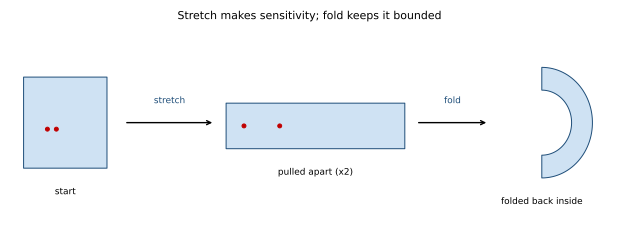

# ch16 — 拉伸與摺疊：混沌的製造機

> **本章解決什麼問題**：前兩章 ch14、ch15 量了「測不準有多嚴重」——Lyapunov 指數 λ 是發散率、1/λ 是可預測地平線的尺度。但它們都只回答了「結果」：誤差會指數放大。本章回答更底層的「機制」問題——**到底是什麼物理動作，在每一步把鄰近的點拉開、又同時把整團行為關在有限盒子裡？** 答案只有兩個動作：拉伸（stretch）製造敏感、摺疊（fold）保持有界，缺一不可。這台「拉伸＋摺疊」的機器，正是 ch11 留下的那個懸念——「有界＋永不重複＋不自交」怎麼共存——的施工現場；也是脊椎遞迴式 r=4 時 λ=ln2 這個數字的來源。看懂這一章，混沌對你就不再是「黑盒子裡冒出來的怪事」，而是一道你能在腦裡完整跑一遍的工序。

## 從你已知的出發

先別講混沌。先講一個你每天都在依賴、卻可能沒這樣拆解過的東西：**雜湊函數（hash function）的雪崩效應（avalanche effect）。**

你知道一個好的雜湊函數有一條鐵律：輸入只要動一個 bit，輸出應該有大約一半的 bit 翻轉、而且翻得看不出規律。`sha256("hello")` 和 `sha256("hellp")`（最後一個字母差一格）算出來的兩串雜湊值，看起來毫無關係。你天天靠這條性質：它讓雜湊表把相近的 key 打散到桶子各處、讓一致性雜湊（consistent hashing）把節點均勻鋪在環上、讓密碼雜湊抵抗「猜一個改一點再試」的攻擊。

現在我要你把這條鐵律拆成**兩個獨立的動作**，因為混沌的製造工序和它是同一台機器：

```text
   雪崩效應 = 兩個動作合起來的結果

   動作 A  擴散(diffusion)：把 1 個 bit 的差「攤開」到很多 bit
           ── 一個位元的擾動,經過一輪輪混合,影響到輸出的每一處
           ── 這就是「拉伸」:讓原本只差一點的兩個輸入,差距被放大、攤散

   動作 B  壓縮(compression)：把任意長的內部狀態「壓回」固定長度
           ── 取模、截斷、把 512-bit 狀態擠成 256-bit 輸出
           ── 這就是「摺疊」:無論你算到多大,結果永遠塞回那個固定範圍裡
```

少了 A，輸出就不敏感——改一個 bit 只動到輸出的一個 bit，攻擊者一眼看穿對應關係。少了 B，輸出就不有界——狀態越滾越大、長度失控，根本不叫雜湊。**好的雜湊函數，是「把差距攤開（拉伸）」和「把結果壓回固定範圍（摺疊）」這兩個動作，反覆交替做很多輪的產物。**

再想兩個你熟的例子，都是同一對動作：

- **洗牌（shuffle）。** 一副牌洗一次，相鄰的兩張被拆開（拉伸：原本挨著的，現在隔很遠），但整副牌還是這 52 張、沒有變多也沒少（摺疊：狀態空間有界）。洗夠多次，初始的順序就被攪得認不出來——可是它**完全是確定的**：同一個洗牌動作序列，從同一副初始牌，每次都洗出一模一樣的結果。
- **一致性雜湊把 key 打散。** 兩個 ID 只差 1（`user_1000` 和 `user_1001`），經過雜湊後落到環上完全不同的兩段（拉伸），但所有 key 都落在同一個有限的環上、沒有誰能跑到環外（摺疊）。

把這對動作記牢：**拉伸讓「鄰近的東西分開」，摺疊讓「一切留在有限範圍內」。** 本章接下來要做的事，就是宣告一件可能讓你愣一下的事——**混沌，是這同一台機器跑在連續數值上、跑了無限多次的產物。** 你早就在 hash、在洗牌、在一致性雜湊裡，用著製造混沌的同一套零件，只是沒有人告訴你它們叫拉伸與摺疊。

## 兩個動作，各管一件混沌的性質

把鏡頭從工程拉回 ch11 那隻蝴蝶、拉回脊椎遞迴式。混沌系統有兩個你已經反覆碰到的性質，它們**各由一個動作負責**，而且這個對應是嚴格的、不是比喻上的鬆散對應：

```text
   性質                          由哪個動作製造
   ──────────────────────────    ─────────────────────────────
   SDIC / λ > 0(對初值敏感)      ← 拉伸(stretch)
        鄰近兩點每步被拉開,             把間距乘以一個 >1 的倍率,
        誤差指數放大                    反覆做就是指數放大 = ch14 的 λ

   有界 + 永不重複                ← 摺疊(fold)
        軌跡關在有限盒子裡,             把被拉長、衝出邊界的帶子
        卻無限長不重複                  「對摺」塞回原來的範圍
```

這就是為什麼**缺一不可**。把這兩個動作各自單獨拿出來跑，你會立刻看到混沌死在哪：

**只拉伸、不摺疊 → 衝出邊界，不是混沌。** 想像你只做「每步把間距乘以 2」這個動作，不做別的。兩個鄰近點確實指數分開（有了 SDIC），但它們也一起飛向無窮遠——整個系統發散、爆掉、跑出任何有限範圍。這不是混沌，這是純粹的指數不穩定（就像一個增益失控、正回授停不下來的系統，數值一路衝到溢位）。混沌的標誌之一是**有界**：它亂，但亂在一個固定的盒子裡。光拉伸給不了你「有界」。

**只摺疊、不拉伸 → 不敏感，也不是混沌。** 反過來，假設你只做「把東西壓回有限範圍」這個動作，但從不放大間距。那麼兩個鄰近點被摺來摺去，始終保持鄰近——它們一起被摺、一起被壓，間距不會放大。沒有 SDIC、沒有 λ>0、長期可預測。這頂多是個乖乖待在盒子裡的穩定系統或週期系統，不混沌。光摺疊給不了你「敏感」。

**混沌＝兩個動作反覆交替做。** 每一步：先拉伸（把鄰近點拉開一點、把帶子拉長），再摺疊（把拉長到要衝出邊界的帶子對摺、塞回原範圍）。拉伸負責「每一步都讓你更測不準」，摺疊負責「但你永遠跑不出這個盒子，所以也永遠繞不完、永不精確重複」。

這正面回答了 ch11 那個懸而未決的問題。當時我們用純幾何邏輯論證：「有界＋永不重複＋不自交」這三件事，一條普通粗細的線辦不到，唯一出路是「無限不重複地摺進一個碎形集合」。現在機制補上了——**那個「摺進碎形」的動作，字面上就是摺疊；而逼著軌跡非摺不可的，是拉伸不停把帶子拉長、塞不下了只好對摺。** 蝴蝶的碎形分層結構，就是「拉長→對摺→再拉長→再對摺」這道工序跑了無限久、一層層疊出來的地層。

### 揉麵團：把這台機器握在手裡

最好的直覺來自一件你手感上完全熟悉的事：**揉麵團，或拉一條太妃糖（taffy）。**

想像你在麵團裡滴兩滴靠得很近的食用色素，一滴紅、一滴藍，相距 1 公分。然後你開始揉麵：

```text
   揉麵的一個循環 = 拉伸 + 摺疊

   起始    ▓▓●●▓▓▓▓▓▓▓▓        ● = 紅、藍兩滴色素,相距 1 cm
                                  (▓ 是麵團)

   拉伸    ▓▓▓●▓▓●▓▓▓▓▓▓▓▓▓▓▓▓▓▓▓▓▓▓   把麵團桿成兩倍長
           兩滴的距離也被拉成 ~2 cm        ← 鄰近 → 分開(SDIC)
           麵團變長,快要超出案板了

   摺疊    ▓▓▓●▓▓●▓▓▓               把桿長的麵團對摺,
           ▓▓▓▓▓▓▓▓▓               疊回原來的案板大小
                                     ← 麵團尺寸 → 復原(有界)

   下一輪  再桿長(兩滴又拉開到 ~4 cm)、再對摺...
```

每揉一個循環，兩滴色素之間的距離大約乘以 2；但麵團本身的大小始終不變（你的案板就那麼大，桿長了就摺回來）。揉個十幾二十下，原本相距 1 公分的兩滴色素會被攪到麵團的天南地北、紅藍混成均勻的一片，你再也分不出哪裡是「原本的紅滴」。

這個畫面同時裝下了混沌的全部要點，逐一對上：

- **拉伸 = SDIC。** 兩滴的距離每揉一下乘以 2，這就是 ch14 的誤差指數放大。揉 n 下，距離放大 2ⁿ 倍——這就是離散版的 ε·2ⁿ。
- **摺疊 = 有界。** 麵團大小不變，所有色素永遠在這團麵裡，跑不出案板。對應軌跡被困在吸子上。
- **混合（mixing）= 永不重複的根。** 兩滴越揉越分散、最終均勻鋪滿整團——這叫混合。一個揉透了的麵團，你**無法**從現在的色素分布反推出「最初兩滴滴在哪」，因為微小的初始差異被放大攤平了。這正是 ch11 那個「長期測不準」的麵團版。
- **決定論依然成立。** 注意全程沒有任何隨機：你每一下都是「桿長、對摺」這個固定動作。同一團麵、同一串揉法，揉出來的分布每次都一樣。亂，是這台確定性機器造的「假亂」——這條線索我們留到 ch17 收（也對照《馴服隨機》ch01 的真隨機）。

我認為揉麵團是整本書最值得你裝進口袋隨身帶走的一個畫面。下次有人問你「混沌到底是什麼」，你不必背 SDIC 的定義，你只要說：**「就是揉麵團——把鄰近的東西拉開（所以你測不準），再摺回有限的盆子裡（所以它亂得有邊界、而且永遠揉不回原樣）。」** 這句話他立刻懂。

把這道工序定格成一張圖，就是下面這個樣子——它是整章的視覺骨架：



## 史梅爾的馬蹄：混沌的標誌幾何

揉麵團是直覺，但數學需要一個能精確分析的最小模型。這個模型叫**馬蹄映射（horseshoe map）**，由拓樸學家史梅爾（Stephen Smale）做出來——而它的誕生地，是混沌史上最著名的軼事之一。

**約 1960 年**，史梅爾以博士後身分訪問巴西里約熱內盧的 IMPA 研究所。據他自己後來在文章〈Finding a Horseshoe on the Beaches of Rio〉（在里約的海灘上找到一個馬蹄）裡的回憶，他**上午在科帕卡巴納（Copacabana）海灘上工作、下午才進研究所**——這個「在海灘上做數學」的習慣後來還給他惹了麻煩，因為他的研究經費來自美國國家科學基金會（NSF），資助方對「研究員在沙灘上」不太能接受（照 landscape，此軼事為史梅爾自述，可放心用；年份用「約 1960」）。

故事的轉折很有混沌史一貫的味道：**史梅爾原本猜測「混沌這種東西在數學上不存在」**——他相信典型的動力系統長期行為都會是規矩的。是 MIT 的 Norman Levinson 寫信給他，指出英國數學家 Cartwright 與 Littlewood 在二戰研究無線電振盪時得到的舊結果，恰好與史梅爾的猜想矛盾。史梅爾在訂正自己錯誤猜想的過程中，反而構造出了馬蹄映射——又一個「在錯誤裡長出混沌」的案例，和 ch02 龐加萊那篇得獎後被召回重印的論文同一個套路。

馬蹄映射在做什麼？把它和揉麵團對照，你會發現是同一套動作，只是收拾得更乾淨。拿一個正方形區域，做三步：

```text
   馬蹄映射的一個循環(對照揉麵團:壓扁=讓它細長、彎成馬蹄=摺疊)

   step 1  原始的方塊
   +--------+
   |        |
   |        |
   +--------+

   step 2  壓扁 + 拉長(拉伸):水平拉長、垂直壓扁成細細長長一條
   +--------------------------------+
   |                                |     ← 水平被拉長 → 鄰近兩點分開 = SDIC
   +--------------------------------+

   step 3  彎成馬蹄、塞回原方塊範圍(摺疊):整體不超出邊界
   +--------+
   | +----+ |     ← 上臂
   | |    | |
   | +----+ |
   | +----+ |     ← 下臂(把拉長的條子彎成 U 形塞回)
   | |    | |
   | +----+ |
   +--------+
```

第二步「壓扁＋拉長」是拉伸：原本水平方向上挨著的兩個點，被拉長後分得遠遠的。第三步「彎成馬蹄、塞回原方塊」是摺疊：無論你拉得多長，最後都彎回來塞進原來那個方塊的範圍。反覆做這兩步，方塊裡任意兩個近鄰終會被水平拉開，而整團永遠不衝出方塊。

馬蹄之所以是混沌的**標誌幾何**，在於史梅爾證明了一件漂亮的事：你可以用一串 0 和 1 的二進位序列，精確記錄一個點的整段軌跡——每一步看它落在馬蹄的上臂還是下臂，是上臂記 1、下臂記 0。而**套用一次馬蹄映射，恰好等於把這串二進位序列的小數點往右移一位**（這叫符號動力學 symbolic dynamics）。這件事的份量我們下一節用脊椎的具體數字親手算一遍——因為「映射一次＝二進位左移一位」正是 λ=ln2 的來源，也是「拉伸與摺疊」這兩個動作在數字上最赤裸的樣子。

> **誠實標示嚴謹度**：上面是馬蹄的**幾何直覺版**。馬蹄映射的嚴格建構（怎麼定義那兩條水平條帶與垂直條帶、怎麼證明所有二進位序列都對應到唯一一條軌跡、它如何構成一個 Cantor 集上的位移系統）屬於符號動力學的正式內容，本書不展開，指向延伸閱讀的 Smale 原文與 Scholarpedia。你只要握住「壓扁→拉長→摺成馬蹄＝拉伸＋摺疊」這個畫面，以及「映射一次＝二進位左移一位」這個結論，就抓到了混沌標誌幾何的核心。

## Worked example：手算一個二進位起點，看「左移一位」如何同時是拉伸和摺疊

這是本章的核心 worked example，也是 ch14 那句「r=4 時 λ=ln2」**到底從哪來**的施工現場。我們不用拋物線的脊椎式子直接算（那個小數迭代容易算錯，ch05–09 已經練夠了），而是用它的**拓撲共軛（topological conjugacy）雙胞胎**——帳篷映射（tent map）與更乾淨的二進位移位（binary shift / doubling map）——因為在二進位下，拉伸與摺疊會變成兩個你一眼就能驗證的動作。

先講清楚這三者的血緣，這是 landscape 與 ch09 的基準：

```text
   三胞胎(拓撲共軛,行為的混沌結構完全相同)

   邏輯斯諦映射  xₙ₊₁ = 4·xₙ·(1 − xₙ)        ← 脊椎,r=4(全混沌)
        ↕ 共軛函數 φ(x) = (2/π)·arcsin(√x)
   帳篷映射      xₙ₊₁ = 2·min(xₙ, 1 − xₙ)     ← 拉伸 2 倍、過半就對摺
        ↕(同源)
   二進位移位    xₙ₊₁ = 2·xₙ mod 1             ← 「拉伸 2 倍、超過 1 就減 1」
```

「拓撲共軛」是工程師熟悉的概念：就像兩個 API 介面不同、底層行為一一對應、可以互相換算。φ(x)=(2/π)·arcsin(√x) 就是那張換算表。所以 r=4 脊椎的混沌、帳篷映射的混沌、二進位移位的混沌，**是同一回事換了三件外衣**；它們的 Lyapunov 指數相同，都是 ln2。我們挑最透明的那件——二進位移位——來看機制。

**先看帳篷映射的幾何，確認「拉伸 2 倍＋對摺」就是它本人。** 帳篷映射 `xₙ₊₁ = 2·min(x, 1−x)` 把 [0,1] 這條線段這樣處理：

```text
   帳篷映射:把 [0,1] 拉成 2 倍長,再對摺塞回 [0,1]

   原始   0 ────────────────── 1        長度 1

   拉伸   0 ────────────────────────────────── 2   拉成 2 倍長(每點 ×2)
          ← 任兩個鄰近點的距離都被乘以 2 → 這就是拉伸

   對摺   0 ───────── 1                          超過 1 的那半截
                       ╲                         (從 1 到 2)
                        ╲ 對摺                    被摺回來,
          0 ───────── 1                          疊在 [0,1] 上
          ← 一切又回到 [0,1] → 這就是摺疊(保持有界)
```

拉伸 2 倍：左半段 [0, 0.5] 被拉到 [0,1]；右半段 [0.5,1] 也被拉到 [0,1] 但**方向翻過來**（這就是「對摺」——min(x,1−x) 那個 1−x 分支）。每個點的局部斜率（拉伸倍率）處處是 2，所以「每步間距 ×2」。

**現在用二進位移位手算，看左移一位＝拉伸＋摺疊的合體。** 二進位移位 `xₙ₊₁ = 2x mod 1` 在二進位下乾淨得驚人：把 x 寫成二進位小數，乘以 2 就是把小數點往右移一位；mod 1 就是把移到小數點左邊那個整數位（0 或 1）丟掉。**左移一位（×2）＝拉伸；丟掉最高位（mod 1）＝摺疊。** 取一個起點，比方說（自己挑的、含有夠多位元的）：

```text
   x₀ = 0.10110100…(二進位)

   每步:小數點右移一位(×2,拉伸),整數位丟掉(mod 1,摺疊)

   步 n   xₙ(二進位)        丟掉的最高位    ← 動作拆解
   ─────  ─────────────     ──────────     ──────────────────────
   0      0.10110100…         —            起點
   1      0. 0110100…         1            ×2 把點右移→1.0110100…,
                                           丟掉整數位 1 → 0.0110100…
   2      0. 110100…          0            右移→0.110100…,最高位是 0,丟 0
   3      0. 10100…           1            右移→1.10100…,丟掉 1
   4      0. 0100…            1            右移→1.0100…,丟掉 1
   5      0. 100…             0            右移→0.100…
```

每一步發生兩件事，恰好就是兩個動作：

```text
   ×2(把點右移一位)       = 拉伸:兩個鄰近數的差,每步被乘以 2
   mod 1(丟掉最高位)      = 摺疊:不管乘到多大,值永遠留在 [0,1) 裡
```

**手算複核兩件事，這是本章的數值錨點：**

**複核一：拉伸＝差距每步 ×2。** 取兩個只在第 4 位不同的起點：

```text
   a₀ = 0.1011 0100…
   b₀ = 0.1010 0100…          ← 只有第 4 位不同(a 是 1、b 是 0)
   初始差 |a₀ − b₀| = 2⁻⁴ = 0.0625(差在第 4 位 = 2 的 −4 次方)

   每做一次「右移一位」,那個「不同的位元」就往左挪一格、離小數點更近一位,
   它代表的數值就 ×2:

   步 0   差在第 4 位   |差| = 2⁻⁴ = 0.0625
   步 1   差在第 3 位   |差| = 2⁻³ = 0.125     ← ×2
   步 2   差在第 2 位   |差| = 2⁻² = 0.25      ← ×2
   步 3   差在第 1 位   |差| = 2⁻¹ = 0.5       ← ×2
   步 4   差衝到整數位 → 被 mod 1 丟掉,兩條軌跡這一步起就「對齊不上了」
```

差距每步精確乘以 2，直到那個位元被推到最高位、被摺疊（mod 1）丟掉，兩條軌跡從此不再有可比的對應關係——這就是 SDIC 在二進位下最赤裸的長相：**起點多知道一個 bit，只能多買一步的準確預測**（推完一步就被左移消耗掉一個 bit）。這正是 ch15 那句「精度的對數報酬」的位元版。

**複核二：這個「每步 ×2」就是 λ=ln2。** Lyapunov 指數的離散定義（ch14）是「長期平均的 ln|f′|」。二進位移位的導數處處是 |f′|=2（斜率恆為 2），帳篷映射的 |f′| 也處處是 2。所以：

```text
   λ = ln|f′| = ln 2 ≈ 0.6931        ← 每步間距乘以 2,取 ln 就是每步的 λ

   驗算它和「ε·2ⁿ」對得上:
   誤差 n 步後 = ε · 2ⁿ = ε · (eˡⁿ²)ⁿ = ε · eⁿ·ˡⁿ² = ε · e^(λn)   ✓
   ── 「每步 ×2」(離散) 和 「ε·e^(λt)」(連續) 是同一件事的兩種寫法
```

ln2≈0.6931 這個數，和脊椎在 r=4 時的 λ（ch14 的基準、landscape 的基準）**是同一個數**——因為三胞胎拓撲共軛、Lyapunov 指數相同。

**收網——這就是 λ=ln2 的物理意義：** r=4 的拋物線 `xₙ₊₁=4·xₙ·(1−xₙ)`，幾何上做的就是「把 [0,1] 拉伸再對摺」（拋物線把區間的兩端都映到 0、中點映到 1，正是一個「拉長再對摺」的形狀），等價於每步在二進位下「左移一位、丟最高位」，等價於「每步多暴露一個二進位位元、同時消耗掉一個你原本知道的位元」。每步暴露一個 bit ＝ 每步間距 ×2 ＝ λ=ln2。**ch14 給你 λ=ln2 這個數，ch16 給你這個數背後的動作：它就是拉伸（左移、×2）與摺疊（丟最高位、mod 1）每一步合作一次的結果。**

## 直覺的陷阱

「拉伸與摺疊」聽起來樸素，但正因為樸素，它最常被以下幾種方式想歪。

```text
誤解 ①:摺疊只是「為了好看 / 為了畫得下」的收尾動作,
        拉伸才是混沌的本體。

正確版:摺疊和拉伸一樣是本體,缺它就根本沒有混沌。
        沒有摺疊 = 系統發散爆掉(只是指數不穩定,不是混沌);
        混沌的「有界 + 永不重複」整個是摺疊撐起來的。
```

這是頭號陷阱。很多人讀到「拉伸製造敏感」就以為抓到混沌的全部了，把摺疊當成一個無關緊要的、「總得把帶子收回來嘛」的技術細節。**錯得很關鍵。** 一個只拉伸不摺疊的系統，就是一個正回授停不下來、數值一路衝到溢位的失控迴圈——它確實對初值敏感，但它不混沌，因為它無界、而且行為簡單到無聊（就是一路指數放大、然後爆掉）。混沌之所以「有界卻永不重複、亂得迷人」，**整個迷人的部分都是摺疊給的**：是摺疊把拉長的帶子一層層疊回有限盒子，才疊出了 ch11 那個碎形分層、那個「永遠有更細的縫可鑽所以永不重複」的結構。拉伸負責「亂」，摺疊負責「亂得有邊界、亂得有結構」。兩者地位完全對等。

```text
誤解 ②:混沌是因為系統「太複雜」、變數太多、方程式太難。

正確版:拉伸 + 摺疊是極簡的動作,一維的帳篷映射、
        一條二進位左移就夠混沌了。複雜不是必要條件;
        最低配只要「拉伸 + 摺疊」這兩個動作。
```

你的工程直覺會把「不可預測」聯想到「系統很複雜、組件很多、互動很糾纏」——畢竟你線上那些測不準的系統往往真的又大又亂。但混沌**不需要複雜**。帳篷映射就是一條折線、二進位移位就是「左移一位丟最高位」，簡單到能在紙上手算（我們剛剛就算了），卻已經是滿格的混沌（λ=ln2>0）。這顛覆了「測不準＝因為太複雜」的直覺：測不準的根，不在組件數量，在於有沒有「拉伸＋摺疊」這對動作在反覆運作。一個三行的玩具映射可以混沌，一個有幾百個微服務的系統也可能長期穩定可測——數量不是判準，機制才是。

```text
誤解 ③:既然拉伸把鄰近點分開,那兩個點一旦分開就再也不會靠近了。

正確版:摺疊會週期性地把分開的點又帶回彼此附近(只是配上
        別的點)。拉伸是「平均」分開,不是「單調」分開;
        正因為摺疊不斷把遠的折回來,軌跡才能在有限盒子裡
        無限地攪。
```

這個陷阱比較細，但抓到它你對混沌的理解會更紮實。「λ>0」說的是**長期平均**的分離率為正，不是說任兩點的距離每一刻都單調增加、永不回頭。事實恰恰相反：摺疊這個動作，會不時把兩個已經分得很開的點，在折回的過程中又**塞到彼此附近**（只是這次它們各自旁邊的「鄰居」換了一批）。揉麵團就是這樣——紅藍兩滴分開後，後續的揉摺會讓它們時而靠近、時而又被拉遠，但**平均**而言越來越分散、越來越混勻。在二進位移位裡也看得到：兩個數的差被 ×2 推到最高位、被 mod 1 丟掉之後，它們的「可比關係」歸零、可能又在低位上偶然接近。是這種「拉開→折回→再拉開」的反覆，而不是「一路單調拉開」，才造出混沌那種在有限盒子裡永不安定、永不重複的攪動。把 λ>0 讀成「距離每一步都變大」，你就會困惑於「那它怎麼還待在有限盒子裡」——答案是摺疊一直在把距離折回來。

| 你的直覺說 | 哪一步把你帶溝裡 | 正確版 |
|---|---|---|
| 摺疊只是收尾，拉伸才是本體 | 把「有界＋永不重複」當成附帶現象 | 摺疊撐起整個有界與碎形結構，與拉伸對等 |
| 混沌＝系統太複雜 | 去數變數、數組件找原因 | 一維帳篷映射就滿格混沌；機制才是判準 |
| 分開的點再也不靠近 | 把 λ>0 讀成「距離單調遞增」 | λ 是長期平均；摺疊不斷把遠點折回附近 |
| r=4 拋物線的混沌很神秘 | 覺得它和 hash、洗牌無關 | 它就是「拉伸再對摺」＝二進位左移＝λ=ln2 |

## 紙上推演

### 推演題 1 ★ **[10 分鐘]**

不准用任何方程式。請只用「揉麵團」這個畫面，向一個沒學過混沌的後端同事，講清楚兩件事：(a) 為什麼兩滴本來靠很近的色素，揉久了會散到天南地北、而且你**無法**從最終分布反推它們最初滴在哪；(b) 這整個過程**完全沒有隨機**——同一團麵、同一串揉法，每次揉出來一模一樣。請特別點出「拉伸」和「摺疊」各自在你的講法裡對應哪一句話。

#### 推演解答

這題練的是「能不能用自己的話對另一個工程師講清楚」——本書的核心驗收標準。一個好的回答長這樣：

(a) **散開**：每揉一下，我都把麵團桿長一倍——這一桿，原本相距 1 公分的兩滴色素就被拉開到 2 公分（**這是拉伸**）。桿長了放不下，我就把麵團對摺、疊回原來的案板大小（**這是摺疊**）。下一下再桿長，兩滴又拉開一倍……揉個十幾下，距離放大了 2¹⁰≈一千倍，早就攪到麵團兩端、混成均勻一片。**反推不回去**，是因為這個放大是「微小差異被指數放大」：最終分布裡，兩滴的初始位置只差一點點就會導致完全不同的結果，而你手上的最終麵團精度有限，回推時那「一點點」的不確定被反向放大成「滴在哪都有可能」——你失去了初始資訊。

(b) **沒有隨機**：我從頭到尾只做「桿長、對摺」這個固定動作，沒有擲骰子、沒有亂數。同一團麵、同樣的揉法順序，揉出來的分布每次完全一樣——這是純決定論。**亂，是這台確定性機器造出來的，不是真的隨機**（這條線索 ch17 會正式收，對照《馴服隨機》ch01 的真隨機）。

**常見錯路**：有人會把「反推不回去」歸因於「揉的過程中混進了隨機」。不是。反推不回去純粹來自「拉伸把微小差異指數放大」這件決定論的事——和隨機無關。這正是混沌最反直覺的一刀：沒有隨機，照樣測不準。

### 推演題 2 ★★ **[15 分鐘]**

分別想清楚「只拉伸、不摺疊」和「只摺疊、不拉伸」這兩個殘廢系統會怎樣，各舉一個你後端世界裡的類比，並說明為什麼它們**都不是**混沌（缺了混沌的哪個性質）。

#### 推演解答

**只拉伸、不摺疊 → 發散爆掉，缺「有界」。**
動作：每步把間距乘以一個 >1 的倍率，但從不把值收回有限範圍。結果：兩個鄰近點指數分開，但它們一起飛向無窮——整個系統無界、爆掉。它確實有 SDIC（對初值敏感），但它不混沌，因為**不有界**，而且行為無聊（單調指數放大然後溢位）。
後端類比：一個**沒有上限的正回授迴圈**——retry storm 在沒有任何退避與熔斷下，每輪請求量乘以一個 >1 的倍率，指數成長直到把系統打垮（溢位/打爆下游）。它敏感（一點點初始負載差異導致很不同的崩潰時間），但它不是「亂中有界」的混沌，是純粹的失控發散。

**只摺疊、不拉伸 → 乖乖待著，缺「敏感」。**
動作：把值壓回有限範圍，但從不放大間距。結果：兩個鄰近點被一起摺來摺去，始終保持鄰近，間距不放大。沒有 SDIC、長期可預測——是個穩定或週期系統，不混沌。
後端類比：一個**帶飽和上限、但增益很低的控制迴圈**——比如一個良好阻尼的 autoscaler，負載被夾在 [min, max] 區間內（摺疊/飽和），而且每輪誤差被縮小（|斜率|<1，ch06 的穩定條件）。它有界、但不敏感，收斂到穩定的呼吸節律。乖，不混沌。

**結論**：混沌嚴格需要兩個動作同時在場。拉伸給「敏感」，摺疊給「有界」；拿掉任一個，你得到的要嘛是發散的失控、要嘛是收斂的乖系統，都不是那個「亂在盒子裡、永不重複」的混沌。

**常見錯路**：把「只拉伸」的發散系統也叫混沌。它敏感沒錯，但混沌的定義裡「有界」「非週期地填滿一個有限集合」是不能省的——一個衝向無窮的系統不符合，它只是指數不穩定。

### 推演題 3 ★★★ **[20 分鐘]**

承上一題的二進位移位 worked example。給定起點 `x₀ = 0.11010(後面全是 0)`（二進位有限小數）。(a) 手動迭代它直到 xₙ=0，記錄每一步；(b) 解釋為什麼這個起點的軌跡會「死掉」（落到 0 後卡住），這暴露了二進位移位（以及它共軛的脊椎 r=4）的什麼「漏洞」;(c) 這個漏洞和「為什麼真實電腦用浮點數迭代混沌系統，跑久了結果不可信」有什麼關係？

#### 推演解答

(a) **手動迭代**：二進位移位每步「左移一位、丟最高位」:

```text
   x₀ = 0.11010
   x₁ = 0.1010      (丟掉最高位 1)
   x₂ = 0.010       (丟掉 1)
   x₃ = 0.10        (丟掉 0)
   x₄ = 0.0         (丟掉 1)
   x₅ = 0.0 = 0     (丟掉 0,之後永遠是 0)
```

軌跡在第 5 步落到 0，然後永遠卡在 0（0 是不動點：2·0 mod 1 = 0）。

(b) **漏洞：有限二進位小數（＝有理數中分母為 2 的冪者）的軌跡必然「死」或進入週期。** 任何**有限**位數的二進位小數，左移有限次後小數部分就被移光、落到 0。更一般地，所有**有理數**起點在二進位移位下都會進入週期軌（因為有理數的二進位展開最終循環，左移有限次後就開始重複）。這暴露的「漏洞」是：混沌的「永不重複」只對**無理數**起點（二進位展開永不循環的那些點）成立；有理數起點是測度為零（機率為零）但稠密的「漏網之魚」，它們的軌跡是週期的、不混沌。脊椎 r=4 透過共軛繼承同樣的結構——存在稠密的週期點，但隨便挑一個（無理數）起點幾乎必然落在混沌軌跡上。

(c) **和浮點迭代不可信的關係，這是最戳工程師的一刀。** 真實電腦的浮點數**全都是有限位的二進位小數**（IEEE 754 就是有限尾數的二進位表示）——也就是說，電腦能表示的每一個數，在二進位移位/共軛脊椎的眼裡，**都是會「死掉」或進入短週期的有理數起點**！所以當你用浮點數去迭代一個混沌映射：

- 拉伸（×2 / 左移）每一步**消耗掉一個低位 bit**的資訊；尾數只有 ~52 個 bit（double），迭代約 50 步後，你最初餵進去的真實資訊**全被左移消耗光**，後面算的全是浮點捨入誤差被拉伸放大出來的「數值噪音」。
- 更糟：由於每個浮點數都是有限二進位小數，理論上它的軌跡該「死」或進入短週期，但捨入誤差又在每步把它踢到鄰近的另一個浮點數上——於是你看到的「混沌軌跡」其實是**浮點捨入誤差被拉伸放大、再被捨入踢來踢去的產物**，和真正的數學軌跡早就分道揚鑣。

這正是 ch03 那個「浮點不可重現、分散式追 bug 要 bit-identical」的根：在混沌系統裡，拉伸（λ>0）會把最低位的捨入誤差以 eλⁿ 放大到主導整個結果。所以「跑久了結果不可信」不是 bug、不是電腦不夠精確能解決的——是拉伸這個動作在數學上保證的：它每步吃掉一個 bit，你的精度是有限的 bit，吃完就只剩噪音。（補充：實務上人們用「shadowing 定理」論證『雖然你算的不是真軌跡，但存在一條真軌跡和你算的全程很接近』來搶救數值模擬的意義，但這已超出本書範圍，指向延伸閱讀。）

**常見錯路**：以為「用更高精度的浮點（quad、任意精度）就能修好」。提高精度只是把「資訊被吃光」的時間從 ~50 步推到 ~100 步、~1000 步——多買固定幾步，買不到「永遠可信」。這就是 ch15「精度的對數報酬」在數值模擬上的化身：拉伸對精度的胃口是指數的，你的精度補給是線性的（多一倍 bit 多固定步數），永遠追不上。

## 自我檢核

口頭自答，講得出來才算過關：

1. 用「揉麵團」一個畫面，講清楚混沌的兩個動作各對應什麼：拉伸對應哪個性質、摺疊對應哪個性質？（提示：一個給敏感/λ>0，一個給有界/永不重複）
2. 為什麼說「缺一不可」？分別講「只拉伸不摺疊」和「只摺疊不拉伸」會得到什麼——各缺了混沌的哪個性質？
3. 這一章怎麼正面回答了 ch11 留下的懸念——「有界＋永不重複＋不自交」三件事怎麼共存？（提示：逼著軌跡摺進碎形的，是拉伸不停把帶子拉長、塞不下只好對摺）
4. 史梅爾馬蹄映射的三步是什麼？它和揉麵團是同一套動作嗎？（年份用「約」幾年、在哪個海灘構思的？）
5. 二進位移位「左移一位、丟最高位」，哪個動作是拉伸、哪個是摺疊？為什麼這個「左移一位」恰好讓兩個鄰近數的差每步 ×2?
6. λ=ln2 是怎麼從「每步 ×2」冒出來的？（提示：λ=ln|f′|，二進位移位的 |f′| 處處是 2）為什麼這個 ln2 和脊椎 r=4 的 λ 是同一個數？（提示：拓撲共軛三胞胎）
7. 為什麼「真實電腦用浮點數跑混沌系統，跑久了結果不可信」？這和拉伸「每步吃掉一個 bit」、和 ch15「精度的對數報酬」是同一回事嗎？
8. 把「混沌＝系統太複雜」這個誤解講清楚為什麼錯——最簡單能混沌的系統有多簡單？

## 延伸閱讀

- **Steve Smale, "Finding a Horseshoe on the Beaches of Rio", *The Mathematical Intelligencer* 20 (1998), 39–44** — 馬蹄映射發明人的第一手回憶：Copacabana 海灘、Levinson 的信、原本以為「混沌不存在」、訂正錯誤反而撞出馬蹄。本章那段軼事的原始出處，讀來像偵探故事，數學門檻低。（搜 "Finding a Horseshoe on the Beaches of Rio" PDF）
- **Scholarpedia, "Smale horseshoe"（scholarpedia.org/article/Smale_horseshoe）** — 馬蹄映射的正式定義與符號動力學：那兩條水平/垂直條帶怎麼定義、為什麼「映射一次＝二進位序列右移一位」、它如何在 Cantor 集上構成一個位移系統。本章「誠實標示不展開」的嚴格版在這裡。
- **Strogatz,《Nonlinear Dynamics and Chaos》第 10 章（One-Dimensional Maps）與 §9.3** — 帳篷映射、二進位移位、與 logistic r=4 的拓撲共軛 φ(x)=(2/π)arcsin√x，以及它們共享 λ=ln2 的標準教科書推導。本章 worked example 的嚴謹版。
- **Wikipedia, "Dyadic transformation"（en.wikipedia.org/wiki/Dyadic_transformation）** — 二進位移位（doubling map / Bernoulli map）的乾淨整理：它如何「把 x 的二進位展開逐位砍掉」、|f′|=2 給出 λ=ln2、以及「m 步後只剩 s−m 個 bit 資訊」這句話——本章 worked example 複核二與推演題 3(c) 的數值依據。
- **本書 ch11、ch14** — 回頭看。ch11 那個「無限不重複地摺進碎形」的純幾何論證，現在有了機制（就是摺疊）；ch14 那個 λ=ln2 的數字，現在有了來源（就是「左移一位＝×2」）。本章是把那兩章的「結果」接回「機制」的接線盒。
- **本書 ch17** — 接著往下。本章一再說「亂是這台確定性機器造的假亂」;ch17 正式處理「這種確定性的假亂，和真隨機（《馴服隨機》ch01）到底差在哪、肉眼難分時原則上怎麼分」。
