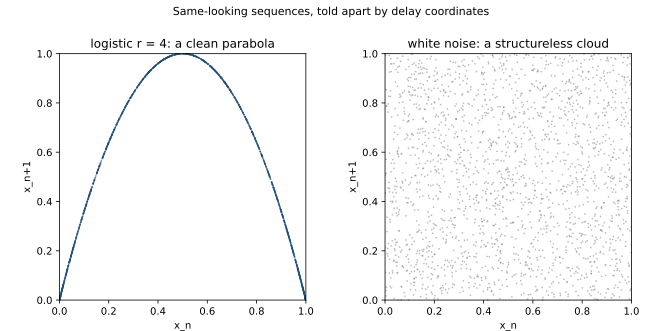

# ch17 — 混沌 不等於 雜訊：怎麼分辨真混沌

> **本章解決什麼問題**：前四個 Part 你已經看清混沌「是什麼」——一條確定性遞迴式怎麼從秩序走到混沌（Part II）、它長什麼形狀（Part III）、為什麼測不準（Part IV）。但有個尾巴一直沒收：混沌的時間序列**看起來就跟雜訊（noise）一模一樣**——寬頻譜、不重複、過了 Lyapunov 時間就測不準。肉眼根本分不出哪串數字是「低維確定性的假亂」、哪串是「真隨機」。本章回扣全書最重要的一刀（混沌 ≠ 隨機，見 ch04）：給你一個漂亮的判別直覺——相空間重建（phase space reconstruction）。同一串看似亂碼的數字，畫成延遲座標（delay coordinates）散點圖，混沌會現出一條曲線、雜訊只攤成一團雲。這是 Part V「與混沌共處」的第一步：先學會認出它，才談得上駕馭（ch18）與收束（ch19）。

```text
全書地圖：一條遞迴式，從秩序走到混沌，再走回來

  Part I  鐘錶宇宙的裂縫 ........ 決定論的夢，與第一道裂縫
     ch01 拉普拉斯的惡魔
     ch02 龐加萊的三體問題
     ch03 蝴蝶效應（勞侖次）
     ch04 決定論 不等於 可預測
        |
        v
  Part II  一條遞迴式裡的宇宙 ... 脊椎：xₙ₊₁ = r·xₙ·(1−xₙ)
     ch05 同一條遞迴式
     ch06 不動點與穩定
     ch07 倍週期分岔
     ch08 費根堡普適性
     ch09 混沌登場與秩序孤島
        |
        v
  Part III  混沌的肖像 ......... 混沌長什麼樣子
     ch10 相空間
     ch11 奇異吸子
     ch12 碎形與自相似
     ch13 碎維度
        |
        v
  Part IV  為什麼測不準 ........ 不可預測的機制與極限
     ch14 Lyapunov 指數
     ch15 可預測的地平線
     ch16 拉伸與摺疊
        |
        v
  Part V  與混沌共處 .......... 分辨、駕馭、收束    ◄ 你在這裡
     ch17 混沌 不等於 雜訊
     ch18 駕馭混沌
     ch19 同一條遞迴式，現在你懂它七層
```

## 從你已知的出發

你打開 Grafana，盯著一條延遲曲線。它在抖。P99 上上下下，沒有明顯週期，也沒有明顯趨勢——就是一團不安分的鋸齒。你心裡冒出一個你每天都在問、卻很少問到底的問題：

**這團抖動，是「有東西在動」，還是「就只是雜訊」？**

這個問題的答案，決定了你接下來該做什麼。如果它是雜訊——量測誤差、無數個獨立小因素疊加出來的隨機波動——那你盯著單一一次抖動找原因是白費力氣，該做的是統計：算分位數、設一個合理的告警門檻、別被單點嚇到。但如果它**不是**雜訊，而是某個有結構的動力（dynamics）在驅動——一個 retry 迴圈在自激振盪、一個 autoscaler 在 overshoot、一個快取在週期性失效又重建——那這團抖動就是**訊號**，它在告訴你系統內部有一台機器在運轉，而你應該去把那台機器找出來。

你做 anomaly detection 時，骨子裡幹的就是這件事：把「真訊號」從「背景雜訊」裡認出來。你預設一個「正常的雜訊水平」，然後抓偏離。但這裡藏著一個你大概沒正面想過的盲點——**你的「雜訊」假設，預設了那團抖動背後沒有低維的確定性結構。** 萬一有呢？萬一那串看起來像白噪音的 P99 抖動，其實是少數幾個變數的確定性回授迴圈算出來的「假亂」呢？

這正是本書反覆回扣的那一刀（見 ch04 那張四象限圖）：

- 一團抖動可以是**隨機但統計可測**的——真雜訊，高維、無數獨立來源疊加，你只能談它的分布（這是《馴服隨機》的地盤）。
- 也可以是**決定但不可測**的——混沌，低維、少數幾個確定性自由度，下一步完全被決定，但 Lyapunov 時間（見 ch14、ch15）一過你就算不準了。

問題是：**這兩種抖動，肉眼看起來幾乎一樣。** 把一段 logistic r=4 的混沌軌跡（ch09、ch14、ch16 的脊椎在全混沌時的樣子）和一段白噪音並排畫成時間序列，你分不出來。兩條都在亂跳、都不重複、頻譜都攤平成一片寬頻。你的眼睛在這裡會徹底失靈。

本章要給你一副能看穿這層偽裝的眼鏡。先說清楚兩者為什麼長得像（這樣你才知道為什麼會被騙），再給一個漂亮到我認為是全章最該記住的一手——**把單一變數的時間序列攤進延遲座標，確定性會藏不住地現形**。

## 為什麼混沌看起來像雜訊

先承認問題有多嚴重。把混沌誤認成雜訊不是粗心，是因為它們在好幾個你慣用的檢查上**真的長得一樣**。

**第一，兩者都不重複。** 混沌軌跡是非週期（aperiodic）的——這是 ch09 釘死的性質：被困在有限區間裡卻永不精確重複任何一個值。白噪音也不重複。所以「我看不出週期」這條，分不出兩者。

**第二，兩者的頻譜都是寬頻（broadband）。** 這點值得停一下，因為頻譜分析（spectral analysis）大概是你的第一直覺工具。把一條時間序列做傅立葉轉換（Fourier transform，見《馴服無限》談傅立葉的章），看它的功率譜（power spectrum）——能量集中在哪些頻率上。一個乾淨的週期訊號，功率譜上會有幾根尖銳的峰（這個頻率、那個頻率，其他都是零）。一個準週期（quasi-periodic）訊號，幾根峰加上它們的組合。

那混沌呢？你可能以為「混沌有結構，頻譜上總該有點東西」。**沒有。混沌的功率譜是一整片連續的寬頻——能量糊在所有頻率上，沒有任何主導的尖峰**，看起來跟白噪音的平坦頻譜幾乎沒兩樣。這是混沌最狡猾的地方：它在頻域（frequency domain）裡把自己的確定性結構藏得乾乾淨淨。傅立葉這把利器在這裡幾乎廢掉——它能漂亮地拆解週期與準週期，卻拆不開混沌與雜訊。

**第三，兩者長期都測不準。** 雜訊測不準是因為它本來就隨機（下一個值不被過去決定）。混沌測不準是因為 SDIC——過了 Lyapunov 時間 1/λ（見 ch14、ch15），起始那一丁點誤差被指數放大到系統尺度，你的預測爛掉。**結果一樣（測不準），來源不同（一個本體論的隨機、一個認識論的敏感）**，但你拿著一串數字，看不到「來源」，只看得到「結果」。

我把這三件事併成一張表，因為它正是「直覺的陷阱」的根：

```text
  你慣用的檢查         混沌（低維確定性）   白噪音（高維隨機）   能分辨嗎?
  ─────────────────────────────────────────────────────────────────
  看得出週期?          看不出（非週期）      看不出（隨機）        不能
  時間序列像不像亂碼?   像                    像                    不能
  功率譜形狀?          寬頻、無主峰          寬頻、平坦            幾乎不能
  長期可預測?          不能（過 1/λ）        不能（本來就不能）    不能
  ─────────────────────────────────────────────────────────────────
  「肉眼 + 頻譜」這層，混沌和雜訊長得幾乎一樣。
  需要換一副眼鏡——往「狀態空間的幾何」看，而不是往「時間/頻率」看。
```

最後一行是本章的轉折。前面那些檢查全都在問「這串數字隨時間/頻率怎麼變」。它們失敗，是因為混沌和雜訊在「時間軸上的長相」上確實撞臉。要分開它們，得換個問法：**這串數字背後，到底有幾個自由度（degrees of freedom）在動？**

## 關鍵差別：混沌活在低維吸子上，雜訊不會

這是全章的樞紐，請在這裡停十分鐘，因為你的直覺正要轉一個彎。

回想 Part III。混沌不是漫無邊際地亂——它的長期行為被「吸」到相空間裡一個**低維的集合**上，那就是吸子（attractor，見 ch10、ch11）。勞侖次的蝴蝶吸子活在三維相空間裡，但那隻蝴蝶本身是個碎維度約 2.06 的薄片（見 ch11、ch13）——比面多一點點，遠不到把三維空間填滿。logistic r=4 的混沌更極端：它只有**一個**自由度，整段動力學就是一條一維的拋物線在自我迭代。

**混沌的「少數幾個自由度」，是它和雜訊最本質的差別。** 一個混沌系統，無論行為看起來多亂，背後驅動它的確定性方程式只有少數幾個變數（勞侖次三個、logistic 一個）。它的狀態被鎖在一個低維的形狀裡。

真隨機剛好相反。白噪音哪來的？它是**無數個獨立小擾動疊加**的結果——熱躁動、量測電路裡千千萬萬個電子的隨機運動、你那條延遲曲線背後成千上萬個互不相干的請求各自的時序抖動。每一個小擾動都是一個獨立的自由度。把它們攤進相空間，它**不會**落到任何低維形狀上——它會試圖把整個空間填滿。理論上，理想白噪音的「維度」是無窮大：你給它幾維的空間，它就把那幾維塞滿，永遠看不到收斂的結構。

我把這個對照釘成一句話，這是本章你該能對另一個工程師複述的核心：

> **混沌是少數確定性自由度造出的假亂，活在一個低維吸子上；真隨機是無數獨立自由度疊出的真亂，攤滿整個高維空間、沒有吸子。**

問題只剩一個，而且很實際：**吸子活在相空間裡，可是你手上通常只有一個變數的時間序列。** 你的 Grafana 只給你一條 P99 曲線，不會把系統內部那「少數幾個自由度」的完整狀態向量端到你面前。勞侖次有 (x, y, z) 三個座標可以畫蝴蝶；你只有一串 xₙ。你怎麼可能光憑一個變數，把多維的吸子幾何看出來？

這聽起來像不可能的任務。下一節那個定理，會告訴你它驚人地可能。

## 相空間重建：用一個變數重建整個吸子

這裡有一個我認為是混沌理論裡最反直覺、也最實用的結果。

**Takens 嵌入定理（Takens embedding theorem，Floris Takens 1981；更早的直覺由 Packard、Crutchfield、Farmer、Shaw 1980 的〈Geometry from a Time Series〉提出）告訴你：你不需要拿到系統的完整狀態向量，光憑單一一個變數的時間序列，就能把吸子的幾何結構重建出來。** 方法簡單到不可思議——用**延遲座標（delay coordinates）**。

直覺先講白話。你只測得到一個變數 xₙ（比如蝴蝶的 x 座標，或你的 P99）。你看不到另外那幾個藏起來的自由度（y、z，或系統內部你看不到的狀態）。但這些變數是**耦合**的——x 怎麼動，受 y、z 影響；反過來，**x 過去幾步的值，已經悄悄把 y、z 的資訊編碼進去了**。所以不去測 y、z，改用 x 自己在不同時刻的值來當「替身座標」：

```text
  原本的相空間（你拿不到全部）：       狀態 =  (xₙ, yₙ, zₙ, …)   ← 真實自由度
                                                  ↑ 你只測得到第一個

  延遲座標重建（你只用得到的那一個）：  狀態 ≈  (xₙ, xₙ₊₁, xₙ₊₂, …)
                                                  └ 同一個變數的「現在、下一步、再下一步」
```

把每個時刻的這個延遲向量當成重建空間裡的一個點，畫出來。Takens 證明的是：在一般情況下，只要你取的延遲座標夠多維（嵌入維度 embedding dimension 夠大），這個重建出來的形狀，和真正的吸子在拓樸上是「同一個」（更精確地說是微分同胚 diffeomorphic）——它可能被拉歪、扭曲、換了形狀，但**該連在一起的還連在一起、該是幾維的還是幾維、該有的結構一個不少**。維度、Lyapunov 指數這些不隨平滑座標變換而改變的量，全都保留下來。

**本書到此為止。** 證明不做，嵌入維度怎麼選、延遲 τ 取多大、實作上怎麼避坑，這些是專門的非線性時間序列分析（nonlinear time series analysis）課題，指向本章延伸閱讀。你只要抓住這個震撼點：

> 一個變數的時間序列，自己跟自己的延遲版本配對，就能把藏在背後的多維吸子幾何「投影」回來——確定性的結構，在延遲座標裡藏不住。

而且最妙的是，這直接給了你一個**肉眼可用的判別法**。重建空間裡那團點：

- 若現出**結構**（一條曲線、一個有形狀的吸子、一片有厚度的薄片）——背後是低維確定性 → **混沌**。
- 若攤成**一團無結構的雲**，均勻填滿你給它的空間——背後是高維隨機 → **雜訊**。

下一節用脊椎遞迴式把這一手演到底。這是全章最漂亮的一刻。

## 脊椎現形記：把 logistic r=4 攤進延遲座標

拿出全書的脊椎（這是 ch05 那條遞迴式，現在轉到 r=4 的全混沌，正是 ch09、ch14、ch16 反覆出現的那個樣子）：

```text
        xₙ₊₁ = 4 · xₙ · (1 − xₙ)        （邏輯斯諦映射 logistic map，r = 4，0 ≤ x ≤ 1）
```

從 x₀=0.1 出發，手算迭代 10 步（每步重算、保留 4 位，這是全書的數值鐵律）：

```text
  n     xₙ        xₙ₊₁ = 4·xₙ·(1−xₙ)      （手算核對）
  ──────────────────────────────────────────────────
  0   0.1000  →  4·0.1000·0.9000 = 0.3600
  1   0.3600  →  4·0.3600·0.6400 = 0.9216
  2   0.9216  →  4·0.9216·0.0784 = 0.2890
  3   0.2890  →  4·0.2890·0.7110 = 0.8219
  4   0.8219  →  4·0.8219·0.1781 = 0.5854
  5   0.5854  →  4·0.5854·0.4146 = 0.9708
  6   0.9708  →  4·0.9708·0.0292 = 0.1134   （捨入到 0.1133~0.1134，取 0.1133）
  7   0.1133  →  4·0.1133·0.8867 = 0.4019
  8   0.4019  →  4·0.4019·0.5981 = 0.9615
  9   0.9615  →  4·0.9615·0.0385 = 0.1481
  ──────────────────────────────────────────────────
  這串：0.10, 0.36, 0.92, 0.29, 0.82, 0.59, 0.97, 0.11, 0.40, 0.96, 0.15 …
  把它端給任何人看：上上下下、不重複、像亂碼。肉眼判定——「看起來就是雜訊」。
```

這串數字確實像雜訊。沒週期、沒趨勢、跳來跳去。如果我不告訴你它是 logistic 算出來的，你會說它是隨機的。

現在施展延遲座標這一手。把相鄰兩步配成一對 (xₙ, xₙ₊₁)，當成二維平面上的點（橫軸 xₙ、縱軸下一步的值），畫散點圖：

```text
  把上面的迭代，每相鄰兩步配成一個點 (xₙ, xₙ₊₁)：

     (0.10, 0.36)   ← n=0→1
     (0.36, 0.92)   ← n=1→2
     (0.92, 0.29)   ← n=2→3
     (0.29, 0.82)   ← n=3→4
     (0.82, 0.59)   ← n=4→5
     (0.59, 0.97)   ← n=5→6
     (0.97, 0.11)   ← n=6→7
     (0.11, 0.40)   ← n=7→8
     (0.40, 0.96)   ← n=8→9
     (0.96, 0.15)   ← n=9→10
```

逐點檢查它們落在哪。橫軸 xₙ、縱軸 xₙ₊₁，畫個粗略的格子（縱軸朝上）：

```text
  xₙ₊₁
   1.0 |                  ·(0.59,0.97)   ← 靠近頂點
       |            ·(0.40,0.96)   ·(0.36,0.92)
   0.8 |        ·(0.29,0.82)              ·(0.82,0.59) 也在曲線上
       |                                          (見下，對稱)
   0.6 |                                ·(0.82,0.59)
       |     ·(0.10,0.36)                    ·(0.96,0.15)
   0.4 |                                  ·(0.92,0.29)
       | ·(0.11,0.40)                         ·(0.97,0.11)
   0.2 |
   0.0 |________________________________________________ xₙ
       0.0    0.2    0.4    0.6    0.8    1.0

  看出來了嗎? 這些點不是散落一地——它們全都乖乖落在一條
  「中間高、兩邊低、頂點在 (0.5, 1.0)」的拱形上。那就是拋物線。
```

為什麼？這是整章我最想讓你看見的那一刀，而且一旦看見就再也忘不掉：

> **因為 xₙ₊₁ = 4·xₙ·(1−xₙ) 本來就是 xₙ 的一個函數——一條拋物線。** 你畫 (xₙ, xₙ₊₁) 散點圖，等於在畫 y = 4x(1−x) 這條曲線本身。每一個點都**必須**落在這條拋物線上，一個都跑不掉。確定性藏在哪都行，就是藏不過延遲座標。

驗一下拋物線的幾個關鍵點，確認它就是 y = 4x(1−x)：

```text
  x = 0.00  →  4·0·1     = 0.00    （左端落地）
  x = 0.25  →  4·0.25·0.75 = 0.75
  x = 0.50  →  4·0.5·0.5   = 1.00   （頂點，最高）
  x = 0.75  →  4·0.75·0.25 = 0.75   （和 x=0.25 同高 → 左右對稱）
  x = 1.00  →  4·1·0       = 0.00    （右端落地）
```

對稱、頂點在中央、兩端觸底——標準的開口向下拋物線。我們手算那 10 個點，(0.10,0.36) 和 (0.92,0.29) 看似在圖上不同位置，其實都精準貼在這條同一條拱線上（你可以拿 x=0.10 代進去：4·0.1·0.9=0.36，分毫不差；x=0.92：4·0.92·0.08=0.2944≈0.29，也對）。再迭代一萬步，這一萬個點還是全部壓在這條拋物線上，連成一條乾乾淨淨、密密麻麻的曲線。

這就是「混沌活在低維吸子上」最赤裸的證據：logistic 的吸子，在延遲座標裡，就是一條**一維的曲線**。它只有一個自由度，藏無可藏。

現在把白噪音拿來做同一件事。生一串 [0,1] 區間裡的均勻隨機數（每個 xₙ 跟前一個毫無關係），也配成 (xₙ, xₙ₊₁) 來畫：

```text
  白噪音的延遲座標散點圖（示意，每點與前一點獨立）：

  xₙ₊₁
   1.0 | ·  ·  · ·   ·  ·    ·  · ·  ·   ·  ·  ·
       |  ·  ·   ·  ·   · ·   ·  ·   · ·  ·   ·
   0.8 | · ·  ·  ·   ·  ·  ·  ·  · ·   ·  ·  · ·
       |  ·  ·  ·  · ·   ·  ·  ·   ·  · ·   ·  ·
   0.6 | ·  · ·  ·  ·  ·  · ·  ·  ·  ·   · ·  ·
       |  · ·  ·  ·  ·  · ·  ·  ·   ·  ·  · ·  ·
   0.4 | ·  ·  · ·  ·  ·  ·  · ·  ·  ·  ·  · ·
       |  ·  · ·  ·  · ·  ·  ·  · ·  ·  ·  ·  ·
   0.2 | · ·  ·  ·  ·  ·  · ·  ·  ·  · ·  ·  ·
       |  ·  ·  · ·  ·  · ·  ·  ·  · ·  ·  · ·
   0.0 |________________________________________ xₙ
       0.0   0.2   0.4   0.6   0.8   1.0

  沒有曲線、沒有結構——點均勻填滿整個方形。因為 xₙ₊₁ 跟 xₙ
  毫無關係，知道這一步完全不告訴你下一步落哪，於是哪裡都去。
```

同樣一串「肉眼看像亂碼」的數字，一畫延遲座標，立刻分出兩家：

- logistic 混沌 → 點壓在**一條拋物線**上（低維結構現形）。
- 白噪音 → 點攤成**一整團填滿方形的雲**（無結構、高維）。

這就是本章的招牌視覺，我把它畫成一張對照圖（程式預先算好、嵌進閱讀器）：



logistic 是最乾淨的示範——一個變數、一維吸子、延遲座標一畫就是拋物線。真實系統沒這麼客氣：勞侖次有三個自由度，你得用更多維的延遲座標 (xₙ, xₙ₊₁, xₙ₊₂…) 才能把那隻碎維度 2.06 的蝴蝶撐開來。但**原理一模一樣**：低維確定性會在重建空間裡現出有結構的吸子；真隨機只會給你一團填滿空間的雲。混沌與雜訊的界線，不在時間軸、不在頻域，而在**重建後的狀態空間幾何**裡。

## 輔助判據：最大 Lyapunov 指數是否為有限正值

延遲座標散點圖是「看」——肉眼判結構 vs 雲。它直觀、可上手，但對著一團模稜兩可的點你還是會猶豫。所以再配一個你已經學過的量化判據，兩者交叉印證。

回到 ch14 的最大 Lyapunov 指數 λ：相鄰軌跡分離的指數率。混沌的定義性指紋就是 **λ 為一個有限的正值**。

- **λ > 0（有限）**：相鄰起點以 e^(λt) 指數分開——這是 SDIC，混沌的鐵證。logistic r=4 的 λ=ln2≈0.6931（見 ch14、ch16，每步誤差約翻倍）；勞侖次最大 λ≈0.9056（見 ch11、ch14）。**有限**很重要——它代表發散有一個確定的速率，背後有一台確定性機器在以固定步調拉伸。
- **λ ≤ 0**：軌跡收斂或不發散——不是混沌（不動點、週期軌、準週期，見 ch10）。
- **真隨機**：你可以硬去「估」一個 λ，但它不會給你一個乾淨、收斂、有限的正值；隨機性沒有「相鄰軌跡」這個概念可言（下一步本來就不被這一步決定），算出來的東西不穩定、隨資料量飄。

合起來，紙上判別流程長這樣：

```text
  一串「看起來像雜訊」的數字，紙上判別流程：

  ① 延遲座標散點圖：(xₙ, xₙ₊₁) 畫出來
        │
        ├─ 現出曲線 / 吸子 / 有結構薄片  →  疑似低維混沌
        │        │
        │        └─ ② 估最大 Lyapunov 指數 λ
        │                ├─ 有限正值（λ>0）→ 混沌（確定性、SDIC）✓
        │                └─ λ≤0           → 不是混沌（週期/穩定）
        │
        └─ 一團填滿空間的雲、無結構      →  疑似高維隨機（雜訊）
                 │
                 └─ 估 λ 不收斂、隨資料飄 → 支持「真隨機」判定

  兩個判據交叉印證，比任一個單獨可靠。但兩個都會被騙——見下節陷阱。
```

我刻意把判別寫成「兩個判據交叉」而不是「一個就夠」，因為這正是它最危險的地方：每一個判據單獨看都會被特定的反例騙過去。下一節專門拆這些騙局——它們不是理論潔癖，是你真拿這套去判一條 Grafana 曲線時，會親手踩到的坑。

## 直覺的陷阱

這套「畫延遲座標看結構 + 看 λ」聽起來乾淨利落。但它**會騙你**，而且騙得很有說服力。判別混沌與雜訊是出了名的容易誤判——文獻裡堆滿了「宣稱在某資料裡找到低維混沌、後來被推翻」的案例。守住下面幾條，否則你會自信地下錯結論。

```text
  陷阱                    錯誤直覺                     會在哪一步把你帶溝裡
  ────────────────────────────────────────────────────────────────────────────
  T1 短資料               「我有 200 個點，夠畫散     重建吸子要把高維形狀撐開，
                           點圖了吧」                  點太少根本填不出結構，混沌
                                                       看起來也像稀疏的雲 → 誤判成
                                                       雜訊（或反過來，雲太稀疏被
                                                       腦補成「好像有條線」）。

  T2 量測雜訊             「我畫出來有點像曲線又有     真實訊號永遠混著量測雜訊。
                           點散，那就是有點混沌」      一點雜訊就把乾淨的吸子「糊」
                                                       成一條帶寬的模糊帶，結構被
                                                       塗花 → 把混沌看成雜訊，或對
                                                       著糊帶過度解讀出不存在的結構。

  T3 非定常              「整段資料一起畫，看到散     系統參數隨時間漂移（non-
     non-stationary       開的雲 = 隨機」             stationary，例如白天晚上負載
                                                       不同），等於把好幾個不同系統
                                                       的點疊在一起，自然散成雲——
                                                       那是「拼接假象」，不是隨機。

  T4 有限維 ≠ 低維混沌    「我算出關聯維度是有限的     著名反例：有冪律功率譜的有色
                           小數 → 一定是混沌」          雜訊（colored noise），也會
                                                       給出有限的關聯維度。有限維度
                                                       是必要、非充分條件 → 單看維度
                                                       會把某些隨機過程誤判成混沌。

  T5 「看起來亂 = 隨機」   「肉眼看是亂的，所以是       這是全章的根（也是 ch04 那一
                           雜訊」                      刀）。混沌看起來就是亂的；
                                                       反過來，沒看懂的確定性也常被
                                                       當成「亂」。「亂」是表象，不
                                                       是來源。
  ────────────────────────────────────────────────────────────────────────────
```

逐條把正確版講清楚。

**T1（短資料）與 T2（量測雜訊）是同一類病：你的「相機」解析度不夠。** 重建吸子需要點足夠多、足夠乾淨，才能把那個低維形狀的細節撐出來。點太少，混沌的拋物線只剩稀稀落落幾顆，看起來跟稀疏的雲沒兩樣；點被量測雜訊污染，乾淨的曲線會「胖」成一條模糊帶。這就是為什麼真實的「在實驗資料裡找低維混沌」是門技術活——你不能拿 Grafana 上隨手框的 200 個點就宣稱「找到了混沌」。**這恰恰呼應 ch15：資料和精度本身就是有限的。** 你連把吸子看清楚的解析度都未必有。

**T3（非定常）是工程現場最常踩的。** 動力系統的所有判別法都默默假設系統是定常的（stationary）——那台確定性機器的參數在你採樣的這段時間裡不變。可你的後端服務白天和深夜根本是兩個不同的負載régime，一週上線好幾次改了行為。把跨越這些變化的一大段資料囫圇拿去畫延遲座標，你疊的是好幾個不同系統的點，散成雲是必然的——但那是**拼接假象**，不是「系統是隨機的」。判別前先確認你切的是一段行為穩定的窗口。

**T4 是最技術、也最該守住的一條，因為它直接打臉「有限維度 = 混沌」這個太好用的捷思。** 1980 年代大家興奮地算各種真實時間序列的關聯維度（correlation dimension），算出有限小數就宣布「低維混沌！」。後來 Osborne 與 Provenzale（1989）給了一記漂亮的反擊：**有冪律功率譜的有色雜訊——一個如假包換的隨機過程——也會算出有限的關聯維度**。所以「維度有限」是混沌的**必要條件、不是充分條件**：真混沌維度有限，但維度有限的不一定是混沌。對照之下，理想白噪音的關聯維度是無窮大（你給幾維它填幾維），這倒是個乾淨的「這是隨機」訊號——但真實雜訊很少是理想白噪音。

那專業上怎麼補這個洞？一個標準答案是**替身資料法（surrogate data method，Theiler 等人 1992）**：拿你的原始序列，做傅立葉轉換、把相位（phase）隨機打亂、再轉回時域，造出一批「替身」。這些替身**保留了和原序列一樣的功率譜（和線性相關結構），但被洗掉了任何非線性的確定性結構**。然後比較原序列和替身在某個判別量（比如重建後的某個非線性統計）上的差異：如果原序列和它的替身們沒差別，你看到的「結構」很可能只是線性隨機性的假象（虛無假設站得住）；如果原序列明顯偏離替身群，才有底氣說「這裡有非線性的確定性動力」。本書不展開替身法的細節（指向延伸閱讀），但你要記住這個精神：**判別混沌不是「看一眼散點圖就拍板」，而是「跟一個刻意去掉確定性的對照組比」。** 這跟你做 A/B 測試、跟對照組比才敢說某個改動有效，是同一種科學紀律。

**T5 是把前面全部收束的總綱，也是回扣 ch04 的那一刀：「亂」是表象，不是來源。** 看起來亂的東西，可能是低維混沌的假亂、可能是高維隨機的真亂、也可能只是你還沒看懂的確定性（一個你沒注意到的週期性 cron job、一個你沒拆開的耦合）。「我看不出規律所以它是隨機的」——這句話在這本書裡是錯的。混沌存在的全部意義，就是證明「看起來亂」和「真的隨機」是兩回事。下次你對著一條抖動的曲線想說「這就是雜訊」，先問自己：我是真的判定了它的來源，還是只是放棄了找結構？

關於真隨機本身的理論——它到底是什麼、機率分布怎麼描述它、白噪音與隨機漫步的數學——那是《馴服隨機》的地盤（見《馴服隨機》ch01 隨機為何可算、ch20 隨機漫步）。本書只負責守住這條界線：**混沌做的是假亂，原則上可以和真亂分辨，雖然實務上會被上面這些陷阱絆倒。**

## 紙上推演

### 推演題 1 ★ **[10 分鐘]**

下面是一串「看起來像雜訊」的數字，每個都在 [0,1] 之間：

```text
  0.20, 0.64, 0.9216, 0.2890, 0.8219, 0.5854, 0.9708, 0.1133
```

（提示：第一個之後，每個都是前一個用 r=4 的脊椎遞迴式算出來的——但先別管這個提示，假裝你只拿到這串數字。）

(a) 不用畫圖，光看這串數字，你能說它是混沌還是雜訊嗎？為什麼？
(b) 現在把相鄰兩步配成點 (xₙ, xₙ₊₁)：(0.20, 0.64)、(0.64, 0.9216)、…。手算驗證 (0.20, 0.64) 這個點是否落在拋物線 y=4x(1−x) 上。
(c) 用一句話說明：為什麼只要這串數字是 logistic 算的，每一個 (xₙ, xₙ₊₁) 點都「不可能」離開那條拋物線？

#### 推演解答

(a) **不能。** 這正是本章的起點：肉眼（和「看不出週期」這種檢查）分不出混沌與雜訊。這串數字上上下下、不重複、沒有明顯規律，看起來確實像雜訊——但「看起來像」不能當判據。你需要換一副眼鏡（延遲座標），不能光盯著數字本身。

(b) 點 (0.20, 0.64)：橫軸 xₙ=0.20，代進拋物線 y=4·0.20·(1−0.20)=4·0.20·0.80=0.64。算出來正好是 0.64，等於這個點的縱軸。**落在拋物線上，分毫不差。** 你可以再驗一個：(0.64, 0.9216) → 4·0.64·0.36=0.9216，也對。

(c) 因為 xₙ₊₁=4·xₙ·(1−xₙ) **本身就是一條把 xₙ 映到 xₙ₊₁ 的拋物線函數**。畫 (xₙ, xₙ₊₁) 散點圖，等於在描這條函數的圖形——每個點的縱座標都是橫座標代進這條拋物線算出來的，所以它**必然**落在線上，一顆都跑不掉。確定性（「下一步是這一步的函數」）在延遲座標裡藏無可藏。這是全章最該記住的一句。

### 推演題 2 ★★ **[15 分鐘]**

你的監控系統有一條指標看起來在隨機抖動。同事 A 說：「我把它畫成延遲座標 (xₙ, xₙ₊₁) 散點圖，看到隱約有條曲線，所以它是低維混沌，不是雜訊，別當隨機處理。」

請當一個焦慮的審查者，列出**至少三個**會讓同事 A 這個結論翻車的理由，並各給一句怎麼自我察覺/補救。

#### 推演解答

對應本章「直覺的陷阱」那張表，至少有四個方向可以打：

1. **資料量太少（T1）**：「隱約有條曲線」很可能是點太少、被腦補出來的。自我察覺：多取幾倍長度的資料重畫，若那條「曲線」隨點變多而散開，它本來就不存在。

2. **非定常（T3）**：這條指標跨越了不同的負載régime（白天/深夜、上線前後）嗎？如果是，你疊的是好幾個系統的點，看到的結構是拼接假象。自我察覺：只取一段行為穩定的短窗口重畫，看結構是否還在。

3. **有限維 ≠ 混沌（T4）**：就算真的看到一條像樣的曲線、甚至算出有限的關聯維度，也不夠——有色雜訊（power-law 譜）也能給出有限維度。自我察覺：做替身資料法（surrogate data，Theiler 1992），把相位打亂造一批保留功率譜的對照組，看原序列的「結構」是否顯著偏離替身；不偏離就站不住。

4. **量測雜訊把判斷糊掉（T2）**：「隱約」這個詞本身就警訊——真混沌的吸子在乾淨資料裡是清楚的曲線，「隱約」往往是雜訊把結構塗花、或根本沒結構被過度解讀。自我察覺：別在模稜兩可時下結論，補上量化判據（λ 是否為有限正值）交叉印證。

**核心：** 同事 A 犯的是「看一眼就拍板」，而判別混沌的科學紀律是「跟一個刻意去掉確定性的對照組比」。一個合格的判定需要：足夠長且定常的資料、清楚（非「隱約」）的結構、替身資料法支持、再加 λ 交叉印證——任何單一證據都會被某個反例騙過去。

### 推演題 3 ★★ **[12 分鐘]**

用你自己的話，向另一個後端工程師解釋這三件事（每件 2–3 句，不准用「混沌很神奇」這種空話）：

(a) 為什麼混沌的功率譜（傅立葉頻譜）幫不上分辨混沌與雜訊的忙？
(b) 「混沌活在低維吸子上、雜訊不會」這句話，到底在說什麼？
(c) 延遲座標散點圖為什麼能把 logistic 的確定性「逼」出來？

#### 推演解答

可接受的答法（鼓勵用自己的話，以下是骨架）：

(a) 因為混沌的功率譜是**寬頻、沒有主峰**的——能量糊在所有頻率上，和白噪音的平坦頻譜長得幾乎一樣。傅立葉很會拆週期和準週期（它們在頻譜上是幾根尖峰），但對「沒有主導頻率的亂」它無能為力，分不出這團寬頻是確定性的還是隨機的。

(b) 它說的是**自由度的數目**。混沌再亂，背後驅動它的確定性方程式只有少數幾個變數（logistic 一個、勞侖次三個），系統狀態被鎖在相空間一個低維的形狀（吸子）上。真隨機是無數獨立小擾動疊加，沒有少數幾個變數在主導，攤進相空間會試圖填滿整個高維空間、沒有吸子。低維 vs 高維，就是假亂與真亂的本質差別。

(c) 因為 logistic 的「下一步」就是「這一步」的一個函數（一條拋物線）。把 (xₙ, xₙ₊₁) 畫成散點，等於在描這條函數的圖形，每個點都被迫落在拋物線上、跑不掉。確定性的本質就是「下一步被現在決定」，而延遲座標恰好把「現在」和「下一步」並排畫出來，那個決定關係就無所遁形。白噪音的下一步不被這一步決定，所以畫出來只能是一團填滿的雲。

### 推演題 4 ★★★ **[18 分鐘]**

logistic r=4 只有一個自由度，所以二維延遲座標 (xₙ, xₙ₊₁) 就把它的吸子（一條拋物線）完整撐開了。但勞侖次系統有三個自由度，碎維度約 2.06（見 ch11、ch13）。

(a) 直覺上論證：為什麼用二維延遲座標 (xₙ, xₙ₊₁) **不夠**把勞侖次吸子撐開，得用更多維 (xₙ, xₙ₊₁, xₙ₊₂…)？（提示：想 ch10 講過的「軌跡不能自交」。）
(b) 這跟 Takens 定理「嵌入維度要夠大」的要求是同一回事嗎？
(c) 為什麼這對「判別」是好消息而不是壞消息？

#### 推演解答

(a) 一個碎維度約 2.06 的吸子，是個有厚度的薄片，硬塞進二維平面會「擠壓重疊」——本來在三維裡分開的軌跡段，投影到二維會**看起來交叉**。但 ch10 釘死了一條鐵律：確定性系統的軌跡**不能真的自交**（同一個狀態只能有一個未來）。所以二維重建會製造假交點，把吸子的真實結構糊掉。維度給得夠多（三維、甚至更多），這些被硬擠出來的假交叉就能在額外的維度裡「解開」，軌跡各歸各位、不再假交，吸子的真實幾何才撐得開。

(b) 是同一回事。Takens 定理裡「嵌入維度（embedding dimension）要夠大」這個條件，要的就是**給足維度讓軌跡不自交**——這樣重建出來的形狀才和真吸子拓樸上等價（微分同胚）。直覺版：嵌入維度不夠，吸子被擠出假交叉、結構失真；給夠了，真相還原。（嚴格的維度下界與選法是延伸閱讀的事，本書不展開。）

(c) 因為它意味著**你不需要拿到系統的完整內部狀態，光憑一個能測到的變數，就能把藏起來的多維吸子重建出來**——只要肯多疊幾個延遲座標。對判別混沌與雜訊是大好消息：現實中你幾乎永遠只測得到一兩個變數（一條 P99 曲線、一個感測器讀數），Takens 告訴你這不是死路。真隨機呢？無論你疊多少維延遲座標，它永遠不收斂到任何低維結構（它本來就沒有），始終是一團填滿空間的雲。「給夠維度後是否現出有限維結構」這件事本身，就成了區分兩者的判據。

## 自我檢核

口頭自答，講得出來才算過關：

1. 為什麼混沌的時間序列和白噪音肉眼幾乎分不出來？至少說出兩個它們「撞臉」的地方（提示：週期、頻譜）。
2. 為什麼傅立葉功率譜這把利器在分辨混沌與雜訊時幾乎廢掉？
3. 「混沌活在低維吸子上、雜訊不會」——用自由度的語言解釋這句話，並說它為什麼是兩者的本質差別。
4. 你只測得到一個變數的時間序列，憑什麼能把背後多維的吸子幾何重建出來？延遲座標 (xₙ, xₙ₊₁, xₙ₊₂…) 在幹嘛？（給直覺即可，Takens 定理的證明不要求。）
5. 為什麼把 logistic r=4 的迭代畫成 (xₙ, xₙ₊₁) 散點圖，點**必然**落在一條拋物線上、一顆都跑不掉？這跟「確定性」三個字什麼關係？
6. 同樣畫法，白噪音為什麼攤成一團填滿方形的雲而不是曲線？
7. 「我算出某條真實資料的關聯維度是個有限小數，所以它是低維混沌」——這個推論錯在哪？（提示：必要 vs 充分；有色雜訊。）
8. 列出三個會讓「畫延遲座標判混沌」翻車的陷阱，並說明替身資料法（surrogate data）想補的是哪一個洞。

## 延伸閱讀

- **Floris Takens, "Detecting Strange Attractors in Turbulence" (1981)**——延遲嵌入定理的原始論文，本章相空間重建的理論根。讀它的引言與定理陳述就好（證明硬核），抓「單一變數的延遲座標足以重建吸子」這個核心。（學術出處，多收於 Springer *Lecture Notes in Mathematics* 898。）
- **Packard, Crutchfield, Farmer & Shaw, "Geometry from a Time Series", *Physical Review Letters* 45, 712–716 (1980)**——比 Takens 定理早一年的直覺起點，第一次提出「用一個變數的延遲座標重建相空間幾何」。短、好讀，看他們怎麼把抽象想法變成可操作的圖。
- **Theiler et al., "Testing for nonlinearity in time series: the method of surrogate data", *Physica D* 58 (1992)**——替身資料法的奠基論文。本章「判別不是看一眼、是跟去掉確定性的對照組比」的科學紀律就出自這裡，補的是「有限維度 ≠ 混沌」這個洞。
- **Kantz & Schreiber, *Nonlinear Time Series Analysis*（劍橋大學出版，第 2 版 2004）**——把本章「給直覺、不展開」的所有實作（嵌入維度怎麼選、延遲 τ 怎麼定、關聯維度與 Lyapunov 怎麼從資料估、怎麼避免被雜訊騙）講全的標準教科書。想真的動手做時讀這本。
- **《馴服隨機》ch01（隨機為何可算）、ch20（隨機漫步）**——本章只守「混沌 ≠ 隨機」這條界線；真隨機本身是什麼、白噪音與隨機過程的數學在那裡。讀 ch01 建立「真隨機」的圖像，ch20 看時間軸上的隨機長什麼樣，正好和本章的「假亂」對照。
- 回頭重讀本書 **ch04（決定論 不等於 可預測）**——本章是那張四象限圖的兌現：抽象的「決定但不可測 vs 隨機且不可測」，在這裡變成一張你能動手畫、能看出差別的延遲座標散點圖。
