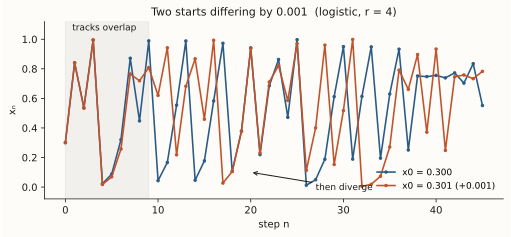

# ch03 — 0.506 與一隻蝴蝶：勞侖次與敏感依賴

> **本章解決什麼問題**：上一章龐加萊在三體問題裡，第一次用幾何看見「軌跡纏結到沒法寫出公式」的不祥前兆，但那還是天文學家紙上的東西。這一章，混沌第一次從一台真實的機器裡跳出來——1961 年，一位氣象學家為了省紙少印了幾位小數，整段天氣預測就此分了家。本章要把全書第二核心概念**敏感依賴於初始條件（sensitive dependence on initial conditions, SDIC）**講到你能轉述：它是什麼、為什麼讓誤差以指數放大、為什麼「再多測一位小數」幾乎買不到預測時間。吸子的**形狀**（那隻幾何上的蝴蝶）留到 ch11，把敏感量化成一個數（Lyapunov 指數）留到 ch14；這裡只給直覺與定性，但要給到位。

## 從你已知的出發

先講一件你早就知道、只是沒這樣替它命名的事：**你被 SDIC 咬過不只一次，當時你管它叫「浮點不可重現」。**

回想那種最難纏的分散式 bug——「在我機器上重現不出來」。兩個節點跑同一份二進位檔、餵同一份輸入，一個算出 A、一個算出 B。查到最後，兇手是某個 `double` 在不同累加順序下尾數差了最後一個 bit。`0.1 + 0.2` 不等於 `0.3`，浮點數從來不滿足結合律，加總的先後一換，結果就差那麼一丁點。於是你學乖了，浮點數不准用 `==` 比，一律寫 `abs(a - b) < eps`，給一個容差。

這條規矩底下，藏著一個你默默簽收的假設：**起點差一點點，終點也只差一點點。** 差最後一個 bit，算十步、算一百步，誤差頂多慢慢累積，不會失控——所以一個小小的 eps 就能把「實際上算的是同一件事」的兩個結果框在一起。對你天天寫的絕大多數程式，這假設成立，所以容差比較管用、你也就一直相信它。

混沌，就是這條假設**從原理上垮掉**的那一類系統。

在混沌系統裡，那最後一個 bit 的差不會乖乖窩在小數點後第十六位。它會被系統的動力學在每一步**乘一個固定倍率**——這是指數成長，不是線性累積。差最後一個 bit，可能算個三、四十步，這原本看不見的誤差就膨脹到和你要算的量同一個數量級，兩條軌跡徹底對不上。這時候 `abs(a - b) < eps` 永遠回 false，而且不是因為你程式有 bug，是因為**這個系統本來就不允許「差一點點」這件事撐太久**。

這也正是為什麼你追難纏的 bug 時會死咬 **bit-identical 重放（replay）**：event sourcing 把事件流一條不漏地重放、讓每個節點從**完全相同**的起點出發，連浮點累加順序都釘死。你要的是「完全相同」而不是「差不多相同」，正因為你心底隱約知道——某些計算路徑上，差不多相同會在幾步之內變成天差地別。你只是還沒給這個直覺一個名字。它叫 SDIC，背後是二十世紀數學最漂亮的發現之一。

這一章，我們去看它第一次砸到人臉上那一刻。被砸中的，是個氣象學家。

## 1961：一段被接力的天氣

主角是愛德華・勞侖次（Edward Lorenz），麻省理工學院（MIT）的氣象學家。1961 年，他在一台慢吞吞的早期電腦上跑一個簡化天氣模型——十二個變數的非線性方程組，描述大氣的對流與環流。跑一段模擬要花好幾個鐘頭。

那天勞侖次想把先前一次模擬的後半段再看仔細一點。老實的辦法是從頭重跑，但那得等上半天。他想了個捷徑：**從中途接力。** 他翻出上一次列印出來的中間結果，挑了一個時間點，把那一行數字重新敲進機器當新起點，按下執行，然後去喝杯咖啡。

回來一看，他傻了。新算出來的這段天氣，一開始和舊的那段幾乎重合，但很快開始偏離，越偏越多，到後面**完全是兩種不同的天氣**。同一個模型、同一組方程、看起來同一個起點，怎麼跑出兩條截然不同的軌跡？

他第一反應當然是懷疑機器壞了——真空管燒了、記憶體出錯了。但查下來硬體沒問題。真正的兇手藏在一個誰都不會多看一眼的地方：

```text
電腦記憶體裡實際在算的值：  0.506127   ← 六位小數
印表機印在紙上的值：        0.506      ← 只印三位,為了省版面

勞侖次接力時敲進去的,是紙上那個 0.506
兩者相差：                  0.000127   ← 約千分之一,約 0.1%
```

就這麼回事。電腦內部用六位小數運算，印表機為省紙只印前三位。勞侖次手動接力敲進去的，是紙上看到的 **0.506**，而不是記憶體裡真正在用的 **0.506127**。兩者只差約千分之一——在當年任何一個氣象學家眼裡，這誤差小到可笑，因為真實大氣的量測精度根本到不了千分之一。

但這千分之一的差，被那組非線性方程在每一輪迭代裡放大一點、再放大一點，幾十步後就膨脹成兩種完全不同的天氣。後來有人替勞侖次的模型估過：那個初始誤差大約**每四天就翻一倍**。我認為這是整本書最該停下來想十分鐘的一頁，因為這裡**沒有任何隨機**：方程式是死的，每一步都由上一步唯一決定，這台機器是百分之百的決定論機器。但它告訴勞侖次一件當時沒人準備好接受的事——**長期天氣預報，從原理上就不可能。** 不是儀器不夠準、不是電腦不夠快、不是模型不夠細，而是你永遠不可能把起點測到無限精確，而任何有限的精度誤差，都會在有限的時間裡被放大到淹沒整個預測。

勞侖次把這個觀察寫成了論文。

## 1963：那篇真正的奠基論文

1963 年，勞侖次發表了〈Deterministic Nonperiodic Flow〉（決定性的非週期流），刊於《大氣科學期刊》（*Journal of the Atmospheric Sciences*）卷 20，頁 130–141。光標題就是一個宣言：**決定性的（deterministic）**，卻是**非週期的（nonperiodic）**——一個完全由方程式決定、沒有隨機的系統，行為卻永不重複、永不安定。這在當時近乎矛盾修辭。

論文摘要寫得極克制：「略有差異的初始狀態，可以演化成相當不同的狀態。」（"slightly differing initial states can evolve into considerably different states."）這句話，就是 **SDIC 的原始定義**。翻成工程師的話：**起點差一點點，終點差很多——而且這個「很多」是隨時間指數長出來的。**

注意這篇 JAS 論文的份量與調性。坊間常把勞侖次的各種金句、各種軼事都掛到這篇論文上，但它其實技術、收斂，沒有蝴蝶、沒有海鷗。蝴蝶和海鷗的故事發生在別的場合——而那，也正是最常被講錯的部分。

## 蝴蝶這個名字，不是勞侖次取的

幾乎每個人都聽過「蝴蝶效應」，也幾乎每個人都把它的來歷記錯了。我們把三個史實一條一條釘死，因為這是本章最容易誤傳的地方。

**第一，「蝴蝶」這名字不是勞侖次自己取的。** 1972 年 12 月 29 日，勞侖次要在美國科學促進會（AAAS）第 139 屆會議上演講。但他遲遲沒交講題。主持那場議程的氣象學家 Philip Merilees 等不及，就在勞侖次沒給題目的情況下，替他擬了一個——

```text
Predictability: Does the Flap of a Butterfly's Wings
in Brazil Set Off a Tornado in Texas?

「可預測性：巴西一隻蝴蝶拍一下翅膀,
  會不會在德州掀起一場龍捲風?」
```

這題目太抓人了，「蝴蝶效應」這個詞就此傳遍世界。但功勞——如果算功勞——有一半要記在 Merilees 頭上。勞侖次本人對這個過度戲劇化的標題，態度是保留的（這點下面還會回來）。

**第二，蝴蝶之前，勞侖次用的是海鷗。** 同樣在 1963 年，勞侖次還有另一篇文章，發表在**紐約科學院學報**（*Transactions of the New York Academy of Sciences*）——**注意，這是另一篇，不是上一節那篇 JAS 奠基論文。** 坊間極常把這兩篇 1963 年的東西混為一談，務必分清。在這篇 NYAS 文章裡，勞侖次寫道（大意）：「**一位氣象學家**曾說，如果這理論是對的，那麼一隻**海鷗（sea gull）**拍一次翅膀，就足以永遠改變天氣的走向。」請盯住三件事：這句話出自**海鷗**那篇（NYAS）、不是蝴蝶那篇；勞侖次是在**轉述**「一位氣象學家」的話、那位氣象學家**沒有具名**，這不是勞侖次自己的主張。換句話說，後來那隻名揚四海的蝴蝶，前身是一隻別人嘴裡、沒名字的海鷗。

**第三，蝴蝶的「形狀」和蝴蝶的「拍翅」是兩件事的雙關巧合。** 這個坑很深，連嚴肅科普都常自己掉進去。勞侖次 1963 那個三維系統畫出來的吸子（ch11 主角），在相空間裡長得像一對展開的翅膀，所以後來被叫「蝴蝶吸子」——這是**幾何形狀**。而 Merilees 1972 擬的題目裡那隻蝴蝶，是**拍翅膀的隱喻**。兩隻蝴蝶剛好同名，純屬語言巧合，**不是「因為吸子像蝴蝶所以叫蝴蝶效應」**。把這兩件事縫成一句，是最常見的錯誤敘述之一。形狀的蝴蝶留給 ch11，本章只談拍翅那隻。

把這三點記牢，你對「蝴蝶效應」來歷的掌握，就贏過 90% 講過這個詞的人了。但比來歷更要緊的，是它**到底在講什麼、不在講什麼**——那是「直覺的陷阱」的事；先讓我們把 SDIC 的機制看清楚。

## SDIC 是什麼：誤差的指數放大

我們已經有了勞侖次的一句話定義：**任意接近的兩個起點，誤差會隨時間放大，直到大到系統的尺度。** 現在要把「放大」這個詞講清楚，因為魔鬼全在這裡。

關鍵**不**在「誤差會放大」——很多系統的誤差都會放大。關鍵在**放大的方式是指數的**。對照你熟的兩種誤差成長：

```text
線性放大（一般系統,誤差可控）：
   每一步誤差 +一個固定量
   起始差 ε,n 步後差 ≈ ε + n·c
   → 要讓誤差大十倍,大約要等十倍的時間。可接受。

指數放大（混沌系統,SDIC）：
   每一步誤差 ×一個固定倍數
   起始差 ε,n 步後差 ≈ ε · 2ⁿ （以「每步翻倍」為例）
   → 誤差大十倍,只要再等固定幾步。失控。
```

差別在那個符號：線性是**加法**，指數是**乘法**。你對指數成長的直覺其實很好——資料量翻倍翻到撐爆磁碟、retry storm 從一個逾時滾成雪崩、級聯故障在幾秒內吃掉整個叢集，那些都是「每一輪乘一個大於 1 的倍數」的東西。SDIC 就是**把誤差本身當成那個指數成長的量**。

為什麼混沌系統會把誤差乘起來而不是加起來？直覺是：系統的動力學同時做兩件事——把鄰近的點**拉開**（製造敏感），又把整個空間**摺回**有限範圍（讓行為有界、不飛到無窮遠）。拉開的那一下就是乘法；每迭代一次，兩條鄰近軌跡的距離就被拉伸一個固定的平均倍數。這台「拉伸＋摺疊」的機器是 ch16 的主角，它放大誤差的速率能量化成一個數——Lyapunov 指數 λ——那是 ch14 的事。本章你只要抓住這個畫面：**誤差每步乘一個大於 1 的倍數，於是指數成長，直到撞上系統的天花板。**

現在來算一個。不用 Lorenz 那三條 ODE（要連續時間、要積分，太重），我們借全書的脊椎遞迴式來感受同一件事。

## 借脊椎遞迴式預演一次

全書有一條貫穿到底的遞迴式，它**第 5 章才正式登場、正式交代來歷**（一個簡化的人口模型）。**這裡先借來感受 SDIC**，你現在只需要把它當成「拿這次的值算下次」的一條回授迴圈：

```text
        xₙ₊₁ = r · xₙ · (1 − xₙ)        （邏輯斯諦映射 logistic map,0 ≤ x ≤ 1）
```

x 是某種「滿載比例」（永遠在 0 到 1 之間），r 是唯一的旋鈕。我們把旋鈕轉到 **r = 4**——這是它最混沌的設定（為什麼是 4、為什麼這叫混沌，留給 ch09 與 ch14）。式子變成 `xₙ₊₁ = 4·xₙ·(1 − xₙ)`。

現在做一件你天天在做的事：拿兩個**幾乎相同**的起點，看它們會不會一直幾乎相同。起點 A 取 **x₀ = 0.300**，起點 B 取 **x₀ = 0.301**——只差 **0.001**，千分之一，正好對應勞侖次那個 0.506 vs 0.506127 的量級。一步一步手算（每個值都複算過、保留四位小數）：

```text
 n │  軌跡 A (x₀=0.300) │  軌跡 B (x₀=0.301) │  |A − B|   │ 備註
───┼────────────────────┼────────────────────┼────────────┼──────────────────
 0 │      0.3000        │      0.3010        │  0.0010    │ 起點,差千分之一
 1 │      0.8400        │      0.8416        │  0.0016    │ 已被拉開一點
 2 │      0.5376        │      0.5332        │  0.0044    │ 都被推到中段
 3 │      0.9943        │      0.9956        │  0.0012    │ 偶爾縮回去(靠近峰頂)
 4 │      0.0225        │      0.0176        │  0.0049    │ 被甩到接近 0
 5 │      0.0879        │      0.0692        │  0.0187    │ 差距開始竄
 6 │      0.3208        │      0.2576        │  0.0632    │ 破百分之六
 7 │      0.8716        │      0.7650        │  0.1066    │ 已是不同的天氣
 8 │      0.4476        │      0.7190        │  0.2714    │ 差 0.27,和變數本身同量級
```

看第八步。兩條軌跡的差距從 0.0010 長到了 **0.2714**——放大了約 270 倍。而 x 本身的活動範圍只有 0 到 1，所以 0.27 的差，已經意味著「這兩條軌跡到此為止，誰也說不準對方在哪」。再迭代下去，它們就像兩串無關的亂數，雖然各自都嚴格服從同一條死板的式子。

請盯住三件事：

1. **全程沒有任何隨機。** 每一個數字都是上一個數字代進 `4x(1−x)` 算出來的，你可以拿計算機一字不差地重算。這是百分之百的決定論。
2. **誤差不是一步翻一倍那麼整齊。** 看第 1、5、6 步放大得快，第 3 步甚至縮了一點（從 0.0044 縮回 0.0012）。為什麼？因為 `4x(1−x)` 這條拋物線在不同位置斜率不同——靠近兩端斜率陡（拉得猛）、靠近峰頂 x=0.5 斜率趨近零（那一瞬間幾乎不拉、甚至把兩點壓近）。**逐步的放大倍率會抖**，但長期拉開的平均趨勢是指數的。把「長期平均每步放大幾倍」取對數，就是 ch14 的 Lyapunov 指數——對 r=4 而言那個平均倍率恰好是 2（λ = ln2 ≈ 0.6931），所以「每步約翻倍」是個誠實的粗估。
3. **這就是勞侖次咖啡時間那件事的縮小版。** 他的起點差千分之一，在十二維天氣模型裡跑了幾十步；我們的起點也差千分之一，在一維玩具裡跑了八步。機制一模一樣：一個看不見的小差，被決定性的動力學指數放大到淹沒一切。



（上圖讓兩條軌跡跑得比我們手算的八步遠。看點在那個「假性重合」：前約十步，兩條線在圖上幾乎疊成一條，你會以為起點差千分之一無傷大雅；然後在某一步，它們突然岔開，從此再也對不回來。手算八步只是讓你親手摸到放大的開頭，整張圖才看得到全貌。）

## 為什麼「多測一位小數」幾乎沒用

這是 SDIC 最反工程直覺、也最該被你帶走的一條，值得單獨講。

你的本能會說：好，既然起點差千分之一會壞事，那我把起點測準一點不就行了？測到百萬分之一、十億分之一，總能撐久一點吧？

能撐久一點——但**撐久的回報少得可憐**，因為它是**對數的**。

用「每步誤差約翻倍」（r=4 的情形）來算。設你能容忍的最大誤差是 1（系統尺度），問：起始誤差 ε，幾步會被放大到 1？解 `ε · 2ⁿ = 1`，得 `n = log₂(1/ε)`。

```text
起始精度 ε      撐到誤差=1 的步數 n = log₂(1/ε)
─────────────  ────────────────────────────────
 10⁻³（千分之一）       ≈ 10 步
 10⁻⁶（百萬分之一）     ≈ 20 步     ← 精度提升 1000 倍,只多撐 10 步
 10⁻⁹（十億分之一）     ≈ 30 步     ← 再提升 1000 倍,又只多撐 10 步
 10⁻¹²                  ≈ 40 步
```

看出那個殘酷的規律了嗎？**每把精度提升一千倍（多測三位小數），預測時間只延長固定的約 10 步。** 換個更尖銳的講法：精度每提升十倍（多測一位小數），只多買到 `log₂(10) ≈ 3.3` 步。

這就是為什麼勞侖次說長期天氣預報原理上不可能。可預測的時間和你的測量精度，不是線性關係，是**對數關係**：預測視窗 ∝ log（1/誤差）。對數成長慢到令人絕望——你要把預測時間翻倍，得把精度提升的數量級也翻倍（從多測 3 位變成多測 6 位），代價指數上升、回報線性。地球上所有溫度計、氣壓計、衛星加起來，也買不到再多幾天的天氣。這不是工程問題，加錢、加算力、加感測器都填不平，因為這道牆是 SDIC 砌的，砌在原理層。

（這個對數報酬會在 ch15 落到真實天氣上——「約兩週」的可預測極限就是這麼來的；把放大率精確化成 Lyapunov 指數、把「步數」換成「Lyapunov 時間」是 ch14。本章你先記住那張表的形狀：**精度狂砸、時間慢爬**。）

## 直覺的陷阱

「蝴蝶效應」大概是被誤用得最嚴重的科學名詞之一。它太順口、太有畫面，於是被塞進無數和它原意相反的句子裡。以下每一條，都是「你以為它在說的」對上「它真正在說的」。

```text
誤解 ①：「微小的原因,必然導致某個特定的巨大結果。」
        （蝴蝶拍翅 → 必然 → 那場德州龍捲風）

正確版：蝴蝶效應是「對初始條件的敏感依賴」,它說的是
        ——長期預測不可能——,不是——小因必致某個特定大果——。
```

這是頭號誤解。庸俗版把蝴蝶效應講成一條**因果鏈**：這隻蝴蝶這一拍，導致了那場龍捲風，彷彿你能順著鏈條回溯責任、甚至「抓住那隻蝴蝶就能阻止龍捲風」。這是錯的。大氣科學家 Roger Pielke Sr. 對「一隻蝴蝶在數千公里外掀起某場龍捲風」這命題的回答很乾脆：在任何情況下都不可能，答案是「斷然的不」（a categorical NO）。理由是大氣是耗散系統——蝴蝶那點動能，在毫米量級的尺度上就被分子黏滯耗成熱了，根本爬不上影響龍捲風的尺度。

那蝴蝶效應到底在說什麼？它說的是：**因為起點的任何微小不確定都會被指數放大，所以我們無法把任何長期結果歸因到任何特定的微小初始事件，也無法從現在精確推出夠遠的未來。** 它是關於「可預測性極限」的隱喻，不是「A 拍翅導致 B 龍捲風」的因果聲明。蝴蝶不是兇手，蝴蝶是「我們永遠測不準起點」的代言人。把它當因果鏈，你就會問出「抓住那隻蝴蝶能不能阻止龍捲風」這種根本問錯的問題。

而且，「蝴蝶效應」其實有兩個深淺不同的版本，值得分清楚：

```text
                 1963 低階混沌的 SDIC          Palmer「真正的蝴蝶效應」(2014)
                 ──────────────────────       ──────────────────────────────
 出自             Lorenz 1963（三變數系統）     Lorenz 1969 多尺度流論文(Tellus)
 誤差怎麼長        指數放大                      指數放大,但更狠
 初值無限準的話    理論上能預測任意久            預測期限仍然有限!
 屏障性質          沒有絕對時間牆                有絕對的有限時間牆
```

- **第一層（本章主角）：1963 那種低階混沌的 SDIC。** 在這種系統裡，如果你能把初值測得**無限準**，理論上就能預測任意久——牆是「你測不到無限準」砌的，是現實限制，不是原理上的絕對屏障。
- **第二層（更激進）：Tim Palmer 2014 年在 *Nonlinearity* 提出的「真正的蝴蝶效應」（the real butterfly effect）。** 他主張 Lorenz 1969 年那篇多尺度流論文講的其實是更狠的東西：在某些多尺度流體系統裡，**即使把初值誤差縮到任意小，可預測期限仍趨向一個有限值。** 這是一道**絕對的有限時間屏障**——不是「測不夠準」，而是「就算測到無限準，牆還在那」。

本章焦點放第一層，它就足夠反直覺、也足夠把 Laplace 的惡魔逼到牆角；第二層你知道它存在、知道它更激進就好。

```text
誤解 ②：吸子長得像蝴蝶 → 所以叫「蝴蝶效應」。

正確版：兩隻蝴蝶是兩件事的雙關巧合。
        「形狀的蝴蝶」=吸子在相空間像一對翅膀(ch11);
        「拍翅的蝴蝶」=Merilees 1972 擬的演講題目隱喻。
        兩者剛好同名,沒有因果關係。
```

這條前面釘過，這裡再強調一次，因為連嚴肅科普都常講混。形狀的蝴蝶留 ch11，拍翅的蝴蝶是本章，別把它們縫成一句話。

```text
誤解 ③：勞侖次本人主張「蝴蝶拍翅必致龍捲風」。

正確版：勞侖次對這個強命題是——保留——的。
```

蝴蝶題目是 Merilees 擬的、不是他取的；海鷗那句他歸給「一位（未具名）氣象學家」、是轉述不是己見。勞侖次真正、嚴肅主張的，是那句克制的「略有差異的初始狀態可以演化成相當不同的狀態」——也就是 SDIC 讓長期預報失準，而**不是**「某次拍翅必然引發某場龍捲風」。引用蝴蝶效應時，請保留這位發現者本人的審慎；把他講成那條庸俗因果鏈的代言人，是冤枉他。

最後一條給工程師的自我察覺：**當你聽到「混沌就是因為方程不夠好／電腦不夠快」時，警報要響。** SDIC 是系統的固有性質，不是建模缺陷。換更好的模型、更快的電腦、更準的儀器，都只是讓你沿著上面那張「對數報酬」表往下挪一格、多買幾步，牆本身不會動。把原理問題誤診成工程問題，你會在錯誤的方向上倒進無限資源。

## 紙上推演

### 推演題 1 ★ **[12 分鐘]**

承本章脊椎遞迴式的 r=4 版 `xₙ₊₁ = 4·xₙ·(1 − xₙ)`。取一個新起點 **x₀ = 0.500**，手算前 4 步（保留四位小數）。算出來你會看到一件「特別」的事——說說它特別在哪。接著把你的 x₁ 和正文迭代表裡 A 軌跡的 x₁（起點 0.300 那條）比一比：起點差了 0.2，第一步後差了多少？這告訴你 r=4 在 x=0.5 附近，是「拉伸」還是「壓縮」鄰近的點？

#### 推演解答

逐步算（每步代進 `4x(1−x)`）：

```text
 n │   x        │ 算式
───┼────────────┼───────────────────────────
 0 │  0.5000    │ 起點
 1 │  1.0000    │ 4 × 0.5 × 0.5 = 1.0
 2 │  0.0000    │ 4 × 1.0 × 0.0 = 0.0
 3 │  0.0000    │ 4 × 0.0 × 1.0 = 0.0
 4 │  0.0000    │ 一旦碰到 0,就永遠卡在 0
```

特別之處：x₀=0.5 正好把式子推到峰頂 x₁=1（因為 0.5 是拋物線 `4x(1−x)` 的最高點），下一步立刻被甩到 0，之後永遠卡死。0 是這條映射的不動點（族群滅絕），一旦落上去就出不來。這是一條罕見的「乾淨」軌跡——但它脆弱得很：起點只要從 0.5 偏一點點，就完全不是這個結局了。

比較第一步：起點 0.500 算出 x₁ = 1.0000；正文 A 軌跡起點 0.300 算出 x₁ = 0.8400。起點差 `0.500 − 0.300 = 0.200`，一步後差 `1.0000 − 0.8400 = 0.1600`——差距從 0.2 **縮**到 0.16。所以在 x=0.5 這個峰頂附近，r=4 的映射是在**壓縮**鄰近的點，不是拉伸。直覺上的理由：`f(x)=4x(1−x)` 的斜率是 `f′(x)=4(1−2x)`，在 x=0.5 處 `f′=0`，斜率為零，那一瞬間幾乎把鄰近兩點壓成一點。這印證了正文那句——放大倍率會隨 x 位置抖動；峰頂附近壓縮、兩端附近狠拉，長期平均下來才是每步約 ×2。混沌不是「每一步都在放大」，是「平均而言在放大」。

### 推演題 2 ★★ **[15 分鐘]**

不用算迭代，純口頭／紙上估計。假設某混沌系統的誤差**每一步翻一倍**（`誤差 ≈ ε·2ⁿ`）。你對起點的測量誤差是 **ε = 10⁻⁶**（百萬分之一）。問：大約幾步之後，誤差會放大到 1（系統尺度）？接著回答關鍵問題——如果你咬牙把儀器精度提升一千倍（ε 變成 10⁻⁹），能多撐幾步？用這個結果，向一個不信邪的同事解釋「為什麼多測幾位小數幫助有限」。

#### 推演解答

解 `10⁻⁶ · 2ⁿ = 1`，即 `2ⁿ = 10⁶`，取 log₂：`n = log₂(10⁶) = 6·log₂(10) ≈ 6 × 3.32 ≈ 19.9`，約 **20 步**。（記法：2¹⁰≈10³，所以 2²⁰≈10⁶。）

精度提升一千倍後，解 `10⁻⁹ · 2ⁿ = 1`，即 `2ⁿ = 10⁹`，`n = 9·log₂(10) ≈ 29.9`，約 **30 步**。

```text
精度從 10⁻⁶ → 10⁻⁹（提升 1000 倍,多測 3 位小數）
可預測步數從 ≈20 → ≈30,只多了 ≈10 步。

關鍵比例：每提升 10 倍精度(多測一位),只多買 log₂(10)≈3.3 步。
```

向同事的解釋（口頭版）：「誤差是**指數**長大的——每步乘 2；而你能買到的預測時間，是誤差成長的**反函數**，所以是**對數**。指數的反函數慢得要命：我把儀器精度砸進去提升一千倍，預測時間只從 20 步爬到 30 步，多 50% 不到。要把預測時間翻倍（20 到 40 步），我得把精度提升到 10⁻¹²、再多測六位小數——代價暴漲、回報龜爬。所以這不是『再花點錢買更好的感測器』能解決的，牆是系統本身的指數放大砌的，不是儀器砌的。」常見錯路：有人會直覺以為「精度提升 1000 倍，預測時間也該提升 1000 倍」——那是把對數關係誤當成線性關係，正是 SDIC 最會騙人的地方。

### 推演題 3 ★★ **[12 分鐘]**

把一個你工作中遇過的現象翻譯成 SDIC 的語言：**「在我機器上重現不出來」的浮點 bug**。回答三個問題：(a) 這個系統的「初始條件」是什麼？(b) 那個「微小差異」具體是什麼、量級多大？(c) 為什麼有的計算「差最後一個 bit 無所謂」、有的卻「差最後一個 bit 就天差地別」——這跟系統是不是混沌有什麼關係？

#### 推演解答

(a) **初始條件** = 程式的全部輸入，加上浮點運算的**累加順序**（在分散式或多執行緒下，順序會因排程而不同）。兩個節點「餵同樣的輸入」往往只是輸入相同，累加順序卻悄悄不同——那也是初始條件的一部分。

(b) **微小差異** = 浮點數最後一個 bit 的捨入差，量級約 `ulp`（unit in the last place），對 `double` 約 10⁻¹⁶。這正是勞侖次那個 0.000127 的工程版，只是小了十幾個數量級。

(c) 關鍵在這段計算的動力學是「拉伸」還是「收斂」。**大多數計算是收斂或中性的**：誤差線性累積、甚至被平均掉，差最後一個 bit 算到最後還是差最後幾個 bit，`abs(a−b)<eps` 框得住，所以你平常不在乎。**但只要計算路徑裡藏著一個對輸入敏感放大的環節**（迭代求解器在接近發散的區、混沌動力模擬、某些 ill-conditioned 的矩陣運算、把浮點結果拿去做相等判斷後分支），那一個 bit 的差就會被指數放大，幾步內變成不同的分支決策、不同的輸出。**這就是局部的 SDIC。** 所以 bit-identical replay 不是潔癖，是因為你沒法事先知道哪條計算路徑藏著拉伸環節——既然分不出來，最安全的做法就是把起點（連累加順序）鎖到完全一致，不給誤差任何被放大的機會。一句話：**會不會被最後一個 bit 咬，取決於你的計算是不是局部混沌的。**

## 自我檢核

逐題口頭自答，講得出來才算過關：

1. 用一句話把「敏感依賴於初始條件（SDIC）」講給另一個工程師聽，而且**不准用「蝴蝶」這個詞**。
2. 勞侖次 1961 年那個故事裡，真正出問題的是哪個數字、差多少（給數量級）、為什麼這麼小的差會釀成大禍？三個細節都要對。
3. 「誤差線性累積」和「誤差指數放大」差在哪一個數學運算上？為什麼這個差別決定了一個系統能不能長期預測？
4. 為什麼把測量精度提升一千倍，可預測時間卻只延長一點點？這是什麼函數關係？
5. 「蝴蝶效應」最常見的庸俗誤解是什麼？正確版是什麼？（提示：它是關於可預測性的隱喻，不是因果鏈。）
6. 「蝴蝶的形狀」和「蝴蝶的拍翅」為什麼是兩件不同的事？哪一件是本章、哪一件留到 ch11？
7. 蝴蝶這名字是誰取的、什麼場合？勞侖次原本用的是什麼動物、出自哪一篇文章（哪個期刊）？
8. 一個同事說「我們的模擬測不準，是模型不夠精細、機器不夠快，加錢就能解決」。在什麼情況下他是對的、什麼情況下他根本誤診了問題？

## 延伸閱讀

- **Edward Lorenz, "Deterministic Nonperiodic Flow," *Journal of the Atmospheric Sciences* 20 (1963): 130–141.** 混沌理論的奠基論文本尊。就算你不打算細啃那三條 ODE，也值得讀它的摘要與引言——看 1963 年的勞侖次怎麼用最克制的學術語言，說出「決定性卻非週期」這個當時近乎矛盾的命題。本章 SDIC 的原始定義就在這裡。
- **Edward Lorenz, "The Predictability of Hydrodynamic Flow," *Transactions of the New York Academy of Sciences* 25(4) (1963): 409–432.** 海鷗那句話的真正出處（不是上面那篇 JAS）。想親眼確認「海鷗、未具名氣象學家、勞侖次的審慎」三件事，讀它的結尾段。
- **T. N. Palmer, A. Döring, G. Seregin, "The real butterfly effect," *Nonlinearity* 27(9) (2014): R123.** 如果你想知道「比 SDIC 更狠的蝴蝶效應」長什麼樣——有限時間的絕對可預測屏障——讀這篇。它把 Lorenz 1969 那篇被忽略的多尺度流論文重新挖出來，主張那才是勞侖次心裡真正的蝴蝶效應。
- **National Geographic, "The butterfly effect is a real phenomenon—but not how you think."（科普文，2026-06 可查）** 用大眾語言把「直覺的陷阱 ①」講得很清楚，含 Roger Pielke Sr.「斷然的不」那段。適合你想向非工程師朋友轉述本章時拿來對照措辭。
- **James Gleick, *Chaos: Making a New Science* (Viking, 1987).** 把勞侖次咖啡時間的故事寫得最有畫面的科普經典。讀第一章〈The Butterfly Effect〉即可——它就是讓「蝴蝶效應」走進大眾文化的那本書。注意它是說故事的書、不是教科書，享受敘事但細節以本書事實基準為準。
