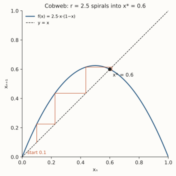

# ch05 — 同一條遞迴式：邏輯斯諦映射

> **本章解決什麼問題**：前四章我們在歷史與概念的高空盤旋——拉普拉斯的承諾、三體的失靈、勞侖次的捨入、三條被混為一談的線。現在飛機降落。從這章起，全書綁在一條只有三個符號的遞迴式上：`xₙ₊₁ = r·xₙ·(1 − xₙ)`。它簡單到你五秒鐘就能寫成一個迴圈，卻能在接下來九章裡，把秩序、分岔、普適常數、混沌，一層一層長出來。本章只做一件事：把這條式子安裝到你腦袋裡——它從哪來、為什麼長這樣、那唯一的旋鈕 r 是什麼、以及怎麼用一張「蛛網圖」用眼睛看它跑。不動點為什麼穩（ch06）、轉到 r＞3 會裂成兩半（ch07）都先不碰；這章是地基。

```text
全書地圖：決定論許下的承諾，如何被一條遞迴式拆穿，又如何露出鐵一般的秩序

  Part I  決定論的承諾 ............ 一個被算盡的宇宙，與它的第一道裂縫
     ch01 拉普拉斯的承諾
     ch02 三體：第一個解不開的時鐘
     ch03 0.506 與一隻蝴蝶（勞侖次）
     ch04 三條被混為一談的線（決定／隨機／可測）
        |
        v
  Part II  一條遞迴式裡的宇宙 ..... 脊椎：xₙ₊₁ = r·xₙ·(1−xₙ)   ◄ 你在這裡
     ch05 同一條遞迴式
     ch06 不動點與穩定
     ch07 倍週期分岔
     ch08 費根堡常數（鐵律登場）
     ch09 混沌登場與秩序的孤島
        |
        v
  Part III  混沌的肖像 ........... 亂，長什麼樣子
     ch10 相空間
     ch11 奇異吸子
     ch12 碎形
     ch13 碎維度
        |
        v
  Part IV  為什麼測不準 .......... 不可預測的機制與極限
     ch14 Lyapunov 指數
     ch15 可預測的地平線
     ch16 拉伸與摺疊
        |
        v
  Part V  與混沌共處 ............ 分辨、駕馭、收束
     ch17 混沌不是雜訊
     ch18 駕馭混沌
     ch19 同一條遞迴式，現在你懂它七層
```

## 從你已知的出發

先別管「混沌」這個詞。我給你看一段你寫過一百遍的程式邏輯，只是換個變數名：

```text
state = initial
loop:
    state = step(state)     ← 拿這一輪的結果，餵進下一輪
```

這就是一個回授迴圈（feedback loop）。輸出變成下一次的輸入，一輪一輪滾下去。你的職業生涯有一大半泡在這種東西裡：

- **retry 迴圈**：這次失敗了，根據失敗狀態（退避時間、剩餘配額）決定下一次怎麼打。`backoff = step(backoff)`。
- **autoscaler**：控制迴圈每 30 秒醒來一次，看「目前負載」算出「下一輪要開幾個副本」，副本數又改變了下一輪的負載。負載 → 副本數 → 負載，咬尾巴。
- **佇列長度回授**：消費者根據佇列深度調整拉取速率，速率又改變佇列深度。
- **PRNG**（見 ch04）：`seed = lcg(seed)`，整串「假亂」就是同一個 `step` 不斷餵自己。

這些系統的共通骨架，可以寫成數學裡最樸素的一行：

```text
xₙ₊₁ = f(xₙ)
```

`xₙ` 是第 n 輪的狀態，`f` 是你的 `step` 函式，`xₙ₊₁` 是下一輪。整數下標 n＝第幾輪迭代，就是你迴圈裡的計數器。**迭代是你的母語**——你不需要我解釋什麼叫遞迴、什麼叫把輸出餵回輸入。

那混沌理論在這裡插一句話：**只要 `f` 不是直線（有點彎、有個峰），這條再普通不過的迴圈，可以從乖乖收斂，一路長成完全測不準的亂流。** 而且整個劇情，可以濃縮在一個具體的 `f` 上演完。本書選的那個 `f`，就是這章的主角。

我認為這是這本書最划算的一筆投資：你只要真正吃透一條三個符號的式子，後面所有的震撼——分岔、費根堡常數、混沌帶——都長在它身上。所以這一章值得你慢慢讀。

## 一條給人口的遞迴式

故事要從一個跟程式無關的問題講起：**一個族群下一年會有多少隻？**

最笨的模型是指數成長。每年乘一個固定的成長率 r：今年 100 隻、r＝2，明年 200、後年 400、再來 800……這你太熟了，這就是「複利」、就是「資料量每季翻倍」、就是你最怕的那種曲線。問題是它永遠不會停——兔子會塞滿整個宇宙。現實裡不會這樣，因為食物會吃光、空間會擠爆、瘟疫會來。**成長會被擁擠壓住。**

比利時數學家維赫斯特（Pierre-François Verhulst）1838 年就寫下了「成長被擁擠壓住」的連續版方程式（他叫它 logistic，邏輯斯諦），那是一條微分方程，畫出來是一條漂亮的 S 形曲線：先指數衝、接近上限時減速、最後平滑貼到一條水平天花板。Verhulst 的式子很乖，永遠收斂到那條天花板，一點也不混沌。**這裡有個關鍵岔路，你先記著：連續時間的版本（一條微分方程）很溫馴；本書要用的是離散時間的版本（一條遞迴式），它一點都不溫馴。** 差別在哪、為什麼差這麼多，是後面好幾章的戲（連續動力系統的工具指向《馴服無限》ch13）。

把「成長被擁擠壓住」搬到離散的、一年一跳的世界，就得到本書的脊椎：

```text
邏輯斯諦映射（logistic map）：xₙ₊₁ = r·xₙ·(1 − xₙ)
                              0 ≤ x ≤ 1，  0 ≤ r ≤ 4
```

逐項拆給你看，每一塊都對應一個你能摸到的直覺：

- **xₙ**：第 n 代的族群「飽和度」。不是頭數，是「佔滿了多少」——0 表示滅絕、1 表示擠到了理論上限。把它正規化到 [0,1] 之間，純粹是為了乾淨：你不必再記「上限是幾隻」，只要看「離滿有多遠」。這跟你把使用率寫成 0–100% 而不是寫絕對核心數，是同一個動作。
- **r**：成長率（growth rate）。族群在「很空、不擁擠」時，下一代是這一代的幾倍。r 越大，繁殖力越旺。**這是整條式子唯一的旋鈕**——稍後我會回來大講特講它。
- **(1 − xₙ)**：擁擠抑制項，這是整條式子的靈魂。x 接近 0（很空）時，(1−x) 接近 1，幾乎不打折，成長全速跑；x 接近 1（快擠爆）時，(1−x) 接近 0，把成長狠狠按住。**這就是 backpressure。** 你的消費者在佇列快滿時主動降速、autoscaler 在資源見頂時不再加開——那個「越接近極限、越踩煞車」的力，就是 (1−x)。

把成長項 `r·xₙ` 和煞車項 `(1−xₙ)` 乘在一起，你得到一個拔河：**繁殖想把 x 推高，擁擠想把 x 拉低。** 兩股力量相乘，畫成 x 對 xₙ₊₁ 的圖，是一條開口向下的拋物線——中間（x＝0.5）最高，兩端（x＝0 滅絕、x＝1 擠爆）都掉到 0。

```text
   xₙ₊₁
    ^
    |        .-''''-.          ← 拋物線：xₙ₊₁ = r·xₙ·(1−xₙ)
    |      .'        '.            峰在 x=0.5（r/4 高）
    |    .'            '.          兩端 x=0、x=1 都壓到 0
    |  .'                '.
    |.'                    '.
    +------------------------> xₙ
    0          0.5          1
```

為什麼 r 卡在 0 到 4 之間？因為要讓 x 永遠待在 [0,1] 這個合理範圍裡。拋物線的最高點在 x＝0.5，高度是 r·0.5·0.5 ＝ r/4。只要 r ≤ 4，這個峰頂不超過 1，x 就永遠不會跳出界。r＝4 是極限，峰頂剛好頂到 1。超過 4，x 會被踢到負的、然後爆炸跑掉——那已經不是我們要的故事了。

所以它就是一個離散回授迴圈，一個你閉著眼睛都能寫的迴圈：

```text
x = 0.1            ← 隨便挑一個起點（初始族群）
loop forever:
    x = r * x * (1 - x)   ← 把這一代餵進去，得下一代
```

簡單到不像話。但這條迴圈裡藏了整個 Part II 到 Part IV 的劇情。

## 把人口模型還原成「你的回授系統」

別被「人口」這個包裝騙了。Verhulst 想的是兔子，但這條式子描述的是一個更抽象、跟你天天打交道的東西：**一個被自己上一輪結果牽著走、而且越靠近極限越被壓制的回授系統。**

我把對應關係攤開給你：

| 邏輯斯諦映射 | 你的後端世界 |
|---|---|
| xₙ：第 n 代飽和度 ∈ [0,1] | 第 n 輪的歸一化負載 / 使用率 / 佇列飽和度 |
| `r·xₙ`：無擁擠時的成長 | 上一輪結果驅動的「想要的擴張」（重試、加副本、加速拉取）|
| `(1 − xₙ)`：擁擠抑制 | backpressure：越接近滿載，系統越踩煞車 |
| r：唯一旋鈕 | 你的控制增益 / 積極程度（重試多猛、scale 多快）|
| 迭代 n → n+1 | 控制迴圈的每一個 tick |

看那個 autoscaler。它每個 tick 把「目前負載」餵回「下一輪副本數」，副本數又回頭改變下一輪負載。如果它調得溫和（增益小），系統會平順地收斂到一個剛好的副本數，穩穩待著——這正是稍後 r＝2.5 那個例子的行為。如果它調得太猛（增益大），系統會開始在「開太多」和「開太少」之間來回甩，也就是你在 on-call 時親眼見過的 **flapping**——副本數在 N 和 2N 之間反覆橫跳，永遠靜不下來。

這裡先埋一個你應該起雞皮疙瘩的伏筆：**flapping 不是 bug，是這條式子的一個內建相位。** 把那個「增益太猛」繼續往上轉，系統不會只是在兩個值間跳，它會在四個值間跳、八個值間跳，最後跳進一種你永遠抓不到規律的狀態。那個旋鈕，就是 r。而 flapping、四值橫跳、徹底測不準，全是同一條式子在不同 r 下的不同面孔。

這就是全書的中央張力第一次露頭：**同一條完全確定的式子**（給定 x₀ 和 r，每一步都算得死死的，沒有半點隨機）**，既能乖到收斂成一個點，又能亂到沒人測得準。** 敏感（亂）與鐵律（這套行為跨系統都一樣，後面會看到一個跨宇宙不變的常數）如何在這同一行裡共存——這是全書反覆要叩問的那句話，而它從這章的這一行式子就開始了。

## r 是唯一的旋鈕

我要把這件事講到你忘不掉，因為它是 Part II 的整個結構：**這條式子裡只有一個你能轉的數字，就是 r。**

x 不是旋鈕——x 是狀態，它隨迭代自己跑。x₀（起點）你能挑，但挑完之後 x 怎麼走由 r 決定；而且後面會看到，當系統進入混沌，起點挑哪裡幾乎不影響「長什麼樣子」（只影響「具體哪條軌跡」）。所以真正掌控劇情走向的，從頭到尾只有 r 這一個鈕。

把 r 想成一個音量旋鈕、或一個你 config 裡的 `aggressiveness` 參數。慢慢從 0 轉到 4，這條式子會依序上演（全部留到後面章節，這裡只先給你一張節目單，讓你知道前方有什麼）：

```text
轉動 r，同一條式子依序變臉（節目單，細節見後續各章）：

  r < 1      族群撐不住，x → 0（滅絕）。煞車比油門強。
  1 < r < 3  收斂到單一穩定值 x* = 1−1/r。乖。      ← 本章 r=2.5 在這
  r = 3      臨界：穩定值要失守了。                  （ch06 講為什麼）
  r > 3      裂成 2 個值來回跳（2-cycle）。flapping。 （ch07）
  r ≈ 3.4495 再裂成 4 個值。                          （ch07）
  …          8、16、32…一路加倍，間距越縮越快。       （ch08 的鐵律）
  r ≈ 3.57   加倍加到底，進入混沌帶。落點填滿一片區間。（ch09）
  r > 3.57   混沌——但裡面還藏著秩序的孤島。          （ch09）
  r = 4      全混沌。每步誤差約翻倍，徹底測不準。      （ch14、ch16）
```

讀到這你該有的反應是：**等一下，同一行式子，只動一個數字 r，就能從「收斂到一個點」一路走到「徹底的混沌」？** 對，就是這麼一回事。這是我認為整本書最值得你先吞下去的事實：複雜不需要複雜的來源。亂不是因為式子亂——式子簡單到極點——亂是 r 轉過某個位置之後，這條簡單迴圈自己長出來的。

混沌不是被「加」進系統的雜訊。它是一條乾淨的確定性規則，在某個參數下的固有行為。這一刀，正是拉普拉斯惡魔開始流血的地方（見 ch01）：規則完全已知、完全確定，卻不保證你算得到未來。

本章我們只把旋鈕停在一個乖巧的位置——r＝2.5——把這條式子怎麼跑、怎麼用眼睛看它跑，徹底弄懂。轉動旋鈕看好戲，是下一章開始的事。

## 怎麼用眼睛看一條遞迴式：蛛網圖

手算迭代會給你一串數字，但數字不會讓你「看見」軌跡在做什麼。動力學家用一個很聰明的幾何把戲，叫 **蛛網圖（cobweb plot，蛛網／階梯圖）**，把整串迭代畫成一條在圖上彈跳的路徑。一旦你會讀它，一眼就能看出這條式子是收斂、是震盪、還是要爆掉。

圖上只有兩條線：

1. **那條拋物線** `y = r·x·(1−x)`：你的 `f`，輸入 x、吐出下一個值。
2. **那條對角線** `y = x`：純粹的「鏡子」，幫你把「剛算出的輸出」搬回「下一次的輸入」位置。

讀法是一個機械化的雙步驟，跟你迴圈裡 `x = step(x)` 的兩個動作一模一樣：

```text
蛛網圖讀法（從 xₙ 走到 xₙ₊₁，兩步）：

  第一步（算）：從橫軸的 xₙ 垂直畫到拋物線。
               碰到的高度就是 xₙ₊₁ = f(xₙ)。     ← 這是「算下一步」
  第二步（回填）：從那一點水平畫到對角線 y=x。
               落點的橫座標 = 剛算出的 xₙ₊₁。     ← 這是「把輸出搬回輸入」
  重複：以新的橫座標當作下一個 xₙ，再垂直、再水平…
```

「垂直碰拋物線、水平碰對角線、再垂直、再水平」——這個來回擺盪的路徑，在拋物線和對角線之間織出一張像蛛網的東西，名字就這麼來的。重點是：**你不用算，光看那條路徑往哪去，就知道系統往哪去。**

- 路徑**一圈圈往內縮、收進兩線的交點**：軌跡在收斂。那個交點是不動點（fixed point，下一章主角）——拋物線和對角線相交處，正是 f(x)＝x、也就是「餵進去等於吐出來」、x 不再變的地方。
- 路徑**在交點兩側來回跨、像爬樓梯轉圈**：軌跡在震盪式逼近（或震盪式發散）。r＝2.5 就是這種——它不是直直走進交點，而是繞著交點打轉收進去。
- 路徑**一圈圈往外甩、離開交點**：軌跡發散，這個點是排斥的（unstable）。

下面這張預先算好的圖，畫的就是本章主角 r＝2.5、起點 x₀＝0.1 的蛛網。看那條路徑怎麼在拋物線和對角線之間，一階一階「彈」向不動點 0.6：



我提醒一句後面會兌現的觀察：r＝2.5 的路徑是「**繞著交點打轉收進去**」，不是「直線滑進去」。這個「打轉」不是裝飾——它對應到 x 在 0.6 上方、下方、上方、下方交替逼近的那種**震盪式收斂**。為什麼會震盪而不是單調，是不動點的斜率（ch06）在管的事；這裡你先用眼睛把這個「繞圈收進去」的形狀記住就好。蛛網圖最大的價值就是這個：它把「斜率決定穩定性」這件之後要嚴格講的事，先變成一個你看得見的幾何畫面。

## 動手算一遍：r＝2.5，看它震盪著收斂到 0.6

直覺講夠了，來真的。我們把旋鈕停在 r＝2.5，從 x₀＝0.1（一個很空的族群）出發，一步一步手算。式子是 `xₙ₊₁ = 2.5·xₙ·(1 − xₙ)`。

我先預告答案，這樣你算的時候知道要往哪看：理論上的收斂目標是不動點 `x* = 1 − 1/r = 1 − 1/2.5 = 1 − 0.4 = 0.6`。所以這串數字應該往 0.6 爬。但**注意爬的方式**——不是乖乖單調往上，而是越過 0.6、退回來、再越過、再退回，像一個鐘擺幅度越來越小地停在 0.6。盯著「跟 0.6 的關係」那一欄看：

```text
r = 2.5，x₀ = 0.1，逐步手算（保留 4 位小數；式子 xₙ₊₁ = 2.5·xₙ·(1−xₙ)）

 n |   xₙ    |  1 − xₙ  |  2.5·xₙ·(1−xₙ)        | 跟 0.6 的關係
---+---------+----------+-----------------------+----------------
 0 | 0.1000  |  0.9000  | 2.5·0.1·0.9   = 0.2250 | 遠遠在下方
 1 | 0.2250  |  0.7750  | 2.5·0.2250·0.7750     | 還在下方，但跳了一大步
   |         |          |   = 0.4359             |
 2 | 0.4359  |  0.5641  | 2.5·0.4359·0.5641     | 逼近中
   |         |          |   = 0.6147             | ← 第一次「越過」0.6 到上方
 3 | 0.6147  |  0.3853  | 2.5·0.6147·0.3853     |
   |         |          |   = 0.5921             | ← 退回 0.6 下方（震盪!）
 4 | 0.5921  |  0.4079  | 2.5·0.5921·0.4079     |
   |         |          |   = 0.6038             | ← 又彈到上方，但更靠近了
 5 | 0.6038  |  0.3962  | 2.5·0.6038·0.3962     |
   |         |          |   = 0.5981             | ← 又落到下方，更靠近
 6 | 0.5981  |  0.4019  | 2.5·0.5981·0.4019     |
   |         |          |   = 0.6010             | ← 上方，差距剩 0.001
 7 | 0.6010  |  0.3990  | 2.5·0.6010·0.3990     |
   |         |          |   = 0.5995             | ← 下方，越夾越緊
 8 | 0.5995  |  0.4005  | 2.5·0.5995·0.4005     |
   |         |          |   = 0.6002             | 幾乎到了
 ……（繼續迭代，xₙ 在 0.6 上下交替，幅度每次約砍一半，鎖死在 0.6）
```

兩件事值得你停下來盯著看：

**第一，它真的收斂到 0.6。** 從第 4 步起，每個值跟 0.6 的差距都比上一個小：0.6147（差 0.0147）→ 0.5921（差 0.0079）→ 0.6038（差 0.0038）→ 0.5981（差 0.0019）→ 0.6010（差 0.0010）……每一步差距大約**砍掉一半**。砍一半這件事不是巧合——它正好是 |f′(x*)| ＝ |2 − r| ＝ |2 − 2.5| ＝ 0.5 在說的話：在不動點附近，每一輪的誤差被乘上 −0.5。乘 0.5 → 幅度減半；乘的是**負**的 → 上下交替。式子算出來的「越過、退回、越過、退回」，就是這個負斜率的幾何後果。這條線我只點到此為止，正式的穩定性分析是下一章的整章戲（見 ch06）。

**第二，注意它怎麼收斂。** 不是「0.1 → 0.2 → 0.3 → … → 0.6」那種一路往上的爬坡。是 0.1 衝過頭到 0.6147（上方）、修正過頭退到 0.5921（下方）、再過頭、再退……**震盪式逼近**。如果你把這串數字接到那張蛛網圖上，這個「上、下、上、下、幅度遞減」就正是路徑繞著交點打轉、一圈圈往內縮的那個形狀。數字和圖，是同一件事的兩種看法。

把這串放回你的 autoscaler：r＝2.5 是一個調得剛剛好的控制迴圈。負載一開始太空（x₀＝0.1），系統反應、稍微衝過頭、修正、再修正，幾輪之內就穩穩停在它該在的工作點 0.6，之後一直待著。沒有 flapping，沒有爆炸。乖。

這就是這條式子最溫馴的一面。記住這個「乖」的基準畫面——因為下一章開始，我們要去轉那個旋鈕，而它會一個一個地，把這份乖巧拆掉。

## 直覺的陷阱

混沌是人類直覺最常摔跤的領域，而這條式子第一次出場，就有三個坑等著你。先標出來，免得你後面整個 Part II 走歪。

| 錯誤直覺 | 它會在哪一步把你帶溝裡 | 正確版 |
|---|---|---|
| 「式子這麼簡單，行為一定也簡單」 | 你會預設它頂多就是收斂或週期，等 ch07 看到分岔、ch09 看到混沌時，會懷疑「是不是哪裡算錯了」 | 簡單的規則可以有極複雜的行為。複雜不需要複雜的來源——這正是 May 1976 那篇論文的標題在喊的事：「**非常簡單的數學模型，極其複雜的動力學**」 |
| 「x 和 r 都是參數，都能調」 | 你會以為調 x₀ 就能改變系統的本質行為，於是搞不清楚到底是誰在主導劇情 | x 是**狀態**（隨迭代自己跑），r 是**唯一的旋鈕**。挑不同 x₀ 多半只是換一條軌跡，r 才決定「會收斂、會週期、還是會混沌」這個本質 |
| 「混沌是迭代久了累積的數值誤差／是被加進去的隨機」 | 你會去找「亂是從哪滲進來的」，然後永遠找錯地方 | 這條式子**零隨機**：同一個 x₀ 和 r，每次跑出來一模一樣（決定論，見 ch04）。亂是規則本身在某個 r 下的固有行為，不是雜訊、不是 bug、不是浮點誤差。把這件事跟 ch04 的「決定 ≠ 可測」接起來 |

第三個坑我要多講一句，因為它是全書的命門。你是工程師，看到「跑出來每次不一樣」的直覺反射是「有 race condition、有沒 seed 的亂數、有浮點不可重現」。這些直覺在你的日常 99% 是對的。但邏輯斯諦映射裡跑出來的「亂」**不是**這些——它在數學上是完全決定的，用同一個 x₀ 手算一百遍，得到的是同一串數字。它之所以在 r＝4 時讓你「測不準」，是因為對初始條件指數敏感（那是 ch14 的事），不是因為混進了隨機。**混沌 ≠ 隨機。** 這是你要從 ch04 帶到 ch19 的那條線，務必在這裡就釘牢。

## 紙上推演

### 推演題一　★　把你的回授系統寫成 xₙ₊₁ = f(xₙ)　**[10 分鐘]**

挑一個你真的維護過的回授系統（autoscaler、retry 退避、佇列消費者、限流器，任一個）。用文字回答三件事，不要用程式碼：

1. 你的「狀態 xₙ」是什麼？（這一輪被餵回下一輪的那個量）
2. 你的 `f`（step）做了什麼？把「上一輪 → 下一輪」的規則用一句白話講出來。
3. 你的系統裡有沒有對應 `(1 − xₙ)` 的「擁擠抑制 / backpressure」項？如果有，是什麼機制；如果沒有，會怎樣？

#### 推演解答

沒有標準答案，但一個好答案長這樣。以 autoscaler 為例：

1. **狀態 xₙ**：第 n 個 tick 的歸一化負載（例如 CPU 使用率，0 到 1）。它是被餵回下一輪的量——這一輪的負載決定這一輪開幾個副本，副本數又決定下一輪的負載。
2. **`f` 做什麼**：「看目前負載，跟目標比，按比例調整副本數，副本數改變了下一輪負載。」這就是 `xₙ₊₁ = f(xₙ)`，f 把這一輪負載映射到下一輪負載。
3. **backpressure 項**：好的 autoscaler 有上限（最大副本數）、有冷卻時間，這些都是「越接近極限越踩煞車」的抑制機制，對應 (1−x)。**如果完全沒有抑制項**，就像把 (1−x) 拿掉、只剩 `r·x` 的純指數成長：要嘛無限擴張（撞到雲端帳單或配額），要嘛因為沒有阻尼而劇烈震盪。

關鍵收穫：你維護的回授系統，數學骨架就是這條式子。差別只在你的 `f` 長什麼樣、以及你的「增益 r」被調到哪。你早就在跟邏輯斯諦映射的親戚打交道了，只是沒人這樣命名過它。

### 推演題二　★★　在腦中（或紙上）走一遍 r＝2.5 的蛛網　**[15 分鐘]**

不准用本章那張預先畫好的蛛網圖。自己在紙上畫兩條線：一條開口向下的拋物線（峰在 x＝0.5），一條對角線 y＝x。從橫軸 x₀＝0.1 出發，用「垂直碰拋物線、水平碰對角線」的雙步驟，手畫前 4 步的路徑。

然後回答：

1. 路徑往哪去？收進哪個點？
2. 路徑是「直直滑進去」還是「繞著那個點打轉縮進去」？
3. 你畫出的形狀，怎麼對應到推演前那張迭代表裡「0.6147 → 0.5921 → 0.6038」的上下交替？

#### 推演解答

1. **往哪去**：路徑一圈圈收進拋物線與對角線的交點，也就是不動點 x*＝0.6。從 x₀＝0.1 垂直上去碰拋物線，碰到的高度是 0.225（＝x₁）；水平移到對角線，落在橫座標 0.225；再垂直碰拋物線得 0.4359（＝x₂）……一步一步，路徑朝交點逼近。
2. **打轉縮進去**。不是單調滑進去——因為從第 2 步起，x 開始在 0.6 上下交替（0.6147 在上、0.5921 在下、0.6038 在上……），所以路徑會跨過交點到另一側、再跨回來，畫出一個越縮越小的方形螺旋（像爬樓梯爬到一半開始繞圈往內收）。
3. **對應關係**：迭代表裡「越過 0.6 → 退回 → 再越過」這個上下交替，在蛛網圖上就是路徑「跨到交點右上、再跨到左下、再右上」的繞圈。表是數字、圖是路徑，同一件事。這個「繞圈收進去」（而不是直線滑進去），根源是不動點的斜率是**負的**（−0.5）——但那個「為什麼」是下一章的事，這題你只要看見並畫出這個形狀就過關。

常見錯路：把路徑畫成單調往上的階梯（沒有交替）。如果你畫成那樣，回頭對一下迭代表——0.6147 之後是 0.5921，明明退回去了，路徑就不可能只往一個方向爬。

### 推演題三　★★　手算 r＝0.8 會發生什麼，並解釋為什麼　**[15 分鐘]**

把旋鈕轉到 r＝0.8（注意，這是 r＜1）。從 x₀＝0.5 出發，手算 4 步 `xₙ₊₁ = 0.8·xₙ·(1−xₙ)`，保留 4 位小數。然後：

1. x 往哪去？
2. 算這個 r 的不動點 x*＝1−1/r，你算出來是什麼？它落在合理範圍 [0,1] 裡嗎？這告訴你什麼？
3. 用人口模型的語言，一句話解釋 r＜1 為什麼會這樣。

#### 推演解答

手算（r＝0.8、x₀＝0.5）：

```text
 n |   xₙ    |  1 − xₙ  | 0.8·xₙ·(1−xₙ)
---+---------+----------+------------------
 0 | 0.5000  |  0.5000  | 0.8·0.5·0.5  = 0.2000
 1 | 0.2000  |  0.8000  | 0.8·0.2·0.8  = 0.1280
 2 | 0.1280  |  0.8720  | 0.8·0.1280·0.8720 = 0.0893
 3 | 0.0893  |  0.9107  | 0.8·0.0893·0.9107 = 0.0651
 4 | 0.0651  |  0.9349  | 0.8·0.0651·0.9349 = 0.0487
 ……（持續單調下降，x → 0）
```

1. **x 一路往下，收斂到 0。** 族群滅絕。而且注意：這次是**單調**下降（沒有上下交替），跟 r＝2.5 的震盪收斂不一樣。
2. **不動點**：x*＝1−1/0.8＝1−1.25＝**−0.25**。它是**負的**，掉出了 [0,1] 的合理範圍。一個負的族群飽和度沒有物理意義——這在告訴你，當 r＜1 時，那個「非零不動點」不存在於合理世界裡，系統唯一能停的地方是 x＝0（另一個不動點，因為 f(0)＝0）。所以 x 只能往 0 去。
3. **人口語言**：r＜1 表示「就算在最空、最不擁擠的理想狀態下，每一代也生不出比上一代更多的個體」——油門天生比煞車弱，族群每代都縮水，最後歸零。

收穫：同一條式子、同一個起點規則，光把 r 從 2.5 換成 0.8，行為從「收斂到 0.6」變成「收斂到 0」、收斂方式也從震盪變成單調。**r 真的是劇情的總開關。** 而你還只轉了它一個很小的範圍——好戲在 r＞3 之後（ch07 起）。

## 自我檢核

口頭回答下面每一題（講得出來才算懂，講不清楚就回去重讀對應段落）：

1. 用一句話講清楚 `xₙ₊₁ = r·xₙ·(1 − xₙ)` 裡每個部分在說什麼：`r·xₙ` 是什麼、`(1−xₙ)` 是什麼、為什麼要相乘。
2. 為什麼說 r 是「唯一的旋鈕」？x₀ 不也是你能挑的嗎，它跟 r 的角色差在哪？
3. 為什麼 r 的範圍卡在 0 到 4？跟拋物線的峰頂有什麼關係？
4. 把一個你維護過的回授系統，用 `xₙ₊₁ = f(xₙ)` 的語言講給另一個工程師聽，並指出哪一項對應 backpressure。
5. 蛛網圖上那條對角線 y＝x 是幹嘛的？沒有它你還能讀出迭代嗎？
6. r＝2.5 的軌跡是「震盪式」收斂到 0.6，不是單調收斂。你怎麼從迭代表裡的數字看出「震盪」這件事？
7. 為什麼「這條式子能跑出混沌」**不**代表「裡面有隨機 / 有數值誤差在搞鬼」？（這題答不出來，ch04 和 ch14 你會一直卡住。）

## 延伸閱讀

- **Robert May, "Simple mathematical models with very complicated dynamics", _Nature_ 261:459–467 (1976)**——讓邏輯斯諦映射廣為人知的那篇綜述。標題本身就是本章的中心思想：簡單的確定式子，極複雜的行為。讀導論與「the simplest nonlinear difference equation」那節，看一位生態學家怎麼意識到他手上的人口模型藏著整個混沌。（https://www.nature.com/articles/261459a0）
- **John D. Cook, "Cobweb plots"（johndcook.com，2020）**——一篇短而清楚的部落格，把蛛網圖的「垂直碰曲線、水平碰對角線」雙步驟講透，配圖示範收斂與發散的不同路徑形狀。讀完本章想再鞏固「怎麼用眼睛讀迭代」就看它。（https://www.johndcook.com/blog/2020/01/19/cobweb-plots/）
- **Wikipedia, "Logistic map"**——脊椎式子的標準參考。本章只用到 r＜3 的乖巧區段；這頁把後面整條路（分岔點 r₁＝3、r₂≈3.4495、混沌起點 r∞≈3.57、r＝4 全混沌）都列齊了，可當你讀完 Part II 後的對帳表。先別深讀後半，那是 ch06–ch09 的劇情。（https://en.wikipedia.org/wiki/Logistic_map）
- **Nicolas Bacaër, "Verhulst and the logistic equation (1838)"**——維赫斯特連續版邏輯斯諦方程的歷史與原貌。讀它你會看清本章一直在強調的那個岔路：Verhulst 的**連續**版乖乖收斂成 S 曲線，而本書用的**離散**遞迴版才會長出混沌。同一個名字、兩種命運。（https://webpages.ciencias.ulisboa.pt/~mcgomes/aulas/dinpop/Mod13/Verhulst.pdf）
