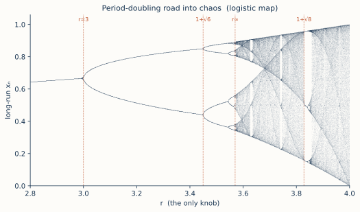

# ch07 — 倍週期分岔：秩序一分為二

> **本章解決什麼問題**：ch06 把旋鈕轉到 r=3.2，那個不動點 x*=0.6875 失穩了，軌跡不收進它、反而在 0.5130 和 0.7995 兩個值之間穩穩地來回跳。當時我欠你三筆帳：為什麼是**跳兩個值**？為什麼是「加倍」（1→2）而不是「加一」（1→3）？再把旋鈕往上轉，會發生什麼？這一章把三筆帳一次還清——r 過 3 生出 2-cycle、過 1+√6≈3.4495 再裂成 4-cycle、過 ≈3.5441 裂成 8-cycle，一路加倍、加倍、加倍，是為**倍週期級聯（period-doubling cascade）**。把這整串分岔點疊在一張圖上，就是混沌理論的招牌肖像：**分岔圖**。本章只負責看懂這條「秩序如何一步步對半裂開、最後沒入混沌」的路；至於這串分岔點之間藏著一個跨宇宙不變的常數——那是 ch08 的鐵律，這裡先不碰。

## 從你已知的出發

ch06 開頭那個 flapping 的 autoscaler，你還記得吧——副本數在 N 和 2N 之間無止盡地跳，每次擴縮付一次冷啟動。當時我把它當「失穩」的反例，叫你「降增益、加阻尼」收掉它。這一章我要做一件更冒犯直覺的事：**不收掉它，反而把增益再往上加，看它會壞成什麼樣子。**

你心裡大概有個預設：增益越加越高，系統會越來越亂，最後直接發散、爆掉。錯。它壞的方式比「爆掉」精細得多，而且精細到反常——它會**分裂成更多狀態，按 2 的冪次裂**。

把那個 autoscaler 的劇情放慢，分三幕看：

- **第一幕（增益剛好太高）**：它在兩個副本數之間穩穩來回，比如 N=4 和 N=8。一輪擴到 8、下一輪縮到 4、再擴到 8……這是一個乾淨的、週期 2 的振盪。它沒爆，它「穩定地不穩定」——穩定地維持著一個兩拍的循環。
- **第二幕（增益再加一截）**：那個兩拍的循環自己也站不住了。現在它變成**四個值**的輪轉：4 → 9 → 5 → 8 → 4 → 9 →……一個週期 4 的循環。注意不是 3 個、不是 5 個，是**剛好 4 個**——前一個循環的每一拍，各自又裂成兩拍。
- **第三幕（再加）**：四拍裂成八拍，八拍裂成十六拍……每加一截增益，循環的長度就**翻一倍**。裂到某個程度，你已經數不清它在幾個值之間跳了——監控圖上那條鋸齒看起來就是一團噪音，再也認不出週期。它沒發散（副本數還是被你設的上下限關著），但它**永遠不重複**了。

這整條「2 → 4 → 8 → 16 → … → 一團亂」的路，不是工程比喻，它是脊椎遞迴式 xₙ₊₁ = r·xₙ·(1−xₙ)（ch05 那條）旋鈕 r 從 3 往 4 轉時**字面上**會走的路。你那個 flapping 的 autoscaler，只要它的回授夠強、夠像這條二次曲線，它就會沿著這條路一級一級裂下去。本章要做的，就是把這條路的每一步算清楚、畫出來，然後告訴你它通向哪裡。

先把全章的骨架擺出來，後面每一節填一格：

```text
  r 區間              長期落點          這是什麼
  ───────────────     ────────────      ──────────────────
  1 < r < 3           1 個值            穩定不動點（ch06 已講透）
  3 < r < 3.4495      2 個值            2-cycle    ← 第一次倍週期
  3.4495 < r < 3.5441 4 個值            4-cycle    ← 第二次
  3.5441 < r < 3.5644 8 個值            8-cycle    ← 第三次
  3.5644 < r < …      16, 32, 64…       級聯加倍   ← 越裂越快
  r > 3.56995…        填滿一段區間        混沌（ch09）← 加倍的終點
```

## 為什麼是「加倍」，不是「加一」

這是本章最值得你停十分鐘的地方，因為你的直覺正要騙你。「不動點失穩了」很自然會讓人猜：那它大概變成在**幾個**值之間跳吧——可能 3 個、可能 5 個，誰知道。但答案偏偏是死板的 **2**，而且接下來每一次都是嚴格的乘 2。為什麼是 2 而不是別的數？這不是巧合，是 ch06 那把斜率尺直接決定的。

回到 ch06 的判據。不動點 x* 穩不穩，看誤差倍率 f′(x*)：偏差每輪乘上它。對脊椎遞迴式，f′(x*)=2−r。穩定區是 |2−r|<1，也就是 1<r<3。現在盯住**失穩發生的那一刻**——r 從下方逼近 3：

```text
  r → 3⁻ ：f′(x*) = 2 − r → 2 − 3 = −1
```

關鍵在這個 **−1**，不是 +1。誤差倍率撞牆是撞在 **−1**——負的。負號是整件事的引擎。ch06 講過，f′(x*) 是負的時候，偏差每輪會**變號**：這輪偏高、下輪偏低、再下輪偏高……軌跡在不動點兩側來回甩。當 |f′(x*)|<1（比如 r=2.5 的 −0.5），甩的幅度一輪比一輪小，最後螺旋著收進去。但當 r 過 3、|f′(x*)|>1，甩的幅度一輪比一輪**大**——軌跡被推離不動點，可是那個「每輪變號」的習性還在。

於是軌跡定居成這個樣子：它**交替**落在不動點的兩側，一邊高、一邊低，高低高低。一個「高、低、高、低」的循環，要走**兩步**才回到原點——這就是週期 2。週期之所以是 2 而不是 3，純粹因為失穩是被那個**負一**踢出去的，而「負」的意思就是「兩側交替」，「交替」就要兩步成一個循環。動力系統把這種「誤差倍率撞 −1 而失穩」的分岔特地取了個名字叫**翻轉分岔（flip bifurcation）**——flip，翻面，名字本身就在說那個負號。

換句話說：

```text
  失穩是因為  f′ 撞到 −1  （不是 +1）
        ↓
  負號 ⇒ 偏差每輪「翻面」（在不動點兩側交替）
        ↓
  「交替」⇒ 一個循環要兩步才走完
        ↓
  所以新的週期是 2，不是 3、不是別的       ← 加倍的根
```

把這句話焊死，後面整條級聯就都順了：**每一次倍週期，都是「某條週期軌的誤差倍率撞到 −1、靠翻面失穩」，而翻面必然把週期變成兩倍。** 它不是「再加一個狀態」，它是「每個狀態各自一分為二」。這也是為什麼這條路叫倍「週期」而不是增「週期」——週期數走的是 1、2、4、8、16，一條 2 的冪次階梯，永遠不會出現 3、5、6。（混沌帶裡確實會冒出週期 3 的循環，但那是另一種機制、走另一道門進來的，本章先按下不表，ch09 再算這筆帳——這裡你只要記得：**倍週期級聯本身只生 2 的冪。**）

值得一提的是，「失穩處冒出一個週期兩倍的新穩定軌道」這件事不是 logistic 專屬的偶然。任何回授系統，只要它的誤差倍率是從 −1 那一側穿出穩定區（而不是從 +1 穿出），就會走翻轉分岔、就會倍週期。你的 autoscaler 在 N 和 2N 之間 flapping，本質上就是它的迴路增益撞到了 −1 那一側：負回授的修正力道過強，這一輪過度修正到對面、下一輪又過度修正回來，兩拍一循環。增益再加，這個兩拍循環自己又撞 −1，裂成四拍。**「加倍」是負回授過度修正的數學宿命**，不是 logistic 的怪癖。

## 第一次分岔：2-cycle 從哪來、停在哪

ch06 的 worked example 已經讓你親眼看過 r=3.2 的軌跡跳成 2-cycle（0.5130 ↔ 0.7995）。這一節把它放進「分岔」的框架裡，補上一個 ch06 沒回答的問題：這個 2-cycle 自己，**穩定嗎？穩定到什麼 r 為止？**

先把概念講清楚。原本的不動點 x* 是 f 的不動點：f(x*)=x*，餵一次回到自己。2-cycle 的兩個值——叫它們 p 和 q——不是 f 的不動點，f 把它們**互送**：f(p)=q、f(q)=p。但如果你把目光放在「迭代**兩次**」這件事上，p 和 q 就是 **f∘f**（也就是 f(f(x))，連走兩步）的不動點：

```text
  f(p) = q,  f(q) = p
        ↓
  f(f(p)) = f(q) = p      ← p 是「走兩步」這個映射的不動點
  f(f(q)) = f(p) = q      ← q 也是
```

這是一個漂亮的視角轉換：**原系統的週期 2 軌道，就是「兩步映射」F=f∘f 的兩個不動點。** 於是 ch06 那整套「不動點＋|斜率|<1」的判據，原封不動可以拿來分析 2-cycle 的穩定性——只是現在要算的是 F=f∘f 在 p（或 q）處的斜率。

這裡有個省力又深刻的事實（連鎖律的直接結果，不展開推導，給結論與直覺）：「走兩步」映射在 p 點的斜率，等於 f 在 p 的斜率**乘以** f 在 q 的斜率：

```text
  (f∘f)′(p) = f′(p) · f′(q)        ← 走第一步把誤差乘 f′(p)，走第二步再乘 f′(q)
```

直覺很乾淨：誤差走完一整圈（p→q→p）被放大的總倍率，就是兩步各自倍率的乘積——跟你算「一整條回授迴圈的迴路增益＝沿途各環節增益相乘」是同一個道理。這個乘積就是 2-cycle 的「誤差倍率」，動力系統管它叫**乘子（multiplier）**。2-cycle 穩不穩，看 |乘子|<1，跟不動點看 |f′(x*)|<1 一模一樣。

我把 p、q 代進去、用脊椎遞迴式 f′(x)=r(1−2x) 算了一遍（過程是純代數，這裡只報結果，數值我重算過）：脊椎的 2-cycle 乘子化簡成一個只含 r 的乾淨式子：

```text
  2-cycle 乘子 = f′(p)·f′(q) = 4 + 2r − r²
```

現在用這個式子追蹤 2-cycle 一生的穩定性，三個 r 值各代一次（這些值我手算複核過）：

```text
  r           乘子 = 4 + 2r − r²       |乘子|        2-cycle 狀態
  ─────────   ────────────────────     ─────────    ──────────────────────
  3.0         4 + 6 − 9 = +1           1            剛出生（從不動點 |f′|=1 那刻接棒）
  3.2         4 + 6.4 − 10.24 = +0.16  0.16 < 1     穩穩穩定（ch06 看到的那個）
  3.4495      4+6.899−11.899 = −1      1            撞到 −1！2-cycle 也翻轉失穩
```

讀這張表，整條級聯的引擎就攤在眼前了：

- r=3 時乘子剛好 **+1**——這是 2-cycle 的出生時刻。它從不動點手裡接棒：不動點在 r=3 以 f′=−1 失穩（|f′|=1），同一瞬間，2-cycle 以乘子 +1 誕生並開始穩定。一個交班，無縫。
- r=3.2 時乘子是 +0.16，絕對值遠小於 1——2-cycle 阻尼很足、非常穩定。這就是 ch06 那條軌跡為什麼能乾淨地停在 0.5130 ↔ 0.7995：不是它「碰巧」停在那，是 |乘子|=0.16<1 逼它停。
- r 一路升到 **1+√6**，乘子滑到 **−1**——又撞 −1 了！注意又是 −1，不是 +1。歷史重演：2-cycle 自己也走翻轉分岔，每一拍各自翻面、一分為二，於是 2-cycle 失穩、4-cycle 接棒。

那個 1+√6 不是我從哪本書抄來的，它是「乘子=−1」這個方程的解。把 4+2r−r²=−1 整理：

```text
  4 + 2r − r² = −1
  r² − 2r − 5 = 0                     ← 移項整理
  r = (2 + √(4+20)) / 2 = 1 + √6      ← 取正根（√24 = 2√6）
    = 1 + 2.4495 = 3.4495             ← 第二次分岔點 r₂
```

√6≈2.4495（全書統一基準），所以 **r₂ = 1+√6 ≈ 3.4495**。這個值是手算得出來的、不是經驗擬合，這點待會在「直覺的陷阱」裡很重要——倍週期序的頭兩個點（r₁=3、r₂=1+√6）都是漂亮的封閉式，從第三個（r₃≈3.5441）起才沒有簡單封閉式、得靠數值解。

## 級聯：4-cycle、8-cycle，越裂越快

劇本你已經完全看懂了，剩下的只是同一齣戲一再重演。每一次都是「現任週期軌的乘子撞 −1、翻轉失穩、週期兩倍的新軌接棒」：

```text
  分岔           r 值（落點）        週期：N → 2N    機制
  ──────────     ────────────       ─────────────   ────────────────
  r₁ = 3          （精確）           1 → 2           不動點乘子撞 −1
  r₂ = 1+√6 ≈ 3.4495（精確）         2 → 4           2-cycle 乘子撞 −1
  r₃ ≈ 3.5441    （數值，無簡單封閉式）4 → 8           4-cycle 乘子撞 −1
  r₄ ≈ 3.5644    （數值）            8 → 16          8-cycle 乘子撞 −1
  r₅ ≈ 3.5688    （數值）            16 → 32         …
  …               …                  …               …
  r∞ ≈ 3.56995   （累積點）          → 混沌           無窮多次分岔擠在這裡
```

盯著 r 那一欄，有件事會跳出來抓住你：分岔點**越來越擠**。第一段（r₁ 到 r₂）有 0.4495 那麼寬；第二段（r₂ 到 r₃）只剩約 0.0946；第三段（r₃ 到 r₄）約 0.0203……每一段大約是前一段的五分之一寬。**級聯不是等速的，它在加速**——週期翻倍翻得越來越快，分岔點一個比一個靠近前一個。於是無窮多次分岔並沒有把 r 推到無窮大，反而全部擠進一個有限的位置：r∞ ≈ 3.56995。到了那裡，週期已經被翻成「2 的無窮次方」——也就是不再有有限週期，軌跡永不重複。**這就是混沌的入口**（ch09 正式越過去）。

「每段大約是前段的五分之一」——這個「五分之一」，倒過來說就是「每段約是後段的五倍寬」。這個收縮比率本身，就是 ch08 那個驚嘆點的種子（它趨近一個叫 δ≈4.669 的常數，而且換成完全不同的方程式還是同一個數）。但那是下一章的事，本章只要你看到一件定性的事實就夠了：**分岔越來越密、終點落在一個有限的 r，而不是拖到無窮遠。** 正因為終點有限，混沌才會在 r 還沒轉到 4 之前就降臨。

順帶把一個容易混淆的點先擺正：r₃ 之後沒有簡單封閉式，不是因為數學家偷懶，是因為要解的方程次數隨週期暴漲。算 2-cycle 失穩，要解 f∘f 的穩定性，是個二次式（所以 1+√6 漂亮）；算 4-cycle 失穩，要解 f∘f∘f∘f 的穩定性，多項式次數翻上去，沒有根式解。所以 r₃≈3.5441、r₄≈3.5644 這些是**數值解**，不是某人量出來的經驗值——它們仍然是這條確定規則精確蘊含的數，只是寫不成根式。

## 分岔圖：把整條路畫成一張肖像

到這裡，所有的數都齊了，但散在好幾張表裡。混沌理論最聰明的一件事，是把這整條「秩序如何一步步裂開、最後沒入混沌」的路，壓進**一張圖**——分岔圖（bifurcation diagram）。它是這本書、甚至整個混沌理論最有名的一張肖像。先把它怎麼讀講清楚，因為第一次看的人十有八九讀錯。

**橫軸是 r**（旋鈕，從左到右轉大）。**縱軸是「長期落點」**——對每一個 r，你讓系統先跑一大段（把開頭那些還沒安定的暫態丟掉），然後把它**長期會反覆造訪的那些 x 值**全部點上去。關鍵就在這句「長期落點」：

- 如果這個 r 收進一個不動點，那一條垂直切片上就只有**一個點**。
- 如果是 2-cycle，這個 r 的切片上有**兩個點**（它長期在兩個值間跳，兩個值都造訪）。
- 4-cycle 就是**四個點**、8-cycle 八個點。
- 混沌呢？長期落點填滿一整段——那一條垂直切片上是**密密麻麻一片**，因為軌跡永不重複、把那段區間踩了個遍。

把所有 r 的切片並排，奇蹟就出現了：左邊一條單線（不動點），到 r=3 突然**一分為二**（叉成兩條），到 r≈3.4495 每條又各自**一分為二**（成四條），到 r≈3.5441 再各分二（成八條）……分岔點越來越密、線越來越多，到 r≈3.57 整個糊成一片陰影——那是混沌帶。一棵越長越密的樹，樹梢沒入一團迷霧。這就是為什麼它叫「分岔」圖：你**看著**秩序一次次對半裂開。

```text
  分岔圖怎麼讀（示意，非按比例）：每個 r 的「長期落點」往上點

   x
  1.0┤                                          ▒▒▒▒▒▒▒▒  ← 混沌帶：落點填滿
     │                                       ▒▒▒▒▒▒▒▒▒▒    （永不重複，密密麻麻）
     │                            ━━━┓     ▒▒▒▒▒▒▒▒▒▒▒
     │              ━━━━━━━━━┓  ━━━┛┏━ ▒▒▒▒▒▒▒▒▒▒▒
     │    ━━━━━━━━━━━━━━━━┛━━━━━━┛  ▒▒▒▒▒▒▒▒▒▒▒
     │  ━━━━━━━━━━━(單線)━━━━━━━━┓ ━━━┓ ▒▒▒▒▒▒▒▒▒▒
     │    ━━━━━━━━━━━━━━━━━━━━┛━━━━┛━▒▒▒▒▒▒▒▒▒▒
  0.0│
     └──┴──────────┴─────┴───┴──┴─┴──────────── r
       2.8        3.0  3.4495   3.5441         4.0
              不動點(1)  2-cycle   8-cycle      混沌
                          4-cycle(≈3.5441 前)
                        r∞≈3.56995（級聯終點，混沌起點）
```

（這是 ASCII 示意，幫你建立「在哪一個 r 該看到幾條線」的心智地圖。真正的分岔圖是作者預先算好的高解析 SVG，看點在分岔的位置與加密的節奏，附在下面。）



第一次認真看這張圖，我認為值得你記住的震撼是這個：**圖上每一條線、每一次分岔、最後那團迷霧，全部都是 xₙ₊₁=r·xₙ·(1−xₙ) 這一行式子畫出來的。** 沒有外加隨機、沒有別的方程、沒有調參數表——只有一個旋鈕 r 從左轉到右。秩序（左邊乾淨的單線）、振盪（中間整齊分岔的樹）、混沌（右邊的陰影），原來是同一條確定規則的三種長相，差別只在旋鈕轉到哪。一條式子，從最乖到最野，全在這張圖裡。這是我心目中整本書最該被裱起來的一頁。

## Worked example：r=3.2 手算到 2-cycle，並驗 f(f(x))≈x

ch06 給過 r=3.2 的迭代表，這裡我把它做完整、做穿——一路迭代到 2-cycle 穩定，讀出兩個值，然後親手驗證「走兩步回到自己」這個 2-cycle 的定義性質。所有數字我都重算過、保留 4 位小數。

先把這個 r 的背景數定下來（脊椎遞迴式，f(x)=3.2·x·(1−x)）：

```text
  不動點   x*       = 1 − 1/3.2 = 0.6875
  不動點斜率 f′(x*)  = 2 − 3.2  = −1.2，  |f′(x*)| = 1.2 > 1  → 不動點排斥（ch06 已判）
  2-cycle 乘子      = 4 + 2(3.2) − 3.2² = 4 + 6.4 − 10.24 = 0.16，|0.16| < 1 → 2-cycle 穩定
```

兩個判據先擺好：不動點留不住（|f′|=1.2>1），2-cycle 留得住（|乘子|=0.16<1）。所以軌跡會逃離 0.6875、定居到那個 2-cycle。手動迭代驗（x₀=0.5，每步現算 xₙ₊₁=3.2·xₙ·(1−xₙ)）：

```text
  n   xₙ        計算 3.2·xₙ·(1 − xₙ)                    說明
  0   0.5000    3.2 × 0.5000 × 0.5000 = 0.8000
  1   0.8000    3.2 × 0.8000 × 0.2000 = 0.5120
  2   0.5120    3.2 × 0.5120 × 0.4880 = 0.7995         ← 接近上值了
  3   0.7995    3.2 × 0.7995 × 0.2005 = 0.5129
  4   0.5129    3.2 × 0.5129 × 0.4871 = 0.7995
  5   0.7995    3.2 × 0.7995 × 0.2005 = 0.5130
  6   0.5130    3.2 × 0.5130 × 0.4870 = 0.7995
  7   0.7995    3.2 × 0.7995 × 0.2005 = 0.5130
        … 鎖死在 0.5130 ↔ 0.7995 之間來回，再不離開
```

讀出 2-cycle 兩值：**p ≈ 0.5130、q ≈ 0.7995**。注意它怎麼鎖進去的——一開始 x₀=0.5 離兩個值都有點距離，但每走一步偏差就被乘上那個 |乘子|=0.16，縮得飛快（0.16 是很強的阻尼），五六步就鎖死在四位小數上。對比 ch06 r=2.5 收進**一個**值，這裡收進**兩個**值之間的循環，眼睛就能看出「週期 1」和「週期 2」的差別。

現在做這一章的關鍵驗證：**確認 p、q 真的滿足 f(f(x))≈x**——這是「週期 2」的定義性試金石（走兩步回到自己）。分兩半算，每一步都寫出來：

```text
  驗 p = 0.5130：
    第一步  f(0.5130) = 3.2 × 0.5130 × (1 − 0.5130)
                      = 3.2 × 0.5130 × 0.4870
                      = 0.7995                       ← 跳到 q，對！
    第二步  f(0.7995) = 3.2 × 0.7995 × (1 − 0.7995)
                      = 3.2 × 0.7995 × 0.2005
                      = 0.5130                       ← 跳回 p
    所以  f(f(0.5130)) = 0.5130 ≈ p   ✓  走兩步回到自己

  驗 q = 0.7995：
    第一步  f(0.7995) = 0.5130                        ← 跳到 p（同上）
    第二步  f(0.5130) = 0.7995                        ← 跳回 q（同上）
    所以  f(f(0.7995)) = 0.7995 ≈ q   ✓
```

兩個值都通過 f(f(x))≈x（四位小數內相等；差別只在我把中間值捨成四位帶進來的捨入，數學上是精確相等）。這就把 2-cycle 的本質釘死了：**p 和 q 各自是「走兩步」映射 f∘f 的不動點**——對 f 它們互送（p→q→p），對 f∘f 它們各自不動。這也回頭印證了前面那個視角轉換：分析 2-cycle 的穩定性，等於拿 ch06 那把斜率尺去量 f∘f，而 f∘f 在 p 的斜率，正是 f′(p)·f′(q)=乘子=0.16。

最後對帳一張，把「不動點 vs 2-cycle」在 r=3.2 並排，整段濃縮成一句話：

```text
  對象        是誰的不動點   斜率/乘子          |·|        在 r=3.2 的命運
  ─────────   ────────────   ───────────────   ────────   ──────────────
  x*=0.6875   f 的不動點     f′(x*)=−1.2       1.2 > 1    排斥，軌跡逃離
  p,q=0.5130, f∘f 的不動點   f′(p)·f′(q)=0.16  0.16 < 1   吸引，軌跡定居
       0.7995
```

同一個 r、同一條遞迴式，「f 的不動點」留不住軌跡、「f∘f 的不動點」留得住——舊週期失穩、新週期（兩倍長）接棒。這一格，就是整條倍週期級聯的最小單元，往後每一次分岔，都是這一格換個 r、換個週期，原樣重演。

## 直覺的陷阱

| 誤解 | 為什麼錯／會在哪一步把你帶溝裡 | 正確版 |
|---|---|---|
| 「失穩後系統在隨機幾個值之間跳」 | 不是隨機幾個。倍週期級聯只生 **2 的冪**：1、2、4、8、16……永遠不會出現 3、5、6。把它想成「裂成不定數量」，你會錯過那個死板的乘 2 規律，也錯過為什麼它叫「倍」週期。 | 每次分岔嚴格把週期 **乘 2**（N→2N）。根源是失穩發生在 f′=−1（負一），負號 ⇒ 兩側交替 ⇒ 週期必為兩倍。 |
| 「period-3 窗口（≈3.8284）是倍週期級聯的第 3 步」 | **這是本章最該守住的一刀。** 倍週期序到週期 8 已經在 r₃≈3.5441；序列是 1→2→4→8，根本沒有「週期 3」這一階。1+√8≈3.8284 那個週期 3，深在**混沌帶內**、走的是**完全不同的門**——切線（鞍結）分岔，不是翻轉分岔。把它當「倍週期第 3 步」，你會把兩串毫不相干的數字接成一串，整條級聯的邏輯就斷了。 | 倍週期級聯只生 2 的冪（…3.5441→3.5644→…→3.56995 沒入混沌）。period-3 窗口 1+√8≈3.8284 是混沌帶內由切線分岔生出的秩序孤島，**自己另起一條倍週期級聯**（3→6→12…），與主級聯無關（見 ch09）。 |
| 「分岔圖縱軸是某一步的 x 值」 | 縱軸畫的是**長期落點的集合**（丟掉暫態後反覆造訪的所有值），不是某一次迭代的瞬時值。誤讀成「第 100 步的 x」，你會不懂為什麼 2-cycle 的切片上有兩個點、混沌切片上有一片點。 | 縱軸＝長期會反覆造訪的 x 值集合。一個點＝不動點、兩個點＝2-cycle、一片＝混沌（軌跡踩遍一段區間）。 |
| 「分岔點等距，再轉幾下總會到」 | 分岔點**越來越擠**（每段約前段的 1/5 寬），不是等距。無窮多次分岔擠進有限的 r∞≈3.56995。以為「等距、慢慢轉就好」，你會以為混沌在 r 很大時才出現，其實它在 3.57 就降臨了。 | 分岔間距等比收縮，級聯在有限的 r∞≈3.56995 累積終結。混沌不在 r=4 才來，在 3.57 就來了。 |
| 「失穩＝軌跡發散／爆掉」 | x 永遠被 (1−x) 擁擠項關在 [0,1]，級聯每一步都沒有發散，只是週期翻倍、落點變多。把「失穩」一律想成「飛到無窮」，會誤判混沌帶為「系統壞掉」——它沒壞，它有界但永不重複。 | 失穩 ≠ 發散。整條級聯與其後的混沌都被關在有界區間裡（這正是 ch11「有界卻永不重複」的種子）。 |
| 「2-cycle 的兩個值是 f 的不動點」 | p、q 不是 f 的不動點（f 把它們互送，不是送回自己）。它們是 **f∘f**（走兩步）的不動點。混淆這點，你會去解 f(x)=x 找它們，根本找不到。 | 2-cycle 兩值滿足 f(p)=q、f(q)=p，且 f(f(p))=p、f(f(q))=q——是「走兩步」映射的不動點，不是 f 自己的。 |

## 紙上推演

### 推演題 1 ★ **[10 分鐘]**

不查書，只憑這一章的邏輯回答：(a) 倍週期級聯的週期序列是哪幾個數？為什麼是這幾個、不是別的？(b) 第一次分岔（r=3）時，不動點的誤差倍率 f′(x*) 撞到的是 +1 還是 −1？(c) 這個正負號，跟「為什麼新週期是 2 不是 3」有什麼關係？用一句話講給另一個工程師聽。

#### 推演解答

(a) 週期序列是 **1, 2, 4, 8, 16, 32, …**，也就是 **2 的冪**。為什麼只能是 2 的冪：因為每次分岔都把現任週期**乘 2**（N→2N），從 1 開始一路乘 2，永遠生不出 3、5、6 這些非 2 冪的數。

(b) 撞到的是 **−1**。f′(x*)=2−r，r=3 時 f′(x*)=2−3=**−1**（不是 +1）。

(c) 關係：**負號代表偏差每輪在不動點兩側「翻面」交替，而「交替」要走兩步才回到原點，所以新週期是 2。** 一句話版：「它是被負一踢出穩定區的，負一就是『左右橫跳』，橫跳一來一回剛好兩拍——所以週期翻倍而不是加一。」

常見錯路：(1) 把序列寫成 1,2,3,4,…（誤以為「每次加一個狀態」）；(2) 說 r=3 撞 +1（漏了負號，那就解釋不了為什麼是加倍）。撞 +1 的分岔是另一種（鞍結／切線分岔，生的是 period-3 窗口那種，見 ch09），不會倍週期。

### 推演題 2 ★★ **[15 分鐘]**

第二次分岔點 r₂ = 1+√6 ≈ 3.4495 是怎麼來的？已知脊椎遞迴式的 2-cycle 乘子是 4+2r−r²。(a) 寫出「2-cycle 失穩」對應的乘子條件（注意是撞哪個值）；(b) 解這個方程，得出 r₂；(c) 解釋為什麼 r₁=3 和 r₂=1+√6 都有漂亮的封閉式，但 r₃≈3.5441 起就沒有了。

#### 推演解答

(a) 2-cycle 也走翻轉分岔，跟不動點一樣是**乘子撞 −1**而失穩（不是 +1）。所以條件是：

```text
  4 + 2r − r² = −1
```

(b) 解這個二次方程：

```text
  4 + 2r − r² = −1
  −r² + 2r + 5 = 0
  r² − 2r − 5 = 0            ← 兩邊乘 −1
  r = (2 ± √(4 + 20)) / 2    ← 二次公式，判別式 4+20=24
    = (2 ± √24) / 2
    = 1 ± √6                 ← √24 = 2√6，約掉 2
  取正且在範圍內的根：r₂ = 1 + √6 = 1 + 2.4495 = 3.4495   ✓
```

（另一根 1−√6≈−1.45 是負的、無物理意義，捨去。）

(c) 因為「算第 n 次分岔的失穩條件」要解的多項式次數隨週期暴漲。算 2-cycle 失穩，等於分析 f∘f（走兩步）的穩定性，化簡後是個**二次式**——二次式有根式解，所以 r₂=1+√6 漂亮。算 4-cycle 失穩，要分析 f∘f∘f∘f（走四步），多項式次數翻上去、**沒有根式解**，只能數值求解（得 r₃≈3.5441）。重點：r₃ 之後仍是這條確定規則**精確蘊含**的數，只是寫不成根式，不是經驗量測值。

常見錯路：把失穩條件寫成乘子=+1（那是出生時刻 r=3 的條件，不是失穩）；或忘了乘子撞的是 −1 而代成 +1，會解出 r=3（算回了出生點，不是第二次分岔）。

### 推演題 3 ★★ **[12 分鐘]**

回到你那個 flapping 的 autoscaler。它本來在 N=4 和 N=8 兩個副本數之間穩穩來回（一個乾淨的 2-cycle）。維運同事說：「在兩個值之間跳已經夠煩了，我把擴縮的反應力道**再調強一點**，逼它快點收斂到單一副本數。」(a) 用本章的級聯邏輯，預測「再調強」最可能的結果是什麼？(b) 把這個結果對應到分岔圖上的哪個動作（旋鈕往哪轉、會跨過什麼）？(c) 同事的直覺錯在哪？正確的修法是什麼？

#### 推演解答

(a) **最可能不是收斂，而是裂成 4 個值的輪轉**（週期 4：比如 4→9→5→8→4…）。理由：在兩個值間跳的 2-cycle，是迴路增益（誤差倍率）落在 |乘子|<1 但偏大的區。「再調強反應力道」＝把增益往上推，會把乘子推向 −1 那一側、撞 −1、翻轉失穩——於是 2-cycle 裂成 4-cycle，狀態變多而非變少。

(b) 對應分岔圖：**旋鈕 r 往右轉**（增益＝r 的角色），從 2-cycle 區（3<r<3.4495）跨過 r₂≈3.4495 那道分岔線，進入 4-cycle 區。再調強就再跨 r₃、進 8-cycle……一路逼近 r∞≈3.57 的混沌帶。

(c) 同事的直覺錯在**把「狀態太多」當成「修正力道不夠」**——以為加大力道能把多個狀態壓回一個。實際上在這個區，是「力道**太強**」才導致過度修正、振盪、分裂。加大力道只會讓它裂得更碎（2→4→8…），把它推向混沌。正確修法和 ch06 一樣：**往反方向轉旋鈕**——降增益、加阻尼、加遲滯（hysteresis）、拉長冷卻時間，把誤差倍率從 −1 那一側挪回 |·|<1 的安全區（對應 r 調回 1<r<3），軌跡才會收回單一副本數。一句話：**flapping 的解藥是減力道、不是加力道；加力道是往混沌踩油門。**

### 推演題 4 ★★★ **[18 分鐘]**

有人畫了一張「logistic map 通往混沌的路徑表」，把這幾個 r 值由小到大串成一條倍週期級聯：

```text
  r = 3   →  r = 3.4495  →  r = 3.5441  →  r = 3.8284  →  混沌
  週期：     2              4              8              ???
```

他說：「你看，週期 2、4、8，下一個 3.8284 應該就是週期 16 了，級聯很整齊。」這張表錯在哪？(a) 指出 3.8284 這個值的真實身分（它是什麼的分岔點、機制是什麼）；(b) 說明它為什麼**不可能**是倍週期級聯的下一步；(c) 倍週期級聯真正的下一步（8 之後）應該是哪個 r、週期多少？

#### 推演解答

(a) **3.8284 = 1+√8（=1+2√2）是 period-3 窗口的起點**，不是倍週期級聯的成員。它的機制是**切線（鞍結）分岔**：迭代三次的映射 f∘f∘f 的曲線在這個 r 與對角線**相切**，憑空生出一對週期 3 軌道（一穩一不穩）。它位置**深在混沌帶內**（混沌起點 r∞≈3.57 早就過了），是「亂中突然冒出的秩序孤島」。

(b) 不可能是倍週期下一步，三個獨立理由任一個都夠：

1. **週期數對不上**：倍週期序是 1→2→4→8→16→32…，全是 2 的冪。3.8284 生的是週期 **3**，3 不是 2 的冪，根本不在這條序列上。
2. **位置對不上**：倍週期級聯在 r∞≈3.56995 就**全部結束、沒入混沌**了。3.8284 > 3.57，已經在混沌帶**裡面**，不可能還是「級聯的一步」——級聯到 3.57 就收工了。
3. **機制對不上**：倍週期靠的是**翻轉分岔**（乘子撞 −1）；period-3 窗口靠的是**切線分岔**（曲線相切、乘子是 +1 那側憑空生一對軌道）。兩種是不同的門。

(c) 倍週期級聯 8 之後的真正下一步是 **r₄≈3.5644，週期 8→16**（再下去 r₅≈3.5688→週期 32…），分岔點越來越擠，全部擠進 r∞≈3.56995 沒入混沌。3.8284 要等混沌帶裡面才會以**另一種身分**（切線分岔生的秩序孤島）出現——而且它生出週期 3 後，**自己又會走一條倍週期級聯**（3→6→12→…）通向更細的混沌（這條支線 ch09 細講）。

常見錯路：被「2、4、8」的整齊節奏催眠，順手把任何下一個 r 值都接成「16」，沒檢查週期數是不是 2 的冪、位置在不在混沌帶外。這正是 landscape 標記為陷阱的「倍週期序 vs period-3 窗口」混淆——是同一批附近數字的不同身分，務必拆開看。

## 自我檢核

口頭自答，講得出來才算過關，講不清就是還沒懂：

1. 倍週期級聯的週期序列是哪幾個數？為什麼**只能**是 2 的冪、不會出現週期 3 或 5？
2. 為什麼新週期是「加倍」而不是「加一」？把「失穩發生在 f′=−1」「負號代表兩側交替」「交替要走兩步」三件事串成一條因果鏈，講給另一個工程師聽。
3. 2-cycle 的兩個值 p、q 是「誰」的不動點？為什麼它們不是 f 自己的不動點？分析它們的穩定性時，要算的「乘子」是什麼（用 f′(p)、f′(q) 表示）？
4. 第二次分岔點 r₂=1+√6 是從哪個方程解出來的（乘子撞哪個值）？為什麼 r₁、r₂ 有漂亮封閉式、r₃ 起就沒有？
5. 分岔圖的橫軸、縱軸各是什麼？為什麼 2-cycle 的垂直切片上有兩個點、混沌切片上是密密麻麻一片？把這張圖讀給沒看過的人聽。
6. 分岔點是等距的還是越來越擠？這件事為什麼導致「混沌在 r 還沒到 4（其實 3.57 左右）就降臨」？
7. period-3 窗口（1+√8≈3.8284）為什麼**不是**倍週期級聯的第 3 步？它的位置、週期數、生成機制各跟倍週期序差在哪？（這題答不出就是 T8 沒守住。）
8. 你的 autoscaler 在兩個副本數間 flapping，把反應力道「再調強」會發生什麼？這對應分岔圖上旋鈕往哪轉、跨過什麼？正確修法是哪個方向？

## 延伸閱讀

- **Strogatz,《Nonlinear Dynamics and Chaos》第 10 章（10.3 Logistic Map: Numerics、10.4 起談 period-doubling）** — 本章「2-cycle＝f∘f 不動點、乘子＝f′(p)·f′(q)、撞 −1 翻轉失穩」的標準教科書版，把翻轉分岔與級聯講得最乾淨。讀 10.3–10.4，會看到本章那個「乘子=4+2r−r²、解出 1+√6」的完整代數。
- **Wikipedia「Period-doubling bifurcation」** — 翻轉分岔（flip bifurcation）的定義、為什麼乘子撞 −1 會把週期翻倍的圖示直覺。配本章「為什麼加倍」那節一起看，把那個負號的角色看死。（https://en.wikipedia.org/wiki/Period-doubling_bifurcation）
- **Wikipedia「Logistic map」的 Bifurcation 段與「Bifurcation diagram」條目** — 分岔圖怎麼讀（橫軸 r、縱軸長期落點、丟暫態再畫）的權威說明，並列出 r₁=3、r₂=1+√6、r₃≈3.5441、r₄≈3.5644 與 r∞≈3.56995。本章數值的對照來源。（https://en.wikipedia.org/wiki/Logistic_map）
- **Geoff Boeing,「Chaos Theory and the Logistic Map」** — 用大量分岔圖與 cobweb 圖把「不動點→2-cycle→4-cycle→混沌」一級一級畫給你看的科普長文，視覺直覺極強。配本章 ASCII 示意一起看，分岔圖會立體起來。（https://geoffboeing.com/2015/03/chaos-theory-logistic-map/）
- **Quillen,「PHY256 Lecture notes on Bifurcations and Maps」（Rochester 講義 PDF）** — 大學講義，從 f∘f 的不動點推 2-cycle 穩定性、列出各分岔點數值，深度剛好補上本章「乘子化簡」那段我沒展開的代數。（https://astro.pas.rochester.edu/~aquillen/phy256/lectures/bif_maps.pdf）
- **本書 ch08** — 本章看到「分岔點越來越擠、每段約前段的 1/5」，下一章把那個收縮比率算出來——它趨近一個叫 δ≈4.6692 的常數，而且**換成完全不同的單峰映射還是同一個 δ**。這是全書最大的驚嘆點（鐵律登場），本章只是它的引信。
- **本書 ch09** — 越過 r∞≈3.57 進入混沌帶後的世界，以及本章一直按住沒講的 period-3 窗口（1+√8≈3.8284）在那裡的真實身分：混沌帶內由切線分岔生出的秩序孤島，外加「週期三即混沌」（Li–Yorke）的故事。
