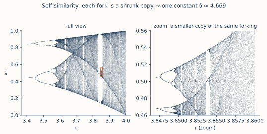

# ch08 — 費根堡常數：不同的路，同一個數

> **本章解決什麼問題**：ch07 給你看了倍週期級聯——r 過 3 分成 2、過 1+√6 分成 4、再分成 8、16……一路加倍衝向混沌。你看見了「無限多次分岔擠在一段越來越短的 r 裡」這個畫面，但 ch07 只說「擠得越來越密」，沒回答兩個更尖的問題：擠得**多快**？擠的**規律**有沒有名字？這一章把「多快」變成一個數——分岔間距以固定比例 δ≈4.6692 收縮——然後丟出全書最大的一記重拳：**把脊椎遞迴式換成一個長相完全不同的映射（換成 x→sin x），重新走一遍倍週期，居然撞上一模一樣的 δ。** 不同的方程式、同一條通往混沌的路、同一個常數。這就是本書書名裡那兩個字「鐵律」所指的地方。如果這本書只能讓你記住一頁，我希望是這一頁。

## 從你已知的出發

先講一個你每天都在依賴、卻可能沒細想過的事：**不同的實作，收斂到同一個行為。**

你寫過、也讀過很多份 TCP。Linux 的 CUBIC、BBR、舊的 Reno、各家雲廠商魔改過的版本——程式碼長得天差地遠，用的語言不同、資料結構不同、連調的常數都不同。但把它們丟到同一條壅塞的鏈路上，拉長時間看，它們收斂到的**行為類別**驚人地一致：偵測到丟包就退讓、頻寬空出來就試探性地往上爬，在「填滿管線」和「不要塞爆」之間找到一個動態平衡。你換一份實作，吞吐曲線的細節會變，但那個「鋸齒狀地逼近可用頻寬」的大形狀不變。實作細節是噪音，行為類別是訊號。

再想一個更乾淨的例子。同一個排序演算法——比方說快速排序——你用 C 寫一份、用 Rust 寫一份、用 Python 寫一份，跑在 x86、跑在 ARM、跑在你的筆電和雲上的某台機器。三份程式碼一個字都不一樣，跑的指令集不一樣，但它們對同一筆輸入吐出**同一個排好序的陣列**，而且時間複雜度都收斂到同一條曲線 O(n log n)。那個 n log n 不屬於 C、不屬於 ARM、不屬於任何一份具體實作——它屬於「比較式排序」這件事本身。實作是換得掉的衣服，複雜度類別是換不掉的骨。

你早就把這件事當常識：**好的抽象，讓你不必在乎底下換了哪套實作，因為重要的行為由結構決定、不由實作決定。** 我們信這件事，信到把整個軟體工程蓋在上面。

這一章要給你看的，是同一種「實作無關、行為由結構決定」的事，發生在一個你完全沒料到的地方——**通往混沌的路上**。把脊椎遞迴式 xₙ₊₁ = r·xₙ·(1−xₙ) 換成一個拋物線之外的映射，倍週期級聯的**速度**——那個分岔間距的收縮比——竟然分毫不差地相同。不是「差不多」、不是「同一個量級」，是同一個數，δ≈4.66920160910299，一路對到小數點後十幾位。混沌這團最該「各亂各的」的東西，在通往它的門口，露出了一條跨系統的鐵律。我認為這是整本書最反直覺、也最值得你起一身雞皮疙瘩的一頁。

## 先把「分岔越來越密」變成一個數

回到 ch07 那串分岔點。它們是旋鈕 r 上的一連串位置，每跨過一個，週期就加倍一次。把精確值排出來（這些值我在 ch07 都手算或查證過，這裡照基準表抄，全書一致）：

```text
  r₁ = 3                      ← 週期 1 → 2
  r₂ = 1 + √6 ≈ 3.4495        ← 週期 2 → 4
  r₃ ≈ 3.5441                 ← 週期 4 → 8
  r₄ ≈ 3.5644                 ← 週期 8 → 16
  …
  r∞ ≈ 3.56995                ← 累積點：無限多次分岔擠進來、混沌就在這裡開始
```

光看這串數字，ch07 那句「越來越密」就有了具體的形狀。每一段間距（相鄰兩個分岔點的距離）算出來：

```text
  第 1 段：r₂ − r₁ = 3.4495 − 3.0000 = 0.4495
  第 2 段：r₃ − r₂ = 3.5441 − 3.4495 = 0.0946
  第 3 段：r₄ − r₃ = 3.5644 − 3.5441 = 0.0203
```

看這三個數往下掉的氣勢：0.4495 → 0.0946 → 0.0203，一段比一段短，而且短得很有節奏。第一段是第二段的大約 4.75 倍，第二段是第三段的大約 4.66 倍。間距不是隨便縮的，它**等比**地縮——每往下一段，長度大約除以同一個數。

這就是費根堡（Mitchell Feigenbaum）1975 年盯著一串這樣的數字時看見的東西。他不是先有理論再去算，是反過來——他在洛斯阿拉莫斯（Los Alamos National Laboratory）拿一台 HP-65 口袋計算器，一個一個算這些分岔點。算到後面，每多算一個點，機器要跑好幾十秒、甚至好幾分鐘（HP-65 不快）。他在等機器的空檔裡做了一件數值工作者的本能動作：**把已經算到的點拿出來看它們往哪收斂。** 然後他注意到，這串點不是亂收斂——它們**等比**地往一個極限值靠，相鄰間距的比值穩穩趨向一個固定的數。

我想停在這裡強調一個常被忽略的轉折，因為它是整個故事的靈魂。費根堡一開始追的是那個**極限值**（也就是混沌起點 r∞≈3.56995）——他想看看這個數能不能用 π、e 之類的標準常數湊出來，試了半天湊不出來。然後他想通了一件遠比極限值重要的事：**那個收斂的「比值」，比極限值本身更深刻。** 因為極限值 r∞ 會隨著你選的映射改變（換個映射，混沌從不同的 r 開始），但那個**比值**——間距的收縮率——他隱約覺得，可能不會變。這個直覺，後面會被證明對到讓人發毛。

把這個比值正式寫下來。定義**分岔間距比**：

```text
              rₙ − rₙ₋₁          ← 這一段間距（前一段）
       δₙ = ─────────────
              rₙ₊₁ − rₙ          ← 下一段間距（後一段）
```

也就是「前一段間距 ÷ 後一段間距」。當 n 越來越大、分岔點越來越密，這個比值收斂到一個極限，就是**費根堡常數（Feigenbaum constant）δ**：

```text
        δ = 4.66920160910299…        ← 倍週期分岔間距的等比收縮率
```

它在講一件具體到不能再具體的事：**每往混沌走一步，要轉的旋鈕距離縮短為原來的約 1/4.669。** 倍週期級聯之所以能在有限的 r 區間（從 3 到約 3.57）裡塞進無限多次分岔，正是因為每一步間距都被乘上 1/4.669<1——一個等比級數，公比小於 1，無限多項加起來收斂到有限的 r∞。ch07 那句「無限多次分岔擠進一段有限的 r」，到這裡有了精確的機制：它們以公比 1/δ 等比收縮，所以擠得進去。

到目前為止，δ 只是「邏輯斯諦映射的一個數字特徵」。如果故事停在這裡，它頂多是個漂亮的數值巧合，值得一個註腳，不值得一個書名。真正的炸彈在下一節。

## 鐵律登場：換一個映射，還是同一個 δ

現在做一件看起來很無聊的事：把脊椎遞迴式整個換掉。

我們不再用拋物線 r·x·(1−x)。改用一個正弦的駝峰——sine map：

```text
        xₙ₊₁ = r · sin(π·xₙ)         ← 換成正弦駝峰，不再是拋物線
```

這兩個映射長得有多不一樣？一個是二次多項式，一個是超越函數（正弦）。一個的最高點是拋物線的圓頂，一個是正弦的圓頂——曲率不同、泰勒展開的每一項係數不同、連「峰」的胖瘦都不同。如果你把這兩條曲線疊在一起，除了「都有一個鼓起來的峰」之外，幾乎沒有共通點。任何一個有數值直覺的人，第一反應都會是：換了這麼不一樣的函數，倍週期級聯就算還在，那個收縮率 δ 也該是另一個數才對。

它不是。

把 sine map 的旋鈕 r 慢慢轉大，它**也**走倍週期：先一個穩定值、過某個 r 分成 2、再分成 4、8、16……和邏輯斯諦映射一模一樣的劇本。分岔點的**位置**不一樣（sine map 的 r₁、r₂、r₃ 是另一串數字，因為混沌從不同的地方開始），但你拿這串新的分岔點，算同樣的間距比：

```text
              rₙ − rₙ₋₁
       δₙ = ─────────────    →    4.66920160910299…
              rₙ₊₁ − rₙ
```

收斂到**同一個 δ**。不是 4.6692 附近的另一個數、不是同一個量級的巧合——是同一個常數，一路相同到小數點後十幾位。

讓這件事在你腦子裡沉澱一下，因為它的反直覺程度超過本書到目前為止的任何一頁。兩個函數，分岔的**位置**完全不同（它們的 r∞ 不一樣、進混沌的門開在不同的 r），但分岔的**節奏**——間距怎麼收縮——一模一樣。位置是「實作細節」，跟你選哪個函數有關；節奏是「行為類別」，跟你選哪個函數**無關**。這正是本章開頭那件你早就信的事——實作無關、行為由結構決定——只是現在它發生在通往混沌的路上，而且那個「結構決定的數」精確到嚇人。

而且不只 sine map。費根堡和後人發現，**任何一個有「單一光滑峰」的單峰映射（unimodal map），只要它通過倍週期通往混沌，就撞同一個 δ。** 拋物線、正弦駝峰、你隨手畫的任何一個只有一個圓潤頂點、兩邊往下掉的函數——它們進混沌的門開在不同位置，但收縮率全是 4.66920160910299。這個性質有個名字：**普適性（universality）**。

普適性才是這一章真正的商品，δ 這個數本身反而是副產品。讓我把為什麼用一句你會記住的話講清楚：

> **4.669 不是「邏輯斯諦映射的常數」，它是「一整類通往混沌的方式」的常數。** 它不屬於任何一個方程式，它屬於那條路。

這和 π 不屬於任何一個特定的圓、而屬於「圓」這個概念是同一種震撼，只是更猛——因為 π 至少還待在幾何裡，你預期幾何會有普適常數；但「通往混沌」這件最該各搞各的、最該對細節敏感的事，居然也藏著一個跨方程式不變的常數，這是沒有人預期的。費根堡 1978 年把這件事正式寫成論文（〈Quantitative Universality for a Class of Nonlinear Transformations〉，*J. Stat. Phys.* 卷 19），標題裡那個詞「Universality（普適性）」就是這一章的全部。

## 還有第二個常數：α，把圖縱向也鎖死

δ 鎖住的是分岔圖**橫向**（r 軸）的收縮率。費根堡發現的其實是**一對**常數——還有一個 α 鎖住**縱向**（x 軸）。

回想 ch07 那張分岔圖的形狀：一根樹枝分成兩根、每根再分成兩根，像一棵不斷對半開叉的樹。每次分岔，那個「叉口」（教科書叫 tine，分岔的兩根尖齒）會張開一個寬度。費根堡發現，相鄰兩代叉口的**寬度比**，也收斂到一個固定的數：

```text
        α = 2.502907875…             ← 分岔圖縱向（x 軸）叉口寬度的收縮率
```

（一個技術註記，免得你日後在別處看到不一致：α 的嚴格符號其實是**負的**，−2.5029，那個負號記錄「每放大一層，圖會上下翻轉一次」。本書照常見慣例印它的**正量值** 2.5029，全書一致；你只要知道符號是個翻轉的記號、量值才是收縮率就好。）

兩個常數合起來，把分岔圖的自相似結構**橫縱兩個方向都鎖死了**：

```text
  δ ≈ 4.6692   ← 橫向（r 軸）：每往混沌走一步，分岔間距縮為 1/4.669
  α ≈ 2.5029   ← 縱向（x 軸）：每往混沌走一步，叉口寬度縮為 1/2.503
```

這就是為什麼分岔圖會**自相似**——把它靠近 r∞ 的一根小樹枝框出來，橫向放大 δ 倍、縱向放大 α 倍，你看到的形狀和整棵樹幾乎一樣。再框更小的一根、再放大同樣的倍率，又一樣。一層套一層，每層都是上一層按 (δ, α) 縮小的複製品。這是分岔圖的自相似，**不是**碎形的空間自相似（那是 ch12 的事，那裡講的是海岸線、雪花在空間裡放大後還是它自己；這裡講的是分岔圖這張**圖**在 (r, x) 平面上放大後還是它自己）。兩者血緣相近，但別混為一談。



看著這張放大圖，你應該能把 δ 和 α「看出來」：橫著看，一層比一層窄，窄的比例就是 δ；縱著看，叉口一層比一層短，短的比例就是 α。普適性說的是——你換成 sine map，重畫這張圖，它的整體形狀會變、進混沌的位置會變，但**這兩個放大倍率不會變**。同一把放大鏡，放遍所有單峰映射。

## 為什麼會這樣：重整化的一句話直覺

到這裡你應該被「為什麼」這個問題卡住了——憑什麼兩個毫不相干的函數，收縮率會一樣？這背後的解釋叫**重整化群（renormalization group）**，完整的數學本書不展開（它是泛函空間裡的不動點分析，嚴格證明指向延伸閱讀）。但它的核心直覺可以用你熟的語言講清楚，而且講清楚之後，普適性會從「魔法」變成「幾乎必然」。

直覺是這樣的。盯著倍週期級聯的一小段：在某個分岔點附近，系統的行為由「映射函數本身」決定。再往混沌走一步（下一次分岔），系統的行為由「映射**做兩次**」——也就是 f(f(x))——決定（因為週期加倍了，你要看的是「兩步一循環」的行為，自然得看映射的二次複合）。再下一步，看 f 做四次。每往混沌走一步，你要盯的就是「映射複合更多次」的版本。

關鍵動作來了。費根堡的洞見是：**把「映射做兩次」這件事，加上適當的縮放（橫向縮 δ、縱向縮 α），它看起來幾乎和原來的「映射做一次」一模一樣。** 你做了一次「複合＋放大」的操作，圖回到原樣。這個「複合＋放大讓你回到原樣」的操作，數學上叫**重整化算子**。

用你的語言打個比方。想像一個轉換 T，它把一張圖「做兩次再縮放」。對大多數函數，反覆套 T 會把它們**沖向同一個極限形狀**——就像不同的初始向量反覆乘同一個矩陣，會被拉向那個矩陣的主特徵方向（見《矩陣是動詞》談特徵值的章）。這個「所有單峰映射被沖向的同一個極限形狀」，就是重整化算子的**不動點**（餵進去等於吐出來、再做「複合＋放大」也不變的那個特殊函數，見 ch06 不動點的精神，只是現在不動的不是一個數、而是一整個函數）。

於是普適性就有了出處：

```text
  不同的單峰映射（logistic、sine、隨手畫的駝峰…）
        │  反覆套「複合 + 縮放」這個操作 T
        ▼
  全部被沖向「同一個」極限形狀（重整化不動點）
        │
        ▼
  既然極限形狀同一個，描述「靠近它的速度」的數也同一個
        │
        ▼
  δ（橫向收縮率）、α（縱向收縮率）對所有單峰映射相同  ← 普適性
```

換句話說：**δ 和 α 不是任何一個映射的性質，是那個「複合＋縮放」操作本身的性質**（嚴格說，是它在不動點附近的局部伸縮率，就像矩陣的特徵值是矩陣的性質、不是被它乘的向量的性質）。你選哪個映射當起點不重要，因為它們最後都被沖到同一個地方；重要的是「往混沌走一步＝把映射複合一次」這個**結構**，而這個結構所有單峰映射共用。實作（你選的函數）被沖掉了，只剩結構（複合＋縮放）說話——這正是本章開頭那句「實作無關、行為由結構決定」，在最深的地方又響了一次。

我必須誠實標示嚴謹度：上面是**直覺版**。「為什麼這個重整化算子有不動點、不動點為什麼是雙曲（hyperbolic）的、δ 為什麼正好是它的某個特徵值」，這些是 1980 年代花了不少功夫（部分還靠電腦輔助證明）才嚴格建立的，本書一步都不推。你只要帶走那句話：**所有單峰映射被同一個「複合＋縮放」操作沖向同一個極限形狀，所以共用同一對收縮常數。** 這句話你能對另一個工程師複述，就算懂了這一章的「為什麼」。

## 它不只是數學：物理實驗也撞上同一個 δ

如果普適性只發生在「你在紙上寫的映射」之間，它已經夠震撼了。但它還更狠一步——**真實的物理系統**也撞上同一個 δ。

費根堡 1975 年算出 δ 的時候，這還只是一個關於迭代映射的數學發現，沒人知道它跟現實有沒有關係。1979 年，巴黎的物理學家利布夏伯（Albert Libchaber）做了一個液態氦對流的實驗——一小盒液態氦，底部加熱，看它從靜止的熱傳導，過渡到翻滾的對流、再到湍流。這是一個流體力學系統，由連續的偏微分方程（不是你紙上的離散映射）支配，物理上跟邏輯斯諦映射八竿子打不著。

但他在過渡的過程中看到了**倍週期**：流體的某個振盪頻率，先穩定，然後對半分、再對半分……而且他測出來的那個分岔間距收縮率，**就是費根堡算的 δ**。一個紙上迭代映射的常數，出現在一盒被加熱的液態氦裡。

讓這件事的份量落地：費根堡是在一台口袋計算器上、玩一個簡單到能寫在一行的迭代式 xₙ₊₁=r·xₙ·(1−xₙ)，算出 4.6692 這個數。利布夏伯是在一個由流體方程支配、有無限多自由度的真實物理系統裡，量出同一個 4.6692。一個是離散的、一維的、玩具級的迭代；一個是連續的、高維的、真實的流體。它們**唯一**的共同點，是「通過倍週期通往混沌」這個結構。而光是共用這個結構，就足以讓它們共用同一個常數。後來在電子電路、化學反應、滴水的水龍頭裡，人們一次又一次測到這個 δ。

這是普適性最硬的證據，也是它最讓人發毛的地方：**那個常數不在乎你是數學還是物理、是離散還是連續、是一行迭代還是一盒氦。它只在乎「你是不是走倍週期這條路」。** 走這條路的，無論你是誰、用什麼材料做的，門口都站著同一個 4.669。

## 扣回中央張力：連「測不準」都有鐵律

退一步，把這一章放回全書那條中央張力裡——**敏感（蝴蝶）與鐵律（普適）如何在同一條確定的式子裡共存。**

到 ch07 為止，你看到的是「敏感」那一側越來越張牙舞爪：旋鈕一過 3，乖巧的不動點留不住軌跡，分裂、再分裂，眼看就要衝進那個「完全確定卻測不準」的混沌。你大概以為，越靠近混沌，秩序就越潰散、規律就越稀薄，最後一片混亂。

這一章把那個預期整個翻過來。**越靠近混沌，反而冒出一條鐵律。** 而且這條鐵律管的，正是「系統怎麼變得測不準」這個過程本身——倍週期級聯，就是系統一步步走向不可預測的過程，而這個過程的**速度**（δ）和**形狀**（α）是跨系統不變的常數。

這是我認為整本書最深的一個反轉，值得你停下來咀嚼：

> **不只系統的行為是確定的（這個你 ch01 就知道了），連「系統如何失去可預測性」這件事，本身都服從一條鐵一般、跨方程式、跨物理系統的普適律。** 混沌不是秩序的反面、不是規律的終結；通往混沌的那條路上，藏著一個比大多數「有序系統」都更精確、更普適的常數。

換句話說，拉普拉斯惡魔（ch01）在這裡死得更慘、也更體面。它死得更慘，因為連「系統怎麼變得不可預測」都不是它能算贏的隨機過程——那是一條確定的、有固定收縮率的級聯。它死得更體面，因為這場死亡不是墮入無規律的混亂，而是踏上一條有鐵律的階梯：每一步間距縮 4.669 倍，無論你是哪個方程式。**測不準這件事本身，有它的鐵律。** 敏感與普適不是矛盾，它們是同一條遞迴式的兩張臉——一張臉讓你測不準（蝴蝶），另一張臉讓「測不準的方式」精確到小數點後十幾位（鐵律）。

這就是書名《蝴蝶的鐵律》那五個字的全部。蝴蝶是敏感，鐵律是普適，它們在同一條 xₙ₊₁=r·xₙ·(1−xₙ) 裡，一個都不少。

## 直覺的陷阱

| 誤解 | 為什麼錯／會在哪一步把你帶溝裡 | 正確版 |
|---|---|---|
| 「δ≈4.669 是邏輯斯諦映射的常數」 | 把 δ 綁在一個特定映射上，你就**完全錯過**這一章的重點。換成 sine map、換成任何單峰映射，δ 都一樣——它根本不屬於邏輯斯諦映射。 | δ 是「**通過倍週期通往混沌**這條路」的常數，不屬於任何單一方程式。它像 π 之於圓，不是「某個特定圓」的常數。 |
| 「兩個映射的分岔點位置也應該一樣」 | 普適的是**間距比**（δ），不是分岔點的**位置**。logistic 從 r=3 開始倍週期、sine map 從別的 r 開始——位置（含 r∞）跟映射有關。把「δ 相同」誤推成「整張分岔圖相同」，會在對照兩個映射時困惑。 | 位置（r₁, r₂, …, r∞）是實作細節、跟映射有關；**收縮率**（δ, α）是行為類別、跟映射無關。普適的是後者。 |
| 「分岔圖的自相似就是碎形」 | 這裡的自相似是**分岔圖這張圖**在 (r,x) 平面放大後像自己（橫縮 δ、縱縮 α）；碎形的自相似是**空間中的形狀**（海岸線、雪花）放大後像自己。血緣近、但不是同一件事，混講會讓你 ch12 學碎形時把兩套尺搞亂。 | 分岔圖自相似（ch08，(δ,α) 兩個常數鎖橫縱）≠ 空間碎形自相似（ch12，碎維度量化）。本章只談前者。 |
| 「δ 這個數值本身才是重點」 | 4.669 這個數很美，但**普適性**（不同方程式撞同一個數）才是震撼所在。只記住「4.669」而忘了「跨系統不變」，等於背了答案沒懂題目。 | 震撼不在「δ=4.669」，在「**換任何單峰映射、甚至換成真實物理系統，都是這個 δ**」。值是副產品，普適性是主角。 |
| 「重整化群解釋了 δ＝它告訴你怎麼算出 4.669」 | 重整化的直覺解釋的是「**為什麼不同映射共用**同一個 δ」（都被沖向同一個極限形狀），不是「δ 為什麼正好是 4.669 這個數」。把它當成 δ 的計算公式會誤解它的角色。 | 重整化解釋**普適性**（為什麼共用），δ 的精確值是那個極限形狀的某個內在特徵值，要靠（部分電腦輔助的）數值與分析求出。 |
| 「越靠近混沌，規律越少」 | 直覺以為「往混沌走＝往無規律走」。恰恰相反：通往混沌的這條路上，冒出了一個比多數有序系統都更精確、更普適的常數。 | 通往混沌的過程（倍週期級聯）本身服從鐵律：間距以固定比 δ 收縮、跨方程式不變。混沌的「門口」秩序森嚴。 |

## 紙上推演

### 推演題 1 ★ **[12 分鐘]**

用 ch07 的三個分岔點 r₁=3、r₂≈3.4495、r₃≈3.5441，手算第一個分岔間距比 (r₂−r₁)/(r₃−r₂)。(a) 算出這個比值；(b) 把它和 δ≈4.669 比，差多遠？(c) 再給你 r₄≈3.5644，算第二個間距比 (r₃−r₂)/(r₄−r₃)，說明它和 4.669 的距離有沒有變。這題要你**親手**看見「比值逼近 δ」，而不是只讀到結論。

#### 推演解答

(a) 先算兩段間距，再相除——每一步都寫出來、自己核：

```text
  分子（前一段）：r₂ − r₁ = 3.4495 − 3.0000 = 0.4495
  分母（後一段）：r₃ − r₂ = 3.5441 − 3.4495 = 0.0946

  間距比 = 0.4495 / 0.0946 = 4.7516…  ≈ 4.75
```

第一個間距比約 **4.75**。

(b) 和 δ≈4.6692 比：4.75 − 4.669 ≈ 0.08，差大約 **1.7%**。已經很接近了——用最前面、最「不成熟」的兩段間距，就落在 4.669 旁邊百分之二以內。

(c) 再算第二個間距比：

```text
  分子（前一段）：r₃ − r₂ = 3.5441 − 3.4495 = 0.0946
  分母（後一段）：r₄ − r₃ = 3.5644 − 3.5441 = 0.0203

  間距比 = 0.0946 / 0.0203 = 4.6601…  ≈ 4.66
```

第二個間距比約 **4.66**，和 4.669 只差約 0.009（不到 0.2%）。**比值在逼近**：4.75（差 1.7%）→ 4.66（差 0.2%）。為什麼會越來越準？因為 δ 是 n→∞ 的**極限**——它描述的是「分岔點非常密集時」的收縮率。最前面幾段間距還帶著「剛起步」的瑕疵，比值會偏一點；越往後（n 越大、分岔點越密），等比關係越乾淨，比值就越貼著 4.669。你只用了前四個分岔點，就已經看見它穩穩地往 4.669 收。如果你能算到 r₅、r₆、r₇，會看到比值繼續夾向 4.66920160910299，一位一位地對上。

常見錯路：(1) 把比值算成倒數，寫成 (r₃−r₂)/(r₂−r₁)≈0.21——那是「後段÷前段」，記住 δ 的定義是「**前段÷後段**」、是個大於 1 的數（因為間距在縮，前段比後段長）。(2) 看到第一個比值 4.75 不是剛好 4.669 就以為「不準、δ 是假的」——它本來就只在極限才精確等於 δ，前幾段是逼近、不是相等。

### 推演題 2 ★★ **[15 分鐘]**

口頭（寫下要點）回答這一章最核心的問題：**為什麼「普適性」比「δ=4.669 這個值」本身更震撼？** 不要只說「因為很多系統都有它」。要講清楚三層：(a) 如果 δ 只是邏輯斯諦映射的一個數字，它頂多是什麼地位；(b) 普適性把它的地位升級成什麼；(c) 用一個你熟的工程類比，讓另一個工程師「啊」一聲懂這個升級。

#### 推演解答

要點，三層：

(a) **如果 δ 只屬於邏輯斯諦映射**：那它頂多是「某個特定迭代式的一個數值特徵」，地位跟「這個函數在某點的二階導數是 0.7」差不多——一個關於某個具體對象的事實，有趣，但不普世。值得一個註腳，不值得一個書名。

(b) **普適性把它升級成「一整類過程的常數」**：當你發現換成 sine map、換成任何單峰映射、甚至換成一盒真實的液態氦，都撞同一個 δ，這個數就脫離了任何具體方程式，變成「**通過倍週期通往混沌**」這件事本身的常數。它從「某個對象的屬性」升級成「某種**結構**的屬性」。這就是 δ 像 π 的地方：π 不屬於任何一個特定的圓，屬於「圓」這個概念；δ 不屬於任何一個方程式，屬於「倍週期通往混沌」這條路。一個值若只描述一個對象，是資料；一個值若描述一整類對象共有的結構，是定律。普適性就是把 δ 從資料變成定律。

(c) **工程類比**：就像 O(n log n) 不屬於你某一份快速排序的 C 程式碼。如果「n log n」只是「你那份 C 程式碼跑出來的曲線」，它沒什麼了不起；它了不起，是因為**任何**比較式排序——C 的、Rust 的、跑在 x86 還是 ARM 的——都收斂到這條曲線。n log n 屬於「比較式排序」這件事，不屬於任何一份實作。δ≈4.669 之於「倍週期通往混沌」，就是 O(n log n) 之於「比較式排序」：實作（方程式／程式碼）換得掉，結構（路徑／問題）決定的那個數換不掉。你信「複雜度類別由問題決定、不由實作決定」，你就該為「混沌路徑的收縮率由結構決定、不由方程式決定」起雞皮疙瘩——它們是同一種震撼，只是後者發生在你完全沒料到的地方。

常見錯路：把答案停在「因為很多系統都有 4.669」。「很多系統都有」是現象，不是重點；重點是這現象意味著 **δ 不是任何系統的屬性、而是它們共有的結構的屬性**——這個「歸屬的轉移」（從對象到結構）才是震撼的來源。

### 推演題 3 ★★ **[15 分鐘]**

用你自己的話，把「重整化的放大律」講給另一個工程師聽——目標是讓他理解「**為什麼**不同方程式會共用同一個 δ」，不是讓他會算 δ。提示：用「複合＋放大讓圖回到原樣」當核心，並借一個「不同起點被沖向同一個極限」的工程或數學畫面收尾。

#### 推演解答

一個能讓對方「啊」一聲的講法（要點）：

1. **設定問題**：往混沌每走一步，週期就加倍，所以你要盯的行為從「映射做一次 f」變成「映射做兩次 f(f(x))」、再變成「做四次」……每一步，你關心的函數就是上一步那個函數「自己複合自己」。

2. **核心觀察**：費根堡發現，把「f 做兩次」這個更複雜的函數，**橫向縮小 δ 倍、縱向縮小 α 倍**之後，它看起來幾乎和原來的 f **一模一樣**。也就是「複合一次＋放大一次」這個操作，會把圖**送回原樣**。這是分岔圖自相似的根：每往混沌走一層，圖就是上一層按 (δ,α) 縮小的複製。

3. **為什麼這解釋了普適性**：關鍵在——這個「複合＋放大」的操作 T，對**任何**單峰映射做下去，都會把它們**沖向同一個極限形狀**。打個你熟的比方：不同的初始向量，反覆乘同一個矩陣，會被拉向那個矩陣的主特徵方向，最後指向同一條線、不管你從哪出發（見《矩陣是動詞》談特徵值）；或者，一堆不同的初始分布，反覆做同一個平均操作，會被沖向同一個極限。這裡也一樣：logistic、sine、隨手畫的駝峰，反覆套「複合＋放大」，全被沖向同一個「極限映射」。

4. **收尾的那一句**：既然所有單峰映射最後都被沖到同一個地方，那麼描述「**往那個地方收斂有多快**」的那個比率，當然對大家都一樣——這個比率就是 δ（橫向）和 α（縱向）。所以 δ 不是任何一個映射的性質，是那個「複合＋放大」操作本身的性質（像主特徵方向的伸縮率是矩陣的性質、不是被乘向量的性質）。你選哪個映射不重要，因為它們殊途同歸；重要的是「往混沌走一步＝複合一次」這個結構，而這個結構大家共用——所以常數大家共用。

常見錯路：(1) 把重整化講成「δ 的計算公式」——它解釋的是「為什麼共用」，不是「δ 為什麼是 4.669」。(2) 漏掉「沖向同一個極限」這個關鍵，只說「放大後一樣」——「放大後一樣」是自相似（解釋為什麼一個映射的圖層層相似），「不同映射被沖向同一極限」才是普適（解釋為什麼不同映射共用常數），後者才是這題要的。

### 推演題 4 ★★★ **[18 分鐘]**

一個工程師聽完普適性，反駁你：「這沒什麼神奇的吧？δ 大家一樣，是因為這些映射長得**本來就很像**——都是一個峰、兩邊往下掉。長得像，行為像，常數一樣，理所當然。」這個反駁哪裡對、哪裡錯？把它拆乾淨。提示：想想 (1) 物理實驗那個證據在這裡扮演什麼角色；(2)「長得像」這個標準如果成立，會不會反而**更**支持普適性而非削弱它。

#### 推演解答

這個反駁一半對、一半剛好把自己的結論推翻，值得拆細。

**對的那一半**：他直覺到了「普適類（universality class）」這個正確概念的影子。δ 普適確實**有**條件——不是隨便什麼映射都撞 4.669，而是「有單一光滑峰、且峰頂是二次型（拋物線狀）的單峰映射」這一**類**。換個峰的「種類」（比方峰頂是四次型而非二次型），會落到**另一個**普適類、撞**另一個** δ。所以「長得像才會一樣」這個方向，捕捉到了「普適性是分類別的、不是全宇宙一個數」這個真相。他不是全錯。

**錯的、而且反過來打他自己的那一半**：問題出在「**長得很像**」這個標準，鬆到一旦你認真用它，反而**證明**了普適性的神奇，而不是消解它。

- 第一刀：拋物線和正弦駝峰，**真的「長得很像」嗎？** 一個是二次多項式、一個是超越函數（正弦），泰勒展開每一項都不同、曲率不同、連峰的胖瘦都不同。如果「都有一個峰」就算「長得像到該有同一個常數」，那這個「像」的標準已經鬆到驚人——它**無視**了函數幾乎所有的細節，只看「有一個二次型的峰」這一件事。能用這麼粗的標準就鎖死一個小數點後十幾位都相同的常數，這**正是**普適性的內容，不是它的反駁。他把「普適性成立的條件」當成了「普適性不神奇的理由」，方向搞反了。

- 第二刀（致命）：物理實驗把這個反駁徹底打穿。利布夏伯那盒液態氦，由連續的流體偏微分方程支配、有無限多自由度，它跟「一個峰、兩邊往下掉的一維映射」**長得一點都不像**——它根本不是一個映射、不是一維、不是離散。按「長得像才一樣」的邏輯，它**不該**撞同一個 δ。但它撞了。所以「常數一樣是因為長得像」這個解釋當場失效：一盒氦和一行迭代式毫無外表上的相似，卻共用 δ。它們唯一共有的，不是「長相」，是「**通過倍週期通往混沌**」這個抽象結構。

**結論**：普適性的神奇，恰恰在於它**不**靠「長得像」。它靠的是一個藏在表象底下、跨越「離散 vs 連續」「一維 vs 無限維」「多項式 vs 流體方程」的共同**結構**。表面長相可以天差地遠（氦 vs 迭代式），只要共用那個結構，就共用那個常數。他的反駁如果成立，普適性會降級成「相似的東西有相似的數」這種廢話；但物理實驗證明事情不是這樣——是「**毫不相似**的東西，只要走同一條抽象的路，就共用同一個精確的數」。後者才是這一章要你起雞皮疙瘩的地方，而他的反駁，拆到底，反而把這個地方照得更亮。

常見錯路：被「長得像」說服，以為普適性只是「相似系統的相似行為」這種平凡觀察。守住物理實驗那個反例——**外表完全不像、結構相同、常數相同**，這才是普適性的真正主張。

## 自我檢核

口頭自答，講得出來才算過關，講不清就是還沒懂：

1. 分岔間距比 δₙ=(rₙ−rₙ₋₁)/(rₙ₊₁−rₙ) 在量什麼？為什麼它趨向一個大於 1 的數（而不是小於 1）？
2. 用 ch07 的分岔點手算第一個間距比得到約 4.75，它和 δ≈4.669 不完全相等——為什麼？再算一個間距比會更接近還是更遠？
3. 普適性的精確主張是什麼？「換成 sine map 還是同一個 δ」這句話裡，什麼**變了**（位置）、什麼**沒變**（收縮率）？
4. 為什麼說「普適性比 δ=4.669 這個值本身更震撼」？用 π 或 O(n log n) 的類比講給另一個工程師聽。
5. δ 和 α 各鎖住分岔圖的哪個方向？「分岔圖自相似」和「碎形空間自相似」差在哪（為什麼不能混講）？
6. 重整化的「複合＋放大讓圖回到原樣」直覺，是怎麼解釋「不同方程式共用同一個 δ」的？（提示：所有映射被沖向同一個極限形狀。）
7. 利布夏伯的液態氦實驗在這一章扮演什麼角色？為什麼說「一盒氦和一行迭代式毫無外表相似卻共用 δ」是普適性最硬的證據？
8. 這一章怎麼扣回中央張力？把「測不準這件事本身有鐵律」這句話，用一句你自己的話講清楚（拉普拉斯惡魔在這裡死得更慘還是更體面）。

## 延伸閱讀

- **Stephen Wolfram，〈Mitchell Feigenbaum (1944–2019), 4.66920160910299067185320382…〉** — 費根堡的訃聞兼故事，把 HP-65、Los Alamos、Aspen 遇到史梅爾、從追極限值轉而追收斂比值的那個關鍵轉折，講得既有人味又精確。讀「discovery」那幾段，本章的故事線就是從這裡來的。（https://writings.stephenwolfram.com/2019/07/mitchell-feigenbaum-1944-2019-4-66920160910299067185320382/）
- **Wolfram MathWorld,「Feigenbaum Constant」** — δ≈4.66920160910299、α≈2.5029 的權威數值與定義；要核對小數位、要看 δ 與 α 各自鎖橫縱的正式定義，看這裡。（https://mathworld.wolfram.com/FeigenbaumConstant.html）
- **Strogatz,《Nonlinear Dynamics and Chaos》第 10.6–10.7 節（Universality and Experiments、Renormalization）** — 把本章「重整化的放大律」直覺鋪成可推導的形式，並列舉物理實驗（含液態氦對流）撞上同一個 δ 的證據。想把「複合＋縮放→不動點」這句直覺變成數學，從這兩節進。
- **Feigenbaum 1978,〈Quantitative Universality for a Class of Nonlinear Transformations〉，*J. Stat. Phys.* 19(1):25–52** — 原始論文，標題裡的「Universality」就是本章主角。不必硬啃全文，讀導論感受「他在主張一件多大的事」。
- **James Gleick,《Chaos: Making a New Science》「Universality」一章** — 科普敘事版，把費根堡在洛斯阿拉莫斯那段、以及物理學界一開始不信「一個迭代映射的常數會出現在真實流體裡」的拉鋸，寫得很好看。要的是故事與震撼感，讀這章。
- **本書 ch07** — 倍週期級聯與分岔圖的來源；本章的 r₁…r₄、r∞ 全是從那裡來的，δ 是那串分岔點的收縮率。先確定 ch07 那張圖你看得懂，本章才站得住。
- **本書 ch09** — 越過累積點 r∞≈3.56995 之後，正式進入混沌帶，以及混沌帶裡的秩序窗口（period-3）。本章把你帶到混沌的「門口」（門口站著鐵律 δ），ch09 帶你跨進門。
- **本書 ch12** — 碎形的**空間**自相似與碎維度。本章的分岔圖自相似是它的近親但不同物：那裡放大的是空間中的形狀、用碎維度量化，這裡放大的是 (r,x) 平面上的分岔圖、用 (δ,α) 量化。兩章對讀，「自相似」這個概念會立體起來。
