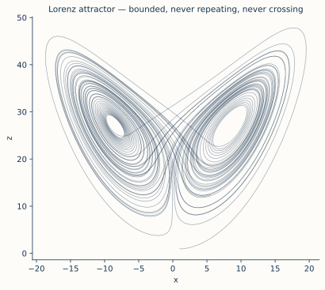

# ch11 — 奇異吸子：被關住卻永不重複

> **本章解決什麼問題**：ch10 給了你看混沌的鏡頭——相空間（phase space）：狀態是一個點、演化是一條軌跡（trajectory），而決定論逼出一條鐵則「軌跡永不自交」（同一點不能有兩個未來）。ch10 介紹的吸子（attractor）都很乖：不動點是一個點、極限環（limit cycle）是一個閉圈、環面是準週期。這一章要端出第四種、也是讓混沌第一次有了「肖像」的那一種——奇異吸子（strange attractor）。主角是勞侖次（Edward Lorenz）那三條 ODE 畫出來的蝴蝶。它同時做到三件看起來互斥的事：軌跡被牢牢關在有限區域裡（有界）、卻永不落回任何一個值（非週期、永不重複）、而且永不自交。本章要讓你看懂這三件事**怎麼可能同時為真**——答案是「無限不重複地摺進一個碎形集合」，而那正是 ch16 拉伸與摺疊機制的預告。形狀的量化（碎維度）留 ch13、敏感的量化（Lyapunov）留 ch14；這裡只談形狀本身，但要談到你能對著那張圖跟另一個工程師講清楚它奇在哪。

## 從你已知的出發

先講一件你天天盯著、卻可能沒這樣命名過的事：**你的服務有一個「穩態的形狀」，而那個形狀幾乎從不是一個點。**

想像一個健康、長期運行的後端服務。把它的狀態畫成相空間裡的一條軌跡——軸是 CPU 使用率、佇列長度、p99 延遲。它**不會**收斂到某個固定值賴著不動（那種服務要嘛在睡覺、要嘛已經死了），也**不該**飛出去發散（那是記憶體洩漏、retry storm、你 3am 被叫起來的那種）。健康的服務做第三件事：在某個**有界的區域裡**永遠晃動——CPU 在 30% 到 70% 之間呼吸、佇列在零到幾百之間起伏、p99 在一條帶子裡抖。它從不停在一點、也從不衝出邊界，被「吸」進一團有限的、有形狀的活動範圍裡，在裡面永遠活著。

那團「服務長期會待在裡面的形狀」，就是它的**吸子**。這裡有個你早就內化、但值得明寫的區分：

- **軌跡**是這一次、這一台機器、從這個起點出發，跑出來的**那一條具體的路**。換台機器、換個起點、換一天，軌跡完全不同。
- **吸子**是「不管從哪個合理起點出發、跑夠久之後，軌跡都會待在的那個形狀」。它和起點無關，是系統的**性格**，不是某一次的**遭遇**。

你做容量規劃、看 dashboard 的「正常範圍」、設告警閾值，其實一直在估這個吸子的邊界——問的不是「下一秒 CPU 是多少」（軌跡上的一個點，測不準），而是「健康時會活在哪個範圍」（吸子的形狀，穩定得多）。**吸子是穩態行為的形狀，軌跡是穩態行為的一次取樣。**

ch10 已經給你看過三種吸子的形狀：不動點（收到一個點，像關機後的待機）、極限環（繞一個固定的閉圈，像穩定的週期心跳）、環面（兩個不可通約的頻率疊起來、繞一個甜甜圈面，像準週期）。這三種都「乖」——它們的形狀是規則的幾何體，軌跡在上面要嘛停、要嘛週期性地重複、要嘛準週期地填滿一個面，**長期下來你能預測它大概在哪**。

這一章要砸碎這份乖巧。我們要看一種吸子，它把軌跡關得死死的（有界，像極限環），但軌跡在裡面**永不重複、永不閉合、永不自交**（像沒被關住的亂跑）。被關住的亂跑——這兩件事擺在一起本身就是個矛盾，而勞侖次的蝴蝶，就是這個矛盾畫出來的樣子。它叫**奇異吸子**，是這本書的視覺高潮。

## 勞侖次的三條式子：把一鍋對流壓成三個數

ch03 我們講過勞侖次 1961 年那段被千分之一誤差拆掉的天氣，但那是他**十二變數**的天氣模型。1963 年他做了一件更狠的事：把整個故事壓縮到只剩**三個數**。他想問一個乾淨的問題——「製造出『測不準』所需要的最小機器，到底有多小？」答案小到驚人：三條一階常微分方程（ODE），就夠了。

這三條式子描述的是一鍋**對流（convection）**。物理場景具體得很：底下加熱、上面散熱的一層流體——你燒一鍋水、或大氣底層被地表曬熱——下層熱了變輕想往上、上層冷了變重想往下，於是流體捲成一圈一圈轉動的**對流捲（convection roll）**，像一根橫躺的滾筒，熱的這側往上頂、冷的那側往下沉，周而復始。勞侖次把這鍋對流的無窮多細節，砍到只剩三個量：

```text
        dx/dt = σ·(y − x)
        dy/dt = x·(ρ − z) − y
        dz/dt = x·y − β·z

        參數：σ = 10、 ρ = 28、 β = 8/3 ≈ 2.6667
```

先把這三個變數的物理身分認清楚——這比硬看式子重要得多（查證版，見延伸閱讀的對流模型來源）：

```text
  x ── 對流捲「轉多快、往哪轉」：對流運動的強度（捲的旋轉率）。
       x 為正、為負代表捲在順時針或逆時針轉。
  y ── 上升流與下降流之間的「溫差」：熱的那柱和冷的那柱差多少。
  z ── 垂直溫度分布「偏離直線」的程度：流體把熱攪動後,
       上下溫度曲線不再是一條乾淨的斜直線,z 量這個扭曲。
```

三個參數也都有出身：

```text
  σ（sigma）── 普朗特數（Prandtl number）：流體「黏滯」和「導熱」的快慢比。取 10。
  ρ（rho）  ── 瑞利數（Rayleigh number）：底下加多熱、驅動力多強。取 28——關鍵在這個 28。
  β（beta） ── 幾何參數：對流捲的形狀／長寬比。取 8/3。
```

現在讀那三條式子，**一條一條讀直覺，不要去解它**（這三條 ODE 沒有封閉解，硬解是 ch02 三體那種徒勞；我們要的是看懂它在說什麼）：

- **第一條 `dx/dt = σ(y−x)`**：捲的轉速 x 往「溫差 y」追。溫差大、就加速轉；轉速超過溫差所能維持的、就減速。σ 是這個追趕的急切程度。這是個**負回授**：x 想往 y 靠齊。你看一眼就認得——這跟你的 autoscaler「副本數往目標負載追」是同一個句型（ch06 那條 |斜率|<1 的老朋友），只是換成連續時間的版本。

- **第二條 `dy/dt = x(ρ−z) − y`**：溫差 y 怎麼變。`x·ρ` 是「轉得越快、底下的熱被捲上來越多、溫差被拉大」的驅動項，ρ=28 就是這股驅動有多猛；`−x·z` 是個**非線性**的反咬——溫度分布一旦被攪歪（z 大），它會回頭抑制溫差；`−y` 是自然耗散。**這條式子裡那個 `x·z` 的乘積，是整個混沌的火種**：兩個變數相乘，方程就不再是線性的，疊加原理失效，後面所有的怪事都從這裡長出來。

- **第三條 `dz/dt = xy − βz`**：溫度扭曲 z 怎麼變。`x·y`（又一個乘積！轉速乘溫差）餵養扭曲，`−β·z` 把扭曲往回拉、耗散掉。

三條合起來是一台**有摩擦的對流機**：ρ=28 把熱量持續灌進去（拉伸、製造能量），β 和那些 `−x`、`−y`、`−z` 的耗散項不斷把能量抽走（摺疊、收束、讓系統有界）。灌進來又被抽走，兩股力量誰也壓不死誰——系統就卡在一種**永不安定的活著**。

關鍵旋鈕是 ρ。加熱不夠（ρ 小）時流體懶得動、熱量靠純傳導，系統乖乖停在不動點（x=y=z=0，捲根本不轉）。加熱多一點（ρ 過臨界值），不動點失穩、流體穩定對流——捲以固定方向轉，對應一個穩定的非零不動點。**但 ρ=28 已過第二道臨界**：對流太猛，連「穩定朝一個方向轉」都維持不住——捲會轉著轉著突然慢下來、停、然後**反方向**轉起來；轉一陣子又反過來，而**什麼時候反轉、反轉幾圈，無法預測**。這個「一下順轉一下逆轉、切換時機測不準」的物理畫面，等下你會看到它**就是**蝴蝶吸子的兩片翅膀。

記住一句話：**勞侖次不是把天氣模型做得更精細來逼出混沌，是把它砍到不能再砍——只剩三個數——混沌還是冒出來了。** 混沌不是複雜度的產物，是那兩個乘積項的產物。三個自由度剛好夠（ch10 說過：連續自治系統要混沌至少三維——一維二維裡軌跡不自交的鐵則會把它逼成週期或收斂，三維才有空間讓軌跡永遠繞而不撞）。

## 把這條軌跡畫出來：一隻蝴蝶

現在把這台機器跑起來。給它一個起點 (x₀, y₀, z₀)，讓它順著那三條式子演化，把每一刻的 (x, y, z) 當相空間裡一個點連成軌跡。跑幾萬步，投影到 xz 平面上看，你會看到這個——本書最該被裱起來的一張圖：



兩片翅膀。軌跡在左翼繞幾圈，某一刻突然甩到右翼繞幾圈，再甩回來——繞圈數、停留時間，每次都不一樣，永遠不一樣。它從不停下、從不收斂到一個點，也從不衝出這兩片翅膀的範圍。它就**永遠在這對翅膀上繞**，而且**沒有任何兩圈是完全一樣的**。

把這隻蝴蝶接回剛剛的對流：

```text
  左翼  ←→  對流捲往「某個方向」轉（譬如順時針）
  右翼  ←→  對流捲往「另一個方向」轉（逆時針）
  從左翼甩到右翼  ←→  捲慢下來、停、反向轉起來
  在一翼上繞圈   ←→  捲朝同一方向轉了好幾圈
```

「捲一下順一下逆、切換時機測不準」這個物理事件，在相空間裡的肖像，**就是這隻蝴蝶**。左翼是順轉、右翼是逆轉，軌跡在兩翼間的跳躍，就是捲反向的那一刻。蝴蝶的形狀不是裝飾——它是「對流捲不可預測地反覆換向」這件事，被相空間如實畫出來的樣子。

（一個必須當場釘死的雙關，免得你跟人講串了：這隻**形狀像蝴蝶**的吸子，和「巴西的蝴蝶拍翅引發德州龍捲風」那個**敏感依賴隱喻**，是**兩件事**。後者是 ch03 講的、Merilees 1972 擬的演講題目，講的是 SDIC；前者是這隻吸子在相空間裡長得像翅膀。兩者剛好都叫「蝴蝶」純屬語言巧合，**不是「因為吸子像蝴蝶所以叫蝴蝶效應」**。這個坑連嚴肅科普都常掉進去，下面「直覺的陷阱」還會回來把它焊死。）

## 三件不該同時為真的事

這隻蝴蝶之所以「奇異」，不在於它好看，而在於它同時做到三件**看起來互相矛盾**的事。把這三件並排，是本章的核心，請你慢讀：

```text
  ① 有界（bounded）      ── 軌跡永遠關在這對翅膀的有限範圍裡,絕不飛出去、絕不發散。
  ② 永不重複（aperiodic）── 軌跡永遠不落回任何一個它造訪過的狀態,
                            因此永不閉合成一個圈、永不週期。
  ③ 永不自交（non-self-intersecting）
                          ── 軌跡從不穿過自己走過的路（決定論的鐵則:
                            同一點不能有兩個未來——見 ch10）。
```

逐一感受為什麼這三件擺一起很怪：

**①「有界」很容易**——把軌跡關進一個盒子，太多系統做得到，極限環就是。
**②「永不重複」單獨看也容易**——一條不斷往外跑、永不回頭的軌跡（像往無窮遠發散的）當然永不重複。
**③「永不自交」單獨看也不難**——只要軌跡夠聽話。

難的是**三個一起**。試著在腦子裡畫一條線同時滿足三條：被關在有限盒子裡（①）、永遠不能碰到自己走過的任何一點（③）、又永遠不能停下來繞成閉圈（②，一閉合就週期了）。

停下來真的試一秒。一條被關在有限空間、卻永遠不准碰自己、又永遠不准停的線——**它要往哪裡去？** 空間有限，它走的每一步都在用掉位置，卻又永遠不能重複、不能停。直覺會喊：不可能，遲早會把空間填滿、撞上自己。直覺在這裡會撞牆，而撞牆的點正是這本書最漂亮的一頁。讓我們把它看穿。

## 為什麼三者能共存：無限地摺進一個碎形

三件事能共存，靠的是一個你的歐幾里得直覺沒準備好的東西：軌跡待的那個集合，**不是一個面、也不是一個體，而是一個介於兩者之間的碎形（fractal）**。

先看「為什麼必須是這樣」的推理，這是本章的 worked example，純口頭推演、一步不跳：

**第一步：永不自交 ＋ 有界，會逼出什麼？** 一條線，被關在有限體積裡，永遠不准碰自己。如果這條線是「一維的、有粗細的」（像真實的水管），那它遲早會把有限空間塞滿、無路可走、被迫碰到自己——矛盾。所以它必須是**理想的、零粗細的**數學曲線：無限細，這樣才永遠擠得進新的位置而不碰舊路。一條無限細的線，可以在有限空間裡盤旋無限長而不自交——就像你可以在一張紙上畫無限長的線而不重疊，只要線無限細。

**第二步：永不重複，需要多長的線？** 「永不落回任何造訪過的狀態」意味著軌跡是**無限長**的——任何有限長的閉合路徑都會週期性重複。所以這條無限細的線，還必須**無限長**。

**第三步：無限長的線，塞進有限空間，會長成什麼？** 把一條無限長的線塞進有限的盒子、且不准自交，唯一的辦法是**無限次地摺疊**。想像你在揉麵團、或拉一條太妃糖：把它拉長（製造長度），然後對摺塞回原來的範圍（保持有界），再拉長、再對摺……拉長、摺回、拉長、摺回，無限次。每摺一次，麵團裡就多一層；摺無限次，就有無限多層、層中有層、層中又有層。

**第四步：無限多層，疊出什麼維度的東西？** 這就是關鍵。這個「無限摺疊出無限多層」的集合，**比一條線（一維）厚——因為它有無限多層堆疊；但又比一個實心面（二維）薄——因為層與層之間永遠有空隙（軌跡不准填滿，否則就自交了）**。它卡在一維和二維之間。對 Lorenz 蝴蝶，這個「之間」量出來是**維度約 2.06**（它活在三維裡，所以比面 2 稍多一點點、但遠不到體 3——量化怎麼算留 ch13；landscape 查證值 Kaplan–Yorke 維度 ≈ 2.062）。

把這四步串起來，三件矛盾的事就和解了：

```text
  有界      ── 因為無限摺疊把線「摺回」有限範圍,不讓它跑掉。
  永不重複  ── 因為線無限長,任何有限閉圈都會重複,無限長才能永不回頭。
  永不自交  ── 因為線無限細、且摺出來的層之間永遠有縫,
              新的一圈總能擠進舊圈之間的空隙,不碰到任何舊路。
  三者共存的唯一辦法 ── 軌跡無限不重複地「摺進」一個碎形集合。
```

這就是「奇異吸子」裡那個 **strange（奇異）的精確意思**：奇異吸子之所以奇異，**不是因為它行為怪，是因為它的幾何是碎形**——分數維度、無限細節、零體積卻無限長。「strange attractor」這個詞由 Ruelle 與 Takens 在 1971 年的論文〈On the Nature of Turbulence〉（《Comm. Math. Phys.》卷 20，頁 167–192）鑄出（查證版，見延伸閱讀），他們研究紊流時發現系統長期行為被吸到一個「不是傳統幾何體」的集合上，於是給了它這個名字。乖吸子（不動點、極限環、環面）維度都是整數（0、1、2）；**奇異吸子維度是分數**——這是「乖」與「奇異」的數學分界線。

注意這台「拉長＋摺回」的揉麵機，正是 ch16 的主角：**拉伸製造敏感與長度、摺疊保持有界**。本章你先記住它造出的**形狀**（碎形吸子），ch16 會把齒輪拆開——你會發現脊椎遞迴式 r=4 的「拉伸 2 倍再對摺」（λ=ln2 的來源）和勞侖次這鍋對流的摺疊，是同一個機制的兩個化身。蝴蝶的「有界卻永不重複」和脊椎在 r=4 的混沌，是同一件事在連續與離散時間裡的兩張臉。

## 看似自交，其實在不同高度

上面說「永不自交」，但你盯著那張 xz 投影圖會抗議：**它明明到處都在交叉啊！** 翅膀裡那一條條線分明穿來穿去、疊在一起。

抗議得對，但被騙了——騙你的是**投影**。那張圖是把三維軌跡 (x, y, z) 壓扁到 xz 平面畫的，y 維度被壓沒了。三維裡兩條**不相交**的軌跡，投影到二維平面完全可能**看起來**交叉——就像照片裡遠處的電線桿「插進」近處的人頭，現實中它們差了幾十公尺，只是被相機壓到同一個平面才疊在一起。

```text
  三維真相                         二維投影（照片）
  ───────────────                  ───────────────
  軌跡 A 在高度 y=2 穿過           兩條投影在這一點「交叉」
  軌跡 B 在高度 y=5 穿過           但那是假象——它們其實
  （同一個 (x,z),不同的 y）        差了 3 個單位的高度,沒碰到

       A  ──●──  (y=2)
              ╲
       B  ──●──  (y=5)            投影下來:   ──╳──
                                              （看起來交叉,實則不交）
```

為什麼**必須**不交？回到 ch10 那條決定論的鐵則：相空間裡每一點只有**唯一**的未來（式子右邊 dx/dt、dy/dt、dz/dt 在每一點給出唯一的速度向量）。如果軌跡真的自交，那個交點就有**兩個**未來（一條從這走、一條從那走），違反唯一性——決定論不允許。所以在**真正的三維相空間裡，軌跡永遠不自交**，這是鐵律，不是巧合。你在 xz 投影上看到的每一個「交叉」，都是 y 維度被壓掉造成的視覺假象——它們在 y 上錯開了，只是你看不到。

這件事還有個更深的後果，順帶記住：兩片翅膀**看起來**在中間連成一片、軌跡在那裡「合併」——勞侖次自己注意到了，並寫下這不可能是真合併（合併＝自交＝兩個未來，禁止），所以那裡**必然是無限多層彼此靠得極近、卻永不真正觸碰的曲面**。他原話寫的是「一個無限複雜的曲面複合體（an infinite complex of surfaces）」（查證版）——而今天我們有個詞專門指這種「無限多層、層中有層」的東西：**碎形**。勞侖次在 1963 年，比曼德博 1975 年鑄出「fractal」這個字早了十二年，就用大白話描述了一個碎形。他看見了它，只是還沒有名字可以叫它。

## 吸子不是軌跡：極限集合的視角

最後一個必須分清的區分，回到開頭那句「吸子是形狀、軌跡是取樣」，但講精確一點，因為這是「奇異吸子」這個詞的正確讀法。

**吸子（attractor）是一個極限集合（limit set），不是一條軌跡。** 它是「所有合理起點的軌跡、跑到時間趨於無窮時，會趨近並待在裡面的那個點集合」。三個性質：

```text
  ① 吸引性 ── 起點在它附近的一整片區域（吸引盆,basin）裡,
              軌跡都會被「吸」向它、最終貼在它上面。
  ② 不變性 ── 已經在吸子上的點,演化之後還在吸子上（軌跡跑不出去）。
  ③ 極小性 ── 它是滿足前兩條的「最瘦」集合,沒有多餘的點。
```

對照三種乖吸子：不動點吸子是一個**點**（軌跡最終停在那）、極限環是一個**閉圈**（軌跡最終貼著它繞）、環面是一個**甜甜圈面**。它們都是「軌跡的極限去處」。蝴蝶吸子也是——只是它的形狀是那個**碎形**（無限多層的曲面複合體），軌跡最終會貼在這個碎形上、永遠在它上面繞。

為什麼非分清不可？因為「軌跡永不重複」和「吸子是固定的形狀」這兩句話初聽會打架——軌跡都永不重複了，怎麼會有個固定的吸子？答案：**單一軌跡永遠在變（永不重複），但它造訪過的所有點疊起來、跑到無窮，會勾勒出同一個固定的碎形——那個碎形才是吸子。** 軌跡是動的、吸子是它無限長行程「填出」的靜態形狀。就像你開頭看 dashboard：每一秒的讀數（軌跡上的點）都在變、測不準，但「健康時會待在哪個範圍」（吸子的形狀）是穩的、可估的。

這也解釋了為什麼吸子和起點無關：十萬個不同起點、十萬條彼此永不相同的軌跡，全都被吸進、貼上、永遠繞著**同一隻蝴蝶**。吸子是系統的性格——確定、有形、可畫；軌跡是一次次的遭遇——測不準、永不重複、每次都新。混沌的「亂」全在軌跡那層，混沌的「形狀與秩序」全在吸子這層。這正是本書中央那條張力在幾何上的樣子：**敏感（每條軌跡都測不準、永不重複）與秩序（所有軌跡都被同一隻碎形蝴蝶收編）在同一個系統裡共存。**

## 直覺的陷阱

混沌正是人類直覺最常崩壞的領域，而奇異吸子這一章的崩壞點特別密。逐一焊死：

| 誤解 | 為什麼錯／會在哪一步把你帶溝裡 | 正確版 |
|---|---|---|
| 「吸子像蝴蝶，所以叫蝴蝶效應」 | 把**形狀的蝴蝶**和**隱喻的蝴蝶**（拍翅引發龍捲風的 SDIC 比喻，ch03）縫成一句因果。兩者剛好同名，是雙關巧合，不是「因為吸子像蝴蝶所以叫蝴蝶效應」。 | 兩件事。**形狀的蝴蝶**＝吸子幾何（本章）；**隱喻的蝴蝶**＝SDIC（ch03，Merilees 1972 擬的題目）。同名純屬語言巧合。 |
| 「兩翼是兩個吸子，系統在兩個吸子間切換」 | 把一隻蝴蝶看成兩隻。當成「兩個獨立吸子＋切換」，你會去找一個不存在的「切換開關」——根本沒有開關，何時換翼是 SDIC 決定的、測不準的。 | 一個吸子、兩片翅膀（兩個 lobe）。兩翼相連、屬同一連通集合；跳躍由敏感依賴決定，不是兩吸子間的「切換」。 |
| 「投影圖上到處交叉，所以軌跡會自交」 | 把二維投影的假交叉當成三維真自交。一旦你信軌跡自交，就等於信「同一點有兩個未來」，決定論崩了——你會以為混沌＝隨機。 | 真三維裡軌跡**永不自交**（決定論：每點唯一未來，ch10）。投影的交叉是壓掉 y 維度的視覺假象，那些點在 y 上錯開了。 |
| 「永不重複、永不停，那它遲早會把空間填滿成實心一團」 | 用「線會塗滿面」的歐幾里得直覺想碎形。若真填滿成實心面，相鄰的層就貼合、軌跡就自交——矛盾。 | 它**填不滿**。層與層永遠留縫（否則自交），結果是介於線與面之間的**碎形**（維度約 2.06），零體積卻無限長。 |
| 「奇異吸子的『奇異』是說它行為怪、亂」 | 把 strange 理解成「行為混亂」。亂是 SDIC（軌跡層）的事，strange 講的是**幾何**。 | strange ＝ 幾何是**碎形**（分數維度）。乖吸子維度是整數（0/1/2），奇異吸子維度是分數——命名的分界（Ruelle–Takens 1971）。 |
| 「ρ=28 沒什麼特別，換個數也是蝴蝶」 | 以為任何參數都給蝴蝶。ρ 太小系統收到不動點，根本沒有奇異吸子。 | ρ=28 是「過了第二道臨界、對流猛到連穩定方向都維持不住」的混沌區。不同 ρ 給不動點、極限環或混沌——不是隨便哪個都長蝴蝶。 |

自我察覺的徵兆：如果你發現自己在找「兩翼之間的切換開關」、或在解釋「軌跡為什麼能自交」、或覺得「跑夠久蝴蝶會被塗成實心」——這三個念頭任何一個冒出來，就是你的歐幾里得直覺正在騙你，停下來回到「無限細的線、無限長、無限摺、填不滿」那四步。

## 紙上推演

### 推演題 1 ★ **[10 分鐘]**

不查書，用你自己的話向另一個工程師解釋：**蝴蝶吸子的「兩翼」為什麼不是兩個吸子。** 要點要包含：(a) 「兩翼是同一個吸子的兩個區域」這件事的依據是什麼；(b) 如果有人問你「那系統靠什麼機制在兩翼間切換」，你要怎麼回答（提示：陷阱在「切換機制」這個預設裡）。

#### 推演解答

(a) 依據是**連通性與軌跡的自由來回**：同一條軌跡（不換起點、不重啟）會自己從左翼繞到右翼、再繞回來，無數次。如果是兩個獨立的吸子，一條軌跡會被吸進其中一個、出不來（吸子的不變性：進去就跑不出去）。它能在兩翼間自由往返，證明兩翼屬於**同一個連通的吸子**——它們在中間還相連（那個「看似合併」的區域）。兩翼是同一隻蝴蝶的兩片翅膀，不是兩隻蝴蝶。

(b) 正確的回答是：**「切換機制」這個問題本身預設錯了——沒有開關。** 軌跡何時換翼不是某個機制「決定」的，而是**敏感依賴**的結果：起點一個無限小的差異，就改變它在這一翼繞幾圈才跳走——「何時換翼」原則上由初始條件唯一決定（決定論），但實務上測不準（SDIC）。沒有外部開關、沒有隨機骰子，只有確定的方程在一個碎形上把軌跡甩來甩去。常見錯路：去找一個觸發換翼的「臨界事件」或「閾值」——找不到，因為換翼是連續動力學的內生行為，不是被某事件觸發的離散跳變。

### 推演題 2 ★★ **[15 分鐘]**

有人盯著 Lorenz 吸子的 xz 投影圖說：「你看，軌跡明明穿過自己無數次，所以混沌系統的軌跡是會自交的，這證明它有隨機性——同一個狀態能去不同的地方。」這個論證**每一步**錯在哪？把它拆成三段反駁：(a) 「穿過自己」是真的嗎；(b) 「自交」會推出什麼災難性後果；(c) 為什麼「自交」和「隨機」其實是同一個誤解的兩面。

#### 推演解答

(a) **「穿過自己」是投影假象。** 圖是三維軌跡 (x,y,z) 壓到 xz 平面畫的，y 被壓沒了。兩條在**不同 y 高度**穿過同一個 (x,z) 的軌跡，投影下來疊在同一點、看起來交叉，但它們在 y 上錯開、根本沒碰到。真三維裡軌跡**永不自交**。

(b) **如果真自交，會推出決定論崩潰。** 自交點意味著某一點有**兩個**不同的未來。但那三條 ODE 在每一點只給出**唯一**的速度向量——這是 ch10 的鐵則。真自交＝同一點兩個未來＝違反唯一性，所以它**不可能發生**，不是「碰巧沒發生」。

(c) **「軌跡自交」和「混沌＝隨機」是同一個誤解的兩面。** 這個人真正想說的是「同一個狀態能通向不同結果」——這正是**隨機**的定義（同因不同果）。而混沌恰恰相反：它**完全決定論**，同一狀態永遠通向同一未來（所以不自交），表面的「亂」來自敏感依賴（測不準）、不是同因不同果。把投影假象當真自交，就滑進了「混沌＝隨機」這個全書最該守住的陷阱（ch04 立框、ch17 收）。一個是同因同果測不準、一個是同因不同果，本體論上是兩種東西。

### 推演題 3 ★★★ **[20 分鐘]**

口頭推演（這是本章 worked example 的延伸）：一條軌跡要同時做到**有界、永不重複、永不自交**，為什麼**唯一**的辦法是「無限不重複地摺進一個碎形集合」？請你不要只背結論，而是用「歸謬」的方式逐一排除其他可能：(a) 為什麼它不能是一條普通的（一維、有粗細的）曲線在盒子裡盤旋；(b) 為什麼它不能填滿一個實心的二維面；(c) 剩下的唯一可能是什麼，維度落在哪。

#### 推演解答

用歸謬，逐一排除：

(a) **不能是「有粗細的一維曲線」。** 假設軌跡像一根有粗細的水管，被關在有限盒子裡。有限體積只裝得下有限長度的有粗細水管。但「永不重複」要求軌跡**無限長**。無限長的有粗細水管塞進有限盒子，必然某處塞滿、無路可走、被迫碰到自己——違反「永不自交」。矛盾。所以軌跡必須是**零粗細的理想數學曲線**（無限細），才能在有限空間裡盤旋無限長而不自交。

(b) **不能填滿一個實心二維面。** 假設這條無限長的線最終把某個二維面**塗滿**（變成實心一片）。塗滿意味著相鄰的線段彼此貼合、緊挨在一起、中間沒有縫。但「貼合、緊挨」就是**自交的極限**——軌跡會碰到任意接近的舊路。更精確地說，若填滿成正測度的二維面，由唯一性（不自交）會推出矛盾。所以它**填不滿**，層與層之間**必須永遠留縫**。

(c) **剩下的唯一可能：碎形。** 既不能是乾淨的一維曲線（太細、裝不下無限長度的「厚度」——它靠無限摺疊堆出了超過一維的層數），也不能是實心二維面（太厚、會自交），那它只能卡在**一維和二維之間**——一個無限摺疊、層中有層、處處留縫的集合。這正是碎形的定義：分數維度。對 Lorenz 蝴蝶，這個維度量出來約 **2.06**（活在三維裡，比面 2 稍多、遠不到體 3；量化見 ch13）。維度為什麼會「比 2 多一點」？因為它不只是一個面，是**無限多層幾乎重合的面疊在一起**，那些層的堆疊讓它在「填空間的能力」上略強於一個乾淨的二維面，卻又因為永遠留縫而到不了三維的實心。常見錯路：把「2.06」理解成「兩個面加一點零頭」——不對，它是一個處處有空隙的無限層狀集合，2.06 是它「填空間能力」的刻度，不是面的數量。

### 推演題 4 ★★ **[12 分鐘]**

把蝴蝶接回你的後端直覺。一個健康的服務，其狀態（CPU、佇列、p99…）長期在相空間裡晃。(a) 它的「吸子」對應你工作裡的什麼具體東西？(b) 如果某天這個吸子**從碎形塌成一個不動點**，在運維上意味著什麼？(c) 如果它**從有界變成發散**（衝出邊界），又意味著什麼？藉這題把「吸子是穩態行為的形狀」這句話用你自己的話坐實。

#### 推演解答

(a) 吸子對應 **dashboard 上的「健康正常範圍」／你設告警閾值時心裡那個「正常活動區域」**。它不是某一秒的讀數（那是軌跡上的點，測不準、永遠在變），而是「這個服務健康運行時，狀態會待在的那團有界形狀」——和起點、和哪一天、哪台機器無關，是系統的性格。容量規劃、設 SLO、畫 dashboard 的綠區，本質都是在估這個吸子的邊界。

(b) **吸子塌成不動點＝服務「凍住了」。** 狀態收斂到一個固定值、不再晃動——CPU 卡在某個數一動不動、佇列恆定、p99 不抖。健康的服務該有呼吸（持續的有界晃動）；變成一個點通常代表它停止處理真實流量了：死鎖、卡在某個狀態、或乾脆沒有請求進來（睡著或上游斷了）。「太穩」反而是病徵。

(c) **從有界變發散＝失控。** 軌跡衝出原本的範圍、某個量單調往上爬不回頭——佇列無限堆積、記憶體洩漏、retry storm 滾成雪崩。吸子「破掉」了：原本把軌跡摺回有限範圍的耗散／回授機制（限流、backpressure、circuit breaker）失效，拉伸壓過了摺疊。混沌系統靠「拉伸＋摺疊」維持有界（ch16），你的服務靠「負載＋限流」維持有界——摺疊一旦失守，兩者都發散。收穫：你一直在直覺地維護一個吸子的形狀——讓服務在健康範圍裡持續晃動，既不凍成一點、也不衝出邊界。

## 自我檢核

口頭自答，講得出來才算過關，講不清就是還沒懂：

1. 勞侖次那三條 ODE 各在說什麼？（不要背式子，要能說出 x/y/z 是對流的什麼量、σ/ρ/β 是什麼，以及哪個項是「混沌的火種」、為什麼。）
2. 蝴蝶的兩片翅膀對應對流捲的什麼物理行為？「從一翼甩到另一翼」在物理上是什麼事件？
3. 「有界、永不重複、永不自交」三件事為什麼看起來互相矛盾？它們**唯一**能共存的辦法是什麼？把那條歸謬推理（無限細→無限長→無限摺→碎形）講一遍。
4. 投影圖上軌跡到處「交叉」，但你說它永不自交——這兩句怎麼不打架？「永不自交」背後那條決定論鐵則是什麼？
5. strange attractor 的「strange（奇異）」精確指的是什麼？它和「行為很亂」是同一回事嗎？乖吸子和奇異吸子在維度上的分界是什麼？
6. 「吸子」和「軌跡」差在哪？為什麼「軌跡永不重複」和「吸子是固定的形狀」這兩句話不衝突？為什麼換十萬個起點還是同一隻蝴蝶？
7. 為什麼說這隻蝴蝶是 ch16「拉伸與摺疊」的預告？「摺疊」在維持「有界」這件事上扮演什麼角色？
8. 把「形狀的蝴蝶」和「隱喻的蝴蝶（蝴蝶效應）」的差別講給另一個工程師聽——它們為什麼同名、又為什麼是兩件事？

## 延伸閱讀

- **Strogatz,《Nonlinear Dynamics and Chaos》第 9 章（Lorenz Equations）** — 本章三條 ODE 的標準教科書版：從對流的物理推導出方程、ρ 旋鈕怎麼把不動點推到失穩、蝴蝶怎麼長出來。讀 9.1–9.3，你會看到本章口語版背後完整的線性化穩定性分析（接 ch06 那把 |斜率|<1 的尺到多維 Jacobian）。
- **Lorenz 1963,〈Deterministic Nonperiodic Flow〉，*J. Atmos. Sci.* 20: 130–141** — 奠基原文，意外地好讀。直接讀他描述「無限複雜的曲面複合體」那幾段——那是人類第一次用大白話描述碎形，比曼德博鑄「fractal」早十二年。（搜論文標題可得 PDF。）
- **Ruelle & Takens 1971,〈On the Nature of Turbulence〉，*Comm. Math. Phys.* 20: 167–192** — 「strange attractor」一詞的出生證明。讀它怎麼從紊流問題裡逼出「長期行為被吸到一個非整數維度集合上」的觀點，理解「奇異＝碎形幾何」這個命名的脈絡。（https://www.ihes.fr/~ruelle/PUBLICATIONS/146strange.pdf ，IHÉS 原文）
- **本書 ch13** — 「維度約 2.06」這個數從哪來、怎麼算。本章只定性說「比面多一點」，碎維度 D = lnN/ln(1/s) 的盒計數量化在那裡。
- **本書 ch16** — 那台「拉伸＋摺疊」揉麵機的內部齒輪。本章說蝴蝶靠「無限摺疊」共存三件矛盾的事，ch16 把這個機制拆開——並證明它和脊椎遞迴式 r=4 的「拉伸 2 倍再對摺」（λ=ln2 的來源）是同一台機器。
- **《馴服無限》談微分方程的章** — 這三條式子是 ODE，相空間軌跡是它們的解；「dx/dt 在每點給唯一速度向量」這條唯一性定理（軌跡不自交的根）在那裡有完整版。本章只用它的結論。
