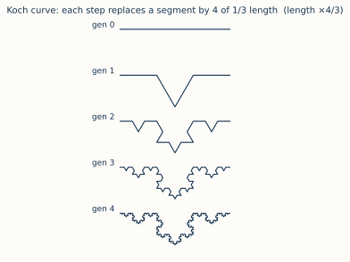
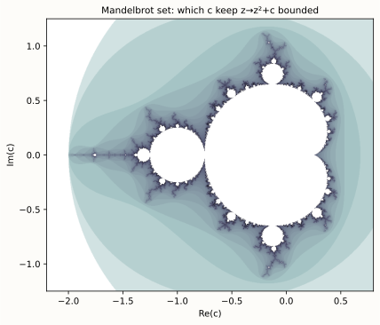

# ch12 — 碎形：放大之後還是它自己

> **本章解決什麼問題**：ch11 的奇異吸子留了一個沒還的債。它有界、永不重複、永不自交，三件事你信了——但「它的幾何到底長什麼樣」這一問，當時只用「碎形」兩個字打發過去。這一章把那兩個字拆開。碎形（fractal，中國大陸譯分形）是混沌的幾何語言：一個**放大之後還是它自己**的形狀，無窮的細節擠進有限的範圍。我會用三個能在紙上一筆一筆畫出來的例子把它講透——Koch 曲線、Cantor（康托）集、Mandelbrot（曼德博）集——而且你會發現，造出 Mandelbrot 集那條規則 zₙ₊₁ = zₙ² + c，跟脊椎遞迴式 xₙ₊₁ = r·xₙ·(1−xₙ) 是同一個家族的迭代：把規則套在自己的輸出上，一次又一次。本章只回答「碎形是什麼形狀、怎麼造、為什麼反直覺」；「它到底有多碎」要量成一個數，是 ch13 的事。

## 從你已知的出發

你寫過遞迴。不是「會背遞迴的定義」那種，是真的靠它吃飯的那種——你心裡有一串現成的畫面，現在我要借它們來講碎形。

第一個畫面：**樹**。檔案系統的目錄樹、DOM 樹、抽象語法樹、B-tree。它們有個共同性質你大概從沒特別想過——**砍下任何一棵子樹，它本身又是一棵完整的樹**。一個目錄底下的目錄，結構跟最上層的目錄一模一樣；一個 DOM 節點底下的子樹，跟整份文件的結構同型。你遍歷它時寫的那個函式，`traverse(node)` 裡面呼叫 `traverse(child)`——**同一個函式套在自己的輸出上**。這就是碎形的核心，只是你一直叫它「遞迴」。

第二個畫面：**無限滾動**。你做過那種 feed——往下滑，載入更多，再往下滑，又載入更多，每一屏的版面結構都跟上一屏一樣。你把同一個 component 套在新資料上，一遍又一遍，理論上可以無限滾下去。放大、縮小，看到的都是同一種版型。這也是碎形。

第三個畫面，更貼近本章的數學：**一條規則，反覆套在自己的輸出上**。`x = f(x)` 跑在一個迴圈裡——retry 把上一次的結果餵回下一次、autoscaler 把當前負載餵回下一輪副本數、PRNG 把上一個亂數餵進下一步。你對「把輸出餵回輸入、一直跑」這件事熟到不能再熟。脊椎遞迴式就是這個（ch05）。

碎形是這三個畫面在**幾何**上的版本。把「遞迴」「無限滾動」「規則套在自己輸出上」這三股直覺擰成一股，得到一句話：

> **碎形＝同一條規則，無限次套在它自己的輸出上，所生出的形狀。**

而它最反直覺的性質，正是從「同一條規則」來的：因為每一層都用同一條規則生成，所以**放大它的局部，你看到的還是整體的縮小版**——這叫**自相似（self-similarity）**。你滑無限滾動時的「每一屏都長一樣」，碎形把它推到極限：**每一個尺度都長一樣**，無論你放大多少倍。

這一章從頭到尾只有一件事在重複出現：一條規則、套在自己的輸出上、放大之後還是它自己。我們先用兩個能手算的例子（Koch、Cantor）把「無窮細節擠進有限範圍」這件怪事看穿，再看海岸線為什麼量不出長度，最後接到 Mandelbrot 集——它的生成規則，就是你已經認識的那種迭代。

## 自相似：放大之後還是它自己

先把「自相似」這個詞釘死，因為它是本章一切的根。

**自相似**講的是：一個形狀的**一部分**，跟**整體**長得一樣（可能旋轉、縮小，但形狀同型）。你拿放大鏡湊近碎形的任何一小塊，看到的不是一塊更平滑、更簡單的小東西——而是**整體的縮小複本**，裡面又塞滿了跟整體一樣多的細節。再放大那個複本裡的一小塊，又是一個複本。沒有盡頭。

這和你習慣的幾何**完全相反**。歐幾里得的世界裡，東西放大就會變平：

```text
  你習慣的幾何（放大 → 變簡單、變平）        碎形（放大 → 還是它自己）
  ────────────────────────────────         ──────────────────────────
  一個圓                                     一段海岸線
    放大一段弧 → 幾乎是直線                     放大一段 → 還是凹凹凸凸的海岸線
    再放大 → 更像直線                          再放大 → 還是凹凹凸凸的海岸線
    放到夠大 → 看不出彎，就是一條線              放到任意大 → 永遠凹凹凸凸，看不出「夠平滑」那一刻
```

地球是圓的，但你站在地上覺得地是平的——因為圓放大就變平，這是你的母語直覺。碎形偷走了這個直覺：**它放大不變平。** 你永遠等不到「再放大就平滑了」那一刻，因為每一層都藏著下一層的細節。一段海岸線，從衛星看是凹凸的，走近看每個海灣裡還有小海灣，再走近每塊礁石邊還有小縫隙——尺度一層層下去，凹凸從不消失。

這就是為什麼碎形是混沌的幾何語言。回想 ch11 的奇異吸子：軌跡有界（關在一個盒子裡）、卻永不重複（永遠不走回頭路）、又永不自交（決定論不准一個點有兩個未來）。這三件事要同時成立，唯一的辦法是把無限長的軌跡**無窮細密地摺進**一個有限的集合裡——而「無窮細密地摺進有限範圍」的幾何後果，正是自相似的碎形結構：你放大吸子的任何一小片，會看到一疊一疊更細的層，層裡又有層。奇異吸子之所以「奇異」，就是因為它的幾何是碎形（這個命名 Ruelle 和 Takens 1971 給的，見 ch11）。

現在的問題是：自相似這個性質，會逼出什麼怪事？最有名的兩件——**無窮的長度** 和 **空無的面積**——只要你親手畫三步就跑出來了。

## Koch 曲線：無限長的線，圍住有限的面積

Koch（科赫）曲線是檢驗碎形直覺最乾淨的例子，因為它的造法是一條三歲小孩都能執行的規則，而後果荒謬到你會想重算一遍確認沒看錯。

造法只有一句：**把每一段直線，換成「凸出去的四段」。** 具體做：拿一段線，三等分，把中間那段抽掉，補上一個朝外的等邊三角形的兩條邊——於是原本平的一段，變成一段往外凸的尖角，由四小段組成，每段是原來的三分之一長。然後對**新生出來的每一段**，再做一次同樣的事。再做一次。一直做下去。

```text
  第 0 代：一段直線
  ─────────────────────

  第 1 代：每段換成凸出的四段（中間頂出一個尖）
  ──    ──
     \  /
      \/
  ─       ─

  （示意：原本一直線，中段頂出一個三角形的尖，成為四小段）

  第 2 代：對第 1 代的「每一小段」再做一次同樣的操作
  → 四個尖，每個尖的四條邊上又各頂出一個小尖
  → 16 小段

  第 3 代：對第 2 代的每一小段再做一次 → 64 小段，邊緣已經毛刺得像雪花輪廓
```



把三條這樣的 Koch 曲線首尾接成一個三角形，就是**Koch 雪花**——一片邊緣無限毛刺的六角雪花。但雪花是裝飾，重點在那條曲線的兩個數字怎麼變。手算前四代，記下「段數」和「總長」（這張表我一步步算過，為 ch13 量維度鋪路）：

```text
  代  段數 N        每段長度 s        總長 = N × s          每代總長變化
  ──  ──────────    ────────────      ────────────────      ──────────
  0   1             1                 1 × 1     = 1          —
  1   4             1/3               4 × 1/3   = 4/3        × 4/3 ≈ 1.333
  2   16            1/9               16 × 1/9  = 16/9       × 4/3
  3   64            1/27              64 × 1/27 = 64/27      × 4/3
  …
  k   4ᵏ            (1/3)ᵏ            (4/3)ᵏ                 每代固定 × 4/3
```

讀懂每一欄的「為什麼」，這張表就活了：

- **段數每代 × 4**：因為操作把「一段」變成「四段」。N: 1 → 4 → 16 → 64 = 4ᵏ。
- **每段長度每代 × 1/3**：因為新的小段是三等分裡的一份。s: 1 → 1/3 → 1/9 → 1/27 = (1/3)ᵏ。
- **總長每代 × 4/3**：把上面兩個乘起來，4 × (1/3) = 4/3。每做一代，曲線就**長 33%**。

關鍵在最後一欄那個 4/3。它**大於 1**，而且每一代都乘一次。所以總長是 1、4/3、16/9、64/27……一路漲，(4/3)ᵏ 隨 k 沒有上限——**Koch 曲線的長度是無窮大**。

但這條無限長的曲線，**圍住的面積是有限的**。直覺上很好信：整條曲線從頭到尾被框在一個小小的有限區域裡（每代往外頂出的三角形越來越小，總共多出來的面積收斂到一個有限值，雪花的面積是原三角形的 8/5 倍——這個數本章不展開，留個印象就好）。於是你得到一個荒謬的並置：

> **一條無限長的線，圍住一塊有限的面積。**

停十秒，因為你的直覺正要騙你。在你的歐幾里得母語裡，「無限長」和「有限面積」是打架的——線越長，圈得越大。但碎形不講這個理。Koch 曲線把無限的長度，全部**塞進**了有限的範圍：它不靠「圈得更大」來變長，它靠「在原地越皺越細」來變長。每一代不往外擴張多少，只是把邊緣弄得更毛刺。長度的無窮，來自無窮層的毛刺，不來自無窮的延伸。

這就是「無窮細節擠進有限範圍」的第一個鐵證，也是 ch13 要回答的問題的由來：一個「比線多、比面少」的東西，它的維度該是幾？（劇透到此為止，數字留給 ch13。）

工程直覺對照一下：你做過「無限滾動」——版面有限（一個視窗），內容無限（一直載入）。Koch 曲線是它的幾何極端版：圖形佔的地盤有限，但「邊界的內容」無限。有限的容器，無限的內容。你天天在處理這種東西。

## Cantor 集：把東西一直挖空，剩下的卻數不完

第二個手算例子走相反的方向：Koch 是「越加越多」，Cantor（康托）集是「越挖越空」——但挖到最後剩下的東西，照樣怪得不像話。

造法同樣一句：**把每一段，挖掉中間三分之一。** 從 [0, 1] 這條線段開始。挖掉中間的 (1/3, 2/3)，剩下左右兩段 [0, 1/3] 和 [2/3, 1]。然後對剩下的**每一段**，再挖掉它的中間三分之一。再對剩下的每一段挖。一直挖下去。

```text
  第 0 代： ████████████████████████████████   [0,1]，一整段

  第 1 代： ██████████        ██████████        挖掉中間 1/3，剩 2 段
           [0,1/3]           [2/3,1]

  第 2 代： ███   ███         ███   ███         對每段再挖中間，剩 4 段
           各長 1/9

  第 3 代： █ █   █ █         █ █   █ █          剩 8 段，各長 1/27
           （縫隙越來越多，黑塊越來越細）
```

手算前四代的「段數」和「剩下的總長」（這張表也是一步步算過的，跟 ch13 對接）：

```text
  代  段數 N        每段長度 s        剩下總長 = N × s        每代總長變化
  ──  ──────────    ────────────      ──────────────────      ──────────
  0   1             1                 1 × 1     = 1           —
  1   2             1/3               2 × 1/3   = 2/3         × 2/3 ≈ 0.667
  2   4             1/9               4 × 1/9   = 4/9         × 2/3
  3   8             1/27              8 × 1/27  = 8/27        × 2/3
  …
  k   2ᵏ            (1/3)ᵏ            (2/3)ᵏ                  每代固定 × 2/3
```

逐欄的「為什麼」：

- **段數每代 × 2**：挖掉中間，一段變兩段。N: 1 → 2 → 4 → 8 = 2ᵏ。
- **每段長度每代 × 1/3**：剩下的每段是三等分的一份。s: (1/3)ᵏ。
- **剩下總長每代 × 2/3**：2 × (1/3) = 2/3。每挖一代，剩下的長度只剩上一代的三分之二。

這次最後一欄是 2/3，**小於 1**，每代乘一次。所以剩下的總長是 1、2/3、4/9、8/27……一路縮，(2/3)ᵏ 隨 k 趨近於 0——**挖到無窮代，剩下的總長度是零。**

照常理，挖到「總長是零」應該等於「什麼都不剩」。但這就是 Cantor 集的詭計：**剩下的點，不但不是空的，還多到數不完**（嚴格地說，它的點跟整條 [0,1] 線段一樣多——是「不可數」的無窮）。你每一代都只挖掉「開區間的中間」，**兩個端點永遠留著**：0、1 留著，1/3、2/3 留著，1/9、2/9、7/9、8/9 留著……每一代生出一批新端點，永遠不被挖掉。挖了無窮多次，留下的端點（和更多的極限點）湊成一個**長度為零、點數無窮**的塵埃般的集合。

> **總長度為零，卻有數不完的點。**

這又是一記直覺的耳光。「長度零」在你心裡等於「沒有東西」，但 Cantor 集是「沒有長度的東西」——它佔不到任何長度，卻佈滿了無窮多個點。它比「一個點」多太多（一個點是有限的），又比「一段線」少太多（線有長度）。一個「比點多、比線少」的東西，維度該是幾？跟 Koch 一樣，這個問題指向 ch13，數字留在那裡。

兩張表並排，你會看到同一個機制的兩個方向：

```text
  Koch 曲線：   段數 × 4、每段 × 1/3  →  總長 × 4/3 > 1  →  長度衝向無窮
  Cantor 集：   段數 × 2、每段 × 1/3  →  總長 × 2/3 < 1  →  長度縮向零
```

差別只在「一段變幾段」：Koch 變 4 段（撐過了縮小的 1/3，淨增），Cantor 變 2 段（撐不過，淨減）。同樣是「一條規則套在自己的輸出上」，係數差一點，一個長度爆炸、一個長度蒸發——但**兩者都把無窮的結構塞進了有限的地盤**。這就是碎形：細節隨尺度無限增生，不管你是用加的還是用挖的。

## 海岸線悖論：量尺越短，海岸越長

Koch 和 Cantor 是人造的、規則乾淨的碎形。但碎形不是數學家的玩具——曼德博鑄出「fractal」這個詞，動機是一個**真實世界**的怪問題：英國的海岸線到底有多長？

答案是：**沒有答案。海岸線的長度，取決於你的量尺有多短——而且量尺越短，海岸越長，沒有上限。**

這不是修辭，是可量的事實。曼德博在 1967 年的論文〈How Long Is the Coast of Britain?〉裡引用了 Lewis Fry Richardson（理查森）更早的觀察。Richardson 本來在研究「國界長度會不會影響開戰機率」，卻撞見一件怪事：葡萄牙官方說它跟西班牙的邊界是 987 公里，西班牙官方卻說同一條邊界是 1214 公里——同一條線，差了快四分之一。原因不是誰量錯，是**兩國用的量尺長度不同**：用短量尺的那一國，量進了更多的彎角，所以得到更大的數。

機制用你會的東西講最清楚。想像你拿一把長度 ℓ 的直尺，沿著海岸一段段量，跨過所有比 ℓ 小的彎彎曲曲（你的直尺一跨就把一個小海灣抄了近路，那段曲折沒被算進去）：

```text
  量尺長 = 200 km：直尺跨過所有小於 200km 的海灣 → 量出一個數（偏小）
  量尺長 = 50 km ：能鑽進中型海灣，多量到一截截彎曲 → 數變大
  量尺長 = 1 km  ：連小海灣、小礁石都鑽進去量 → 數更大
  量尺長 = 1 m   ：每塊石頭的輪廓都量 → 數又更大
  量尺 → 0       ：把每一粒沙的邊都量進去 → 數 → ∞（沒有上限）

  量尺越短，量到的彎越多，海岸線越長 —— 而且永遠不收斂到一個固定值。
```

每縮短一次量尺，你就「解析」出一層之前被跳過的更細的彎曲，長度就往上跳一截。因為海岸線是自相似的——大海灣裡有中海灣，中海灣裡有小海灣，每個尺度都有新的彎在等著被量進來——所以這個過程**沒有終點**。圓的周長你量得出來（量尺夠短時數字會收斂到 2πr，因為圓放大會變平，總有一刻「再細也沒新彎了」）；海岸線量不出來（它放大不變平，永遠有新彎）。

這就是**海岸線悖論**：一條真實的海岸線，沒有一個確定的長度。把「量尺長度」對「量出的總長」畫在 log-log 圖上，會是一條直線，這條線的斜率就洩漏了海岸有多碎——那個斜率連到碎形維度（英國海岸線經驗值約 1.25，1.25–1.31 隨量測尺度而異；維度是 ch13 的主菜，這裡只報這一個經驗數字）。曼德博的貢獻，是把 Richardson 那張「量尺 vs 長度」的經驗圖，提升成「碎形維度」這個量化的概念，從此「海岸線多長」這個沒答案的問題，換成了「海岸線多碎」這個有答案的問題。

對你來說，這裡有一個現成的工程錨點：**log-log 圖上的斜率**。你看 P99 延遲隨負載怎麼縮放、看檔案壓縮率隨資料量怎麼變，靠的就是 log-log 斜率那條直線——「一個量隨尺度怎麼縮放」的同一種直覺。海岸線悖論說的，就是「測量結果隨量尺尺度而縮放」，而且這個縮放率本身（斜率）是一個比「長度」更穩定、更有意義的量。ch13 會把這條直覺整個收割。

## Mandelbrot 集：哪些 c，迭代不會跑掉

最後一個碎形，把我們帶回脊椎。Mandelbrot（曼德博）集是碎形界的招牌肖像，而造它的規則，你已經認識了——它是**一條迭代**，跟脊椎遞迴式同一個血統。

規則是這樣：取一個複數 c（先別怕「複數」，下面講）。從 z₀ = 0 出發，反覆套這條式子：

```text
  zₙ₊₁ = zₙ² + c       ← 把當前的 z 平方，加上 c，得到下一個 z
```

然後問一個是非題：**這串 z₀, z₁, z₂, … 會不會跑掉（發散到無窮）？**

- 如果**不跑掉**（z 永遠關在有限範圍裡），這個 c 就**屬於** Mandelbrot 集——畫成黑色。
- 如果**跑掉**（z 越來越大、衝向無窮），這個 c **不屬於**——畫成白色（或依「跑掉得多快」上色）。

把每一個 c 試一遍、染好色，黑色那一片的形狀就是 Mandelbrot 集。



**先把「複數」這顆生鏽的螺絲擦一下**（你大學看過，這裡只點到夠用）。複數就是平面上的一個點：c = a + b·i，你可以把它想成座標 (a, b)。複數的乘法有個幾何意義——會旋轉並縮放——但本章你**不需要**算這個。你只需要知道：c 是平面上的一個點，z 也是平面上的一個點，「z² + c」把一個點變成另一個點，「跑掉」就是這個點離原點越來越遠。如此而已。Mandelbrot 集就是**複數平面上**那一片「迭代不跑掉的 c」。

**現在看血緣。** 把這條規則跟脊椎遞迴式擺在一起：

```text
  脊椎（ch05）：  xₙ₊₁ = r·xₙ·(1 − xₙ)      x 是實數、r 是旋鈕；問「軌跡長期跑去哪」
  Mandelbrot：   zₙ₊₁ = zₙ² + c            z 是複數、c 是旋鈕；問「軌跡跑不跑得掉」
```

兩條都是**二次的迭代**（脊椎乘開是 r·x − r·x²，含 x²；Mandelbrot 含 z²），兩條都是**把當前狀態餵回下一步**，兩條都有**一個旋鈕**（脊椎是 r、Mandelbrot 是 c）。差別只有兩個：脊椎在實數線上、Mandelbrot 在複數平面上；脊椎問「落到哪」、Mandelbrot 問「跑不跑得掉」。它們是同一個家族——**z → z² + c 這個二次迭代家族**——的兩個成員。事實上，邏輯斯諦映射經過一個座標變換，正好就是 z → z² + c 在實數軸上的樣子；你在 ch07 看到的那張倍週期分岔圖，藏在 Mandelbrot 集實數軸那條縫上（這個對應很深，本章只點破血緣，不展開）。

這就是為什麼 Mandelbrot 集該出現在這本書裡：它不是「另一個漂亮碎形」，它是**脊椎那種迭代，畫在複數平面上、問另一個問題，所長出的形狀**。你在 Part II 手搖了一整章的「把規則套在自己的輸出上」，在這裡長成了一幅無窮複雜的圖。

而它的**邊界**——黑色那片的輪廓——是碎形：你放大邊界的任何一小段，會冒出更多的小尖、小芽、還有整個 Mandelbrot 集的迷你複本（自相似！），再放大那些迷你複本的邊界，又冒出更多……無窮無盡。這條邊界碎到一個極致的程度，碎到它的維度等於 2（這是直覺的陷阱要守的重點，下一節講）。一條線，碎到把維度頂滿成 2。

## 直覺的陷阱

| 誤解 | 為什麼錯／會在哪一步把你帶溝裡 | 正確版 |
|---|---|---|
| 「海岸線悖論是因為地圖不夠精細／量錯了，理論上有一個真實長度」 | 把它當成「測量誤差」，你會以為「換更精密的儀器就能量到真值」。錯。問題不在精度，在於海岸線**本身**就沒有確定長度——量尺越短，長度越大，沒有上限、不收斂。換再精密的儀器只會讓你量到更大的數。 | 海岸線是碎形，長度隨量尺尺度發散。它沒有「真實長度」這個東西可以收斂到。穩定、有意義的量不是「長度」，而是「碎形維度」（log-log 斜率）——那個才有確定值。 |
| 「Koch 曲線無限長，所以它圍的面積也無限大」 | 「線越長圈得越大」是歐幾里得直覺。在這裡它失效：Koch 曲線靠「原地越皺越細」變長，不靠「往外擴張」變長。 | 無限長的曲線，圍住**有限**的面積。長度的無窮來自無窮層的毛刺，不來自無窮的延伸。「無限周長 ＋ 有限面積」正是碎形的招牌矛盾。 |
| 「Cantor 集總長度是零，所以挖到最後什麼都不剩」 | 「長度零 ＝ 空集」是直覺，但錯。每代只挖掉開區間的中間，端點永遠留著；無窮代後留下數不完（不可數無窮）的點。 | 長度為零，但點數無窮（不可數）。它是個「有點、沒長度」的塵埃集合——比一個點多太多、比一條線少太多。 |
| 「形狀越複雜，維度就越高，碎形維度一定大於它所在的空間」 | 不是。Mandelbrot 集邊界碎到極致，維度等於 **2**——剛好頂到平面的維度，沒有超過。維度量的是「細節隨尺度增生的速率」，有上限，不會無限飆。 | Mandelbrot 集**邊界**的 Hausdorff（豪斯多夫）維度 = 2（Shishikura 1991 證、1998 正式刊於 Annals）。一條曲線（邊界）碎到維度等於 2，這已是極限——它把平面填得密不透風，但仍是一條邊界，不是一塊面。 |
| 「自相似就是每一塊跟整體**一模一樣**，像複製貼上」 | 嚴格的「每塊都是整體的精確縮小複本」只有 Koch、Cantor、Sierpiński 這類**人造**碎形成立。真實碎形（海岸線、奇異吸子、Mandelbrot 邊界）是「統計自相似」或「準自相似」——每塊**統計上**像整體、有同樣的粗糙程度，但不是像素級複製。 | 自相似分「嚴格」（人造、精確複製）與「統計／準」（自然、同型但不全等）兩種。本章手算的 Koch／Cantor 是嚴格版；海岸線與 Mandelbrot 邊界是統計／準版。別把「自相似」一律理解成「複製貼上」。 |
| 「Mandelbrot 集是隨機亂長出來的複雜圖案」 | 它是**完全確定**的——每個 c 是黑是白，由一條無歧義的迭代規則（z→z²+c 跑不跑掉）唯一決定，零隨機。它的無窮複雜全部來自那條簡單規則的迭代，跟脊椎一模一樣。 | 確定的簡單規則 → 無窮複雜的形狀。這正是全書中央張力的幾何版：一條確定的迭代，生出窮盡不了的細節。複雜不來自隨機，來自迭代。 |

## 紙上推演

### 推演題 1 ★ **[10 分鐘]**

不查表，自己把 Koch 曲線第 4 代和第 5 代的「段數、每段長度、總長」算出來。然後回答：(a) 從第 0 代到第 5 代，總長從 1 漲到多少？(b) 用一句話解釋為什麼這條曲線最終是無限長，但你能把它畫在一張 A4 紙上（面積有限）。

#### 推演解答

接著表往下推，規則是「段數 ×4、每段 ×1/3、總長 ×4/3」：

```text
  代  段數 N = 4ᵏ    每段 s = (1/3)ᵏ    總長 = (4/3)ᵏ
  4   256           1/81              (4/3)⁴ = 256/81  ≈ 3.1605
  5   1024          1/243             (4/3)⁵ = 1024/243 ≈ 4.2140
```

(a) 從第 0 代的 1，漲到第 5 代的 (4/3)⁵ = 1024/243 ≈ **4.214**。每代乘 4/3，五代就是 (4/3)⁵。

(b) 因為它靠**原地越皺越細**變長，不靠往外延伸變長。每一代往外頂出的三角形越來越小，整條曲線始終被框在一個有限的區域裡（畫得進 A4），但邊界的毛刺無窮層疊加，把長度推向無窮。**有限的地盤、無限的邊界內容**——這就是「無限周長、有限面積」。常見錯路：以為「無限長」就得「畫不下」，把長度的無窮錯當成空間的無窮。長度的無窮藏在尺度裡（越放大越多細節），不藏在範圍裡。

### 推演題 2 ★★ **[15 分鐘]**

有人說：「海岸線悖論只是因為我們的地圖解析度不夠。等衛星拍得夠清楚、量得夠細，總會量出英國海岸線的真實長度——比如精確到公分。」請拆穿這個論證：它錯在哪一步？並用 Koch 曲線當道具，說清楚「為什麼量尺越短，量出來越長，而且不收斂」。

#### 推演解答

論證的破綻在「**總會量出真實長度**」這個前提——它預設了「有一個真實長度在那裡等著被量到」，而這正是海岸線**沒有**的東西。

關鍵區分：對**非碎形**的曲線（如圓），量尺越短確實量得越準，而且**會收斂**——因為圓放大會變平，量尺短到某個程度後，「再短也沒有新的彎可量了」，數字穩定在 2πr。但海岸線是**碎形**，它放大不變平：每縮短一次量尺，就解析出一層之前被跨過的更細的彎曲，長度就往上跳一截，而且**永遠有下一層更細的彎在等著**。所以數字不收斂——你量得越細，它越大，沒有上限，停不下來。「精確到公分」只會量進公分級的彎，得到一個更大的數；量到公釐，又更大。

用 Koch 當道具最乾淨：Koch 曲線就是「永遠有下一層細節」的人造海岸線。你用長度 1 的量尺量第 0 代，得 1；用長度 1/3 的量尺（看得見第 1 代的尖），得 4/3；用 1/9 的量尺（看得見第 2 代），得 16/9……量尺每縮到 1/3，量出的長度就 ×4/3，要多大有多大。「更精密的儀器」對應「更短的量尺」，而更短的量尺在碎形上**只會給更大的數，不會收斂到真值**——因為沒有真值。

正確的態度：海岸線的「長度」不是一個良定義的量；良定義的、會收斂到確定值的，是它的**碎形維度**（量尺 vs 長度的 log-log 斜率）。把問題從「多長」換成「多碎」，才有答案。常見錯路：把碎形的「不收斂」誤當成普通測量的「精度不足」——前者是原理上的（再細也不收斂），後者是技術上的（夠細就收斂），兩者天差地別。

### 推演題 3 ★★ **[12 分鐘]**

說清楚 Mandelbrot 集的生成規則 zₙ₊₁ = zₙ² + c，和脊椎遞迴式 xₙ₊₁ = r·xₙ·(1−xₙ) 之間的「血緣」：它們哪裡同源、哪裡不同？並回答：Mandelbrot 集那片黑色到底是「哪些東西的集合」？（不要說「漂亮的圖案」，要說精確的判準。）

#### 推演解答

**同源**（三點）：

1. 兩條都是**迭代**——把當前狀態餵回同一條規則，得到下一步，一直跑。「把規則套在自己的輸出上」是兩者的共同骨架，也是全書脊椎的動作（ch05）。
2. 兩條都是**二次的**。脊椎乘開是 xₙ₊₁ = r·xₙ − r·xₙ²（含 x²）；Mandelbrot 是 zₙ₊₁ = zₙ² + c（含 z²）。都屬於「z → z² + c」這個二次迭代家族——事實上邏輯斯諦映射經座標變換就是這個家族在實數軸上的樣子。
3. 兩條都有**一個旋鈕**：脊椎轉 r，Mandelbrot 換 c。轉動旋鈕，行為（脊椎的長期落點／Mandelbrot 的跑不跑掉）跟著變。

**不同**（兩點）：

1. **數系**：脊椎的 x、r 是實數（在數線上）；Mandelbrot 的 z、c 是複數（在平面上）。所以脊椎的劇情畫在一條線上（分岔圖），Mandelbrot 的畫在一個平面上（那片黑色）。
2. **問的問題**：脊椎問「軌跡**長期落到哪**」（不動點？2-cycle？混沌帶？）；Mandelbrot 問「軌跡**跑不跑得掉**」（發散還是有界？）。

**那片黑色精確是什麼**：是**所有「從 z₀=0 出發、反覆做 z→z²+c，序列不發散（永遠關在有限範圍內）」的複數 c 所成的集合**。一個 c 是黑（屬於集合）⟺ 它的迭代序列有界；是白 ⟺ 序列衝向無窮。就這麼一條是非判準，沒有別的。常見錯路：把它講成「z 的集合」——錯，畫的是**c 的平面**，每個點是一個旋鈕值 c，z 只是拿來測試這個 c 的工具（z 從 0 開始迭代）。另一條錯路：以為它是隨機或近似的——不是，每個 c 的黑白由那條規則**唯一確定**，零隨機。

### 推演題 4 ★★★ **[18 分鐘]**

設計一個你自己的碎形（用「一段變幾段、每段縮幾分之幾」的造法），讓它的「每代總長變化率」剛好**等於 1**（總長既不爆炸也不蒸發，每代保持不變）。(a) 給出一組具體的「段數倍率 × 長度倍率」。(b) 這樣的造法，總長恆定，但它還是碎形嗎？細節有沒有在增生？(c) 把 Koch（×4/3）、你的（×1）、Cantor（×2/3）三者排在一起，說「總長變化率」這個數在分這三類東西時，分的到底是什麼。

#### 推演解答

(a) 「每代總長變化率 ＝ 段數倍率 × 長度倍率」。要它等於 1，最簡單的一組：**一段變 3 段、每段縮為 1/3**。驗證：3 × (1/3) = 1。每代段數 ×3、每段長 ×1/3、總長 ×1——總長永遠是 1，不變。（這其實就是「把一條線三等分、三段都留著」——退化成原來那條線段本身，是個邊界例子；要做出真正有結構又總長不變的，可以讓三段不在一直線上而是折出來但保持總長，重點是倍率積 = 1。另一組更有「碎形感」的：一段變 9 段、每段縮 1/9，9 × 1/9 = 1。）

(b) **它可以還是碎形**——只要造法在每個尺度都生出新結構（自相似的細節增生）。「總長變化率 = 1」只說「長度這個量恆定」，沒說「沒有細節在增生」。碎形的本質是**自相似 ＋ 細節隨尺度無限增生**，不是「長度發散」。長度發散（Koch）、長度蒸發（Cantor）、長度恆定，三種都可能是碎形——只要每個尺度都有新結構。長度只是諸多會隨尺度變化的量之一；它的變化率告訴你「這個碎形怎麼填空間」，但它**不是**判定碎不碎形的標準。

(c) 三者並排：

```text
  Koch：   段數 ×4、每段 ×1/3  →  總長 ×4/3 > 1   →  長度衝向無窮
  你的：   段數 ×3、每段 ×1/3  →  總長 ×1         →  長度恆定
  Cantor： 段數 ×2、每段 ×1/3  →  總長 ×2/3 < 1   →  長度縮向零
```

「總長變化率」這個數，分的是「這個碎形**填空間的傾向**」——它是往「線（長度有意義）」靠、還是往「面（長度發散、要用面積量）」靠、還是往「點塵（長度蒸發、比線稀疏）」靠。變化率 >1 表示它比一維的線更會「塞」（朝面去）、=1 表示它就是線的等級、<1 表示它比線更稀疏（朝點去）。換句話說，這個數在偷偷度量**維度**——一個介於整數之間的維度。這正是 ch13 要把它變成精確公式 D = ln N / ln(1/s) 的東西：N 是段數倍率、1/s 是長度縮小的倒數，而你這題玩的「N × s 跟 1 比」，就是「D 跟 1 比」的影子。（數字留給 ch13，這題只要你**感覺到**那個數在量維度就成功了。）常見錯路：以為「長度發散」是碎形的必要條件——不是，Cantor 長度蒸發、你這個長度恆定，照樣可以是碎形。

## 自我檢核

口頭自答，講得出來才算過關，講不清就是還沒懂：

1. 用一句話定義「自相似」，並說清楚它和你習慣的歐幾里得幾何（圓、直線）最大的差別在哪——「放大之後」會發生什麼相反的事？
2. Koch 曲線的「總長每代 ×4/3」是怎麼從「段數 ×4、每段 ×1/3」來的？為什麼這個 >1 的比率逼出「無限長」，而它圍的面積卻有限？
3. Cantor 集「總長度為零」和「點數無窮」為什麼不矛盾？哪些點永遠不會被挖掉？
4. 海岸線悖論為什麼**不是**「量錯了」或「儀器不夠精」？對碎形，量尺越短會怎樣、為什麼不收斂？拿圓（會收斂）來對照講。
5. Mandelbrot 集那片黑色，精確是「哪些東西的集合」？（說出判準，不准只說「漂亮圖案」。）它畫的是 c 的平面還是 z 的平面？
6. zₙ₊₁ = zₙ² + c 和脊椎 xₙ₊₁ = r·xₙ·(1−xₙ) 同源在哪、不同在哪？為什麼說它們是「同一個迭代家族」的兩個成員？
7. 「碎形＝同一條規則無限次套在自己輸出上的形狀」這句話，怎麼把樹、無限滾動 UI、脊椎遞迴式這三個你熟的東西串成一條線？
8. 為什麼 Mandelbrot 集邊界的維度等於 2 不是「形狀越複雜維度越高、可以無限飆」的反例，而是「維度有上限」的證據？（不必算 ch13 的數字，講直覺就好。）

## 延伸閱讀

- **曼德博，〈How Long Is the Coast of Britain? Statistical Self-Similarity and Fractional Dimension〉，《Science》卷 156 第 3775 期（1967），頁 636–638** — 碎形的起源論文，海岸線悖論的第一手出處。短、可讀，看曼德博怎麼把 Richardson 的經驗觀察提升成「碎形維度」這個概念。注意卷號是 **156**（不是某些網頁誤植的 56 或 165）。（https://users.math.yale.edu/mandelbrot/web_pdfs/howLongIsTheCoastOfBritain.pdf）
- **曼德博，《The Fractal Geometry of Nature》（1982）** — 碎形的聖經，把碎形從數學玩具推成描述自然（海岸、山、雲、血管、樹）的語言。「fractal」一詞的正式宣告地（詞源拉丁 fractus＝破碎）。不必通讀，翻前幾章建立「自然界到處是碎形」的世界觀。
- **Wikipedia「Coastline paradox」與「Koch snowflake」** — 兩個本章主角的標準說明＋動畫直覺。Koch 那頁有逐代的圖和「總長 (4/3)ⁿ」的推導，配本章的手算表一起看，「無限長、有限面積」會更立體。（https://en.wikipedia.org/wiki/Coastline_paradox ；https://en.wikipedia.org/wiki/Koch_snowflake）
- **Wikipedia「Cantor set」** — Cantor 集的造法、「長度零卻不可數」的說明、端點永遠留著的細節。本章只手算了三步，那頁把「長度為零」與「點數無窮」兩件事的並存講得更完整。（https://en.wikipedia.org/wiki/Cantor_set）
- **Numberphile / 3Blue1Brown 的 Mandelbrot 集影片** — Mandelbrot 集邊界「放大永遠冒出新細節與自我複本」這件事，動態看比靜態圖震撼十倍。3Blue1Brown 那支還會把它跟 z→z²+c 的迭代、跟 Julia 集的關係講清楚，正好補上本章「血緣」那一段的視覺版。（YouTube 搜「3Blue1Brown Mandelbrot」「Numberphile Mandelbrot」）
- **Shishikura, M.，〈The Boundary of the Mandelbrot Set Has Hausdorff Dimension Two〉，《Annals of Mathematics》147(2)（1998），頁 225–267** — 「邊界維度＝2」的正式證明（1991 證、1998 刊）。硬核論文，不必啃內文；看它存在、看它把「一條邊界碎到維度頂滿成 2」這件事坐實，就夠了。（https://annals.math.princeton.edu/1998/147-2）
- **本書 ch13** — 本章一直欠的那個數：碎形到底「有多碎」？D = ln N / ln(1/s) 把 Koch、Cantor、奇異吸子的碎度量成一個介於整數之間的維度。本章手算的兩張「段數 × 長度」表，到那裡會直接代進公式。
- **本書 ch11** — 回頭看奇異吸子。讀完本章再看那隻勞侖次蝴蝶，你會懂「strange（奇異）」就是「碎形」——它的幾何正是本章講的自相似、無窮細節摺進有限範圍。
