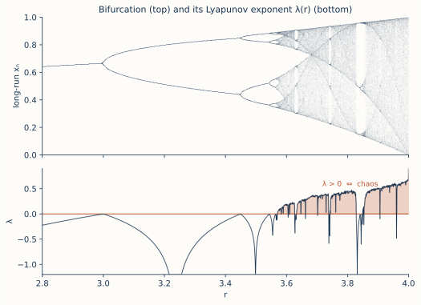

# ch14 — Lyapunov 指數：把敏感變成一個數

> **本章解決什麼問題**：ch03 把敏感依賴講成一個故事——兩條鄰近軌跡會分開、起始差千分之一最後天差地別。但「會分開」是定性的，工程腦聽完第一個問題一定是：**分多快？** 一秒？一千步？「指數放大」這四個字裡的那個率，到底是多少。本章就把那條故事壓成一個數：Lyapunov 指數 λ（李雅普諾夫指數）。它是 ch06 那個「每步誤差乘 f′(x*)」的全域對數平均——把線性化從不動點附近一個點，沿著整條混沌軌跡平均開來。λ>0 是混沌的數值定義（不是比喻、是判據），λ 的大小直接換算成「可預測視窗」有多寬。本章是 Part IV「為什麼測不準」的第一刀：先把「敏感」釘成一個可比較、可計算的量；ch15 拿它去解釋天氣為何只能測兩週，ch16 揭開這個 λ 是怎麼被「拉伸＋摺疊」造出來的。

```text
全書地圖：決定論許下的承諾，如何被一條遞迴式拆穿，又如何露出鐵一般的秩序

  Part I  決定論的承諾 ............ 一個被算盡的宇宙，與它的第一道裂縫
     ch01 拉普拉斯的承諾
     ch02 三體：第一個解不開的時鐘
     ch03 0.506 與一隻蝴蝶（勞侖次）
     ch04 三條被混為一談的線（決定／隨機／可測）
        |
        v
  Part II  一條遞迴式裡的宇宙 ..... 脊椎：xₙ₊₁ = r·xₙ·(1−xₙ)
     ch05 同一條遞迴式
     ch06 不動點與穩定
     ch07 倍週期分岔
     ch08 費根堡常數（鐵律登場）
     ch09 混沌登場與秩序的孤島
        |
        v
  Part III  混沌的肖像 ........... 亂，長什麼樣子
     ch10 相空間
     ch11 奇異吸子
     ch12 碎形
     ch13 碎維度
        |
        v
  Part IV  為什麼測不準 .......... 不可預測的機制與極限          ◄ 你在這裡
     ch14 Lyapunov 指數
     ch15 可預測的地平線
     ch16 拉伸與摺疊
        |
        v
  Part V  與混沌共處 ............ 分辨、駕馭、收束
     ch17 混沌不是雜訊
     ch18 駕馭混沌
     ch19 同一條遞迴式，現在你懂它七層
```

## 從你已知的出發

你對「指數成長」的直覺，比這本書任何一個讀者都該硬。因為你被它咬過。

複利你懂、Big-O 你懂——但真正讓你半夜起床的指數成長，是另一種。一個依賴掛了，重試流量灌進來；重試又觸發更多逾時、更多重試；每一輪放大一點點，固定一個倍數。你盯著 dashboard 看那條 QPS 曲線，前十秒幾乎是平的，你還在想「應該還好」，然後它一個轉彎直接捅穿天花板。**級聯故障（cascading failure）的恐怖，不在它最後有多大，在於它前半段看起來無害。** 你的直覺在線性的世界裡長大，遇到「每步乘一個固定倍數」就會被騙——你總是低估它，因為它的開頭太溫柔。

混沌裡的誤差放大，是同一隻野獸。

差別只在被放大的東西不是流量，是**你對初始狀態的無知**。ch03 那個故事：兩條軌跡起始差 0.001，前幾步幾乎重疊，你看著它們黏在一起會以為「測得夠準就沒事」——然後某一步它們突然就不是同一條了。那個「突然」是假的。它一直在以固定倍數分開，只是前半段差距小到你看不見。和 QPS 曲線一模一樣的騙局。

那麼問題就只剩一個，而且是個工程問題：**那個固定倍數是多少？**

- 級聯故障你會問：放大係數多少？每一輪重試流量乘以幾？乘 1.1 你還有幾分鐘喘息，乘 2 你只有幾秒。
- 你估容量會問：log-log 圖上那條 P99 隨負載的斜率多少？斜率決定了你還能撐多久。
- 你看到指數曲線，本能去抓**那個指數**——因為指數本身（不是當前值）才決定這東西多快失控。

Lyapunov 指數 λ 就是混沌系統的那個指數。它回答「鄰近軌跡每單位時間分開幾倍」這個唯一重要的問題。把它想成**故障放大速率**：λ 是「你的無知」這個誤差，每走一步被乘上的那個倍數的對數。λ 大，無知放大得快，可預測視窗窄；λ 小，放大得慢，視窗寬；λ 若是負的，誤差反而被乘掉、收斂回去——那不是混沌，是你那些乖乖收斂的穩定迴圈。

這一章做的事，本質上就是把你對級聯故障那套「先抓放大係數」的工程直覺，搬到時間軸上、量化成一個跨系統可比的數。你已經會了，只是沒給它名字。

## 先把問題說清楚：λ 在量什麼

別急著看公式。先回答「λ 在量什麼問題」，公式才有意義（無動機的定義是這本書的禁區）。

λ 量的是：**兩條起始任意接近的軌跡，它們之間的距離，隨時間以多快的指數率拉開。**

把它寫成一句承諾。設 t=0 時兩條軌跡相距 ε（一個極小的初始誤差），那麼經過時間 t 之後，它們的距離大約是：

```text
  ε(t)  ≈  ε · e^(λt)          ← 連續時間版（勞侖次系統那種）
          └┬┘  └──┬──┘
        初始誤差   放大因子：λ 決定它漲多快
```

這一行就是 Lyapunov 指數的定義骨架，整章都在拆它。讀它要讀對三件事：

1. **這是「平均而言」的指數成長。** 不是每一瞬間都剛好乘 e^(λΔt)；混沌軌跡有時跑得快、有時跑得慢（ch11 那隻蝴蝶在兩翼之間切換時，局部的放大率天差地別）。λ 是把這些瞬時放大率沿著整條長軌跡**平均**起來的「長期淨放大率」。所以 λ 是一個系統層級的常數，不是某一點的局部性質。
2. **ε 必須夠小。** e^(λt) 這個指數律只在「兩條軌跡還很近、近到系統的非線性還沒把它們扯到吸子的不同部位」時成立。一旦誤差漲到系統尺度（脊椎的 [0,1] 區間整個被占滿、蝴蝶的兩翼都到得了），距離就飽和了，不再指數漲——它能漲的空間用完了。所以 e^(λt) 描述的是**初期的、線性化還管用的那一段**。也正是那一段，決定了你「還能預測多久」。
3. **正負號就是全部。** λ>0：誤差放大，相鄰軌跡發散，這就是混沌（敏感依賴的數值定義）。λ<0：誤差被乘掉、收斂，軌跡黏在一起，這是穩定的不動點或週期軌。λ=0：臨界，誤差既不漲也不縮（多項式而非指數變化），正卡在秩序與混沌的邊界——這正是 ch08 那些倍週期分岔點所在。

```text
  λ < 0  ───────  誤差收斂        穩定（不動點、週期軌）   你那些乖迴圈
  λ = 0  ───────  誤差不漲不縮    臨界（分岔點、邊緣）     一觸即發
  λ > 0  ───────  誤差指數放大    混沌（敏感依賴）         測不準的根源
```

我認為這張表是整個混沌理論最划算的一筆濃縮：**一個系統是不是混沌，最後就濃縮成一個實數的正負號。** ch01 到 ch13 你看了那麼多形狀、那麼多故事——蝴蝶、分岔、碎形——而「混沌」這個性質本身，竟然可以用「λ>0」三個字符判定完。這是把 ch03「敏感依賴」那個定性的故事，徹底兌現成一個算得出來、跨系統能互相比較的量。

注意這裡有個你該停下來品的反直覺：λ 是個**全域**的、長期平均的量，可它判定的是**對初始那一點**的敏感。把「整條軌跡的長期行為」平均出來的一個數，反過來告訴你「最開始那一丁點誤差」會怎樣。長期統計與初始敏感，在 λ 這個數上接成一體——這是「敏感（蝴蝶）」與「鐵律（λ 是定值）」在本章碰頭的方式。

## 離散版：每一步乘 |f′|，λ 是它的對數平均

連續時間的 e^(λt) 給了直覺，但我們的脊椎是**離散**遞迴式 `xₙ₊₁ = r·xₙ·(1−xₙ)`，一步一步跳。離散版反而更好懂，因為它把「λ 是平均」這件事算給你看，而且它直接接上 ch06 你已經會的東西。

回憶 ch06 的線性化：在某一點 xₙ 附近，把誤差 δₙ 餵進遞迴式，下一步的誤差是

```text
  δₙ₊₁  ≈  f′(xₙ) · δₙ           ← ch06 的線性化：誤差每步乘上「當地斜率」
```

其中脊椎的導數是 `f′(x) = r(1 − 2x)`（ch06 算過）。這一行 ch06 只用在**不動點 x\*** 那一個點上——在 x\* 那裡斜率是定值 f′(x\*)=2−r，所以誤差每步穩定地乘同一個數，|2−r|<1 就收斂、就穩定。那是 λ 在「只有一個點」這種最簡單情況的樣子。

混沌沒有不動點可以停。軌跡在 [0,1] 上到處亂跑，每一步踩在不同的 xₙ 上，當地斜率 f′(xₙ) 每步都不一樣。但 ch06 那條線性化邏輯一字不改照樣成立：**每一步，誤差被乘上當地斜率的絕對值 |f′(xₙ)|。** 走 N 步，誤差就被連乘了 N 個不同的倍數：

```text
  δ_N      |δ_N|
  ───  ≈   ─────  =  |f′(x₀)| · |f′(x₁)| · |f′(x₂)| · ⋯ · |f′(x_{N−1})|
  δ₀       |δ₀|       └──────────── N 個「當地斜率」連乘 ────────────┘
```

連乘不好平均（有的點斜率 3、有的點斜率 0.1，乘起來忽大忽小）。工程腦看到連乘的本能反應是**取對數，把乘法變加法**——你看 log-log 圖、算幾何平均、處理機率連乘時都這麼幹。取對數：

```text
  ln(誤差放大 N 步的總倍數)  =  ln|f′(x₀)| + ln|f′(x₁)| + ⋯ + ln|f′(x_{N−1})|
                              └──────────── N 個對數相加 ────────────┘

  每步「平均」放大的對數  =  (這 N 個的總和) ÷ N      ← 算術平均
```

把這個「每步平均的對數放大率」在 N→∞ 取極限，就是 Lyapunov 指數：

```text
            1   N−1
  λ  =  lim ─   Σ   ln|f′(xₙ)|             ← 沿著真實軌跡，ln|斜率| 的長期平均
        N→∞ N  n=0
```

請你停在這條式子上想一件事，這是本章最該內化的一句：**λ 就是 ch06 那個「每步乘 f′」的全域對數平均。** ch06 在不動點一個點上談穩定（乘一個定值 f′(x\*)），ch14 把同一件事沿著整條混沌軌跡攤開、取對數、求平均。不動點穩定性分析（|f′(x\*)|<1）和混沌判據（λ>0），是**同一把尺**在兩種情況下的讀數：

- 不動點：只有一個 x\*，「平均」就是它自己，λ = ln|f′(x\*)|。|f′(x\*)|<1 ⇔ ln 是負的 ⇔ λ<0 ⇔ 穩定。完全自洽。
- 混沌：軌跡踩過無數個 x，λ 是這些 ln|f′| 的長期平均。平均若是正的，誤差長期淨放大，就是混沌。

換句話說，ch06 不是混沌分析的前置知識而已——它就是 λ 在最簡單情況的特例。你早就在算 Lyapunov 指數了，只是當時軌跡只有一個點，平均不必算。

> **嚴謹度標示**：這條極限式何時存在、為什麼幾乎對所有起點 x₀ 都收斂到同一個 λ（與起點無關），背後是遍歷理論（ergodic theory）與不變密度的事（見《馴服隨機》談長期統計分布）。本書取「工程師的嚴謹」：我給你「連乘→取對數→平均」這條每步都能口頭講出理由的算則，不證明極限的存在性與唯一性，嚴格版指向延伸閱讀。

## 把數算出來：r=4 時 λ = ln2

抽象式子講完，來算一個真數字。脊椎在 r=4（ch09 的全混沌、ch16 會證明它共軛於帳篷映射）時，Lyapunov 指數有一個乾淨到不可思議的閉式：

```text
  r = 4 時：   λ  =  ln 2  ≈  0.6931        （以 e 為底）
```

這個 ln2 不是巧合，它的來歷是 ch16 的高潮（r=4 共軛於「拉伸 2 倍再對摺」的帳篷映射，每步把區間拉長一倍，資訊每步暴露恰好一個 bit，所以 λ=ln2）。本章先把它當已知，只算它的後果——而後果，每一個都讓人坐直。

先把 λ=ln2 翻成白話。λ 是「每步誤差放大的對數倍數」，那麼每步實際放大幾倍？取指數還原回去：

```text
  每步放大倍數  =  e^λ  =  e^(ln 2)  =  2
```

**r=4 時，誤差每走一步，大約翻一倍。** 這句話我希望你記到睡著都背得出來，因為它把「指數敏感」這個嚇人的詞，降維成你最熟的東西——加倍。混沌在 r=4 的可怕，不過就是「每一步，你對狀態的無知翻一倍」。沒有更玄的了。

現在做本章的招牌計算：**起始誤差 10⁻⁹，幾步後誤差脹到 1（系統的整個尺度）？**

設你把初始狀態量到了 10⁻⁹ 的精度（小數點後九位，遠超浮點 double 的可靠位數）。誤差每步乘 2，走 n 步後是 10⁻⁹ × 2ⁿ。問它什麼時候到 1：

```text
  求 n：    10⁻⁹ · 2ⁿ  ≈  1
            2ⁿ  ≈  10⁹
            n · ln2  ≈  9 · ln10
            n  ≈  9 · ln10 / ln2  =  9 · (2.302585 / 0.693147)
            n  ≈  9 · 3.321928  =  29.897…
            n  ≈  30 步
```

驗算（不准跳步、不准抄記憶——自己乘一遍量級）：

```text
  2³⁰  =  1,073,741,824  ≈  1.0737 × 10⁹       ← 剛好越過 10⁹
  所以  10⁻⁹ × 2³⁰  ≈  10⁻⁹ × 1.07×10⁹  ≈  1.07     ← 確實脹到 ~1，三十步整
```

**三十步。** 把這個數字含在嘴裡品一下它有多荒謬。你把初始狀態量到十億分之一——這是工程上近乎奢侈的精度，比你能做到的任何真實量測都狠——而這份奢侈，只給你買到 **30 步** 的領先。第 31 步，你的預測和瞎猜一樣好。脊椎一步是一次迭代，在天氣那種尺度上「一步」可能是幾小時，於是 30 步就是「再準也只能看幾天」的數學內核（ch15 的事）。

這就是 ch03「多測幾位小數幫助有限」那句話的精確版，而且精確到讓你不舒服。我認為這是 Part IV 第一個真正的震撼點，值得單獨寫成一句能轉述給同事的話：**在 r=4 的混沌裡，每多測準一個 bit，只多買你一步預測；而你的精度是有限的位數，所以你的預測視窗是有限的步數——不是因為電腦不夠快，是因為這個數本身就這麼大。** 拉普拉斯惡魔要的「無限精度」，在這裡兌現成「無限位數」，而你一個都拿不到。

## Lyapunov 時間：把 λ 翻成「可預測視窗」的尺度

λ 的倒數，有個名字，叫 **Lyapunov 時間（Lyapunov time）**:

```text
  Lyapunov 時間  =  1 / λ
```

它是「誤差放大 e 倍（約 2.718 倍）所需的時間」——按標準慣例，Lyapunov 時間用 e 倍（一個 e-folding）定義。它是可預測視窗的**自然尺度單位**:把時間用 Lyapunov 時間來量，不同系統的「還能撐多久」就變得可以互比（太陽系的 Lyapunov 時間約五千萬年，天氣是幾天，脊椎是一步多——同一把尺，量盡天上地下）。

算脊椎 r=4 的 Lyapunov 時間：

```text
  1/λ  =  1/ln2  =  1/0.693147  ≈  1.4427  步
```

**約 1.443 步，誤差就脹大 e≈2.718 倍。** 把它和前面「每步翻一倍」對齊看，兩個說法在說同一件事的兩種刻度：用 2 倍當單位，每步一個單位（1 步翻倍）;用 e 倍當單位，每 1.443 步一個單位。e 倍和 2 倍差在 ln2/ln2... 其實就差在你用哪個底數數翻倍：

```text
  每步放大 2 倍    ⟺   1 個「倍增時間」 = 1 步        （2-folding，每步暴露 1 bit）
  每 1.443 步放大 e 倍 ⟺ 1 個「Lyapunov 時間」= 1/ln2 步  （e-folding，慣例）
```

兩者只是換底數。教科書講 Lyapunov 時間慣用 e（數學乾淨）；講混沌系統的「資訊損失」愛用 2(每翻倍丟一個 bit,符合工程腦);你之後讀文獻會兩種都撞見，知道它們是同一個東西、只差 ln2 這個換算因子就不會慌。本書脊椎統一記：**r=4,λ=ln2,Lyapunov 時間 1/ln2≈1.443 步，每步翻倍。** 三個說法，一回事。

Lyapunov 時間給了你一把「可預測地平線」的尺（ch15 把它落到天氣）:你能預測的步數，大致是「初始誤差要放大幾個 e 倍才到系統尺度」乘上 Lyapunov 時間。寫成式子（ch15 會細談）:

```text
  可預測地平線  T  ≈  (1/λ) · ln(1/ε)
                     └─┬─┘   └──┬──┘
              Lyapunov 時間   要放大幾個 e 倍：取決於你的初始精度 ε
```

讀這條式子有個**極其反直覺**的地方，本章必須在你直覺崩壞前先點破它——這正是下一節整節要對付的陷阱：你的初始精度 ε 是被**對數**包著的。對數壓扁一切。這意味著「把精度做好」對「多買預測時間」的幫助，小得你不敢相信。把這件事算清楚，是本章紙上推演的主菜（推演 1）。

## 多維：一組 Lyapunov 指數，最大的那個說了算

脊椎是一維的（狀態只有一個數 x）,所以只有一個 λ,故事乾淨。但勞侖次系統是三維的（x、y、z 三個量，見 ch10/ch11）,它有**一組**Lyapunov 指數，每個維度方向一個。

直覺是這樣：在三維相空間裡放一顆極小的球（代表你對初始狀態的不確定）,讓它隨系統演化。它不會還是個球——它會被拉成一個橢球：某些方向被拉長（誤差在那個方向放大）、某些方向被壓扁（誤差在那個方向收斂）。每個主軸方向的指數伸縮率，就是那個方向的 Lyapunov 指數。三維就有三個，排成一張**Lyapunov 譜（spectrum）**。勞侖次系統（σ=10、ρ=28、β=8/3）的譜大約是：

```text
  λ₁ ≈ +0.906   ← 有一個方向在拉伸（這就是混沌的來源）   ⚠ 數值見 landscape
  λ₂ ≈  0       ← 沿著軌跡前進的方向，不漲不縮（總是有一個 0）
  λ₃ ≈ −14.572  ← 有方向被狠狠壓扁（軌跡被吸進吸子、體積收縮）
```

判定混沌只看一件事：**最大的那個 Lyapunov 指數（λ₁,叫 maximal/largest Lyapunov exponent,常記 MLE）是不是正的。** 勞侖次的 λ₁≈+0.906>0,所以它混沌。為什麼只看最大的？因為只要**有任何一個方向在拉伸**,你那顆不確定的小球就會在那個方向被指數拉長，你的無知就沿那個方向爆開——其他方向再怎麼收斂也救不回來。一個正的方向，就毀掉整個預測。這跟你工程上的直覺一致：系統有一百個指標都穩，只要**一個**指標在指數惡化，你的服務就完了；那個最壞的指標決定命運，不是平均。

兩個值得記的副產品：

- **永遠有一個 λ=0（連續系統）。** 沿著軌跡前進的方向，兩個前後腳的點不會彼此拉開或靠近（它們就在同一條軌跡上）,所以那個方向既不發散也不收斂，指數恰好是 0。看到譜裡有個 0 別緊張，那是「時間流向」本身，不是臨界。
- **多維與 ch06 的接點，是線性化的升級。** ch06 一維線性化是「乘一個斜率 f′」；多維就是「乘一個矩陣」——雅可比矩陣(Jacobian),它把各方向的伸縮一次說完。各方向的 Lyapunov 指數，本質是這個矩陣沿軌跡長期乘積的「特徵伸縮率」的對數(導數＝瞬時斜率的多維版見《馴服無限》談微分；矩陣怎麼把各方向拉伸壓縮、特徵值如何讀出伸縮率，見《矩陣是動詞》談特徵值)。一維的「斜率」升成多維的「矩陣特徵值」，線性化這把尺一路通到底。

本書脊椎只需要一維的單一個 λ,多維譜這節給你一個「之後讀勞侖次數值不會誤讀」的框架就夠；細節（Kaplan–Yorke 維度怎麼從譜算出 ch13 那個 ≈2.06、譜的數值方法）指向延伸閱讀。

## 一張圖看完整個脊椎的 λ

把脊椎在每一個 r 值的 Lyapunov 指數都算出來、畫成一條 λ 對 r 的曲線，疊在 ch07 那張分岔圖下面，你會看到本章最該記住的一張對齊圖：



讀這張圖只看一件事：**λ 曲線在哪裡浮出零線(λ>0),分岔圖在哪裡進入混沌帶——兩者精準對齊。** 細看它怎麼動，把全書前十三章一次接起來：

```text
  r 區間            λ 的行為                對應前面哪一章
  ──────────────    ────────────────────    ──────────────────────────
  1 < r < 3         λ < 0（穩定不動點）     ch06：|f′(x*)|<1 穩定
  r = 3, 3.4495…    λ 觸到 0（臨界）        ch07/ch08：每個倍週期分岔點
  r∞ ≈ 3.56995 後   λ 大多 > 0（混沌帶）    ch09：混沌登場
  period-3 窗口附近  λ 俯衝回負（< 0）       ch09：混沌帶裡的秩序孤島
  r = 4             λ = ln2 ≈ 0.6931（最高）ch14 本章：每步翻倍
```

我認為這張圖是 ch06 到 ch14 的總對帳：Part II 你看「秩序如何一步步崩成混沌」是看分岔圖的**形狀**;現在 λ 把同一段旅程畫成一條**有正負號的曲線**——穩定區它在零線下、過 r∞ 它浮上來、period-3 窗口它又潛回去。混沌帶裡那幾道「λ 突然插回負值」的縫，正是 ch09 那些 period-3 之類的週期窗口：秩序的孤島，在 λ 上現形為「λ 短暫變負」的幾道裂口。**「亂裡有秩序」這句話，在 λ 曲線上是看得見的——混沌帶不是一片實心的正，是被秩序窗口戳出許多負值縫隙的正。** 同一張圖，把「敏感（λ>0 的混沌帶）」和「鐵律（窗口處 λ 精準歸負，跨系統都這結構）」並排畫在一起，這是中央張力最濃縮的一幅視覺。

## 直覺的陷阱

Lyapunov 指數是個數，數最容易被誤讀。這節釘死四個會把你帶溝裡的錯誤直覺，每一個都附「怎麼自我察覺你其實沒懂」。

| 錯誤直覺 | 哪一步把你帶溝裡 | 正確版 |
|---|---|---|
| 「λ 是某一刻的瞬時敏感度」 | 你去算「在這個 x 點的 f′」就當成 λ,以為每一點有自己的 λ | λ 是**長期平均**。單點的 ln\|f′\| 只是被平均的一項；混沌軌跡上瞬時放大率忽大忽小，λ 是它們沿整條軌跡的平均淨率。問自己：我講的是某一點還是整條軌跡？講成「某一點的 λ」就是沒懂。 |
| 「精度做高一點就能大幅延長預測」 | 你以為精度與預測時間成正比：準十倍就能多預測十倍久 | 預測時間靠 **ln(1/ε)**——對數，不是線性。精度×10(多一個數量級),只多買 **固定一段** 時間(1/λ)·ln10。對數把你的努力壓扁。徵兆：你說出「再多測幾位就能算更久」這種線性句子，你就還困在錯的心智模型裡。 |
| 「λ>0 代表完全無法預測、立刻就亂」 | 把「長期不可測」誤聽成「短期也測不準」 | λ>0 只說誤差**指數**放大，**短期完全可以預測**——那 30 步你算得準準的。λ>0 殺的是**長期**,而且殺得「有節奏」（固定速率）。徵兆：你把混沌講成「一開始就一團亂」，而不是「一段乾淨的可預測期之後突然失準」。 |
| 「λ 是某個外加的、玄學的混沌量」 | 把 λ 當成混沌特有的新魔法，跟 ch06 的穩定性分析無關 | λ 就是 ch06「每步乘 f′」的全域對數平均，跟你判不動點穩定用的是**同一把尺**（λ<0 穩定、λ>0 混沌）。徵兆：你能講 ch06 的 \|f′(x\*)\|<1 卻講不出它跟 λ 是同一件事，代表你把兩者當兩個東西記，沒看穿是一個。 |

還有一個跨越 Part IV 的大陷阱，先在這裡埋，ch15 收：**「測不準」很多人下意識歸因於「電腦不夠快／模型不夠好」。** λ 是個數值的反證——可預測視窗的長度由 λ 和你的精度位數決定，**和算力無關**。算力無限，只要初始精度有限（它永遠有限）,λ>0 就保證視窗有限。這不是工程問題，是數學事實。把這個分清楚，是本書中央張力（敏感 vs 鐵律）在 Part IV 的核心：測不準本身，服從一條跟算力無關的鐵律。

## 紙上推演

以下三題，純紙筆，不要碰任何程式。每題先自己做完再看解答。

### 推演 1 — 對數報酬的耳光 ★★ **[15 分鐘]**

r=4（λ=ln2,每步翻倍）。你原本把初始狀態量到 10⁻⁶ 的精度，可以預測約 20 步。現在你咬牙把精度提升到 10⁻⁹（整整準了一千倍，多三個數量級）。

(a) 新的可預測步數約是多少？
(b) 你「多買」了幾步？
(c) 用一句話說清楚：為什麼準了一千倍，卻只多買這麼一點？

先別往下看，自己把(b)算出來再說。

### 推演 2 — 從斜率到 λ:不動點是 λ 的特例 ★★ **[12 分鐘]**

ch06 你算過：r=2.5 時，非零不動點 x\*=1−1/2.5=0.6,斜率 f′(x\*)=2−r=−0.5,所以 \|f′(x\*)\|=0.5<1,穩定。

(a) 把 r=2.5 這個**穩定**情況的 Lyapunov 指數算出來(提示：軌跡最後停在 x\* 不動，長期平均的 ln\|f′\| 就是 ln\|f′(x\*)\|)。
(b) 它是正是負？跟「λ<0 ⇔ 穩定」對得上嗎？
(c) 用這題，把「ch06 的穩定性分析」和「ch14 的 λ」是同一把尺這句話，講給自己聽一遍。

### 推演 3 — 翻譯題：把工程現象說成 λ 的語言 ★ **[10 分鐘]**

下面三個你系統裡的現象，各判斷它對應 λ>0、λ=0、還是 λ<0,並用一句話說理由：

(a) 一個帶阻尼的控制迴圈，任何擾動都會被慢慢吸收，系統回到設定值。
(b) 一個增益調得剛好在臨界邊緣的迴圈，擾動既不放大也不消失，就那樣懸著。
(c) 一個重試風暴：每一輪重試流量乘以一個固定的 >1 倍數，直到打爆。

附加：對(c),如果「每輪乘 2」，它的「Lyapunov 時間」（用步數算）是多少？

---

### 推演解答

**推演 1（對數報酬的耳光）**

(a) 用 T≈(1/λ)·ln(1/ε),λ=ln2。精度 10⁻⁹:

```text
  T  ≈  (1/ln2) · ln(1/10⁻⁹)  =  (1/ln2) · ln(10⁹)  =  (1/ln2) · 9·ln10
     =  1.4427 · 9 · 2.302585  =  1.4427 · 20.723  ≈  29.9  →  約 30 步
```

和本章 worked example 對上（10⁻⁹ → 30 步）。原本 10⁻⁶ 的約 20 步，你也可以同法驗：(1/ln2)·ln(10⁶)=1.4427·6·2.302585≈19.9→約 20 步。✓

(b) **多買 30−20 = 10 步。** 準了一千倍，只多買 10 步。

直接看「多三個數量級多買幾步」更透：

```text
  多買的步數  =  (1/λ)·[ln(1/10⁻⁹) − ln(1/10⁻⁶)]  =  (1/λ)·ln(10⁻⁶/10⁻⁹)
              =  (1/ln2)·ln(10³)  =  log₂(10³)  =  log₂(1000)
              =  3/log₁₀(2)  =  3/0.30103  ≈  9.97  →  約 10 步
```

(c) **因為每步只放大 2 倍，而「多測準一千倍」就是「多撐住 log₂(1000)≈10 次翻倍」——10 步，翻倍 10 次，2¹⁰≈1024≈1000,剛好把你多出的一千倍精度吃光。** 精度在指數裡，被對數壓成了加法：你的精度乘以 1000,只給預測時間**加上** log₂(1000)≈10 步。乘變加，這就是對數報酬。

常見錯路：有人算成「準一千倍→多預測一千倍久→多 20000 步」。那是把對數關係當成線性。錯誤的根在沒看見 ε 被 ln 包著。記住這句能轉述的話：**在混沌裡，精度買時間，是按位數零售的——每多買一個 bit(一次翻倍),只多一步；你的精度是有限位數，所以視窗是有限步數，而且加位數的邊際報酬恆定地低。**

**推演 2（不動點是 λ 的特例）**

(a) r=2.5 時軌跡收斂到 x\*=0.6 並停在那。長期平均的 ln\|f′\|,因為最後每一步都踩在 x\*,就是

```text
  λ  =  ln|f′(x*)|  =  ln|2 − 2.5|  =  ln|−0.5|  =  ln(0.5)  =  −ln2  ≈  −0.6931
```

(b) **λ≈−0.6931,是負的。** 完全對上「λ<0 ⇔ 穩定」。而且這個負號的量值恰好是 ln2——和 r=4 那個 +ln2 對稱得漂亮：r=2.5 誤差每步乘 0.5(每步砍半、ln 是 −ln2),r=4 誤差每步乘 2（每步翻倍、ln 是 +ln2）。一個收斂、一個發散，同一把尺的兩端。

(c) 串起來講：ch06 判穩定看「\|f′(x\*)\|<1 嗎」，等價於「ln\|f′(x\*)\|<0 嗎」，而在不動點上 λ 就**等於** ln\|f′(x\*)\|。所以 ch06 的穩定判據，字面上就是「λ<0 嗎」。混沌情況唯一的不同，是軌跡不停在一點，得把 ln\|f′\| 沿整條軌跡平均——但尺沒換，只是平均的項變多了。**穩定性分析和 Lyapunov 指數不是兩件事，是同一把尺在「一個點」和「一整條軌跡」上的兩次讀數。**

**推演 3（翻譯題）**

(a) **λ<0。** 擾動被吸收、收斂回設定值，誤差每輪縮小——這正是 λ<0（穩定）的定義。對應 ch06 的穩定不動點。
(b) **λ=0。** 臨界，擾動既不漲也不縮，懸在邊緣——對應分岔點那種臨界狀態（增益再加一點就翻到 λ>0 開始震盪/混沌）。
(c) **λ>0。** 流量每輪乘固定 >1 倍數=誤差（這裡是「過載」）指數放大，正是 λ>0。級聯故障就是工程版的「正 Lyapunov 指數」現象。

附加：每輪乘 2,等於 r=4 的脊椎——「Lyapunov 時間」（放大 e 倍的步數）就是 1/ln2≈**1.443 步**;若你習慣用「翻倍時間」，那就是**每 1 輪翻一倍**。這就是為什麼級聯故障的前幾秒看著無害、後幾秒直接捅穿天花板：它的 Lyapunov 時間只有一兩步，你的反應視窗短到殘忍。把你的告警閾值和這個倍增速率對齊，是這題給你的工程外帶。

## 自我檢核

口頭自答，講得清楚才算過。優先答「為什麼」。

1. λ 在量「什麼問題」？用一句不含公式的話講，然後才給 ε·e^(λt) 這個形狀。
2. 為什麼 λ 是「長期平均」而不是某一點的瞬時量？混沌軌跡上每一步的當地放大率不同，λ 怎麼把它們收成一個數？（關鍵字：連乘→取對數→平均。）
3. 講清楚 ch06 的「\|f′(x\*)\|<1 ⇔ 穩定」和 ch14 的「λ<0 ⇔ 穩定」是**同一把尺**——它們在哪個情況下字面相等？
4. r=4 時 λ=ln2 翻成白話是「每步誤差約翻倍」。據此，初始誤差 10⁻⁹ 約幾步脹到 1?口頭把 30 這個數推出來（用 2³⁰≈10⁹）。
5. 為什麼把初始精度從 10⁻⁶ 提到 10⁻⁹(準一千倍),只多買約 10 步預測，而不是多很多？「對數報酬」這四個字你能講透嗎？
6. Lyapunov 時間 1/λ 是什麼的尺度？r=4 時它約 1.443 步，這個數跟「每步翻倍」是同一件事的哪兩種刻度？
7. 多維系統有一組 Lyapunov 指數，為什麼**只看最大那個**就能判混沌？為什麼連續系統的譜裡總有一個 0?
8. (中央張力)λ 同時是「對初始那一點的敏感（蝴蝶）」和「整條軌跡的長期定值（鐵律）」——這兩者怎麼在同一個數上共存？講給另一個工程師聽。

## 延伸閱讀

- **Stanford Encyclopedia of Philosophy, "Chaos"(Global Lyapunov Exponents 節)**——把「λ>0 作為混沌的數值判據」與「決定論≠可預測」的哲學含義講得最清楚的權威來源；讀它如何用全域 Lyapunov 指數定義敏感依賴。https://plato.stanford.edu/entries/chaos/(2026-06 可達)
- **Wikipedia, "Lyapunov time"**——Lyapunov 時間=1/λ 的定義、e-folding 慣例、以及「2-fold＝丟一個 bit、10-fold＝丟一位精度」三種換算；讀它列的太陽系（約五千萬年）vs 天氣（幾天）對照，體會這把尺如何跨尺度通用。https://en.wikipedia.org/wiki/Lyapunov_time
- **Wikipedia, "Logistic map"(Lyapunov exponent 段)**——脊椎在各 r 值的 λ 曲線（就是本章那張插圖的數學）,含 r=4 時 λ=ln2 的推導入口；讀它如何把 λ 對 r 畫出來、λ>0 的區帶如何與混沌帶對齊。https://en.wikipedia.org/wiki/Logistic_map
- **Strogatz,《Nonlinear Dynamics and Chaos》第 10 章**——把一維映射的 Lyapunov 指數從「連乘→取對數→平均」一路推到 λ=lim(1/N)Σln\|f′\| 的標準教材；若你想看本章那條極限式的嚴格版與更多例子，讀這章。（經典教材，廣泛可得）
- **Sprott, "Lyapunov Exponent" 線上資源**——勞侖次系統那組 Lyapunov 譜(≈+0.906, 0, −14.572)的數值出處與計算方法；想知道多維譜怎麼算、本章那三個數從哪來，讀它。https://sprott.physics.wisc.edu/chaos/lorenzle.htm

> **承上啟下**:你現在有了一把把「敏感」量成數的尺——λ>0 是混沌的判據，λ 的大小是可預測視窗的速率。下一章(ch15)拿這把尺去量真實世界最有名的混沌系統：大氣。我們會看到「天氣只能測兩週」不是工程的暫時無能，而是 λ 和初始精度算出來的時間牆——並把本章埋下的「對數報酬」與「跟算力無關」兩個釘子，在天氣上敲到底。再往後(ch16),我們回頭問：r=4 那個 λ=ln2,到底是什麼機制把它造出來的？答案是拉伸與摺疊——混沌的製造機。
