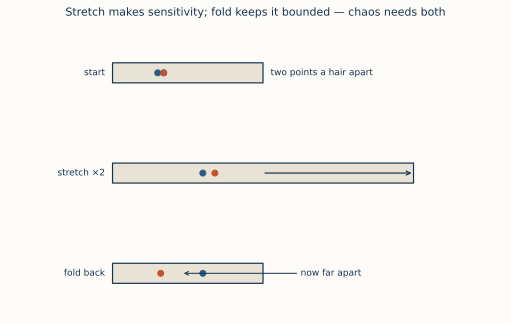

# ch16 — 拉伸與摺疊：混沌的製造機

> **本章解決什麼問題**：到這裡你已經會描述混沌、會量化混沌——ch14 給了你 Lyapunov 指數 λ，把「敏感」變成一個數；ch11 給了你奇異吸子（strange attractor），那隻同時做到有界、永不重複、永不自交三件怪事的蝴蝶。但你還欠一個「為什麼」：**這些性質到底是怎麼被製造出來的？** λ>0 不是憑空冒出來的、蝴蝶的三件怪事也不是巧合。這一章揭開引擎蓋，給你混沌唯一的、兩個動作的製造機制——**拉伸（stretch）＋摺疊（fold）**。拉伸把鄰近點分開，這就是 SDIC、就是 λ>0 的來源；摺疊把被拉長的帶子摺回有限區域，這就是「有界」與「永不重複」能共存的原因。缺一個都做不出混沌：只拉不摺會飛出去（發散，不是混沌），只摺不拉會收回來（穩定，也不是混沌）。本章用揉麵團、太妃糖、洗牌給你身體直覺，用史梅爾（Stephen Smale）在里約海灘上想出的馬蹄映射（horseshoe map）給你幾何骨架，再用帳篷映射（tent map）的二進位迭代給你 λ=ln2 的精確來源——你會親眼看到「每步左移一位＝每步暴露一個 bit＝誤差每步翻倍」這三件事是同一件事。這章是 ch11 那句「為什麼三者能共存」的兌現，也是脊椎遞迴式在 r=4 時的引擎拆解。馬蹄的符號動力學嚴格建構本章不碰，只給幾何直覺、指向延伸閱讀。

## 從你已知的出發

先講一個你每天都在用、卻可能沒這樣拆解過的東西：**密碼學雜湊函數（cryptographic hash）的雪崩效應（avalanche effect）。**

你改了輸入的一個 bit，重新算 SHA-256，整個 256-bit 的輸出大約有一半的 bit 翻面——這就是雪崩。你信任它：它讓相鄰的 key 在 hash 表裡散得開、讓你沒法從輸出反推輸入、讓 commit 內容差一個字元 SHA 就完全變樣。

現在問一個你可能沒想過的問題：**雪崩是怎麼做到的？** hash 函數內部到底發生了什麼，才能把「一個 bit 的差異」放大成「一半 bit 的差異」？翻開任何一個區塊密碼（block cipher）或 hash 的內部結構，你會看到兩種動作反覆交替：

- **擴散（diffusion）／混合（mixing）**——把每一個輸入 bit 的影響「攤開」到所有輸出位置；一個 bit 的擾動經過幾輪會波及越來越多位置。這是**放大差異**的動作。
- **取模／截斷／固定寬度（modular reduction, truncation）**——不管中間算出多大的數，最後永遠壓回固定的 256 bit，你永遠跑不出那 2²⁵⁶ 個值。這是**把結果關回有限範圍**的動作。

把這兩個動作的名字換掉，你就懂了這一整章：

```text
  擴散／混合（一個 bit 的差異 → 攤開到全部）   ＝  拉伸（stretch）
  取模／截斷（永遠壓回固定 256 bit 的有限空間）  ＝  摺疊（fold）
```

一個好的 hash，本質上就是把輸入空間反覆地**拉伸**（讓相鄰輸入分開）再**摺疊**（壓回固定長度）很多輪。拉伸製造敏感（雪崩），摺疊保持有界（固定寬度）。**這正是混沌的製造機制，一字不差。** 混沌系統不是「壞掉的」確定性系統，它是一台和你的 hash 函數同構的機器——只不過它在連續的相空間裡轉，而 hash 在離散的 bit 空間裡轉。

你還認得別的版本：

- **洗牌（shuffle）**：鴿尾交錯（riffle，把兩半交織）＝拉伸把相鄰的牌拆開，切牌（分兩半）＝摺疊。洗夠多次原本相鄰的兩張牌散到天南地北，而牌總數永遠是 52——洗牌不會把牌洗丟。Bayer 與 Diaconis 那個「七次鴿尾洗牌才夠亂」，量的就是「要拉伸-摺疊幾輪，初始順序的資訊才被攪到測不出來」。
- **一致性雜湊（consistent hashing）**：用 hash 把 key 打散（拉伸：相鄰的 key 散到環的各處）再 mod 進固定大小的環（摺疊：壓回有限的 hash ring）。打散是為了「相鄰的 key 不要落在同一個 node」，那正是拉伸在做的事。

所以這一章不是要教你一個陌生的新東西，而是要告訴你：**你早就在用拉伸-摺疊製造「假亂」了。** 混沌只是把同一台機器搬到連續的相空間裡，讓它跑出 ch11 那隻蝴蝶。下面把這台機器拆開看。

## 兩個動作，缺一不可

先把核心命題立清楚，這是全章的骨架，請你慢讀：

> **混沌＝拉伸＋摺疊，兩個動作反覆交替，缺一個都做不出混沌。**

逐字拆：

**拉伸（stretch）**——把一團鄰近的點沿某個方向拉長。原本擠在一起、差距 ε 的兩個點，拉伸之後差距變成 2ε、4ε、8ε……。這個動作做三件事：

- 製造 **SDIC（敏感依賴於初始條件）**：本來靠得很近的兩個起點，被拉伸越拉越開。這就是蝴蝶效應的引擎（ch03）。
- 製造 **λ>0**：每步把距離乘上一個大於 1 的倍數，長期平均下來就是一個正的 Lyapunov 指數（ch14）。拉伸倍率是 2，λ 就趨近 ln2。
- 暴露資訊：拉伸把「藏在小數點後很深的位」放大到看得見的尺度——這是 λ=ln2 那個「每步暴露一個 bit」說法的根。

只有拉伸，不夠。一團點被無止盡地拉長，會怎樣？**飛出去。** 距離 ε→2ε→4ε→…→∞，兩個點越離越遠，跑出任何有限範圍。這不是混沌，這是發散（divergence）——是你 retry storm 失控、是 autoscaler 增益太高炸開、是數值積分不穩定。發散的系統不可預測，但它「不可預測」的方式很無聊：它就是一路衝向無窮大。混沌的不可預測有界、有結構、有形狀，發散沒有。所以我們需要第二個動作。

**摺疊（fold）**——把被拉長的帶子摺回原來的有限區域。一條被拉成兩倍長的帶子，對摺一下，長度回到原來，但寬度疊了兩層。這個動作做三件事：

- 保持**有界（bounded）**：不管拉伸把帶子拉多長，摺疊都把它塞回原來的盒子。系統永遠跑不出有限的相空間——這就是 ch11 那隻蝴蝶「絕不飛出兩片翅膀」的原因。
- 製造**永不重複（aperiodic）**：摺疊把帶子的不同部分疊在一起，讓軌跡可以在有限空間裡無限地繞而不重複（下面細講為什麼）。
- 製造**混合（mixing）**：摺疊把「本來分開的區域」疊到一起，於是長期下來，任何一小團起點都會被攪散、抹遍整個吸子（這是 ch11 不變密度、遍歷性的機制根源，機率語言見《馴服隨機》ch01）。

只有摺疊，不拉伸，又會怎樣？**收斂或週期。** 你把帶子摺來摺去但從不拉長，點之間的距離不會放大，SDIC 不會發生，λ≤0，系統要嘛收到不動點、要嘛繞個週期圈。乖，但不混沌。

把兩個動作的「單獨失敗」並排，這是本章最該記住的一張表：

```text
  動作組合          會發生什麼            是不是混沌
  ─────────────────────────────────────────────────────
  只拉伸，不摺疊     距離 ε→2ε→4ε→…→∞      ✗ 發散（飛出有界區）
                    軌跡衝向無窮大            λ>0 但無界、無形狀
  ─────────────────────────────────────────────────────
  只摺疊，不拉伸     距離不放大              ✗ 收斂/週期
                    點被壓回但不分開          λ≤0，不敏感
  ─────────────────────────────────────────────────────
  拉伸 ＋ 摺疊      距離放大（拉）            ✓ 混沌！
                    又被關回有限區（摺）        λ>0 且有界，有奇異吸子
  ─────────────────────────────────────────────────────
```

**混沌坐落在「拉伸製造的發散」與「摺疊製造的有界」之間那條極窄的縫上。** 兩股力量誰也壓不死誰：拉伸要把點推到無窮遠，摺疊把它們抓回來，於是點被迫在有限空間裡永遠地、不重複地被攪動。這個「永遠被攪動但出不去」的狀態，就是 ch11 那隻蝴蝶，就是 λ>0 又有界，就是混沌。

回頭看你的 hash：擴散（拉伸）若沒有固定寬度（摺疊），輸出會無限長，沒意義；固定寬度若沒有擴散，改一個 bit 輸出只變一個 bit，沒有雪崩。兩個都要。**一個好的 hash 和一個混沌系統，是同一台機器的離散版與連續版。**

## 揉麵團：把直覺裝進手裡

抽象講完了，現在把它放進你的手。最好的直覺載具是**揉麵團**——或者，如果你做過糖，**拉太妃糖（taffy pulling）**。這個比喻不是裝飾，它字面上就是混沌的機制，連數學家研究太妃糖機都是用混沌動力系統的工具（Thiffeault 那批「太妃糖機的數學」論文，見延伸閱讀）。

想像你在揉一塊麵團，而你在麵團裡滴了**兩滴緊挨著的食用色素**——一滴紅、一滴藍，中間只隔一公釐。你開始揉，動作就兩個，反覆做：

```text
  揉麵團的一個循環：
    ① 拉伸 ── 把麵團往兩側拉長成兩倍（紅藍兩滴之間的距離也被拉成兩倍）
    ② 摺疊 ── 把拉長的麵團對摺，塞回原來的大小（麵團體積不變）
  重複 ①②①②①②……
```

跟著那兩滴色素看：

**它們會散開，而且是指數地散開。** 第一次拉伸，紅藍相距 1mm→2mm；摺疊不改變這個局部距離（只要它們還在同一摺裡）。第二次，2mm→4mm。第三次，4mm→8mm。十次之後，本來相距 1mm 的兩滴，如果只算拉伸，相距 2¹⁰≈1000mm——但麵團根本沒那麼大！這就是摺疊的作用：它把超出麵團尺寸的部分摺回來，於是紅藍兩點雖然「在麵團的內在座標上」越離越遠，卻始終被關在這團有限的麵團裡。**散開是拉伸幹的，關住是摺疊幹的——同一個揉麵動作，同時製造了 SDIC 和有界。** 這就是 ch11 那張圖「為什麼有界與永不重複能共存」的手感版答案：它們不是勉強共存，它們是同一個動作的兩面。

再看一件更微妙、也更重要的事：**那兩滴色素散開之後，永遠回不到原來的相對位置。** 你可以一直揉一直揉，麵團會變成紅藍交織的無數層細紋（就是大理石蛋糕、千層酥那種紋路），但你**永遠**不會揉出「紅藍又乖乖回到相距 1mm 的兩個圓點」的狀態。為什麼？因為每一次摺疊都把麵團的層數加倍——1 層→2 層→4 層→8 層→…→2ⁿ 層。揉 n 次，麵團裡有 2ⁿ 層紅藍細紋。要「回到原狀」，等於要這 2ⁿ 層神奇地對齊抵消回兩個圓點——而拉伸-摺疊這個動作沒有逆操作會自動做這件事（你揉麵團時不會「反揉」）。資訊被攤平、抹開到越來越多層裡，**攪散是不可逆的方向**。

這就是「永不重複」的機制：**軌跡不重複，是因為每一步都把狀態攤進更細的層裡，而層只會越來越多、越來越細，永遠不會自己疊回去。** 把這句話對回脊椎遞迴式：r=4 的 logistic map 每迭代一步，就是揉麵團揉一次——拉伸（把 [0,1] 拉開）、摺疊（把超出去的摺回 [0,1]）。你在 ch09 看到的「r=4 時落點填滿整個 [0,1]、永不週期」，內部發生的就是這個揉麵動作。

太妃糖機是同一件事的機械版：那兩三根來回穿插的桿子，功能就是反覆把糖膏拉長、對摺、再拉長、再對摺，把空氣攪進去、讓糖變得鬆軟均勻。糖師傅要的「均勻」，就是混沌要的「混合」——把任何一小團攪散、抹遍全體。**做糖的人和研究混沌的人，在拉同一條太妃糖。**

## 史梅爾的馬蹄：海灘上想出來的幾何骨架

揉麵團給了你手感，但它有點軟、有點難精確描述。1960 年左右，一個美國數學家在巴西里約熱內盧的海灘上，把這個「拉伸-摺疊」的動作削成了一個乾淨、可以精確分析的幾何物件——史梅爾的馬蹄映射（Smale's horseshoe map）。

先講那個軼事，因為它太好了（照 landscape 的安全敘述）。史蒂芬・史梅爾（Stephen Smale）當時是個博士後，在里約新成立的 IMPA（純粹與應用數學研究所）訪問。他的作息據他自述是：**上午在科帕卡巴納（Copacabana）海灘，下午到研究所。** 在海灘上——他自己 1998 年寫的回憶文章標題就叫〈在里約的海灘上找到一隻馬蹄〉（Finding a Horseshoe on the Beaches of Rio，刊於 *The Mathematical Intelligencer*）——他想出了馬蹄映射。

而且這裡有個和龐加萊（ch02）、勞侖次（ch03）如出一轍的轉折：**馬蹄是從一個錯誤裡長出來的。** 史梅爾本有個關於動力系統的猜想，以為對了；一封來自 MIT 的諾曼・列文森（Norman Levinson）的信指出了反例。在修正錯誤的過程中，他被逼著想清楚「拉伸-摺疊的系統到底長什麼樣」，於是有了馬蹄。混沌史上這個模式已經重複三次了：龐加萊改錯時發現同宿纏結、勞侖次的捨入「錯誤」放大成天氣測不準、史梅爾的猜想被推翻時想出馬蹄。**錯誤在這門學問裡反覆當產婆**——我覺得這不是巧合，混沌恰恰是「你以為會發生的事不發生」的學問，而錯誤正是「以為」與「實際」分岔的地方。

現在講馬蹄本身。它是一個把正方形映射回自己的動作，三步：

```text
  馬蹄映射的一個循環（把單位正方形 S 變回自己）：

  ① 拉伸 ── 把正方形沿一個方向壓扁、沿另一個方向拉長，
            變成一條又細又長的帶子（寬度減半、長度加倍）。
  ② 摺疊 ── 把這條長帶子彎成馬蹄形（像 U 字、像馬蹄鐵）。
  ③ 放回 ── 把這個馬蹄形蓋回原來的正方形 S 的位置上。

  圖示（側看一個循環）：

     原正方形            拉長的帶子           摺成馬蹄          蓋回正方形
     ┌─────────┐                           ╭────────╮         ┌─────────┐
     │         │   拉伸   ▭▭▭▭▭▭▭▭▭   摺疊  │        │  放回   │ ═══════ │
     │         │  ──────▶            ─────▶ │        │ ──────▶ │         │
     │         │         （細又長）            ╰────────╯         │ ═══════ │
     └─────────┘                                                └─────────┘
                                                              （兩條橫槓 = 馬蹄的
                                                               兩腳落回正方形）
```

關鍵在反覆做這個動作時會發生什麼。蓋回去後，馬蹄的兩隻腳橫躺在正方形裡，只覆蓋一部分、中間留空。你做一次，被蓋住的是兩條橫帶；做兩次，這兩條各自又被拉伸-摺疊成四條更細的橫帶；做 n 次，2ⁿ 條越來越細的橫帶。而那些「反覆做之後永遠留在正方形裡、不被甩出去」的點構成的集合——稱為**不變集（invariant set）**——是一個**碎形**：水平方向是一個康托集（Cantor set，ch12 那個「挖中間三分之一」的塵埃），垂直方向也是。

這隻馬蹄，就是 ch11 那隻蝴蝶吸子的**幾何骨架的純化版**。蝴蝶的「軌跡關在有限區域、無限不重複地摺進一個碎形」，在馬蹄裡被抽乾成最乾淨的形式：拉伸（製造敏感）、摺疊（製造有界與多層）、不變集是碎形（這就是奇異吸子「strange」的幾何來源）。史梅爾證明了：**任何一個系統，只要它的動力學裡藏著一個馬蹄，它就一定有混沌**（有 SDIC、有無窮多週期軌、有對符號序列的編碼）。馬蹄成了「這個系統是不是混沌」的一個可檢驗的幾何判據。

馬蹄怎麼把這些性質變成嚴格定理，靠的是**符號動力學（symbolic dynamics）**——把每條軌跡編碼成一串「這一步落在左帶還是右帶」的 0/1 序列，再證明每一種 0/1 序列都對應一條真實軌跡。這套建構**本章不展開**（大綱明定不碰）；你只要拿走幾何直覺：**拉伸-摺疊把軌跡編碼成一串可以任意指定的 bit，而能任意指定 bit，就是「初值的無窮小差異能造成任意大的後果」的精確含意。** 嚴格版見延伸閱讀的 Smale 原文與 plus.maths.org。

下一節就把這個「軌跡＝一串 bit」的直覺在帳篷映射上算到底——你會親手算出 λ=ln2 從哪裡來。

## 帳篷映射：把 λ=ln2 算到看見

馬蹄是二維的、漂亮但抽象。現在我把它壓成一維，壓成一個你能拿筆算的東西——**帳篷映射（tent map）**。它是拉伸-摺疊的最小模型，而且它和脊椎遞迴式在 r=4 時是**共軛（conjugate）**的——也就是說，r=4 的 logistic map 本質上就是帳篷映射換了個座標。算清楚帳篷，你就算清楚了 r=4 的混沌引擎。

帳篷映射長這樣，定義在 [0,1] 上：

```text
          ⎧  2x        當 0 ≤ x ≤ 1/2     ← 左半：乘 2（拉伸）
   T(x) = ⎨
          ⎩  2 − 2x    當 1/2 < x ≤ 1     ← 右半：乘 2 後反射（拉伸 ＋ 摺疊）

   圖形像一頂帳篷（所以叫 tent）：

      1 │        ╱╲
        │      ╱    ╲
        │    ╱        ╲
        │  ╱            ╲
      0 └────────────────
        0       1/2       1
```

看懂這個動作為什麼是「拉伸＋摺疊」：

- **拉伸**：不管你在哪半邊，斜率的大小都是 **2**——T 把任何一小段區間都拉成兩倍長。兩個相距 ε 的點，一步之後相距 2ε。這就是拉伸，倍率恰好 2。
- **摺疊**：如果只有「乘 2」，[0,1] 會被拉成 [0,2]，跑出去了。帳篷的右半 `2−2x` 就是摺疊：它把本來會落到 [1,2] 的部分，反射摺回 [0,1]。`2x` 把 [0,1] 拉成 [0,2],`2−2x` 把超過 1 的那一半對摺回來——拉成兩倍長的帶子，在中點對摺，蓋回 [0,1]。**這就是揉麵團的一維版、馬蹄的一維版。**

現在來算。手算帳篷映射最漂亮的方式，是把起點寫成**二進位小數**，因為在二進位下，「乘 2」就是「左移一位」，乾淨利落。

### worked example：迭代 x₀ = 0.101101（二進位）

先把二進位的拉伸-摺疊規則講清楚（這個規則我用兩種方式都算過、互相對過，下面解答區會驗算）：

```text
  把 x 寫成二進位 x = 0.b₁b₂b₃b₄…，帳篷映射 T(x) 的二進位是：

    若 b₁ = 0（即 x ≤ 1/2，在帳篷左半）：
        T(x) = 0.b₂b₃b₄…        ← 純左移一位（丟掉 b₁=0）。這是「拉伸」。

    若 b₁ = 1（即 x > 1/2，在帳篷右半）：
        T(x) = 0.b̄₂b̄₃b̄₄…       ← 左移一位，且把後面每個 bit 翻面（0↔1）。
                                    左移 = 拉伸；翻面 = 摺疊（那個反射 2−2x）。
```

看到了嗎：**「左移一位」是拉伸，「翻面」是摺疊。** 帳篷映射在二進位下，把「拉伸＋摺疊」這兩個動作，變成「移位＋條件翻轉」這兩個 bit 操作——和你的 hash 內部在做的事，血緣清清楚楚。

迭代 x₀ = 0.101101 看看（這是個有限二進位，等於十進位 45/64 = 0.703125）：

```text
  step  二進位                十進位      b₁  這一步做什麼
  ──────────────────────────────────────────────────────────────
   x₀   0.101101              0.703125    1   右半：左移＋翻面
   x₁   0.10011…             0.59375     1   右半：左移＋翻面
   x₂   0.1101…              0.8125      1   右半：左移＋翻面
   x₃   0.011…(=0.0110)      0.375       0   左半：純左移
   x₄   0.11…(=0.1100)       0.75        1   右半：左移＋翻面
   x₅   0.1…(=0.1000)        0.5         —   （落到頂點）
  ──────────────────────────────────────────────────────────────
  十進位這串我用精確分數驗過：
  45/64 → 19/32 → 13/16 → 3/8 → 3/4 → 1/2，每一步都對得上。
```

（二進位欄我寫「…」是因為翻面有限長二進位時會在尾巴生出一串循環的 1，那是 0.0111…=0.1000… 這個二進位天生的歧義，不影響數值；想看乾淨版，下面解答用十進位逐步複核。）

現在到了重點——**λ=ln2 從哪來？** 看那一欄「左移一位」。每迭代一步，二進位小數點往右滑一位，**原本藏在小數點後第二位的 bit，現在跑到了第一位**。換句話說：

```text
  每迭代一步 = 二進位左移一位 = 小數點後深處的一個 bit，被推到最前面、暴露出來。
```

把它連到誤差。假設你的起點有個 ε=2⁻ᵏ 的誤差——也就是你只知道前 k 個 bit，第 k 位之後都是未知。每迭代一步，小數點左移一位，你「不知道的那一位」就往前逼近一位。迭代 k 步之後，原本藏在第 k 位的未知 bit，跑到了第一位——**它現在決定了你在 [0,1] 的哪一半，是 O(1) 量級的差異。** 你的誤差從 2⁻ᵏ 漲到了 1。

```text
  誤差放大：
    第 0 步：誤差 ε = 2⁻ᵏ        （未知從第 k 位開始）
    第 1 步：誤差 2·ε = 2⁻⁽ᵏ⁻¹⁾  （左移一位，未知逼近一位）
    第 2 步：誤差 4·ε = 2⁻⁽ᵏ⁻²⁾
      ⋮                          每步乘 2
    第 k 步：誤差 2ᵏ·ε = 1        （未知跑到最前面，完全測不準）

  「誤差每步乘 2」⇒ 每步乘的對數 = ln 2 ⇒  λ = ln 2 ≈ 0.6931
```

**這就是 λ=ln2 的來源，而且是字面上的來源，不是比喻。** Lyapunov 指數 λ 是「每步距離乘多少」取對數的長期平均（ch14）。帳篷映射每步斜率大小恆為 2，所以 ln|T′| = ln2 在每一點都成立，長期平均當然就是 ln2。在二進位的語言裡，這同一件事換個說法：**每步暴露一個 bit。** 三句話是同一句話：

```text
  每步拉伸 2 倍  ＝  每步左移一位  ＝  每步暴露一個 bit  ＝  λ = ln 2
  ────────────    ──────────────    ──────────────────    ─────────
   幾何的說法       二進位的說法        資訊的說法            那個數
```

而摺疊呢？摺疊（那個翻面、那個 `2−2x`）不改變每步乘 2 的拉伸率，只負責把點關回 [0,1]，所以它不貢獻 λ。但**沒有摺疊，這個遊戲玩不下去**：左移一位後若不把溢出的部分摺回來，點早就跑出 [0,1]、根本沒有「下一步」可言。摺疊是讓「每步暴露一個 bit」能無限玩下去的那個東西——它保證永遠有下一個 bit 可暴露。

最後一塊拼圖：**這和脊椎遞迴式 r=4 是同一回事。** r=4 的 logistic map `xₙ₊₁ = 4xₙ(1−xₙ)` 透過座標變換 x = sin²(πθ/2)（等價地 θ = (2/π)·arcsin√x）——這個變換把 logistic 的拋物線「掰直」成帳篷的折線——和帳篷映射拓撲共軛。共軛是動力系統裡的「同構」：兩個系統只是換了座標，所有的動力學性質（週期軌、SDIC、λ）一一對應、數值相等。所以 r=4 的 logistic map 的 Lyapunov 指數**也是 ln2**——這就是 outline 基準表裡「r=4 時 λ=ln2≈0.6931」那一行的出處。你在 ch14 看到那個數，現在你看到了它的引擎：**logistic 在 r=4 時，就是一台拉伸 2 倍、再對摺的揉麵機。**

## 直覺的陷阱

混沌的「拉伸-摺疊」機制，有幾個地方人的直覺會穩定地翻車。守住正確版。

| 錯誤直覺 | 它會在哪一步把你帶溝裡 | 正確版 |
|---|---|---|
| 「拉伸就夠了，有 λ>0 就是混沌」 | 你看到誤差指數放大，就喊混沌——但只拉不摺是**發散**，不是混沌 | λ>0 是必要不是充分。發散系統也有 λ>0 但**無界**。混沌要 λ>0 **且** 有界，後者靠摺疊。少了摺疊，你得到的是 retry storm，不是奇異吸子 |
| 「摺疊就是把東西弄亂、是隨機」 | 你把摺疊想成「打亂」，於是覺得混沌裡有隨機成分 | 摺疊是**完全確定**的幾何動作（對摺、反射），沒有一絲隨機。帳篷映射的翻面規則是死的。混沌的「亂」全部來自拉伸暴露你**本來就不知道**的低位 bit，不是來自任何隨機注入（混沌≠隨機，見 ch04；真隨機見《馴服隨機》ch01） |
| 「揉麵團揉久了會揉回原狀」 | 你假設動作可逆、有週期，於是以為混沌軌跡終會重複 | 拉伸-摺疊把資訊**攤進越來越多層**（每摺一次層數加倍），這是不可逆的攪散方向。軌跡永不重複，正因為狀態永遠在攤進更細的層、而層不會自己疊回去 |
| 「λ=ln2 是巧合的數值」 | 你把 ln2 當成某個需要積分算出來的神祕常數 | ln2 字面上就是「拉伸率 2 取對數」「每步暴露一個 bit」。它樸素到極點：倍率是 2，所以 λ=ln2。換成拉伸率 3 的映射，λ 就是 ln3。沒有玄機 |
| 「馬蹄/帳篷是玩具，真實混沌更複雜」 | 你覺得這些一維二維的模型太簡單，跟勞侖次的蝴蝶沒關係 | 反了。史梅爾證明的正是：**只要真實系統的動力學裡藏著一個馬蹄，它就一定混沌**。馬蹄不是簡化的近似，它是混沌的**判據**。蝴蝶吸子裡就藏著馬蹄式的拉伸-摺疊，那才是它奇異的原因 |

**怎麼自我察覺你其實沒懂**：如果有人問你「為什麼混沌軌跡有界卻永不重複」，而你答不出「有界靠摺疊、不重複靠拉伸把資訊攤進無限細的層」，只會說「因為它很混沌」——那你還停在描述，沒到機制。機制的檢驗點是：**你能不能說出，拿掉拉伸會怎樣（收斂）、拿掉摺疊會怎樣（發散）。** 說得出這兩個「拿掉會怎樣」，你才真的懂這台機器是兩個齒輪咬合的。

## 紙上推演

### 推演題 1 ★ **[10 分鐘]**

只拉伸、不摺疊的系統，和只摺疊、不拉伸的系統，各自會怎樣？用一句話的物理圖像 ＋ 一個你後端世界裡的具體例子，分別描述這兩種「壞掉的混沌機」。然後說：為什麼這兩個都**不是**混沌，而混沌恰好需要兩者咬合。

### 推演解答

**只拉伸、不摺疊**：距離 ε→2ε→4ε→…→∞，軌跡一路衝向無窮大、飛出任何有限範圍。物理圖像：一條被無限拉長、永不對摺的橡皮筋，兩個鄰近的點被拉到天涯海角。後端例子：**retry storm / 級聯故障**——一個失敗觸發重試、重試加重負載、負載觸發更多失敗，每一輪放大上一輪（這就是拉伸，倍率>1），沒有任何機制把它關回有限範圍，於是指數炸開直到系統死掉。或者：**增益太高的 autoscaler**，每次過衝都比上次更大，副本數震盪發散。這不是混沌，是發散——它的不可預測很無聊，就是「越來越大直到爆」。

**只摺疊、不拉伸**：距離不放大，點被反覆壓回有限區但彼此不分開，系統收斂到不動點或繞個週期圈。物理圖像：把麵團對摺、對摺、對摺但從不拉長——只是把同樣的東西疊起來，紅藍兩滴始終擠在一起、沒散開。後端例子：**一個阻尼良好的控制迴圈**（P 控制器增益<1），擾動每輪被縮小、收斂回設定值——穩定、可預測、乖。這也不是混沌，是穩定。

**為什麼混沌需要兩者咬合**：混沌的招牌是「λ>0（敏感）**且**有界（關得住）」。λ>0 只能靠拉伸給、有界只能靠摺疊給；拿掉任一個，你就掉進無聊的發散或無聊的收斂。混沌坐落在兩股力量勢均力敵的窄縫上：拉伸要把點推向無窮、摺疊把它們抓回有限，於是點被迫在有限空間裡永遠地、不重複地被攪動。**兩個齒輪咬合，缺一個機器就不轉。**

### 推演題 2 ★★ **[15 分鐘]**

兩滴緊挨著的色素（相距 1mm）滴進麵團，你開始揉（每次拉伸 2 倍 ＋ 對摺）。回答兩件事：（a）為什麼它們終會散開、抹遍整團麵團？（b）為什麼它們**永遠**回不到「相距 1mm 的兩個圓點」這個原狀？把（b）和「混沌軌跡為什麼永不重複」連起來。

### 推演解答

**（a）為什麼終會散開**：每揉一次，拉伸把兩滴之間的局部距離乘 2（只要它們暫時還在同一摺裡），1mm→2mm→4mm→8mm→…指數放大，這是 SDIC。同時摺疊把麵團攤成越來越多層紅藍細紋（揉 n 次有 2ⁿ 層），把「本來分開的區域」疊到一起。拉伸讓兩點分開、摺疊讓不同區域交疊，合起來就是**混合（mixing）**：任何一小團起點長期都會被攪散、抹遍整個麵團。這就是混沌的遍歷性——單一軌跡長期會造訪吸子的每個角落（不變密度見《馴服隨機》ch01）。

**（b）為什麼永遠回不到原狀**：每次摺疊把層數加倍，1→2→4→…→2ⁿ。揉 n 次，麵團裡有 2ⁿ 層交織的紅藍細紋。要「回到兩個相距 1mm 的圓點」，得讓這 2ⁿ 層精確對齊抵消回原狀——而拉伸-摺疊這個動作沒有自動做這件事的逆操作（你揉麵團時不會自然地「反揉」）。資訊被不可逆地攤平、抹開到越來越細的層裡。

**連到「永不重複」**：每迭代一步，狀態被攤進更細的層（在帳篷映射裡＝暴露下一個 bit、把已知往前推、把未知的低位往上頂）。層只會越來越多、越來越細、永不自己疊回去，所以軌跡永遠不落回造訪過的狀態。**「永不重複」不是因為軌跡刻意躲開自己，是因為每一步都把狀態推進一個前所未有、更細的層次，而拉伸-摺疊沒有回頭路。** 這正是 ch11 那隻蝴蝶「有界卻永不重複」的機制根源：摺疊管有界、拉伸把資訊攤進無限細的層管永不重複。

### 推演題 3 ★★ **[15 分鐘]**

帳篷映射 T(x)=2x（x≤½）或 2−2x（x>½）。手動迭代起點 x₀=0.6 五步（用十進位即可），記下每一步落在左半還是右半。然後回答：（a）起點若有 ε=0.001 的誤差，大約幾步後誤差放大到 O(1)（≈1）？（b）解釋為什麼這個「幾步」和 λ=ln2 直接相關。

### 推演解答

**迭代 x₀=0.6**（每步斜率大小恆為 2，落在右半就用 2−2x、左半就用 2x）：

```text
  step   x          落哪半     下一步用
  ─────────────────────────────────────────
   x₀    0.6        右（>½）    2−2(0.6) = 0.8
   x₁    0.8        右（>½）    2−2(0.8) = 0.4
   x₂    0.4        左（≤½）    2(0.4)   = 0.8
   x₃    0.8        右（>½）    2−2(0.8) = 0.4
   x₄    0.4        左（≤½）    2(0.4)   = 0.8
   x₅    0.8        ...
  ─────────────────────────────────────────
```

（註：0.6 這個起點碰巧很快掉進 0.8↔0.4 的週期 2 循環——0.6 落在帳篷映射的有理數軌道上，有理起點都會週期或落到不動點。這正好示範一件事：帳篷映射裡**到處夾雜著週期軌**，混沌的「亂」需要無理起點。但這不影響下面誤差放大的算法，因為誤差放大看的是斜率，而斜率在每一點都是 2。）

**（a）誤差幾步放大到 ≈1**：每步斜率大小=2，所以誤差每步乘 2。起始 ε=0.001=10⁻³。要放大到 ≈1，需要 2ⁿ·10⁻³ ≈ 1，即 2ⁿ ≈ 1000。因為 2¹⁰=1024≈1000，所以 **n≈10 步**。十步之後，本來千分之一的誤差漲到 O(1)，你完全測不準點落在 [0,1] 的哪裡。

**（b）為什麼和 λ=ln2 相關**：λ 是「每步距離乘多少」取對數的長期平均。帳篷映射每步乘 2，故 λ=ln2。誤差放大滿足 ε·eλⁿ≈1，解出 n≈(1/λ)·ln(1/ε)=(1/ln2)·ln(1000)≈(1/0.6931)·6.908≈9.97≈10 步——和上面數 2 的冪數出來的完全一致。**λ=ln2 就是「誤差每步乘 2」的對數寫法，而 1/λ≈1.443 步就是「誤差放大 e 倍要幾步」，也就是 Lyapunov 時間（ch14、ch15 的可預測地平線就建在這上面）。** 你看，同一個 ln2，在 ch14 是個量化敏感的數，在這裡是「每步暴露一個 bit、每步乘 2」的機制——數沒變，但你現在懂它從哪台機器來的。

### 推演題 4 ★★★ **[20 分鐘]**

你的同事說：「SHA-256 的雪崩效應和混沌是同一回事，所以 hash 函數就是混沌系統。」這句話對在哪、不精確在哪？請（a）指出 hash 裡哪個動作對應拉伸、哪個對應摺疊；（b）指出 hash 和混沌系統的一個**關鍵不同**（提示：想想離散 vs 連續、想想「軌跡」在 hash 裡是什麼）；（c）給出一個誠實的結論。

### 推演解答

**（a）對應關係（對的部分）**：hash 內部反覆交替兩種動作——**擴散/混合**（把一個輸入 bit 的影響攤開到所有輸出位置）對應**拉伸**（讓相鄰輸入分開、製造雪崩=SDIC 的離散版）；**取模/截斷/固定寬度**（永遠壓回 256 bit）對應**摺疊**（把結果關回有限狀態空間=有界）。這個類比是**真的**、不是修辭：好的 hash 就是把輸入空間反覆拉伸再摺疊，和混沌的製造機制同構。所以同事說對了一半。

**（b）關鍵不同**：

- **離散 vs 連續**：hash 活在**有限離散**的 bit 空間（2²⁵⁶ 個值），混沌活在**連續**的相空間（實數區間）。在連續空間裡你可以無限放大、永遠有更深的 bit 可暴露，所以「永不重複」能字面成立；在有限空間裡，狀態數有限，反覆迭代**最終一定會週期重複**（鴿籠原理：2²⁵⁶ 步內必撞上走過的狀態）。hash 沒有真正的「永不重複」，只有「週期長到天文數字、實務上看不到頭」。
- **「軌跡」是什麼**：混沌研究一個起點**反覆迭代**的軌跡（xₙ→xₙ₊₁→…）。hash 通常是**算一次就停**——你不會把 hash 的輸出再餵回去迭代一萬次（雖然你可以，那叫 hash chain/PRNG，而那時它確實更像一個離散混沌系統）。雪崩量的是「單次映射對輸入的敏感」，不是「長期軌跡的發散率」。
- **λ 的意義**：混沌的 λ 是連續的、可以是任意正實數；hash 的「敏感」是離散的「翻幾個 bit」，沒有連續的 Lyapunov 指數（硬要類比，每輪混合的擴散率對應一個離散版的拉伸倍率）。

**（c）誠實結論**：**機制同構，物件不同。** hash 和混沌系統共用同一台引擎（拉伸-摺疊製造「確定卻測不準的假亂」），這個洞見很深、值得記住——它告訴你「決定論造假亂」有一個統一的機制（見 ch04 的四象限、《馴服隨機》ch01 的真隨機對照）。但 hash 是這台引擎的**有限離散、單次**版本，混沌是**連續、無限迭代**版本。說「雪崩和混沌是同一個機制」對；說「hash 就是混沌系統」過頭了——它是混沌機制的近親，不是混沌本身。能把這條線畫清楚，你就真的懂了拉伸-摺疊，而不是被一個漂亮類比沖昏頭。

## 拉伸與摺疊的全景

把這一章的機制和全書的肖像接起來，看這張圖——一條水平帶子被反覆拉伸再對摺，幾輪之後鄰近兩點天南地北：



這張圖是 ch11 那隻蝴蝶的「製程圖」。蝴蝶是成品——你看到的是軌跡已經被拉伸-摺疊了無數次之後，沉澱出來的那個碎形形狀。這一章給你的是製程：**每一圈繞行，系統都在某個方向拉伸（兩翼之間、軌跡發散）、在另一個方向摺疊（整體被吸回有限的吸子）。** 蝴蝶的「有界、永不重複、永不自交」三件怪事，現在有了一句話的機制答案：

```text
  有界      ← 摺疊把軌跡關回有限的吸子
  永不重複  ← 拉伸把資訊攤進無限細的層，每步暴露新的 bit，狀態永不落回
  永不自交  ← 摺疊發生在更高維度（三維裡軌跡看似交叉其實在不同高度錯開），
              是摺疊保留了「不撞自己」所需的那一維空間
```

ch11 我用一整節推「為什麼三者能共存」，結論是「無限不重複地摺進一個碎形」。這一章告訴你那個「摺」字是字面的：**就是揉麵團、拉太妃糖、馬蹄、帳篷那個對摺動作。** 混沌不是某種神祕的複雜性湧現，它是一個樸素到可以用兩個手部動作示範的機制：拉長，對摺，重複。拉長製造蝴蝶效應，對摺把蝴蝶關進有限的相空間，重複讓它永遠活著、永不重複。

而那個貫穿全書的中央張力——敏感（蝴蝶）與鐵律（普適）如何共存——在這一章有了機制層的半個答案：**敏感來自拉伸**（每步乘 2、λ=ln2、測不準）。至於鐵律那一半（不同方程式撞同一個 Feigenbaum δ）是 ch08 的事——但你現在能看出普適性為何可能：**通往混沌的路只有拉伸-摺疊這一種機制**，不同的單峰映射本質上在做同一件事，難怪撞同一個常數。一個機制，既製造了測不準，又保證了測不準本身服從鐵律。

## 自我檢核

口頭自答，講得出來才算過關：

1. 用兩個手部動作，向另一個工程師描述混沌是怎麼被製造出來的。為什麼缺任何一個都不是混沌？
2. 「只拉伸不摺疊」會怎樣？「只摺疊不拉伸」會怎樣？各舉一個你後端世界的例子。
3. 兩滴鄰近的色素揉進麵團，為什麼終會散開、又為什麼永遠回不到原狀？把後者連到「混沌軌跡為什麼永不重複」。
4. 帳篷映射在二進位下，「左移一位」對應拉伸還是摺疊？「翻面」對應哪個？為什麼？
5. 「每步拉伸 2 倍＝每步左移一位＝每步暴露一個 bit＝λ=ln2」——這四件事為什麼是同一件事？用一條線把它們串起來講。
6. 史梅爾的馬蹄為什麼重要？它和勞侖次的蝴蝶吸子是什麼關係？（提示：判據，不是近似。）
7. 為什麼 r=4 的 logistic map 的 λ 也是 ln2，而不需要對拋物線重新算一遍？（關鍵詞：共軛。）
8. 你的同事說「hash 函數就是混沌系統」。哪裡對、哪裡過頭？

## 延伸閱讀

- **Stephen Smale,〈Finding a Horseshoe on the Beaches of Rio〉**（*The Mathematical Intelligencer*, 1998）——馬蹄的發明人自述海灘軼事與數學動機，讀第一節「What Is Chaos？」就值回票價。這就是本章那個 Copacabana 故事的原始出處。
- **plus.maths.org,〈Smale's chaotic horseshoe〉**——馬蹄映射的免費線上科普建構，想看「拉伸-摺疊如何變成嚴格定理」（符號動力學）而不被論文嚇到，從這裡入門。
- **Jean-Luc Thiffeault 等，〈The mathematics of taffy pullers〉**（arXiv:1608.00152）——太妃糖機真的是用混沌動力系統（pseudo-Anosov 映射）的數學分析的；讀它你會徹底相信「拉太妃糖＝製造混沌」不是比喻。
- **Smithsonian Magazine,〈Using Math to Build the Ultimate Taffy Machine〉**——上一條的科普版，圖文並茂，適合先讀這個再啃 arXiv。
- **帳篷映射與二進位移位（Dyadic transformation）**——Wikipedia 的「Tent map」與「Dyadic transformation」兩條，把「左移一位＝暴露一個 bit＝λ=ln2」以及帳篷/倍增/logistic r=4 三者的共軛講得很完整；想自己驗算本章 worked example 從這裡查規則。
- **回看 ch11**——讀完這章再回去看那隻蝴蝶吸子，以及「為什麼有界＋永不重複＋永不自交能共存」那一節，你會發現當時的「無限地摺進一個碎形」現在每個字都有了機制。
- **跨書：《馴服隨機》ch01**——本章一再說混沌的「亂」是確定性的「假亂」（拉伸暴露你本來不知道的 bit），不是真隨機。要把「假亂 vs 真隨機」的分界線徹底釐清，那本書的第一章是對照組。
