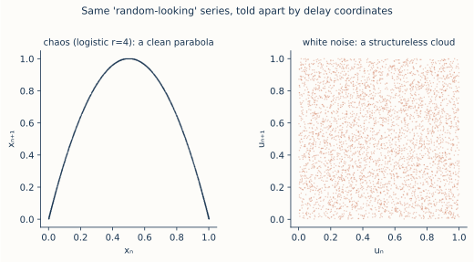

# ch17 — 混沌不是雜訊：怎麼分辨真混沌

> **本章解決什麼問題**：前面四個 Part 你都站在「上帝視角」——方程式擺在眼前，你知道那串看似亂的數字是 `xₙ₊₁ = r·xₙ·(1−xₙ)` 跑出來的。可是真實世界把你反過來：你手上只有一條時間序列（P99 抖動、某個 metric 的鋸齒、一段流量曲線），沒有方程式，只有數字。它看起來亂——但這個「亂」是低維確定性的混沌（背後有一條規則、原則上可抓），還是高維隨機的雜訊（背後真有亂源、抓不住）？本章把全書主線收到這一刀上：混沌和雜訊**肉眼幾乎一樣**，但它們在「相空間」裡長得完全不同。本章教你那把照妖鏡——相空間重建（用單一變數的延遲座標把吸子救回來），讓同樣像亂的兩串數字，在重建空間裡一眼可分：一串現出乾淨的結構、一串只是一團雲。這是 Part V「與混沌共處」的第一步：先學會**認出**它，下一章才談**駕馭**它。

```text
全書地圖：決定論許下的承諾，如何被一條遞迴式拆穿，又如何露出鐵一般的秩序

  Part I  決定論的承諾 ............ 一個被算盡的宇宙，與它的第一道裂縫
     ch01 拉普拉斯的承諾
     ch02 三體：第一個解不開的時鐘
     ch03 0.506 與一隻蝴蝶（勞侖次）
     ch04 三條被混為一談的線（決定／隨機／可測）
        |
        v
  Part II  一條遞迴式裡的宇宙 ..... 脊椎：xₙ₊₁ = r·xₙ·(1−xₙ)
     ch05 同一條遞迴式
     ch06 不動點與穩定
     ch07 倍週期分岔
     ch08 費根堡常數（鐵律登場）
     ch09 混沌登場與秩序的孤島
        |
        v
  Part III  混沌的肖像 ........... 亂，長什麼樣子
     ch10 相空間
     ch11 奇異吸子
     ch12 碎形
     ch13 碎維度
        |
        v
  Part IV  為什麼測不準 .......... 不可預測的機制與極限
     ch14 Lyapunov 指數
     ch15 可預測的地平線
     ch16 拉伸與摺疊
        |
        v
  Part V  與混沌共處 ............ 分辨、駕馭、收束     ◄ 你在這裡
     ch17 混沌不是雜訊
     ch18 駕馭混沌
     ch19 同一條遞迴式，現在你懂它七層
```

## 從你已知的出發

你做過 anomaly detection，或至少 review 過別人做的。那件事的本質，剝到最底，永遠是同一個問題：**眼前這串數字，哪些是「訊號」、哪些是「雜訊」？** 你設一條閾值、套一個 z-score、跑一個移動平均，全都在回答這個問題的某個版本。而本章要逼問的，是這個問題更深、更難、也更有趣的一層——不是「哪個點是異常」，而是「這串數字的『亂』，本身是哪一種亂？」。

把場景說具體。你的服務 P99 延遲在某段時間裡上上下下抖，沒有明顯週期、不重複、看起來毫無規律。你打開監控面板，盯著那條鋸齒線，心裡冒出一個你可能從沒正式問過的問題：這個抖動，是系統內部某個**確定性的回授迴圈**在搞鬼（GC 觸發改變了下一輪分配、改變了下一輪 GC 時機，autoscaler 的副本數餵回負載、負載又餵回副本數——一條把「目前狀態」餵回「下一步」的閉環，正是 ch05 那條遞迴式的工程化身），還是純粹**外部的隨機湧入**（一堆互不相關的用戶在互不相關的時刻按下按鈕，疊加成一片白噪音）？

這兩個答案，對你的行動有天壤之別。如果是前者——確定性回授的混沌——那這個抖動**原則上是可以被理解、被找出旋鈕、甚至被駕馭的**（下一章就講怎麼駕馭）；它有一條規則，只是被敏感依賴藏了起來。如果是後者——高維隨機——那你再怎麼盯也盯不出規律，因為**真的沒有**規律，你能做的只有統計（看分布、設信賴區間、別假裝能預測單一事件）。把混沌誤判成雜訊，你會放棄一個本來抓得住的系統；把雜訊誤判成混沌，你會浪費幾週去找一條根本不存在的「隱藏規則」、甚至在過擬合出來的假模型上下注。**分清楚這兩者，是省下幾週力氣、甚至避免一場誤判的本事。**

問題是——這正是本章的核心難點——**肉眼分不出來**。一條混沌的時間序列和一條雜訊的時間序列，畫在時間軸上，可以像到讓你賭咒它們是同一個東西。你熟悉的所有工具，在這一刀面前大半失效。下面先把「為什麼肉眼會輸、為什麼連頻譜都會輸」講透，然後給你那把真正能分的尺——它的點子，恰恰是把全書 Part III 學的「相空間」反過來用。

## 為什麼肉眼分不出來：混沌長得就像雜訊

先把這件事的難度焊死，否則你會低估它、以為「看一眼不就知道了」。

拿全書脊椎在 r=4 的全混沌來說——就是 ch09 講的、ch16 用帳篷映射拆解過的那個 `xₙ₊₁ = 4·xₙ·(1−xₙ)`。它是一條**完全確定**的規則：給定 x₀，整串數字一個不差地被決定，沒有任何隨機項，你今天跑、明天跑、用什麼語言跑，同一個 x₀ 給出同一串數字（這是 ch04 釘死的：混沌是決定論的，不是隨機的）。現在把這串數字一個一個畫在時間軸上：

```text
  r=4 logistic 的時間序列（x₀=0.2，手動迭代前幾步，4 位小數複核）
  ─────────────────────────────────────────────────────────────
  n     xₙ           算式 xₙ₊₁ = 4·xₙ·(1−xₙ)
  0     0.2000
  1     0.6400       4·0.2·0.8       = 0.6400
  2     0.9216       4·0.64·0.36     = 0.9216
  3     0.2890       4·0.9216·0.0784 = 0.2890   ← 0.9216·(1−0.9216)=0.0722，×4=0.2890
  4     0.8219       4·0.2890·0.7110 = 0.8219
  5     0.5854       4·0.8219·0.1781 = 0.5854
  6     0.9708       4·0.5854·0.4146 = 0.9708
  7     0.1133       4·0.9708·0.0292 = 0.1133
  8     0.4019       4·0.1133·0.8867 = 0.4019
  ...   （永不重複、永不收斂、在 [0,1] 裡跳）
```

把這串 0.64, 0.92, 0.29, 0.82, 0.59, 0.97, 0.11, 0.40… 畫成折線，你看到的是一條在 0 和 1 之間毫無規律地上下亂跳的鋸齒。沒有週期、不重複、看不出下一個會落哪。如果我不告訴你它是 `4x(1−x)` 跑出來的，把它跟一串你用 `Math.random()` 生出來的均勻亂數混在一起給你，**你幾乎不可能用肉眼把兩者分開。** 這不是你眼力差——這是混沌的定義性質：對初始條件指數敏感（ch03、ch14），使得任何「往前看一眼猜下一步」的企圖都在幾步內失效，看起來就跟真隨機沒兩樣。

那進階一點的工具呢？頻譜（傅立葉分析，把訊號拆成各種頻率的正弦波疊加，連續時間的工具見《馴服無限》談頻譜那章）總該管用吧——週期性的東西在頻譜上會冒出尖峰，亂的東西不會。問題是：**混沌的頻譜也是寬頻的、沒有尖峰，跟白噪音幾乎一樣。** 一條乾淨的正弦波在頻譜上是一根尖刺（單一頻率）；一個倍週期到一半的系統（ch07，在幾個值間規律跳）會有幾根離散的尖峰；但全混沌的軌跡非週期、永不重複，它的能量糊在一整片連續的頻帶上——**寬頻譜（broadband spectrum）**。白噪音的定義就是能量均勻攤在所有頻率上，也是寬頻。兩者在頻譜上都是「一片連續、沒有尖峰」，**頻譜這把尺，在混沌和雜訊之間同樣分不出來。**

```text
  頻譜（功率對頻率）長相對照——尖峰 = 有週期，寬頻 = 看不出週期
  ──────────────────────────────────────────────────────────
  純正弦波      ：  │      ╿              ← 一根尖刺，單一頻率
                    └──────┴──────────
  倍週期 2-cycle：  │   ╿     ╿           ← 幾根離散尖峰
                    └───┴─────┴────────
  混沌（r=4）   ：  │▁▂▃▂▃▂▁▂▃▂▁▂▃▂▁      ← 一整片寬頻，沒有尖峰
                    └────────────────
  白噪音        ：  │▂▂▂▂▂▂▂▂▂▂▂▂▂▂▂      ← 也是一整片寬頻
                    └────────────────
                       混沌 vs 白噪音：頻譜上幾乎分不出來 ✗
```

所以兩把最直覺的尺——肉眼看時序、傅立葉看頻譜——在「混沌 vs 雜訊」這一刀面前都鈍了。它們之所以失效，是因為它們都只在「時間維度」或「頻率維度」裡看，而混沌和雜訊的**真正差別不在這兩個維度裡**。差別在一個你已經學過、但還沒想到要拿來這樣用的地方——相空間。下一節揭曉那把真正能分的尺。

## 真正的差別：混沌住在低維吸子上，雜訊不住

把全書最重要的一句話放在這裡，它是本章的軸：

> **混沌是低維的確定性，雜訊是高維的隨機。**

拆開講。Part III 教過你「相空間」（ch10）：系統的狀態是相空間裡的一個點，演化是一條軌跡。一個混沌系統，不管它的軌跡看起來多亂，在相空間裡它**被吸進一個低維的奇異吸子**（ch11、ch13）——那隻勞侖次蝴蝶薄得維度只有 2.06，那條 logistic 軌跡更是被綁在一條一維曲線上。**低維**的意思是：軌跡再怎麼跳，它都只在一個薄薄的、有結構的集合上跳，不是在整個高維空間裡亂飛。它有形狀。

雜訊沒有這回事。一串真正的白噪音（見《馴服隨機》ch20 隨機漫步／ch01）的每一個值，原則上獨立於前一個值——它不是任何低維規則的輸出，它的「狀態」要描述清楚需要的是無窮多個獨立的隨機數。在相空間裡，雜訊**不被吸進任何低維集合**，它傾向把它能到的空間**均勻填滿**——你給它幾個維度，它就把那幾個維度的整塊區域塗滿，塗成一團沒有結構的雲。它沒有吸子，因為它沒有「規則」可言；沒有規則，就沒有形狀。

這就是本章的全部關鍵，我用一句你能轉述的話收起來：**混沌的亂是「一條規則被敏感依賴藏起來」，雜訊的亂是「根本沒有規則」。前者在相空間裡藏著一個低維的形狀，後者在相空間裡是一團均勻的雲。** 肉眼之所以分不出，是因為你看的是時序——把高維的相空間壓扁成一條一維的時間線之後，形狀和雲都被壓成了一樣亂的鋸齒。**只要你能把相空間救回來，形狀和雲就現原形了。**

但這裡有一個你立刻會問的死穴問題，而它正是本章技術上最漂亮的一點：**監控系統只給你一個變數**（一條 P99 曲線），你手上根本沒有「完整的相空間」。logistic 還好（它本來就一維），可是勞侖次有三個變數（x, y, z），你只量得到其中一個——比方說只有溫度感測器、只有一條 metric。少了另外兩個軸，你怎麼把那隻三維的蝴蝶畫出來？看起來這把尺還沒上手就廢了。

下一節就是來救這件事的，它是混沌學裡我認為最反直覺、也最實用的一個定理。

## 相空間重建：用一個變數把吸子救回來

死穴問題是這樣的：吸子活在多維相空間裡，你卻只量得到一個變數。少了其他軸，吸子應該畫不出來才對。

混沌學給的答案，反直覺到第一次聽會覺得是魔術——**塔肯斯嵌入定理（Takens embedding theorem，Floris Takens 1981）**：

> 你只需要**一個變數**的時間序列，就能把整個吸子的形狀（在拓撲意義下）重建出來。方法是用這個變數自己的**延遲座標（delay coordinates）**：把 (xₙ, xₙ₊₁, xₙ₊₂, …) 當成一個高維空間裡的點。

讓我先把這件事的「為什麼可能」用直覺講通，再給操作。憑什麼一個變數夠？因為在一個**耦合**的確定性系統裡，每個變數都不是孤立的——它的演化被其他所有變數牽動，所以它「身上帶著」整個系統的資訊。勞侖次的 x 怎麼變，取決於 y 和 z（看 ch11 那三條 ODE：`dx/dt=σ(y−x)`，x 的變化直接被 y 拉著）；反過來，x 在不同時刻的值——xₙ 和 xₙ₊₁ 和 xₙ₊₂——之間的關係，**間接編碼了 y 和 z 的影響**。一個變數的「現在和它自己的過去」，悄悄把其他變數的資訊夾帶進來了。延遲座標就是把這份夾帶展開：用同一個變數在不同延遲時刻的值，去**頂替**那些你量不到的軸。

Takens 證明的是：在很一般的條件下，這樣用延遲座標搭出來的重建空間，和原來真正的吸子是**微分同胚（diffeomorphic）**的——白話說，重建出來的形狀和真吸子「拓撲上是同一個東西」：該打結的地方打結、該有幾個洞就有幾個洞、軌跡該不自交就不自交，**Lyapunov 指數、維度這些不隨光滑變形改變的量都被保住了**。它**不**保證形狀的幾何長得一模一樣（可能被拉歪、被扭曲），但保證「結構」原封不動。對我們的目的——「有沒有結構」——這就完全夠了。

```text
  延遲座標：用「一個變數的現在與過去」頂替「量不到的其他軸」
  ──────────────────────────────────────────────────────────
  你只量得到一條序列：  …, xₙ, xₙ₊₁, xₙ₊₂, xₙ₊₃, …

  重建一個 2 維點（取延遲 1）：  Pₙ = ( xₙ , xₙ₊₁ )
  重建一個 3 維點（取延遲 1）：  Pₙ = ( xₙ , xₙ₊₁ , xₙ₊₂ )

  把每個 n 對應的 Pₙ 都點上去，連成的形狀
  ＝ 原吸子的「拓撲複製」（可能歪扭，但結構同一個）

  直覺：xₙ 怎麼走到 xₙ₊₁，被你量不到的變數牽動著；
       所以「xₙ 配 xₙ₊₁」這個座標，
       偷偷把那些量不到的軸的資訊帶了進來。
```

> 嚴謹度標示：這是**直覺版**。Takens 定理的嚴格條件（嵌入維度要夠大、一般取 m > 2D、延遲 τ 怎麼選、需要無雜訊的長序列）與證明本書不展開，給你名稱和直覺，嚴格版指向延伸閱讀。這裡你只要抓住一句話：**單一變數的延遲座標，足以把吸子的結構救回來。**

工程上你早就在用一個退化版的這個動作，只是沒這樣叫它。你畫過「這一秒的值 vs 上一秒的值」的散點圖嗎？你看過「相鄰兩次請求的間隔」互相對打的圖嗎？那就是延遲座標 (xₙ, xₙ₊₁) 的散點——你一直在做相空間重建，只是沒人告訴你它有定理撐腰、也沒人告訴你它能用來照出混沌。下一節就把這個動作正式變成本章的照妖鏡。

## 照妖鏡：把同一串數字畫成延遲座標散點

現在組裝這把尺。流程簡單到一句話：**把序列裡每一對相鄰的值 (xₙ, xₙ₊₁) 當成平面上一個點 （橫座標=這一步、縱座標=下一步），全部點上去，看現出什麼。**

關鍵的對照——也是本章的招牌驚嘆點——來自把**同樣像亂**的兩串數字，丟進同一台照妖鏡：

**第一串：logistic r=4 的混沌。** 它的規則是 `xₙ₊₁ = 4·xₙ·(1−xₙ)`。注意這條規則本身**就是一條拋物線**：把 xₙ₊₁ 看成 xₙ 的函數，`y = 4x(1−x)` 是一條開口向下、頂點在 (0.5, 1) 的拋物線。所以當你把 (xₙ, xₙ₊₁) 點上去，**每一個點都精確落在這條拋物線上**——因為下一步永遠等於 4x(1−x)，它沒有別的地方可去。把上一節那串 0.20→0.64→0.92→0.29→0.82→… 配成相鄰對：

```text
  把 r=4 序列配成相鄰對 (xₙ, xₙ₊₁)，每一對驗證它落在 y=4x(1−x) 上
  ──────────────────────────────────────────────────────────────
  (xₙ , xₙ₊₁)         驗證 4·xₙ·(1−xₙ) 是否 = xₙ₊₁
  (0.2000, 0.6400)    4·0.2·0.8     = 0.6400  ✓
  (0.6400, 0.9216)    4·0.64·0.36   = 0.9216  ✓
  (0.9216, 0.2890)    4·0.9216·0.0784=0.2890  ✓
  (0.2890, 0.8219)    4·0.289·0.711 = 0.8219  ✓
  (0.8219, 0.5854)    4·0.8219·0.1781=0.5854  ✓
  (0.5854, 0.9708)    4·0.5854·0.4146=0.9708  ✓
  ...
  每一點都在這條拋物線上，因為「下一步」就是由這條規則生出來的：

       xₙ₊₁
        1 ┤        ___
          │      ╱     ╲          ← y = 4x(1−x)
          │    ╱         ╲           開口向下、頂點 (0.5, 1)
          │   ·           ·          每個 (xₙ,xₙ₊₁) 都釘在線上
          │  ·             ·
          │ ·               ·
        0 ┼·─────────────────·──  xₙ
          0       0.5         1
```

那串在時間軸上像亂碼的鋸齒，**一旦換成延遲座標散點，整團亂瞬間塌成一條乾淨、纖細、確定的拋物線。** 這就是「結構」現形的一刻：再多的點都老老實實趴在一條一維曲線上，它有形狀、它有規則，它是混沌。

**第二串：白噪音。** 它沒有任何 `xₙ₊₁ = f(xₙ)` 的規則——下一個值**獨立於**這一個值（這正是白噪音的定義，見《馴服隨機》ch01）。所以當你把 (xₙ, xₙ₊₁) 點上去，xₙ 是什麼，對 xₙ₊₁ 會落哪**毫無約束**：給定一個 xₙ，xₙ₊₁ 可以是任何值。把無數對這樣的點全點上去，它們**均勻散滿整個正方形**——沒有曲線、沒有邊界、沒有結構，**一團雲**。

```text
  白噪音的延遲座標散點：xₙ 與 xₙ₊₁ 無關，點均勻填滿整塊
  ──────────────────────────────────────────────────────
       xₙ₊₁
        1 ┤ · ·  ·   ·· ·  · ·· ·
          │·  · ·· · ·  ·· · · · ·    ← 下一步不被這一步約束
          │ · ·· ·  ·· · · ·  ·· ·       所以點落得到處都是
          │· · ·  · · ·· · ·· · ·        ＝ 一團沒有結構的雲
          │ ·· · · ·· ·  · · · ·· ·
          │· ·· · ·  · ·· ·· · · ·
        0 ┼─────────────────────────  xₙ
          0          0.5          1
```

把兩張圖並排，本章的全部就濃縮在這一眼裡——**同樣兩串在時間軸上像到分不出的亂數，丟進延遲座標的照妖鏡，一個塌成乾淨的拋物線（混沌、有規則、低維有結構）、一個攤成均勻的雲（雜訊、無規則、高維填滿）。** 這就是「混沌住在低維吸子上、雜訊不住」那句抽象斷言，變成你親眼能看的一張圖。我認為這是 Part V 開場最值得停下來盯著看的一頁：那條拋物線根本不是畫出來的，是那串「亂數」自己長出來的——它本來就一直在那裡，只是被時間軸壓扁藏住了。



（補一句尺度上的誠實話：logistic 因為**本來就一維**，取延遲 1 配成 (xₙ, xₙ₊₁) 就完整現出拋物線，乾淨到像作弊。勞侖次那種三維吸子，要在重建空間看到那隻蝴蝶的雙翼結構，得用三維延遲座標 (xₙ, xₙ₊₁, xₙ₊₂)、還要把延遲 τ 選對——但**道理一模一樣**：有結構 vs 一團雲。logistic 是這個原理最乾淨的示範，所以本章用它當主角。）

## 判別法的兩條線：看結構，與看 λ

把照妖鏡的結果，整理成兩條可操作的判別線。這是本章要你帶走的判別直覺——注意是**直覺與名稱**，不是演算法細節（細節指向延伸閱讀）。

**第一條線（定性）：重建後看到結構＝混沌，看到一團雲＝雜訊。** 這就是上一節那把照妖鏡。把序列做延遲座標重建（一維系統用 (xₙ, xₙ₊₁)，更高維用更多延遲座標），點出來。落在一條乾淨曲線／一個薄薄的低維集合上＝有確定性結構＝混沌的嫌疑很大；均勻填滿整個空間、看不出任何低維形狀＝沒有吸子＝雜訊。一句話：**找形狀。有形狀是混沌，沒形狀是雜訊。**

**第二條線（定量）：λ 是否為有限的正值。** 這條線把 ch14 的 Lyapunov 指數 λ 反過來用。回憶：λ 量的是相鄰軌跡的指數分離率，`λ > 0 ⇔ 混沌`。對混沌系統，從資料估出來的 λ 會收斂到一個**有限的正數**（logistic r=4 是 λ=ln2≈0.6931）——「有限」表示分離是指數的、有確定的速率；「正」表示確實在分離（敏感依賴）。對純隨機的雜訊，你試著估 λ 時，它**不會收斂到一個有限正值**——隨機沒有「相鄰軌跡」這個確定性概念，誤差不是以固定指數率放大，而是被隨機項主宰，估計量會發散或亂飄、抓不到一個穩定的數。一句話：**混沌的 λ 是一個有限的正數，雜訊估不出這樣一個數。**

```text
  兩條判別線並列（直覺版，名稱與方向，細節指向延伸閱讀）
  ────────────────────────────────────────────────────────────
                  混沌（低維確定性）        雜訊（高維隨機）
  ────────────────────────────────────────────────────────────
  時間序列        亂、不重複、寬頻          亂、不重複、寬頻   ← 一樣！騙人
  傅立葉頻譜      寬頻、無尖峰              寬頻、無尖峰       ← 一樣！騙人
  ────────────────────────────────────────────────────────────
  延遲座標重建    現出結構（曲線／薄集合）   一團均勻的雲       ← 分得出 ✓
  Lyapunov λ      有限正值（r=4 是 ln2）    估不出有限正值     ← 分得出 ✓
```

這張表是本章的精華：**上半部（時序、頻譜）兩者一樣，所以肉眼和傅立葉都會被騙；下半部（重建、λ）兩者不同，所以分得出。** 全書主線「混沌不是隨機／不是雜訊」（ch04 立的框、ch16 用假亂對照真隨機鋪的路），到這一章終於有了**可操作的分辨手段**：不是哲學斷言「它們不一樣」，而是「拿延遲座標一畫、拿 λ 一估，就現原形」。

但——這把尺有它會騙人的時候，而且騙得很兇。下一節是本章的良心：什麼情況下這把照妖鏡會照出假象，讓你把雜訊當混沌、或把混沌當雜訊。

## 分辨的陷阱：短資料與量測雜訊會騙你

照妖鏡不是萬靈丹。它在「乾淨、夠長」的資料上很準，但真實世界的監控資料兩個條件都不滿足，於是兩種假象會冒出來。這是本章最該記牢的一段，因為一旦你學會這把尺，**最大的危險不是不會用，而是用得太自信。**

**陷阱一：短資料會「無中生有」結構，讓雜訊看起來像混沌。** 這是最毒的一個，因為它不是「看不出」，而是「看出假的」。當你的序列**太短**，純隨機的點碰巧也能擺出一個看似有結構的低維形狀——就像你擲十次硬幣可能擲出 HHHHHTTTTT，看起來「有規律」，其實只是樣本太小、隨機的漲落還沒被平均掉。更技術一點：對短而有雜訊的序列去估維度或 λ，**常會估出一個假的低維值**（spuriously low dimension）——尤其是**有時間相關性的雜訊**（不是純白噪音，而是「這一秒和上一秒有點關聯」的彩色雜訊，比如經過移動平均、或本身有慣性的 metric），它的相鄰值因為相關性而**擠在一起**，在延遲座標上看起來像趴在一條線附近，活脫脫像個低維吸子——**但它根本不是混沌，只是被相關性騙出來的假結構。** 這是這個領域踩過最多坑的地方：歷史上不少「在心跳／腦波／經濟資料裡發現低維混沌」的論文，後來被發現是短資料 + 相關雜訊造出的假象。

防禦的標準動作叫**替代資料法（surrogate data method）**——本章只給名稱與直覺，不展開演算法。直覺是：你造一批「假對照組」，這些對照組**保留原資料的線性特徵**（同樣的頻譜、同樣的自相關，常用的造法是把原訊號做傅立葉、把相位隨機打亂、再轉回去），但**故意破壞掉任何非線性的確定性結構**。然後你把同一個判別量（維度、λ）同時算在「真資料」和「這批假對照組」上：如果真資料的結構，假對照組**也照樣算得出來**，那這個「結構」根本不是混沌帶來的，只是線性相關性的副產品——你被騙了。只有當真資料的判別量**明顯異於**那批只保留線性特徵的對照組，你才有底氣說「這裡有真正的非線性確定性結構」。一句話：**先問「一團只保留我的頻譜、但把規則打散的假資料，會不會也長出同樣的形狀？」——會，就別吹混沌。**

**陷阱二：量測雜訊會「抹掉」結構，讓混沌看起來像雜訊。** 反方向的騙。真實的混沌訊號，總是疊著一層量測雜訊（感測器精度、取樣抖動、上報的捨入、網路傳輸的丟失補插）。這層雜訊把延遲座標散點上那條本來該很細的曲線，**糊成一條有寬度的帶子**——薄的低維結構被雜訊撐胖、模糊。雜訊一大，那條拋物線就糊成一團，你會誤判「這只是雲、是雜訊」，而錯過底下真實存在的混沌。混沌的低維結構通常很薄（想想勞侖次吸子那層層疊疊但薄到沒體積的紙，ch13），**薄結構最怕被雜訊撐胖**——一點量測雜訊就能把它糊到認不出。

```text
  兩個方向的假象（記牢：照妖鏡會兩頭騙）
  ────────────────────────────────────────────────────────────
  陷阱            機制                       後果           防禦
  ────────────────────────────────────────────────────────────
  短資料          樣本太少，隨機漲落沒平均掉；  把雜訊當混沌    要夠長的序列；
  ＋相關雜訊      相關性把點擠成假的低維形狀   （找到不存在    替代資料法
                                              的「規則」）    （surrogate）
  ────────────────────────────────────────────────────────────
  量測雜訊        薄的低維結構被雜訊撐胖、     把混沌當雜訊    先去噪、提高
                  糊成有寬度的帶子           （錯過真規則）  量測精度再重建
```

把這兩個陷阱收成一句你要刻進骨子裡的話：**「重建後看到結構＝混沌、看到雲＝雜訊」這條判別法，只在資料夠長、夠乾淨時可信；資料一短、一髒，照妖鏡會兩頭騙你——短資料無中生有把雜訊照成混沌，量測雜訊把混沌照成雜訊。** 所以真正成熟的判別，從來不是「畫一張圖看一眼就下結論」，而是「畫圖＋估 λ＋跑替代資料對照＋換更長更乾淨的資料重做一遍，四個證據都指同一個方向才敢說」。這份審慎，跟全書一路守的態度一致（ch15 對天氣兩週上限的 hedge、ch18 對混沌應用宣稱的 hedge）：**混沌學最容易出事的地方，正是過度自信地宣稱「我在資料裡看到了混沌」。**

## 直覺的陷阱

本章的概念最容易被工程師用錯的幾個地方，逐一點名：

| 錯誤直覺 | 它會在哪一步把你帶溝裡 | 正確版（怎麼自我察覺） |
|---|---|---|
| 「看起來亂、又是寬頻譜，那就是雜訊」 | 你用肉眼或傅立葉下結論，把一個明明有低維規則的混沌系統判成隨機，放棄一個本來抓得住的東西 | 混沌的時序和頻譜**就是**長得像雜訊——這正是它的定義性質。寬頻不能區分混沌與雜訊。要分，必須做相空間重建或估 λ。徵兆：你只看了時序圖或頻譜就敢說「這是隨機的」。 |
| 「我只有一個 metric，畫不出相空間，沒救」 | 你以為單變數量測就無法重建吸子，放棄分析 | Takens 嵌入定理：**單一變數的延遲座標 (xₙ, xₙ₊₁, …) 就能重建吸子的拓撲結構**。一個變數身上帶著整個耦合系統的資訊。徵兆：你以為要量到所有狀態變數才能畫相空間。 |
| 「重建圖上看到一條曲線，所以一定是混沌」 | 你在短資料／相關雜訊上看到假結構就下注，去找一條不存在的規則 | 短資料 + 相關雜訊會**無中生有**低維結構（spurious low dimension）。看到形狀只是「嫌疑」，不是「定罪」。必須跑替代資料法、用更長資料複驗。徵兆：你的序列只有幾百點、且本身有強自相關，你卻已經在畫吸子了。 |
| 「混沌就是隨機的一種」 | 你把兩個本體論不同的東西混為一談，整章的判別動機都垮了 | 混沌是**完全決定論**（同初值同軌跡、無隨機項），亂來自敏感依賴；雜訊是真有隨機源。它們在相空間裡一個有低維吸子、一個沒有（ch04 已釘死，這裡用它分辨手段）。徵兆：你說「反正都測不準，分它幹嘛」——分得清才知道哪個可駕馭。 |
| 「延遲座標重建出來的形狀，就是真實吸子的樣子」 | 你拿重建圖去量幾何尺寸、角度，得到錯的數 | Takens 保證的是**拓撲**同胚（diffeomorphic）——結構（打結、洞、不自交、λ、維度）對，但**幾何形狀可能被拉歪扭曲**。重建圖能判「有沒有結構」、能算拓撲不變量，但別拿它的幾何外形當真吸子的長相。徵兆：你在重建圖上量距離、比大小。 |

最深的一個陷阱，單獨點：**別把「我畫了一張延遲座標圖、看到結構」當成科學結論。** 這只是判別流程的第一步、最不可靠的一步。一個負責任的判別至少要：(1) 資料夠長；(2) 重建看到結構；(3) λ 估出有限正值；(4) 替代資料對照證明這結構不是線性相關性的副產品；(5) 換資料重做一致。四五個證據同向才下結論。**這份「多重佐證才敢說」的紀律，本身就是本章最該帶走的東西**——比任何單一技巧都重要。

## 紙上推演

### 第一題 ★ **[10 分鐘]**：為什麼 r=4 的延遲座標圖一定是拋物線

不查任何資料，純推理：解釋為什麼把 logistic r=4 的序列畫成延遲座標散點 (xₙ, xₙ₊₁) 時，**每一個點都精確落在一條拋物線上**，而且是哪一條拋物線。然後說：如果把 r 換成 3.9（仍在混沌帶內），這張圖會變嗎？

#### 推演解答

核心是看穿「延遲座標散點」和「遞迴規則」其實是同一件事。

縱座標 xₙ₊₁ 是橫座標 xₙ 的什麼函數？就是遞迴規則本身：`xₙ₊₁ = 4·xₙ·(1−xₙ)`。把 xₙ 寫成 x，這就是 `y = 4x(1−x) = 4x − 4x²`——一條**開口向下的拋物線**，頂點在 x=0.5 處（y=4·0.5·0.5=1），兩個零點在 x=0 和 x=1。所以對任何一步，給定 xₙ，它的 xₙ₊₁ **沒有任何選擇**，被這條規則唯一決定，必然落在這條拋物線上。把所有相鄰對點上去，自然全趴在 `y=4x(1−x)` 上。

關鍵體會：**延遲座標散點圖，畫出來的就是那條遞迴規則的函數圖形。** 這也正是為什麼它能當照妖鏡——確定性系統的「下一步＝某個函數（這一步）」，這個函數圖形在延遲座標上原形畢露；而隨機沒有這樣的函數（下一步不被這一步決定），所以點散成雲。

換成 r=3.9 呢？圖**還是一條拋物線，但換了一條**——變成 `y=3.9·x(1−x)`，頂點降到 (0.5, 3.9·0.25=0.975)，比 r=4 那條矮一點點、瘦一點點。形狀類別不變（都是開口向下的拋物線），因為遞迴規則的形狀沒變，只是 r 這個係數變了。點仍然全部趴在線上——只要是確定性的 `xₙ₊₁=f(xₙ)`，延遲座標圖就現出 f 的形狀。

常見錯路：以為「r=3.9 是混沌、所以點會比較散」。混沌不混沌，影響的是點**沿著拋物線怎麼分布、跑遍多少範圍**，不影響「點在不在拋物線上」——只要規則是 `xₙ₊₁=f(xₙ)`，點永遠在 f 的圖形上，一個不漏。散開成雲的是**沒有 f 的隨機**，不是「比較混沌的混沌」。

### 第二題 ★★ **[15 分鐘]**：給「看似隨機的監控指標」設計一個紙上判別流程

你的服務有一條 metric（比方說每秒處理時間的 P99），在某段時間裡上下抖、看不出規律。產品經理問你：「這是系統內部某個東西在規律地搞鬼（可以查、可以修），還是純粹外部隨機流量（只能接受）？」用本章的工具，設計一個**紙上判別流程**（不寫程式，描述步驟與每步在判什麼），並標明每一步可能被什麼騙。

#### 推演解答

設計流程的骨架是「先排除騙人的尺，再上能分的尺，最後多重佐證」：

```text
  判別流程（每步：做什麼／在判什麼／會被什麼騙）
  ──────────────────────────────────────────────────────────
  步驟 0  先確認資料夠長、夠乾淨
          做什麼：盡量取長一點的序列；了解這條 metric 有沒有經過
                  移動平均／補插／捨入（那會引入相關性與量測雜訊）
          在判什麼：判「我手上的資料配不配做這個分析」
          會被騙：短資料和相關雜訊是後面所有假象的根源，這步先擋

  步驟 1  畫時間序列、看頻譜
          做什麼：折線圖；（口頭）傅立葉看有沒有尖峰
          在判什麼：有明顯週期／尖峰 → 根本不是「亂」，是週期，先處理掉
          會被騙：若是寬頻、無尖峰——別下任何結論！混沌和雜訊在這裡一樣

  步驟 2  延遲座標重建
          做什麼：把 (xₙ, xₙ₊₁) 點成散點（更高維用更多延遲座標）
          在判什麼：現出曲線／薄結構＝混沌嫌疑；均勻一團雲＝雜訊嫌疑
          會被騙：短資料／相關雜訊會無中生有出假結構（→ 進步驟 4）；
                  量測雜訊會把真結構糊成雲（→ 先去噪再重做）

  步驟 3  估 Lyapunov λ
          做什麼：（指向工具，本章不展開算法）估 λ
          在判什麼：收斂到有限正值＝混沌；估不出穩定正值＝雜訊嫌疑

  步驟 4  替代資料對照（surrogate）
          做什麼：造一批「同頻譜、同自相關，但打散非線性結構」的假對照組，
                  把步驟 2/3 的判別量同時算在真資料和假對照組上
          在判什麼：真資料的結構，假對照組也有 → 是線性相關性的副產品，
                    不是混沌；只有真資料明顯異於對照組才算數

  步驟 5  換更長／更乾淨資料重做，看結論穩不穩
  ──────────────────────────────────────────────────────────
  只有步驟 2、3、4、5 都指向同一個方向，才敢對 PM 給結論。
```

給 PM 的話要誠實分三檔：(a) 若重建現出乾淨結構、λ 有限正、替代資料對照通過——「很可能是系統內部一條確定性回授迴圈，值得查、可能可修甚至可駕馭」；(b) 若重建是均勻雲、λ 估不出、頻譜寬頻——「比較像外部隨機，盯單一事件無意義，改用統計（分布、信賴區間）管理」；(c) 若資料太短或太髒——「現在的資料不足以判定，先收更長更乾淨的序列再說」，**(c) 是最常見也最該誠實給的答案**，別硬擠 (a) 或 (b)。

常見錯路：在步驟 2 看到一條曲線就直接告訴 PM「找到隱藏規則了」。沒跑步驟 4 的替代資料對照之前，那條曲線完全可能是相關雜訊的假象——本章陷阱一正是為這個而設。

### 第三題 ★★ **[12 分鐘]**：為什麼短樣本特別會讓你誤判

用「擲硬幣」的直覺，向同事解釋：為什麼**短**的時間序列特別容易讓你把雜訊誤判成混沌（看出不存在的低維結構）？為什麼「資料長度」是這個判別問題的命門？

#### 推演解答

用硬幣搭橋：擲 10 次公正硬幣，你完全可能擲出 HHHHHTTTTT 或 HTHTHTHTHT——看起來「有規律」、像有個規則在控制。可是你心裡清楚那只是隨機，這個「假規律」純粹是樣本太小、隨機的漲落還沒被平均掉。擲 10000 次，這種整齊的假象幾乎不可能整段出現，正反比例會逼近 50:50、看不出任何「規則」。**樣本越短，隨機越容易裝出秩序。**

延遲座標重建是同一回事，只是搬到平面上。雜訊的點本該均勻填滿整塊（無結構的雲），但**點不夠多時，它填不滿**——稀稀落落幾十個點，碰巧可能擺出一條看似有結構的弧線、或擠在某個角落，看起來像趴在一個低維集合上。你一看「有形狀！」就喊混沌——其實只是雲還沒被點滿、隨機漲落還沒被平均掉造出的假象。點夠多（資料夠長），雲才會真的鋪滿、假結構才會被淹沒、真相才現出來。

更狠的是**相關雜訊**：如果這條 metric 本身有慣性（這一秒和上一秒有關聯，比如經過移動平均），相鄰值會因為相關性而**擠在一起**，在 (xₙ, xₙ₊₁) 圖上沿著對角線附近排成一條帶子——看起來活像個低維吸子，其實只是相關性，不是混沌。短資料把這個假象放得更大。

所以「資料長度」是命門：**判別法的可信度，幾乎完全押在序列夠不夠長、夠不夠乾淨上。** 這就是為什麼替代資料法不可省——它逼你回答「一團只保留我的頻譜和相關性、但打散了規則的假資料，會不會也長出這個形狀？」會的話，你看到的就是相關性的副產品，不是混沌。

常見錯路：以為「資料品質不好，多畫幾種圖補救」。畫再多圖也救不了樣本太小——根本問題是資訊量不夠，唯一的解是收更長、更乾淨的資料，或誠實承認「現在判不了」。

### 第四題 ★★★ **[18 分鐘]**：把「P99 抖動是混沌還是隨機」講成一個完整的判斷

你的服務 P99 在某段時間規律不規律地抖。有人說「混沌測試把它搞混沌了」，有人說「就是隨機流量」。用本章＋全書的概念，把這個問題講成一個**有結構的判斷**：(1) 為什麼這個問題本身有意義（兩個答案導向不同行動）；(2) 怎麼分；(3) 為什麼即使分出來是「混沌」，也未必能拿來做長期預測。

#### 推演解答

這題要把本章接回全書三條主線（ch04 三軸、ch14 λ、ch15 可預測地平線），完整講一遍。

**(1) 為什麼這問題有意義。** 「P99 抖動是混沌還是隨機」不是學術趣味，它直接決定你怎麼處理。若是**低維混沌**——抖動來自系統內部一條確定性回授迴圈（GC↔分配、autoscaler↔負載、佇列長度↔處理速率），那它原則上有規則、有旋鈕，你可以去找那條迴圈、調它的增益（ch06：增益太高就震盪、flapping）、甚至用小擾動穩住它（ch18 的 OGY 精神）。若是**高維隨機**——抖動來自大量互不相關的外部請求疊加成的白噪音，那就**沒有規則可找**，你再怎麼調內部參數也壓不住外部隨機，正確動作是用統計管理（看 P99 的分布、設容量餘裕、別假裝能預測單一尖峰）。**判錯方向＝幾週的力氣下錯地方。**

**(2) 怎麼分。** 走第二題那套流程：先確認資料夠長夠乾淨（P99 通常已被聚合／取百分位，本身帶相關性與量測雜訊，這步特別要小心）；畫時序、看頻譜——若寬頻無尖峰，別下結論；做延遲座標重建 (P99ₙ, P99ₙ₊₁)——現出薄結構是混沌嫌疑、均勻雲是雜訊嫌疑；估 λ——有限正值偏混沌；**跑替代資料對照**確認結構不是 P99 自身相關性的副產品；換更長資料複驗。多重佐證同向才下結論。實話：P99 這種重度聚合、又有量測雜訊的指標，**多數時候會落在「資料不足以判定」**，這也是誠實的答案。

**(3) 為什麼即使是混沌也未必能長期預測。** 這是把 ch14/ch15 收回來的關鍵一刀，也最反直覺：**「分辨出它是混沌」和「能預測它」是兩件完全不同的事。** 即使你確認 P99 抖動是低維確定性混沌——恭喜，你知道它「有規則」了——你**仍然不能**靠這個做長期預測，因為混沌的定義就是對初始條件指數敏感（λ>0），可預測地平線 `T≈(1/λ)·ln(1/ε)` 把你能準確預測的時間鎖死在一個很短的窗口裡（ch15）。**「是混沌」不等於「可預測」**，它只等於「有確定性結構、原則上可理解、某些情況下可在短窗內控制（ch18）」。把這兩者混為一談，正是 ch04 立下、全書反覆守的那條線——決定論 ≠ 可預測。所以對 PM 最誠實的總結是：「就算它是混沌，也不代表我們能預測下一個尖峰；混沌給我們的是『可理解、可能可控』，不是『可預測』。」

常見錯路：把「分辨出混沌」當成「破解了它、從此能算未來」。恰恰相反——你費勁分辨出它是混沌，得到的結論之一正是「所以別指望長期預測它」。分辨的價值在於知道該用哪套工具（找回授迴圈、調增益、控制 vs 統計管理），不在於獲得預測能力。

## 自我檢核

口頭自答，講得出來才算過：

1. 為什麼肉眼看時間序列、甚至用傅立葉看頻譜，都分不出混沌和雜訊？（要說出「兩者時序都亂、頻譜都寬頻」這個關鍵。）
2. 「混沌住在低維吸子上、雜訊不住」這句話是什麼意思？把它翻成你自己的話，講給沒讀過這本書的人聽。
3. Takens 嵌入定理在解決什麼死穴問題？為什麼「只有一個變數」竟然夠用？（要說出「一個變數身上帶著整個耦合系統的資訊」。）
4. 延遲座標重建保證的是什麼、不保證什麼？（拓撲同胚＝結構對；幾何形狀可能被扭曲。）
5. 為什麼 logistic r=4 的延遲座標散點一定現出一條拋物線、而白噪音是一團雲？（用「下一步是不是被這一步決定」回答。）
6. 兩條判別線分別是什麼？（重建看結構／看 λ 是否有限正值。）為什麼這兩條能分、而時序和頻譜不能分？
7. 短資料配相關雜訊，會把哪一種誤判成哪一種？量測雜訊又會把哪一種誤判成哪一種？（兩個方向都要講。）
8. 替代資料法在防什麼？用一句話講它的直覺（「同頻譜、打散規則的假資料會不會也長出這形狀」）。
9. 為什麼「分辨出它是混沌」不等於「能預測它」？（接回 ch04／ch15，決定論≠可預測。）

## 延伸閱讀

- **Takens, F. (1981)「Detecting strange attractors in turbulence」**（收於 *Dynamical Systems and Turbulence, Warwick 1980*, Springer LNM 898, 頁 366–381）— 延遲座標嵌入定理的原始論文，本章「單一變數重建吸子」的源頭。想看嚴格的嵌入維度條件（m > 2D）與證明就讀這篇；本章只給了直覺。（2026-06）
- **Scholarpedia「Attractor reconstruction」條目**（scholarpedia.org）— 延遲座標重建、嵌入維度與延遲 τ 怎麼選的標準科普整理，是 Takens 原文和教科書之間最好的橋。讀「Delay coordinates」與「Choosing the embedding parameters」兩節。（2026-06 可存取）
- **Kantz & Schreiber,《Nonlinear Time Series Analysis》（第 2 版，Cambridge）**— 從時間序列判別混沌的標準教科書，把本章「直覺版」的兩條線（重建結構、估 λ）和替代資料法寫成可操作的方法。讀「Phase space methods」與「Surrogate data」兩章；本章刻意略過的演算法細節都在這裡。
- **Theiler et al. (1992)「Testing for nonlinearity in time series: the method of surrogate data」**（*Physica D* 58:77–94）— 替代資料法的奠基論文，本章陷阱一「短資料＋相關雜訊會無中生有低維結構」與它的防禦，這篇講得最清楚透徹。想真正避免「在資料裡誤判出混沌」的經典坑就讀它。
- **Geoff Boeing「Visualizing Chaos and Randomness」（geoffboeing.com, 2015）**— 用 logistic map 的延遲座標散點對照白噪音雲的視覺示範，跟本章招牌圖同一個點子，互動圖看起來很過癮，適合先看圖建立直覺再讀理論。（2026-06 可存取）
- 跨書：白噪音與真隨機的本質（為什麼「下一步獨立於這一步」、隨機漫步的長相），見《馴服隨機》ch20 隨機漫步與 ch01；本章說「雜訊沒有 `xₙ₊₁=f(xₙ)` 的規則、所以散成雲」，那份「真隨機」的機率語言在那本書講透。連續時間動力系統的頻譜（傅立葉）工具見《馴服無限》談頻譜那章。
