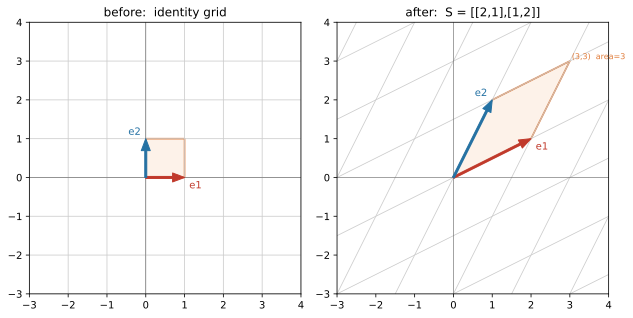

# ch01 — 為什麼是「線性」：把方格網交給矩陣

> **本章解決什麼問題**：在你翻開這本書之前，「矩陣」對你大概是一張數字表格、一套乘法規則。這一章要在你心裡換一個齒輪：矩陣是一個**動詞**——它對整個空間做了一件事。而它能做的那件事為什麼這麼特別、值得一整本書，全卡在一個樸素到不像話的條件上：「線性」。本章只做三件事——說清楚「線性」到底要求什麼（直線還是直線、原點不動、方格網還是平行等距的方格網）、為什麼這一個限制反而給了工程師最愛的超能力（疊加：拆開、各自處理、再合起來），以及讓你認得這本書的兩位主角：全書地圖，和那個會在每一章換張臉回來的矩陣 S。後面所有章（向量、變換、行列式、特徵值，一路到 SVD 與 PageRank）都站在這一頁的肩膀上。

```text
Part I 向量與空間 ◄你在這裡   Part II 矩陣即變換        Part III 行列式與秩
ch01 為什麼是線性 ◄你在這裡   ch05 矩陣是動詞       →   ch09 行列式即面積
ch02 向量三張臉        →     ch06 乘法即合成           ch10 秩與四子空間
ch03 span 與基底             ch07 解 Ax=b                    │
ch04 座標與換基底            ch08 逆與不可逆                 ↓
                                                       Part IV 特徵值
Part VI SVD 與收官           Part V 正交與近似        ch11 特徵向量 ★
ch19 SVD              ←     ch15 內積              ←  ch12 旋轉逼出複數
ch20 低秩近似與 PCA          ch16 投影與最小平方       ch13 對角化 ★
ch21 PageRank 馬可夫         ch17 正交基與 QR          ch14 矩陣的冪
ch22 總收官 ★               ch18 對稱與譜定理         ★＝最大驚嘆點
```

這張圖會在每個 Part 的開頭再出現一次，把「◄你在這裡」挪到當前位置。現在你只要知道一件事：整本書是一條線，從「線性是什麼」走到「Google 的排名是一個特徵向量」，中間每一步都在重新認識同一個矩陣。

而全書要你帶走的，其實是六句話。先把它們列出來，當作這趟旅程的驗收清單（每一句現在看不懂沒關係，ch22 會逐條回來口試你）：

1. **矩陣是動詞**——一個矩陣就是一個對空間的線性變換，讀矩陣＝讀「基向量被搬到哪」。
2. **線性的本質**——「方格網還是方格網」這一個條件，如何逼出向量、span、基底、維度、線性獨立。
3. **行列式與秩在量什麼**——行列式是面積／體積的縮放倍率，秩是「變換後還剩幾維」。
4. **特徵值與對角化**——特徵向量是變換中「方向不轉、只伸縮」的軸；對角化＝換到對的座標讓變換變單純。
5. **正交與最佳近似**——內積給回長度與角度；投影與最小平方在「方程式無解時」誠實地給最近答案。
6. **SVD 與應用**——每個矩陣都是旋轉→伸縮→旋轉；PageRank 的重要度與 PCA 的主軸都是某個特徵向量。

這一章只碰得到第 1、2 句的影子。但先讓你看見終點長怎樣。

## 從你已知的出發

你天天在用「線性」，只是沒人提醒你那是線性。

想想你最熟的幾個直覺。**快取命中率對流量大致成正比**——流量翻倍，命中的請求數大概也翻倍；你不會預期流量翻倍、命中數變成原本的七倍。**總延遲是各階段相加**——一個請求穿過 DNS、TLS、後端查詢、序列化，你估 P99 時是把各段延遲疊起來，不是把它們乘起來、也不是開根號。**訊號可以分解再重組**——你把一個複合的監控指標拆成幾個子指標分別看，看完再合回去判斷整體，這個「拆了再合，結果不變」的操作你做得理所當然。

這三件事底下是同一個性質，它有兩條：

- **可加（additivity）**：把兩份輸入合起來送進去，等於把它們各自的輸出合起來。先有 A 的反應、再有 B 的反應，A＋B 的反應就是兩者之和。
- **可縮放（homogeneity）**：輸入放大 c 倍，輸出也放大 c 倍。流量乘以 2，命中數也乘以 2。

工程上把這兩條合起來叫**疊加原理（superposition）**：線性系統對「一堆刺激之和」的反應，等於它對「每個刺激單獨」的反應之和（這是訊號與系統課裡 LTI 系統的定義性質）。寫成一條式子，對任意輸入 u、v 與任意純量（scalar，就是普通的數）a、b：

```text
T(a·u + b·v) = a·T(u) + b·T(v)
```

T 是「那個系統做的事」，u、v 是輸入。**這條式子就是線性的全部**。讀它的方法是從右往左：右邊是「先各自處理 T(u)、T(v)，再用 a、b 加權合起來」；左邊是「先用 a、b 加權合起來，再一次處理」。線性說的是這兩條路殊途同歸——**先拆後做，和先做後拆，結果一樣**。

為什麼工程師應該對這條式子有感情？因為它就是你最愛系統有的性質。可分解、可重組的系統好預測、好除錯、好擴展：你能把一個大問題切成獨立的小問題、各個擊破、再把答案拼回去，而且**保證拼回去是對的**。非線性才是惡夢——一旦 T(u+v) ≠ T(u)+T(v)，你就不能單獨分析每個部分，因為部分之間會互相干擾，整體不等於零件之和。重試風暴、快取雪崩、級聯故障，全是非線性：負載到了某個點，多一點點輸入，輸出爆炸性地多出一大塊。那種「再加一根稻草就壓垮駱駝」的曲線，正是線性的反面。

線性代數就是把這條疊加式子當公理，然後問一個問題：**如果一個對「空間」的操作滿足這條式子，它會長什麼樣？** 答案漂亮到值得一本書——它一定是「把方格網變成另一個方格網」。而記下這個操作所需要的全部資訊，剛好排成一張數字表格，我們叫它矩陣。

## 線性的兩條公理，其實是一張圖

上面那條 `T(a·u+b·v) = a·T(u)+b·T(v)` 是代數版的線性。它精確，但它不會讓你「看見」任何東西。本書的賭注是：線性有一個幾何版，而幾何版才是讓你真正懂的那一個。

幾何版只有三句話。一個變換 T 把整個平面（或空間）重新擺放，如果擺放後同時滿足：

- **直線還是直線**——任何一條直線變換後還是一條直線，不會彎成曲線。
- **原點不動**——T(0)＝0，原點被釘在原地。
- **方格網等距**——原本平行的線變換後還是平行，而且**間隔均勻**（不會這裡擠、那裡疏）。

那 T 就是線性的。把這三句話濃縮成一個畫面：**想像平面上鋪了一張無限大的方格紙。線性變換唯一被允許做的，是把這張方格紙均勻地拉、斜、轉、壓——但拉完之後，它還得是一張方格紙**（格子可以變成平行四邊形，但每個格子一樣大、邊還是平行、原點還在格線的交叉點上）。它不能把方格紙揉皺、不能把某一塊放大另一塊縮小、不能把原點推走。

> 嚴謹度標示：這裡是**直覺版**。「滿足那條代數公理」與「方格網變形後仍平行等距且原點不動」這兩種說法等價，本書不展開嚴格證明（它本身就是一個好練習，方向見延伸閱讀的 Axler）。但你可以自己口頭驗一個方向：如果 T 線性，取格點 (m, n)＝m·ê₁＋n·ê₂（ê₁、ê₂ 是兩個單位方向，這裡先讀成「往右一格」「往上一格」），那麼 T(m, n)＝m·T(ê₁)＋n·T(ê₂)——每個格點的去向都是 T(ê₁) 與 T(ê₂) 這兩個向量的整數組合，所以格線必然還是等距平行的。**整張方格網的命運，被兩個向量的去向釘死了。** 這句話是下一章到 ch05 的全部伏筆。

3Blue1Brown 在他的影片系列裡用的正是這個「格線保持平行等距、原點不動」的判準——這不是我發明的比喻，是線代視覺化這一脈共用的語言（連結見延伸閱讀）。我之所以反覆敲它，是因為它便宜又準：你不必記公理，只要在腦裡看那張方格紙有沒有還是方格紙，就知道一個操作是不是線性。

### 為什麼這麼一個樸素條件值得整本書

你可能會想：就這樣？不能彎、不能揉、原點別動？這限制聽起來像是**少了**很多東西，怎麼會是超能力？

恰恰因為它少。限制給了結構，結構給了可預測性。回到上一節那個「兩個向量的去向釘死整張網」——這是線性獨有的奇蹟。一個一般的（非線性）平面變換，你得知道每一個點搬到哪才算掌握它，那是無窮多筆資料。但一個線性變換，你**只要知道兩個基向量搬到哪**（在平面上是兩個，在 n 維空間是 n 個），整個變換就完全確定了。無窮的資訊壓縮成兩個向量、四個數字。這四個數字排起來，就是一個 2×2 矩陣。

這就是為什麼「解聯立方程式」的工具會變成「描述一切空間變形」的通用語：因為線性變換少到可以被幾個數字完全記下來，這幾個數字就同時是「方程組的係數」「變換的指紋」「面積的縮放率」「資料的主軸」——同一張表格，戴不同的眼鏡看，是不同的東西。整本書就是在換眼鏡。

順帶一提，這也呼應了一個更大的圖景：微積分的核心招數是「把彎的東西在無窮小的尺度下拉直成線性」（導數就是最佳的線性近似，軟連結《馴服無限》）。線性不是因為世界是線性的才重要——世界大多不是——而是因為線性是我們**唯一真正算得動**的那一塊，所以我們想盡辦法把問題化約到它。

## 把矩陣當動詞：S 登場

現在請出本書的長期主角。它是一個再普通不過的 2×2 矩陣：

```text
S = | 2  1 |
    | 1  2 |
```

先釘一個整本書最重要、也最容易搞反的約定。台灣的慣例是 **行（直行，column）＝縱向的一排、列（橫列，row）＝橫向的一排**——這和中國大陸**完全相反**（大陸「行」指 row），是線代裡惡名昭彰的陷阱，我們會在「直覺的陷阱」一節專門處理。在本書裡，**S 的第一行就是 (2, 1)**（左邊那直排：上面 2、下面 1），第二行是 (1, 2)。記住：行＝直的。

這一章我們先不碰矩陣乘法的正式定義（那是 ch05），只把 S 當一個動作來「執行」。要看它對空間做了什麼，按照上一節的結論，只要看它把兩個基向量搬到哪。我們用 ê₁＝(1, 0)ᵀ 代表「往右一格」、ê₂＝(0, 1)ᵀ 代表「往上一格」（小帽子 ê 表示單位基向量，上標 ᵀ 表示它是直排的行向量；你大學算過矩陣乘向量，這裡就是那個機械操作）。S 作用在它們身上：

```text
S ê₁ = | 2  1 | | 1 |   | 2·1 + 1·0 |   | 2 |
       | 1  2 | | 0 | = | 1·1 + 2·0 | = | 1 |   ← ê₁ 搬到 (2,1)＝S 的第一行
S ê₂ = | 2  1 | | 0 |   | 2·0 + 1·1 |   | 1 |
       | 1  2 | | 1 | = | 1·0 + 2·1 | = | 2 |   ← ê₂ 搬到 (1,2)＝S 的第二行
```

停在這裡看一眼，因為這是全書最划算的一個觀察：**S 的每一行，恰好就是對應基向量被搬到的地方。** ê₁ 去了 (2,1)、ê₂ 去了 (1,2)，而 (2,1)、(1,2) 正是 S 的兩行。這不是巧合，是矩陣的定義方式（ch05 會把它講成「矩陣＝把基向量的去向並排成行」）。所以「讀一個矩陣」這件事，從今天起對你應該是：把每一行讀成一個基向量的目的地，然後在腦裡看方格網被拉成什麼樣。

S 把方格網拉成什麼樣？兩個基向量都被往對方的方向歪了一點、也都被拉長了。整張正交的方格紙被斜成一片菱形格網，但——關鍵——它**還是**一張平行等距的格網，原點沒動。S 通過了線性的眼睛測試。

### 一個格子的命運：單位正方形 → 平行四邊形

光看兩個箭頭還不夠過癮。看一整塊面積。取以原點為角、邊長 1 的單位正方形，它的四個角是 (0,0)、(1,0)、(1,1)、(0,1)。S 把這四個角搬到哪？頭尾兩個角好算，中間那個 (1,1) 我們用線性把它拆開：

```text
角 (0,0) → S(0,0) = (0,0)                              ← 原點不動（線性的招牌）
角 (1,0) → S ê₁   = (2,1)
角 (0,1) → S ê₂   = (1,2)
角 (1,1) → S(ê₁+ê₂) = S ê₁ + S ê₂ = (2,1)+(1,2) = (3,3)  ← 用疊加，不用重算
```

注意 (1,1) 那一步：我們**沒有**重新做一次矩陣乘法，而是用 `S(ê₁+ê₂) = S ê₁ + S ê₂` 直接把已知的兩個去向加起來。這就是疊加在替你省工——一旦知道基向量的去向，任何點的去向都是它們的線性組合，免費奉送。這正是「兩個向量釘死整張網」的現金價值。

於是單位正方形被搬成一個平行四邊形，四個角依序是 **(0,0)、(2,1)、(3,3)、(1,2)**。



這個平行四邊形比原本的單位正方形大。大多少？這就是**行列式**要量的東西——S 把面積放大的倍率（ch09 整章在講）。你現在可以先偷看答案：用 2×2 行列式的公式 det S＝2·2 − 1·1 ＝ **3**，面積放大了 3 倍。等你讀到 ch09，會看到這個 3 從平行四邊形的幾何直接掉出來，不必背公式。先記住「S 把面積變 3 倍、而且沒翻面（橘色塊還是同一個朝向，沒被鏡像）」這件事——它是 S 七張臉的第三張。

> S 會在這本書裡換七次臉。這一章是第一次見面，你只需要把它當「一個會把方格網拉斜、把面積放大 3 倍的動作」。它的特徵值是 3 和 1、特徵向量是 (1,1) 與 (1,−1)、它對稱所以最乖、它的 SVD 等於它的特徵分解……這些字現在對你是噪音，但每一個都是後面某一章的高潮。ch22 會把七張臉並排，讓你一次看完同一個 S 的全貌。**這就是 ch01 那個矩陣 S。**

## 反例：一個把方格網弄彎的動作

要真懂線性，最快的路是看一個**不**線性的東西，看它在哪裡破功。

考慮這個動作 T，它把每個座標各自平方：

```text
T(x, y) = (x², y²)
```

它看起來人畜無害——就是個逐分量的函數，你寫過一百個這種 map。但它把方格網弄彎了。看 x 軸上等距的點 1、2、3、4：平方後變成 1、4、9、16。原本間隔 1 的格點，被推成間隔 1、3、5、7——**越遠越疏**。等距沒了。再看任何一條不過原點、不平行於座標軸的直線，平方後會彎成一條拋物線（直線不再是直線）。方格紙被揉成了一張漁網，格子大小不一、邊也彎了。

光看圖你已經知道它不線性了，但我們用代數釘死它——直接違反疊加公理。取兩個向量 u＝(1, 0)、v＝(1, 0)（故意取一樣的，最省事），分別算 `T(u+v)` 和 `T(u)+T(v)`：

```text
u + v = (2, 0)        T(u+v) = T(2,0) = (2², 0²) = (4, 0)
                      T(u) + T(v) = (1²,0²) + (1²,0²) = (1,0)+(1,0) = (2, 0)
```

`T(u+v) = (4,0)`，但 `T(u)+T(v) = (2,0)`。**4 ≠ 2，疊加破功。** 先合再做，和先做再合，給出不同答案——這正是線性禁止的事。一個反例就夠了：T 不是線性變換，所以它**沒有**矩陣，你永遠不可能用一張 2×2 數字表格把它記下來。

這也順手解釋了一個常見的錯覺：「線性≈成正比」。T(x,y)=(x²,y²) 在每個座標上看起來也是「輸入大、輸出大」的單調關係，但它不是線性的。線性比「成正比」嚴格得多——它要的是**整個空間結構**（加法、純量倍、平行、等距）都被保住，不是某一條曲線往上走而已。這個誤解我們留到下一節細談。

## 直覺的陷阱

線性代數最坑人的地方，不在數學難，在於它有幾個「聽起來對、其實會把你帶溝裡」的直覺。本章踩三個最早會絆倒你的：

| 陷阱 | 錯誤直覺 | 為什麼錯／會在哪裡害你 | 怎麼自我察覺 |
|---|---|---|---|
| **把矩陣當數字表格** | 「矩陣就是一個 2D 陣列，乘法是一套要背的規則。」 | 這是線代「心理難、數學不難」的根源。當成表格，你會把乘法當機械操作硬背、永遠不知道它「在幹嘛」，到了特徵值、SVD 就只剩公式可抓。當成**動詞**（一個對空間的變換），乘法是合成、行列式是面積、特徵向量是不轉的方向，全部自動有意義。 | 你算完一個矩陣乘法，**講不出它對方格網做了什麼**——只會說「就照規則乘出來啊」。那代表你還停在表格視角。 |
| **平移以為是線性** | 「平移 x → x + c 把每個點平移，很規矩，應該是線性吧？」 | **不是。平移把原點搬走了**（T(0)=0+c=c≠0），違反「原點不動」。幾何上方格網被整片挪走，但更致命的是它破壞疊加：T(u+v)=u+v+c，而 T(u)+T(v)=u+c+v+c=u+v+2c，差了一個 c。平移是線代裡最常被誤收進「線性」的非線性操作（它其實是**仿射 affine** 變換——線性再加一個平移；繪圖、座標轉換裡用齊次座標多塞一維就是為了把平移裝回矩陣，那是後話）。 | 任何「整片搬走、原點跟著動」的操作。一看到常數位移項（+c），立刻警覺：原點動了，線性出局。 |
| **「線性≈成正比」的粗糙理解** | 「線性就是成正比、就是一次函數、就是 y=kx 那種直線。」 | 「成正比」只是線性在**一維**的影子。多維線性要的是**保住整個空間結構**：加法、純量倍、平行、等距全要保。上一節的 (x²,y²) 每分量都單調遞增（某種意義上「大進大出」），但它彎了方格網，非線性。反過來，連 y=kx+b（b≠0）這種「直線」都不是線性的（原點不動破功，它是仿射）。 | 你只用「一條曲線往上走」來判斷線不線性。正確的判準永遠是那張方格網：變換後**還是平行等距的方格紙、原點沒動嗎**？是，才線性。 |

最後補一個全書最高優先級、且和上面三個不同層次的陷阱——**行與列搞反**。它不是觀念錯，是用語陷阱，但它會讓你和教科書、和同事、和搜尋到的中國大陸資料雞同鴨講：

| 用語 | 台灣（本書） | 中國大陸 | 一句話 |
|---|---|---|---|
| **行**（直行） | column（縱向一排） | row（橫向一排） | 完全相反 |
| **列**（橫列） | row（橫向一排） | column（縱向一排） | 完全相反 |

本書一律用台灣慣例：**行＝column＝直的、列＝row＝橫的**。所以「S 的第一行」是直排的 (2,1)。讀到大陸的線代教材或維基簡體版時，他們的「第一行」指的是橫排——務必在心裡做這個翻譯，否則行空間、列空間、行向量、列向量會全部對調，算什麼都對不上。這個陷阱不害你的數學，但會害你的溝通；釘死它，往後我們不再重複提醒。

## 紙上推演

**題 1〔10 分鐘，★〕判斷線性。** 下列三個平面映射，哪些是線性變換？對不是的，指出它違反了哪一條（原點不動／可加／可縮放），並說它把方格網弄成什麼樣。
- (a) T(x, y) = (x + y, x − y)
- (b) T(x, y) = (x + 1, y)  ← 平移
- (c) T(x, y) = (x·y, y)

**題 2〔10 分鐘，★〕手動執行 S。** 用 S＝[[2,1],[1,2]]，手算它把 (1, −1) 與 (2, 0) 各搬到哪。然後說：(1, −1) 這個方向被 S 做了什麼特別的事？（提示：把答案和原向量比一比。）

**題 3〔10 分鐘，★★〕口頭題。** 一個沒學過線代的同事問你：「線性變換到底是什麼？」用「方格網」這個畫面，不寫任何公式，講一段話讓他懂——並且舉一個「看起來很規矩、其實不是線性」的反例。把你的講稿寫下來（150 字內）。

### 推演解答

**題 1。** 線性的判準：方格網變形後還是平行等距、原點不動，等價於滿足疊加。

- **(a) T(x,y)=(x+y, x−y)：線性。** 先看原點 T(0,0)=(0,0) ✓。再驗疊加最穩——它其實就是矩陣 [[1,1],[1,−1]] 在作用（第一行 (1,1)＝ê₁ 的去向 T(1,0)=(1,1)，第二行 (1,−1)＝ê₂ 的去向 T(0,1)=(1,−1)）。每分量都是 x、y 的**一次齊次**組合（沒有常數項、沒有乘積項、沒有平方），這正是線性的代數指紋。方格網被斜成菱形格（順帶一提，這個 [[1,1],[1,−1]] 後面會是 S 的特徵向量基底矩陣，先存著）。
- **(b) T(x,y)=(x+1, y)：不是。** 違反**原點不動**：T(0,0)=(1,0)≠(0,0)。那個 +1 是常數項，是平移的指紋。方格網被整片往右挪一格——形狀沒變、但原點跑了，這是仿射不是線性。
- **(c) T(x,y)=(x·y, y)：不是。** 第一分量有 x·y 這個**乘積項**，非線性的指紋。驗一下可縮放就破功：T(2·(1,1))=T(2,2)=(4,2)，但 2·T(1,1)=2·(1,1)=(2,2)，4≠2。方格網被扭曲（x 方向的拉伸量取決於 y 的高低），不再等距。

判型小抄：每個輸出分量若是輸入的**一次齊次**式（只有 x、y 各乘常數再相加，無常數項、無乘積、無平方、無 sin/exp），就線性；只要冒出常數項就是仿射、冒出非一次項就是非線性。

**題 2。** 用 `S(x,y) = x·(S 第一行) + y·(S 第二行) = x·(2,1) + y·(1,2)`（這就是 ch05 的「行加權相加」，先用著）：

```text
S(1, −1) = 1·(2,1) + (−1)·(1,2) = (2−1, 1−2) = (1, −1)   ← 搬到原地！方向、長度都沒變
S(2,  0) = 2·(2,1) +   0·(1,2)  = (4, 2)                  ← 沿自己方向被拉長
```

特別的事：**(1, −1) 被 S 完全不動地留在原地**——S(1,−1)=(1,−1)。它是 S 的一條「不變方向」：在這個方向上，S 什麼也沒做（伸縮倍率＝1）。這正是 ch11 的特徵向量、特徵值 1 的那條軸（另一條是 (1,1)，會被拉成 3 倍）。你在第一章就親手摸到了 S 的靈魂，雖然名字要到第十一章才揭曉。

（代回驗證：S(1,−1) 用矩陣乘法直算＝(2·1+1·(−1), 1·1+2·(−1))＝(2−1, 1−2)＝(1,−1) ✓，兩法一致。）

**題 3。** 一個可用的講稿（你的版本只要抓到「方格網＋原點不動＋舉反例」就算過）：

> 「想像整個平面是一張無限大的方格紙。線性變換是一種特別客氣的搬動方式：它可以把這張紙均勻地拉、斜、轉、壓，但有三條規矩——原點不准動、直線變換後還是直線、格線還要保持平行而且間隔一樣。拉完之後，它必須**還是一張方格紙**，只是格子可能歪成平行四邊形。反例：把每個點的座標平方，看起來也是個規矩的公式，但它會把方格紙揉成漁網——遠處的格子被撐得越來越大、直線彎成曲線。那就不是線性的，因為它毀了那張方格紙。」

### 動手生圖

本章的圖就是本章的實驗：把 S 作用在底層方格網上，親眼看方格紙怎麼被拉斜、基向量去了哪、單位正方形變成多大的平行四邊形。腳本如下（Python，numpy＋matplotlib）：

```python
# ch01 figure: the spine matrix S=[[2,1],[1,2]] acting on the grid (before vs after)
from pathlib import Path
import numpy as np
import matplotlib
matplotlib.use("Agg")          # headless; no display needed
import matplotlib.pyplot as plt

OUT = Path(__file__).resolve().parent / "out" / "ch01-grid-to-S.svg"
OUT.parent.mkdir(parents=True, exist_ok=True)

S = np.array([[2.0, 1.0], [1.0, 2.0]])
lo, hi = -3, 4
lines = np.arange(lo, hi + 1)

fig, (axL, axR) = plt.subplots(1, 2, figsize=(9, 4.6))
for ax, M, title in [(axL, np.eye(2), "before:  identity grid"),
                     (axR, S, "after:  S = [[2,1],[1,2]]")]:
    for k in lines:                                  # draw the (transformed) grid lines
        p = M @ np.array([[k, k], [lo, hi]]); q = M @ np.array([[lo, hi], [k, k]])
        ax.plot(p[0], p[1], color="0.8", lw=0.8); ax.plot(q[0], q[1], color="0.8", lw=0.8)
    sq = M @ np.array([[0, 1, 1, 0, 0], [0, 0, 1, 1, 0]])   # unit square -> image
    ax.fill(sq[0], sq[1], color="#f4a26122", edgecolor="#e07b39", lw=1.6)
    e1, e2 = M @ np.array([1, 0]), M @ np.array([0, 1])      # basis vectors go to S columns
    ax.annotate("", xy=e1, xytext=(0, 0), arrowprops=dict(color="#c0392b", width=2, headwidth=9))
    ax.annotate("", xy=e2, xytext=(0, 0), arrowprops=dict(color="#2471a3", width=2, headwidth=9))
    ax.text(*(e1 + (0.12, -0.28)), "e1", color="#c0392b"); ax.text(*(e2 + (-0.45, 0.1)), "e2", color="#2471a3")
    ax.set_title(title); ax.set_xlim(lo, hi); ax.set_ylim(lo, hi); ax.set_aspect("equal")
    ax.axhline(0, color="0.4", lw=0.6); ax.axvline(0, color="0.4", lw=0.6)
axR.text(3.05, 3.05, "(3,3)  area=3", fontsize=8, color="#e07b39")

fig.tight_layout()
fig.savefig(OUT, bbox_inches="tight")
print("wrote", OUT)            # build_figures.py reads this
```

**預期輸出**：左右兩張並排的圖。左圖是標準正交方格網，紅藍箭頭指向 (1,0)、(0,1)，橘色單位正方形。右圖是被 S 拉斜後的菱形格網，紅箭頭指向 (2,1)、藍箭頭指向 (1,2)，橘色平行四邊形的最遠角在 (3,3)，標注面積＝3。終端機印出 `wrote .../out/ch01-grid-to-S.svg`。

**改參數看什麼**：
- 把 `S` 換成平移做不到的純線性以外的東西——但記住矩陣只能做線性。想看方格網**被弄彎**，就不能用矩陣了：把畫格線那兩行的 `M @ ...` 換成一個非線性映射，例如把右圖的每個格點 (x, y) 送到 (x, y + 0.3·x²)（逐點平方再加回），你會看到水平格線彎成拋物線、間隔不再均勻——那一刻你親眼看到「非線性＝方格網不再是方格網」，也就明白為什麼這種變換寫不成矩陣。
- 把 `S` 換成剪切 `[[1, 1], [0, 1]]`：方格網被往一邊推成斜的，但面積不變（橘色塊面積還是 1，det=1）——這是 ch05、ch13 的配角矩陣，先見個面。
- 把 `S` 換成旋轉 `[[0, -1], [1, 0]]`（逆時針 90°）：方格網整片轉直角，沒有任何方向留在原線上——這是 ch12「旋轉沒有實特徵向量」的伏筆。

## 自我檢核

對著空氣把下面每一題講出來，講得清楚才算過關（這本書的驗收靠「你能不能講給另一個工程師聽」，不是靠你會不會算）：

1. 為什麼說「線性變換的本質是一張圖，不是一條公式」？把那張圖（方格網的三條規矩）口述一遍。
2. 疊加原理 `T(a·u+b·v)=a·T(u)+b·T(v)` 為什麼是工程師的好朋友？它讓你能對一個系統做什麼、不能對非線性系統做什麼？
3. 為什麼「只要知道兩個基向量搬到哪，整個線性變換就確定了」？（提示：任何點都是基向量的線性組合。）這件事為什麼讓「無窮的變換資訊」能壓成「四個數字」？
4. 平移 x → x+c 為什麼**不是**線性變換？它違反哪一條、破壞疊加時差了什麼？
5. 「線性≈成正比」哪裡太粗糙？舉一個每分量都單調遞增、卻不是線性的映射，並說它把方格網弄成什麼樣。
6. 在台灣的慣例下，「S 的第一行」是 (2,1) 還是橫排的那一個？為什麼讀大陸資料時要特別小心？
7. S 把單位正方形變成面積多大的平行四邊形？這個倍率的名字（之後會學的）是什麼、它在量什麼？
8. （回看題 2）S 對 (1,−1) 這個方向做了什麼？這預告了 S 七張臉裡的哪一張？

## 延伸閱讀

- **3Blue1Brown,《Essence of Linear Algebra》, 第 3 集「Linear transformations and matrices」**（Grant Sanderson, YouTube, 免費）。本章「方格網保持平行等距、原點不動」的視覺判準就出自這一脈；那一集用動畫把「矩陣＝基向量的去向」演活，是本章每一個直覺的動態版，強烈建議配著看。整個系列的第一集（2016-08 上傳）從向量開講，是本書 ch01–ch05 最好的影像伴讀。播放清單：https://www.youtube.com/playlist?list=PLZHQObOWTQDPD3MizzM2xVFitgF8hE_ab
- **Gilbert Strang, MIT 18.06 Linear Algebra**（MIT OpenCourseWare, 免費，含影片與講義）。如果你想要一位把線代教成「看得見的東西」的老師的完整課程，這是公認的起點；前幾講從消去法與行/列視角切入，和本書互補（本書幾何優先、他計算與幾何並重）。https://ocw.mit.edu/courses/18-06-linear-algebra-spring-2010/
- **Sheldon Axler,《Linear Algebra Done Right》, 第四版**（2024，Open Access，官方免費 PDF）。當你讀完本書、想看「同一套東西用嚴格公理重講一遍」長什麼樣——本章那句沒展開的「方格網判準等價於線性公理」的嚴格版，就住在這種書裡。它刻意把行列式放到最後，視角和本書相反，正好當對照組。https://linear.axler.net/
- **歷史一瞥（給好奇的）**：「matrix」這個字晚到 1850 年才由 James Joseph Sylvester 造出來（拉丁文「子宮／母體」，他把矩陣想成「能生出各種行列式的母體」）；而行列式、消去法都比它老得多——中國《九章算術》第八章「方程」的消元法（成書約西元一世紀、不晚於 93 CE）比高斯早了近兩千年。線性代數是「最晚被看清的老數學」：人們先會算（行列式、聯立方程），幾百年後才看清底下是「空間變換」這回事。這條歷史暗線會在後面各章交織出現。MacTutor 矩陣與行列式史：https://mathshistory.st-andrews.ac.uk/HistTopics/Matrices_and_determinants/
