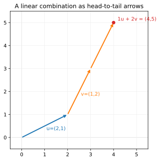

# ch02 — 向量的三張臉：箭頭、數列、抽象空間

> **本章解決什麼問題**：ch01 把方格網交給矩陣，看到「線性」就是「方格網變形後還是平行等距的方格網」。但方格網是由一個個向量（vector）撐起來的——在動詞（矩陣）登場之前（ch05），得先把名詞（向量）認清楚。本章主張：同一個向量有三張臉（幾何箭頭、座標數列、抽象空間的元素），而它只有兩個基本操作——相加與純量倍——其餘一切（span、基底、矩陣乘法、特徵向量）都是這兩個動作的後果。下一章（ch03）問「一堆向量能到達哪裡」，那是這兩個操作疊起來的直接結果。

## 從你已知的出發

你其實天天在用向量，只是沒叫它向量。

打開任何一個你寫過的監控面板，一台機器在某個時刻的狀態是一排數字：`(cpu=0.7, mem=0.4, qps=1200)`。這排數字就是一個向量——它住在一個三維空間裡，每個軸是一個指標（metric）。你把兩個時間窗的「變化量」加起來看總漂移，那就是向量加法；你把一段時間的負載「整體放大兩倍」做壓測估算，那就是純量倍（scalar multiple）。你沒有把它畫成箭頭，但你對它做的運算，逐字就是向量代數。

再往你熟的另一頭走：embedding。你知道一個詞、一張圖、一個使用者被模型壓成一個高維向量（768 維、1536 維都常見），你也知道 cosine similarity 在問「這兩個東西的方向有多像」。那個經典的玩具例子——`king − man + woman ≈ queen`——之所以成立，靠的就是向量的加減：把「king」的向量減掉「man 的成分」、加上「woman 的成分」，落點離「queen」最近。（順帶一個工程師該知道的誠實註腳：原論文在找最近鄰時會把輸入的三個詞排除掉，否則最近的其實是 king 本身——這個 `b−a+c` 的最近鄰、以及「方向多像」的長度與角度，留到 ch15 內積那章才算得準；本章先只用「相加、純量倍」這兩個不牽涉長度的操作。）

所以你對向量的機械操作並不陌生——你會把分量相加、會乘常數、會算點積的形狀。本章不重教這些。本章要補的是另一件事：**這排數字到底是什麼**。它是一個幾何物件，數字只是它在某一組座標軸下的「讀數」；換一組軸，同一個物件就換一串數字，但物件本身沒動。把這層看穿，後面整本書（尤其 ch04 換基底、ch13 對角化）才會通。

```text
你已經會的（機械）          本章要補的（它是什麼）
  (2,1)+(1,2)=(3,3)    →    兩個箭頭頭接尾，落在 (3,3)
  c·(2,1)=(2c,c)       →    把箭頭沿同方向伸長 c 倍
  一排 metric           →    高維空間裡的一個點／一支箭頭
  embedding 768 維      →    768 維空間裡的一支箭頭（畫不出來，但運算照舊）
```

## 第一張臉：幾何箭頭——向量是有方向的位移

最古老的一張臉：向量是一支**有向箭頭**——有方向、有長度的位移。physics 課本叫它「既有大小又有方向的量」，速度、力、位移都是。

這張臉有個值得記住的詞源。「vector」這個詞不是數學家憑空造的，是從天文學借來的：十八世紀把「太陽到行星的連線」叫做行星的 *radius vector*（向徑），拉丁字根 *vehere* 是「搬運、載送」（和 vehicle 同源）。是 Hamilton（漢米爾頓，William Rowan Hamilton）在 1846 年——發明四元數（quaternions）三年後——正式把 scalar（純量）和 **vector**（向量）這兩個詞引進數學的（見 ch12 會再遇到 Hamilton）。「搬運」這個原意其實抓得很準：一支箭頭就是「從這裡搬到那裡」的一個位移指令。

幾何臉最關鍵的一點，是它**沒有起點**。一支「往右 2、往上 1」的箭頭，畫在原點、畫在 (5,5)、畫在任何地方，都是同一個向量——它記的是「位移」，不是「位置」。這跟「點」不一樣（點是固定的位置），這個分別後面會踩到（見〈直覺的陷阱〉）。

用 ch01 那個會把方格網拉斜的矩陣 S 的兩行當例子（這就是 ch01 那個矩陣 S，全書脊椎，後面每一章都會回來認識它一層）。它的兩行是：

```text
u = (2, 1)        一支「往右 2、往上 1」的箭頭
v = (1, 2)        一支「往右 1、往上 2」的箭頭
```

（提醒台灣的行／列慣例，全書釘死：**行（直行，column）是矩陣縱向的一排、列（橫列，row）是橫向的一排**——和中國大陸完全相反，是惡名昭彰的陷阱。所以「S 的第一行」指的是縱向那一排，也就是 (2,1)。ch05 會講為什麼這兩行恰好是 ê₁、ê₂ 被搬到的地方。）

## 第二張臉：座標數列——向量是一串數字

第二張臉，是你寫程式時看到的那張：向量是一串數字 `(2, 1)`、`[0.7, 0.4, 1200]`、一個長度 768 的 float 陣列。資料科學裡的 feature 向量、模型裡的 embedding，都是這張臉。

這張臉的好處是**能算**。箭頭再漂亮，要把兩支箭頭相加，你還是得落到數字上：

```text
u + v = (2, 1) + (1, 2) = (2+1, 1+2) = (3, 3)     ← 對應分量各自相加
c · u = 3 · (2, 1)       = (3·2, 3·1) = (6, 3)     ← 每個分量乘上純量 c
```

但這張臉有個隱藏的前提，整本書最容易被忽略、也最值錢的一句話：**座標數列預設了一組基底（basis）**。

`(2, 1)` 這串數字本身不完整，它的完整意思是：

```text
(2, 1)  =  2 · ê₁  +  1 · ê₂      其中 ê₁=(1,0)、ê₂=(0,1) 是標準基向量
        =  「2 份『往右一格』 加 1 份『往上一格』」
```

也就是說，`(2, 1)` 是「在 ê₁、ê₂ 這組座標軸下的讀數」。換一組座標軸（換一組基向量），同一支箭頭就會被讀成另一串數字——箭頭沒動，讀數變了。這正是 ch04 換基底（change of basis）、ch13 對角化（diagonalization）的整個戲眼，這裡先埋下：**座標是名字，不是本體**。

所以幾何臉和座標臉要能自由切換：要看「它對空間做了什麼」就用箭頭（ch05 之後尤其重要），要實際算就落到數字。兩張臉是同一個物件，切換不費力，是讀線代的基本功。

## 第三張臉：抽象空間的元素——「能相加、能乘純量」就夠格

第三張臉最抽象，但它解釋了為什麼線性代數會變成「描述一切」的通用語，所以值得在這裡點一次（完整的公理化留到 ch22 收官，本章只開個門）。

問題是這樣的：到底什麼東西「算」向量？physics 說箭頭、資料說數列——但這兩個其實只是例子。數學家（Grassmann（格拉斯曼，Hermann Grassmann）1844 年的《延伸論》Ausdehnungslehre 已有雛形，Peano（皮亞諾，Giuseppe Peano）1888 年給出第一套完整公理）發現，真正定義一個向量的，**不是它長什麼樣，而是它能做什麼**：

> 一個東西要當向量，只需要兩個操作有定義、而且結果還待在同一個集合裡：
> （1）**兩個能相加**，加起來還是同類的東西；
> （2）**能乘一個純量**，乘完還是同類的東西。
> （外加一串「相加可交換、有零元、純量倍有結合律」之類的合理規矩，這裡不逐條列，留 ch22。）

這個定義刻意不提「箭頭」也不提「數字」。它只看行為。於是一個驚人的後果掉出來：**函數也是向量**。

為什麼合理？拿兩個函數 f(x)=x²、g(x)=sin x：

```text
(f + g)(x) = x² + sin x        ← 兩個函數相加，結果還是一個函數 ✓
(3 · f)(x) = 3x²               ← 函數乘常數，結果還是一個函數 ✓
```

兩個操作都有定義、結果都還是函數——所以「所有函數的集合」是一個向量空間，每個函數是裡面一支「向量」。這不是比喻，是字面成立。這扇門通向傅立葉分析（把函數拆成正弦的線性組合，見《圓的影子》ch13 的傅立葉門口）、通向無窮維空間，本書都不深入（ch22 一句帶過、指向延伸）。但它要在這裡留個印子：**線性代數研究的不是「數字表格」，是「凡是能線性組合的東西」**——所以它能套到向量、函數、訊號、機率分布、量子態上。這就是它為什麼是通用語。

這個「看行為不看長相」的轉向，是整套理論能通用的關鍵，值得多想一層。它的好處是：**只要你證明的東西只用到「相加」和「純量倍」這兩個操作，那個證明就一次套用到所有向量空間上**——對二維箭頭成立、對 768 維 embedding 成立、對函數成立、對你還沒想到的下一種對象也成立，不必重證。後面 ch03 的 span、線性獨立、基底、維度，整套詞彙都只用這兩個操作定義，所以它們對「箭頭」和對「函數」是同一套——這就是為什麼傅立葉（把函數展成正弦的線性組合）和 PCA（把資料展成主成分的線性組合）底層是同一個數學。線性代數的省力，全在於它把問題抽到「只剩兩個操作」這個高度。

當然，門檻也是真的——不是什麼集合都過關。舉個會被刷掉的例子：「所有長度恰好為 1 的二維向量」（單位圓上的箭頭）就**不是**向量空間，因為把兩個單位向量相加，結果的長度通常不是 1（(1,0)+(0,1)=(1,1)，長度是 √2，跑出集合了）——相加不封閉，當場出局。這個反例值得記住：它告訴你「封閉性」不是廢話般的形式要求，而是真的會擋掉東西的判準。（也順帶預告 ch15：為什麼談「長度」要等到內積那章——長度一旦進場，很多集合就不再是乾淨的向量空間了。）

抽象臉這裡只開門、不深入。記住一句話就夠本章用：**判斷某個東西是不是向量，問「它能不能相加、能不能乘純量，結果還在不在原集合裡」，不是問「它長不長得像箭頭」。**

## 兩個基本操作的幾何：加法與純量倍

三張臉認完，回到那兩個唯一的基本操作，看它們在幾何臉上是什麼樣子——因為下一章開始，所有東西都是這兩個動作疊出來的。

**向量加法 = 頭接尾（平行四邊形法則）。** 要算 u + v，把 v 的尾巴接到 u 的頭上，從 u 的起點到 v 的新頭，就是 u + v。等價地：把 u、v 都從原點畫出，補成一個平行四邊形，對角線就是 u + v。兩種畫法給同一個結果，因為「先走 u 再走 v」和「先走 v 再走 u」落點相同（加法可交換）。

```text
              ^ y
            5 |
            4 |
   v=(1,2)   3 |        * u+v = (3,3)
       \    2 |      /
        \   1 |    / u=(2,1)
         \  0 +--/----------> x
            0   1   2   3
   把 v 的尾巴接到 u 的頭 (2,1) 上：(2,1)+(1,2) 落在 (3,3)
```

**純量倍 = 沿同一條線伸縮（負號翻向）。** c·u 是把 u 沿它自己的方向伸長 c 倍：c=2 拉長一倍、c=0.5 縮一半、c=−1 同長度反向、c=0 縮成原點。方向只有「不變」或「相反」兩種——純量倍永遠落在 u 所在的那條過原點的直線上。這條直線（u 的所有純量倍）就是「一個向量的 span」，ch03 的起點。

**線性組合（linear combination）a·u + b·v = 全書最常出現的動作。** 把純量倍和加法合起來：先各自伸縮（a 份 u、b 份 v），再頭接尾加起來。`a·u + b·v` 這個式子，從這裡到 SVD（ch19），會出現上百次——它就是「用 u、v 當基本動作，能調配出什麼」。ch03 的 span、基底，ch05 的矩陣乘向量（Ax 就是 A 各行的線性組合），全是它。值得你現在停十秒，把「a 份這支箭頭、b 份那支箭頭、頭接尾接起來」這個畫面在腦裡轉一遍。

下面這張圖把本章的 worked example 畫出來：u=(2,1)、v=(1,2)，以及線性組合 1·u + 2·v = (4,5) 的頭接尾路徑（走一次 u、再走兩次 v）。



### Worked example：用兩張臉算同一件事

把三件事用「幾何臉」和「座標臉」各算一次，看它們必然一致。所有數值我都重算並驗算了。

**(1) u + v，幾何臉。** u=(2,1) 從原點出發到 (2,1)；把 v=(1,2) 的尾巴接上去，往右 1、往上 2，落在 (2+1, 1+2)=(3,3)。

**(1') u + v，座標臉。** 分量各自相加：(2+1, 1+2) = (3,3)。✓ 兩臉一致。

**(2) 線性組合 1·u + 2·v，座標臉。** 先算純量倍：1·u=(2,1)、2·v=(2,4)；再相加：(2+2, 1+4) = (4,5)。

**(2') 同一個組合，幾何臉。** 從原點走一支 u 到 (2,1)；接一支 v 到 (3,3)；再接一支 v 到 (4,5)。落在 (4,5)。✓ 兩臉一致——這就是上面那張圖在畫的路徑。

兩種臉、同一個答案，這不是巧合：座標臉的「分量相加」本來就是幾何臉「頭接尾」在 ê₁、ê₂ 這組軸下的算法。哪張臉好用就用哪張——直覺用箭頭，計算用數字。

## 直覺的陷阱

向量這個概念最常出事的地方，恰恰在於它有三張臉而你只記得一張。下面三條，每一條都會在後面某一章把你帶溝裡，先標出來。

| 陷阱 | 錯誤直覺 | 會在哪裡害你 | 怎麼自我察覺 |
|---|---|---|---|
| **把向量當成「就是一串數字」** | 向量 = 那串數字本身，數字就是它的本體 | ch04 換基底、ch13 對角化會完全卡住：你會以為「換座標數字就變了，那不就變成另一個向量了嗎？」其實箭頭沒動，只是讀數變了 | 問自己：「如果我換一組座標軸，這串數字會變嗎？」會變——所以數字不是本體，是某組軸下的讀數 |
| **座標依賴基底，卻被當成絕對** | `(2,1)` 是這個向量「真正的、唯一的」名字 | ch04／ch13／ch20（PCA 換到主成分座標）全建在「同一向量、不同基底、不同座標」上；把座標當絕對，這些章的核心動作（換到對的座標讓問題變簡單）就無法理解 | 看到一串座標就追問「相對於哪組基底？」——預設是標準基底 ê₁,ê₂，但不是唯一 |
| **把「點」和「位移向量」混為一談** | 位置和位移是同一回事 | 線性變換把原點釘在原點（ch01），所以它作用的是「位移向量」（從原點出發的箭頭），不是任意位置的點；平移（x→x+c）會動到原點，所以**平移不是線性變換**（ch01 已點出、ch05 會再用）——若把點和位移混著想，會誤以為平移也能寫成矩陣 | 問：「這個東西有沒有固定起點？」有起點的是點（位置）；可以自由平移、只記方向與長度的是位移向量 |

第三條特別值得多說一句。一支「往右 2、往上 1」的位移向量，畫在哪都一樣；但「座標 (2,1) 這個點」是平面上一個固定位置。線代裡我們常把點和「從原點到該點的位移向量」當同一個用（很方便），但它們概念上不同——而這個不同正是「為什麼平移不是線性、旋轉縮放才是」的根。記住：**線性變換搬的是箭頭、不是釘在地上的點，所以原點這支零向量永遠不動。**

## 紙上推演

動手做。每題標了預估時間與難度，先自己算，再看〈推演解答〉。

**第 1 題 [10 分鐘] ★★** — (4,5) 是不是 u=(2,1) 與 v=(1,2) 的線性組合？
要找有沒有純量 a、b 使得 a·(2,1) + b·(1,2) = (4,5)。把它拆成兩個方程，解出來，並**代回原式驗證**。（這題正是上面那張圖的反問：圖裡用了 a=1、b=2；這裡假裝不知道，從零解。）

**第 2 題 [8 分鐘] ★** — 說明「函數也是向量」為什麼合理。
具體舉 f(x)=x²、g(x)=x，把 f+g 和 2·f 寫出來，指出為什麼這兩個操作讓「所有函數的集合」夠格當向量空間。一句話即可，但要點到「結果還在原集合裡」。

**第 3 題 [10 分鐘] ★★** — 把一個工程量描述成向量，並說它住在幾維空間。
拿你熟的東西（一台機器的 metric、一個 HTTP 請求的特徵、一個使用者的 embedding），寫出它的分量、說它住在幾維、並指出「向量加法」在這個場景下的白話意義是什麼。

### 推演解答

**第 1 題。** 要解 a·(2,1) + b·(1,2) = (4,5)。攤開成分量：

```text
第一分量：2a + 1b = 4
第二分量：1a + 2b = 5
```

用你熟的消去法。把第一式乘 2：4a + 2b = 8；減第二式（a + 2b = 5）：

```text
(4a + 2b) − (a + 2b) = 8 − 5
        3a           = 3      →  a = 1
代回第二式：1 + 2b = 5         →  2b = 4  →  b = 2
```

所以 a=1、b=2。**代回原式驗證**（這步不能省，矩陣／向量運算最容易算錯）：

```text
1·(2,1) + 2·(1,2) = (2,1) + (2,4) = (2+2, 1+4) = (4,5)  ✓
```

成立——(4,5) 是 u、v 的線性組合，係數 (1,2)。

值得停一下看這題的弦外之音：我們其實是在問「(4,5) 在不在 u、v 的 span 裡」，而且因為解唯一（a=1、b=2 是唯一答案），代表 u、v 是兩個獨立的方向、足以表示平面上任何一點——它們其實是 ℝ² 的一組基底。這兩個詞（span、基底）是 ch03 的主角，這裡你已經用一個聯立方程把它們摸到了。另外，這個「解 a·u + b·v = 目標」的動作，到 ch05 你會重新認出來：它就是在解 Sx = (4,5)（S 的兩行正是 u、v），ch07 會從「行視角」再講一次同一件事。同一個聯立方程，三章三種讀法。

**第 2 題。** 取 f(x)=x²、g(x)=x：

```text
(f + g)(x) = x² + x      ← 還是一個函數（對每個 x 給一個值）✓
(2 · f)(x) = 2x²         ← 還是一個函數 ✓
```

兩個操作（函數相加、函數乘常數）都有良好定義，而且**結果仍然是函數**（沒有跑出「所有函數的集合」之外）。這正是第三張臉要求的兩件事：相加封閉、純量倍封閉。所以「所有函數」構成一個向量空間，每個函數是其中一支向量。關鍵不在於函數「長得像不像箭頭」（完全不像），而在於它「能不能線性組合」——能，所以它是向量。

**第 3 題（範例答案，你的版本可不同）。** 一台機器的即時狀態：`m = (cpu, mem, qps, p99_latency) = (0.7, 0.4, 1200, 85)`，住在 4 維空間（4 個指標、4 個軸）。向量加法的白話意義：若 `Δ = (0.1, 0.05, 300, 10)` 是「加一台同型機器後的增量」，則 `m + Δ` 是疊加後的預估狀態——**向量加法 = 把兩組變化疊起來**。注意這裡「分量單位不同（比率、筆數、毫秒）」也沒關係，向量代數不在乎單位，它只要求「能對應分量相加、能整體乘純量」——這也呼應第三張臉：夠格當向量，靠的是操作有定義，不是分量有沒有共同物理意義。

### 動手生圖

本章的圖就是本章的小實驗：把 u=(2,1)、v=(1,2) 和線性組合 1·u + 2·v = (4,5) 的頭接尾路徑畫出來，眼睛確認「座標算出的 (4,5)」和「箭頭一步步走到的落點」是同一個點。腳本如下（與 `figures/ch02-linear-combination.py` 逐字一致）：

```python
# ch02 figure: linear combination 1*(2,1)+2*(1,2)=(4,5) drawn head-to-tail,
# so the geometric "face" and the coordinate "face" land on the same point.
from pathlib import Path
import numpy as np
import matplotlib
matplotlib.use("Agg")          # headless; no display needed
import matplotlib.pyplot as plt

OUT = Path(__file__).resolve().parent / "out" / "ch02-linear-combination.svg"
OUT.parent.mkdir(parents=True, exist_ok=True)

u = np.array([2.0, 1.0])       # vector u; columns of the spine matrix S later
v = np.array([1.0, 2.0])       # vector v
# combination 1*u + 2*v: walk u once, then v twice -> path through these knots
knots = np.array([[0, 0], u, u + v, u + 2 * v])   # ends at (4,5)

fig, ax = plt.subplots(figsize=(5, 5))
ax.axhline(0, color="0.85", lw=0.8); ax.axvline(0, color="0.85", lw=0.8)
for x in range(6):             # faint integer grid so the lattice is visible
    ax.axvline(x, color="0.92", lw=0.6); ax.axhline(x, color="0.92", lw=0.6)

# the three head-to-tail steps: u (once), then v (twice)
seg = [(knots[0], u, "C0", "u=(2,1)"),
       (knots[1], v, "C1", "v=(1,2)"),
       (knots[2], v, "C1", None)]
for start, step, col, lab in seg:
    ax.annotate("", xy=start + step, xytext=start,
                arrowprops=dict(arrowstyle="->", color=col, lw=2))
    if lab:
        mid = start + step / 2
        ax.text(mid[0] + 0.08, mid[1] - 0.18, lab, color=col)

ax.plot(4, 5, "o", color="C3")                       # the result (4,5)
ax.annotate("1u + 2v = (4,5)", (4, 5),
            textcoords="offset points", xytext=(8, 4), color="C3")
ax.set_xlim(-0.5, 5.5); ax.set_ylim(-0.5, 5.5)
ax.set_aspect("equal")         # honest lengths/angles for the arrows
ax.set_title("A linear combination as head-to-tail arrows")
fig.savefig(OUT, bbox_inches="tight")
print("wrote", OUT)            # build_figures.py reads this
```

**預期輸出**：一張 5×5 的 SVG，淡灰整數格線上有三支箭頭——一支藍色 u=(2,1) 從原點出發，接兩支橘色 v=(1,2)，依序經過 (2,1)→(3,3)→(4,5)，終點 (4,5) 標一個紅點。

**改參數看什麼**：
- 把 `knots` 與 `seg` 裡的係數改成 `1*u + 1*v`，終點會落在 (3,3)——就是本章第一個 worked example 的 u+v。
- 把係數改成 `2*u + 1*v`，先走兩支 u 再走一支 v，終點落在 (5,4)；試著預測落點再跑，確認你能「座標臉先算、幾何臉再驗」。
- 把 v 改成 `2*u`（也就是 (4,2)，u 的兩倍），你會發現不管怎麼調 a、b，落點永遠在 u 那條線上、出不了那條直線——因為 v 不再帶來新方向。這正是 ch03 線性相依（linear dependence）的畫面，這裡先用眼睛看到它。

## 自我檢核

口頭自答，講得出來才算過關——對著另一個工程師講，講不清楚就是還沒懂。

1. 一個向量的三張臉各是什麼？同一個 `(2,1)` 怎麼同時是箭頭、是數列、又是抽象空間的元素？
2. 向量只有哪兩個基本操作？為什麼說「其餘一切都是這兩個的後果」？
3. 為什麼說「座標只是名字、不是本體」？換一組基底時，是箭頭變了還是數字變了？
4. 「函數也是向量」——你怎麼用「兩個基本操作」說服一個懷疑的同事這句話字面成立？
5. 線性組合 a·u + b·v 在幾何上是什麼畫面？為什麼說它是全書最常出現的動作？
6. 為什麼平移（x → x+c）害你想把「點」當「位移向量」時會出錯？這跟「線性變換把原點釘住」有什麼關係？
7. （承上題的反向）為什麼「向量沒有固定起點、畫在哪都一樣」這件事，對「向量加法是頭接尾」很關鍵？

## 延伸閱讀

- **3Blue1Brown《Essence of Linear Algebra》第 1 章 "Vectors, what even are they?"**（Grant Sanderson，YouTube 免費）。本章三張臉的視覺版聖經：他用「物理（箭頭）／資料（數列）／數學（抽象）」三種觀點開場，和本章完全同調，加法與純量倍的動畫看一次勝過讀十遍。看 0:00–7:00 那段。
- **Gilbert Strang，MIT 18.06，Lecture 1（MIT OpenCourseWare，免費）**。Strang 開宗明義從「行的線性組合」切入向量，把本章第 1 題（解 a·u+b·v=目標）直接接到 ch05 的矩陣乘法——想先嚐後面行視角的味道可以看。
- **Sheldon Axler，《Linear Algebra Done Right》第四版（線上免費 Open Access PDF，linear.axler.net）第 1 章**。本章第三張臉（抽象向量空間）的嚴格版：Axler 從向量空間公理出發、刻意把「箭頭」放到很後面，正好和本書「幾何優先」相反——想看「先公理後幾何」長什麼樣、為什麼本書不走那條路，對照讀一章很有啟發（本書 ch22 才回到公理）。
