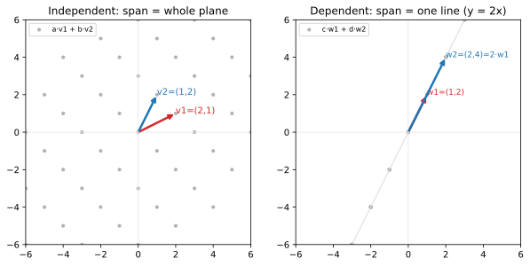

# ch03 — span、線性獨立與基底：你能到達哪裡、要幾個方向

> **本章解決什麼問題**：ch02 給了你向量的三張臉，以及向量唯一的兩個動作——相加與純量倍。把這兩個動作放開來反覆做，會問出三個連在一起的問題：用一組向量「能到達哪裡」（span／生成空間）、這組向量裡「有沒有人是多餘的」（線性獨立／相依）、以及「剛好夠用又不重複的最小一組」長什麼樣（基底）。這三個概念是整本書的座標系地基——ch04 的換基底、ch10 的秩、ch11 的特徵向量、ch20 的 PCA 降維，全都站在「你真正需要幾個獨立方向」這個問題上。本章還不碰矩陣（ch05 才開始），只在你已經會的 ℝ²／ℝ³ 裡，把「方向」這件事看清楚。

## 從你已知的出發

你大概遇過這種事。一張監控面板上掛了五條 metric：每秒請求數 qps、CPU 使用率、記憶體佔用、平均延遲、佇列長度。你盯久了會發現一件事——它們不是五個獨立的旋鈕。qps 一上去，CPU 跟著上、佇列跟著長、延遲跟著爬。某幾條線根本是另外幾條的「影子」：你只要知道 qps 和記憶體，剩下三條大致就能推出來。

用線代的話講，這五個 metric 向量是**線性相依**（linearly dependent）的——其中有些可以被其他幾個「組」出來，它們沒帶來新的方向。真正獨立的「旋鈕」可能只有兩三個。這正是 PCA 降維（見 ch20）在做的事：把一堆互相牽連的 feature 壓成幾個真正獨立的方向。你早就有這個直覺，只是沒給它名字。

反過來，「**基底**」（basis）就是一組不重複又夠用的座標軸。你天天在用：RGB 三個通道是顏色空間的一組基底——任何顏色都是 R、G、B 的某種組合（線性組合的老朋友又出現了），而且少一個就配不出某些顏色（夠用），多一個又冗餘（不重複）。經緯度是地表位置的基底。一個 commit 的 (檔案路徑, 行號) 是定位一行程式碼的基底。基底的精神就一句話：**剛好夠用、一個不多一個不少**。

而「**維度**」（dimension）就是你真正需要幾個獨立旋鈕。五條 metric 住在「看起來五維」的空間裡，但如果真正獨立的只有兩個方向，這堆資料的維度其實是 2。維度不是「你列了幾個欄位」，是「拆到底有幾個不能互相取代的方向」。這個區分——**列了幾欄 vs 真正幾維**——是本章最值錢的一塊，也是 ch10 秩與 ch20 降維的種子。

這三件事——能到達哪裡、有沒有多餘的、剛好夠用的最小一組——是同一個故事的三段。我們一個一個看。

## span：一組向量能到達的所有地方

先釘一個本章會反覆用的詞。**線性組合**（linear combination，ch02 已介紹）就是把幾個向量各乘一個純量再加起來：a·v₁ + b·v₂ + …。係數 a、b 可以是任何實數（正、負、零、小數都行）。

**span（生成空間）就是：給你一組向量，它們所有線性組合的集合**。換句話說，是「從這些向量出發，用相加和純量倍，你能走到的所有點」。記法是 span{v₁, v₂, …}。

這個定義抽象，但幾何上極具體。我們在 ℝ²（平面）裡一個一個數：

**一個向量的 span 是一條線**（除非它是零向量）。拿 v=(2,1)。它的所有線性組合就是 a·(2,1)，a 跑遍所有實數：a=1 給 (2,1)、a=2 給 (4,2)、a=0.5 給 (1,0.5)、a=−1 給 (−2,−1)、a=0 給原點。把這些點全畫出來，它們落在同一條穿過原點、斜率 1/2 的直線上。一個非零向量只能往「它自己的方向和反方向」伸縮，所以 span 就是那條線。

```text
span{(2,1)}：所有 a·(2,1)            一個向量 → 一條過原點的線
                                    （往它的方向和反方向無限延伸）
            ·(4,2)
        ·(2,1)
    ·(1,0.5)
 (0,0)
·(−2,−1)
```

**兩個「方向不同」的向量的 span 是整個平面**。拿 v₁=(2,1)、v₂=(1,2)。現在你有兩個獨立的旋鈕：a 調 v₁ 的份量、b 調 v₂ 的份量。問題變成——平面上任何一個點 (x,y)，能不能找到 a、b 讓 a·(2,1)+b·(1,2)=(x,y)？

這是兩個方程式：

```text
a·(2,1) + b·(1,2) = (x, y)
 → 2a + b = x        ← 第一個分量
 →  a + 2b = y       ← 第二個分量
```

兩個未知數 a、b、兩條方程式。只要這兩個方向不平行，這個系統對**任何** (x,y) 都有解——你總能調出對的 a、b 走到任何地方。所以 span{(2,1),(1,2)} = 整個 ℝ²。本章的圖左半邊就在畫這件事：把 a、b 取一堆整數值，a·(2,1)+b·(1,2) 的落點鋪滿整個平面（取實數值就真的填滿每一個點）。

**兩個「方向相同」的向量的 span 還是只有一條線**。拿 w₁=(1,2)、w₂=(2,4)。注意 w₂=2·w₁——它們指向同一個方向。現在不管你怎麼調 c、d：

```text
c·(1,2) + d·(2,4) = c·(1,2) + d·2·(1,2) = (c + 2d)·(1,2)
```

整串東西塌成「某個係數乘 (1,2)」——還是 (1,2) 的倍數，還是那條斜率 2 的線（y=2x）。第二個向量 w₂ **沒帶來任何新方向**，它只是 w₁ 的回音。圖的右半邊就是這個：兩個向量加上它們的所有組合，全部躺在同一條線上。

這就是 span 的幾何節奏：**每加一個「真正新」的方向，span 就升一維**——點（零向量）→ 線 → 面 → 體。但加一個「舊方向的倍數」，span 紋風不動。這個「新 vs 舊」的判準，正是下一節要釘死的：線性獨立。

## 線性獨立：沒有人是多餘的

上面那個對比已經把答案逼出來了。{(2,1),(1,2)} 撐起整個平面，{(1,2),(2,4)} 只撐起一條線。差別在哪？差在後者的第二個向量「躺在第一個的 span 裡」——它是多餘的。

**線性獨立**（linear independence）的白話定義：**一組向量裡，沒有任何一個能被其他向量的線性組合表出**。每個向量都帶來別人給不了的新方向。反過來，**線性相依**（linear dependence）：**至少有一個向量躺在其他向量的 span 裡**，它是多餘的。

「躺在別人的 span 裡」幾何上很清楚：

- 兩個向量相依 ⟺ **共線**（colinear）——同一條過原點的線上（一個是另一個的倍數）。
- 三個向量相依 ⟺ **共面**（coplanar）——同一個過原點的平面上（其中一個是另外兩個的組合）。

這裡有一個讓判斷變乾淨的等價說法，值得停下來看。我們說「v₂ 是 v₁ 的倍數」是相依，但「誰是誰的倍數」聽起來不對稱。更對稱、更通用的講法是看**這個方程式**：

```text
a·v₁ + b·v₂ + … = 0        （右邊是零向量）
```

問：能不能找到「不全為零」的係數 a、b、…，讓組合等於零向量？

- 如果**唯一**的解是 a=b=…=0（全部係數都得是零才湊得出零向量），這組向量**線性獨立**。
- 如果存在**某組不全為零**的係數也能湊出零向量，這組向量**線性相依**。

為什麼這個方程式抓得住「多餘」？假設有不全為零的解，比方說 b≠0，那你就能把 v₂ 解出來：v₂ = −(a/b)·v₁ − …，這正是「v₂ 被其他人組出來」＝多餘。反過來，如果誰都組不出零向量（除了全零這個無聊解），就沒有人能被別人表出，誰都不多餘。兩個說法是同一件事的兩面。這個「組出零向量」的判準是現代線代的標準定義（Axler《Linear Algebra Done Right》第 2 章就這麼定），好處是它對任意多個向量、任意維度都一視同仁，不必去挑「誰是誰的倍數」。

> **嚴謹度標示（工程師的嚴謹）**：上面這段「兩個說法等價」我沒寫「顯然」，是因為它真的需要那一步代數（b≠0 才能除）。但它就是國中等式移項，每一步你都講得出理由——這是本書要的嚴謹層級：不是形式證明，是「每步能口頭說出為什麼」。

用相依的方程式重看 {(1,2),(2,4)}：取 a=2、b=−1，則 2·(1,2)+(−1)·(2,4) = (2,4)−(2,4) = (0,0)。找到了不全為零的係數湊出零向量 → 相依。確認。而 {(2,1),(1,2)}：要 a·(2,1)+b·(1,2)=(0,0)，攤開是 2a+b=0 且 a+2b=0，解出來只有 a=b=0（第一式給 b=−2a，代入第二式 a+2(−2a)=−3a=0 → a=0 → b=0）→ 獨立。也確認。

**「相依」是一句話的省話：方向有重複，所以撐不滿應該撐的維度**。這個直覺後面會一路用到——ch09 行列式為什麼 det=0 等於行相依、ch10 秩在數「真正有幾個獨立方向」、ch20 PCA 為什麼能降維，底層都是這一句。



## 基底：剛好夠用又不重複

現在把兩個概念裝在一起。**基底**（basis）＝**線性獨立 ＋ 生成全空間**。一組向量如果（1）彼此線性獨立（沒人多餘）而且（2）它們的 span 是整個空間（夠用），就叫這個空間的一組基底。

兩個條件對應兩種失敗：

- 不夠獨立（有多餘）＝**浪費**：你帶了重複的方向，其中一個刪掉 span 也不變。
- 不夠生成（撐不滿）＝**不夠**：有些點你永遠走不到。

基底是這兩種失敗之間的甜蜜點：**剛好夠用，一個不多、一個不少**。少一個就撐不滿，多一個就有冗餘。這個「剛好」不是修辭，是可以證明的——對有限維空間，基底就是「最大的線性獨立集」，同時也是「最小的生成集」，兩個極端在同一組向量上相遇。

**標準基底**（standard basis）是最熟的一組。在 ℝ² 裡是 ê₁=(1,0)、ê₂=(0,1)：

```text
ê₁ = (1, 0)        任何 (x, y) = x·ê₁ + y·ê₂
ê₂ = (0, 1)        所以座標 (x, y) 其實就是「x 個 ê₁ 加 y 個 ê₂」
```

這揭穿了一件 ch02 埋過、ch04 要展開的事：**你寫 (3,3) 的時候，已經偷偷選了一組基底**——標準基底。(3,3) 的意思是「3 個 ê₁ 加 3 個 ê₂」。換一組基底，同一個幾何向量就換一串座標讀數（這是 ch04 的主戲，也是 ch13 對角化好用的根源）。在 ℝⁿ 裡標準基底就是 ê₁…êₙ，第 i 個在第 i 位放 1、其餘放 0。

關鍵是——**基底不唯一**。{(2,1),(1,2)} 也是 ℝ² 的一組完美基底（下一節 worked example 會把它驗到底），{(1,0),(1,1)} 也是，斜的、歪的都行，只要獨立且生成。標準基底只是「最方便」的一組，不是「唯一對的」一組。把基底當成「描述空間的一套座標語言」，而同一個空間有無數種語言可選——這個鬆綁是線代的自由度來源，整本書反覆在用「換一套更好的語言」（換基底）把難題變簡單。

## 維度：跟你選哪組基底無關

不同的基底有不同的向量，但有件事它們全都一樣：**向量的個數**。ℝ² 的任何一組基底都剛好有 2 個向量。{(1,0),(0,1)}、{(2,1),(1,2)}、{(1,0),(1,1)}——統統 2 個。ℝ³ 的任何基底都剛好 3 個。

這個「個數」就是**維度**（dimension）：一個空間的維度＝它任何一組基底的向量個數。ℝ² 維度 2、ℝ³ 維度 3、ℝⁿ 維度 n。維度就是本章開頭那句話的精確版——**你真正需要幾個獨立旋鈕才能到達整個空間**。

但這裡藏著一個容易被滑過去、其實需要證明的事實：**為什麼任兩組基底的向量個數一定相同？** 萬一某個空間有一組基底是 2 個向量、另一組是 3 個向量，「維度」這個詞就沒意義了。它沒有發生，但這不是顯然的，需要論證。

核心引理是這句話（現代線代的標準起手式，Axler 第 2 章就靠它）：

> **在 ℝⁿ 那樣的空間裡，一組線性獨立的向量，個數不可能超過任何一組生成集的個數。**

直覺版的理由：生成集的每個向量是「可用的方向」，獨立集的每個向量要「用掉一個真正新的方向」。你能塞進去的獨立向量，不可能比可用方向還多——多了就一定有人重複（相依）。把這個引理對「兩組都是基底」用兩次（A 獨立、B 生成 → A 不多於 B；B 獨立、A 生成 → B 不多於 A），就逼出 A、B 個數相等。於是維度有定義、跟你選哪組基底無關。

這個引理的嚴格版本叫 **Steinitz 替換引理**（Steinitz exchange lemma），由 Ernst Steinitz 於 1913 年正式發表（雛形可追到 Grassmann 1862 年改寫版的《延伸論》）。本書的態度是：**直覺帶過，嚴格證明指向延伸閱讀**（Axler 把這條和它的推論寫得最乾淨）。你需要記住的是結論和那句直覺——「獨立的不可能比生成的多」——而不是證明的每個轉折。

> **嚴謹度標示（直覺版）**：上面「維度有定義」我給的是直覺論證 ＋ 一個有名字的定理當靠山，不是完整證明。一般 n 維的嚴格證明本書不展開（見《Linear Algebra Done Right》第 2 章）。我刻意不寫「易證」——它不難但需要那個替換引理，把它當顯然會錯過為什麼維度這個詞站得住腳。

這個引理還順手給你一個本章紙上推演會用到的推論：**ℝⁿ 裡任何超過 n 個向量一定線性相依**。因為標準基底 n 個向量就生成了整個 ℝⁿ，由引理，任何獨立集最多 n 個；超過 n 個就不可能獨立，只能相依。所以 ℝ² 裡任三個向量必相依，ℝ³ 裡任四個必相依——擠不下。維度是天花板。

## 直覺的陷阱

這四個概念彼此咬合得很緊，最容易出的錯都是「把咬合處看錯」。

| 陷阱 | 錯誤直覺 | 它在哪一步把你帶溝裡 | 怎麼自我察覺 |
|---|---|---|---|
| **span 與線性獨立混淆** | 以為兩者在問同一件事 | span 問「能到達哪裡」（涵蓋範圍），線性獨立問「有沒有多餘」（有無冗餘）。一組向量可以 span 整個平面但相依（如三個向量撐滿平面，但其中一個多餘）；也可以獨立但 span 不滿（如 ℝ³ 裡兩個獨立向量只 span 一個平面） | 把問句講出來：你在問「夠不夠到」還是「有沒有多」？兩個不同的問題 |
| **「兩個向量」當然就獨立** | 看到兩個不同向量就以為獨立 | 只要它們共線（一個是另一個的倍數），就相依。(1,2) 和 (2,4) 是兩個「不同的」向量，但相依 | 先檢查：其中一個是不是另一個的倍數？是 → 相依，不管它們長得多不一樣 |
| **以為基底唯一** | 把標準基底當成「那個」基底 | 基底有無數組，{(2,1),(1,2)} 跟 {(1,0),(0,1)} 一樣是 ℝ² 的合法基底。卡在「標準基底才對」會擋住 ch04 換基底、ch13 對角化的整套思路 | 問自己：這組向量獨立嗎？生成嗎？兩個都 yes 就是合法基底，跟標不標準無關 |
| **維度＝向量個數 vs 分量個數** | 把「列了幾欄」當成維度 | 三個向量 (2,1)、(1,2)、(0,1) 各有 2 個分量，住在 ℝ²，維度是 2 不是 3；它們作為一組必相依。混淆「有幾個向量」「每個向量幾個分量」「span 是幾維」會全盤算錯 | 分清三個數：向量的「個數」、每個向量的「分量數」（決定住在 ℝ 幾）、它們 span 出來的「維度」。三者常常不相等 |
| **相依＝某兩個成倍數** | 以為只要兩兩都不成倍數就獨立 | 三個以上向量時，相依不一定是「某兩個共線」，可以是「一個＝另外兩個的組合」。(1,0)、(0,1)、(1,1) 兩兩都不成倍數，卻相依（第三個＝前兩個之和） | 多於兩個向量時，別只檢查兩兩倍數；要問「有沒有人能被其他人組出來」（或在 ℝⁿ 直接數：超過 n 個就必相依） |

最後一個陷阱是 ch10「秩虧空悄悄發生」的種子：你以為手上有 n 個獨立約束，其實只有 r 個，因為某幾個是別的組合——這在工程裡會讓你以為定死了系統、實際上還有自由度在晃。記住分清「列了幾個」和「真正獨立幾個」，這個區分後面值很多錢。

## 紙上推演

### 推演題

**第 1 題 [10 分鐘] ★** 判斷下列三組向量各自線性獨立還是相依，並說出**幾何理由**（不要只報答案）：
(a) {(2,1), (1,2)}　(b) {(1,2), (2,4)}　(c) {(2,1), (1,2), (0,1)}

**第 2 題 [10 分鐘] ★** 證明：ℝ² 裡任意三個向量一定線性相依。用本章的維度引理，不要硬解方程。

**第 3 題 [15 分鐘] ★★** 你的同事說：「我有五條互不相同的 metric，所以我的監控資料是五維的。」用本章的語言指出這句話錯在哪、正確的說法該怎麼講。然後把「這幾條 metric 互推得出」翻成精確的線代敘述。

**第 4 題 [10 分鐘] ★** 口頭題：對一個沒學過線代的同事，用「能到達哪裡」這一個比喻，講清楚 span 和線性獨立的差別。錄音或寫成三句話。

### 推演解答

**第 1 題。**

(a) {(2,1),(1,2)} —— **獨立**。幾何理由：兩個向量不共線（誰都不是對方的倍數——若 (1,2)=k·(2,1)，則 2k=1 且 k=2，矛盾）。代數確認：a·(2,1)+b·(1,2)=(0,0) 給 2a+b=0、a+2b=0，唯一解 a=b=0。兩個獨立方向 → span 整個平面。

(b) {(1,2),(2,4)} —— **相依**。幾何理由：共線，(2,4)=2·(1,2)，第二個是第一個的倍數，沒帶新方向。代數確認：取 a=2、b=−1，2·(1,2)+(−1)·(2,4)=(0,0)，不全為零的係數湊出零向量。span 塌成一條線 y=2x。

(c) {(2,1),(1,2),(0,1)} —— **相依**。最快的理由：**三個向量住在 ℝ²（維度 2），超過 2 個必相依**（本章維度引理的推論，擠不下）。具體看是誰多餘：前兩個 {(2,1),(1,2)} 已經是 ℝ² 的基底（由 (a)），所以 (0,1) 一定能被它們組出來——解 a·(2,1)+b·(1,2)=(0,1) 得 2a+b=0、a+2b=1 → a=−1/3、b=2/3。代回驗證：(−1/3)·(2,1)+(2/3)·(1,2) = (−2/3+2/3, −1/3+4/3) = (0,1) ✓。所以 (0,1) 是多餘的方向，整組相依。

**第 2 題。** ℝ² 由標準基底 {ê₁,ê₂}（2 個向量）生成。由本章維度引理「線性獨立集的個數不可能超過任何生成集的個數」，ℝ² 裡任何線性獨立集最多 2 個向量。三個向量超過 2 個，因此不可能獨立，只能相依。（這比硬解 3 個未知數的齊次方程乾淨：引理把「擠不下」一句話講完。）

**第 3 題。** 錯在把「**分量個數**」（每條 metric 各有一個讀數、五條湊成 ℝ⁵ 的一個向量）當成了「**維度**」（資料真正有幾個獨立方向）。五條 metric 確實讓每筆觀測住在 ℝ⁵ 裡，但如果這些 metric 互相牽連——qps 一動，CPU／佇列／延遲跟著動——那麼一段時間蒐集到的觀測點，實際上**躺在 ℝ⁵ 的一個低維子空間裡**（比方一個 2 維平面）。資料的「內在維度」是那個子空間的維度，不是 5。

正確說法：「我有五條 metric，所以每筆觀測是 ℝ⁵ 的向量；但這些 metric 線性相依，資料實際上只在一個低維子空間裡變動，內在維度遠小於 5。」「這幾條 metric 互推得出」的精確版：**某幾條 metric 向量是其他幾條的線性組合（相依），所以它們不增加 span 的維度**。找出那個低維子空間、用它的維度當「真正幾維」——這就是 PCA 降維（見 ch20）在做的事。

**第 4 題（參考答案）。** 「想像你只能走某幾個固定方向、走多遠隨你。**span 是問你『最後能走到哪片地方』**——一個方向只能走到一條線上，兩個不同方向能走遍整片地。**線性獨立是問你『有沒有帶到重複的方向』**——如果第二個方向跟第一個一模一樣（或剛好反向），它就白帶了，你還是只能走那條線。能到哪是 span，有沒有白帶是獨立。」

### 動手生圖

本章的圖把「獨立 → span 整片平面」和「相依 → span 塌成一條線」並排畫出來。左圖取 v₁=(2,1)、v₂=(1,2) 的整數線性組合（係數從 −4 到 4），落點鋪滿整個格點平面（取實數值就真的填滿）；右圖取 w₁=(1,2)、w₂=(2,4)=2·w₁ 的所有組合，全部躺在 y=2x 那條線上。

```python
# ch03 figure: independent vectors span the plane vs collinear vectors span a line
from pathlib import Path
import numpy as np
import matplotlib
matplotlib.use("Agg")          # headless; no display needed
import matplotlib.pyplot as plt

OUT = Path(__file__).resolve().parent / "out" / "ch03-span-independence.svg"
OUT.parent.mkdir(parents=True, exist_ok=True)

fig, (axL, axR) = plt.subplots(1, 2, figsize=(10, 5))
rng = range(-4, 5)                              # integer combination coeffs a, b

# LEFT: v1=(2,1), v2=(1,2) are independent -> combinations fill the plane (lattice)
v1, v2 = np.array([2, 1]), np.array([1, 2])
pts = np.array([a * v1 + b * v2 for a in rng for b in rng])
axL.scatter(pts[:, 0], pts[:, 1], s=10, color="0.7", label="a·v1 + b·v2")
for v, col, name in [(v1, "tab:red", "v1=(2,1)"), (v2, "tab:blue", "v2=(1,2)")]:
    axL.annotate("", xy=v, xytext=(0, 0), arrowprops=dict(arrowstyle="->", color=col, lw=2.5))
    axL.annotate(name, xy=v, color=col, fontsize=10)
axL.set_title("Independent: span = whole plane")

# RIGHT: w1=(1,2), w2=(2,4)=2*w1 are collinear -> every combination lands on y=2x
w1, w2 = np.array([1, 2]), np.array([2, 4])
line = np.array([a * w1 + b * w2 for a in rng for b in rng])     # all on the line
axR.plot([-6, 6], [-12, 12], color="0.85", lw=1)                 # the line y = 2x
axR.scatter(line[:, 0], line[:, 1], s=10, color="0.7", label="c·w1 + d·w2")
for v, col, name in [(w1, "tab:red", "w1=(1,2)"), (w2, "tab:blue", "w2=(2,4)=2·w1")]:
    axR.annotate("", xy=v, xytext=(0, 0), arrowprops=dict(arrowstyle="->", color=col, lw=2.5))
    axR.annotate(name, xy=v, color=col, fontsize=9)
axR.set_title("Dependent: span = one line (y = 2x)")

for ax in (axL, axR):
    ax.axhline(0, color="0.9", lw=0.8); ax.axvline(0, color="0.9", lw=0.8)
    ax.set_xlim(-6, 6); ax.set_ylim(-6, 6)
    ax.set_aspect("equal"); ax.legend(loc="upper left", fontsize=8)

fig.savefig(OUT, bbox_inches="tight")
print("wrote", OUT)             # build_figures.py reads this
```

**預期輸出**：左圖一片灰色格點鋪滿 −6 到 6 的整個平面，紅藍兩個箭頭 v₁、v₂ 指向不同方向；右圖所有灰點擠在一條斜率 2 的直線上，紅藍兩個箭頭 w₁、w₂ 指向同一個方向（w₂ 是 w₁ 的兩倍長）。終端印出 `wrote …/ch03-span-independence.svg`。

**改參數看什麼**：把右圖的 `w2 = np.array([2, 4])` 改成 `w2 = np.array([1, 0])`（讓它跟 w₁ 方向不同），右圖的點就會從一條線**炸開鋪滿整個平面**——你親眼看到「相依 → 獨立」那一刻 span 從一維跳成二維。反過來，把左圖的 `v2` 改成 `v2 = np.array([4, 2])`（＝2·v₁），左圖就會**塌成一條線**——獨立變相依，span 從整片掉回一條線。這兩個改動是本章的核心對比：**一個向量「躺進另一個的方向」的瞬間，你損失一整個維度**。

## 自我檢核

口頭自答，講得出來才算過關：

1. 用「能到達哪裡」一句話分別講清楚 span 和線性獨立在問什麼，並說出為什麼它們是兩個不同的問題。
2. 為什麼 (1,2) 和 (2,4) 雖然是兩個不同的向量，卻線性相依？它們的 span 是什麼形狀？
3. 「組出零向量」的判準（a·v₁+b·v₂+…=0 只有全零解 ⟺ 獨立）為什麼能抓住「有沒有人多餘」？把這個等價講給人聽。
4. 基底的兩個條件（獨立、生成）各自對應哪一種失敗？少一個條件會怎樣、多一個會怎樣？
5. 為什麼基底不唯一，但任兩組基底的向量個數一定相同？（提示：那個「獨立的不可能比生成的多」引理。）
6. ℝ² 裡為什麼任三個向量必相依？用維度引理，不用解方程。
7. 「五條 metric 所以資料五維」錯在哪？分清「分量個數」「向量個數」「span 的維度」三個數。
8. 把右圖的相依向量改成一個新方向，span 會發生什麼？這對應幾何上的什麼事件？

## 延伸閱讀

- **3Blue1Brown,《Essence of Linear Algebra》第 2 章「Linear combinations, span, and basis vectors」**（YouTube，免費，2016）。本章三個概念的視覺化標竿，Grant Sanderson 用動畫把「span 從線長成面」演給你看，跟本章左右對比圖是同一件事的動態版。看點：他怎麼用「兩個向量的尖端掃過整個平面」演 span。（2026-06 連結有效）
- **Sheldon Axler,《Linear Algebra Done Right》第 4 版（2024，Open Access 免費 PDF），第 2 章 2A「Span and Linear Independence」**。本章「組出零向量」的標準定義、以及維度良定義（任兩組基底等大）的嚴格證明就在這裡——他用的正是本章提到的「獨立集不超過生成集」引理（Linear Dependence Lemma）。想看本章「直覺帶過」那段的完整證明，看這裡。官方頁：linear.axler.net。
- **Gilbert Strang, MIT 18.06 Linear Algebra**（MIT OpenCourseWare，免費）。Lecture 9「Independence, Basis, and Dimension」把這四個概念串成一堂課，Strang 的板書講法跟本書的工程師口吻最接近。看點：他怎麼用「矩陣的行」重講線性獨立（這是 ch05 之後你會回來重看的視角）。
- **歷史一瞥**：線性獨立、維度、基底這套語言由 **Hermann Grassmann 於 1844 年的《延伸論》（Die Ausdehnungslehre）** 第一次系統提出——比「向量空間」這個詞、比矩陣理論（Cayley 1858）都早，且當時無人能懂、被「集體忽視」了半世紀（詳見 ch01 與 landscape）。維度良定義的替換引理由 **Ernst Steinitz 1913 年**釘死。本章用的概念，其實是線代裡最早被想清楚、卻最晚被世界看懂的一塊。
