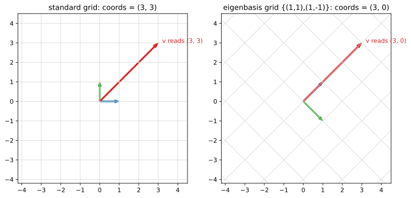

# ch04 — 座標是名字不是本體：基底與換基底

> **本章解決什麼問題**：ch03 說「基底是一組剛好夠用的方向、維度與你選哪組基底無關」。本章把那句話的代價算清楚——既然基底可換，那同一個向量就有不只一串座標，於是座標到底是什麼？答案是：**座標不是向量本身，只是它在某一組基底下的名字**。換基底＝替同一個幾何本體換一套名字。這是 Part I 的收尾，也是後面三個大招（ch13 對角化、ch17 正交基、ch20 PCA）的共同地基——它們全都是「換到一組讓事情變簡單的座標」。本章先把換基底這件機械動作講清楚，並用脊椎矩陣 S 的特徵基底當例子，替 ch13 埋好線。

## 從你已知的出發

先約定全書最容易搞混的一個詞，現在釘死、以後不再解釋：

- **行（直行，column）**：矩陣（或一組向量並排）的**直的**一排。台灣慣例。
- **列（橫列，row）**：**橫的**一排。

（這跟中國大陸的用法**剛好相反**，是惡名昭彰的陷阱。本書一律台灣慣例：行＝column＝直的，列＝row＝橫的。）

好，回到正題。你其實天天在換基底，只是沒這樣叫它。

**同一筆資料，換一套座標系描述**。一個畫面上的點，你可以用直角座標 (x, y) 講，也可以用極座標 (r, θ) 講。同一個顏色，你可以用 RGB 三個數字講，也可以用 HSV 三個數字講。點還是那個點、顏色還是那個顏色——換的只是「用哪三個基準量去拆解它」。你在後端處理過的座標轉換、色彩空間轉換，本質上就是換基底：本體不動，描述它的那串數字換了。

**「換個角度看問題就簡單了」在線代裡是字面意義**。你重構過一段糾纏的程式：同一份邏輯，換一組抽象、換一套變數命名，原本繞來繞去的東西突然變直了。線性代數把這句話變成可計算的操作——很多「看起來複雜」的變換，只是因為你用了一組爛座標在看它；換到對的基底，它就現出原形（在 ch13，那個原形會是「各軸獨立伸縮」這種最簡單的動作）。

**單位換算是一維的換基底**。3 公尺 ＝ 9.84 英尺。長度這個幾何量沒變，變的是你拿哪根「單位棒」去量它——公尺棒得到 3、英尺棒得到 9.84。基底就是那根（那幾根）單位棒。一維只有一根棒、換算只是乘一個數；高維有好幾根棒、而且可以是斜的，換算就變成解一組線性方程——但精神完全一樣。

把這三件你早就會的事抽出共同骨架：**有一個不動的本體，有好幾套替它取名字的系統，名字之間可以換算**。線代要補上的，只是「在向量空間裡，這個換算長什麼樣、為什麼是解線性組合」。

## 座標的真相：(3, 3) 是一句省略了主詞的話

你寫 v = (3, 3) 的時候，心裡預設了一件事，預設到自己都忘了：這串數字是相對於**標準基底** ê₁ = (1, 0)、ê₂ = (0, 1) 講的。完整講出來是這樣：

```text
v = 3·ê₁ + 3·ê₂                    ← "3 個 ê₁ 加 3 個 ê₂"
  = 3·(1, 0) + 3·(0, 1)
  = (3, 3)
```

所以 (3, 3) 不是向量的本體，它是一句**省略了主詞的話**——主詞是「在標準基底下」。向量本體是那支從原點指出去的箭頭、那個幾何位置；(3, 3) 只是這支箭頭在標準格子裡的門牌號碼。

關鍵的一跳：**門牌號碼依賴於你用哪套街道系統**。換一組基底，就是換一套街道系統，同一個位置就有新門牌。同一支箭頭，在不同基底下是不同的數列；但它還是同一支箭頭。

這裡藏著本書反覆會用到的一個區分，現在點明、ch13 會狠狠用到：

- **向量本體**（箭頭、幾何位置）——不依賴任何基底，它就在那裡。
- **座標**（一串數字）——依賴基底，換基底就換一串。

「座標依賴基底、向量本身不依賴」這句話，是本章要你帶走的第一件東西。它聽起來像廢話，但 ch13 的整套對角化、ch20 整套 PCA，都建立在「**既然座標可以換，那就換到一組讓變換變簡單的座標**」這個念頭上。座標不是神聖不可侵犯的，它只是名字。名字是用來方便的，不方便就換。

如果你要一個更貼工程的比方：向量本體像是一筆**資料的語意**，座標像是它的**序列化格式**。同一筆「使用者在畫面上的位置」這個語意，你可以序列化成直角座標的 JSON、也可以序列化成極座標的 JSON——bytes 不同，但反序列化回來指的是同一個位置。換基底就是換序列化格式：你選哪組基底（哪個 schema），決定這筆資料被寫成哪串數字。而「同一個位置在兩種格式下 bytes 不一樣」從來不是矛盾，就像沒人會因為一個 UTF-8 字串和它的 base64 長得不同就說它們是兩個字串。把座標當成「向量的某一種編碼」，而不是「向量本身」，本章後面所有東西都會順。

## 換基底的機制：給新名字＝解一個線性組合

現在來算。給你一組新基底 {b₁, b₂}，問：某個向量 v 在這組新基底下的座標是多少？

「座標」的定義照搬上面那句話——**新座標 (a, b) 就是「要幾個 b₁ 加幾個 b₂ 才湊出 v」**：

```text
a·b₁ + b·b₂ = v                    ← 解出 (a, b) 就是 v 在新基底下的座標
```

這是一個線性組合方程。把它攤開成分量，就是一組你國中會解的聯立方程式。沒有新魔法，只是「換基底」這個聽起來很玄的詞，拆穿了就是「解 a·b₁ + b·b₂ = v」。

用脊椎矩陣 S 的特徵基底來做這件事——這組基底我們會在 ch11 證明它是 S 的「自然軸」，現在先把它當一組普通的斜基底用，順便替 ch13 暖身。S 的特徵基底是：

```text
b₁ = (1,  1)        ← 之後會知道：S 沿這個方向放大 3 倍
b₂ = (1, −1)        ← 之後會知道：S 沿這個方向完全不動
```

**Worked example 一：把 v = (3, 3) 改寫到基底 {b₁, b₂} 下。**

要解 a·(1, 1) + b·(1, −1) = (3, 3)。攤成分量：

```text
a + b = 3              ← 第一分量（x）
a − b = 3              ← 第二分量（y）
─────────────
兩式相加： 2a = 6 → a = 3
回代第一式：3 + b = 3 → b = 0
```

所以 v 在新基底下的座標是 **(3, 0)**。代回驗證（永遠代回驗證——矩陣與向量最容易算錯的就是這步）：

```text
3·b₁ + 0·b₂ = 3·(1, 1) + 0·(1, −1)
            = (3, 3) + (0, 0)
            = (3, 3)  ✓                ← 等於原本的 v，過關
```

讀一下這個結果的味道。同一支箭頭：

```text
標準基底下：   v = (3, 3)        ← "3 個 ê₁、3 個 ê₂"
特徵基底下：   v = (3, 0)        ← "3 個 b₁、0 個 b₂"，純粹是 3 個第一基向量
```

在標準座標裡，v 是「右三上三」、兩個分量都不為零、看起來沒什麼特別。換到特徵基底，它變成 (3, 0)——**第二個座標是 0，v 完全躺在 b₁ 這條軸上**。這不是巧合：v = (3, 3) 本來就剛好指在 (1, 1) 的方向上，而 b₁ 就是 (1, 1)。換到「以這個方向為軸」的座標系，v 自然就只剩一個座標。

**這正是 ch13 對角化好用的原因，先記著**：S 對 b₁ 方向的向量只是「放大 3 倍」。當 v 在特徵座標下是 (3, 0)，S 作用後就是 (9, 0)——一個座標乘 3、另一個座標（本來就是 0）不動。在標準座標裡 S 是個會把方格拉斜的矩陣 [[2,1],[1,2]]；換到特徵座標裡，它退化成「第一軸乘 3、第二軸乘 1」這種小學生都會的動作。複雜，只是座標沒選對。

**Worked example 二：換一個不那麼剛好的 v = (4, 2)。**

解 a·(1, 1) + b·(1, −1) = (4, 2)：

```text
a + b = 4
a − b = 2
─────────────
相加： 2a = 6 → a = 3
相減： 2b = 2 → b = 1
```

新座標 (3, 1)。代回驗證：

```text
3·(1, 1) + 1·(1, −1) = (3, 3) + (1, −1) = (4, 2)  ✓
```

這次兩個座標都不為零（因為 (4, 2) 沒有剛好指在某條特徵軸上），但機制一模一樣：解線性組合、代回驗證。換基底沒有第二套手續，永遠就是這一招。

### 基底矩陣 B：把換算寫成一個矩陣

每次都攤聯立方程式很煩。注意到 a·b₁ + b·b₂ 這個動作，正是「把 b₁、b₂ 並排成行、再乘上座標向量」——這其實就是 ch05 會講的「矩陣乘向量＝行的加權相加」，這裡先用一下、機制留到 ch05/ch08 給足。把新基底的兩個向量**當作行**並排起來：

```text
B = | 1   1 |          ← 第一行是 b₁ = (1, 1)、第二行是 b₂ = (1, −1)
    | 1  −1 |
```

那麼，「給新座標 (a, b)，算出它對應的標準座標」就是一次矩陣乘法：

```text
B · (a, b)ᵀ = a·b₁ + b·b₂ = v（標準座標）
```

換句話說，**B 把「新座標」翻譯回「標準座標」**。驗證一下 worked example 一：

```text
B · (3, 0)ᵀ = | 1   1 | | 3 |   = | 1·3 + 1·0 |   = | 3 |   ✓
              | 1  −1 | | 0 |     | 1·3 − 1·0 |     | 3 |
```

(3, 0) 是新座標、(3, 3) 是標準座標，B 把前者送回後者，對上了。

反過來——「給標準座標，問新座標是多少」——就是把 B 的作用倒過來，需要 **B⁻¹**（B 的逆，正式機制留 ch08）：

```text
B⁻¹ = (1/2) | 1   1 |       ← 之後在 ch08 會教怎麼算逆；現在先驗證它對
            | 1  −1 |

B⁻¹ · (3, 3)ᵀ = (1/2) | 1   1 | | 3 |   = (1/2) | 3 + 3 |   = | 3 |   ✓
                      | 1  −1 | | 3 |           | 3 − 3 |     | 0 |
```

標準座標 (3, 3) 經 B⁻¹ 變成新座標 (3, 0)，跟我們手解聯立的結果一致。所以兩個方向的換算是這樣分工的：

```text
新座標 ──(乘 B)──▶ 標準座標
新座標 ◀──(乘 B⁻¹)── 標準座標
```

一個小提醒，免得你之後踩到：B 的行是「新基底向量用**標準座標**寫出來的樣子」。b₁ = (1, 1) 這串數字本身又是相對於標準基底講的——換基底永遠是「相對於另一組已知基底」做的，不存在脫離一切基底的純數字。這不是繞口令，是個誠實的限制：座標永遠相對於某組基底，連「定義新基底」這件事都得先借用舊基底的座標來講。

## 為什麼「換對基底，難題變簡單」是全書主旋律

停下來，把這章和後面三章連起來——這是本章存在的真正理由。

「換基底」本身只是個換名字的機械動作，沒什麼了不起。了不起的是：**對的基底能讓一個本來糾纏的問題，在新座標下解耦成幾個互不相干的簡單問題**。這個念頭會以三種面貌反覆回來：

| 換到哪組基底 | 難題變成什麼 | 在哪一章 |
|---|---|---|
| 特徵基底 | 一個會把方格拉斜的變換 → 各軸獨立伸縮（對角矩陣） | ch13 對角化 |
| 正弦／餘弦基底 | 一個糾纏的訊號 → 各頻率獨立的分量（傅立葉） | 見《圓的影子》ch13 |
| 主成分基底 | 一堆互相相關的 feature → 一組互不相關的軸 | ch20 PCA |

三件事是同一件事：**找到一組讓問題自然拆開的座標**。我認為這是線性代數最值錢的一個念頭，比任何具體公式都值錢——因為它告訴你，當一個線性問題看起來很亂，第一個該問的不是「怎麼硬算」，而是「我是不是站在爛座標上看它」。

順著這個念頭，再點一件 ch13 會正式講的事。同一個變換，在不同基底下會被寫成**不同的矩陣**。標準基底下 S 是 [[2,1],[1,2]]；換到它自己的特徵基底，同一個 S 變成對角矩陣 diag(3, 1)。這兩個矩陣描述的是**同一個動作**，只是站在不同座標系記下來的。線代給這種關係一個名字——**相似（similar）**：B⁻¹SB 和 S 相似，它們是同一個變換的不同座標版本。（這裡只點到名字，怎麼推、為什麼是 B⁻¹SB 這個夾法，是 ch13 的主戲。）

把這件事和本章開頭那句連起來：座標只是名字，矩陣也只是「變換在某組座標下的名字」。同一個動詞，可以有很多種寫法；對角矩陣是它最乾淨的那種寫法。你選的基底，決定你看到哪一張臉。

下面這張圖把整章濃縮成一眼：同一支箭頭 v，在兩套格子上有兩個讀數。



## 直覺的陷阱

換基底是少數「機械上不難、心理上很容易自欺」的主題。三個經典自欺：

| 陷阱 | 錯誤直覺長什麼樣 | 會在哪一步把你帶溝裡 | 怎麼自我察覺 |
|---|---|---|---|
| **把座標當絕對** | 覺得 (3, 3) 就是這個向量「是什麼」，忘了它預設了標準基底 | 看到同一個向量在別處寫成 (3, 0) 就以為是另一個向量，或以為哪邊算錯了 | 問自己：「(3, 3)——相對於哪組基底？」答不出主詞，就代表你把名字當本體了 |
| **以為換基底會改變向量** | 覺得「換到特徵座標」這個動作把 v 移動了、拉伸了 | 把換基底跟「用矩陣去變換向量」混為一談——前者本體不動、只換名字；後者本體真的被搬走 | 換基底前後，那支箭頭的幾何位置（指向哪、多長）有沒有變？沒變＝你只是換了名字；變了＝你做的其實是個變換，不是換基底 |
| **座標數列 ≟ 向量本體** | 在腦中把「向量」直接等同於「那串數字」 | 一旦進到 ch13、ch20，需要「換座標讓矩陣變簡單」時整個卡住，因為你心裡的向量被釘死在一串數字上、換不動 | 能不能講出「同一支箭頭、兩串數字」這句話而不打結？打結＝數列和本體還黏在一起 |

這三個其實是同一個病的三種症狀：**把名字當成本體**。治法只有一句——每次寫下一串座標，心裡補上被省略的主詞「相對於 ⋯⋯ 基底」。一旦這個習慣養成，ch13 那句「複雜只是座標沒選對」你會覺得理所當然，而不是魔術。

還有一個技術性的坑，先插旗、ch08 處理：**換基底要求新的那組向量真的是基底**（線性獨立、能生成全空間，見 ch03）。如果你給的 b₁、b₂ 其實共線（線性相依），那 a·b₁ + b·b₂ = v 這個方程要嘛無解、要嘛無限多解——B 不可逆，換算崩掉。換基底之所以總是「恰好一組新座標」，靠的就是基底這個前提把唯一性保住了。

## 紙上推演

### 推演題

**題一 [10 分鐘] ★** 把 v = (2, 0)（標準座標）改寫到特徵基底 {b₁, b₂} = {(1, 1), (1, −1)} 下，求新座標並代回驗證。

**題二 [10 分鐘] ★★** 用一句話向另一個工程師解釋：為什麼說「座標依賴基底、向量本身不依賴」？再回答——如果有人把同一個向量在兩組基底下寫成 (3, 3) 和 (3, 0)，他能不能因此說「這兩串數字不相等，所以一定有人算錯了」？

**題三 [15 分鐘] ★★** 口頭題（要能講出來、不是默念）：為什麼說「對角化就是找一組讓矩陣變簡單的座標」？用本章的 v=(3,3)→(3,0) 當例子，講清楚「換到特徵座標後，S 的動作為什麼會變簡單」。

**題四 [10 分鐘] ★★** 有人想用 {c₁, c₂} = {(1, 2), (2, 4)} 當新基底，把 v = (3, 1) 換過去。試著解 a·(1, 2) + b·(2, 4) = (3, 1)，看看會發生什麼，並解釋幾何上為什麼換基底在這裡崩掉了。

### 推演解答

**題一。** 解 a·(1, 1) + b·(1, −1) = (2, 0)：

```text
a + b = 2
a − b = 0
─────────────
相加： 2a = 2 → a = 1
相減： 2b = 2 → b = 1
```

新座標 **(1, 1)**。代回驗證：1·(1, 1) + 1·(1, −1) = (1, 1) + (1, −1) = (2, 0) ✓。
讀法：(2, 0) 這支箭頭，在特徵座標下是「1 個 b₁ 加 1 個 b₂」。兩個座標都不為零，因為 (2, 0) 沒指在任何一條特徵軸上——它是兩條軸的對角線方向。

**題二。** 第一問：向量是一支幾何箭頭（一個位置、一個方向加長度），這支箭頭客觀地在那裡，不靠任何座標系存在。座標 (3, 3) 是「拿標準基底這把尺去量這支箭頭」得到的讀數；換一把尺（換基底），同一支箭頭就得到不同讀數。尺變、讀數變、被量的箭頭不變。
第二問：**不能**。(3, 3) 和 (3, 0) 確實是不相等的兩串數字，但它們是同一支箭頭在**兩組不同基底**下的讀數——就像「3 公尺」和「9.84 英尺」是不相等的兩個數字、卻是同一段長度。要說「算錯了」，得是在**同一組基底**下得到兩個不同答案才行。比較不同基底下的座標串而宣稱矛盾，本身就是把名字當本體的陷阱。

**題三。** 一個講得通的版本：S 在標準座標下是 [[2,1],[1,2]]，它把方格網拉斜，動作看起來很糾纏（每個分量都會混到另一個分量）。但 S 其實有兩條「自然軸」——沿 (1,1) 它只是放大 3 倍、沿 (1,−1) 它完全不動。如果我換到以這兩條軸為基底的座標系，那麼任何向量都被拆成「b₁ 方向的成分」和「b₂ 方向的成分」，而 S 對這兩個成分只是各自乘 3 和乘 1、互不干擾。以本章的 v 為例：v 在特徵座標下是 (3, 0)，S 作用後變成 (3·3, 1·0) = (9, 0)——一個座標乘 3、一個座標不動，乾淨到不行。所以「對角化」就是換到這組特徵座標，讓 S 從「會把方格拉斜的矩陣」現出原形成「各軸獨立伸縮」。複雜不在 S，在我原本站的座標。

**題四。** 攤成分量：

```text
a + 2b = 3
2a + 4b = 1
```

第二式是 2a + 4b = 2(a + 2b) = 2·3 = 6，但題目要它等於 1——矛盾，**無解**。
幾何理由：c₂ = (2, 4) = 2·(1, 2) = 2·c₁，這兩個向量**共線**（線性相依，見 ch03）。它們的所有線性組合只能落在 (1, 2) 這條直線上，撐不出整個平面。v = (3, 1) 不在那條線上，所以怎麼組都湊不出來。{c₁, c₂} 根本不是基底，自然不能拿來當新座標系——這就是上一節插旗的坑：換基底的前提是新向量得真的線性獨立。如果 v 剛好落在那條線上（例如 v = (3, 6)），則會反過來變成**無限多解**（沿著那條線有無窮多種拆法），唯一性同樣崩掉。兩種崩法都對應一句話：B 不可逆（ch08）。

### 動手生圖

本章那張「同一支 v、兩套格子、兩個讀數」的圖，就是這段 Python。它把左邊畫成標準直角格、右邊畫成由 b₁=(1,1)、b₂=(1,−1) 撐起的斜格，再把同一支 v=(3,3) 畫上去——關鍵是兩邊畫的是**同一支箭頭**（同一組 (3,3) 資料座標），只是底下的格子換了，於是讀數從 (3,3) 變成 (3,0)。

```python
# ch04 figure: same vector v read in two grids -- standard grid vs the skew eigenbasis grid
from pathlib import Path
import numpy as np
import matplotlib
matplotlib.use("Agg")          # headless; no display needed
import matplotlib.pyplot as plt

OUT = Path(__file__).resolve().parent / "out" / "ch04-change-of-basis.svg"
OUT.parent.mkdir(parents=True, exist_ok=True)

b1, b2 = np.array([1.0, 1.0]), np.array([1.0, -1.0])   # eigenbasis of S
v = np.array([3.0, 3.0])                               # standard coords (3,3) = 3*b1 + 0*b2

fig, (axL, axR) = plt.subplots(1, 2, figsize=(11, 5.4))
rng = range(-4, 5)

# LEFT: standard grid; v reads (3, 3)
for k in rng:
    axL.axhline(k, color="0.85", lw=0.8); axL.axvline(k, color="0.85", lw=0.8)
axL.arrow(0, 0, 1, 0, color="C0", width=0.05, length_includes_head=True)  # e1
axL.arrow(0, 0, 0, 1, color="C2", width=0.05, length_includes_head=True)  # e2
axL.arrow(0, 0, v[0], v[1], color="C3", width=0.06, length_includes_head=True)
axL.text(v[0] + 0.2, v[1], "v reads (3, 3)", color="C3", fontsize=10)
axL.set_title("standard grid: coords = (3, 3)")

# RIGHT: skew grid spanned by b1,b2; same v reads (3, 0)
for k in rng:                                          # lines along b1 (shifted by k*b2) and vice versa
    p = k * b2; axR.plot([p[0] - 5*b1[0], p[0] + 5*b1[0]], [p[1] - 5*b1[1], p[1] + 5*b1[1]], color="0.85", lw=0.8)
    p = k * b1; axR.plot([p[0] - 5*b2[0], p[0] + 5*b2[0]], [p[1] - 5*b2[1], p[1] + 5*b2[1]], color="0.85", lw=0.8)
axR.arrow(0, 0, b1[0], b1[1], color="C0", width=0.05, length_includes_head=True)  # b1=(1,1)
axR.arrow(0, 0, b2[0], b2[1], color="C2", width=0.05, length_includes_head=True)  # b2=(1,-1)
axR.arrow(0, 0, v[0], v[1], color="C3", width=0.06, length_includes_head=True)
axR.text(v[0] + 0.2, v[1], "v reads (3, 0)", color="C3", fontsize=10)
axR.set_title("eigenbasis grid {(1,1),(1,-1)}: coords = (3, 0)")

for ax in (axL, axR):
    ax.set_aspect("equal"); ax.set_xlim(-4.2, 4.5); ax.set_ylim(-4.2, 4.5)
fig.savefig(OUT, bbox_inches="tight")
print("wrote", OUT)            # build_figures.py reads this
```

**預期輸出**：左圖一個正常的直角格子，紅箭頭 v 指到 (3, 3)、標著「v reads (3, 3)」；右圖格線變成沿 (1,1) 與 (1,−1) 兩個方向的斜格，**同一支紅箭頭**指到同一個物理位置、但落在第一條斜軸上，標著「v reads (3, 0)」。兩邊藍色（b₁／ê₁）與綠色（b₂／ê₂）的基向量箭頭標出各自那套格子的「單位棒」。`set_aspect("equal")` 確保斜格的角度誠實、不被拉變形。

**換 v 看新座標怎麼變**：把 `v = np.array([3.0, 3.0])` 改成 `v = np.array([4.0, 2.0])`，右圖的讀數會變成 (3, 1)（對應 worked example 二）——這次 v 沒落在斜軸上，所以兩個斜座標都不為零，你會看到它落在斜格的某個內部格點上。再改成 `v = np.array([2.0, 0.0])`，讀數變 (1, 1)（對應紙上推演題一），v 落在斜格的對角線方向。多試幾個，你會親眼看到「同一支箭頭、底下換格子、讀數就換」這件事——本章一整章講的就是這張圖。

## 自我檢核

口頭自答，講得出來才算過關：

1. 為什麼說 (3, 3) 這串座標「省略了主詞」？被省略的主詞是什麼？
2. 「向量本體不依賴基底，座標依賴基底」——用單位換算（公尺／英尺）把這句話講給一個沒學過線代的人聽。
3. 換基底求新座標，機械上到底在解什麼？為什麼是「解一個線性組合」而不是別的？
4. v = (3, 3) 換到特徵基底 {(1,1),(1,−1)} 下變成 (3, 0)，那個 0 是怎麼來的、它在幾何上說了什麼？
5. 為什麼「換對基底、難題變簡單」會是後面好幾章（對角化、PCA）的共同主旋律？換的到底是什麼、簡單在哪？
6. 如果有人拿同一個向量在兩組基底下的座標串 (3,3) 與 (3,0)，宣稱「不相等所以矛盾」，他錯在哪？
7. 換基底有個前提：新的那組向量必須真的是基底。如果它們其實線性相依，換基底會怎麼崩？（無解或無限多解，對應 B 不可逆）
8. 「同一個變換在不同基底下長成不同的矩陣」——這對應線代裡哪個詞？（相似 similar，ch13 細講）你能講出 S 在標準基底是 [[2,1],[1,2]]、在特徵基底是 diag(3,1) 這同一件事嗎？

## 延伸閱讀

- **3Blue1Brown《Essence of Linear Algebra》第 9、13 章**（Change of basis；Change of basis 與特徵向量）。本章「同一支箭頭、兩套格子、兩個讀數」的動畫版，Grant Sanderson 用方格網變形把換基底講得極視覺，看完本章直接接這支，會把 ch13 的對角化也一起預習掉。YouTube 免費（2026-06 確認可取）。
- **Gilbert Strang，MIT 18.06，關於座標與基底變換的章節**（OpenCourseWare 免費）。Strang 把「向量是本體、座標相對於基底」這個區分講得很實在，並一路接到相似矩陣 B⁻¹AB。適合想把本章「點到為止」的 B、B⁻¹ 機制補成完整算法的人——但那其實是 ch08 的活，不急。連結見 landscape。
- **Sheldon Axler，《Linear Algebra Done Right》第四版（2024，Open Access 免費 PDF）**，關於線性映射的矩陣表示與基底變換那幾節。Axler 是「向量空間優先、座標其次」這個哲學的旗手——他刻意延後座標、強調本體，正好是本章「座標是名字不是本體」的硬派版本。官方免費頁見 landscape。
