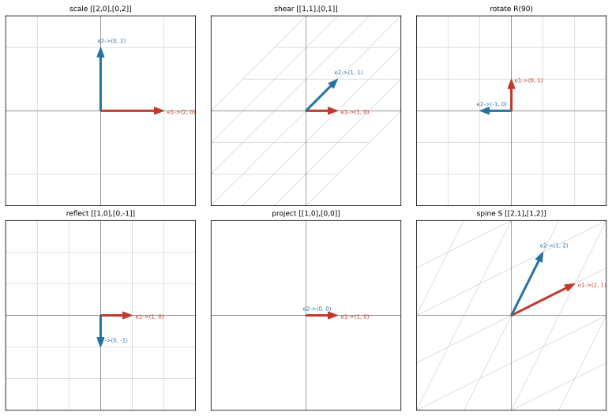

# ch05 — 矩陣是動詞：線性映射與它的矩陣

> **本章解決什麼問題**：你會算矩陣乘向量，但從來沒人告訴你「它在幹嘛」。這一章是全書主旋律的開場——把矩陣從「一張死的數字表格」翻轉成「一個對整個空間下的動詞」。看完你會知道：讀一個矩陣，就是讀它把基向量搬到哪；矩陣的每一行（直行，column）就是一個基向量的去向。前四章備好了向量、span、基底、座標這些零件，從這裡開始，矩陣作為線性變換正式登場；接著 ch06 講兩個變換接起來（乘法即合成）、ch07 講反過來解 Ax=b、ch08 講什麼時候回得去。

```text
Part I 向量與空間          Part II 矩陣即變換 ◄你在這裡   Part III 行列式與秩
ch01 為什麼是線性          ch05 矩陣是動詞 ◄          →   ch09 行列式即面積
ch02 向量三張臉        →   ch06 乘法即合成               ch10 秩與四子空間
ch03 span 與基底           ch07 解 Ax=b                        │
ch04 座標與換基底          ch08 逆與不可逆                     ↓
                                                         Part IV 特徵值
Part VI SVD 與收官         Part V 正交與近似            ch11 特徵向量 ★
ch19 SVD              ←   ch15 內積                  ←  ch12 旋轉逼出複數
ch20 低秩近似與 PCA        ch16 投影與最小平方           ch13 對角化 ★
ch21 PageRank 馬可夫       ch17 正交基與 QR              ch14 矩陣的冪
ch22 總收官 ★             ch18 對稱與譜定理             ★＝最大驚嘆點
```

## 從你已知的出發

先把一個矩陣想成你最熟的東西：一個 **pure function**。

```text
transform(v: Vector) -> Vector
```

它吃一個向量、吐一個向量，沒有副作用、同樣的輸入永遠同樣的輸出。你寫過幾千個這種函數。問題只有一個：這個 `transform` 內部到底做了什麼？

如果它是任意的 pure function，那要搞懂它，你得把每一個可能的輸入都餵進去看一遍——平面上有無窮多個點，這是不可能的差事。但**線性**變換（linear transformation／linear map，見 ch01 那兩條公理）有個近乎作弊的好處：它的「規格」短到可以寫在一張便利貼上。你**不必**測所有輸入。你只要問它：

> ê₁=(1,0) 你搬到哪？ê₂=(0,1) 你搬到哪？

兩個答案。問完了，這個函數對整個平面做什麼，已經被你完全釘死。沒有第三個問題。這就是本章要證明給你看的事，也是線性「為什麼值得整本書」的第一個具體紅利。

你其實早就在用這個直覺，只是沒意識到。寫過 2D 遊戲或繪圖的人都碰過 transform：旋轉一個 sprite、把貼圖縮放兩倍、做鏡像翻轉。引擎內部就是一個 2×2（或含平移的 3×3）矩陣。你在 shader 或 transform stack 裡推的那些矩陣，每一個都是一句「對這張圖做這件事」的指令。本章要做的，是把那個你機械用過的東西，攤開來看它的骨頭——而骨頭，就是兩個基向量的去向。

這一章，我認為是整本書最該停下來慢慢讀的一頁。前面四章像是在發工具，從這裡開始它們才真的開動。

## 一個變換，被兩個基向量釘死

先把「線性」這個條件兌現成一句話。線性變換 T 只要求兩件事（ch01 的公理，這裡用得上）：

```text
T(u + v) = T(u) + T(v)          ← 拆開來各做、再加回去，結果一樣
T(c·v)   = c·T(v)               ← 先縮放再變換 = 先變換再縮放
```

合起來：T(a·u + b·v) = a·T(u) + b·T(v)。線性變換**保持線性組合**——你怎麼用 u、v 組出一個向量，變換後它就用同樣的係數、由 T(u)、T(v) 組回去。

現在看一個任意向量 v=(x, y)。在標準基底下，它**就是**基向量的線性組合：

```text
v = (x, y) = x·ê₁ + y·ê₂          ← (x,y) 的字面意思就是「x 個 ê₁ 加 y 個 ê₂」（見 ch02）
```

把 T 作用上去，線性性讓我們把它推進括號裡：

```text
T(v) = T(x·ê₁ + y·ê₂)
     = x·T(ê₁) + y·T(ê₂)         ← 保持線性組合，係數 x、y 原封不動
```

讀一遍最後這行。它在說：**只要我知道 T(ê₁) 和 T(ê₂) 這兩個向量，任何 v 的去向我都能算**——把 v 的兩個座標 x、y 當權重，去加權 T(ê₁) 與 T(ê₂) 就好。整個平面、無窮多個點的命運，壓縮成兩個答案。這就是「兩個基向量的去向就釘死整個變換」這個驚嘆點的全部內容，它短到讓人懷疑是不是漏了什麼——沒有，這就是線性的全部威力。

把它換成工程師會直接感受到的話：你本來面對一個輸入空間無窮大的 `transform`，要把它的行為摸清楚像是不可能的任務。但因為它線性，你只要跑**兩個** test case（餵 ê₁、餵 ê₂），就把整個函數的行為**完整**記錄下來了——不是抽樣、不是近似，是**完整**。對任何其他輸入，你都能拿這兩筆紀錄組出答案。一個無窮大的規格被壓進兩欄資料，這就是線性給的超能力，也是為什麼整本書都在圍著它打轉。非線性函數沒這種好事——它每個點都可能自己一個脾氣，你得逐點對付，那才是真正的惡夢。

那矩陣是什麼？矩陣就是**把 T(ê₁)、T(ê₂) 這兩個答案並排記下來**的帳本。一個 ℝ²→ℝ² 的線性變換，把它的兩個基向量去向當作兩個直排，並肩擺好：

```text
A = | T(ê₁)  T(ê₂) |        第一行（第一個 column）= ê₁ 的去向
    |   ↑      ↑   |        第二行（第二個 column）= ê₂ 的去向
   第一行   第二行
```

這裡必須把一個惡名昭彰的陷阱釘死，否則後面全亂。**台灣慣例：行（直行，column）是直的、列（橫列，row）是橫的**——這跟中國大陸完全相反（他們的「行」是橫的），是兩岸線代名詞最大的歧異點（2026-06）。本書全程用台灣慣例：

```text
        行（column，直的，↕）
        ┌───┐
列 →    │ a │ b │      「第一行」= 左邊那一直條 (a, c)ᵀ
（row， ├───┼───┤      「第一列」= 上面那一橫排 (a, b)
橫的，  │ c │ d │
↔）     └───┘
```

所以本章的核心口訣——**「矩陣的每一行（column）＝對應基向量的去向」**——是字面意義的：A 的第一行（左邊那一直條）就是 ê₁ 被搬到的地方，第二行就是 ê₂ 的去向。記住「行是直的」，這句話才成立。

### Ax 不是「行點列」，是「列向量挑行」

大學教 Ax 的算法時，多半教你「拿 A 的每一列去點 x」。那套機械步驟算得出答案，但它把幾何藏起來了。換一個讀法，幾何就跳出來。

把 x=(x₁, x₂) 乘上 A，攤開來看：

```text
A x = | a  b | | x₁ |   = x₁·| a |  +  x₂·| b |
      | c  d | | x₂ |        | c |        | d |
                          x₁ 份的第一行   x₂ 份的第二行
```

看右邊。**Ax 是 A 的「行」（columns）的線性組合**，權重就是 x 的各個分量。x 的第一個分量 x₁「挑出」第一行、給它 x₁ 的份量；x₂ 挑出第二行、給 x₂ 的份量；兩者相加。我把它叫做「**列向量挑行**」（x 是個向量，它的每個分量去挑 A 的對應行、加權相加）。

這跟上一節的 T(v)=x·T(ê₁)+y·T(ê₂) 是同一句話：A 的第一行就是 T(ê₁)、第二行就是 T(ê₂)，x 的分量就是權重。Ax 不是一套要背的乘法口訣，它是「把 v 拆成基向量、各自送去該去的地方、再組回來」的執行過程。這個觀點之後會一路用到底——ch07 解 Ax=b 的「行視角」、ch10 的行空間、ch19 的 SVD，全都站在「Ax 是行的線性組合」這塊地基上。

## 變換動物園：讀矩陣＝讀變換

抽象講完了，來看活的。下面六個 2×2 矩陣，每一個我們都只做一件事：**算 ê₁、ê₂ 去哪，然後描述方格網被怎麼搬**。讀矩陣的功夫，全在這張表裡。



**① 縮放 [[2,0],[0,2]]**

```text
| 2  0 |    ê₁=(1,0) → (2,0)   ← 第一行
| 0  2 |    ê₂=(0,1) → (0,2)   ← 第二行
```

兩個基向量都被拉長兩倍、方向不變。方格網每一格從邊長 1 變邊長 2，整個平面均勻放大兩倍。最乖的變換：誰都不轉、只是「放大鏡」。

**② 剪切 shear [[1,1],[0,1]]**

```text
| 1  1 |    ê₁=(1,0) → (1,0)   ← 第一行：完全沒動
| 0  1 |    ê₂=(0,1) → (1,1)   ← 第二行：往右推了一格
```

ê₁ 釘在原地，ê₂ 卻被往右推。想像一疊紙從側面推歪：底層不動，越往上推得越右。水平線還是水平、原點還在，但垂直線全變成斜的。這是「平行四邊形化」最乾淨的例子——方格還是平行四邊形，只是不再是正方形。（剪切之後會是 ch13 的反派：它**只有一個**獨立特徵方向，沒法對角化，先記著它長這樣。）

**③ 旋轉 R(90°)=[[0,−1],[1,0]]**

```text
| 0  -1 |   ê₁=(1,0) → (0,1)    ← 第一行：x 軸轉到 y 軸
| 1   0 |   ê₂=(0,1) → (-1,0)   ← 第二行：y 軸轉到 -x 軸
```

逆時針轉 90°（本書旋轉一律逆時針為正，與《圓的影子》一致）。整個方格網剛性地轉了個身，格子大小、角度都沒變，只是朝向變了。一般的 R(θ)=[[cosθ,−sinθ],[sinθ,cosθ]]，把 θ=90° 代進去（cos90°=0、sin90°=1）就得到上面這個。旋轉是後面一個大驚嘆點的種子：它**沒有任何方向是不動的**（每條線都被轉走了），這逼出複數——但那是 ch12 的事，這裡先看它把方格網轉了個身。

**④ 反射 [[1,0],[0,−1]]**

```text
| 1   0 |   ê₁=(1,0) → (1,0)    ← 第一行：x 軸不動
| 0  -1 |   ê₂=(0,1) → (0,-1)   ← 第二行：y 軸翻到下面
```

對 x 軸做鏡射。x 軸上的東西不動，上半平面翻到下半平面。方格網大小不變，但**定向翻轉了**——本來逆時針數的角，現在變順時針。這是「左右手座標系」那種翻面，det 會是負的（ch09 會把這件事算清楚）。

**⑤ 投影 [[1,0],[0,0]]**

```text
| 1  0 |    ê₁=(1,0) → (1,0)    ← 第一行：x 軸保留
| 0  0 |    ê₂=(0,1) → (0,0)    ← 第二行：整個 y 方向被壓成 0
```

把整個平面拍扁到 x 軸上。ê₂ 直接被送到原點——一整個維度被消滅了。這是六個裡面唯一「壓扁降維」的：二維的平面被拍成一維的線，資訊回不來了（你沒法從投影後的點還原它本來的高度）。這個「壓扁」是 ch08 不可逆、ch09 det=0、ch10 秩虧空的同一個幾何根源，本章先讓你親眼看它把 ê₂ 吃掉。

**⑥ 脊椎 S [[2,1],[1,2]]——本章登場，全書貫穿**

```text
| 2  1 |    ê₁=(1,0) → (2,1)    ← 第一行
| 1  2 |    ê₂=(0,1) → (1,2)    ← 第二行
```

這就是全書的脊椎矩陣 S（對應《馴服隨機》那本的「同一枚硬幣」——我們會用同一個 S 貫穿全書，每進一個 Part 就把它看深一層）。**這是脊椎的第一層：S 的兩行 (2,1)、(1,2) 就是 ê₁、ê₂ 的去向。** 把單位正方形（四角 (0,0)、(1,0)、(1,1)、(0,1)）餵進去，四角被搬到 (0,0)、(2,1)、(3,3)、(1,2)，正方形變成一個傾斜的平行四邊形。它既放大又拉斜，但你現在已經能完全描述它做了什麼——讀懂兩行就讀懂了整個 S。

### Worked example：用「行加權相加」搬動向量

讀完矩陣的行，算 Sv 就不必背乘法口訣了——直接用「行加權相加」。取 v=(1,1)：

```text
S·(1,1)ᵀ = 1·(第一行) + 1·(第二行)
         = 1·(2,1)   + 1·(1,2)
         = (2+1, 1+2)
         = (3, 3)                  ← (1,1) 被搬到 (3,3)
```

驗算（代回機械算法，列點向量）：第一列 (2,1)·(1,1)=2+1=3、第二列 (1,2)·(1,1)=1+2=3，得 (3,3) ✓。兩種算法當然同一個答案——重點是「行加權相加」讓你**看見**：v=(1,1) 意思是「1 個 ê₁ 加 1 個 ê₂」，變換後就是「1 個 ê₁ 的去向加 1 個 ê₂ 的去向」=1·(2,1)+1·(1,2)。

再算一個之後 ch07 會用到的：v=(2,−1)。

```text
S·(2,-1)ᵀ = 2·(2,1) + (-1)·(1,2)
          = (4,2)   + (-1,-2)
          = (3, 0)                 ← (2,-1) 被搬到 (3,0)
```

驗算：第一列 2·2+1·(−1)=3、第二列 1·2+2·(−1)=0，得 (3,0) ✓。記住 S(2,−1)=(3,0)，ch07 解 Sx=(3,0) 時會回頭找它。

### 非方陣一瞥：壓扁與嵌入

到目前都是 2×2（ℝ²→ℝ²，進去二維出來二維）。但「行＝基向量去向」這個讀法對長方形矩陣照樣成立——只是去向住在不同維度的空間。一個 2×3 矩陣有三行、各是 ℝ³ 三個基向量被搬到 ℝ² 的去向（三維**壓扁**成二維）；一個 3×2 矩陣有兩行、各是 ℝ² 兩個基向量被搬到 ℝ³ 的去向（二維**嵌入**進三維）。規矩沒變：**有幾個輸入維度，就有幾行；每一行是對應基向量的去向，住在輸出空間裡。** 壓扁丟維、嵌入塞進更大空間的細節（秩、零空間）留給 ch10，這裡先知道讀法通用就好。

## 一段歷史插曲：矩陣本來就是從變換生出來的

「矩陣是動詞」不是一個現代教學法硬塞的比喻——它就是矩陣這個東西**誕生時的本來面目**。這段歷史值得知道，因為它說明本書的觀點不是花招，而是回到源頭。

矩陣理論的奠基之作，是阿瑟·凱萊（Arthur Cayley）1858 年的《矩陣論回憶錄》（*A Memoir on the Theory of Matrices*，刊於皇家學會 Philosophical Transactions）。凱萊在裡頭一次給齊了今天課本上的核心零件：單位矩陣、矩陣加法與乘法、逆矩陣、矩陣的冪，並且明白指出**乘法不可交換**（AB≠BA，這是 ch06 的主角）。但關鍵在於他**為什麼**這麼定義乘法——他研究的是線性變換的**接力**：先做一個變換、再做另一個，合起來還是一個線性變換。為了讓「合成變換的矩陣」剛好等於「兩個矩陣相乘」，他被逼著把乘法定義成今天這個看起來怪怪的樣子（2026-06 查證）。換句話說，**矩陣乘法的怪規則，是被「變換的合成」這件事反推出來的**，不是有人先發明規則、再來找用途。ch06 會把這條線完整走一遍；這裡你只要記住：矩陣天生就是變換的記號。

有意思的是，「matrix」這個**詞**比凱萊的理論更早，而且是另一個人取的。是西爾維斯特（James Joseph Sylvester）在 1850 年造的，拉丁文原意是「子宮／母體」——他把一個長方形的數字排列看成「可以從中孵出各種行列式的母體」。所以這裡有個常被混為一談的細節（2026-06）：**西爾維斯特造了「矩陣」這個詞（1850），凱萊造了矩陣的理論（1858）——造詞和造理論是兩件事，兩個人。** 而且，行列式（ch09）比「矩陣」這個詞還要老上一個多世紀（關孝和 1683 年就在算了）——線性代數是「最晚被看清的老數學」，零件們各自存在了幾百年，直到凱萊才把它們縫成「對空間做事的物件」。本書走的，正是凱萊那條「矩陣即變換」的路。

## 直覺的陷阱

矩陣是初學者出最多錯的地方，而且錯都錯在「沒把它當動詞」。以下四個是會把你帶溝裡的：

| 陷阱 | 錯誤直覺 | 會在哪一步出事 | 怎麼自我察覺 |
|---|---|---|---|
| **把矩陣當數字表格** | 矩陣是一堆數字、乘法是要背的規則 | 一路都還能算，但碰到「為什麼這樣算」「這變換在幹嘛」就答不出來，到特徵向量、SVD 整個崩 | 問自己：這個矩陣把 ê₁、ê₂ 搬到哪？答不出來＝你還在背表格 |
| **行列搞反（台灣 vs 大陸）** | 順手把 row 當「行」（大陸習慣） | 「矩陣的第一行是 ê₁ 去向」整句變錯——你會去讀錯方向、把 (a,b) 當第一行而非 (a,c) | 默念「行是**直**的、列是**橫**的」；第一行＝最左邊那一**直**條 |
| **把 Ax 當「行點列」機械記法** | Ax 就是一列一列去點，算完就好 | 算得對但看不見幾何；到 ch07 行視角、ch10 行空間、ch19 SVD 全都接不上 | 你能不能把 Ax 講成「x 的分量去挑 A 的行、加權相加」？講不出＝只會機械算 |
| **忘了原點必須不動** | 平移 v→v+c 也是個線性變換吧 | 平移把原點搬走了（T(0)=c≠0），它**不是**線性的——硬寫成 2×2 矩陣會錯 | 線性變換鐵律 T(0)=0：方格網可以被拉斜壓扁，但原點是釘死的圖釘 |

最後一條值得多停一秒。線性變換有條鐵律：**原點永遠不動**（T(0)=T(0·v)=0·T(v)=0）。所以「把整張圖往右移三格」這種平移，看起來很像個變換，卻**不是**線性的——它把原點搬走了。方格網在線性變換下可以被拉成任何傾斜的平行格子，但有一根圖釘永遠釘在原點。（遊戲引擎用 3×3 矩陣裝 2D 平移，是靠多塞一個維度的技巧把平移「假裝」成線性，那是後話。）

## 紙上推演

**推演 1：給變換的方格圖，反推矩陣 [10 分鐘] ★**
有人給你一個 2D 變換，告訴你它把 ê₁=(1,0) 搬到 (3,1)、把 ê₂=(0,1) 搬到 (0,2)。寫出這個變換的矩陣 A，並算它把 v=(2,3) 搬到哪（用行加權相加）。

**推演 2：用「行加權相加」搬向量 [8 分鐘] ★**
用脊椎 S=[[2,1],[1,2]]，以「行加權相加」算 S·(3,−1)ᵀ，並代回列點向量法驗算。

**推演 3：抓出冒牌的線性變換 [12 分鐘] ★★**
下面三個 ℝ²→ℝ² 的映射，哪些是線性的（能寫成 2×2 矩陣）、哪些不是？對不是的，指出它違反了哪條（T(0)=0？保持加法？保持純量倍？）。
(a) T(x,y)=(2x, x+y)　(b) T(x,y)=(x+1, y)　(c) T(x,y)=(xy, x)

**推演 4：口頭題 ★★**
不准看書，向另一個工程師解釋「為什麼矩陣的行（column）就是基向量的去向」。要從「任何向量都是基向量的線性組合」講起，講到「所以只要知道基向量去哪，整個變換就定了」。

### 推演解答

**推演 1。** 矩陣的兩行就是兩個基向量的去向，照抄並排：

```text
A = | 3  0 |        第一行 = ê₁ 去向 (3,1)
    | 1  2 |        第二行 = ê₂ 去向 (0,2)
```

算 A·(2,3)ᵀ 用行加權相加：2·(3,1)+3·(0,2)=(6,2)+(0,6)=(6,8)。
驗算（列點向量）：第一列 (3,0)·(2,3)=6+0=6、第二列 (1,2)·(2,3)=2+6=8，得 (6,8) ✓。

**推演 2。** 行加權相加：

```text
S·(3,-1)ᵀ = 3·(2,1) + (-1)·(1,2)
          = (6,3)   + (-1,-2)
          = (5, 1)
```

驗算（列點向量）：第一列 2·3+1·(−1)=5、第二列 1·3+2·(−1)=1，得 (5,1) ✓。

**推演 3。**
(a) T(x,y)=(2x, x+y)：**是**線性的。T(0,0)=(0,0) ✓，而且每個輸出分量都是 x、y 的「純量倍相加」（沒有平方、沒有乘積、沒有常數項）。矩陣是 [[2,0],[1,1]]（讀它的行：ê₁=(1,0)→(2,1)、ê₂=(0,1)→(0,1)，並排）。
(b) T(x,y)=(x+1, y)：**不是**。T(0,0)=(1,0)≠(0,0)，原點被搬走了——這其實是個平移，違反 T(0)=0。
(c) T(x,y)=(xy, x)：**不是**。出現了 xy 這個乘積項，破壞純量倍：T(2·(1,1))=T(2,2)=(4,2)，但 2·T(1,1)=2·(1,1)=(2,2)，兩者不等（4≠2）。乘積項一出現就不線性。

**推演 4。** 要點：任何 v=(x,y) 都等於 x·ê₁+y·ê₂（座標的字面意思）；線性變換保持線性組合，所以 T(v)=x·T(ê₁)+y·T(ê₂)；於是只要知道 T(ê₁)、T(ê₂) 這兩個答案，任何 v 的去向都算得出來；把這兩個答案並排成兩個直行，就是矩陣——所以矩陣的第一行＝T(ê₁)、第二行＝T(ê₂)。一句話收尾：「兩個基向量的去向，就釘死了整個變換。」

### 動手生圖

本章的圖就是本章的實驗。下面這段腳本畫出變換動物園——六個矩陣各自把方格網拉成什麼樣、兩個基向量被搬到哪。跑它、改它，是吃透「讀矩陣＝讀變換」最快的路。

```python
# ch05 figure: a 2x3 gallery of 2D linear transformations; each panel shows the
# grid deformed and where the basis vectors e1, e2 land (the matrix columns).
from pathlib import Path
import numpy as np
import matplotlib
matplotlib.use("Agg")          # headless; no display needed
import matplotlib.pyplot as plt

OUT = Path(__file__).resolve().parent / "out" / "ch05-transformation-gallery.svg"
OUT.parent.mkdir(parents=True, exist_ok=True)

c = np.cos(np.pi / 2); s = np.sin(np.pi / 2)          # 90 degrees, counterclockwise
gallery = [("scale [[2,0],[0,2]]", [[2, 0], [0, 2]]),
           ("shear [[1,1],[0,1]]", [[1, 1], [0, 1]]),
           ("rotate R(90)", [[c, -s], [s, c]]),
           ("reflect [[1,0],[0,-1]]", [[1, 0], [0, -1]]),
           ("project [[1,0],[0,0]]", [[1, 0], [0, 0]]),
           ("spine S [[2,1],[1,2]]", [[2, 1], [1, 2]])]

lo, hi = -3, 3
lines = np.arange(lo, hi + 1)
fig, axes = plt.subplots(2, 3, figsize=(11, 7.4))
for ax, (title, mat) in zip(axes.ravel(), gallery):
    M = np.array(mat, dtype=float)
    for k in lines:                                   # draw the transformed grid lines
        p = M @ np.array([[k, k], [lo, hi]]); q = M @ np.array([[lo, hi], [k, k]])
        ax.plot(p[0], p[1], color="0.82", lw=0.7); ax.plot(q[0], q[1], color="0.82", lw=0.7)
    e1, e2 = M @ np.array([1.0, 0.0]), M @ np.array([0.0, 1.0])   # basis vectors -> columns
    ax.annotate("", xy=e1, xytext=(0, 0), arrowprops=dict(color="#c0392b", width=2, headwidth=9))
    ax.annotate("", xy=e2, xytext=(0, 0), arrowprops=dict(color="#2471a3", width=2, headwidth=9))
    ax.text(e1[0] + 0.1, e1[1] - 0.1, f"e1->{tuple(int(x) for x in e1)}", color="#c0392b", fontsize=7)
    ax.text(e2[0] - 0.1, e2[1] + 0.15, f"e2->{tuple(int(x) for x in e2)}", color="#2471a3", fontsize=7)
    ax.set_title(title, fontsize=9); ax.set_xlim(lo, hi); ax.set_ylim(lo, hi); ax.set_aspect("equal")
    ax.axhline(0, color="0.4", lw=0.6); ax.axvline(0, color="0.4", lw=0.6)
    ax.set_xticks([]); ax.set_yticks([])

fig.tight_layout()
fig.savefig(OUT, bbox_inches="tight")
print("wrote", OUT)             # build_figures.py reads this
```

**預期輸出**：一張 2×3 的圖，六格分別是縮放、剪切、旋轉、反射、投影、脊椎 S。每格裡淡灰的方格網被變形，紅箭頭指 ê₁ 的去向、藍箭頭指 ê₂ 的去向，箭頭旁的標籤直接寫出去向座標（就是矩陣的那兩行）。終端會印 `wrote .../ch05-transformation-gallery.svg`。

**換個矩陣看方格網怎麼變**：把 gallery 裡任一個矩陣換成你自己的。幾個值得試的——
- 換成 `[[1, 0], [1, 1]]`（往**上**剪切，與表中往右剪切對照），看方格網倒向哪邊。
- 換成 `[[2, 0], [0, 0.5]]`（x 拉長、y 壓扁），看方格網變成扁長方格。
- 把旋轉的角度從 `np.pi/2` 改成 `np.pi/6`（30°），看方格網只轉一點點。
- 換成 `[[1, 2], [2, 4]]`（兩行相依，第二行＝2×第一行），看整個方格網**塌成一條線**——這是 ch08 不可逆、ch10 秩 1 的長相，先親眼看它壓扁。

每換一個，先用筆算出 ê₁、ê₂ 該去哪（讀它的兩行），再跑圖對答案。對得上，你就真的會「讀矩陣」了。

## 自我檢核

口頭自答，講得出來才算過關：

1. **為什麼矩陣的行（column）就是基向量的去向？** 從「任何向量都是基向量的線性組合」一路講到「所以兩個去向就釘死整個變換」。（這是本章的命脈，講不順回去重讀第二節。）
2. 一個 ℝ²→ℝ² 的線性變換，最少要幾個數字才能完整描述它？為什麼是這個數量？
3. 台灣慣例下，「行」是直的還是橫的？「矩陣 [[a,b],[c,d]] 的第一行」是哪兩個數字？
4. 把 Ax 講成「列向量挑行、加權相加」——這跟「一列一列去點」的機械算法是同一件事嗎？哪個讓你看得見幾何？
5. 平移（把整張圖往右移三格）為什麼**不是**線性變換？線性變換的哪一條鐵律被它違反了？
6. 投影 [[1,0],[0,0]] 和縮放 [[2,0],[0,2]] 有個本質差別——一個把資訊弄丟了、一個沒有。是哪個、為什麼？（提示：ê₂ 去了哪。）
7. 給你脊椎 S=[[2,1],[1,2]]，不查表，S 把 ê₁、ê₂ 搬到哪？S·(1,1) 是多少？（這三個答案要能不假思索地說出來，整本書都會用。）

## 延伸閱讀

- **3Blue1Brown《Essence of Linear Algebra》第 3 章「Linear transformations and matrices」**（Grant Sanderson，YouTube，免費）。和本章是同一件事的兩個聲音——它用動畫讓你**看見**方格網被矩陣拉動、基向量滑到新位置。這支影片是整個系列的核心，Grant 自己說它「大概是理解線性代數最重要的一個概念」。看完本章馬上看它，兩邊會互相點亮。（系列第一章 Vectors 於 2016 年上架，2026-06 仍可免費觀看。）
- **Gilbert Strang，MIT 18.06 Linear Algebra**（MIT OpenCourseWare，免費）。Strang 講「矩陣乘向量是行的線性組合」（column picture）講了一輩子，本章的「列向量挑行」就是他的招牌觀點；想聽一位大師反覆把這件事敲進你腦裡，看他的前幾講。
- **Sheldon Axler《Linear Algebra Done Right》第四版**（2024，官方免費 PDF，linear.axler.net）。如果你想看「線性映射由基向量去向決定」這件事被寫成嚴格的命題與證明（而非本章的幾何直覺版），Axler 從線性映射本身出發、把矩陣當衍生物的寫法，正是這個觀點的學院版。

---

一句話帶走這章：**矩陣不是數字表格，是一個動詞；讀一個矩陣，就是讀它把基向量搬到哪——它的每一行（直行，column）就是一個基向量的去向。** 下一章，我們把兩個動詞接起來：矩陣乘法 AB 其實是「先做 B、再做 A」的合成，而順序為什麼要緊，畫出來就懂了。
