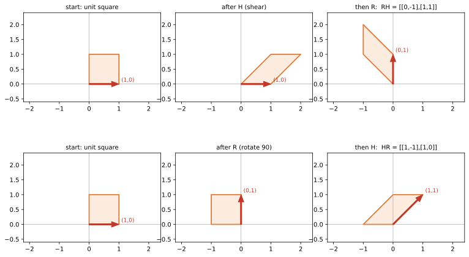

# ch06 — 乘法是合成：順序為什麼要緊

> **本章解決什麼問題**：上一章（見 ch05）把單一矩陣讀成一個動詞——一個對方格網（grid）做事的線性變換（linear transformation）。但真實系統很少只做一件事：你會先剪切再旋轉、先壓縮再加密、先平移再縮放。本章回答「兩個動詞接起來」是什麼——也就是**矩陣乘法 AB 到底在做什麼**。答案出乎意料地簡單而深刻：矩陣乘法不是某條要背的計算規則，它**就是變換的合成**，而那條惡名昭彰的「行（column，直行）乘列（row，橫列）」公式，是被「要讓合成正確」這個要求逼出來的。順帶地，我們會看清楚為什麼 AB≠BA 不是什麼詭異的例外，而是幾何上「做事順序不同、結果就不同」的必然。逆變換（把動作還原）留到 ch08，行列式的乘法性 det(AB) 留到 ch09。

在開始前先把一個會跟你一輩子的陷阱釘死：本書（依台灣慣例）**行（column）是直的、列（row）是橫的**。一個矩陣的「第一行」是它最左邊那一**直**排數字——這跟中國大陸的用法剛好相反，是線代翻譯名詞裡最惡名昭彰的地雷（見 landscape 與 ch05）。下文每次說「行」都指直行 column。

## 從你已知的出發

你早就知道「合成」這件事，而且早就知道它的順序會咬人。

**Middleware 串接。** 你寫過 Express／Koa／NestJS 的中介層（middleware）管線。`app.use(auth)` 接著 `app.use(logger)`，請求進來的時候誰先跑？順序錯了，你可能在還沒驗證身分前就把敏感欄位寫進 log，或反過來在驗證失敗後還白跑一堆昂貴的處理。管線是有方向的，把兩段順序對調，行為就變了。

**壓縮與加密。** 這是最乾淨的例子。你要把一個檔案又壓縮又加密，先做哪個？答案是**一定先壓縮再加密**。原因很物理：壓縮工具（gzip）是「找重複樣式」的機器，加密工具（AES）是「把資料打成高熵亂數」的機器。如果你先加密，餵給壓縮器的是一堆看不出規律的雜訊，它找不到可壓的樣式，檔案幾乎不會變小（2026-06）。先壓後加（gzip→AES）跟先加後壓（AES→gzip）是**兩個不同的管線、給出兩種不同的結果**——順序在這裡不是風格問題，是對錯問題。把這兩個動作各看成一個「函數」，你已經在用本章的核心概念：合成，而且合成不可交換。

**函數合成本身。** `f(g(x))` 你天天寫。讀法是「先算 g(x)，再把結果丟給 f」——雖然 `f` 寫在外面、看起來「先」，**實際上 g 先動**。數學記號 `(f∘g)(x)=f(g(x))` 是同一回事：寫在右邊（裡面）的先作用（2026-06）。把這個「右先左後」的直覺記牢，因為矩陣乘法 AB 借用的就是它。

**繪圖的 transform 疊加。** 如果你碰過 2D 繪圖／遊戲的座標變換，你大概踩過這個坑：先平移再旋轉，跟先旋轉再平移，物件會跑到不同地方。Canvas 的 transform stack、CSS 的 `transform: rotate(...) translate(...)`——順序一換，sprite 就飛到螢幕外。當時你可能只覺得「啊這個 API 順序很煩」，本章要告訴你：那不是 API 的脾氣，那是矩陣乘法不可交換的字面後果。

這一章要做的，就是把「合成有順序、順序會咬人」這個你身上早有的工程直覺，**翻譯成矩陣乘法的幾何**，然後讓你再也不需要背乘法公式——因為你會自己把它推出來。

## 把兩個動詞接起來：(AB)v = A(Bv)

先回到 ch05 的核心圖像：一個矩陣 B 是一個動詞，把向量 v 搬到新位置 Bv；另一個矩陣 A 是另一個動詞，把任何向量搬到它該去的地方。現在我問一個最自然的問題：**先用 B 搬一次，再用 A 搬一次，整段路程合起來是什麼變換？**

把它寫出來。拿一個向量 v（這裡 v 是個向量，下同），先作用 B：

```text
第一步：v  ──B──▶  Bv
第二步：Bv ──A──▶  A(Bv)
```

整段從 v 到 A(Bv) 的旅程，本身也是一個線性變換（兩個線性變換接起來還是線性的——保持加法與純量倍這件事一接再接都還在）。我們給這個「合成出來的變換」一個名字，記成 **AB**，並定義它的作用就是：

```text
(AB) v  :=  A(B v)        ← AB 的意思就是「先做 B、再做 A」
```

**這就是矩陣乘法的定義。** 不是「對應位置相乘相加」那串機械步驟——那串步驟是**結果**，不是出發點。出發點是這句話：**AB 代表「先 B 後 A」的合成。**

停十秒消化「先 B 後 A」這個順序，它是本章一切麻煩與美麗的源頭。為什麼是右邊的 B 先動？因為我們把矩陣寫在向量左邊（Av 這樣寫），而 v 緊挨著的是 B，所以**離向量最近的先作用**。這跟函數合成 f(g(x)) 一模一樣：g 緊貼著 x，g 先動。讀矩陣乘積 ABC 作用在 v 上，就從右往左唸：**先 C、再 B、再 A**。右先左後。

我認為這是線代第一個真正值得「啊哈」一下的轉折：你過去把矩陣乘法當成一條計算規則背下來，從沒人告訴你它**為什麼**長那樣。現在你知道了——它長那樣，是因為它必須讓「先做這個、再做那個」這件事算對。規則服務於合成，不是反過來。

### 從合成逼出「行乘列」的公式

光說「AB 是合成」還不夠誠實，本書是幾何優先、不是只有比喻。我們來看**那條乘法公式是怎麼從合成被逼出來的**——你會發現你根本不用背它。

關鍵還是 ch05 那把鑰匙：**一個矩陣的每一行（每一直行 column），就是某個基向量（basis vector）被搬到的地方。** 矩陣 A 的第一行是 A 對 ê₁ 做了什麼，第二行是 A 對 ê₂ 做了什麼。所以要知道合成 AB 這個變換長什麼樣，我只要問一件事：**AB 把 ê₁、ê₂ 各搬到哪？** 那兩個去向並排成行，就是 AB 這個矩陣。

而「AB 把 ê₁ 搬到哪」＝「先 B 把 ê₁ 搬到 Bê₁，再 A 把 Bê₁ 搬到 A(Bê₁)」。`Bê₁` 是什麼？是 **B 的第一行**（B 對 ê₁ 做的事，ch05）。所以：

```text
AB 的第一行 = A 作用在 (B 的第一行) 上
AB 的第二行 = A 作用在 (B 的第二行) 上
```

一句話：**AB 的每一行，就是 A 去搬 B 的對應那一行。** 用具體 2×2 把它攤開。設

```text
A = | a  b |        B = | e  f |        B 的第一行 = (e, g)ᵀ
    | c  d |            | g  h |        B 的第二行 = (f, h)ᵀ
```

AB 的第一行 ＝ A 作用在 (e, g)ᵀ 上。而「矩陣乘向量」是「行的加權相加」（ch05）：A 作用在 (e,g)ᵀ ＝ e·(A 的第一行) ＋ g·(A 的第二行) ＝ e·(a,c)ᵀ ＋ g·(b,d)ᵀ ＝ (ae+bg, ce+dg)ᵀ。同理 AB 的第二行 ＝ A 作用在 (f,h)ᵀ ＝ (af+bh, cf+dh)ᵀ。並起來：

```text
AB = | ae+bg   af+bh |
     | ce+dg   cf+dh |
```

看那個左上角 `ae+bg`：它是 **A 的第一列 (a,b) 與 B 的第一行 (e,g) 的點積（inner product）**。右上角 `af+bh` 是 A 的第一列點 B 的第二行。這正是大學教你背的「左邊取一列、右邊取一行、對應相乘再相加」——**「列點行」的機械記法**。

差別在於：以前那是天上掉下來、要硬記的咒語；現在它是**從「AB 必須＝先 B 後 A 的合成」一步步推出來的結論**。你不再需要記憶「哪個取列、哪個取行」——只要記得「AB 的每一行是 A 去搬 B 的那一行」，公式自己會浮出來。這是本章第一個要能講給另一個工程師聽的東西：**機械規則是合成的影子，不是合成的定義。**

（順帶一提，這也立刻解釋了為什麼矩陣相乘要求「左邊的行數＝右邊的列數」這種形狀限制：A 要能去「搬」B 的每一行，B 的行（一個向量）就得活在 A 吃得下的空間裡。形狀不合就不能合成，合成不了就不能相乘。）

### 單位矩陣 I：什麼都不做的那個動詞

合成的世界裡，有沒有一個「什麼都不做」的動作？有。它就是**單位矩陣（identity matrix）I**：

```text
I = | 1  0 |        I ê₁ = (1, 0)ᵀ = ê₁        ← 第一行：ê₁ 原地不動
    | 0  1 |        I ê₂ = (0, 1)ᵀ = ê₂        ← 第二行：ê₂ 原地不動
```

I 把每個基向量送回它自己，所以 I 對任何 v 都有 Iv=v——它是「不動」這個動詞。在合成裡它的角色跟數字 1 在乘法、跟恆等函數 `id(x)=x` 在函數合成裡一模一樣：**AI=IA=A**，先（或後）做一個「什麼都不做」當然不改變結果。I 是合成這個運算的中性元素。記住 I，因為 ch08 的逆矩陣就是用它定義的：A⁻¹ 是那個能讓 `A⁻¹A=I`、把 A 的動作完全還原回「什麼都沒發生」的變換。

### 結合律：為什麼 (AB)C = A(BC) 不用算就知道對

矩陣乘法有一個有時要花半頁去硬驗的性質：**結合律（associativity）**

```text
(AB)C = A(BC)
```

如果你用機械公式去展開兩邊、比對每一格相等，那是一場索引的災難，而且算完你還是不知道「為什麼」。但從合成的角度，它**幾何上是一眼可說清的**（不是要你接受「就是這樣」——理由我馬上給足，你能自己口頭說出來）：

`AB`、`BC` 都只是「把幾個動作接起來」的不同**括法**。`(AB)C` 是「先把 A、B 黏成一個動作，再接在 C 後面」；`A(BC)` 是「先把 B、C 黏成一個動作，再讓 A 接在後面」。但不管你怎麼黏、怎麼加括號，作用在任何 v 上，那串動作的**實際執行順序永遠是**：

```text
先 C，再 B，再 A
```

C 永遠最先碰到 v，A 永遠最後收尾。括號只是在描述「你心裡先把哪兩段視為一組」，它**不改變動作真正發生的先後**。既然兩邊作用在每個 v 上都產生同一條軌跡、同一個終點，它們就是同一個變換，於是同一個矩陣。這就是 (AB)C=A(BC)。

合成天生結合——把這件事吸收進直覺，你就不用再背、也不用再驗那條結合律了。順序（誰先誰後）要緊，但**分組（括號怎麼打）不要緊**。下一節我們要對付的，正好是順序這條會咬人的線。

## 交換律不成立：AB≠BA 是幾何的必然

數字相乘 3×5=5×3，你從小相信「乘法可以交換」。矩陣乘法**打破**這個信念，而且不是偶爾打破——**一般情況下 AB≠BA，相等才是特例。** 這是 Arthur Cayley 在 1858 年那篇奠基矩陣代數的《矩陣論回憶錄》（*A Memoir on the Theory of Matrices*）裡就明確指出的性質之一（2026-06；見 landscape）。在那之前，「乘法當然可交換」是沒人懷疑的常識；矩陣是第一批讓數學家被迫接受「乘法可以不可交換」的對象之一。

從合成的角度，這一點也不神祕，反而**非要這樣不可**：AB 是「先 B 後 A」，BA 是「先 A 後 B」。先穿襪子再穿鞋，跟先穿鞋再穿襪子，結果天差地遠。先壓縮再加密，跟先加密再壓縮，檔案大小天差地遠。**動作的順序本來就會改變結果**——會交換的那些（像兩個純量縮放）才是運氣好的巧合。我認為這是整章最該被內化的一句話：**AB≠BA 不是矩陣的怪癖，是「做事有先後」這件事在代數裡留下的指紋。**

### 把它畫出來：剪切與旋轉，誰先誰後

空話無用，我們用兩個你已經認得的配角矩陣（recurring cast，見 ch05）把差異算到底、再畫出來。一個是**剪切（shear）H**，一個是逆時針 90° 的**旋轉（rotation）R(90°)**：

```text
H = | 1  1 |   把 ê₂ 往右推、ê₁ 不動：方格被「推斜」成平行四邊形
    | 0  1 |   H 第一行=(1,0)、第二行=(1,1)

R = | 0 -1 |   逆時針轉 90°：ê₁=(1,0)→(0,1)、ê₂=(0,1)→(-1,0)
    | 1  0 |   R 第一行=(0,1)、第二行=(-1,0)
```

（旋轉矩陣 R(θ)=[[cosθ,−sinθ],[sinθ,cosθ]]、逆時針為正，全書與《圓的影子》一致；θ=90° 代入 cos90°=0、sin90°=1 就得上面這個 R。為什麼旋轉是這個形狀、複數又怎麼進來，本書 ch12 自己講。）

先算 **HR**（記住：HR 代表「先 R 後 H」，先轉再剪）。用上一節的鑰匙——HR 的每一行，是 H 去搬 R 的對應那一行：

```text
HR 第一行 = H 作用在 R 第一行 (0,1) 上
          = 0·(H 第一行) + 1·(H 第二行) = 0·(1,0) + 1·(1,1) = (1, 1)ᵀ
HR 第二行 = H 作用在 R 第二行 (-1,0) 上
          = -1·(1,0) + 0·(1,1) = (-1, 0)ᵀ
所以  HR = | 1 -1 |
           | 1  0 |
```

再算 **RH**（先 H 後 R，先剪再轉）：

```text
RH 第一行 = R 作用在 H 第一行 (1,0) 上
          = 1·(R 第一行) + 0·(R 第二行) = 1·(0,1) + 0·(-1,0) = (0, 1)ᵀ
RH 第二行 = R 作用在 H 第二行 (1,1) 上
          = 1·(0,1) + 1·(-1,0) = (-1, 1)ᵀ
所以  RH = | 0 -1 |
           | 1  1 |
```

兩個矩陣**明顯不相等**：

```text
HR = | 1 -1 |        RH = | 0 -1 |
     | 1  0 |             | 1  1 |
```

光看矩陣可能還沒感覺，把它們**作用在同一個向量上**——挑最樸素的 ê₁=(1,0)：

```text
HR · (1,0)ᵀ = (1, 1)ᵀ        ← 先轉後剪：ê₁ 落在 (1,1)
RH · (1,0)ᵀ = (0, 1)ᵀ        ← 先剪後轉：ê₁ 落在 (0,1)
```

同一個起點 (1,0)，只因為「剪」和「轉」的先後對調，終點就從 (1,1) 變成 (0,1)。用合成的眼睛重走一遍會更踏實——以 ê₁ 為例：

```text
HR 路徑（先 R 後 H）：(1,0) ─R→ (0,1) ─H→ (1,1)     H 把 (0,1) 往右推 1 → (1,1)
RH 路徑（先 H 後 R）：(1,0) ─H→ (1,0) ─R→ (0,1)     H 不動 ê₁，R 再把它轉成 (0,1)
```

兩條路徑從同一點出發，因為中途「推斜」這個動作插在旋轉前還是旋轉後，把點帶向了完全不同的地方。這就是 AB≠BA 的全部祕密——**沒有玄機，只有順序**。

本章的圖把這件事鋪成兩排對照：上排「方格 → 剪切 H → 旋轉 R」（即 RH 那條路），下排「方格 → 旋轉 R → 剪切 H」（即 HR 那條路），兩排的終態形狀一眼可見不一樣。



讀這張圖的看點只有一個：**盯著兩排最右邊的終態，它們不一樣。** 不一樣的原因不在矩陣本身有多複雜，而在「剪」與「轉」的先後被對調了。如果矩陣乘法可交換，這兩排終態就會長得一模一樣——它們不一樣，正是 AB≠BA 的視覺證據。

### 那什麼時候真的可以交換？

公平起見：AB=BA **偶爾**成立，但都有幾何上的好理由，不是運氣。最乾淨的一類是**對角矩陣（diagonal matrix）彼此**——也就是純沿座標軸縮放的變換。設兩個縮放

```text
D₁ = | 2  0 |        D₂ = | 5  0 |
     | 0  3 |             | 0  7 |
```

算 D₁D₂ 與 D₂D₁：

```text
D₁D₂ = | 2·5   0   | = | 10   0 |        D₂D₁ = | 5·2   0   | = | 10   0 |
       | 0    3·7  |   | 0   21 |               | 0    7·3  |   | 0   21 |
```

兩者相等。幾何上一目了然：D₁ 在 x 軸方向放大、在 y 軸方向放大，D₂ 也只在這兩條軸上各自縮放。**兩個變換用的是同一組軸，互不干擾**——x 方向先放 2 倍再放 5 倍，跟先放 5 倍再放 2 倍，都是 10 倍，純量乘法本來就可交換。沒有「把軸轉歪」這種會打架的動作，順序就無所謂。

關鍵的反例直覺是：**一旦其中一個變換會「轉動方向」（像旋轉、剪切），它就會把另一個變換賴以工作的軸給挪走，先後順序立刻有差。** 剪切 H 會把 y 方向推斜，旋轉 R 會把整組軸轉 90°；你「先轉軸再縮放」跟「先縮放再轉軸」當然不同。所以：**共用同一組不變軸的變換可交換，會互相挪動對方軸的變換不可交換。** 這個判準你帶得走——而且它在 ch13 對角化（把變換換到「對的軸」上看）會再次回來。

## 直覺的陷阱

矩陣乘法是線代裡最容易「會算但讀錯意思」的地方。下面四個是你（資深工程師、機械操作沒問題、但語意生鏽）最可能踩的，每個都附「怎麼自我察覺」。

| 陷阱 | 錯誤直覺長什麼樣 | 會在哪一步把你帶溝裡 | 怎麼自我察覺 |
|---|---|---|---|
| **以為矩陣乘法可交換** | 心裡默認 AB=BA，像對數字那樣隨便調換因子順序 | 把一串 transform 的矩陣亂序相乘、或在推導裡擅自把 AB 換成 BA，結果整個變換錯掉卻不知道 | 養成反射：看到 AB，先問「這是先做誰？」。任何時候你想交換兩個矩陣因子，停下來——除非你能說出它們共用同一組不變軸，否則預設**不能**換。 |
| **把 AB 讀成「先 A 後 B」** | 因為 A 寫在左邊、看起來「先」，就以為先作用 A | 設計變換管線時方向接反，畫出來的東西飛到奇怪的地方（就是你在繪圖 transform 踩過的那個坑） | 唸 (AB)v 一律從**右往左**：離 v 最近的先動。跟 f(g(x)) 對齊——寫外面的後做。心裡默念「右先左後」。 |
| **搞混 (AB)v 的作用順序** | 知道「右先左後」，但一遇到三個以上 ABCv 就亂 | 把 ABCv 算成「先 A」或隨機順序，多層 transform 全錯 | 永遠從最右邊那個緊貼 v 的矩陣開始，一個一個往左套：先 C、再 B、再 A。把它想成剝洋蔥，從最內層 v 往外剝。 |
| **拿對角矩陣可交換去推一般情形** | 「我試過兩個縮放可以交換，所以矩陣乘法應該大致可交換吧」 | 用一個會交換的特例去說服自己「順序大概不要緊」，然後在含旋轉／剪切的真實情形栽跟頭 | 記住可交換是**特例不是常態**：只有共用同一組不變軸（如都是對角矩陣）才保證可換。一旦有東西會轉動方向，立刻假設不可換，要換得先證。 |

還有一個跨章的延伸提醒：可逆變換的「還原」也吃順序。你把 (AB) 還原，要先還原最後做的 A、再還原先做的 B，所以 (AB)⁻¹=B⁻¹A⁻¹——**順序反過來**（穿衣脫衣：先脫後穿的，後穿先脫的）。逆矩陣是 ch08 的主題，這裡先讓你知道「順序敏感」會一路跟著我們。

## 紙上推演

### 推演題

**第 1 題 ★ [10 分鐘]——對角矩陣為什麼可交換**
設 D₁=diag(a,b)（即 [[a,0],[0,b]]）、D₂=diag(c,d)。手算 D₁D₂ 與 D₂D₁，證明它們相等。然後用一句幾何的話說明「為什麼這兩個變換的順序無所謂」。

**第 2 題 ★★ [12 分鐘]——(AB)v 為何是先 B 後 A**
有人主張：「AB 寫成這樣，A 在左邊，所以 AB 作用在 v 上時應該先做 A。」用 (AB)v=A(Bv) 的定義，配一個具體例子（取 B 為旋轉 R(90°)=[[0,−1],[1,0]]、A 為剪切 H=[[1,1],[0,1]]、v=(1,0)）拆成兩步算給他看，指出他錯在哪。

**第 3 題 ★★ [15 分鐘]——順序錯了就錯的工程例子**
從你自己的工作經驗舉一個「兩個動作合成、順序對調結果就不同」的例子（middleware、ETL 管線、影像處理 pipeline、座標 transform……皆可），把兩個動作各看成一個變換 A、B，說清楚 AB 與 BA 分別對應哪個順序、為什麼結果不同。這題沒有標準答案，目的是把 AB≠BA 接到你的肌肉記憶上。

**第 4 題 ★★★ [15 分鐘]——找出論證的破綻**
某人寫下這段「證明」：「因為 det 量的是面積縮放（見 ch09 預告），而面積縮放是個數字、數字相乘可交換，所以 det(AB)=det(BA)。又因為兩個矩陣的 det 相等，所以 AB=BA。」這段話的結論（AB=BA）是錯的，但它有一句話其實是對的。指出哪句對、哪句是致命跳步，並用本章的 H、R 當反例戳破它。

### 推演解答

**第 1 題。**

```text
D₁D₂ = | a 0 | | c 0 | = | ac    0  |
       | 0 b | | 0 d |   | 0    bd  |
D₂D₁ = | c 0 | | a 0 | = | ca    0  |
       | 0 d | | 0 b |   | 0    db  |
```

因為 ac=ca、bd=db（純量乘法可交換），兩者相等。幾何上：D₁ 與 D₂ 都只沿 x 軸、y 軸各自縮放，**用的是同一組軸、互不挪動對方的軸**；x 方向先乘 a 再乘 c、跟先乘 c 再乘 a，都是 ac 倍。沒有任何「轉動方向」的動作，先後就無所謂。

**第 2 題。** 定義是 (AB)v=A(Bv)，所以**先把 B 作用在 v 上、再把 A 作用在結果上**。具體拆兩步（A=H、B=R、v=(1,0)）：

```text
第一步（先做 B=R）：R·(1,0)ᵀ = (0, 1)ᵀ        ← 旋轉 90°，ê₁ 轉到 (0,1)
第二步（再做 A=H）：H·(0,1)ᵀ = (1, 1)ᵀ        ← 剪切把 (0,1) 往右推 1 → (1,1)
```

對照若「先做 A=H」會得什麼：H·(1,0)=(1,0)（H 不動 ê₁），再 R·(1,0)=(0,1)——終點 (0,1)，跟正確答案 (1,1) 不同。他的錯在於把「寫在左邊」當成「先作用」；事實是**離 v 最近（寫在最右邊）的先動**，就像 f(g(x)) 裡 g 先動。直接驗證：HR=[[1,−1],[1,0]]，HR·(1,0)=(1,1) ✓，跟兩步合成的結果一致。

**第 3 題（範例答案）。** 壓縮 + 加密的管線。令 B＝「gzip 壓縮」、A＝「AES 加密」。AB＝先壓再加（gzip→AES），檔案先被找出重複樣式縮小、再打成亂數，最終又小又安全；BA＝先加再壓（AES→gzip），加密先把資料打成高熵亂數、壓縮器找不到任何樣式，檔案幾乎不縮（2026-06）。同樣兩個動作，AB 與 BA 給出大小差很多的結果——這就是 AB≠BA 的工程版：A 改變了 B 賴以工作的前提（樣式被加密抹掉了），所以順序不能換。（你也可以用「先驗證後記錄 vs 先記錄後驗證」的 middleware、或繪圖「先平移後旋轉 vs 先旋轉後平移」作答，重點是說清楚誰挪動了誰的前提。）

**第 4 題。** **對的那句是 `det(AB)=det(BA)`**——這確實成立（因為 det(AB)=detA·detB=detB·detA=det(BA)，det 的乘法性留 ch09，但結論本身對）。**致命跳步是最後一句**：「兩個矩陣的 det 相等，所以矩陣相等。」這是把「一個數字相等」誤當成「整個矩陣相等」——det 只是把矩陣壓成一個數，無數個不同矩陣可以有相同的 det。反例就用本章的 H、R：

```text
HR = | 1 -1 |   det = 1·0-(-1)·1 = 1
     | 1  0 |
RH = | 0 -1 |   det = 0·1-(-1)·1 = 1
     | 1  1 |
```

det(HR)=det(RH)=1（與「對的那句」一致），但 HR≠RH（前面已算）。一個純量相等推不出矩陣相等，這論證從「面積倍率可交換」這件對的事，硬跳到「變換可交換」這件錯的事。

### 動手生圖

本章的圖（兩排對照，看「先剪後轉」與「先轉後剪」終態不同）由以下腳本產生。它同時就是你的小實驗：跑它、改它、重生它。

```python
# ch06 figure: order matters -- shear-then-rotate vs rotate-then-shear give different end states
from pathlib import Path
import numpy as np
import matplotlib
matplotlib.use("Agg")          # headless; no display needed
import matplotlib.pyplot as plt

OUT = Path(__file__).resolve().parent / "out" / "ch06-composition-order.svg"
OUT.parent.mkdir(parents=True, exist_ok=True)

H = np.array([[1.0, 1.0], [0.0, 1.0]])              # shear
R = np.array([[0.0, -1.0], [1.0, 0.0]])            # rotate 90 deg CCW
sq = np.array([[0, 1, 1, 0, 0], [0, 0, 1, 1, 0]])  # unit square
e1 = np.array([1.0, 0.0])

def draw(ax, M, title):
    g = M @ sq
    ax.fill(g[0], g[1], color="#f4a26133", edgecolor="#e07b39", lw=1.8)
    v = M @ e1                                      # track e1 = (1,0)
    ax.annotate("", xy=v, xytext=(0, 0), arrowprops=dict(color="#c0392b", width=2, headwidth=9))
    ax.text(v[0] + 0.08, v[1] + 0.08, f"({v[0]:.0f},{v[1]:.0f})", color="#c0392b", fontsize=9)
    ax.set_title(title, fontsize=10); ax.set_xlim(-2.2, 2.4); ax.set_ylim(-0.6, 2.4)
    ax.set_aspect("equal"); ax.axhline(0, color="0.6", lw=0.6); ax.axvline(0, color="0.6", lw=0.6)

fig, axs = plt.subplots(2, 3, figsize=(10.5, 7))
draw(axs[0, 0], np.eye(2), "start: unit square")           # top row: shear then rotate
draw(axs[0, 1], H, "after H (shear)")
draw(axs[0, 2], R @ H, "then R:  RH = [[0,-1],[1,1]]")
draw(axs[1, 0], np.eye(2), "start: unit square")           # bottom row: rotate then shear
draw(axs[1, 1], R, "after R (rotate 90)")
draw(axs[1, 2], H @ R, "then H:  HR = [[1,-1],[1,0]]")
fig.tight_layout()
fig.savefig(OUT, bbox_inches="tight")
print("wrote", OUT)            # build_figures.py reads this
```

**預期輸出**：六格子圖。上排是「先剪後轉」（方格 → H 推成右傾平行四邊形 → R 把它轉 90°），對應矩陣 `R@H = RH = [[0,-1],[1,1]]`；下排是「先轉後剪」（方格 → R 轉成立在左上的方塊 → H 推斜），對應 `H@R = HR = [[1,-1],[1,0]]`。**盯兩排最右邊的終態：形狀不一樣**——這就是 AB≠BA。注意紅箭頭標的 ê₁ 去向：上排 RH 把 (1,0) 帶到 (0,1)，下排 HR 把 (1,0) 帶到 (1,1)。

**改參數看什麼**：
- 把第三格的 `R @ H` 和第六格的 `H @ R` 互相對調（或交換上下排的合成順序），看兩排終態跟著互換——順序就是一切。
- 把 R 換成更小的角度，例如 `R = np.array([[np.cos(t),-np.sin(t)],[np.sin(t),np.cos(t)]])` 配 `t = np.radians(30)`，再比兩排終態，差異變小但仍在——只要含旋轉，順序就有差。
- 把 H 也換成對角縮放 `H = np.array([[2.,0.],[0.,3.]])` 並把 R 也換成另一個對角矩陣，你會看到兩排終態**重合**——這正是「對角矩陣可交換」的視覺確認（呼應紙上推演第 1 題）。

## 自我檢核

口頭自答；講得出來才算過關，卡住就回到對應段落。

1. **矩陣乘法 AB 的定義是什麼？** 不要說「對應位置相乘相加」——說它的**意義**：AB 是「先做 B、再做 A」的合成，(AB)v=A(Bv)。那條相乘相加的規則是這個定義的結果。
2. **那條「列點行」的乘法公式是怎麼來的？** 用「AB 的每一行＝A 去搬 B 的那一行」＋「矩陣乘向量是行的加權相加」推一遍，看公式自己浮出來。能推就代表你不再需要背它。
3. **(AB)v 是先作用 A 還是先作用 B？為什麼？** 先 B（離 v 最近的先動，右先左後），跟 f(g(x)) 裡 g 先動同理。
4. **單位矩陣 I 在合成裡扮演什麼角色？** 「什麼都不做」的動詞，AI=IA=A，等同數字 1 與恆等函數。
5. **為什麼 (AB)C=A(BC)（結合律）不用硬算就知道對？** 不管怎麼加括號，動作真正執行的順序都是先 C 再 B 再 A；括號只改變「心裡的分組」、不改變執行先後，所以兩邊是同一個變換。
6. **為什麼 AB≠BA 是幾何上的必然，不是矩陣的怪癖？**（本章必答）因為 AB 是「先 B 後 A」、BA 是「先 A 後 B」，而做事的先後本來就會改變結果（穿襪穿鞋、壓縮加密）；尤其當其中一個變換會轉動方向（旋轉、剪切），它會把另一個變換賴以工作的軸挪走，順序立刻有差。會交換的（共用同一組不變軸，如對角矩陣）才是特例。
7. **什麼樣的兩個變換保證可交換？舉一類並說理由。** 對角矩陣彼此（純沿同一組座標軸縮放、互不挪動對方的軸）；一旦有東西轉動方向就不保證。
8. **拿剪切 H 和旋轉 R 作用在 ê₁=(1,0) 上，HR 和 RH 各把它送到哪？** HR·(1,0)=(1,1)、RH·(1,0)=(0,1)——同一起點，順序一換就分家。

## 延伸閱讀

- **3Blue1Brown《Essence of Linear Algebra》第 4 章「Matrix multiplication as composition」**（YouTube，免費；2026-06 可取）。本章的視覺化版本，把「AB＝先 B 後 A」用動畫演到你忘不掉，特別是「右先左後」與旋轉×剪切不可交換那段，看完再回頭讀本章的圖會更通透。播放清單：https://www.youtube.com/playlist?list=PLZHQObOWTQDPD3MizzM2xVFitgF8hE_ab
- **Gilbert Strang，MIT 18.06，矩陣乘法那幾講**（MIT OpenCourseWare，免費）。Strang 給了矩陣乘法的多種看法（列點行、行的組合、整列／整行、分塊），與本章「合成優先」的看法互補——看他怎麼從不同角度算同一個乘積，能加深「規則只是同一件事的不同切面」的體會。https://ocw.mit.edu/courses/18-06-linear-algebra-spring-2010/
- **Arthur Cayley，*A Memoir on the Theory of Matrices*（1858）**（Phil. Trans. Roy. Soc. vol. 148, pp. 17–37；Internet Archive 有原文掃描，免費）。矩陣代數的出生證明，也是「乘法不可交換」第一次被白紙黑字寫進理論的地方（2026-06）。讀不懂十九世紀的記法沒關係，看一眼歷史現場、知道你正在用的乘法是 1858 年才被定義出來的，就值了。https://archive.org/details/philtrans05474612
- **Sheldon Axler，*Linear Algebra Done Right*（第 4 版，Open Access 免費 PDF）** 關於線性映射合成的一節。Axler 從「線性映射的合成」出發定義矩陣乘法（而非反過來），與本章同源——想看更抽象、更乾淨的處理可讀它。https://linear.axler.net/
