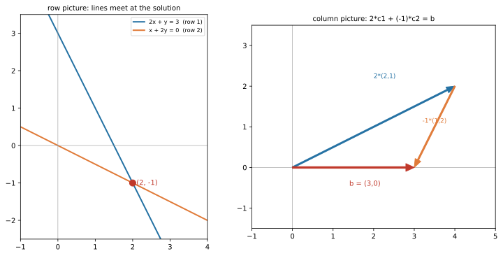

# ch07 — 解 Ax=b：行視角與列視角

> **本章解決什麼問題**：前兩章把矩陣讀成一個動詞——一個對空間做事的線性變換（linear transformation，見 ch05），乘法則是把動詞接起來的合成（見 ch06）。現在我們回到線性代數最古老、最具體的問題：**解一個線性方程組 Ax=b**——也就是反過來問「什麼樣的輸入 x，會被矩陣 A 送到指定的目標 b？」這題你國中就會用消去法算，但本章不是來教你怎麼算（消去法你早會了），而是給你**兩副看同一個方程組的幾何眼鏡**：列視角（一堆直線／平面的交點）與行視角（b 是不是幾個方向湊得出來、要湊多少份）。這兩副眼鏡會讓你一眼看出方程組有幾個解、為什麼有時候根本無解——而這正是 ch08（逆與不可逆）、ch10（秩）、ch16（無解時的最近解）整個後半本書的地基。逆矩陣解法留 ch08，超定系統的最小平方留 ch16，秩的正式定義留 ch10。

開工前先把那個會跟你一輩子的陷阱再釘一次：本書依台灣慣例，**行（直行，column）是直的、列（橫列，row）是橫的**。一個矩陣的「第一行」是它最左邊那一**直**排數字、是一個向量；「第一列」是最上面那一**橫**排。這跟中國大陸的用法剛好相反，是線代翻譯名詞裡最惡名昭彰的地雷（見 landscape 與 ch05–06）。本章的標題就叫「行視角 vs 列視角」，這兩個字一旦搞反，整章顛倒——所以下文每次說「行」都指直行 column、每次說「列」都指橫列 row，不再重複標注。

## 從你已知的出發

解聯立方程式，本質上是**在一堆約束下求未知**。這件事你天天在做，只是沒掛上「線性代數」這個名字。

**容量配置。** 你有兩台機器，每台跑不同的工作組合：機器 A 每小時處理 2 個 type-1 任務加 1 個 type-2 任務，機器 B 處理 1 個 type-1 加 2 個 type-2。今天進來的工作要求「總共消化掉某個 type-1 配額、某個 type-2 配額」——問你兩台機器各要開幾小時？這就是一個 2×2 的線性方程組：兩個約束（兩種任務的配額）、兩個未知（兩台機器的時數）。你解的，就是 Ax=b。

**流量守恆。** 你畫過服務依賴圖、追過一條請求在系統裡怎麼分流。在每個節點，「流進來的＝流出去的」是一條守恆約束；把整張圖的守恆方程列出來，就是一個線性方程組，未知數是每條邊上的流量。Kirchhoff 在電路上做的、你在 trace 一條請求路徑時心算的，是同一回事。

**約束比未知多、而且打架。** 更貼近真實的是這個：你蒐集了一堆觀測（10 個資料點），想用一條只有 2 個參數的直線去配適它們。10 個約束、2 個未知——**方程比未知多，而且因為有雜訊，沒有任何一條直線能同時穿過全部 10 點**。這種「約束太多、互相矛盾、根本無解」的系統叫**超定系統（overdetermined system）**，它不是反常，而是你做迴歸、配趨勢線時的常態。本章先把「無解到底長什麼樣、為什麼會無解」的幾何講清楚；至於「無解時誠實地給一個最不委屈的近似解」，那是 ch16 最小平方的主場，這裡先鋪路。

**行視角＝盤點你手上的基本動作。** 還有一種讀法，更接近 ch05 的動詞直覺：把 A 的每一行看成「一種你能施加的基本動作」，問題變成「**我手上有這幾種基本動作，能不能組合出目標 b？各要用多少份？**」——這跟你問「我有這幾個微服務原語，能不能拼出這個功能」是同一種思考。這就是本章的另一副眼鏡：行視角。

兩副眼鏡看同一個方程組，但回答的問題不同：列視角擅長回答「解在哪、是幾條約束的交點」，行視角擅長回答「到底有沒有解、為什麼」。一個資深工程師值得兩副都戴上——因為它們會在後面整本書反覆回來。

## 列視角：每一列是一條線，解是它們的交點

先從你最熟的那副眼鏡開始。拿一個具體方程組——它正好是脊椎矩陣 S=[[2,1],[1,2]]（就是 ch01 登場、ch05 讀成動詞的那個 S）配上右邊 b=(3,0) 的情形，這是脊椎 S 的第二層讀法：

```text
2x + y = 3        ← 第一列（row 1）
x + 2y = 0        ← 第二列（row 2）
```

寫成矩陣形式 Sx=b，其中 x=(x,y)ᵀ 是未知向量：

```text
S = | 2  1 |        x = | x |        b = | 3 |
    | 1  2 |            | y |            | 0 |
```

**列視角（row picture）的讀法**：把矩陣**一列一列**地讀。每一列搭配 b 的對應分量，就是一個方程；在平面上，每個二元一次方程是**一條直線**。第一列 `2x+y=3` 是一條直線，第二列 `x+2y=0` 是另一條直線。一個 (x,y) 要同時滿足兩個方程，它就得**同時落在兩條直線上**——也就是**兩條直線的交點**。

```text
解 = (兩條直線的交點)
```

這就是列視角的全部直覺：**N 個方程＝N 條直線（在三維是 N 個平面），解＝它們共同的交點。** 解這個系統，幾何上就是「找那個同時站在所有約束線上的點」。

我們把交點解出來。第二列給 `x = -2y`，代進第一列：`2(-2y)+y=3` → `-3y=3` → `y=-1`，於是 `x=-2(-1)=2`。解是 **(x,y)=(2,-1)**。

別只算完就走——本書的規矩是**每個解都代回原式驗一遍**（矩陣運算最容易算錯，見 style-guide 深度標準）。代回 Sx：

```text
S · (2, -1)ᵀ = | 2  1 | | 2 |   | 2·2 + 1·(-1) |   | 3 |
               | 1  2 | |-1 | = | 1·2 + 2·(-1) | = | 0 |   ✓ = b
```

對上 b=(3,0)。列視角給的答案 (2,-1) 是對的。

注意我剛剛用的「代回原式」其實偷偷用了另一副眼鏡——`S·(2,-1)` 算出來是「2 份第一行加 −1 份第二行」。這就是行視角，下一節登場。先停十秒，把列視角的圖像在腦裡擺好：**兩條直線，交在一點，那個點就是解。**

## 行視角：解 x 是「各行湊出 b 要多少份」

現在換眼鏡。同一個方程組 Sx=b，這次把矩陣**一行一行**地讀（每一行是一個直向量）。

關鍵回到 ch05 那把鑰匙：**矩陣乘向量 Sx，就是 S 的各行的線性組合（linear combination），權重是 x 的各分量。** 把 S 的兩行命名為 c₁=(2,1)ᵀ（第一行）、c₂=(1,2)ᵀ（第二行），那麼：

```text
S x = | 2  1 | | x |  =  x·| 2 | + y·| 1 |  =  x·c₁ + y·c₂
      | 1  2 | | y |       | 1 |     | 2 |
```

讀一遍這個式子：**Sx 不是什麼神祕運算，它就是「拿 x 份的 c₁，加上 y 份的 c₂」。** x 挑出第一行、加權 x 倍；y 挑出第二行、加權 y 倍；兩者相加。（這是 ch05「向量挑行、行加權相加」的觀點，不是「列點行」的機械記法——同一個乘法的兩種讀法。）

於是方程組 Sx=b 的意思整個翻轉成一個全新的問題：

```text
要多少份 c₁、多少份 c₂，才能剛好湊出 b？
        x·(2,1) + y·(1,2) = (3, 0)
```

**行視角（column picture）的讀法**：解 x=(x,y) 不再是「交點的座標」，而是**湊出 b 所需的配方比例**——x 是 c₁ 的份數、y 是 c₂ 的份數。把矩陣的每一行想成你手上的一種「基本方向」（呼應「從你已知的出發」裡盤點基本動作那段），解方程就是問「這幾個方向能不能調配出目標 b、各調多少」。

我們把配方解出來。其實上一節已經有答案 (x,y)=(2,-1)，行視角應該給同一個解（同一個方程組嘛）。驗證這份配方真的湊出 b：

```text
2·c₁ + (-1)·c₂ = 2·(2,1) + (-1)·(1,2)
               = (4, 2) + (-1, -2)
               = (4-1, 2-2)
               = (3, 0)   ✓ = b
```

成立。**用 2 份 c₁、扣掉 1 份 c₂，剛好走到 b=(3,0)。** 幾何上你可以把它畫成向量頭接尾：從原點先走 2 份 c₁（到 (4,2)），再退 1 份 c₂（到 (3,0)）——本章的圖右半邊畫的就是這個。

兩副眼鏡，同一個答案 (2,-1)：

```text
列視角：(2,-1) 是「2x+y=3」與「x+2y=0」兩條線的交點。
行視角：(2,-1) 是「2 份 c₁ 減 1 份 c₂ 湊出 b」的配方係數。
```

我認為這是本章第一個值得「啊哈」的點：**同一串數字 (2,-1)，在列視角是一個位置（交點座標），在行視角是一個配方（份數）。** 兩種讀法不是哪個對哪個錯，是同一個方程組的兩個側面。你過去只會列視角（國中的消去法、畫兩條線找交點），本章把行視角補上——而行視角才是接下來判斷「有沒有解」的利器。把兩副眼鏡並排畫出來看：



### 高斯消去：系統化地問「交點在哪」

順帶交代一下你國中就會、也是電腦實際在跑的那套消去法和這兩副眼鏡的關係。**高斯消去法（Gaussian elimination）本質上是列視角的系統化版本**：用「某一列乘個倍數加到另一列」這種列運算，一步步把方程組化簡到能直接讀出交點（上三角、回代）。它做的事，幾何上就是「不改變交點、只是把直線換成更好讀的等價直線」，最後逼到一條 `y=某數`、一條 `x=某數`，交點就裸露出來。

值得當「直覺的陷阱」素材的歷史事實（照 landscape 釘死）：**這套消去法遠遠早於高斯。** 中國《九章算術》第八章「方程」就在算籌（counting rods）上做一模一樣的消元——把各方程的係數排成一個長方形陣列，**一個方程排成一直行**（紅籌記正數、黑籌記負數），然後做列運算消元（2026-06 查證，這是世界上已知最早求解線性方程組的完整方法）。《九章算術》成書約在西元一世紀（不晚於約 93 CE，現存題銘可溯至 179 CE），比高斯（1777–1855）早了將近兩千年。**所以「高斯發明高斯消去法」是錯的**——高斯做的是把一個早已存在的方法形式化、加上最小平方法的脈絡（1809 年算穀神星軌道），名字才掛上他（見 landscape 迷思表第 1 條）。有趣的巧合：《九章算術》把一個方程排成一**直行**，這跟我們今天「矩陣的一行＝一個向量」的行視角直覺，隔了兩千年遙遙呼應。

本書不刷消去法的大型操練（這不是計算手冊，見 style-guide）——你會算就夠了。我們在意的是消去法在幹嘛：**它是「系統化地把列視角的交點問出來」的工具。** 至於「行與列的視角」這個雙重讀法的教學框架，當代主要是 Gilbert Strang 在 MIT 18.06 第一堂課（the geometry of linear equations）大力推廣的（2026-06；他的 row picture／column picture 是線代教學的經典開場）——本章正是站在他的肩膀上。

## 0、1、∞：解的個數，行視角一眼看穿

現在來到本章最有價值的部分。一個線性方程組可能有：唯一解、無解、或無限多解——**而且只有這三種可能**（線性系統不會有「剛好 2 個解」這種事，這本身就值得想一想）。哪種情況發生，**行視角給你最快的判斷**。先用列視角建立圖像，再用行視角給出判準。

**列視角的圖像**（兩條直線的三種相對位置）：

```text
相交於一點   →  唯一解（兩條線就一個交點）
平行不相交   →  無解（找不到同時在兩條線上的點）
完全重合     →  無限多解（每一點都在「兩條」線上）
```

這很直觀，但有個盲點：當方程多、維度高，你沒辦法在腦裡畫一堆平面去看它們怎麼交。**行視角給的判準更鋒利，而且推得遠**：

```text
解 x 存在  ⟺  b 落在「各行張成的空間」（行空間，column space）裡
            （b 湊得出來，就有解；湊不出來，就無解）
解 x 唯一  ⟺  各行線性獨立（湊法只有一種）
解 無限多  ⟺  b 湊得出來，但各行線性相依（同一個 b 有多種湊法）
```

把這三句讀懂，你就握住了整章的鑰匙。逐句拆：

- **有沒有解，看 b 在不在行的「能達範圍」裡。** A 的各行張成（span，見 ch03）一個空間——那是「這些方向能調配出來的所有點」的集合（行空間，正式定義與秩留 ch10）。b 在裡面，就湊得出來、有解；b 在外面，怎麼調配都搆不到、**無解**。這就是行視角最漂亮的地方：**無解不是「算錯了」，是「目標根本不在你能達的範圍內」。**
- **解唯不唯一，看各行獨不獨立。** 若各行線性獨立（沒有一行是別人的組合，見 ch03），湊出 b 的配方只有一種——唯一解。若各行線性相依（有一行是多餘的方向），那麼「多餘那行」可以用別人補回來，同一個 b 就有**無限多種**配方——無限多解。

用脊椎 S 對照一個壞掉的例子，把三種情況都見一遍。

**情況一：唯一解（S，兩行獨立）。** S 的兩行 c₁=(2,1)、c₂=(1,2) 線性獨立（互不為倍數——(2,1) 乘任何數都到不了 (1,2)）。兩個獨立方向在平面上能張成整個 ℝ²，所以**任何** b 都湊得出來、而且配方唯一。剛才 b=(3,0) 解得唯一的 (2,-1)，正是這個。換個 b=(3,3) 試試（脊椎第二層的另一個基準）：解 Sx=(3,3)，列視角是 `2x+y=3` 與 `x+2y=3` 的交點，行視角是 `x·(2,1)+y·(1,2)=(3,3)`。解出來 **(x,y)=(1,1)**，代回驗證：

```text
S · (1,1)ᵀ = | 2  1 | | 1 |   | 2+1 |   | 3 |
             | 1  2 | | 1 | = | 1+2 | = | 3 |   ✓ = b
```

行視角看更順：1 份 c₁ 加 1 份 c₂ ＝ (2,1)+(1,2)=(3,3)，配方 (1,1)。獨立的兩行，什麼 b 都能湊、且只有一種湊法。

**情況二與三：奇異矩陣（兩行相依）。** 換掉 S，用配角裡的奇異矩陣 M=[[1,2],[2,4]]（見 ch05–06 配角表）：

```text
M = | 1  2 |        第一行 c₁ = (1, 2)ᵀ
    | 2  4 |        第二行 c₂ = (2, 4)ᵀ = 2·c₁   ← 第二行剛好是第一行的 2 倍！
```

兩行**線性相依**——c₂ 就是 2 倍的 c₁，它沒帶來任何新方向。所以不管你怎麼調配 `x·c₁+y·c₂`，結果永遠落在 c₁ 那**一條直線**上（即過原點、方向 (1,2) 的那條線）。M 的「能達範圍」從整個平面塌成一條線。這條線就是 M 的行空間。

- **若 b 不在那條線上 → 無解。** 取 b=(1,1)。問：(1,1) 在「方向 (1,2) 的直線」上嗎？那條線上的點長 (t, 2t)，要 (t,2t)=(1,1) 得同時 t=1 且 2t=1——矛盾。**(1,1) 不在線上，怎麼調配 c₁、c₂ 都搆不到它，無解。** 列視角對照：方程組是 `x+2y=1` 與 `2x+4y=1`，第二式除以 2 得 `x+2y=1/2`，跟第一式 `x+2y=1` **平行但不重合**（同斜率、不同截距）——兩條平行線永不相交，所以無解。兩副眼鏡同一結論。

- **若 b 在那條線上 → 無限多解。** 取 b=(1,2)（它就是 c₁，當然在線上）。`x·(1,2)+y·(2,4)=(1,2)` 有解嗎？c₁ 本身就是 (1,2)，所以 (x,y)=(1,0) 是一個解。但因為 c₂=2c₁，你也可以「少用點 c₁、拿 c₂ 補回來」：兩列其實是同一條約束 `x+2y=1`，取 y=t 自由、x=1-2t，對**任何** t 都是解。例如 t=1 給 (x,y)=(-1,1)，驗 `M·(-1,1)=(-1+2, -2+4)=(1,2)` ✓；t=-1 給 (3,-1)，驗 `M·(3,-1)=(3-2, 6-4)=(1,2)` ✓。**同一個 b 有無限多種配方（解是一整條參數線），無限多解。** 列視角：`x+2y=1` 與 `2x+4y=2` 其實是**完全重合**的同一條線，線上每一點都是解。

把三種情況收進一張表（脊椎 S 與奇異 M 對照）：

```text
矩陣             各行           b           解的個數     幾何理由
S=[[2,1],[1,2]]  獨立(張滿ℝ²)   任何 b      唯一        兩線交一點 / 配方唯一
M=[[1,2],[2,4]]  相依(塌成線)   b=(1,1)在線外  無解      兩線平行 / b 搆不到
M=[[1,2],[2,4]]  相依(塌成線)   b=(1,2)在線上  無限多    兩線重合 / 配方有無限種
```

這張表是本章要你帶走的核心。**det 那個一句話同時解釋「不可逆、無解、相依、壓扁降維」的統一觀點留 ch09**，這裡你先從行視角親眼看到：當各行相依、「能達範圍」塌掉時，無解與無限多解是同一個塌陷的兩面——**b 在塌掉後的範圍裡就無限多解、不在就無解**。一個矩陣「行相依」這件事，就決定了你的方程組命運。

## 直覺的陷阱

解方程是你最熟的操作，正因為太熟，最容易「會算但讀錯幾何」。下面四個是資深工程師（消去法閉著眼睛都會、但語意生鏽）最常踩的，每個都附「怎麼自我察覺」。

| 陷阱 | 錯誤直覺長什麼樣 | 會在哪一步把你帶溝裡 | 怎麼自我察覺 |
|---|---|---|---|
| **只會機械消去、不會幾何讀解** | 把解方程當成一套「消元→回代」的手續，算出數字就交差，腦裡沒有任何圖像 | 一旦系統退化（無解、無限多解、接近奇異），你只會看到消去過程「卡住」或冒出 `0=1`，卻不知道那在幾何上代表什麼、該怎麼辦 | 每解完一個系統，逼自己用一句話說出「列視角是哪幾條線怎麼交、行視角是哪些行湊不湊得出 b」。說不出來，代表你只是在做算術，沒在解問題。 |
| **把無解當成自己算錯** | 消去到最後跑出 `0 = 5` 這種矛盾，第一反應是「我哪裡算錯了」，回頭重算三遍 | 浪費時間找不存在的 bug；更糟的是硬湊一個假的「解」交出去，因為你不相信「真的無解」這件事 | `0=矛盾常數` 不是錯誤訊號，是系統在告訴你 **b 不在行空間裡、根本無解**（兩線平行）。看到它，先停手問「b 搆得到嗎」，而不是重算。 |
| **混淆「無解」與「無限多解」** | 看到消去過程「塌掉一列」（出現 `0=0`），以為跟 `0=5` 是同一種壞掉，統稱「沒有唯一解」就含糊帶過 | 把「無限多解」（b 在線上、解是一整條線）誤報成「無解」，或反過來，下游邏輯整個錯——這兩者在工程上天差地遠（一個是「有得選」，一個是「無解、要改問題」） | 釘死區別：`0=0`（矛盾消失、約束變少）→ b 在塌掉的範圍**內**→**無限多解**；`0=非零`（矛盾浮現）→ b 在範圍**外**→**無解**。一個是相依但相容，一個是相依且矛盾。 |
| **以為方程一定有唯一解** | 國中經驗給的錯覺：「聯立方程嘛，列出來解一下就有一組答案」，預設天下方程皆唯一解 | 在超定系統（方程比未知多，見「從你已知的出發」）或奇異系統上，理所當然地去「求那個解」，而它不存在或不唯一；寫程式時不檢查就直接 `solve()`，遇到奇異矩陣炸掉或拿到垃圾 | 拿到任何方程組，先問三件事：未知幾個、獨立約束幾個、b 在不在行空間。唯一解只是三種命運之一，不是預設。方程比未知多時尤其要警覺——那通常**無解**，該轉去 ch16 的最小平方求最近解。 |

跨章提醒：這四個陷阱的根，都是「行是否獨立、b 在不在行空間」這一件事——它在 ch08 變成「可不可逆」、在 ch09 變成「det 是不是 0」、在 ch10 變成「秩夠不夠」。本章是這條線的源頭，把行視角的判準吃進肌肉，後面三章會省你很多力氣。

## 紙上推演

### 推演題

**第 1 題 ★★ [15 分鐘]——一個 b 在不在行空間裡（行視角判生死）**
用奇異矩陣 M=[[1,2],[2,4]]。對下面三個 b，**只用行視角**判斷各有幾個解（唯一／無解／無限多），並說出幾何理由（不要動手消去，用「b 在不在那條線上」判斷）：(a) b=(3,6)、(b) b=(3,5)、(c) b=(0,0)。

**第 2 題 ★★ [12 分鐘]——同一個方程組，兩副眼鏡各走一遍**
解 Sx=(3,3)（S 是脊椎 [[2,1],[1,2]]）。用**列視角**畫／描述兩條直線怎麼交、解在哪；再用**行視角**寫出「x 份 c₁ 加 y 份 c₂ 湊 (3,3)」並解出配方。兩個答案必須一致，最後代回 S 驗一次。

**第 3 題 ★ [8 分鐘]——把消去的訊號翻成幾何**
某人對一個 2×2 系統做高斯消去，最後一列變成 `0 = 0`；另一個系統最後一列變成 `0 = 7`。分別說明這兩個系統有幾個解、b 與行空間的關係、兩條直線的相對位置。

**第 4 題 ★★★ [15 分鐘]——口頭題：為什麼會無解**
用你自己的話，向另一個工程師解釋「為什麼一個線性方程組會無解」。要求：同時用列視角（線怎麼擺）和行視角（b 跟行空間的關係）各講一遍，並說清楚「無解」跟「算錯」差在哪、跟「無限多解」差在哪。這題沒有標準數字答案，目的是逼你把幾何講出口。

### 推演解答

**第 1 題。** M 的兩行 c₁=(1,2)、c₂=(2,4)=2c₁ 相依，行空間＝過原點、方向 (1,2) 的那條直線（線上的點長 (t,2t)）。判斷各 b 在不在線上：

- **(a) b=(3,6)**：(3,6)=(t,2t) 要 t=3 且 2t=6 → t=3 一致，**在線上**。b 湊得出（c₁ 用 3 份就到，或用 c₂ 補），但因兩行相依、配方不唯一 → **無限多解**。
- **(b) b=(3,5)**：要 t=3 且 2t=5 → 3 與 2.5 矛盾，**不在線上**。c₁、c₂ 怎麼調配都搆不到 (3,5) → **無解**。
- **(c) b=(0,0)**：(0,0)=(0,0)，**在線上**（原點永遠在過原點的行空間裡）。x=(0,0) 顯然是一個解（零配方），但相依 → 還有別的（如 (2,-1)：`2c₁-c₂=2(1,2)-(2,4)=(0,0)`✓）→ **無限多解**。（齊次系統 Mx=0 在相依時必有非零解，這預告 ch10 的零空間。）

關鍵心法：相依矩陣的命運只看「b 在不在那條塌掉的線上」——在線上恆為無限多解、線外恆為無解，永遠不會唯一。

**第 2 題。** 列視角：兩條線 `2x+y=3`、`x+2y=3`。由第一式 y=3-2x 代入第二式：x+2(3-2x)=3 → x+6-4x=3 → -3x=-3 → x=1，y=3-2=1。交點 **(1,1)**。行視角：求 `x(2,1)+y(1,2)=(3,3)`，即 (2x+y, x+2y)=(3,3)，同一組方程，解 (x,y)=(1,1)——配方是「1 份 c₁ 加 1 份 c₂」，幾何上 (2,1)+(1,2) 頭接尾正好到 (3,3)。代回驗證：

```text
S · (1,1)ᵀ = | 2  1 | | 1 |   | 3 |
             | 1  2 | | 1 | = | 3 |   ✓ = (3,3)
```

兩副眼鏡同一答案 (1,1)。列視角讀成交點座標、行視角讀成配方份數——巧的是這個 b 的配方剛好兩份都是 1，看起來樸素，但意義完全不同（位置 vs 份數）。

**第 3 題。**
- `0 = 0`：消去把一列整個抵消，代表兩個方程其實是同一條約束（兩列相依、兩直線**重合**），b 落在塌掉的行空間裡 → **無限多解**（解是一整條線）。
- `0 = 7`：消去逼出矛盾（`0` 不可能等於 `7`），代表兩約束打架（兩直線**平行不重合**），b 在行空間**外** → **無解**。

口訣：消去尾巴 `0=0` 是「約束變少、相容」→無限多；`0=非零` 是「約束矛盾」→無解。

**第 4 題（範例答案）。** 列視角講法：每個方程是一條線（平面上）或一個平面（三維），解是所有線／面的共同交點。無解＝這些線／面**沒有共同交點**——最簡單就是兩條平行線，怎麼擺都碰不到，沒有一個點能同時滿足所有約束。行視角講法：把矩陣的每一行看成一個你能用的方向，b 是目標；有解＝b 落在「這些方向能調配出來的所有點」（行空間）裡，無解＝b 在這個範圍**外面**，你手上的方向再怎麼加權組合都搆不到它。「無解」跟「算錯」差在：算錯是你的手續出包、重算會修好；無解是這個問題**本身就沒有答案**，重算一萬遍還是無解，消去到最後冒出 `0=矛盾` 正是系統在誠實告訴你這件事。「無解」跟「無限多解」差在：無解是 b 在能達範圍外（搆不到）；無限多解是 b 在範圍內、但因為有多餘的方向（行相依），湊到 b 的配方不只一種，於是解有一整條（或一整片）。

### 動手生圖

本章的圖把兩副眼鏡並排：左邊列視角（兩條線交於解），右邊行視角（b 由兩行加權頭接尾湊成）。它同時就是你的小實驗——跑它、改它、重生它，親手感受「換 b，交點和配方係數怎麼一起變」。

```python
# ch07 figure: two pictures of S x = (3,0). Left = row picture (two lines meet
# at (2,-1)). Right = column picture: b=(3,0) = 2*(2,1) + (-1)*(1,2), drawn tip-to-tail.
from pathlib import Path
import numpy as np
import matplotlib
matplotlib.use("Agg")          # headless; no display needed
import matplotlib.pyplot as plt

OUT = Path(__file__).resolve().parent / "out" / "ch07-row-vs-column.svg"
OUT.parent.mkdir(parents=True, exist_ok=True)

fig, (axL, axR) = plt.subplots(1, 2, figsize=(10.5, 5.2))

# --- left: row picture. Lines 2x+y=3 and x+2y=0, meeting at (2,-1) ---
x = np.linspace(-1, 4, 50)
axL.plot(x, 3 - 2 * x, color="#2471a3", lw=2, label="2x + y = 3  (row 1)")
axL.plot(x, -x / 2, color="#e07b39", lw=2, label="x + 2y = 0  (row 2)")
axL.plot(2, -1, "o", color="#c0392b", ms=9)
axL.text(2.1, -1.05, "(2, -1)", color="#c0392b", fontsize=10)
axL.set_title("row picture: lines meet at the solution", fontsize=10)
axL.set_xlim(-1, 4); axL.set_ylim(-2.5, 3.5); axL.legend(fontsize=8, loc="upper right")

# --- right: column picture. b = 2*c1 + (-1)*c2, tip-to-tail ---
c1 = np.array([2.0, 1.0]); c2 = np.array([1.0, 2.0]); b = 2 * c1 - 1 * c2  # = (3,0)
axR.annotate("", xy=2 * c1, xytext=(0, 0), arrowprops=dict(color="#2471a3", width=2, headwidth=9))
axR.annotate("", xy=b, xytext=2 * c1, arrowprops=dict(color="#e07b39", width=2, headwidth=9))
axR.annotate("", xy=b, xytext=(0, 0), arrowprops=dict(color="#c0392b", width=2.4, headwidth=11))
axR.text(2.0, 2.2, "2*(2,1)", color="#2471a3", fontsize=9)
axR.text(3.2, 1.1, "-1*(1,2)", color="#e07b39", fontsize=9)
axR.text(1.4, -0.45, "b = (3,0)", color="#c0392b", fontsize=10)
axR.set_title("column picture: 2*c1 + (-1)*c2 = b", fontsize=10)
axR.set_xlim(-1, 5); axR.set_ylim(-1.5, 3.5)

for ax in (axL, axR):
    ax.set_aspect("equal"); ax.axhline(0, color="0.6", lw=0.6); ax.axvline(0, color="0.6", lw=0.6)
fig.tight_layout()
fig.savefig(OUT, bbox_inches="tight")
print("wrote", OUT)             # build_figures.py reads this
```

**預期輸出**：左右兩格。**左格（列視角）**畫兩條直線——藍線 `2x+y=3`、橘線 `x+2y=0`——交於紅點 (2,-1)，那個交點就是解。**右格（行視角）**畫三個頭接尾的箭頭：藍箭頭從原點走到 (4,2)（＝2 份 c₁=(2,1)），橘箭頭從 (4,2) 退回 (3,0)（＝−1 份 c₂=(1,2)），紅箭頭直接從原點指到 b=(3,0)——兩段藍＋橘正好把你帶到紅色的 b，視覺證明「2 份 c₁ 減 1 份 c₂＝b」。左右兩格講的是同一個解 (2,-1)：左邊讀成交點座標、右邊讀成配方份數。

**換 b 看交點與組合係數怎麼變**：
- 把右邊那個目標換成 **b=(3,3)**——程式裡同步改：左格把 `3 - 2*x` 換成 `3 - 2*x`（第一條線不變）、把 `-x/2` 換成 `(3 - x)/2`（第二條線變成 `x+2y=3`），交點會移到 (1,1)；右格把係數 `2` 和 `-1` 換成新配方 `1` 和 `1`（即 `b = 1*c1 + 1*c2`），紅箭頭指向 (3,3)。你會看到**列視角的交點**和**行視角的配方係數**一起改變——它們始終是同一個解的兩種讀數。
- 把 S 換成奇異矩陣 **M=[[1,2],[2,4]]**（兩行相依）：左格兩條線會變平行（b 在線外時不相交＝無解）或重合（b 在線上時＝無限多解）；右格你會發現兩個行箭頭 c₁=(1,2)、c₂=(2,4) 共線——它們的任何組合都困在同一條線上，b=(3,0) 落在線外就湊不出來。這正是「相依→塌成線→無解或無限多」的視覺版。

## 自我檢核

口頭自答；講得出來才算過關，卡住就回到對應段落。

1. **列視角怎麼讀一個方程組 Ax=b？解在幾何上是什麼？** 把矩陣一列一列讀，每列配 b 的對應分量是一個方程＝一條直線（高維是平面）；解＝所有這些線／面的共同交點。
2. **行視角怎麼讀同一個方程組？這時解 x 代表什麼？** 把矩陣一行一行讀，Ax＝各行的線性組合（x 是權重）；解方程＝問「要多少份各行才湊得出 b」，解 x 是那組配方份數。
3. **同一個解 (2,-1) 在兩副眼鏡下分別是什麼意思？** 列視角：兩條線 `2x+y=3`、`x+2y=0` 的交點座標；行視角：「2 份第一行減 1 份第二行湊出 b=(3,0)」的配方係數。位置 vs 份數，同一串數字兩種身分。
4. **一個方程組可能有幾種解的個數？只有這三種嗎？** 唯一、無解、無限多——只有這三種。線性系統不會剛好有 2 個、5 個解（這正是「線性」的後果之一）。
5. **為什麼有時候方程組無解？**（本章必答）行視角：b 落在「各行能調配出來的範圍」（行空間）**之外**，手上的方向怎麼加權都搆不到它。列視角：那些直線／平面**沒有共同交點**（最簡單是兩條平行線）。無解是問題本身沒答案，不是算錯——消去到最後冒出 `0=非零矛盾` 就是它的訊號。
6. **無解和無限多解差在哪？怎麼從消去過程分辨？** 都發生在各行相依（範圍塌掉）時：b 在塌掉的範圍**外**→無解（消去尾巴 `0=非零`）；b 在範圍**內**→無限多解（消去尾巴 `0=0`，約束變少、解是一整條線）。
7. **為什麼脊椎 S=[[2,1],[1,2]] 對任何 b 都有唯一解？** 它的兩行 (2,1)、(1,2) 線性獨立、張滿整個 ℝ²，所以任何 b 都湊得出來（有解）、且配方只有一種（唯一）。
8. **高斯消去法在這兩副眼鏡裡扮演什麼角色？它是高斯發明的嗎？** 它是「系統化地把列視角的交點問出來」的工具（用列運算化簡到能直接讀解）；**不是高斯發明的**——《九章算術》「方程」章早了近兩千年，高斯做的是形式化與命名（見 landscape）。

## 延伸閱讀

- **3Blue1Brown《Essence of Linear Algebra》第 7–8 章（inverse matrices, column space and null space；以及「dot products」前的線性方程組鋪陳）**（YouTube，免費；2026-06 可取）。把「b 在不在 column space 裡」用動畫演到你忘不掉，與本章行視角同源。先看本章建立判準，再看影片把它動起來。播放清單：https://www.youtube.com/playlist?list=PLZHQObOWTQDPD3MizzM2xVFitgF8hE_ab
- **Gilbert Strang，MIT 18.06，Lecture 1「The Geometry of Linear Equations」**（MIT OpenCourseWare，免費）。本章「列視角 vs 行視角」這個雙重讀法的經典源頭——Strang 開宗明義就用 row picture／column picture 兩副眼鏡看 2×2、3×3 系統（2026-06）。看他怎麼從「三個平面怎麼交」一路講到「三個行向量怎麼湊 b」，是本章最直接的延伸。https://ocw.mit.edu/courses/18-06-linear-algebra-spring-2010/
- **《九章算術》第八章「方程」**（線上有多種校注本與英譯，如 MacTutor 的 Nine Chapters 條目，免費）。想親眼看「高斯消去早於高斯兩千年」的證據，讀這一章的消元題——把一個方程排成一直行、紅黑算籌記正負、做列運算消元，跟你今天在白板上做的一模一樣（2026-06）。MacTutor 概覽：https://mathshistory.st-andrews.ac.uk/HistTopics/Nine_chapters/
- **Sheldon Axler，*Linear Algebra Done Right*（第 4 版，Open Access 免費 PDF）** 關於線性映射的值域（range）與「Ax=b 何時有解」的處理。Axler 從線性映射的角度（range＝行空間）談解的存在性，比座標計算更乾淨——想看更抽象的同一件事可讀它。https://linear.axler.net/
