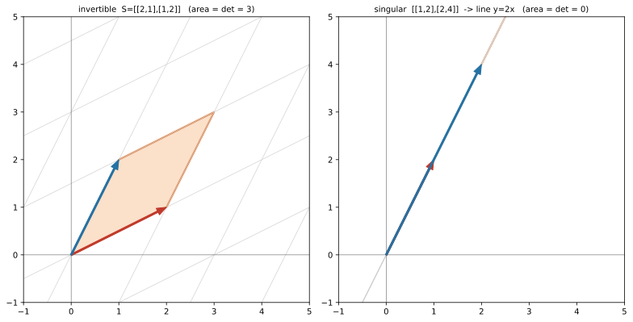

# ch08 — 逆與不可逆：什麼時候回得去

> **本章解決什麼問題**：前三章把矩陣讀成動詞（見 ch05）、把乘法讀成合成（見 ch06）、把解 Ax=b 讀成兩種幾何視角（見 ch07）。現在問一個工程師每天都在問的問題：**這個動作回得去嗎？** 一個變換把空間搬動了，能不能找到另一個變換把它**原封不動搬回來**——這就是逆矩陣（inverse matrix）。答案不是「能或不能」這麼乾脆，而是兩層：第一層幾何上很乾淨（壓扁了就回不去、沒壓扁就回得去）；第二層是本章的故障重頭戲——**就算理論上回得去，數值上你也可能解得一塌糊塗**。det≠0 跟「你解得準」是兩件事，這個落差（條件數，condition number）是工程師被線代咬得最痛的地方。行列式的正式定義留 ch09，秩與四個基本子空間留 ch10，QR 的數值細節留 ch17——本章先用幾何直覺把它們串起來。

在開始前把那個一輩子的陷阱再釘一次：本書（依台灣慣例）**行（column，直行）是直的、列（row，橫列）是橫的**，跟中國大陸用法相反（見 landscape 與 ch05）。下文每次說「行」都指直行 column。

## 從你已知的出發

「能不能回到原狀」這件事，你的工程直覺裡早就有三套對應物。本章要做的，是把它們翻譯成矩陣的語言。

**可逆＝可回滾（rollback）。** 你部署過會出事的服務。一個好的變更，最重要的性質之一是**能回滾**——出問題時有辦法把系統還原到動作之前的狀態。資料庫 migration 寫 `up` 也寫 `down`，event sourcing 靠 reverse event 補償，交易（transaction）失敗就 rollback。「可逆」在你腦裡不是抽象詞，是「萬一搞砸了，有沒有 undo」。矩陣的逆 A⁻¹ 就是 A 的 `down` migration：它把 A 做過的事，一步不差地撤銷回去。`A⁻¹A=I`——先做 A 再做 A⁻¹，等於什麼都沒發生（I 是「不動」那個動詞，ch06）。

**壓扁降維＝lossy 壓縮回不去。** 你壓過圖片。JPEG 把資訊丟掉一些換體積，丟掉的那部分**永遠回不來**——你可以把 JPEG 再解開成一張同尺寸的圖，但原始那些細節已經沒了。lossy 是單行道。線代裡有一個一模一樣的東西：當一個變換**把空間壓扁、降了維度**（把二維的面壓成一維的線），它就丟掉了整整一個方向的資訊。投影（projection）就是這種動作——它像是「只保留某個欄位、把另一個欄位直接砍掉」。砍掉的欄位回不來，所以投影**不可逆**。本章會讓你看到「壓扁降維」和「lossy 回不去」在數學上是同一件事。

**條件數＝輸入微動、輸出暴走的不穩定系統。** 你最怕哪一種系統？不是會明確報錯當掉的那種——那種你看得到、抓得住。最可怕的是**輸入只動了一點點、輸出就天翻地覆**的那種：某個參數調了 0.1%，整個結果面目全非，而且它不報錯、它「成功」回給你一個數字，只是那個數字是垃圾。這種「對輸入過度敏感」的不穩定，在線代裡有一個精確的名字叫**條件數**。本章最重要的一課就是：一個矩陣可以理論上完全可逆（det≠0、有 `down` migration），但條件數高到讓你「解出來的答案」根本不能信。**「它可逆」不保證「你解得準」**——這兩件事的分家，是本章的靈魂。

## 逆矩陣：唯一能把動作還原的那個變換

先把定義講清楚。A 是一個變換，它把每個 v 搬到 Av。它的**逆變換 A⁻¹** 是那個能把搬走的東西搬回原位的動作：對任何 v，先 A 再 A⁻¹，回到 v 本身。

```text
A⁻¹ A = I        ← 先做 A、再做 A⁻¹，等於什麼都沒做
A A⁻¹ = I        ← 反過來先做 A⁻¹、再做 A 也一樣
```

I 是單位矩陣（identity，ch06），那個「不動」的動詞。所以 A⁻¹ 的工作就是把 A 抵銷成「不動」。注意這跟 ch06 末尾埋的伏筆對上了：要還原合成 (AB)，得先撤銷最後做的 A、再撤銷先做的 B，所以 **(AB)⁻¹=B⁻¹A⁻¹**，順序反過來（先脫後穿的、後穿先脫的）。

**一個動作有沒有逆，是有條件的。** 不是每個矩陣都有 A⁻¹。什麼時候有、什麼時候沒有——這正是本章的核心，而答案是幾何的。

### 可逆的幾何：沒壓扁空間，資訊一點沒丟

先看「回得去」長什麼樣。一個變換可逆，幾何上的充要條件只有一句話：**它沒有把空間壓扁。**

把這句話講準。一個 2×2 可逆變換，把平面打成另一個平面——方格網（grid）可能被拉斜、放大、轉向，但**它還是一張鋪滿整個平面的方格網**，沒有塌成一條線、沒有縮成一個點。每個輸出位置，**剛好對應一個輸入位置**：這就是數學上說的「雙射（bijection）」——一對一又映滿。雙射的意思用工程話講就是：**資訊完全沒丟**。你拿到輸出 Av，永遠能唯一地反推回是哪個 v 進來的，因為沒有兩個不同的 v 會撞到同一個輸出。能唯一反推，就能還原，就有 A⁻¹。

我們的脊椎矩陣 S=[[2,1],[1,2]]（就是 ch01 那個 S，七層讀法的主角）正是這種乾淨的可逆變換。它把單位方格拉成一個面積 3 的平行四邊形（ch09 會算這個 3），方格網被推斜了，但**沒塌**——還是鋪滿平面的格子。所以 S 可逆，它有一個 S⁻¹ 能把斜格搬回正方格。

### 不可逆的幾何：壓扁降維，資訊永久損失

再看「回不去」。一個變換不可逆，幾何上就一句話：**它把空間壓扁、降了維度。**

最乾淨的例子是投影 [[1,0],[0,0]]（配角矩陣，ch05 出場過）。它對任何 (x,y) 做的事是：

```text
| 1  0 | | x |   | x |        ← x 留著
| 0  0 | | y | = | 0 |        ← y 被歸零、整條 y 方向被壓掉
```

它把整個平面壓到 x 軸上——二維塌成一維。問題來了：輸出 (x,0) 是從哪個輸入來的？(x,0) 來、(x,1) 也來、(x,99) 通通來——**無窮多個輸入撞到同一個輸出**。這就不是雙射了，y 那一維的資訊**永久損失**，跟 JPEG 砍掉的細節一樣回不來。你拿到 (x,0)，沒有任何辦法知道原本的 y 是多少。沒辦法唯一反推，就**沒有** A⁻¹。投影不可逆，因為它是 lossy 的降維。

這是本章第一個要能講給另一個工程師聽的東西：**可逆 ⟺ 沒壓扁（雙射、資訊沒丟）；不可逆 ⟺ 壓扁降維（資訊永久損失）。** 「回不去」不是技術困難，是**資訊真的不在了**——你要還原的東西已經被刪掉了。

### 等價條件鏈：四句話其實是同一句

線代課本會給你一張長長的「可逆等價條件」清單，看起來像要背的。但從幾何看，它們是**同一件事的四種說法**，串起來毫不費力。對一個 n×n 方陣 A：

```text
A 可逆  ⟺  A 的各行線性獨立  ⟺  A 滿秩  ⟺  det A ≠ 0  ⟺  Ax=b 恰有唯一解
```

一條一條用幾何串（秩留 ch10、det 的正式定義留 ch09，這裡先用直覺）：

- **A 可逆 ⟺ 各行線性獨立。** A 的各行是基向量的去向（ch05）。如果這些去向**線性獨立**（誰也不是別人的組合，ch03），它們就撐得出整個 n 維空間——方格網鋪滿、沒塌。如果有一行是別人的組合（相依），那個方向就是多餘的，變換少撐起一維、空間被壓扁。所以「行獨立」就是「沒壓扁」的代數版。
- **⟺ 滿秩。** 秩（rank，ch10）量的是「變換後還剩幾維」。沒壓扁＝還剩滿滿 n 維＝滿秩（rank=n）。壓扁了就秩虧（rank<n）。滿秩只是「沒壓扁」的另一個說法。
- **⟺ det≠0。** 行列式（determinant，ch09）量的是變換把面積／體積放大的倍率。沒壓扁＝面積沒被壓成 0＝det≠0。壓扁成一條線＝面積變 0＝det=0。**det=0 就是「壓扁」的數字訊號**——這是 ch09 最大的驚嘆點，本章先借用。
- **⟺ Ax=b 恰有唯一解。** 沒壓扁＝雙射＝每個 b 剛好對應一個 x（ch07 的行視角：b 由各行唯一地組出來）。壓扁了就要嘛無解（b 不在壓扁後的線上）、要嘛無限多解（b 在線上但有無窮多 x 對到它）。

五個說法，**一個幾何事實**：空間有沒有被壓扁。記住「壓扁」這個圖像，這整條鏈你不用背——它們講的是同一件事，從不同窗口看。

### 2×2 逆公式：怎麼算回去

幾何講完，給你算的工具。2×2 的逆有一條漂亮的封閉公式：

```text
A = | a  b |        A⁻¹ = ___1___ | d  -b |
    | c  d |                ad-bc  | -c   a |
```

那個分母 `ad−bc` 就是 det A（ch09 正式講它為什麼是面積）。公式在做的事：對角線元素 a、d **對調**，反對角線 b、c **變號**，最後整個除以 det。**det 出現在分母**——這已經在劇透本章的故障重頭戲了：det 越接近 0，這個除法就把整個矩陣的元素放得越大，逆就越「爆」。先記住「det 在分母」這件事，下一節它會回來咬人。

#### Worked example：脊椎 S 的逆，算到底、驗回去

S=[[2,1],[1,2]]，先算 det：`ad−bc = 2·2 − 1·1 = 3`（這就是 ch09 那個面積 3）。套公式，對角 2、2 對調還是 2、2，反對角 1、1 變號成 −1、−1：

```text
S⁻¹ = (1/3) | 2  -1 |        ← 全書脊椎數值，記住它
            | -1  2 |
```

本書深度標準要求每個逆都**乘回去驗證**（矩陣最容易算錯）。算 S⁻¹S 該得 I：

```text
S⁻¹ S = (1/3) | 2  -1 | | 2  1 |
              | -1  2 | | 1  2 |

左上 = (1/3)(2·2 + (-1)·1) = (1/3)(4-1) = (1/3)(3) = 1   ✓
右上 = (1/3)(2·1 + (-1)·2) = (1/3)(2-2) = (1/3)(0) = 0   ✓
左下 = (1/3)((-1)·2 + 2·1) = (1/3)(-2+2) = (1/3)(0) = 0   ✓
右下 = (1/3)((-1)·1 + 2·2) = (1/3)(-1+4) = (1/3)(3) = 1   ✓

S⁻¹ S = | 1  0 | = I        ✓ 確認 S⁻¹ 真的是 S 的逆
        | 0  1 |
```

#### 用 S⁻¹ 解 Sx=(3,0)：對照 ch07，兩條路同一答案

ch07 用行視角與列視角解過 Sx=(3,0)ᵀ，得 x=(2,−1)ᵀ。現在用逆再解一次——既然 `Sx=b`，左乘 S⁻¹ 得 `x=S⁻¹b`：

```text
x = S⁻¹ (3,0)ᵀ = (1/3) | 2  -1 | | 3 |   = (1/3) | 2·3 + (-1)·0 |   = (1/3) | 6 |   = | 2 |
                       | -1  2 | | 0 |           | -1·3 + 2·0   |           | -3 |     | -1 |
```

x=(2,−1)ᵀ，跟 ch07 兩視角的答案一致。代回 S 驗證：`S(2,−1)ᵀ = (2·2+1·(−1), 1·2+2·(−1)) = (4−1, 2−2) = (3,0)ᵀ` ✓。三條路（行視角、列視角、逆）殊途同歸——**在 2×2、漂亮數字上，用逆解方程看起來又快又乾淨**。記住這個「看起來很爽」的印象，因為本章稍後要告訴你：**在真實的數值世界，這正是個陷阱。**

#### 對照組：奇異矩陣 [[1,2],[2,4]]，連 det 都是 0

把可逆的 S 跟一個**不可逆（奇異，singular）**的矩陣並排，差別才看得清。取配角矩陣 G=[[1,2],[2,4]]：

```text
det G = 1·4 - 2·2 = 4 - 4 = 0        ← det=0，套逆公式會除以 0，逆不存在
```

為什麼 det=0？看它的兩行：第一行 (1,2)、第二行 (2,4)＝**2 倍第一行**。兩行線性相依（ch03），不獨立。幾何上 G 對任何 (x,y) 做的事：

```text
| 1  2 | | x |   | x + 2y  |   = (x+2y) | 1 |        ← 輸出永遠是 (1,2) 的倍數
| 2  4 | | y | = | 2x + 4y |             | 2 |
```

不管 (x,y) 是什麼，輸出永遠落在 (1,2) 這個方向的直線上——也就是 **y=2x 這條線**。G 把**整個平面壓成一條線**，二維塌成一維。這就是「壓扁降維」的字面演出：方格網不再鋪滿平面，它被碾成了一條線。無窮多個輸入撞到線上同一點（例如 (1,0)、(3,−1) 都被送到 (1,2)，你可以代進去驗），資訊損失，不可逆。

本章的圖把可逆與奇異並排畫出來：左邊 S 把方格網拉成鋪滿平面的斜格（面積 3，還是個格子）；右邊 G 把方格網壓成一條線 y=2x（面積 0，格子塌了）。



讀圖的看點：**左邊還是個格子網、右邊塌成一條線。** 可逆與不可逆的全部差別，就在這個「塌沒塌」。det＝那塊橘色面積：左邊 3、右邊 0。

## 故障重頭戲：病態矩陣——det≠0 不代表你解得準

到這裡，你可能以為故事完了：det≠0 就可逆、就能解、就回得去。**這是本章最危險的誤會，也是工程師被線代咬得最慘的地方。** 真實的數值世界裡，「可逆」和「解得準」之間有一道深淵，名字叫**條件數（condition number）**。

### det≠0 但「幾乎」要塌：病態的直覺

看這個矩陣（本章故障示範主角）：

```text
B = | 1  1     |        det B = 1·1.0001 - 1·1 = 1.0001 - 1 = 0.0001
    | 1  1.0001|
```

det B = 0.0001 ≠ 0。按前面的等價鏈，B **可逆**——理論上完美，有逆、Bx=b 有唯一解、行獨立。但它**離奇異只差頭髮絲**：把那個 1.0001 改成 1.0000，它立刻變成 [[1,1],[1,1]]，兩行相同、det=0、徹底塌掉。B 的兩行 (1,1) 與 (1,1.0001) **幾乎平行**——幾何上，B 把方格網壓成一個**極度扁、薄如刀片**的平行四邊形（面積 0.0001，快要是條線了但還不是）。

它「技術上沒壓扁」，但「快壓扁了」。這種**接近奇異**的矩陣叫**病態（ill-conditioned）**。問題在於它的逆。套 2×2 逆公式，分母是 det=0.0001，一除：

```text
B⁻¹ = ___1___ | 1.0001  -1 |  = | 10001   -10000 |        ← 元素 ~10⁴，爆掉了
       0.0001 | -1       1 |    | -10000   10000 |
```

逆的元素是 ~10⁴ 量級（精確是 10001、10000）。回想前面那句話：**det 在分母**。det 小到 0.0001，逆就被放大一萬倍。這不是算錯，這是病態矩陣的本質——**它可逆，但它的逆是個放大器**。

### 條件數：輸入的小誤差，被放大多少倍

現在把工程師最該怕的後果攤開。假設你要解 Bx=b，而你的 b 來自真實世界，帶一點點誤差（量測雜訊、浮點捨入、上游服務回傳的近似值——b **永遠**帶誤差，這是 zero-trust 的基本假設）。b 動一點點，解 x 動多少？

解是 x=B⁻¹b。B⁻¹ 的元素 ~10⁴，所以 b 裡一個大小 ε 的誤差，會被 B⁻¹ 放大成 x 裡大小約 10⁴·ε 的誤差。**輸入的相對誤差，被放大上萬倍灌進輸出。** 你 b 準到小數點後四位，解 x 可能連個位數都是錯的——而程式不會報錯，`np.linalg.solve` 會「成功」回給你一個漂亮的向量，只是那個向量是垃圾。這正是「從你已知的出發」裡最可怕的那種系統：**輸入微動、輸出暴走，而且不報錯。**

這個「放大幾倍」有一個精確的度量，就是**條件數 κ(A)**。直覺定義（精確版用奇異值，ch19 才有工具，這裡先給直覺）：

```text
條件數 κ(A) ≈ 變換把空間「最被拉長的方向」與「最被壓扁的方向」的倍率比

κ(A) 大  ⟺  矩陣把單位圓拉成一個又長又扁的雪茄／薄餅（最長軸 ÷ 最短軸 很大）
κ(A) 小  ⟺  矩陣把單位圓拉成接近正圓（各方向倍率差不多）
```

關鍵的工程結論（這條來自數值分析的標準誤差界，2026-06）：

> **解 Ax=b 時，輸入相對誤差被放大的倍率，上界就是條件數 κ(A)。** κ(A) ≈ 10ᵏ 大致代表你「損失 k 位有效數字」。([Wikipedia: Condition number](https://en.wikipedia.org/wiki/Condition_number)、[CS 357 條件數講義](https://courses.grainger.illinois.edu/cs357/fa2021/notes/ref-10-condition.html))

我們的 B，條件數約 4×10⁴——解 Bx=b 大約損失 4 到 5 位有效數字。對照脊椎 S：S 把單位圓拉成半軸 3 和 1 的橢圓（ch19），條件數只有 3/1=3，幾乎不放大誤差——**S 是良態（well-conditioned）的，B 是病態的，而兩者 det 都不是 0、都「可逆」**。

最經典的病態例子是**希爾伯特矩陣（Hilbert matrix）**：元素 Hᵢⱼ=1/(i+j−1)，它每個元素都是乾乾淨淨的單位分數、det≠0、理論上完美可逆，但 5×5 的條件數就到約 4.8×10⁵，到 10×10 條件數爆到天文數字——它的各列幾乎線性相依，是「接近奇異」的教科書標本（[Wikipedia: Hilbert matrix](https://en.wikipedia.org/wiki/Hilbert_matrix)、[Higham: What Is the Hilbert Matrix?](https://nhigham.com/2020/06/30/what-is-the-hilbert-matrix/)）。如果有人拿希爾伯特矩陣當「可逆所以沒問題」的例子，你就知道他要踩雷了。

**「它可逆 ≠ 你解得準」**——這是本章一定要能講給另一個工程師聽的一句話。可逆是個是非題（det 是不是 0），解得準是個連續的程度問題（條件數多大）。把這兩件事混為一談，是線代在工程裡最常見的暗坑：你檢查了 det≠0 就放心了，卻沒問條件數，然後你的最小平方擬合、你的座標反解、你的卡爾曼濾波，悄悄回給你被放大一萬倍的垃圾。

### 用逆矩陣解 Ax=b 是「數值上的罪」

最後一個故障，直接顛覆前面那個「用 S⁻¹ 解方程好爽」的印象。**在真實的數值計算裡，你幾乎永遠不該先算出 A⁻¹、再乘上 b 來解 Ax=b。** 這在數值分析圈是條鐵律，常被半開玩笑地稱作「數值上的罪」。

為什麼？兩個理由（2026-06）：

1. **更不準。** 顯式地算出整個 A⁻¹，會額外引入一輪捨入誤差（你先把逆的每個元素都近似算出來、存下來，再拿這些已經帶誤差的數去乘 b）。直接解（不經過逆）的演算法捨入誤差更少。對病態矩陣，這個額外的誤差可能就是「能用」和「垃圾」的分界。
2. **更慢。** 算出完整的 A⁻¹ 的運算量，大約是「直接解一次」的兩倍以上。你為了一個 b，卻先算了一整個逆矩陣——多做一倍的工，還換來更差的精度。

那實務上怎麼解？答案是**分解（factorization）**：把 A 拆成幾個容易解的矩陣相乘（LU 分解拆成上下三角、QR 分解拆成正交矩陣乘上三角），然後用「逐步代入」直接解，**全程不碰逆**。`numpy.linalg.solve(A, b)` 底層做的就是分解＋代入，不是 `inv(A) @ b`——這兩者數學上等價，數值上天差地遠（[Why Shouldn't I Invert That Matrix?](https://gregorygundersen.com/blog/2020/12/09/matrix-inversion/)、[NumPy 線性代數常見陷阱](https://apxml.com/courses/linear-algebra-essentials-ml/chapter-3-solving-linear-systems-matrix-inverses/numerical-stability-alternatives)）。

QR 為什麼特別穩、Gram–Schmidt 怎麼把矩陣扶正成分解，本書 ch17 自己講。這裡你只要帶走鐵律：**看到 `inv(A) @ b` 這種寫法，反射性地皺眉，改成 `solve(A, b)`。** 逆矩陣是個漂亮的**理論**物件（讓你理解「可逆」「還原」「等價鏈」），但它是個糟糕的**計算**工具。理論上用它思考，數值上別真的去算它——這個分裂，是線代從黑板走進生產環境時最重要的一課。

## 直覺的陷阱

逆與不可逆是線代裡「機械操作會、語意全錯」的重災區。下面四個是你（資深工程師、會算但語意生鏽）最可能踩的坑，每個都附「怎麼自我察覺」。

| 陷阱 | 錯誤直覺長什麼樣 | 會在哪一步把你帶溝裡 | 怎麼自我察覺 |
|---|---|---|---|
| **det≠0 就以為解得準** | 「我檢查過 det 不是 0，矩陣可逆，所以解出來的 x 可信」——把「可逆」當成「解得準」 | 對一個病態矩陣（det 小但非 0，如希爾伯特矩陣）解方程或做最小平方，程式不報錯、回給你被放大上萬倍的垃圾，你卻全信了 | 永遠別只看 det，**看條件數**。`np.linalg.cond(A)` 大於 ~10⁶ 就拉警報。det 是是非題（0 或非 0），解得準是程度題（κ 多大）——這是兩個不同的問題。 |
| **用 A⁻¹ 解方程** | 「Ax=b？那 x=A⁻¹b 啊，先算逆再乘上去」——把黑板上的數學直譯成程式碼 | 顯式算逆多引入一輪捨入誤差又多花一倍運算，對病態矩陣可能讓答案從「能用」掉到「垃圾」 | 看到 `inv(A) @ b` 反射皺眉。要解方程用 `solve(A, b)`（底層分解＋代入、不碰逆）。逆是拿來**理解**的，不是拿來**算**的。 |
| **以為「可逆」是非黑即白** | 把可逆想成開關：可逆就 100% 沒事、不可逆才有問題——忽略「接近奇異」這整段連續光譜 | 在「剛好可逆但快塌了」的灰色地帶（病態）栽跟頭，因為你的世界觀裡只有「可逆／不可逆」兩格，沒有「有多接近塌」這一維 | 把可逆想成**連續光譜**而非開關：從「圓滾滾的良態」到「薄如刀片的病態」到「徹底塌掉的奇異」是一條連續的路。條件數量的就是「你在這條路上的哪裡」。問「它離奇異多近」，不只問「它是不是奇異」。 |
| **把投影的不可逆當特例** | 「投影不可逆？喔那是因為投影很特殊」——以為降維是個別矩陣的怪癖 | 遇到別的「壓扁降維」的矩陣（任何秩虧的、任何把高維塞進低維的）時認不出來，以為只有投影才會這樣 | 投影不是特例，它是**降維通則的代表**。任何把空間壓扁（降維、秩虧、行相依）的變換**全都**不可逆，原因都一樣：lossy 丟了資訊。看到「輸出維度比輸入少」「有一行是別人的組合」就該想到不可逆，不必矩陣長得像投影。 |

把這四個坑收成一句反射動作：**看到一個矩陣要拿來解方程，先別問「它可逆嗎」，問「它的條件數多大」、並且用 `solve` 不用 `inv`。** 這一句話能擋掉你未來八成的線代數值災難。

## 紙上推演

### 推演題

**第 1 題 ★ [10 分鐘]——手算一個 2×2 逆並乘回驗證**
給 A=[[3,1],[2,1]]。算它的 det、寫出 A⁻¹，然後**乘回去**（算 A⁻¹A）確認得到單位矩陣 I。不准跳過驗證那一步——逆最容易算錯，乘回去是你唯一的安全網。

**第 2 題 ★★ [12 分鐘]——用「壓扁降維」解釋投影為何不可逆**
投影 P=[[1,0],[0,0]]。(a) 算 P 作用在 (5,3)、(5,99)、(5,−7) 上各得什麼。(b) 根據 (a)，說明為什麼 P 不可能有逆——用「資訊損失／無法唯一反推」的語言講，不要只說「det=0」。(c) 一句話把這個結論推廣成通則：什麼樣的變換**全都**不可逆？

**第 3 題 ★★★ [15 分鐘]——病態：可逆卻解不準**
矩陣 B=[[1,1],[1,1.0001]]。(a) 算 det B，確認它非 0（所以可逆）。(b) 寫出 B⁻¹（套公式），看它的元素多大。(c) 假設真實答案是解 Bx=(2, 2.0001)ᵀ，先驗證 x=(1,1)ᵀ 是精確解；接著把右邊改成帶一點誤差的 (2, 2.0002)ᵀ（第二個分量動了 0.0001），重解一次，看新的 x 跳到哪裡。(d) 一句話總結：這道題在示範哪個工程教訓？

**第 4 題 ★★ [8 分鐘]——口頭題：可逆和解得準為什麼是兩件事**
不准用算式，純口頭：對另一個工程師解釋「一個矩陣可以完全可逆（det≠0），但你解它的方程卻得到垃圾答案」是怎麼回事。要點：可逆是什麼問題、解得準是什麼問題、條件數扮演什麼角色、為什麼這個區別在生產環境會咬人。

### 推演解答

**第 1 題。** A=[[3,1],[2,1]]，det = `3·1 − 1·2 = 3 − 2 = 1`。det=1，逆公式分母是 1，很乾淨：對角 3、1 對調成 1、3，反對角 1、2 變號成 −1、−2：

```text
A⁻¹ = (1/1) | 1  -1 | = | 1  -1 |
            | -2  3 |   | -2   3 |
```

乘回驗證 A⁻¹A：

```text
A⁻¹ A = | 1  -1 | | 3  1 |
        | -2  3 | | 2  1 |

左上 = 1·3 + (-1)·2 = 3-2 = 1   ✓        右上 = 1·1 + (-1)·1 = 1-1 = 0   ✓
左下 = -2·3 + 3·2 = -6+6 = 0   ✓        右下 = -2·1 + 3·1 = -2+3 = 1   ✓

A⁻¹ A = | 1  0 | = I   ✓
        | 0  1 |
```

確認無誤。注意 det=1 代表 A 不放大也不縮小面積（ch09），它是個良態矩陣，逆的元素都是小整數、不爆。

**第 2 題。** (a) P=[[1,0],[0,0]] 把 (x,y) 送到 (x,0)：

```text
P(5,3)  = (5,0)        P(5,99) = (5,0)        P(5,-7) = (5,0)
```

三個不同的輸入，**全部撞到同一個輸出 (5,0)**。(b) 既然 (5,3)、(5,99)、(5,−7)（其實所有 (5, 任意) ）都被送到 (5,0)，那麼拿到輸出 (5,0)，你**沒有任何辦法**知道原本的 y 是 3 還是 99 還是 −7——y 那一維的資訊被歸零、永久損失了。逆變換的工作是「從輸出唯一反推回輸入」，但這裡反推不唯一（無窮多候選），所以**不存在**能還原的 P⁻¹。P 把二維壓成一維（x 軸），是 lossy 降維。(c) 通則：**任何把空間壓扁、降低維度（讓輸出撐起的維度比輸入少）的變換，全都不可逆**——因為降維必然讓多個輸入撞到同一輸出，資訊損失、無法唯一反推。投影只是這個通則最乾淨的代表，不是特例。

**第 3 題。** (a) det B = `1·1.0001 − 1·1 = 0.0001`，非 0，**可逆**。(b) 套公式，分母 0.0001：

```text
B⁻¹ = ___1___ | 1.0001  -1 |  = | 10001   -10000 |
       0.0001 | -1       1 |    | -10000   10000 |
```

元素 ~10⁴，被那個 0.0001 的分母放大了一萬倍。(c) 先驗證 x=(1,1)ᵀ 解 Bx=(2, 2.0001)ᵀ：`B(1,1)ᵀ = (1·1+1·1, 1·1+1.0001·1) = (2, 2.0001)ᵀ` ✓。現在右邊第二分量動 0.0001 變成 (2, 2.0002)ᵀ，重解 x'=B⁻¹(2, 2.0002)ᵀ：

```text
x'₁ = 10001·2  + (-10000)·2.0002 = 20002 - 20002 = 0
x'₂ = -10000·2 + 10000·2.0002    = -20000 + 20002 = 2
x' = (0, 2)ᵀ
```

右邊只動了 0.0001（相對誤差約 0.005%），解卻從 (1,1) 跳到 (0,2)——**整個變了**。輸入的微小誤差被放大成輸出的巨大偏移。(d) 教訓：**det≠0（可逆）完全不保證解得準。** B 可逆，但它病態（條件數約 4×10⁴），輸入的小誤差被放大上萬倍。生產環境裡 b 永遠帶誤差，對病態矩陣解方程＝把垃圾放大後當答案——而且程式不會報錯。

**第 4 題（口頭，範例要點）。** 「可逆」回答的是一個**是非題**：這個變換有沒有壓扁空間？det 是不是 0？是非分明。「解得準」回答的是一個**程度題**：就算沒壓扁，這個變換離「壓扁」有多近？一個矩陣可以剛好沒壓扁（det≠0、可逆），但**快要壓扁了**——它把空間擠成薄薄一片（病態）。對這種矩陣，逆是個放大器，輸入裡一丁點誤差（量測雜訊、浮點捨入，b 永遠帶誤差）會被放大成輸出裡的巨大誤差。量這個放大倍率的數字叫**條件數**。所以可逆（det≠0）跟解得準（條件數小）是兩個獨立的問題：前者問「塌沒塌」，後者問「離塌多近」。生產環境會咬人，是因為你檢查了 det≠0 就放心，卻沒看條件數，於是病態矩陣悄悄回給你被放大一萬倍的垃圾、還不報錯。

### 動手生圖

本章的圖（可逆的 S 把方格拉成斜格 vs 奇異矩陣把方格壓成一條線）由以下腳本產生。它同時就是你的小實驗：跑它、改它、重生它。

```python
# ch08 figure: invertible vs singular -- left, spine S maps the unit grid to a
# skewed grid with nonzero area (reversible); right, a singular matrix crushes
# the whole plane onto the single line y=2x (area 0, information lost forever).
from pathlib import Path
import numpy as np
import matplotlib
matplotlib.use("Agg")          # headless; no display needed
import matplotlib.pyplot as plt

OUT = Path(__file__).resolve().parent / "out" / "ch08-invertible-vs-singular.svg"
OUT.parent.mkdir(parents=True, exist_ok=True)

S = np.array([[2.0, 1.0], [1.0, 2.0]])             # spine S: invertible, det=3
G = np.array([[1.0, 2.0], [2.0, 4.0]])             # singular: det=0, col2=2*col1
sq = np.array([[0, 1, 1, 0, 0], [0, 0, 1, 1, 0]])  # unit square outline
lo, hi = -3, 3
lines = np.arange(lo, hi + 1)

def draw(ax, M, title, det):
    for k in lines:                                # transformed grid lines
        p = M @ np.array([[k, k], [lo, hi]]); q = M @ np.array([[lo, hi], [k, k]])
        ax.plot(p[0], p[1], color="0.82", lw=0.7); ax.plot(q[0], q[1], color="0.82", lw=0.7)
    g = M @ sq
    ax.fill(g[0], g[1], color="#f4a26155", edgecolor="#e07b39", lw=2.0)
    e1, e2 = M @ np.array([1.0, 0.0]), M @ np.array([0.0, 1.0])
    ax.annotate("", xy=e1, xytext=(0, 0), arrowprops=dict(color="#c0392b", width=2, headwidth=9))
    ax.annotate("", xy=e2, xytext=(0, 0), arrowprops=dict(color="#2471a3", width=2, headwidth=9))
    ax.set_title(f"{title}   (area = det = {det})", fontsize=10)
    ax.set_xlim(-1, 5); ax.set_ylim(-1, 5); ax.set_aspect("equal")
    ax.axhline(0, color="0.4", lw=0.6); ax.axvline(0, color="0.4", lw=0.6)

fig, axes = plt.subplots(1, 2, figsize=(11, 5.4))
draw(axes[0], S, "invertible  S=[[2,1],[1,2]]", 3)
draw(axes[1], G, "singular  [[1,2],[2,4]]  -> line y=2x", 0)
fig.tight_layout()
fig.savefig(OUT, bbox_inches="tight")
print("wrote", OUT)            # build_figures.py reads this
```

**預期輸出**：兩格並排子圖。左邊脊椎 S 把淡灰方格網拉成一張鋪滿平面的斜格子，橘色單位方格變成面積 3 的平行四邊形，紅藍箭頭指向兩個基向量去向 (2,1)、(1,2)——**還是個格子網，沒塌**。右邊奇異矩陣 [[1,2],[2,4]] 把整個方格網碾到一條直線 y=2x 上，橘色方格塌成一段線（面積 0），兩個基向量去向 (1,2)、(2,4) 通通躺在這條線上——**格子塌了**。標題上 `area = det`：左 3、右 0。

**改參數看什麼**——這正是「把矩陣調到接近奇異看格子怎麼塌」的實驗：

- 把右邊的 `G` 換成**接近**奇異的病態矩陣，例如 `G = np.array([[1.0, 2.0], [2.0, 4.001]])`（det 從 0 變成 0.001）。你會看到格子**沒有完全塌成線、但被壓成薄薄一片刀片**——這就是病態的視覺：理論上可逆（det≠0、還有面積），但快要塌了。再把 4.001 一路調近 4（4.01→4.001→4.0001），看那片刀片越來越薄、越來越像一條線——條件數就在你眼前飆高。
- 把左邊的 `S` 換成 `[[1, 0.99], [0.99, 1]]`（兩行幾乎平行），看良態的 S 也能被調成病態：格子被擠扁。**「離奇異多近」是條連續光譜**，這個實驗讓你親眼看到從圓滾滾到薄如刀片到完全塌掉的連續過渡。
- 把 `G` 換成投影 `[[1.0, 0.0], [0.0, 0.0]]`，看它把方格壓到 x 軸——另一種「壓扁降維」的塌法（壓到水平線而非 y=2x）。

## 自我檢核

口頭自答；講得出來才算過關，卡住就回到對應段落。

1. **逆矩陣 A⁻¹ 到底是什麼？** 不要說「用公式算出來的那個」——說它的**意義**：A⁻¹ 是唯一能把 A 的動作完全還原的變換，A⁻¹A=I（先做 A 再做 A⁻¹ 等於什麼都沒發生），就像 migration 的 `down`、交易的 rollback。
2. **可逆的幾何條件是什麼？一句話。** 變換**沒有把空間壓扁**——方格網變形後還是鋪滿整個空間的格子網（雙射、每個輸出剛好一個輸入、資訊沒丟）。
3. **不可逆為什麼是「資訊永久損失」而不只是「算不出來」？** 因為不可逆＝壓扁降維，多個不同輸入被送到同一個輸出（如投影把整條 y 方向壓成一點），那一維的資訊**真的被刪掉了**、不在了，所以沒辦法唯一反推回去——是資訊不在，不是技術困難。
4. **「行獨立 ⟺ 滿秩 ⟺ det≠0 ⟺ 唯一解 ⟺ 可逆」這串為什麼是同一件事？** 它們是同一個幾何事實（空間有沒有被壓扁）的五種說法：行獨立＝撐得出滿維、滿秩＝還剩滿維、det≠0＝面積沒被壓成 0、唯一解＝雙射、可逆＝沒壓扁。一個圖像、五個窗口。
5. **（本章必答）為什麼「矩陣可逆」和「方程解得準」是兩件事？** 可逆是是非題（det 是不是 0、有沒有壓扁）；解得準是程度題（離壓扁多近，由條件數量）。一個矩陣可以可逆（det≠0）卻病態（快塌了），它的逆是放大器，把輸入的小誤差放大成輸出的大誤差——可逆不保證解得準。
6. **病態（ill-conditioned）矩陣是什麼？條件數在量什麼？** 病態＝det≠0 但接近奇異（兩行幾乎平行、被壓成薄片）的矩陣。條件數量「輸入相對誤差被放大幾倍」，幾何上是「最被拉長方向 ÷ 最被壓扁方向」的倍率比；κ≈10ᵏ 大致代表損失 k 位有效數字。
7. **為什麼用 A⁻¹ 解 Ax=b 是「數值上的罪」？實務上該怎麼解？** 因為顯式算逆多引入一輪捨入誤差又多花一倍運算，對病態矩陣可能讓答案從能用掉到垃圾。實務上用**分解**（LU／QR）＋逐步代入直接解，全程不碰逆——`solve(A,b)` 而非 `inv(A)@b`（QR 為何穩留 ch17）。
8. **為什麼說投影的不可逆不是特例？** 因為投影只是「壓扁降維」這個通則最乾淨的代表。任何降維、秩虧、行相依的變換**全都**不可逆，原因都一樣（lossy 丟資訊）——不是只有長得像投影的矩陣才會這樣。

## 延伸閱讀

- **3Blue1Brown《Essence of Linear Algebra》第 7 章「Inverse matrices, column space and null space」**（YouTube，免費；2026-06 可取）。本章的視覺化版本，把「逆＝把變換倒帶回去」與「det=0 就沒有逆」用動畫演到你忘不掉，特別是它把「可逆」直接綁在「空間有沒有被壓扁」上，跟本章同一條主線。播放清單：https://www.youtube.com/playlist?list=PLZHQObOWTQDPD3MizzM2xVFitgF8hE_ab
- **Gilbert Strang，MIT 18.06，逆矩陣與消去法那幾講**（MIT OpenCourseWare，免費；2026-06 可取）。Strang 從消去法（elimination）的角度講可逆性與如何實際求解 Ax=b，跟本章「逆是理論工具、分解才是計算工具」的觀點互補——看他怎麼不靠逆就把方程解出來。https://ocw.mit.edu/courses/18-06-linear-algebra-spring-2010/
- **Gregory Gundersen，〈Why Shouldn't I Invert That Matrix?〉**（部落格文章，免費；2026-06 取回）。專門講「用逆矩陣解方程為什麼是數值上的罪」的一篇清晰短文，把本章「別算 `inv(A)@b`、要用 `solve`」這條鐵律的數值理由攤開，附實驗。想把這條工程教訓鎖死的話讀它。https://gregorygundersen.com/blog/2020/12/09/matrix-inversion/
- **Nick Higham，〈What Is the Condition Number of a Matrix?〉與〈What Is the Hilbert Matrix?〉**（部落格文章，免費；2026-06 取回）。數值線性代數權威 Higham 的兩篇短文：前者把條件數的定義與「損失幾位有效數字」講得最乾淨，後者用希爾伯特矩陣示範「乾淨可逆卻病態到爆」的標本。本章故障視角想再挖深就讀這兩篇。https://nhigham.com/2020/06/30/what-is-the-hilbert-matrix/
- **Sheldon Axler，*Linear Algebra Done Right*（第 4 版，Open Access 免費 PDF；2026-06 可取）** 關於可逆線性映射（invertible linear maps）的一節。Axler 從「可逆＝既單射又滿射」這個映射觀點定義可逆，跟本章「雙射＝沒壓扁＝資訊沒丟」同源、更抽象乾淨——想看不依賴行列式的處理可讀它。https://linear.axler.net/
