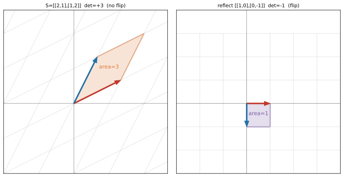

# ch09 — 行列式：面積、體積與翻面

> **本章解決什麼問題**：前八章你學會「讀一個矩陣＝讀它把方格網拉成什麼樣」。這一章問一個更尖的問題——能不能用**一個數字**把「這個變換對空間做了多大的事」量出來？能。那個數字叫行列式（determinant）。它量的是面積（體積）被放大的倍率，而且帶正負號（有沒有翻面）。本章最大的紅利是：**det=0 這一句話，同時解釋了 ch08 的不可逆、ch07 的無解、ch03 的線性相依**——一個數字把全書前半串成一條線。這是 Part III 的開場，下一章 ch10 把「變換後還剩幾維」講細（秩與四個基本子空間）；至於 det 跟特徵值的關係（det＝特徵值乘積），留到 ch11 回收。

```text
Part I 向量與空間          Part II 矩陣即變換        Part III 行列式與秩 ◄你在這裡
ch01 為什麼是線性          ch05 矩陣是動詞       →   ch09 行列式即面積 ◄
ch02 向量三張臉        →   ch06 乘法即合成           ch10 秩與四子空間
ch03 span 與基底           ch07 解 Ax=b                    │
ch04 座標與換基底          ch08 逆與不可逆                 ↓
                                                     Part IV 特徵值
Part VI SVD 與收官         Part V 正交與近似        ch11 特徵向量 ★
ch19 SVD              ←   ch15 內積              ←  ch12 旋轉逼出複數
ch20 低秩近似與 PCA        ch16 投影與最小平方       ch13 對角化 ★
ch21 PageRank 馬可夫       ch17 正交基與 QR          ch14 矩陣的冪
ch22 總收官 ★             ch18 對稱與譜定理         ★＝最大驚嘆點
```

## 從你已知的出發

你寫過換元的程式。把一張圖從直角座標重新採樣到極座標、把一段時間序列重新取樣到不同的時間軸、把一塊紋理 UV 重新映射——每一次，你心裡都隱約知道一件事：**重新映射之後，每一小塊的「大小」變了，得補一個係數回來**，否則總量會錯。把一張圖橫向拉兩倍，每個像素覆蓋的面積變兩倍，亮度／密度就得除以二才守恆。

這個「每一小塊面積被放大或縮小多少」的係數，數學裡有個精確的名字——當這個重新映射是線性變換時，那個係數就是**行列式（determinant）**。

如果你碰過微積分裡的換元積分（substitution），這件事更直接。一維的時候，∫f(x)dx 換成 ∫f(g(u))·g'(u)du，那個 g'(u) 就是「u 軸上一小段被 g 拉長／壓縮多少」的伸縮率。到了二維、三維，那個一維的 g'(u) 升級成一個矩陣的行列式——**Jacobian 行列式**（雅可比行列式），它量的就是「一小塊面積（體積）被這個變換在這一點放大多少」（軟連結《馴服無限》換元那一章）。換元積分要乘 |Jacobian|，理由跟你重採樣要補係數一模一樣：不補，每塊小面積的「大小」變了，積出來的總量就錯（2026-06 查證）。

所以行列式不是課本上那個「ad−bc 要背的公式」。它是一個你其實已經在用的直覺的精確化：**這個變換把空間膨脹／壓縮了多少倍**。本章要做兩件事——把這個倍率講清楚（連同它的正負號在說什麼），然後讓你看到 det=0 這個特例如何一口氣解釋掉全書前半所有「壞掉」的情況。

順帶一提，行列式還有一個身分問題值得先講：**它比「矩陣」這個詞還老**。這聽起來矛盾——一個矩陣的屬性，怎麼會比矩陣本身還早出現？這正是線性代數史最反直覺的一段，我把它留到本章中段當插曲。先看面積。

## 行列式量的是有號面積

回到你最熟的脊椎矩陣 **S = [[2,1],[1,2]]**（就是 ch05 那個矩陣、ch07 解過 Sx=b 的那個）。我們已經知道它把兩個基向量搬到哪：

```text
S = | 2  1 |        ê₁=(1,0) → (2,1)   ← S 的第一行（直行，column）
    | 1  2 |        ê₂=(0,1) → (1,2)   ← S 的第二行
```

現在問一個新問題：把**單位正方形**（四角 (0,0)、(1,0)、(1,1)、(0,1)，面積剛好 1）餵進 S，它變成什麼、面積變多少？四個角各自被搬走：

```text
(0,0) → (0,0)
(1,0) → (2,1)        ← ê₁ 的去向，就是第一行
(1,1) → (3,3)        ← (1,1) = ê₁+ê₂ → (2,1)+(1,2) = (3,3)
(0,1) → (1,2)        ← ê₂ 的去向，就是第二行
```

單位正方形變成一個**平行四邊形**，四角是 (0,0)、(2,1)、(3,3)、(1,2)。它還是平行四邊形（線性變換的鐵律：直線還是直線、平行還是平行），只是被拉斜、放大了。這個平行四邊形的面積，就是 S 的行列式。

它是多少？用鞋帶公式（shoelace，沿四角繞一圈、交叉相乘相減、取絕對值除二）親手算一次：

```text
頂點依序  (0,0) (2,1) (3,3) (1,2)
Σ(xᵢ·yᵢ₊₁ − xᵢ₊₁·yᵢ)
= (0·1 − 2·0) + (2·3 − 3·1) + (3·2 − 1·3) + (1·0 − 0·2)
= 0          + 3           + 3           + 0
= 6
面積 = |6| / 2 = 3                  ← 單位正方形(面積1) 被放大成 面積 3
```

面積是 **3**。所以 **det S = 3**：S 把每一塊面積放大三倍。這就是脊椎的第三層——**det S = 3，單位正方形面積變 3 倍**。注意這不是巧合算出來的，它對整個平面都成立：S 把**任何**圖形的面積都放大三倍（線性變換對所有小塊一視同仁，所以對大塊也一樣）。一個半徑 1 的圓（面積 π）被 S 變成一個橢圓，面積就是 3π。一個數字，定了整個變換的「膨脹率」。



### 不背公式：ad−bc 的面積從哪來

你大概還記得 2×2 行列式的公式：det [[a,b],[c,d]] = ad − bc。本書的立場是**不背它，看圖推它**。它就是上面那個平行四邊形的面積，只是換成一般符號。

一個 2×2 矩陣的兩行是 (a,c) 和 (b,d)——這兩個向量張出的平行四邊形，面積是多少？把它框進一個 (a+b)×(c+d) 的大矩形，再把四周多出來的兩個三角形、兩個小矩形減掉，剩下的就是平行四邊形：

```text
大矩形面積              = (a+b)(c+d) = ac + ad + bc + bd
減掉四周（兩對全等的角料）= 2·(½·a·c) + 2·(½·b·d) + 2·(b·c)
                       =  ac        +  bd        + 2bc
平行四邊形面積          = (ac+ad+bc+bd) − (ac + bd + 2bc)
                       = ad − bc                       ← 公式從面積掉出來
```

（這個切割是「直覺版」——嚴格的一般證明本書不展開，但每一步你能口頭說出理由：大矩形扣掉邊角料。想看乾淨的剪切式證明，見延伸閱讀的 3Blue1Brown。）拿 S 代進去驗一次：a=2, b=1, c=1, d=2，ad−bc = 2·2 − 1·1 = 4 − 1 = **3** ✓，跟鞋帶公式算出來的面積一模一樣。所以「ad−bc」不是天上掉下來要背的，它**就是**那塊平行四邊形面積的代數寫法。記住面積那張圖，公式忘了也推得回來。

### 符號在說什麼：翻面與定向

我一直說「**有號**面積」，現在兌現那個「號」。面積怎麼會有正負？負面積聽起來像個笑話。

關鍵在**定向（orientation）**。單位正方形的四角，我們是逆時針數的：(0,0)→(1,0)→(1,1)→(0,1)。變換之後，如果四角還是逆時針繞（像 S 那樣，det=+3），定向**保住**了。但有些變換會把四角的繞行方向**倒過來**變成順時針——那叫**翻面**，det 取負號。

最乾淨的例子是反射 [[1,0],[0,−1]]（把平面對 x 軸鏡射，ch05 看過）：

```text
| 1   0 |    ê₁=(1,0) → (1,0)    ← x 軸不動
| 0  -1 |    ê₂=(0,1) → (0,-1)   ← y 軸翻到下面

det = 1·(−1) − 0·0 = −1
```

面積的**大小**沒變（鏡射不縮放，|det|=1，圖形大小不動），但 det=**−1**：負號在說「這個變換把空間鏡像翻過來了」。本來你右手座標系數角是逆時針，鏡射後變左手系、順時針。這就是為什麼鏡子裡的字是反的、左右手戴不上同一隻手套——**det 的符號，就是「有沒有從右手座標系翻成左手座標系」這件事的數學標記**。

把這條對照記牢，三種情況一目了然：

```text
det > 0   保持定向（不翻面），面積放大 |det| 倍      ← 縮放、剪切、旋轉、脊椎 S
det < 0   翻轉定向（翻面／鏡像），面積放大 |det| 倍   ← 反射
det = 0   壓扁降維，面積變 0                          ← 投影（下一節的主角）
```

## det=0：一個數字，串起全書前半

這是我認為整章——也許整本書前半——最該停下來的一頁。前面 det≠0 的情況（放大、翻面）都還算溫和。真正的驚嘆點在 det=0。

回到投影 [[1,0],[0,0]]（ch05、ch08 的常客，把整個平面拍扁到 x 軸）：

```text
| 1  0 |    ê₁=(1,0) → (1,0)    ← x 軸保留
| 0  0 |    ê₂=(0,1) → (0,0)    ← 整個 y 方向被壓成 0

det = 1·0 − 0·0 = 0
```

單位正方形被壓成 x 軸上一條長度 1 的線段——**面積 0**。det=0。一塊有面積的東西被拍成沒有面積的東西，一整個維度被消滅了。

現在看 det=0 這一句話，同時意味著多少件你前面學過的事。把它們並排，這才是重點：

```text
det = 0
  ⟺  單位正方形被壓成面積 0     （本章：壓扁降維）
  ⟺  兩行線性相依               （ch03：一行躺在另一行的 span 裡，張不出面積）
  ⟺  變換把平面壓進一條線        （ch05：一整個維度被吃掉）
  ⟺  不可逆，回不去             （ch08：壓扁丟了資訊，沒有 A⁻¹）
  ⟺  Ax=b 可能無解 / 無限多解   （ch07：b 不在那條線上＝無解；在線上＝無限多解）
```

讀一遍。這五行不是五個巧合，是**同一件事的五張臉**。為什麼兩行相依會 det=0？因為兩行相依＝第二行躺在第一行的方向上（一個是另一個的倍數），兩個共線的向量張不出平行四邊形、只張出一條線，面積當然是 0。為什麼 det=0 就不可逆？因為變換把二維壓成一維，無數個原本不同的點被擠到線上同一個點（ch08 的「壓扁＝lossy 壓縮」），你沒法從輸出反推唯一的輸入。為什麼 det=0 就可能無解？因為變換後整個值域只剩那條線，b 只要不在線上，就沒有任何 x 能被送到 b。

驗一個 det=0 的奇異矩陣，把這條鏈走實。取 [[1,2],[2,4]]（ch07／ch08 的奇異矩陣，第二行 (2,4)＝2×第一行 (1,2)，明擺著相依）：

```text
det = 1·4 − 2·2 = 4 − 4 = 0
兩行 (1,2) 與 (2,4) 共線 → 張不出面積 → 整個平面被壓到 y=2x 這條線上
→ 不可逆；b=(1,1) 不在線上 → Sx=b 無解；b=(1,2) 在線上 → 無限多解
```

**一個純量 det=0，把 ch03 的線性相依、ch05 的壓扁、ch07 的無解、ch08 的不可逆，全綁成一個結。** 這是行列式真正了不起的地方：它不只是個倍率，它是一個**偵測器**——只要算出 0，你立刻知道這個變換塌了一個維度，後面那一串壞事全跟著來。如果你只記得本章一件事，記這個：**det=0 就是「這個變換掉了一整個維度」的警報燈，而掉維度同時就是不可逆、無解、線性相依。**（這句話請真的能對另一個工程師講出來——它是本章的口試題。）

至於 det 很**小**但不是 0 的情況（接近塌、但還沒塌）——那是另一種更陰險的麻煩（條件數地獄），ch08 講過，本章的陷阱段會再戳一次。

## 一段插曲：行列式比矩陣還老

前面欠的那個身分問題，現在還。行列式怎麼會比「矩陣」這個詞還老？

答案是：行列式根本不是「為了研究矩陣」才出現的，它是**為了解聯立方程組**自己長出來的——而且早了一個多世紀。最早系統研究行列式的，公認是日本的**關孝和（Seki Takakazu，1642–1708）**，在 **1683 年**的《解伏題之法》（*Kaifukudai no Hō*）裡。他為了處理消去法、判斷方程組有沒有解，發展出表格形式的計算，引入了今天我們叫行列式的東西（他沒用這個名字），算到 2×2 一路到 5×5（2026-06 查證；他手稿裡 5×5 那條公式其實寫錯了，後來才修對——連天才也會算錯行列式，這對本書是個溫暖的提醒）。

歐洲這邊，**萊布尼茲（Leibniz）**在大約十年後（1690 年代初，與 de l'Hôpital 的通信裡），獨立用行列式判斷線性方程組解的存在；不過關孝和的版本更一般（2026-06 查證——年代上 Leibniz 的確切年份有 1683 與 1693 兩種二手說法衝突，所以這裡寫「關孝和之後約十年」是最穩的講法，不釘死某年）。之後 Cramer（1750）給了 n×n 的一般法則（Cramer 法則）、Laplace（1772）給了今天課本上的展開式。

對照一下時間軸，反差就出來了：

```text
1683   關孝和  系統研究行列式（為了解方程）
1690s  Leibniz 獨立用行列式判斷解的存在
1750   Cramer  n×n 一般法則
1772   Laplace 展開式
────────────────────────────────────────
1850   Sylvester 才造出「matrix（矩陣）」這個詞
1858   Cayley   才建立矩陣代數（乘法、逆、冪）
```

**行列式比「矩陣」這個詞早了約 167 年**（關孝和 1683 vs 西爾維斯特造詞 1850，2026-06 查證）。所以「行列式是矩陣的一個屬性」這個我們今天理所當然的講法，是**倒著長的**——人們先會算這個「判斷方程有沒有解的數」，過了一個半世紀，才有「矩陣」這個容器把它裝進去、才有人說「喔，原來這是那個方陣的行列式」。這也呼應 ch05 結尾說的：線性代數是「最晚被看清的老數學」，零件們各自存在了幾百年，最後才被縫成一個整體。下次有人跟你說「行列式就是矩陣的 determinant」，你可以淡淡補一句：行列式比矩陣這個詞老了一個半世紀。

## 乘法性：連續變換，倍率相乘

行列式還有一條性質，幾何上漂亮到幾乎不需要證：**det(AB) = det(A)·det(B)**。連續做兩個變換，總面積倍率＝各自倍率相乘。

為什麼幾何上顯然？因為 AB 的意思是「先做 B、再做 A」（ch06 的合成）。先做 B，面積被放大 det(B) 倍；再做 A，在那個已經放大過的基礎上，面積再被放大 det(A) 倍。一塊面積先乘 det(B)、再乘 det(A)，總共乘了 det(A)·det(B)——這跟「先打七折再打八折＝總共打五六折」是同一個道理，倍率本來就相乘（2026-06 查證，這正是 det 乘法性的幾何解釋）。

拿脊椎 S 親手驗一次。S 連做兩次（S²＝S·S），面積應該被放大 3×3=9 倍。先算 S²：

```text
S² = | 2  1 | | 2  1 |   = | 2·2+1·1   2·1+1·2 |   = | 5  4 |
     | 1  2 | | 1  2 |     | 1·2+2·1   1·1+2·2 |     | 4  5 |

det(S²) = 5·5 − 4·4 = 25 − 16 = 9
det(S)·det(S) = 3·3 = 9            ✓ 相符
```

det(S²)=9＝det(S)²，乘法性成立。這條性質之後很好用：要算一個複雜矩陣（由好幾個簡單變換乘起來）的行列式，不必把它乘開，直接把各塊的 det 相乘就好。也順手給一個推論——**det(A⁻¹) = 1/det(A)**：因為 A·A⁻¹=I（什麼都不做，面積不變，det I=1），兩邊取 det 得 det(A)·det(A⁻¹)=1，所以逆變換的面積倍率就是原倍率的倒數（S 放大 3 倍，S⁻¹ 縮小回 1/3，合情合理）。

3×3 的行列式量的是**體積**：三行張出的平行六面體（parallelepiped）的有號體積，det=0 代表三個向量擠進同一個平面（張不出體積、壓扁降維），符號同樣是定向（右手系 vs 左手系）。直覺完全平移過去，只是「面積」換成「體積」。本書不做 3×3 的餘因子展開大操練（那是計算課的事，全域不涵蓋）——你只要把「det＝有號體積、0＝壓扁、負＝翻面」這組直覺帶上去就夠了。

## 直覺的陷阱

行列式是個只有一個數字的東西，偏偏圍繞它的誤解特別多，而且每個都會在後面章節咬你一口。

| 陷阱 | 錯誤直覺 | 會在哪一步出事 | 怎麼自我察覺 |
|---|---|---|---|
| **把行列式當死公式** | det 就是 ad−bc，一個要背的算式 | 算得出數字，但問「這個變換對空間做了什麼」就答不出；到特徵值（det＝λ 乘積）、SVD（σ 乘積＝|det|）整個接不上 | 問自己：det=3 在幾何上是什麼意思？答不出「面積放大三倍」＝你只記得公式、沒看見面積 |
| **以為 2×2 行列式只是面積「近似」** | ad−bc 大概等於那塊平行四邊形面積吧 | 你會在心裡給它打折扣、不敢拿它當精確工具，碰到「面積剛好＝det」的論證會懷疑 | 它是**精確**的有號面積，不是近似（2026-06 查證）：|ad−bc| 一字不差等於面積，沒有誤差項 |
| **忽略符號的定向意義** | det 取絕對值就好，正負無所謂 | 在物理／圖形學裡，翻面（手性、法向量朝向、左右手系）出錯會讓光照、碰撞、外積方向全反；你會 debug 到天荒地老 | 看到 det<0 要立刻想「這個變換把空間鏡像翻過來了」，不是只看大小 |
| **把行列式當成矩陣** | 行列式是個矩陣 / 是矩陣的一部分 | 名字裡有「行」「列」兩個字確實誤導，但它是**一個純量**（一個數），不是矩陣；拿它去做矩陣運算會型別錯 | 默念：det 吃一個方陣、吐**一個數字**。它是個 ℝ，不是個 ℝ²ˣ² |
| **det≠0 就放心** | 只要 det 不是 0，矩陣可逆、方程解得準 | det 很小但非 0（接近奇異）時，逆會把微小誤差放大到爆——「可逆」不等於「解得準」（ch08 病態矩陣） | 別只看 det 是不是 0，要看它**離 0 多近**（更準的指標是條件數，ch08）；det=0.0001 的矩陣理論上可逆，數值上是地雷 |

最後兩條值得各停一秒。**「行列式是純量不是矩陣」**——這個錯特別常見，因為「行列式」三個字裡有「行」有「列」，看起來像在描述一個有行有列的東西。但它是把整個方陣**榨成一個數**的運算：輸入一個 2×2，輸出一個 ℝ。它丟掉了矩陣絕大部分的資訊（只留下「面積倍率＋定向」這一個面向），所以你**不能**從 det 反推矩陣（det=3 的矩陣有無窮多個）。

**「det≠0 就放心」**這條接 ch08 的病態矩陣。det 是個「是不是剛好塌了」的二元偵測器（=0 才塌），但它對「快塌了沒」很不敏感——一個面積倍率 0.0001 的變換在理論上完全可逆（det≠0），但它把空間壓得幾乎成一條線，逆變換要把這條近乎扁掉的東西撐回二維，任何輸入的微小誤差都會被放大上萬倍。**det 告訴你有沒有塌，不告訴你離塌多近**；後者要看條件數（ch08）。把這兩件事分清楚，是工程上不被數值咬的關鍵。

## 紙上推演

**推演 1：三個變換各自對面積做了什麼 [12 分鐘] ★**
手算下面三個 2×2 矩陣的行列式，並各用一句話說它對面積（與定向）做了什麼。
(a) 剪切 [[1,1],[0,1]]　(b) 反射 [[1,0],[0,−1]]　(c) 投影 [[1,0],[0,0]]

**推演 2：用面積解釋「相依⟹det=0」 [10 分鐘] ★★**
矩陣 [[3,6],[1,2]] 的兩行是 (3,1) 和 (6,2)。先算 det，再**不靠公式、只靠幾何**解釋為什麼這個 det 必然是 0（提示：兩行有什麼關係？兩個共線向量能張出面積嗎？）。

**推演 3：乘法性驗算 [10 分鐘] ★★**
取剪切 H=[[1,1],[0,1]]（det=1）和脊椎 S=[[2,1],[1,2]]（det=3）。先各自報出 det，再算乘積 SH（先剪切後 S），算 det(SH)，驗證它等於 det(S)·det(H)。順便想：先做 H 還是先做 S，det(SH) 和 det(HS) 會不會不一樣？

**推演 4：口頭題 ★★**
不准看書，向另一個工程師解釋「**為什麼 det=0 同時意味著不可逆又意味著（可能）無解**」。要用「壓扁降維」當核心比喻，從「面積變 0」一路講到「資訊回不來（不可逆）」和「目標可能落在值域外（無解）」。

### 推演解答

**推演 1。**
(a) 剪切 [[1,1],[0,1]]：det = 1·1 − 1·0 = **1**。面積**不變**（倍率 1），不翻面——剪切只是把方格網推斜成平行四邊形，但底乘高沒變，所以面積守恆。這是個好提醒：「形狀變了」不等於「面積變了」。
(b) 反射 [[1,0],[0,−1]]：det = 1·(−1) − 0·0 = **−1**。面積大小不變（|det|=1），但定向**翻轉**（負號）——空間被鏡像，右手系變左手系。
(c) 投影 [[1,0],[0,0]]：det = 1·0 − 0·0 = **0**。面積變 0——整個平面被壓成 x 軸一條線，一整個維度沒了，不可逆。

**推演 2。** det = 3·2 − 6·1 = 6 − 6 = **0**。幾何解釋：第二行 (6,2) = 2×第一行 (3,1)，兩行**共線**（同一個方向，只是長度差兩倍）。兩個共線的向量沒辦法張出平行四邊形——它們疊在同一條直線上，「平行四邊形」塌成一條線段，面積是 0。所以只要兩行線性相依（一個是另一個的倍數），det 必為 0，不必算公式就知道。這正是 det=0 ⟺ 線性相依的幾何本體。

**推演 3。** det(H)=1·1−1·0=1、det(S)=2·2−1·1=3。算 SH（先做 H 再做 S，即 S·H）：

```text
SH = | 2  1 | | 1  1 |   = | 2·1+1·0   2·1+1·1 |   = | 2  3 |
     | 1  2 | | 0  1 |     | 1·1+2·0   1·1+2·1 |     | 1  3 |

det(SH) = 2·3 − 3·1 = 6 − 3 = 3
det(S)·det(H) = 3·1 = 3            ✓ 相符
```

乘法性成立。至於 det(SH) vs det(HS)：雖然 SH≠HS（矩陣乘法不可交換，ch06），但 **det(SH)=det(HS)**——因為 det 是純量、純量相乘可交換：det(S)·det(H) = det(H)·det(S) = 3。所以矩陣本身換序會變，但它們的**面積倍率**換序不變（兩個倍率乘起來，誰先誰後都一樣）。這是個漂亮的細節：AB≠BA，但 det(AB)=det(BA)。

**推演 4。** 要點串成一條：det=0 代表單位正方形被壓成面積 0＝一整個維度被吃掉（二維被壓進一條線）。① **不可逆**：壓扁是 lossy 的，無數個原本不同的點被擠到線上同一點，你沒法從輸出唯一反推輸入——就像把一個欄位整個清成 0，回不來。② **（可能）無解**：變換後整個值域只剩那條線，目標向量 b 只要不落在這條線上，就沒有任何輸入能被送到 b，方程 Ax=b 無解；若 b 剛好在線上，則無限多個輸入都能到，無限多解。一句話收尾：「det=0 就是這個變換掉了一整個維度的警報燈——掉維度同時就是回不去（不可逆）和打不中（無解）。」

### 動手生圖

本章的圖就是本章的實驗。下面這段腳本畫兩格：左邊脊椎 S 把單位正方形變成面積 3 的平行四邊形（det=+3、不翻面），右邊反射把單位正方形翻到下半平面（det=−1、翻面）。跑它、改它，是吃透「det＝有號面積」最快的路。

```python
# ch09 figure: determinant as signed area. Left: unit square -> parallelogram
# under spine S=[[2,1],[1,2]], shaded area=det S=3. Right: a reflection flips
# orientation, det=-1 (the corner-walk order reverses), shown by a CW arrow.
from pathlib import Path
import numpy as np
import matplotlib
matplotlib.use("Agg")          # headless; no display needed
import matplotlib.pyplot as plt

OUT = Path(__file__).resolve().parent / "out" / "ch09-determinant-area.svg"
OUT.parent.mkdir(parents=True, exist_ok=True)

S = np.array([[2.0, 1.0], [1.0, 2.0]])          # spine: det = 2*2 - 1*1 = 3
F = np.array([[1.0, 0.0], [0.0, -1.0]])         # reflection: det = -1 (flips)
unit = np.array([[0, 1, 1, 0, 0], [0, 0, 1, 1, 0]])      # unit square, CCW corners

fig, (axL, axR) = plt.subplots(1, 2, figsize=(10, 5))
for ax, M, title, col in [(axL, S, "S=[[2,1],[1,2]]  det=+3  (no flip)", "#e07b39"),
                          (axR, F, "reflect [[1,0],[0,-1]]  det=-1  (flip)", "#7b5ea7")]:
    for k in np.arange(-3, 5):                   # faint transformed grid lines
        p = M @ np.array([[k, k], [-3, 4]]); q = M @ np.array([[-3, 4], [k, k]])
        ax.plot(p[0], p[1], color="0.85", lw=0.7); ax.plot(q[0], q[1], color="0.85", lw=0.7)
    img = M @ unit                               # image of the unit square
    ax.fill(img[0], img[1], color=col + "33", edgecolor=col, lw=1.8)
    e1, e2 = M @ np.array([1.0, 0.0]), M @ np.array([0.0, 1.0])   # columns of M
    ax.annotate("", xy=e1, xytext=(0, 0), arrowprops=dict(color="#c0392b", width=2, headwidth=9))
    ax.annotate("", xy=e2, xytext=(0, 0), arrowprops=dict(color="#2471a3", width=2, headwidth=9))
    cen = img[:, :4].mean(axis=1)                # label |det| inside the image
    ax.text(cen[0], cen[1], f"area={abs(round(np.linalg.det(M)))}", ha="center", fontsize=11, color=col)
    ax.set_title(title, fontsize=10); ax.set_xlim(-3, 4); ax.set_ylim(-3, 4); ax.set_aspect("equal")
    ax.axhline(0, color="0.4", lw=0.6); ax.axvline(0, color="0.4", lw=0.6)
    ax.set_xticks([]); ax.set_yticks([])

fig.tight_layout()
fig.savefig(OUT, bbox_inches="tight")
print("wrote", OUT)            # build_figures.py reads this
```

**預期輸出**：一張左右兩格的圖。左格灰色的單位正方形被 S 變成一個傾斜的橘色平行四邊形，裡面標 `area=3`（紅藍箭頭是 S 的兩行 (2,1)、(1,2)）。右格單位正方形被反射翻到 x 軸下方，標 `area=1`——大小沒變，但它跑到下半平面去了（翻面）。終端會印 `wrote .../ch09-determinant-area.svg`。

**換矩陣看面積與定向**：把腳本裡的 `S`（左格的矩陣）換成別的，親眼看 det 的大小（面積）與正負（定向）怎麼變——
- 換成 `[[1, 1], [0, 1]]`（剪切，det=1）：平行四邊形面積**還是 1**（跟原正方形一樣大），只是斜了。看「形狀變了但面積沒變」。
- 換成 `[[2, 0], [0, 2]]`（縮放兩倍，det=4）：正方形變成 2×2 的大正方形，面積 4。
- 換成 `[[1, 0], [0, 0]]`（投影，det=0）：正方形**塌成 x 軸上一條線段**，面積 0——親眼看一個維度被壓掉。
- 把右格的反射 `F` 換成旋轉 `[[0, -1], [1, 0]]`（det=+1）：正方形剛性轉 90°、大小不變、**不翻面**（det 正）——對照反射，體會「旋轉不翻面、反射才翻面」。

每換一個，先用筆算 det（ad−bc），預測面積與有沒有翻面，再跑圖對答案。對得上，你就真的把 det 讀成「有號面積」了。

## 自我檢核

口頭自答，講得出來才算過關：

1. **det 在幾何上量的是什麼？** det S=3 是什麼意思？（要能說出「S 把任何圖形的面積都放大三倍」，不是只報「2·2−1·1」。）
2. **為什麼 det=0 同時意味著不可逆又意味著（可能）無解？** 用「壓扁降維」把這兩件事串起來。（這是本章的命脈口試題，講不順回去重讀「det=0」那一節。）
3. det 的**正負號**在說什麼？反射的 det 為什麼是負的，旋轉的 det 為什麼是正的？
4. 行列式是一個矩陣，還是一個數字？「行列式」這名字為什麼容易誤導？
5. 為什麼兩行線性相依時 det 一定是 0？用面積（而不是公式）解釋。
6. det(AB)=det(A)·det(B) 在幾何上為什麼幾乎不需要證？（提示：連續做兩個變換，面積倍率會怎樣？）
7. 一個矩陣 det=0.0001（很小但非 0），它可逆嗎？拿它解方程安全嗎？這兩個問題的答案為什麼不一樣？（接 ch08。）
8. 行列式和「矩陣」這個詞，哪個先出現？這件事為什麼反直覺、又說明了什麼？

## 延伸閱讀

- **3Blue1Brown《Essence of Linear Algebra》第 6 章「The determinant」**（Grant Sanderson，YouTube，免費）。和本章是同一件事的兩個聲音——它用動畫讓你**看見**那塊面積被放大、看見 det=0 時整個平面被擠扁成一條線、看見負號就是空間被翻過來。本章的「ad−bc 從面積掉出來」那段，他用剪切（shearing）給了一個比框矩形更乾淨的推導，值得看。（系列第一章 Vectors 於 2016 年上架，2026-06 仍可免費觀看。）
- **Gilbert Strang，MIT 18.06 Linear Algebra，行列式那幾講**（MIT OpenCourseWare，免費）。Strang 從「行列式的三條性質」（單位矩陣 det=1、交換兩列變號、對每列線性）出發，逐步逼出 ad−bc 與一般公式——如果你想看「不靠面積、純從性質推」的另一條路，這是經典版本。
- **Sheldon Axler《Linear Algebra Done Right》第四版**（2024，官方免費 PDF，linear.axler.net）。Axler 出了名地把行列式**放到全書最後**（determinant-free 取向），主張很多定理不靠行列式更乾淨。讀它能讓你跳出「行列式中心」的視角，反過來更清楚行列式**什麼時候才真的不可或缺**（面積／體積、Jacobian 換元）。第四版新增的多線性代數一章，正是用交錯多線性形式重新建構行列式——本章「有號面積」直覺的學院版源頭。
- **TU Delft / LibreTexts 線性代數互動教材，行列式作為面積／體積那節**（線上，免費）。如果你想要「2×2 det＝**精確**有號面積（不是近似）」的乾淨書面論證、以及它如何推廣到 n 維有號體積，這兩份開放教材給得直接（2026-06 取回確認）。

---

一句話帶走這章：**行列式是一個數字，量的是變換把面積（體積）放大的有號倍率——絕對值是放大多少倍，正負號是有沒有把空間翻面；而 det=0 這一個特例，同時就是壓扁降維、線性相依、不可逆、可能無解。** 下一章 ch10，我們把「壓扁之後到底還剩幾維」講細——秩、零空間，以及它們之間那條漂亮的守恆律。
