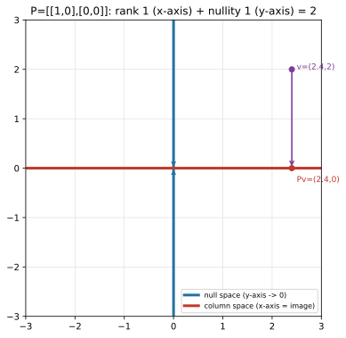

# ch10 — 秩、零空間與四個基本子空間

> **本章解決什麼問題**：ch09 把行列式收成一個數字——det=0 就是「壓扁降維」。但 det 只會喊「有沒有壓扁」，不會告訴你**壓掉了幾維、還剩幾維**。這一章把那個「壓扁」拆開來細看：變換後還撐得起幾維（秩）、哪些方向被送進了 0（零空間）。最後會掉出全書最漂亮的一條守恆律——**保住的維 ＋ 壓掉的維 ＝ 你帶進來的維**（秩—零化度定理）。這是 Part III 的收尾，也替後面的特徵向量（ch11）、SVD 揭示的秩（ch19）、PCA 的降維（ch20）鋪好「維度」這把尺。

## 從你已知的出發

先把這一章的三個主角錨在你天天面對的東西上。

**秩（rank）＝你的資料「真正」幾維。** 你拉過一張寬表：欄位有 `cpu`、`cpu_pct`、`cpu_milli`、`load_1m`、`load_5m`……二十個欄位。但你心裡清楚，這二十欄裡有一大半是彼此換算出來的——`cpu_pct` 就是 `cpu/total`、`cpu_milli` 就是 `cpu*1000`。它們**長得像二十個獨立旋鈕，其實只有五六個真的能獨立轉**。剩下的都是前幾個的線性組合，是冗餘。「真正有幾個獨立方向」這個數字，線代叫它**秩**。一堆 feature 但秩很低，就是「大量冗餘」——這正是 PCA（ch20）要砍掉的東西，這裡先把那把尺造出來。

**零空間（null space）＝怎麼改輸入都不影響輸出的方向。** 你調過一個有冗餘參數的系統：某兩個旋鈕一起反向轉，輸出**一動也不動**——它們互相抵消了。那條「轉了也白轉」的方向，就是這個變換的零空間。在裡頭的輸入被送進同一個地方（0），它攜帶的資訊被變換徹底吃掉、回不來。零空間量的就是「這個變換瞎在哪個方向」。

**秩虧空（rank deficiency）悄悄發生＝故障視角。** 這是最要命、也最隱形的一種。你以為自己給了系統 n 個獨立的約束（n 條方程、n 個感測器、n 筆觀測），結果其中幾條其實是別條的線性組合——你**自以為有 n 個獨立約束，實際只有 r 個**（r<n）。系統不會報錯，它照樣跑、照樣給你一個答案，只是那個答案在某些方向上**完全沒被約束住**（落在零空間裡，怎麼動都符合）。校正一台多感測器設備、解一組過約束的方程、做一次最小平方擬合——只要矩陣偷偷秩虧空了，你就在沙地上蓋房子而不自知。本章末的「直覺的陷阱」會把這個說透；先記住：秩與零空間不是抽象概念，它們是「我這組約束到底夠不夠」的體檢表。

這一章把這三件事接成一條守恆律。我認為那條守恆律是 Part III 最值得帶走的一句話。

## 秩：變換後還撐得起幾維

ch09 的 det 是個是非題：等於 0（壓扁了）或不等於 0（沒壓扁）。但「壓扁」有程度之分。把一個三維變換想成：它可能把空間壓成一個平面（還剩二維）、壓成一條線（剩一維）、或慘到壓成一個點（剩零維）。det 對這三種「壓扁」一視同仁全喊 0。我們需要一把更細的尺：**變換做完之後，輸出撐得起幾維？**

那把尺就是**秩（rank）**。正式說法：秩＝**行空間（column space）的維度**。拆開來看為什麼。

回到 ch05 的地基：Ax 是 A 的**行**（直行，column）的線性組合（見 ch05「列向量挑行」）。所以 A 能吐出來的**所有**可能輸出，就是「A 的那幾行能組出來的所有向量」——這正是 ch03 的 span。我們給它一個名字：

```text
行空間 column space C(A) = span{ A 的各行 } = { Ax : x 跑遍所有輸入 }
                         = 變換 A 的「像」（image）/「值域」（range）
```

行空間就是 A 這個變換**到得了的所有地方**。而它的維度（見 ch03：span 撐起幾維），就是秩。一句話：

> **秩 ＝ 行空間的維度 ＝ 變換後的像撐得起幾維。**

拿配角投影 P=[[1,0],[0,0]] 看（這是 ch05/ch08 那個「壓扁降維」的主角，本章它要當主角貫穿全程）。它的兩行是 (1,0) 與 (0,0)：

```text
P = | 1  0 |        第一行 = (1, 0)   ← ê₁ 的去向，落在 x 軸
    | 0  0 |        第二行 = (0, 0)   ← ê₂ 的去向，被送到原點
```

行空間＝span{(1,0), (0,0)}＝span{(1,0)}＝**整條 x 軸**（第二行是 0，對 span 毫無貢獻）。x 軸是一維的，所以 **rank P ＝ 1**。把整個二維平面餵進 P，吐出來的全部擠在一條線上——二維被壓成一維，「還剩一維」就是秩 1。這跟 det P＝1·0−0·0＝0（ch09 的「壓扁」）對得上：det 喊「壓扁了」，秩補上「壓成幾維」。

對照脊椎 S=[[2,1],[1,2]]（這就是 ch01 那個矩陣 S，我們一路用到底）。它的兩行 (2,1)、(1,2) 不是彼此的倍數（見 ch03：互不為倍數＝線性獨立），所以 span 出**整個平面**：**rank S ＝ 2**。S 沒壓扁任何維度——二維進、二維出，撐滿。這跟 det S＝3≠0 對得上（ch09），也跟 ch08「S 可逆」對得上：滿秩。

秩抓的不是「矩陣多大」（那是它的形狀 m×n），而是「**裡頭有幾個獨立方向**」。一個 100×100 但每行都是第一行倍數的矩陣，秩是 1——它再大，也只把空間壓到一條線上。這是本章第一個要釘死的觀念差，「直覺的陷阱」會回來修理它。

## 零空間：被送進 0 的那些方向

行空間講的是「輸出那一側」——變換到得了哪。零空間講的是「輸入那一側」——哪些輸入被變換**抹掉**。

**零空間（null space／kernel）** ＝ 被 A 送到零向量的所有輸入：

```text
零空間 N(A) = { x : Ax = 0 }        ← 「核 kernel」是同一個東西的另一個名字
```

幾何上：零空間是「**怎麼餵都被壓進原點**」的那些方向。回到投影 P=[[1,0],[0,0]]，問哪些 (x,y) 被送到 (0,0)：

```text
P·(x, y)ᵀ = (x, 0)ᵀ              ← P 把任何點打到 x 軸（y 座標歸零）
要 P·(x,y)ᵀ = (0,0)ᵀ，需 x = 0    ← y 隨便，因為 y 反正會被歸零
所以 N(P) = { (0, y) : y ∈ ℝ } = 整條 y 軸
```

整條 **y 軸**被 P 壓成一個原點。零空間是一維的（一條線），我們說它的**零化度（nullity）＝ 1**。這就是 P「瞎掉」的方向：你沿 y 軸怎麼移動，投影後的結果**完全不變**（都落在同一個 x 上）。y 座標攜帶的資訊被 P 徹底吃掉——這正是 ch08「投影不可逆、資訊回不來」的精確版：回不來的東西，就是被壓進零空間的那一維。

再看脊椎 S。哪些 x 滿足 Sx=0？

```text
| 2  1 | | x |   | 0 |       2x + y = 0
| 1  2 | | y | = | 0 |  →    x + 2y = 0
```

從第一式 y=−2x，代入第二式：x+2(−2x)=−3x=0 → x=0 → y=0。**只有 (0,0) 自己**滿足 Sx=0。所以 S 的零空間只有零向量，**零化度＝0**。這是滿秩可逆矩陣的正常狀態：沒有任何非零方向被抹掉，每個輸入都對應一個獨一無二的輸出（雙射，見 ch08）。

這裡先插一句、留到「直覺的陷阱」展開：**零空間只有 0 才是「正常」**。如果你算一個方陣的零空間，發現裡頭有非零向量，那是個警報——它在說這個變換把某個方向壓掉了、它不可逆、你的方程組不會有唯一解。非平凡（non-trivial）零空間不是錯誤，是一個體檢結果。

## 秩—零化度定理：一條守恆律

現在把兩邊的數字擺在一起看。投影 P：秩 1、零化度 1。脊椎 S：秩 2、零化度 0。把它們相加：

```text
P:   rank 1  +  nullity 1  =  2      ← 而 P 是 2×2，輸入是二維
S:   rank 2  +  nullity 0  =  2      ← S 也是 2×2，輸入是二維
```

兩個都加成 2，而 2 正好是輸入空間的維度。這不是巧合，這是**秩—零化度定理（rank–nullity theorem）**：

```text
rank(A) + nullity(A) = n          ← n = 輸入空間的維度（A 的行數）
```

用一句白話把它記死：

> **保住的維（rank）＋ 壓掉的維（nullity）＝ 你帶進來的維（n）。**

這是一條**守恆律**。一個線性變換對輸入維度做的事只有兩種命運：要嘛保住、活著穿過去成為輸出的一維（算進秩），要嘛被壓進零空間、死在原點（算進零化度）。**沒有第三條路**，而且總量守恆——進去 n 維，n 維全部要有去處，活的加死的剛好等於進來的。維度不會憑空消失，也不會憑空多出來。

我認為這是 Part III 最大的驚嘆點，值得你停下來把它和前幾章接起來：

- 它**回收了 ch08 的「壓扁」**。ch08 說可逆＝沒壓扁、不可逆＝壓扁降維。現在「壓扁了幾維」有了精確的數字：壓掉的維＝零化度。可逆 ⟺ 零化度 0 ⟺ 滿秩。
- 它**回收了 ch09 的 det**。det=0 ⟺ 至少壓掉一維 ⟺ 零化度 ≥ 1 ⟺ 秩 < n。det 是那個是非題的答案，秩—零化度是那道題的完整作答。
- 它替**ch11 的特徵向量**鋪路。等一下你會看到，特徵值 λ=0 的特徵向量「就住在零空間裡」（Av=0·v=0）——零空間是特徵值 0 的家。

嚴謹度誠實標示：上面我用 P 和 S 兩個例子**驗證**了這條守恆律，沒有**證明**它對所有矩陣都成立。一般證明（透過化簡到列梯形、數主元行與自由變數）本書不展開——你只要能用「保住的＋壓掉的＝帶進來的」這句守恆律，口頭說清楚它**為什麼**該成立（每一維輸入非生即死、總量不變），就達到本書要的深度了。要看嚴格證明，指向 Strang 18.06 或 Axler（見延伸閱讀）。

### Worked example：三行矩陣，把守恆律算到底

前兩個例子是 2×2（輸入二維），守恆律加成 2 看起來太輕巧。換一個輸入三維、會「壓很多」的，把定理的力道逼出來。取一個 2×3 矩陣（吃三維、吐二維）：

```text
A = | 1  2  3 |        三行：c₁=(1,2)、c₂=(2,4)、c₃=(3,6)
    | 2  4  6 |        注意：c₂ = 2·c₁、c₃ = 3·c₁（每行都是 c₁ 的倍數！）
```

先算**秩**。三行全是 (1,2) 的倍數，所以行空間＝span{(1,2)}＝過原點、方向 (1,2) 的**一條線**。三行擠在一條線上，**rank A ＝ 1**。（也可以從列看：兩列 (1,2,3) 與 (2,4,6)＝2×(1,2,3)，第二列是第一列倍數，獨立的列只有一條——稍後你會看到，這跟「獨立的行只有一條」給出同一個秩，那本身是個驚嘆點。）

再算**零空間**。輸入是 ℝ³，問哪些 (x,y,z) 滿足 Ax=0：

```text
Ax = x·c₁ + y·c₂ + z·c₃ = x·(1,2) + y·2(1,2) + z·3(1,2)
   = (x + 2y + 3z)·(1, 2)
要 = (0,0)，只需  x + 2y + 3z = 0       ← 一條方程，三個未知
```

一條方程綁住三個未知，留下**兩個自由維度**——零空間是 ℝ³ 裡的一個**平面**（過原點），**零化度＝2**。給兩個具體的零空間向量看（兩個獨立解，挑好算的）：

```text
取 y=1, z=0 → x=−2：    A·(−2, 1, 0)ᵀ = (−2+2)·(1,2) = (0,0) ✓
取 y=0, z=1 → x=−3：    A·(−3, 0, 1)ᵀ = (−3+3)·(1,2) = (0,0) ✓
```

兩個都代回驗證落在 0。零空間＝span{(−2,1,0), (−3,0,1)}，兩個獨立方向，二維。湊起來：

```text
rank A + nullity A = 1 + 2 = 3 = 輸入維度（A 有 3 行）  ✓
```

守恆律對上了：三維進去，**保住 1 維**（壓成一條線的像）＋**壓掉 2 維**（被抹成 0 的那個平面）＝3。這個例子比 2×2 更能讓你感覺到「壓掉」的重量——三維輸入裡，整整一個平面被送進了原點，只有一維活著穿過去。秩虧空在這裡是看得見的：你以為三行給了你三個方向，其實只給了一個。

## 四個基本子空間一瞥（Strang 的教學框架）

到目前我們碰了兩個子空間：**行空間**（C(A)，輸出側、變換到得了的地方）與**零空間**（N(A)，輸入側、被抹掉的方向）。把矩陣轉置一下（transpose，Aᵀ＝把行與列互換、原本的第 i 行變成第 i 列；你大學算過，這裡只當工具用），同樣的兩個概念對 Aᵀ 再來一遍，就湊齊**四個**：

```text
       輸入側（住在 ℝⁿ）              輸出側（住在 ℝᵐ）
獨立   列空間 row space C(Aᵀ)         行空間 column space C(A)
壓掉   零空間 null space N(A)          左零空間 left null space N(Aᵀ)
```

- **行空間 C(A)**：A 的行 span 出來的，＝變換的像（這章主角）。
- **零空間 N(A)**：被 A 抹成 0 的輸入（這章主角）。
- **列空間 C(Aᵀ)**：A 的**列**（橫列，row）span 出來的——等價於 Aᵀ 的行空間。
- **左零空間 N(Aᵀ)**：滿足 yᵀA=0 的 y（從左邊乘上去把 A 抹成 0），＝Aᵀ 的零空間。

一個**重要的措辭交代**：所謂「四個基本子空間（four fundamental subspaces）」並不是一條古老的、有正式名字的定理——它是 **Gilbert Strang（吉爾伯特·史特朗）的教學框架**。Strang 從 1970 年代寫第一版教科書起就用「四個子空間」來組織整個線性代數，並把連帶的維度關係命名為「線性代數基本定理（Fundamental Theorem of Linear Algebra）」，在他的教科書與 MIT 18.06 課程裡大力推廣（2026-06 查證；這個招牌主要是 Strang 推廣的，不是數學界的傳統定名，所以本書說「Strang 稱之為……」而不說「眾所周知的某定理」）。David Lay 等教科書也採用「四子空間」呈現，但那面招牌掛的是 Strang 的名字。

本章只給你「**一瞥**」：認得這四個名字、知道前兩個（行空間、零空間）量的是什麼。四個子空間之間漂亮的**正交關係**（零空間 ⊥ 列空間、左零空間 ⊥ 行空間）需要先有內積這把工具，留到 Part V（ch15–17）才講得清楚；SVD 如何同時把這四個子空間一網打盡、並用奇異值揭示秩，是 ch19 的事。這裡先把「秩」與「零空間」這兩根柱子立穩。

不過有一件事現在就能講，而且它本身就是驚嘆點：上面那個 2×3 例子裡，**獨立的行只有 1 個、獨立的列也只有 1 個**——兩邊一樣。這不是巧合。對**任何**矩陣，行空間的維度永遠等於列空間的維度，所以「秩」這個字不必分「行秩」還是「列秩」，它們相等。一個 m×n 的長方形矩陣，行住在 ℝᵐ、列住在 ℝⁿ，是住在不同維度空間裡的兩群向量，憑什麼它們「獨立的個數」會一樣？這需要證明（本書不展開，指向 Strang／Axler），但結論值得記住：**秩是矩陣的一個對稱的、行列不分家的本質數字**。「直覺的陷阱」會回來警告你別把這個相等當成顯然。

### 滿秩 ⟺ 可逆：把 ch08 收進來

對**方陣**（n×n），把這章的尺套上去，ch08 那串等價條件就全部串成一條了：

```text
A（n×n）可逆
  ⟺ rank A = n（滿秩，full rank）
  ⟺ nullity A = 0（零空間只有 0，沒壓掉任何維度）
  ⟺ 行（與列）都線性獨立
  ⟺ det A ≠ 0（ch09）
  ⟺ Ax=b 對每個 b 都有唯一解（ch07–08）
```

每一條都在說同一件幾何事實的不同側面：**這個變換沒壓扁任何維度。** 秩—零化度定理把它焊死了——對方陣，rank+nullity=n，所以「滿秩（rank=n）」和「零空間只有 0（nullity=0）」是同一句話的兩種講法，少一個就同時垮一串。脊椎 S 是滿秩的模範生（rank 2、nullity 0、det 3、可逆，全部對上）；投影 P 則整串反過來（rank 1<2、nullity 1>0、det 0、不可逆）。



## 直覺的陷阱

秩與零空間是「故障視角」的金礦——它們量的本來就是「系統哪裡瞎了」。以下四個是最常把人帶溝裡的：

| 陷阱 | 錯誤直覺 | 會在哪一步出事 | 怎麼自我察覺 |
|---|---|---|---|
| **秩虧空悄悄發生** | 我給了 n 條約束（方程／感測器／觀測），系統就被 n 維地釘死了 | 其中幾條其實是別條的線性組合，真實秩 r<n。系統不報錯，照給答案，但解在零空間方向上**完全沒被約束**（怎麼動都符合）——你拿到的「唯一解」根本不唯一 | 算一下約束矩陣的秩，跟你以為的約束數比。秩<約束數＝有冗餘約束、有非平凡零空間。最小平方解出來該驗 AᵀA 是否滿秩 |
| **把秩當「矩陣多大」** | 秩跟矩陣的尺寸（行列數）有關，大矩陣秩就大 | 一個 1000×1000 但每行都是第一行倍數的矩陣，秩是 **1**——它把整個千維空間壓到一條線上。你以為手上有一千個獨立方向，其實只有一個 | 秩量的是「**獨立方向幾個**」不是「形狀多大」。問：拿掉重複後，真正獨立的行剩幾條？那才是秩 |
| **以為零空間裡有東西是出錯了** | 算出非平凡零空間（有非零向量被打到 0）＝我算錯了 | 你會去「修」一個沒壞的計算，或忽略它傳達的訊息——非平凡零空間是**體檢結果**，在說這個變換壓掉了一維、不可逆、方程沒有唯一解 | 反過來想：方陣的零空間**只有 0** 才是滿秩可逆的正常態。零空間裡有東西＝這個矩陣奇異，是事實不是錯誤，該做的是面對它（它告訴你哪個方向沒被約束） |
| **以為行空間維度和列空間維度可能不一樣** | 行住在 ℝᵐ、列住在 ℝⁿ，是不同空間的向量，獨立個數當然可能不同 | 你會在腦裡分「行秩」和「列秩」兩個數、擔心它們對不上——其實它們**永遠相等**（這是定理級的事實，不是顯然），所以「秩」一個字就夠 | 記住：行秩＝列秩＝秩，這是個需要證明的相等（別當顯然，但可以放心用）。算秩時從行或從列數獨立的個數，會得到同一個答案——對不上就是你哪邊算錯了 |

第一條（秩虧空）值得多停一秒，因為它是這四個裡最貴的。它隱形的原因是：**矩陣不會因為秩虧空就拒絕運算**。你照樣能丟進求解器、它照樣吐一個數出來——只是那個數在零空間方向上是任意的（落在那條「怎麼動都符合」的方向上，求解器隨便挑了一個給你）。在 ch08 我們見過它的近親——「病態矩陣」（det≠0 但接近 0，條件數爆炸）；秩虧空是更乾脆的版本：det 直接等於 0、零空間真的有東西。兩個都不會在計算時報錯，都要你**主動去量秩**才看得見。一句話帶走：**沉默地給你答案的系統，未必約束住了你以為它約束住的東西。**

## 紙上推演

**推演 1：三個矩陣，秩、零化度、驗守恆律 [15 分鐘] ★★**
對下面三個矩陣，各自判斷秩、零空間的維度（零化度），並驗證秩—零化度定理（rank+nullity＝行數）。
(a) [[1,0],[0,0]]（投影）　(b) [[2,1],[1,2]]（脊椎 S）　(c) [[1,2],[2,4]]（奇異矩陣，第二行＝2×第一行）

**推演 2：秩 1 矩陣把空間壓到哪 [10 分鐘] ★★**
矩陣 [[1,2],[2,4]] 的秩是 1。算出它的行空間是哪一條線、零空間是哪一條線，並驗證「行空間方向」和「零空間方向」是兩條不同的線（一條是像、一條是被抹掉的）。

**推演 3：抓出秩虧空 [12 分鐘] ★★**
有人說：「我列了三條方程約束三個未知 (x,y,z)，所以解一定唯一。」三條方程是：x+y+z=1、2x+2y+2z=2、x−y=0。指出他錯在哪（算約束矩陣的秩），並說這組約束「真正」釘死了幾維、留了幾維自由。

**推演 4：口頭題 ★★**
不准看書，用「保住的＋壓掉的＝帶進來的」這句守恆律，向另一個工程師解釋秩—零化度定理為什麼成立。要講到「每一維輸入只有兩種命運、總量守恆」。

### 推演解答

**推演 1。**

(a) 投影 [[1,0],[0,0]]：兩行 (1,0)、(0,0)，行空間＝span{(1,0)}＝x 軸，**秩 1**。零空間：P(x,y)=(x,0)，要等於 0 須 x=0、y 自由 → y 軸，**零化度 1**。守恆：1+1=2＝行數 ✓。

(b) 脊椎 S [[2,1],[1,2]]：兩行 (2,1)、(1,2) 互不為倍數 → span 整個平面，**秩 2**。零空間：Sx=0 推出 x=y=0（見正文），只有 0 → **零化度 0**。守恆：2+0=2 ✓。

(c) 奇異 [[1,2],[2,4]]：兩行 (1,2)、(2,4)＝2·(1,2)，行空間＝span{(1,2)}＝過原點方向 (1,2) 的線，**秩 1**。零空間：1·x+2·y 的組合…解 (1,2)x+(2,4)... 直接看，Ax=x·(1,2)+y·(2,4)=(x+2y)·(1,2)，要等於 0 須 x+2y=0 → 方向 (2,−1)（取 y=−1,x=2：2−2=0 ✓），**零化度 1**。守恆：1+1=2 ✓。代回驗證：A·(2,−1)ᵀ＝(2−2, 4−4)＝(0,0) ✓。

**推演 2。** [[1,2],[2,4]]：行空間＝span{(1,2)}＝過原點、方向 (1,2) 的線（變換的像，所有輸出都落在這條線上）。零空間＝span{(2,−1)}（見推演 1c），過原點、方向 (2,−1) 的線（被抹成 0 的輸入）。兩條線方向不同：(1,2) 與 (2,−1)，而且 (1,2)·(2,−1)=2−2=0——它們恰好**垂直**（這不是巧合，是四子空間正交關係的預告，ch15–17 會講）。一句話：這個秩 1 矩陣把整個平面沿 (2,−1) 方向壓扁、把結果全攤在 (1,2) 那條線上。

**推演 3。** 把三條方程的係數排成矩陣：

```text
| 1   1   1 |       第二列 (2,2,2) = 2×第一列 (1,1,1)
| 2   2   2 |       → 第二條方程是第一條的兩倍，不帶新資訊
| 1  -1   0 |
```

獨立的列只有兩條（第一、第三；第二是第一的倍數），所以**秩＝2**，不是 3。他以為三條約束釘死三維，其實只有 2 維被釘死、**留了 1 維自由**（零化度＝3−2＝1）。零空間是一條過原點的線（沿著它走，三條方程同時保持滿足），所以滿足這組約束的解**不是一個點、是一條直線**——解不唯一。他踩的正是「秩虧空悄悄發生」：第二條方程是冗餘約束，矩陣偷偷秩虧空了，而方程組不會主動告訴他。

**推演 4。** 要點：一個線性變換對輸入空間的每一維，只有兩種可能命運——要嘛它**活著穿過去**、在輸出側貢獻一個獨立方向（這些維加起來＝行空間維度＝秩）；要嘛它**被壓進零空間**、死在原點（這些維加起來＝零化度）。沒有第三條路：一維輸入不可能既保住又被壓掉，也不可能憑空消失或多出來。所以「保住的（秩）＋壓掉的（零化度）」必須剛好等於「帶進來的（輸入維度 n）」——維度是守恆的。一句話收尾：「變換能拉能壓能轉，但帶進去幾維，活的加死的就還你幾維。」

### 動手生圖

本章的圖就是本章的實驗。下面這段腳本畫投影 P=[[1,0],[0,0]] 怎麼把整個平面壓到 x 軸——紅色 x 軸是行空間（像、秩 1），藍色 y 軸是零空間（整條被壓成原點、零化度 1），紫色箭頭示範一個一般點被垂直拍扁、它的高度被吃掉。守恆律 1+1=2 就畫在這張圖上。

```python
# ch10 figure: projection [[1,0],[0,0]] flattens the plane onto the x-axis.
# Show the null space (whole y-axis collapses to the origin) and the column
# space (x-axis = the image). rank 1 + nullity 1 = 2.
from pathlib import Path
import numpy as np
import matplotlib
matplotlib.use("Agg")          # headless; no display needed
import matplotlib.pyplot as plt

OUT = Path(__file__).resolve().parent / "out" / "ch10-rank-nullspace.svg"
OUT.parent.mkdir(parents=True, exist_ok=True)

P = np.array([[1.0, 0.0], [0.0, 0.0]])         # projection onto the x-axis
lo, hi = -3, 3
fig, ax = plt.subplots(figsize=(6, 6))

# faint background grid (the domain, R^2)
for k in np.arange(lo, hi + 1):
    ax.plot([lo, hi], [k, k], color="0.88", lw=0.7)
    ax.plot([k, k], [lo, hi], color="0.88", lw=0.7)

# null space = y-axis: every (0,y) is sent to the origin (0,0)
ax.plot([0, 0], [lo, hi], color="#2471a3", lw=3, label="null space (y-axis -> 0)")
for y in [1.0, 2.0, -1.0, -2.0]:                # arrows: y-axis points collapse to 0
    ax.annotate("", xy=(0, 0), xytext=(0, y),
                arrowprops=dict(color="#2471a3", lw=1.0, ls="--", arrowstyle="->"))

# column space = x-axis = image of P (everything lands here)
ax.plot([lo, hi], [0, 0], color="#c0392b", lw=3, label="column space (x-axis = image)")

# a sample point (2.4,2) projected down to (2.4,0): rank-1 image, nullity-1 drop
v = np.array([2.4, 2.0]); Pv = P @ v
ax.annotate("", xy=Pv, xytext=tuple(v), arrowprops=dict(color="#7d3c98", lw=1.6, arrowstyle="->"))
ax.plot(*v, "o", color="#7d3c98"); ax.plot(*Pv, "o", color="#c0392b")
ax.text(v[0] + 0.1, v[1], "v=(2.4,2)", color="#7d3c98", fontsize=9)
ax.text(Pv[0] + 0.1, Pv[1] - 0.28, "Pv=(2.4,0)", color="#c0392b", fontsize=9)

ax.set_xlim(lo, hi); ax.set_ylim(lo, hi); ax.set_aspect("equal")
ax.set_title("P=[[1,0],[0,0]]: rank 1 (x-axis) + nullity 1 (y-axis) = 2")
ax.legend(loc="lower right", fontsize=8)
fig.savefig(OUT, bbox_inches="tight")
print("wrote", OUT)             # build_figures.py reads this
```

**預期輸出**：一張正方形的圖，淡灰方格網是輸入平面。紅色粗線是 x 軸（行空間／像），藍色粗線是 y 軸（零空間），y 軸上有幾根虛線箭頭指回原點（示意整條 y 軸被壓成 0）。紫色箭頭從 v=(2.4,2) 垂直往下指到 x 軸上的 Pv=(2.4,0)，標出「高度被吃掉」。標題寫 `rank 1 + nullity 1 = 2`。終端印 `wrote .../ch10-rank-nullspace.svg`。

**換成秩 1 矩陣 [[1,2],[2,4]] 看壓到哪條線**：把 `P` 換成 `np.array([[1.0, 2.0], [2.0, 4.0]])`。這個矩陣秩也是 1，但它把平面壓到的不是 x 軸，而是方向 (1,2) 的斜線（行空間＝span{(1,2)}）；零空間也不是 y 軸，而是方向 (2,−1) 的斜線（推演 1c/2 算過）。你會看到紫色箭頭不再垂直往下，而是斜著把點推到 (1,2) 那條線上——同樣是「壓掉一維、保住一維」，只是兩條線都歪了。改完先用筆算 v 該落在哪（v 在 (1,2) 線上的投影），再跑圖對答案。

## 自我檢核

口頭自答，講得出來才算過關：

1. **用守恆律解釋秩—零化度定理。** 「保住的＋壓掉的＝帶進來的」——把這句話展開：每一維輸入有哪兩種命運？為什麼沒有第三條路、為什麼總量守恆？（這是本章命脈，講不順回去重讀「秩—零化度定理」那節。）
2. 秩量的是「矩陣多大」還是「獨立方向幾個」？一個 1000×1000 但每行都是第一行倍數的矩陣，秩是多少？
3. 投影 P=[[1,0],[0,0]] 的零空間是什麼、為什麼？沿零空間方向移動輸入，輸出會怎樣？這跟「投影不可逆、資訊回不來」（ch08）是同一件事嗎？
4. 一個方陣的零空間「只有 0」代表什麼？如果零空間裡有非零向量，那是出錯了還是一個體檢結果？它在告訴你這個矩陣的什麼性質？
5. 「行空間維度」和「列空間維度」一定相等嗎？這個相等是顯然的，還是需要證明的定理？（提示：行住在 ℝᵐ、列住在 ℝⁿ，是不同空間的向量。）
6. 對方陣，把「滿秩 ⟺ 可逆 ⟺ det≠0 ⟺ 零空間只有 0」串起來——它們在說同一件什麼幾何事實？秩—零化度定理在這串裡焊死了哪兩條？
7. 「四個基本子空間」是一條古老的具名定理，還是某個人的教學框架？是誰？（措辭要對：是「誰稱之為……」而不是「眾所周知的某定理」。）
8. 你的某張寬表有 50 個 feature，但你懷疑很多是彼此換算出來的。用「秩」這個字說清楚你懷疑的是什麼，以及它和 PCA（ch20）想做的事有什麼關係。

## 延伸閱讀

- **Gilbert Strang，MIT 18.06 Linear Algebra，Lecture 10「The Four Fundamental Subspaces」**（MIT OpenCourseWare，免費）。本章的四子空間「一瞥」就是這堂課的縮影——這是 Strang 招牌中的招牌，他親自把四個子空間畫成那張著名的「兩個空間、兩條箭頭」圖。看完本章直接看這一講，他會把行空間、零空間、列空間、左零空間之間的關係一次擺給你看（正交關係本書留到 Part V，但這堂課先讓你認得全家福）。（2026-06 查證，OCW 連結可用。）
- **3Blue1Brown《Essence of Linear Algebra》第 7 章「Inverse matrices, column space and null space」**（Grant Sanderson，YouTube，免費）。它用動畫讓你**看見**行空間是「變換到得了的地方」、零空間是「被壓進原點的方向」，和本章是同一件事的視覺版。特別是它把「秩＝壓扁後還剩幾維」演得很清楚——一個三維變換壓成平面（秩 2）、壓成線（秩 1）的差別，動畫一看就懂。
- **Sheldon Axler《Linear Algebra Done Right》第四版**（2024，官方免費 PDF，linear.axler.net）。想看秩—零化度定理（Axler 稱「Fundamental Theorem of Linear Maps」：dim null T + dim range T = dim V）被寫成嚴格的命題與證明（本章只驗證沒證明的那部分），Axler 從線性映射出發、不靠矩陣座標的寫法最乾淨。他的 determinant-free 取向也讓「秩到底是什麼」這件事特別清楚。

---

一句話帶走這章：**秩是「保住了幾維」、零化度是「壓掉了幾維」，而它們相加永遠等於你帶進來的維度——這條守恆律（秩—零化度定理）是 ch08「壓扁」與 ch09「det=0」的精確作答。** 下一章進 Part IV，我們去找變換裡那些「方向不轉、只被伸縮」的特殊軸——特徵向量，而你會發現，特徵值 0 的特徵向量，就住在這一章的零空間裡。
