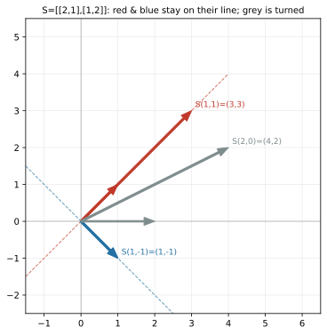

# ch11 — 特徵向量：變換中不轉的方向

> **本章解決什麼問題**：前三個 Part 教你把矩陣讀成一個動詞——它把方格網（grid）拉成新的方格網（ch05），合成有順序（ch06），det 量它放大面積幾倍（ch09），秩量它變換後還剩幾維（ch10）。但有一個問題我們一直繞著走：一個變換把整個空間攪得天翻地覆，**有沒有哪些方向，它其實沒攪？** 本章給出線代最重要的答案之一——**特徵向量（eigenvector）**：那些被變換作用後方向不變、只被拉長或壓短的特殊向量。它們是變換的「骨架」，沿著它們，再亂的變換都退化成單純的伸縮。這是 Part IV 的第一章，也是全書最大的幾個驚嘆點之一：接下來複數會從旋轉的特徵值裡逼出來（ch12）、對角化會用特徵向量當座標軸把變換變成純伸縮（ch13）、矩陣的冪與 PageRank 的長期行為會被最大的特徵值主宰（ch14、ch21）。一切從「哪條線不動」開始。複特徵值留 ch12、對角化留 ch13、對稱矩陣的特徵向量為何正交的完整證明留 ch18。

開始前先把你會在這章遇到、且全書一律遵守的台灣慣例釘死一次：**行（直行，column）是矩陣縱向的一排、列（橫列，row）是橫向的一排**——這跟中國大陸的用法剛好相反（見 landscape 與 ch05）。本章主要在談向量與方向，但提到矩陣的「行」時一律指直行 column。還有用詞：我們講「特徵值／特徵向量」，**絕不寫「本徵值／本徵向量」**（那是大陸用語）。

這也是 Part IV 的開場，按慣例先把全書地圖攤開，標出你現在站在哪：

```text
Part I 向量與空間          Part II 矩陣即變換        Part III 行列式與秩
ch01 為什麼是線性          ch05 矩陣是動詞       →   ch09 行列式即面積
ch02 向量三張臉        →   ch06 乘法即合成           ch10 秩與四子空間
ch03 span 與基底           ch07 解 Ax=b                    │
ch04 座標與換基底          ch08 逆與不可逆                 ↓
                                                     Part IV 特徵值 ◄你在這裡
Part VI SVD 與收官         Part V 正交與近似        ch11 特徵向量 ★
ch19 SVD              ←   ch15 內積              ←  ch12 旋轉逼出複數
ch20 低秩近似與 PCA        ch16 投影與最小平方       ch13 對角化 ★
ch21 PageRank 馬可夫       ch17 正交基與 QR          ch14 矩陣的冪
ch22 總收官 ★             ch18 對稱與譜定理         ★＝最大驚嘆點
```

## 從你已知的出發

你其實已經對「特徵向量」這個概念有直覺了，只是它在別的領域戴著別的名字。

**敲鐘的固有頻率。** 拿一個東西敲它——一口鐘、一根音叉、一座橋——它不會用隨便什麼頻率振動，而是用幾個**固定的、屬於它自己的**頻率（natural frequency／固有頻率）。每個固有頻率對應一種特定的振動形狀（normal mode／模態），整個物體沿那個形狀整齊地擺動。你不能命令一口鐘用任意頻率響，你只能激發它本來就有的那幾個模態。這些「模態形狀」在數學上**就是特徵向量**，對應的頻率由**特徵值**決定（2026-06；振動分析裡特徵向量稱 mode shape、特徵值對應自然頻率的平方）。塔科馬海峽大橋在風中扭斷，是因為風的頻率剛好餵中它的某個固有模態——共振。系統有它「天生會走的方向」，這就是特徵向量最樸素的物理意義。

**電路的共振。** 你調收音機到某個電台，是在調一個 LC 電路的共振頻率去匹配電台的載波。電路也只在它的固有頻率上「來電」。同一個故事：系統有屬於自己的特殊模式，外界對齊那個模式時反應最強。

**反覆作用一個變換時，誰活下來。** 這個對你這種寫過長期運行系統的人更貼。想像一個狀態反覆套用同一個轉移——一個矩陣作用一次、兩次、一百次。大部分方向會被攪來攪去，但**有些方向只是被放大或縮小、不改朝向**。作用很多次之後，被放得最大的那個方向會壓過一切、主宰系統的長期樣貌。你重啟一個會收斂的系統，不管初始狀態怎樣最後都跑到同一個穩態——那個穩態方向，本質上就是某個特徵向量（ch14 的 power iteration、ch21 的 PageRank 都建在這上面）。**長期行為由特徵方向決定，初始細節被洗掉。**

**最被放大的方向。** 如果一個變換在不同方向上放大的倍率不同，那「放最大的那個方向」就特別重要——它是這個變換的主軸。你之後會看到，PCA（主成分分析）找資料的「主軸」，找的正是某個對稱矩陣**最大特徵值對應的特徵向量**（ch20）。「資料變異最大的方向」＝「最大特徵值的特徵向量」，這不是巧合，是同一件事。

把這四個直覺收成一句話帶進本章：**一個變換對空間做了很多事，但總有幾個「屬於它自己」的方向，在那些方向上它只是單純地伸縮、不轉向。找出這些方向，你就抓住了這個變換的骨架。** 這就是特徵向量。德文 eigen 的意思正是「自己的／固有的（own／characteristic）」（見 landscape；不是英文 self 那麼簡單，「特徵」這個中譯抓得很準），中文「特徵向量」字面就在說「這個變換特有的、屬於它自己的向量」。

## 特徵向量是什麼：被變換放過的方向

把定義一次寫清楚。給一個方陣 A（一個線性變換），如果有一個**非零**向量 v 和一個純量 λ，使得

```text
A v = λ v        ← v 經過 A 之後，方向不變、只被縮放成原來的 λ 倍
```

那麼 v 叫做 A 的一個**特徵向量（eigenvector）**，λ 叫做對應的**特徵值（eigenvalue）**。這裡 v 是向量、λ 是純量。

讀懂這條式子比背它重要。左邊 `Av` 是「把變換 A 作用在 v 上」——一般來說，一個向量被變換之後會**又被轉向、又被改變長度**，落到一個跟原來毫無關係的方向。但特徵向量是例外：`Av` 居然剛好等於 `λv`，也就是**還落在 v 原本那條線上**，只是長度變成 λ 倍。方向沒動。這就是「特徵向量＝變換中不轉的方向」的完整含義。

用方格網的語言講：一個變換把整片方格網拉斜、扭曲。但沿著特徵向量的那些方向，方格網**只是被均勻地拉長或壓短**，像拉手風琴一樣，沒有轉動、沒有剪歪。**特徵向量就是變換「純伸縮」的那幾條軸。** 你可以把任何一個（可對角化的）變換想成：先找到這幾條特殊的軸，然後沿每條軸各自拉伸不同的倍率——這就是它對空間做的全部。這個「沿特徵軸各自伸縮」的圖像，是 ch13 對角化的核心，本章先把「軸在哪」找出來。

### 特徵值在說什麼：伸縮的倍率

λ 是沿那條特徵軸的伸縮倍率，它的數值直接告訴你那個方向發生了什麼：

| λ 的範圍 | 那個特徵方向發生什麼 | 一句話 |
|---|---|---|
| λ > 1 | 被拉長 | 向量變長，方向不變（如脊椎 S 的 λ=3：拉成三倍） |
| λ = 1 | 完全不動 | 連長度都沒變，那條線整條被釘住（如脊椎 S 的 λ=1） |
| 0 < λ < 1 | 被壓短 | 向量縮短但仍朝原方向 |
| λ = 0 | 被壓到原點 | 整條方向被壓成 0 ——這個方向就在 A 的零空間裡（ch10）！ |
| λ < 0 | 翻向再縮放 | 向量被翻到反方向（沿原線、但指反邊） |

最後兩列值得停一下。**λ=0 不是「沒有特徵向量」，恰恰相反，它是一個非常有意義的特徵向量**——它說「這個方向被 A 壓成了零」，也就是 v 在 A 的零空間（null space，ch10）裡。一個變換有 λ=0 的特徵向量，等價於它的零空間非平凡，等價於它把某個方向壓扁、不可逆（det=0，ch09）。三個 Part 的概念在這裡握手了：**det=0 ⟺ 有 λ=0 的特徵向量 ⟺ 某方向被壓扁。** 這個連結我們等一下用 det 重新確認。

至於 λ<0：投影或縮放永遠不會翻向，但反射會。反射矩陣 [[1,0],[0,−1]] 把 y 軸方向的向量翻成反向——那就是一個 λ=−1 的特徵向量（沿 y 軸、被送到反邊）；x 軸方向則 λ=1 不動（反射軸本身）。負特徵值是「這個方向被照鏡子翻過去了」的指紋。

## 怎麼找特徵向量：det(A − λI) = 0 為什麼能抓出特徵值

定義漂亮，但 `Av=λv` 裡 v 和 λ 都未知，怎麼下手？這一節是本章的機械核心，而且它把 ch09（行列式）和 ch10（零空間）漂亮地回收回來——你會看到「找特徵值」根本就是「找哪個 λ 讓某個矩陣壓扁」。

從定義出發，把右邊搬到左邊：

```text
A v = λ v
A v − λ v = 0
A v − λ I v = 0        ← 把 λv 寫成 λI v，I 是單位矩陣，這樣才能提出 v
(A − λI) v = 0         ← 提出公因子 v
```

（為什麼中間要插一個 I？因為 `A` 是矩陣、`λ` 是純量，`A − λ` 沒有定義——矩陣減純量是無意義的。把 λ 寫成 `λI`（純量乘單位矩陣，就是對角線全是 λ 的矩陣）才能跟 A 相減。這一步是很多人第一次卡住的地方，停一秒確認你接受它。）

現在看最後這條式子 `(A − λI) v = 0`。把 `A − λI` 看成一個**新的矩陣**（它就是 A 的對角線每個元素都減掉 λ）。這條式子在問：**這個新矩陣，把某個非零向量 v 送到了零向量。**

這正是 ch10 的語言！一個矩陣把非零向量送到 0，意思就是它有**非平凡的零空間**——它**把某個方向壓扁了**。而 ch09 告訴你，一個方陣把空間壓扁（降維、不滿秩）的充要條件是它的**行列式為零**。所以：

```text
要 (A − λI) v = 0 有非零解 v
⟺ A − λI 把某個方向壓扁（有非平凡零空間）
⟺ det(A − λI) = 0
```

這就是**特徵方程（characteristic equation）**：

```text
det(A − λI) = 0
```

**為什麼它能抓出特徵值，一句話：特徵向量是被 A 純伸縮 λ 倍的方向，而那等價於被 (A − λI) 壓成零的方向；一個矩陣能把方向壓成零，當且僅當它的行列式為零。所以「λ 是特徵值」就等於「det(A − λI)=0」。** 這不是天上掉下來要背的公式，它是 ch09＋ch10 兩章的直接後果。我認為這是本章最該講給另一個工程師聽的一句話——它把「伸縮」「壓扁」「行列式」「零空間」四件事縫成一條線。

（順帶把 ch09 的另一面接上：`det(A − λI)` 攤開來是一個 λ 的多項式（2×2 時是二次、n×n 時是 n 次），叫**特徵多項式（characteristic polynomial）**。Cauchy 在 1829 年正是這樣把它寫成 `det(A − αI)` 並研究它的根；他當時把這些根叫「特徵根（racine caractéristique）」，這就是為什麼今天還叫「特徵方程」（2026-06，見 landscape 與下文歷史）。解這個多項式 = 0，就得到所有特徵值。）

### 脊椎 S 第四層：完整求解

把脊椎矩陣 **S = [[2,1],[1,2]]**（就是 ch01 登場、ch05 讀成兩個基向量去向、ch09 算出 det=3 的那同一個 S）的特徵問題從頭解到尾，每一步都驗算。這是本章的核心 worked example，不跳步。

**第一步：寫出 A − λI。** 把 S 的對角線各減 λ：

```text
S − λI = | 2−λ    1  |
         |  1    2−λ |
```

**第二步：算特徵方程 det(S − λI) = 0。** 用 2×2 行列式公式 ad − bc（ch09，這裡 a=d=2−λ、b=c=1）：

```text
det(S − λI) = (2−λ)(2−λ) − (1)(1)
            = (2−λ)² − 1
            = (4 − 4λ + λ²) − 1
            = λ² − 4λ + 3
```

令它等於 0，因式分解（找兩個數相乘 3、相加 −4，是 −1 和 −3）：

```text
λ² − 4λ + 3 = 0
(λ − 1)(λ − 3) = 0
→ λ = 3  或  λ = 1
```

**特徵值是 3 和 1。** 先用兩個跨章驗算工具確認沒算錯（這兩個工具下一節細講）：

```text
特徵值之和 = 3 + 1 = 4   應等於  tr S（對角線和）= 2 + 2 = 4   ✓
特徵值之積 = 3 × 1 = 3   應等於  det S = 3（ch09 算過）          ✓
```

兩個都對，特徵值站得住。

**第三步：求 λ=3 的特徵向量。** 把 λ=3 代回 `(S − λI) v = 0`：

```text
S − 3I = | 2−3    1  | = | −1   1 |
         |  1    2−3 |   |  1  −1 |
```

解 `(S − 3I) v = 0`，設 v=(x, y)ᵀ：

```text
| −1   1 | | x |   | 0 |        −x + y = 0   →   y = x
|  1  −1 | | y | = | 0 |         x − y = 0   →   y = x   （同一條，意料之中——矩陣壓扁了，秩 1）
```

兩條方程其實是同一條（`A − λI` 必然是奇異的、秩降，這正是它能有非零解的原因——回收上一節）。解是「所有 y=x 的向量」，也就是 **(1,1) 這個方向上的整條線**。取代表 **v₁ = (1,1)ᵀ**。

**第四步：求 λ=1 的特徵向量。** 把 λ=1 代回：

```text
S − 1I = | 2−1    1  | = | 1   1 |
         |  1    2−1 |   | 1   1 |
```

解 `(S − I) v = 0`：

```text
| 1   1 | | x |   | 0 |        x + y = 0   →   y = −x
| 1   1 | | y | = | 0 |        x + y = 0   →   y = −x   （又是同一條）
```

解是「所有 y=−x 的向量」，**(1,−1) 方向的整條線**。取 **v₂ = (1,−1)ᵀ**。

**第五步：代回原式 Sv=λv 驗證**（深度標準要求每個特徵向量代回驗算，矩陣運算最容易算錯）：

```text
λ=3，v₁=(1,1)：
S(1,1)ᵀ = | 2  1 | | 1 | = | 2·1 + 1·1 |  = | 3 |  = 3·(1,1)ᵀ   ✓  方向沒動，長度 ×3
          | 1  2 | | 1 |   | 1·1 + 2·1 |    | 3 |

λ=1，v₂=(1,−1)：
S(1,−1)ᵀ = | 2  1 | |  1 | = | 2·1 + 1·(−1) | = |  1 | = 1·(1,−1)ᵀ  ✓  完全沒動
           | 1  2 | | −1 |   | 1·1 + 2·(−1) |   | −1 |
```

兩個都精準回到 `λv`。**脊椎 S 的兩個特徵向量是 (1,1)（λ=3，被拉成三倍）與 (1,−1)（λ=1，完全不動）。** 這就是脊椎七層裡的第四層。

再補一個之後會反覆用到的觀察：這兩個特徵向量**互相正交**——(1,1)·(1,−1) = 1·1 + 1·(−1) = 0（內積為 0，正交的代數判準留 ch15 細講）。這不是巧合：S 是**對稱矩陣**（S=Sᵀ），而對稱矩陣的特徵向量必定可取成互相正交——這是 ch18 譜定理的核心，本章先讓你看到它在脊椎上成立、為什麼成立留到 ch18。

### 把它看見：哪兩條線不動

語言講了一大圈，這章的圖把它一次說完。下面這張圖把脊椎 S 作用在三個向量上：兩個特徵向量（紅 (1,1)、藍 (1,−1)）和一個普通向量（灰 (2,0)）。看點只有一個——**誰留在自己的線上**：



讀這張圖：紅向量 (1,1) 變長了（×3）但**沒離開那條虛線**；藍向量 (1,−1) **完全沒動**（細箭頭與粗箭頭重疊）；灰向量 (2,0) 從橫躺的 x 軸方向被抬起來轉到 (4,2)——它**轉了向**，所以不是特徵向量。整片方格網被 S 沿紅、藍兩條軸拉伸（紅軸拉三倍、藍軸不變），那兩條虛線就是這個變換的骨架。**這張圖就是「特徵向量＝不轉的方向」的字面意思。**

### 兩個免費的驗算工具：det 與 tr

上面用了「特徵值之和＝tr、之積＝det」來驗算，這兩個關係值得單獨記住，因為它們是你檢查特徵值有沒有算錯的**免費哨兵**（回收 ch09 的 det）。對任意 n×n 矩陣：

```text
特徵值的總和 = tr A（跡，trace，對角線元素之和）
特徵值的乘積 = det A（行列式）
```

對脊椎 S：tr S = 2+2 = 4 = 3+1 ✓、det S = 3 = 3×1 ✓。

**為什麼成立**（直覺版，嚴格證明本書不展開，指向 Axler）：特徵多項式 `λ² − (tr)λ + (det)` 的係數，照「根與係數關係」（Vieta），常數項＝兩根之積、一次項係數的相反數＝兩根之和。對 2×2 攤開特徵多項式正好是 `λ² − (a+d)λ + (ad−bc)`，一次項就是 tr、常數項就是 det。n×n 時道理一樣（特徵多項式的最高與最低次項係數分別給出和與積），只是中間項較複雜。

實用價值：**算完特徵值，先加起來對不對 tr、乘起來對不對 det，兩個哨兵都過再往下做。** 矩陣的特徵值是最容易算錯的東西之一，這兩個檢查幾乎免費，養成反射。det 的這個用途也回應了上一節的連結——如果某個特徵值是 0，那特徵值之積（=det）就是 0，再次確認「有 λ=0 ⟺ det=0 ⟺ 壓扁不可逆」。

### 一段歷史：「特徵」這個詞怎麼來的

特徵值問題本身比「特徵值」這個名字老得多。十八世紀的 Lagrange、Laplace 在解行星運動和力學的微分方程組時就碰上了它（那時叫「久期方程／secular equation」，因為它跟行星軌道的長期擾動有關）。**Cauchy 在 1829 年第一個一般性地證明：實對稱矩陣的特徵值都是實數**，並且把這個方程寫成 `det(A − αI)=0` 的形式，管那些根叫「特徵根（racine caractéristique）」——這就是「特徵方程／特徵多項式」名字的由來（2026-06，見 landscape）。

至於「eigen-」這個字首，是更晚的事：**David Hilbert 在 1904 年研究積分方程**（*Grundzüge einer allgemeinen Theorie der linearen Integralgleichungen*，「線性積分方程一般理論綱要」）時，把無窮維算子當成「無窮大的矩陣」處理，用了德文 **Eigenwert（特徵值）、Eigenfunktion（特徵函數）**，由他的學派推廣成今天的標準（2026-06，見 landscape）。德文 eigen 意為「自己的／固有的（own／characteristic／proper）」——所以中文「**特徵**」抓得很準（記住：台灣用「特徵」，不用大陸的「本徵」）。

這裡有個值得記的細節，順便當「直覺的陷阱」的引子：**「eigen 就是英文 self」是個過度簡化**。eigen 更接近「characteristic／proper（固有的、特徵的）」，英文裡其實一度把特徵值叫 "proper value"、"characteristic value"、"latent root"（Sylvester 1883 年用的詞）。今天 eigenvalue、characteristic value、latent root 視為同義（2026-06，見 landscape）。知道這點，你讀老教科書看到 "characteristic root" 就不會以為是別的東西。

## 直覺的陷阱

特徵向量是線代裡「定義簡單、誤解很多」的典型。下面五個是你（機械操作沒問題、語意生鏽的資深工程師）最可能踩的，每個都附「怎麼自我察覺」。

| 陷阱 | 錯誤直覺長什麼樣 | 會在哪一步把你帶溝裡 | 怎麼自我察覺 |
|---|---|---|---|
| **以為每個矩陣都有實特徵向量** | 「特徵向量是變換的骨架，那每個變換都該有骨架吧」 | 對旋轉矩陣硬找實特徵向量，怎麼算都得到複數，以為自己算錯 | 旋轉（θ≠0,180°）**把每個方向都轉了向、沒有任何實方向留得住**，所以沒有實特徵向量——它的特徵值是複數 e^{±iθ}。這正是線代逼出複數的地方，本書 ch12 整章在講。看到旋轉就別期待實特徵向量。 |
| **把特徵向量唯一化** | 「λ=3 的特徵向量是 (1,1)」，以為就這一個 | 答題只寫一個向量、或誤以為換個倍數就「錯了」；做對角化時挑錯代表向量 | 特徵向量**從來不唯一**：如果 v 是特徵向量，2v、−v、任何非零倍數都是（A(cv)=cAv=c(λv)=λ(cv)）。其實是**整條過原點的線**都是特徵向量，(1,1) 只是這條線的一個代表。我們挑代表是為了方便，不是因為它特別。 |
| **以為 λ=0 代表「沒有特徵向量」** | 看到特徵值是 0 就覺得「這個方向沒了／不算」 | 漏掉零空間方向、誤判矩陣性質；明明 det=0 卻說不出哪個方向被壓扁 | λ=0 是**有意義的特徵向量**：它說那個方向被 A 壓成零（在零空間裡）。「有 λ=0 的特徵向量」恰恰等於「det=0、不可逆、壓扁降維」。λ=0 不是沒有，是「被壓沒了」這件事的見證。 |
| **以為特徵向量是「被變換後不變的向量」** | 把「方向不變」聽成「向量完全不動」 | 只承認 λ=1 的向量是特徵向量，漏掉 λ=3 那種（明明變長了三倍） | 不變的是**方向（那條線）**，不是向量本身。λ=3 的 (1,1) 被拉成 (3,3)，長度大變、但還在同一條線上——它是不折不扣的特徵向量。「完全不動」只是 λ=1 的特例。 |
| **複特徵值「不存在／是算錯」** | 解特徵方程得到 λ=±i 之類，覺得「無解」或「我算錯了」 | 把含旋轉成分的矩陣判成「沒有特徵值」，在動力系統／訊號分析裡漏掉振盪模式 | 複特徵值**真實存在且大有意義**：它是「這個變換裡藏著旋轉」的指紋（實部＝衰減/發散、虛部＝振盪）。2×2 旋轉的 λ=e^{±iθ} 就是這樣。完整故事與「為什麼複數從這裡冒出來」留 ch12。 |

把第一、二、四個陷阱合成一句你能口頭講的：**特徵向量是「整條方向不轉的線」，不是「某個不動的點」，也不是「唯一一個向量」，更不是「每個矩陣都有」。** 釐清這三件事，你就比多數只會背「Av=λv」的人懂得多。

## 紙上推演

### 推演題

**第 1 題 ★ [8 分鐘]——對角／三角矩陣的特徵值用看的**
不解特徵方程，直接看出下面兩個矩陣的特徵值是什麼，並說出理由。

```text
D = | 5  0 |        U = | 4  7 |
    | 0  2 |            | 0  3 |
```

（提示：對角矩陣對 ê₁、ê₂ 各做了什麼？三角矩陣的 det(A−λI) 長什麼樣？）

**第 2 題 ★★ [15 分鐘]——完整解一個特徵問題並代回驗證**
矩陣 A = [[3,1],[0,2]]（一個上三角矩陣）。(a) 寫出特徵方程並求兩個特徵值；(b) 各求一個特徵向量；(c) 把每個特徵向量代回 Av=λv 驗證；(d) 用 tr 與 det 兩個哨兵檢查你的特徵值。

**第 3 題 ★★ [10 分鐘]——λ=0 與壓扁**
投影矩陣 P = [[1,0],[0,0]]（把所有東西投影到 x 軸，見 ch05/ch10）。(a) 用幾何（不用算）說出它的兩個特徵向量與特徵值各是什麼；(b) 解釋為什麼它有一個 λ=0 的特徵向量，且這對應 ch09「det=0」與 ch10「零空間」的哪件事。

**第 4 題 ★★★ [12 分鐘]——找出論證的破綻**
某人主張：「特徵向量是被變換後方向不變的向量。零向量 0 被任何矩陣作用都還是 0、方向（沒）變，所以 0 是每個矩陣的特徵向量，對應任意 λ。」這個結論明顯荒謬（那特徵值就毫無意義了）。指出定義裡哪一個字擋掉了這個論證，並說明為什麼定義非得加那個限制不可。

### 推演解答

**第 1 題。**

D 是**對角矩陣**：它對 ê₁=(1,0) 做的事是 D·(1,0)=(5,0)=5·(1,0)——ê₁ 方向不變、被拉 5 倍，所以 (1,0) 是特徵向量、λ=5；同理 (0,1) 是特徵向量、λ=2。**對角矩陣的特徵值就是對角線上的數，特徵向量就是座標軸方向**——因為對角矩陣本來就是「沿座標軸各自縮放」，座標軸自然是它的不轉方向。

U 是**上三角矩陣**：算 det(U−λI) = (4−λ)(3−λ) − 7·0 = (4−λ)(3−λ)，因為左下角是 0，那個 7 不進到行列式裡（被 0 乘掉）。所以特徵值是 **4 和 3**——**三角矩陣（上或下）的特徵值也是對角線元素**。理由：三角矩陣的行列式＝對角線乘積（ch09），所以 det(U−λI) 就是對角線各項 (對角元−λ) 連乘，根就是各對角元。（注意：三角矩陣的特徵*向量*不像對角矩陣那麼簡單，要解；但特徵*值*用看的。）

**第 2 題。** A = [[3,1],[0,2]]。

(a) 特徵方程：

```text
A − λI = | 3−λ   1  |
         |  0   2−λ |
det(A − λI) = (3−λ)(2−λ) − 1·0 = (3−λ)(2−λ) = 0
→ λ = 3  或  λ = 2
```

（上三角，特徵值就是對角線 3、2，與第 1 題一致——這裡練習完整寫出來。）

(b) 求特徵向量。

```text
λ=3： A − 3I = | 0   1 |   解 (A−3I)v=0：  0·x + 1·y = 0 → y=0，x 自由
              | 0  −1 |   特徵向量 = (1, 0)ᵀ（x 軸方向）

λ=2： A − 2I = | 1   1 |   解 (A−2I)v=0：  x + y = 0 → y = −x
              | 0   0 |   特徵向量 = (1, −1)ᵀ
```

(c) 代回 Av=λv 驗證：

```text
A(1,0)ᵀ  = | 3 1 | | 1 | = | 3 | = 3·(1,0)ᵀ   ✓
           | 0 2 | | 0 |   | 0 |
A(1,−1)ᵀ = | 3 1 | |  1 | = | 3−1 | = | 2 | = 2·(1,−1)ᵀ   ✓
           | 0 2 | | −1 |   | 0−2 |   |−2 |
```

(d) 哨兵：tr A = 3+2 = 5 = 3+2 ✓；det A = 3·2 − 1·0 = 6 = 3·2 ✓。全部一致。

**第 3 題。** P = [[1,0],[0,0]]，把平面壓到 x 軸。

(a) 幾何上：x 軸方向的向量（如 (1,0)）投影後不動——P(1,0)=(1,0)=1·(1,0)，所以 **(1,0) 是特徵向量、λ=1**；y 軸方向的向量（如 (0,1)）被投影壓成原點——P(0,1)=(0,0)=0·(0,1)，所以 **(0,1) 是特徵向量、λ=0**。

(b) λ=0 的特徵向量 (0,1) 說「y 軸方向被 P 壓成了零」。這正是 ch10 的**零空間**——P 的零空間就是 y 軸（所有被送到 0 的向量）。而特徵值之積 = 1×0 = 0 = det P（ch09），所以 P 不可逆、把二維壓成一維（秩 1）。**λ=0 的特徵向量、det=0、非平凡零空間、壓扁降維、不可逆——是同一件事的五種說法。** 這題就是本章「det(A−λI)=0」那條連結的具體現身。

**第 4 題。** 擋掉這個論證的字是定義裡的「**非零（nonzero）**」：特徵向量必須是**非零**向量。

零向量被排除掉，不是為了找麻煩，而是**非加不可**——如果允許 0 當特徵向量，那 `A·0 = 0 = λ·0` 對**任何** λ 都成立，於是「每個數都是特徵值」，特徵值這個概念就徹底沒資訊、沒用了。我們要的是「哪些**特定的** λ 讓某個**真實存在的、非零的**方向被純伸縮」——能挑出特殊 λ 的，必須是非零向量。順帶一提，特徵*值* λ=0 是完全合法的（見第 3 題）；不合法的是特徵*向量* v=0。別把這兩件事搞混：**值可以是 0，向量不能是 0。**

### 動手生圖

本章的圖（脊椎 S 的兩條不變線：紅 (1,1) 拉三倍、藍 (1,−1) 不動、灰 (2,0) 被轉向）由以下腳本產生。它同時就是你的小實驗：跑它、改它、重生它。

```python
# ch11 figure: eigenvectors of spine S=[[2,1],[1,2]]. The two invariant lines
# (1,1) [scaled x3, lambda=3] and (1,-1) [unmoved, lambda=1] stay on their own
# line; a generic vector (2,0) gets turned off its line. Grid shows the stretch.
from pathlib import Path
import numpy as np
import matplotlib
matplotlib.use("Agg")          # headless; no display needed
import matplotlib.pyplot as plt

OUT = Path(__file__).resolve().parent / "out" / "ch11-eigenvectors.svg"
OUT.parent.mkdir(parents=True, exist_ok=True)

S = np.array([[2.0, 1.0], [1.0, 2.0]])          # spine: eigvals 3 and 1
fig, ax = plt.subplots(figsize=(6, 6))

t = np.linspace(-4, 4, 2)                         # the two invariant lines (dashed)
for d, col, lab in [((1, 1), "#c0392b", "eigvec (1,1), lambda=3"),
                    ((1, -1), "#2471a3", "eigvec (1,-1), lambda=1")]:
    d = np.array(d, float)
    ax.plot(t * d[0], t * d[1], color=col, lw=1.0, ls="--", alpha=0.7)

def arrow(v, col, lw=2.2):                        # draw vector v as an arrow from origin
    ax.annotate("", xy=v, xytext=(0, 0), arrowprops=dict(color=col, width=lw, headwidth=9))

for v, col in [((1, 1), "#c0392b"), ((1, -1), "#2471a3"), ((2, 0), "#7f8c8d")]:
    v = np.array(v, float); Sv = S @ v
    arrow(v, col, 1.6); arrow(Sv, col)            # v (thin) and Sv (thick), same color
    ax.text(Sv[0] + 0.1, Sv[1] + 0.1, f"S({v[0]:.0f},{v[1]:.0f})=({Sv[0]:.0f},{Sv[1]:.0f})",
            color=col, fontsize=9)

ax.set_title("S=[[2,1],[1,2]]: red & blue stay on their line; grey is turned", fontsize=10)
ax.set_xlim(-1.5, 6.5); ax.set_ylim(-2.5, 5.5); ax.set_aspect("equal")
ax.axhline(0, color="0.6", lw=0.6); ax.axvline(0, color="0.6", lw=0.6)
ax.grid(True, color="0.9", lw=0.6)
fig.savefig(OUT, bbox_inches="tight")
print("wrote", OUT)            # build_figures.py reads this
```

**預期輸出**：一張正方形圖。三對箭頭（細的是原向量 v、粗的是 Sv）：

- 紅色 (1,1)→(3,3)：細箭頭短、粗箭頭長三倍，**兩者同方向、都壓在紅虛線上**——λ=3。
- 藍色 (1,−1)→(1,−1)：細粗箭頭**完全重疊**（沒動），壓在藍虛線上——λ=1。
- 灰色 (2,0)→(4,2)：細箭頭沿 x 軸橫躺、粗箭頭被抬高轉向——**離開了原本的線**，不是特徵向量。

兩條虛線是 S 的不變軸。確認三個數值：S(1,1)=(3,3)、S(1,−1)=(1,−1)、S(2,0)=(4,2)（這三個你都能手算對上）。

**改參數看什麼**（這就是把概念玩活的地方）：

- **換成剪切看剩幾條不變線**：把 `S` 換成 `np.array([[1.,1.],[0.,1.]])`（剪切 shear），它只有**一條**不變線（x 軸方向 (1,0)，λ=1 重根）——你會看到只有一個方向留在原線上，其他全被推斜。這就是 ch13「剪切不可對角化」的視覺前奏（特徵向量不夠湊成基底）。
- **換成旋轉看一條都不剩**：把 `S` 換成 `R=np.array([[0.,-1.],[1.,0.]])`（旋轉 90°），**沒有任何實向量留在原線上**——每個都被轉走。這就是 ch12「旋轉沒有實特徵向量」的預告。
- **換成反射看 λ<0**：把 `S` 換成 `np.array([[1.,0.],[0.,-1.]])`（對 x 軸反射），(1,0) 不動（λ=1）、(0,1)→(0,−1) 被翻向（λ=−1，沿原線但指反邊）。把測試向量改成 `(0,1)` 跑跑看負特徵值長什麼樣。

## 自我檢核

口頭自答；講得出來才算過關，卡住就回到對應段落。

1. **特徵向量是什麼？特徵值是什麼？** 用一句幾何的話：特徵向量是被變換作用後**方向不變、只被縮放**的向量（那條線不轉）；特徵值是縮放的倍率。不要只背 Av=λv，要說出「方向不變、只伸縮」的意思。
2. **為什麼 det(A − λI)=0 能抓出特徵值？**（本章必答）因為要 `(A−λI)v=0` 有非零解 v，就要 `A−λI` 把某個方向壓扁（有非平凡零空間，ch10），而矩陣能壓扁的充要條件是行列式為零（ch09）。所以「λ 是特徵值」⟺「det(A−λI)=0」。
3. **為什麼把 λ 寫成 λI？** 因為矩陣減純量（A−λ）沒有定義；λI 是對角線全 λ 的矩陣，才能跟 A 相減、再提出公因子 v。
4. **特徵向量唯一嗎？** 不唯一——任何非零倍數都是同一個特徵向量；其實是**整條過原點的線**都是。我們挑一個代表只是為了方便。
5. **λ=0 代表什麼？它意味著矩陣有什麼性質？** 那個特徵方向被壓成零（在零空間裡）；等價於 det=0、不可逆、壓扁降維。λ=0 不是「沒有特徵向量」，是「這個方向被壓沒了」的見證。
6. **tr 和 det 怎麼幫你驗算特徵值？** 特徵值之和＝tr（對角線和）、之積＝det。算完特徵值先過這兩個哨兵，免費又抓錯。
7. **每個矩陣都有實特徵向量嗎？** 不是。旋轉（θ≠0,180°）把每個方向都轉走、沒有實方向留得住，它的特徵值是複數 e^{±iθ}——這是 ch12 的主題，也是線代逼出複數的地方。
8. **「特徵向量是被變換後不變的向量」這句話錯在哪？** 不變的是**方向（線）**不是向量本身——λ=3 的 (1,1) 被拉成 (3,3)，長度大變但還在同一條線上，它仍是特徵向量。「完全不動」只是 λ=1 的特例。

## 延伸閱讀

- **3Blue1Brown《Essence of Linear Algebra》第 14 章「Eigenvectors and eigenvalues」**（YouTube／官網，免費；2026-06 可取）。**和本章最對應的一支影片**，把「特徵向量＝留在自己 span 上的向量」用動畫演到你忘不掉，尤其是「一般向量被轉走、特徵向量只伸縮」那段視覺對照，看完再回頭看本章那張圖會更通透；它也預告了對角化（eigenbasis）。官網：https://www.3blue1brown.com/lessons/eigenvalues/
- **Gilbert Strang，MIT 18.06，特徵值那幾講（Lecture 21 起）**（MIT OpenCourseWare，免費；2026-06 可取）。Strang 把特徵值放在「微分方程與動力系統」的脈絡講，與本章「特徵方向決定長期行為」的橋接互補；想看更多 worked example 與 Aⁿ 的應用（接 ch14）可看他怎麼算。https://ocw.mit.edu/courses/18-06-linear-algebra-spring-2010/
- **Sheldon Axler，*Linear Algebra Done Right*（第 4 版，Open Access 免費 PDF；2026-06 可取）** 關於特徵值與特徵向量的一章。Axler 刻意**不用行列式**定義特徵值（他把行列式放到全書最後），而是直接從 `Av=λv` 與線性映射的結構出發——如果你想看「不靠 det(A−λI) 也能講清楚特徵值」的另一條路（以及它為什麼某些人覺得更乾淨），這是經典參考。本章的 tr/det 驗算與「為什麼特徵值之和是 tr」的嚴格證明也在這裡。https://linear.axler.net/
- **MAA Convergence，"Math Origins: Eigenvectors and Eigenvalues"**（免費；2026-06 可取）。本章歷史段（Cauchy 的 racine caractéristique、Hilbert 1904 的 Eigenwert、eigen＝own/characteristic 而非 self、latent root 等同義詞的演變）的出處，想把「特徵這個詞怎麼來的」講得更完整可讀它。https://old.maa.org/press/periodicals/convergence/math-origins-eigenvectors-and-eigenvalues
