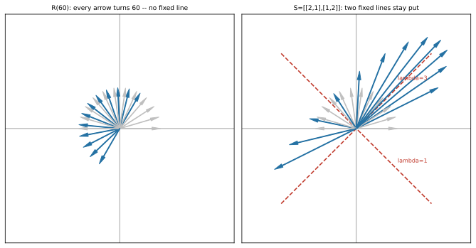

# ch12 — 旋轉沒有實特徵向量：線代如何逼出複數

> **本章解決什麼問題**：上一章（ch11）你學會了找「不轉的方向」——特徵向量。但有一種變換你越找越火大：旋轉。它把**每一個**方向都轉走了，一條不動的線都沒有。這一章要證明這不是你算錯，是這種變換**真的沒有實特徵向量**——而當你硬解它的特徵方程時，答案會自己跑進複數裡。這是線代「逼出複數」的現場：不是有人為了好玩引進虛數，是旋轉這個再普通不過的動作，自己把 i 召喚出來了。本章是 Part IV 的轉折——ch11 給了實特徵向量、ch13 要靠它們對角化，而旋轉在這中間插一句：「不是每個變換都有實的不動方向，但每個都有特徵值，只是可能是複數。」它也是全書與鄰書《圓的影子》（三角函數那本）握手的地方——兩本書從兩側講同一件事：旋轉與 e^{iθ}。

## 從你已知的出發

你其實早就在靠複特徵值過日子，只是沒人這樣跟你講過。

寫過任何牽涉「振盪」的系統——重試退避的抖動、限流器的回授、自動擴縮容（autoscaling）的副本數在目標值上下擺盪——你大概看過那種圖：某個量不是乖乖收斂到一條水平線，而是**一邊收斂一邊上下晃**，像被撥動的吉他弦慢慢停下來。控制理論的人看這張圖只看一件事：系統矩陣的**特徵值是不是複數**。規則乾淨到不可思議（2026-06）：

- **特徵值的實部**決定**衰減還是發散**——實部為負，振幅越晃越小、系統收斂（你想要的）；實部為正，越晃越大、系統炸開（你的 on-call 惡夢）。
- **特徵值的虛部**決定**振盪頻率**——虛部越大，晃得越快。

也就是說，「這個系統會不會穩、晃多快」這兩個你最在意的工程問題，答案藏在一對複數特徵值的實部與虛部裡。實部是生死、虛部是節奏。一個純粹的旋轉——既不衰減也不發散、只是一直晃——特徵值會剛好落在「實部代表不增不減」的那條線上，這一章我們就會親眼算出來：它的特徵值是 e^{±iθ}，長度剛好是 1（不衰不發），輻角剛好是旋轉角（晃的節奏）。

另一個你更熟的場景：遊戲裡的旋轉 transform。你把一個 sprite 旋轉 60°，它**沒有任何一個部分留在原來的方向上**——整張圖每個點都被掃到新角度去了。這句「沒有不動的方向」在遊戲裡是你的直覺，在線代裡是**字面意義的定理**：旋轉矩陣沒有實特徵向量。你已經看過這個現象一千次，這章只是把它翻譯成「為什麼線代非得用複數不可」。

## 旋轉把每個方向都轉走了

先把問題擺清楚。特徵向量（eigenvector，見 ch11）是變換**只伸縮、不改方向**的那些特殊向量：Av=λv，v 還躺在自己原來的那條線上（它的 span），只是被拉長或縮短了 λ 倍。脊椎矩陣 S=[[2,1],[1,2]] 有兩條這種線：(1,1) 方向被拉三倍、(1,−1) 方向完全不動（ch11 算過）。

現在把旋轉矩陣請上來。逆時針轉 θ 角的矩陣（本書旋轉一律逆時針為正，與《圓的影子》一致）：

```text
R(θ) = | cosθ  -sinθ |        ê₁=(1,0) → (cosθ,  sinθ)    ← 第一行（column）
       | sinθ   cosθ |        ê₂=(0,1) → (-sinθ, cosθ)    ← 第二行（column）
```

讀它的兩行（直行，column）：ê₁ 被轉到 (cosθ, sinθ)——也就是 x 軸轉了 θ 角；ê₂ 被轉到 (−sinθ, cosθ)——y 軸也轉了 θ 角。整個方格網剛性地轉了個身。

問一個簡單的問題：**有沒有哪個方向，被 R(θ) 作用後還留在原來那條線上？**

幾何上一秒就有答案。旋轉就是把每個向量繞原點掃一個角度。只要 θ 不是 0°、也不是 180°，**每一條過原點的線都被掃到別的角度去了**——沒有任何一條停在原處。一個向量轉了 60°，它指向的方向就跟原來差 60°，不可能還在同一條 span 上。所以：

> **θ≠0°、180° 時，R(θ) 沒有任何（非零的）方向是不動的——也就是沒有實特徵向量。**

這跟 S 形成最尖銳的對比。S 有兩條不動線，旋轉一條都沒有。你可以把這想成兩種極端：S 是「沿幾根固定軸拉伸」的純伸縮型，旋轉是「沒有任何軸、整體掃一圈」的純旋轉型。ch11 教你找不動軸的方法，碰到旋轉就直接撞牆——不是方法壞了，是**真的沒有實的不動軸可找**。

這就是本章的第一個結論，而且它純靠幾何就站得住，不需要算任何特徵方程。但接下來精彩的事情是：當你**不信邪**、硬是去解 R(θ) 的特徵方程，數學不會說「無解」——它會把答案交給你，只是答案住在複數裡。

## 硬解特徵方程：複數自己跑出來

ch11 教過抓特徵值的工具：解 **det(A−λI)=0**（特徵方程，characteristic equation）。背後的理由值得複述一遍，因為它正是「為什麼會逼出複數」的關鍵。我們要找非零的 v 使得 (A−λI)v=0。一個矩陣能把非零向量壓成 0，等於它**壓扁了空間**（把某個方向送進零空間），而壓扁的代數證據就是行列式為零（det=0，見 ch09）。所以特徵值就是那些讓 A−λI 變得「可壓扁」的 λ。

對 R(θ) 動手。先寫出 R(θ)−λI：

```text
R(θ) - λI = | cosθ - λ    -sinθ   |
            | sinθ        cosθ - λ |
```

算它的行列式（2×2 公式 ad−bc，見 ch09），令它為 0：

```text
det(R(θ) - λI) = (cosθ - λ)(cosθ - λ) - (-sinθ)(sinθ)
              = (cosθ - λ)² + sin²θ                    ← 注意：兩個都是「加」
              = cos²θ - 2cosθ·λ + λ² + sin²θ
              = λ² - 2cosθ·λ + 1                        ← 用了 cos²θ + sin²θ = 1
```

所以特徵方程是 **λ² − 2cosθ·λ + 1 = 0**。這裡可以順手用一個 2×2 的速查事實（2026-06 查證）：任何 2×2 矩陣的特徵方程都長成 λ²−(跡)λ+(行列式)=0，其中跡 tr＝對角線和、行列式就是 det。R(θ) 的跡＝cosθ+cosθ=2cosθ，行列式＝cos²θ+sin²θ=1，代進去正好給出上面這條——兩條路殊途同歸，互相驗算。

> 補一句直覺：R(θ) 的 det=1（旋轉不改面積、不翻面，見 ch09），這等於說「兩個特徵值的乘積＝1」。跡 2cosθ 等於「兩個特徵值的和」。一個和、一個積，待會你會看到這逼出一對長度都是 1 的共軛複數。

現在解這條二次方程式（你國中就會的求根公式，本書假設你會）：

```text
λ = [2cosθ ± √(4cos²θ - 4)] / 2
  = cosθ ± √(cos²θ - 1)
  = cosθ ± √(-sin²θ)              ← cos²θ - 1 = -(1 - cos²θ) = -sin²θ
  = cosθ ± i·sinθ                 ← √(-sin²θ) = i·|sinθ|，吸進 ± 號
```

停在這一行，看清楚發生了什麼。判別式裡是 **−sin²θ**，一個**負數**（只要 sinθ≠0，也就是 θ≠0°、180°）。負數開根號——這就是複數被**逼**出來的瞬間。不是我們想用複數，是這條方程的根**只能**是複數，實數軸上根本沒有它的位置。線代解一個再實在不過的問題（一個只有實數元素的旋轉矩陣的特徵值），答案卻無路可走，只好踏進複數平面。

而 cosθ±i·sinθ 這個東西，學過《圓的影子》的人會立刻認出來——它就是 **e^{±iθ}**（Euler 公式）。所以：

```text
R(θ) 的特徵值 = cosθ ± i·sinθ = e^{±iθ}
```

旋轉 θ 角的矩陣，特徵值是 e^{±iθ}。讓我把這句話為什麼了不起拆開來講——這是本章的核心驚嘆點。

## 複特徵值在告訴你什麼：藏在變換裡的旋轉指紋

e^{±iθ} 這對特徵值不是一堆無意義的符號。它的每一個部位都在報告 R(θ) 的幾何。

**第一，它們成對共軛（complex conjugate）。** 一個是 cosθ+i·sinθ、另一個是 cosθ−i·sinθ，實部相同、虛部相反。這不是巧合：一個元素全為實數的矩陣，特徵方程的係數全是實數，而**實係數多項式的複數根必定成對共軛出現**。所以複特徵值永遠是「一對」，不會單獨冒出一個。後面「直覺的陷阱」會講為什麼把這對共軛當成「兩個獨立的旋轉」是錯的——它們是同一個旋轉的兩面。

**第二，它們的長度（模，modulus）都是 1。** 算一下 |e^{iθ}|=|cosθ+i·sinθ|=√(cos²θ+sin²θ)=√1=1。長度為 1 意味著什麼？特徵值是「沿特徵方向的伸縮倍率」（ch11），倍率的長度是 1 就代表**不伸不縮、長度不變**——這正是旋轉的本性：它只轉、不改變任何東西的大小。這跟前面 det=1（特徵值乘積為 1）完全吻合：兩個長度為 1 的數，乘積長度當然是 1。幾何（旋轉不改長度）與代數（|λ|=1）在這裡握手。

**第三，它們的輻角（argument）就是旋轉角 ±θ。** e^{iθ} 在複數平面上的輻角是 θ，e^{−iθ} 是 −θ。換句話說，**特徵值的輻角直接讀出這個變換轉了多少度**。你拿到一個陌生矩陣，算出它的複特徵值，看輻角，就知道它內含多大的旋轉。

把三件事合起來，得到本章最該帶走的一句話：

> **複特徵值是「這個變換裡藏著旋轉」的指紋。|λ|=1 說它是純旋轉（不縮放），輻角說它轉了多少角度。** 一個一般的矩陣若解出複特徵值 r·e^{iφ}，就代表它含一個旋轉成分（轉 φ 角）外加一個縮放成分（縮放 r 倍）——這也回頭解釋了開頭那個控制系統的故事：實部與虛部，其實就是把 r·e^{iφ} 拆成直角座標後的兩個分量，一個管縮放（生死）、一個管旋轉（節奏）。

這就是為什麼「線代逼出複數」不是一句口號。複數不是被硬塞進線代的外來戶，它是**描述旋轉的天然語言**——而旋轉是最基本的線性變換之一。你想完整地談特徵值，就躲不開旋轉；想談旋轉的特徵值，就躲不開複數。線代自己把門推開了。

### 跨書連結：兩本書從兩側講同一件事

這裡值得停下來，因為你的書架上正好有另一本書從**相反方向**講同一個真相。

本章是從**線代這一側**走過來的：我們有一個旋轉**矩陣** R(θ)，去解它的特徵值，發現答案是 e^{±iθ}。路徑是「矩陣 → 複數」。

而《圓的影子》（三角函數那本）是從**複數這一側**走的：它先有複數，問「複數乘法在幾何上是什麼」，答案是——**乘以 e^{iθ} 就是把複數平面整個旋轉 θ 角、乘以 r·e^{iθ} 就是旋轉 θ 角再縮放 r 倍**（見《圓的影子》ch07–08）。路徑是「複數 → 旋轉」。

兩條路在 e^{iθ} 這個點上接起來，而且**互為表裡**：

- 《圓的影子》說：**e^{iθ} 這個複數，作用起來就是旋轉。**
- 本書說：**旋轉這個矩陣，特徵值就是 e^{iθ}。**

同一件事，兩個方向。為什麼「乘以 e^{iθ} 是旋轉」這件事成立的深入推導（Euler 公式、複數乘法為何是旋轉加縮放），本書不重推——那是《圓的影子》ch07–08 的主場，你想看「為什麼」去找它。本書負責的是**線代這一側的驚嘆**：旋轉矩陣**逼**你接受複數，因為它的特徵值無處可去，只能是 e^{±iθ}。兩本書放在一起讀，你會有一種立體感——複數與旋轉是同一枚硬幣，一本書看正面、一本書看反面。

我認為這是整個書架最漂亮的呼應之一：兩個獨立的數學主題（三角與線代），各自往深處挖，挖到同一塊石頭。

## Worked example：R(90°)、R(60°) 與一面反射的對照

抽象講完，把數字算出來。三個例子，一個是最乾淨的旋轉、一個是有零頭的旋轉、一個是對照組（有實特徵向量的反射）。

**例一：R(90°)——最乾淨的「沒有實特徵向量」。**

θ=90° 時 cos90°=0、sin90°=1，矩陣是：

```text
R(90°) = | 0  -1 |        ê₁=(1,0) → (0,1)     ← x 軸轉到 y 軸
         | 1   0 |        ê₂=(0,1) → (-1,0)    ← y 軸轉到 -x 軸
```

特徵方程（用 λ²−2cosθ·λ+1，cos90°=0）：

```text
λ² - 2·0·λ + 1 = λ² + 1 = 0   →   λ² = -1   →   λ = ±i
```

特徵值是 **±i**，純虛數，沒有任何實數根。對照幾何：把平面上每個向量轉 90°，沒有一個會留在原來的線上（x 軸轉去 y 軸、(1,1) 方向轉去 (−1,1) 方向……全部換了線）。代數說「根是 ±i」，幾何說「一條不動線都沒有」——同一件事。驗算 |i|=1（旋轉不改長度 ✓）、i 的輻角是 90°（旋轉角 ✓）；e^{i·90°}=cos90°+i·sin90°=0+i·1=i ✓。

**例二：R(60°)——帶零頭的旋轉，看共軛對。**

θ=60° 時 cos60°=1/2、sin60°=√3/2≈0.86603（√3≈1.73205，全書基準）。特徵方程：

```text
λ² - 2·(1/2)·λ + 1 = λ² - λ + 1 = 0
λ = [1 ± √(1-4)] / 2 = [1 ± √(-3)] / 2 = 1/2 ± i·(√3/2)
```

特徵值是 **1/2 ± i·(√3/2)**＝e^{±i60°}。驗算三件事：

```text
模長:  |1/2 + i·(√3/2)|² = (1/2)² + (√3/2)²
                        = 1/4 + 3/4 = 1        →  |λ| = 1  ✓（不縮放）
輻角:  tan(輻角) = (√3/2)/(1/2) = √3
                 輻角 = arctan(√3) = 60°       →  ±60°    ✓（旋轉角）
共軛:  兩根實部都是 1/2、虛部 ±√3/2 相反       →  成對共軛 ✓
```

三個都對上。e^{±i60°}=cos60°±i·sin60°=1/2±i·(√3/2) ✓。一對長度為 1、輻角 ±60° 的共軛複數，把「R(60°) 是一個不改長度、轉 60° 的變換」這句話完整編碼進去了。

**例三：反射 [[1,0],[0,−1]]——對照組，它有實特徵向量。**

為了讓「旋轉沒有實特徵向量」這件事不顯得理所當然，必須有個對照：一個同樣「不改大小」、卻**有**實特徵向量的變換。反射就是。對 x 軸做鏡射的矩陣：

```text
F = | 1   0 |        ê₁=(1,0) → (1,0)     ← x 軸上的點不動
    | 0  -1 |        ê₂=(0,1) → (0,-1)    ← y 軸翻到下面
```

特徵方程（跡＝1+(−1)=0、det＝1·(−1)−0=−1，用 λ²−(跡)λ+det）：

```text
λ² - 0·λ + (-1) = λ² - 1 = 0   →   λ = ±1   （兩個都是實數！）
```

特徵值是 **1 與 −1**，全是實數。對應的實特徵向量也找得到：λ=1 對應 x 軸方向 (1,0)——反射軸上的點原地不動（被「拉伸 1 倍」）；λ=−1 對應 y 軸方向 (0,1)——被翻到對面（「拉伸 −1 倍」＝反向）。

關鍵差別在這裡，請把它刻進腦子：**反射有一條「軸」——軸上的方向真的不動，所以有實特徵向量；旋轉沒有任何軸——每個方向都被轉走，所以沒有實特徵向量。** 反射的 det=−1（翻面），旋轉的 det=1（不翻面），這個符號差也呼應了「一個有不動軸、一個沒有」。下次你看到一個保長度的 2×2 變換（正交矩陣），判斷它是旋轉還是反射，看特徵值就好：實的 ±1 → 反射（有軸）；複的 e^{±iθ} → 旋轉（沒軸）。

### 一張圖：旋轉轉走一切，脊椎留住兩條線



## 直覺的陷阱

旋轉的特徵值是初學者最容易栽的一段，因為它同時踩到「複數」與「特徵值」兩個容易誤解的東西。以下四個是會把你帶溝裡的：

| 陷阱 | 錯誤直覺 | 會在哪一步出事 | 怎麼自我察覺 |
|---|---|---|---|
| **以為每個實矩陣都有實特徵向量** | 矩陣元素都是實數，特徵向量當然也是實的吧 | 解旋轉、解任何含旋轉成分的矩陣時，特徵方程判別式變負，你會以為自己算錯、回去檢查半天 | 看判別式：跑出負數開根號不是你的錯，是這矩陣**真的**沒有實特徵向量。實矩陣保證的是「特徵值存在（在複數裡）」，不是「特徵向量是實的」 |
| **把「沒有實特徵向量」當「沒有特徵值」** | 旋轉找不到不動方向，所以它沒有特徵值 | 你會以為旋轉是某種「壞掉的、無法用特徵分析的」矩陣，從此不敢碰；其實它有完整的一對複特徵值 e^{±iθ}，特徵分析活得好好的 | 「沒有實特徵向量」≠「沒有特徵值」。每個 n×n 矩陣在複數上**剛好有 n 個特徵值**（連重根算進去）——一個都不少，只是可能是複的 |
| **忽略 \|λ\|=1 的幾何意義** | e^{±iθ} 看起來只是一堆符號，模長 1 沒什麼好說的 | 你會記不住複特徵值在報告什麼，把它當成考試要背的公式；其實 \|λ\| 是縮放、輻角是旋轉，整個幾何都在裡面 | 拿到複特徵值先問兩件事：模長多少（縮放倍率）、輻角多少（旋轉角度）。\|λ\|=1 就是「純旋轉、不縮放」，這是它的全部意義 |
| **把共軛對當成兩個獨立的旋轉** | e^{+iθ} 和 e^{−iθ} 是兩個不同特徵值，所以這矩陣裡有兩個旋轉 | 你會以為一個 2×2 旋轉同時轉 +θ 又轉 −θ，自相矛盾、越想越亂 | 共軛對是**同一個旋轉的兩面**，不是兩個旋轉。一個實的 2D 旋轉只轉一個角度 θ；複特徵值成對出現，純粹是「實係數多項式的複根必共軛」這條代數規律的後果，不代表有兩個獨立的轉動 |

第三、四條值得多停一秒。複特徵值之所以難，是因為它把「縮放」和「旋轉」這兩件你習慣分開想的事，**打包進一個複數**裡——模長管縮放、輻角管旋轉。一旦你接受「一個複數＝縮放倍率＋旋轉角度」這個讀法（這正是《圓的影子》ch07 在講的事），複特徵值就從「神祕符號」變成「一句話講完的幾何」。而共軛對只是因為我們堅持用實數矩陣描述旋轉，複數才不得不成雙成對地出現——它是記帳方式的副產物，不是物理上有兩個旋轉。

## 紙上推演

**推演 1：算 R(30°) 的特徵值並驗證 |λ|=1 [10 分鐘] ★**
寫出 R(30°) 的矩陣（cos30°=√3/2≈0.86603、sin30°=1/2），用特徵方程 λ²−2cosθ·λ+1=0 解出它的兩個特徵值，並驗證它們的模長是 1、輻角是 ±30°。

**推演 2：為什麼反射有實特徵向量但旋轉沒有 [12 分鐘] ★★**
反射 [[1,0],[0,−1]] 和旋轉 R(90°)=[[0,−1],[1,0]] 都是「保長度」的變換（都不改向量大小），但一個有實特徵向量、一個沒有。用「有沒有不動的軸」這個幾何理由解釋差別，並指出兩者 det 的符號各是什麼、它如何呼應這個差別。

**推演 3：從複特徵值反推這個變換 [10 分鐘] ★★**
有人算出某個 2×2 實矩陣的特徵值是 2·e^{±i45°}（也就是模長 2、輻角 ±45°）。不去看那個矩陣，光憑這對特徵值，你能說出這個變換對空間做了什麼？（提示：模長管什麼、輻角管什麼。）

**推演 4：口頭題 ★★**
不准看書，向另一個工程師解釋「為什麼旋轉矩陣的特徵值非得是複數不可」。要從「旋轉把每個方向都轉走、沒有不動線」講起，講到「所以特徵方程的判別式是負的、根只能是複數」，收在「e^{±iθ} 的模長與輻角各代表什麼」。

### 推演解答

**推演 1。** R(30°)：cos30°=√3/2、sin30°=1/2，矩陣是 [[√3/2, −1/2],[1/2, √3/2]]。特徵方程：

```text
λ² - 2·(√3/2)·λ + 1 = λ² - √3·λ + 1 = 0
λ = [√3 ± √(3 - 4)] / 2 = [√3 ± √(-1)] / 2 = √3/2 ± i·(1/2)
```

特徵值 √3/2 ± i·(1/2)＝e^{±i30°}。驗證模長：(√3/2)²+(1/2)²=3/4+1/4=1 → |λ|=1 ✓。驗證輻角：tan(輻角)=(1/2)/(√3/2)=1/√3 → 輻角=arctan(1/√3)=30° → ±30° ✓。判別式 3−4=−1<0，所以根是複的（無實特徵向量），符合「θ=30° 不是 0°、180°」。

**推演 2。** 反射有一條**不動的軸**：對 x 軸做鏡射，x 軸上的每個點原地不動（被「拉伸 1 倍」），這條軸就是 λ=1 的實特徵向量方向 (1,0)；而垂直於軸的 y 軸方向被翻到對面（拉伸 −1 倍），是 λ=−1 的實特徵向量方向。所以反射有兩個實特徵向量。旋轉**沒有任何不動的軸**：θ=90° 時每個方向都被轉走，沒有一條線留在原處，所以沒有實特徵向量，特徵值 ±i 是純虛數。det 的符號：反射 det=1·(−1)−0=**−1**（翻面，左右手座標互換），旋轉 R(90°) det=0·0−(−1)·1=**+1**（不翻面）。這個符號差呼應幾何——反射「翻過去」所以有一條翻轉軸與一條不動軸（一正一負的實特徵值），旋轉「轉過去」沒有翻轉、也沒有不動軸（一對 |λ|=1 的共軛複特徵值）。

**推演 3。** 模長 2 → 這個變換**把長度放大 2 倍**（縮放成分）；輻角 ±45° → 它同時**逆時針旋轉 45°**（旋轉成分）。所以這是一個「旋轉 45° 再放大 2 倍」的變換（rotation-scaling，旋轉縮放型）——把空間轉 45° 角、每個向量同時拉長到兩倍。複特徵值 r·e^{iφ} 的一般讀法：模長 r 是縮放、輻角 φ 是旋轉。（這正是《圓的影子》ch07 講「乘以 r·e^{iφ}＝旋轉 φ 再縮放 r」的線代版回響。）

**推演 4。** 要點鏈：旋轉把平面上每個向量繞原點掃一個角度 θ（θ≠0°、180°），所以**沒有任何一條過原點的線留在原處**——這就是「沒有實特徵向量」的幾何意思。但特徵值還是存在：解 det(R−λI)=0 得 λ²−2cosθ·λ+1=0，判別式 4cos²θ−4=−4sin²θ 是**負的**，負數開根號逼出 i，根只能是複數 cosθ±i·sinθ=e^{±iθ}。最後讀這對複數：模長 √(cos²θ+sin²θ)=1 代表「不縮放」（純旋轉），輻角 ±θ 代表「轉了 θ 角」。一句話收尾：「旋轉沒有實的不動方向，所以它的特徵值無處可去，只能踏進複數——而 e^{±iθ} 的模長與輻角，剛好把『不縮放、轉 θ 角』完整記下來。」

### 動手生圖

本章的圖就是本章的實驗。下面這段腳本畫出「旋轉轉走一切 vs 脊椎留住兩條線」的對照——左邊 R(60°) 把一圈輸入方向全部偏轉、沒有一條停在原線上；右邊 S 唯獨在兩條特徵線上保持方向不變。跑它、改它，是吃透「為什麼旋轉沒有實特徵向量」最快的路。

```python
# ch12 figure: rotation R(60) turns every direction (no fixed line), while the
# spine S=[[2,1],[1,2]] keeps two lines fixed -- its real eigenvectors (1,1),(1,-1).
from pathlib import Path
import numpy as np
import matplotlib
matplotlib.use("Agg")          # headless; no display needed
import matplotlib.pyplot as plt

OUT = Path(__file__).resolve().parent / "out" / "ch12-rotation-no-real-eigvec.svg"
OUT.parent.mkdir(parents=True, exist_ok=True)

th = np.deg2rad(60.0)
R = np.array([[np.cos(th), -np.sin(th)], [np.sin(th), np.cos(th)]])   # R(60), ccw
S = np.array([[2.0, 1.0], [1.0, 2.0]])                                # spine matrix
dirs = np.stack([np.cos(np.linspace(0, np.pi, 12)),                   # a fan of input
                 np.sin(np.linspace(0, np.pi, 12))])                  # directions on a ring

fig, (axL, axR) = plt.subplots(1, 2, figsize=(9.4, 4.8))
for ax, M, title in [(axL, R, "R(60): every arrow turns 60 -- no fixed line"),
                     (axR, S, "S=[[2,1],[1,2]]: two fixed lines stay put")]:
    out = M @ dirs
    for i in range(dirs.shape[1]):                                    # input gray, output blue
        ax.annotate("", xy=dirs[:, i], xytext=(0, 0), arrowprops=dict(color="0.75", width=0.6, headwidth=4))
        ax.annotate("", xy=out[:, i], xytext=(0, 0), arrowprops=dict(color="#2471a3", width=0.9, headwidth=5))
    if M is S:                                                        # mark the real eigen-lines
        for v, lab in [(np.array([1.0, 1.0]), "lambda=3"), (np.array([1.0, -1.0]), "lambda=1")]:
            u = v / np.linalg.norm(v) * 2.6
            ax.plot([-u[0], u[0]], [-u[1], u[1]], color="#c0392b", lw=1.6, ls="--")
            ax.text(u[0] * 0.55, u[1] * 0.55 + 0.18, lab, color="#c0392b", fontsize=8)
    ax.set_title(title, fontsize=9); ax.set_xlim(-2.8, 2.8); ax.set_ylim(-2.8, 2.8)
    ax.set_aspect("equal"); ax.axhline(0, color="0.4", lw=0.6); ax.axvline(0, color="0.4", lw=0.6)
    ax.set_xticks([]); ax.set_yticks([])

fig.tight_layout()
fig.savefig(OUT, bbox_inches="tight")
print("wrote", OUT)             # build_figures.py reads this
```

**預期輸出**：一張左右兩格的圖。左格 R(60°)：一圈灰色細箭頭（輸入方向）和一圈藍色箭頭（旋轉後），每個藍箭頭都比它的灰箭頭偏轉 60°，**沒有任何一條藍箭頭和它的灰箭頭重合**——這就是「沒有實特徵向量」的長相。右格 S：同一圈方向被作用後，只有落在兩條紅色虛線（(1,1) 標 λ=3、(1,−1) 標 λ=1）上的方向，輸出還躺在原線上——這兩條就是 S 的實特徵向量。終端會印 `wrote .../ch12-rotation-no-real-eigvec.svg`。

**改參數看什麼**：
- 把 `th = np.deg2rad(60.0)` 改成別的角度（如 30、120），看左格的藍箭頭偏轉量跟著變，但**永遠沒有一條停在原線上**——只要不是 0°、180°，旋轉就沒有實特徵向量。
- 把角度改成 `0.0`（θ=0°，恆等變換）：藍箭頭和灰箭頭**完全重合**，每個方向都「不動」——這是退化情形，R(0°)=I，特徵方程變 λ²−2λ+1=(λ−1)²=0，特徵值 1（重根），**每個**方向都是特徵向量。
- 把角度改成 `np.deg2rad(180.0)`（θ=180°，點對稱）：藍箭頭和灰箭頭剛好反向（轉了半圈）但仍在同一條線上——這也是退化情形，特徵方程 λ²+2λ+1=(λ+1)²=0，特徵值 −1（重根），每個方向都被「反向」但留在自己的線上，所以**每個**方向又都是（實）特徵向量。
- 這兩個退化角（0° 與 180°）正是前面反覆強調「θ≠0°、180°」的原因：恰好在這兩個角，sinθ=0、判別式 −sin²θ=0，複數沒被逼出來，特徵值退回實數重根。其它所有角度，旋轉都把你推進複數平面。

## 自我檢核

口頭自答，講得出來才算過關：

1. **為什麼旋轉 R(θ)（θ≠0°、180°）沒有實特徵向量？** 先給幾何理由（每個方向都被轉走、沒有不動線），再給代數理由（特徵方程判別式為負、根是複數）。兩個理由要能說它們是同一件事。
2. 「沒有實特徵向量」和「沒有特徵值」是同一件事嗎？一個 2×2 旋轉到底有幾個特徵值？
3. R(90°) 的特徵值是什麼？不查表算給我聽（提示：cos90°=0，特徵方程變成什麼）。
4. 複特徵值 e^{iθ} 的**模長**在報告這個變換的什麼性質？**輻角**呢？為什麼旋轉的特徵值模長剛好是 1？
5. **為什麼反射有實特徵向量但旋轉沒有？** 用「有沒有不動的軸」回答，並說反射與旋轉的 det 符號各是什麼、如何呼應。
6. 為什麼複特徵值總是「成對共軛」出現？這是不是代表一個 2D 旋轉同時轉了 +θ 和 −θ 兩個方向？（小心這個陷阱。）
7. 《圓的影子》說「乘以 e^{iθ} 就是旋轉」，本書說「旋轉的特徵值是 e^{iθ}」——這兩句話是怎麼從兩側講同一件事的？

## 延伸閱讀

- **3Blue1Brown《Essence of Linear Algebra》第 14 章「Eigenvectors and eigenvalues」**（Grant Sanderson，YouTube／3blue1brown.com，免費）。Grant 在這一章用的招牌例子，正是本章的主角：他讓你**看見** 90° 旋轉把每個向量轉離自己的 span，所以「沒有特徵向量」——然後點出特徵值跑進複數，正是旋轉的訊號。看完本章馬上看它，動畫會把「沒有不動線」這件事直接演給你看（系列第一章 2016 年上架，2026-06 仍可免費觀看）。
- **《圓的影子》ch07–08（複數即旋轉與縮放、Euler 公式）**。本章一直指向的鄰書。如果你想知道「**為什麼**乘以 e^{iθ} 是旋轉、複數乘法為何是旋轉加縮放」（本書刻意不重推的那一側），那兩章是正解。兩本一起讀，複數與旋轉會變成一枚硬幣的兩面。
- **Sheldon Axler《Linear Algebra Done Right》第四版**（2024，官方免費 PDF，linear.axler.net）。Axler 處理「實向量空間上的算子不一定有實特徵值、但複向量空間上一定有」這件事特別乾淨（他的全書本來就是 determinant-free、從算子出發）。想看「為什麼複數場上每個算子都有特徵值」被寫成嚴格命題，而非本章的旋轉直覺版，這是學院版的正解。
- **控制理論任一本入門（或線上講義）談「特徵值與系統穩定性」的那一章**。如果你想把開頭那個「實部=衰減/發散、虛部=振盪頻率」的工程直覺補成完整圖像（複數特徵值落在複平面左半 → 穩定、右半 → 發散），找控制系統教材裡「eigenvalues and stability」的段落——那是本章複特徵值在工程上最直接的應用現場（2026-06）。

---

一句話帶走這章：**旋轉把每個方向都轉走，沒有一條不動線，所以它沒有實特徵向量——而當你硬解它的特徵方程，判別式是負的，根只能是複數 e^{±iθ}，模長 1 說「不縮放」、輻角 θ 說「轉了多少」。這就是線代逼出複數的現場，也是它和《圓的影子》從兩側握手的地方。** 下一章（ch13），我們回到有實特徵向量的世界，看對角化怎麼把「複雜的變換」變成「換對座標後的單純伸縮」——而旋轉這種沒有實特徵向量的傢伙，會是那裡「不是什麼都能（用實數）對角化」的反例之一。
