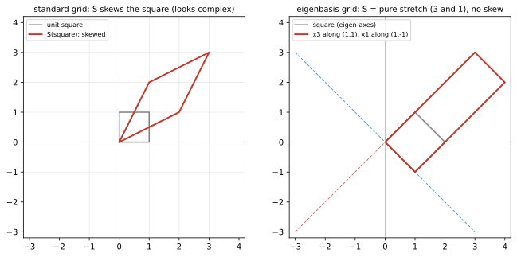

# ch13 — 對角化：在對的座標裡，一切都是伸縮

> **本章解決什麼問題**：ch11 找出了特徵向量——那幾條被變換純伸縮、不轉向的軸；ch12 看到旋轉沒有實特徵軸、逼出複數。本章把這兩件事收成一個動作：**對角化（diagonalization）**。如果一個變換有一組完整的特徵軸，我們就把座標系**換到這些軸上**——換完之後，這個原本把方格網（grid）攪得天翻地覆的變換，在新座標裡只是「沿每根軸各自乘一個倍率」，也就是一個對角矩陣。這是全書最大的幾個驚嘆點之一：**一個變換看起來複雜，往往只是因為你用錯了座標看它；換到它自己的特徵座標，它就現出原形——不過是伸縮。** 「複雜只是座標沒選對。」本章把脊椎 S 對角化（第五層）、講清楚什麼矩陣換不出對角形（剪切就不行，故障視角），並回收 ch04 的換基底。對稱矩陣為何保證能用「正交」座標對角化留 ch18；若爾當形（Jordan form，換不出對角時的最近替代）只點一句、指向延伸；任意矩陣（連非方陣）都能拆的 SVD 留 ch19。

開始前把全書一律遵守的台灣慣例釘死一次：**行（直行，column）是矩陣縱向的一排、列（橫列，row）是橫向的一排**——跟中國大陸的用法剛好相反（見 landscape 與 ch05）。本章 P 的「行」全指直行 column，每一行是一個特徵向量。用詞一律「特徵值／特徵向量」，**絕不寫「本徵值／本徵向量」**（那是大陸用語）。

## 從你已知的出發

你寫過會把幾個變數攪在一起的系統。最難搞的那種，是**變數互相耦合**：你動一個旋鈕，三個輸出全跟著抖，因為它們底下是糾纏的。你最想要的，是把系統**解耦（decouple）**成幾個互不影響的獨立旋鈕——轉旋鈕 A 只動輸出 A，轉旋鈕 B 只動輸出 B，彼此不串。一旦解耦，原本要一起解的聯立難題就垮成幾個各自獨立的簡單問題。

對角化就是線代版的解耦，而且是字面意義上的。一個矩陣 A 作用在向量上，一般會把各個分量攪在一起：輸出的第一個分量同時依賴輸入的第一、第二個分量（看 S=[[2,1],[1,2]]，輸出 x 分量是 `2x+y`，y 也插了一腳）。**但如果換到特徵座標**，這個攪拌就消失了——在新座標裡，每根軸只被自己的特徵值乘一下，軸與軸之間完全不串。一個對角矩陣 `diag(3,1)` 就是「第一根旋鈕乘 3、第二根旋鈕乘 1，互不干涉」。微分方程的人對這個最有感：耦合的線性系統 `x' = Ax`（各分量纏在一起、難解）對角化後變成 `y' = Dy`，攤成 `y₁' = λ₁ y₁`、`y₂' = λ₂ y₂` 一組各自獨立的方程，每個用指數一行解掉（2026-06，這是對角化最經典的動機之一）。

還有一個錨點，是給你這種讀過 ch04 的人的：**換對座標，難題變簡單，是線代反覆出現的主旋律。** 你在 ch04 看過同一個向量在不同基底下有不同座標讀數；本章把這件事用在「變換」上——同一個變換在不同基底下長成不同的矩陣，而特徵基底是那個讓它長得**最簡單**（對角）的基底。再往後，這條主旋律會一次次回來：PCA（主成分分析）把相關的 feature 換到「主成分」座標、變成互不相關的獨立成分（ch20，那正是把一個對稱矩陣對角化）；傅立葉把訊號換到正弦基底（《圓的影子》）。**對角化是這條主旋律的第一個完整現身。**

把這收成一句帶進本章：**對角化＝找到一組讓變換解耦的座標（它自己的特徵軸），在那組座標裡，再複雜的變換都只是沿各軸獨立伸縮。** 接下來把它做出來。

## 對角化是什麼：把變換搬到它自己的座標

先把式子寫清楚，再講它在幾何上做什麼——順序不能反，否則又變成背公式。

一個 n×n 矩陣 A 如果有 **n 個線性獨立的特徵向量**（ch03 的線性獨立、ch11 的特徵向量），就叫**可對角化（diagonalizable）**，而且可以寫成：

```text
A = P D P⁻¹
```

其中：

```text
P  ← 把 n 個特徵向量「並排成行（columns）」的矩陣。第 i 行 = 第 i 個特徵向量
D  ← 對角矩陣，對角線是對應的特徵值。D = diag(λ₁, λ₂, …, λₙ)
P⁻¹ ← P 的逆（P 的行是獨立特徵向量，所以 P 一定可逆，ch08）
```

**P 的行與 D 的對角線必須一一對應**：P 的第一行是某個特徵向量、D 的第一個對角元就得是那個特徵向量的特徵值。順序你可以自己挑（先放哪根軸都行），但兩邊**必須對齊**——這是本章最容易出錯的地方，待會在陷阱段再敲一次。

### 為什麼這條式子成立：三步換座標

別把 `A = PDP⁻¹` 當魔法。它就是「換座標 → 在特徵座標裡做事 → 換回來」三步，每一步你都已經會了。讀一個向量 v 被 `PDP⁻¹` 作用，**從右往左讀**（回收 ch06：矩陣連乘是合成，右邊先做）：

```text
(P D P⁻¹) v
   ↑ ↑ ↑
   │ │ └─ ① P⁻¹ v：先把 v 從標準座標「翻譯成特徵座標」
   │ │              （v 在特徵基底下的讀數是多少？回收 ch04 換基底）
   │ └─── ② D (…)：在特徵座標裡，每根軸各自乘自己的 λ（對角矩陣＝沿軸獨立伸縮）
   └───── ③ P (…)：把結果「翻譯回」標準座標
```

讀懂這三步，整個對角化就通了。**`P⁻¹` 是「進」特徵座標的門、`P` 是「出」回標準座標的門，中間 `D` 在特徵座標裡做最單純的事——沿軸伸縮。** 把這三步合起來看作一個動作，就是原本的變換 A；只是我們把它**拆成了「換進去、單純伸縮、換出來」**。為什麼 `P⁻¹` 是「進」、`P` 是「出」？因為 P 的行是特徵向量、是用標準座標寫的，所以 P 吃一個「特徵座標讀數」、吐出「標準座標」——P 是「出」；它的逆自然就是「進」（這正是 ch04 講過的基底矩陣 B 與 B⁻¹ 的角色，這裡 P 就是那個 B）。

換句話說：**A 和 D 是「同一個變換」在兩組座標下的兩張臉。** D 是它在特徵座標下的臉（乾淨、對角、解耦），A 是它在標準座標下的臉（攪在一起、看起來複雜）。兩者只差一個換基底——數學上叫 A 與 D **相似（similar）**（回收 ch04 結尾的預告）。相似矩陣描述同一個線性變換、只是用了不同基底，它們**特徵值完全相同**（2026-06；這也給你一個秒懂：既然 D 的特徵值明擺在對角線上，而 A 與它相似，A 的特徵值就是 D 的對角線——對角化把特徵值「攤在檯面上」了）。

### 幾何：複雜變換，只是換錯座標看的簡單伸縮

這一節是本章的心臟，慢讀。

在標準座標裡看脊椎 S=[[2,1],[1,2]]，它把方格網拉斜——`ê₁` 跑到 (2,1)、`ê₂` 跑到 (1,2)，整片格子歪掉、又拉長又剪、看起來「做了一件複雜的事」。但這個「複雜」是**座標的錯覺**。S 真正做的事，只有沿 (1,1) 方向拉三倍、沿 (1,−1) 方向不動——兩個各自獨立的純伸縮。問題是標準座標軸 `ê₁、ê₂` **沒有對齊**這兩根伸縮軸，所以在標準格子裡看，這個單純的「沿斜軸伸縮」就顯得歪七扭八。

把座標**換到特徵軸 {(1,1), (1,−1)}** 上，魔術就發生了：在這組座標裡，S 的作用是「第一根軸乘 3、第二根軸乘 1」——一個對角矩陣 `diag(3,1)`，沒有任何攪拌、沒有任何剪歪，純粹兩個獨立旋鈕。**同一個變換，在標準座標裡是斜拉的 [[2,1],[1,2]]，在特徵座標裡是乾淨的 diag(3,1)。複雜的不是變換，是你看它的座標。**

我認為這是整本書最該講給另一個工程師聽的一句話，所以把它再壓一次：

> **「複雜」常常不是變換本身的性質，而是「你用了一組沒對齊它特徵軸的座標」的後果。換到它自己的特徵座標，再亂的（可對角化的）變換都退化成沿各軸的獨立伸縮。**

這就是「對的座標裡，一切都是伸縮」這個章名的字面意思。它回收了 ch04 那句「換對座標、難題變簡單」，而對角化是這句話最漂亮的一次兌現——因為「最簡單」在這裡有精確定義：對角矩陣，解耦到底。本章的圖（見後）把這件事一次說完：左邊標準格裡方格被拉斜，右邊特徵格裡同一個 S 只是把方格沿兩軸各拉 3 倍與 1 倍——純伸縮，沒有歪斜。

### 脊椎 S 第五層：把它對角化，並乘回去驗證

把脊椎 **S = [[2,1],[1,2]]**（ch01 登場、ch09 算出 det=3、ch11 解出特徵值 3 與 1、特徵向量 (1,1) 與 (1,−1) 的那同一個 S）對角化，從頭做到尾、每步驗算。這是本章核心 worked example，不跳步。

**第一步：把 ch11 的成果擺好。** 我們已經知道（ch11 解過、代回驗證過）：

```text
λ=3 對應特徵向量 (1,1)ᵀ      （S(1,1)ᵀ = (3,3)ᵀ = 3·(1,1)ᵀ）
λ=1 對應特徵向量 (1,−1)ᵀ     （S(1,−1)ᵀ = (1,−1)ᵀ = 1·(1,−1)ᵀ）
```

兩個特徵向量 (1,1) 與 (1,−1) 線性獨立（互不為倍數，ch03），剛好兩個、湊成 ℝ² 的一組基底——所以 **S 可對角化**。

**第二步：組 P 與 D。** 把兩個特徵向量並排成 P 的兩行，對應特徵值放進 D 的對角線（**順序對齊**：第一行放 (1,1)、第一個對角元就放它的 λ=3）：

```text
P = | 1   1 |        D = | 3   0 |
    | 1  −1 |            | 0   1 |
   行1=(1,1)            對角=(3,1)
   行2=(1,−1)           ←與 P 的行一一對應
```

**第三步：算 P⁻¹。** 用 2×2 逆公式 `(1/det)[[d,−b],[−c,a]]`（ch08）。先算 `det P = 1·(−1) − 1·1 = −2`：

```text
P⁻¹ = (1/det P) | d  −b | = (1/−2) | −1  −1 |
                | −c  a |          | −1   1 |

    = (1/2) | 1   1 |        ← 把 (1/−2) 乘進去，每個元素變號
            | 1  −1 |
```

馬上驗 P⁻¹ 是不是真的逆（深度標準：別信記憶，乘一遍）：

```text
P P⁻¹ = | 1   1 | · (1/2)| 1   1 |
        | 1  −1 |        | 1  −1 |

      = (1/2) | 1·1+1·1   1·1+1·(−1) |  = (1/2) | 2   0 |  = | 1   0 |  = I  ✓
              | 1·1+(−1)·1  1·1+(−1)(−1)|        | 0   2 |    | 0   1 |
```

`P⁻¹` 站得住。

**第四步：乘出 PDP⁻¹，一步一步，目標是還原成 S。** 先算 `PD`（注意 D 是對角矩陣，效果是「把 P 的第一行乘 3、第二行……」——不，講準一點：右乘對角矩陣是**縮放 P 的各行**，第一行乘 D 的第一個對角元 3、第二行乘第二個對角元 1）：

```text
PD = | 1   1 | · | 3   0 |   = | 1·3+1·0   1·0+1·1 |  = | 3   1 |
     | 1  −1 |   | 0   1 |     | 1·3+(−1)·0  1·0+(−1)·1 | | 3  −1 |
```

（檢查一下「右乘對角＝縮放各行」：PD 的第一行是 (3,3)＝原本 P 第一行 (1,1) 的 3 倍 ✓、第二行……等等，PD 的行是直的——我們看 PD 的兩**行**：第一行 (3,3)ᵀ＝3·P 的第一行 (1,1)ᵀ ✓、第二行 (1,−1)ᵀ＝1·P 的第二行 (1,−1)ᵀ ✓。對角矩陣右乘就是逐行縮放，符合預期。）

再把 `PD` 乘上 `P⁻¹`：

```text
PDP⁻¹ = | 3   1 | · (1/2)| 1   1 |
        | 3  −1 |        | 1  −1 |

第 (1,1) 元 = (1/2)(3·1 + 1·1)     = (1/2)(4) = 2
第 (1,2) 元 = (1/2)(3·1 + 1·(−1))  = (1/2)(2) = 1
第 (2,1) 元 = (1/2)(3·1 + (−1)·1)  = (1/2)(2) = 1
第 (2,2) 元 = (1/2)(3·1 + (−1)(−1)) = (1/2)(4) = 2

      = | 2   1 |  = S   ✓✓
        | 1   2 |
```

**乘出來精準等於 S。** `P·diag(3,1)·P⁻¹ = [[2,1],[1,2]]`——脊椎七層的第五層收齊。讀這個結果的方式：S 就是「換進特徵座標（P⁻¹）、沿兩軸各乘 3 與 1（D）、換回標準座標（P）」這三步合成的。我們沒有改變 S 做什麼，只是把它**拆**成了一眼能懂的三步。

**順帶秒算一件之後超好用的事（預告 ch14）：** 既然 `S = PDP⁻¹`，那 `S² = PDP⁻¹·PDP⁻¹ = PD(P⁻¹P)DP⁻¹ = PD²P⁻¹`——中間的 `P⁻¹P` 抵成 I，於是 `Sⁿ = P Dⁿ P⁻¹`。而 `Dⁿ` 不過是把對角線各自 n 次方（`diag(3ⁿ, 1ⁿ)`）。**算矩陣的 n 次方，本來要乘 n 遍，對角化後變成把特徵值各自 n 次方——這就是 ch14 用對角化秒算 Aⁿ 的全部祕密。** 對角化不只好看，它讓「反覆作用一個變換」變廉價。

## 不是什麼都能對角化：剪切的故事

到這裡你可能覺得對角化是免費午餐——找出特徵向量、排成 P、收工。**不是。** 有些矩陣**湊不齊**足夠的獨立特徵向量，對角化在它們身上失敗。這是本章的故障視角，主角是配角矩陣裡的剪切（shear）。

判準先講清楚（兩個搜尋來源一致，2026-06）：**一個 n×n 矩陣可對角化，當且僅當它有 n 個線性獨立的特徵向量**——也就是特徵向量能湊成一組完整的基底。等價地：每個特徵值的「代數重數」（它當特徵多項式根的重複次數）要等於「幾何重數」（它對應的獨立特徵向量個數，也就是那個特徵空間的維度）。**若有任何一個特徵值，它的獨立特徵向量個數**少於**它作為根的重複次數，矩陣就湊不齊基底、不可對角化**，這種矩陣叫**有缺陷的（defective）**。

把剪切 **H = [[1,1],[0,1]]**（ch05 登場、ch06 拿來示範 AB≠BA 的那個剪切）拿來解，看它怎麼失敗：

**第一步：特徵值。** 算 `det(H − λI)`（H 是上三角，ch11 第 1 題練過：三角矩陣特徵值就在對角線）：

```text
H − λI = | 1−λ    1  |
         |  0    1−λ |
det(H − λI) = (1−λ)(1−λ) − 1·0 = (1−λ)²  = 0
→ λ = 1  （重根！代數重數 2——λ=1 出現兩次）
```

只有一個特徵值 λ=1，而且它是**重根**（重複兩次）。注意這跟脊椎 S 不同：S 有 3 和 1 兩個**相異**特徵值，相異特徵值自動給獨立特徵向量（這是「相異特徵值 ⟹ 一定可對角化」的捷徑，2026-06）；H 沒這個好運。

**第二步：解 λ=1 的特徵向量，看湊不湊得出兩個獨立的。** 代 λ=1 進 `(H − I)v = 0`：

```text
H − I = | 1−1    1  | = | 0   1 |
        |  0    1−1 |   | 0   0 |

解 (H − I)v = 0，設 v=(x, y)ᵀ：
| 0   1 | | x |   | 0 |        0·x + 1·y = 0   →   y = 0
| 0   0 | | y | = | 0 |        0 = 0           （沒約束，x 自由）
```

解是「所有 y=0 的向量」，也就是 **(1,0) 方向的整條線**——**只有一個方向**。x 軸方向被釘住（剪切把整片往右推、但 x 軸上的點原地不動，幾何上完全合理：剪切沿 x 軸推，x 軸本身不動）。

**第三步：宣判。** λ=1 的代數重數是 2（重根兩次），但幾何重數只有 1（只擠得出 (1,0) 一個獨立方向）。**1 < 2，湊不齊兩個獨立特徵向量、湊不成 ℝ² 的基底。剪切 H 不可對角化——它是 defective 的。**

幾何上為什麼？因為剪切**不是純伸縮**。對角化要求「整個變換能拆成沿幾根軸的獨立伸縮」，但剪切骨子裡有一個「推」的動作——它把上方的點往側邊滑，這個「滑」沒辦法被任何一組伸縮軸表達。它只有一條不動線（x 軸），另一個維度被「滑掉」了、找不到第二條留在原線上的軸。**沒有足夠的不變方向當座標軸，就換不到一組讓它變對角的座標。** 這正是 ch11「動手生圖」裡「把 S 換成剪切，不變線只剩一條」那個視覺前奏的代數結局。

那剪切這種不可對角化的矩陣怎麼辦？線代給了一個「最近的替代品」——**若爾當標準形（Jordan normal form）**：當你湊不齊對角矩陣時，能退而求其次化成「對角線是特徵值、緊鄰對角線的上方擺幾個 1」的近對角形（那些 1 正是「滑」這個動作的記號）。剪切 H 已經幾乎就是它自己的若爾當形了。這是 Camille Jordan 在 1870 年的《置換與代數方程論》（*Traité des substitutions et des équations algébriques*）裡為了處理「非對角化」情形而提出的（2026-06；注意是法國數學家 **Camille** Jordan，不是 Gauss–Jordan 消去那個測地學家 Wilhelm Jordan、也不是 Jordan 代數那個物理學家 Pascual Jordan——三個 Jordan，見 ch07／landscape）。**若爾當形本書只點到這一句**，完整理論指向延伸閱讀（Axler 對若爾當形有 determinant-free 的處理）。對你現在夠用的是這個判斷：**遇到重根，就要停下來檢查幾何重數夠不夠——夠就能對角化，不夠就是 defective、得換工具。**

（一個讓你安心的事實預告：很多實務上重要的矩陣**保證**可對角化——特別是**對稱矩陣**，它不但一定可對角化，還能用**正交**座標對角化，乾淨到極致。脊椎 S 就是對稱的，這是它「最乖」的原因，完整故事留 ch18 譜定理。而**任意**矩陣——連不可對角化的、連非方陣——都有 SVD 這個更一般的拆法，留 ch19。所以「不可對角化」不是死路，是通往更一般工具的路標。）

## 直覺的陷阱

對角化是「概念漂亮、手一滑就錯」的重災區，尤其對你這種機械操作沒問題、語意生鏽的人。下面五個是最常踩的，每個附「怎麼自我察覺」。

| 陷阱 | 錯誤直覺長什麼樣 | 會在哪一步把你帶溝裡 | 怎麼自我察覺 |
|---|---|---|---|
| **以為每個矩陣都能對角化** | 「找出特徵向量、排成 P 就好，每個矩陣都有特徵向量啊」 | 對剪切（或任何 defective 矩陣）硬排 P，卻發現特徵向量不夠湊成方陣、P 不可逆、`PDP⁻¹` 算不出來 | 可對角化**需要 n 個線性獨立的特徵向量**。重根是警報：遇到重根就停下來數「這個特徵值擠得出幾個獨立方向」。剪切 [[1,1],[0,1]] 的 λ=1 重根只擠得出 (1,0) 一個方向，1<2，defective、換不出對角形。相異特徵值才自動安全。 |
| **P 的行順序與 D 對角順序對錯** | 「P 隨便排、D 隨便排，反正都是那幾個數」 | P 第一行放 (1,1) 但 D 第一個對角元放成 1（該放 3），乘出來**不等於 S**，且你會以為自己「對角化錯了」 | **P 的第 i 行（特徵向量）和 D 的第 i 個對角元（它的特徵值）必須配對**。順序你可以挑（先放哪根軸都行），但兩邊得對齊。自查法：乘回 `PDP⁻¹` 看是不是還原成原矩陣——對角化**必須**能乘回去，乘不回去就是配錯了。 |
| **忘了 P 必須可逆（特徵向量要獨立）** | 「把幾個特徵向量塞進 P 就行」 | 塞了兩個**相依**的特徵向量（例如同一條線上的 (1,1) 和 (2,2)）進 P，det P=0、P⁻¹ 不存在、整個 `PDP⁻¹` 崩潰 | P 的行**必須線性獨立**（這樣 P 才可逆，ch08）。同一個特徵值的特徵向量是「一整條線」，你只能從每條獨立的線各取一個代表；取兩個共線的不算兩個獨立。det P≠0 是你 P 排對了的免費檢查。 |
| **把「對角化」當成「變成對角矩陣本身」** | 「對角化就是把 A 改寫成一個對角矩陣」 | 以為 A 和 D 是「同一個矩陣的不同寫法」、或誤以為對角化會「改變」這個變換 | 對角化是**相似變換** `A = PDP⁻¹`，不是 `A = D`。A 與 D 是**同一個變換在兩組座標下的兩張臉**（相似矩陣），不是同一個矩陣。D 只在特徵座標裡「是」這個變換；回到標準座標，它還是長成 A。少了 P 和 P⁻¹ 這兩個「換座標的門」，等號根本不成立。 |
| **以為對角化「簡化」了矩陣的本質** | 「對角化讓變換變簡單了」 | 在需要原座標結果時直接拿 D 用、忘了換回去（漏掉最外層的 P） | 變換的**本質沒變**，變簡單的是**你看它的座標**。算完特徵座標裡的事（D），要用 P 換回標準座標才是答案（回收三步：進、做、出）。「簡單」是 borrowed 的——跟 P⁻¹ 借的，最後要還（乘 P 還回去）。 |

把前三個陷阱合成一句你能口頭講的：**對角化＝把獨立特徵向量排成可逆的 P、把對應特徵值對齊排成 D，然後 `A=PDP⁻¹`；獨立不夠（defective）就排不出、順序錯了就乘不回去。** 第四、五個合成另一句：**A 不是變成 D，是「在特徵座標裡長得像 D」；P 與 P⁻¹ 是進出那個座標的門，少不得。**

## 紙上推演

### 推演題

**第 1 題 ★ [8 分鐘]——判斷可不可對角化（用重數，不用真的對角化）**
不解出 P、D，只判斷下面三個矩陣可不可對角化，並一句話說理由。

```text
A = | 4   0 |        B = | 5   2 |        C = | 2   0 |
    | 0   7 |            | 0   5 |            | 0   2 |
```

（提示：先看特徵值是相異還是重根；重根的話，那個特徵值擠得出幾個獨立方向？注意 A 已是對角、C 也是對角但有重根。）

**第 2 題 ★★ [18 分鐘]——完整對角化一個 2×2 並乘回驗證**
矩陣 M = [[3,1],[0,2]]（ch11 第 2 題解過特徵值與特徵向量的那個上三角）。(a) 寫出它的 P 與 D；(b) 算 P⁻¹；(c) 乘出 `PDP⁻¹` 還原成 M 驗證；(d) 用它秒算 M² 的對角化形式 `PD²P⁻¹`，並與直接平方 M·M 對照。

**第 3 題 ★★ [10 分鐘]——剪切為什麼換不出對角形**
剪切 H = [[1,1],[0,1]]。(a) 求它的特徵值（注意重根）；(b) 解出特徵向量，數一數有幾個獨立方向；(c) 用「代數重數 vs 幾何重數」一句話說明它為什麼不可對角化；(d) 用一句幾何的話講「剪切骨子裡的『推』為什麼不能被一組伸縮軸表達」。

**第 4 題 ★★★ [12 分鐘]——把白話翻成對角化的語言**
某人說：「我有一個會把好幾個變數攪在一起的線性系統，難解。聽說只要『換個角度看』就能讓它們互不干涉、各自獨立。」請把這句白話**逐句翻譯**成本章的線代語言（「換個角度」是什麼？「互不干涉、各自獨立」對應哪個矩陣長相？「換個角度」這件事用哪兩個矩陣完成？），並指出**在什麼情況下這個願望會落空**（系統換不到那組座標）。

### 推演解答

**第 1 題。**

- **A = [[4,0],[0,7]]**：**可對角化**。它本來就是對角矩陣（D=A、P=I，特徵值 4、7 相異）。對角矩陣是「已經對角化好了」的特例。

- **B = [[5,2],[0,5]]**：**不可對角化（defective）**。上三角，特徵值是對角線 5、5——**重根**（代數重數 2）。解 `(B−5I)v=0`：`[[0,2],[0,0]]v=0` → 2y=0 → y=0，只得 (1,0) 一個方向（幾何重數 1）。1<2，湊不齊兩個獨立特徵向量。它其實就是一個（被縮放過的）剪切型，跟本章的 H 同病。

- **C = [[2,0],[0,2]]**：**可對角化**——而且它**已經是**對角的（就是 2I，純量縮放）。這題的陷阱在於：C 也有重根（λ=2 兩次），但它**不** defective！解 `(C−2I)v=0`：`[[0,0],[0,0]]v=0`，**每個**向量都滿足——整個 ℝ² 都是 λ=2 的特徵空間，幾何重數 2＝代數重數 2。**重根不一定 defective**：重點是幾何重數夠不夠。C 對每個方向都乘 2，每個方向都是特徵向量，當然能對角化（它根本已經對角）。B 和 C 都有重根 5、2，命運卻相反——這就是「相異特徵值是充分但非必要條件」的活教材。

**第 2 題。** M = [[3,1],[0,2]]。ch11 第 2 題已解出：λ=3 對應 (1,0)、λ=2 對應 (1,−1)。

(a) 排 P、D（第一行 (1,0) 配 λ=3、第二行 (1,−1) 配 λ=2）：

```text
P = | 1   1 |        D = | 3   0 |
    | 0  −1 |            | 0   2 |
```

(b) 算 P⁻¹。`det P = 1·(−1) − 1·0 = −1`：

```text
P⁻¹ = (1/−1) | −1  −1 | = | 1   1 |
             |  0   1 |   | 0  −1 |
```

驗 `P P⁻¹`：`[[1,1],[0,−1]]·[[1,1],[0,−1]] = [[1·1+1·0, 1·1+1·(−1)],[0·1+(−1)·0, 0·1+(−1)(−1)]] = [[1,0],[0,1]] = I` ✓。

(c) 乘回 `PDP⁻¹`：

```text
PD = | 1   1 | | 3   0 | = | 3   2 |       （第一行×3、第二行×2）
     | 0  −1 | | 0   2 |   | 0  −2 |

PDP⁻¹ = | 3   2 | | 1   1 | = | 3·1+2·0   3·1+2·(−1) | = | 3   1 | = M  ✓
        | 0  −2 | | 0  −1 |   | 0·1+(−2)·0  0·1+(−2)(−1)| | 0   2 |
```

還原成 M，對角化正確。

(d) `M² = PD²P⁻¹`，`D² = diag(9,4)`：

```text
PD² = | 1   1 | | 9   0 | = | 9   4 |
      | 0  −1 | | 0   4 |   | 0  −4 |

M² = | 9   4 | | 1   1 | = | 9   5 |
     | 0  −4 | | 0  −1 |   | 0   4 |
```

直接平方對照：`M·M = [[3,1],[0,2]]·[[3,1],[0,2]] = [[3·3+1·0, 3·1+1·2],[0·3+2·0, 0·1+2·2]] = [[9,5],[0,4]]` ✓。兩法一致——對角化把「平方一個矩陣」變成「平方對角線」，這就是 ch14 的引擎。

**第 3 題。** H = [[1,1],[0,1]]。

(a) `det(H−λI) = (1−λ)² = 0` → λ=1，**重根**（代數重數 2）。

(b) `(H−I)v=0`：`[[0,1],[0,0]]v=0` → y=0、x 自由 → 只有 **(1,0) 一個獨立方向**（幾何重數 1）。

(c) 代數重數 2、幾何重數 1，**2≠1（差了一個）**，湊不齊兩個獨立特徵向量、湊不成基底，所以 **defective、不可對角化**。

(d) 剪切沿 x 軸把上方的點往側邊「推／滑」。伸縮只能沿固定方向把向量拉長壓短、永遠不會把一個方向「滑」向另一個方向；剪切的這個「滑」沒有任何一組伸縮軸能表達它，所以它找不到第二條不變軸（只剩 x 軸不動），換不到讓自己變對角的座標。**「推」不是「伸縮」，而對角化只認伸縮。**

**第 4 題。** 逐句翻譯：

- **「換個角度看」** ＝ **換基底（換座標系）**，具體是換到這個系統矩陣 A 的**特徵基底**（它的特徵向量當新座標軸）。回收 ch04：座標只是名字，換組基底就換串讀數；這裡換的是「讓 A 長得最簡單」的那組基底。
- **「互不干涉、各自獨立」** ＝ 矩陣在新座標裡變成**對角矩陣 D**：每根軸只被自己的特徵值 λᵢ 乘一下，軸與軸之間沒有交叉項、完全解耦（耦合系統 `x'=Ax` 變 `y'=Dy`，攤成各自獨立的 `yᵢ'=λᵢyᵢ`）。
- **「換個角度」這件事用哪兩個矩陣完成** ＝ **P 與 P⁻¹**：`P⁻¹` 把向量翻進特徵座標、`P` 翻回標準座標，合起來 `A = PDP⁻¹`。P 的行是特徵向量。
- **願望落空的情況** ＝ A **不可對角化（defective）**：它湊不齊 n 個獨立特徵向量（有特徵值的幾何重數小於代數重數，像剪切那樣）。這時換不到能讓它變對角的座標，系統解不開成完全獨立的旋鈕，只能退到若爾當形那種「近對角」的次佳解（或改用 SVD，ch19）。**不是每個糾纏的系統都解得開——能不能解耦，取決於它有沒有湊得齊的特徵軸。**

### 動手生圖



本章的圖把「複雜只是座標沒選對」一次說完：**同一個 S，左邊在標準格裡把方格拉斜（看起來複雜），右邊在特徵格裡只是把方格沿兩軸各拉 3 倍與 1 倍（純伸縮，乾淨）。** 由以下腳本產生。它同時就是你的小實驗：跑它、改它、重生它。

```python
# ch13 figure: the SAME S=[[2,1],[1,2]] in two coordinate views.
# LEFT (standard grid): a unit square gets sheared/skewed -- looks "complex".
# RIGHT (eigenbasis grid {(1,1),(1,-1)}): the same S is pure stretch -- the
# square's two eigen-axes scale by 3 and by 1, no skew. "Complexity = wrong coords."
from pathlib import Path
import numpy as np
import matplotlib
matplotlib.use("Agg")          # headless; no display needed
import matplotlib.pyplot as plt

OUT = Path(__file__).resolve().parent / "out" / "ch13-diagonalization.svg"
OUT.parent.mkdir(parents=True, exist_ok=True)

S = np.array([[2.0, 1.0], [1.0, 2.0]])          # spine: eigvals 3 (along (1,1)) and 1 (along (1,-1))
e1, e2 = np.array([1.0, 1.0]), np.array([1.0, -1.0])  # eigen-axes (used as directions)
sq = np.array([[0, 0], [1, 0], [1, 1], [0, 1], [0, 0]]).T   # unit square (closed)

fig, (axL, axR) = plt.subplots(1, 2, figsize=(11, 5.4))

# LEFT: standard coords. Unit square and its image S@square (skewed parallelogram).
for k in range(-1, 4):
    axL.axhline(k, color="0.9", lw=0.7); axL.axvline(k, color="0.9", lw=0.7)
axL.plot(sq[0], sq[1], color="0.5", lw=1.5, label="unit square")
img = S @ sq
axL.plot(img[0], img[1], color="#c0392b", lw=2.0, label="S(square): skewed")
axL.set_title("standard grid: S skews the square (looks complex)", fontsize=10)
axL.legend(loc="upper left", fontsize=8)

# RIGHT: eigenbasis coords. Square aligned to eigen-axes and its image:
# along (1,1) scale x3, along (1,-1) scale x1 -> pure stretch, no skew.
base = np.array([e1, e2]).T                      # columns are the eigen-axes
sq_eig = base @ sq                               # unit square drawn in eigen-axes
img_eig = base @ (np.diag([3.0, 1.0]) @ sq)      # same square scaled (3,1) along eigen-axes
for d, col in [(e1, "#c0392b"), (e2, "#2471a3")]:
    axR.plot([-3 * d[0], 3 * d[0]], [-3 * d[1], 3 * d[1]], color=col, lw=1.0, ls="--", alpha=0.7)
axR.plot(sq_eig[0], sq_eig[1], color="0.5", lw=1.5, label="square (eigen-axes)")
axR.plot(img_eig[0], img_eig[1], color="#c0392b", lw=2.0, label="x3 along (1,1), x1 along (1,-1)")
axR.set_title("eigenbasis grid: S = pure stretch (3 and 1), no skew", fontsize=10)
axR.legend(loc="upper left", fontsize=8)

for ax in (axL, axR):
    ax.set_aspect("equal"); ax.set_xlim(-3.2, 4.2); ax.set_ylim(-3.2, 4.2)
    ax.axhline(0, color="0.6", lw=0.6); ax.axvline(0, color="0.6", lw=0.6)
fig.savefig(OUT, bbox_inches="tight")
print("wrote", OUT)            # build_figures.py reads this
```

**預期輸出**：左右兩張正方形圖。

- **左（標準格）**：灰色單位正方形，被 S 送成一個**斜的紅色平行四邊形**（四角 (0,0)(2,1)(3,3)(1,2)，回收 ch01/ch09）——看起來「又拉又剪」，複雜。
- **右（特徵格）**：方格沿兩條特徵軸（紅虛線 (1,1)、藍虛線 (1,−1)）擺正，紅色像被 S 作用後**只是沿 (1,1) 拉成 3 倍、沿 (1,−1) 維持 1 倍**——純伸縮，方格被拉成更長的菱形但**沒有歪斜**（兩軸仍互相垂直，因為 S 的兩特徵向量正交）。

兩張圖是同一個 S，差別只在你用哪組座標看它。**右圖就是 diag(3,1) 的字面長相；左圖就是 [[2,1],[1,2]] 的字面長相。** 確認：右圖紅菱形沿 (1,1) 方向的對角線長度是灰方格的 3 倍、沿 (1,−1) 方向不變。

**改參數看什麼**（把概念玩活）：

- **把 S 換成剪切看特徵格塌掉**：把 `S` 換成 `np.array([[1.,1.],[0.,1.]])`、把 `e1,e2` 換成它的特徵方向——你會發現它**只有一條**特徵軸 (1,0)，根本擺不出兩條獨立的軸來撐起右圖的特徵格。**無法純伸縮**：剪切沒有第二根伸縮軸，右圖那種「沿兩軸各自拉」的乾淨圖像在剪切上畫不出來——這就是「defective、不可對角化」的視覺結局。
- **確認特徵基底下 S 是 diag(3,1)**：把右圖的 `np.diag([3.0,1.0])` 印出來、或在程式裡算 `np.linalg.inv(base) @ S @ base`，你會得到（數值上的）`[[3,0],[0,1]]`——這就是 `P⁻¹SP = D` 的字面驗證：把 S 夾在換基底矩陣中間，它就現出對角原形。
- **把伸縮倍率調得更懸殊**：把 `np.diag([3.0,1.0])` 改成 `np.diag([5.0,0.3])`，看主軸方向怎麼壓過一切（預告 ch14：最大特徵值主宰長期行為）。

## 自我檢核

口頭自答；講得出來才算過關，卡住就回對應段落。

1. **用「換對座標」講對角化在做什麼？**（本章必答）對角化＝把座標系換到變換自己的特徵軸上；在那組座標裡，變換只是沿每根軸各自乘一個特徵值（對角矩陣、完全解耦），原本「複雜」的攪拌消失了。`A=PDP⁻¹` 就是「進特徵座標（P⁻¹）、沿軸伸縮（D）、回標準座標（P）」三步。
2. **`A=PDP⁻¹` 裡 P、D、P⁻¹ 各是什麼、為什麼這樣排？** P 的行是特徵向量、D 對角線是對應特徵值（順序一一對齊）；P⁻¹ 把向量翻進特徵座標、P 翻回來。從右往左讀就是換座標—伸縮—換回。
3. **可對角化的條件是什麼？** 有 n 個線性獨立的特徵向量（湊得成完整基底）；等價於每個特徵值的幾何重數＝代數重數。相異特徵值是充分（非必要）條件。
4. **為什麼剪切 [[1,1],[0,1]] 不可對角化？**（本章必答）它的 λ=1 是重根（代數重數 2），但只擠得出 (1,0) 一個獨立特徵向量（幾何重數 1），1<2，湊不齊基底——defective。幾何上：剪切的「推／滑」不是伸縮，找不到第二條不變軸。
5. **重根一定不可對角化嗎？** 不一定。關鍵是幾何重數夠不夠：2I=[[2,0],[0,2]] 有 λ=2 重根，但每個方向都是特徵向量（幾何重數 2＝代數重數 2），它本來就是對角的、可對角化。剪切才是幾何重數不足那種。
6. **「對角化就是把 A 變成對角矩陣 D」這句話錯在哪？** A 不是變成 D，是**與 D 相似**（`A=PDP⁻¹`，差一個換基底）。A 與 D 是同一個變換在兩組座標下的兩張臉，少了 P 和 P⁻¹ 等號不成立。
7. **為什麼 P 一定可逆？** 因為它的行是線性獨立的特徵向量（可對角化的前提就是湊得齊獨立特徵向量），獨立 ⟺ det P≠0 ⟺ 可逆（ch08）。塞共線的特徵向量進 P 會讓它不可逆、整個崩潰。
8. **對角化讓算 Aⁿ 變便宜，為什麼？** `Aⁿ=PDⁿP⁻¹`，中間的 `P⁻¹P` 連環抵消，而 `Dⁿ` 只是把對角線各自 n 次方。算 n 次矩陣乘法的活，變成算對角線的 n 次方——這是 ch14 的引擎。

## 延伸閱讀

- **3Blue1Brown《Essence of Linear Algebra》第 14 章「Eigenvectors and eigenvalues」後半「Eigenbasis」段**（YouTube／官網，免費；2026-06 可取）。**和本章最對應**的視覺：Grant 把「換到特徵基底、矩陣變對角」用動畫演到你忘不掉，尤其「在特徵座標裡算 Aⁿ 為何變廉價」那段，看完再回頭看本章的左右對照圖會更通透。官網：https://www.3blue1brown.com/lessons/eigenvalues/
- **Gilbert Strang，MIT 18.06，對角化與 Aⁿ 那幾講（Lecture 22「Diagonalization and Powers of A」）**（MIT OpenCourseWare，免費；2026-06 可取）。Strang 把對角化直接接到「矩陣的冪與差分方程」（本書 ch14 的主題），與本章「對角化讓 Aⁿ 變廉價」互補；想看更多 worked example 看他怎麼算。https://ocw.mit.edu/courses/18-06-linear-algebra-spring-2010/
- **Sheldon Axler，*Linear Algebra Done Right*（第 4 版，Open Access 免費 PDF；2026-06 可取）** 關於「可對角化（diagonalizable）」與「特徵空間維度＝幾何重數」的那幾節，以及若爾當形（Jordan form）的 determinant-free 處理。本章只點一句的若爾當形，Axler 給了不靠行列式的完整建構——想知道「不可對角化時，最近的標準形長什麼樣、為什麼那些 1 出現在上對角線」，這是經典參考。https://linear.axler.net/
- **MacTutor，Camille Jordan 傳**（免費；2026-06 可取）。本章歷史那句的出處——若爾當標準形出自 Camille Jordan 1870 年的《Traité des substitutions et des équations algébriques》（不是 Gauss–Jordan 的 Wilhelm Jordan、也不是 Jordan 代數的 Pascual Jordan，三個 Jordan 的釐清見 ch07／landscape）。https://mathshistory.st-andrews.ac.uk/Biographies/Jordan/
