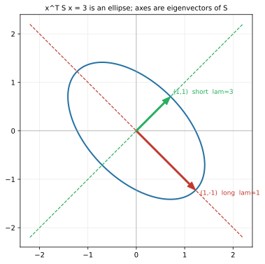

# ch18 — 對稱矩陣與譜定理：最乖的變換

> **本章解決什麼問題**：Part V 一路在補長度與角度——內積把幾何變回代數（ch15）、投影在無解時給最近解（ch16）、Gram–Schmidt 把任意基底扶成正交、QR 把它寫成矩陣（ch17）。現在所有工具到齊，本章把它們收束在一類最特別的矩陣上：**對稱矩陣（symmetric matrix）A=Aᵀ**。它特別在哪？它是所有矩陣裡**最乖的**——特徵值（eigenvalue）全是實數、特徵向量（eigenvector）一定可以取成互相正交、而且一定能對角化（diagonalize）。這就是**譜定理（spectral theorem）**：A=QΛQᵀ，其中 Q 是正交矩陣（純旋轉換基底、無剪切）。對角化（ch13）需要「湊到一組完整特徵基底」的運氣，對稱矩陣連這運氣都不用——它天生就有。本章還把對稱矩陣的另一張臉攤開：**二次型（quadratic form）xᵀAx** 是一個橢圓（碗），它的軸正是特徵向量。脊椎矩陣 S=[[2,1],[1,2]] 在這裡走到第六層，全部的美一次收齊。把 SVD 推廣到「連方陣都不是」的任意矩陣留 ch19；PCA 完整留 ch20；正定的完整判據只點到一句。

開始前把全書一律遵守的台灣慣例釘死一次：**行（直行，column）是矩陣縱向的一排、列（橫列，row）是橫向的一排**——這跟中國大陸的用法剛好相反（見 landscape 與 ch05）。本章談轉置（transpose）談得多，提醒一次：轉置 Aᵀ 就是把 A 的「行變列、列變行」沿對角線翻過去；**對稱矩陣 A=Aᵀ 的意思是「翻過去長得一模一樣」**，即 A 的第 i 列等於第 i 行、元素滿足 aᵢⱼ=aⱼᵢ。還有用詞：我們講「特徵值／特徵向量」，**絕不寫「本徵值／本徵向量」**（那是大陸用語）。

## 從你已知的出發

你大概沒專門想過「對稱矩陣」，但你天天在跟它打交道——只是它戴著別的名字出現。

**共變異矩陣天生對稱。** 你做過監控、看過 dashboard 上一排 metric：CPU、記憶體、QPS、延遲。如果你把它們兩兩之間的「一起變動的程度」算出來，排成一張表，那張表叫**共變異矩陣（covariance matrix）**。它有一個你大概沒留意的鐵律：cov(CPU, 記憶體) 一定等於 cov(記憶體, CPU)——「CPU 和記憶體一起動的程度」跟「記憶體和 CPU 一起動的程度」是同一個數，沒有哪個方向更主動。所以這張表**沿對角線翻過去長得一樣**，它是對稱矩陣。共變異的統計意義（它到底量什麼）見《馴服隨機》ch10，本章不依賴；這裡我們只需要一件事：**共變異矩陣天生對稱，所以——本章會證——它一定能正交對角化。** 而那組正交的特徵向量，就是 PCA（主成分分析）找的「主軸」。「為什麼資料的主軸是某個對稱矩陣的特徵向量」是本書 ch20 的主場，而它之所以成立、底下那塊地基，就是本章的譜定理。先記著這條線：**共變異對稱 → 必可正交對角化 → PCA 找得到正交主軸。**

**loss 曲面的局部形狀。** 你訓練過模型、或至少看過「loss 沿著訓練步數下降」那條曲線。在最小值附近，loss 曲面長什麼樣？把它在某點展開，二階項就是一個二次型 **xᵀHx**，H 叫 **Hessian（黑塞矩陣）**——它是二階偏導數排成的表。而二階偏導數有個對稱性（∂²f/∂x∂y = ∂²f/∂y∂x，混合偏導與求導順序無關，這在《馴服無限》微積分那側講），所以 **Hessian 對稱**。Hessian 的特徵值，決定了你站的那個點是碗底（往哪個方向都往上）、山頂（往哪都往下）、還是馬鞍（有的方向上、有的方向下）。本章教你讀這個二次型——它就是一個橢圓（或雙曲線），軸是特徵向量、陡峭程度是特徵值。

**正定＝碗形＝有唯一最小、最佳化乖。** 你最喜歡的最佳化問題長什麼樣？一個碗——不管從哪裡開始往下走，都會滑到同一個碗底，沒有別的局部最小值來陷害你。「碗」這個形狀，在線代裡有個精確的名字：**正定（positive definite）**。本章會告訴你正定的真相——它就是「所有特徵值都大於 0」，幾何上就是「二次型恆正、等值線是橢圓、曲面是個開口向上的碗」。凸最佳化之所以乖，底層是矩陣正定。

把這三個錨點收成一句帶進本章：**對稱矩陣是工程裡最常出現、也最乖的一類矩陣——共變異是它、Hessian 是它、任何「能量」「相似度」「二次成本」的表都是它。本章告訴你為什麼它乖：它的特徵向量正交、它一定能用純旋轉對角化、它的二次型是個乾淨的橢圓。** 這是脊椎矩陣 S 的第六層，也是 Part V 的收束。

## 譜定理：對稱矩陣為什麼是最乖的變換

先把主角和它的承諾一次說清楚，再回頭一條條兌現。

一個方陣 A 叫**對稱矩陣**，如果 **A=Aᵀ**——它沿主對角線翻過去長得一模一樣，元素滿足 aᵢⱼ=aⱼᵢ。脊椎 S=[[2,1],[1,2]] 就是：右上角的 1 等於左下角的 1，翻過去不變。

**譜定理（spectral theorem，對稱矩陣版）** 說，對任何實對稱矩陣 A：

1. **它的特徵值全是實數**（不會像旋轉那樣冒出複數，ch12）；
2. **它有一組互相正交的特徵向量，多到能組成整個空間的基底**（不會像剪切那樣特徵向量不夠，ch13）；
3. 因此 **A 可以寫成 A=QΛQᵀ**，其中 Q 是正交矩陣（行是那組單範正交特徵向量）、Λ 是特徵值排成的對角矩陣。

第 3 條是前兩條的直接打包，也是本章的核心結論。我認為它是整個 Part V 最漂亮的一頁——它說對稱矩陣這個變換，**就是「換到一組正交軸、沿各軸獨立伸縮、再換回來」，中間沒有任何剪切、沒有扭曲**。先看它跟 ch13 對角化差在哪，差別就是「乖」的全部含義。

### 從 PDP⁻¹ 到 QΛQᵀ：差別在哪

ch13 教過一般的對角化：能對角化的方陣可以寫成 **A=PDP⁻¹**，P 的行是特徵向量、D 是特徵值對角矩陣。幾何上：`P⁻¹` 先把向量翻譯到特徵基底、`D` 在那組基底下各軸獨立伸縮、`P` 再翻譯回標準座標。

問題出在 P。一般情形下，特徵向量**只保證線性獨立，不保證正交**——P 是一個「斜的」換基底矩陣，它本身含有剪切（把方格網拉歪）。而且你得真的去算 `P⁻¹`（解逆矩陣，ch08 警告過這是數值上要小心的事）。

對稱矩陣把這兩個麻煩一次解決。它的特徵向量**可以取成互相正交**，再各自正規化成長度 1，就得到一組**單範正交（orthonormal）特徵向量**。把它們當行排成矩陣 Q，Q 就是**正交矩陣**——ch17 講過正交矩陣的招牌性質：**它的逆就是它的轉置，Q⁻¹=Qᵀ**（不必解逆！轉置是免費的）。於是對角化變成：

```text
一般矩陣（ch13）：  A = P  Λ  P⁻¹    ← P 斜的（含剪切）、P⁻¹ 要解逆
對稱矩陣（本章）：  A = Q  Λ  Qᵀ     ← Q 正交（純旋轉）、Qᵀ 免費（轉置即可）
```

這個差別不是省力氣而已，是**幾何上的乾淨**。正交矩陣 Q 代表一個**純旋轉（或加反射）的換基底**——它不拉歪方格網、不改變長度與角度（ch17）。所以「對稱矩陣 = QΛQᵀ」在說：**一個對稱變換，就是「旋轉到一組正交軸 → 沿各軸獨立伸縮 → 旋轉回來」。** 沒有剪切混進來。這就是「最乖」的字面意思：它把空間的變形限制成「沿幾條互相垂直的軸純伸縮」，這是線性變換能有的最規矩的長相。

（嚴謹度標示：QΛQᵀ 對一般 n 維對稱矩陣成立的完整證明，本書不展開——它要用到「特徵子空間互相正交＋歸納降維」或譜投影的論證，指向延伸閱讀的 Axler。本章給的是**直覺＋2×2 手證＋脊椎上完整驗算**，足夠你把它講給另一個工程師聽、並親手驗證它在脊椎上成立。）

### 為什麼對稱 → 特徵向量正交：一個你能背下來的兩行證明

這是本章最該親手過一遍的論證，因為它短、漂亮、而且只用到你已經有的工具（內積與轉置）。**結論：對稱矩陣中，對應到不同特徵值的特徵向量必定互相正交。**

設 A 對稱（A=Aᵀ），有兩個特徵向量 u、v，對應**不同的**特徵值 λ、μ（λ≠μ）：Au=λu、Av=μv。我們要證 u·v=0（正交）。

關鍵小工具：內積 u·v 可以寫成矩陣乘法 **uᵀv**（一個列向量乘一個行向量，得一個純量，ch15）。現在用兩種方式算同一個量 **uᵀAv**：

```text
算法一（讓 A 往右作用到 v）：
  uᵀ(Av) = uᵀ(μv) = μ (uᵀv)        ← 因為 Av=μv

算法二（讓 A 往左作用到 u）：
  uᵀAv = uᵀAᵀv                      ← 因為 A=Aᵀ，可以把 A 換成 Aᵀ（這一步用掉「對稱」！）
       = (Au)ᵀv                      ← 轉置規則 (Aᵀ)ᵀ... 其實是 uᵀAᵀ=(Au)ᵀ，因 (Au)ᵀ=uᵀAᵀ
       = (λu)ᵀv = λ (uᵀv)            ← 因為 Au=λu
```

兩種算法算的是同一個數 uᵀAv，所以兩個結果相等：

```text
μ (uᵀv) = λ (uᵀv)
(μ − λ)(uᵀv) = 0
```

因為 λ≠μ，所以 (μ−λ)≠0，於是必須 **uᵀv=0**——u 與 v 正交。**證畢。**

停一秒看這個證明的關鍵在哪：**算法二第一步「把 A 換成 Aᵀ」用掉了對稱性**。如果 A 不對稱，這一步就走不了，整個論證垮掉——這就是「為什麼一定要對稱」的答案。對稱性讓 A「往左作用」和「往右作用」給出同一個東西，逼出 (λ−μ)(u·v)=0，在特徵值不同時逼出正交。**這兩行你應該能默寫**：它是本章最值錢的一段，比任何比喻都直接。

（兩個補充，標清楚嚴謹度。其一：特徵值**為什麼是實數**？同類論證的複數版——對複向量用共軛轉置 ūᵀ，可推出 λ=λ̄（λ 等於自己的共軛），所以 λ 是實數；細節指向延伸，本章脊椎上直接看到特徵值是 3 和 1 兩個實數。其二：上面只證了「不同特徵值的特徵向量正交」。若有**重根**（同一個特徵值對應一整個平面的特徵向量），那個特徵子空間內部不會自動正交，但你**可以在裡面挑一組正交基底**（Gram–Schmidt，ch17）——所以「湊得出一組正交特徵基底」這個結論對重根也成立。脊椎 S 兩個特徵值不同，沒有這個顧慮。）

歷史插曲，順便當一個漂亮的「名字比東西晚很多」的例子：**第一個一般性地證明「實對稱矩陣的特徵值都是實數」的是柯西（Augustin-Louis Cauchy），1829 年**（2026-06，見 landscape 與下文）。在那之前，十八世紀的拉格朗日（Lagrange）、拉普拉斯（Laplace）解力學的微分方程組時就反覆撞見這個問題，但沒有一般證明。柯西這篇論文啟動了一直發展到 1870 年代才成形的矩陣譜理論。而「譜定理」這個對稱矩陣可正交對角化的事實，它的幾何版本有個更老的名字——**主軸定理（principal axis theorem）**：一個二次曲面（橢球）總可以旋轉到讓它的軸對齊座標軸。下一節你就會看到二次型的橢圓，它的「主軸」字面意思就是這個。

### 脊椎 S 第六層：S=QΛQᵀ，完整驗算

把脊椎 **S=[[2,1],[1,2]]** 的譜分解從頭算到尾，每一步驗算（深度標準要求矩陣運算至少代回驗證一次）。

ch11 已經解出 S 的特徵值與特徵向量，這裡回收並推進到正交分解：

```text
特徵值： λ₁ = 3，  λ₂ = 1
特徵向量（方向）： (1,1)（λ=3）、(1,−1)（λ=1）
```

**第一步：確認兩個特徵向量正交。** 用上一節的結論先檢查（也順便驗算特徵向量沒抄錯）：

```text
(1,1)·(1,−1) = 1·1 + 1·(−1) = 1 − 1 = 0    ✓ 正交
```

正交了，符合譜定理的承諾（S 對稱、兩特徵值不同 → 特徵向量必正交）。

**第二步：正規化成單範正交，組成 Q。** 兩個特徵向量長度都是 √(1²+1²)=√2≈1.41421，各除以 √2 得單位向量，當行排成 Q：

```text
        | 1/√2    1/√2 |        ← 第一行 = (1,1)/√2，對應 λ=3
Q = ────                         （把單位特徵向量當行排好）
        | 1/√2   −1/√2 |        ← 第二行 = (1,−1)/√2，對應 λ=1

即 Q = (1/√2) | 1   1 |
              | 1  −1 |
```

先確認 Q 真的是正交矩陣（兩行單範正交）：

```text
第一行·第一行 = (1/√2)² + (1/√2)² = 1/2 + 1/2 = 1     ✓ 長度 1
第二行·第二行 = (1/√2)² + (−1/√2)² = 1/2 + 1/2 = 1    ✓ 長度 1
第一行·第二行 = (1/√2)(1/√2) + (1/√2)(−1/√2) = 1/2 − 1/2 = 0   ✓ 互相正交
```

兩行單範正交，Q 是正交矩陣，所以 **Q⁻¹=Qᵀ**（這正是用對稱換來的紅利）。又因為這個 Q 剛好對稱（Q=Qᵀ，純屬這個例子的巧合，因為兩特徵向量擺成這樣對稱），下面 Qᵀ 直接等於 Q——但別把「Q 對稱」當通則，通則是「Q 正交、Qᵀ=Q⁻¹」。

**第三步：寫出 Λ，乘出 QΛQᵀ 驗證等於 S。** Λ 是特徵值對角矩陣，**順序要跟 Q 的行對齊**（第一行對 λ=3，所以 Λ 第一個對角元是 3）：

```text
Λ = | 3  0 |
    | 0  1 |
```

現在分兩步乘 QΛQᵀ。先算 QΛ（Λ 在右邊乘對角矩陣＝把 Q 的第 j 行各乘上 λⱼ，第一行 ×3、第二行 ×1）：

```text
QΛ = (1/√2) | 1   1 | | 3  0 |  = (1/√2) | 1·3   1·1 |  = (1/√2) | 3   1 |
            | 1  −1 | | 0  1 |           | 1·3  −1·1 |           | 3  −1 |
```

再乘 Qᵀ＝(1/√2)[[1,1],[1,−1]]（這個例子裡 Qᵀ=Q）。兩個 (1/√2) 相乘給前面一個 (1/2)：

```text
QΛQᵀ = (1/√2)|3   1| · (1/√2)|1   1|
             |3  −1|         |1  −1|

     = (1/2) |3   1| |1   1|
             |3  −1| |1  −1|

逐項算（行×列）：
  (1,1) 位置 = 3·1 + 1·1   = 4
  (1,2) 位置 = 3·1 + 1·(−1) = 2
  (2,1) 位置 = 3·1 + (−1)·1  = 2
  (2,2) 位置 = 3·1 + (−1)·(−1) = 4

     = (1/2) | 4   2 |  = | 2   1 |  = S    ✓
             | 2   4 |    | 1   2 |
```

**乘出來精準等於 S=[[2,1],[1,2]]。** 脊椎的第六層成立：S=QΛQᵀ，Q 是把標準座標旋轉 45° 到特徵軸的正交矩陣、Λ=diag(3,1) 在那組軸上沿第一軸拉三倍、第二軸不動。**這就是「對稱矩陣＝旋轉 → 沿正交軸伸縮 → 旋轉回來」的字面現身。** 沒有任何剪切。

順帶把脊椎的幾層串一下，你會看到它們其實在講同一件事的不同切面：ch11 找到不轉的方向（特徵向量）、ch13 把 S 寫成 PDP⁻¹（P 斜的）、本章把那個 P 升級成正交的 Q（因為 S 對稱），對角化從「斜換基底」變成「正交旋轉換基底」。**對稱矩陣讓對角化從『有條件的好運』變成『天生的權利』。**

### 二次型 xᵀAx：對稱矩陣的另一張臉是一個橢圓

對稱矩陣還有一張完全不同的臉。前面我們一直把矩陣當「動詞」——它把向量 x 搬到 Ax。但對稱矩陣還能定義一個**純量函數**：給一個向量 x，吐出一個數

```text
q(x) = xᵀ A x        ← 一個向量進、一個純量出（不是向量！）
```

這叫 A 的**二次型（quadratic form）**。為什麼跟對稱矩陣綁在一起？因為這個函數只「看得到」A 的對稱部分——任何反對稱的成分在 xᵀAx 裡會自相抵消（待會陷阱段細說），所以談二次型時用對稱矩陣是最自然的，而且**對稱矩陣與二次型一一對應**。

把脊椎 S 的二次型攤開算，你會看到它就是一個你認得的東西。設 x=(x,y)ᵀ：

```text
xᵀ S x = (x  y) | 2  1 | | x |
                | 1  2 | | y |

先算 S x = | 2  1 | | x | = | 2x + y |     ← 矩陣乘向量
          | 1  2 | | y |   | x + 2y |

再算 xᵀ(Sx) = (x  y)·(2x+y, x+2y)
            = x(2x+y) + y(x+2y)
            = 2x² + xy + xy + 2y²
            = 2x² + 2xy + 2y²              ← 脊椎 S 的二次型
```

所以 **xᵀSx = 2x² + 2xy + 2y²**。注意那個 **2xy 交叉項**——它從哪來？來自 S 的**非對角元素**（那兩個 1）。對角元素 2、2 給了 2x²、2y²，兩個非對角的 1 各貢獻一個 xy、合起來 2xy。**交叉項 = 非對角元素的見證**（這是陷阱段的一個重點，先埋著）。

現在問：**xᵀSx = c（某個正常數）這個方程畫出來是什麼？** 2x²+2xy+2y²=c，這是一個圓錐曲線。那個 xy 交叉項讓它「斜」著——它是一個**斜放的橢圓**。要看清它的形狀，就得把那個交叉項消掉，而消交叉項的方法，正是換到特徵座標——譜定理在這裡第二次出場。

### 軸＝特徵向量、軸長 ∝ 1/√λ：把橢圓擺正

換到特徵基底（讓 (1,1)/√2 和 (1,−1)/√2 當新座標軸），把新座標叫 (u,v)。在這組軸下，S 是對角的 diag(3,1)，所以二次型變成**沒有交叉項**的乾淨形式：

```text
特徵座標下：  xᵀSx = 3u² + 1v² = 3u² + v²

（u 是沿 (1,1)/√2 方向的座標、λ=3；v 是沿 (1,−1)/√2 方向、λ=1）
```

這一步是譜定理在二次型上的全部威力：**A=QΛQᵀ 讓 xᵀAx 在特徵座標下變成 Σλᵢ(座標ᵢ)²——交叉項全消失，每個特徵值各自配一個平方項。** 斜橢圓被旋轉擺正了。

現在看 **3u²+v²=c** 這個擺正的橢圓，讀它的軸：

```text
3u² + v² = c

沿 u 軸（令 v=0）：3u² = c → u = ±√(c/3)    ← 半軸長 √(c/3)，方向 (1,1)
沿 v 軸（令 u=0）：v² = c  → v = ±√c        ← 半軸長 √c，  方向 (1,−1)
```

兩個半軸長：**沿 (1,1) 是 √(c/3)、沿 (1,−1) 是 √c**。哪個長？√c > √(c/3)（因為 c > c/3），所以：

```text
長軸（半軸 √c，較長）   沿 (1,−1) ← λ=1（較小的特徵值）
短軸（半軸 √(c/3)，較短）沿 (1,1)  ← λ=3（較大的特徵值）

軸長比 = √c : √(c/3) = √3 : 1 ≈ 1.73205 : 1（短:長 = 1:√3）
```

**長軸沿 (1,−1)、短軸沿 (1,1)，軸比 1:√3。** 取 c=3 的話，半軸恰好是 √3≈1.73205（沿 (1,−1)）和 1（沿 (1,1)），數字最乾淨。

讀到這裡務必把一件事釘進腦子，因為它**反直覺、是陷阱段的頭號嫌犯**：**特徵值大的方向，是橢圓的短軸，不是長軸。** 為什麼？半軸長 ∝ 1/√λ——λ 出現在分母裡。λ=3 那個方向，半軸 √(c/3) 被 λ 壓短了；λ=1 那個方向，半軸 √c 沒被壓、所以長。直覺上可以這樣記：**特徵值大 = 那個方向「陡」**——二次型 q(x)=xᵀSx 在 (1,1) 方向漲得快（係數 3），所以只要走一點點就達到等值 c，等值線在那個方向**離原點近**＝短軸；在 (1,−1) 方向漲得慢（係數 1），要走比較遠才達到 c，所以**離原點遠**＝長軸。陡的方向短、緩的方向長。

下面這張圖把脊椎 S 的二次型橢圓畫出來，兩條主軸標好。看點只有一個——**哪條軸長、它沿哪個特徵向量**：



讀這張圖：藍色橢圓斜躺著（因為原座標下有 2xy 交叉項），但它的兩條軸不是隨便斜——它們**精準對齊兩個特徵向量**。長的那條（紅，半軸 √3）沿 (1,−1)、λ=1；短的那條（綠，半軸 1）沿 (1,1)、λ=3。兩軸垂直，因為 S 對稱、特徵向量正交。**這張圖就是「二次型的軸＝特徵向量、軸長∝1/√λ」的字面意思**，也是「主軸定理」名字的來源——橢圓的主軸，就是把對稱矩陣對角化的那組正交軸。

### 正定：橢圓、碗、恆正——三個說法是同一件事

最後一塊。脊椎 S 的兩個特徵值 **3 和 1 都大於 0**。這件事有個名字，也有一串等價的幾何後果。

一個對稱矩陣 A 叫**正定（positive definite）**，如果它的二次型對所有非零向量都嚴格為正：**xᵀAx > 0 對所有 x≠0**。對脊椎 S，這很容易看出來——把二次型配方：

```text
xᵀSx = 2x² + 2xy + 2y²
     = (x² + 2xy + y²) + x² + y²
     = (x+y)² + x² + y²              ← 三個平方相加
```

三個平方項相加，對任何 x≠0 都嚴格大於 0（要全部為 0 得 x=y=0）。所以 **S 正定**。

正定的真相，譜定理一句話就揭穿：**xᵀAx = Σλᵢ(座標ᵢ)²**（特徵座標下）。這個和對所有非零 x 都正，**當且僅當所有 λᵢ > 0**（2026-06；正定 ⟺ 全部特徵值為正，這是標準等價判據）。S 的特徵值 3、1 全正，所以正定——和上面配方的結論一致，兩種方法對上。

正定在幾何上同時意味著三件事，**它們是同一件事的三個說法**：

```text
所有特徵值 > 0
  ⟺ 二次型 xᵀAx 對所有 x≠0 恆正（沒有任何方向會讓它變零或變負）
  ⟺ 等值線 xᵀAx=c 是一個橢圓（封閉的、把原點圍起來；不是雙曲線、不是退化）
  ⟺ 曲面 z=xᵀAx 是一個開口向上的碗（凸、有唯一最小值在原點）
```

最後一條把你帶回開頭的錨點：**正定＝碗形＝最佳化乖**。Hessian 正定的點是局部最小值（往哪個方向都往上）；凸最佳化之所以沒有局部最小值來陷害你，底層就是矩陣正定、loss 曲面是個碗。如果某個特徵值是負的（如反射矩陣 [[1,0],[0,−1]] 的 λ=−1），二次型在那個方向會變負，等值線從橢圓裂成**雙曲線**，曲面從碗變成**馬鞍**——那個方向是「往下」的逃生路。特徵值的正負號，就是讀「碗 vs 馬鞍」的鑰匙。

（嚴謹度與邊界：正定還有別的等價判據——所有**主子式（leading principal minor）為正**（西爾維斯特判據）、或存在 Cholesky 分解 A=LLᵀ。本書只點到「全部特徵值為正」這一個最幾何的判據，其餘指向延伸閱讀，不展開。半正定 positive semi-definite＝特徵值 ≥0、允許 0＝碗底是一條平的谷，共變異矩陣正是半正定的，這條線通到 ch20 PCA。）

把對稱矩陣的形狀收成一句帶向 ch20：**對稱矩陣＝共變異矩陣的形狀。** 共變異矩陣對稱（cov(x,y)=cov(y,x)）、半正定，所以它一定能正交對角化——它的特徵向量是互相垂直的主軸、特徵值是各主軸上的變異量。PCA 找的「資料變異最大的正交方向」，就是這組特徵向量按特徵值大小排序。為什麼主軸一定是特徵向量、第一主成分為什麼解釋 75% 的變異——那是 ch20 的主場（共變異的統計意義見《馴服隨機》ch10，本章不依賴）。本章給的是地基：**對稱 → 譜定理 → 正交主軸存在。** 沒有譜定理，PCA 連「正交主軸」這四個字都站不住。

### 一段歷史：spectrum 這個名字，比量子力學早

「譜定理」的「譜（spectrum）」這個字，藏著線代史上最漂亮的一個巧合，值得當本章的收尾插曲。

「spectrum」這個詞是**希爾伯特（David Hilbert）引進數學的**——他在二十世紀初研究「無窮多變數的二次型」（就是本章二次型的無窮維版本，Hilbert 空間理論的雛形）時，把這套東西叫做 **spectral analysis（譜分析）**，純粹出於數學動機：他要的是「主軸定理的無窮維推廣」（2026-06，見 landscape）。**關鍵在時序**：希爾伯特取這個名字的時候，**量子力學還沒誕生**。

然後巧合來了。十幾年後量子力學成形，人們發現原子發出的光（真實的「光譜 spectrum」——你在物理課看過的那些譜線）對應的數學，恰恰就是希爾伯特那套「譜理論」裡算子的特徵值。一個純為數學興趣、借天文幾何術語取的名字，竟然精準命中了物理真實的光譜。希爾伯特自己說（轉述）：「我純為數學興趣發展無窮多變數理論，還叫它 spectral analysis，毫無預感它日後會用到物理的真實光譜上。」（2026-06，見 landscape；確切靈感來源另有一說歸於 Wirtinger 1897 關於 Hill 方程的論文，但「命名早於量子力學、純數學動機」這個核心穩固。）

所以你每次寫「譜定理」「特徵譜」，都在用一個比它對應的物理現象還早出現的名字。**名字常常比它命名的東西活得更久、跑得更遠**——這在線代史裡是常態（行列式比矩陣早一百多年、eigen 這個詞 Hilbert 1904 才定，見 ch11），spectrum 是其中最漂亮的一個。

## 直覺的陷阱

對稱矩陣與二次型「定義乾淨、但有幾個會反咬你」的點。下面四個是你（機械操作沒問題、語意生鏽的資深工程師）最可能踩的，每個附「怎麼自我察覺」。

| 陷阱 | 錯誤直覺長什麼樣 | 會在哪一步把你帶溝裡 | 怎麼自我察覺 |
|---|---|---|---|
| **以為所有矩陣的特徵向量都正交** | 「特徵向量是變換的軸，軸應該互相垂直吧」 | 對一般（非對稱）矩陣假設特徵向量正交，用 Qᵀ 當逆——結果 Qᵀ≠Q⁻¹，分解全錯 | **只有對稱矩陣保證特徵向量正交**（本章那兩行證明用掉了 A=Aᵀ）。一般矩陣的特徵向量只線性獨立、不正交，對角化得用斜的 P 和真正的 P⁻¹（ch13）。剪切根本只有一條特徵向量、連基底都湊不齊。看到「正交特徵向量」先問：這矩陣對稱嗎？ |
| **把軸長和特徵值搞反** | 「特徵值大＝那個方向強＝橢圓在那個方向伸得長」 | 在 PCA／橢圓畫圖時把長短軸標反，主成分方向認錯，整個降維幾何顛倒 | **特徵值大是短軸，不是長軸**：半軸長 ∝ 1/√λ，λ 在分母。λ 大＝二次型在那方向陡＝一下就達到等值 c＝等值線離原點近＝短軸。記「陡的方向短」。（注意：這是**二次型等值線**的關係；若把同一個 S 當變換作用在單位圓上，σ=λ 反而是把圓伸長成半軸 λ 的橢圓——那是 ch19 SVD 的圖，方向相反，別跟二次型橢圓混了。） |
| **以為正定只要看對角元素** | 「對角線 2、2 都是正的，所以正定」 | 對 [[1,3],[3,1]] 這種「對角正但有大非對角元」的矩陣誤判正定——它其實特徵值是 4 和 −2，不定（馬鞍）！ | **正定要看全部特徵值 > 0，不是看對角元素**。對角元正只是必要、遠不充分——大的非對角元（強交叉項）會把某個特徵值拉到負。要嘛算特徵值、要嘛配方看能不能寫成平方和（[[1,3],[3,1]] 的二次型 x²+6xy+y² 在 x=1,y=−1 時 =1−6+1=−4<0，當場現形）。 |
| **以為二次型的交叉項可有可無 / 不知它來自非對角元** | 「xᵀAx 就是把對角元當係數加起來」 | 漏算 2xy 交叉項，把斜橢圓當正橢圓，軸向算錯（以為軸沿座標軸而非特徵向量） | **交叉項 2aᵢⱼxᵢxⱼ 來自非對角元素 aᵢⱼ**：脊椎 S 的那兩個 1 給了 2xy。非對角元≠0 ⟺ 有交叉項 ⟺ 橢圓是斜的 ⟺ 特徵向量不沿座標軸。非對角元為 0（A 是對角矩陣）時才沒交叉項、軸才沿座標軸。看到交叉項就知道：這橢圓斜著，得換特徵座標擺正。附帶一提，**反對稱部分在 xᵀAx 裡自相抵消**（xᵀAx=xᵀAᵀx，所以只有對稱部分 (A+Aᵀ)/2 算數）——這就是為什麼二次型只跟對稱矩陣綁定。 |

把第一、三個陷阱合成一句你能口頭講的：**「特徵向量正交」和「正定」都是對稱矩陣＋全部特徵值的性質，不是隨便看矩陣長相（對稱嗎？對角正嗎？）就能判的——對稱才保證正交、特徵值全正才保證正定。** 第二個陷阱（軸長 ∝ 1/√λ）單獨記死，它是 PCA 畫圖最常翻車的地方。

## 紙上推演

### 推演題

**第 1 題 ★ [8 分鐘]——驗證對稱矩陣的特徵向量正交**
對稱矩陣 A=[[3,1],[1,3]]。(a) 求兩個特徵值（提示：跟脊椎 S 同型，特徵向量也會是 (1,1) 與 (1,−1)）；(b) 求兩個特徵向量並驗證它們正交（內積為 0）；(c) 用 tr 與 det 兩個哨兵檢查特徵值（ch11）。

**第 2 題 ★★ [15 分鐘]——把二次型化成特徵座標看橢圓**
給對稱矩陣 A=[[3,1],[1,3]]（沿用第 1 題）。(a) 寫出二次型 xᵀAx 的展開式（含交叉項）；(b) 換到特徵座標 (u,v)，寫出沒有交叉項的形式 λ₁u²+λ₂v²；(c) 對等值線 xᵀAx=4，算出兩條半軸的長度與方向，指出哪條是長軸；(d) 判斷 A 是否正定。

**第 3 題 ★★ [10 分鐘]——正定 vs 不定，別只看對角**
判斷下面兩個對稱矩陣是否正定，方法不限（算特徵值或配方都行），並說出它的二次型等值線是橢圓還是雙曲線：

```text
B = | 2  0 |        C = | 1  2 |
    | 0  5 |            | 2  1 |
```

**第 4 題 ★★★ [12 分鐘]——找出論證的破綻**
某人主張：「任何方陣 A 都可以寫成 A=QΛQᵀ（Q 正交、Λ 對角），因為任何方陣都有特徵值和特徵向量，把單位特徵向量排成 Q 就行了。」這個結論是錯的（譜定理只對對稱矩陣保證）。指出論證中**兩個**站不住的地方（提示：一個關於特徵向量「正不正交」、一個關於特徵向量「夠不夠」），並各舉一個反例矩陣。

### 推演解答

**第 1 題。** A=[[3,1],[1,3]]。

(a) 特徵方程 det(A−λI)=(3−λ)²−1=λ²−6λ+8=(λ−2)(λ−4)=0 → **λ=4 與 λ=2**。

(b) λ=4：(A−4I)v=0，[[−1,1],[1,−1]]v=0 → y=x → **特徵向量 (1,1)**；λ=2：(A−2I)v=0，[[1,1],[1,1]]v=0 → y=−x → **特徵向量 (1,−1)**。驗證正交：(1,1)·(1,−1)=1−1=**0** ✓。（果然跟脊椎 S 一樣的特徵向量——因為 A=[[3,1],[1,3]] 和 S=[[2,1],[1,2]] 都是「對角相同、非對角相同」的對稱型，這類矩陣的特徵向量都是 (1,1) 與 (1,−1)。）

(c) 哨兵：tr A=3+3=6=4+2 ✓；det A=3·3−1·1=8=4·2 ✓。

**第 2 題。** A=[[3,1],[1,3]]。

(a) xᵀAx = (x y)[[3,1],[1,3]](x,y)ᵀ。先算 Ax=(3x+y, x+3y)，再 xᵀ(Ax)=x(3x+y)+y(x+3y)=3x²+xy+xy+3y²=**3x²+2xy+3y²**。（交叉項 2xy 來自兩個非對角的 1。）

(b) 特徵座標下對角化成 diag(4,2)（注意順序：u 沿 λ=4 的 (1,1)、v 沿 λ=2 的 (1,−1)），所以 xᵀAx=**4u²+2v²**——交叉項消失。

(c) 等值線 4u²+2v²=4：沿 u（v=0）→ 4u²=4 → u=±1，**半軸 1，方向 (1,1)，λ=4**；沿 v（u=0）→ 2v²=4 → v=±√2，**半軸 √2≈1.41421，方向 (1,−1)，λ=2**。√2 > 1，所以**長軸沿 (1,−1)（λ=2，較小的特徵值）**、短軸沿 (1,1)（λ=4，較大的特徵值）——再次印證「特徵值大＝短軸」。軸比 1:√2。

(d) 兩特徵值 4、2 全正 → **正定**。（也可配方：3x²+2xy+3y²=(x+y)²+2x²+2y²>0，三平方和，確認正定。）

**第 3 題。**

B=[[2,0],[0,5]]：已經是對角矩陣，特徵值就是對角元 **2 和 5，全正 → 正定**。二次型 2x²+5y²（無交叉項，因為非對角為 0），等值線是**正放的橢圓**（軸沿座標軸，半軸比 √5:√2）。

C=[[1,2],[2,1]]：特徵方程 (1−λ)²−4=λ²−2λ−3=(λ−3)(λ+1)=0 → λ=**3 與 −1**。有一個負特徵值 → **不是正定（是不定 indefinite）**。二次型 x²+4xy+y²，在 x=1,y=−1 時 =1−4+1=−2<0，當場現形。等值線是**雙曲線**（不是橢圓），曲面是**馬鞍**——(1,−1) 方向是往下的逃生路（λ=−1）。**這題就是「別只看對角元」陷阱的現身**：C 的對角元 1、1 都正，但它根本不正定。

**第 4 題。** 兩個破綻：

**破綻一（正交）**：「把單位特徵向量排成 Q」要 Q 是**正交矩陣**才有 A=QΛQᵀ（要 Q⁻¹=Qᵀ），而 Q 正交**需要特徵向量互相正交**——這只有對稱矩陣保證（本章那兩行證明用掉 A=Aᵀ）。一般矩陣的特徵向量只線性獨立、**不正交**，排成的是斜的 P、Qᵀ≠P⁻¹，分解變成 A=PΛP⁻¹（ch13）而非 QΛQᵀ。反例：A=[[2,1],[0,3]]（上三角、不對稱），特徵向量 (1,0) 與 (1,1)，內積 (1,0)·(1,1)=1≠0，不正交，排不出正交 Q。

**破綻二（夠不夠）**：「任何方陣都有特徵向量」沒錯（複數域上至少有），但**不保證有「足夠多」的特徵向量湊成一組基底**——有些矩陣 defective（虧損），特徵向量根本不夠，連斜的對角化都做不到（ch13）。反例：剪切 [[1,1],[0,1]]，特徵值 1 重根、**只有一條特徵向量 (1,0)**，湊不成 ℝ² 的基底，既不能 QΛQᵀ 也不能 PΛP⁻¹。**對稱矩陣同時擋掉這兩個破綻**：它保證特徵向量正交（破綻一）、且保證有完整一組（破綻二，重根時用 Gram–Schmidt 在特徵子空間內補齊）——這正是它「最乖」的全部內容。

### 動手生圖

本章的圖（脊椎 S 的二次型橢圓 xᵀSx=3、兩條主軸沿特徵向量：長軸 (1,−1)、短軸 (1,1)）由以下腳本產生。它同時就是你的小實驗：跑它、改它、重生它。

```python
# ch18 figure: quadratic form x^T S x = c for spine S=[[2,1],[1,2]] is an ellipse.
# Principal axes ARE the eigenvectors: long axis along (1,-1) [lambda=1, small],
# short axis along (1,1) [lambda=3, big]. Semi-axis length = sqrt(c/lambda).
from pathlib import Path
import numpy as np
import matplotlib
matplotlib.use("Agg")          # headless; no display needed
import matplotlib.pyplot as plt

OUT = Path(__file__).resolve().parent / "out" / "ch18-quadratic-ellipse.svg"
OUT.parent.mkdir(parents=True, exist_ok=True)

S = np.array([[2.0, 1.0], [1.0, 2.0]])           # spine: eigvals 3 and 1
c = 3.0                                           # level set x^T S x = c
th = np.linspace(0, 2 * np.pi, 400)
circle = np.vstack([np.cos(th), np.sin(th)])      # unit circle in eigen-coords
# eigen-decomp: columns are unit eigenvectors (1,1)/sqrt2 [l=3], (1,-1)/sqrt2 [l=1]
Q = np.array([[1, 1], [1, -1]]) / np.sqrt(2)
lam = np.array([3.0, 1.0])
ellipse = Q @ (np.sqrt(c / lam)[:, None] * circle)  # x = Q diag(sqrt(c/lam)) (cos,sin)

fig, ax = plt.subplots(figsize=(6, 6))
ax.plot(ellipse[0], ellipse[1], color="#2471a3", lw=2.0, label="x^T S x = 3")
t = np.linspace(-2.2, 2.2, 2)
ax.plot(t, -t, color="#c0392b", ls="--", lw=1.2)   # long axis along (1,-1)
ax.plot(t, t, color="#27ae60", ls="--", lw=1.2)    # short axis along (1,1)
for d, col, txt in [((1, -1), "#c0392b", "(1,-1)  long  lam=1"),
                    ((1, 1), "#27ae60", "(1,1)  short  lam=3")]:
    d = np.array(d, float) / np.sqrt(2) * np.sqrt(c / (1 if d[1] < 0 else 3))
    ax.annotate("", xy=d, xytext=(0, 0), arrowprops=dict(color=col, width=2.0, headwidth=9))
    ax.text(d[0] * 1.08, d[1] * 1.08, txt, color=col, fontsize=9)

ax.set_title("x^T S x = 3 is an ellipse; axes are eigenvectors of S", fontsize=10)
ax.set_xlim(-2.4, 2.4); ax.set_ylim(-2.4, 2.4); ax.set_aspect("equal")
ax.axhline(0, color="0.6", lw=0.6); ax.axvline(0, color="0.6", lw=0.6)
ax.grid(True, color="0.9", lw=0.6)
fig.savefig(OUT, bbox_inches="tight")
print("wrote", OUT)             # build_figures.py reads this
```

**預期輸出**：一張正方形圖。一個藍色橢圓斜躺著（因為原座標有 2xy 交叉項），兩條虛線主軸：

- 紅虛線沿 (1,−1)：**長軸**，半軸 √3≈1.73（碰到橢圓的點離原點 √3），對應較小的特徵值 λ=1。
- 綠虛線沿 (1,1)：**短軸**，半軸 1，對應較大的特徵值 λ=3。
- 兩軸互相垂直（對稱矩陣特徵向量正交），橢圓被它們「擺正」。

確認三個數值：長半軸 √(3/1)=√3≈1.73205、短半軸 √(3/3)=1、軸比 1:√3（這三個你都能手算對上）。

**改參數看什麼**（把概念玩活的地方）：

- **換對稱矩陣看橢圓怎麼轉**：把 `S` 換成 `[[3.,1.],[1.,3.]]`（特徵值 4、2、同樣的特徵向量），對應更新 `lam=np.array([4.,2.])`——橢圓還是沿 (1,1)、(1,−1) 斜放，但軸比變成 1:√2（更接近圓，因為兩特徵值更接近）。再換 `[[2.,0.],[0.,5.]]`（對角、無交叉項）配 `Q=np.eye(2)`、`lam=[2.,5.]`——橢圓**正放**（軸沿座標軸），因為沒有交叉項。對照「交叉項 ⟺ 斜橢圓」。
- **看特徵值差越大、橢圓越扁**：把 `lam` 改成 `[9.,1.]`（特徵值差更大），橢圓被壓得更扁（軸比 1:3）——特徵值比 = 軸長比的平方，這是 ch19「條件數」的前奏（σ_max/σ_min 越大越病態）。
- **負特徵值看雙曲線**：把 `lam` 改成 `[3.,−1.]`（一正一負，不定矩陣），等值線就**不再是橢圓而是雙曲線**——`np.sqrt(c/lam)` 對負的 λ 會出 NaN（開根號開到負數），這正是「橢圓裂開、曲面變馬鞍」的數值現身。要畫雙曲線得改用 `xᵀAx=c` 的隱式等高線（`ax.contour`），但光看 NaN 你就知道：正定（全正）才有封閉橢圓，一旦有負特徵值，碗就破了。

## 自我檢核

口頭自答；講得出來才算過關，卡住就回到對應段落。

1. **譜定理在說什麼？對稱矩陣比一般矩陣「乖」在哪？**（核心）對稱矩陣 A=Aᵀ 的特徵值全是實數、特徵向量可取成互相正交、所以一定能寫成 A=QΛQᵀ（Q 正交）。比一般矩陣乖在：對角化用的是**正交**矩陣 Q（純旋轉、無剪切、Qᵀ=Q⁻¹ 不必解逆），而非一般的斜矩陣 P；而且**保證**湊得齊一組特徵基底，不像剪切會 defective。
2. **為什麼對稱矩陣的特徵向量正交？**（必答）那兩行：用兩種方式算 uᵀAv，一邊得 μ(u·v)、另一邊（把 A 換成 Aᵀ＝A）得 λ(u·v)，相減得 (μ−λ)(u·v)=0；特徵值不同 → u·v=0。關鍵是「把 A 換成 Aᵀ」這步用掉了對稱性，不對稱就走不了。
3. **二次型 xᵀAx 是什麼？它的交叉項從哪來？** 一個向量進、純量出的函數（不是向量！）。脊椎 S 的二次型是 2x²+2xy+2y²，那個 **2xy 交叉項來自 S 的非對角元素**（兩個 1）。非對角為 0（對角矩陣）才沒交叉項。
4. **二次型的等值線為什麼是橢圓？它的軸和特徵值什麼關係？** 換到特徵座標後 xᵀAx=Σλᵢ(座標)²，是橢圓方程；軸沿特徵向量、**半軸長 ∝ 1/√λ**。所以**特徵值大的方向是短軸**（那方向陡、等值線離原點近），不是長軸——這是最常搞反的地方。
5. **正定是什麼？它跟特徵值、跟「碗」什麼關係？** 二次型對所有 x≠0 恆正＝**所有特徵值 > 0**＝等值線是橢圓（封閉）＝曲面是開口向上的碗（有唯一最小、最佳化乖）。脊椎 S 特徵值 3、1 全正，正定。有負特徵值就裂成雙曲線、變馬鞍。
6. **為什麼「對角元都正」不等於正定？** 對角正只是必要不充分；大的非對角元（強交叉項）能把某個特徵值拉到負。反例 [[1,3],[3,1]]：對角 1、1 正，但特徵值 4 和 −2，不定。要看全部特徵值或能否配成平方和。
7. **為什麼共變異矩陣一定可以正交對角化？**（橋接 ch20）因為共變異矩陣天生**對稱**（cov(x,y)=cov(y,x)），而譜定理保證任何對稱矩陣都能正交對角化。所以它一定有一組正交的特徵向量＝PCA 的正交主軸，特徵值＝各主軸上的變異量。沒有譜定理，「正交主軸」就無從談起。
8. **S=QΛQᵀ 的幾何意思用一句話講？** 一個對稱變換＝「旋轉到一組正交軸（Qᵀ）→ 沿各軸獨立伸縮（Λ）→ 旋轉回來（Q）」，中間沒有任何剪切。這是線性變換能有的最規矩的長相。

## 延伸閱讀

- **3Blue1Brown《Essence of Linear Algebra》**（YouTube／官網，免費；2026-06 可取）。本系列沒有單獨一支講譜定理，但**第 14 章「Eigenvectors and eigenvalues」**與本章直接相關——把「特徵向量＝留在自己 span 上的軸」演到忘不掉，本章只是再加一句「對稱時這些軸還互相垂直」。配合看「change of basis」那支理解 QΛQᵀ 的「換到正交軸再換回來」。https://www.3blue1brown.com/topics/linear-algebra
- **Gilbert Strang，MIT 18.06，對稱矩陣與正定那幾講**（MIT OpenCourseWare，免費；2026-06 可取）。Strang 把「Symmetric Matrices and Positive Definiteness」當一整個單元教，特別是**正定的多種等價判據（特徵值、主子式、Cholesky、二次型）一次攤開對照**——本章只點到「全部特徵值為正」，想看完整判據鏈與大量數值例子，這是最好的免費來源。他講二次型橢圓與「軸＝特徵向量」也很到位。https://ocw.mit.edu/courses/18-06-linear-algebra-spring-2010/
- **Sheldon Axler，*Linear Algebra Done Right*（第 4 版，Open Access 免費 PDF；2026-06 可取），譜定理那一章**。Axler 給的是**乾淨的一般 n 維證明**（實譜定理、複版本的正規矩陣譜定理），本章刻意沒展開的那塊在這裡有嚴格版。如果你想看「對稱→正交特徵基底」對任意維度怎麼嚴格證（含重根的處理），這是經典參考；他的處理不靠行列式，與本章「用 uᵀAv 兩算」的直覺互補。https://linear.axler.net/
- **Hawkins，"Cauchy and the Spectral Theory of Matrices"**（*Historia Mathematica*, 1975；2026-06 可取）。本章歷史段（柯西 1829 年首次證明實對稱矩陣特徵值為實、主軸定理、矩陣譜理論到 1870 年代成形）的學術出處。想把「譜定理的歷史」講準確（誰先證了什麼、為什麼叫主軸定理）可讀它。https://www.sciencedirect.com/science/article/pii/0315086075900324
- **Wikipedia, "Spectral theory" 與 "Principal axis theorem"**（免費；2026-06 可取）。「spectrum 命名早於量子力學」那段軼事（希爾伯特純為數學取名、量子力學恰好命中真實光譜）的出處，也把譜定理的幾何版（主軸定理）與代數版的對應講清楚。https://en.wikipedia.org/wiki/Spectral_theorem
