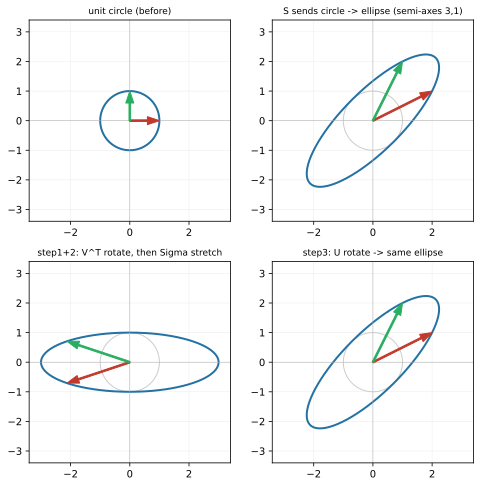

# ch19 — 奇異值分解：每個矩陣都是旋轉—伸縮—旋轉

> **本章解決什麼問題**：這是 Part VI 的開場，也是全書「最一般的形狀定理」。前面十八章我們把矩陣讀成動詞、看它拉方格網、找特徵向量、把對稱矩陣對角化成 QΛQᵀ（ch18）。但特徵分解有個刺眼的限制：它只對方陣談、而且不是每個方陣都能對角化（剪切就 defective，ch13），更別說長方形矩陣根本沒有「特徵值」可言。本章給出沒有任何例外的版本——**奇異值分解（singular value decomposition, SVD）**：**任何**矩陣，不論方不方、滿不滿秩、對不對稱、能不能對角化，都可以寫成 A=UΣVᵀ，也就是「旋轉 → 沿垂直軸各自伸縮 → 旋轉」三步。它的幾何後果一句話就能講完，而且漂亮到值得停下來：**單位圓在任何線性變換下永遠變成橢圓，橢圓的半軸長就是奇異值。** 對稱正定的脊椎矩陣 S 在這裡走到第七層——它的 SVD 恰好就是它的特徵分解（σ=3、1，U=V=Q），這是兩種分解在最乖的矩陣上合而為一。低秩近似與 PCA（怎麼用 SVD 壓縮、降維）留 ch20；SVD 的數值演算法只點一句；一般 n 維的完整存在性證明指向延伸閱讀。

開始前把全書一律遵守的台灣慣例釘死一次：**行（直行，column）是矩陣縱向的一排、列（橫列，row）是橫向的一排**——這跟中國大陸的用法剛好相反（見 landscape 與 ch05）。本章 U、V 的「行」一律指直行 column（它們的行就是那組正交基向量）。還有用詞：我們講「特徵值／特徵向量」「奇異值」，**絕不寫「本徵值／本征向量」「奇异值」**（那是大陸用語）。

這是 Part VI 的開場，按慣例先把全書地圖攤開，標出你現在站在哪：

```text
Part I 向量與空間          Part II 矩陣即變換        Part III 行列式與秩
ch01 為什麼是線性          ch05 矩陣是動詞       →   ch09 行列式即面積
ch02 向量三張臉        →   ch06 乘法即合成           ch10 秩與四子空間
ch03 span 與基底           ch07 解 Ax=b                    │
ch04 座標與換基底          ch08 逆與不可逆                 ↓
                                                     Part IV 特徵值
Part VI SVD 與收官 ◄你在這裡  Part V 正交與近似      ch11 特徵向量 ★
ch19 SVD              ←   ch15 內積              ←  ch12 旋轉逼出複數
ch20 低秩近似與 PCA        ch16 投影與最小平方       ch13 對角化 ★
ch21 PageRank 馬可夫       ch17 正交基與 QR          ch14 矩陣的冪
ch22 總收官 ★             ch18 對稱與譜定理         ★＝最大驚嘆點
```

## 從你已知的出發

你其實已經用過 SVD 的結果，只是它被包進別的名字裡。本章要做的是把那個結果底下的幾何攤開——而且攤開之後你會發現，它比你想的乾淨太多。

**SVD 是「資料的主軸＋強度」的萬用工具。** 你聽過推薦系統的「潛在因子（latent factor）」、聽過降維、聽過去雜訊——這些底下幾乎都是同一台引擎在跑。把一張「使用者 × 電影」的評分表當成一個矩陣 A（長方形的，使用者數不等於電影數，所以**根本不是方陣、沒有特徵值可談**），SVD 會替你找出幾個「潛在口味方向」（動作片愛好者、文藝片愛好者……），以及每個方向**有多強**。那個「有多強」就是奇異值。奇異值大的方向＝資料裡能量最集中的方向，奇異值小的方向＝幾乎沒人在乎的雜訊。**把小奇異值砍掉，就是壓縮與去雜訊**——這正是 ch20 的主場（低秩近似、影像壓縮、PCA），本章先把「奇異值是什麼、為什麼任何矩陣都有」這塊地基鋪死。

**奇異值大小＝各方向的「能量」排序。** 你做過 profiling，知道「先優化佔比最大的那段」是省力氣的鐵律——你不會去調一個只佔 0.3% 的函式。SVD 對矩陣做的是一樣的事：它把一個變換拆成「幾個互相垂直的伸縮方向」，並按伸縮強度（奇異值）從大到小排好。σ₁≥σ₂≥…≥0，最大的那個方向吃掉最多「能量」。要降維、要壓縮，就從尾巴（小奇異值）開始砍——砍掉的是貢獻最小的方向，所以損失最小。**SVD 給你的，就是一個變換的「能量分佈排行榜」。**

**條件數＝σ_max/σ_min，ch08 那個病態矩陣現在有了精確定義。** ch08 講逆矩陣時，我埋了一個沒講清楚的東西：有些矩陣 det≠0、明明可逆，但你解出來的答案完全不能信，因為輸入的微小誤差會被放大到爆。我當時只給了「條件數（condition number）」這個名字和直覺，沒給定義——因為定義要等到 SVD。現在可以補上了：**矩陣的（2-範數）條件數 κ(A)=σ_max/σ_min，最大奇異值除以最小奇異值**（2026-06，這是標準定義）。它量的是「這個變換把空間在最被拉長的方向相對最被壓扁的方向，差了幾倍」——差越多，逆運算越會把某個方向的誤差放大，系統越病態。脊椎 S 的奇異值是 3 和 1，所以 κ(S)=3/1=3，非常健康。ch08 那個 [[1,1],[1,1.0001]] 的條件數高達數萬——現在你知道那個數字從哪來了。

把這三個錨點收成一句帶進本章：**SVD 把任何矩陣（不論形狀）拆成「幾個互相垂直的伸縮方向＋各自的強度」，強度就是奇異值——這同時是壓縮的依據、能量的排行榜、和病態的精確刻度。** 而它的幾何，乾淨到只有一句話：圓變橢圓。

## SVD：旋轉 → 伸縮 → 旋轉，沒有例外

先把主角的形狀和它的承諾一次說清楚，再回頭一條條兌現——重點是「為什麼任何矩陣都行」，這是它勝過特徵分解的全部理由。

**奇異值分解**說：任何 m×n 實矩陣 A 都可以寫成三個矩陣相乘

```text
A = U Σ Vᵀ

其中
  V 是 n×n 正交矩陣   ← 輸入端的旋轉（Vᵀ 先把輸入轉個角度）
  Σ 是 m×n 對角矩陣   ← 沿座標軸各自伸縮，對角元 σ₁≥σ₂≥…≥0 全非負（奇異值）
  U 是 m×m 正交矩陣   ← 輸出端的旋轉（最後把結果轉個角度）
```

「正交矩陣」回收 ch17——它的行是一組單範正交向量，幾何上是純旋轉（或加反射），不拉歪、不改長度、逆＝轉置（Vᵀ=V⁻¹）。「Σ 對角非負」是說它只在座標軸方向做伸縮，每個軸乘一個非負的數 σᵢ。把三步連起來讀，就是本章的標題：

```text
A 作用在一個向量上 = 先用 Vᵀ 轉個角度 → 再用 Σ 沿各座標軸各自伸縮 → 再用 U 轉個角度
                        旋轉              伸縮                      旋轉
```

這就是全章最該記死的一句：**每一個線性變換，不論它長得多亂，本質上都只是「轉一下、沿幾條互相垂直的軸各自拉伸、再轉一下」。** 沒有第四種動作，沒有例外。剪切看起來把方格網拉歪、旋轉看起來在轉、投影看起來在壓扁——SVD 說它們全都是這三步的組合。

### 圓永遠變橢圓：本章最大的驚嘆點

把上面那句話翻成一張你能在腦裡播放的畫面，就得到 SVD 最漂亮的幾何後果。

拿一個單位圓（所有長度 1 的向量的集合）。用 Vᵀ 轉它——**圓轉了還是圓**（旋轉不改形狀）。用 Σ 沿座標軸伸縮——**圓被拉成一個軸對齊座標軸的橢圓**，x 方向半軸 σ₁、y 方向半軸 σ₂。再用 U 轉它——**橢圓轉了還是橢圓**（只是斜了）。

所以不管 A 是什麼：

```text
A 把單位圓送成一個橢圓，橢圓的半軸長 = A 的奇異值 σ₁、σ₂、…
```

**這對任何矩陣都成立，這就是驚嘆點。** 你給我一個剪切、一個旋轉、一個隨便亂填的 2×2、甚至一個把平面壓成線的奇異矩陣——我把單位圓丟進去，出來的永遠是橢圓（壓扁的情形是退化橢圓＝線段，因為某個 σ=0）。橢圓的半軸方向告訴你「這個變換把空間往哪幾個垂直方向拉」，半軸長（奇異值）告訴你「各拉了幾倍」。一個圓進去，一個橢圓出來，中間那台機器的全部祕密就寫在橢圓的軸上。我認為這是整本書最值得在腦裡反覆播放的一個畫面——它把「線性變換」這個抽象詞，壓縮成一句你看得見的話。

（這也回頭解釋了一件 ch18 埋的事：對稱矩陣的二次型等值線是橢圓，那是「把 S 當純量函數」的橢圓；這裡是「把 A 當變換作用在圓上」的橢圓，兩者是不同的橢圓、軸長關係還相反——陷阱段會把它們分清楚。）

下面這張圖把脊椎 S 的這件事畫出來，並把三步拆開。看點只有一個——**圓進去、橢圓出來，半軸長就是奇異值 3 和 1**：



讀這張圖：上排右邊那個藍橢圓，最長的半軸是 3（沿著 (1,1) 方向）、最短的半軸是 1（沿著 (1,−1) 方向）——這兩個數就是 S 的兩個奇異值。下排是把這個變換誠實拆成「Vᵀ 轉 → Σ 沿座標軸拉成正放橢圓 → U 轉成斜橢圓」三步，最後一格跟上排右邊完全相同。對稱矩陣的特殊之處（下一節細講）是 U=V，於是這「轉出去、轉回來」恰好把橢圓的軸擺回特徵向量方向。

### 奇異值 vs 特徵值：為什麼 SVD 沒有例外而特徵分解有

這是本章的核心對照，也是「SVD 比特徵分解一般」的全部理由。把兩者並排：

```text
特徵分解  A = P Λ P⁻¹    需要：A 是方陣、且湊得齊一組特徵基底（不一定有！剪切就湊不齊）
                          P 不保證正交、Λ 可能含複數（旋轉就含）
SVD       A = U Σ Vᵀ     永遠存在：任何 m×n 矩陣都行
                          U、V 都正交、Σ 全非負實數
```

差別的根源是：特徵分解問的是「**同一組**方向，作用前後只伸縮不轉向嗎？」——這要求輸入方向和輸出方向是同一條，太苛刻，很多矩陣做不到（旋轉把每個方向都轉走、剪切的特徵方向不夠）。SVD 問的是更鬆的問題：「有沒有**一組**正交方向（V 的行），它們被 A 送到**另一組**正交方向（U 的行）、各自只拉伸 σᵢ 倍？」——輸入端和輸出端**允許是兩組不同的正交基**。這個鬆綁，就是 SVD 永遠有解的關鍵：你不再要求「方向不轉」，只要求「正交送到正交」，而這對任何矩陣都辦得到。

**奇異值怎麼算？σ＝AᵀA 特徵值的平方根**（2026-06，這是標準關係）。理由可以兩行看出來：考慮對稱矩陣 AᵀA（它一定對稱，因為 (AᵀA)ᵀ=AᵀA，所以 ch18 的譜定理保證它能正交對角化、特徵值全是實數而且非負）。把 A=UΣVᵀ 代進去：

```text
AᵀA = (UΣVᵀ)ᵀ(UΣVᵀ) = V ΣᵀUᵀ U Σ Vᵀ = V Σᵀ Σ Vᵀ    ← 因為 UᵀU=I（U 正交）
                                     = V (Σ²) Vᵀ      ← ΣᵀΣ 是對角、元素為 σᵢ²
```

最後一行就是 AᵀA 的特徵分解：**V 的行是 AᵀA 的特徵向量，AᵀA 的特徵值是 σᵢ²。** 所以**奇異值 σᵢ＝√(AᵀA 的第 i 個特徵值)**——而 AᵀA 對稱半正定、特徵值必非負，所以開根號永遠開得出實數，σ 永遠是非負實數。這就是 SVD「永遠存在」在代數上的擔保：它把「找 A 的分解」轉化成「對對稱矩陣 AᵀA 做譜定理」，而譜定理對任何對稱矩陣都成立（ch18），於是 SVD 對任何 A 都成立。

（嚴謹度標示：上面這串是**已知 SVD 存在後**推出 σ²＝AᵀA 特徵值的關係，外加「AᵀA 對稱半正定」這個確實成立的事實，足以讓你親手算任何矩陣的奇異值。但「SVD 必定存在」的完整存在性證明——要從 AᵀA 的譜分解反過來構造出 U——本書不展開，它要處理零奇異值與秩虧空的細節，指向延伸閱讀的 Strang 與 Axler。本章給的是直覺＋脊椎與剪切上的完整手算驗證。）

兩個免費的回收，當驗算哨兵：

- **秩＝非零奇異值的個數**（回收 ch10）。把平面壓成線的奇異矩陣，有一個 σ=0（那個方向被壓扁、半軸長 0、橢圓退化成線段）；秩幾就是有幾個非零奇異值。SVD 是判斷秩最誠實的工具——它不像「行是否相依」那樣對數值誤差敏感，小奇異值多接近 0 一目了然。
- **σ₁σ₂…σₙ＝|det A|**（回收 ch09，方陣時）。所有奇異值連乘＝行列式的絕對值，因為橢圓的面積＝π·σ₁·σ₂、單位圓面積＝π，面積放大倍率就是 |det|（ch09 說 det 是有號面積倍率），所以 σ₁σ₂=|det|。注意是絕對值——奇異值全非負、丟掉了定向的正負號（翻不翻面由 U、V 的反射成分管）。

### 脊椎 S 第七層：SVD＝特徵分解（對稱正定的特例）

把脊椎 **S=[[2,1],[1,2]]** 的 SVD 從頭算到尾，你會看到一件漂亮的事：對這個矩陣，SVD 和特徵分解（ch18 的 QΛQᵀ）**是同一個東西**。這不是巧合，是「對稱正定」這個性質的直接後果。

ch11／ch18 已經知道 S 的特徵值是 3、1，單範正交特徵向量是 (1,1)/√2（λ=3）與 (1,−1)/√2（λ=1）。先用上一節的公式算奇異值，確認它跟特徵值對上：

```text
S 對稱，所以 SᵀS = S·S = S² = | 5  4 |    （ch14：S² 的基準值）
                              | 4  5 |

S² 的特徵值：因為 S 的特徵值是 3、1，S² 的特徵值就是 3²、1² = 9、1（回收 ch14：A² 的特徵值是 A 特徵值的平方）

奇異值 σ = √(S² 的特徵值) = √9、√1 = 3、1    ✓
```

奇異值 σ=3、1，**恰好等於 S 的特徵值 3、1**。為什麼會這麼剛好？因為 S 對稱正定（特徵值全正，ch18 驗過）：

```text
對稱：           AᵀA = S²，特徵值是 λ²，所以 σ = √(λ²) = |λ|
正定（λ>0）：    |λ| = λ，所以 σ = λ 直接相等（沒有絕對值的麻煩）
```

對一般矩陣，奇異值 σ=|λ|·（某種扭曲），跟特徵值八竿子打不著（剪切下一節就會看到 σ 和 λ 完全不同）。但**對稱正定矩陣的奇異值恰好就是它的特徵值**，而且整個分解合而為一：

```text
特徵分解（ch18）：  S = Q Λ Qᵀ     Q=(1/√2)[[1,1],[1,−1]]，Λ=diag(3,1)
SVD（本章）：       S = U Σ Vᵀ     U = V = Q，Σ = Λ = diag(3,1)

對稱正定時：U = V = Q，Σ = Λ —— 兩種分解是同一個！
```

驗算一下「U=V=Q」確實給出 S（這同時就是 ch18 算過的 QΛQᵀ，這裡再確認 SVD 的形狀對）：

```text
UΣVᵀ = Q Λ Qᵀ = (1/√2)|1   1| |3  0| (1/√2)|1   1|
                       |1  −1| |0  1|        |1  −1|

     = (1/2) |3   1| |1   1|   = (1/2)| 4   2 | = | 2   1 | = S    ✓
             |3  −1| |1  −1|          | 2   4 |   | 1   2 |
```

精準等於 S。所以脊椎的第七層成立：**S 的 SVD 就是它的特徵分解**，奇異值 3、1＝特徵值 3、1，U=V=Q＝那個旋轉 45° 到特徵軸的正交矩陣。對應到圓變橢圓的圖：單位圓被 S 送成半軸 3（沿 (1,1)）、1（沿 (1,−1)）的橢圓——半軸長就是奇異值，半軸方向就是特徵向量。

把這層的意義收成一句：**對稱正定矩陣是「SVD 和特徵分解重合」的那類最乖的矩陣——輸入端的旋轉和輸出端的旋轉是同一個（U=V），於是 SVD 的奇異值退化成特徵值，圓變橢圓的軸退化成特徵軸。** 一旦離開對稱正定（下一節的剪切），這兩件事就分家——而 SVD 照樣存在，特徵分解卻可能垮掉。

驗算哨兵也對得上：σ₁σ₂=3·1=3=|det S|（ch09 算過 det S=3 ✓）；兩個奇異值都非零，秩 2 ✓；條件數 κ(S)=3/1=3。

### 對照剪切：連特徵分解都沒有的矩陣，SVD 照樣給你三步

現在看反例，這是本章對照 ch13 的驚嘆點：剪切 **H=[[1,1],[0,1]]** 是 ch13 的「不可對角化（defective）」主角——它的特徵值 1 是重根、只有一條特徵向量 (1,0)、湊不齊基底，所以**它沒有特徵分解**。但 SVD 對它毫無困難，照樣把它拆成旋轉—伸縮—旋轉。算給你看。

奇異值＝√(HᵀH 的特徵值)：

```text
HᵀH = |1  0| |1  1| = | 1   1 |
      |1  1| |0  1|   | 1   2 |

特徵方程 det(HᵀH − λI) = (1−λ)(2−λ) − 1·1
                      = 2 − 3λ + λ² − 1
                      = λ² − 3λ + 1 = 0

λ = (3 ± √5)/2 = (3 ± 2.23607)/2   （√5≈2.23607）
  λ₁ = (3 + 2.23607)/2 ≈ 2.61803
  λ₂ = (3 − 2.23607)/2 ≈ 0.38197
```

奇異值是這兩個特徵值的平方根：

```text
σ₁ = √2.61803 ≈ 1.61803     ← 黃金比 φ = (1+√5)/2 ！
σ₂ = √0.38197 ≈ 0.61803     ← 1/φ = (−1+√5)/2

（為什麼是黃金比：σ₁² = (3+√5)/2 = φ²，因為 φ² = φ+1 = (3+√5)/2；同理 σ₂ = 1/φ。
  黃金比在 ch14 從 Fibonacci 矩陣的特徵值掉出來過，這裡從剪切的奇異值再掉一次。）
```

驗算哨兵：

```text
σ₁σ₂ = φ · (1/φ) = 1 = |det H|    ✓   （剪切 det=1，面積不變，ch09）
```

奇異值的乘積是 1，跟 |det H|=1 對上——這跟「剪切不改面積」完全一致：它把單位圓送成一個面積不變（=π）的橢圓，一個方向拉長到 φ≈1.618 倍、另一個方向壓短到 1/φ≈0.618 倍，拉長與壓短剛好抵消（φ·1/φ=1）。

停下來看這件事的份量，它就是本章對照 ch13 的全部驚嘆：

```text
剪切 H=[[1,1],[0,1]]
  特徵值：1（重根）       → 只有一條特徵向量 (1,0) → defective → 沒有特徵分解（ch13）
  奇異值：φ≈1.618、1/φ≈0.618 → 兩個都正、互相垂直的伸縮方向 → SVD 照常存在
```

特徵值（都是 1）和奇異值（φ 和 1/φ）**完全是兩回事**——這是「奇異值≠特徵值」最清楚的例子。一個連特徵分解都沒有的矩陣，SVD 卻乾乾淨淨地告訴你：剪切其實就是「轉一個角度、沿兩條垂直軸分別拉 1.618 倍和 0.618 倍、再轉一個角度」。剪切看起來把方格網拉歪、不是純伸縮，但 SVD 說只要先轉到對的角度，它就是純伸縮。**SVD 沒有 defective 這回事——這是它比特徵分解強壯的全部理由，也是「最一般的形狀定理」這個稱號的由來。**

歷史插曲，當一個「好東西被獨立發明好幾次」的例子：SVD 不是某一個人的發明。**最早是貝爾特拉米（Eugenio Beltrami）1873 年與若爾當（Camille Jordan）1874 年各自獨立得到**（2026-06，見 landscape 與下文查證），他們發現雙線性形式（以矩陣表示）的奇異值在正交代換下構成一組完整不變量。**西爾維斯特（James Joseph Sylvester）1889 年**又對實方陣獨立得到一次（看似不知道前兩人的工作），給了計算方法但寫得晦澀。提醒：這個若爾當是法國數學家 Camille Jordan（Jordan 標準形那位），不是 Gauss–Jordan 消去法的測地學家 Wilhelm Jordan——線代史上有三個 Jordan，別搞混（見 ch13 與 landscape）。「把 SVD 推廣到長方矩陣、並證明截斷 SVD 給最佳低秩近似」是艾克哈特與楊（Eckart–Young）1936 年的事，那是 ch20 的主角，本章不展開。

## 直覺的陷阱

SVD「形狀乾淨、但有幾個概念極易混淆」的點。下面四個是你（機械操作沒問題、語意生鏽的資深工程師）最可能踩的，每個附「怎麼自我察覺」。

| 陷阱 | 錯誤直覺長什麼樣 | 會在哪一步把你帶溝裡 | 怎麼自我察覺 |
|---|---|---|---|
| **以為只有方陣／可對角化的矩陣才能分解** | 「分解＝特徵分解，所以要方陣、要能對角化、要有完整特徵基底」 | 對長方矩陣（推薦表、資料矩陣）或 defective 矩陣（剪切）束手無策，以為「沒救」 | **SVD 對任意 m×n 矩陣都存在**，不管方不方、滿不滿秩、能不能對角化。它把問題轉成「對 AᵀA 做譜定理」，而 AᵀA 永遠對稱、譜定理永遠適用。剪切沒有特徵分解，但 SVD 給它 φ、1/φ 兩個奇異值。看到長方形或 defective 別想特徵分解，想 SVD。 |
| **把奇異值與特徵值混為一談** | 「σ 就是 λ 吧，反正都是矩陣的『那些數』」 | 非對稱時 σ 和 λ 是兩組完全不同的數，混用會算錯能量、條件數、秩 | **只有對稱正定矩陣 σ=λ**（脊椎 S：σ=λ=3,1）。一般情形 σ=√(AᵀA 的特徵值)，跟 λ 無關：剪切的 λ 全是 1（重根），σ 卻是 φ、1/φ。旋轉的 λ 是複數 e^{±iθ}，σ 卻都是 1（旋轉不改長度、圓還是圓）。看到「奇異值」先問：這矩陣對稱正定嗎？不是就別拿特徵值頂替。 |
| **忽略 U 和 V 是兩組不同的正交基** | 「A=UΣVᵀ，U 和 V 應該差不多／是同一個吧」 | 自己重建 SVD 時把 V 當 U 用，或以為輸入軸＝輸出軸，幾何全錯 | **V 的行是輸入端的正交軸（被送進去的那組）、U 的行是輸出端的正交軸（送出來的那組），是兩組不同的基**——V 的行是 AᵀA 的特徵向量、U 的行是 AAᵀ 的特徵向量。圓上那組垂直的方向（V）被 A 送到橢圓上另一組垂直的方向（U），中間各拉 σᵢ 倍。**只有對稱矩陣 U=V**（輸入軸＝輸出軸），那是特例不是通則。 |
| **以為 det 小才是真危險（病態看 det）** | 「det 接近 0＝快不可逆＝危險；det 大就安全」 | 用 det 判斷數值穩定性，被縮放騙過——病態跟 det 大小沒有直接關係 | **病態看條件數 κ=σ_max/σ_min，不是看 det**。det＝σ 連乘，會被整體縮放影響：把矩陣乘以 1000，det 暴增十億倍，但條件數（比值）完全不變、病態程度一模一樣。反過來，[[1000,0],[0,0.001]] 的 det=1（看起來「正常」），條件數卻是 10⁶（極病態）。**det 量的是面積倍率，條件數量的是「最伸 vs 最壓」的比值**——後者才是「輸入微動、輸出暴走」的刻度（回收 ch08）。 |

把第二、三個陷阱合成一句你能口頭講的：**奇異值不是特徵值（除非對稱正定）、U 不是 V（除非對稱）——SVD 之所以比特徵分解一般，正是因為它鬆綁了「輸入軸＝輸出軸」「σ＝λ」這兩個特徵分解的隱含假設。** 第四個陷阱（病態看條件數不看 det）單獨記死，它是 ch08 那筆帳的結清，也是工程裡用 det 判穩定性最常見的錯。

## 紙上推演

### 推演題

**第 1 題 ★ [8 分鐘]——對角矩陣的顯然 SVD**
矩陣 D=[[4,0],[0,−3]]。(a) 直接寫出它的 SVD：A=UΣVᵀ（提示：對角矩陣的奇異值就是對角元的絕對值，但負號要塞進 U 或 V 的反射裡，且 Σ 要按大到小排）；(b) 它把單位圓送成什麼橢圓（半軸長、半軸方向）？(c) 驗算 σ₁σ₂ 是否等於 |det D|。

**第 2 題 ★★ [15 分鐘]——用「圓→橢圓」解釋奇異值是什麼**
不準算任何特徵方程。給一個變換 A，它把單位圓送成一個橢圓，長半軸 5（沿 (3,4)/5 方向）、短半軸 2（沿 (−4,3)/5 方向）。(a) A 的兩個奇異值各是多少？(b) U 的兩行（輸出端正交軸）是哪兩個向量？(c) A 的條件數是多少？(d) det A 的絕對值是多少？(e) 用一句話講「奇異值在這張圖裡是什麼」。

**第 3 題 ★★ [12 分鐘]——剪切的奇異值（黃金比再現）**
剪切 H=[[1,1],[0,1]]。(a) 寫出 HᵀH 並求它的兩個特徵值；(b) 求 H 的兩個奇異值，並認出它們是 φ 與 1/φ；(c) 驗算 σ₁σ₂=|det H|；(d) 用一句話說明：H 沒有特徵分解（defective），為什麼它還有 SVD？

**第 4 題 ★★★ [10 分鐘]——找出論證的破綻**
某人主張：「任何方陣 A 的奇異值就是它特徵值的絕對值，因為 SVD 和特徵分解都是把矩陣拆成『伸縮』，伸縮倍率當然一樣。」這個結論一般是錯的。(a) 指出論證裡站不住的地方；(b) 各舉一個反例：一個「特徵值是複數、奇異值卻是實數」的矩陣，和一個「特徵值是重根 1、奇異值卻不是 1」的矩陣；(c) 補一句：什麼條件下這個主張才對？

### 推演解答

**第 1 題。** D=[[4,0],[0,−3]]。

(a) 奇異值＝對角元絕對值，由大到小排：σ₁=4、σ₂=3，所以 Σ=diag(4,3)。負號要藏進正交矩陣的反射裡。一個乾淨的寫法：V=I（輸入不轉），U=diag(1,−1)（在第二軸做反射，把那個負號吸收掉）：

```text
D = U Σ Vᵀ = |1  0| |4  0| |1  0| = |1  0| |4  0| = | 4   0 | = D    ✓
             |0 −1| |0  3| |0  1|   |0 −1| |0  3|   | 0  −3 |
```

（SVD 不唯一——負號塞 U 或塞 V 都行，這是「U、V 各差一個反射」的自由度，無妨。）

(b) 單位圓被送成半軸 4（沿 x 軸）、3（沿 y 軸）的橢圓——y 方向那一半還被反射（上下翻），但橢圓的形狀（半軸長）不變。

(c) σ₁σ₂=4·3=12；|det D|=|4·(−3)−0|=12。**相等 ✓**。

**第 2 題。** 圓→橢圓，長半軸 5 沿 (3,4)/5、短半軸 2 沿 (−4,3)/5。

(a) **奇異值就是半軸長：σ₁=5、σ₂=2**（這就是奇異值的幾何定義——圓被送成橢圓的半軸長，整題不需要任何特徵方程）。

(b) **U 的兩行＝輸出端橢圓的半軸方向（單位化）：u₁=(3,4)/5=(0.6,0.8)、u₂=(−4,3)/5=(−0.8,0.6)**（驗證正交：(3,4)·(−4,3)=−12+12=0 ✓，兩個都單位長 ✓）。

(c) 條件數 κ=σ_max/σ_min=5/2=**2.5**。

(d) |det A|=σ₁σ₂=5·2=**10**（面積放大 10 倍）。

(e) **奇異值就是「單位圓被這個變換拉成橢圓後，各半軸的長度」**——一個方向拉 5 倍、垂直方向拉 2 倍。這題的全部重點：奇異值是個幾何量（伸縮倍率），看橢圓就讀得出來，不必碰代數。

**第 3 題。** H=[[1,1],[0,1]]。

(a) HᵀH=[[1,0],[1,1]][[1,1],[0,1]]=[[1,1],[1,2]]。特徵方程 (1−λ)(2−λ)−1=λ²−3λ+1=0 → **λ=(3±√5)/2≈2.61803 與 0.38197**。

(b) σ=√λ：σ₁=√2.61803≈**1.61803=φ**、σ₂=√0.38197≈**0.61803=1/φ**。（φ²=(3+√5)/2 確認 σ₁²=λ₁。）

(c) σ₁σ₂=φ·(1/φ)=**1**；|det H|=|1·1−1·0|=1。**相等 ✓**（剪切不改面積，圓→面積不變的橢圓，一軸拉 φ、一軸壓 1/φ 抵消）。

(d) H 的特徵值是重根 1、只有一條特徵向量 (1,0)，湊不齊兩個獨立特徵向量，所以 defective、沒有特徵分解（ch13）。**但 SVD 不要求「特徵方向」——它要求「一組正交方向被送到另一組正交方向」，這透過對 HᵀH（永遠對稱、永遠可譜分解）取特徵向量就辦到了。** HᵀH 對稱，譜定理保證它有兩個正交特徵向量 → 給出 V 的兩行 → SVD 成立。特徵分解的條件（自己對角化）苛刻，SVD 的條件（AᵀA 對角化）永遠滿足。

**第 4 題。**

(a) **破綻**：「SVD 和特徵分解都是『伸縮』」這句把兩件不同的事當成同一件。特徵分解要求**同一組方向**作用前後只伸縮不轉（輸入軸＝輸出軸），SVD 只要求**一組正交方向被送到另一組正交方向**（輸入軸 V≠輸出軸 U）。一般矩陣的 σ=√(AᵀA 的特徵值)，跟 A 自己的特徵值 λ 沒有直接關係，更不是 |λ|。

(b) 反例一（複特徵值、實奇異值）：**旋轉 R(90°)=[[0,−1],[1,0]]**，特徵值是複數 ±i（ch12），但它把單位圓送成單位圓（旋轉不改長度），所以兩個**奇異值都是 1**（實的）。複 λ vs 實 σ，差很遠。反例二（重根 λ、非 1 的 σ）：**剪切 [[1,1],[0,1]]**，特徵值是重根 1，但奇異值是 φ≈1.618 與 1/φ≈0.618（第 3 題算過），都不是 1。

(c) **條件**：當 A **對稱且正定**時，σ=λ 才成立（脊椎 S：σ=λ=3,1）。對稱讓 U=V、特徵值為實；正定讓特徵值為正、|λ|=λ 不必取絕對值。離開對稱正定，這個主張就垮。

### 動手生圖

本章的圖（脊椎 S 把單位圓送成半軸 3、1 的橢圓，並把變換拆成 Vᵀ→Σ→U 三步）由以下腳本產生。它同時就是你的小實驗：跑它、改它、重生它。

```python
# ch19 figure: SVD sends the unit circle to an ellipse, in three steps.
# Top: unit circle + grid sent by spine S=[[2,1],[1,2]] to an ellipse (semi-axes 3,1).
# Bottom: the same map factored as V^T (rotate) -> Sigma (stretch on axes) -> U (rotate).
# Spine S is symmetric positive definite, so U=V=Q and the singular values 3,1 ARE its eigenvalues.
from pathlib import Path
import numpy as np
import matplotlib
matplotlib.use("Agg")          # headless; no display needed
import matplotlib.pyplot as plt

OUT = Path(__file__).resolve().parent / "out" / "ch19-svd-circle-ellipse.svg"
OUT.parent.mkdir(parents=True, exist_ok=True)

S = np.array([[2.0, 1.0], [1.0, 2.0]])           # spine: singular values 3 and 1
U, sig, Vt = np.linalg.svd(S)                     # S = U diag(sig) Vt
th = np.linspace(0, 2 * np.pi, 400)
circ = np.vstack([np.cos(th), np.sin(th)])        # unit circle
e1 = np.array([1.0, 0.0]); e2 = np.array([0.0, 1.0])

def draw(ax, M, title, base):                     # plot M @ (circle, e1, e2) over a base grid
    P = M @ circ
    ax.plot(circ[0], circ[1], color="0.8", lw=1.0)            # faint unit circle
    ax.plot(P[0], P[1], color="#2471a3", lw=2.0)              # image curve
    for v, col in [(e1, "#c0392b"), (e2, "#27ae60")]:
        w = M @ v
        ax.annotate("", xy=w, xytext=(0, 0), arrowprops=dict(color=col, width=1.6, headwidth=8))
    ax.set_title(title, fontsize=9)
    ax.set_xlim(-3.4, 3.4); ax.set_ylim(-3.4, 3.4); ax.set_aspect("equal")
    ax.axhline(0, color="0.7", lw=0.5); ax.axvline(0, color="0.7", lw=0.5)
    ax.grid(True, color="0.92", lw=0.5)

fig, ax = plt.subplots(2, 2, figsize=(8, 8))
draw(ax[0, 0], np.eye(2), "unit circle (before)", None)
draw(ax[0, 1], S, "S sends circle -> ellipse (semi-axes 3,1)", None)
draw(ax[1, 0], np.diag(sig) @ Vt, "step1+2: V^T rotate, then Sigma stretch", None)
draw(ax[1, 1], U @ np.diag(sig) @ Vt, "step3: U rotate -> same ellipse", None)
fig.savefig(OUT, bbox_inches="tight")
print("wrote", OUT)             # build_figures.py reads this
```

**預期輸出**：一張 2×2 的圖。

- 上排左：一個淡灰單位圓（變換前）。
- 上排右：藍色橢圓＝S 把單位圓送出去的樣子，最長半軸 3（沿 (1,1) 方向）、最短半軸 1（沿 (1,−1) 方向）；紅綠箭頭是 ê₁、ê₂ 被 S 搬到的去向 (2,1)、(1,2)。
- 下排左：先做 Vᵀ（旋轉）再做 Σ＝把圓伸成**正放**的橢圓（半軸 3 沿 x、1 沿 y）。
- 下排右：再做 U（旋轉），轉成跟上排右**一模一樣**的斜橢圓。

確認三個數值：兩條半軸長是 **3 和 1**（＝奇異值＝S 的特徵值，因為 S 對稱正定）；橢圓面積／單位圓面積 = 3·1 = 3 = det S；最長半軸沿 (1,1)、最短沿 (1,−1)（＝特徵向量，這是對稱矩陣才有的巧合）。

**改參數看什麼**（把概念玩活的地方）：

- **換成剪切看橢圓半軸＝奇異值（但不再＝特徵值）**：把 `S` 換成 `np.array([[1.,1.],[0.,1.]])`。`np.linalg.svd` 會回傳奇異值 `sig≈[1.618, 0.618]`（黃金比 φ 與 1/φ），橢圓的長短半軸正是這兩個數——但剪切的特徵值是重根 1，跟奇異值完全不同。這就是「奇異值≠特徵值」的眼見為憑：圓還是被送成乾淨的橢圓，半軸是 φ 和 1/φ。
- **對稱矩陣時 U=V，看「轉出去再轉回來」**：脊椎 S 對稱，印 `U` 和 `Vt.T` 會看到它們相等（U=V=Q）。換成不對稱矩陣（如剪切）後，`U` 和 `V` 就分家了——下排左圖的「正放橢圓」被 U 轉到的角度，跟對稱情形不同。
- **換奇異矩陣看橢圓退化成線段**：把 `S` 換成 `np.array([[1.,2.],[2.,4.]])`（兩行相依，det=0）。一個奇異值會是 0，橢圓被壓扁成一條線段（半軸長 0 的「橢圓」）——這就是「秩＝非零奇異值個數」的字面現身（此矩陣秩 1）。

## 自我檢核

口頭自答；講得出來才算過關，卡住就回到對應段落。

1. **SVD 在說什麼？三步各是什麼？**（核心）任何 m×n 矩陣 A=UΣVᵀ＝「Vᵀ 旋轉（輸入端）→ Σ 沿各座標軸伸縮（奇異值 σ₁≥σ₂≥…≥0）→ U 旋轉（輸出端）」。每個線性變換本質上都是「轉一下、沿幾條垂直軸各自拉伸、再轉一下」，沒有第四種動作、沒有例外。
2. **「單位圓永遠變橢圓」是什麼意思？奇異值在這張圖裡是什麼？**（驚嘆點）不管 A 是什麼，把單位圓丟進去出來的永遠是橢圓（壓扁時退化成線段）；橢圓的半軸長就是奇異值、半軸方向就是 U 的行。奇異值＝這個變換把空間在各垂直方向拉的倍率。
3. **奇異值和特徵值差在哪？什麼時候相等？**（必答）σ=√(AᵀA 的特徵值)，跟 A 自己的 λ 一般無關。剪切 λ 全是 1、σ 卻是 φ 與 1/φ；旋轉 λ 是複數、σ 都是 1。**只有對稱正定時 σ=λ**（脊椎 S：σ=λ=3,1）——對稱讓 U=V、λ 實，正定讓 λ>0、|λ|=λ。
4. **為什麼 SVD 對「連特徵分解都沒有」的矩陣還是存在？**（核心、本章招牌）因為 SVD 不要求「同一組方向作用前後不轉」（這太苛刻，剪切做不到），只要求「一組正交方向被送到另一組正交方向」——而這透過對 **AᵀA 取特徵向量**就辦到了。AᵀA 永遠對稱、半正定，譜定理（ch18）對它永遠適用、特徵值永遠非負，所以 σ=√(那些特徵值) 永遠開得出實數。特徵分解的條件（自己可對角化）苛刻；SVD 的條件（AᵀA 可對角化）永遠成立。
5. **U 和 V 是同一組基嗎？**（陷阱）不是。V 的行是輸入端的正交軸（AᵀA 的特徵向量）、U 的行是輸出端的正交軸（AAᵀ 的特徵向量），是兩組不同的基。圓上那組垂直方向（V）被送到橢圓上另一組垂直方向（U）。**只有對稱矩陣 U=V**。
6. **脊椎 S 的 SVD 和它的特徵分解什麼關係？** 重合——S 對稱正定，所以 U=V=Q、Σ=Λ=diag(3,1)，SVD 就是 ch18 的 QΛQᵀ。奇異值 3、1＝特徵值 3、1，單位圓被送成半軸 3（沿 (1,1)）、1（沿 (1,−1)）的橢圓。
7. **條件數是什麼？為什麼病態看條件數不看 det？**（橋接 ch08）κ=σ_max/σ_min，量「最被拉長 vs 最被壓扁」的比值，越大越病態（輸入微動、輸出暴走）。det＝σ 連乘，會被整體縮放騙過（矩陣乘 1000，det 暴增、條件數不變）；[[1000,0],[0,0.001]] 的 det=1 看似正常，κ=10⁶ 卻極病態。脊椎 S 的 κ=3，健康。
8. **秩和 |det| 怎麼從奇異值讀出來？**（回收 ch09、ch10）秩＝非零奇異值的個數（壓扁的方向 σ=0、橢圓退化）；|det A|＝所有奇異值連乘（橢圓面積／圓面積＝面積放大倍率）。脊椎 S：兩個非零 σ → 秩 2；σ₁σ₂=3·1=3=|det S|。

## 延伸閱讀

- **3Blue1Brown《Essence of Linear Algebra》**（YouTube／官網，免費；2026-06 可取）。這個系列沒有單獨一支講 SVD，但它的「特徵向量」「換基底」「線性變換＝拉方格網」幾支是本章的最佳暖身——把 A=UΣVᵀ 看成「換到一組正交軸（Vᵀ）→ 各軸伸縮（Σ）→ 換到另一組正交軸（U）」時，那些影片的方格網動畫會直接在你腦裡播放。https://www.3blue1brown.com/topics/linear-algebra
- **Gilbert Strang，MIT 18.06，SVD 那幾講**（MIT OpenCourseWare，免費；2026-06 可取）。Strang 是把 SVD 講成「圓→橢圓、AᵀA 與 AAᵀ 給出 V 與 U」的代表人物，他的講法跟本章同源但給足計算細節（含 SVD 的完整存在性構造、長方矩陣的處理、四個基本子空間怎麼從 SVD 一次讀出）。本章刻意沒展開的存在性證明，這是最好的免費來源。https://ocw.mit.edu/courses/18-06-linear-algebra-spring-2010/
- **Nick Higham, "What Is the Singular Value Decomposition?"**（部落格短文，免費；2026-06 可取）。一頁把 SVD 的定義、奇異值＝√(AᵀA 特徵值)、條件數＝σ_max/σ_min、與低秩近似的關係講清楚，數值線代的權威視角。想把「條件數」這條線（ch08 → 本章）補成精確定義，讀這篇最快。https://nhigham.com/2020/10/13/what-is-the-singular-value-decomposition/
- **G. W. Stewart, "On the Early History of the Singular Value Decomposition"**（SIAM Review, 1993；2026-06 可取）。本章歷史段（貝爾特拉米 1873／若爾當 1874 各自獨立最早、西爾維斯特 1889 再獨立得到）的學術出處。想把「SVD 是被獨立發明好幾次的東西、不是某一個人的專利」講準確，這是經典參考。https://www.scribd.com/document/495985801/On-the-early-history-of-SVD
- **Sheldon Axler，*Linear Algebra Done Right*（第 4 版，Open Access 免費 PDF；2026-06 可取），SVD 那一章**。Axler 用 determinant-free 的取向給 SVD 的一般證明（含正算子的極分解、奇異值與 √(A*A) 的關係的嚴格版），與本章「圓→橢圓」的幾何直覺互補。想看一般 n 維存在性怎麼嚴格證、不靠行列式，這是經典參考。https://linear.axler.net/
