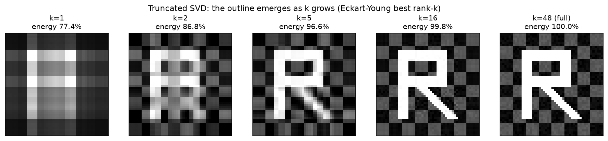

# ch20 — 低秩近似與 PCA：丟掉小奇異值

> **本章解決什麼問題**：ch19 把 SVD 攤開了——任何矩陣 A=UΣVᵀ，奇異值（singular value）σ₁≥σ₂≥…≥0 是「各方向的伸縮強度」，由大到小排好。本章問一個極實際的問題：**如果只留前幾個最大的奇異值、把後面的小的全砍掉，會怎樣？** 答案有兩層，都漂亮。第一層是 **Eckart–Young 定理**：這樣截斷出來的，不是「還行」的近似，而是**在所有秩 k 矩陣裡最接近原矩陣的那一個**——丟掉小奇異值是數學上可證的最佳壓縮，不是隨手砍。第二層是 **PCA（主成分分析，principal component analysis）**：把同一招用在資料的共變異矩陣（covariance matrix）上，前幾個特徵向量就是資料「變異最大的方向」＝主成分，丟掉小特徵值＝丟掉低變異的冗餘維度。兩件事——影像壓縮與資料降維——底下是同一個數學：**沿奇異值／特徵值由大到小排序，留大的、丟小的。** 共變異「在統計上量什麼」見《馴服隨機》ch10（本章不依賴）；本章只講線代這側的問題——**為什麼資料的主軸一定是某個對稱矩陣的特徵向量。** SVD 的存在性與幾何在 ch19；PageRank 那個「重要度也是一個特徵向量」留 ch21。

開始前把全書一律遵守的台灣慣例釘死一次：**行（直行，column）是矩陣縱向的一排、列（橫列，row）是橫向的一排**——這跟中國大陸的用法剛好相反（見 landscape 與 ch05）。本章一張影像會被當成矩陣，它的每一列（橫排）是影像的一橫排像素、每一行（直排）是一縱排像素。用詞照舊：我們講「特徵值／特徵向量」，**絕不寫「本徵值／本徵向量」**（那是大陸用語）。

## 從你已知的出發

你其實早就在用這一章的兩個結論了，只是不知道底下是線代。

**「這一堆 metric 其實互相能推出來。」** 你做過監控，盯過一面塞滿曲線的 dashboard：CPU、記憶體、QPS、P99 延遲、GC 次數、連線數……十幾條 metric。但你心裡清楚，它們**沒有十幾個獨立的自由度**——QPS 一漲，CPU、記憶體、延遲跟著漲，它們高度相關，「一起動」。真正在動的「因子」可能只有兩三個（負載、背景任務、一次部署），其餘十幾條都是這兩三個因子的線性組合加一點雜訊。**PCA 就是把這件事做精確**：它找出那兩三個「真正在動的方向」（叫**主成分**），把十幾維的相關 metric 壓成幾維獨立的座標。這正是 ch10 講的「秩虧空悄悄發生」——你以為有十幾個獨立維度，其實資料躺在一個低維子空間附近。PCA 是「找出那個低維子空間」的工具，去相關、降維、異常偵測（離主成分太遠的點＝異常）都是它的副產品。

**「推薦系統的潛在因子」「圖片其實能壓很小」。** 你大概聽過推薦系統用「矩陣分解」找「潛在因子（latent factors）」——把一張巨大的「使用者 × 商品」評分表，近似成「使用者 × 幾個口味維度」乘「幾個口味維度 × 商品」。那個「幾個」就是低秩近似的秩 k。同樣地，一張照片是一個大矩陣（每個像素一個數），但它能被壓到原本檔案大小的零頭還認得出——因為影像矩陣的「真正資訊」集中在前幾個奇異值裡，後面成千上萬個小奇異值貢獻的只是細節與雜訊。**低秩近似就是「把這張表近似成幾個主要因子的乘積」的通用數學**，影像壓縮是它最看得見的示範。

**「前幾個主成分解釋八成變異」。** 這句話你在任何 PCA 教學裡都看過。它的精確意思是：把資料各方向的「變異量」加總，前幾個主成分方向就佔掉了八成——剩下一大堆方向加起來只有兩成，丟掉它們資訊損失很小。這跟「保留前 k 個奇異值就能認出影像輪廓」是同一句話：**高維資料其實低維**，能量集中在少數幾個方向上。

把這三個錨點收成一句帶進本章：**真實世界的資料矩陣，絕大多數的「資訊／能量／變異」都集中在前幾個奇異值（或特徵值）的方向上；留下大的、丟掉小的，就能用很低的秩把它近似得很好——而且這個「丟小的」是數學上可證的最佳做法。** 這是脊椎矩陣 S 第七層的另一面（共變異），也是 Part VI 把 SVD 推向應用的第一站。

## 低秩近似：丟掉小奇異值是最佳的，不是將就的

先把 SVD 的截斷寫清楚，再說它為什麼最佳。

### 截斷 SVD：把和拆開，砍掉尾巴

ch19 給過 SVD：任何 m×n 矩陣 A 可以寫成 A=UΣVᵀ，其中 U（m×m）、V（n×n）正交，Σ 對角放奇異值 σ₁≥σ₂≥…≥0。這個乘法有一個極有用的等價寫法——**把它拆成一堆秩 1 矩陣的和**：

```text
A = σ₁ u₁v₁ᵀ + σ₂ u₂v₂ᵀ + … + σ_r u_rv_rᵀ      ← r = 非零奇異值個數 = 秩（rank）
        ↑              ↑
   第一塊：最強      第二塊：次強       （u_i 是 U 的第 i 行、v_i 是 V 的第 i 行）
```

每一項 σ_i·u_iv_iᵀ 是一個**秩 1 矩陣**（一個行向量乘一個列向量，ch10），權重就是奇異值 σ_i。因為奇異值由大到小排好，**這個和是「由強到弱」疊起來的**——第一項貢獻最多，後面越來越少。

**低秩近似（low-rank approximation）** 就是把這個和**只取前 k 項**，砍掉尾巴：

```text
A_k = σ₁ u₁v₁ᵀ + σ₂ u₂v₂ᵀ + … + σ_k u_kv_kᵀ      ← 只留前 k 個奇異值
```

A_k 是一個**秩 k 矩陣**（k 個秩 1 的和，秩最多 k）。它需要的儲存量也只跟 k 有關：k 個 u_i（每個 m 維）、k 個 v_i（每個 n 維）、k 個 σ_i——總共 k(m+n+1) 個數，當 k 遠小於 m、n 時，遠少於原本的 m·n 個數。這就是壓縮的來源。

### Eckart–Young：這是最佳的秩 k 近似

這裡是本章第一個驚嘆點，也是「丟掉小奇異值」這件事的整個正當性所在。

你可能會想：留前 k 項只是「一種」近似，憑什麼說它好？也許重新組合一下、或留別的奇異值，能更接近？

**不能。** 這是 **Eckart–Young 定理（1936）** 的內容（2026-06，照 landscape；原始出處 Eckart & Young, *The Approximation of One Matrix by Another of Lower Rank*, Psychometrika, 1936，網路查證一致）：

> 在所有秩 ≤ k 的矩陣裡，**截斷 SVD 得到的 A_k 是最接近原矩陣 A 的那一個**（Frobenius 範數意義下的最近）。而且近似誤差正好等於被丟掉的奇異值——

```text
最小的近似誤差（Frobenius 範數平方）= σ²_{k+1} + σ²_{k+2} + … + σ²_r
                                        ↑ 被你砍掉的那些小奇異值的平方和
```

換句話說：**你砍掉的奇異值越小，誤差越小**——所以「砍最小的那些」當然是最佳策略。如果你貪心去留某個小奇異值、丟一個大的，誤差立刻變大。Eckart–Young 把「直覺上該砍小的」升級成「可證明該砍小的，而且砍小的之後沒有任何秩 k 矩陣能贏過它」。

（嚴謹度標示：本書不展開 Eckart–Young 的一般證明——它要用到「秩 k 矩陣的值域至多 k 維、與某個 (k+1) 維子空間必有非零交集」的論證。本章給結論、給誤差公式、並在 `### 動手生圖` 用程式把「誤差²＝尾巴奇異值平方和」這個恆等式驗到小數點後。完整證明指向延伸的 Strang／Axler。順帶一提，1960 年 Mirsky 把它推廣到**任何么正不變範數**——Frobenius、譜範數、核範數都成立——所以這個「截斷 SVD 即最佳低秩近似」是非常穩固的結論，不是只對某一種誤差度量成立的巧合。）

### 能量保留比：你砍掉了多少資訊

工程上要決定 k 取多少，看的是**能量保留比（retained energy ratio）**——前 k 個奇異值「佔了多少」：

```text
能量保留比(k) = (σ₁² + σ₂² + … + σ_k²) / (σ₁² + σ₂² + … + σ_r²)
                  ↑ 留下的能量              ↑ 全部能量
```

為什麼用 σ² 而不是 σ？因為奇異值平方和就是矩陣的「總能量」（Frobenius 範數平方＝所有元素平方和＝所有 σ² 之和，ch19 提過 ‖A‖²_F=Σσ²）。能量保留比＝0.99 的意思是「留下的部分佔了原矩陣 99% 的能量，丟掉的尾巴只佔 1%」。這也是影像／資料壓縮裡常見的品質指標（網路查證：SVD 影像壓縮普遍用能量保留比當品質度量，能量還原 >99% 通常視為好品質，2026-06）。對真實資料，能量保留比常常**幾個 k 就衝到九成以上**——這正是「高維其實低維」的數字證據。

## 影像壓縮：一張圖就是一個矩陣

這是我認為本章最值得你停下來盯著看的一頁，也是低秩近似最直觀的示範。

**一張灰階影像就是一個矩陣。** 把照片看成一格一格的像素，每個像素是一個亮度數值（0＝黑、1＝白）。一張 48×48 的灰階圖，就是一個 48×48 的矩陣，裡面 2304 個數。把它做 SVD、留前 k 個奇異值重建，你會看到一件事——**輪廓隨 k 浮現**。

本章的圖（`### 動手生圖` 完整列出腳本）造了一張結構化的灰階圖：一個白色的字母「R」，疊在棋盤格紋理上，加一點雜訊。然後用 k=1、2、5、16、全部 個奇異值各重建一次，擺成一橫排對照。看點如下：

```text
k=1   能量 77%   只剩一團模糊的亮塊——R 的「重心」在哪，但認不出是 R
k=2   能量 87%   開始有上下結構，隱約是個直立的字
k=5   能量 97%   R 的輪廓清楚浮現，連那條斜腿都看得出，棋盤紋理回來了
k=16  能量 100%  幾乎跟原圖一模一樣（差別肉眼難辨）
全部  能量 100%  原圖（秩 48，全部奇異值）
```

數字自驗（用 `np.linalg.svd` 算這張確定性影像，`np.random.seed(0)`）：奇異值是 σ₁≈20.8、σ₂≈7.2、σ₃≈5.5、σ₄≈3.9、…，由大到小掉得很快。前 1 個就佔了 77% 能量、前 5 個佔 97%、前 16 個佔 99.8%。**一張需要 2304 個數的圖，用 16 個奇異值（16×(48+48+1)≈1552 個數）就幾乎完美重建**——而且你在 k=5 時已經認得出它是什麼。這就是「資訊集中在前幾個奇異值」最赤裸的展示。



停一秒想這張圖在說什麼。**第一個奇異值（最大的那個）抓的是影像最粗的結構**——整體的亮暗分布、最主要的那塊形狀。後面的奇異值逐個補上越來越細的細節。當你砍掉小奇異值，你砍掉的是**細節與雜訊**，骨架留著——所以輪廓認得出，只是糊。這跟 JPEG 之類的真實壓縮原理不完全相同（JPEG 用的是離散餘弦變換，不是 SVD），但「把訊號分解成由強到弱的成分、丟掉弱的」這個核心思想是共通的。SVD 給的版本特別乾淨，因為 Eckart–Young 保證它是**最佳**的秩 k 近似。

彩色影像就是三個這樣的矩陣（R、G、B 各一張），各自壓縮即可——本章用灰階，是為了讓「一張圖＝一個矩陣」這件事乾淨到無可爭辯。

## PCA：資料的主軸，為什麼一定是特徵向量

低秩近似是「把矩陣壓低秩」。PCA 是同一招用在一個特別的矩陣上——**資料的共變異矩陣**——而且結論換了個說法：找出資料變異最大的正交方向。本節要回答 outline 點名的問題：**為什麼這些主軸一定是特徵向量？**

### 共變異矩陣是對稱 PSD，所以它一定能正交對角化

假設你有一堆資料點（每個點是一個向量，比如那排 metric），先把它們**中心化**（每個維度減掉自己的平均，讓資料雲的中心移到原點——這一步很要緊，待會「陷阱」會回來談）。中心化後，把資料排成矩陣 X（每一列是一筆資料），它的**共變異矩陣**是：

```text
C = (1/n) Xᵀ X        ← n 是資料筆數；C 的第 (i,j) 格 = 第 i 維與第 j 維「一起動的程度」
```

C 有兩個關鍵性質，**全部來自它的形狀，不需要任何統計**：

1. **C 對稱**（C=Cᵀ）——因為 cov(第 i 維, 第 j 維)＝cov(第 j 維, 第 i 維)，「i 和 j 一起動」跟「j 和 i 一起動」是同一個數（ch18 用過這個直覺）。形式上 (XᵀX)ᵀ=Xᵀ(Xᵀ)ᵀ=XᵀX，轉置回自己。
2. **C 半正定**（positive semidefinite, PSD）——對任意向量 w，wᵀCw=(1/n)wᵀXᵀXw=(1/n)‖Xw‖²≥0。它永遠 ≥0，因為它本質是個長度平方。所以 C 的特徵值**全部 ≥0**（ch18：正定／半正定 ⟺ 特徵值非負）。

第 1 條是關鍵。**對稱矩陣，由 ch18 的譜定理（spectral theorem），一定能正交對角化**：C=QΛQᵀ，Q 的行是一組**互相正交**的單位特徵向量，Λ 是特徵值（全 ≥0）的對角矩陣。

**這就是「主軸為什麼是特徵向量」的全部答案的地基**：共變異矩陣天生對稱 → 譜定理保證它有一組正交特徵向量 → 這組正交向量就是 PCA 要的「正交主軸」。沒有這個對稱性，主軸不保證正交、甚至不保證存在。PCA 能成立，是搭在 ch18 譜定理上的。

### 為什麼「變異最大的方向」就是「最大特徵值的特徵向量」

地基有了，還缺最後一步：憑什麼「特徵向量」就是「變異最大的方向」？這是本節的核心論證，工程師的嚴謹版（每步能口頭說出理由）。

「資料沿方向 w（單位向量）的變異量」是多少？把每筆資料投影到 w 上（投影長＝資料·w，ch16），這些投影值的變異，算出來正好是：

```text
沿方向 w 的變異 = wᵀ C w        ← 一個二次型（quadratic form，ch18）！單位向量 w 上
```

所以「找變異最大的方向」就是在所有單位向量 w 裡，**最大化二次型 wᵀCw**。而 ch18 的二次型已經告訴你它長什麼樣——**它是一個橢圓（碗），它的軸是 C 的特徵向量，沿特徵向量方向的值就是對應的特徵值**。具體說：

```text
若 w 是特徵向量（Cw=λw），則 wᵀCw = wᵀ(λw) = λ(wᵀw) = λ    ← w 單位向量，wᵀw=1
```

**沿特徵向量方向的變異，正好等於那個特徵值。** 而在所有單位向量裡，wᵀCw 的最大值就是**最大的特徵值**，在**對應的特徵向量方向**取到（這是二次型在單位球上的最大值＝最大特徵值，Rayleigh 商的結論，本書取直覺版、嚴格證指向延伸）。於是：

- **第一主成分（PC1）＝最大特徵值的特徵向量**——變異最大的方向；
- **第二主成分＝次大特徵值的特徵向量**（且與 PC1 正交，因對稱矩陣特徵向量正交）；
- 依此類推，特徵值由大到小排，特徵向量就是由「最主要」到「最次要」排好的主軸。

**這就是「主軸為什麼是特徵向量」的完整答案**，你應該能口頭重講：沿任一方向的變異是個二次型 wᵀCw；二次型在單位球上的極值出現在特徵向量方向、極值就是特徵值；所以變異最大的方向＝最大特徵值的特徵向量。**降維（dimensionality reduction）** 就是只保留前幾個主成分（最大的幾個特徵值方向）、把資料投影上去——丟掉小特徵值的方向＝丟掉低變異的冗餘維度（回收 ch10 秩、ch03 線性相依：那些方向上資料幾乎不動，是多餘的）。

注意這跟前半的低秩近似是**同一件事的兩個說法**：對中心化資料矩陣 X 做 SVD，它的右奇異向量就是 C 的特徵向量、奇異值平方（除以 n）就是特徵值（因 C=(1/n)XᵀX，而 XᵀX 的特徵值＝X 奇異值的平方，ch19）。所以「PCA 取前 k 個主成分」＝「對 X 做秩 k 截斷」＝Eckart–Young 的最佳低秩近似。影像壓縮與資料降維底下是同一個 SVD。

### 脊椎 S 當共變異矩陣：第一主成分解釋 75% 變異

把脊椎 **S=[[2,1],[1,2]]** 讀成一個共變異矩陣——這是它的第七層的另一面（ch19 是 SVD，這裡是 PCA），數字跨章一致。

假設某筆兩維資料（比如「CPU 用量」與「記憶體用量」，已中心化）的共變異矩陣恰好是 S：對角線的 2、2 是各維自己的變異（變異數），off-diagonal 的 1 是兩維的共變異（正＝同向一起動）。S 對稱、且（ch11 算過）特徵值 3、1 都 >0，所以正定、是個合法的共變異矩陣。

ch11／ch18 已經解出它的特徵分解，這裡回收並讀成主成分：

```text
特徵值（變異量）：   λ₁ = 3（大）        λ₂ = 1（小）
主成分（主軸方向）： (1,1)/√2（PC1）     (1,−1)/√2（PC2）
```

- **第一主成分（PC1）沿 (1,1)/√2**——這是「CPU 與記憶體一起漲」的方向，變異量 λ₁=3，是資料變動最大的方向（合理：兩個正相關的 metric，最主要的變動就是「一起漲一起跌」）。
- **第二主成分（PC2）沿 (1,−1)/√2**——這是「一個漲一個跌」的方向，變異量 λ₂=1，小得多。
- 兩主軸正交：(1,1)·(1,−1)=1−1=0 ✓（譜定理的承諾兌現）。

**各主成分解釋的變異比例**＝該特徵值 ÷ 全部特徵值之和（網路查證一致：proportion of variance＝eigenvalue ÷ sum of eigenvalues，2026-06）。總變異＝特徵值之和＝3+1=4（也等於 S 的跡 tr=2+2=4，ch11 的驗算工具）：

```text
PC1 解釋的變異 = λ₁ / (λ₁+λ₂) = 3 / (3+1) = 3/4 = 75%
PC2 解釋的變異 = λ₂ / (λ₁+λ₂) = 1 / (3+1) = 1/4 = 25%
```

**第一主成分一個方向就解釋了 75% 的變異。** 如果你要把這份兩維資料降到一維，留 PC1、丟 PC2，你保住 75% 的變異、只損失 25%——而且 Eckart–Young 保證這個「留最大特徵值方向」是最佳的一維近似，沒有別的方向能保住更多變異。這就是「降維」在脊椎上的具體數字：**從兩個相關的 metric，PCA 告訴你真正在動的主要是一個方向（一起漲跌），把它當成單一的「負載指標」，你只丟了四分之一的資訊。**

（跨書分工，講清楚邊界：**共變異「在統計上量什麼」——為什麼 cov 量的是「一起變動」、相關係數怎麼正規化它——見《馴服隨機》ch10**，本章不依賴、不重講。本章只做線代這側：共變異矩陣是對稱 PSD、它的特徵向量是正交主軸、特徵值是各主軸的變異量。兩本書從兩側講同一個 S：那本講它作為共變異「量了什麼」，這本講它的主軸「為什麼是特徵向量」。）

## 直覺的陷阱

低秩近似與 PCA 是工程裡用得最多、也最常被用錯的線代工具。下面四個坑每一個都看過人踩。

| 陷阱 | 錯誤直覺 | 會在哪裡把你帶溝裡 | 怎麼自我察覺 |
|---|---|---|---|
| **以為隨便砍奇異值都行** | 「降秩就是丟掉幾項，哪幾項差不多」 | 你若留小的、丟大的，誤差暴增——Eckart–Young 的「最佳」只對「砍最小的那些」成立。砍錯了不只是差一點，是直接破壞骨架 | 砍之前先看奇異值的衰減曲線（scree plot）；若有人「為了某個理由」保留中間某個奇異值、丟更大的，那已經不是最佳低秩近似了 |
| **PCA 前不中心化／不標準化** | 「資料丟進去就有主成分」 | **不中心化**：主軸會被資料雲離原點多遠綁架，PC1 指向「平均位置」而不是「變異方向」，整個分析錯。**不標準化**：若一維是「位元組」（10⁹ 量級）、另一維是「比率」（0~1），共變異被大尺度那維完全主導，PC1 幾乎就是那一維，小尺度維的資訊被尺度淹沒 | 算之前確認每維減過平均（中心化）；若各維單位／量級差很大，先各除以標準差（標準化）再做 PCA。徵兆：PC1 幾乎平行於某個原始座標軸、或解釋變異比例異常接近 100% |
| **把主成分當原始 feature 解讀** | 「PC1 就是某個 metric」 | 主成分是**所有原始維度的線性組合**（(1,1)/√2 是「CPU 加記憶體」、不是 CPU 也不是記憶體）。把它命名成單一業務含義、或拿去當可解釋的特徵報給別人，會講出錯誤結論 | 看主成分的係數向量（loadings）：它幾乎一定是好幾維的混合。若你想說「PC1 代表負載」，那是你對混合的詮釋，要明說它是組合不是原始量 |
| **以為低秩近似是無損的** | 「壓縮完還原回來一樣」 | 低秩近似 ≠ 無損壓縮。砍掉小奇異值就是**永久丟掉那些方向的資訊**（回收 ch08：壓扁降維回不去、ch10 秩變小）。能量保留 99% 不是 100%，那 1% 找不回來 | 心裡記著「秩 k 近似是 lossy 的」；要還原原圖必須留全部奇異值。把它當「有損壓縮」用，不要當「等價變換」 |

最值錢的一條是**中心化**。它最容易被忽略，因為「忘了減平均」程式不會報錯，PCA 照樣跑出一組主成分——只是那組主成分是錯的（指向資料雲的位置而非形狀）。這是 ch10「秩虧空悄悄發生」的近親：壞掉的時候沒有 exception，只有悄悄錯掉的結果。

## 紙上推演

### 推演題

**題 1〔10 分鐘，★〕** 一份兩維資料（已中心化）的共變異矩陣是 C=[[5,0],[0,1]]（兩維**不相關**，off-diagonal＝0）。手算它的兩個主成分（方向與變異量）、各自解釋的變異比例，並說明這個對角的情形為什麼主成分「明顯」是座標軸。

**題 2〔15 分鐘，★★〕** 解釋「丟掉小奇異值為什麼是最佳近似，而不是隨便砍」。要點：用秩 1 展開 A=Σσ_i u_iv_iᵀ 說明每一項的權重、用 Eckart–Young 的誤差公式說明「砍最小的＝誤差最小」。不要寫「顯然」，把理由講出來。

**題 3〔10 分鐘，★★〕** 脊椎 S=[[2,1],[1,2]] 當共變異矩陣，第一主成分解釋 75% 變異。如果今天共變異矩陣換成 S'=[[2,1.9],[1.9,2]]（兩維高度相關），不用全解，先用 tr 與 det 推出兩個特徵值，再算 PC1 解釋的變異比例。猜一下：相關性越高，PC1 的比例會越接近什麼？

**題 4〔口頭，★★〕** 用自己的話回答 outline 點名的問題：**PCA 的主軸為什麼一定是特徵向量？** 不要背，講出「沿方向 w 的變異是二次型 wᵀCw、二次型極值在特徵向量方向」這條線。

### 推演解答

**題 1。** C=[[5,0],[0,1]] 已經是對角矩陣，特徵值直接讀對角線：λ₁=5、λ₂=1，特徵向量就是座標軸 (1,0)（λ=5）與 (0,1)（λ=1）。

```text
PC1 = (1,0)，變異量 5，解釋比例 5/(5+1) = 5/6 ≈ 83.3%
PC2 = (0,1)，變異量 1，解釋比例 1/(5+1) = 1/6 ≈ 16.7%
```

為什麼主成分「明顯」是座標軸：off-diagonal＝0 表示兩維**不相關**，資料雲的橢圓沒有傾斜、軸正好對齊 x 與 y 軸。共變異矩陣是對角的，就代表「你拿到的座標系已經是主成分座標系」——不需要旋轉。x 方向變異 5 比 y 方向變異 1 大，所以 PC1 是 x 軸。**驗算**：tr=5+1=6＝λ 之和 ✓、det=5·1=5＝λ 之積 ✓。

**題 2。** SVD 把 A 寫成秩 1 矩陣的加權和，**權重就是奇異值**：

```text
A = σ₁ u₁v₁ᵀ + σ₂ u₂v₂ᵀ + … + σ_r u_rv_rᵀ      （σ₁≥σ₂≥…≥0）
```

每一項 u_iv_iᵀ 的「大小」（Frobenius 範數）都是 1（u_i、v_i 都是單位向量），所以**每一項對 A 的貢獻量就是它前面的奇異值 σ_i**。要用秩 k 矩陣逼近 A，等於要「丟掉 r−k 項」；Eckart–Young 說最佳的丟法、丟掉後的誤差是：

```text
‖A − A_k‖²_F = σ²_{k+1} + σ²_{k+2} + … + σ²_r      ← 被丟掉那些項的奇異值平方和
```

這個式子直接回答了問題：**誤差等於你丟掉的奇異值的平方和。** 要讓誤差最小，當然丟最小的那幾個 σ——所以「留前 k 大、丟尾巴」是最佳的。如果你貪心留一個小的 σ_j、丟一個更大的 σ_i（i<j），等於把一個大的平方項放進誤差和裡，誤差立刻變大。Eckart–Young 進一步保證：**在所有秩 k 矩陣裡**（不只是「截斷 SVD 的各種變體」），沒有任何一個比「留前 k 大」更接近 A。所以這不是「將就的近似」，是「可證的最佳」。（`### 動手生圖` 會把這個誤差恆等式驗到數值。）

**題 3。** S'=[[2,1.9],[1.9,2]]。用驗算工具反推特徵值：

```text
tr = 2 + 2 = 4        → λ₁ + λ₂ = 4
det = 2·2 − 1.9·1.9 = 4 − 3.61 = 0.39   → λ₁ · λ₂ = 0.39
```

對對稱的 [[a,b],[b,a]] 這種型，特徵值其實有捷徑：λ＝a±b（特徵向量永遠是 (1,1) 與 (1,−1)）。所以 λ₁=2+1.9=3.9、λ₂=2−1.9=0.1。**驗算**：和＝3.9+0.1=4 ✓、積＝3.9·0.1=0.39 ✓。

```text
PC1 解釋比例 = 3.9 / (3.9+0.1) = 3.9/4 = 97.5%
```

PC1 解釋了 97.5%！對照脊椎 S（off-diagonal＝1）的 75%。猜測得到驗證：**相關性越高（off-diagonal 越接近對角線的值），資料越貼近一條線，PC1 解釋的比例越接近 100%**——因為資料幾乎全擠在「一起動」那個方向上、另一個方向幾乎沒變異。這正是「高維資料其實低維」的極端情形：兩個高度相關的 metric，實際自由度幾乎只有一個。

**題 4。** 模範要點（口頭講出這條線即過關）：(1) 共變異矩陣 C 對稱 → 譜定理保證它有一組正交特徵向量基底；(2) 資料沿單位方向 w 的變異量 ＝ 二次型 wᵀCw；(3) 在所有單位向量裡，wᵀCw 在特徵向量方向取極值，極值就是對應的特徵值（沿特徵向量方向 wᵀCw=λ）；(4) 所以變異最大的方向＝最大特徵值的特徵向量＝第一主成分，依特徵值大小排出所有主軸。一句話收束：**「最大變異方向」這個最佳化問題的解，就是二次型 wᵀCw 在單位球上的極值，而它落在特徵向量上——這是 ch18 譜定理直接給的。**

### 動手生圖

本章的圖就是影像壓縮的實驗。腳本造一張確定性的灰階「R」影像（疊棋盤紋理＋雜訊），做 SVD，用 k=1,2,5,16,全部 個奇異值各重建一次，擺成一橫排，每格標 k 與能量保留比。

```python
# ch20 figure: low-rank image compression. One grayscale image = one matrix.
# Keep only the top-k singular values (truncated SVD) and rebuild: the outline
# emerges as k grows. Each panel prints k and the retained energy ratio
# (sum of top-k sigma^2 / sum of all sigma^2). Eckart-Young: this truncation is
# the BEST rank-k approximation in Frobenius norm. All labels in English.
from pathlib import Path
import numpy as np
import matplotlib
matplotlib.use("Agg")          # headless; no display needed
import matplotlib.pyplot as plt

OUT = Path(__file__).resolve().parent / "out" / "ch20-low-rank-image.png"
OUT.parent.mkdir(parents=True, exist_ok=True)

np.random.seed(0)                                  # deterministic image
N = 48
img = np.zeros((N, N))
xx, yy = np.meshgrid(np.arange(N), np.arange(N))
img += 0.30 * (((xx // 6) + (yy // 6)) % 2)        # checkerboard texture (raises rank)
img[8:40, 10:15] = 1.0                             # letter 'R': left stem
img[8:13, 10:30] = 1.0                             # top bar
img[20:25, 10:30] = 1.0                            # middle bar
img[8:25, 28:33] = 1.0                             # upper-right vertical
for i in range(16):                                # diagonal leg
    img[24 + i, 18 + i:23 + i] = 1.0
img = np.clip(img + 0.08 * np.random.rand(N, N), 0, 1)

U, s, Vt = np.linalg.svd(img, full_matrices=False)  # img = U @ diag(s) @ Vt
total = (s ** 2).sum()
ks = [1, 2, 5, 16, len(s)]                          # last = full rank (exact)

fig, axes = plt.subplots(1, len(ks), figsize=(15, 3.2))
for ax, k in zip(axes, ks):
    rebuilt = (U[:, :k] * s[:k]) @ Vt[:k]           # best rank-k approximation
    energy = (s[:k] ** 2).sum() / total
    ax.imshow(rebuilt, cmap="gray", vmin=0, vmax=1)
    tag = "k=%d (full)" % k if k == len(s) else "k=%d" % k
    ax.set_title("%s\nenergy %.1f%%" % (tag, energy * 100), fontsize=10)
    ax.set_xticks([]); ax.set_yticks([])
fig.suptitle("Truncated SVD: the outline emerges as k grows (Eckart-Young best rank-k)", fontsize=11)
fig.savefig(OUT, dpi=150, bbox_inches="tight")
print("wrote", OUT)            # build_figures.py reads this
```

**預期輸出**：一橫排五格灰階圖。k=1 是一團模糊亮塊（能量約 77%）、k=2 隱約成形（約 87%）、k=5 R 的輪廓清楚浮現連斜腿都在（約 97%）、k=16 幾乎與原圖無異（約 99.8%）、最右是全秩原圖（100%）。

**改參數看什麼**：
- **改 `ks` 裡的 k 值**（試 k=3、4、8）：看輪廓在哪個 k 開始「認得出是 R」——通常 k=3~5 就夠。這就是「能量集中在前幾個奇異值」的親身體驗。
- **算各 k 的能量保留比**：在腳本尾巴加 `for k in range(1,len(s)+1): print(k, (s[:k]**2).sum()/total)`，看比例怎麼隨 k 衝高，畫成曲線就是 scree plot。
- **驗 Eckart–Young 誤差恆等式**：加 `Ak=(U[:,:5]*s[:5])@Vt[:5]; print(np.linalg.norm(img-Ak)**2, (s[5:]**2).sum())`——兩個數會相等，親手確認「近似誤差²＝被丟掉的奇異值平方和」。
- **拿掉棋盤紋理那行**（`img += 0.30*...` 註解掉）：影像變更低秩，k=1 就佔更高能量、更快認得出——印證「越結構化的圖越好壓」。

## 自我檢核

口頭自答，講得出來才算過關：

1. **PCA 的主軸為什麼一定是特徵向量？**（要能講出：共變異矩陣對稱 → 譜定理給正交特徵向量；沿方向 w 的變異是二次型 wᵀCw；二次型極值在特徵向量方向、極值＝特徵值。）
2. **丟掉小奇異值為什麼是最佳低秩近似，而不是隨便砍？**（要能講出：誤差²＝被丟掉的奇異值平方和；砍最小的＝誤差最小；Eckart–Young 保證在所有秩 k 矩陣裡最佳。）
3. 為什麼「一張灰階影像」可以當成一個矩陣做 SVD？保留前 k 個奇異值時，你保住了什麼、丟掉了什麼？
4. 能量保留比為什麼用奇異值的**平方**和，而不是奇異值本身？（提示：Frobenius 範數平方＝Σσ²＝總能量。）
5. PCA 前為什麼一定要中心化？不中心化會發生什麼（PC1 會指向哪裡）？為什麼程式不會報錯但結果是錯的？
6. 脊椎 S 當共變異矩陣，第一主成分解釋多少變異？這個 75% 是怎麼算出來的（哪個數除以哪個數）？
7. 「低秩近似」和「PCA 降維」為什麼說是同一個數學？（提示：對中心化資料矩陣 X 做 SVD，右奇異向量＝共變異矩陣特徵向量，奇異值平方＝特徵值。）
8. 為什麼說低秩近似是 lossy（有損）的？它和 ch08「壓扁降維回不去」、ch10「秩變小」是同一回事嗎？

## 延伸閱讀

- **3Blue1Brown《Essence of Linear Algebra》**（Grant Sanderson，YouTube，免費）。本章沒有獨立一集，但「Change of basis」與「Eigenvectors and eigenvalues」兩集是 PCA 主軸＝特徵向量的視覺地基；看完回頭想「共變異橢圓的軸」會更直觀。播放清單：https://www.youtube.com/playlist?list=PLZHQObOWTQDPD3MizzM2xVFitgF8hE_ab （2026-06 驗證可取）。
- **Gilbert Strang，MIT 18.06 Linear Algebra**（MIT OpenCourseWare，免費）。SVD 與其應用（含影像壓縮、PCA）是 18.06 後段的招牌；Strang 的講法把「截斷 SVD＝最佳低秩近似」講得最清楚。https://ocw.mit.edu/courses/18-06-linear-algebra-spring-2010/ （2026-06 驗證可取）。
- **Eckart, C. & Young, G. (1936)《The Approximation of One Matrix by Another of Lower Rank》，Psychometrika 1, 211–218**。本章最佳低秩近似定理的原始出處——一篇 1936 年的論文，今天每個推薦系統、每個 PCA 都在用它。想看「最佳」是怎麼被證的，從這裡的後人整理（如 Strang 教科書的 SVD 章）入手。
- **Sheldon Axler《Linear Algebra Done Right》第四版（2024，Open Access 免費 PDF）**。若你想看 SVD 與譜定理嚴格、不靠行列式的處理，Axler 是首選；本章略過的 Eckart–Young 一般證明與二次型極值（Rayleigh 商）的嚴格版可在此補。https://linear.axler.net/ （2026-06 驗證可取）。
- **跨書**：共變異「在統計上量什麼」、相關係數如何正規化、為什麼 cov 量的是「一起變動」——見《馴服隨機》ch10（本章的統計另一面，本章不依賴）。非線性的降維（資料躺在彎曲的低維流形上、PCA 這種線性主軸抓不到）只一句帶過：自編碼器（autoencoder）、t-SNE、UMAP 等是把「降維」推廣到非線性的方向，屬於機器學習而非線代，指向附錄 C 的應用路線。PCA 的統計推論（主成分的顯著性、保留幾個主成分的統計判準）同樣只一句：那是統計學的題目，本書到「主軸＝特徵向量、變異比例＝特徵值占比」為止。
