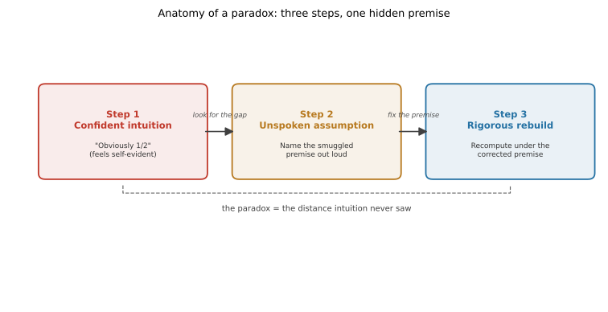

# ch01 — 直覺為什麼會輸：一個悖論的三步解剖

> **本章解決什麼問題**：這一章不解任何一題完整的悖論（paradox）——每一題都有自己的專屬章節。它交付的是一套可以重複使用的讀法：三步解剖法。先誠實寫下你的直覺答案，再揪出那句讓直覺覺得「理所當然」、卻從沒說出口的假設，最後在修正過的假設下把答案重新算一遍。從 ch02 起，每一章都會示範這套解剖法一次；ch27 收官時，會把二十七章各自「沒說出口的那句」收成一張總表。讀完本章，你會知道自己在讀哪一種書，以及每一章大致的形狀。

```text
沒說出口的那句 — 八個部分

  I   解剖學 ────────── ch01 三步解剖：直覺／假設／重建   ◄ 你在這裡
  │
  II  條件與資訊 ────── ch02 蒙提霍爾 · ch03 三囚犯 · ch04 貝特朗盒子
  │                     ch05 男孩女孩 · ch06 偽陽性
  III 因果聚合計數 ──── ch07 辛普森 · ch08 檢察官謬誤 · ch09 生日問題
  IV  漫步與賭局 ────── ch10 賭徒輸光 · ch11 賭徒謬誤與熱手
  │                     ch12 聖彼得堡 · ch13 兩個信封 · ch14 帕隆多
  V   共同知識 ──────── ch15 紅藍眼睛 · ch16 泥巴小孩
  │                     ch17 意外絞刑 · ch18 兩位將軍
  VI  選擇與集體 ────── ch19 非傳遞骰子 · ch20 孔多塞 · ch21 布雷斯 · ch22 紐康
  VII 隨機與測度 ────── ch23 睡美人 · ch24 貝特朗弦 · ch25 班佛 · ch26 巴拿赫–塔斯基
  VIII 收官 ─────────── ch27 一張假設類型總表
```

## 從你已知的出發

這本書要重演二十幾次同一個場景：有人給出一個聽起來完全合理的答案——而且往往一整批真正的專家也這麼答——結果嚴謹算下去，答案是另一個。

1990 年 9 月，美國《Parade》雜誌的專欄作家瑪麗蓮·沃斯·莎凡（Marilyn vos Savant）在「Ask Marilyn」專欄回答了一道三扇門的題目。據她本人所述，她收到了近萬封讀者來信，其中不少出自掛名博士的讀者，約九成說她錯了（這幾個數字是她自己的說法，沒有第三方稽核；細節、規則藏在哪裡、後來怎麼收場，留給 ch02）。同一種戲碼在本書會反覆上演：1999 年，一位法庭上的兒科醫師把一個機率的方向算反了，這個錯誤成了一起冤案的關鍵證詞之一（ch08）；1973 年，柏克萊大學被指控在研究所招生上性別歧視，逐系拆開來看，證據卻幾乎倒過來（ch07）。每一次，出錯的都不是當事人不夠聰明——出錯的是，他們的推理裡有一句話從來沒被說出口，卻已經被悄悄用上了。

在往下讀之前，你可以先想一個小問題，不必查答案：**你的朋友，平均而言，是不是比你自己的朋友更多朋友？** 多數人的第一反應是「這不可能——如果每個人的朋友數都要低於朋友的平均，那這句話豈不是自打嘴巴」。這個反應聽起來完全合理。它也是錯的。錯在哪裡，會在下面幾節裡揭曉；錯的**形狀**，決定了你要不要讀完這整本書。

## 悖論，在這本書裡是什麼意思

「悖論」這個詞常被拿來指兩種很不一樣的東西。邏輯學家蒯因（Willard Van Orman Quine）在 1962 年一篇文章裡，把它們分成三類（見延伸閱讀）：**真實悖論（veridical paradox）**——結論聽起來荒謬，卻可以被嚴謹證明為真；**謬誤悖論（falsidical paradox）**——結論聽起來荒謬，而且的確是假的，因為論證裡藏了一個邏輯錯誤；以及**二律背反（antinomy）**——用看起來完全站得住腳的推理，推出一個真正的自相矛盾，逼你去修改推理規則本身（說謊者悖論、羅素悖論屬於這一類）。

本書二十七章，主體是第一類：直覺自信地喊「不可能」，而正確答案的確是那個聽起來不可能的數字（蒙提霍爾切換獲勝機率⅔、生日問題只要 23 人）。少數幾章（意外絞刑 ch17、紐康悖論 ch22、睡美人 ch23）貼近二律背反的邊界——它們的論證幾乎無懈可擊，卻導出彼此矛盾的結論，而且八十年來沒有公認的解法；這幾章會誠實標明「這裡沒有標準答案」，不假裝解決了它們。本書刻意不收真正的二律背反本身（說謊者、羅素悖論），那需要修改邏輯的地基，是另一本書的工作。

三類之間有一條共通的線索，也是這本書真正在賣的東西：**不管是哪一類，讓你覺得「這不可能」的那個自信，永遠來自一句你沒有說出口、卻已經在用的假設。** 找到那句話，「不可能」就會變成「原來如此」。

## 三步解剖法

把上面那句話拆開，就是本書每一章共用的骨架，三步：

1. **寫下直覺答案**——在看任何正解之前，先老實承認自己會怎麼答、憑什麼這樣答。這一步常被跳過，但跳過它，你就沒辦法誠實比較「直覺錯在哪」——沒有先犯錯，就沒有東西可以被糾正。
2. **找出偷渡的假設**——直覺答案之所以感覺理所當然，是因為它已經幫你把題目「翻譯」成一個具體的數學物件（一個機率空間、一種抽樣方式、一種取平均的方式），但這個翻譯是有選擇的，而直覺假裝那是唯一的選擇。這一步要把那個被隱藏的選擇，用一句完整的話講出來。
3. **嚴謹重建**——在講出來的那句話（修正後的假設）下，把答案重新算一次，一步都不跳，算到能被驗算為止。



這三步不是空話，下面用一個本書二十七章都沒有專章處理的小悖論，把三步走一遍給你看。

## 友誼悖論：五個人的反例

友誼悖論（friendship paradox）是社會學家史考特·費爾德（Scott L. Feld）1991 年在《American Journal of Sociology》一篇論文裡正式提出、並用真實青少年社交資料驗證的現象（見延伸閱讀）：在幾乎任何一個朋友網路裡，**你朋友的朋友數，平均起來會比你自己的朋友數多**。這正是上一節請你先猜的那句話。

**第一步，直覺答案**：「不可能。如果每個人的朋友數都低於朋友的平均，那整體的平均豈不是自相矛盾？」這聽起來像是在說「全班每個人的體重都低於全班平均體重」——一句站不住腳的話。多數人（包括不少數學系學生）第一反應都答「不可能」或「頂多打平」。

**第二步，找出偷渡的假設**：那股「不可能」的自信，來自一句沒說出口的話——「朋友的平均」和「你的平均」，是在同一個母體上、用同一種方式取的。但實際上不是。你自己的朋友數，是在「人」這個母體上數的，每人記一次；而「朋友的朋友數」，是在「友誼關係」這個母體上數的——朋友很多的人（社交樞紐）會同時出現在很多人的朋友名單裡，每出現一次就被算一次。你的朋友名單不是這個社群的隨機樣本，它系統性地偏向交友廣的人。

**第三步，嚴謹重建**：五個人的最小反例就能看見整件事的機制。

```text
朋友圈：H 認識 A、B、C、D；A、B、C、D 都只認識 H。

朋友數：H = 4，A = B = C = D = 1
全體平均朋友數 = (4+1+1+1+1) / 5 = 8/5 = 1.6      ← 母體是「五個人」，每人記一次

問每個人「你朋友平均有幾個朋友？」：
  A、B、C、D 唯一的朋友是 H，H 有 4 個朋友 → 各自答 4
  H 的四個朋友是 A、B、C、D，每人各 1 個朋友 → H 答 1

五個回答的平均 = (4+4+4+4+1) / 5 = 17/5 = 3.4      ← 母體換成「每個人自己的朋友清單」

3.4 > 1.6                                          ← 朋友的朋友，平均起來比你多
```

這不是這個五人例子湊巧成立。更一般地：任取一段友誼關係，兩人朋友數分別是 d_i、d_j，恆有 d_i/d_j + d_j/d_i ≥ 2（均值不等式，AM–GM inequality，等號只在 d_i = d_j 時成立——這是國中程度就能驗證的代數事實：兩邊同乘 d_i·d_j 後整理，就是 (d_i − d_j)² ≥ 0）。把這個不等式對網路裡每一段友誼關係加總，就直接證明「朋友的朋友平均數 ≥ 你的朋友數」對任何朋友網路都成立，等號只有在**每一段友誼的兩人朋友數都相等**時才會出現——在連通的朋友網路裡，這就是所謂的正則圖（regular graph，人人朋友數相同）；若網路裂成幾群互不相連，則每一群各自正則即可，不同群的朋友數還可以不一樣。

那句被偷渡的假設，換句話說就是：**把「朋友的平均」誤當成一個對人均勻抽樣的平均，而它其實是一個對關係加權抽樣的平均。** 這正是本書後面會反覆出現的一種假設類型——聚合與取平均的方式被悄悄換了母體（見 ch07 辛普森悖論，同一種機制換了一套劇本）。

## 那句沒說出口的話，怎麼在野外辨認

「找出偷渡的假設」不是玄學，而是可以練的技能。下面是一份自我檢查清單，遇到任何一個讓你自信喊出「不可能」或「顯而易見」的反直覺結論時，先問自己這幾件事：

- 看到「平均」「隨機」「獨立」「已知」這類字眼——先問：這是在哪個母體上取的？誰決定了這個樣本（見友誼悖論本節，以及 ch05 男孩女孩悖論）？
- 看到有人「做了一個動作」之後機率就變了——先問：那個動作有沒有洩漏訊息（見 ch02 蒙提霍爾、ch03 三囚犯、ch04 貝特朗盒子、ch06 偽陽性）？
- 看到「長期而言」或牽涉到無限——先問：有沒有一道你沒注意到的邊界，讓「長期」提早被卡住（見 ch10 賭徒輸光、ch12 聖彼得堡）？
- 看到「大家都知道」——先問：是「大家都知道」，還是「大家都知道大家都知道⋯⋯」一路無限層下去（共同知識，common knowledge，見 ch15 紅藍眼睛、ch16 泥巴小孩、ch18 兩位將軍）？
- 看到「A 比 B 強，B 比 C 強，所以 A 比 C 強」——先問：「比⋯⋯強」這個關係，有沒有被偷偷當成可傳遞（傳遞性，transitivity，見 ch19 非傳遞骰子、ch20 孔多塞悖論）？
- 看到「隨機挑一個」——先問：隨機是在哪一個母空間、哪一種取法下定義的（見 ch05 男孩女孩悖論、ch24 貝特朗弦悖論）？
- 看到一個「加總」或「平均」的動作——先問：加總前後，權重有沒有偷偷變了（見本節友誼悖論、ch07 辛普森悖論）？

這份清單不是要你把每一章的答案背下來——那些答案本章刻意不揭曉。它是要你養成一個反射動作：**自信感本身不是證據，它只是「我已經替這題選好了一個翻譯」的訊號。**

## 全書的悖論家族

上面路線圖裡的八個部分，大致對應七種「假設塌陷」的方式。下表先給一張地圖，細節留給各章：

| Part | 主題 | 塌陷的地方 |
|---|---|---|
| II 條件與資訊 | 一個動作洩漏了什麼 | 條件機率被忽略或搞反方向 |
| III 因果、聚合與計數 | 合起來看，跟分開看不一樣 | 加權平均、計數單位被換了母體 |
| IV 漫步與賭局 | 長期與邊界 | 吸收邊界、無限期望被誤當成有限的價 |
| V 共同知識 | 大家都知道，不等於「共同知識」 | 知識層級被悄悄升到無限層 |
| VI 選擇與集體 | 一對一都合理，合起來卻循環 | 傳遞性、多數決被預設為必然成立 |
| VII 隨機與測度 | 「隨機」沒有唯一定義 | 機率空間或可測性本身沒講清楚 |

這張地圖現在看起來像一堆抽象名詞，屬於正常現象——它們會在各自的章節裡，各自變成一個你能複述給別人聽的具體故事。

## 本書的讀法

每一章的骨架都一樣，知道這個骨架，你會更快進入狀況：

- **從你已知的出發**：重建一個真實發生過的爭論場景，讓你先給出那個聽起來合理的直覺答案。這裡不會揭曉正解——你要先真的答錯（或至少真的猶豫）一次。
- **核心內容（自由小節）**：重演爭論、給出完整的嚴謹推導，附至少一個帶具體數字、一步都不跳的算例，通常配一到兩張圖。
- **直覺的陷阱**：本書的招牌段落，把那句被偷渡的假設攤到桌上，段落結尾一定是「那句沒說出口的話是：____」這個定型句。
- **紙上推演**：兩到四題動手做的練習，標好預估時間與難度，題目後面緊接完整解答。
- **自我檢核**：五到八題口頭自問的題目，講得出口才算過關，其中一定有一題問「這一章那句沒說出口的假設是什麼」。
- **延伸閱讀**：真正存在、能查到的連結，每條配一句話說明為什麼值得一讀。

建議的讀法：每章讀到「從你已知的出發」結尾時停下來，真的把你的答案寫在紙上或講出聲——再往下讀。這個動作比它聽起來重要得多：沒有先承諾一個答案，你很容易在看到正解後說服自己「我本來就知道」，而那正是這整本書想戳破的另一種自信。

還有一件事值得先說在前面：本書對數學嚴謹度會誠實分級，不會把每一種說法都包裝成「已經證明」。多數章節的推導會做到完整證明；少數地方——例如巴拿赫－塔斯基悖論裡，用選擇公理把球分解重組的建構——只會做到 sketch（大意勾勒），完整證明留給延伸閱讀裡的原始文獻。另外幾章（睡美人、兩個信封的無界先驗版、意外絞刑、紐康悖論）則會誠實寫「這裡沒有公認解」，因為它們的確是活躍中的哲學或決策理論爭議，不是本書偷懶。看到這些標籤時，請照字面理解：sketch 不是完整證明，「無公認解」不是本書漏講，硬要在那幾章找一個標準答案，你會找到的是另一個沒說出口的假設——以為所有問題都必然有一個唯一正解。

## 七條主線，一路埋到 ch27

本書用七條主線驗收每一章有沒有達標，也是全書真正的骨架，會在末章 ch27 逐條回收：

1. **一個悖論由哪三步構成**——直覺的答案、它偷偷加上的假設、嚴謹重建（本章的主題）。
2. **「沒說出口的那句」是什麼意思、怎麼在野外辨認**（本章上一節的檢查清單）。
3. **條件與資訊怎麼騙人**——一個動作洩漏了什麼（Part II）。
4. **長期與邊界怎麼騙人**——吸收態、無限期望（Part IV）。
5. **共同知識為什麼不等於人人都知道**（Part V）。
6. **聚合、傳遞性、隨機的定義怎麼在暗處塌掉**（Part III、VI、VII，友誼悖論已經示範了「聚合」這一項）。
7. **讀者能不能把任一章的震撼用自己的話重講**——這是最終的驗收標準：如果你講不出來，代表你只是記住了數字，沒有拆穿假設。

ch27 不會再解一個新悖論。它會把二十七章各自「那句沒說出口的話」收成一張假設類型總表，逐條核對這七條主線有沒有真的走完一遍，並且拿一個本書沒有專章細講的悖論（很可能又是友誼悖論的變體，或辛普森悖論的另一個包裝）當場示範一次三步解剖法——就像本章剛剛做的這樣。

## 直覺的陷阱

本章沒有專屬的悖論可以拆，但它自己也藏了一句沒說出口的話，而且是整本書二十七章共用的那一句。用友誼悖論當範例，把「陷阱」攤開看：

| 環節 | 發生了什麼 | 怎麼自我察覺 |
|---|---|---|
| 直覺答案 | 假設「平均」只有一種取法、一種母體 | 問自己：這裡的「平均」，是在哪個母體上取的？ |
| 偷渡的假設 | 把「人」當成抽樣單位，而不是「關係」 | 找出句子裡的名詞或動詞，背後藏著什麼抽樣程序 |
| 嚴謹重建 | 換成對關係加權，AM–GM 不等式立刻成立 | 換一種抽樣方式重算一次，看答案會不會變 |

把這張表再往上抽象一層：友誼悖論的陷阱是「以為平均只有一種取法」；蒙提霍爾的陷阱會是「以為主持人開門沒有洩漏訊息」；紅藍眼睛的陷阱會是「以為大家都知道就等於共同知識」。二十七個陷阱，表面上是二十七件不同的事。但它們共用同一個母結構：**直覺把一句日常語言的題目翻譯成數學時，以為那次翻譯只有一種做法**——但每一次翻譯都在幫你選一個機率空間、一種抽樣方式、一種聚合或比較的規則，而那個被隱藏起來的選擇，才是整本書真正的戰場。專業訓練不會讓人對這件事免疫：連掛名博士的讀者都在蒙提霍爾問題上寫錯了信（見本章「從你已知的出發」）——直覺失手，不是因為不夠聰明，是因為那句話真的沒有被說出口。

> **那句沒說出口的話是**：把一句日常語言的題目翻譯成數學時，只有一種翻法。

## 紙上推演

### 練習一（★，10 分鐘）：換一張朋友圖，重算一次

四個人排成一條鏈：1 認識 2，2 認識 3，3 認識 4（1 和 3 不認識，2 和 4 不認識）。分別算出「全體平均朋友數」與「每個人朋友的平均朋友數」的整體平均，確認後者是否仍然比較大。

### 練習二（★★，15 分鐘）：剪刀、石頭、布裡的傳遞性

把「甲比乙強」定義成「甲贏乙的機率超過一半」。剪刀、石頭、布三者兩兩比較：石頭勝剪刀、剪刀勝布、布勝石頭。直覺上，「比⋯⋯強」應該可以排出一個從最強到最弱的順序（像排身高一樣）。試著把三者排出順序，看看會發生什麼事；再用一句話說出這裡被偷渡的假設是什麼。

### 練習三（★★，15 分鐘）：更大的隨機圖，先預測再說

想像 12 個人，隨機決定誰和誰是朋友（每一對有一半機率成為朋友）。先別急著逐點去數——用練習一背後那條 AM–GM 不等式預測：「全體平均朋友數」和「每個人朋友的平均朋友數之整體平均」，哪一個會比較大？並說出為什麼這個方向和圖具體長什麼樣子無關。

### 推演解答

**練習一解答**：

```text
朋友數：1 = 1，2 = 2，3 = 2，4 = 1
全體平均朋友數 = (1+2+2+1) / 4 = 6/4 = 1.5

每個人朋友的平均朋友數：
  1 的朋友是 2（朋友數 2）        → 答 2
  2 的朋友是 1、3（朋友數 1、2）  → 答 (1+2)/2 = 1.5
  3 的朋友是 2、4（朋友數 2、1）  → 答 (2+1)/2 = 1.5
  4 的朋友是 3（朋友數 2）        → 答 2

四個回答的平均 = (2+1.5+1.5+2) / 4 = 7/4 = 1.75

1.75 > 1.5 ← 就算這張圖比五人星形圖溫和很多，不等式依然成立；
             只有當每個人朋友數都相等（正則圖）時，兩邊才會打平。
```

**練習二解答**：石頭勝剪刀、剪刀勝布、布勝石頭，三個關係首尾相接成一個環：石頭 → 剪刀 → 布 → 石頭。找不到一個「最強」的起點——不管從哪裡開始排序，都會有一個更強的東西排在它前面。直覺失手的地方，是把「比⋯⋯強」這個兩兩比較的關係，偷偷當成像數字大小一樣必然可傳遞（transitivity）；但「贏的機率超過一半」這種關係，允許形成循環，不保證有整體排序。同一種機制，本書會在骰子（ch19 非傳遞骰子，四顆骰子繞環，相鄰對勝率恰好三分之二）和投票（ch20 孔多塞悖論，成對多數決一樣會繞成一圈）裡，各用一個真正的歷史案例再示範一次。

**練習三解答**：方向可以純靠不等式預測——後者一定大於等於前者，而且與圖具體長什麼樣子無關。舉一次隨機交友的模擬為例：

```text
全體平均朋友數           = 3.667
每個人朋友的平均朋友數    = 4.209
```

12 個人隨機交友，全體平均朋友數是 3.667；但如果去問每一個人「你朋友平均有幾個朋友」再取平均，答案是 4.209。跟五人星形圖的道理完全一樣：交友廣的人會出現在很多人的朋友名單裡，把「朋友的朋友數」這個統計量往上拉。換一組隨機交友關係重算，兩個數字都會變，但第二個數字大於等於第一個數字這件事不會變——這正是上一節那條 AM–GM 不等式在背後撐著。

## 自我檢核

1. 本書說的「悖論」，跟「邏輯矛盾（二律背反）」有什麼不同？舉一個本書會誠實標示「無公認解」的例子。
2. 三步解剖法的三步分別要防範什麼？如果跳過第一步（先寫下直覺答案），會失去什麼？
3. 友誼悖論裡，那句沒說出口的假設是什麼？換成你自己的話講一次。
4. 為什麼「找出被偷渡的假設」比「算出正確的數字」更重要？把答案背下來，跟真的拆穿陷阱，差別在哪裡？
5. 七條主線裡，你覺得哪一條在日常生活的討論裡最容易被忽略？舉一個本章沒提過的例子。
6. 為什麼末章要收一張「假設類型總表」，而不是讓每一章各自收尾就好？
7. 如果你在其他地方聽到一個「一群專家都答錯」的說法，你會先檢查哪三件事？

## 延伸閱讀

- Scott L. Feld, "Why Your Friends Have More Friends Than You Do," *American Journal of Sociology* 96(6), 1991, pp. 1464–1477——友誼悖論的原始論文，用真實青少年社交資料驗證這個現象。<https://www.journals.uchicago.edu/doi/abs/10.1086/229693>
- Wikipedia, "Friendship paradox"——友誼悖論的公式與後續研究概覽，適合想看嚴格證明的讀者。<https://en.wikipedia.org/wiki/Friendship_paradox>
- W. V. Quine, "Paradox," *Scientific American* vol. 206, 1962（後收入文集《The Ways of Paradox and Other Essays》）——本章「真實悖論／謬誤悖論／二律背反」三分法的出處。<https://math.dartmouth.edu/~matc/Readers/HowManyAngels/WaysofParadox/WaysofParadox.html>
- Wikipedia, "Monty Hall problem"——如果想提前看一眼 ch02 要重演的那場真實爭論，這裡有完整的時間線與各方說法。<https://en.wikipedia.org/wiki/Monty_Hall_problem>
