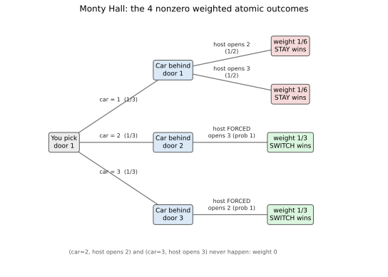
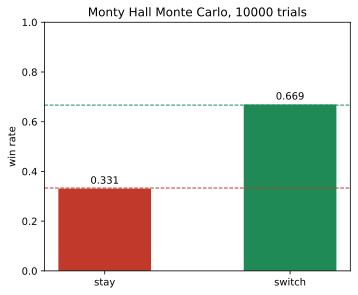

# ch02 — 蒙提霍爾問題：主持人知道門後有什麼

> **本章解決什麼問題**：ch01 交給你一套工具——直覺答案／沒說出口的假設／嚴謹重建。本章是第一次真正拿工具上場：蒙提霍爾問題（Monty Hall problem）是條件機率與資訊類悖論（Part II）的門面，也是全書最有名的一個。你會看到一個聽起來完全合理的「換不換都一樣」，被三種獨立的演算法同時推翻，換門的獲勝機率是 2/3、不是 1/2。後面 ch03 三囚犯、ch04 貝特朗盒子、ch05 男孩女孩會反覆回到同一條線——「一個動作洩漏了什麼資訊」，本章先把地基打好。

```text
沒說出口的那句 — 八個部分

  I   解剖學 ────────── ch01 三步解剖：直覺／假設／重建
  │
  II  條件與資訊 ────── ch02 蒙提霍爾 · ch03 三囚犯 · ch04 貝特朗盒子   ◄ 你在這裡
  │                     ch05 男孩女孩 · ch06 偽陽性
  III 因果聚合計數 ──── ch07 辛普森 · ch08 檢察官謬誤 · ch09 生日問題
  IV  漫步與賭局 ────── ch10 賭徒輸光 · ch11 賭徒謬誤與熱手
  │                     ch12 聖彼得堡 · ch13 兩個信封 · ch14 帕隆多
  V   共同知識 ──────── ch15 紅藍眼睛 · ch16 泥巴小孩
  │                     ch17 意外絞刑 · ch18 兩位將軍
  VI  選擇與集體 ────── ch19 非傳遞骰子 · ch20 孔多塞 · ch21 布雷斯 · ch22 紐康
  VII 隨機與測度 ────── ch23 睡美人 · ch24 貝特朗弦 · ch25 班佛 · ch26 巴拿赫–塔斯基
  VIII 收官 ─────────── ch27 一張假設類型總表
```

## 從你已知的出發

想像一個電視益智節目。舞台上有三扇門，其中一扇後面是一輛車，另外兩扇後面各是一隻山羊。主持人請你選一扇門，選中車就能把車開回家。你選了門 1。

到這裡為止，這是一個再普通不過的機率題：三扇門，車在每一扇後面的機率均等，你選中車的機率是 1/3。

接下來才是這題出名的地方。主持人——他知道車在哪一扇門後面——走到另外兩扇你沒選的門前，打開了其中一扇，露出一隻山羊（門 2 或門 3，總有一扇是羊，因為就算車真的在你選的門 1 後面，另外兩扇也都是羊；就算車不在你選的門後面，另外兩扇裡也至少有一扇是羊）。他接著問你：「要不要換成另一扇還沒開的門？」

這正是 1990 年真正登上美國《Parade》雜誌「Ask Marilyn」專欄的問題。讀者 Craig F. Whitaker 寫信給專欄作者瑪麗蓮·沃斯·莎凡（Marilyn vos Savant，當時以金氏世界紀錄「最高智商」聞名），原話是：「你在一個益智節目上，面前三扇門，一扇後面是車，另外兩扇是羊。你選了 1 號門，主持人知道每扇門後面是什麼，他打開了另一扇門，比如 3 號，裡面是羊。他問你要不要改選 2 號門。換，對你比較有利嗎？」沃斯·莎凡在 1990 年 9 月 9 日的專欄裡回答：換，而且換了以後贏的機率會變成原來的兩倍。

在你往下讀之前，請先誠實地問自己一個問題：換不換，真的有差嗎？

大多數人的直覺，包括很多受過嚴格數學訓練的人，都會覺得答案是「沒差，50%」。這個直覺聽起來完全站得住腳，理由大致是這樣的：一開始三扇門，車在哪一扇沒有理由偏向誰，所以每扇 1/3。但現在情況變了——一扇門被打開，證實裡面是羊，徹底出局了。桌面上只剩下兩扇門、一輛車。既然只剩兩個選項，而你沒有任何理由相信車更可能在其中一扇而不是另一扇——兩扇門，看起來完全對稱、完全可以互換角色——那機率不就該是一半一半嗎？換不換，不過是心理安慰，數學上沒有任何差別。

這個論證讀起來幾乎無懈可擊，而且它動用的正是你已經具備的機率直覺：樣本空間縮小了、選項變少了、剩下的選項均分機率。這正是為什麼這道題會在 1990 年的美國引爆一場公開論戰。據沃斯·莎凡自己在專欄與後續著作中所述，她收到了將近一萬封讀者來信，其中近一千封署名附上博士頭銜，約 92% 的來信指她答錯了——**這些數字是她本人的自述，從未經過第三方稽核統計，寫作時只能當成「她說的規模」，不是稽核過的事實**。喬治梅森大學（George Mason University）數學教授 Robert Sachs 起初也寫信斥責她「你錯了！」，並自告奮勇要幫她補課；佛羅里達大學的 Scott Smith 博士則措辭更重，寫下那句後來被廣泛引用的名言：「你錯了，而且錯得離譜！這個國家的數學文盲已經夠多了，不需要世界最高智商的人再添一個。」有趣的是，Sachs 教授後來自己動手驗算，發現錯的是自己，又寫了第二封信向她道歉，自稱「把腳從嘴裡拔出來，現在正吃著自己的話」。1991 年 7 月 21 日，《紐約時報》記者 John Tierney 把這場論戰寫成頭版報導，連傳奇數學家保羅·艾狄胥（Paul Erdős）一開始都不相信換門有利——據他的傳記作者 Paul Hoffman 記載（這是單一傳記來源，細節無法逐字覆核），艾狄胥是在同事 Andrew Vázsonyi 用電腦跑了十萬次模擬、拿數據擺在他面前後，才勉強被說服。

那麼，兩扇門、一輛車、「沒理由偏向誰」——這個論證到底錯在哪裡？要回答這個問題，我們得先問一個更基本的問題：主持人開門這個動作，真的是隨機發生的嗎？

## 三種正解，同一個真相

在往下走之前，先把你已經具備的工具喚醒一次：條件機率（conditional probability）P(A|B) 的意思是「已知 B 發生的前提下，A 發生的機率」。你已經知道，新資訊通常會改變機率——擲兩顆骰子，「至少一顆是 6」這個資訊，會改變「兩顆骰子點數和是 7」的機率。蒙提霍爾問題不需要你學任何新概念，它只是要你把「新資訊改變機率」這件事，毫不留情地算到底。

真正的問題不是「兩扇門剩下，機率是不是各半」，而是「主持人打開一扇門這個動作，本身帶不帶資訊？如果帶，帶了多少？」答案是：主持人的動作**不是**隨機的。他知道車在哪裡，而且遊戲規則規定他一定會避開車、也一定會避開你選的那扇門。這條「一定會避開」的規則，正是那句被直覺悄悄吞掉、卻從沒說出口的假設。下面用三種獨立的方法把它算清楚，你會看到它們給出同一個答案。

### 解法一：把「六列表」拆成真正的四個原子結果

固定你選了門 1(整個問題有對稱性，選門 2 或門 3 的分析完全一樣)。車的位置均勻分布在門 1、2、3,各 1/3。很多人下意識會把「車的位置」和「主持人開哪扇門」湊成一張 3×2=6 列的表，並當成六個等機率的情形。這正是最常見的計算錯誤——**六列裡有兩列根本不可能發生，剩下四列的權重也不是均等的**。把它老老實實攤開：

```text
若車在門 1(機率 1/3):
  門 2、門 3 都是羊,主持人有真正的選擇——
  假設他在有選擇時公平地擲銅板,各 1/2       ← 這是解法的一個明說假設,問題本身沒替你決定
  → (car=1, 主持人開門2)  權重 = 1/3 × 1/2 = 1/6
  → (car=1, 主持人開門3)  權重 = 1/3 × 1/2 = 1/6

若車在門 2(機率 1/3):
  門 3 是唯一的羊(門1是你選的,門2是車),主持人被迫開門3
  → (car=2, 主持人開門3)  權重 = 1/3 × 1     = 1/3          ← 沒有選擇,機率不打折

若車在門 3(機率 1/3):
  門 2 是唯一的羊,主持人被迫開門2
  → (car=3, 主持人開門2)  權重 = 1/3 × 1     = 1/3          ← 同上

不可能出現的兩列(權重恆為 0):
  (car=2, 主持人開門2) ← 主持人絕不會打開藏著車的門
  (car=3, 主持人開門3) ← 同上

四個非零原子結果加總:
  1/6 + 1/6 + 1/3 + 1/3 = 2/6 + 4/6 = 1        ← 機率和為 1,自我檢驗過關
```

到這裡，答案已經浮現。「換門」贏，對應的正是「車不在你原本選的門 1」這件事——也就是 car=2 或 car=3 的兩個原子結果：

```text
P(換門獲勝) = P(car=2) + P(car=3) = 1/3 + 1/3 = 2/3    ← 本書基準 B1
P(維持原選獲勝) = P(car=1) = 1/6 + 1/6 = 1/3           ← 本書基準 B2
```

下面這棵樹把上面四個非零原子結果畫出來，兩條被砍掉的樹枝(主持人打開藏車的門)也一併標出，方便你確認自己沒漏算或多算。



值得停下來想十秒鐘的地方：如果你把六列都當成等機率(各 1/6),你會得到「換門」占兩列、「維持」占兩列、外加兩列不可能——這樣算出來換門與維持都是 2/6=1/3,總和卻只有 4/6,少了 2/6,因為你沒有把那兩個「不可能」的權重(其實是 0)正確地讓渡給其他四列。這正是最常見的算錯方式：把權重不均的四個結果錯認成權重均等的六個。

### 解法二：貝氏定理反著算一次

解法一是把所有可能性攤開來算聯合機率(joint probability)。第二種解法直接問你真正關心的問題：「已知主持人打開了門 3,車在門 2(也就是換門會贏)的機率是多少？」這需要用到貝氏定理（Bayes' theorem），寫成 P(H|E) = P(E|H)·P(H) / P(E)——「已知證據 E,假設 H 成立的機率，等於在 H 成立時觀察到 E 的機率，乘上 H 原本的先驗機率，除以觀察到 E 的總機率」。

代入這題，H 是「車在門 2」，E 是「主持人打開了門 3」：

```text
P(車在門2 | 主持人開門3)
  = P(主持人開門3 | 車在門2) · P(車在門2) / P(主持人開門3)

分子:
  P(主持人開門3 | 車在門2) = 1        ← 車在門2時,他被迫只能開門3
  P(車在門2) = 1/3                    ← 先驗機率,三扇門均等
  分子 = 1 × 1/3 = 1/3

分母 P(主持人開門3),要對車的三個位置全部加總:
  P(主持人開門3 | 車在門1) · P(車在門1) = 1/2 × 1/3 = 1/6   ← 車在1,他半數機率選開3
  P(主持人開門3 | 車在門2) · P(車在門2) = 1   × 1/3 = 1/3   ← 車在2,他被迫開3
  P(主持人開門3 | 車在門3) · P(車在門3) = 0   × 1/3 = 0     ← 車在3,他絕不會開3(那是車)
  P(主持人開門3) = 1/6 + 1/3 + 0 = 1/2

代回:
  P(車在門2 | 主持人開門3) = (1/3) / (1/2) = 2/3     ← 與解法一完全一致
  P(車在門1 | 主持人開門3) = (1/6) / (1/2) = 1/3
```

這裡驗證了一件重要的事：不管主持人實際打開的是門 2 還是門 3,只要遊戲規則保持「知情、必開羊、必給換」，由對稱性算出來的條件機率都是 2/3、1/3,和不去管他開哪扇門、只看「換」或「不換」這個動作的解法一完全吻合。

### 解法三：一句話版——你一開始的 1/3 從沒被動過

前兩種解法算得再仔細，也值得用一句話把直覺重新接上：你選門 1 的那一刻，猜中的機率就定格在 1/3,而且這件事後來沒有被更新過——不管車在哪裡，主持人都做得到、也一定會，從剩下兩扇門裡開出一扇羊。他的動作因此不會讓你手上這扇門突然變得更可能是車；它只是把原本壓在「另外兩扇門」上、合計 2/3 的機率，原封不動地擠進了他沒開的那唯一一扇門裡。你手上的門的機率沒有變，變的是另外兩扇門的機率**集中到剩下的那一扇**。這正是「換門等於買下另外兩扇門合計的機率」這句話的精確意思。

## 蒙地卡羅：讓電腦替你玩一萬次

如果三種代數解法還沒讓你完全信服，不妨學艾狄胥——讓電腦替你玩一萬次。下圖是一次一萬次模擬跑出的結果：維持原選的勝率大約 33%、換門的勝率大約 67%——非常貼近理論值 1/3 與 2/3,誤差純粹來自有限次數的抽樣噪音。



這張圖的看點很直接：換門的長條大約是維持原選長條的兩倍高——這正是 B1(2/3)是 B2(1/3)兩倍的視覺版本。如果你懷疑代數推導哪裡出了問題，模擬是最誠實的裁判：它不需要你同意任何一種證明方式，只需要你願意讓規則(知情、必開羊、必給換)被機器忠實地執行一萬次。

## 換一條規則，答案就垮：主持人知不知道車在哪

前面反覆強調「主持人知情、必開羊、必給換」這條規則，不是贅述，而是整個答案唯一的支點。把這條規則換掉，2/3 這個數字就不再成立。最著名的變體是：**如果主持人根本不知道車在哪、只是在剩下兩扇門裡隨機打開一扇**,答案會退回 1/2。

推導方式和解法一完全一樣，差別只在於這次主持人的選擇與車的位置**無關**:

```text
車在門1、2、3各1/3;主持人不知情,在門2、門3之間各1/2機率隨機開一扇——不管背後是車還是羊。
六個真正等機率(各1/6)的原子結果:
  (car=1,開2) (car=1,開3) (car=2,開2) (car=2,開3) (car=3,開2) (car=3,開3)

其中 (car=2,開2) 與 (car=3,開3) 這兩格,這次是合法結果——
只是主持人不小心開到了車,遊戲通常當場結束,不會走到「要不要換」這一步。

只保留「主持人碰巧也開到羊」的四格,並且鎖定他這次具體開的是門3:
  (car=1,開3) 權重1/6 ← 車在1,他隨機開到3,恰好是羊
  (car=2,開3) 權重1/6 ← 車在2,他隨機開到3,恰好是羊(門2的車沒被碰到)
  (car=3,開3) 被排除 ← 這格會開到車,不算「開到羊」

條件機率:
  P(car=1 | 開到門3且是羊) = (1/6) / (1/6+1/6) = 1/2
  P(car=2 | 開到門3且是羊) = (1/6) / (1/6+1/6) = 1/2

  → 換門獲勝機率 = 1/2,不再是 2/3
```

差別在哪裡？知情主持人開門「必定」不會開到車，這件事本身就是資訊——它把「另外兩扇門合計 2/3 的機率」硬性地灌進唯一沒開的那扇。不知情的主持人只是運氣好沒開到車，他的動作沒有帶著任何關於車在哪的線索，兩扇門因此保持對稱的一半一半。

有意思的是，《讓我們做個交易》(Let's Make a Deal)的真實主持人蒙提·霍爾(Monty Hall,本名 Monte Halparin,1921 年生於加拿大溫尼伯，1963 年起主持這個節目)在這場論戰延燒時接受了《紐約時報》Tierney 的採訪，親自用三張小紙門在自家客廳做了一次示範。他說得很直白：「如果規則規定主持人每次都必須開一扇門、必須提供交換，那你應該換。但如果他可以自己決定要不要開門讓你換——那就要小心了，一切取決於他當下的心情。我唯一的建議是：如果你能讓我出價五千美金請你別開那扇門，拿錢走人。」這句話幾乎是本章結論最好的注腳：電視節目裡的蒙提·霍爾，享有數學題目裡的主持人所沒有的自由裁量權，而正是這份自由裁量權——規則本身——決定了 2/3 還是 1/2。

## 直覺的陷阱

把前面幾節收攏成一張表：

| 直覺怎麼想 | 偷偷加上的假設 | 錯在哪一步 | 怎麼自我察覺 |
|---|---|---|---|
| 「兩扇門剩下，機率各半」 | 剩下的兩個選項天生對稱，誰也不比誰更可能 | 忽略了「哪一扇被打開」這個動作本身帶有資訊，而不是隨機篩掉一個選項 | 問自己：如果我用一個不看門後面的機器人來開門，會不會照樣只留下羊？如果不是機器人在開、是知情的人在開，那答案就可能不一樣 |
| 「開門之後，情況重新洗牌」 | 把後來獲得的資訊，當成把整個機率分布打掉重練的信號 | 沒有用貝氏定理去更新機率，而是憑直覺「歸零重算」 | 問自己：我原本的選擇，有沒有任何理由變得更可能是對的？如果沒有，它的機率就該原地不動，只是「其他選項」的機率要重新分配 |
| 「反正只剩兩個選項，五五分」 | 把「選項數量」直接等同於「機率」 | 選項數量和機率並不是一回事——除非每個選項真的等機率 | 數一數：這兩個選項是「被同一套規則、同樣公平地留下來」的嗎？還是其中一個是因為規則保證它「不可能被拿掉」而留下來的？ |

這三行陷阱其實是同一件事的三種說法：直覺把「主持人打開一扇門」這個受規則約束的動作，錯當成了一次不帶資訊的隨機篩選。一旦你意識到主持人的動作是**被迫的、有規律的、洩漏資訊的**,而不是隨機的，兩扇門不對稱就變得理所當然——一扇門是「你最早隨手選的」，另一扇門是「在所有懂內情的人都刻意迴避車、也刻意迴避你選的那扇之後，唯一還撐著沒被排除的門」，它們的出身完全不同。

> **那句沒說出口的話是**:主持人不是隨機開門——他知道車在哪，而且規則保證他一定會避開藏車的門、也一定會避開你選的那扇門；這個「一定會避開」的動作本身就是資訊，它把原本壓在另外兩扇門上、合計 2/3 的機率，整個灌進了他沒開的那唯一一扇門裡。

## 紙上推演

**問題一 [★☆☆，10 分鐘]**
把蒙提霍爾問題推廣到 10 扇門：1 台車、9 隻羊，你先選一扇(比如門 1)。知情的主持人接著從剩下 9 扇門裡打開 8 扇，每一扇都是羊，只留下 1 扇不開。換成那唯一沒開的門，獲勝機率是多少？維持原選呢？用和解法一同樣的「加權原子結果」方法推導，不要用背的。

**問題二 [★★☆，15 分鐘]**
延續前文「不知情主持人」的變體，但把門數改回 3 扇：主持人完全不知道車在哪，在你沒選的兩扇門裡隨機開一扇(各 1/2),這次不排除「他不小心開到車」的情形。請你自己完整列出全部六個等機率的原子結果，並在「主持人恰好開到羊」的條件下，重新推導換門的獲勝機率，確認等於本章正文給出的 1/2。

**問題三 [★★★，20 分鐘]**
「有偏見的主持人」變體：主持人知情，規則仍然是必開羊、必給換，但當他真的有選擇的時候(也就是你選中的門後面就是車),他**永遠**選擇打開編號較大的那扇門(例如門 1、2、3 都可選時，他有選擇的情形只會發生在你選門 1、車也在門 1 時，他一定開門 3、絕不開門 2)。請分別算出「已知他開了門 3」與「已知他開了門 2」這兩種情況下，換門的獲勝機率各是多少，並驗證這兩個條件機率的加權平均仍然等於整體的 2/3。

**問題四 [★☆☆，10 分鐘]**
不用任何算式，只用一句話，把解法三的論證講給另一個人聽：為什麼「你一開始選中的機率是 1/3」在主持人開門之後沒有改變？如果對方追問「那為什麼另外兩扇門的機率會改變」，你會怎麼接下去？

### 推演解答

**問題一解答**:固定你選門 1,車的位置均勻分布在 10 扇門，各 1/10。

```text
若車在門1(機率1/10):
  主持人可以從門2~10這9扇門裡任選8扇開(留1扇不開),
  假設他在9種「留哪一扇」的選擇裡機率均等,各1/9
  → 每一種「留下第k扇」的原子結果權重 = 1/10 × 1/9 = 1/90(k=2,...,10共9種)

若車在門j(j=2,...,10,各機率1/10):
  主持人被迫留下門j不開(因為門1是你選的、門j有車,其餘8扇都得開)
  → 原子結果(car=j,留下門j)權重 = 1/10 × 1 = 1/10

換門獲勝 = P(car≠1) = 9 × 1/10 = 9/10
維持原選獲勝 = P(car=1) = 9 × 1/90 = 1/10
```

換門獲勝機率是 9/10,維持只有 1/10——門數愈多，「主持人被迫替你濾掉幾乎所有錯誤選項」這件事洩漏的資訊就愈大，換門的優勢也愈明顯。這正是把 3 扇門的 2/3 推廣成 n 扇門時「(n−1)/n 換門、1/n 維持」的一般規律，n=3 時還原成本章基準 B1=2/3、B2=1/3。

**問題二解答**:車與你的選擇各自獨立均勻分布，主持人開門也和車的位置無關(各 1/2)。列出全部 3×2=6 個等機率原子結果(各 1/6):(car=1,開2)、(car=1,開3)、(car=2,開2)、(car=2,開3)、(car=3,開2)、(car=3,開3)。這一次，(car=2,開2) 與 (car=3,開3) 不再是不可能——它們代表主持人不小心開到了車，機率各 1/6,只是遊戲通常就此結束、不再問「要不要換」。只保留「主持人恰好開到羊」的四格：(car=1,開2)、(car=1,開3)、(car=2,開3)、(car=3,開2),各權重 1/6,合計 4/6。鎖定「他這次剛好開的是門 3、而且是羊」：符合的只有 (car=1,開3) 與 (car=2,開3),各 1/6,合計 2/6。P(car=1|條件) = P(car=2|條件) = (1/6)/(2/6) = 1/2。換門獲勝機率是 1/2——與正文一致。這題最容易錯的地方是忘記把「主持人開到車」那兩格也算進原本的樣本空間，只有先誠實承認它們存在、再把它們排除，才是正確的條件化，而不是一開始就假裝它們不存在。

**問題三解答**:仍固定你選門 1。三種車位置：

```text
car=1(機率1/3):主持人有選擇,按規則永遠開門3(不開門2)
  → (car=1,開3) 權重 = 1/3 × 1 = 1/3
  → (car=1,開2) 權重 = 1/3 × 0 = 0        ← 這條規則下,他絕不會這樣做

car=2(機率1/3):主持人被迫開門3(門2有車、門1是你選的)
  → (car=2,開3) 權重 = 1/3 × 1 = 1/3

car=3(機率1/3):主持人被迫開門2
  → (car=3,開2) 權重 = 1/3 × 1 = 1/3
```

已知他開了門 3:符合的原子結果是 (car=1,開3)=1/3 與 (car=2,開3)=1/3,合計 2/3。P(car=1|開3) = (1/3)/(2/3) = 1/2,P(car=2|開3) = 1/2 ——換門只打平，獲勝機率 1/2,不是 2/3。已知他開了門 2:符合的原子結果只有 (car=3,開2)=1/3,沒有其他候選(因為 car=1 這條規則下絕不開門 2)。P(car=3|開2) = 1,換門必勝(機率 1)。加權平均驗證：P(主持人開門3)×P(換門贏|開3) + P(主持人開門2)×P(換門贏|開2) = (2/3)×(1/2) + (1/3)×(1) = 1/3 + 1/3 = 2/3——和整體的 2/3 完全吻合。這題的教訓是：主持人在「有選擇」時具體怎麼選，不會改變**平均**而言換門的優勢(仍是 2/3),但會改變你**已經看到他開了哪一扇特定的門**之後，那一刻的條件機率——這正是解法一開頭那句「假設他在有選擇時公平地擲銅板」為什麼要明說出來的原因：少了這個假設，答案不會整個崩潰，但「看到具體是哪一扇門被打開」這件事所帶來的資訊量，會變得不對稱。

**問題四解答(參考講法)**:你一開始選門 1 的時候，猜中的機率就是 1/3,而且從那之後，沒有任何新資訊能讓「你當初隨手選的那扇門」變得更可能是對的——主持人開門這個動作，根本不是針對你的選擇做的判斷，他只是在剩下兩扇裡避開車、避開你選的那扇。所以你手裡這扇門的機率原地不動，還是 1/3。至於「為什麼另外兩扇的機率會變」，答案是：機率總和永遠是 1,你的門占 1/3 不動，剩下的 2/3 原本平分在另外兩扇門上，但現在其中一扇被證實是羊、被踢出局了——這 2/3 沒有消失，它只能全部擠進僅存的那一扇。


## 自我檢核

1. 為什麼主持人打開一扇門這個動作，不能被當成「隨機刪掉一個選項」？
2. 在解法一的四個非零原子結果裡，為什麼 (car=2,主持人開門2) 的權重恆為 0?這件事在直覺論證裡被忽略在哪一步？
3. 如果有人堅持「兩扇門剩下就該五五分」，你會請他先回答哪一個問題，才能戳破這個論證？
4. 貝氏定理裡的 P(主持人開門3) 這個分母，在直覺論證裡有沒有被算過？沒有算它，會漏掉什麼？
5. 「主持人不知情、隨機開門，恰好沒開到車」這個變體，為什麼會讓答案退回 1/2?這和「主持人知情、必開羊」的差別到底在哪一個環節？
6. 蒙提·霍爾本人在真實節目裡擁有、但數學題目裡的主持人被規則剝奪的，是什麼樣的自由？這份自由如果被放回題目裡，答案還會不會是 2/3?
7. 這個悖論那句沒說出口的假設是什麼？請不看課文，用自己的話重講一次。
8. 為什麼「10,000 封讀者來信」這個數字，在寫作時必須加上「她本人自述」這個限定詞，而不能直接當成事實引用？

## 延伸閱讀

- [Monty Hall problem — Wikipedia](https://en.wikipedia.org/wiki/Monty_Hall_problem):完整歷史沿革、多種證明方式與變體整理，是查證年份與人名最方便的起點。
- [Marilyn vos Savant — Wikipedia](https://en.wikipedia.org/wiki/Marilyn_vos_Savant):《Parade》專欄作者的生平與這場論戰的後續影響。
- Steve Selvin, "A Problem in Probability" 與 "On the Monty Hall Problem",《The American Statistician》29 卷，1975 年 2 月與 8 月兩封讀者投書：本題最早的正式數學陳述，早於沃斯·莎凡專欄 15 年，PhilPapers 上可查到條目(未驗證是否有開放全文)。
- John Tierney, "Behind Monty Hall's Doors: Puzzle, Debate and Answer",《紐約時報》，1991 年 7 月 21 日：把這場公眾論戰寫成報導的頭版文章，包含對蒙提·霍爾本人的採訪。
- Paul Hoffman,《The Man Who Loved Only Numbers》(1998):記載保羅·艾狄胥被電腦模擬說服的軼事，提醒讀者這是單一傳記來源、細節無法逐字覆核。
