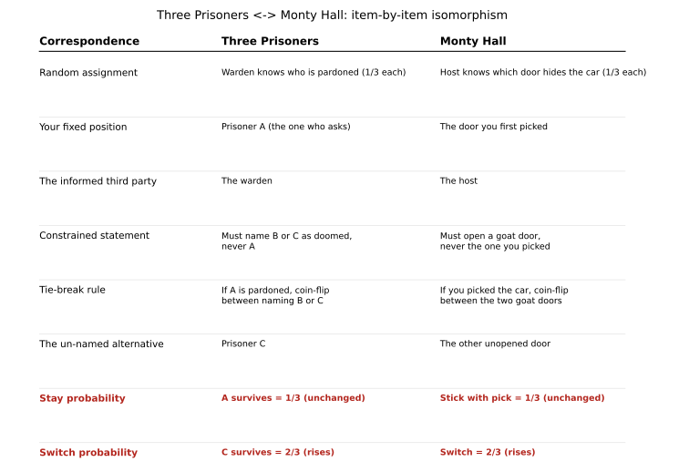

# ch03 — 三囚犯問題：同一個陷阱換上囚服

> **本章解決什麼問題**：上一章（見 ch02）你已經算過蒙提霍爾問題——切換獲勝機率 2/3、維持原選 1/3——並且知道那句沒說出口的假設是「主持人知情、必開一扇山羊門、且必給你換」。這一章要證明一件更有用的事：同一套數學骨架，換一身衣服（囚服）出現時，人的直覺依然會被騙。三囚犯問題比蒙提霍爾更早十六年被提出，卻是幾乎一模一樣的陷阱。本章屬於「條件與資訊」家族（Part II），目標是練出辨認同構（isomorphism）的眼睛——這個能力比背下任何一題的答案都值錢。

## 從你已知的出發

想像一座監獄，三名死刑犯 A、B、C 昨夜被告知：明天早上，州長會從三人中隨機赦免一位，機率各 1/3，其餘兩位將被處決。名單已經確定，只是還沒公布，而看守他們的獄卒已經知道結果。

A 徹夜未眠。他知道獄卒不會直接回答「我會不會被赦免」——這種問題獄卒依規定必須拒答，畢竟提前洩漏一名囚犯的生死是重罪。於是 A 換了個問法，遞了張紙條給獄卒：

「我知道 B、C 兩人裡至少有一個會被處決——這是必然的，因為只有一個名額。你能不能，不必告訴我誰被赦免，只要說出 B 和 C 之中，哪一個確定會被處決？」

獄卒想了想，覺得這個要求合理：反正 A 問的不是自己的生死，只是問另外兩人裡「確定要死」的那一個是誰，這件事於規定無妨。獄卒回答：

「B 會被處決。」

A 心裡立刻動了一個念頭：「原本我們三人機會均等，各 1/3。現在獄卒告訴我 B 注定要死，這下候選人只剩下我和 C 兩個人了。三個人的問題變成兩個人的問題，機會應該重新平分——我獲赦的機率從 1/3 跳到了 1/2！」

A 因此鬆了一口氣，覺得自己的處境好轉了。這個推理讀起來理所當然：一開始三個候選人，拿掉一個確定出局的，剩下兩個，自然是對半分。如果你也覺得這個答案很合理，你不是唯一一個——這正是馬丁·加德納（Martin Gardner）在 1959 年設計這道題時，想要讀者掉進去的那個坑。這一章要做的事，就是把 A 這個看似無懈可擊的推理，拆開來看它到底錯在哪裡，而錯的地方，恰好就是蒙提霍爾問題裡錯的那個地方——只是換了一身囚服。

## 加德納的謎題：把同一個陷阱提早十六年說一遍

三囚犯問題（Three Prisoners Problem）出自馬丁·加德納（Martin Gardner）在《科學人》（Scientific American）「數學遊戲」（Mathematical Games）專欄，時間是 **1959 年 10 月**。這個時間點值得停下來想一想：史蒂夫·賽爾文（Steve Selvin）在《美國統計學家》（The American Statistician）投書、後來演變成「蒙提霍爾問題」之名的那兩封信，寫於 1975 年——比加德納晚了整整十六年。換句話說，蒙提霍爾問題廣為人知的版本，其實是同一個數學結構的第二次登場，而且中間還隔著貝特朗盒子悖論（1889年，見 ch04）。這個悖論家族一再重演，每次都用不同的外衣騙過同一批讀者。

加德納這道題目在當年也引來讀者爭辯，但聲量遠不如三十年後瑪麗蓮・沃斯・莎凡（Marilyn vos Savant）在《Parade》雜誌掀起的那場全國性風暴（見 ch02）。原因不難猜：監獄與死刑的場景比電視遊戲節目冷硬，較少人願意動手寫信抗議。但數學上，這兩題是同一件事——這正是本章要證明的。

值得先說清楚本章的**範圍邊界**：蒙提霍爾問題本身的完整歷史、瑪麗蓮·沃斯·莎凡的論戰、主持人規則的敏感性分析，都留在 ch02，這裡不重講。本章只做一件事：把三囚犯問題自己的邏輯，從頭嚴謹地推一遍，然後在推完之後，回頭指出它和 ch02 是同一副骨架。

## 把獄卒的規則攤開來看

A 的錯誤藏在一個他從未明講、甚至自己都沒意識到的地方：獄卒說出「B 會被處決」這句話，遵循的是什麼規則？這句話不是憑空冒出來的，它背後有一套獄卒必須遵守的協定（protocol）。把這套協定寫清楚，是解開整題的關鍵——事實上，這正是本書反覆出現的母題：**悖論的破綻，不在計算，而在一句沒被講清楚的規則**。

我們可以把獄卒收到 A 的紙條後，依規定會怎麼行動，拆成三種情況（對應三種可能的赦免結果）：

- **若 A 被赦免**（機率 1/3）：那麼 B、C 都會被處決。獄卒必須從 B、C 兩個「確定被處決」的名字裡選一個講出來——他沒有理由偏好誰，規定要求他用公平的方式決定，等同拋一枚公正硬幣。所以此時「說出 B」的機率是 1/2，「說出 C」的機率也是 1/2。
- **若 B 被赦免**（機率 1/3）：B 存活、C 被處決。獄卒能講的名字只剩 C 一個選項（他不能講 A，規定禁止；也不能講 B，因為 B 沒有被處決，那會是謊言）。所以此時獄卒 100% 只能說「C 會被處決」，絕不可能說出「B」這個名字。
- **若 C 被赦免**（機率 1/3）：對稱地，獄卒 100% 只能說「B 會被處決」。

把這三種情況攤開，你會發現一件事：**獄卒說出「B」這個名字的機率，在三種赦免結果下並不相等**——A 被赦免時是 1/2，B 被赦免時是 0（不可能），C 被赦免時是 1（必然）。這個不對稱，正是整道題的引擎。A 的錯誤推理之所以把三個候選人直接砍成兩個、對半分，是因為他默默假設「獄卒說出 B 這件事，對 A 和 C 兩人是同等可能發生的」——但上面三行算式告訴我們，事實完全不是這樣。

那句被 A 悄悄吃掉、卻從未講出口的假設是：**獄卒必須從「B、C 之中確定被處決者」裡選一個名字說出來，不能提 A；若兩人都符合資格（也就是 A 被赦免的情況），用不偏不倚的方式（等機率）決定要講哪一個**。這條規則本身完全合理、完全可以接受——但它一旦成立，就注定了 A 和 C 的機率不會對半分。

## 完整推導：貝氏算給你看

現在用貝氏定理（Bayes' theorem）把上面的直覺算成精確數字。我們要算的是：在獄卒說出「B 會被處決」這個條件下，A 存活（被赦免）的機率是多少、C 存活的機率又是多少。

先設定記號。令事件 Pardon=A、Pardon=B、Pardon=C 分別代表三種赦免結果，先驗機率（prior probability）各是 P(Pardon=A)=P(Pardon=B)=P(Pardon=C)=1/3。令事件「說B」代表獄卒說出「B 會被處決」這句話。上一節已經算出三個似然（likelihood）：

```text
P(說B|Pardon=A) = 1/2   ← A被赦免時，B、C都該死，獄卒拋硬幣選一個講
P(說B|Pardon=B) = 0     ← B被赦免時，B活著，獄卒不可能謊稱B會被處決
P(說B|Pardon=C) = 1     ← C被赦免時，B、C裡只有B會被處決，獄卒別無選擇
```

貝氏定理告訴我們，後驗機率（posterior probability）等於「似然 × 先驗」除以「全機率」：

```text
P(Pardon=A|說B) = P(說B|Pardon=A)·P(Pardon=A) / P(說B)

P(說B) = P(說B|Pardon=A)·P(Pardon=A)
       + P(說B|Pardon=B)·P(Pardon=B)
       + P(說B|Pardon=C)·P(Pardon=C)
       = (1/2)·(1/3) + 0·(1/3) + 1·(1/3)     ← 中間那項是0，直接消掉
       = 1/6 + 0 + 1/3
       = 1/6 + 2/6
       = 3/6 = 1/2                            ← 這就是「聽到說B」這件事本身的機率
```

代回去算 A：

```text
P(Pardon=A|說B) = (1/2·1/3) / (1/2·1/3 + 1·1/3)   ← 分母只留兩個非零項
                = (1/6) / (1/2)
                = 1/3                              ← A的機率完全沒變！
```

再算 C：

```text
P(Pardon=C|說B) = (1·1/3) / (1/2)
                = (1/3) / (1/2)
                = 2/3                              ← C的機率從1/3跳到2/3！
```

驗算一下加總是否等於 1： P(Pardon=A|說B) + P(Pardon=B|說B) + P(Pardon=C|說B) = 1/3 + 0 + 2/3 = 1，完全吻合（B 的後驗機率當然是 0，獄卒剛剛才說 B 會被處決，不可能同時是被赦免的那位）。

這個結果值得你停下來讀兩遍：**A 的存活機率，聽完獄卒那句話之後，仍然是 1/3，一動也沒動**。真正改變的是 C——C 從原本平平無奇的 1/3，一口氣吃下了 B 讓出來的機率，升到 2/3。A 一開始覺得「自己的機率漲到了 1/2」，其實他自己的機率原地踏步，漲的份全部跑到了他完全沒問過的第三人 C 身上。這正是全書貫穿的那句話再次示範：直覺答案（1/2）、被偷渡的假設（獄卒說 B 這件事對 A、C 兩人機會均等）、嚴謹重建（1/3 對 2/3）。

## 圖解同構：A 換上蒙提霍爾的門

到這裡，如果你讀過 ch02，應該已經聞到熟悉的味道——這組數字 1/3 與 2/3，不多不少，正是蒙提霍爾問題裡「維持原選」與「切換」的那兩個數字。這不是巧合，是同一個數學結構，只是換了一套敘事外衣。下表把兩題逐項對應起來：

| 對應關係 | 三囚犯問題 | 蒙提霍爾問題 |
|---|---|---|
| 隨機安排的獎項 | 獄卒事先知道誰被赦免（各 1/3） | 主持人事先知道車在哪扇門（各 1/3） |
| 你的固定位置 | 囚犯 A（提問的那一位） | 你最初選定的那扇門 |
| 知情的第三方 | 獄卒 | 主持人 |
| 受限制的發言 | 只能說 B 或 C 其中一位會被處決，絕不能提到 A | 只能開一扇山羊門，絕不開你選的那扇 |
| 平局時的規則 | 若 A 被赦免，B、C 皆會被處決，獄卒拋硬幣決定說出哪個名字 | 若你選中車，兩扇都是山羊，主持人拋硬幣決定開哪一扇 |
| 沒被點名的另一位 | 囚犯 C | 剩下沒被開的那扇門 |
| 維持原位的機率 | A 存活 = 1/3（不變） | 維持原選 = 1/3（不變） |
| 轉移過去的機率 | C 存活 = 2/3（上升） | 切換 = 2/3（上升） |



這張圖要你看的重點是最後兩列：不管故事怎麼換皮，「維持原位」永遠鎖在 1/3，「轉移出去」永遠吃下另外兩份剩下的 2/3。這正是本書用來訓練你辨認同構的第一個活教材——以後遇到任何「一個知情者被迫從有限選項裡透露部分資訊」的場景，都值得問自己：這是不是三囚犯或蒙提霍爾換了衣服？

不過同構有它的**邊界**，誠實地說清楚在哪裡失效，比只講相似之處更重要。蒙提霍爾問題裡，你（玩家）手上握有一個**真實的動作**——主持人開門之後，你可以真的伸手去換另一扇門，把獲勝機率從 1/3 換成 2/3。三囚犯問題裡卻沒有這個動作：A 不能「換成 C」，他就是 A，他的命運不會因為知道 C 的機率變高而改變。這裡的震撼因此更純粹地落在**資訊如何重新分配**這件事本身上——A 眼睜睜看著機率從自己身上溜走，流向一個他甚至沒興趣打聽的第三人，而他自己完全無能為力。這一點，是三囚犯問題比蒙提霍爾問題更冷、卻也更清楚地示範了「知情但無法行動」時，貝氏更新依然照常發生，不會因為你能不能動手而暫停。

## 直覺的陷阱

A 的錯誤推理，以及幾乎每個第一次接觸這題的人都會犯的錯誤，可以整理成下表：

| 錯誤在哪一步 | 直覺怎麼想 | 嚴謹重建怎麼算 |
|---|---|---|
| 把「排除一個選項」當成「均勻縮小樣本空間」 | 三個候選人，排除一個確定出局的，剩兩個對半分，1/2 | 「排除」這件事發生的**機率本身依賴於誰被赦免**，不能無視這個依賴關係直接對半分 |
| 忽略獄卒的發言規則本身帶有資訊 | 獄卒只是「說出一個事實」，這句話應該是中性的 | 獄卒說出「B」這件事，在 A 被赦免、C 被赦免兩種情況下發生的機率分別是 1/2 與 1，不對稱，這個不對稱才是資訊的來源 |
| 把「A 問的問題與 A 自己無關」誤推成「答案對 A 沒有意義」 | 我問的是 B、C 的事，不干我的事，所以我的機率該漲（因為候選人變少了） | 問題內容雖然不提 A，但**回答本身**是在 B、C 之間做出取捨，而這個取捨的機率結構，恰好保護了 A（機率不變）、卻放大了 C（機率倍增） |
| 誤以為「平局時公平拋硬幣」是可以隨便假設的細節 | 獄卒兩個都能講的時候，講哪個都差不多，不影響大局 | 這條「必須是不偏不倚的拋硬幣」規則正是整題成立的前提——見本章紙上推演第 2、3 題，一旦獄卒偏心，1/3 與 2/3 這組答案就會跑掉 |

這張表想讓你看清楚一件事：A 不是算錯了，他根本沒有意識到自己在算什麼。他把「獄卒說出一個名字」這個事件，直覺地當成一個對所有剩餘候選人公平的篩選程序——就像從三張牌裡隨機抽掉一張、剩下兩張機會均等那樣。但獄卒的行為根本不是隨機抽牌，而是一套**被 A 自己的提問方式和赦免結果共同決定**的條件協定。要自我察覺這種陷阱，方法是每次看到「某個知情者說了一句話之後，機率該怎麼變」，都先問自己一句：這句話在每一種可能的真相下，被說出來的機率各是多少？——如果這幾個機率不相等，均勻對分幾乎必然是錯的。

> **那句沒說出口的話是**：獄卒必須從「B、C 之中確定會被處決者」裡挑一個名字說出來，絕不能提到 A；而當 B、C 兩人都符合資格時（也就是 A 被赦免的情況），獄卒必須用不偏不倚、等機率的方式決定要講出哪一個名字。

## 紙上推演

**練習 1**（★）**[10 分鐘]**：用你自己的話解釋——A 問獄卒的問題完全沒有提到自己，獄卒的回答內容也完全沒有提到 A，為什麼這整段對話仍然改變了 C 的機率，卻沒有改變 A 的機率？提示：把注意力放在「這句回答在三種赦免結果下，各自有多大機率被說出來」，而不是回答的字面內容。

**練習 2**（★★）**[20 分鐘]**：把囚犯人數擴大成四人 A、B、C、D，州長仍然均勻隨機赦免其中一位（各 1/4）。A 請獄卒從 B、C、D 三人中，說出一個確定會被處決的名字。獄卒的規則不變：絕不提 A；若有多位候選人符合「確定被處決」，以等機率拋骰子決定講哪一個名字。假設獄卒說「B 會被處決」，請算出 P(A 被赦免|說B)、P(C 被赦免|說B)、P(D 被赦免|說B)。

**練習 3**（★★★）**[20 分鐘]**：延續練習 2 的三囚犯基本設定（N=3），但改變獄卒在平局時的行為：假設獄卒有偏好，只要 A 被赦免、B 和 C 都可以被講出來時，獄卒**永遠**選擇說「B」，從不說「C」（其餘規則不變：B 被赦免時仍只能說 C，C 被赦免時仍只能說 B）。在這個有偏見的協定下，重新算一次 P(A 被赦免|說B) 與 P(C 被赦免|說B)。這個答案跟本章正文算出的 1/3 與 2/3 有什麼不同？為什麼？

**練習 4**（★★★）**[25 分鐘]**：ch02 提到，如果蒙提霍爾的主持人根本不知道車在哪扇門、只是隨機開一扇門，恰好開出山羊，答案會退回 1/2 對 1/2（見 ch02）。請把這個「不知情的主持人」版本翻譯成三囚犯的語言：假設獄卒其實**不知道**赦免結果，只是隨機從 B、C 兩人中挑一個名字說出來（各 1/2 機率，不管誰真的被赦免）。我們只看那些「獄卒剛好說對」的情況（也就是被說出來的那位真的會被處決，沒有說謊）。在這樣的條件下，求 P(A 被赦免|獄卒隨機說出B，而且B確實會被處決)。

### 推演解答

**練習 1 解答**：關鍵在於「回答的字面內容」和「回答的發生機率」是兩件不同的事。A 的問題與 A 的身分無關沒錯，但獄卒能不能講出「B」這個名字，卻**間接**依賴於誰被赦免——如果 A 被赦免，獄卒講「B」的機率是 1/2（可能講C）；如果 C 被赦免，獄卒講「B」的機率是 1（別無選擇）；如果 B 被赦免，獄卒講「B」的機率是 0（不能說謊）。這三個機率不相等，意味著「聽到獄卒說 B」這件事本身，對三種赦免結果提供了不均等的證據（evidence）——它幾乎不提供關於 A 的證據（1/2 這個數字剛好等於先驗的一半，細算後 A 的後驗不變），卻強力地指向 C（C 被赦免時這句話幾乎注定會出現）。這就是為什麼字面上不提 A 的一句話，依然能在幕後把機率的重心搬動。

**練習 2 解答**：先驗 P(A)=P(B)=P(C)=P(D)=1/4。規則下的似然：
- 若 A 被赦免：B、C、D 三人都確定被處決，獄卒等機率選一個講，P(說B|A)=1/3。
- 若 B 被赦免：B 存活，獄卒只能從 C、D 中選，P(說B|B)=0。
- 若 C 被赦免：B、D 都確定被處決（C 存活），獄卒只能從 B、D 中選，P(說B|C)=1/2。
- 若 D 被赦免：對稱地，P(說B|D)=1/2。

全機率 P(說B) = (1/3)(1/4) + 0·(1/4) + (1/2)(1/4) + (1/2)(1/4) = 1/12 + 0 + 1/8 + 1/8。通分成 24 份：1/12=2/24，1/8=3/24，故 P(說B)=2/24+3/24+3/24=8/24=1/3。

於是：
- P(A|說B) = (1/3·1/4)/(1/3) = (1/12)/(1/3) = 1/4 ——**完全沒變**，仍是先驗的 1/4。
- P(C|說B) = (1/2·1/4)/(1/3) = (1/8)/(1/3) = 3/8 = 0.375。
- P(D|說B) = 同理，也是 3/8。

驗算：1/4 + 0 + 3/8 + 3/8 = 2/8+3/8+3/8 = 8/8 = 1，吻合。這題的教訓是：囚犯數愈多，獄卒說出一個名字這件事能透露的資訊愈稀薄——A 的機率永遠停在 1/N 不變（這是一般規律，可以證明對任意 N 都成立），但沒被點名的那些候選人，只能平分被排除者讓出來的機率，不會像 N=3 時那樣整批 2/3 集中到單一一人身上。人數愈多，「震撼感」愈淡，但機制完全一樣。

**練習 3 解答**：新規則下，若 A 被赦免，獄卒永遠說「B」，所以 P(說B|A)=1（不再是 1/2）。其餘不變：P(說B|B)=0，P(說B|C)=1。

P(說B) = 1·(1/3) + 0·(1/3) + 1·(1/3) = 1/3+1/3 = 2/3。

P(A|說B) = (1·1/3)/(2/3) = (1/3)/(2/3) = **1/2**。
P(C|說B) = (1·1/3)/(2/3) = **1/2**。

一旦獄卒在平局時有偏好（永遠偏向講 B），答案從乾淨的 1/3 對 2/3，退化成模糊的 1/2 對 1/2——這正是本章「陷阱」裡標出來的那條假設（平局時必須不偏不倚）一旦失守會發生的事。更極端一點，如果獄卒偏好到「A 被赦免時永遠說 C、從不說 B」，你可以自己算算看：P(說B|A)=0，於是 P(說B)=0+0+1/3=1/3，P(A|說B)=0/(1/3)=0——也就是說，只要聽到獄卒說「B」，你能百分之百確定是 C 被赦免！這說明獄卒的偏好方向，能把答案從 1/3 一路推到 1/2、甚至推到 0，範圍完全取決於那個「沒說出口」的平局規則。

**練習 4 解答**：這一題的獄卒不知情，純粹隨機從 B、C 中挑一個名字說（各 1/2），與誰真的被赦免無關。我們只保留「說了之後剛好沒說謊」的那些情形。列出六種（赦免結果，獄卒隨機猜測）組合，每種機率 1/3 × 1/2 = 1/6：

- （A赦免，猜B）：B確實會被處決（A赦免，B、C都死）→ 有效，說出「B」。
- （A赦免，猜C）：C確實會被處決 → 有效，但說出的是「C」，不是我們要看的分支。
- （B赦免，猜B）：B其實存活，獄卒說了謊（矛盾情形，不計入，因為觀察到的事實是「B會被處決」為真）。
- （B赦免，猜C）：C確實被處決 → 有效，但說的是「C」。
- （C赦免，猜B）：B確實會被處決（C赦免，A、B都死）→ 有效，說出「B」。
- （C赦免，猜C）：C其實存活，獄卒說了謊（矛盾，不計入）。

在「說出B，而且沒說謊」這個條件下，只剩兩種等機率（各 1/6）的情形：（A赦免，猜B） 與 （C赦免，猜B）。於是 P(A被赦免|說B且屬實) = (1/6)/(1/6+1/6) = **1/2**，P(C被赦免|…) 同樣是 1/2。這與 ch02 中「主持人不知情、隨機開門卻剛好開出山羊」時答案退回 1/2 對 1/2 完全對應——當那個「說話者知情且刻意迴避揭曉真相」的假設被拿掉，換成「單純運氣好、剛好沒說錯」，資訊的不對稱就消失了，兩位候選人重新變得公平。


## 自我檢核

1. A 問獄卒的問題裡完全沒有提到自己，獄卒的回答裡也完全沒有提到 A，為什麼這段對話依然能改變 C 的機率、卻不改變 A 的機率？
2. 如果把獄卒在平局時的規則，從「拋公正硬幣」改成「永遠優先講某個特定名字」，答案會怎麼變？為什麼（見練習 3）？
3. 三囚犯問題和蒙提霍爾問題，在數學結構上等價的三個關鍵對應分別是什麼（提示：見本章對照表的前三列）？
4. 這個悖論那句沒說出口的假設是什麼？試著不看課文，用自己的話重講一次。
5. 為什麼 A 不能因為「已經知道不是自己被排除」這件事，就順勢把自己的機率提升到 1/2，反而 C 才是機率上升的那一位？
6. 如果把囚犯人數從 3 人擴大到 N 人，A 的機率為什麼始終停在 1/N，不因獄卒說出任何一個名字而改變（見練習 2）？
7. 蒙提霍爾問題裡，玩家可以「真的把門換掉」；三囚犯問題裡，A 卻沒有任何動作可做。這個差異，對於「震撼點落在哪裡」這件事有什麼影響？
8. 除了監獄和電視遊戲節目，你能不能想出一個日常或新聞裡的場景，其結構本質上就是「一個知情者被迫從有限選項中透露部分資訊」——也就是三囚犯或蒙提霍爾換了一身衣服？

## 延伸閱讀

- 〈Three prisoners problem〉，Wikipedia——三囚犯問題的條目，收錄加德納原始謎題的敘述與標準解法，可作為本章計算的交叉核對。<https://en.wikipedia.org/wiki/Three_prisoners_problem>
- 〈Monty Hall problem〉，Wikipedia——蒙提霍爾問題全貌（見 ch02 主要引用），這裡值得回頭對照條目中關於「主持人規則」的部分，體會兩題共用的那條假設。<https://en.wikipedia.org/wiki/Monty_Hall_problem>
- 〈Bertrand's box paradox〉，Wikipedia——貝特朗盒子悖論（ch04 主角）同樣與本章、ch02 構成三重同構家族，提前瀏覽可以在讀 ch04 時更快認出熟悉的骨架。<https://en.wikipedia.org/wiki/Bertrand%27s_box_paradox>
