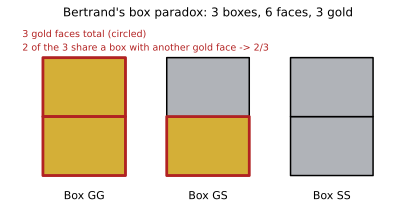

# ch04 — 貝特朗盒子悖論：你抽到的那一面也在說話

> **本章解決什麼問題**：這裡示範第二次「一個動作藏著證據」的震撼——跟 ch02 蒙提霍爾同一個數字 2/3，骨架卻早了整整一百年。你抽到的那一面（金色或銀色）不只是被動看到的結果，它本身就是一條被不均勻產生的證據，決定了另一面該怎麼算機率。本章屬於全書第二部「條件與資訊」家族，承接 ch02 蒙提霍爾、ch03 三囚犯，並在下一章 ch05 男孩女孩把「抽樣程序決定答案」這條原則推向極端。

## 從你已知的出發

1889 年，法國數學家約瑟夫·貝特朗（Joseph Bertrand，1822–1900，法蘭西學術院常任秘書，也以「貝特朗假設」——對任何大於 1 的自然數 n，n 與 2n 之間必定存在至少一個質數——聞名）出版了《機率演算》（*Calcul des probabilités*）。這本書專門用來刁難「機率直覺」，塞滿了看似簡單、實則暗藏機關的題目。其中一題後世稱為「貝特朗盒子悖論」（Bertrand's box paradox），設計極其樸素。

想像三個外觀完全一樣、裡面用隔板分成兩格的木盒，每一格放一枚硬幣：

- 盒子 GG：兩格都是金幣
- 盒子 GS：一格金幣、一格銀幣
- 盒子 SS：兩格都是銀幣

三個盒子擺在桌上，你閉著眼睛隨機挑一個盒子（三盒等機率），再隨機打開其中一格——這一格就是「你抽到的那一面」——看到的是金幣。問題來了：同一個盒子裡沒打開的另一面，也是金幣的機率是多少？

大多數人心裡幾乎是反射性地跑出這一串推理：『銀銀盒不可能給我金幣，所以剩下的候選只有金金盒和金銀盒兩種。兩者機會均等——所以另一面是金的機率就是二分之一。』這個答案聽起來乾淨俐落，連很多修過機率課的人也會脫口而出 1/2。1982 年，心理學家巴希勒與弗克（Bar-Hillel & Falk）真的把這一題（改用紙牌版本：一張紙牌兩面都紅、一張兩面都白、一張一紅一白，抽到一張紙牌看到一面是紅的，問另一面也是紅的機率）拿去問 53 名剛修過機率課的心理學系學生，35 人答 1/2，只有 3 人答對。1/2 看起來如此顯然，連受過訓練的人也大批答錯——這正是本書要抓住的那種「自信的錯答案」。

值得先說清楚一件事：這裡的「悖論」不是邏輯矛盾，也不是答案本身模糊不定——2/3 是唯一、確定、可以嚴格證明的答案。它之所以夠格叫做悖論，是因為它屬於「似非而是的悖論」（veridical paradox）：結論違反直覺、聽起來像哪裡出了錯，但嚴謹推導完全站得住腳，錯的從來不是數學，是那句被我們自己偷偷加上去的假設。這跟後面某些「答案本身依賴於怎麼定義」的悖論不同類——那些悖論的爭議還沒有蓋棺論定，這一題早在推導完成的那一刻就蓋棺論定了。

不過在往下推導之前，先排一個雷：貝特朗在同一本 1889 年的書裡，還丟出了另一個更有名、常被搞混的「貝特朗悖論」——在圓上隨機取一條弦，問弦長超過內接正三角形邊長的機率是多少（見 ch24）。那一題詭異的地方在於「隨機」本身沒定義好：三種同樣合理的隨機取法會給出三個不同答案（1/3、1/2、1/4）。本章的盒子悖論完全不是那回事：「隨機挑盒子、隨機翻一面」這個抽樣程序定義得清清楚楚，答案是唯一確定的，沒有任何歧義——出錯的地方純粹是直覺算錯了，不是題目本身有歧義。兩題同一年、同一本書、同一個作者，卻是性質完全不同的兩種「悖論」，千萬別把兩者的內容或名字互相套用。

## 把六個面攤開數一遍

要抓到直覺哪裡摔跤，最乾脆的方法不是先套公式，而是先把問題「翻譯」成一個不會出錯的表示法：別去想「盒子」，去想「面」。

三個盒子總共有六個面，把它們攤開編號：

```text
盒子 GG：  面 g1（金）  面 g2（金）
盒子 GS：  面 g3（金）  面 s1（銀）
盒子 SS：  面 s2（銀）  面 s3（銀）
```

抽樣的兩個步驟——先等機率選盒子（各 1/3），再等機率選面（各 1/2）——合起來，恰好讓這六個面「各自」有 1/3 × 1/2 = 1/6 的機率被抽到。這是關鍵的一步：**六個面是等機率的，不是三個盒子是等機率的**。三個盒子當然也是等機率（各 1/3），但「被翻到」這件事實際發生在面的層次，不是盒子的層次——每個盒子把自己的 1/3 均分給底下的兩個面。

現在把條件「你翻到的面是金的」套進去。六個面裡，金色的有三個：g1、g2、g3；其餘三個是銀色。因為六面本來就等機率（各 1/6），一旦已知翻到的是金面，就等於把樣本空間縮小到這三個金面上，並重新正規化（除以 P(金)＝3×1/6＝1/2）：每個金面的條件機率變成 (1/6)÷(1/2)＝1/3。也就是說，**在「已知翻到金」這個條件下，三個金面仍然是等機率的**。

worked example：把這三個金面逐一列出來，查它的「背面」是什麼：

```text
金面 g1 → 背面是 g2 → 金        ← 屬於盒子 GG
金面 g2 → 背面是 g1 → 金        ← 屬於盒子 GG
金面 g3 → 背面是 s1 → 銀        ← 屬於盒子 GS
```

三種等機率的情形裡，兩種背面是金，一種背面是銀。所以：

```text
P(另一面也是金 | 這一面是金) = 2/3
```

不是 1/2。這正是 B1＝2/3——沒錯，跟 ch02 蒙提霍爾切換獲勝的那個 2/3 一模一樣的數字。這不是巧合，下面會說明為什麼兩題共享同一個骨架。

## 用貝氏定理把它釘死

六面法直覺、好用，但完整的正式版本要走一次貝氏定理（Bayes' theorem），因為之後的章節（ch06 偽陽性、ch08 檢察官謬誤）都會反覆用同一套機器，這裡先把它擺正。

設三個事件為「選到的盒子」：B_GG、B_GS、B_SS，各自的事前機率（prior）：

```text
P(B_GG) = 1/3        ← 三盒等機率選一盒
P(B_GS) = 1/3
P(B_SS) = 1/3
```

設 O 為「翻到的那一面是金」這個觀察（observation）。要算的是條件機率（conditional probability）P(B_GG | O)。貝氏定理告訴我們：

```text
P(B_GG | O) = P(O | B_GG) · P(B_GG) / P(O)     ← 貝氏定理：P(H|E) = P(E|H)P(H) / P(E)
```

先算概似（likelihood）——「如果盒子真的是這一個，翻到金面的機率是多少」：

```text
P(O | B_GG) = 1      ← 金金盒兩面都金，翻哪一面都是金
P(O | B_GS) = 1/2    ← 金銀盒只有一半機會翻到金面
P(O | B_SS) = 0      ← 銀銀盒不可能翻出金
```

再用全機率公式（law of total probability）把三種情形攤開加總，算出 P(O)：

```text
P(O) = P(O|B_GG)·P(B_GG) + P(O|B_GS)·P(B_GS) + P(O|B_SS)·P(B_SS)
     = 1·(1/3)      + (1/2)·(1/3)      + 0·(1/3)
     = 1/3 + 1/6 + 0
     = 1/2                                    ← 翻到金這件事，整體發生的機率剛好一半
```

代回貝氏定理：

```text
P(B_GG | O) = (1 · 1/3) / (1/2) = (1/3) / (1/2) = 2/3
```

同理可算 P(B_GS | O) = ((1/2)·(1/3)) / (1/2) = 1/3。兩者相加剛好是 1（P(B_SS | O) = 0，銀銀盒已被完全排除）。

最後一步：如果盒子是 GG，另一面「必定」是金；如果盒子是 GS，另一面「必定」是銀。所以：

```text
P(另一面是金 | O) = P(B_GG|O)·1 + P(B_GS|O)·0 = 2/3·1 + 1/3·0 = 2/3
```

跟六面法完全一致——這不是巧合。六面法本質上就是把貝氏定理的分子分母，提前用「面的權重」算好了而已，兩種做法是同一件事的兩種寫法，只是切入的角度不同。



## 那句被偷偷帶過的字：從盒子到面

直覺卡住的地方，現在可以講得很精確了。那句「銀銀盒被排除後，金金盒跟金銀盒機會均等」，其實偷偷做了一件事：它把「在候選盒子裡挑一個」當成了均勻分佈，而真正該均勻的，是「在候選的面裡挑一個」。這兩件事在金金盒跟金銀盒「產生金色證據的能力不對等」的情況下，並不是同一件事——金金盒有兩種方式讓你翻到金（翻左邊或翻右邊，結果都是金），金銀盒只有一種方式（只有翻到那唯一的金面）。金金盒「生產」金色證據的能力，剛好是金銀盒的兩倍，所以它在事後（posterior）機率裡也該多分到兩倍的份量——2 比 1，正好是 2/3 比 1/3。

這跟 ch02 蒙提霍爾的骨架幾乎一模一樣（本章第二次用這個橋接）。蒙提霍爾裡，主持人一定會開一扇有山羊的門、且一定給你換門的規則，把「被打開的是這扇門而不是那扇」這個資訊，不均勻地灌回剩下兩扇門身上——沒被開的那扇因此扛起了原本三分之二的機率，吃下了「第一次選錯」的所有情形。這裡呢，「你翻到的這一面是金色」這個資訊，也不均勻地灌回三個盒子身上——金金盒因為兩面都能產生這個證據，吃下的機率是金銀盒的兩倍。兩題共享同一副骨架：**三個等機率的隱藏狀態，一個觀察動作對這些狀態的概似不是 1:1:1，而是某種不對稱的比例（這裡是 1:1/2:0），事後機率也跟著這個比例重新分配，而不是天真地在剩下的候選項裡打對折**。

差異也值得說清楚，不要把兩題硬套成同一件事：蒙提霍爾的資訊來源是「主持人的行動規則」（他知情，且照規則行動）；貝特朗盒子的資訊來源是「抽樣這個動作本身」——沒有誰在「選擇要不要給你看」，硬幣是不是金色只是被翻出來的既成事實。機制對機制看，兩者都在示範「觀察本身帶著不均勻的權重，不能天真地在剩下的候選項裡對半分」，但資訊被灌入的管道不一樣。

順帶一提，這其實是三個歷史上真正同構（isomorphic）的難題之一——蒙提霍爾、上一章的三囚犯問題、以及這一章的貝特朗盒子，三者的數學骨架完全相同，只是換了不同的道具（門、囚犯、盒子）包裝同一組條件機率。貝特朗盒子其實是三者裡最古老的，1889 年就寫進書裡了，比 1959 年的三囚犯、1975 年電視原型與 1990 年才被專欄帶紅的蒙提霍爾，都早了六七十年——本章把它排在第三順位，不是因為它比較晚出現，而是因為讀者已經在前兩章練過「同一個陷阱」的雷達，這裡可以更快地看穿它。

這正是本書反覆示範的那套解剖法：先讓一個聽起來理所當然的答案（1/2）站穩，再把它偷偷倚賴的假設（候選盒子本身均勻分佈）攤到桌上，最後在正確的假設下（候選的面本身才是均勻分佈）把答案嚴謹重建（2/3）。三個步驟，一步都沒少。這種「在錯的層次上假設均勻」的失誤，也不是貝特朗盒子的專利：後面 ch06 偽陽性、ch08 檢察官謬誤，都是同一種條件機率被扭曲的不同變形——那兩章扭曲的方式是把 P(證據｜某假設) 直接誤讀成 P(某假設｜證據)，跟本章「均勻分佈套錯層次」的機制不完全相同，但精神上是同一句提醒：機率的「均勻」，永遠要先問清楚——均勻，是均勻在哪一層？

## 順手推一個一般公式

同一套方法可以直接推廣，順便把「紙上推演」的題目二收個尾。假設不只三個盒子，而是 k 個金金盒、m 個金銀盒、n 個銀銀盒（k、m、n 都是非負整數，且 k+m+n ≥ 1），仍然是等機率選一盒、等機率選一面。用貝氏定理走一遍：

```text
P(金) = [k·1 + m·(1/2) + n·0] / (k+m+n)     ← 全機率公式，跟前面完全同一套步驟
      = (2k + m) / (2(k+m+n))
```

k 個金金盒合計起來的事後機率之和：

```text
P(某個金金盒 | 金) 之和 = [k·(1/(k+m+n))] / P(金)
                        = [k / (k+m+n)] / [(2k+m) / (2(k+m+n))]     ← 分子分母同乘 2(k+m+n) 消去
                        = 2k / (2k+m)
```

因為銀銀盒不可能產生金色證據、金銀盒的另一面永遠是銀，所以「另一面也是金」的機率就等於「這個盒子屬於金金盒家族」的機率：

```text
P(另一面也是金 | 這一面是金) = 2k / (2k + m)      ← 一般公式，跟 n（銀銀盒數量）完全無關
```

代入本章原題 k=1、m=1：2×1/(2×1+1)=2/3，符合。代入題目二 k=2、m=1：2×2/(2×2+1)=4/5，也符合。這個公式還告訴我們一件有意思的事：**銀銀盒的數量 n 完全不影響答案**——因為銀銀盒本來就不可能翻出金面，對「條件在金色證據之上」這件事沒有任何貢獻，會被完全篩掉。真正決定答案的只有金金盒與金銀盒的相對數量：金金盒越多、答案越逼近 1；金銀盒越多、答案越逼近 1/2；把 m 設成 0（沒有金銀盒）答案就直接是 1（見到金一定是金金盒）。這也再一次印證：**2/3 只是三個等機率盒子、恰好各一個 GG／GS／SS 這個特定組合算出來的數字，不是什麼放諸四海皆準的常數**，通用的是背後這套「先數面、再算比例」的方法。

## 自然頻率：做六百次會看到什麼

如果條件機率的代數還是讓人心裡不踏實，把它翻成一個「做很多次」的故事，常常一眼就懂。想像把這個實驗重複 600 次：每次都等機率挑一盒、再等機率翻一面，然後把結果分類數一遍。

```text
600 次裡：
  金金盒被挑中 200 次 → 翻出的面 200 次都是金
  金銀盒被挑中 200 次 → 100 次翻到金、100 次翻到銀
  銀銀盒被挑中 200 次 → 200 次都是銀

看到金面的總次數 ＝ 200（金金）＋ 100（金銀）＝ 300 次
  其中「另一面也是金」的（都來自金金盒）＝ 200 次
  ⇒ P(另一面是金 | 看到金) ＝ 200 / 300 ＝ 2/3
```

關鍵全在那個 300。看到金的 300 次裡，有 200 次來自金金盒、只有 100 次來自金銀盒——不是因為金金盒比較多（三種盒子各只有一個），而是因為金金盒每次被挑中都保證給你金面，金銀盒卻有一半的時候翻出銀面、當場就被踢出「看到金」的樣本之外。這 200 比 100 的比例，其實正是前面「數金面」那招的翻版：三個金面裡，兩個長在金金盒上——自然頻率只是把「金面的數量」統一乘上一個倍數（這裡是 100），比例當然一模一樣。同一件事，代數用符號說、自然頻率用人頭說；後面 ch06 偽陽性會把這一招用到極致：當條件機率繞得你頭暈，先問一句「一萬個人裡有幾個」，答案往往自己就浮出來。

## 直覺的陷阱

| 直覺這樣想 | 偷偷加上的假設 | 出錯的那一步 | 怎麼自我察覺 |
|---|---|---|---|
| 排除銀銀盒後，金金盒與金銀盒「機會均等」 | 把「候選盒子」當成天生均勻分佈的對象 | 忽略了每個候選盒子「生產」這個觀察證據的能力不同（概似不同） | 反問自己：這兩個候選，是不是有一個能用兩種方式產生我看到的證據、另一個只有一種？ |
| 「金幣既然出現了，機會就在兩個盒子間對半分」 | 把後驗機率（posterior）跟事前機率（prior）混為一談 | 沒有真正套用貝氏定理裡的概似項 P(觀察｜盒子) | 動手把 P(觀察｜每個候選) 都寫出來，看看是不是真的都一樣 |
| 把「盒子」當成抽樣的基本單位 | 沒意識到抽樣其實發生在「面」的層次 | 條件化在錯的粒度（granularity）上 | 問自己：「等機率」這句話，到底是套在哪一層東西上？盒子層還是面層？ |

> **那句沒說出口的話是**：你抽到的那一面，是從「所有金面」裡均勻抽出來的，不是從「含金的盒子」裡均勻抽出來的——金金盒能用兩種方式讓你看到金，金銀盒只有一種，這兩倍的差距，才是 2/3 真正的來源。

## 紙上推演

### 題目一（★，10 分鐘）

把角色對調：如果你翻到的是銀幣，問同一個盒子裡另一面也是銀幣的機率，答案還是 2/3 嗎？先憑直覺猜一次，再動手用貝氏定理或六面法算一遍，看看猜對了沒有。

### 推演解答

六個面裡，銀色的有三個：s1（來自金銀盒 GS）、s2、s3（都來自銀銀盒 SS）。逐一查背面：

```text
銀面 s1 → 背面是 g3 → 金        ← 屬於盒子 GS
銀面 s2 → 背面是 s3 → 銀        ← 屬於盒子 SS
銀面 s3 → 背面是 s2 → 銀        ← 屬於盒子 SS
```

三種等機率情形裡，兩種背面也是銀，一種背面是金。所以 P(另一面也是銀 | 這一面是銀) = 2/3，跟金色版一模一樣。

用貝氏定理也算得出同一個答案：P(銀|SS)=1、P(銀|GS)=1/2、P(銀|GG)=0，跟金色版的三個概似（1、1/2、0）只是換了盒子的名字，結構完全對稱——因為整個題目在「把金換成銀、把 GG 換成 SS」這個操作下是對稱的（金銀盒 GS 自己對自己鏡射，位置不變）。這個對稱性也是一個檢查答案的好方法：算完之後問自己「把顏色反過來，答案該不該一樣？」如果題目結構是對稱的，兩個答案就該一致；如果不一致，通常代表哪裡算錯了。

### 題目二（★★，15 分鐘）

換一批盒子：改成兩個金金盒（GGa、GGb）加一個金銀盒（GS），共三盒，沒有銀銀盒了。等機率選一盒、等機率選一面，翻到的是金。同一個盒子裡另一面也是金的機率變成多少？

### 推演解答

六面法：GGa 兩面（g1, g2）都金；GGb 兩面（g3, g4）都金；GS 一金（g5）一銀（s1）。總共六面裡五面是金（g1 到 g5）、一面是銀（s1）。逐一查五個金面的背面：

```text
g1 → g2 → 金   ← 屬於 GGa
g2 → g1 → 金   ← 屬於 GGa
g3 → g4 → 金   ← 屬於 GGb
g4 → g3 → 金   ← 屬於 GGb
g5 → s1 → 銀   ← 屬於 GS
```

五種等機率的「翻到金」情形裡，四種背面是金，一種背面是銀。所以答案是 4/5，不是 2/3——因為這批盒子裡「生產金色證據能力強」的盒子（兩個金金盒）佔了多數，證據更大幅度地灌回它們身上。

用貝氏定理驗證：P(GGa)=P(GGb)=P(GS)=1/3；P(金|GGa)=P(金|GGb)=1、P(金|GS)=1/2。P(金)=1/3+1/3+1/6=5/6。P(GGa|金)=P(GGb|金)=(1/3)/(5/6)=2/5，P(GS|金)=(1/6)/(5/6)=1/5。P(另一面金|金)=2/5+2/5=4/5，一致。這題的重點是：**2/3 不是什麼神秘的宇宙常數，它只是「三個等機率盒子、其中恰好一個兩面全金」這個特定組合算出來的比例**；換一批盒子，答案就跟著換，方法（數面、或貝氏定理）才是真正通用、可以帶著走的東西。

### 題目三（★★★，20 分鐘）

你選了一個盒子後不放回，把它反覆搖晃、隨機翻面來看（每次翻面互相獨立、各面各 1/2 機率，可能連續翻到同一面）：翻了兩次，兩次都看到金幣。這個盒子是金金盒的機率變成多少？（提示：先想清楚金銀盒連續翻出兩次金的機率是多少。）

### 推演解答

固定盒子之後，每次翻面的結果彼此獨立。金金盒每次翻都翻到金（機率 1），所以連續兩次都金的機率是 1×1=1。金銀盒每次翻到金的機率是 1/2，連續兩次都金的機率是 (1/2)×(1/2)=1/4，因為兩次獨立。銀銀盒連續兩次都金的機率是 0。

```text
P(兩次都金 | GG) = 1
P(兩次都金 | GS) = 1/4
P(兩次都金 | SS) = 0
```

全機率：P(兩次都金) = 1/3·1 + 1/3·(1/4) + 1/3·0 = 1/3 + 1/12 = 5/12。

貝氏定理：P(GG | 兩次都金) = (1/3·1) / (5/12) = (1/3) / (5/12) = 4/5。

單看一次金幣，盒子是金金盒的機率是 2/3；連續看到兩次金幣，機率跳到 4/5。這正是貝氏更新（Bayesian updating）的味道——每多一次跟「金金盒」的行為一致的證據，對「金銀盒」的懷疑就被壓縮得更兇（金銀盒要連續兩次都翻到那唯一的金面，機率只有 1/4，遠低於金金盒的必然）。如果第三次、第四次翻出來還是金，這個機率會持續逼近 1，但永遠到不了 1（因為金銀盒與銀銀盒的機率只會越乘越小，不會真的變成 0）——這一點跟「真的會撞到邊界」的吸收態（見 ch10）不一樣，值得留意兩者的差異。


## 自我檢核

1. 為什麼「排除銀銀盒後，金金盒與金銀盒五五波」這個推理站不住腳？具體錯在哪一步？
2. 用你自己的話說明「六面法」——為什麼一開始要讓六個面等機率，而不是三個盒子等機率？
3. 貝氏定理裡的 P(觀察到金｜某盒)，對這三個盒子分別是 1、1/2、0，你能不看書就把這三個數字重新推一遍嗎？
4. 如果把「金」換成「銀」重新問一次，答案會不會變？為什麼（這個對稱性從哪裡來）？
5. 貝特朗盒子悖論跟蒙提霍爾（ch02）的核心相似點是什麼？兩者的資訊管道又有什麼不同？
6. 這個悖論那句沒說出口的假設是什麼？你會怎麼用一句話跟別人解釋？
7. 貝特朗盒子悖論（這一章）跟貝特朗弦悖論（ch24）是不是同一件事？為什麼歷史上常被搞混，又該怎麼分辨兩者？
8. 如果連續翻兩次都看到金幣，機率會從 2/3 變成 4/5；如果連續翻十次都是金呢？不用算出精確數字，你能不能說出這個機率大致的走向與理由？

## 延伸閱讀

- [Bertrand's box paradox — Wikipedia](https://en.wikipedia.org/wiki/Bertrand%27s_box_paradox)：最完整的線上整理，同時給出貝氏定理版與「六枚硬幣」計數版的推導，也收錄了紙牌變體。
- Bar-Hillel, M., & Falk, R. (1982). "Some teasers concerning conditional probability." *Cognition*, 11(2), 109–122：本章引用的紙牌實驗出處——53 名心理學系學生裡只有 3 人答對 2/3，35 人誤答 1/2，是條件機率直覺失靈的經典實測數據。
- [Calcul des probabilités（原書掃描）— Gallica / 法國國家圖書館](https://gallica.bnf.fr/ark:/12148/bpt6k99602b)：貝特朗 1889 年原書的法文掃描版，想直接看當年怎麼寫這一題可以找這裡（法文原文，本章未逐字核對確切頁碼，標「未逐頁驗證」）。
- [The Three Cards Problem — Futility Closet](https://www.futilitycloset.com/2008/02/27/the-three-cards-problem/)：好讀的科普部落格整理，把六面法畫成清楚的小表格（非學術來源，內容與 Wikipedia 一致，僅供輕鬆複習）。
