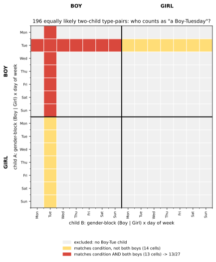

# ch05 — 男孩女孩悖論：「至少一個」這句話怎麼問的

> **本章解決什麼問題**：這是 Part II「條件與資訊」家族的第四章。蒙提霍爾（見 ch02）教我們主持人的行動規則決定條件機率；三囚犯（見 ch03）與貝特朗盒子（見 ch04）示範同一套邏輯換上不同外衣重演一次。這一章把問題再往回推一步：在你能寫下任何條件機率之前，得先確定「已知的那句話」是怎麼被講出來的——這件事本身如果沒說清楚，題目根本沒有唯一答案。下一章（見 ch06）會回到「一次檢測結果」這種更常見的條件化情境。

## 從你已知的出發

1959 年 10 月，馬丁·加德納（Martin Gardner）在《科學美國人》（Scientific American）的「數學遊戲」專欄裡，一次丟出兩道看起來像雙胞胎的題目。

> 問題一：瓊斯先生有兩個孩子。較大的孩子是女孩。兩個孩子都是女孩的機率是多少？
> 問題二：史密斯先生有兩個孩子。其中至少一個是男孩。兩個孩子都是男孩的機率是多少？

問題一幾乎不用想：「較大的孩子是女孩」把另一個孩子的性別完全隔離開來——另一個孩子是男是女各半，答案就是 1/2。這題送分，沒有人會吵。

問題二看起來只是換了個問法，難度應該差不多。多數人（包含當年多數讀者）心裡的推理長這樣：兩個孩子的性別組合有四種、等機率——老大老二依序記為「男 B、女 G」：BB、BG、GB、GG，各 1/4。「其中至少一個是男孩」排除掉 GG，剩下 BB、BG、GB 三種，看起來一樣等機率，其中只有 BB 符合「兩個都是男孩」。答案：**1/3**。

這個答案乾淨、對稱、算起來只要十秒，而且——這是關鍵——它「感覺」比問題一更嚴謹，像是在提醒自己「別掉進以為是 1/2 的陷阱」。幾十年來，不少機率教材就是這樣配對著教：問題一的答案讓人放心（1/2，少了一個孩子的資訊就完全不影響另一個），問題二才是「真正的陷阱題」，正確答案是反直覺的 1/3。多數讀者讀完解答會覺得：這題我懂了，答案就是 1/3，沒什麼好爭的。

但這裡有一件事，教材通常不會告訴你：加德納自己後來承認，問題二其實**沒有唯一答案**——除非先講清楚「其中至少一個是男孩」這句話究竟是**怎麼被講出來的**。1/3 只是其中一種講法下的答案；換一種一樣合理的講法，答案是 1/2。而如果把「男孩」換成「星期二出生的男孩」，同一套邏輯居然又能算出第三個數字：13/27。三個不同答案，同一個問題設定，差別全部藏在一句沒寫出來的話裡。

## 兩種「至少一個是男孩」：機率藏在你怎麼問這件事裡

先把問題二的樣本空間釘死。假設生男生女各自獨立、機率各 1/2（這是理想化假設——真實世界男女出生比並非精準 50/50，同卵雙胞胎的性別也不是彼此獨立，但這是題目本身的理想化設定，不影響這裡要示範的邏輯陷阱），兩個孩子依出生順序記為「老大、老二」：

```text
Ω = {BB, BG, GB, GG}          ← 每種各機率 1/4，老大在前、老二在後
```

**做法 A：從母體裡篩選「至少一個是男孩」的家庭**

這是加德納原本的推算方式，也是多數人直覺的推算方式：想像有一份全市所有「兩個孩子的家庭」名冊，先把「兩個都是女孩」的家庭整批劃掉，剩下的家庭裡隨機抽一戶。

```text
P(BB)                  = 1/4
P(至少一個是男孩)       = P(BB)+P(BG)+P(GB) = 3/4        ← 剔除 GG 那 1/4
P(BB ∣ 至少一個是男孩) = P(BB) / P(至少一個是男孩)
                       = (1/4) / (3/4) = 1/3              ← 做法 A 的答案
```

**做法 B：隨機指認一個孩子，那個孩子恰好是男孩**

換一種一樣自然的情境：你遇到史密斯先生，他身邊剛好牽著兩個孩子裡的一個，你看到那個孩子是男孩。這時你得到的資訊不是「這個家至少有一個男孩」這種存在性宣稱，而是「這個被指認出來的孩子是男孩」——你根本不知道另一個孩子的狀況。

用全機率公式攤開四種家庭型態、乘上「被指認的孩子恰好是男孩」的機率：

```text
家庭型態   P(型態)   P(被指認孩子是男孩 ∣ 型態)   兩者相乘
BB         1/4        1                           1/4      ← 兩個都是男孩，指認誰都是男孩
BG         1/4        1/2                         1/8      ← 指認老大是男孩、指認老二是女孩，各半
GB         1/4        1/2                         1/8      ← 同理
GG         1/4        0                           0        ← 不可能指到男孩

P(被指認孩子是男孩)        = 1/4+1/8+1/8+0 = 1/2
P(BB 且被指認孩子是男孩)   = 1/4
P(BB ∣ 被指認孩子是男孩)   = (1/4) / (1/2) = 1/2          ← 做法 B 的答案
```

同一句話「至少一個是男孩」，兩種一樣自然的產生方式，答案從 1/3 跳到 1/2。這不是誰算錯了——兩邊的算術都無懈可擊。差別在做法 A 是對「家庭」做條件化（一句存在性敘述篩選了整批母體），做法 B 是對「一個被指認的孩子」做條件化（單一個體恰好被觀察到是男孩）。這正是巴哈萊爾（Maya Bar-Hillel）與弗克（Ruma Falk）在 1982 年那篇〈Some teasers concerning conditional probabilities〉（《Cognition》期刊第 11 期，109–122 頁）講清楚的事：這道題目在沒有指定「資訊是怎麼取得的」（抽樣程序，sampling procedure）之前，**本質上是一道欠定問題（ill-posed problem）**——不是「正確答案是 1/3，很多人答錯成 1/2」，而是題目本身沒把話講完。

**這是全書值得停下來十分鐘的地方**：大多數轉述版本的這道題目，只給你一句「其中至少一個是男孩」，卻沒告訴你這句話是從普查式的篩選跑出來的、還是從指認某一個孩子跑出來的。兩者都是對「至少一個是男孩」這件事為真的完美描述，但它們對應到兩個不同的條件事件，機率當然不同。

回頭看本章開場的問題一，就會發現它其實完全不欠定：「較大的孩子是女孩」這句話已經**指名了是哪一個孩子**（依出生順序排在前面的那個），不是一句籠統的存在性宣稱。這等於直接把問題釘死在做法 B 那種「指認特定個體」的框架裡，沒有留下「這句話是怎麼講出來的」這種模糊空間，答案當然乾淨地是 1/2。問題二之所以吵得起來，正是因為「至少一個是男孩」用的是「至少」這個存在量詞，沒有指名是老大還是老二——這個量詞本身就是模糊的來源。這是本章第一個可以自我檢查的訊號：**題目裡有沒有指名哪一個個體**，往往就能預先判斷這題會不會有欠定爭議。

## 把「男孩」換成「星期二出生的男孩」：13/27 從哪裡來

2010 年，蓋瑞·福希（Gary Foshee）在美國亞特蘭大、每兩年一次的「加德納聚會」（Gathering for Gardner，第九屆，簡稱 G4G9）上，發表了大概是那次聚會裡最短的一場演講——多方轉述稱全文只有三句話（無一手逐字稿，以下為多方轉述版本）：

> 「我有兩個孩子。其中一個是星期二出生的男孩。我有兩個男孩的機率是多少？」

現場先是一片安靜，接著是一輪又一輪的議論。這道題目後來被稱為「星期二男孩問題」（Tuesday boy problem），廣為流傳的答案是 **13/27**——不是 1/3，也不是 1/2，而是一個介於兩者之間、比一半略小的數字（13/27 ≈ 0.4815）。多加一句「星期二出生」這種聽起來根本不該影響答案的細節，居然真的把機率從 1/3 往上推了。

要算出 13/27，用的是跟做法 A 完全相同的邏輯——只是把「男孩」這個二元類別，換成「男孩且星期幾出生」這個十四元類別。假設出生日的星期均勻分布在七天、且與性別獨立（同樣是理想化假設），每個孩子有 14 種等機率型態：男孩星期一、男孩星期二、……、男孩星期日、女孩星期一、……、女孩星期日。兩個孩子（老大、老二）的型態組合，樣本空間有 14×14 ＝ 196 種等機率結果。

```text
每個孩子的型態空間（14 種，各機率 1/14）：
  男孩：Mon Tue Wed Thu Fri Sat Sun     ← 7 種
  女孩：Mon Tue Wed Thu Fri Sat Sun     ← 7 種

兩個孩子的型態組合：14 × 14 = 196 種等機率結果
```

定義事件 D＝「老大或老二裡至少有一個是『男孩、星期二出生』」。用容斥原理數格子（對照下方的圖）：

```text
設 A = 老大是「男孩、星期二」的型態組合數 = 14      ← 老大固定，老二任意 14 種
設 B = 老二是「男孩、星期二」的型態組合數 = 14      ← 老二固定，老大任意 14 種
A ∩ B（兩個都是「男孩、星期二」）= 1

|D| = |A ∪ B| = 14 + 14 − 1 = 27               ← 27 格符合「至少一個男孩星期二」
```

再數這 27 格裡有幾格是「兩個都是男孩」（不限星期幾）：

```text
兩個都是男孩（不論星期）的格子總數 = 7 × 7 = 49        ← 老大老二各 7 種男孩型態
兩個都是男孩、但都不是星期二出生 = 6 × 6 = 36            ← 各自排除星期二，剩 6 天
兩個都是男孩、且至少一個是星期二 = 49 − 36 = 13          ← 兩者相減

P(兩個都是男孩 ∣ D) = 13 / 27                          ← 星期二男孩問題的標準答案
```

下圖把這 196 格畫出來：橫軸與縱軸都是「性別×星期」的 14 種型態，黑色粗線隔開男孩區塊與女孩區塊；黃色格與紅色格合計 27 格，是符合 D 的格子；其中紅色 13 格是「兩個都是男孩」，黃色 14 格是「符合 D 但不是兩個男孩」。



這裡要先說在前面：13/27 是「多方轉述、廣為流傳」的標準答案，但它跟做法 A 一樣，只在特定、可爭論的抽樣假設下成立——下一節會把這個爭議攤開來講。

## 一般化：把「星期幾」換成「有多細」

到這裡有一個問題值得往下多想一步：加一句「星期二出生」這種聽起來無關痛癢的細節，為什麼真的能把答案從 1/3 推到 13/27？

答案藏在「你把男孩切成幾種類別」這件事本身裡。把星期幾的種類數推廣成任意的 n（n=1 表示完全不分類、回到原本「男孩」這個二元事件；n=7 是星期幾；n=12 是月份；n=365 大約是生日），重複同一套容斥計算：

```text
每個孩子型態空間大小 = 2n（男/女 × n 個類別），兩孩組合 = (2n)² 種

|D_n|（至少一個是「男孩、類別 X」）        = 2n + 2n − 1 = 4n − 1
兩個都是男孩、且至少一個屬於類別 X 的格子數 = n² − (n−1)² = 2n − 1

P(兩個都是男孩 ∣ D_n) = (2n−1) / (4n−1)
```

代進去驗算（本書自行推導並用蒙地卡羅與窮舉兩種方式覆核，見下方紙上推演）：

| n（類別數） | 情境 | (2n−1)/(4n−1) |
|---|---|---|
| 1 | 完全不分類（原始問題二） | 1/3 |
| 7 | 星期幾 | 13/27 ≈ 0.4815 |
| 12 | 月份 | 23/47 ≈ 0.4894 |
| 365 | 生日（約，忽略閏年） | 729/1459 ≈ 0.4997 |
| → ∞ | 類別無限細分 | → 1/2 |

這張表把整章的三個數字（1/3、13/27，以及若把細節切到極限會逼近的 1/2）收進同一條公式，而不是三個各自孤立的巧合。它也順手回答了「為什麼細節越多、機率越往 1/2 靠」：類別切得越細，「至少一個屬於某個極細的類別」這件事，越來越像是在**指認一個特定的孩子**（因為滿足這個極細類別的孩子幾乎只有一個候選人），而不是在對整個母體做一次存在性篩選——也就是說，n 越大，做法 A 就越像做法 B。這條公式是本章自行推導、驗算過的延伸，不是加德納或福希本人給出的版本，但它精確解釋了「多說一句細節，答案會往哪裡移動」。

## 這道題到底有沒有「正確答案」：一場吵不完的爭論

星期二男孩問題公布之後，在部落格與 Podcast 圈引發了一輪又一輪的爭吵，而且不是「誰算錯了」的那種爭吵——雙方的算術都對，吵的是**哪一種抽樣假設才是題目原本要問的那個**。

反對 13/27 的人提出的問題很直接：現實裡，一個人會怎麼「剛好講出」一句「其中一個是星期二出生的男孩」？如果史密斯先生只是被問「你有男孩嗎」，回答「有」，這對應到做法 A 的那種存在性篩選，可以合理算出（不加星期幾版本的）1/3。但如果他一開口就主動提到「星期二出生」這種具體到有點多餘的細節，聽起來更像是在描述某一個特定的孩子（也許是剛好在旁邊那個），而不是在回答一個關於「家庭裡是否存在」的問題——這種情境其實更接近做法 B，答案應該貼近 1/2，不是 13/27。數學科普作家羅布·伊斯塔威（Rob Eastaway）在自己的部落格上直言，他向讀者徵求「一個能自然導出 1/3（或 13/27）這個答案的真實情境」，多年下來沒有人給出令他滿意的例子；他也提到主持人理查·懷斯曼（Richard Wiseman）曾在 BBC Radio 4 節目《The Infinite Monkey Cage》上出過這道題，播出後收到聽眾抗議標準答案不合理（此為部落格轉述，未逐字查證原始節目逐字稿，列入延伸閱讀供自行查核）。

這場爭論的結論，不是「13/27 是錯的」，也不是「1/3 是錯的」——是**這道題目在完整指定抽樣程序之前，兩個答案都是對某個合理情境的正確計算**。這正是巴哈萊爾與弗克 1982 年那篇論文的核心主張：欠定的不是數學，是題目的敘述。本章不打算、也不應該替讀者選一個「唯一正解」——這裡最誠實的立場是把每種計算方式都攤開，並指出決定答案的那個變數到底是什麼。

## 這種欠定性其實有個更廣的名字：參考類別問題

「同一件事，因為條件化時放進去的母體不同，算出不同機率」這個現象，在機率哲學裡有一個更廣的名字：**參考類別問題（reference class problem）**，由漢斯·萊興巴赫（Hans Reichenbach）在他 1949 年的《The Theory of Probability》一書裡明確提出討論。萊興巴赫舉的經典例子是：要算一架特定飛機失事的機率，你可以拿它去對照「全世界所有飛機」的失事率、也可以對照「同機型飛機」的失事率、還可以對照「同一家航空公司過去十年」的失事率——同一架飛機同時屬於很多個母體，不同母體給出不同數字，題目本身沒告訴你該用哪一個。

男孩女孩悖論是這個更廣問題的一個乾淨範例：做法 A 把「這個家庭」放進「所有至少有一個男孩的兩孩家庭」這個母體；做法 B 把「這個孩子」放進「被隨機指認出來的孩子」這個母體。兩個母體都合理，答案自然不同。萊興巴赫給過一個解法建議——用手上資料能支持的、最窄的母體（narrowest reference class）——但這個原則在男孩女孩悖論裡幫不上忙，因為題目根本沒告訴你母體是用哪一種規則篩出來的；「最窄」這個判準需要先知道候選母體有哪些，而這道題的癥結恰好就是候選母體不只一個、卻沒人明講選哪個。把這道題放進這個更大的家族看，能讓你認出：日後任何一次「條件機率算出來的答案讓人意外」的場合，第一個該問的問題往往是「我剛剛不自覺選了哪個母體，換一個母體答案會不會不一樣」。

## 直覺的陷阱

| 直覺在哪一步被帶偏 | 偷渡了什麼假設 | 怎麼自我察覺 |
|---|---|---|
| 看到「至少一個是男孩」就直接條件化整個母體 | 假設這句話是靠篩選整批家庭得到的（做法 A） | 問自己：這句話如果換成「隨機指認一個孩子後才知道是男孩」，答案還一樣嗎？若不一樣，題目就沒把話講完 |
| 覺得多加「星期二」這種細節不該影響機率 | 沒意識到「類別切得越細」這件事，本身就會讓存在性篩選越來越像指認單一個體 | 用本章的一般化公式 (2n−1)/(4n−1) 代入 n=1 與 n=7，親眼看到答案怎麼移動 |
| 把這裡的 1/3 和蒙提霍爾維持原選的 1/3 當成同一件事 | 誤以為兩個「1/3」出自同一種機制 | 蒙提霍爾的 1/3 來自主持人被規則綁住、必須排除一扇特定的門（見 ch02）；這裡的 1/3 來自對「至少一個是男孩」做存在性條件化——**兩者只是數字剛好相同，機制完全不同**，不要把它們焊在一起 |
| 以為機率題只要樣本空間對、算術對，答案就唯一 | 沒有意識到「條件事件是什麼」本身可能有多種同樣合理的定義 | 動筆前先把「這句話是怎麼被講出來的」寫成一句明確的假設，再開始算 |

和蒙提霍爾（見 ch02）放在一起看，這是同一個機制的第三次示範，也是本書把這個橋接來源用滿上限的一次：蒙提霍爾裡，決定條件機率的不是「有一扇門被打開」這個表面事實，而是**主持人被什麼規則綁住、才打開這扇門**——規則若換成「主持人隨機開門、剛好沒開到車」，答案就從 2/3 退回 1/2。這裡的道理完全相同：決定條件機率的不是「至少一個是男孩」這句話本身，而是**這句話是靠什麼樣的程序被講出來的**。錨點是：兩章都在說「表面事實不能單獨決定條件機率，背後產生這個事實的規則或程序才能」；邊界是：蒙提霍爾的機制是一條「主持人開門的行動規則」，這裡的機制是一條「資訊如何被抽樣或指認的規則」——結構類似，但不是同一個數學物件，兩者的「1/3」也不該互相解釋。

> **那句沒說出口的話是**：「至少一個是男孩」這句話，是靠篩選整批家庭得到的，還是靠隨機指認一個孩子、剛好發現他是男孩得到的——題目沒有講清楚是哪一種，答案就沒有講清楚是哪一個。

## 紙上推演

### 題一 ★　**[10 分鐘]**：三個孩子版

一個家庭有三個孩子，「至少一個是男孩」。求「恰好兩個是男孩」的機率。請用跟本章做法 A 相同的邏輯（對整個 8 元樣本空間做存在性條件化）算出答案。

### 推演解答

三個孩子的性別組合有 2³＝8 種，每種機率 1/8：BBB、BBG、BGB、GBB、BGG、GBG、GGB、GGG。排除 GGG（唯一「沒有男孩」的組合），剩下 7 種等機率。其中「恰好兩個是男孩」的組合有 BBG、BGB、GBB 共 3 種。答案 ＝ 3/7 ≈ 0.4286。（若題目改問「至少兩個是男孩」，則再加上 BBB，變成 4/7。）

### 題二 ★★　**[15 分鐘]**：做法 B 的三孩版

同樣三個孩子，這次資訊來源改成做法 B：隨機指認一個孩子，發現是男孩。求「恰好兩個是男孩」的機率。

### 推演解答

用全機率：8 種家庭型態各 1/8，每種型態下「被指認的孩子是男孩」的機率＝該型態裡男孩比例（BBB＝3/3＝1；BBG／BGB／GBB＝2/3；BGG／GBG／GGB＝1/3；GGG＝0）。

```text
P(被指認是男孩) = (1/8)×[1 + 3×(2/3) + 3×(1/3) + 0] = (1/8)×4 = 1/2
P(恰好兩男 且 被指認是男孩) = (1/8) × 3 × (2/3) = (1/8) × 2 = 1/4
P(恰好兩男 ∣ 被指認是男孩) = (1/4) / (1/2) = 1/2
```

做法 B 給出 1/2，做法 A（題一）給出 3/7——差距的方向跟兩孩版一致，再次證實答案取決於抽樣程序，不是孩子數量。

### 題三 ★★★　**[20 分鐘]**：把「星期二」換成「生日當天」

如果把「星期二出生」換成「某個特定日期出生」（n＝365 的近似，忽略閏年），用本章推導的一般化公式 (2n−1)/(4n−1)，n 取 365，算出這時候「兩個都是男孩」的機率，並說明這個數字為什麼幾乎等於做法 B 的 1/2。

### 推演解答

n＝365：(2×365−1)/(4×365−1) ＝ 729/1459 ≈ 0.49966。這個數字極度貼近 0.5，原因是本章一般化那節講的：當識別用的類別切得極細（365 種近乎等於「這世界上獨一無二的孩子」），做法 A 的存在性篩選幾乎就等同於「剛好指認到那唯一符合條件的孩子」，也就慢慢趨近做法 B 的邏輯與答案。

### 題四 ★　**[10 分鐘]**：回頭檢查問題一

史密斯先生換了個說法：「兩個孩子裡，弟弟（較年幼的那個）是男孩。」兩個都是男孩的機率是多少？這句話對應本章的做法 A 還是做法 B？請說明理由。

### 推演解答

這句話**指名了是哪一個孩子**（較年幼的那個），跟本章開場問題一「較大的孩子是女孩」是同一種結構——直接鎖定一個特定個體，不是「至少一個」這種存在性宣稱。這對應做法 B 的邏輯（甚至比做法 B 更乾脆，因為根本不需要「隨機指認」這一步，題目已經明講是哪一個）：弟弟已知是男孩，哥哥的性別獨立、各半，答案是 1/2。這一題再次確認了本章的判斷法則：**題目裡有沒有指名哪一個個體，決定了它是做法 A 型（存在性、會欠定）還是做法 B 型（指名式、答案通常乾淨）**。


## 自我檢核

1. 為什麼「較大的孩子是女孩」這一問，答案乾淨地是 1/2，而「至少一個是男孩」這一問卻會吵起來？兩者的條件化方式差在哪裡？
2. 做法 A 與做法 B 各自對應到什麼樣的現實情境？你能不能各自舉一個具體、聽起來自然的場景？
3. 為什麼把「男孩」換成「星期二出生的男孩」，機率反而從 1/3 上升到 13/27，而不是不變或下降？
4. 一般化公式 (2n−1)/(4n−1) 裡，n 代表什麼？為什麼 n 越大答案越接近 1/2？
5. 如果你在聊天時被問到這道題、對方等你講出「標準答案」，你會怎麼回答才誠實？
6. 這個悖論那句沒說出口的假設是什麼？為什麼它在轉述時特別容易被遺漏？
7. 這一章跟蒙提霍爾（見 ch02）的機制類比，錨點在哪裡、邊界在哪裡？為什麼兩章的「1/3」不能被當成同一件事解釋？
8. 如果題目明確寫成「我從所有育有兩個孩子、其中至少一個是男孩的家庭中隨機抽出這一戶」，答案還會有爭議嗎？為什麼這種寫法能消除欠定性？

## 延伸閱讀

- Wikipedia,〈Boy or girl paradox〉——整理了加德納原題、做法 A／B 的完整推導與星期二男孩變體，是查證本章數字最快的起點。https://en.wikipedia.org/wiki/Boy_or_girl_paradox
- Maya Bar-Hillel and Ruma Falk, "Some teasers concerning conditional probabilities," *Cognition* 11 (1982): 109–122——本章欠定性論證的原始出處，學術寫法，適合想看嚴謹版本的讀者。
- Rob Eastaway,〈The Irksome Tuesday Boy Problem〉，個人部落格——數學科普作家對這道題爭議最直白的整理，附帶他多年徵求「真實情境」未果的觀察（未完整查證原始 BBC 節目逐字稿，列為未驗證軼事）。https://robeastaway.com/blog/tuesday-boy-puzzle
- Gathering for Gardner 官方網站與 G4G9 議程 PDF——想確認蓋瑞·福希 2010 年那場三句話演講的場合背景。https://www.gathering4gardner.org/
