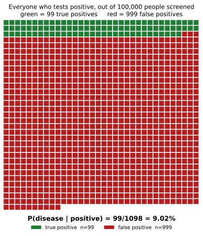

# ch06 — 偽陽性悖論：檢測很準，為什麼你多半沒病

> **本章解決什麼問題**：ch02 到 ch05 你已經用「條件機率」這把刀，一路拆開了蒙提霍爾、三囚犯、貝特朗盒子與男孩女孩四個悖論，每一次都靠著把原子結果攤開來算，贏過了直覺。這一章要把那套一直在暗地裡用、卻沒正式命名過的工具攤到台面上——貝氏定理（Bayes' theorem）的完整式——並且用它揭穿另一種更貼近日常生活的錯覺：一個聽起來「很準」的檢測，陽性結果卻可能大部分是假警報。這是 Part II（條件與資訊）的最後一章，後面 ch08（檢察官謬誤）會在法庭語境下重演同一個條件反轉，ch23（睡美人問題）也會回頭借用這裡的貝氏語言，去討論「對自己被問到這件事本身做條件化」這個更細膩的版本。

## 從你已知的出發

想像一項例行的健康篩檢，目標是某一種在人群裡並不常見的疾病。篩檢廠商在說明書上寫得清清楚楚：這項檢測的敏感度（sensitivity）是 99%，特異度（specificity）也是 99%。敏感度的意思是，一個真的有病的人，有 99% 的機會被這項檢測抓出來；特異度的意思是，一個真的沒病的人，有 99% 的機會被正確地判定為陰性。兩個數字都逼近滿分，聽起來是一項非常值得信賴的檢測。

現在，你去做了這項篩檢，報告單上寫著：陽性。

如果現在有人問你：「你覺得自己真的有這個病的機率是多少？」大多數人，包括不少受過教育、平常對數字並不陌生的人，腦中閃過的第一個念頭很可能是：「檢測準確度 99%，所以我大概有 99% 的機率真的有病。」這個念頭甚至不需要特別去「算」，它幾乎是隨著「99% 準確」這幾個字自動浮現出來的——畢竟，還有什麼比「這個測驗有 99% 的機會是對的」更直接的證據？

這個答案如此順理成章，以至於在你往下讀之前，值得先停下來問自己一句：你有多確定這個「99%」就是最終答案？本章要做的事，就是把這個看起來毫無破綻的推理過程，一步一步拆開來檢查——你會發現，答案跟 99% 差了不只一個量級，而差距的來源，不是檢測本身出了什麼問題，是這句推理裡，悄悄藏了一句從來沒有人講出口的假設。

## 沒有單一發明者的錯覺：從心理測驗到臨床診斷

這個現象在心理測驗與臨床診斷的文獻裡，其實比蒙提霍爾問題還要老上好幾十年，但它從來沒有一個像瑪麗蓮·沃斯·莎凡（Marilyn vos Savant）那樣的單一引爆點（見 ch02），而是被逐步「發現」的，找不到一位可以指名道姓的唯一發明者。

第一次把這個問題講清楚的，不是統計學家，而是兩位臨床心理學家：保羅·米爾（Paul Meehl）與亞伯特·羅森（Albert Rosen）。他們在 1955 年發表於《心理學公報》（Psychological Bulletin）第 52 卷的論文〈事前機率與心理計量徵象、模式或切分點的效率〉（Antecedent probability and the efficiency of psychometric signs, patterns, or cutting scores）裡指出：設計心理測驗、精神疾病篩檢量表的人，經常忽略了「這個病或這個特質，在受測母體裡本來有多常見」這件事，只顧著吹噓測驗本身的命中率（hit rate）與假警報率（false alarm rate）。這正是本章「基率（base rate）」這個概念，最早被系統性點名的地方——基率，就是在你看到任何測驗結果之前，這件事在母體裡原本發生的頻率。

米爾與羅森講的是測驗設計者的疏忽，真正把這個疏忽變成一個可以在實驗室裡重複驗證的「人類認知傾向」，要等到將近二十年後。心理學家丹尼爾·康納曼（Daniel Kahneman）與阿莫斯·特沃斯基（Amos Tversky）從 1970 年代初開始一系列研究，其中 1973 年發表的論文〈論預測的心理學〉（On the Psychology of Prediction）裡，做過一個著名的實驗：受試者拿到一份簡短的人格側寫，被告知這份側寫是從一群專業人士裡隨機抽出來的——一組受試者被告知這群人裡有 70 位工程師、30 位律師；另一組被告知比例正好相反，30 位工程師、70 位律師。照理說，同一份側寫在兩種基率之下，「這人是律師」的判斷應該有明顯差異——基率是 70 位律師的那組，理當估得更高。但康納曼與特沃斯基發現，受試者幾乎完全忽略了這個基率差異，只憑側寫內容「像不像」刻板印象中的工程師或律師來判斷，兩組給出的估計值幾乎一樣。他們把這種「用相似度取代機率、順手把基率丟掉」的思考捷徑，稱為代表性捷思（representativeness heuristic）——而忽略基率所導致的錯誤，後來被稱為基率謬誤（base rate fallacy）。

本章要處理的偽陽性悖論，是基率謬誤最戲劇化、也最貼近生活的一個特例：場景換成醫療篩檢，基率換成疾病盛行率，而「像不像刻板印象」換成了「測驗聽起來準不準」。

## 貝氏定理：把兩個方向的機率拆開

要看清楚這裡到底發生了什麼事，需要先把「準確」這個含糊的形容詞，拆成兩個方向不同的條件機率（conditional probability）。檢測手冊上印的兩個數字，分別叫敏感度（sensitivity）與特異度（specificity）：

- 敏感度 = P(陽性|有病)——一個真的有病的人，測出陽性的機率。本章設定為 99%。
- 特異度 = P(陰性|沒病)——一個真的沒病的人，測出陰性的機率。本章設定也是 99%。

這兩個數字，條件都寫在「已知一個人的真實健康狀態」這一側，結果是「測驗會給出什麼」。但拿到一張陽性報告單的人，想問的其實是反方向的問題：P(有病|陽性)——已知測驗給出的結果，回推自己真實的健康狀態。這兩個機率，方向完全相反，數值上沒有理由相等，中間還隔著一樣東西：基率，也就是這個病在受測母體裡，原本有多常見。

把方向反過來的工具，是貝氏定理（Bayes' theorem）：

```text
P(H|E) = P(E|H)·P(H) / P(E)
```

這裡 H（hypothesis）代表「有病」這個假設，E（evidence）代表「測出陽性」這個證據。P(H) 是先驗機率（prior probability）——沒看到任何測驗結果之前，你對「這個人有病」的信念，也就是基率／盛行率。P(E|H) 是概似（likelihood）——已知有病，測出陽性的機率，也就是敏感度。P(H|E) 是後驗機率（posterior probability）——看到陽性結果之後，更新過的「有病」信念。分母 P(E) 是「不管有沒有病，都測出陽性」這件事本身的整體機率，要把有病與沒病兩條路徑都算進去：

```text
P(E) = P(E|H)·P(H) + P(E|非H)·P(非H)
```

這一整套公式，其實在 ch02（蒙提霍爾）、ch03（三囚犯）、ch04（貝特朗盒子）、ch05（男孩女孩）裡都已經用過——只是當時是把它拆解成一步步的原子結果去算，沒有把公式寫成這個可以直接套用的一般式。本章要做的，是把工具擺到台面上，給它一個名字，因為後面 ch08（檢察官謬誤）會在法庭語境下重演一次同一個條件反轉，ch23（睡美人問題）也會用它討論一個更細膩的版本。

## 完整推導：把數字代進去

現在把本章的三個基準數字代進貝氏定理：盛行率（基率）P(有病) = 1/1000，敏感度 = 特異度 = 99%。

```text
已知：
  P(有病)     = 1/1000 = 0.001          ← 基率，本章設定
  P(沒病)     = 1 − 0.001 = 0.999
  P(陽性|有病) = 99%   = 0.99            ← 敏感度
  P(陰性|有病) = 1 − 0.99 = 0.01          ← 假陰性率
  P(陰性|沒病) = 99%   = 0.99            ← 特異度
  P(陽性|沒病) = 1 − 0.99 = 0.01          ← 假陽性率

第一步，算 P(陽性) 這個分母，兩條路徑都要算：
  P(陽性) = P(陽性|有病)·P(有病) + P(陽性|沒病)·P(沒病)
          = 0.99 × 0.001 + 0.01 × 0.999      ← 有病且測出陽性，加上沒病卻測出陽性
          = 0.00099 + 0.00999
          = 0.01098                          ← 每1000人裡，約有10.98人會測出陽性

第二步，代入貝氏定理：
  P(有病|陽性) = P(陽性|有病)·P(有病) / P(陽性)
              = 0.00099 / 0.01098
              ≈ 0.0902
              = 9.02%                        ← 這就是本章的答案
```

對照基準表的寫法，同一個結果可以寫成：P(有病∣陽性)＝(0.001·0.99)/(0.001·0.99+0.999·0.01)≈0.0902。

這個結果，和你在「從你已知的出發」裡給出的自信答案（接近 99%）相差了超過十倍。檢測本身沒有任何問題，敏感度、特異度都確實是 99%，計算過程也沒有一步用到近似或省略——差距完全來自那個被忽略的基率：這個病本來就非常罕見，所以即使測驗的假陽性率只有 1%，套用在「沒病的人數遠遠多過有病的人數」這個現實上，假陽性的絕對人數依然會遠遠超過真陽性的人數。

## 自然頻率版：把 100,000 人攤開來看

如果上面那組小數點算式讓你覺得抽象，有一個等價、卻讓大多數人瞬間就能算對的辦法：別算機率，改算人頭。這個技巧叫自然頻率（natural frequency），心理學家格爾德·蓋格瑞澤（Gerd Gigerenzer）與烏爾里希·霍夫拉格（Ulrich Hoffrage）在 1995 年發表於《心理學評論》（Psychological Review）的研究裡證明過：把同一道貝氏題目，從「機率的語言」翻譯成「自然頻率的語言」，受試者答對的比例可以從不到一成跳到接近一半——問題從來不是人腦不會算貝氏定理，而是機率的敘述方式，把有方向性的資訊藏得太深。

具體做法是：想像一個具體、夠大的母體，直接數人頭，而不是套用抽象的百分比。假設有 100,000 人接受這項篩檢：

| | 有病（100 人） | 沒病（99,900 人） | 合計 |
|---|---|---|---|
| 測出陽性 | 99（真陽性） | 999（假陽性） | 1,098 |
| 測出陰性 | 1（假陰性） | 98,901（真陰性） | 98,902 |
| 合計 | 100 | 99,900 | 100,000 |

逐格算給你看：盛行率 1/1000，代表 100,000 人裡有 100 人真的有病，其餘 99,900 人沒病。敏感度 99%，代表 100 位病人裡有 99 位測出陽性（100×0.99=99），剩下 1 位測出陰性（假陰性）。特異度 99%，代表 99,900 位健康人裡有 99% 測出陰性，也就是 99,900×0.99=98,901 位真陰性，剩下的 99,900×0.01=999 位測出陽性（假陽性）。

現在只看「測出陽性」這一整列：一共有 99+999=1,098 人。這 1,098 人裡，真正有病的只有 99 人。你要的答案，就是這個比例：

```text
P(有病|陽性) = 99 / 1,098 ≈ 0.0902 = 9.02%
```

跟前一節用小數點算出來的答案一字不差——這不是巧合，自然頻率法和貝氏定理的小數點算式，本來就是同一件事的兩種寫法，只是自然頻率法把「分母要包含兩條路徑」這件事，變成了「把兩欄人數加起來」這麼直觀的動作，不需要記住任何除法公式背後的道理。



這張圖要你看的重點很直接：紅色區塊的面積，大約是綠色區塊的十倍。這不是誇飾，而是逐格點數出來的事實——999 個紅色方塊，對上 99 個綠色方塊。如果你被隨機丟進「測出陽性」這一整群人裡，落在紅色（沒病、卻被誤判）裡的機會，遠遠大過落在綠色（真的有病）裡的機會。這張圖只畫出測出陽性的 1,098 人，是 100,000 人裡最終需要回答「我現在該有多擔心」的那一小群人。

## 具名案例：當醫師也中招

自然頻率的方格圖能幫大多數人算對，但假如把同一道題目丟給受過專業訓練的醫師，他們就不會犯這個錯了嗎？歷史上有一次調查，直接測試了這件事。

醫療決策研究者大衛·艾迪（David Eddy）在 1982 年做過一項調查，受訪對象是 100 位執業醫師，題目情境和本章的骨架幾乎一模一樣，只是換了一種真實的癌症篩檢：乳癌盛行率 1%，乳房攝影檢查（mammography）的敏感度 80%，假陽性率 9.6%（相當於特異度 90.4%）。把這三個數字代進上一節同一套貝氏定理：

```text
P(有病|陽性) = (0.01×0.80) / (0.01×0.80 + 0.99×0.096)
             = 0.008 / (0.008 + 0.09504)
             = 0.008 / 0.10304
             ≈ 0.078 = 7.8%
```

正確答案是大約 7.8%。艾迪的調查結果卻顯示，多數受訪醫師嚴重高估了這個機率，普遍給出 70% 到 80% 之間的估計值，和正確答案相差了近十倍——跟你在本章開頭給出的那個「接近 99%」的直覺答案，犯的是同一種錯。有幾份轉載這項研究的文獻進一步指出，100 位醫師裡多達 95 位給出了遠高於正確值的估計；不過這個「95 位」的精確數字，以及假陽性率究竟是 9.6% 還是不同轉述版本裡出現的 10%（對應正確答案 7.8% 或 7.5% 上下的些微差異），本書未能直接核對艾迪原始出版品的章節內文（該研究收錄於 1982 年出版的論文集《Judgment Under Uncertainty: Heuristics and Biases》），這裡保留這個不確定性，不把任何一個轉述版本寫死（未驗證）。

無論精確數字如何，這個案例真正確立的一件事沒有爭議：即使是每天與檢驗報告打交道的專業醫師，同樣會把 P(陽性|有病)——測驗手冊上保證的那個方向——直接套用到 P(有病|陽性) 這個病人真正想問、方向相反的問題上。犯這個錯，跟受不受過統計訓練關係不大，真正的破口在於問題呈現的方式，把兩個方向的機率，用同一個「準確」的說法，焊在了一起。

## 直覺的陷阱

回頭看本章開頭，你我在還沒學會這套解法之前，幾乎注定會脫口而出「測出陽性，大概 99% 有病」這個答案。把這整套錯覺拆開來看：

| 階段 | 發生了什麼 |
|---|---|
| 直覺的自信答案 | 檢測敏感度、特異度都是 99%，所以陽性結果應該有 99% 的把握代表有病 |
| 偷渡的假設 | 把 P(陽性\|有病)（敏感度，檢測手冊保證的方向）悄悄當成 P(有病\|陽性)（受檢者真正想問、方向相反的問題），同時整個算式裡完全沒有給基率（盛行率）留位置 |
| 為什麼聽起來理所當然 | 「準確」在日常語言裡是個沒有方向的形容詞，兩個方向的機率剛好又都印著同一個「99%」，視覺上長得一模一樣，很容易被腦補成同一件事；而且基率是一個要另外去查、不會自動出現在檢測報告上的數字，不主動去想，它就直接從算式裡消失了 |
| 在哪一步被帶溝裡 | 不是算術算錯，而是在看到題目的那一瞬間，就已經把問題的條件和結果調換了方向——這一步比任何除法都早發生，發生在你甚至還沒開始「計算」之前 |
| 怎麼自我察覺 | 每次看到「X% 準確」，先停下來把它翻譯成 P(・\|・) 的符號，問自己：這個百分比的條件寫在哪一側？是「已知真相」還是「已知證據」？接著再問一次：這件事本身，在母體裡有多常見？如果你答不出第二個問題，代表你手上的資訊還不夠回答「有病∣陽性」這個真正的問題 |

值得指出的是，這個條件反轉（把 P(E|H) 誤當 P(H|E)）並不是醫療檢測特有的錯覺——同一個結構，換上法庭的外衣，會在 ch08（檢察官謬誤）裡重演一次：「這種巧合在清白者身上只有百萬分之一」，聽起來很像「被告清白的機率只有百萬分之一」，但兩者是完全不同方向的兩個機率，中間一樣隔著一個常被忽略的基率（這裡是「無辜者的比例」）。認出這個母題，是本章留給你最值錢的一件工具。

> **那句沒說出口的話是**：檢測「準確」只保證了 P(陽性∣有病) 與 P(陰性∣沒病) 這兩個方向，卻沒有保證你真正想問的反方向 P(有病∣陽性)——後者的答案，一大半是由那個沒人主動提起的基率決定的。

## 紙上推演

**練習 1（★，10 分鐘）**：假設篩檢對象換成一種比較常見的疾病，盛行率從 1/1000 提高到 1/100（其餘不變：敏感度=特異度=99%）。請重新代入貝氏定理，算出 P(有病|陽性)。跟本章正文的 9.02% 相比，這個結果告訴你「基率」這個變數的威力有多大？

**練習 2（★★，15 分鐘）**：維持本章的盛行率 1/1000 與敏感度 99% 不變，但把特異度從 99% 降到 95%（也就是假陽性率從 1% 上升到 5%）。重新算一次 P(有病|陽性)。如果這個結果讓你意外，想一想：對一個本來就很罕見的疾病而言，「特異度」和「敏感度」哪一個對後驗機率的影響比較大？為什麼？

**練習 3（★★★，20 分鐘）**：延續本章的盛行率 1/1000、敏感度 99%，這一次反過來問：特異度至少要提高到多少，才能讓 P(有病|陽性) 達到 50%（也就是陽性結果終於變成「真的有一半機會」）？先寫出一般式，再代入數字求解。

### 推演解答

**練習 1 解答**：代入貝氏定理：

```text
P(陽性) = 0.99 × 0.01 + 0.01 × 0.99
        = 0.0099 + 0.0099
        = 0.0198

P(有病|陽性) = (0.99 × 0.01) / 0.0198
             = 0.0099 / 0.0198
             = 0.5 = 50%
```

盛行率提高 10 倍（從 1/1000 到 1/100）之後，同一個檢測的陽性後驗機率，從 9.02% 跳到剛好 50%。這組數字不是巧合，而是坊間最常見的「貝氏定理教學範例」——盛行率 1%、敏感度與特異度都是 99% 的組合，算出來的答案剛好是一枚公正硬幣的機率，常被拿來當作「貝氏更新最乾淨的入門例子」。它告訴你：同一個檢測工具，套用在不同的母體上，答案可以天差地遠——決定答案的，從來不是檢測本身，而是檢測遇到的那個母體有多罕見。

**練習 2 解答**：特異度從 99% 降到 95%，代表假陽性率從 1% 上升到 5%。代入：

```text
P(陽性) = 0.99 × 0.001 + 0.05 × 0.999
        = 0.00099 + 0.04995
        = 0.05094

P(有病|陽性) = 0.00099 / 0.05094
             ≈ 0.01943 = 1.94%
```

後驗機率從 9.02% 掉到只剩 1.94%，掉得比想像中更多。原因在於：當疾病本身極為罕見時，「沒病的人」永遠佔壓倒性多數（這裡是 99.9%），所以決定分母大小的，幾乎完全是「沒病卻測出陽性」這一項——也就是特異度。敏感度只影響那極少數真正有病的人裡，有幾成會被抓到，對分母影響微乎其微。這就是為什麼在罕見疾病的篩檢設計上，特異度的重要性通常遠高於敏感度：提高特異度 1 個百分點省下的假陽性人數，遠比提高敏感度 1 個百分點多抓到的真陽性人數更多。

**練習 3 解答**：先寫出一般式。令特異度為 s，盛行率 p=0.001、敏感度 a=0.99 固定：

```text
P(有病|陽性) = p·a / (p·a + (1−p)(1−s))

令這個值等於 0.5，兩邊同乘分母：
  p·a = (1−p)(1−s)
  (1−s) = p·a / (1−p)
  s = 1 − p·a/(1−p)
```

代入數字：

```text
1 − s = (0.001 × 0.99) / (1 − 0.001)
      = 0.00099 / 0.999
      ≈ 0.0009910

s ≈ 1 − 0.0009910 = 0.9990090 ≈ 99.90%
```

特異度必須拉高到大約 99.90%（假陽性率壓到不到千分之一），才能讓一個盛行率只有千分之一的疾病，在陽性結果下達到五五波的可信度。這個結果值得停下來感受一下：本章開頭那個聽起來已經很不錯的「99% 特異度」，對一個千分之一的罕見疾病來說，遠遠不夠格——要把後驗機率拉到堪用的水準，特異度得再往上擠出足足一個百分點以上的精度，而這在真實世界的檢測技術裡，往往是最昂貴、最難做到的那一段。


## 自我檢核

1. 敏感度（sensitivity）和特異度（specificity）分別是哪個方向的條件機率？它們各自的條件寫在等式的哪一側？
2. 為什麼「檢測準確度 99%」這句話本身沒有告訴你陽性結果代表什麼，你還需要另外知道哪一個數字才能回答？
3. 用自己的話解釋一次，為什麼盛行率越低，同樣一個檢測的陽性後驗機率就越糟（可以用練習 3 的一般式來輔助說明）。
4. 自然頻率法（把 100,000 人攤成人數表）和貝氏定理的機率算式，兩者算出的答案為什麼會一字不差？它們是同一件事的兩種寫法，還是兩種不同的方法？
5. 這個悖論那句沒說出口的假設是什麼？試著不看課文，用自己的話重講一次。
6. Eddy 1982 的調查裡，醫師犯的錯跟你在本章開頭犯的錯，結構上是同一個錯誤嗎？受過統計訓練是不是能自動避免這種錯覺？
7. 練習 2 告訴你，對罕見疾病而言，特異度通常比敏感度更關鍵。這個結論，對於「篩檢工具該優先改良哪個指標」這種現實決策有什麼啟發？
8. 這一章的條件反轉（把 P(陽性|有病) 誤當 P(有病|陽性)），跟 ch08 檢察官謬誤裡的條件反轉，差別只在換了場景，還是在數學結構上也有什麼不同？

## 延伸閱讀

- 〈Base rate fallacy〉，Wikipedia——基率謬誤的總覽條目，收錄多個經典教學範例與心理學文獻的索引，可作為本章計算的交叉核對。<https://en.wikipedia.org/wiki/Base_rate_fallacy>
- Bar-Hillel, M. (1980). The base-rate fallacy in probability judgments. *Acta Psychologica*, 44(3), 211–233.——最早系統性整理「人類為什麼會忽略基率」這個現象的心理學論文之一，把 Meehl 與 Rosen 的臨床觀察與 Kahneman、Tversky 的實驗室發現串成一條完整的研究脈絡。
- Gigerenzer, G., & Hoffrage, U. (1995). How to improve Bayesian reasoning without instruction: Frequency formats. *Psychological Review*, 102(4), 684–704.——本章「自然頻率」解法的原始出處，證明把同一道貝氏題目換一種呈現方式，受試者的正確率可以大幅提升。
- Eddy, D. M. (1982). Probabilistic reasoning in clinical medicine: Problems and opportunities. 收錄於 Kahneman, D., Slovic, P., & Tversky, A. (Eds.), *Judgment Under Uncertainty: Heuristics and Biases*. Cambridge University Press.——本章具名案例的原始出處；盛行率、敏感度、特異度的具體數字見本章正文，「95 位醫師」這個常被轉載的精確版本，本書未能直接核對原書章節內文（未驗證）。
- Meehl, P. E., & Rosen, A. (1955). Antecedent probability and the efficiency of psychometric signs, patterns, or cutting scores. *Psychological Bulletin*, 52(3), 194–216.——最早點名「心理測驗設計者忽略基率」這個問題的論文，是本章歷史脈絡的起點。
