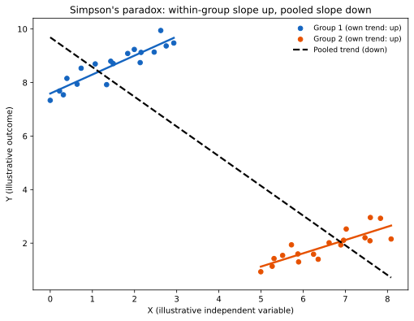

# ch07 — 辛普森悖論：每組都贏，合起來卻輸

> **本章解決什麼問題**：Part II（ch02～ch06）拆的是「一個動作洩漏了什麼資訊」——條件機率被直覺算反了方向。Part III 換一個角度看資料怎麼騙人：這裡條件機率沒有算錯，錯的是「把資料合起來看」這個動作本身。本章的辛普森悖論（Simpson's paradox）示範一件聽起來不可能發生的事：每一個分組都是甲勝過乙，把所有分組合併起來看，答案卻反過來變成乙勝過甲。後面 ch08（檢察官謬誤）換一種機制騙你——把 P(證據∣清白) 誤當成 P(清白∣證據)；ch09（生日問題）則是計數本身出乎意料。三章共用「聚合、計數的代價」這個 Part 主題，但機制彼此不同，別把它們混成同一件事。

```text
沒說出口的那句 — 八個部分

  I   解剖學 ────────── ch01 三步解剖：直覺／假設／重建
  │
  II  條件與資訊 ────── ch02 蒙提霍爾 · ch03 三囚犯 · ch04 貝特朗盒子
  │                     ch05 男孩女孩 · ch06 偽陽性
  III 因果聚合計數 ──── ch07 辛普森 · ch08 檢察官謬誤 · ch09 生日問題   ◄ 你在這裡
  IV  漫步與賭局 ────── ch10 賭徒輸光 · ch11 賭徒謬誤與熱手
  │                     ch12 聖彼得堡 · ch13 兩個信封 · ch14 帕隆多
  V   共同知識 ──────── ch15 紅藍眼睛 · ch16 泥巴小孩
  │                     ch17 意外絞刑 · ch18 兩位將軍
  VI  選擇與集體 ────── ch19 非傳遞骰子 · ch20 孔多塞 · ch21 布雷斯 · ch22 紐康
  VII 隨機與測度 ────── ch23 睡美人 · ch24 貝特朗弦 · ch25 班佛 · ch26 巴拿赫–塔斯基
  VIII 收官 ─────────── ch27 一張假設類型總表
```

## 從你已知的出發

1973 年秋天，美國加州大學柏克萊分校（University of California, Berkeley）研究生院公布了那一年的錄取數字：男性申請者的錄取率是 44%，女性申請者的錄取率是 35%，兩者差了九個百分點。這個落差的規模，大到用統計檢定去看都不太像是隨機抽樣的雜訊——換句話說，「純屬巧合」這個解釋幾乎可以排除。1970 年代初，正是美國性別平權訴訟風起雲湧的年代，校方擔心的不是名聲受損，而是被告上法庭。於是研究生院找來三位統計學家——彼得・比克爾（Peter Bickel）、尤金・哈梅爾（Eugene Hammel）、威廉・奧康奈爾（William O'Connell）——請他們仔細核對，問題到底出在哪個環節。

那一年，研究生院總共收到 12,763 份申請，分別投給 101 個系所，其中 8,442 位是男性申請者、4,321 位是女性申請者（這兩個數字加起來才是 12,763，不是某一個性別單獨的申請人數——下一節會說明，為什麼這一點值得特別強調）。

在往下讀之前，先誠實面對一下自己的直覺。如果整體上男性錄取率硬是比女性高出九個百分點，而且這個落差大到不太可能是抽樣誤差，那麼當你把這 12,763 人拆進 101 個系所裡個別檢視，你會預期看到什麼？大多數人——包括當年委託這項調查的校方本身——心裡幾乎是脫口而出同一個答案：「大部分系所裡，男性錄取率應該也比女性高，不然這九個百分點的落差，到底是從哪裡冒出來的？」這個想法聽起來天衣無縫：九個百分點不是憑空生出來的，它一定得從某個地方來——如果不是來自「多數系所都對男性比較寬鬆」，又能來自哪裡？

這正是 1973 年這場真實調查，一開始想找到的答案：具體是哪幾個系所在系統性地卡女性申請人。三位統計學家真正把資料拆開之後看到的東西，卻完全不是這麼一回事。

## 一個效應、三個年代，卻沒有一個名字是本人取的

在揭曉柏克萊的答案之前，值得先花一點篇幅講清楚：這個「合併之後結論反過來」的現象，並不是 1973 年才被發現的新鮮事，它的命名史其實比大多數人以為的更曲折，也是這類統計軼事裡最容易被寫錯的一段。

最早把這個現象寫下來的人，不叫辛普森。英國統計學家卡爾・皮爾森（Karl Pearson）在 1899 年的論文裡，已經指出把不同群體的資料合併，會製造出「虛假的相關（spurious correlation）」；喬治・尤爾（George Udny Yule）在 1903 年的論文〈統計學中屬性關聯理論的註記〉（Notes on the Theory of Association of Attributes in Statistics）裡，用構造出來的數字例子，具體展示了關聯的方向如何在合併資料後反轉。這也是為什麼這個效應在比較講究歷史精確的文獻裡，常被稱為「尤爾－辛普森效應（Yule–Simpson effect）」——皮爾森、尤爾都比辛普森早了將近半個世紀。

真正頂著「辛普森」這個名字的那篇論文，作者愛德華・辛普森（Edward H. Simpson）當時其實只是劍橋大學的一名研究生。他在 1946 年寫成這篇論文，指導老師是莫里斯・巴特利特（Maurice Bartlett）；論文一直擱到 1951 年，才因為巴特利特自己要在別處引用它，推薦拿去發表——刊登於《皇家統計學會期刊乙輯》（Journal of the Royal Statistical Society, Series B）第 13 卷第 2 期，題目是〈列聯表中交互作用的詮釋〉（The Interpretation of Interaction in Contingency Tables）。論文裡辛普森自己舉的例子，是某種藥物的療效在男性、女性兩個子群裡分別看都有效，但把兩個子群的資料合併起來看，效果卻消失，甚至可能反過來變成負的。值得說清楚的是：辛普森本人的論文，從頭到尾沒有用「paradox」這個詞去描述這個現象，更沒有拿自己的名字為它掛牌——他只是分析了一個統計上的交互作用問題。

「辛普森悖論（Simpson's paradox）」這個名字，是 21 年後別人幫他取的。1972 年，統計學家科林・布萊斯（Colin R. Blyth）在《美國統計學會期刊》（Journal of the American Statistical Association）第 67 卷第 338 期發表〈論辛普森悖論與必然之事原則〉（On Simpson's Paradox and the Sure-Thing Principle），文中不只鑄造了這個名字，還進一步證明：把辛普森原本的藥物例子稍微改一下數字，合併後的效應甚至可以整個反過來變成強烈的負向——原本各子群都顯示藥有效，合併卻可能顯示藥有害。

把這段命名史攤開來看，你會發現一件耐人尋味的事：這個以「辛普森」為名的效應，命名紀念的那個人，既不是最早發現它的人（皮爾森、尤爾都早了他幾十年），也不是替它取名字的人（布萊斯才是），甚至連他自己的論文裡都沒有出現「悖論」這個字眼。辛普森本人，某種意義上只是運氣好，寫了一篇被巴特利特看中、後來又被布萊斯拿來當靶子的論文。

## 打開黑箱：101 個系所裡到底發生了什麼

回到 1973 年的柏克萊。比克爾、哈梅爾、奧康奈爾三人把 12,763 份申請，一個系所一個系所拆開來看之後，發現的畫面跟校方原本的猜測完全相反：在絕大多數系所裡，女性申請者的錄取率跟男性相比，不是持平就是**更高**，幾乎找不到「哪個系刻意卡女性」的具體證據。三人在 1975 年把結果寫成論文，發表於《科學》（Science）期刊第 187 卷第 4175 期，標題直白地寫著〈柏克萊研究生錄取的性別偏見資料〉（Sex Bias in Graduate Admissions: Data from Berkeley），結論寫得很清楚：錄取委員會這一層，看不出系統性歧視女性的模式。

這裡有一個查證時特別容易踩到的陷阱，值得先攤開來講清楚：整體錄取數字裡的「12,763」，指的是**男加女的申請總人數**，不是任何單一性別的人數——男性申請者是 8,442 人、女性申請者是 4,321 人，兩者相加才是 12,763。如果哪個版本的敘述把「12,763」直接標成男性申請人數，那是把總數誤植成分項數字，值得每次引用前重新核對一次（這正是本章寫作時，對照《科學》期刊原始論文摘要與多個獨立資料庫重新核算後，修正掉的一處錯誤，也是本章最值得留意的一條查證教訓）。

另外還有一點需要誠實留一點餘地：原始論文並沒有把全部 101 個系所都做到同樣細緻的統計分析，實際上只有大約 85 個系所留下了足夠做逐系分析的資料；而後來教科書、統計軟體裡最常被拿出來當範例的，是其中**六個申請人數最多的系所**（依慣例標作 A 到 F），合計 4,526 份申請——大約占 12,763 份申請的三分之一。這六個系所的完整原始人數，被收錄進統計軟體 R 的內建資料集 UCBAdmissions，成為後來幾乎每一本統計教科書複述辛普森悖論時，採用的標準版本。下一節先用一組自己構造的乾淨數字，把反轉的機制看清楚，再回頭用這份有完整、可驗證原始人數的六系資料驗證一次。

## 完整推導：先用一組乾淨數字，看清楚反轉怎麼發生

在把六個真實系所的數字攤開之前，先用一組刻意設計、純粹是為了把機制看清楚的教學範例——**這組數字不對應任何真實系所，是本章自己構造的乾淨反轉例子**——把加權平均這件事情的機制，一步一步算給你看。

假設一所虛構大學只有兩個系：系甲、系乙。

```text
系甲（門檻低、規模大）：
  男性申請 100 人，錄取 80 人 → 錄取率 80/100 = 80%
  女性申請  10 人，錄取  9 人 → 錄取率  9/10  = 90%     ← 系甲裡，女性錄取率更高

系乙（門檻高、規模小，卻是女性申請的主力）：
  男性申請  10 人，錄取  1 人 → 錄取率  1/10  = 10%
  女性申請 100 人，錄取 20 人 → 錄取率 20/100 = 20%     ← 系乙裡，女性錄取率同樣更高
```

先確認一件事：兩個系裡，女性錄取率都比男性高——系甲 90% 大於 80%，系乙 20% 大於 10%，沒有任何一個系偏袒男性。如果你相信「每組都贏、合起來也該贏」，現在你會預期：把兩系的男性、女性分別加總之後，女性的整體錄取率應該還是比男性高。把它老老實實加總算一次：

```text
男性總計：100 + 10 = 110 人申請，80 + 1 = 81 人錄取
  男性整體錄取率 = 81 / 110 ≈ 0.7364 = 73.6%

女性總計：10 + 100 = 110 人申請，9 + 20 = 29 人錄取
  女性整體錄取率 = 29 / 110 ≈ 0.2636 = 26.4%
```

兩個系裡都是女性領先，合併起來，男性 73.6% 對女性 26.4%——反轉了，而且反轉的幅度大到誇張。這正是辛普森悖論最赤裸的樣子：局部的排序，和整體的排序，完全相反。

把整體錄取率換一種寫法，你會更清楚看出反轉是怎麼被「灌」出來的——整體錄取率其實是**加權平均**，權重就是這個群體在各系申請人數所佔的比例：

```text
男性整體錄取率 = (100/110)×80% + (10/110)×10%
              = 0.9091×0.80 + 0.0909×0.10
              = 0.7273 + 0.0091 = 0.7364            ← 與直接加總算出的結果一致

女性整體錄取率 = (10/110)×90% + (100/110)×20%
              = 0.0909×0.90 + 0.9091×0.20
              = 0.0818 + 0.1818 = 0.2636             ← 同上，互相驗證
```

答案就藏在這兩行的權重裡：男性申請人裡有 90.9%（100/110）集中在門檻低、錄取率高的系甲，只有 9.1% 落在門檻高的系乙；女性申請人恰好相反，90.9%（100/110）集中在門檻高、錄取率低的系乙，只有 9.1% 落在系甲。男性的整體平均，幾乎完全被系甲那個 80% 的高錄取率拉高；女性的整體平均，則幾乎完全被系乙那個 20% 的低錄取率拉低——即使女性在系甲、系乙個別都贏，「兩性申請系所的比例天差地遠」這件事本身，比「個別系所裡誰的錄取率比較高」這件事，對整體平均的影響更大。

值得停下來想十分鐘的地方是：這不是任何一方在說謊、也不是計算過程哪裡出錯，兩個數字——73.6% 和 26.4%——跟四個系級數字（80%、90%、10%、20%）完全相容，沒有任何矛盾。矛盾感只存在於直覺裡，因為直覺把「加權平均」偷偷簡化成了「不管權重、直接比大小」。

如果想確認這個反轉不是巧合出現的邊界情形，可以自己推導一般規律。設系乙是門檻較高、錄取率較低的那一系，女性在系乙的申請比例記為 w女、男性在系乙的申請比例記為 w男，兩性整體錄取率之差可以整理成：

```text
女性整體 − 男性整體
  = (w男 − w女) × (系甲錄取率 − 系乙錄取率)          ← 「兩性申請比例不同」造成的項，可正可負
    + [ (1−w女) × (女性系甲優勢) + w女 × (女性系乙優勢) ]   ← 「女性在每系都領先」造成的項，恆為正

「系甲錄取率 − 系乙錄取率」恆為正（系甲門檻低、錄取率高）。
只要 (w男 − w女) 夠負──也就是女性比男性更集中在系乙這個低錄取率系所──
第一項就可能是一個夠大的負數，把恆為正的第二項整個蓋過去，這就是反轉發生的精確條件。
```

在本章的教學範例裡，w女（女性落在系乙的比例）= 100/110 ≈ 90.9%，w男（男性落在系乙的比例）= 10/110 ≈ 9.1%，兩者相差超過 80 個百分點——這正是反轉幅度會被放大到「73.6% 對 26.4%」這麼誇張的原因。

## 回到真實資料：柏克萊六個最大系所的驗證

前一節的兩系例子是刻意設計出來教機制用的，現在把同樣的算式，套用到前面提到的柏克萊六個最大系所（A 至 F）的真實人數上——這份資料來自 1975 年原始論文，也是統計軟體 R 內建 UCBAdmissions 資料集的完整內容：

| 系所 | 男性申請 | 男性錄取 | 男性錄取率 | 女性申請 | 女性錄取 | 女性錄取率 |
|---|---|---|---|---|---|---|
| A | 825 | 512 | 62.1% | 108 | 89 | 82.4% |
| B | 560 | 353 | 63.0% | 25 | 17 | 68.0% |
| C | 325 | 120 | 36.9% | 593 | 202 | 34.1% |
| D | 417 | 138 | 33.1% | 375 | 131 | 34.9% |
| E | 191 | 53 | 27.7% | 393 | 94 | 23.9% |
| F | 373 | 22 | 5.9% | 341 | 24 | 7.0% |

先看逐系的排序：六個系裡，女性錄取率較高的有 A、B、D、F 四個系，男性錄取率較高的只有 C、E 兩個系——女性在多數系所裡略占優勢，跟三位統計學家 1975 年的結論（看不出系統性歧視女性的模式）完全吻合。

現在把六系的男性、女性分別加總：

```text
男性總計：825+560+325+417+191+373 = 2,691 人申請
  錄取人數：512+353+120+138+53+22 = 1,198 人
  男性整體錄取率 = 1,198/2,691 ≈ 44.5%

女性總計：108+25+593+375+393+341 = 1,835 人申請
  錄取人數：89+17+202+131+94+24 = 557 人
  女性整體錄取率 = 557/1,835 ≈ 30.4%
```

六個系裡女性四勝二敗，合併起來卻是男性 44.5% 對女性 30.4%——反轉再次出現，而且這六系合併後的落差（14.1 個百分點），比 101 個系所全部合併後的落差（44% 對 35%，九個百分點）還要大。原因跟兩系範例一模一樣：女性申請人集中在 C、E 這類申請人數多、但錄取率本來就偏低的大系（合計佔女性申請人的 (593+393)/1,835 ≈ 53.7%），男性申請人則更多落在 A、B 這類錄取率高的系（合計佔男性申請人的 (825+560)/2,691 ≈ 51.5%，而且 A 系錄取率高達 62%）——兩性申請系所的分布不同，才是整體落差真正的來源，而不是任何一個系所對女性關上門。



這張圖畫的不是柏克萊的實際數字，而是辛普森反轉最一般的幾何長相——兩群資料點各自往右上方走（組內關係為正），但因為其中一群整體落在座標圖的左上角、另一群整體落在右下角，把兩群點放進同一張圖重新算一條迴歸線，這條線反而往右下方走（合併後關係變負）。柏克萊的男女錄取率，本質上就是這張圖的離散版本——甲系、乙系各自的女性優勢是「組內關係為正」，兩性申請人在系所間分布不同，就是讓兩群點各自落在圖上不同角落的那個機制。

## 為什麼會這樣：潛藏變數與該不該合併

到這裡，機制已經很清楚：「性別」和「錄取結果」之間，還夾著第三個變數——「申請哪個系」。這個變數之所以能製造反轉，是因為它同時滿足兩個條件：第一，它和性別有關（女性申請人明顯更集中在門檻較高的系所，可能反映了當年不同學科領域申請人結構、性別比例的長期落差）；第二，它和錄取結果有關（不同系所本來就有天差地遠的整體錄取率，跟申請人性別無關，純粹是那個系每年開放的名額、報考人數決定的）。統計學上把這種「同時牽動你關心的兩個變數」的第三個變數，叫做混淆因子（confounding variable）——潛藏變數（lurking variable）是它更口語的說法。

如果畫成一張最簡化的因果圖：「性別」透過「申請哪個系」這個中介動作，間接影響了「整體錄取率」，但每個系所實際做錄取決定時，參考的資料裡根本沒有性別這一欄。只看整體數字，等於是讓「申請哪個系」這個中間環節裡真實存在的選擇差異，偽裝成了「錄取委員會歧視性別」——這正是三位統計學家最後的結論：偏見（如果真的存在），不在錄取決策這一層，而在更早、更結構性的「哪些人會去申請哪些系」這一層。

這裡也必須誠實承認：「該看整體還是該拆開來看」，並不是一個可以用機率公式直接解出的問題，而是一個因果問題——潛藏變數究竟是混淆因子（此時應該拆開來看，才能看清楚錄取決策本身有沒有偏見），還是別的角色（某些情形下，拆開來看反而會製造出新的偏差，這是更完整的因果推論理論才能講清楚的地方，本書只點到這裡）。柏克萊這個案例之所以成為教科書範例，正是因為它把「潛藏變數是不是混淆因子」這個抽象問題，套上了一組具體、可查證、爭議夠大的真實數字。

## 直覺的陷阱

| 直覺怎麼想 | 偷偷加上的假設 | 錯在哪一步 | 怎麼自我察覺 |
|---|---|---|---|
| 「整體男性錄取率比女性高九個百分點，大部分系所裡男性錄取率應該也比較高」 | 把「整體排序」和「局部排序」當成同一件事，以為九個百分點一定是從「多數子群偏袒男性」裡加總出來的 | 忽略了整體錄取率其實是加權平均，而權重（兩性申請各系所的比例）本身可能天差地遠 | 問自己：這個「整體」數字，是把哪幾個子群、用什麼比例混在一起算出來的？如果不知道權重，就不該對子群的排序下任何斷言 |
| 「每一組都是甲贏，合起來當然也是甲贏」 | 假設「贏過」這個排序關係，可以直接從局部套用到整體，不會被合併這個動作本身改變 | 忽略了兩個群體在各子群裡的分布比例如果不同，合併就不是單純的排序疊加，而是用不同權重去做加權平均 | 找出每個群體在各子群裡各佔多少比例——如果兩個群體的分布比例明顯不同，局部的排序不保證能延續到整體 |
| 「反轉一定代表資料有問題，或有人動了手腳」 | 假設子群級與整體級的結論如果矛盾，一定是弄錯了、算錯了，或藏了什麼陰謀 | 沒有意識到子群級與整體級，回答的其實是兩個不同的問題——「這個系錄取決策公不公平」跟「整體申請人裡誰的錄取比例高」，本來就可能有不同答案，兩者不矛盾 | 先確認子群級與整體級的數字彼此是否相容（用加權平均反推能不能對得上）；對得上，就不是算錯，是同一組資料真實地在回答兩個不同的問題 |

這三行陷阱，其實是同一個盲點的三種說法：直覺把「合併資料」想像成一個中性的動作——就像把兩堆石頭倒進同一個籃子，籃子裡石頭顏色的比例，理當就是兩堆石頭顏色比例的某種「平均」。問題是，合併從來不是中性的：它用一組具體的權重，把原本各自獨立的比較，重新混合成一個新的比較，而只要兩個群體在權重上的分布夠不一樣，這個新的比較，就可能跟任何一個子群、甚至跟大部分子群的結論，完全相反。

> **那句沒說出口的話是**：把資料合併起來看的時候，直覺假設了兩個群體是用同樣的方式分布在各個子群裡——但只要兩個群體在子群間的分布比例不同，而且這個分布差異剛好和子群本身的高低順序相關，合併後的整體排序，就可以跟每一個子群裡的排序完全相反。

## 紙上推演

**問題一 [★☆☆，10 分鐘]**
延續本章的兩系教學範例，假設系乙的女性錄取率不是 20%，而是降到 15%（其餘數字都不變：系甲男 80%、女 90%；系乙男 10%；系甲、系乙的申請人數也都不變，只把系乙女性的錄取人數從 20 人改成 15 人）。重新算一次男性、女性的整體錄取率，並檢查：即使系乙的女性優勢從 10 個百分點縮小到 5 個百分點，反轉是否依然存在？

**問題二 [★★☆，15 分鐘]**
如果把本章兩系範例裡，兩性申請系甲、系乙的**人數比例**對調——也就是男性申請人集中在系乙（10 人在系甲、100 人在系乙），女性申請人集中在系甲（100 人在系甲、10 人在系乙），但每一格的錄取率維持原樣（系甲男 80% 女 90%，系乙男 10% 女 20%）——請重新算一次兩性的整體錄取率，並說明反轉是否還會出現、為什麼。

**問題三 [★★☆，15 分鐘]**
用本章「完整推導」一節導出的一般規律，自己重新代入柏克萊六系資料裡的 A、C 兩個系（只取這兩系，不算其他四系），驗證：如果只看 A、C 兩系的加總，女性整體錄取率會不會反過來低於男性？寫出你自己的加總過程與結論。

**問題四 [★★★，20 分鐘]**
自己設計一組全新的兩群體、兩子群數字（不可以直接抄本章的），要求：兩個子群裡，群體甲的比率都嚴格高於群體乙，但整體加總後群體乙的比率反而更高。寫出你選的四組（申請人數，通過人數），並驗證反轉確實發生。

### 推演解答

**問題一解答**：

```text
系乙女性：錄取人數改為 15 人 → 錄取率 15/100 = 15%（其餘不變）

男性總計不變：110 人申請，81 人錄取 → 73.6%（與正文相同）
女性總計：10+100=110 人申請，9+15=24 人錄取 → 24/110 ≈ 21.8%
```

反轉依然存在，而且落差比正文（73.6% 對 26.4%）更大——73.6% 對 21.8%，差了將近 52 個百分點。這題的教訓是：反轉的存在與否，取決於權重分布夠不夠懸殊，不是取決於每個子群裡「贏多少」——把系乙的女性優勢縮小，只是讓女性整體錄取率掉得更低，不會讓反轉消失，因為反轉的根源是分布比例，不是子群級的優勢大小。

**問題二解答**：

```text
男性：系甲 10 人申請、8 人錄取（80%）；系乙 100 人申請、10 人錄取（10%）
  男性總計：110 人申請，8+10=18 人錄取 → 18/110 ≈ 16.4%

女性：系甲 100 人申請、90 人錄取（90%）；系乙 10 人申請、2 人錄取（20%）
  女性總計：110 人申請，90+2=92 人錄取 → 92/110 ≈ 83.6%
```

反轉消失了——這次變成女性整體 83.6% 遠高於男性 16.4%，跟兩個子群裡「女性都領先」的方向完全一致，沒有反轉。原因很直接：這次換成女性集中在系甲（高錄取率系），男性集中在系乙（低錄取率系），分布上的「劣勢」這次落到了男性頭上，子群級與整體級的排序因此對齊，不再互相矛盾。這題確認了正文的結論：反轉不是「兩系並存」這件事本身造成的，而是「哪個群體的申請人恰好集中在哪個子群」這個分布模式造成的。

**問題三解答**：

```text
A 系男性 825 人申請、512 人錄取；C 系男性 325 人申請、120 人錄取
  男性（A+C）總計：825+325=1,150 人申請，512+120=632 人錄取 → 632/1,150 ≈ 55.0%

A 系女性 108 人申請、89 人錄取；C 系女性 593 人申請、202 人錄取
  女性（A+C）總計：108+593=701 人申請，89+202=291 人錄取 → 291/701 ≈ 41.5%
```

只取 A、C 這兩系，反轉依然存在：A 系女性 82.4% 贏男性 62.1%，C 系則是男性 36.9% 贏女性 34.1%（六系裡唯二男性領先的兩系之一），但兩系合併，男性 55.0% 依然贏過女性 41.5%。這題值得注意的地方是：即使只取兩個系，而且其中一個系（C）本來就是男性領先，反轉的機制照樣運作——因為 A 系錄取率（六成多）遠高於 C 系（三成多），而女性申請人在 A、C 兩系間的分布（108 比 593，大幅偏向 C）比男性（825 比 325，大幅偏向 A）更集中在低錄取率的 C 系。

**問題四解答（參考範例）**：

```text
子群1（易，高錄取率）：甲申請10人、錄取9人（90%）；乙申請90人、錄取72人（80%） ← 甲仍較高
子群2（難，低錄取率）：甲申請90人、錄取18人（20%）；乙申請10人、錄取1人（10%） ← 甲仍較高

整體：
  甲：10+90=100人申請，9+18=27人錄取 → 27%
  乙：90+10=100人申請，72+1=73人錄取 → 73%
```

兩個子群都是甲贏，整體卻是乙以 73% 遠勝甲的 27%——反轉出現。關鍵設計在於：把「每個子群都贏」的甲，刻意大量集中在錄取率本來就低的子群 2（甲在子群 2 申請 90 人、子群 1 只申請 10 人，九成都在難的那群），而把「每個子群都輸」的乙，集中在錄取率本來就高的子群 1——贏的那一方被自己的申請習慣拖累，輸的那一方反而靠著申請習慣被拉抬，兩者相加，足以蓋過子群級那有限的優勢。這正好和本章教學範例、以及柏克萊真實資料裡的結構一模一樣：贏家恰好集中在錄取率低的系，輸家恰好集中在錄取率高的系。


## 自我檢核

1. 為什麼「每一組都贏」不能保證「合起來也贏」？用一句話講清楚加權平均在其中扮演的角色。
2. 在本章的教學範例裡，為什麼男性申請者集中在系甲、女性集中在系乙，是造成反轉的關鍵，而不是錄取率本身的數字大小？
3. 如果兩性在兩個系申請的人數比例完全相同（而不是像本章例子裡那樣懸殊），反轉還會發生嗎？為什麼？
4. UC Berkeley 1973 年的真實資料裡，六個系中有幾個系女性錄取率較高、幾個系男性較高？這跟「整體男性錄取率較高」矛盾嗎，為什麼不矛盾？
5. 「潛藏變數是不是混淆因子」這句話是什麼意思？為什麼它決定了「該看整體還是該看分組」？
6. 辛普森這個名字，命名史上最容易被寫錯的三件事分別是什麼？
7. 這個悖論那句沒說出口的假設是什麼？不看課文，用自己的話重講一次。
8. 如果你看到一組資料呈現「整體上是甲大於乙，但每個子群組都是乙大於甲」的模式，你會先問哪一個問題，來檢查這是不是辛普森反轉？

## 延伸閱讀

- [Simpson's Paradox — Stanford Encyclopedia of Philosophy](https://plato.stanford.edu/entries/paradox-simpson/)：哲學百科全書條目，清楚交代了皮爾森、尤爾、辛普森、布萊斯之間的命名史，也是確認「辛普森本人的論文沒有用『paradox』這個詞」這件事的可靠來源。
- [Simpson's paradox — Wikipedia](https://en.wikipedia.org/wiki/Simpson%27s_paradox)：整理了柏克萊案例的完整脈絡與其他知名案例，方便交叉核對年份與數字。
- Bickel, P. J., Hammel, E. A., & O'Connell, J. W. (1975). Sex bias in graduate admissions: Data from Berkeley. *Science*, 187(4175), 398–404：本章柏克萊案例的原始出處，[science.org 上的論文頁面](https://www.science.org/doi/10.1126/science.187.4175.398)。
- Blyth, C. R. (1972). On Simpson's Paradox and the Sure-Thing Principle. *Journal of the American Statistical Association*, 67(338), 364–366：鑄造「Simpson's paradox」這個名字的原始論文，[tandfonline 上的論文頁面](https://www.tandfonline.com/doi/abs/10.1080/01621459.1972.10482387)。
- Simpson, E. H. (1951). The Interpretation of Interaction in Contingency Tables. *Journal of the Royal Statistical Society, Series B*, 13(2), 238–241：辛普森本人的原始論文，[Wiley 上的論文頁面](https://rss.onlinelibrary.wiley.com/doi/abs/10.1111/j.2517-6161.1951.tb00088.x)（未驗證是否有開放全文）。
- [R: Student Admissions at UC Berkeley — UCBAdmissions](https://stat.ethz.ch/R-manual/R-devel/library/datasets/html/UCBAdmissions.html)：統計軟體 R 內建的柏克萊六系原始資料集說明頁，本章六系表格的數字出處，有興趣的讀者可以直接在 R 裡打開這份資料自己重新加總一次。
