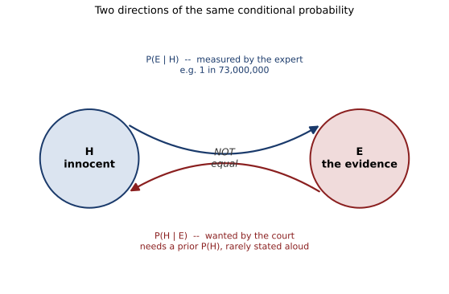

# ch08 — 檢察官謬誤：把 P(證據∣清白) 當成 P(清白∣證據)

> **本章解決什麼問題**：ch06（偽陽性悖論）已經拆開過一次條件機率被算反的錯覺——把 P(陽性∣有病) 誤當成 P(有病∣陽性)。這一章要指出，同一個結構換上法袍出庭，會變成一個真正把人送進監獄的錯誤：把「這種巧合在清白的人身上只有幾百萬分之一」，聽成「這個人清白的機率只有幾百萬分之一」。這是 Part III（因果、聚合與計數）的第二章，緊接在 ch07 辛普森悖論之後——辛普森教你「合起來看」會騙人，這一章教你「乘起來看」也會騙人，而且騙人的方式，正是 ch06 那個條件反轉的法庭版。ch09（生日問題）會轉向另一種計數陷阱，但條件反轉這個母題，到這一章正式收尾。

## 從你已知的出發

一九九〇年代末，英格蘭。莎莉·克拉克（Sally Clark）是一名執業律師，出身優渥，不菸不酒，家庭背景在任何一份社工報告裡都會被歸類為「低風險」。一九九六年十二月，她十一週大的長子克里斯多福（Christopher）在夜裡猝死；驗屍當時記錄為原因不明，傾向自然死亡。一九九八年一月，她八週大的次子哈利（Harry）同樣在夜裡猝死。同一個家庭，兩年之內，兩個嬰兒，兩次猝死。

警方重新調閱了長子的驗屍紀錄，一九九九年十一月，莎莉·克拉克被起訴並受審，罪名是謀殺兩名親生兒子。檢方舉證的核心，不是血跡、不是傷痕，而是一個數字。小兒科醫師羅伊·梅多（Roy Meadow）以專家證人身分出庭，引用英國一項全國性研究「死產與嬰兒死亡機密調查」（Confidential Enquiry into Stillbirths and Deaths in Infancy，簡稱 CESDI）的數據作證：在一般人群裡，一名嬰兒死於嬰兒猝死症（Sudden Infant Death Syndrome，SIDS，俗稱搖籃死）的機率約為 1/1,303；但如果把家庭背景限定成「優渥、不吸菸、母親年齡超過二十六歲」——正好對應克拉克家的條件——這個機率會降到 1/8,543。梅多接著做了一件聽起來理所當然的事：把這個機率自乘一次，因為兩個孩子死了兩次，1/8,543 × 1/8,543 ≈ 1/72,982,849，約等於 1/73,000,000。他向陪審團作證：像克拉克這樣的家庭，兩個孩子都自然猝死的機率，只有七千三百萬分之一。

七千三百萬分之一，是什麼概念？作為對照，英國國家彩券當時的規則是從 49 個號碼裡選中 6 個，頭獎中獎機率是 C(49,6)分之一，也就是約 1/13,983,816（約 1/1,400 萬）——梅多這個數字，比單次中頭獎的機率還要小五倍以上。陪審團與旁聽的媒體幾乎立刻得出同一個結論：這種事情不可能是巧合，一定是人為的。這個推理鏈聽起來完全站得住腳：「如果兩個孩子都死於自然原因，這種情況只有七千三百萬分之一的機率會發生；這種事情實際發生了；所以，兩個孩子都死於自然原因這件事，幾乎可以排除——她一定做了什麼。」一九九九年十一月九日，陪審團以十比二的多數裁決，判她謀殺罪成立，法官依法判處終身監禁。

在你繼續往下讀之前，值得先停下來，把上面那句推理鏈自己在心裡覆誦一遍，問自己：這句話聽起來哪裡有問題嗎？如果你和當年的陪審團一樣，覺得它天衣無縫——那正是本章要拆開的地方。這句話裡至少藏著兩個從沒被講清楚的假設，其中一個甚至比另一個更根本；兩年多以後，英國皇家統計學會（Royal Statistical Society，RSS）會公開出面糾正這個數字，而莎莉·克拉克的定罪，也會在法庭上被撤銷。但問題不是梅多把小數點算錯了幾位，問題出在這句推理從一開始就問錯了方向。

## 湯普森與舒曼命名的謬誤：比這起案子早了十二年

這個錯誤有名字，而且命名的時間比莎莉·克拉克案早了整整十二年。一九八七年，心理學家威廉·湯普森（William Thompson）與愛德華·舒曼（Edward Schumann）在《法律與人類行為》（Law and Human Behavior）期刊第 11 卷第 3 期發表論文〈刑事審判中統計證據的詮釋：檢察官謬誤與辯護律師謬誤〉（Interpretation of Statistical Evidence in Criminal Trials: The Prosecutor's Fallacy and the Defense Attorney's Fallacy），第一次系統性地把法庭上常見的兩種機率誤用各自命名、各自拆解。錯誤本身當然遠比這篇論文古老——只要法庭上出現過一個「這種特徵在無辜者身上很罕見」的數字，這個陷阱就已經在場——但湯普森與舒曼給了它一個可以被引用、被檢驗的名字：檢察官謬誤（prosecutor's fallacy）。

檢察官謬誤的核心，是把兩個方向不同的條件機率（conditional probability）焊在一起。設 H（hypothesis）為「被告清白」這個假設，E（evidence）為法庭上呈現的某一項證據——可能是一個鑑識特徵的相符、也可能像本案一樣是「同一家庭發生兩次嬰兒猝死」這個現象本身。專家證人真正能夠測量、也真正在測量的，是 P(E∣H)：如果被告確實清白，這項證據出現的機率有多高。但陪審團真正想知道、也真正要據以定罪的，是反方向的 P(H∣E)：看到這項證據之後，被告清白的機率剩下多少。檢察官謬誤，就是把前者的數字，原封不動地套用在後者的問題上——彷彿「這件事在清白者身上很罕見」，直接等於「這個人很可能不清白」。

湯普森與舒曼同時也指出一個方向相反的鏡像錯誤：辯護律師謬誤（defense attorney's fallacy）。這個錯誤的做法是：既然某個城市有一千萬人，符合某項稀有特徵的機率是百萬分之一，理論上這座城市裡大約會有十個人符合這項特徵——所以被告只是這十個人之一，被定罪的機率不該超過十分之一，「合理懷疑」因此成立。這個論證乍看是在糾正檢察官謬誤，但它犯的其實是同一件事的另一半：它假裝被告是從全城一千萬人裡隨機抽出來的一個名字，完全不管在鑑識證據出現之前，其他非統計證據（動機、機會、關聯性）早就已經把嫌疑範圍縮小了。這兩個謬誤看似方向相反，其實共享同一個病灶：**它們都在沒有明講先驗機率（prior probability）P(H) 的情況下，直接對 P(H∣E) 下結論**——一個假裝先驗是「幾乎確定有罪」，另一個假裝先驗是「跟城裡任何人一樣清白」，但兩者都沒有真的把先驗攤開來給陪審團看。本章要拆穿的，正是這個沒有被攤開的先驗。

## Sally Clark 案：一句證詞，兩個錯疊在一起

回到梅多的證詞。仔細拆開，裡面其實疊了兩個獨立的錯誤，任何一個單獨成立就足以推翻這句證詞，而它們同時發生。

**錯誤一：把兩次死亡的機率相乘，等於偷偷假設兩次死亡互相獨立。** 把 1/8,543 自乘一次得到 1/72,982,849，這個算術動作本身沒有問題——問題是，「把兩個機率相乘」只有在兩個事件互相獨立（independent）時才成立，也就是「知道第一個孩子死於嬰兒猝死症」這件事，完全不會改變「第二個孩子也死於嬰兒猝死症」的機率。但嬰兒猝死症的病因至今仍不完全清楚，已知與遺傳體質、呼吸調節、家族環境（例如通風、床墊材質、共同的居住環境）都有關聯——換句話說，如果一個家庭已經失去一個孩子於嬰兒猝死症，這件事本身就是一個訊號，暗示這個家庭可能帶有某種尚未被指認出來的共同風險因子，第二個孩子的風險理當被向上調整，而不是維持基線不變。

統計學家雷·希爾（Ray Hill）在二〇〇四年發表於《兒科與圍產期流行病學》（Paediatric and Perinatal Epidemiology）的分析中，直接檢驗了這個獨立性假設：他的估計是，一個家庭一旦已經發生過一次嬰兒猝死症，第二個孩子的猝死風險，會提高到大約十倍。把這個相依性（dependence）納入計算之後，希爾進一步比較「同一家庭兩個孩子都死於嬰兒猝死症」與「同一家庭兩個孩子都被謀殺」這兩種情境何者更可能發生，算出的優勢比（odds ratio）落在 4.5 比 1 到 9 比 1 之間——也就是說，正確計入相依性之後，兩個孩子都死於自然原因，反而比兩個孩子都是他殺，可能性高出四點五倍到九倍。梅多的「七千三百萬分之一」不只是誇大，方向可能完全是反的。

**錯誤二：就算 1/73,000,000 這個數字本身站得住腳，它回答的也是錯誤的問題。** 這是本章標題那句話真正發生的地方。即使我們暫時接受「兩個孩子都自然死亡的機率是 1/73,000,000」這個（有嚴重瑕疵的）數字，它在符號上寫的是 P(E∣H)：H 是「這對父母清白，兩個孩子都是自然死亡」，E 是「這個家庭發生了兩起嬰兒死亡」——這句話問的是，已知父母清白，看到兩起死亡的機率有多小。但陪審團要判決的問題方向完全相反，是 P(H∣E)：已知兩起死亡已經發生，父母清白的機率有多大。這兩個機率，數值上沒有任何理由相等，中間還隔著一項從沒有人在法庭上明講過的東西：先驗機率 P(H)——在看到任何法醫證據之前，一對這樣背景的父母，本來謀殺親生子女的基率有多低。這正是英國皇家統計學會二〇〇一年十月二十三日發布公開聲明的原因：聲明明確指出「七千三百萬分之一」這個數字「沒有統計基礎」，並且點名這正是檢察官謬誤的一個教科書級案例——法庭上呈現的是似然（likelihood）P(E∣H)，卻被當成後驗（posterior）P(H∣E) 使用。

值得說清楚的是，統計學界的抗議，並沒有立刻讓莎莉·克拉克獲釋。她的第一次上訴在二〇〇〇年十月遭駁回，定罪維持。真正促成翻案的第二次上訴，聽審於二〇〇三年一月二十八日至二十九日進行，法官當庭宣告定罪「不安全」（unsafe）並撤銷，她於一月二十九日獲釋——這是口頭撤銷與實際獲釋的日期。附完整理由的書面判決 *R v Clark* [2003] EWCA Crim 1020，則是稍後在二〇〇三年四月十一日才正式頒布，這兩個日期指的是不同的法律程序節點，不宜混為一談。而這份書面判決撤銷定罪的理由，其實有兩條，並非只靠統計論證：其一是法庭確認，起訴方的法醫病理學家未向辯方揭露一份顯示次子哈利體內驗出金黃色葡萄球菌（Staphylococcus aureus）感染、可能死於自然感染的微生物學報告；其二，判決書也明確指出，呈堂的統計證據誇大了兩起嬰兒猝死同時發生的罕見程度，具有誤導性。統計錯誤與證據未揭露，兩者共同構成了這起冤獄。

## 完整推導：把兩個方向的機率拆開

貝氏定理（Bayes' theorem）的完整式在 ch06 已經寫過一次，這裡直接借用，不重新推導其來由，只把它套用在法庭的符號上。令 H 為「被告清白」，E 為呈堂的證據：

```text
P(H|E) = P(E|H)·P(H) / P(E)
```

這裡 P(E∣H) 是似然（likelihood）——已知清白，這項證據出現的機率，也就是專家證人真正在估計、真正能夠估計的方向。P(H) 是先驗機率（prior probability）——在看到這項證據之前，這個人清白的機率，也就是本案裡從未被攤上檯面的那個數字。P(H∣E) 是後驗機率（posterior probability）——看到證據之後，更新過的清白信念，也就是陪審團真正該用來定罪或無罪開釋的數字。分母 P(E) 一樣要把清白與非清白兩條路徑都算進去：

```text
P(E) = P(E|H)·P(H) + P(E|非H)·P(非H)
```

這一整套式子，和 ch06 偽陽性悖論裡的貝氏定理，符號結構一字不差——差別只在把「有病∕沒病」換成「清白∕非清白」，把「陽性∕陰性」換成「呈堂的證據出現與否」。ch06 的 B3（盛行率 1/1,000）與 B5（後驗 9.02%）已經示範過一次：光靠 P(E∣H) 這個方向的數字，永遠沒辦法算出 P(H∣E)，除非你願意先老實講出 P(H) 這個先驗到底是多少。梅多的證詞，恰好就是把這個必要的中間項，完全略過不提。

## Worked example：同一個「百萬分之一」，兩種先驗，兩個答案

為了不把 Sally Clark 案的真實數字直接套用（那組數字本身有獨立性瑕疵，不適合當作乾淨的教學示範），這裡改用一個純粹自己構造、方便整除的通用情境，展示同一個「百萬分之一」型的證據，配上不同的先驗，會得到天差地遠的答案。**以下數字是為了教學而設計的示範值，不是任何真實案件的數字。**

設想一項鑑識特徵比對——可以想成某種罕見血型或某種特殊痕跡——已知它在清白的人身上出現的機率是 1/1,000,000：

```text
P(比對相符|清白) = 1/1,000,000  ← 專家真正測量、真正能夠測量的方向
P(比對相符|非清白) ≈ 1           ← 若這個人確實是真兇，痕跡幾乎必然吻合（簡化假設）
```

被告的樣本比對結果相符。檢方的說法是：「這個特徵在清白者身上只有百萬分之一的機率出現，所以被告清白的機率只有百萬分之一。」這句話要成立，等於直接假設 P(清白∣比對相符) = P(比對相符∣清白)，也就是完全跳過了先驗 P(清白) 這一項。下面用貝氏定理把兩種不同的先驗代進去，看看真正的答案。

**情境 A：完全沒有其他線索。** 假設除了這項比對之外，警方沒有任何非鑑識證據能縮小範圍——理論上，這座城市裡的一百萬名居民，任何一位都同樣可能是真兇，先驗機率 P(非清白) = 1/1,000,000（刻意讓母體大小和比對機率的分母相等，數字才會算得乾淨；真實案件很少剛好對齊）：

```text
已知：
  P(清白)         = 1 − 1/1,000,000 = 0.999999
  P(非清白)        = 1/1,000,000 = 0.000001
  P(比對相符|清白)  = 0.000001
  P(比對相符|非清白) = 1

第一步，算 P(比對相符) 這個分母：
  P(比對相符) = P(比對相符|清白)·P(清白) + P(比對相符|非清白)·P(非清白)
             = 0.000001 × 0.999999 + 1 × 0.000001
             = 0.000000999999 + 0.000001
             ≈ 0.000001999999          ← 兩條路徑都要算：清白卻恰巧相符，加上真兇必然相符

第二步，代入貝氏定理：
  P(清白|比對相符) = (0.000001 × 0.999999) / 0.000001999999
                  ≈ 0.5000            ← 約 50%，而不是檢方暗示的「幾乎不可能清白」
```

答案是約 50%——被告清白與否，幾乎是一枚硬幣的兩面，離檢方暗示的「幾乎不可能清白」相去甚遠。原因很直白：當母體有一百萬人、比對機率恰好也是百萬分之一時，你預期這一百萬人裡除了真兇之外，大約還會有一個人純屬巧合也符合這項特徵——真兇加上這位巧合的無辜者，平均起來大約兩個人會通過比對，其中只有一個是真兇，機率自然就落在二分之一附近。

**情境 B：其他獨立證據已經把範圍縮小到兩名等可能的嫌疑人。** 這一次，警方靠動機、機會等非鑑識證據，已經把嫌疑範圍鎖定在兩個人身上，其中一位就是後來被起訴的被告，兩人在鑑識比對之前被認為機率相當，先驗 P(非清白) = 1/2：

```text
已知：
  P(清白)  = 0.5
  P(非清白) = 0.5
  P(比對相符|清白)  = 0.000001
  P(比對相符|非清白) = 1

第一步：
  P(比對相符) = 0.000001 × 0.5 + 1 × 0.5
             = 0.0000005 + 0.5
             = 0.5000005

第二步：
  P(清白|比對相符) = (0.000001 × 0.5) / 0.5000005
                  ≈ 0.000001         ← 約百萬分之一
  P(非清白|比對相符) ≈ 0.999999      ← 約 99.9999%
```

同一個「百萬分之一」的鑑識數字，這一次配上先驗機率 1:1 的其他證據，後驗就變成了 99.9999% 有罪——這才是接近檢方原本想暗示的那種確定性。兩種情境用的是完全相同的一句鑑識證詞，答案卻從「大約對半」跳到「幾乎確定」，差別只在於先驗 P(H) 選了多少。**這正是檢察官謬誤真正騙人的地方：它讓你以為只需要 P(E∣H) 這一個數字就能定案，卻對「這裡到底該用哪個先驗」保持沉默——沉默本身，就等於偷偷選了一個從未被檢驗過的先驗。**



這張圖畫的是本章唯一需要記住的骨架：H 和 E 之間有兩支箭頭，方向相反。上面那支箭頭（P(E∣H)）是專家證人站上證人席、真正宣誓作證的方向；下面那支箭頭（P(H∣E)）才是陪審團退庭討論、真正要投票的方向。這兩支箭頭之間沒有任何數學理由要相等——除非你額外代入一個先驗機率，把上面那支箭頭「轉」成下面那支箭頭。梅多的證詞只畫出了上面那支箭頭，卻讓在場所有人誤以為自己已經看到了下面那支。

## 直覺的陷阱

把整起事件重新攤開來看：

| 階段 | 發生了什麼 |
|---|---|
| 直覺的自信答案 | 兩個孩子都自然死亡的機率只有七千三百萬分之一，這種事真的發生了，所以幾乎可以肯定不是自然死亡 |
| 偷渡的假設一 | 把兩次死亡的機率直接相乘，等於偷偷假設兩次死亡互相獨立——完全沒有把同一家庭共享的遺傳與環境風險因子算進去 |
| 偷渡的假設二 | 把 P(證據∣清白)（專家證詞真正測量的方向）直接當成 P(清白∣證據)（陪審團真正需要的方向），中間完全沒有出現先驗機率 P(清白) |
| 為什麼聽起來理所當然 | 「七千三百萬分之一」這個數字本身極端到令人震撼，震撼感會誘使人直接把它套用到眼前這個具體的人身上，彷彿數字愈小、結論就愈確定——但這個數字回答的問題，從一開始就問反了方向 |
| 在哪一步被帶溝裡 | 不是在算術，而是在聽到「機率極小」這幾個字的那一瞬間，就已經把「這種巧合很罕見」直接聽成了「這個人很可能有罪」——這一步發生在任何人開始計算之前 |
| 怎麼自我察覺 | 每次聽到「這種情況在無辜者身上只有 X 的機率」，先停下來把它翻譯成 P(・∣・) 的符號，問自己：條件寫在哪一側？是「已知真相」還是「已知證據」？接著再問：如果不看這項證據，這個人本來（先驗）有罪的機率是多少？如果沒有人回答第二個問題，代表你手上的資訊還不足以回答「清白∣證據」這個真正的問題 |

這正是 ch06 偽陽性悖論的法庭版——同一個條件反轉，換了一件法袍。差別只在於，偽陽性悖論搞錯了，代價是一次不必要的複檢；檢察官謬誤搞錯了，代價可能是終身監禁。認出這個母題——聽到任何「這種情況在某個群體裡很罕見」的句子時，反射性地問一句「這回答的是哪個方向」——是這兩章加起來留給你最值錢的一件工具。

> **那句沒說出口的話是**：「這種巧合在清白的人身上只有 X 的機率」（P(證據∣清白)）和「這個人清白的機率只有 X」（P(清白∣證據)）是兩個方向相反、數值上沒有理由相等的機率，中間永遠隔著一個從未被講出口的先驗機率——而檢察官謬誤，就是假裝這個先驗不存在，或悄悄把它設成 1。

## 紙上推演

**練習 1（★，10 分鐘）**：延續本章「Worked example」情境 A（母體 100 萬人、比對機率 1/1,000,000、先驗與比對機率恰好相等），如果母體改成 1,000 萬人（其他條件不變，比對機率仍是 1/1,000,000），重新代入貝氏定理，算出 P(清白∣比對相符)。這個結果告訴你母體大小對後驗機率有什麼影響？

**練習 2（★★，15 分鐘）**：假設某鑑識比對的隨機相符機率是 1/500,000（比本章示範值更常見一些），先驗（其他證據縮小後的嫌疑範圍）是 1:4（清白機率是非清白機率的 4 倍，即 P(清白)=0.8、P(非清白)=0.2）。重新算一次 P(清白∣比對相符)，並判斷：這個結果算是「證據對被告不利」還是「證據對被告有利」？

**練習 3（★★★，20 分鐘）**：不查任何資料，只憑本章正文提供的數字，重新驗證雷·希爾（Ray Hill）的論證方向：如果一個家庭裡，第一個孩子死於嬰兒猝死症之後，第二個孩子的猝死風險提高為原本的 10 倍（也就是從 1/8,543 提高到 10/8,543），請寫出「同一家庭連續兩次嬰兒猝死」在「考慮相依性」與「假設獨立」兩種算式下的結果（不必得出希爾論文裡精確的優勢比，只需展示兩種算式的機率差距有多大）。

### 推演解答

**練習 1 解答**：

```text
P(清白)  = 1 − 1/10,000,000 = 0.9999999
P(非清白) = 1/10,000,000 = 0.0000001
P(比對相符|清白)  = 0.000001
P(比對相符|非清白) = 1

P(比對相符) = 0.000001 × 0.9999999 + 1 × 0.0000001
           ≈ 0.0000010 + 0.0000001
           = 0.0000011

P(清白|比對相符) = (0.000001 × 0.9999999) / 0.0000011
                ≈ 0.909 = 90.9%
```

母體從 100 萬人放大到 1,000 萬人之後，清白的後驗機率從約 50% 拉高到約 90.9%。原因是：母體愈大，「純屬巧合也比對相符的無辜者」的預期人數就愈多（這裡預期會有大約 10 位無辜者純屬巧合相符，而真兇只有一位），所以在所有比對相符的人裡，真兇所佔的比例反而更低。這正是為什麼「大海撈針」式的鑑識比對——在一個龐大資料庫裡搜尋相符對象——比「先用其他證據鎖定一兩名嫌疑人、再單獨比對」危險得多：搜尋的母體愈大，同一個比對結果所能支持的確定性就愈弱。

**練習 2 解答**：

```text
P(清白)  = 0.8
P(非清白) = 0.2
P(比對相符|清白)  = 1/500,000 = 0.000002
P(比對相符|非清白) = 1

P(比對相符) = 0.000002 × 0.8 + 1 × 0.2
           = 0.0000016 + 0.2
           = 0.2000016

P(清白|比對相符) = (0.000002 × 0.8) / 0.2000016
                ≈ 0.0000080 = 0.0008%
P(非清白|比對相符) ≈ 0.9999920 = 99.999%
```

在這個情境裡，即使鑑識比對機率沒有前一個例子那麼極端（1/500,000 而非 1/1,000,000），但因為先驗已經有其他證據把嫌疑鎖定在小範圍、且被告本來就有 20% 的嫌疑，比對相符之後，非清白的後驗機率被推高到 99.999% 以上——這組證據對被告非常不利。這個練習要凸顯的重點是：鑑識證據本身的極端程度（1/500,000 或 1/1,000,000）並不是決定後驗機率的唯一因素，先驗機率的起點同樣關鍵；同一項證據放在不同的先驗起點上，殺傷力天差地遠。

**練習 3 解答**：先寫出假設獨立的版本（也就是梅多實際使用的算式）：

```text
假設獨立：
  P(兩次都猝死) = 1/8,543 × 1/8,543 = 1/72,982,849 ≈ 1.37 × 10⁻⁸
```

再寫出考慮相依性的版本。已知第一個孩子猝死之後，第二個孩子的風險提高為原本的 10 倍，也就是從 1/8,543 提高到 10/8,543：

```text
考慮相依性：
  P(兩次都猝死) = P(第一次猝死) × P(第二次猝死|第一次已猝死)
             = 1/8,543 × 10/8,543
             = 10/72,982,849
             ≈ 1.37 × 10⁻⁷
```

兩種算式的比值恰好是 10 倍——這正好對應希爾論文裡「風險提高十倍」這個假設本身。也就是說，光是承認「兩次死亡不獨立、第二次風險應該上修」這一件事，就足以讓「兩次都自然猝死」的機率變成原本假設獨立時的十倍（希爾論文更進一步，把這個修正後的機率拿去跟「兩次都是他殺」的機率相比，得出兩者優勢比落在 4.5 比 1 到 9 比 1 之間，自然死亡反而更可能——但那一步已經超出本練習只用本章數字驗證方向的範圍）。這個練習真正要你看見的，不是精確的優勢比數字，而是「假設獨立」這個看似技術性、無傷大雅的簡化，本身就足以讓結論從「幾乎不可能」翻轉成「頗有可能」，翻轉的幅度和「風險提高幾倍」這個假設直接掛鉤。


## 自我檢核

1. 檢察官謬誤（prosecutor's fallacy）和辯護律師謬誤（defense attorney's fallacy）方向相反，但它們共享同一個缺失的東西，是什麼？
2. 梅多的證詞裡疊了哪兩個獨立的錯誤？如果只修正其中一個，另一個還會不會讓結論不可靠？
3. 為什麼「把兩次事件的機率相乘」需要先假設兩者互相獨立？在嬰兒猝死症這個具體情境裡，哪些現實因素會破壞這個獨立性假設？
4. Worked example 裡，情境 A 和情境 B 用的是完全相同的鑑識比對機率（1/1,000,000），為什麼答案卻天差地遠（約 50% 對約 99.9999%）？決定答案的關鍵變數是什麼？
5. 用自己的話重講一次：這個悖論那句沒說出口的假設是什麼？
6. 為什麼統計學界在二〇〇一年就公開指出證詞的問題，莎莉·克拉克卻要到二〇〇三年才獲釋？這說明了「數學上錯誤的證詞」和「法律程序上撤銷定罪」之間，關係是不是想像中那麼直接？
7. 這一章的條件反轉（把 P(證據∣清白) 誤當 P(清白∣證據)）和 ch06 偽陽性悖論的條件反轉（把 P(陽性∣有病) 誤當 P(有病∣陽性)），在數學結構上是不是完全同一件事？換了場景之後，代價為什麼會不對稱地變得更嚴重？
8. 練習 1 告訴你，母體愈大，同一個比對機率的說服力反而愈弱。如果你是陪審員，聽到「這項鑑識特徵在資料庫裡搜尋到的唯一相符對象」這句話，你會想追問哪一個沒有被講出來的數字？

## 延伸閱讀

- 〈Sally Clark〉，Wikipedia——案件時間線、審判與兩次上訴的總覽條目，可作為本章歷史細節的交叉核對起點。<https://en.wikipedia.org/wiki/Sally_Clark>
- 〈Prosecutor's fallacy〉，Wikipedia——檢察官謬誤與辯護律師謬誤的一般定義，收錄多個法庭案例。<https://en.wikipedia.org/wiki/Prosecutor%27s_fallacy>
- Royal Statistical Society (2001). *Royal Statistical Society concerned by issues raised in Sally Clark case*（二〇〇一年十月二十三日公開聲明原文 PDF）——本章「無統計基礎」這句話的原始出處。<https://rss.org.uk/RSS/media/File-library/Membership/Sections/2020/Sally-Clark-RSS-statement-2001.pdf>
- Thompson, W. C., & Schumann, E. L. (1987). Interpretation of statistical evidence in criminal trials: The prosecutor's fallacy and the defense attorney's fallacy. *Law and Human Behavior*, 11(3), 167–187.——本章「檢察官謬誤」與「辯護律師謬誤」兩個名字的命名出處。
- Hill, R. (2004). Multiple sudden infant deaths – coincidence or beyond coincidence? *Paediatric and Perinatal Epidemiology*, 18(5), 320–326.——本章「獨立性誤用」小節裡風險提高十倍、優勢比 4.5 比 1 到 9 比 1 這組數字的原始出處。
- *R v Clark* [2003] EWCA Crim 1020（二〇〇三年四月十一日判決書全文，BAILII 收錄）——第二次上訴的正式書面理由，含統計證據與病理報告未揭露兩條理由。<https://www.bailii.org/ew/cases/EWCA/Crim/2003/1020.html>
