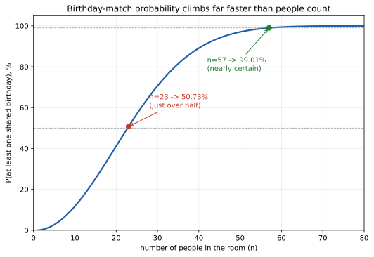

# ch09 — 生日問題：23 個人就夠了

> **本章解決什麼問題**：ch07（辛普森悖論）拆穿的是「把資料合起來看」怎麼騙人，ch08（檢察官謬誤）拆穿的是「條件的方向」怎麼騙人——兩章的破口都藏在機率的分組與方向裡。這一章換一個更基本、卻同樣容易被忽略的破口：**計數本身**怎麼騙人。生日問題問的是一件聽起來簡單到不行的事——一個房間裡要有多少人，才有一半以上的機會，其中至少兩人同一天生日？大多數人腦中浮現的答案，跟真相差了一個數量級，而差距的來源不是任何一步算錯，是你一開始就數錯了該數的東西。這是 Part III（因果、聚合與計數）的最後一章，下一章 ch10 會離開「怎麼數、怎麼合」的問題，走進一個全新的家族：隨機漫步與賭局的長期邊界。

## 從你已知的出發

想像一個有 23 人的房間——一場中型研討會的與會者、一支球隊連教練團、一個大學班級，任何一種湊巧聚在一起的 23 個人都可以。主持人在開場前跟大家玩一個小遊戲：他說，他敢打賭，這個房間裡至少有兩個人，生日是同一天（同月同日，先不管年份，也先不管閏年 2 月 29 日這種邊緣情況）。

在往下讀之前，先問自己：你覺得這個賭注，主持人贏的機率有多高？

多數人腦中會冒出兩種直覺，而且往往兩種都覺得理所當然。第一種直覺是：一年有 365 天，23 個人相對於 365 天，實在少得可憐，主持人贏的機率應該很低，大概只有一成、兩成，運氣好一點的話。第二種、更「認真算過」的直覺是這樣推的：如果想知道要湊到多少人，才有一半的機會「有人跟自己生日一樣」，那大概要湊到 365 天的一半左右，也就是 182 或 183 個人——畢竟，一年的天數就那麼多，總得填滿大約一半的日子，才輪得到有人「撞期」。順著這條思路往回推，23 人這個數字，離「有一半機會撞期」還差得遠，可能連一成勝算都不到。

這兩種直覺都很自然，也都用到了正確的數字（365 天、23 人），但它們共同的結論——23 人太少，遠不足以讓同生日的機率過半——是錯的，而且錯得離譜。正確答案是：23 人，主持人贏的機率超過一半。這一章要做的事，就是把上面兩條看似合理的推理攤開來檢查，你會發現它們錯的不是任何一步乘法或加法，而是打從一開始，就把這個問題真正該問的東西問錯了。

## 一個從未真正發表過的傳說：Davenport、von Mises 與伊斯坦堡的流亡數學家

生日問題的身世，跟前面幾章的蒙提霍爾或辛普森悖論不太一樣——它沒有一個可以指名道姓、留下清楚文件的起點，反而是數學界一則流傳很廣、卻始終缺乏第一手佐證的傳說。

這個問題最常被提起的名字是哈羅德·達文波特（Harold Davenport）——後來成為劍橋大學知名的數論學家。據載，他在 1927 年前後、還是曼徹斯特大學的大學生時，就已經想出並提過這個問題；英國數學家喬治·泰森（George Tyson）在 1983 年的一封信裡回憶，這件事是達文波特本人親口告訴他的，而達文波特自己「並不敢說這是他首創的，只是不相信這麼簡單的問題以前沒人問過」。但這整段故事，查無達文波特本人留下的任何文字或筆記為證，只有這一則轉述的回憶——換句話說，這是一則民俗等級的歸屬，值得記住這個名字，但不該把「達文波特 1927 年發明生日問題」當成板上釘釘的史實。

真正留下白紙黑字、可以查證的首度發表，要等到 1939 年。理查·馮·米塞斯（Richard von Mises）——因猶太血統遭納粹德國通緝、輾轉流亡到伊斯坦堡大學任教的機率學家——在伊斯坦堡大學理學院學報上，發表了一篇討論「分割與佔位機率」（Aufteilungs- und Besetzungswahrscheinlichkeiten）的論文，把生日問題當成一類更一般問題的特例來處理：n 個球隨機丟進 365 個籃子裡，至少有一個籃子裝到兩顆球以上的機率是多少？生日，只是把「球」換成「人」、把「籃子」換成「日期」的其中一種具體講法。馮·米塞斯後來輾轉落腳哈佛大學，他這篇論文，是目前查得到、生日問題最早正式出現在印刷品上的紀錄。

## 直接算「至少一對相同」為什麼難：換一個角度算「完全不撞」

要直接算「23 人裡至少有一對同生日」的機率，一開始很容易想錯方向：你可能會想列出所有「恰好一對撞期」、「恰好兩對撞期」、「三個人撞在同一天」……每一種情況分別算機率，再加起來。這條路不是不能走，但撞期的花樣多到令人崩潰——23 人裡任何兩人、任何三人、甚至更多人湊在同一天，都算「至少一對相同」，要把每一種花樣都窮舉清楚、還要小心不重複計算（同一個「至少一對」的結果，可能被好幾種花樣同時算到），難度隨人數暴增。

處理這種「至少一個」型態的機率問題，有一個幾乎萬用的技巧：算它的互補事件（complementary event）。「至少一對同生日」的互補事件，是「所有人生日都不一樣」——這件事只有一種花樣：23 個人，23 個互不相同的日期，沒有例外。算完「全部不撞」的機率，用 1 減掉，就是「至少一對相同」的機率：

```text
P(至少一對同生日) = 1 − P(23 人生日全部互不相同)
```

這個轉換，把一個要窮舉無數種撞期花樣的難題，換成了一個乘法就能算完的問題。

## 完整推導：把 365 天一個個算下去

現在來算 P(23 人生日全部互不相同)。想像 23 個人一個一個依序走進房間，每進來一位就報一次生日，而且假設每個人的生日獨立、均勻分布在 365 天裡（這是一個簡化模型——不管閏年 2 月 29 日，也假設真實世界的出生日期沒有任何季節性偏斜；稍後會回頭檢查這個假設有多站得住腳）。

第 1 個人進來，生日隨便是哪一天都行，不會跟任何人衝突，機率是 365/365 = 1。第 2 個人進來，要避開第 1 人已經佔走的那一天，剩下 364 個選擇，機率是 364/365。第 3 個人進來，要避開前兩人已佔的 2 天，剩下 363 個選擇，機率是 363/365。第 4 個人，要避開前 3 人佔的 3 天，機率是 362/365。……以此類推，第 k 個人要避開前面 k−1 人已佔的 k−1 天，機率是 (365−k+1)/365。

一路乘到第 23 個人，要避開前 22 人已佔的 22 天，機率是 (365−23+1)/365 = 343/365。把 23 個機率通通乘起來：

```text
P(23 人全部不撞) = 365/365 × 364/365 × 363/365 × … × 343/365
                = (365 × 364 × 363 × … × 343) / 365²³
```

這個乘積不好用手算，但一步步乘下去並不難，把關鍵幾步的累積結果列出來：

```text
乘到第 2 人：365/365 × 364/365                → 累積 0.997260   ← 只有 2 人，幾乎不可能撞
乘到第 5 人：再乘 363/365 × 362/365 × 361/365   → 累積 0.972864
乘到第10 人：繼續乘到 356/365                  → 累積 0.883052   ← 累積下滑還不明顯
乘到第15 人：繼續乘到 351/365                  → 累積 0.747099
乘到第20 人：繼續乘到 346/365                  → 累積 0.588562   ← 開始加速下滑
乘到第22 人：再乘 344/365                      → 累積 0.524305
乘到第23 人：再乘 343/365                      → 累積 0.492703   ← 這是關鍵的一步，跌破 0.5
```

到第 23 人，累積乘積跌破了 0.5——也就是說，23 人全部生日互不相同的機率，只剩下 49.27%。反過來：

```text
P(至少一對同生日) = 1 − 0.492703 = 0.507297 ≈ 50.73%
```

50.73%，正是本章開頭那個賭注，主持人贏的真實勝算——不只過半，而且過半得相當扎實。這個數字，就是全書基準表裡的 B7：23 人（B6）時，至少一對同生日的機率是 50.73%（B7）。

## 配對數才是真正的主角：C(23,2)=253

回頭檢查一開始那個「183 人」的直覺，錯在哪裡。那條推理暗中假設了一件事：決定機率高低的量，是人數本身——就好像每多一個人，只是多了「這個人自己撞上某一天」的一次機會，365 天要湊滿一半，大概就要湊到一半的人數。這個假設，從頭到尾沒有人講出口，卻悄悄主宰了整條推理。

但仔細看前面的推導，真正在起作用的，從來不是「有幾個人」，而是「有幾對人可以互相比較生日」。23 個人裡，任兩人都可能撞期——不是只有你跟房間裡另外 22 個人比，而是所有人兩兩互相比。這樣的配對有多少組？這要用組合（combination）的基本算式 C(n,2)——從 n 個人裡任選 2 人一組、不分順序：

```text
C(23,2) = 23 × 22 / 2 = 253
```

23 個人，只有 23 個人，但兩兩配對的組合方式高達 253 種——每一種配對，都是一次獨立的「這兩人生日相同嗎」的機會。跟 365 天相比，253 已經逼近 365 的七成，不再是「少得可憐」的等級。這才是機率會過半的真正原因：問題的規模，不是隨人數線性成長的 O(n)，而是隨配對數平方成長的 O(n²)——人數從 10 人漲到 23 人，只成長了 2.3 倍，配對數卻從 C(10,2)=45 漲到 C(23,2)=253，成長了超過 5.6 倍。那個「183 人」的直覺，把一個平方成長的量，錯當成線性成長來估——用線性的尺去量一個平方成長的東西，自然會嚴重低估。

## 為什麼恰好是 23：一個藏在指數裡的 ln 2

配對數的視角，還能給出一個更漂亮的答案：為什麼分界點剛好落在 23，不是 20，也不是 30？

當「撞期」這件事本身很罕見時（也就是每一對配對撞期的機率 1/365 很小、配對數又不算太多的時候），有一個很好用的近似：把每一對配對是否撞期，看成一個獨立的稀有事件，總撞期次數近似服從卜瓦松分布（Poisson distribution）——配對數 C(n,2) 越多，期望出現的撞期次數 λ = C(n,2)/365 就越大，而「一次撞期都沒有」的機率，近似等於 e^(−λ)（這是機率很小、嘗試次數不算太少時的標準近似，嚴格版的極限證明不在本書展開）。於是：

```text
P(至少一對同生日) ≈ 1 − e^(−C(n,2)/365)
```

要讓這個機率剛好跨過 50%，就是要讓 e^(−λ) = 0.5，也就是 λ = ln 2 ≈ 0.6931。把 λ = C(n,2)/365 代進去，解這個關於 n 的方程式：

```text
C(n,2)/365 = ln 2
n(n−1)/2 = 365 × ln 2
n(n−1) = 730 × ln 2 ≈ 505.997
```

用二次方程式的公式解 n：

```text
n = (1 + √(1 + 4×505.997)) / 2
  = (1 + √2024.99) / 2
  ≈ (1 + 45.00) / 2
  ≈ 23.00
```

解出來的 n，幾乎不多不少剛好是 23.00——這不是湊出來的巧合，是 365 天這個具體數字，配上「取整數人數」這個限制，恰好讓分界點落在 23 這個又好記又戲劇性的位置。如果一年是 300 天，分界點會落在更小的人數附近；如果一年是 400 天，分界點會往後推一點。23 這個數字之所以讓人吃驚，一部分原因正是它剛好小到讓人完全沒有心理準備。

## 從 10 人到 57 人：機率怎麼跳增

配對數的平方成長，不只解釋了 23 這個門檻，也讓機率在門檻之後繼續攀升的速度快得驚人。下表列出人數從 10 到 57 的對照，同時列出配對數 C(n,2)，讓兩者的成長速度並排比較：

| 人數 n | 配對數 C(n,2) | P(至少一對同生日) |
|---|---|---|
| 10 | 45 | 11.69% |
| 23 | 253 | 50.73% |
| 41 | 820 | 90.32% |
| 57 | 1,596 | 99.01% |

人數從 23 漲到 41，只成長了 1.8 倍，配對數卻從 253 漲到 820，成長了 3.2 倍，機率也從剛過半飆到超過九成。再往上到 57 人，配對數逼近 1,600——是 365 天的四倍以上，機率已經逼近必然，只剩不到 1% 的縫隙留給「完全不撞」。若照 landscape 記載，人數繼續推到 70 人，配對數會來到 2,415，機率逼近 99.9%，幾乎已經沒有懸念。

這張曲線圖，把上表的躍升畫成一條連續的線：



這張圖要你看的重點是曲線的形狀，不是任何一個精確的點：曲線在人數個位數、十位數的時候，幾乎垂直地往上衝，過了 23 人這個轉折點之後，攀升速度才漸漸放緩、貼近 100% 這條上限。跟直線那種「一分耕耘、一分收穫」式的成長比起來，這條曲線在小人數區段的斜率，遠遠超過對「線性成長」該有的預期——而這正是配對數 O(n²) 蓋過人數 O(n) 的視覺證據。

這整章的計算，都建立在一個簡化模型上：假設 365 天（忽略 2 月 29 日這個閏年例外），而且每個人的生日獨立、均勻分布在這 365 天裡。真實世界的出生日期並不完全均勻——不同月份的實際出生率略有差異，醫院排程、季節性生育率都會造成一點點偏斜。這裡有一個值得記住的一般結果（本書只給結論，完整證明不在此展開）：在球進籃子的模型裡，任何偏離均勻分布的情況，只會讓「至少兩顆球進同一個籃子」的機率比均勻分布時更高，不會更低——換句話說，真實世界的生日分布，只會讓同生日的機率比這裡算出的 50.73% 略高一點，不會讓它變低。

這個「n 個東西兩兩比較、機率跟配對數而非個數掛鉤」的結構，除了生日之外，還有一個在真實世界舉足輕重的應用：密碼學裡的雜湊碰撞（hash collision）。基迪恩·尤瓦爾（Gideon Yuval）在 1979 年一篇題為〈如何詐騙拉賓〉（How to Swindle Rabin）的論文裡，第一次把這個「配對數比個數更快撞上」的結構，轉成一種攻擊數位簽章系統的手法，後來被稱為生日攻擊（birthday attack）——只要雜湊值的可能空間不夠大，遠遠不需要窮舉整個空間，配對數的平方成長速度就會讓碰撞提早發生。這是一整套獨立的理論（碰撞理論、雜湊函數安全性），本書在此只點到為止，不在這裡展開。

## 直覺的陷阱

回頭看本章開頭，你我幾乎都會下意識覺得，23 人對 365 天而言太少了，湊不齊「一半機會撞期」的門檻。把這整套錯覺攤開來看：

| 階段 | 發生了什麼 |
|---|---|
| 直覺的自信答案 | 一年 365 天，23 人相對太少，同生日機率應該很低；就算認真估，也覺得要湊到 365 天的一半、大約 183 人，才有五五波的機會 |
| 偷渡的假設 | 把「要比較的東西」直接當成「人數」本身——暗自假設機率是隨人數 n 線性成長，卻沒有意識到真正在互相比較生日的，是每一對人，而配對數 C(n,2) 是隨 n 平方成長 |
| 為什麼聽起來理所當然 | 人數是唯一一眼就能數出來的量，走進房間就能立刻數出「23 個人」；配對數卻是一個要主動想到、才會浮現的隱藏量——沒有人會在走進房間的瞬間，自動聯想到「這代表 253 種兩兩配對」 |
| 在哪一步被帶溝裡 | 錯誤發生在決定「用什麼量去跟 365 天比較」的那一刻，比任何一次乘法都早——把 23（或 183）這個人數，直接拿去跟 365 天做比例，而不是先問一句：這個問題裡，真正在互相競爭 365 個格子的，是幾個東西？ |
| 怎麼自我察覺 | 每次遇到「n 個東西兩兩比較」型的問題，先停下來算一次 C(n,2)，而不是直接用 n 去估比例；問自己一句「這是隨 n 長，還是隨 n² 長？」——這一句自問，是本章唯一真正需要記住的習慣 |

值得指出的是，「該用個數，還是用配對數」這個容易被忽略的岔路，並不是生日問題獨有的錯覺。任何「一群東西裡，有沒有兩個彼此相同或相撞」的問題——雜湊碰撞、密碼強度估計，甚至一群人裡有沒有兩人剛好認識同一個人——都藏著同一個岔路：直覺會盯著「有幾個東西」，而真正決定答案的，往往是「有幾對東西在互相競爭」。

> **那句沒說出口的話是**：你以為要比較的是「23 個人各自撞上某一天的機會」，其實整個問題真正在比較的是「23 個人兩兩配對、總共 253 種組合，每一種都有機會撞期」——配對數是平方成長的量，人數只是線性成長的量，直覺拿線性的尺去量一個平方成長的東西，才會嚴重低估機率。

## 紙上推演

**練習 1（★，10 分鐘）**：如果活在一個假想的曆法世界，一年只有 30 天（生日仍然獨立、均勻分布），要多少人在場，才能讓「至少一對同生日」的機率首度超過 50%？請模仿正文對 365 天的做法，把 365 換成 30，逐步乘出累積機率，並和 C(n,2)/30 ≈ ln 2 的近似解對照，看看兩者差多少。

**練習 2（★★，15 分鐘）**：用鴿籠原理（pigeonhole principle）想一想：在 365 天的世界裡，人數要到多少，才能讓「至少一對同生日」在邏輯上被**保證**（機率恰好等於 100%，不是趨近）？請回答：n=365 人時，是否在邏輯上保證有人同生日？如果不是，差別在哪裡？

**練習 3（★★★，20 分鐘）**：一個 23 人的班級裡，其中兩人是同卵雙胞胎，兩人已知生日相同（這是給定的資訊，不是隨機的結果）。在這個資訊之下，「這個班級裡至少有一對同生日」的機率是多少？這跟正文算出的 50.73% 有什麼本質上的不同？

### 推演解答

**練習 1 解答**：逐步代入 30 天的算式：

```text
乘到第 2 人：30/30 × 29/30                    → 累積 0.966667
乘到第 4 人：再乘 28/30 × 27/30                → 累積 0.812000
乘到第 6 人：再乘 26/30 × 25/30                → 累積 0.586444   ← 還沒跌破 0.5
乘到第 7 人：再乘 24/30                        → 累積 0.469156   ← 跌破 0.5
```

第 6 人時，P(至少一對同生日) = 1 − 0.586444 ≈ 41.36%，還不到一半；第 7 人時，P = 1 − 0.469156 ≈ 53.08%，首度跨過 50%。所以答案是 7 人。用近似解對照：C(n,2)/30 = ln 2 給出 n(n−1) = 60×ln 2 ≈ 41.59，解二次方程式得 n ≈ 6.97——四捨五入後同樣落在 7，跟精確計算完全吻合。這也驗證了前一節的結論：ln 2 近似不是巧合，換一個曆法的天數，同一套推理照樣成立。

**練習 2 解答**：鴿籠原理保證：把 n 個東西放進 365 個格子裡，只要 n ≥ 366，就一定有至少一個格子被放進兩個以上的東西——這是純邏輯的必然，不是機率。所以人數到 366 人時，「至少一對同生日」在邏輯上被保證，機率恰好等於 100%。但 n=365 人時，理論上仍然存在「365 人、365 個生日、恰好一人一天、無一例外」這種安排——這件事在邏輯上並未被排除，只是機率極低。實際算一下這個機率的數量級：把 365 個 (365−i)/365 因子連乘取自然對數，得到的結果約是 10 的 −157 次方——小到在任何實務意義上都等於零，但嚴格來說不是零。這正是本章的另一個提醒：「機率小到可以忽略」（57 人時已經 99%）跟「邏輯上被保證」（366 人時恰好 100%）是兩件不同的事，前者是統計上的幾乎必然，後者才是真正的必然。

**練習 3 解答**：一旦題目已經告訴你「這兩位雙胞胎生日相同」，這件事就已經是給定的事實，不再是一個要用機率去猜測的隨機結果。「這個班級裡至少有一對同生日」這句話，因為那對雙胞胎的存在，已經百分之百成立，機率是 100%——不管其餘 21 人的生日彼此是否還有其他巧合，都不會改變這個結論，因為「至少一對」這個條件早就被滿足了。這跟正文的 50.73% 本質上是兩個不同的問題：50.73% 回答的是「在沒有任何額外資訊、23 人生日各自獨立隨機分布的情況下，撞期會不會發生」；而練習 3 的設定，等於是先給你看了答案的一部分（已經有一對確定撞期），再問你同一個問題——這時候問題本身已經不再是原本那個未知的隨機事件，而是被你手上握有的資訊，提前敲定了結局。


## 自我檢核

1. 為什麼直接計算「至少一對同生日」很難？換算「完全不撞」的技巧叫什麼名字，原理是什麼？
2. 承上，為什麼配對數 C(n,2) 比人數 n 更能決定機率高低？試著不看課文，口頭解釋一次。
3. C(23,2) 等於多少？如果人數從 23 增加到 46（剛好兩倍），配對數會變成幾倍？這個比例告訴你「平方成長」是什麼意思？
4. 用自己的話解釋一次，為什麼「183 人才有五五波機會」這個直覺聽起來合理，卻是錯的。
5. n=365 人時，是否邏輯上保證有兩人同生日？n=366 呢？兩者的差別在哪裡？
6. 這一章提到，真實世界生日分布並非完全均勻，這會讓 50.73% 這個答案偏高還是偏低？為什麼？
7. 生日攻擊（birthday attack）跟本章的計算，共用的是哪一個數學結構？
8. 這個悖論那句沒說出口的假設是什麼？試著不看課文，用自己的話重講一次。

## 延伸閱讀

- 〈Birthday problem〉，Wikipedia——生日問題的總覽條目，收錄完整的機率公式、歷史脈絡與不同人數下的機率表，可作為本章計算的交叉核對。<https://en.wikipedia.org/wiki/Birthday_problem>
- 〈Birthday attack〉，Wikipedia——生日問題在密碼學裡的應用，說明本章「點到為止」的雜湊碰撞攻擊怎麼運作。<https://en.wikipedia.org/wiki/Birthday_attack>
- Pat Ballew,〈Who Created the Birthday Problem, and Even One More Version〉——關於 Davenport、von Mises 兩人身世考據的部落格整理文，本章歷史段落部分參考自此（未驗證，屬二手考據，未經同儕審查）。<https://pballew.blogspot.com/2011/01/who-created-birthday-problem-and-even.html>
- 〈Understanding the Birthday Paradox〉，BetterExplained——用另一套視覺化直覺（棋盤格、機率累加）重講一次同一個結果，適合對本章「配對數」講法還不夠有感的讀者交叉閱讀。<https://betterexplained.com/articles/understanding-the-birthday-paradox/>
