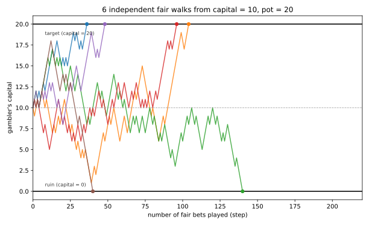
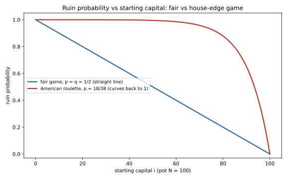

# ch10 — 賭徒輸光問題：公平的賭局，為什麼小資本註定破產

> **本章解決什麼問題**：Part III 三章處理的是「同一批數字，換一種聚合或計數的方式，結論就整個翻過去」；這一章換一整個新家族——時間會流動、資本有邊界的賭局。你會看到，即使一場賭局完全公平（贏一塊、輸一塊，機率各半），只要雙方的資本都有限，「玩到有人輸光為止」這件事，就會把機率悄悄推向一個確定的方向：資本比較少的那一方，注定更容易先撞上 0 這道牆。這一章要把這個結論從頭推導一遍，順便把後面兩章要借用的工具——吸收馬可夫鏈（absorbing Markov chain）與邊界（boundary）——準備好；ch11 會借用這裡「每一步都不記得上一步」的語言去拆賭徒謬誤，ch14 則會借用同一套漫步語言，去講帕隆多悖論裡那個更詭異的棘輪機制。

```text
沒說出口的那句 — 八個部分

  I   解剖學 ────────── ch01 三步解剖：直覺／假設／重建
  │
  II  條件與資訊 ────── ch02 蒙提霍爾 · ch03 三囚犯 · ch04 貝特朗盒子
  │                     ch05 男孩女孩 · ch06 偽陽性
  III 因果聚合計數 ──── ch07 辛普森 · ch08 檢察官謬誤 · ch09 生日問題
  IV  漫步與賭局 ────── ch10 賭徒輸光 · ch11 賭徒謬誤與熱手   ◄ 你在這裡
  │                     ch12 聖彼得堡 · ch13 兩個信封 · ch14 帕隆多
  V   共同知識 ──────── ch15 紅藍眼睛 · ch16 泥巴小孩
  │                     ch17 意外絞刑 · ch18 兩位將軍
  VI  選擇與集體 ────── ch19 非傳遞骰子 · ch20 孔多塞 · ch21 布雷斯 · ch22 紐康
  VII 隨機與測度 ────── ch23 睡美人 · ch24 貝特朗弦 · ch25 班佛 · ch26 巴拿赫–塔斯基
  VIII 收官 ─────────── ch27 一張假設類型總表
```

## 從你已知的出發

設定場景：甲、乙兩人玩一個最簡單不過的賭局——丟一枚公正硬幣，正面甲付乙一塊錢，反面乙付甲一塊錢。這場賭局完全公平：每一局你贏一塊的機率是二分之一，輸一塊的機率也是二分之一，單局的期望值（expected value）恰好是 0。甲帶著 i 塊本金上桌，乙帶著剩下的錢——兩人合計的總資本是 N 塊，所以乙帶 N−i 塊。兩人講好規則：一直玩下去，直到有一方輸光（口袋歸零）為止。

現在問你：如果甲的本金只有兩人合計資本的十分之一（例如 i=100，N=1000，乙帶 900），甲最終把自己輸光的機率是多少？

多數人腦中冒出的第一個念頭大概是這樣：「賭局本身是公平的，期望值是 0，長期玩下去，輸贏應該互相抵銷，我的資本只是隨機上下震盪——晃來晃去，不會特別偏向哪一邊。真要說『誰先破產』，聽起來更像是運氣，應該接近五五波，跟本金多寡關係不大；頂多因為乙本金比較厚，甲運氣差一點就先垮，但不該差太多。」這個想法聽起來完全合理：賭局的公平性，不就是專門用來保證誰都不會系統性吃虧的嗎？

這個直覺是錯的，而且錯得很極端。你會在本章看到，在 i=100、N=1000 的設定裡，本金較少的一方破產機率高達 90%——不是「運氣差一點」，而是幾乎注定。錯在哪裡，要先從一個經常被搞混的歷史問題講起。

## 兩個常被搞混的問題：分賭金，不是這一題

機率論（probability theory）誕生的傳說裡，最常被引用的一段是帕斯卡（Blaise Pascal）與費馬（Pierre de Fermat）在 1654 年的通信——帕斯卡的回信可考的日期是 1654 年 10 月 27 日。但這段通信處理的，其實是另一道題目，叫分賭金問題（problem of points）：兩人賭一系列局，講好誰先贏滿某個局數就拿走全部賭金，結果賭局玩到一半被迫中斷，這時該怎麼按照「目前的比分」公平分掉桌上的錢？這是一道關於「提前結束時如何按比例分配」的題目，答案要用到當時還沒被命名的機率與期望值概念，因此常被稱為機率論的誕生時刻。

本章的賭徒輸光問題（gambler's ruin），問的是完全不同的一件事：賭局不會被誰喊停，會一路玩到某一方資本歸零為止——這是一個關於吸收邊界（absorbing boundary）的問題，不是關於提前中斷如何分帳。兩者都出現在機率論最早的幾份文獻裡，時間點也相近，很容易被混成同一件事，但它們是兩道不同的題目，解法用到的工具也不同。

賭徒輸光問題本身，一般追溯到 1656 年的一封書信——確切日期與傳遞路徑目前並不確定，史料留下的線索比分賭金問題更零散。它第一次被完整寫成印刷品，是惠更斯（Christiaan Huygens）1657 年的《論賭博中的推理》（De Ratiociniis in Ludo Aleae）——公認史上第一本正式出版的機率論專著。這道題目是書裡的「第五問」：甲、乙各拿 12 枚籌碼，用三顆骰子的特定點數觸發轉移（不是本章這種簡單的公正銅板），問誰先把對方的籌碼贏光的機率各是多少。惠更斯本人是否真的完整解出了第五問，在機率論史學界至今仍有爭論；比較沒有爭議的是，能處理任意起始資本、任意總資本的一般化封閉解，要等到德莫弗（Abraham de Moivre）1712 年的論文才被系統性給出——順帶一提，「賭徒輸光」（gambler's ruin）這個英文說法本身，出現的時間遠比 1657 年晚得多，是後世替這道古老題目取的名字。

把史料理順之後，回到數學本身：本章要處理的，就是惠更斯第五問的簡化版——公正銅板、每局輸贏都是一塊錢——把它的破產機率完整推導出來。

## 把「公平」講精確：期望值為零，不是振幅對稱

上一節那個自信的直覺答案，藏著一個對「公平」的誤解，值得先單獨拆開來看，因為它是整章唯一需要精確定義的詞。

「公平賭局」在本章的精確定義是：單局的期望報酬為 0。設 X 是單局的輸贏（+1 或 −1），公平的條件寫成：

```text
E[X] = p·(+1) + q·(−1) = 0     ← p 是贏的機率、q=1−p 是輸的機率
      ⟺ p = q = 1/2            ← 只有 p=q=1/2 時，上式才等於 0
```

這句「期望值為 0」，保證的是**每一局**贏一塊和輸一塊的機率完全對等，長期而言，你的資本這個隨機過程（stochastic process）不會有系統性的漂移方向——用術語說，它是一個鞅（martingale）：不管你現在手上有多少錢，下一局之後手上錢數的期望值，就等於現在這個數字，不多也不少。

但「期望值為 0」跟「你不會撞到 0 這道邊界」是兩件完全不同的事。期望值為 0 只描述了每一步、每一局的對稱性；它完全沒有提到你的資本是不是有下限。而本章的設定裡，資本天生就有一道硬邊界——口袋裡的錢不能是負的，輸光了就出局，遊戲直接結束，不會有「借錢繼續玩」這回事。一個期望值恆為 0 的隨機過程，撞上一道只能單向離開的邊界（吸收態，absorbing state），完全可以在長期呈現出一面倒的結果——這兩件事之間沒有任何矛盾，接下來的推導，會讓你親眼看到這是怎麼發生的。

## 吸收馬可夫鏈：兩道牆

把「甲手上的錢」這件事，當成一個會隨時間變化的狀態，就得到一條馬可夫鏈（Markov chain）：狀態是甲當下的資本 i，範圍是 0 到 N 之間的整數；每一步，狀態以機率 p 往右走一格（i→i+1，甲贏一塊），以機率 q=1−p 往左走一格（i→i−1，甲輸一塊）。這條鏈有兩個特殊的狀態：i=0 與 i=N。一旦走到這兩個狀態，遊戲規則規定「輸光的人出局」，狀態就不會再變動——這種一旦進入就出不來的狀態，叫吸收態（absorbing state），i=0 與 i=N 就是這條鏈的兩道牆。

本章要算的，就是「這條鏈最終停在 i=0（甲破產）」這件事的機率，寫成 q_i：從起始資本 i 出發，最終被 0 這道牆吸收的機率。

## 破產機率的遞迴：一個等差數列的巧合

先處理公平版本，p=q=1/2。設 q_i 是「起始資本為 i 時，最終破產的機率」，i 的範圍是 0 到 N。邊界條件很直白：q_0=1（已經在 0，「破產」這件事已經發生，機率當然是 1），q_N=0（甲已經把乙的錢全部贏光，遊戲結束，破產機率是 0）。

對於中間任何一個狀態 1≤i≤N−1，下一步只有兩種可能：以機率 ½ 走到 i+1，以機率 ½ 走到 i−1。用全機率公式（law of total probability）對下一步的兩種結果分解：

```text
q_i = ½·q_{i-1} + ½·q_{i+1}       ← 「現在破產的機率」＝「下一步兩種去向各自的破產機率」的加權平均
```

這是一條二階線性遞迴（second-order linear recurrence），變數之間互相牽連，看起來要解一個 N−1 元的聯立方程組。但只要把上式稍微移項，就會冒出一個非常乾淨的巧合：

```text
q_i = ½·q_{i-1} + ½·q_{i+1}
⟺ 2q_i = q_{i-1} + q_{i+1}
⟺ q_{i+1} − q_i = q_i − q_{i-1}     ← 移項後，左右兩邊都是「相鄰兩項的差」
```

上面這一步是整個推導的關鍵：它說「q 從 i 走到 i+1 的變化量」，永遠等於「q 從 i−1 走到 i 的變化量」——也就是說，**相鄰兩項的差是一個常數**，跟 i 無關。一個相鄰項的差恆為常數的數列，正是等差數列（arithmetic sequence）的定義。

令這個公共差為 d（d = q_1 − q_0），等差數列的通式告訴我們：

```text
q_i = q_0 + i·d = 1 + i·d        ← q_0=1，每往右走一步，累加一次公差 d
```

現在只剩一個未知數 d，用另一條邊界條件 q_N=0 把它定出來：

```text
q_N = 1 + N·d = 0
⟹ d = −1/N                       ← 公差是負的，數列從 1 一路遞減到 0，方向合理
```

把 d = −1/N 代回通式：

```text
q_i = 1 + i·(−1/N) = 1 − i/N     ← 就是本章的答案，對照基準表 B8
```

這正是基準表（見 `_meta/running-examples.md`）B8 的結果：**q_i = 1 − i/N**，起始資本 i、總資本 N、對手資本 N−i。整個推導沒有用到任何近似，每一步都是等號連著等號，唯一用到的技巧，是發現移項後相鄰差恆定，把一個看似複雜的聯立方程組，收斂成一個等差數列問題。

**換一個角度重新確認同一個答案（鞅的角度）**：上一節說過，公平賭局是一個鞅——不管現在資本多少，下一步資本的期望值就等於現在的資本。鞅有一個很強的性質（更嚴格的版本要用到選擇性停止定理，optional stopping theorem，本書在此只取直覺版）：只要賭局保證會在有限步內結束（本章的邊界 0 與 N 保證了這件事），那麼「開始時的資本」就要等於「結束時資本的期望值」。甲最終停在 0 的機率是 q_i，停在 N 的機率是 1−q_i，所以：

```text
i = E[最終資本] = 0·q_i + N·(1−q_i) = N·(1−q_i)
⟹ 1 − q_i = i/N
⟹ q_i = 1 − i/N                  ← 跟遞迴解出來的答案一字不差
```

這條捷徑之所以值得一提，是因為它把「公平＝期望值不變」這句話，直接當成證明工具用了一次——這正是本章最終要揭穿的那句沒說出口的假設的正面示範：期望值不變，是一件很強的事實，但它只保證「起點的期望值＝終點的期望值」，完全沒有保證「終點只有一種可能」。

## 完整算兩個例子

**例一：勢均力敵。** 甲、乙本金相同，各帶 100 塊，總資本 N=200，i=100。代入 q_i=1−i/N：

```text
q_100 = 1 − 100/200 = 1 − 1/2 = 1/2 = 0.5
```

破產機率剛好 50%——這符合直覺：兩人本金完全對稱，誰先垮的機率當然應該一樣。

**例二：小資本對莊家。** 甲只帶 100 塊，對手（可以想成一家小賭場）帶 1000 塊，總資本 N=1100，i=100：

```text
q_100 = 1 − 100/1100 = 1000/1100 = 10/11 ≈ 0.9091
```

破產機率約 90.91%——即使賭局的每一局都完全公平（p=q=1/2，沒有任何莊家優勢），只因為甲的本金只有對手的十分之一，甲最終破產的機率就已經超過九成。這正是本章要打破的那個直覺：「公平」跟「資本比較少的人不會系統性吃虧」，完全是兩件事。資本的懸殊比例本身，就足以幾乎注定結果，不需要任何一方在機率上被動手腳。

下面這張圖，把上面兩個例子背後的隨機過程具體畫出來：



這張圖要你看的重點是：每一條路徑用的都是同一枚公正銅板、同一組規則，出發點也完全相同，但只要撞到其中一道牆，遊戲就立刻結束、沒有回頭路——「公平」只保證了每一步的對稱，完全沒有保證每條路徑最終撞到哪一道牆。

下一張圖把「起始資本」當成橫軸，把「破產機率」畫成一條線：



藍色那條直線，就是 q_i=1−i/N 的圖形——起始資本每增加一塊，破產機率就線性下降一點點，這是公平賭局的招牌形狀。紅色那條曲線，屬於下一節要處理的「莊家佔優勢」版本，它幾乎整條線都貼在 1 附近，形狀完全不是直線——這個對比，正是本章想留給你的視覺記憶。

## 有莊家優勢時，破產近乎必然

上面的推導假設每局的輸贏機率都是 p=q=1/2。真實世界的賭場沒有一項遊戲是這樣設計的。以美式輪盤（American roulette）押紅／黑為例：輪盤上有 36 個紅黑相間的號碼，外加 0 和 00 兩個綠色號碼（莊家的優勢就藏在這兩個綠格），一共 38 個等機率的格子，其中 18 格是紅色。押紅單次獲勝的機率是 **18/38 ≈ 0.4737**（本章基準數字 B9），輸的機率是 20/38——p 不再等於 q，賭局本身就對玩家不利。

當 p≠q，同一條遞迴 q_i = p·q_{i+1} + q·q_{i-1}（注意這裡下標順序要對應「往哪個方向移動的機率」：以機率 p 贏一塊走到 i+1、以機率 q 輸一塊走到 i−1，本章沿用惠更斯以來的標準寫法）不再是等差數列，但仍然是一條二階線性遞迴，可以用特徵方程（characteristic equation）解出通解——這裡只取結果，完整代數操作屬於線性遞迴的標準技巧，不在本章重複展開（sketch 等級）：

```text
q_i = [ (q/p)^i − (q/p)^N ] / [ 1 − (q/p)^N ]        ← p≠q 時的封閉解一句話
```

當 p=q=1/2 時，(q/p)=1，上式會出現 0/0 的未定型，取極限後就會還原成前面推出的 1−i/N（這是檢查封閉解是否正確銜接的一個好方法，本書不在此展開取極限的細節）。

代入美式輪盤的數字看看差距有多大：p=18/38、q=20/38，比值 q/p=20/18=10/9≈1.1111（這個比值大於 1，正是莊家優勢的數學指紋——輸的機率永遠比贏的機率大一截）。假設你帶 10 塊錢上桌，每次押 1 塊在紅色上，玩到把 10 塊翻倍變 20 塊、或是輸光為止（i=10，N=20）：

```text
(q/p)^10 = (10/9)^10 ≈ 2.868
(q/p)^20 = (2.868)²   ≈ 8.225

q_10 = (2.868 − 8.225) / (1 − 8.225) = (−5.357) / (−7.225) ≈ 0.7415
```

破產機率約 74.15%——比公平賭局同樣「翻倍出場」情境下的 50% 高出一大截。而且莊家優勢的殺傷力不只如此：如果你的目標從「翻倍到 20」換成「翻倍到 100」（i=10，N=100，i/N 的比例大幅下降但你身上的本金 10 塊完全沒變），破產機率會飆到約 **99.995%**；目標換成「N=1000」，破產機率要到小數點後數十位才會跟 1 有差別，已經跟「必然破產」沒有實質區別。這正是基準數字 B9 想傳達的那句話：**只要莊家有優勢（q/p>1），你玩的局數（或者說，莊家背後的資本）愈多，你破產的機率愈是被向 1 推——不是運氣的問題，是指數的問題**：(q/p)^N 隨 N 呈指數成長，只要 q/p 比 1 大一點點，N 稍微拉長，這個指數項就會把公式裡的其他項全部壓下去，把破產機率死死釘在 1 附近。真實賭場之所以能穩定獲利，靠的從來不是每一局贏很多，而是背後那份幾乎無窮的資本，把你困在一個 N 遠大於你本金的賽局裡。

## 期望遊戲時長，一句話

除了「最終誰破產」，另一個自然的問題是：這場賭局平均要玩幾局才會分出勝負？公平版本（p=q=1/2）有一個同樣乾淨的封閉解：從資本 i 出發、總資本為 N 時，期望局數 **D_i = i·(N−i)**。這個結果同樣可以用類似上面的遞迴技巧解出（設 D_i 滿足 D_i = 1 + ½D_{i-1} + ½D_{i+1}，邊界 D_0=D_N=0，解出的通解裡多一個二次項來抵銷等號右邊那個「+1」的推力），本章不重複展開代數細節，只留一個直覺：D_i 在 i=N/2（資本對半分）時最大，代入例一（i=100，N=200）得到 D=100×100=10,000 局，代入例二（i=100，N=1100）則是 D=100×1000=100,000 局——資本愈懸殊，破產機率愈接近確定值沒錯，但實際要玩的局數，也可能長得超乎預期，這也是為什麼真實世界裡「小資本很快就會爆」這種說法，在單局層次上並不精確：機率是確定的方向，但抵達那個方向要花的時間，本身也是一個隨機變數。這條線索連到更廣的漫步理論（把步長縮到無窮小、時間換成連續，就會收斂成布朗運動，Brownian motion），本書在此點到為止，完整的極限理論留給機率欣賞書處理。

## 直覺的陷阱

回頭看本章開頭那個自信的答案：「賭局公平，期望值是 0，長期下來輸贏該互相抵銷，破產機率不該跟本金懸殊差太多。」把這整套錯覺拆開來看：

| 階段 | 發生了什麼 |
|---|---|
| 直覺的自信答案 | 賭局的期望值是 0，所以「公平」保證了雙方的長期結果應該接近對稱，資本多寡頂多造成小幅偏移 |
| 偷渡的假設 | 把「期望值為 0（每一局輸贏機率對等）」悄悄等同於「最終結果的機率也應該接近對稱」，卻沒有意識到資本有一道下限（0），這道邊界本身就是不對稱的——起始資本 i 離 0 這道牆有多近，直接決定了誰先撞上它 |
| 為什麼聽起來理所當然 | 「公平」這個詞在日常語言裡帶有「不會系統性偏袒任何一方」的語感，很容易被直接套用到「最終誰輸光」這個問題上；但期望值為 0 描述的是每一步的局部對稱，跟「有沒有一道只能單向離開的邊界」是完全獨立的兩件事，日常語感沒有把它們分開 |
| 在哪一步被帶溝裡 | 不是計算出錯，而是在把「公平賭局」翻譯成數學物件的那一刻，只翻譯了「單局的期望值」，卻沒有把「口袋不能是負的」這道邊界條件一起翻譯進去——邊界條件才是決定最終結果分佈的關鍵，光看單局的公平性看不出來 |
| 怎麼自我察覺 | 每次聽到「這件事本質上是公平／隨機的，所以長期結果應該對稱」，先問自己一句：這個隨機過程有沒有邊界（吸收態、破產、出局）？如果有，邊界離每一方的起點各有多遠？兩個問題的答案，往往比「過程本身公不公平」更決定最終誰輸誰贏 |

值得指出的是，這個「期望值為 0 不等於長期結果對稱」的錯覺，不是賭桌特有的現象。任何一個帶邊界的隨機過程——公司現金流撞上破產這道牆、生態族群規模撞上滅絕這道牆、體育賽事的比分差撞上「提前結束」這道規則——都可能出現同一種結構：局部公平，長期卻因為邊界的位置而幾乎確定地倒向一邊。認出「這裡有一道吸收邊界」，是本章留給你最值錢的一個警覺。

> **那句沒說出口的話是**：「公平」只保證了單局期望值為 0（贏一塊、輸一塊，機率各半），從來沒有保證你碰不到 0 這道吸收牆——資本愈懸殊，你離那道牆愈近，跟賭局公不公平無關。

## 紙上推演

**練習 1（★，10 分鐘）**：甲帶 30 塊上桌，乙帶 20 塊（總資本 N=50，i=30，這裡問的是「i 這一方」的破產機率）。用 q_i=1−i/N 算出甲的破產機率，並算出這場賭局的期望局數 D_i=i(N−i)。

**練習 2（★★，15 分鐘）**：換成一個對玩家不利的偏銅板，正面（贏）機率 p=0.4，反面（輸）機率 q=0.6。甲帶 5 塊，總資本 N=10。用封閉解 q_i=[(q/p)^i−(q/p)^N]/[1−(q/p)^N] 算出甲的破產機率，並和 p=0.5 時同樣 i=5、N=10 的破產機率（用 B8 直接算）比較，感受一下 p 只偏離 0.5 十個百分點，破產機率會被推多遠。

**練習 3（★★★，20 分鐘）**：延續本章「有莊家優勢時破產近乎必然」那一節的美式輪盤例子（p=18/38），這一次把起始資本與目標同時放大十倍：i=200，N=400（跟正文 i=10、N=20 的比例完全相同）。算出破產機率，並回答：如果「公平版本」的破產機率只取決於 i/N 這個比例（例一、例二都印證了這件事——只要 i/N 一樣，破產機率就一樣），那麼「有莊家優勢的版本」是不是也只取決於這個比例？你的計算結果說明了什麼？

**練習 4（★★，15 分鐘）**：不查書，只憑本章學到的邏輯，口頭解釋一次：如果有人跟你說「這個投資工具的每一步都是公平的（期望報酬為 0），長期持有很安全」，你會追問對方哪兩個問題，才能判斷這句話有沒有藏著本章揭穿的那個陷阱？

### 推演解答

**練習 1 解答**：

```text
q_30 = 1 − 30/50 = 1 − 0.6 = 0.4
D_30 = 30 × (50−30) = 30 × 20 = 600
```

甲的破產機率是 40%（乙破產機率則是 60%，兩者相加剛好是 100%，符合「一定有一方會輸光」的設定）。期望局數 600 局——資本比例 30:20 並不算太懸殊，所以期望要玩上好一段時間才會分出勝負。

**練習 2 解答**：先算 p=0.4 的偏銅板版本。q/p=0.6/0.4=3/2=1.5：

```text
(q/p)^5  = 1.5^5  = 7.59375
(q/p)^10 = 1.5^10 = 57.665039…

q_5 = (7.59375 − 57.665039) / (1 − 57.665039)
    = (−50.071289) / (−56.665039)
    ≈ 0.8836 = 88.36%
```

對照 p=0.5 時同樣 i=5、N=10 的破產機率：q_5=1−5/10=0.5=50%。同一個起始資本比例（甲乙各半），p 只從 0.5 掉到 0.4（偏離十個百分點），破產機率就從 50% 暴衝到 88.36%——這就是本章一直在強調的重點：偏離「公平」的幅度看起來不大，但因為它是以指數項 (q/p)^i 的形式作用在破產機率上，很小的偏離就能造成很大的結果落差。

**練習 3 解答**：q/p 仍是 20/18=10/9≈1.1111，這次 i=200、N=400：

```text
(q/p)^200 = (10/9)^200 ≈ 1.42×10⁹
(q/p)^400 = (10/9)^400 ≈ 2.01×10¹⁸

q_200 = (1.42×10⁹ − 2.01×10¹⁸) / (1 − 2.01×10¹⁸) ≈ 0.99999999929
```

破產機率約 99.9999999%，跟本章正文 i=10、N=20（比例相同，74.15%）差距懸殊。答案是：**有莊家優勢的版本，破產機率不是只取決於比例 i/N，還強烈取決於絕對資本 i 本身**——這正是公平版本和不公平版本最根本的差異。公平版本的 q_i=1−i/N 是一個只看比例的線性函數，把 i 和 N 同時放大十倍，比例不變，答案完全一樣；但不公平版本的封閉解裡有 (q/p)^i 這個指數項，指數項只認絕對數值，i 從 10 放大到 200，(q/p)^i 會被放大成原本的二十次方那麼多倍，破產機率因此被指數式地推向 1。換句話說：在有莊家優勢的遊戲裡，「多帶點本金、比例維持一樣」完全沒有用——資本的絕對規模愈大，你在指數項上被碾壓得愈徹底，這是公平賭局裡完全不會出現的效應。

**練習 4 解答**：至少要追問兩個問題。第一，「期望報酬為 0」這句話，指的是哪一種平均——是每一步、每一個時間點的平均（本章的「單局公平」），還是某個更長時間尺度上、事後才能驗證的平均？如果只是前者，它完全沒有排除「短期或中期內出現一面倒結果」的可能。第二，這個過程有沒有一道邊界會提前終止一切——例如帳戶餘額歸零就被強制平倉、公司現金流見底就宣告破產？如果有，這道邊界離你目前的位置有多近，往往比「這個工具本質上公不公平」更決定你最終的下場。這兩個問題，正好對應本章「期望值為 0」與「吸收邊界」這兩件被直覺混為一談、其實完全獨立的事。


## 自我檢核

1. 本章的「公平賭局」精確定義是什麼？用一句包含 E[X] 的式子講出來。
2. 為什麼「單局期望值為 0」不能推出「最終誰破產接近五五波」？兩者之間到底缺了哪一塊？
3. 分賭金問題（problem of points）和賭徒輸光問題，兩者的題目設定差在哪裡？為什麼歷史上容易被混成同一件事？
4. 自己動手把遞迴 q_i=½q_{i-1}+½q_{i+1} 移項成「相鄰差為常數」那一步，重講一次為什麼這一步能把問題變成等差數列。
5. 用鞅（martingale）與選擇性停止定理的直覺版，重新推一次 q_i=1−i/N，並說明這個推法跟遞迴解法在「用到的假設」上有什麼不同。
6. p≠q 的封閉解裡，為什麼「莊家優勢」的殺傷力是指數式的，而不是線性的？練習 3 的結果對這句話提供了什麼證據？
7. 期望遊戲時長 D_i=i(N−i) 在 i=N/2 時最大，這個事實對「小資本很快就會爆」這種說法有什麼修正？
8. 這個悖論那句沒說出口的假設是什麼？試著不看課文，用自己的話重講一次。

## 延伸閱讀

- 〈Gambler's ruin〉，Wikipedia——本章公平版與不公平版封閉解、歷史脈絡（Huygens 第五問、de Moivre 1712）的總覽條目，可作為本章推導的交叉核對。<https://en.wikipedia.org/wiki/Gambler%27s_ruin>
- Huygens, C. (1657). *De Ratiociniis in Ludo Aleae*. 英譯本與原文影像可見 probabilityandfinance.com 整理的頁面——史上第一本正式出版的機率論專著，賭徒輸光問題是其中的「第五問」（未驗證：惠更斯本人是否完整解出第五問，史學界仍有不同意見）。
- 〈Problem of points〉，Wikipedia——分賭金問題的總覽條目，方便對照本章強調的「分賭金 vs 賭徒輸光，是兩道不同的題目」。<https://en.wikipedia.org/wiki/Problem_of_points>
- Grinstead, C. M., & Snell, J. L. *Introduction to Probability*（公開電子版），第 12 章「Random Walks」——包含賭徒輸光問題的完整代數推導（含 p≠q 版本與期望局數的推導細節），可補足本章略去的特徵方程代數操作。
