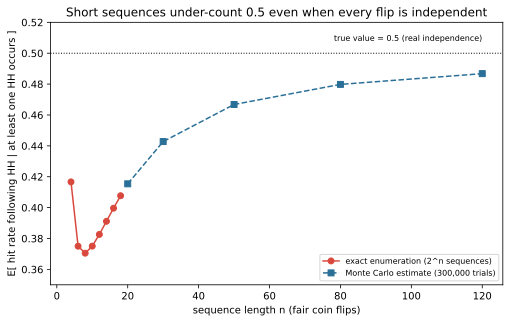

# ch11 — 賭徒謬誤與熱手：獨立到底是什麼意思

> **本章解決什麼問題**：ch10 用一條會撞上 0 這道吸收牆的隨機漫步，拆穿了「公平賭局不會讓你破產」這個錯覺，但那一章從頭到尾都假設每一步硬幣互不影響——這一章要把「互不影響」這件事的精確定義攤開來，並且用它同時拆穿兩個方向相反的錯覺：賭徒謬誤（gambler's fallacy）以為連續開出同一結果之後，另一個結果「該」出現了；熱手（hot hand）卻反過來相信連續命中之後，命中會延續下去。兩者不可能同時成立，而更麻煩的是，就連當年用來證明其中一個是錯覺的統計方法，後來也被發現自己量錯了尺。本章是 Part IV（漫步與賭局）的第二章，後面 ch12（聖彼得堡）會換一個角度，處理期望值本身被誤用的問題。

## 從你已知的出發

一九一三年八月十八日夜裡，摩納哥蒙地卡羅賭場的一張輪盤桌前，球連續開出黑色格子——至少，這是這個故事流傳最廣的版本。它在無數本討論機率謬誤的書和網頁上反覆出現，但如果你想找一份一九一三年當下的報紙報導或賭場帳冊核對細節，你會發現幾乎所有轉述最終都匯流回同一條晚近的二手鏈條，末端常見的落腳處是一篇約二〇一五年前後的英國廣播公司（BBC）報導，找不到任何一份可查的一手文件。本章仍然按照這個「通常怎麼講」的版本重建現場，但值得先說在前面：接下來要提到的具體次數與賭客損失，都該在心裡默默加上一句「據說」。

照這個版本的說法，賭桌上很快聚集了愈來愈多人。黑色開到第十次，還只是稀奇；開到第十五次，牌桌旁已經開始有人竊竊私語；開到第二十次，愈來愈多人開始把籌碼壓上紅色——邏輯聽起來無懈可擊：黑色已經連續開了這麼多次，紅色遲早該出現，而且欠得愈多，這一把壓下去中的把握就該愈大。等到黑色真的連開到二十六次，據說已經有賭客深信「紅色這次一定會來」，把賭本一次次加碼壓在紅色上，直到輸光——而黑色，仍然接連開了下去。

把賭桌換成籃球場，同一種直覺卻朝著完全相反的方向作用。一名球員連續投進三、四球外線，場邊球評的聲音會自然拉高：他「手感火燙」（hot hand）了，快把球傳給他。隊友會更願意把最後一擊交給他，防守方會加派人手包夾他。這個直覺同樣理所當然：投籃需要手感、節奏、專注力，一名球員如果連續命中，似乎有理由相信他正處在某種特別的狀態裡，接下來這一球命中的機會，應該比他平常的命中率更高才對。

這兩種直覺，看起來像同一枚硬幣的兩面：賭徒謬誤相信連續發生同一件事之後，它會反轉；熱手相信連續發生同一件事之後，它會延續。一個相信負相關的記憶，一個相信正相關的記憶，兩者不可能同時正確——除非輪盤和籃球根本不是同一種情況。本章要做的，就是把「獨立」這個詞的精確意義攤到桌上，看看這兩種直覺各自在哪一步被帶偏；而故事的轉折是，就連拿來拆穿其中一個直覺的統計方法，後來也被發現自己量錯了尺。

## 獨立的精確意義：一句可以檢驗的話

機率裡的獨立（independence）有一個精確、可以直接拿來檢驗的定義：兩個事件 A、B 獨立，若且唯若

```text
P(A|B) = P(A)
```

也就是說，知道 B 已經發生，完全不會改變你對 A 發生機率的估計。這個定義還有一個等價寫法 P(A∩B) = P(A)·P(B)，兩者可以互相推導，選哪一個純粹看哪個算起來方便。把定義套用到一連串試驗上，「這一連串試驗互相獨立」的精確意思是：對任何一次試驗而言，不論你已經知道前面發生過什麼結果，這一次的條件機率永遠等於它的無條件機率——

```text
P(第 n 次 = x | 第 1 次到第 n−1 次的結果) = P(第 n 次 = x)
```

白話地說，獨立不是在說「每一種結果出現的次數，長期下來會拉平」——那是另一件事，下一節會處理。獨立說的是更局部、更嚴格的一件事：每一次試驗發生的那個瞬間，物理世界或機率模型本身，沒有任何管道去查閱「之前發生過什麼」這份紀錄，再根據它去調整這一次的機率。

這正是 ch10 賭徒輸光問題背後，一路都在使用、卻沒有被明講出來的假設（見 ch10）。那一章把賭局模型化成一條隨機漫步（random walk）：資本每一步以機率 p 加一、機率 q=1−p 減一，直到撞上 0 這道吸收態（absorbing state），或撞上資本上限 N。整條漫步會展現出很不直覺的長期性質——例如公平賭局下、起始資本 i、總資本 N 時，破產機率是 1−i/N（ch10 的基準 B8）——但這整套推導能夠成立，前提正是每一步的加一或減一都跟前面所有步驟互相獨立：第五十步是加一還是減一，機率恆定是 p 和 q，完全不管前面四十九步發生過什麼。長期會出現「幾乎必然撞上某道邊界」這種結構，是很多個獨立步驟疊加、又碰上邊界之後才浮現的全域效果，不是任何一步「記得」自己離邊界有多近而產生的。獨立描述的是每一步局部的性質；破產機率、吸收邊界則是把很多個獨立局部疊起來之後的全域結果——這兩件事並不衝突，卻常常被混為一談，這正是本章要拆開的第一層。

## 賭徒謬誤：蒙地卡羅那個晚上

回到蒙地卡羅的賭桌，先把數字擺正。ch10 用來說明莊家優勢的美式輪盤，三十八格，含 0 與 00，押紅色的單次獲勝機率是 B9=18/38≈0.4737。但歷史上蒙地卡羅賭場用的從來不是美式輪盤，而是歐式的單零輪盤——三十七格，十八紅、十八黑、一綠（0）。這種只留一個 0 格的輪盤，一八四三年由法國人弗朗索瓦·布朗（François Blanc）與其兄弟路易·布朗（Louis Blanc）在德國溫泉小鎮巴特洪堡（Bad Homburg）首度推出，藉著降低莊家優勢來跟其他賭場搶客人；一八六〇年代德國政府全面禁賭後，布朗家族轉往當時歐洲最後一處合法賭場摩納哥蒙地卡羅，把這種單零輪盤也帶了過去，從此成為蒙地卡羅的招牌賭具。押黑或押紅在這種輪盤上的單次機率是 18/37≈0.4865。這個差異不是吹毛求疵：如果你想自己重算「連開二十六次同色」有多稀奇，用錯輪盤格數會讓答案偏離超過一個數量級，這正是「數值要自己重算一遍，不能抄記憶」這條規矩最實際的用處。

先算最直白的版本——連續二十六次都開黑——機率是 (18/37)²⁶：

```text
(18/37)²⁶ ≈ 0.486486²⁶
          ≈ 7.31 × 10⁻⁹
          ≈ 1 / 136,800,000        ← 約1億3,680萬分之一（指定顏色為黑）
```

但這裡有一個容易被忽略的地方：蒙地卡羅那晚的賭客，並沒有在第一次轉動之前，事先寫下「我猜接下來會連開二十六次黑」——他們是眼睜睜看著同一個顏色一直開，才開始緊張的。如果你真正想問的其實是「連續二十六次開出同一種顏色，不管是紅是黑」有多稀奇，正確的演算法要把黑、紅兩種可能都算進去，機率要乘以二：

```text
P(連26次同色，不指定紅黑) = 2 × (18/37)²⁶
                          ≈ 2 × 7.31 × 10⁻⁹
                          ≈ 1.46 × 10⁻⁸
                          ≈ 1 / 68,400,000     ← 約6,840萬分之一
```

這正是本章的基準數字：連二十六次同色（不預先指定紅或黑）的機率約為六千八百四十萬分之一。這兩個數字——一億三千六百八十萬分之一與六千八百四十萬分之一——都「對」，差別只在於你精確問的是哪一個事件。這本身就是一個提醒：任何一句「機率是多少」，都預設了一個精確的事件描述；含糊地說「這種巧合機率只有N分之一」，常常已經悄悄在兩種不同的問法之間打了折扣，而這個折扣剛好是二倍。

不管用哪一個版本，這都是一個極度罕見的事件，罕見到大多數人一輩子都不會親眼見過一次。但「這件事發生前機率極低」和「這件事已經發生之後，下一次會發生什麼」，是兩個完全不同的問題。獨立的精確定義告訴你：即使前面已經連開了二十五次黑，第二十六次（乃至第二十七次）開出黑的機率，依然精確地是 18/37，不多也不少——這不是「儘管」獨立所以輪盤沒有記憶，而是「正因為」獨立這個假設本身就是這麼定義的，這句話才成立。賭徒謬誤犯的錯，不是算錯了機率，而是偷偷加了一句從沒說出口的假設：輪盤有某種機制，會記得自己欠某個顏色多少次，並且有義務在未來把它還回來。物理上，輪盤和球沒有任何管道可以讀取過去二十五次的結果——每一次轉動的初速度、球的反彈角度、空氣阻力，都是全新的物理條件，不會因為「已經黑了二十五次」而受到絲毫影響。

## 回歸均值不是「補償」

賭徒謬誤還常常混進另一個真實存在、卻被誤用的統計現象：回歸均值（regression to the mean）。設想同一個歐式輪盤，黑色真的連開二十六次之後，再往下轉一萬次。長期來看，黑色出現的整體比例，幾乎一定會從「前二十六次都是黑」這個極端值，慢慢滑回接近 18/37 這個真實比例附近——這是大數法則（law of large numbers）保證的性質，不是巧合。問題在於，這件事發生的機制，和賭徒謬誤想像的完全不同。

大數法則保證的滑回，不是靠未來的紅色去「補償」過去的黑色——每一次轉動依然只有 18/37 的機會開黑，跟過去無關。它純粹是稀釋（dilution）：二十六這個數字，除以二十六，佔一百%；但除以一萬零二十六，只佔 0.26%，幾乎可以忽略。整體比例會滑回均值附近，不是因為輪盤欠了紅色一筆帳、正在還債，而是因為分母變大了，前面那二十六次的異常表現，被後面上萬次正常表現稀釋掉了。這條界線劃錯，正是賭徒謬誤的核心：它把「大量試驗加總之後，長期比例會回歸均值」這句關於分母的話，錯誤地套用到「下一次」這個單一、局部的事件上。回歸均值是一句關於長期加總的話，不是一句關於下一步會發生什麼的話——這兩句話聽起來很像，卻描述著完全不同層級的東西。

## 熱手：相反方向的同一個錯覺

回到籃球場。如果賭徒謬誤的問題是誤信獨立事件之間存在著負相關的記憶，那麼熱手的原始信念，就是誤信正相關的記憶存在：連續命中之後，下一球命中的機率會比平常更高。這個問題第一次被認真拿真實數據檢驗，要歸功於心理學家湯瑪斯·吉洛維奇（Thomas Gilovich）、羅伯特·瓦隆（Robert Vallone），以及在 ch06 已經出現過的阿莫斯·特沃斯基（Amos Tversky）。三人於一九八五年在《認知心理學》（Cognitive Psychology）第十七卷發表了一篇論文，題為〈籃球場上的熱手：對隨機序列的誤判〉（The Hot Hand in Basketball: On the Misperception of Random Sequences，以下簡稱 GVT）。

GVT 分析了費城七六人隊球員一整個賽季的實戰投籃紀錄、波士頓塞爾提克隊球員的罰球紀錄（罰球排除了防守干擾，是更乾淨的獨立試驗環境），還額外找了康乃爾大學男女校隊球員，做了一場控制良好的定點投籃實驗。三組數據的分析結論一致：球員投進一球之後，下一球的命中率，跟他前一球是進是不進，在統計上找不到有意義的正相關——換句話說，球員自己，以及場邊每一個相信「他現在手感火燙」的球評、隊友、教練，對自己親眼看到的東西的判斷，是一種錯覺。這篇論文因此把熱手定性為一種「認知錯覺」（cognitive illusion）：真正存在的只是隨機序列本身天然帶有的、好運接連好運的長串——就像連續丟硬幣，偶爾也會連續出現四、五次正面，人腦天生傾向於在這種純粹的運氣聚集裡，腦補出一個並不存在的因果解釋。

## Miller–Sanjurjo 2018：拿來否證熱手的尺，自己也歪了

「熱手是錯覺」這個結論，在往後三十多年裡幾乎成了行為經濟學教科書裡的標準答案——直到二〇一八年，兩位經濟學家約書亞·米勒（Joshua B. Miller）與亞當·桑胡爾霍（Adam Sanjurjo）在頂尖期刊《計量經濟學》（Econometrica）第八十六卷發表了一篇論文，指出 GVT 當年用來量測「命中之後再命中的比例」這把尺，本身就悄悄歪掉了。

問題出在一個非常反直覺的統計細節上。GVT 的做法，本質上是：對每一位球員，把他整季紀錄裡「前一球命中、這一球也命中」的次數，除以「前一球命中」的總次數，算出一個「連中後再中率」；再拿這個比例跟他整體的命中率相比，看有沒有明顯偏高。這個做法聽起來無可挑剔——但米勒與桑胡爾霍指出：即使每一球真的完全獨立（球員完全沒有手感這回事，每一球命中機率都是同一個固定值），只要用**有限長度**的序列去計算「連中之後再中」這個比例，它的期望值本身就會系統性地低於真實的命中率。原因很微妙：在一段有限長的投籃紀錄裡，如果某一段特別倒楣、連續沒有進球，這一段裡根本不會出現「前一球命中」這個條件，整段對統計量沒有任何貢獻；反過來，當一段紀錄剛好以連續命中結尾，最後一次命中後面沒有「下一球」可以拿來檢驗，也不會被計入分子。這種因為序列長度有限而產生的選擇效應（selection effect），光靠純數學結構，不需要任何真實的負相關，就足以把估計值往下拉。

這個機制聽起來很抽象，最快的辦法是自己動手排出所有可能，親眼看它發生一次。取一枚公正硬幣，連丟四次，正面記為 H、反面記為 T，十六種組合都是等機率結果。只看「緊接在連續兩次正面（HH）之後的那一次」——連丟四次，這樣的位置最多有兩個：第三次（如果第一、二次都是 H）、第四次（如果第二、三次都是 H）。十六種結果裡，大多數根本不會出現「連續兩次正面」這個條件，對這個統計量完全沒有貢獻，必須被排除在外——這一步排除，正是偏誤混進來的地方。逐一列出，剩下有貢獻的只有六種：

| 4次結果 | 可觀察的HH後一位 | 命中／機會 | 該序列的比例 |
|---|---|---|---|
| HHHH | 第3位=H，第4位=H | 2／2 | 1.0 |
| HHHT | 第3位=H，第4位=T | 1／2 | 0.5 |
| HHTH | 第3位=T | 0／1 | 0.0 |
| HHTT | 第3位=T | 0／1 | 0.0 |
| THHH | 第4位=H | 1／1 | 1.0 |
| THHT | 第4位=T | 0／1 | 0.0 |

其餘十種結果（如 HTHH、TTHH、TTTT⋯⋯）裡，連續兩次正面根本沒有出現在「後面還跟著一次」的位置上，無法定義這個比例，只能被排除在平均之外——這正是選擇效應發生的地方。把上面六個有效比例平均起來：

```text
(1.0 + 0.5 + 0.0 + 0.0 + 1.0 + 0.0) / 6 = 2.5 / 6 ≈ 0.4167
```

這個結果值得停下來盯著看十秒鐘：每一次丟硬幣，正面的機率都精確是 1/2，四次之間互相完全獨立，沒有任何一次「記得」前面發生過什麼。可是，只要你用「對每個序列算一次連中後再中的比例，再把序列平均起來」這個看似合理的做法去測量它，算出來的期望值卻是 0.4167，而不是 0.5——比真正的機率整整低了超過八個百分點。這不是抽樣運氣不好剛好抽到偏低的一組，而是這個統計量在數學上的期望值，只要序列長度夠短，它就系統性地低於真值，不管背後有沒有真正的正相關或負相關。

這個效應會隨著序列拉長而縮小嗎？會，但過程並不單調。把同一套定義擴大到更長的序列，逐一窮舉計算，這個統計量的期望值在 n=4 時是 0.4167，拉長到 n=8 反而先掉到更低的約 0.3705，直到 n=18 才緩慢回升到約 0.4077；再用蒙地卡羅模擬估計更長的序列，n=50 回到約 0.4668，n=120 約 0.4868，n=500 約 0.4969——序列長度要拉得非常長，這個統計量才會真正貼近 0.5。GVT 當年分析的 NBA 球員數據，單一球員一整季的出手次數通常落在幾百次這個量級，而「連續命中兩次以上」這種條件出現的次數又遠少於總出手次數，正好落在這個統計量還明顯偏低的區間裡。



這張圖要你看到的重點是：黑色虛線標出的真值永遠是 0.5，但紅色那條窮舉曲線（n=4 到 18，每個點都是把 2ⁿ 種結果全部列出來精算的準確值，不是模擬）和藍色虛線那條蒙地卡羅估計（n=20 到 120，每個點用三十萬次模擬逼近）連起來看，估計值始終壓在真值之下——而且不是簡單地隨 n 單調爬升，它甚至會先往下掉，再慢慢爬回 0.5 附近。GVT 分析的實戰球員數據，正好落在這條曲線還明顯偏低的那一段。

把這個發現套回 GVT 當年的原始數據，米勒與桑胡爾霍修正掉這個選擇偏誤之後，重新分析發現：GVT 當年「沒有證據支持熱手存在」的結論，本身建立在一把系統性往下歪的尺上——修正之後，原本七六人隊與塞爾提克隊那批數據，其實顯示出有意義的正相關。這裡的措辭要特別小心：正確的說法是「一九八五年那次證偽本身有統計瑕疵，修正分析之後暗示熱手效應可能真的存在」，**不是**「熱手已經被證實為真」。GVT 提供的是當年最嚴謹的反證，米勒與桑胡爾霍提供的是對這個反證本身的一次精準校正，而不是一個蓋棺定論的正面證明；截至本書寫作時，這仍然是統計學界與心理學界持續在辯論、細化的活躍領域，後續也有研究用不同方法檢驗過更大規模的現代追蹤數據，支持與不支持的證據都有，尚未收斂成單一共識。

## 直覺的陷阱

回頭看本章開頭的兩個場景，把整套錯覺拆開來看：

| 階段 | 發生了什麼 |
|---|---|
| 直覺的自信答案（賭徒謬誤） | 輪盤連續開出同一顏色很多次之後，另一顏色「該」出現了，機率會朝它傾斜 |
| 直覺的自信答案（熱手） | 球員連續命中之後，下一球命中的機率會比平常更高 |
| 偷渡的假設 | 兩者都悄悄把「獨立」（每一次試驗的機率恆定、與過去無關）換成了「有一套機制在記帳、並會在未來把帳還清或延續下去」——只是記帳的方向剛好相反 |
| 為什麼聽起來理所當然 | 人腦習慣在任何一串重複結果裡找因果解釋，連續本身看起來就像有東西在起作用；而回歸均值這個真實存在的統計現象，長得又剛好很像「補償」，很容易被誤認成賭徒謬誤想像的那種機制 |
| 在哪一步被帶溝裡 | 不是算錯了單次機率，而是在「這一局有沒有歷史依賴」這個問題上，直接假定了答案——沒有先停下來問一句 P(這一次｜過去發生了什麼) 是否真的等於 P(這一次) |
| 更隱蔽的第二層陷阱 | 就連想嚴謹地「用統計證明它不存在」，也可能在不知不覺間，用一把本身有偏誤的尺去量——GVT 1985 的原始結論，正是被 Miller–Sanjurjo 2018 指出栽在這個更深一層的陷阱裡 |
| 怎麼自我察覺 | 每次看到一串重複結果讓你想下注或下判斷，先問兩層問題：第一，這個系統有沒有物理或邏輯上的機制能「記得」歷史——沒有，就是真獨立；第二，如果你想拿手上的樣本去檢驗這件事，你用來計算「條件比例」的那個統計量本身，在有限樣本下是不是無偏——先確認測量工具沒有系統性歪斜，再談要不要相信它給出的答案 |

> **那句沒說出口的話是**：獨立（P(A|B)=P(A)）只保證每一次試驗本身沒有記憶，卻沒有保證「你拿來檢驗這件事的那把統計尺」沒有偏誤——賭徒謬誤把獨立誤讀成一種要靠未來去償還過去的記帳，熱手最初的證偽，則忘了回頭檢查自己那把用來數「連中後再中」的尺，在短序列裡本身就會系統性地往下歪。

## 紙上推演

**練習 1（★，10分鐘）**：有人在賭桌邊跟你說：「輪盤已經連續開出十五次紅色，所以下一次開黑的機率一定大於1/2。」請用本章「獨立」的精確定義，寫出一句話反駁這個說法；並用歐式輪盤（18/37）算出第十六次開紅的正確機率是多少。

**練習 2（★★，15分鐘）**：延續蒙地卡羅的例子，改成「連續開出十五次同色」。分別算出（a）指定顏色（例如都是黑）連續十五次的機率，與（b）不指定顏色、只要求同一色連續十五次的機率。兩者相差幾倍？這跟本章計算二十六連的方式，道理是否一致？

**練習 3（★★★，20分鐘）**：把本章worked example裡「連續兩次正面（HH）之後再看下一次」的條件，換成更寬鬆的「前一次是正面（H）之後再看下一次」，同樣用四次丟擲窮舉所有十六種結果，排除掉沒有機會可觀察的序列，算出這個較寬鬆條件下的期望比例。跟本章 HH 條件算出的 0.4167 相比，哪一個偏誤的方向和幅度不同？為什麼條件越寬鬆（越容易被觸發），排除掉的序列反而越少？

### 推演解答

**練習 1 解答**：根據獨立的定義 P(A|B)=P(A)，「第十六次開黑」這個事件的機率，不會因為你已知「前十五次開紅」（或本例中，若把情境反過來想成前十五次已經是紅色，這裡沿用題目情境即前十五次為紅色，問下一次開黑）而改變——輪盤沒有任何物理機制去讀取或記住前十五次的結果。因此第十六次開紅的機率，不管前面發生過什麼，都精確是 18/37≈0.4865，並不會因為「已經連開十五次紅」而降低或升高。反駁的一句話：獨立的定義本來就是「條件機率等於無條件機率」，如果你相信「連開十五次紅之後，下一次開黑的機率變高了」，你等於在主張這個系統其實不獨立，但輪盤的物理機制裡找不到任何管道能支持這個主張。

**練習 2 解答**：（a）指定顏色連續十五次：(18/37)¹⁵。取自然對數估算：ln(18/37)≈−0.72054，乘以15得−10.8081，e^−10.8081≈2.02×10⁻⁵，也就是約49,500分之一。（b）不指定顏色、同色連續十五次：2×(18/37)¹⁵≈4.04×10⁻⁵，約24,750分之一。兩者恰好相差兩倍，跟本章計算二十六連時的道理完全一致：只要問題允許「不管是哪一種特定結果，只要連續出現同一種就算」，就必須把每一種可能的「同一種」都算進去，本例只有紅、黑兩種可能，所以固定乘以二。這個二倍不是巧合，而是「你精確問的是哪一個事件」這件事本身帶來的、可以精確算出來的差距。

**練習 3 解答**：把條件放寬成「前一次是 H」，同樣窮舉四次丟擲的十六種結果：只有 TTTT 與 TTTH 這兩種結果，完全沒有任何「前一次是 H」的機會可以觀察（因為這兩種結果裡，H 要嘛完全不存在，要嘛只出現在沒有下一次可看的最後一位），因此十六種裡有十四種可以定義比例。把這十四個比例加總平均，結果約為 0.4048——比 HH 條件算出的 0.4167 還要更低一些。這正好回答了題目的第二問：條件越寬鬆，被排除在外的序列就越少（因為更容易觸發），但這不代表偏誤會跟著變小——在本例中，放寬條件之後，反而把更多「觀察機會少、比例容易落在0或1這兩個極端」的短序列也拉進了平均，使得整體偏誤略微加大。這說明 Miller–Sanjurjo 效應的確切幅度，會隨著你選擇的「連續次數」條件和序列長度而變化，但只要序列有限，偏誤方向（低於真值）是穩定出現的。


## 自我檢核

1. 用自己的話寫出獨立（P(A|B)=P(A)）的精確定義，並解釋為什麼「輪盤沒有記憶」是這個定義的直接推論，而不是另外需要證明的事實。
2. 為什麼「連續二十六次同色（不分紅黑）」的機率，剛好是「連續二十六次都是黑」機率的兩倍？這跟本章反覆強調的「先問清楚是哪一個精確事件」有什麼關係？
3. 回歸均值（regression to the mean）和賭徒謬誤想像的「補償」機制，兩者在機制上的差別到底在哪一步？如果你只能用一句話說清楚，你會怎麼說？
4. 為什麼 GVT 1985 找不到熱手存在的統計證據，不代表「熱手已被證明不存在」？這中間差了哪一個邏輯環節？
5. Miller–Sanjurjo 2018 指出的偏誤，跟賭徒謬誤是同一種錯誤，還是完全不同的兩件事？試著說清楚兩者的相似之處與差異。
6. 這個悖論那句沒說出口的假設是什麼？試著不看課文，用自己的話重講一次，並分別針對賭徒謬誤和熱手各講一次。
7. 如果有人跟你說「這支股票已經連跌五天，明天該漲了」，你會怎麼用本章的工具拆解這句話？獨立性本身是需要被檢驗的假設，還是可以直接預設成立？
8. ch10 破產機率 1−i/N 的推導，依賴「每一步互相獨立」這個假設；如果莊家會根據你目前剩下的資本，暗中調整下一把的公平硬幣機率，ch10 算出的破產機率公式還會成立嗎？為什麼？

## 延伸閱讀

- 〈Gambler's fallacy〉，Wikipedia——賭徒謬誤總覽條目，收錄蒙地卡羅一九一三年案例的通行轉述版本，以及 2×(18/37)²⁶≈1/68.4百萬 這個算式的公開版本，可用來交叉核對本章計算。<https://en.wikipedia.org/wiki/Gambler%27s_fallacy>
- 〈Hot hand〉，Wikipedia——熱手議題發展史的總覽條目，收錄 GVT 1985 之後、包括 Miller–Sanjurjo 在內的後續研究進展。<https://en.wikipedia.org/wiki/Hot_hand>
- Gilovich, T., Vallone, R., & Tversky, A. (1985). The hot hand in basketball: On the misperception of random sequences. *Cognitive Psychology*, 17(3), 295–314.——本章「熱手是錯覺」結論的原始論文，三組獨立數據（實戰、罰球、控制實驗）的完整分析方法都在其中。
- Miller, J. B., & Sanjurjo, A. (2018). Surprised by the hot hand fallacy? A truth in the law of small numbers. *Econometrica*, 86(6), 2019–2047.——本章核心修正的原始論文；免費預印本見 <https://arxiv.org/abs/1902.01265>，其中包含比本章worked example更完整的偏誤幅度推導。
