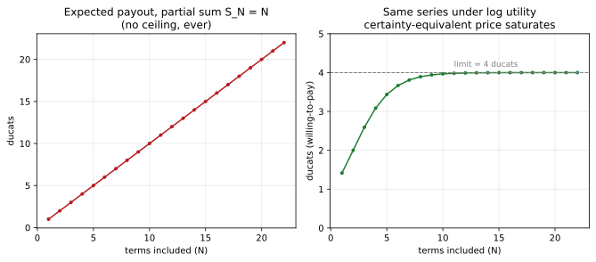

# ch12 — 聖彼得堡悖論：期望值無限，你卻只肯付幾塊錢

> **本章解決什麼問題**：Part IV（漫步與賭局）從 ch10（賭徒輸光）教你「一步一步走，會不會走到破產」，到 ch11（賭徒謬誤與熱手）教你「上一把的結果，會不會洩漏下一把的資訊」，兩章都在檢查漫步本身的性質。本章轉個彎，檢查的不是漫步，而是替一場賭局定價時，你手上最基本的那把尺——期望值（expected value）——是不是永遠可靠。這一章要讓你看到，期望值不是算錯，是真的等於無限大；下一章（ch13，兩個信封）會示範同一把尺被誤用的另一種方式，這次是套在一個根本沒有良定義的隨機變數上。

## 從你已知的出發

想像你回到十八世紀初的歐洲。半個多世紀前，帕斯卡（Pascal）與費馬（Fermat）的通信、惠更斯（Huygens）的專著，已經把「一場賭局的公平價格，等於它的期望值」這件事，確立成整個機率論最早、也最不容懷疑的一條規則（見 ch10 對賭徒輸光問題的鋪陳）。這條規則簡單、直觀，而且在過去六十年裡處理過的每一場賭局——擲骰子、分賭金、抽牌——都給出一個具體、有限的數字，從沒讓誰為難過。

現在，有人給你出了一個新賭局。規則是這樣的：拋一枚公正的硬幣，一直拋到出現正面為止。如果正面在第一次拋擲就出現，你能拿到 2 達克特（ducat，一種歷史上真實流通的金幣，本章沿用它當貨幣單位）；如果正面第一次出現在第二次拋擲，拿 4 達克特；第一次出現在第三次，拿 8 達克特——每多拋一次都還沒出現正面，賠付就翻一倍。問題來了：要玩這場賭局一次，你願意先付多少錢當入場費？

如果你照著剛才那條半個世紀都沒出過錯的老規則走，思路應該很直接：把每一種結果的機率乘上它的賠付，全部加起來，就是這場賭局的期望值，那就是「公平」的入場費。你或許會在心裡粗略估一下：正面很快出現的機率其實不低，賠付也不會小到哪裡去，兩者相乘之後一項一項加起來，湊出來的答案，大概是個十幾、幾十達克特這個量級的數字吧——終究是一個具體、有限、可以拿去跟對方討價還價的數字。

這正是本章要拆穿的自信答案：不是某個特定的數字算錯了，而是你打從心底相信——只要耐心地把這個和一項一項加完，一定會落在某個有限的地方。你不會覺得有必要先問一句：這個和，真的加得完嗎？

## 賭局的規則：彼得與保羅

這個賭局有名有姓，也有明確的歷史起點。**尼可拉斯一世·白努利**（Nicolaus I Bernoulli，1687–1759；白努利家族這一代恰好有三位都叫尼可拉斯，landscape 特別提醒須指明是這一位）在 **1713 年 9 月 9 日**寫給法國數學家**皮耶·雷蒙·德·孟特摩**（Pierre Rémond de Montmort）的一封信裡，一口氣提出了五個跟賭局期望值有關的問題，想凸顯一件事：人們實際上願意付的賭金，跟按規矩算出來的期望值，有時候兜不起來。其中一題經過後人簡化，就是今天大家說的「聖彼得堡賭局」——後續書信往返裡，尼可拉斯自己也發現，這一題（不同於信裡另一題用骰子、賠付按 1、2、3、4 這樣線性增加、算出來期望值收斂的題目）算出來的期望值，是無限大。

真正把這個問題發表出來、並且提出解方的，是尼可拉斯的堂親、**丹尼爾·白努利**（Daniel Bernoulli，1700–1782）。他在 **1738 年**，把研究成果發表在聖彼得堡帝國科學院的院刊《Commentarii Academiae Scientiarum Imperialis Petropolitanae》上（一份拉丁文草稿其實更早，約在 1731 年就已完成）。**這正是「聖彼得堡」這個名字的由來——是刊登解答的期刊社，不是賭局發生的地點**，這一點很容易被誤會，值得特別記一筆。

後人在轉述這個賭局時，習慣把丟硬幣、支付賠款的那一方稱作**彼得**（Peter）、把收錢的那一方稱作**保羅**（Paul）——這組人名究竟是不是白努利原始拉丁文本裡的用詞，還是後人英譯與轉述時附加上去的稱呼，本書沒能直接核對到源頭（未驗證），但作為敘事上的代稱，這裡沿用它：**彼得**負責拋硬幣、按規矩付錢；**保羅**先付一筆入場費，換取這場賭局的賠付。

用數學語言把規則寫清楚：設 n 為「正面第一次出現時，總共拋了幾次」，n 從 1 開始。因為每一次拋擲都獨立，要讓正面恰好在第 n 次才第一次出現，前 n−1 次必須全部是反面、第 n 次才是正面：

```text
P(正面第一次出現在第 n 次) = (1/2)^(n-1) × (1/2) = (1/2)ⁿ
```

賠付規則：正面第一次出現在第 n 次，彼得付保羅 2ⁿ 達克特。這正是本書基準表 B10 採用的版本——賠付從 n=1 時的 2 達克特開始，逐次翻倍。

## 完整推導：把期望值一項一項攤開

現在把「機率×賠付」照期望值的定義，一項一項寫出來：

```text
E[X] = Σ(n=1→∞) P(正面第一次出現在第 n 次) × 賠付
     = Σ(n=1→∞) (1/2)ⁿ × 2ⁿ
```

把每一項的兩個指數合在一起看：(1/2)ⁿ × 2ⁿ = (2/2)ⁿ = 1ⁿ = 1。不管 n 是 1、是 10、還是 10 億，這一項算出來，**永遠恰好是 1**，沒有例外。所以：

```text
Σ(n=1→∞) 2ⁿ·(1/2ⁿ)＝Σ 1＝∞
```

這就是本書基準表的 B10。它不是一個近似值、不是「趨近於某個大數」，而是貨真價實的無限大——因為你要把無窮多個「恰好等於 1」的東西加起來，而無窮多個 1 加起來，沒有極限，就是發散。

這個結果之所以發生，關鍵在於賠付翻倍的速度（每次乘以 2），和機率縮水的速度（每次乘以 1/2），兩者剛好完全打平，打平到小數點後每一位都不差。這是一個刀口上的設計：如果賠付換成每次只翻 1.9 倍，機率縮水的速度會贏過賠付成長的速度，級數會收斂成一個有限數；如果賠付換成每次翻 2.1 倍，賠付成長的速度會贏過機率縮水的速度，級數發散得比現在更快、更誇張。聖彼得堡賭局精確地卡在這條分界線正中央，這也是它成為經典反例的原因——用最簡單的翻倍規則，就能把「公平價＝期望值」這條規則逼到它自己的極限。

## 部分和：發散怎麼一步步發生

光說「發散」有點抽象，不如老老實實把部分和（partial sum）攤開來看，一項一項往下加：

```text
n=1:  這一項 = 1     累加到目前 S₁  = 1
n=2:  這一項 = 1     累加到目前 S₂  = 2
n=3:  這一項 = 1     累加到目前 S₃  = 3
n=4:  這一項 = 1     累加到目前 S₄  = 4
n=5:  這一項 = 1     累加到目前 S₅  = 5
  ⋮                          ⋮
n=10: 這一項 = 1     累加到目前 S₁₀ = 10
  ⋮                          ⋮
n=20: 這一項 = 1     累加到目前 S₂₀ = 20
```

這張表告訴你一件很直白的事：不管你加到第幾項，S_N 恆等於 N——每多算一項，總和就精確多 1，沒有絲毫放緩的跡象。這正是「發散」和「收斂到某個有限值」的關鍵區別：收斂的級數，部分和加著加著會愈長愈平，愈來愈貼近一條水平的天花板；而這個級數的部分和，是一條筆直、永不轉彎的斜線，你要它停在哪裡，它就是不停——這正是右側圖裡左半邊那條直線在告訴你的事。



## 尾端在撐起整個期望值

如果這個賭局真的期望值無限大，為什麼沒人真的願意付超過幾十達克特去玩它？答案藏在機率分布的形狀裡：這個賭局，幾乎每一次實際玩起來，賠付都很普通。

算一下：正面在前 10 次拋擲內出現的機率，是 1 − (1/2)¹⁰ = 1023/1024 ≈ 99.90%。換句話說，玩一次這個賭局，超過 99.9% 的機會你只會拿到不超過 1,024 達克特——完全是個尋常數字。反過來，要讓賠付達到天文數字級（比如說，正面拖到第 51 次以後才出現，賠付至少 2⁵¹ 達克特），機率只有 (1/2)⁵⁰ ≈ 8.88×10⁻¹⁶，比十億分之一還要再小上百萬倍。

問題是，這個機率小到不可思議的尾端事件，賠付卻大到跟機率的縮小完全打平——每往下多拋 1 次，機率減半，賠付卻剛好翻倍抵銷掉這個減半。所以不管你已經把多麼罕見的尾端算進去了，後面永遠還有一項貢獻同樣大小的「1」在等著。期望值之所以是無限大，不是因為「典型情況」賠很多，而是完全靠著這個永遠貢獻同樣份量、卻機率趨近於零的尾端撐起來的。

這也直接說明了：任何一個現實中的賭場，都不可能承受無限多次翻倍——它的準備金一定有限，遲早得在某一次拋擲設下封頂。只要封了頂，這個級數就變成有限項的和，期望值立刻變成一個乾脆、有限的數字（本章「紙上推演」練習 2 會實際算一次）。但這只是繞開了問題，沒有真正回答：就算彼得真的有無限的準備金、規則也真的容許無限拋下去，一個理性的人，到底該不該把「期望值等於無限」直接當成「該付無限多錢」？

## 丹尼爾·白努利的解方：把「錢」換成「效用」

丹尼爾·白努利給出的答案是：不該。他指出，「公平價＝期望值」這條規則，其實偷偷假設了一件事——你手上多一達克特帶來的價值，不管你原本有多少錢，永遠都一樣多。但這顯然不是人真實的決策方式：一個身無分文的人，多拿到 1 達克特，能救急；一個腰纏萬貫的富翁，多拿到同樣 1 達克特，幾乎無感。這種「同樣一塊錢，對愈有錢的人邊際價值愈小」的現象，後來被稱為**邊際效用遞減**（diminishing marginal utility）。

白努利提議，把「錢的數量」換成「錢的效用（utility）」——具體選用**對數函數** u(w) = ln(w) 當作財富 w 帶來的效用尺度（w 為財富、ln 為自然對數）。他把用這把新尺度算出來的期望值，稱為「道德期望」（moral expectation，對照傳統的「數學期望」mathematical expectation；此譯法出自 1954 年 Louise Sommer 將白努利拉丁文原作譯為英文時的用詞，拉丁文原詞是否逐字對應「moral」，本書未直接核對拉丁原文，這裡沿用英譯慣用說法）。

這一步的關鍵在於：對數會把「指數成長」壓成「線性成長」。賠付 2ⁿ 達克特換算成效用是 ln(2ⁿ) = n·ln2——不再是隨 n 指數爆炸，而是隨 n 線性增加。機率仍然以 (1/2)ⁿ 指數縮小，但這次縮小的速度贏過了線性成長的速度，每一項的貢獻不再恆等於 1，而是愈來愈小，整個和可以加到一個有限的天花板——這正是圖裡右側那條很快貼平的曲線。

## 有限願付價：對數效用下重新開一次價

把這套邏輯落實成一次完整的計算。先看一個最乾淨、初始財富設為 0 的極端情形（實際上白努利的原始推導總是假設某個正的初始財富，畢竟 ln(0) 沒有定義；這裡把它當成一個純數學上的簡化基準，不是在宣稱真有一個財富恰好為零的人）：讓「支付 c 達克特換得這場賭局」的效用，恰好等於直接玩這場賭局的期望效用：

```text
ln(c) = Σ(n=1→∞) (1/2)ⁿ · ln(2ⁿ)
      = Σ(n=1→∞) (1/2)ⁿ · n·ln2
      = ln2 · Σ(n=1→∞) n·(1/2)ⁿ
```

這裡需要先算出 Σ n·xⁿ 這個和（0<x<1）。設 T = Σ(n=1→∞) n·xⁿ = x + 2x² + 3x³ + 4x⁴ + ⋯，兩邊同乘 x：xT = x² + 2x³ + 3x⁴ + ⋯。把 T 減去 xT，逐項對齊後幾乎全部消掉，只剩下一個純粹的幾何級數：

```text
T − xT = x + x² + x³ + x⁴ + ⋯ = x/(1−x)     ← 幾何級數求和公式
T(1−x) = x/(1−x)
T       = x/(1−x)²
```

代入 x=1/2：T = (1/2) / (1/2)² = (1/2)/(1/4) = 2。所以：

```text
ln(c) = ln2 × 2 = ln4
c     = 4                                    ← 這就是零財富基準下的確定等值價格
```

一個沒有任何財富緩衝的人，照白努利的效用尺度，這場「期望值無限大」的賭局，只值 **4 達克特**——一個完全普通、可以拿出來討價還價的數字。

對於有初始財富 w > 0 的一般情形，方程式是 ln(w+c) = Σ(n=1→∞) (1/2)ⁿ·ln(w+2ⁿ)，沒有像 w=0 這麼乾淨的封閉解，得靠數值加總。算出來的結果：

| 初始財富 w（達克特） | 願付價 c（達克特） |
|---|---|
| 0 | 4.00 |
| 10 | 5.47 |
| 100 | 7.89 |
| 1,000 | 10.97 |
| 1,000,000 | 20.87 |

這張表最值得停下來品味的地方是：財富從 0 一路暴增到一百萬，願付價只從 4 達克特爬到 20.87 達克特，遠遠追不上財富本身暴增的百萬倍，更別提追上「無限大」。財富愈多，願意付的錢確實愈多（符合直覺——輸掉固定的入場費，對富人衝擊更小），但成長速度被壓縮成對數式的、極其緩慢的爬升。這正是白努利給出的答案：把「錢」換成「效用」之後，這場原本無限大的期望值，變成了一個財富愈高、願付價愈高，但永遠停留在有限範圍內的具體數字。

值得誠實補一句：白努利的對數效用，馴服的是「這一個」聖彼得堡賭局，不代表它能馴服任何賠付成長更快的變體（本章練習 4 會親手驗算一個這樣的變體）。「對數效用是否能一勞永逸解決所有類似賭局」這個更大的問題，在後續文獻裡本身還有爭議——這裡不下定論，效用理論的完整深探，交叉引用《在不確定中下注》（decide 書）。

## 直覺的陷阱

| 階段 | 發生了什麼 |
|---|---|
| 直覺的自信答案 | 套用「公平價＝期望值」這條沿用了六十年、從沒出過問題的老規則，把機率乘賠付一項項加起來，理應能湊出一個具體、雖然可能不小、但終究有限的入場費 |
| 偷渡的假設 | 這條規則暗中假設了兩件事：① 這個級數本身一定收斂成有限數；② 就算收斂，這個「期望值」等同於一個理性的人「該付」的金額——也就是把貨幣的效用，直接當成貨幣本身的數字，兩者線性相等 |
| 為什麼聽起來理所當然 | 帕斯卡、費馬、惠更斯那套「公平價＝期望值」的規則，過去六十年處理的每一場賭局都只有有限步、有限賠付，期望值必然是有限數，這條規則因此運作良好，從沒被拿去檢驗「如果賠付本身可以無限翻倍」這種邊界情況 |
| 在哪一步被帶溝裡 | 不是某一步算術算錯，而是這個級數每一項都精確恰好等於 1、永遠加不完，本來就沒有極限；而在期望值真的等於無限大之後，繼續把它直接當成「該付的價格」，才是第二層、更隱蔽的錯——效用從來不是錢的另一個名字 |
| 怎麼自我察覺 | 看到「期望值」三個字，先問兩句：①這個和真的收斂嗎？還是被一段機率趨近於零、賠付卻同步趨近於無窮大的尾端撐著？②就算收斂，我真正想要的是「金額本身的期望」，還是「這筆錢對我而言的價值的期望」？只要有一句答不出來，「期望值」這三個字就還不能拿來當一口價的合約金額 |

> **那句沒說出口的話是**：「公平價等於期望值」這條規則，偷偷假設了期望值一定收斂、而且金錢的效用永遠等於金錢本身的數字——但只要賠付翻倍的速度追得上機率減半的速度，這個和就永遠加不完，一個貨真價實的無限大，本來就不是一個能拿來討價還價的數字。

## 紙上推演

**練習 1（★，10 分鐘）**：如果把賠付規則換成「正面第一次出現在第 n 次，賠 rⁿ 達克特」（機率仍是 (1/2)ⁿ 不變），對哪些 r 值，這個賭局的期望值仍然發散？對哪些 r 值，它會收斂成一個有限數？（提示：把每一項寫成 (r/2)ⁿ，這是一個等比級數。）

**練習 2（★★，15 分鐘）**：真實賭場不可能準備無限資金。假設賭場規定：只要正面在前 19 次拋擲內出現（第 n≤19 次），照本章正常規則賠 2ⁿ 達克特；但只要拋了 19 次都還是反面，賭場就直接支付 2²⁰ 達克特了結，不再繼續拋下去。請計算這個「封頂版」賭局的期望值。

**練習 3（★★，15 分鐘）**：延續本章白努利的對數效用推導，某人的初始財富是 w=30 達克特。請照本章的方程式 ln(w+c)＝Σ(n=1→∞) (1/2)ⁿ·ln(w+2ⁿ) 列式，估計他的確定等值願付價，大概會落在本章表格裡 w=10（5.47 達克特）與 w=100（7.89 達克特）之間的哪個範圍。

**練習 4（★★★，20 分鐘）**：有人主張「用白努利的對數效用，聖彼得堡悖論就徹底解決了」。試著驗算一個賠付成長更快的變體賭局：正面第一次出現在第 n 次時，賠 2^(2ⁿ) 達克特（機率仍是 (1/2)ⁿ）。用對數效用（w=0 基準）算出這個新賭局的期望效用，是收斂還是發散？這說明了白努利的解方有沒有一個普遍的極限？

### 推演解答

**練習 1 解答**：每一項變成 (1/2)ⁿ × rⁿ = (r/2)ⁿ，這是公比為 r/2 的等比級數 Σ(n=1→∞) (r/2)ⁿ。若 r/2 < 1，也就是 r < 2，級數收斂，收斂值為 (r/2)/(1−r/2)；若 r/2 = 1，也就是 r = 2，每一項恆等於 1，正是本章的情形，發散到無限大；若 r/2 > 1，也就是 r > 2，每一項本身就隨 n 指數發散，級數發散得比本章的例子更快。本章選的 r=2，剛好卡在收斂與發散的分界線正中央——這不是巧合，而是聖彼得堡賭局能成為最簡潔反例的原因：它用最單純的「賠付翻倍」規則，就把公平價規則逼到自己的臨界點上。

**練習 2 解答**：把有限項的部分（n=1 到 19，每項貢獻恰好 1）與封頂那一項分開算：

```text
Σ(n=1→19) (1/2)ⁿ·2ⁿ = 19 × 1 = 19

封頂項：拋了19次都還是反面的機率是 (1/2)¹⁹，此時付 2²⁰ 達克特
        (1/2)¹⁹ × 2²⁰ = 2²⁰⁻¹⁹ = 2¹ = 2

期望值 = 19 + 2 = 21 達克特
```

只要在有限步之內設下封頂，這個原本無限大的期望值，立刻塌縮成一個乾脆、普通的 21 達克特——這正是任何真實賭場（有限準備金）實際上會發生的事：不是白努利的效用理論在起作用，單純是把無窮級數換成了有限項的和。這也提醒你：「期望值等於無限大」這件事，完全依賴「賠付真的可以無限翻倍下去」這個假設是不是真的成立。

**練習 3 解答**：把 w=30 代入方程式，用數值加總（把 w 換成別的值就能重算）：

```text
ln(30+c) = Σ(n=1→∞) (1/2)ⁿ·ln(30+2ⁿ)
```

算出來 c ≈ 6.50 達克特——落在 w=10 的 5.47 與 w=100 的 7.89 之間，而且隨著 w 增加而單調遞增，跟直覺（財富愈多，願意為同一場賭局多付一點）吻合，成長速度依然是壓縮過的對數式，不是線性的。

**練習 4 解答**：把賠付 2^(2ⁿ) 代入對數效用：

```text
每一項 = (1/2)ⁿ · ln(2^(2ⁿ)) = (1/2)ⁿ · 2ⁿ·ln2 = (2ⁿ/2ⁿ)·ln2 = 1ⁿ·ln2 = ln2
```

不管 n 是多少，這一項恆等於 ln2（約 0.693），完全不隨 n 縮小——把無窮多個恆等於 ln2 的正數加起來，一樣發散到無限大。也就是說，只要賠付成長得夠快（這裡是「雙重指數」成長，2 的 2ⁿ 次方），連白努利的對數效用都救不回來，期望效用一樣是無限大。這說明白努利的解方沒有一個放諸四海皆準的上限：它剛好馴服了「賠付每次翻一倍」這個特定版本，換一個成長更快的賠付規則，同樣的招式就失靈。歷史上，卡爾·門格爾（Karl Menger）1934 年提出過類似的「加強版聖彼得堡」論證，主張任何無上限的效用函數都逃不掉這個問題；不過後續研究（Ole Peters, 2011）指出門格爾原始論證裡有數學瑕疵，「有沒有一個效用函數能一次馴服所有版本」這個更大的問題，本身仍有爭議（未驗證其定論），這裡不下定論，只留下這個誠實的提醒。


## 自我檢核

1. 為什麼「正面第一次出現在第 n 次」的機率是 (1/2)ⁿ，而不是 (1/2)ⁿ⁻¹ 或別的形式？試著不看課文，自己重新推一次。
2. 用自己的話解釋一次：為什麼 Σ(n=1→∞) 2ⁿ·(1/2ⁿ) 恰好每一項都等於 1，而不是隨 n 愈變愈大或愈變愈小？
3. 「這個賭局幾乎每次玩起來賠付都很小」和「這個賭局的期望值是無限大」，這兩句話乍看矛盾，實際上為什麼可以同時成立？
4. 白努利的對數效用解方，具體改了原本「公平價＝期望值」規則裡的哪一個假設？只改了「錢的效用不是線性」這一件事，還是也改了「發散的和不能拿來定價」這一件事？
5. 練習 2 的封頂版賭局，和練習 4 的雙重指數賭局，分別是用什麼方式讓「原本會發散的東西」變得可以處理？兩者的做法一樣嗎？
6. 為什麼「聖彼得堡」這個名字容易讓人誤會成賭局發生的地點？正確的來由是什麼？
7. 如果請你設計一個新的變體賭局，讓它的期望值依然發散，但白努利的對數效用算出來卻是收斂的，你會怎麼調整賠付的成長速度？
8. 這個悖論那句沒說出口的假設是什麼？試著不看課文，用自己的話重講一次，並說明它跟「效用不等於金額」這件事的關係。

## 延伸閱讀

- 〈The St. Petersburg Paradox〉，《Stanford Encyclopedia of Philosophy》——本悖論最完整、最嚴謹的哲學與決策理論總覽，涵蓋白努利解方之後的多種後續立場。<https://plato.stanford.edu/entries/paradox-stpetersburg/>
- 〈St. Petersburg paradox〉，Wikipedia——賭局規則、期望值推導與歷史脈絡的總覽條目，可作為本章計算的交叉核對。<https://en.wikipedia.org/wiki/St._Petersburg_paradox>
- Bernoulli, D. (1738/1954). Exposition of a New Theory on the Measurement of Risk（Louise Sommer 英譯）. *Econometrica*, 22(1), 23–36.——白努利對數效用解方的原始論文英譯全文，本章「道德期望」一詞即出自此譯本；此連結為課程網站提供的公開下載版本，非期刊官方頁面。<https://psych.fullerton.edu/mbirnbaum/psych466/articles/bernoulli_econometrica.pdf>
- Salov, V. (2014). "The Gibbon of Math History". Who Invented the St. Petersburg Paradox? Khinchin's resolution. *arXiv preprint*.——重新核對「首倡者確實是尼可拉斯一世·白努利」這個歸屬問題（呼應本章對白努利家族三位尼可拉斯的提醒），並介紹一個較少被提及的早期解方。<https://arxiv.org/abs/1403.3001>
- Peters, O. (2011). Menger 1934 revisited. *arXiv preprint*.——重新檢視卡爾·門格爾 1934 年「加強版聖彼得堡」論證裡的數學瑕疵，是本章練習 4 那個誠實提醒的出處。<https://arxiv.org/abs/1110.1578>
