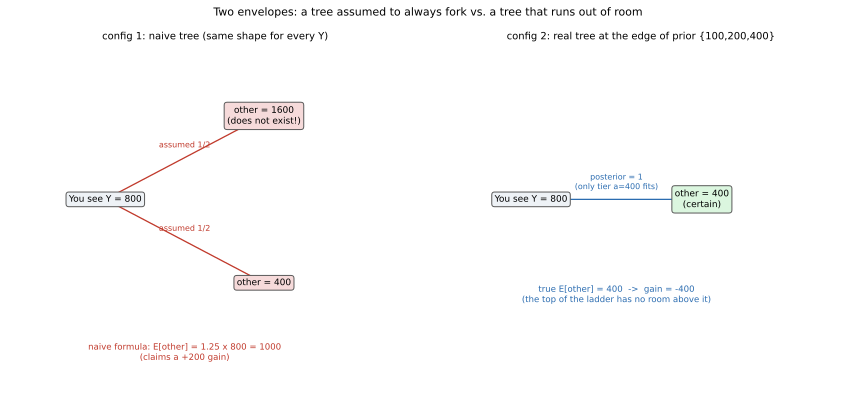

# ch13 — 兩個信封悖論：換還是不換

> **本章解決什麼問題**：Part IV 這幾章都在講「期望值（expected value）怎麼被誤用」。ch12 讓你看到一個貨真價實、算得完全正確、卻沒人敢照著付錢的期望值——聖彼得堡賭局的期望報酬是無窮大（見 ch12，基準數字 B10：Σ(n=1→∞) 2ⁿ·(1/2ⁿ)＝∞）。這一章換一種完全不同的誤用方式：那個聽起來理所當然的「換信封平均多賺 25%」算式，根本不是一個合法的期望值計算——破綻不在算術，而在同一個符號被拿去代表兩件不同的事。你會看到，只要先驗（prior，對「金額可能是多少」這件事事先的機率分布）是有限、可以正規化的，這道題早就有乾淨、無爭議的答案；只有把先驗硬推到無窮大，才會踏進一塊至今沒有共識的地帶——這也是全書在「期望值」這條線上，收尾前最後一次交手。

## 從你已知的出發

先講一個比信封更古老的版本。一九四二或四三年（兩個年份在不同資料裡都有記載，以下沿用這個不確定的寫法），比利時數學家莫里斯·克萊奇克（Maurice Kraitchik）在他的《數學娛樂》（Mathematical Recreations）裡，寫下一個關於領帶的小故事：兩個人碰面，都戴著看起來頗講究的領帶，兩人講好一個遊戲——誰的領帶比較便宜，就可以把對方那條比較貴的領帶拿走，當作安慰獎。兩人都不知道對方領帶的確切價格，只知道自己這條值多少錢。

甲心裡是這樣算的：「我不知道我的領帶比較貴還是比較便宜，機率各半。如果我的比較貴，我會輸掉我這條領帶，損失就是我領帶的價值；如果我的比較便宜，我會贏得對方那條更貴的領帶，賺到的錢一定超過我領帶的價值。既然『贏的時候賺得比輸的時候賠得多』，這場賭局對我是有利的，我應該答應。」乙心裡的推理一模一樣，得到同樣的結論：這場賭局對他也有利。兩個人都覺得自己佔便宜，但這是一場零和遊戲——一條領帶換一條領帶，最後只可能有一個人淨賺，不可能兩個人同時淨賺。這裡面顯然有什麼地方算錯了。

四十年後，一九八二年，馬丁·加德納（Martin Gardner）在《Aha! Gotcha》一書裡把同一個結構換了個更貼近日常的皮包版本推廣開來：兩個財力相當的人，比較皮包裡的現金，錢少的那個人可以把對方皮包裡的錢全部拿走。推理過程原封不動——甲乙雙方都覺得這場交換對自己有利，矛盾也原封不動。

把這個結構搬到今天最常見的講法，就是「兩個信封悖論」（two-envelope paradox）：你面前有兩個一模一樣、封了口的信封，主持人告訴你一件千真萬確的事——其中一個信封裡的錢，剛好是另一個信封的兩倍。你隨機挑了一個，拆開來看，看到裡面有 Y 元。這時主持人問你：要不要換成另一個沒拆開的信封？

大多數人腦中冒出的推理是這樣的：我不知道自己拿到的是金額較小的那份還是較大的那份，機率各半。如果我拿到的是較小的那份，另一個信封裡是 2Y 元；如果我拿到的是較大的那份，另一個信封裡是 Y/2 元。這兩種情況機率相等，所以換信封之後、我預期能拿到的金額是：

```text
E[另一個信封] = ½·(2Y) + ½·(Y/2) = Y + Y/4 = 1.25Y     ← 兩種情況各半，加權平均
```

1.25Y 大於 Y，所以換信封看起來穩賺不賠，而且這個結論完全沒有用到 Y 的具體數值——不管你打開信封後看到的是 10 元還是 10 萬元，同一套算式都建議你換。這聽起來像是一份萬用的免費午餐：只要別打開信封仔細看，反正換了就對。但荒謬的地方馬上就會冒出來——如果這套推理真的成立，你換了信封之後，同樣的邏輯會立刻要你再換回去（畢竟你手上這個「新」信封，此刻也符合「不知道是大是小、機率各半」的條件），換回去之後又會建議你再換一次，沒完沒了。兩個信封裡裝的錢明明是固定的兩個數字，答案不可能隨著你換或不換而變來變去。跟領帶悖論一模一樣，這裡面一定藏著一個算錯的地方——只是這一次，錯誤被包裝得更精緻，連 Y 的具體數值都不需要代入，就能得出一個看似萬能卻自相矛盾的結論。

## 一段跨越世紀的爭論：領帶、紙牌、信封

在往下拆解錯誤之前，值得把這道題目的身世講清楚，因為它比蒙提霍爾（見 ch02）或聖彼得堡（見 ch12）都更沒有一個乾脆的「發明者」——它是同一個數學骨架，被不同時代的人反覆用不同的道具重新講了一遍。

一九五三年，約翰·李特爾伍德（John Edensor Littlewood）在他的隨筆集《A Mathematician's Miscellany》裡，記下了另一個版本：一疊紙牌，每張牌上寫著兩個數字，你隨機抽一張牌、隨機看到其中一面的數字，然後決定要不要翻到背面。李特爾伍德自己說，這個謎題是薛丁格（Erwin Schrödinger）告訴他的——但這個歸屬只有李特爾伍德單方面的說法，沒有薛丁格本人留下的紀錄可以對照，寫作時只能當成一則「據轉述」的軼事，不當定論。有意思的是，李特爾伍德的紙牌版本設定成一疊無窮多張的紙牌，這個設定本身就已經預告了本章後半要處理的深水區——一旦道具的數量或金額範圍被推到無窮大，麻煩就從「這道題有沒有錯」變成「這道題有沒有良定義」。

真正把這道題目從一則趣味故事，推進到正式的決策理論（decision theory）文獻，是一九八八至八九年間，經濟學家巴瑞·納爾巴夫（Barry Nalebuff）接連提出的兩個版本，其中一九八九年發表在《經濟展望期刊》（Journal of Economic Perspectives）上的論文〈Puzzles: The Other Person's Envelope is Always Greener〉，有系統地整理了各種變體與已知解法，是這道謎題進入學術討論的關鍵一步。六年後，一九九五年，哲學家約翰·布魯姆（John Broome）在期刊《Analysis》上發表〈The Two-Envelope Paradox〉，提出了一個很鋒利的概念——他把某些期望值本身就發散的機率分布稱為「悖論性」（paradoxical）分布：在這類分布下，「不管你看到什麼金額，都該換」這句話竟然對每一個可能觀察到的金額都成立，卻拼湊不出一個有意義的整體答案。這正是本章最後要老實面對、至今仍在被討論的那個角落。另外，一九九二年，大衛·克里斯坦森（David Christensen）與潔西卡·尤茲（Jessica Utts）在《The American Statistician》發表的〈Bayesian Resolution of the "Exchange Paradox"〉，則是最早把「只要先驗合法，換信封的增益就是零」這件事用貝氏語言講清楚的重要文獻之一。

把這條時間線收在一起看：領帶、皮包、紙牌、信封，換的道具不同，年代跨了半個世紀以上，但骨架完全一樣——都是「同一個符號在兩種情況下代表不同的東西」這個錯誤，只是包裝得一次比一次更難拆穿。

## 把論證攤開來看：Y 到底代表誰

回頭盯著那個算式看：

```text
E[另一個信封] = ½·(2Y) + ½·(Y/2)
```

這裡表面上是在對一個隨機變數 O（另一個信封的金額）取期望值，套用的公式是「期望值 = Σ（結果 × 機率）」。要讓這個公式合法，前提是：對於「你已經看到 Y」這件事，另一個信封是 2Y 的機率、以及是 Y/2 的機率，各自確實是 ½。這不是一句可以隨便假設的話——它是一句需要被證明、卻被論證直接跳過的宣稱。

把設定翻譯成精確的數學語言：令 A 為「一對信封裡較小的那個金額」，這是一個隨機變數，背後有某個先驗機率分布——也就是「較小金額是某個數的可能性有多大」這件事，在你打開任何信封之前，就已經是某個確定（即使你不知道）的分布。兩個信封裡裝的錢就是 A 和 2A。你被隨機分配到其中一個信封，機率各半，跟 A 的實際數值無關；假設你拿到的信封裡有 Y 元。

現在問題來了：已知 Y，另一個信封是 2Y（也就是你拿到的剛好是較小的那份，A=Y）的機率，真的等於另一個信封是 Y/2（你拿到的是較大的那份，A=Y/2）的機率嗎？這兩種情況分別對應「A 恰好等於 Y」和「A 恰好等於 Y/2」這兩個不同的事件，它們的機率大小，完全取決於 A 的先驗分布在 Y 這個點、跟在 Y/2 這個點，各自壓了多少機率重量——而不是自動各半。「開信封之前，你被分到大信封或小信封的機率各半」是真的，這是隨機分配這個動作本身保證的對稱性；但「看到具體金額 Y 之後，這個 Y 恰好是較小值還是較大值的機率仍然各半」，是另外一件完全不同的事，需要先驗本身具備一個非常特別的性質才會成立——而不是憑空繼承前一句話的對稱性。論證在這一步，把兩個不同條件下的「另一個信封的金額」，都用同一個符號硬套在同一條期望值算式裡，卻沒有交代這一步為什麼站得住腳。這正是本章要拆穿的第一層破綻：Y 沒有問題，Y 就是你看到的那個確定數字；出問題的是「另一個信封是 2Y 或 Y/2、機率各半」這句宣稱，它偷渡了一個關於先驗的假設，卻從頭到尾沒有提到先驗兩個字。

## 這句「機率各半」需要一個不存在的先驗

那麼，要讓「不論 Y 是多少，另一個信封是 2Y 或 Y/2 的機率永遠各半」這句話對每一個可能的 Y 都成立，先驗必須長什麼樣子？答案是：先驗必須對每一個正實數都分配完全相同的機率密度（probability density）——講白話就是「一塊錢是較小金額的可能性，跟一億塊錢是較小金額的可能性，一模一樣，不多不少」。這聽起來像是最公平、最不偏不倚的先驗，也正因為聽起來很合理，才特別容易被悄悄預設。但這樣的先驗，在數學上根本不存在。

假設這樣的密度函數是一個常數 c（對所有 x > 0，f(x) = c），一個合法的機率密度函數，在整個定義域上積分起來必須等於 1：

```text
∫₀^∞ f(x) dx = ∫₀^∞ c dx                    ← 常數函數在無窮區間上的積分
若 c > 0：積分 = ∞                           ← 常數乘上無窮長的區間，發散
若 c = 0：積分 = 0                           ← 密度處處為零，等於什麼都沒分配到
兩種情況都 ≠ 1                               ← 無論 c 取什麼值，都湊不出合法的機率分布
```

不存在任何常數 c，能讓「每一塊錢都拿到相同的先驗機率密度」變成一個合法的機率分布。這種湊不出總和為 1 的「分布」，在統計學裡稱為不當先驗（improper prior）——它不是一個真正的機率分布，只是形式上寫得像一個。換信封論證裡「不論 Y 是多少，機率永遠各半」這句話，等價於偷偷假設了這樣一個不存在的先驗；一旦先驗必須是合法、可以正規化（normalizable，總機率或總機率密度積分起來等於 1）的東西，「對每一個 Y 都各半」這句話就不可能對所有 Y 同時成立。

## 具體算一次：有界先驗下，換不換值不值得

抽象的破綻拆完了，該用一個具體、乾淨的先驗把真正的答案算出來——這是本章的核心 worked example。

設定：一對信封裡較小的金額 A，先驗是均勻分布在三個檔位上——A 有相同的機率（各 1/3）是 100 元、200 元、或 400 元。三種可能的信封組合是（100、200）、（200、400）、（400、800）。你被隨機分配到這一對信封裡的哪一個，機率各半，跟 A 的檔位無關。合起來看，一共有六種等機率的基本結果，每種機率都是 (1/3)×(1/2)＝1/6：

```text
檔位 A=100：你拿到 100（較小），另一個是 200      ← 換：+100
檔位 A=100：你拿到 200（較大），另一個是 100      ← 換：−100
檔位 A=200：你拿到 200（較小），另一個是 400      ← 換：+200
檔位 A=200：你拿到 400（較大），另一個是 200      ← 換：−200
檔位 A=400：你拿到 400（較小），另一個是 800      ← 換：+400
檔位 A=400：你拿到 800（較大），另一個是 400      ← 換：−400
```

六種結果各佔 1/6，把「換信封的增益」全部加起來取平均：(100−100+200−200+400−400)/6 = 0/6 = 0。不管你事先決定「不管看到什麼都換」還是「不管看到什麼都不換」，長期下來期望增益都是 0——這就是本章要給出的乾淨答案，而且完全不依賴你打開信封前看到什麼。

真正有意思的地方，是把六種結果按照「你實際看到的 Y」重新分組，看看條件期望值（conditional expectation）跟樸素公式 1.25Y 之間的關係：

```text
Y=100（下邊界）：只可能來自「檔位 A=100，你拿到較小」這一種情況
                另一個信封確定是 200，換的增益確定是 +100
                樸素公式算出的增益只有 0.25×100=25 ← 嚴重低估
Y=200（內部點）：來自「檔位 A=100，你拿到較大」和「檔位 A=200，你拿到較小」兩種情況，機率各半
                E[另一個∣Y=200] = ½×100+½×400 = 250，增益 +50
                樸素公式算出的增益是 0.25×200=50 ← 剛好吻合
Y=400（內部點）：來自「檔位 A=200，你拿到較大」和「檔位 A=400，你拿到較小」兩種情況，機率各半
                E[另一個∣Y=400] = ½×200+½×800 = 500，增益 +100
                樸素公式算出的增益是 0.25×400=100 ← 剛好吻合
Y=800（上邊界）：只可能來自「檔位 A=400，你拿到較大」這一種情況
                另一個信封確定是 400，換的增益確定是 −400（虧錢！）
                樸素公式卻算出增益 0.25×800=200 ← 不只低估，連正負號都算反了
```

這張表比抽象論證更有說服力：在這個先驗的兩個內部點（Y=200、Y=400）上，樸素公式 1.25Y 剛好算對，不是巧合，而是因為在這個「均勻分布在有限檔位」的先驗裡，任何一個內部點左右相鄰的兩個檔位，先驗機率權重完全相同（都是 1/3），條件化之後自然變成真正的五五波，樸素公式假設的「機率各半」在這裡剛好是真的。但一旦走到先驗的邊界——最小值 100 或最大值 800——就不再有「相鄰的另一邊」可以五五對分：Y=100 時，唯一的可能只有「你拿到的就是最小檔位的較小值」，對半的另一種情況（「較大值來自更低一檔」）根本不存在；Y=800 同理，只是方向相反。樸素公式在邊界上完全沒有意識到「邊界」這件事，還是硬套用「兩邊各半」的公式，結果在 Y=800 這個最極端的例子上，不只把增益的大小算錯了五倍，連正負號都反了——它告訴你換信封穩賺 200，事實上換信封確定會虧 400。

而且，任何一個合法、可以正規化的先驗——不管定義域多大——只要不是覆蓋整條實數線（那正是上一節證明過不可能存在的東西），就一定會有邊界，或者機率密度必須隨數值增大而遞減到趨近於零。這代表：樸素公式「不管看到什麼都該換」這句話，只要先驗合法，就一定會在某個地方失靈——差別只在於失靈的方式是「大小算錯」還是像 Y=800 這麼戲劇性的「正負號算反」。

下面這張圖，把「樸素論證假設的萬用計算樹」跟「這個有界先驗在最上緣真正長出來的計算樹」並排畫在一起：



這張圖要你看的重點是樹的形狀本身：樸素論證預設每一個觀察值都會分岔成對稱的兩條枝，可是真正的計算樹形狀由先驗決定——先驗有邊界的地方，樹就會少一條枝，剩下唯一、確定的答案。認出「這裡是不是先驗的邊界」，比重複套用同一個分岔公式重要得多。

現在可以把本章開頭那個荒謬的無限循環接回來：那套「換了之後應該再換回去，換回去之後又該再換一次」的邏輯，前提是不管你手上是哪個數字，永遠還有一半機會另一邊更大。可是一旦先驗有邊界——幾乎所有真實情境都有——站上邊界的那一刻（比方說看到 800），這句「永遠還有一半機會更大」立刻不成立，無限循環當場卡住。領帶悖論裡甲乙兩人同時覺得佔便宜的矛盾，破的也是同一個洞：兩人各自默默假設了一種「不管自己那條領帶值多少錢，對方的都有一半機會更貴」的先驗，而這種先驗同樣不存在。

## 一般結論：有限先驗下，換信封的期望增益就是 0

上面的三檔位例子把答案算得很具體，但這件事其實有一個不依賴任何特定先驗細節、放諸四海皆準的證明，值得單獨拆出來看一次。

設 A 是「較小金額」，先驗是任何一個合法的機率分布（不管是三檔位、一百檔位，還是連續分布，只要平均值 E[A] 是一個有限的數）。設 R 是一枚公正銅板，跟 A 互相獨立，決定你被分到大信封還是小信封：R=0 時你拿到 A（另一個信封是 2A），R=1 時你拿到 2A（另一個信封是 A）。「你的信封」與「另一個信封」這兩個隨機變數，可以分別寫成：

```text
你的信封 = A          （若 R=0，機率 ½）  或  2A（若 R=1，機率 ½）
另一個信封 = 2A       （若 R=0，機率 ½）  或  A（若 R=1，機率 ½）
```

因為 R 是一枚跟 A 無關的公正銅板，把 R 的兩個值互換（R=0 換成 R=1、R=1 換成 R=0），並不會改變 (A, R) 這整組隨機變數的機率分布——公正銅板正著丟或反著看，機率結構完全對稱。而「你的信封」在 R 換過來換過去之後，恰好變成了「另一個信封」的算式（把上面那組式子裡的 R=0、R=1 對調，兩行式子會整個互換）。這代表：**「你的信封」和「另一個信封」這兩個隨機變數，其實是同一個機率分布**——不只是平均值相等，是整條機率分布完全一樣。分布相同，平均值當然也相同，所以：

```text
E[另一個信封] − E[你的信封] = 0     ← 只要 E[A] 有限，這個減法本身就有意義
```

這就是「有限、可正規化先驗下，正確條件化後換信封的期望增益是 0」這件事的完整證明——而且注意，這個證明完全沒有用到 A 的先驗具體長什麼樣子，只用到「先驗是合法的機率分布，而且平均值有限」這兩個條件。這是一件已經解決、沒有爭議的事實：不管你選哪一個合法先驗，這道題的答案都是 0，樸素公式算出的 1.25Y 從來就不是一個誠實的期望值。

## 那道還沒關上的門：先驗本身的期望值也發散時

上一節那個證明，特別強調了「E[A] 有限」這個條件——不是隨口加上去的保險句，拿掉它，麻煩真的會發生。設想一個先驗：金額檔位是 1、2、4、8、16……（也就是 2 的 k 次方，k=0,1,2,…），檔位 k 出現的機率是 (1/3)·(2/3)^k。可以驗證這是一個完全合法的機率分布（不是不當先驗）——把所有檔位的機率加起來：

```text
Σ(k=0→∞) (1/3)·(2/3)^k = (1/3) · 1/(1−2/3) = (1/3)·3 = 1     ← 幾何級數求和，總機率確實是 1
```

問題出在這個先驗的平均值：

```text
E[A] = Σ(k=0→∞) 2^k · (1/3)·(2/3)^k = (1/3)·Σ (4/3)^k     ← 每一項的比值 4/3 大於 1
```

(4/3)^k 這個級數的公比大於 1，加總會直接發散到無窮大——這個先驗，機率總和乾乾淨淨等於 1，是一個完全合法的機率分布，但它的平均值卻是無窮大。用這個先驗重算一次「已知 Y，另一個信封的條件期望值」，會得到一個更詭異的結果：對於任何內部觀察值 Y=2^m（m≥1），可以算出另一個信封是 2Y 的後驗機率是 0.4、是 Y/2 的後驗機率是 0.6（跟前面「均勻分布在有限檔位」的例子不同，這裡因為先驗本身不是均勻的，兩邊的權重不再是五五波），代入求期望：

```text
E[另一個信封∣Y] = 0.4×(2Y) + 0.6×(Y/2) = 0.8Y + 0.3Y = 1.1Y     ← 增益永遠是 0.1Y，永遠大於 0
```

對於最下緣的觀察值 Y=1，唯一的可能是「你拿到的就是最小檔位」，換信封確定拿到 2 元，增益確定是 +1，一樣是正的。也就是說，在這個先驗底下，不管你看到什麼金額，換信封的條件期望增益永遠是正的——這句話本身沒有任何一步算錯，跟前面三檔位例子裡「邊界會讓答案翻轉」的情況完全不同，這裡連邊界都站在換信封那一邊。但整體、不區分觀察值的「總換信封增益」該怎麼算？因為 E[A] 本身就是無窮大，「你的信封」與「另一個信封」的平均值也都是無窮大，想寫成 E[另一個信封]−E[你的信封]，得到的是「無窮大減無窮大」——這在數學上沒有定義，不是 0，也不是任何一個具體的數字。

這正是布魯姆一九九五年那篇論文裡「悖論性分布」想指出的深水區：只要先驗的平均值本身發散，「不論看到什麼都該換」這句話可以對每一個觀察值都貨真價實地成立，而不是像本章前面那個有限先驗例子一樣，只是被樸素公式錯誤地聲稱成立。但這種情況下，並沒有一個乾淨、無爭議的「整體上該不該換」的答案——你能不能把「對每一個 Y 都有限的條件期望增益」加總、平均出一個有意義的「整體」期望增益，本身在無窮期望值的世界裡就是一個定義不清楚的問題。根據史丹佛哲學百科全書（Stanford Encyclopedia of Philosophy, SEP）的整理，這一塊——先驗本身允許無窮期望值時，兩個信封悖論該怎麼收場——至今仍是決策理論與哲學文獻裡持續討論、沒有公認解答的角落，跟本章前面「有限先驗版本」那個已經解決、沒有爭議的結論，是兩件必須分開看待的事：**教科書上常見的、金額有界或有限期望值的版本，答案是乾淨的 0；只有把先驗刻意推向無窮期望值，才會踏進這塊還沒關上的門**。這一點，也正好跟聖彼得堡悖論的收尾遙相呼應——見 ch12，B10：Σ(n=1→∞) 2ⁿ·(1/2ⁿ)＝∞——兩章的錯誤機制完全不同（ch12 是「正確算出的無窮期望值不該直接當成該付的價」；本章有限版本是「那個算式壓根就不是一個合法的期望值」），但只要把先驗或報酬硬推向無窮，兩章最後都會撞上同一堵牆：無窮期望值，讓「期望值＝該怎麼決策」這條直覺鏈結整個失靈。

## 直覺的陷阱

把整章的推理過程收進一張表，看看那個自信的錯答案，到底是在哪一步被帶進溝裡的：

| 階段 | 發生了什麼 |
|---|---|
| 直覺的自信答案 | 另一個信封是 2Y 或 Y/2，機率各半，所以換信封的期望值是 1.25Y，永遠該換——而且這個結論完全不用管 Y 的具體數值 |
| 偷渡的假設 | 把「開信封之前，你被分到大信封或小信封的機率各半」，直接當成「看到具體金額 Y 之後，Y 是較小值還是較大值的機率仍然各半」——這需要一個對每一塊錢都給相同權重的先驗，而這樣的先驗（不當先驗）根本無法正規化，不存在 |
| 為什麼聽起來理所當然 | 「拿到哪個信封機率各半」本來就是真的，是隨機分配這個動作本身保證的對稱性；直覺沒有意識到「看到一個具體的數字」本身就是一條資訊，會依照真正的先驗，重新調整「這個數字究竟是較小還是較大」的相對可能性——除非先驗根本不區分任何數字的大小，而這正是那個不存在的均勻先驗 |
| 在哪一步被帶溝裡 | 從「Y 是一個具體、確定的數字」跳到「不管 Y 是多少，另一個信封的兩種可能永遠各半」，中間漏掉了「先驗在 Y 這個點跟在 Y/2 這個點分別壓了多少機率重量」這件事——這件事只有先驗本身能回答，不能靠對稱性直接假設 |
| 怎麼自我察覺 | 每次看到一個論證宣稱「不管具體數值是多少，結論都一樣」，尤其是這個結論套用在自己身上又會反過來否定自己（換了還想再換），先停下來問：這句「機率各半」，是在哪個時間點成立的？是看到數字之前，還是之後？如果是之後，支撐它的那個先驗，寫得出來、加得起來嗎 |

> **那句沒說出口的話是**：「開信封前，你被分到大信封或小信封的機率各半」被直接套用成「看到具體金額之後，這個金額是較小值還是較大值的機率仍然各半」——這一步只有在假設一個對每一塊錢都給相同權重、卻根本無法正規化成機率分布的先驗時才成立，而這樣的先驗並不存在。

## 紙上推演

**練習 1（★★，15 分鐘）**：把本章的有界先驗例子換成四個檔位——較小金額 A 均勻分布在 {50、100、200、400}，每個檔位機率 1/4。列出全部八種等機率的基本結果，算出整體換信封的平均增益，並針對可能觀察到的五個金額（50、100、200、400、800）分別算出條件期望增益，跟樸素公式 0.25Y 逐一比較。

**練習 2（★，10 分鐘）**：不查書，自己重新推一次「不存在對所有正實數給相同權重的機率密度」這件事——寫出積分式，說明常數 c 不管取正值還是取 0，都湊不出總和為 1 的結果。

**練習 3（★★，15 分鐘）**：回到本章開頭的皮包／領帶版本，把「錢包裡的金額」套進本章的三檔位先驗 {100、200、400}（元）。用本章算過的表，具體回答：如果甲打開皮包看到 800 元，他心裡那句「我機率各半，可能賺可能賠，但賺得比賠得多」的推理，錯在哪裡？他應不應該提議交換？

**練習 4（★★★，20 分鐘）**：延續本章「先驗本身期望值發散」那一節的等比先驗（檔位 2^k、機率 (1/3)·(2/3)^k），驗證 k=3（也就是觀察值 Y=8）這一項：算出「另一個信封是 16」與「另一個信封是 4」這兩種情況各自的機率權重，確認比值是 3:2，算出條件期望值與增益，並確認增益等於 0.1×8=0.8。

### 推演解答

**練習 1 解答**：八種基本結果（每種機率 1/8）：

```text
A=50 ： 你見50 ，另一個=100 ← 換+50   ／  你見100，另一個=50  ← 換−50
A=100： 你見100，另一個=200 ← 換+100  ／  你見200，另一個=100 ← 換−100
A=200： 你見200，另一個=400 ← 換+200  ／  你見400，另一個=200 ← 換−200
A=400： 你見400，另一個=800 ← 換+400  ／  你見800，另一個=400 ← 換−400
```

整體平均增益：(50−50+100−100+200−200+400−400)/8＝0。按觀察值分組：Y=50（下邊界，只有一種來源）確定換得 +50，樸素公式只算出 0.25×50=12.5，嚴重低估；Y=100（內部點）條件期望增益是 (−50+200)/2＝75？——先仔細算：Y=100 的兩種來源是「A=50 時你見到較大值 100」（另一個是 50）與「A=100 時你見到較小值 100」（另一個是 200），兩者機率相等，條件期望＝(50+200)/2＝125，增益＝125−100＝25，跟樸素公式 0.25×100=25 吻合；同理 Y=200 條件期望＝(100+400)/2＝250，增益 50，與樸素公式 0.25×200=50 吻合；Y=400 條件期望＝(200+800)/2＝500，增益 100，與樸素公式 0.25×400=100 吻合；Y=800（上邊界，只有一種來源，來自 A=400 時你見到較大值）確定換得 −400，樸素公式卻算出 +200，同樣是本章強調的「邊界上正負號整個算反」。跟三檔位例子的結構一模一樣：內部點樸素公式剛好對，兩端邊界一個被低估、一個被反號。

**練習 2 解答**：若密度函數 f(x)=c（常數）對所有 x>0 成立，一個合法密度必須滿足 ∫₀^∞ f(x)dx＝1。若 c>0，∫₀^∞ c dx 是常數乘上一個長度無窮大的區間，發散到無窮大，不等於 1；若 c=0，積分本身就是 0，也不等於 1。兩種情況都湊不出 1，所以不存在任何常數 c 能讓「每一塊錢的先驗密度都相同」成為一個合法的機率分布——這正是「不管看到什麼金額，另一個信封是兩倍或一半的機率永遠各半」這句話背後，需要卻不存在的那個先驗。

**練習 3 解答**：如果甲打開皮包看到 800 元，在三檔位先驗 {100、200、400} 底下，800 元只可能是最高檔位（A=400）的較大值——因為先驗根本沒有更高的檔位，不存在「這 800 元其實是某個更高檔位的較小值，對方可能有 1600 元」這種可能性。所以另一個皮包確定裝了 400 元，交換確定會讓甲損失 400 元。甲心裡那句「我機率各半，賺得比賠得多」的推理，錯在他把「開局前，我被分到多的皮包或少的皮包機率各半」直接套用到「看到 800 元這個具體數字之後，我仍然有一半機會賺更多」——但 800 元剛好是這個先驗底下能出現的最大值，一旦你站在先驗的最高點，往上加碼的可能性直接是零，不是一半。甲不應該提議交換。

**練習 4 解答**：先驗 P(檔位 k=3)＝(1/3)·(2/3)^3。觀察值 Y=2^3=8 有兩種來源：來源一是「檔位 k=3，你見到較小值 8」，另一個信封是 16，機率權重＝(1/3)·(2/3)^3·(1/2)；來源二是「檔位 k=2，你見到較大值 8」，另一個信封是 4，機率權重＝(1/3)·(2/3)^2·(1/2)。兩個權重的比值是 (2/3)^3 比 (2/3)^2＝(2/3)比1，也就是「另一個是16」比「另一個是4」＝2:3，寫成百分比是後驗機率 40% 對 60%（跟前面 m=1、m=2 算出的比例一致，因為這個先驗每往上一檔，權重比例都固定是同一個 3:2）。條件期望值＝0.4×16+0.6×4＝6.4+2.4＝8.8，增益＝8.8−8＝0.8＝0.1×8，跟本章正文給的公式吻合。

## 自我檢核

1. 這個悖論的自信錯答案，錯誤到底出在算術本身，還是出在把設定翻譯成數學式的那一步？
2. 「開信封前，拿到大信封或小信封機率各半」跟「看到具體金額 Y 之後，Y 是較小值還是較大值機率仍然各半」，這兩句話為什麼不能自動互相蘊含？
3. 什麼是不當先驗（improper prior）？為什麼「對所有正實數都給相同機率密度」湊不出一個合法的機率分布？
4. 在本章三檔位的 worked example 裡，為什麼樸素公式在兩個內部觀察值（Y=200、Y=400）上剛好算對，卻在最上緣的觀察值（Y=800）上連正負號都算反？
5. 為什麼「有限先驗、換信封增益永遠是 0」這個結論，可以完全不依賴先驗的具體形狀就證明出來？這個證明用到了哪一個關鍵的對稱性？
6. 本章有限先驗版本的錯誤，跟 ch12 聖彼得堡悖論的錯誤，都跟期望值有關，但錯的方式一樣嗎？用一句話對比兩者。
7. 為什麼先驗本身的期望值發散時（如本章的等比先驗），「不管看到什麼都該換」這句話可以對每一個觀察值都真正成立，卻仍然拼不出一個有意義的整體答案？這跟「不當先驗」的破綻是不是同一件事？
8. 這個悖論那句沒說出口的假設是什麼？試著不看課文，用自己的話重講一次。

## 延伸閱讀

- 〈Two envelopes problem〉，Wikipedia——整理歷史脈絡（克萊奇克、李特爾伍德、納爾巴夫、布魯姆）與各種解法流派的總覽條目，方便跟本章的推導交叉核對。<https://en.wikipedia.org/wiki/Two_envelopes_problem>
- 〈Infinity〉條目，"Tacitly Infinite Decision Problems: Two Envelopes" 一節，Stanford Encyclopedia of Philosophy（SEP）——本章「有限先驗已解、無界先驗未解」這個誠實標示的主要依據。<https://plato.stanford.edu/entries/infinity/decision-problems.html>
- Nalebuff, B. (1989). "Puzzles: The Other Person's Envelope is Always Greener." *Journal of Economic Perspectives*, 3(1), 171–181.——把這道謎題正式帶進決策理論文獻、系統整理多種變體與解法的重要論文。
- Broome, J. (1995). "The Two-Envelope Paradox." *Analysis*, 55(1), 6–11.——提出「悖論性分布」的概念，是本章「先驗期望值發散時仍未有公認解」這段內容的主要來源。
- Christensen, D., & Utts, J. (1992). "Bayesian Resolution of the 'Exchange Paradox'." *The American Statistician*.——用貝氏語言把「有界先驗下換信封增益為零」講清楚的重要文獻（未驗證：本章三檔位、四檔位與等比先驗的具體數值範例為本書自行建構的說明性示範，並非逐字重現此文或其他原始論文的參數選擇）。
- Littlewood, J. E. *A Mathematician's Miscellany*（1953年初版；後由 Béla Bollobás 增訂再版）——紙牌版兩信封問題最早的印刷紀錄之一，作者自陳歸功薛丁格（未驗證：僅 Littlewood 單方轉述，無薛丁格本人留下的紀錄可對照）。
