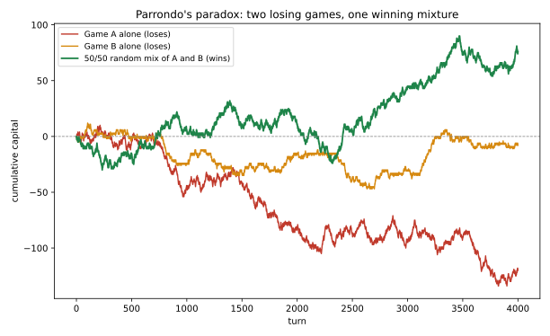

# ch14 — 帕隆多悖論：兩個輸的賭局，輪流玩卻贏

> **本章解決什麼問題**：Part IV 這幾章反覆在拆解同一件事——「隨機」聽起來像是沒有方向，但只要幫它加上一道邊界（ch10）、一段有限的樣本（ch11）、或一個發散的期望值（ch12、ch13），它就可能悄悄長出方向。本章要示範這個家族裡最反直覺的一種：兩個各自長期都會輸的賭局，只要按照特定方式交替著玩，整體卻會贏。這件事聽起來像是憑空變出了錢，其實不是——真正被違反的，是一句聽起來理所當然、卻從沒被檢查過的假設。本章會借用 ch10 賭徒輸光問題留下的語言（狀態、轉移機率、漂移方向），但這裡的鏈沒有輸光出局的邊界，考驗的是另一種結構：機率本身，跟著資本的狀態一起變動。

## 從你已知的出發

1996年，一位西班牙物理學家帕隆多（Juan Manuel Rodríguez Parrondo）在一場關於「複雜與混沌」的歐洲研討會上，秀出一張投影片，標題挑釁地寫著〈如何唬弄一個爛數學家〉（How to Cheat a Bad Mathematician）。他設計了兩個賭局：其中一個規則簡單得像丟銅板，另一個規則稍微複雜，會依你目前手上的錢是多少而改變要丟哪一枚銅板。帕隆多向在場的人保證：這兩個賭局，不管單獨玩哪一個，長期而言你都會輸錢，而且他能嚴格證明這件事，沒有任何模糊空間。

但他接著丟出一個問題：如果把這兩個賭局交替著玩——不是隨便亂玩，是按照某個固定的規則來回切換——結果會怎樣？

多數人（包括在場一些訓練有素的數學家）幾乎是反射性地給出同一個答案：兩個都輸的東西湊在一起，不可能變成贏的。這聽起來像是最基本的常識——如果賭局A長期會讓你損失，賭局B長期也會讓你損失，那麼不管你怎麼在兩者之間切換，你經歷的每一步都來自「一個長期會虧錢的機制」，虧損應該只會疊加，不會抵消，更不可能反轉方向。這個直覺幾乎不需要計算就讓人覺得穩固——兩個負數加起來，怎麼可能變成正數？

帕隆多的答案是：真的會贏，而且不是勉強打平，是穩定、長期、可以嚴格證明的贏。這件事後來被兩位澳洲的研究者哈默（Gregory Harmer）與阿博特（Derek Abbott）寫成論文，1999年底登上《自然》（Nature）期刊，篇名直接點出重點：〈輸的策略可以靠帕隆多悖論獲勝〉（Losing strategies can win by Parrondo's paradox）。同一年，兩人也在《統計科學》（Statistical Science）期刊上發表了更完整的技術處理。這個現象後來就以帕隆多的姓氏命名，成為機率論裡最常被拿來說明「疊加直覺失靈」的經典案例之一。

要看懂這件事怎麼發生，得先把兩個賭局的規則，一字不差地攤開來看。

## 兩個賭局，各自的規則

設 ε 是一個很小的正數。帕隆多與後續文獻的標準取法是 ε=0.005，本章固定用這個數字，方便之後所有計算互相對得起來。

**賭局A**：丟一枚偏了一點點的銅板。正面（贏）的機率是 p₁=½−ε，反面（輸）的機率是 ½+ε。贏了資本加1，輸了資本減1。這枚銅板的偏差，跟你目前身上有多少錢完全無關——不管資本是多少，丟出正面的機率永遠固定是 p₁。

**賭局B**：規則多一道手續。設 c 是你目前的資本，先算出 c 除以3的餘數（記成 c mod 3，讀作「c 模3」）。
- 如果餘數是0（資本剛好是3的倍數），就丟一枚很爛的銅板，正面（贏）機率只有 p₂=1/10−ε。
- 如果餘數不是0（餘數是1或2），就丟一枚很好的銅板，正面（贏）機率高達 p₃=¾−ε。

同樣，贏了資本加1，輸了資本減1。

代入 ε=0.005，三個機率分別是：p₁=0.495、p₂=0.095、p₃=0.745。

單看這三個數字，賭局B看起來像是佔了很大的便宜——p₃=0.745 遠高於一半。但別急著下結論：資本每3個整數就會撞到一次餘數為0的「壞銅板」關卡，而且——這是整章最關鍵的伏筆——資本要不要落在餘數0這個位置，並不是丟銅板決定的外力，而是資本自己過去的輸贏歷史決定的。換句話說，賭局B的機率跟賭局B自己造成的狀態，是綁在一起的。這句話現在聽起來有點抽象，先記住它，後面的計算會讓它變得非常具體。

## 賭局A：簡單到不能再簡單，而且穩輸

賭局A的分析可以在一步內做完。單局的期望報酬（expected value）：

```text
E[X_A] = p₁·(+1) + (1−p₁)·(−1)
       = (½−ε) − (½+ε)
       = −2ε                    ← 跟資本完全無關，是一個常數
```

代入 ε=0.005：E[X_A]=−0.01。每玩一局，資本平均掉0.01元。玩得愈久，虧損愈確定地朝這個方向累積——這是一個嚴格的負漂移（negative drift），沒有任何爭議，賭局A穩輸。這一段之所以只需要一步，是因為賭局A的機率是一個常數，不隨資本狀態變化，普通期望值公式就能直接套用。

## 賭局B：規則跟你的口袋掛勾

賭局B就沒辦法這樣一步做完，因為它的機率不是常數，是資本狀態的函數。要算它的長期平均報酬，得先回答一個問題：長期玩下去，資本落在「餘數0」（壞銅板生效）的比例是多少？落在「餘數1或2」（好銅板生效）的比例又是多少？

這天生是一個馬可夫鏈（Markov chain，見ch10）問題：把資本的餘數（0、1、2）當成狀態，每贏一局，餘數加1（模3，即2的下一步是0）；每輸一局，餘數減1（模3，即0的下一步是2）。跟ch10的賭徒輸光問題不一樣的地方在於：這裡的鏈沒有輸光就出局的吸收邊界（absorbing boundary）——資本可以一路正著走，也可以一路負著走，遊戲永遠不會因為撞到某個資本值而結束。真正決定長期表現的，是這三個餘數狀態彼此之間，資本停留的比例——這個比例，就是這條鏈的穩態分布（stationary distribution）。

## 小型馬可夫鏈：賭局B單獨玩的穩態

令 π₀、π₁、π₂ 分別是長期而言，資本停在餘數0、1、2這三個狀態的機率（三者加起來等於1）。因為餘數1和餘數2都套用同一枚銅板（好銅板，機率p₃），這條鏈的轉移規則可以完整寫成：

```text
從狀態0：贏（機率p₂）→ 狀態1；輸（機率1−p₂）→ 狀態2
從狀態1：贏（機率p₃）→ 狀態2；輸（機率1−p₃）→ 狀態0
從狀態2：贏（機率p₃）→ 狀態0；輸（機率1−p₃）→ 狀態1
```

穩態分布要滿足「流入等於流出」：每個狀態的機率，等於所有能流入這個狀態的路徑機率總和。寫成三條平衡方程式：

```text
π₀ = (1−p₃)·π₁ + p₃·π₂          ← 流入狀態0：從1輸、從2贏
π₁ = p₂·π₀ + (1−p₃)·π₂          ← 流入狀態1：從0贏、從2輸
π₂ = (1−p₂)·π₀ + p₃·π₁          ← 流入狀態2：從0輸、從1贏
π₀+π₁+π₂ = 1
```

先用 ε=0 這個乾淨的邊界情形練手（p₂=1/10、p₃=¾），這一步刻意留在這裡，因為它會露出一件事後很重要的事實。從第二式代入第一式：

```text
π₁ = (1/10)π₀ + (1/4)π₂                          ← 1−p₃=1/4
π₀ = (1/4)π₁ + (3/4)π₂
   = (1/4)[(1/10)π₀+(1/4)π₂] + (3/4)π₂
   = (1/40)π₀ + (13/16)π₂
⟹ (39/40)π₀ = (13/16)π₂
⟹ π₂ = (6/5)π₀                                    ← 消去π₁後，π₂與π₀的比例
```

回代：

```text
π₁ = (1/10)π₀ + (1/4)(6/5)π₀ = (2/5)π₀
π₀[1 + 2/5 + 6/5] = 1  ⟹  π₀·(13/5) = 1  ⟹  π₀ = 5/13
π₁ = 2/13，π₂ = 6/13
```

驗算：5/13+2/13+6/13=13/13=1，成立。長期平均勝率：

```text
E[勝率] = π₀·p₂ + (π₁+π₂)·p₃
        = (5/13)(1/10) + (8/13)(3/4)
        = 1/26 + 6/13 = 1/26 + 12/26 = 13/26 = 1/2
```

在 ε=0 這個邊界情形下，賭局B的長期平均勝率剛好是1/2——跟賭局A一樣，恰好卡在公平的邊界上，一步都不佔便宜，也一步都不吃虧。這是一個值得停下來記住的事實：真正讓賭局B輸錢的，不是「壞銅板夠爛」這件事本身，而是接下來要代入的那個小小的 ε。

現在代入真正的 ε=0.005（p₂=0.095、p₃=0.745，1−p₃=0.255），重複同一套代入消去：

```text
π₁ = 0.095π₀ + 0.255π₂
π₀ = 0.255π₁ + 0.745π₂
   = 0.255(0.095π₀+0.255π₂) + 0.745π₂
   = 0.024225π₀ + 0.810025π₂
⟹ 0.975775π₀ = 0.810025π₂
⟹ π₂ = 1.204623π₀
π₁ = 0.095π₀ + 0.255(1.204623π₀) = 0.402179π₀
π₀(1+0.402179+1.204623) = 1  ⟹  π₀ = 1/2.606802 ≈ 0.3836
π₁ ≈ 0.1543，π₂ ≈ 0.4621
```

長期平均勝率：

```text
E[勝率] = π₀·p₂ + (π₁+π₂)·p₃
        ≈ 0.3836×0.095 + 0.6164×0.745
        ≈ 0.0364 + 0.4592 = 0.4957
```

每局期望漂移 = 2×0.4957−1 ≈ −0.0086，約−0.86%。賭局B單獨玩，跟賭局A一樣，是嚴格的輸局——只是輸得比賭局A稍微慢一點。到目前為止，一切都跟直覺相符：兩個賭局，各自都輸。

## 混合之後：同一套鏈，機率被誰動了手腳

定義混合玩法：每一局開始前，先丟一枚公正銅板決定「這一局要玩A還是玩B」，機率各半。丟到A，用p₁（不看資本狀態）；丟到B，用p₂或p₃（看資本餘數）。

關鍵洞察是：不管上一步是玩A贏還是玩B贏，資本一律加1；不管是玩A輸還是玩B輸，資本一律減1。所以餘數狀態之間的轉移規則，長得跟上一節一模一樣（0→1或2、1→2或0、2→0或1），唯一改變的是「贏的機率」——現在每個狀態的有效贏機率，是A和B在該狀態下贏機率的平均：

```text
q₀ = ½p₁ + ½p₂ = ½(½−ε) + ½(1/10−ε) = 3/10 − ε     ← 狀態0的有效贏機率
q₁ = q₂ = ½p₁ + ½p₃ = ½(½−ε) + ½(¾−ε) = 5/8 − ε    ← 狀態1、2的有效贏機率
```

這是一條全新的、但結構完全相同的三狀態馬可夫鏈——只要把上一節的p₂換成q₀、p₃換成q₁=q₂，就能重複整套解法。

先看 ε=0 的邊界情形：q₀=3/10、q₁=q₂=5/8。同樣的代入消去：

```text
π₁ = (3/10)π₀ + (3/8)π₂                            ← 1−q₁=3/8
π₀ = (3/8)π₁ + (5/8)π₂
   = (3/8)[(3/10)π₀+(3/8)π₂] + (5/8)π₂
   = (9/80)π₀ + (49/64)π₂
⟹ (71/80)π₀ = (49/64)π₂
⟹ π₂ = (284/245)π₀
π₁ = (3/10)π₀ + (3/8)(284/245)π₀ = (180/245)π₀
π₀[1+180/245+284/245] = 1  ⟹  π₀·(709/245) = 1  ⟹  π₀ = 245/709
π₁ = 180/709，π₂ = 284/709
```

驗算：245+180+284=709，成立。長期平均勝率：

```text
E[勝率] = π₀·q₀ + (π₁+π₂)·q₁
        = (245/709)(3/10) + (464/709)(5/8)
        = 735/7090 + 2320/5672
        = 727/1418 ≈ 0.5127
```

看到這裡，值得停十分鐘把這個結果讀兩遍：ε=0時，賭局A單獨玩是恰好公平（漂移0），賭局B單獨玩也是恰好公平（上一節剛算出的1/2）——兩個賭局都精準地卡在輸贏的分界線上，一步都不佔誰的便宜。但只要把它們用50/50隨機混合玩，長期平均勝率立刻變成727/1418≈51.27%，比一半高出超過一個百分點。這一個百分點不是四捨五入的誤差，是代數算出來的精確結果——**混合這件事本身，在兩個賭局都毫無偏差的情況下，就已經創造出一個正的方向**。

現在代入真正的 ε=0.005（q₀=0.295、q₁=q₂=0.620，1−q₁=0.38），重複同一套代入消去：

```text
π₁ = 0.295π₀ + 0.38π₂
π₀ = 0.38π₁ + 0.62π₂
   = 0.38(0.295π₀+0.38π₂) + 0.62π₂
   = 0.1121π₀ + 0.7644π₂
⟹ 0.8879π₀ = 0.7644π₂
⟹ π₂ = 1.161565π₀
π₁ = 0.295π₀ + 0.38(1.161565π₀) = 0.736395π₀
π₀(1+0.736395+1.161565) = 1  ⟹  π₀ ≈ 0.3451
π₁ ≈ 0.2541，π₂ ≈ 0.4008
```

長期平均勝率：

```text
E[勝率] = π₀·q₀ + (π₁+π₂)·q₁
        ≈ 0.3451×0.295 + 0.6549×0.620
        ≈ 0.1018 + 0.4060 = 0.5078
```

每局期望漂移 = 2×0.5078−1 ≈ +0.0157，約+1.57%。三個結果放在一起看：

| 玩法 | 長期平均勝率 | 每局期望漂移 | 方向 |
|---|---|---|---|
| 只玩賭局A | 49.50% | −0.0100 | 輸 |
| 只玩賭局B | 49.57% | −0.0086 | 輸 |
| 50/50隨機混合A、B | 50.78% | +0.0157 | **贏** |

這正是帕隆多悖論的核心：兩個各自嚴格輸錢的過程，混合以後變成一個嚴格贏錢的過程，而且贏的幅度（+1.57%）比兩個輸的幅度加起來還大，完全不是「互相抵銷變成打平」，是實實在在翻過了正負號。

下面這張圖，把上面這套推導畫成三條具體的資本曲線：



這張圖要你看的重點：三條線用的是同一組賭局規則、同一套亂數，出發點也完全一樣，但紅色與橙色兩條線長期往下墜，綠色那條線長期往上爬——差別只在於「用哪一種順序讓A和B輪流出手」，沒有任何一枚銅板被動過手腳。

## 那句「獨立」，到底是誰違反的

前面的計算已經算完了，但「為什麼」還沒講清楚。答案藏在一個容易忽略的細節裡：狀態0是唯一被「壞銅板」懲罰的地方，而流入狀態0的路徑，主要不是來自狀態1輸（機率只有1−p₃=0.255或1−q₁=0.38），而是來自狀態2**贏**（機率高達p₃=0.745，或混合時的q₁=0.620）。也就是說，賭局B愈是在狀態2「表現得好」，愈容易把你送回狀態0這個懲罰區——好銅板贏得愈頻繁，你就愈快被送回壞銅板生效的位置。這是賭局B自己的規則造成的一種自我拖累。

混合進賭局A之後發生的事，是把狀態2的贏面從p₃=0.745拉低到q₁=0.620（因為有一半的時候，你玩的是跟狀態無關、只有0.495贏面的賭局A，而不是每次都用0.745贏面的好銅板）。贏面降低，代表從狀態2流回狀態0的機率也降低——算出來的結果正是如此：狀態0的穩態占比從單獨玩賭局B的π₀≈0.3836，降到混合玩的π₀≈0.3451。資本停在懲罰區（壞銅板生效）的時間變少了，停在好銅板生效的區域（狀態1、2合計）的時間相對變多了，長期平均勝率因此被推過了1/2這條線。

這正是本章要揭穿的那個假設：把「賭局A長期輸、賭局B長期輸」直接相加成「混合也輸」，等於偷偷假設了兩個賭局的輸贏是彼此獨立、互不影響的隨機過程。但賭局B的機率，從一開始就是資本狀態的函數；混合進賭局A，不是在原本的輸贏事件上疊加一個新的、無關的隨機源，而是實實在在地改變了資本停留在每個狀態的比例——尤其是降低了停留在懲罰狀態的比例，讓好銅板有效發揮的時間變多。兩個表面上看起來「各自獨立成立」的輸局事實，其實共享著同一個會被彼此改變的狀態變數，這正是「相加」這個直覺失靈的地方。

## 為什麼叫「棘輪」

帕隆多會設計出這兩個賭局，最初的動機並不是要嚇唬數學家，而是他當時正在研究布朗棘輪（Brownian ratchet）——源自物理學的一個思想實驗：能不能靠著一個不對稱的機械結構（棘輪，ratchet，一種只允許單方向轉動的齒輪裝置），從原本沒有方向性的熱擾動（布朗運動，Brownian motion）裡榨出一個淨方向的運動？這個思想實驗最早可以追溯到理查·費曼（Richard Feynman）在他著名的物理學講義裡對「棘輪與掣子」（ratchet and pawl）的討論，用來釐清熱力學第二定律為什麼不能被這種裝置違反（未驗證細節：費曼講義原文的完整論證脈絡，本章不重新展開，讀者可自行參照延伸閱讀）。

帕隆多想找一個機率論裡的離散版本，來演示同一種結構——這是「棘輪機制」這個說法唯一的物理來源：不是真的有齒輪，只是資本在三個餘數狀態之間的流動方向，跟物理棘輪限制轉動方向的效果，在「靠結構把本來沒有方向的東西逼出一個方向」這一點上相似。這個類比僅止於命名與歷史動機，錨點在此為止——上一節已經用具體的機率計算把「為什麼會反轉」交代完整，這裡不需要、也不應該把棘輪的機械細節（掣子、齒形、能量損耗）拿來延伸解釋本章的機率結果，兩者除了「靠結構逼出方向」這個抽象共通點之外，沒有更深的對應關係。

## 不是每一種混合都贏

到目前為止，本章驗證的是「每局丟一枚公正銅板決定玩A還是玩B」這種隨機混合。歷史上更常被提到的例子，是固定週期的交替，例如連續玩兩局A、再連續玩兩局B（記成AABB，如此重複）——這也是一種會贏的組合。但這裡有一個容易被誤解的地方，必須說清楚：**不是任何交替方式都會贏**。文獻紀錄顯示，如果嚴格按照「一局A、一局B、一局A、一局B」這樣逐局交替（記成ABAB），這個特定的組合仍然是一個輸的賭局——即使它同樣是「A和B各佔一半」的比例（本段細節本章不重新推導，遵照 Harmer 與 Abbott 1999年及後續文獻整理的結果；ABAB這種逐局交替，因為要多追蹤一個「現在輪到哪個賭局」的相位狀態，完整的馬可夫鏈需要六個狀態而不是三個，本章不在此展開完整計算，屬於sketch等級）。

這件事帶出一個重要的警覺：帕隆多悖論不是「A和B只要混在一起，不管怎麼混，一定會贏」，而是「特定的混合方式，會改變資本停留在各個餘數狀態的比例，而某些混合方式改變的方向對玩家有利，另一些不見得」。本章驗證過的兩種混合——50/50隨機選、以及文獻中常引用的AABB週期交替——都是會贏的例子；但這不能被過度推廣成一個普遍定理。這是本章想留給你的第二層警覺：連「兩個真的獨立的輸家混在一起還是輸」這句話被推翻之後，也不能反過來相信「隨便混，兩個輸家就會變贏家」——真正決定方向的，是混合方式如何具體地改變了狀態的停留分布，不是「混合」這個動作本身自帶的某種魔力。

## 直覺的陷阱

回頭把整章的錯覺拆開來看：

| 階段 | 發生了什麼 |
|---|---|
| 直覺的自信答案 | 賭局A長期輸、賭局B長期輸，所以不管怎麼在兩者之間切換，結果只能是輸，不可能因為「換著玩」就翻成贏 |
| 偷渡的假設 | 把「A輸、B輸」這兩個各自成立的事實，直接相加成「混合也輸」，卻沒有意識到這個加法背後，偷偷假設了A和B在混合前後，各自的輸贏「發生的條件」彼此獨立、不會互相影響 |
| 真相 | 賭局B的輸贏機率，本來就跟資本的狀態（餘數）綁死；混合進賭局A，不是在原本的輸贏事件上疊加一個新的、無關的隨機源，而是改變了資本停留在每個餘數狀態的比例——尤其是降低了停留在「壞銅板」那個狀態的比例，讓「好銅板」有效發揮的時間變多 |
| 為什麼聽起來理所當然 | 日常語言裡「兩個都虧錢的東西加在一起」幾乎自動被理解成「虧損疊加」，就像兩筆負的現金流加總還是負的——這種加法直覺對真正獨立的隨機變數完全正確，但賭局B根本不是一個獨立於資本狀態的隨機變數，它的機率本身就是資本狀態的函數 |
| 在哪一步被帶溝裡 | 不是在算平均值的加法上出錯，是在最開始「把賭局B的長期表現當成一個跟其他事件無關的固定數字」這一步，就已經漏看了賭局B的機率跟資本狀態耦合這件事——一旦兩個過程共享同一個會被彼此改變的狀態變數，各自的長期平均值就不能被直接相加或視為固定不變的常數 |
| 怎麼自我察覺 | 每次看到「兩個機制各自的長期表現都是X和Y，混合以後應該界於X和Y之間、或者頂多兩者加總」，先問一句：這兩個機制是不是共享同一個會被彼此影響的狀態變數？如果其中一個機制的表現，本身就依賴另一個機制正在改變的東西，「相加」這個直覺就不再成立 |

> **那句沒說出口的話是**：「兩個各自會輸的賭局混在一起，結果只能是輸」這句話，偷偷假設了兩個賭局的輸贏是彼此獨立、互不影響的隨機過程——但賭局B的輸贏機率，本來就是資本狀態（餘數）的函數，而混合進賭局A，恰好改變了資本停留在各個狀態的比例，讓原本吃虧的狀態被停留得更少。

## 紙上推演

**練習1（★，10分鐘）**：只用賭局A，把 ε 從0.005改成0.02，算出單局期望報酬，並回答：ε愈大，賭局A輸得愈快還是愈慢？跟本章正文的−0.01比較，差了幾倍？

**練習2（★★，20分鐘）**：重複本章「賭局B單獨玩」的馬可夫鏈推導，但這次假設壞銅板的機率變成p₂=1/20−ε（比本章更差），其餘不變（p₃=¾−ε，ε=0.005）。求新的穩態分布π₀、π₁、π₂，並算出賭局B的平均勝率與每局期望漂移。（提示：套用本章同一組平衡方程式，只需要把p₂換成新的數字重新代入。）

**練習3（★★★，25分鐘）**：本章的「混合」用的是50/50隨機選。如果改成「玩賭局A的機率是γ、玩賭局B的機率是1−γ」，重新推導q₀、q₁=q₂關於γ、ε的通式，並回答：把γ=0或γ=1代入這個通式，是否能還原成本章前面算過的「單獨玩」結果？

**練習4（★★，15分鐘）**：不查書，口頭解釋一次：為什麼賭局B「單獨玩」時，資本停留在餘數0（壞銅板）狀態的比例（π₀≈0.3836），會比「混合玩」時的比例（π₀≈0.3451）更高？這跟本章「棘輪」的說法有什麼關係？

### 推演解答

**練習1解答**：

```text
E[X_A] = −2ε
ε=0.02 時：E[X_A] = −0.04
ε=0.005時：E[X_A] = −0.01
```

ε愈大，賭局A輸得愈快——因為期望報酬跟ε成正比，是一個線性關係，沒有任何門檻或轉折。ε從0.005變成0.02，剛好放大4倍（0.02/0.005=4），期望虧損也剛好從−0.01放大4倍變成−0.04，完全成比例，沒有意外。

**練習2解答**：這次 a=p₂=0.045（=1/20−0.005），b=p₃=0.745（1−b=0.255）不變。套用本章「賭局B單獨玩」的同一組平衡方程式：

```text
π₁ = 0.045π₀ + 0.255π₂
π₀ = 0.255π₁ + 0.745π₂
   = 0.255(0.045π₀+0.255π₂) + 0.745π₂
   = 0.011475π₀ + 0.810025π₂
⟹ 0.988525π₀ = 0.810025π₂
⟹ π₂ ≈ 1.220364π₀
π₁ = 0.045π₀ + 0.255(1.220364π₀) ≈ 0.356193π₀
π₀(1+0.356193+1.220364) = 1  ⟹  π₀ ≈ 0.3881
π₁ ≈ 0.1382，π₂ ≈ 0.4736
```

平均勝率：

```text
E[勝率] = π₀·0.045 + (π₁+π₂)·0.745
        ≈ 0.3881×0.045 + 0.6118×0.745
        ≈ 0.0175 + 0.4559 = 0.4733
```

每局期望漂移 = 2×0.4733−1 ≈ −0.0534，約−5.34%。壞銅板從p₂=1/10−ε惡化到p₂=1/20−ε之後，賭局B的漂移從−0.86%惡化到−5.34%，惡化的幅度遠大於壞銅板本身機率變差的幅度（p₂從0.095掉到0.045，只掉了0.05）——這是因為狀態0的懲罰力道，會透過穩態占比π₀被放大到整條鏈的長期表現上，不是單純線性反映在最終勝率上。

**練習3解答**：

```text
q₀ = γp₁ + (1−γ)p₂
q₁ = q₂ = γp₁ + (1−γ)p₃
```

代入γ=0：q₀=p₂，q₁=q₂=p₃——這正是本章「賭局B單獨玩」的原始設定。代入γ=1：q₀=p₁，q₁=q₂=p₁——三個狀態的有效贏機率全部等於p₁，等於完全不看資本狀態，正是「賭局A單獨玩」的設定（狀態的區分在這裡失去意義，因為三個狀態的贏機率變得完全相同）。兩個邊界都正確還原，說明這個通式把「單獨玩A」「單獨玩B」和「50/50混合玩」（γ=1/2代入即為本章正文）統一成同一個家族裡的三個特例，而不是三套互相獨立的規則。

**練習4解答**：流入狀態0的路徑，主要不是來自狀態1輸（機率只有1−p₃或1−q₁，是小機率事件），而是來自狀態2**贏**（機率高達p₃=0.745或q₁=0.620，是大機率事件）。單獨玩賭局B時，狀態2的贏面固定是p₃=0.745，非常高，代表資本很容易一路從狀態2「贏」回狀態0——好銅板贏得愈勤，就愈快把你送回壞銅板的懲罰區，這是賭局B自己的規則造成的一種自我拖累。混合進賭局A之後，狀態2的有效贏面被拉低到q₁=0.620（因為有一半的時候玩的是跟狀態無關、贏面只有0.495的賭局A），從狀態2流回狀態0的機率跟著降低，資本停留在懲罰區的時間也跟著變少（π₀從0.3836降到0.3451）。這正是「棘輪」這個說法的具體內容：賭局A不是靠自己的正期望值幫上忙（它自己是負的），而是靠它對狀態占比的「攪動」，把資本從懲罰相位撥開，讓好銅板有效發揮的時間變多。

## 自我檢核

1. 賭局A為什麼可以用一步期望值算完，賭局B卻不行？兩者的機率設定，本質上差在哪裡？
2. 「穩態分布」這個詞，在本章具體指的是什麼？為什麼要先算出π₀、π₁、π₂，才能算出賭局B的長期平均勝率？
3. 為什麼ε=0這個邊界情形值得先算一次，才代入真正的ε=0.005？它讓你看清楚了哪一件事？
4. 本章計算顯示，賭局B單獨玩時停留在餘數0（壞銅板）狀態的比例π₀≈0.3836，混合玩時掉到π₀≈0.3451。用自己的話解釋一次，為什麼這個下降的比例，正是賭局能反轉輸贏方向的真正原因？
5. 「50/50隨機混合會贏」跟「嚴格ABAB交替會輸」兩件事同時成立，這對「帕隆多悖論」這個名稱本身容易造成什麼誤解？
6. 帕隆多當初研究這個問題的物理動機（布朗棘輪）跟本章「棘輪機制」這個說法，兩者之間的類比具體對應在哪裡、又在哪裡不能過度延伸？
7. 這個悖論那句沒說出口的假設是什麼？不看課文，用自己的話重講一次。
8. 如果有人跟你說「我這兩個投資策略各自都會虧錢，但輪流用一定更慘」，本章教你可以追問哪一個問題，來判斷這句話是不是太快下結論？

## 延伸閱讀

- Harmer, G. P., & Abbott, D. (1999). Losing strategies can win by Parrondo's paradox. *Nature*, 402, 864.——原始論文，帕隆多悖論首度以嚴謹形式登上主流科學期刊的出處。
- Abbott, D., & Harmer, G. P. (1999). Parrondo's paradox. *Statistical Science*, 14(2), 206–213.——同一年的姊妹論文，技術細節（含馬可夫鏈分析）比Nature版本完整得多，本章的推導方法與此文一致。
- 〈Parrondo's paradox〉，Wikipedia——整理了賭局A、B的經典參數、隨機混合與週期交替（AABB、ABAB）的比較、以及與布朗棘輪的物理關聯，是核對本章計算最方便的交叉來源。<https://en.wikipedia.org/wiki/Parrondo%27s_paradox>
- Parrondo, J. M. R. 未出版投影片〈How to Cheat a Bad Mathematician〉，1996年於歐洲「複雜與混沌」研討會發表——悖論最初被提出的原始場合（未正式出版，內容以後續文獻轉引為準，本章對細節保持一定保留，標記為未驗證）。
- Feynman, R. P., Leighton, R. B., & Sands, M. 《費曼物理學講義》第一冊第46章〈棘輪與掣子〉（Ratchet and Pawl）——本章「棘輪機制」這個說法的物理源頭，討論熱力學第二定律為何不能被單純的機械不對稱性違反。
