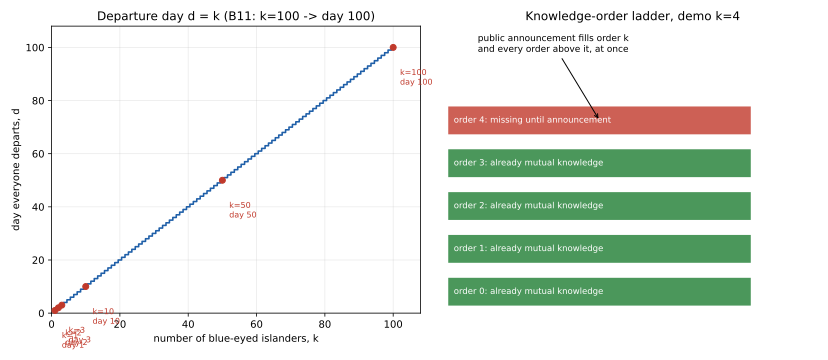

# ch15 — 紅藍眼睛悖論：一句大家早就知道的話，為什麼引爆全島

> **本章解決什麼問題**：Part IV 那幾章處理的是「時間拉長、資本有邊界」怎麼把一場公平賭局悄悄推向確定的一邊；這一章換到一個完全不同的家族——共同知識（common knowledge）與知識邏輯（epistemic logic）。你會看到一整座島上的藍眼人，聽到一句大家老早就知道的話，卻整整齊齊在同一天集體離島；真正改變的，從來不是「大家知不知道」，而是「大家知不知道『大家知道』要嵌套到第幾層」。這一章立好的機制，ch16 會用泥巴小孩把同一套歸納重跑一次、洗得更乾淨；ch18 則會證明，共同知識在真實通訊裡永遠差最後一層——都要先靠這一章把「互知」與「共同知識」的界線畫清楚。

```text
沒說出口的那句 — 八個部分

  I   解剖學 ────────── ch01 三步解剖：直覺／假設／重建
  │
  II  條件與資訊 ────── ch02 蒙提霍爾 · ch03 三囚犯 · ch04 貝特朗盒子
  │                     ch05 男孩女孩 · ch06 偽陽性
  III 因果聚合計數 ──── ch07 辛普森 · ch08 檢察官謬誤 · ch09 生日問題
  IV  漫步與賭局 ────── ch10 賭徒輸光 · ch11 賭徒謬誤與熱手
  │                     ch12 聖彼得堡 · ch13 兩個信封 · ch14 帕隆多
  V   共同知識 ──────── ch15 紅藍眼睛 · ch16 泥巴小孩   ◄ 你在這裡
  │                     ch17 意外絞刑 · ch18 兩位將軍
  VI  選擇與集體 ────── ch19 非傳遞骰子 · ch20 孔多塞 · ch21 布雷斯 · ch22 紐康
  VII 隨機與測度 ────── ch23 睡美人 · ch24 貝特朗弦 · ch25 班佛 · ch26 巴拿赫–塔斯基
  VIII 收官 ─────────── ch27 一張假設類型總表
```

## 從你已知的出發

想像一座與世隔絕的小島。島上的居民只有兩種眼睛顏色：紅眼睛與藍眼睛。島上的文化有一條根深柢固的禁忌——沒有人可以用任何方式，向任何人透露、暗示、討論眼睛的顏色，不管是自己的還是別人的。島上沒有鏡子、沒有水面倒影、沒有任何會反光的表面；每個人都能清清楚楚看到島上其他每一個人的眼睛，唯獨看不到自己的。島上還有一項規矩：每天午夜，會有一艘船從碼頭出發；只要有人透過純粹的邏輯推理，確定了自己的眼睛是藍色，就必須在當天午夜搭那艘船離開小島，而且永遠不會回來；如果還沒能百分之百確定，就必須留下來，什麼也不做，繼續等待下一個午夜。島上所有居民都是完美的邏輯學家（perfect logician）——只要邏輯上能推得出來的結論，他們一定推得出來；只要邏輯上還推不出來，他們也絕對不會亂猜。這些規矩、這種文化、大家都是完美邏輯學家這件事本身，是所有島民從小就知道、彼此也都知道對方知道的常識，是不需要說出口的背景設定。

某一天，一位外地遊客搭船造訪了這座小島。他不熟悉當地的禁忌，在某個所有島民都聚集在一起的場合，隨口說了一句話：「有意思，我看到你們之中，至少有一個人是藍眼睛。」說完這句話，他就搭船離開了，之後再也沒有回來過。

問題來了：這座島上恰好有 100 個人是藍眼睛，其餘的人都是紅眼睛（紅眼睛確切有幾個人，不影響這一題，本章不需要用到）。這句話對這座島造成了什麼影響？

多數人心裡第一個念頭大概是這樣：「這句話根本沒有告訴任何人任何新資訊。島上有 100 個藍眼睛的人，只要島上藍眼睛的人數不少於 2 個，每一個藍眼睛的人一睜開眼睛，就能親眼看到其他 99 個藍眼睛的人——他們老早就知道『島上至少有一個人是藍眼睛』這件事，甚至知道得比遊客精確得多（他們知道確切數字接近 100，遊客只說了『至少一個』）。既然這是每個人都已經知道的事實，一個外地人把它說出口，怎麼可能改變任何事？大家頂多聳聳肩，覺得這位遊客講了一句廢話，然後日子照樣過下去。」

這個答案聽起來無懈可擊：資訊論最基本的常識告訴我們，重複一件所有人都已經知道的事實，不應該產生任何新的行為後果。然而事實是：從遊客說出那句話開始算起，整整 99 天過去，島上什麼事都沒發生；到了第 100 天的午夜，全部 100 個藍眼睛的人，會同時、毫無異議地搭上那艘船，永遠離開這座島。他們不是靠猜的，也不是靠互相串供——他們每一個人，都是透過純粹的邏輯推理，獨立推導出「我自己一定是藍眼睛」這個結論。這句「大家早就知道的話」，到底改變了什麼？要回答這個問題，最乾淨的辦法不是直接跳到 100 人的場面，而是先把人數縮到最小，一步一步往上疊。

## 一個很自然的懷疑：這句話真的沒有告訴任何新東西嗎

在往下推導之前，值得先把「一句話有沒有新資訊」這件事本身講精確，因為直覺的錯誤，正好就藏在「資訊」這個詞被用得太鬆散這一點上。

如果島上恰好有 k 個藍眼睛的人（k ≥ 2），那麼確實，每一個藍眼睛的人，光靠自己的眼睛就能看到其他 k−1 個藍眼睛的人，所以每一個藍眼睛的人，在遊客開口之前，就已經知道「島上至少有一個人是藍眼睛」這個事實。這一點直覺沒有說錯：這件事的**內容**，對每一個藍眼睛的人而言，確實不是新聞。連紅眼睛的人也一樣：只要 k ≥ 1，紅眼睛的人一樣能看到全部 k 個藍眼睛的人，也早就知道這件事。

但「我知道這件事」跟「我知道『你也知道這件事』」，是兩件完全不同的事；「我知道你知道」跟「我知道你知道『我也知道你知道』」，又是再往上一層、完全不同的事。這一串「知道」可以無限疊下去，而本章要證明的核心結論是：**在遊客開口之前，這串疊加在某一個特定的高度就會斷掉——斷的地方剛好卡在「k」這個數字上；遊客那句話的作用，不是提供了『島上有藍眼人』這個事實本身，而是把這串疊加，從『斷在第 k 層』直接接上、變成『疊到無窮層都成立』。** 這就是本章要拆穿的那句沒說出口的假設，也是全書 Part V 要開始建立的核心工具——共同知識（common knowledge）。要看清楚這串疊加到底是怎麼斷的，最好的辦法是從最小的案例開始，一步一步往上走。

## 從最小案例開始：只有一個藍眼人

先考慮一個極端簡化的版本：島上只有 1 個人是藍眼睛，姑且叫他 A，其餘的人都是紅眼睛。

在遊客開口之前，A 看著島上其他所有人，看到的全部都是紅眼睛——他一個藍眼睛的人都沒看到（因為島上唯一的藍眼睛就是他自己，而他看不到自己）。這時候，A 對「自己的眼睛顏色」完全沒有任何邏輯上的線索：紅眼睛的世界和藍眼睛的世界，在他眼前看起來一模一樣，因為他本來就看不見自己的眼睛。他沒有任何理由懷疑自己是藍眼睛。

遊客說出「你們之中至少有一個人是藍眼睛」的那一刻，A 的處境立刻改變。他環顧四周，一個藍眼睛的人都沒看到；如果那句話是真的（而 A 沒有理由懷疑遊客在說謊），那麼島上那唯一的藍眼睛的人，只能是他自己——因為他已經把「其他所有人」都檢查過一遍，全部都是紅眼睛。A 當晚就會推導出「我是藍眼睛」，搭上午夜的船離開。

```text
k=1 的逐日推理
──────────────────────────────────────────────
天數      A看到的藍眼人數     A的推理                        是否離島
宣告當晚    0               若「至少一個藍眼」為真，        當晚離島
                            而我看到的其他人全是紅眼，
                            那個人只能是我自己
──────────────────────────────────────────────
```

這是整個歸納的地基（base case），也是最容易被忽略的一步：**對 A 而言，遊客那句話百分之百是新資訊**，因為在那句話說出口之前，A 從來沒有、也不可能靠自己推出「島上存在藍眼睛」這個事實——他看到的世界裡一個藍眼睛的人都沒有。這跟前面「這句話大家老早知道」的直覺完全相反：對這座島上唯一一個真正被這句話說中的人來說，這句話恰恰是他一輩子沒聽過的頭條新聞。

## 兩個藍眼人：僵局出現的地方

現在把藍眼睛的人數加到 2 個，分別叫 B1、B2。

在遊客開口之前，B1 看著 B2，知道「島上至少有一個藍眼睛的人」（就是 B2）；B2 也對稱地看著 B1，同樣知道這件事。所以，跟 k=1 不同，這一次每個藍眼睛的人都已經知道「島上至少有一個藍眼睛」——遊客那句話的**字面內容**，對 B1、B2 兩人來說，確實不是新聞。

但問題出在下一層：**B1 知不知道「B2 也知道『島上至少有一個藍眼睛』」？** 這裡就是僵局出現的地方。B1 沒辦法看到自己的眼睛，所以 B1 沒辦法排除這個可能性：「如果我自己其實是紅眼睛呢？」如果 B1 真的是紅眼睛，那麼從 B2 的角度看出去，B2 看到的就只有 B1（紅眼睛）和其他所有紅眼睛的人——B2 一個藍眼睛的人都看不到，那就是 k=1 的處境：B2 完全不知道「島上有藍眼睛」這件事。換句話說，**站在 B1 的角度，他沒有辦法排除「B2 其實不知道『島上有藍眼睛』」這個可能性**——即使在真實世界裡（B1 真的是藍眼睛），B2 確實知道，但 B1 自己無法從邏輯上確定這一點，因為 B1 沒辦法確定自己的眼睛顏色。B2 的處境跟 B1 完全對稱。

於是，遊客宣告之後的第一天晚上，B1、B2 兩人都不會離開：他們各自看到 1 個藍眼睛的人（對方），而依照 k=1 的邏輯，如果島上真的只有 1 個藍眼睛的人，那個人應該已經在宣告當晚就離開了。但現在還沒過夜，兩人都還在等，看看對方會不會走。第一天晚上，誰都沒有動作。

到了第二天，關鍵的一步發生了：B1 看到，昨天晚上 B2 並沒有離開。如果昨天 B1 自己是紅眼睛，那麼站在 B2 的角度，B2 看到的唯一藍眼睛的人就是 B1——按照 k=1 的邏輯，B2 應該已經在第一天晚上就走了。**但 B2 沒有走**，這件「沒有走」的事實，本身就是新資訊：它排除了「B1 是紅眼睛」這個可能性，因為如果那個可能性成立，B2 昨晚就該離開了。唯一還說得通的解釋是：B2 看到的藍眼睛人數，不是 B1 以為的那樣只有一個，而是還包含了 B1 自己——也就是說，**B1 自己也是藍眼睛**。B2 完全對稱地做出一樣的推理。於是，第二天晚上，B1、B2 同時登船離開。

```text
k=2 的逐日推理
────────────────────────────────────────────────────────────
天數    B1看到      B1的推理                       B2看到      B2的推理                       當晚結果
第1天   1(B2)      若我是紅眼，B2該今晚離開；      1(B1)      若我是紅眼，B1該今晚離開；      無人離開
                    先觀察看看                                  先觀察看看
第2天   1(B2)      昨晚B2沒走，排除「我是紅眼」，   1(B1)      昨晚B1沒走，排除「我是紅眼」，   兩人同時
                    所以我也是藍眼                              所以我也是藍眼                  離島
────────────────────────────────────────────────────────────
```

值得停下來看清楚的是：這裡真正推動整個過程的，不是「島上有藍眼睛」這個事實本身（B1、B2 一開始就知道），而是「對方昨晚沒有離開」這個**可觀察的公開事件**。每一次沒有人離開，都在悄悄地排除掉一種可能的世界，而這個排除的過程，正是把僵局一層一層解開的引擎。

## 三個藍眼人：同一台機器再跑一次

把人數加到 3 個，C1、C2、C3。每個人看到另外 2 個藍眼睛的人。

第一天晚上，沒有人有把握，因為每個人的處境，跟「島上其實只有 2 個藍眼睛」的世界（k=2 的情境）在他眼中看起來一模一樣——例如 C1 心想：如果我是紅眼睛，那麼 C2、C3 就是島上僅有的兩個藍眼睛的人，依照 k=2 的邏輯，他們應該會在第二天晚上同時離開。所以，第一天晚上，沒有人動作，這完全符合預期，不排除任何可能性。

第二天晚上，同樣沒有人離開——但這一次「沒有人離開」開始有意義了。C1 心想：如果我真的是紅眼睛，C2 和 C3 應該已經在剛才那個晚上（第二天晚上）同時離開了（依照上一節 k=2 的推理）。但他們沒有走。這排除了「我是紅眼睛」的可能性：如果我是紅眼睛，C2、C3 這兩人組成的 k=2 世界，本該在第二天午夜就結束了。既然沒結束，我自己一定也是藍眼睛——C2、C3 對稱地做出一樣的推論。三人在第三天晚上同時離開。

```text
k=3 的逐日推理
────────────────────────────────────────────────────────────────
天數    每人看到的藍眼人數    當晚是否有人離開      這一步排除了什麼可能性
第1天   2（另外兩人）        無                    無新排除（跟k=2世界看起來一樣）
第2天   2（仍是另外兩人）    無                    排除「島上只有2個藍眼」──
                                                    因為若是那樣，另外兩人早該
                                                    在今晚同時離開，但他們沒走
第3天   2（仍是另外兩人）    是，三人同時離開      每個人都推出「我也是藍眼」
────────────────────────────────────────────────────────────────
```

到這裡，一個規律已經非常清楚：k 個藍眼睛的人，會在遊客宣告之後的第 k 天晚上，同時、獨立、透過純粹邏輯推理出各自的眼睛顏色並集體離島；在那之前的每一個晚上，都不會有任何人離開。接下來要把這個規律講清楚它到底是什麼，並用嚴謹的數學歸納法（mathematical induction）把它完整證明一遍，而不只是「看了三個例子就相信」。

## 一般化：k 階知識與共同知識的精確定義

要把「大家都知道」與「大家都知道大家都知道」這兩件事分開講，需要一套記號。設 φ（讀作 phi）代表這句客觀陳述：「島上至少有一個人是藍眼睛。」只要 k ≥ 1，φ 這句話本身就是真的。

```text
知識運算子的疊法
────────────────────────────────────────────
E¹φ  ：每一個人都知道 φ                       ← 「大家都知道」
E²φ  ：每一個人都知道「E¹φ 成立」              ← 「大家都知道大家都知道」
E^(m+1)φ ：每一個人都知道「E^mφ 成立」          ← 每往上疊一層，多套一個「知道」
Cφ   ：對所有 m，E^mφ 同時成立                 ← 共同知識(common knowledge)，
                                                無限層同時成立，不是某一層特別大
────────────────────────────────────────────
```

前面三個小案例已經把這套記號的內容，用具體推理跑過一遍。把結論收成一句精確的陳述：**若島上恰有 k 個藍眼睛的人（k ≥ 1），在遊客宣告之前，E^mφ 對所有 1 ≤ m ≤ k−1 都成立，但 E^kφ 不成立。** 用 k=2 驗證一次：k−1=1，所以 E¹φ 成立（B1、B2 都各自知道 φ，這在前面已經證明），但 E²φ（「大家都知道大家都知道」）不成立——因為 B1 沒辦法排除「B2 其實不知道 φ」這個可能性（前面已詳細推導過）。用 k=1 驗證：k−1=0，這表示連 E¹φ 都不成立——確實，A 自己完全不知道 φ，這正是 k=1 案例的起點。

這句話裡藏著全章最重要的一個觀察：**「互知」（mutual knowledge，也就是每個人都知道某件事）跟「共同知識」（common knowledge，也就是這件事被無限層地知道）不是同一回事，中間可能還隔著一大段「大家都知道，但不確定大家知不知道大家知道」的灰色地帶。** k 個藍眼睛的人，彼此之間已經疊出了 k−1 層的互知，只差最頂端那一層（第 k 層）沒有疊上去——而恰恰是那一層，決定了整個推理鏈條走不走得完。

## 完整的歸納證明：從 k 到 k+1

前面三個小案例只證明了 k=1、2、3，接下來用數學歸納法，把「k 個藍眼睛的人在第 k 天同時離島、且之前沒有人離島」這個命題 P(k)，一次證到所有 k 都成立。

```text
命題 P(k)：假設遊客已公開宣告φ（島上至少有一個藍眼睛），且恰有k個
          藍眼睛的人。則這k人會在第k天晚上同時推出自己是藍眼睛並
          集體離島，且在第1天到第k−1天晚上都不會有人離島。

基底 P(1)：已在前面證明——唯一的藍眼睛的人看不到任何藍眼睛，宣告後
          立刻推出自己就是那個人，第1天晚上離島。之前(不存在)沒有
          人離島，命題對k=1成立。

歸納步驟：假設 P(1), P(2), …, P(k) 都已成立（強歸納法），要證明
          P(k+1)。
          設島上恰有k+1個藍眼睛的人，任取其中一人X。X看到另外k個
          藍眼睛的人(除X以外的所有藍眼睛)。
          X進行一次假設性推理：「如果我自己不是藍眼睛，那麼島上
          就只有我看到的這k個人是藍眼睛。根據P(k)，這k個人會在
          第k天晚上同時推出自己是藍眼睛並離島。」
          到了第k天晚上，X觀察現實世界：這k個人並沒有離島（因為
          現實中共有k+1個藍眼睛的人，這k個人各自看到的是另外k個
          藍眼睛的人，不是k−1個，他們自己也還沒能排除「只有k個」
          這個更早的假設，所以在真實情況下他們不會在第k天離開）。
          X由此排除了「我自己不是藍眼睛」這個假設──因為那個假設
          若成立，那k人本該已經在第k天晚上離開，但他們沒有。
          於是X推出「我自己也是藍眼睛」。這個推理對k+1人中的每
          一個人都同步成立(對稱、且每個人都知道每個人都會這樣
          推理，因為「大家都是完美邏輯學家」本身是共同知識)，所以
          k+1人在第k+1天晚上同時離島。
          第1天到第k天晚上都不會有人離開：因為對每一個藍眼睛的人
          而言，「現實中有k+1個藍眼睛」跟「假設性的只有k個藍眼睛」
          這兩個世界，在第1天到第k天之間，呈現給他的觀察完全一樣
          (都是「看到k個藍眼睛，沒有人離開」)，他沒有任何資訊可以
          在第k天之前分辨這兩個世界，因此沒有理由在那之前離開。

結論：由數學歸納法，P(k)對所有正整數k成立。 □
```

這個證明裡最容易被忽略、卻是全篇的樞紐的一步，是歸納步驟裡的這一句：「X 觀察現實世界：這 k 個人並沒有離島。」這正是把「假設性世界」跟「真實世界」分開的關鍵動作——每一個晚上「沒有人離開」，本身就是一則公開播送的新資訊，逐步排除掉一種可能的世界，直到排除到只剩下唯一一種解釋為止。這也解釋了前面三個小案例裡，為什麼「等待」本身不是浪費時間：每一晚的沉默，都在悄悄地做著排除法的工作。

## 那句話到底新增了什麼

回到本章開頭那個「這句話沒有新資訊」的直覺。現在可以把它拆穿得非常精確。

在遊客開口之前，如果島上有 k 個藍眼睛的人（k ≥ 2），這 k 個人之間已經疊出了 k−1 層的互知（E¹φ 到 E^(k−1)φ 全部成立）——這一層一層的疊加，是靠他們平常互相觀察對方眼睛累積起來的，完全不需要任何人開口。但這串疊加，卡在第 k 層：E^kφ 不成立，原因在前面 k=2 的案例已經完整示範過——任何一個藍眼睛的人，都無法排除「有另一個人，其實不知道 φ」這個可能性，因為他自己看不見自己的眼睛，永遠留著一絲「我其實是紅眼睛」的邏輯縫隙。

遊客那句話之所以關鍵，不在於它說了什麼內容（內容大家都知道），而在於**它是怎麼被說出來的**：他是當著全體島民的面，同一時間、公開地說出這句話——每個人不只自己聽到了，還親眼看到「所有人」都同時聽到了，而且每個人也都知道「所有人都看到所有人聽到了」，這件事本身也是當場、公開發生的。這種「公開場合、眾人同時在場見證」的傳播方式，一次性地把 φ 從「疊到第 k−1 層就斷掉」，直接墊高成「所有層級都同時成立」——也就是共同知識 Cφ。對本章的島（k=100）來說，遊客那句話補上的，正是原本缺的第 100 層（E¹⁰⁰φ），連帶把第 101 層、第 102 層……所有更高的層級一次補齊。這正是那句沒說出口的假設現形的地方：**如果只是把同一句話，私下、一個一個分別告訴每個藍眼睛的人（每個人各自單獨聽到，不知道別人有沒有也被單獨告知、更不知道這件事本身有沒有被別人知道），那麼不管告訴了多少人，都只會停留在「大家各自知道」的層次，永遠疊不出第二層以上的互知，整座島照樣什麼事都不會發生。** 公開性（publicity）本身才是新資訊，不是那句話的字面內容。

## 外推到一百：第一百天

現在把前面的機制，套回本章正文一開始的設定：島上恰有 **100** 個藍眼睛的人（對照基準表 B11）。

宣告之前，這 100 個人之間已經疊出了整整 99 層的互知：每個人都知道 φ（第 1 層），每個人都知道「每個人都知道 φ」（第 2 層），一路疊到第 99 層都成立——這是因為，不論你怎麼一路假設「如果我不是藍眼睛，那麼從另一個人的角度看……」，只要嵌套的層數不超過 99 層，嵌套出來的那個假設性世界裡，永遠還剩下至少 1 個看得見的藍眼睛的人，這串「大家都知道」的鏈條就不會斷。真正斷裂的地方，卡在恰好第 100 層：嵌套到第 100 層時，會推出一個假設性世界，在那個世界裡，有某個人看到 0 個藍眼睛的人——這正是本章 k=1 案例的處境，也是唯一一個「大家都知道 φ」會失效的情境。

遊客那句公開宣告，一口氣把第 100 層（以及以上所有層級）補了進去，讓φ從「疊到第 99 層就斷掉的互知」，升級成「所有層級都成立的共同知識」。有了這個共同知識，前一節證明的歸納鏈條 P(1)、P(2)、……、P(100) 就可以毫無阻礙地一路跑下去：前 99 個晚上，每個人看到的都是「99 個藍眼睛的人，沒有人離開」，這跟「島上其實只有 99 個藍眼睛」這個假設性世界，在前 99 個晚上看起來完全一樣，沒有任何新資訊可以分辨真假；直到第 99 個晚上結束，如果那個假設性世界是真的，那 99 個人本該已經同時離島——但他們沒有。這排除了「我不是藍眼睛」的最後一個可能性，全部 100 個藍眼睛的人在**第 100 天**同時推出「我也是藍眼睛」，集體登船離開小島。

下面這張圖，把「藍眼人數 k」與「離島日 d」的關係，連同宣告前後知識層級的變化，一起畫出來：



這張圖要你看的重點是：左圖那條階梯是一條完全確定的直線 d=k，沒有任何隨機性、沒有任何模糊地帶——只要知道島上有幾個藍眼睛的人，就能精確算出他們哪一天離島，這正是純邏輯推理（而不是機率）的招牌特徵。右圖則是把「這句話新增了什麼」具象化：綠色的層級，是宣告前就靠觀察累積出來的；紅色的那一層，是唯一缺的一塊，而公開宣告一次補齊的，正好就是那一塊、以及它之上的所有層級。

## 這道謎題的身世：一段模糊的血緣

這道謎題流傳甚廣，網路上最常見的版本，大多可以追溯到數學家陶哲軒（Terence Tao）2008 年 2 月在自己部落格上發表的一篇文章《The blue-eyed islanders puzzle》——文中設定是一座住著 1000 人的部落，其中 100 人藍眼、900 人棕眼，一名藍眼的外地訪客不慎在公開場合提到眼睛顏色。不過，「藍眼島民」這個特定包裝本身，並沒有確認的學術原始出處（originator）——陶哲軒的部落格文章與後來廣傳的 xkcd 版本，都沒有註明是誰最早想出這個具體場景。**這一點務必說清楚：這道謎題不應該被歸給英國數學家利特爾伍德（John Edensor Littlewood）**——可以確認的是，利特爾伍德在他 1953 年出版的文集《A Mathematician's Miscellany》裡，收錄了一道結構完全相同的謎題：三位女士共乘一節火車車廂，每個人臉上都沾了煤灰，卻只看得到別人臉上的煤灰、看不到自己的；利特爾伍德把這道謎題一般化到 n 個人的版本，並用數學歸納法證明。但利特爾伍德本人在書裡自陳，這道謎題在他寫下的當時「已經廣為人知」——換句話說，連他自己都不認為自己是原創者，這道謎題很可能還有更早、已經不可考的源頭：結構相同的「泥巴小孩／髒臉」謎題，至少可以追到 Kraitchik 1942 年的印刷紀錄（見 ch16），比利特爾伍德更早；但「藍眼島民」這個特定包裝本身的最早出處，仍不可考。

謎題的「故事包裝」身世模糊，但它背後真正的數學概念——共同知識——的形式化歷史，反而清楚得多，而且三條線幾乎同時、卻各自獨立地浮現。社會學家佛萊德爾（Morris Friedell）在 1969 年發表〈On the Structure of Shared Awareness〉（《Behavioral Science》14 卷 1 期），據信是對「共同知識」最早的數學分析，但這篇論文長年被引用得很少，優先權常常被低估。同一年，哲學家路易斯（David Lewis）在他的專著《Convention: A Philosophical Study》（1969）裡，給出了共同知識第一次完整的哲學分析，明確處理了「無限層級」這件事，並被廣泛認為是把「共同知識」這個概念帶進主流哲學語彙的關鍵著作。再過幾年，賽局理論學家阿曼（Robert Aumann）在論文〈Agreeing to Disagree〉（《Annals of Statistics》4 卷 6 期，1976）裡，給出了共同知識第一個嚴格的賽局論形式化定義，並證明了著名的「同意定理」（agreement theorem：擁有相同先驗機率的兩人，如果對某件事的後驗機率彼此是共同知識，那麼這兩個後驗機率必須相等）。阿曼在 2005 年獲頒諾貝爾經濟學獎，但那是表彰他在賽局論上的整體貢獻，不宜簡化成「因為 1976 年那篇論文獲獎」。這三條線——佛萊德爾的數學分析、路易斯的哲學分析、阿曼的賽局論形式化——各自從不同的學科角度，摸到了本章用「知識層級疊加」講清楚的同一件事。到了 1995 年，Fagin、Halpern、Moses、Vardi 四人合著的《Reasoning About Knowledge》（MIT Press）把包括泥巴小孩（見 ch16）在內的這整套知識邏輯系統化整理成教材規格的形式體系，讓「E^m」「共同知識」這套記號成為電腦科學與分散式系統領域的標準工具——這也是為什麼 ch18 兩位將軍問題，會直接沿用本章建立的共同知識語言。

## 直覺的陷阱

回頭看本章開頭那個聽起來無懈可擊的答案：「這句話大家老早就知道，講出來不該有任何後果。」把整套錯覺拆開來看：

| 階段 | 發生了什麼 |
|---|---|
| 直覺的自信答案 | 「島上至少有一個藍眼睛」這件事的內容，每個藍眼睛的人早就親眼看到、早就知道，一個外地人重複講一遍已知的事實，邏輯上不該改變任何人的行為 |
| 偷渡的假設 | 把「這件事的內容大家都知道」（互知，E¹φ 甚至更高層都可能成立）悄悄等同於「這件事被無限層地知道」（共同知識，Cφ），卻沒有意識到「大家都知道」跟「大家都知道大家都知道」，是可以在某一個特定高度上斷開的兩件不同的事 |
| 為什麼聽起來理所當然 | 日常語言裡的「知道」是一個扁平的詞，不會自動區分「我知道」「我知道你知道」「我知道你知道我知道你知道」……這些不同的層級；只要一件事的內容確實不是新聞，直覺就會直接判定「講出來沒有意義」，完全沒有意識到還有一整串更高層的「知不知道」需要被單獨檢查 |
| 在哪一步被帶溝裡 | 不是計算出錯，而是在判斷「這句話有沒有意義」的那一刻，只檢查了 φ 這件事本身（第 0 層），完全沒有去檢查 E^kφ 這個特定高度的知識是否成立——而 k（島上藍眼睛的人數）恰恰就是那個「互知的鏈條會斷掉」的高度 |
| 怎麼自我察覺 | 每次聽到「這是大家都知道的事，講出來不會有影響」，先問自己一句：這裡的「知道」，是第幾層？大家「知道」這件事的內容，跟大家「知道大家都知道」，是同一件事嗎？如果答案不確定，公開、同時、眾人共同見證地把它說一次，很可能不是廢話，而是把某個特定高度的知識，從「幾乎但沒有完全疊上去」，一次墊到頂 |

值得指出的是，這個「內容不是新聞，但公開說出來仍然改變一切」的結構，不是這座虛構小島特有的現象。任何依賴「大家都同意去做同一件事」的協調行動——例如所有人同時停止某個大家都私下不滿、卻沒人敢先開口的默契，或是一群人各自都懷疑某件事、卻沒有人確定「別人是不是也這麼想」——都可能卡在同一種結構：內容早已是公開的秘密，真正缺的，是把這件事從「大家私下都知道」，一次性地、公開地墊成「大家都知道大家都知道，而且知道到不用再往上疊」。認出「這裡卡住的不是事實本身，而是某個特定層級的互知」，是本章留給你最值錢的一個警覺。

> **那句沒說出口的話是**：一件事的內容早就是「大家都知道」，不代表它已經是「大家都知道大家都知道……」疊到頂的共同知識——中間可能還斷在某一個特定的高度，而公開、同時、眾人共同見證的宣告，補的正是那個斷點以上的所有層級，不是事實本身。

## 紙上推演

**練習 1（★，10 分鐘）**：假設島上恰有 4 個藍眼睛的人（換一批人，跟正文 k=1、2、3 案例不同）。仿照正文的表格，完整列出第 1 天到第 4 天，每個藍眼睛的人「當天看到幾個藍眼睛的人」「當天這個觀察排除了哪一個假設性世界」的推理狀態，並指出他們會在第幾天集體離島。

**練習 2（★★，15 分鐘）**：如果那句話不是遊客當眾說出來的，而是某一位藍眼睛的人，私底下把「你不是島上唯一的藍眼睛」這句話，一個一個分別偷偷告訴另外 99 個藍眼睛的人（每個人都只從別人那裡個別聽到，不知道別人有沒有也被告知，也不知道自己被告知這件事有沒有被別人知道）。這樣做，能不能達到跟公開宣告一樣的效果，讓 100 人在第 100 天集體離島？用本章 E^m 的記號說明你的理由。

**練習 3（★★★，20 分鐘）**：不看課文，用自己的話，把「完整的歸納證明」那一節的 P(k) 到 P(k+1) 這一步重講一遍——特別是「X 觀察現實世界：這 k 個人並沒有離島」這一句，具體解釋它為什麼能排除「X 自己不是藍眼睛」這個假設，而不能只寫「顯然如此」。

**練習 4（★★，15 分鐘）**：把本題人數從 100 改成 1（只有一個藍眼睛的人）。如果遊客這次什麼話都不說，那唯一的藍眼睛的人，有沒有可能自己想出自己是藍眼睛？為什麼「遊客說了那句話」這個動作，對 k=1 的情況一樣是關鍵，而不是只有 k 很大的時候才重要？

### 推演解答

**練習 1 解答**：設四位藍眼睛的人為 D1、D2、D3、D4，每人看到另外 3 個藍眼睛的人。

```text
天數    每人看到的藍眼人數   當晚是否離島   這一步排除了什麼
第1天   3                  無            無新排除(跟k=3世界看起來相同)
第2天   3                  無            仍無新排除(跟k=3世界前2晚看起來相同)
第3天   3                  無            排除「島上只有3個藍眼」——
                                          若是那樣，另外3人依k=3的
                                          邏輯，早該在第3晚同時離島，
                                          但他們沒有
第4天   3                  是，四人同時   每人都推出「我也是藍眼」
        (仍是3)            離島
```

四人會在**第 4 天**集體離島，前三個晚上都不會有人離開——完全符合正文歸納出的規律 d = k。

**練習 2 解答**：不能達到一樣的效果，島上什麼事都不會發生。用 E^m 記號說明：私下、一對一地告訴每個人「你不是唯一的藍眼睛」，最多只能讓每一個被告知的人，各自單獨多確認一次「島上至少還有另一個藍眼睛」——但這仍然只是第 1 層（E¹φ 的加強版），因為每個人都不知道「其他人有沒有也被告知」，更不知道「其他人知不知道『大家都被告知了』」。這件事完全沒有被公開、同時、眾人共同見證地傳播，所以疊不出第 2 層以上的互知，遑論共同知識。前面的歸納證明裡，關鍵的一步「X 觀察現實世界：這 k 個人並沒有離島」，需要的是每個人都能確定「其他人跟我一樣，起點都站在同一條共同知識的地基上」——私下告知完全沒有辦法建立這種確定性，所以歸納鏈條連第一步都跑不起來，100 天過去，一個人都不會離開。

**練習 3 解答**：假設島上恰有 k+1 個藍眼睛的人，任取其中一人 X。X 心裡進行一次「假設性推演」：先假裝「我自己不是藍眼睛」，那麼在這個假設之下，島上就只剩下 X 眼中看到的那 k 個人是藍眼睛。根據歸納假設 P(k)（前面已經證明對 k 成立），這 k 個人組成的「小世界」，會在第 k 天晚上同時推出各自是藍眼睛並集體離島。現在，到了現實中的第 k 天晚上，X 抬頭看：那 k 個人並沒有離開。這件事之所以能推翻「我不是藍眼睛」這個假設，是因為：如果那個假設是真的，剛才描述的「小世界」就是唯一正確的現實，而 P(k) 保證那個小世界裡的 k 人必然會在第 k 天離開——這是數學歸納法保證的必然結果，不是猜測。既然必然的結果沒有發生，唯一合理的解釋就是那個前提（我不是藍眼睛）從一開始就是錯的。於是 X 反推出「我自己也是藍眼睛」。這個推理鏈條對每一個藍眼睛的人都同步、對稱地成立，而「大家都會這樣推理」這件事本身也是共同知識的一部分（因為「大家都是完美邏輯學家」是背景設定裡本來就有的共同知識），所以全部 k+1 人在第 k+1 天晚上同時得出結論、同時離島。

**練習 4 解答**：不可能。如果遊客什麼都不說，那唯一的藍眼睛的人，終其一生看到的都是滿眼的紅眼睛，完全沒有任何觀察上的線索能讓他懷疑「說不定我自己才是那個不一樣的人」——邏輯推理只能從已知的前提往下推，而他根本沒有「島上存在藍眼睛」這個前提可以使用。這正說明「遊客說了那句話」這個動作，對 k=1 的情況一樣是關鍵，而不是人數大才重要：不管 k 等於多少，遊客那句話提供的，都是那一個原本完全缺失、無法靠自己觀察補上的最頂層知識（對 k=1 來說，甚至是第 1 層本身）；差別只在於，k 越大，這串知識原本已經靠互相觀察疊得越高（疊到 k−1 層），只差最後一哩路；而 k=1 時，連第一哩路都還沒開始走，整條路都得靠那句話從頭鋪起。

## 自我檢核

1. 「互知」（每個人都知道某件事）跟「共同知識」（common knowledge，這件事被無限層地知道）差在哪裡？為什麼前者不能自動推出後者？
2. 為什麼 k=1 時，那唯一的藍眼睛的人，在遊客宣告之前完全沒有辦法推論出自己是藍眼睛？他跟 k=2 時的 B1、B2 相比，處境本質上少了什麼？
3. k=2 時，兩人在第 1 天晚上都不會離開，卻在第 2 天同時離開。把兩人各自的推理鏈，用自己的話重講一次，特別解釋「對方昨晚沒有離開」這件事為什麼算是一則新資訊。
4. 用本章 E^m 的記號說明：k 個藍眼睛的人，在遊客宣告之前，知識疊到第幾層還成立、第幾層開始不成立？
5. 遊客那句話，字面上的內容明明大家老早就知道，這句話到底新增了什麼？請不要只回答「共同知識」，具體說出它補上了哪一層。
6. 如果把遊客的公開宣告，換成私底下一對一地偷偷告訴每一個藍眼睛的人「你不是唯一的藍眼睛」，會不會有一樣的效果？為什麼「公開」（大家同時在場見證）是關鍵，而不是「內容有沒有說出口」？
7. 完整的歸納證明裡，「X 觀察現實世界：那 k 個人並沒有離島」這一步，為什麼能夠排除「X 自己不是藍眼睛」這個假設？如果沒有這一步，整條歸納鏈條會卡在哪裡？
8. 這個悖論那句沒說出口的假設是什麼？試著不看課文，用自己的話重講一次。

## 延伸閱讀

- Tao, T. (2008). 〈The Blue-Eyed Islanders Puzzle〉。陶哲軒本人部落格上最廣為流傳的版本（1000 人部落、100 藍眼、900 棕眼），文中明確指出這題有兩個看似都合理、卻互相矛盾的論證，是理解本章「互知 vs 共同知識」最好的起點之一。<https://terrytao.wordpress.com/2008/02/05/the-blue-eyed-islanders-puzzle/>
- 〈Common Knowledge〉，*Stanford Encyclopedia of Philosophy*——共同知識這個概念在哲學與邏輯上的系統性總覽，包含層級疊加（hierarchical）與不動點（fixed-point）等不同形式化方式，可用來對照本章的 E^m 記號。<https://plato.stanford.edu/entries/common-knowledge/>
- Aumann, R. J. (1976). "Agreeing to Disagree." *The Annals of Statistics*, 4(6), 1236–1239——共同知識第一次嚴格的賽局論形式化，以及著名的「同意定理」，本章形式化定義的直接源頭之一。
- Lewis, D. (1969). *Convention: A Philosophical Study*. Harvard University Press——共同知識第一次完整的哲學分析，處理了「無限層級」這個核心問題，一般認為是把這個概念帶進主流哲學語彙的關鍵著作。
- Fagin, R., Halpern, J. Y., Moses, Y., & Vardi, M. Y. (1995). *Reasoning About Knowledge*. MIT Press——把包括泥巴小孩（見 ch16）在內的知識邏輯系統化成教材規格的形式體系，是電腦科學與分散式系統領域引用共同知識的標準參考書。
- Littlewood, J. E. (1953). *A Mathematician's Miscellany*. Methuen——收錄結構相同的「火車車廂三位女士」謎題，並用數學歸納法一般化到 n 人版本；作者本人自陳這道謎題在他寫下時已經廣為人知（未驗證：更早、更確切的一手來源目前不可考）。
