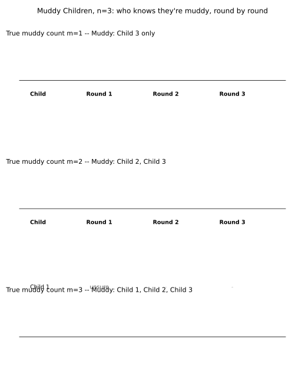

# ch16 — 泥巴小孩：同一個歸納，洗乾淨看

> **本章解決什麼問題**：ch15 用「島上一百個藍眼人」示範了共同知識（common knowledge）如何靠一句公開宣告（public announcement），把一群人早就各自看在眼裡的事實，逼出一個誰都想不到的集體結局。這一章把同一套歸納機制，換上一副更乾淨的骨架——泥巴小孩／髒臉問題（Muddy Children Puzzle）：沒有島、沒有日出日落，只剩下一群小孩、額頭上的泥巴，和父親一句一模一樣的公開宣告，逐回合同時作答。目標是讓「公開宣告」與「共同知道現在是第幾回合」這兩個齒輪，比 ch15 轉得更透明、更容易一眼看穿。後面 ch17（意外絞刑）與 ch18（兩位將軍）分屬「自我指涉」與「共同知識永遠達不到」兩個不同的親戚家族，本章仍然是共同知識三章之一，跟它們不是同一種東西。

## 從你已知的出發

想像三個小孩在院子裡玩泥巴，玩到渾身髒污，其中幾個人的額頭沾上了一大片泥巴，自己完全看不見——沒有鏡子，也沒有人告訴過他們。晚餐前，父親把小孩排成一列，讓每個小孩都能清楚看到其他所有人的額頭，卻永遠看不到自己的。父親接著當著所有小孩的面，大聲宣布一句話：「你們裡面，至少有一個人額頭上有泥巴。」說完之後，他開始一輪一輪地問：「你們裡面，有沒有人已經知道自己額頭有沒有泥巴？」每一輪，所有小孩必須同時、誠實地回答——如果知道，就說出「有」或「沒有」；如果還不知道，就說「不知道」。小孩們都絕頂聰明，邏輯推理毫無瑕疵，而且每個人都知道其他人同樣絕頂聰明；這整套規則、包括父親剛剛講的那句話，所有小孩不但都聽到了，也都知道別人聽到了，都知道別人知道別人聽到了……如此無窮無盡地往下疊——這句話，正是本章要拆開來檢查的東西。

現在假設實際上不只一個小孩額頭髒，比如三個小孩全部都髒。父親說的這句話，聽在每一個髒小孩耳裡，其實一點都不新鮮——隨便一個髒小孩往左右一看，明明白白看到另外兩個人額頭都是泥巴，「至少有一個人髒」這件事，他自己心裡早就有數，用不著父親多此一舉地講出來。既然這句話沒有告訴任何一個人任何他原本不知道的事，直覺上很容易這樣猜：無論父親問多少輪、問到天荒地老，這群小孩應該永遠回答不出「知道」——反正沒有一絲一毫新的資訊灌進來，他們的認知狀態不會被這句「廢話」推動半分。

這個猜測聽起來無懈可擊，卻是全然錯誤的。你即將在本章看到：只要小孩們誠實、聰明、同時回答，而且父親真的把那句話當著所有人的面講出來，那麼在恰好第 m 回合（m 就是實際髒小孩的人數），所有 m 個髒小孩會毫無預兆地、同時、篤定地喊出「我知道，我額頭有泥巴」。同樣的三個髒小孩，同樣心知肚明「至少一人髒」這件事，卻要苦等到第三回合才鬆口——這中間到底發生了什麼事，父親那句聽起來像廢話的宣告，究竟改變了什麼，就是這一章要一步一步拆開來看的東西。

## 規則寫死：把「聰明」「誠實」「同時」都變成可以計算的假設

在動手推導之前，值得先把場景裡每一個看似理所當然的細節都攤開來寫清楚，因為稍後你會發現，悖論的破綻恰恰就藏在這幾條規則的某一個字眼裡，不是藏在算術裡。這場遊戲裡，以下幾件事**必須是共同知識**——不只是每個人都知道，而是每個人都知道別人知道，別人也知道別人知道別人知道，一路無窮盡地疊上去：

- **可見性規則**：每個小孩都能看見除了自己以外每一個小孩的額頭，看不見自己的。
- **誠實與聰明規則**：每個小孩的邏輯推理都完美無誤，而且一旦透過推理確定了自己的狀態，一定會在下一次被問到時如實回答。
- **同時作答規則**：每一輪，所有小孩必須在同一時刻、互不參考彼此當輪答案的情況下作答；一輪結束後，這一輪所有人的答案，會變成所有人都能看見、都能拿來當下一輪推理材料的公開事實。
- **共同計數規則**：所有小孩都知道現在是第幾輪，而且這件事本身也是共同知識——沒有人算錯輪數、沒有人中途睡著漏算一輪。
- **公開宣告規則**：父親那句「至少有一個人額頭有泥巴」，是當著所有小孩的面說出來的，而不是私下分別告訴每一個人。

這五條規則裡，前兩條純粹是「小孩很聰明、很誠實」，感覺上無關痛癢；後三條——同時、共同計數、公開宣告——才是整個推理能夠往前推進的引擎。本章的核心工作，就是精確追蹤這三個引擎零件，看它們怎麼把「大家早就看在眼裡的事實」一步步轉成「大家真正知道自己的狀態」。

## m=1：唯一的髒孩，第一輪就知道

從最簡單的情形著手：n=3，但實際上只有一個小孩額頭髒，就叫他丙。甲和乙額頭乾淨。

丙看看甲和乙——兩人額頭都乾淨，丙一個髒的都沒看到。父親已經公開宣告「至少一人髒」，這件事丙親耳聽到了；丙心裡的推理是：「父親說至少有一個人髒。我看遍了甲和乙，兩人都乾淨。如果我自己也乾淨，那這屋子裡就沒有任何人髒，跟父親講的那句話直接矛盾。所以，髒的那個人只能是我。」丙在第一輪，立刻篤定地回答：「我知道，我額頭有泥巴。」

那甲和乙呢？甲看見乙乾淨、丙髒，一共看到一個髒人；乙看見甲乾淨、丙髒，同樣看到一個髒人。單從「至少一人髒」這句話加上自己看到的一個髒人，甲完全無法判斷：會不會自己也髒（那就是兩個髒人），還是只有丙一個人髒？在第一輪，甲和乙手上沒有任何額外線索可以拿來排除這兩種可能，兩人都只能誠實地回答「不知道」。

於是 m=1 的完整結果是：第一輪，丙喊出「我髒」，甲、乙仍然「不知道」。這是整條歸納鏈的基礎（base case）——它之所以成立，關鍵在於丙看到零個髒人，而父親那句話保證了「至少一人」，兩者疊在一起，唯一符合邏輯的解釋就是丙自己。值得特別記住這一步：如果父親從沒講過那句話，丙看到零個髒人，這件事本身完全不能排除「其實一個人都不髒，包括我」——沒有父親那句宣告，丙連第一輪都邁不出去。

## m=2：兩個髒孩，靠著「等一輪」互相確認

接下來把設定加碼：n=3，這次乙和丙額頭都髒，甲乾淨。

**第一輪**：甲看見乙、丙都髒，兩個髒人已經滿足「至少一人」，甲自己的狀態完全無法判斷，回答「不知道」。乙看見甲乾淨、丙髒，只看到一個髒人；丙看見甲乾淨、乙髒，同樣只看到一個髒人。乙和丙這時候手上的資訊，和上一節 m=1 情境裡甲、乙的處境一模一樣——都只看到一個髒人，都還沒有多一輪的沉默可以拿來推理。所以第一輪，乙、丙也只能回答「不知道」。第一輪的結果是：甲、乙、丙全部「不知道」。

**第二輪**：現在乙開始用「假設我自己是乾淨的」這種反證法（proof by contradiction）來推理：「假如我（乙）額頭是乾淨的，那麼髒的就只有丙一個人。如果真是這樣，丙看到的甲、乙都乾淨，丙應該會套用上一節的 m=1 推理，在第一輪就篤定地喊出『我髒』。但剛才第一輪，丙明明回答的是『不知道』，不是『我髒』。」乙由此推出：「我假設『自己乾淨』這件事，跟第一輪實際發生的事矛盾，所以這個假設是錯的——我一定是髒的。」乙在第二輪回答：「我知道，我額頭有泥巴。」

丙的推理跟乙完全對稱：「假如我（丙）是乾淨的，髒的就只有乙一個人，乙應該在第一輪就篤定喊出『我髒』；但乙第一輪回答的是『不知道』，矛盾，所以我一定是髒的。」丙在第二輪，也回答「我知道，我額頭有泥巴」。

那甲呢？甲從頭到尾都看到兩個髒人，這件事本身沒有隨著回合數增加而改變，甲手上沒有新的排除線索能判斷自己的狀態，第二輪甲仍然回答「不知道」（雖然一旦乙、丙同時喊出「我髒」，甲其實可以用刪去法反推「總共只有兩個髒人，而且是乙和丙，所以我是乾淨的」——這是一個常被忽略的旁支結論，本章聚焦在髒孩子自己何時知道自己髒，這一點留在後面「直覺的陷阱」一節簡短補充）。

m=2 的完整結果：第一輪全員「不知道」；第二輪，乙、丙同時喊出「我髒」。整個推理的樞紐，在於乙、丙都做了同一件事——**先假設自己乾淨，推出對方應該在上一輪就篤定；上一輪沒有發生，假設就被推翻**。這一步能成立，前提是乙、丙都能親眼確認「丙（或乙）第一輪真的回答了不知道」——這件事必須是公開、雙方都看得到的事實，不能是私下才知道的事。

## m=3：三個回合，一個都不能少（本章的完整逐回合推理全表）

現在把 n=3 這個舞台推到極限：甲、乙、丙**全部**額頭都髒。這正是本章 worked example 的主角——三個小孩、三個回合，缺一不可。

**第一輪**：任取一人，比如甲，甲看見乙、丙兩人都髒，兩個髒人已經足以滿足父親那句「至少一人」，甲自己的狀態無法判斷，回答「不知道」。乙、丙同理（乙看甲、丙都髒；丙看甲、乙都髒），三人在第一輪，答案全部是「不知道」。

**第二輪**：甲試著用跟上一節一樣的反證法：「假如我（甲）是乾淨的，那麼髒的就只剩乙、丙兩人——這正是上一節 m=2 的情境。照 m=2 的結果，乙、丙應該會在第二輪同時喊出『我髒』。」但這句推理的關鍵在於：甲現在正處在**第二輪**，還沒有辦法親眼見證「第二輪乙、丙有沒有喊出我髒」——因為甲自己這輪的答案，跟乙、丙這輪的答案，是**同時**給出的，甲不能先偷看乙、丙這一輪答了什麼再決定自己怎麼答。換句話說，甲能拿來推理的，只有「上一輪（第一輪）發生了什麼」，而第一輪的結果（全員不知道）在甲的「假設自己乾淨」情境下，跟實際情況（甲自己也髒）完全沒有差別——不管甲乾不乾淨，第一輪本來就該是全員不知道（你可以回頭檢查 m=2 一節：m=2 情境下第一輪也是全員不知道）。這一輪甲手上沒有能排除任何一種可能的新線索，只能繼續回答「不知道」。乙、丙由同樣的對稱推理，這一輪也回答「不知道」。第二輪答案：全部「不知道」。

**第三輪**：現在甲已經親眼見證了完整的兩輪沉默——第一輪全員不知道、**第二輪也全員不知道**。甲重新檢查自己「假設我乾淨」的推理：「如果我真的是乾淨的，髒的就只剩乙、丙兩人，照 m=2 的結果，乙、丙應該會在**第二輪**同時喊出『我髒』。可是我剛剛親眼看到，第二輪乙、丙給的答案是『不知道』，不是『我髒』。」這裡出現了真正的矛盾：假設「甲乾淨」，會推出「乙、丙第二輪必須喊出我髒」；但事實是，第二輪乙、丙確確實實回答了不知道。假設與事實衝突，於是甲推翻自己「乾淨」的假設，得出結論：「我一定是髒的。」甲在第三輪，篤定回答：「我知道，我額頭有泥巴。」乙、丙的推理跟甲完全對稱（乙假設自己乾淨會推出「甲、丙該在第二輪喊出我髒」，觀察到沒發生，於是乙也推翻假設，判定自己是髒的；丙同理），三人在第三輪，**同時**喊出「我知道，我額頭有泥巴」。

把 n=3 三種可能的實際髒人數（m=1、m=2、m=3）整理成一張完整的逐回合狀態表，就是本章的核心 worked example：

| 實際髒人數 m | 誰額頭髒 | 第 1 輪 | 第 2 輪 | 第 3 輪 |
|---|---|---|---|---|
| m=1 | 丙 | 甲：不知道／乙：不知道／丙：**我髒！** | （遊戲已結束） | （遊戲已結束） |
| m=2 | 乙、丙 | 甲：不知道／乙：不知道／丙：不知道 | 甲：不知道／乙：**我髒！**／丙：**我髒！** | （遊戲已結束） |
| m=3 | 甲、乙、丙 | 甲：不知道／乙：不知道／丙：不知道 | 甲：不知道／乙：不知道／丙：不知道 | 甲：**我髒！**／乙：**我髒！**／丙：**我髒！** |

這張表把整條歸納鏈的規律攤得清清楚楚：**回合數恰好等於實際髒人數**——不多、不少。髒人數越多，需要疊上去反證的「假設—觀察—推翻」層數就越多，回合數也跟著線性增加。而且每一列裡，前 m−1 輪永遠是全員沉默，直到第 m 輪才會有人開口，這件事本身沒有例外——這正是下一節要證明到底、對任何 n、任何 m 都成立的一般規律。

## 一般化：n 個小孩、m 個髒孩的完整歸納證明

上面三個具體案例，其實已經把一般證明的每一步都示範過一次；這裡把它寫成對 m 做數學歸納法（mathematical induction）的完整版本，適用於任意 n（小孩總數）與任意 1≤m≤n（實際髒人數）。

```text
命題：設 n 個小孩裡，恰有 m 個（1≤m≤n）額頭有泥巴，且父親已公開宣告
     「至少一人額頭有泥巴」。若所有小孩誠實、聰明、同時作答，且共同知道
     現在是第幾輪，則：
       (i) 第 1、2、…、m−1 輪，所有小孩都回答「不知道」；
       (ii) 第 m 輪，恰好那 m 個髒小孩同時回答「我髒」。

證明（對 m 做歸納）：

【基礎案例 m=1】
唯一髒的那個小孩，看見其餘 n−1 人全部乾淨。父親宣告「至少一人髒」
是共同知識，若這個小孩自己也乾淨，屋內就無人髒，與宣告矛盾。
      故此人第 1 輪即可推出「我髒」。     ← 反證法：假設自己乾淨會導出矛盾
其餘 n−1 人各看到 1 個髒人，無法排除「髒人數＝1（不是我）」與
「髒人數＝2（我也是）」，第 1 輪只能回答「不知道」。

【歸納步驟：假設命題對 m−1 成立，證明對 m 成立（m≥2）】
取任一實際髒小孩 X。X 看見另外 m−1 個髒人（其餘 n−m 人乾淨）。
X 考慮兩種關於自己的假設：
  假設 (a)：X 是乾淨的 → 全體髒人數就是 X 看到的 m−1 個
  假設 (b)：X 是髒的（事實）→ 全體髒人數是 m

  在假設 (a) 之下，由歸納假設（命題對 m−1 成立）：
    那 m−1 個髒人會在第 1 到 m−2 輪都回答不知道，
    第 m−1 輪同時喊出「我髒」。                ← 這是假設(a)世界裡的推論
  X 在第 1 到 m−2 輪，無法用任何觀察區分假設(a)與假設(b)
    （因為這 m−2 輪的沉默，在兩種假設下都會發生，參見下方附註），
    只能回答「不知道」；到了第 m−1 輪，X 已經親眼見證了
    完整的 m−2 輪沉默，可以檢查假設(a)的預測是否兌現：
      若假設(a)成立 → 第 m−1 輪，X 看到的那 m−1 個人應同時喊「我髒」
      實際觀察      → 第 m−1 輪，這 m−1 個人仍然回答「不知道」
                                          ← 因為實際髒人數是 m 不是 m−1，
                                             由歸納假設，這 m−1 個人（連同
                                             X 自己）要等到第 m 輪才會知道
    觀察與假設(a)的預測矛盾 → 假設(a)不成立 → X 必為假設(b)：X 是髒的。
  X 在第 m 輪回答：「我髒。」

  這個推理對每一個實際髒人 X 都同時成立（因為 m 個髒人彼此對稱、
  互相都看到其餘 m−1 個髒人），所以第 m 輪，m 個髒人同時喊出「我髒」；
  且由上述推理，第 1 到 m−1 輪確實全員沉默——與命題(i)(ii)一致。
  由數學歸納法，命題對所有 1≤m≤n 成立。 □
```

證明裡「X 在第 1 到 m−2 輪無法區分假設(a)與假設(b)」這一句，是全篇最容易被輕輕帶過、卻最關鍵的一步：它成立的原因，是假設(a)（X 乾淨、共 m−1 人髒）與假設(b)（X 髒、共 m 人髒）這兩個平行世界，在第 1 到 m−2 輪，會產生一模一樣的沉默——因為不論總髒人數是 m−1 還是 m，都遠大於當下的輪數，還沒輪到任何人能夠篤定作答。這兩個世界唯一分道揚鑣的時刻，就是第 m−1 輪：假設(a)世界裡，m−1 人已經足夠讓自己人喊出來；假設(b)世界裡（也就是實際情況），還差一輪。正是這一輪「本該發生卻沒發生」的沉默，把兩個原本無法區分的世界，硬生生劈開成可以區分的兩半——這正是整條歸納鏈得以往前推進一步的唯一燃料。



上圖把前面三節手算過的三張小表，並排畫成一張總覽：每一橫排是一種「實際髒人數 m」的世界，每一直欄是一個回合；灰色的「unsure」代表這一輪還答不出來，紅色加粗的「MUDDY!」代表這個小孩在這一輪篤定喊出自己髒了。圖裡的 Child 1／Child 2／Child 3，對應本章正文的甲／乙／丙。這張圖最值得盯著看的地方，是三條橫排「紅色出現的那一欄」跟這一排的 m 值完全對齊——m=1 的紅色出現在第 1 欄，m=2 的紅色出現在第 2 欄，m=3 的紅色出現在第 3 欄，一格都不會提早、也不會延後。

## 跟 ch15 紅藍眼睛是同一件事：逐項對照

如果你讀過 ch15，這整章的節奏你其實已經很熟——因為它們本來就是同一副骨架，只是換了一套人物與場景。把兩章逐項對照，你會看到每一格都能一對一填上：

| 對應關係 | 泥巴小孩（本章） | 紅藍眼睛（ch15） |
|---|---|---|
| 誰能看到誰的私有資訊 | 每個小孩看得到別人額頭，看不到自己 | 每個藍眼人看得到別人眼睛，看不到自己 |
| 觸發前的私有認知 | 若 m≥2，每個髒孩早就親眼看到別人髒（互知，mutual knowledge） | 若藍眼人數 k≥2，每個藍眼人早就親眼看到別人是藍眼（同樣是互知） |
| 公開宣告的內容 | 父親說：「你們裡面，至少有一人額頭有泥巴」 | 外來者說：「島上至少有一個藍眼人」 |
| 公開宣告改變了什麼 | 把「大家都看得到至少一人髒」這件互知，升級成共同知識（common knowledge）——大家不只知道，還知道大家知道，知道大家知道大家知道…… | 一字不差：把互知升級成共同知識 |
| 反覆進行的機制 | 同一句問題「你知不知道自己額頭有沒有泥巴」，一輪一輪重複問 | 同一件事「有沒有人已經確定自己是藍眼」，一天一天重複發生 |
| 揭曉時刻 | 第 m 輪，m 個髒孩同時喊出「我髒」 | 第 k 天，k 個藍眼人同時集體離島 |
| 那句沒說出口的假設 | 同時、公開、且大家共同知道現在是第幾輪 | 同時、公開、且大家共同知道現在是第幾天 |

兩者在數學上其實是同一條歸納證明，把「輪」換成「天」、把「額頭有泥巴」換成「藍眼」，證明的每一步幾乎可以逐字互換。之所以值得用整整一章把它重講一遍，是因為泥巴小孩這個版本，把「回合」寫得比「日子」更赤裸——父親一輪一輪當面問「你知不知道」，這個動作本身就是歸納法的引擎被搬到檯面上運轉，你親眼看著每一輪的沉默怎麼一步步變成下一輪的線索；而紅藍眼睛裡「有沒有人離島」這件事，發生在每一個夜裡看不見的地方，讀者比較容易誤以為「日子」只是背景時間流逝，而不是推理鏈上真正被拿來計算的變數。同一個引擎，這裡被拆開來，放大檢查。

## 直覺的陷阱

回頭看本章開頭那句自信的猜測——「父親講的都是大家早就知道的事，這句話不該讓任何人多知道任何事」——把這整套錯覺攤開來看：

| 階段 | 發生了什麼 |
|---|---|
| 直覺的自信答案 | 若 m≥2，每個髒孩早就親眼看到別人額頭髒，「至少一人髒」對他們而言不是新聞，所以父親那句話應該什麼都沒改變，小孩永遠問不出自己的狀態 |
| 偷渡的假設 | 把「我自己知道至少一人髒」（互知）跟「大家都知道大家都知道……大家知道至少一人髒」（共同知識）當成同一件事——直覺只檢查了第一層「我知不知道」，完全沒有意識到還有更高的層數需要疊上去，而那些更高的層數，正是父親那句公開宣告唯一新增的東西 |
| 為什麼聽起來理所當然 | 「這件事我早就知道了」這句話本身沒有錯——錯的是把「我知道」直接等同於「這件事已經是共同知識」，兩者聽起來像同一回事，日常語言裡從不區分，只有把知識拆成一層一層疊起來的塔（我知道／我知道你知道／我知道你知道我知道……）才看得出差別 |
| 在哪一步被帶溝裡 | 不是任何一輪的邏輯算錯，而是從一開始評估「這句話有沒有用」的那一瞬間，就用錯了衡量標準——衡量一句宣告有沒有用，該問的不是「這件事我本來知不知道」，而是「這件事現在是不是共同知識、疊了幾層」 |
| 怎麼自我察覺 | 每次遇到「這句話大家早就知道，講了也是白講」這種直覺，先停下來問自己：這件事目前是「我知道」「我們互相都知道」，還是「我們都知道我們都知道，而且這個『都知道』本身也是大家都知道的」？如果答不出第三層在哪裡，代表你手上還沒有足夠的層數去支撐任何歸納 |

值得補充一個常被略過的旁支：本章始終在追蹤「髒孩自己何時知道自己髒」，但乾淨的小孩其實也可能在同一輪順帶知道自己是乾淨的——比如 m=2 的例子裡，甲雖然自己什麼都沒推導出新東西，但第二輪一旦親眼看到乙、丙同時喊出「我髒」，甲其實可以立刻用刪去法反推：「總共只有兩個髒人，而且點名是乙、丙，所以我一定是乾淨的。」這個推論完全正確，卻不是本章歸納法直接證明的那個命題——它是一個額外的、事後才浮現的副產品，也提醒你：共同知識的推理鏈，一旦其中一部分人揭曉了答案，剩下的人也可能瞬間繼承一大筆新資訊，而這筆資訊同樣是拜公開宣告與公開作答之賜，私下作答絕不會有這種副產品。

> **那句沒說出口的話是**：小孩們的推理鏈，不只需要「聰明、誠實」，還偷偷用上了「同時作答、公開作答、而且所有人共同知道現在是第幾輪」這三件事——把其中任何一件換成「依序作答」「私下告知」或「有人漏算了一輪」，第 m 輪同時揭曉的結局就會整個瓦解。

## 紙上推演

**練習 1（★，10 分鐘）**：n=4（甲、乙、丙、丁四個小孩），實際上只有丁一個人額頭髒，其餘三人乾淨。請仿照本章 m=1 一節的推理，寫出第一輪四人各自的回答，並說明理由。

**練習 2（★★，15 分鐘）**：n=5，實際上五個小孩全部額頭都髒（m=5）。不用逐輪重寫每個人的完整推理過程，直接利用本章「一般化」一節證明的結論，回答：這五個小孩會在第幾輪同時喊出「我髒」？並用一句話說明，為什麼回合數會隨著髒人數線性增加，而不是隨著小孩總數 n 增加。

**練習 3（★★★，20 分鐘）**：假設父親不當眾宣告「至少有一人額頭髒」，而是讓每個小孩看到的景象維持不變（m≥2，每個髒孩仍然親眼看到別的髒孩），只是父親從頭到尾一句話都沒說，直接開始一輪一輪地問「你知不知道自己的狀態」。請論證：不管問多少輪，沒有任何一個小孩會在有限輪之內喊出「我髒」。你的論證需要指出，本章證明裡的哪一個步驟，失去了立足點。

**練習 4（★★，15 分鐘）**：改個場景：父親不是當眾宣告，而是把每個小孩單獨叫進房間，私下告訴每個人「你們裡面，至少有一人額頭髒」（每個人各自單獨聽到，彼此不知道別人是否也被單獨告知）。其餘規則不變（仍然一輪一輪、同時公開作答）。請問：在 m=1 的情形下，這個私下版本會不會影響結果？在 m≥2 的情形下呢？分別說明理由。

### 推演解答

**練習 1 解答**：丁看到甲、乙、丙三人全部乾淨，看到的髒人數是 0。父親已公開宣告「至少一人髒」，若丁自己也乾淨，屋內就無人髒，與宣告矛盾；故丁在第一輪即可推出「我髒」。甲、乙、丙三人，各自都只看到一個髒人（丁），既無法排除「髒人數＝1（不是我）」，也無法排除「髒人數＝2（我也是）」，三人第一輪都只能回答「不知道」。這與本章 m=1 一節、n=3 版本的推理完全同構，只是把「其餘乾淨人數」從 2 人換成了 3 人——多出來的乾淨旁觀者，並不影響丁自己的推理，因為丁的推理只跟「我看到的髒人數是不是 0」有關，跟總人數 n 無關。

**練習 2 解答**：由一般化證明，實際髒人數為 m 時，前 m−1 輪全員沉默，第 m 輪那 m 個髒人同時喊出「我髒」。這裡 m=5，n=5（全部都髒），所以五人會在**第 5 輪**同時喊出「我髒」。回合數之所以只跟 m（實際髒人數）掛鉤、跟 n（小孩總數）無關，是因為整條歸納鏈的「燃料」，來自每一個髒人反覆假設「我乾淨」之後，去追蹤「假設成立的話，其餘 m−1 個髒人該在哪一輪揭曉」——這個追蹤只涉及髒人彼此之間的層層假設與反證，乾淨的旁觀者不管有多少個，既不會被卷進這條假設鏈裡，也不會拖慢或加快它；n 只決定了「乾淨的人有幾個」，卻決定不了「反證鏈要疊幾層」，疊幾層完全由 m 決定。

**練習 3 解答**：沒有父親的公開宣告，本章證明的基礎案例（m=1）第一步就站不住腳——唯一髒的那個小孩看到零個髒人，若沒有「至少一人髒」這個共同知識當靠山，看到零個髒人這件事，完全無法排除「其實一個人都不髒，包括我自己」這個可能；於是這個髒小孩連第一輪都邁不出去，只能回答「不知道」。既然連 m=1 這個最底層的基礎案例都無法啟動，後面所有 m≥2 的歸納步驟，全都建立在「假設自己乾淨，則其餘髒人會依照 m−1 案例的結論在某一輪揭曉」這個推論鏈上，而這條鏈條的最底層——m=1 案例——一旦失去立足點，整座塔從地基就垮了。因此，不管問多少輪、問到多少年後，沒有公開宣告的話，沒有任何小孩能在有限輪之內喊出「我髒」；他們會永遠困在「不知道」裡，即使每個人親眼看到的景象，跟有宣告的版本一模一樣。這正是本章「直覺的陷阱」要凸顯的：讓塔疊得起來的，從來不是「這件事是不是新聞」，而是「這件事有沒有被公開釘死成共同知識的起點」。

**練習 4 解答**：m=1 的情形下，私下告知不影響結果——因為在 m=1 案例裡，唯一用得上「至少一人髒」這句話的人，就是那個唯一的髒小孩自己；他只需要「自己知道」這句話成立，加上自己看到的零個髒人，就足以推出「我髒」，完全不需要用到任何更高層的「我知道你知道」。私下告訴他這句話，效果跟公開宣告一模一樣。但 m≥2 的情形下，私下版本會讓整條歸納鏈斷裂：以 m=2（乙、丙髒）為例，乙的關鍵推理是「假設我乾淨，丙應該在第一輪就篤定喊出我髒（套用 m=1 案例）」——但這一步要成立，乙必須確定丙也知道「至少一人髒」這句話，而私下告知的版本裡，乙完全不清楚父親有沒有私下也告訴過丙同一句話，這一層「我知道你也知道」的資訊，私下版本從未提供。少了這一層，乙就無法安全地代入「丙會套用 m=1 案例」這個假設，整條反證鏈第二層就卡死，乙和丙誰都不會在有限輪之內喊出「我髒」。這正好呼應本章「直覺的陷阱」表格裡「互知」與「共同知識」的差別：私下告知每個人，最多只做到讓每個人都各自知道那句話（甚至連互知都稱不上，因為沒有人知道別人是否也被告知），離「共同知識」還差著無窮多層。

## 自我檢核

1. 為什麼父親那句「至少有一個人額頭有泥巴」，對 m≥2 的情境來說，明明是每個髒孩早就親眼看得到的事，卻仍然是一句「新資訊」？新在哪一層？
2. 用自己的話解釋一次，為什麼在第 m 回合之前，m 個髒孩全部都答不出「我髒」——這中間到底缺了什麼？
3. 本章證明裡反覆用到的反證法，關鍵的一步是「假設我是乾淨的，則……」。把這句話在 m=3、第三輪的情境下，完整寫成一段推理，不看課文，自己重講一次。
4. 為什麼所有小孩必須「同時」作答？如果小孩改成依序輪流回答（例如永遠先問甲，甲答完才輪到乙），本章的推理鏈還會不會成立？
5. 為什麼所有小孩必須「共同知道現在是第幾輪」？如果有一個小孩中途恍神、把輪數算錯了一輪，會發生什麼事？
6. 泥巴小孩和紅藍眼睛（ch15）在結構上完全一樣的地方是什麼？兩者唯一不同、只是換了包裝的地方又是什麼？
7. 這個悖論那句沒說出口的假設是什麼？試著不看課文，用自己的話重講一次。
8. 如果父親只私下告訴每個小孩「至少一人髒」，而不是當眾說出來，遊戲在 m≥2 時還會照樣進行嗎？為什麼——答案跟「互知」與「共同知識」這兩個詞的差別有什麼關係？

## 延伸閱讀

- Fagin, R., Halpern, J. Y., Moses, Y., & Vardi, M. Y. (1995). *Reasoning About Knowledge*. MIT Press.——把泥巴小孩系統化為認識邏輯（epistemic logic）標準範例的原始出處，書中設有專節〈The Muddy Children Puzzle〉與〈Muddy Children Revisited〉；作者之一 Vardi 在個人網站提供全書 PDF：<https://www.cs.rice.edu/~vardi/papers/book.pdf>。
- Kraitchik, M. (1942). *Mathematical Recreations*. W. W. Norton.——目前確認最早的二十世紀印刷版本，以「三位臉上塗黑的哲學家」呈現；Internet Archive 有全文掃描：<https://archive.org/details/mathematicalrecr00krai>。
- Littlewood, J. E. (1953). *A Mathematician's Miscellany*. Methuen & Co.——把謎題包裝成火車廂裡三位臉髒的女士，並明確用數學歸納法把結論推廣到任意 n 人，Littlewood 稱之為非平凡數學推理的典型範例；Internet Archive 有全文：<https://archive.org/details/littlewoodsmisce0000litt>。
- van Ditmarsch, H. (2026). History of the Muddy Children Puzzle. *arXiv:2606.13703*.——2026 年的考據文章，確認 Kraitchik 1942、Littlewood 1953、Gamow 與 Stern 1958（四十個不忠妻子版本）等印刷源頭；文中也提到更早、僅屬傳聞、作者本人明言查無實據的說法（例如迪拉克 1929 年在日本口述、丘奇 1930 年代手稿的傳言），本章不採信這些未經證實的傳說（未驗證）。連結：<https://arxiv.org/abs/2606.13703>。
