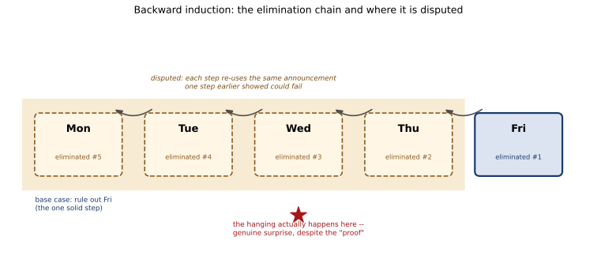

# ch17 — 意外絞刑悖論：一個沒辦法成真、卻成真了的預言

> **本章解決什麼問題**：Part V 這四章都掛著「共同知識與認識邏輯」的招牌，但它們其實分兩支。ch15（紅藍眼睛）與 ch16（泥巴小孩）是同一支：一群人互相看得見彼此、公開的一句話把「有人如此」從互知捅成共知。ch18（兩位將軍）也是這一支的變形：兩個陣營想靠信差把訊息捅成共知，卻怎麼捅都捅不到底。本章是另一支——**只有一個人、一句話，這句話談論的是這個人自己未來會不會知道某件事**。沒有第二個人、沒有互相看臉、沒有信差，卻一樣能把邏輯逼進死角。這一支的親戚是自我指涉（self-reference）與認識邏輯（epistemic logic），不是共同知識。開頭先把這個分家講清楚，你才不會拿 ch15 那套「數藍眼睛的人數」硬套過來。

## 從你已知的出發

設定很短，短到你會覺得不可能有陷阱。某個星期日晚上，法官對一名囚犯宣布兩件事：第一，你會在下星期一到星期五之間的某一天中午被處決；第二，你事先不會知道是哪一天——執行的那天早上，你才會知道，而在那之前，你沒有辦法用推理提前算出正確答案。囚犯回到牢房，開始想這件事。

多數人第一次聽到這個設定，直覺反應是這樣的：「這有什麼好想的，反正日子到了自然知道，法官愛哪天執行就哪天執行，囚犯乾等著就是了。」這個反應把法官的兩句話當成一句平淡的行政通知，覺得裡面沒有任何邏輯可以榨。這正是本章要拆穿的第一層自滿——它比其他章的「自信答案」更隱蔽，因為它甚至不覺得自己在下判斷，只是覺得「這句話沒什麼好推理的」。

但囚犯沒有這麼快放棄。他在牢房裡，靠純粹的邏輯推理——不需要任何額外資訊，只用法官說的這兩句話本身——推出了一個驚人的結論：這兩句話合起來，其實不可能同時為真。推理的方式是一條逆向的鏈子，從星期五往回一路推到星期一，每一天都被「排除」掉。等到五天全部排除完，囚犯得出結論：法官不可能兌現他的宣告，這場處決不會是意外的（甚至邏輯上不會發生）。囚犯很篤定，甚至可能因此鬆了一口氣。

然後呢？故事的後半段才是真正的刺：某個星期三中午，獄卒真的來了，囚犯真的被帶去處決——而且，他真的完全沒有預料到。那句「你不會事先知道是哪一天」，兌現了。囚犯剛剛才用滴水不漏的邏輯「證明」了這件事不可能發生，結果它就這樣發生了，而且發生的方式恰好符合法官的宣告。

這就是意外絞刑悖論（unexpected hanging paradox，也常以「突擊考試悖論」surprise examination paradox 的教室版本流傳）最讓人坐立難安的地方：它不是「直覺答錯、算出來的答案不一樣」這種結構（那是本書大多數章節的套路），而是「一條看起來每一步都對的邏輯鏈，導出了一個被現實直接推翻的結論」。錯的到底是哪一步？八十年來，這個問題沒有一個所有人都同意的答案。我們現在就把這條鏈完整地走一遍，看看它到底藏在哪裡讓人不安。

## 一句先講清楚的歷史帳：口傳、印刷、與從未有的共識

這個悖論的起源本身就是一團有待商榷的傳說。它最常被歸給瑞典數學家埃克博姆（Lennart Ekbom），據說源自 1943 或 1944 年瑞典電台一則關於「民防演習將在某個意外的日子舉行」的廣播——但這個歸屬沒有任何一手文獻能佐證，只是輾轉相傳的說法。有學者指出，這種「逆向消去」的推理架構，其實早在 1756 年一則德國民間故事裡就已經出現過雛形。老實說：這道題目在正式被寫成論文之前，很可能已經在數學系的走廊裡口耳相傳了好一陣子。

它第一次被印在正式的學術刊物上，是奧康納（D. J. O'Connor）1948 年發表在《心靈》（*Mind*）57 卷 227 期的一篇短文，設定是教室裡的一場「突擊測驗」，而不是監獄裡的絞刑——絞刑版本是後來才流行開的變體，兩個版本邏輯結構完全一樣，差別只是換了場景。奧康納本人當時的立場很乾脆：他認為法官（或老師）那句宣告，本身就是一句無法為真的話——某些關於未來的條件句，天生就自相矛盾，講出來就是空話。

這個立場立刻招來反對。史克萊文（Michael Scriven）1951 年在同一份期刊發表〈自相矛盾的宣告〉（"Paradoxical Announcements"，*Mind* 60 卷），指出關鍵之處：老師確實可以出一場測驗，而且確實能讓學生意外——這件事在現實裡完全做得到，奧康納「這句話講出來就自相矛盾、所以根本不可能發生」的論斷，跟眼前活生生能被執行出來的事實對不上。這篇短文一般被認為是把這個問題從「奧康納的一個小觀察」正式推成「一個需要被認真對待的悖論」的關鍵一步。

蒯因（W. V. O. Quine）1953 年在《心靈》62 卷 245 期發表〈論一個所謂的悖論〉（"On a So-called Paradox"），給出另一種診斷（下一節會完整攤開）。此後幾十年，這道題目在《心靈》《分析》（*Analysis*）等期刊裡持續有人投稿，馬丁·加德納（Martin Gardner）1963 年 3 月在《科學人》（*Scientific American*）的專欄把它介紹給更廣泛的讀者，後來收進他 1969 年的文集《意外絞刑及其他數學消遣》（*The Unexpected Hanging and Other Mathematical Diversions*）——這個書名後來幾乎成了這道悖論的代稱。丘（Timothy Chow）1998 年在《美國數學月刊》（*American Mathematical Monthly*）發表的綜述，把幾十年來各方立場做了一次系統整理。到今天，維基百科的條目和《史丹佛哲學百科全書》（*Stanford Encyclopedia of Philosophy*）的「認識論悖論」（Epistemic Paradoxes）條目，講的都是同一句話：**這個問題沒有公認的解法**。本章不打算違背這個事實硬湊一個「正解」出來——我們會把幾種最有份量的診斷攤開，讓你自己感受哪一種更能說服你，但誠實標明：這是一場活了八十年、至今沒有終點的爭論。

## 反向歸納：把五天的鏈完整走一遍

現在把囚犯星期日晚上腦子裡的推理，一步不跳地重建出來。法官的宣告有兩個部分，我們先把它們寫清楚，之後每一步都要靠這兩句話本身，不能偷渡任何額外資訊：

```text
宣告 A：處決會發生在下週一到週五（五個工作日）之中的某一天中午。
宣告 B：在執行日當天早上之前，囚犯無法用邏輯推理確定是哪一天
        （否則就不是「意外」）。
```

囚犯假設法官這兩句話都是真的（沒有理由不信，法官沒有說謊的動機被暗示在故事裡），然後純用邏輯把五天一個一個消去。

**第一步（排除星期五，這是整條鏈的基礎案例）**：假設處決一路拖到星期四中午都還沒發生。這時候，只剩星期五還在「這週」的範圍內，宣告 A 保證處決一定會發生在這五天之內，所以——如果活到星期四晚上還沒被處決——星期五早上，囚犯完全可以肯定：今天就是那一天。這已經是百分之百的推論，不是猜測。但這樣一來，星期五就不再符合宣告 B（早上之前無法確定）。既然宣告 A 和宣告 B 都必須為真，「處決在星期五、且是意外」這個組合就是自相矛盾的。於是：**星期五被排除**。

**第二步（排除星期四）**：現在，星期五已經被上一步排除掉了——注意，這是「已經證明」的結論，不是假設。於是這週真正可能發生處決的日子只剩星期一到星期四。用一模一樣的邏輯：假設處決一路拖到星期三中午都還沒發生。這時候剩下能選的日子只有星期四（星期五已經出局），囚犯星期三晚上就能百分之百確定：明天星期四就是那一天。這又違反了宣告 B。於是：**星期四也被排除**。

**第三步（排除星期三）**：星期四、星期五都已排除，剩下星期一到星期三。假設處決拖到星期二中午都還沒發生，星期三早上囚犯就能確定：只剩星期三符合宣告 A，今天一定是。違反宣告 B。**星期三被排除**。

**第四步（排除星期二）**：星期三、四、五都已排除，剩下星期一、星期二。假設處決拖到星期一中午都還沒發生，星期二早上就能確定只剩星期二。**星期二被排除**。

**第五步（排除星期一，鏈子收尾）**：星期二到星期五全部排除，宣告 A 說處決一定會發生在這五天之內，所以剩下的唯一候選就是星期一。但這個結論——「只剩星期一」——不需要等到星期日晚上以外的任何時間點才成立，它在星期日晚上、囚犯還沒開始這一週之前，就已經被前四步邏輯地鎖死了。也就是說，囚犯星期日晚上就能確定：處決一定在星期一，而且他星期日晚上就已經知道了。這違反宣告 B。**星期一也被排除**。

五天全部排除。囚犯的結論：法官宣告的那件事——「處決會發生，而且是意外的」——根本不可能同時成立。兩句話合起來是一句空話。

```text
排除順序（由後往前）：
  週五 → 週四 → 週三 → 週二 → 週一
  第1步   第2步   第3步   第4步   第5步
  （每一步都「借用」前一步剛排除掉的結論當前提）
```

這條鏈的每一步，單獨看都無懈可擊——都是一次乾淨的「若⋯則⋯，矛盾，所以不成立」。囚犯因此非常篤定：這五天沒有一天能讓法官的宣告成立，處決不會（以符合宣告的方式）發生。

但故事告訴我們：某個星期三中午，獄卒來了，囚犯被帶走，而且他確確實實感到意外——他前一晚根本沒想到「今天」。法官的宣告，原封不動地兌現了。剛剛那條「證明」看起來無懈可擊，卻被現實直接打臉。斷裂點，就藏在這條看似天衣無縫的鏈子裡的某一環——但究竟是哪一環，這正是八十年爭論的核心。

## 這條鏈為什麼「看起來」滴水不漏

在拆解斷裂點之前，值得先講清楚一件事：這條鏈為什麼會讓幾乎每個第一次看到它的人都覺得無可反駁。原因是它的形式，長得非常像我們在學校學到的數學歸納法（mathematical induction）——先證一個基礎案例（星期五），再證「如果第 n 天被排除，第 n−1 天也會被排除」這個歸納步驟，一路推到底。數學歸納法本身是完全嚴謹、毫無爭議的證明工具；當一條推理鏈套上這套外殼，我們的直覺會不自覺地把「這是歸納法」和「這一定是對的」劃上等號。

但這裡藏著一個關鍵差異：一般的數學歸納法處理的是一個客觀、不隨推理過程本身改變的性質（例如「n 個元素的集合有 2 的 n 次方個子集合」），你今天證、明天證，答案不會變。意外絞刑的鏈子處理的卻是一句話的真假——而這句話（宣告 B）談的正是「囚犯能不能用推理確定日期」，也就是**囚犯自己的推理能力，被拿來當作這句話真假的判準**。當你把「囚犯的推理」本身當成研究對象，卻又用囚犯的推理去研究它，你已經站在一個自我指涉（self-reference）的迴圈裡——這個迴圈的外觀可以偽裝成一條普通的歸納鏈，但它的內在結構跟「這句話是假的」（說謊者悖論）、跟哥德爾不完備定理裡「這句話在本系統內無法被證明」的那句自我指涉句，是同一個家族的親戚（本書不深入，有興趣的讀者可以接著讀《這句話無法被證明：哥德爾不完備定理的直覺與驚嘆》）。停機問題裡「一支程式判斷另一支程式會不會自己停下來」也是同一種結構在計算領域的化身。認出這個家族相似性，是理解為什麼這道題八十年沒有共識的第一步——它不是一道普通的邏輯練習題，是一句話在談論「你能不能靠推理知道它」，而這正是自我指涉最容易讓形式系統絆倒的地方。

## 斷點在哪裡：至少三種不同的診斷

正因為這是自我指涉的難題，不同學派把「哪一步出錯」指向了完全不同的地方。這裡誠實列出三種最有份量、彼此不相容的診斷——本章不替你選一個當標準答案，因為學界自己也還沒選出來。

**診斷一：奧康納 1948——這句宣告本身就是空話**。奧康納最早的立場是，某些關於未來的條件句根本無法為真（他的說法是「某些偶然的未來時態語句不可能成真」）。用這個角度看，整個五天的鏈子其實是多餘的裝飾——法官那句「會處決你、而且是意外的」，從一開始邏輯上就是自相矛盾的空話，就像「這句話是假的」一樣，講出來就沒有真假可言。這個立場的弱點，正是史克萊文 1951 年指出的那個：現實裡老師真的能出一場讓學生意外的測驗，法官真的能執行一場讓囚犯意外的死刑——這件事明明能被做到，奧康納卻說它邏輯上不可能發生，兩者對不上。

**診斷二：蒯因 1953——鏈子悄悄把「條件」換成了「事實」**。蒯因的診斷更細膩：他指出，囚犯排除星期五那一步，證明的其實只是一句條件句——「如果活到星期四晚上還沒被處決，星期五就不能是意外的一天」。這句條件句完全正確。但囚犯接下來把這句條件句當成一句無條件的事實使用——「所以星期五這一天『被排除了』，可以直接拿去當下一步（排除星期四）的前提」——這一步偷渡了東西。真正被證明的只是「萬一撐到星期四晚上，星期五就不合格」，而不是「星期五這個選項，從星期日晚上此刻起，就已經徹底出局」。蒯因認為，正是這個「條件句被誤當成事實句使用」的偷換，讓鏈子看起來能一路往回推到星期一，實際上每一步的「排除」都只在特定條件下成立，不能無條件地疊加起來。

**診斷三：邏輯派——把宣告本身形式化，它就是一句自相矛盾的句子**。以哲奇（Frederick Fitch）為代表的一派，主張把法官的宣告用嚴格的知識邏輯（epistemic logic）符號重新寫一遍——包括「囚犯知道」這個運算子——會發現這句宣告，一旦精確形式化，本身就構成一句邏輯上自相矛盾的句子（結構類似「這句話你無法提前知道它為真」這種自我指涉的知識宣稱）。從矛盾的前提出發，邏輯上什麼結論都能推出來（拉丁文說 *ex falso quodlibet*，「從假的東西可以推出任何東西」），所以那條「五天全部排除」的鏈子，其實是在一個已經矛盾的系統裡打轉，推出「不可能發生」這個結論本身沒有任何實質內容——它不告訴我們現實世界會不會發生處決，因為現實世界從來不需要對一句自相矛盾的形式宣告負責。這也連結上丘 1998 年綜述裡強調的一個更精細版本：鏈子最脆弱的環節其實在**第一步之前**——囚犯星期日晚上，憑什麼已經「知道」（在宣告 B 要求的那種強意義下）宣告 A 和宣告 B 這兩句話合起來是真的？這個「事先已經知道整句宣告為真」的假設，本身就已經預設了此後要證明的東西，是整條鏈真正的起點，卻從未被單獨檢查過。

三種診斷分別把矛頭指向：宣告本身（診斷一）、推理的中間步驟（診斷二）、以及宣告被形式化之後展現的自我指涉結構（診斷三）。它們彼此並不相容——選了診斷三，你不會同時接受診斷一。這正是為什麼《史丹佛哲學百科全書》和維基百科都只寫「無公認解法」，而不是替某一派背書。

## 那為什麼囚犯真的還是意外了

最後留一個問題：如果鏈子真的把宣告推成矛盾，那為什麼故事裡的囚犯，星期三真的還是被嚇到了？

這裡有一個值得玩味的迴圈：正是因為囚犯完成了那條「證明處決不可能是意外的」推理，並且相信了它，他才會在星期三完全放下戒心——既然邏輯上證明了不會發生，他就沒有理由天天早上提心吊膽地倒數。於是，當星期三獄卒真的出現時，他毫無防備，貨真價實地被嚇到了。換句話說：那條看似證明「意外不可能發生」的推理，恰恰創造了讓意外真的能夠發生的心理條件——囚犯對推理結論的信任，取代了他原本該有的警覺，而這個信任本身，正是宣告能夠兌現的原因。這不是在幫任何一種診斷背書，只是提醒你：這個悖論最詭異的地方，不是「囚犯的證明有一個技術性錯誤」，而是「就算你完全說不清楚錯在哪一步，這個證明的存在本身，反而是讓預言成真的推手之一」。這正是自我指涉命題最讓人不安的性格——它們談論的往往不只是外部世界的事實，還包括你相不相信它、以及你相信它之後會怎麼行動。

## 直覺的陷阱

回頭看本章開頭那兩種反應：一開始「這沒什麼好推理的」的自滿，以及後來「五天都排除了，所以不可能發生」的篤定。把這整套錯覺拆開來看：

| 階段 | 發生了什麼 |
|---|---|
| 直覺的自信答案 | 「反正日子到了自然知道」（第一層自滿）；或者「我已經用邏輯把五天全部排除了，所以不可能是意外的」（第二層篤定，看起來像一次成功的證明） |
| 偷渡的假設 | 把法官那句「你不會事先知道是哪一天」，當成一個像「明天會不會下雨」那樣、可以被囚犯的推理過程單純算出真假、而且算出來的真假不會反過來影響推理本身的普通事實 |
| 為什麼聽起來理所當然 | 排除星期五、星期四⋯每一步單獨看都是標準、無懈可擊的邏輯推論，長得跟數學歸納法一模一樣，很容易讓人相信「每一步都對，所以整條鏈都對」 |
| 在哪一步被帶溝裡 | 不同診斷指向不同地方——但共通點是：這句宣告談論的正是「囚犯自己會不會知道」，而囚犯又用他自己的推理去判定這句話的真假，這個自我指涉的迴圈，讓「排除」這個動作本身在鏈條往回推的過程裡，悄悄從「有條件才成立的推論」，被當成了「無條件成立的既定事實」繼續往下用 |
| 怎麼自我察覺 | 每次看到一句話宣稱「你無法提前知道 X」，先檢查：這句話是不是在談論「你（或某個推理者）對這句話本身的認知狀態」？如果是，你手上這條看似普通的邏輯鏈，很可能已經站在自我指涉的迴圈裡，套上歸納法外殼的鏈子不能直接信任，需要先問「排除某一天」這件事，到底是在什麼條件下成立的、這個條件是不是被悄悄拿掉了 |

> **那句沒說出口的話是**：我們把「你事先不會知道是哪一天」這句話，當成一件像天氣一樣、能被你的推理過程徹底算清楚、而且算出來的答案不會回頭影響這句話本身真假的普通事實——卻沒發現它談論的正是你自己會不會知道它，這是一句自我指涉的可知性宣告，不是一件擺在外面、任你推理去解的中性事實。



## 紙上推演

**練習 1（★，10 分鐘）**：把本章五天版的反向歸納，改寫成三天版（法官只說「下週一到週三之間某一天」）。完整列出排除順序與每一步的理由，並確認結論同樣是「三天全部排除」。

**練習 2（★★，15 分鐘）**：如果法官把宣告改成「處決會發生在下週一到週五之間的某一天，而且**你到執行當天中午之前**都不會知道是哪一天」（把「當天早上」改成「當天中午」——也就是允許處決前幾個小時才揭曉），反向歸納的鏈子是否仍然成立？找出鏈子裡哪一步依賴「早上」與「中午」的具體時間點，哪一步不依賴。

**練習 3（★★★，20 分鐘）**：本章列出蒯因（診斷二）與邏輯派（診斷三）兩種對「斷點在哪裡」的診斷。分別用你自己的話，各寫三句話重新講一次這兩種診斷各自認為「錯在哪一步」，並指出：如果你接受診斷二，你會不會同時也接受診斷三？為什麼兩者其實互相排斥？

### 推演解答

**練習 1 解答**：三天版設定——法官星期日晚上宣告：「處決會發生在下週一、二、三之中的某一天，你事先不會知道是哪一天」。

```text
第一步（基礎案例，排除週三）：
  若撐到週二中午都沒發生，週三是唯一剩下的候選，
  週二晚上就能百分之百確定週三是那一天 → 違反「不會事先知道」→ 週三排除。

第二步（排除週二）：
  週三已排除，若撐到週一中午都沒發生，週二是唯一剩下的候選，
  週一晚上就能確定 → 違反「不會事先知道」→ 週二排除。

第三步（排除週一，鏈子收尾）：
  週二、三皆已排除，法官保證處決發生在這三天之內，
  唯一剩下的候選是週一——這個結論在週日晚上就已成立，
  囚犯週日晚上就「知道」是週一 → 違反「不會事先知道」→ 週一排除。
```

三天全部排除，結構跟五天版完全一樣，只是少了兩層。這說明鏈子的長度（五天、三天，甚至換成一年 365 天）不影響論證的形式——這是判斷「這個悖論的核心跟具體天數無關」的一個直接證據：天數只是這個悖論的舞台道具，不是它的變數。

**練習 2 解答**：把揭曉時間從「當天早上」改成「當天中午」（也就是幾乎跟處決同時揭曉），鏈子的每一步用的都是「如果撐到前一天結束都沒發生，剩下唯一候選日，囚犯就能提前確定」這個邏輯，這個邏輯完全不依賴「揭曉」發生在早上還是中午——真正被引用的，只是「五個工作日」跟「唯一剩下候選日」這兩件事，時間點的具體位置（早上／中午／甚至前一天晚上）並不影響鏈子的形式結構。換句話說：把「早上」改成「中午」，五天版反向歸納鏈的五個步驟完全不用修改，一樣可以走完，一樣排除五天。這正好呼應本章開頭的提醒——「星期四」這種具體日子只是範例，時間點的具體設定也只是舞台道具，悖論的骨架不靠它們撐起來。

**練習 3 解答**：蒯因的診斷（診斷二）認為錯在**推理的中間步驟**——囚犯把「若撐到某天前都沒發生，某天就能被排除」這句條件句，誤當成「某天已經被無條件排除」的事實句，一路往回疊加使用；邏輯本身沒有毛病，毛病在於「條件句被偷換成事實句」這個具體的、可以指出在哪一行發生的操作錯誤。邏輯派的診斷（診斷三）則認為錯在**宣告本身**——一旦把「你事先不會知道」這種自我指涉的知識宣稱用嚴格符號重寫，宣告 A 加宣告 B 合起來根本就是一句形式上自相矛盾的句子，鏈子的每一步推理其實都在一個已經矛盾的系統裡打轉，談「哪一步操作錯了」沒有意義，因為從矛盾出發，任何操作都「合法」，卻也都沒有實質內容。這兩種診斷互相排斥：如果你接受診斷三（宣告本身矛盾、推理從一開始就在空轉），你就不會再去追究蒯因說的那個「條件句被換成事實句」的具體步驟——因為如果起點已經矛盾，根本不必、也不能再細究中間某一步操作是否合法；反過來，如果你接受蒯因的診斷（推理鏈本身有一步可以被具體指出的操作錯誤），你就已經承認宣告本身不矛盾、鏈子是在一個一致的系統裡運作，只是某一步走岔了——這跟診斷三的前提直接衝突。

## 自我檢核

1. 為什麼本章一開頭要先說明「這一章跟 ch15、ch16、ch18 不是同一種共同知識悖論」？如果不先講清楚，讀者最容易把哪個工具誤套進來？
2. 反向歸納的第一步（排除星期五）為什麼被普遍認為是「唯一沒有爭議的一步」？它跟後面幾步在結構上有什麼不同？
3. 用你自己的話講一次蒯因的診斷：「條件句被偷換成事實句」具體發生在哪一個步驟，換成事實句之後又被怎麼使用？
4. 為什麼「這條鏈長得像數學歸納法」這件事，反而是讓人更難發現破綻的原因，而不是讓人安心的理由？
5. 如果法官换成「一年三百六十五天之中的某一天」，反向歸納的形式會不會改變？天數的多寡在這個悖論裡扮演什麼角色？
6. 「囚犯相信了證明、因此放鬆警覺、因此真的被嚇到」這個迴圈，跟本章討論的三種「斷點診斷」是同一件事嗎，還是完全不同層次的觀察？
7. 這個悖論那句沒說出口的假設是什麼？請用一句話講給沒讀過這章的人聽，讓對方聽完能點頭說「對，我剛剛也是這樣想的」。
8. 為什麼本章要老實說「至今無公認解」，而不是挑一種診斷當作正解教給讀者？這種誠實標示，對你理解這個悖論本身有沒有幫助？

## 延伸閱讀

- 〈Unexpected hanging paradox〉，Wikipedia——設定的兩種版本（絞刑／突擊考試）、反向歸納鏈的標準敘述、以及「邏輯派」與「認識論派」兩條回應路線的總覽，並明白寫出「無公認解法」。<https://en.wikipedia.org/wiki/Unexpected_hanging_paradox>
- 〈Epistemic Paradoxes〉，《史丹佛哲學百科全書》（*Stanford Encyclopedia of Philosophy*）——把本章這道題放進更大的認識論悖論家族裡討論，適合想看它跟其他自我指涉難題如何互相呼應的讀者。<https://plato.stanford.edu/entries/epistemic-paradoxes/>
- Chow, T. Y. (1998). "The Surprise Examination or Unexpected Hanging Paradox." *The American Mathematical Monthly*, 105(1), 41–51；作者維護的公開版本附完整書目——這是本章三種診斷之外，最完整的一份文獻綜述，適合想追完整八十年爭論脈絡的讀者。<https://timothychow.net/unexpected.pdf>
- Quine, W. V. O. (1953). "On a So-called Paradox." *Mind*, 62(245), 65–67——本章診斷二的原始出處，篇幅極短，讀起來比想像中直接。（未提供公開全文連結，圖書館資料庫可查）
- Gardner, M. (1969). *The Unexpected Hanging and Other Mathematical Diversions*. University of Chicago Press——把這道題目介紹給大眾讀者的經典文集，書名後來成了這個悖論最通行的英文代稱。（未驗證是否有免費公開全文）
